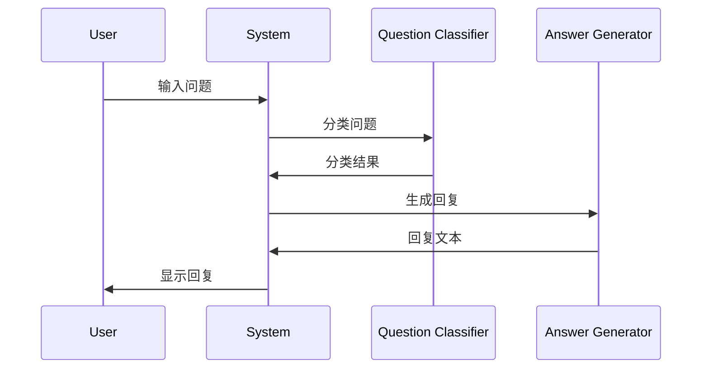
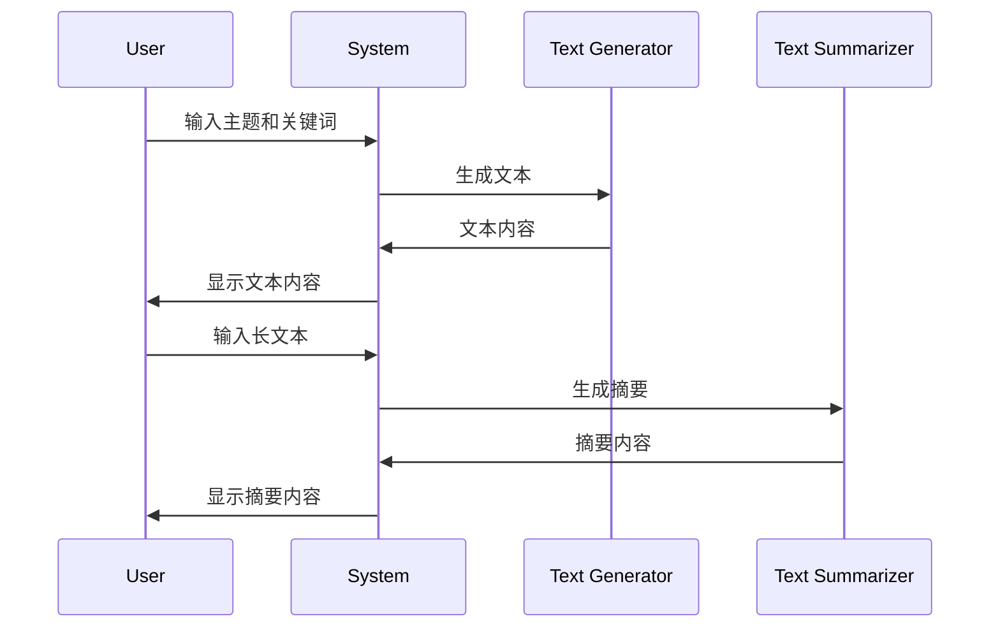
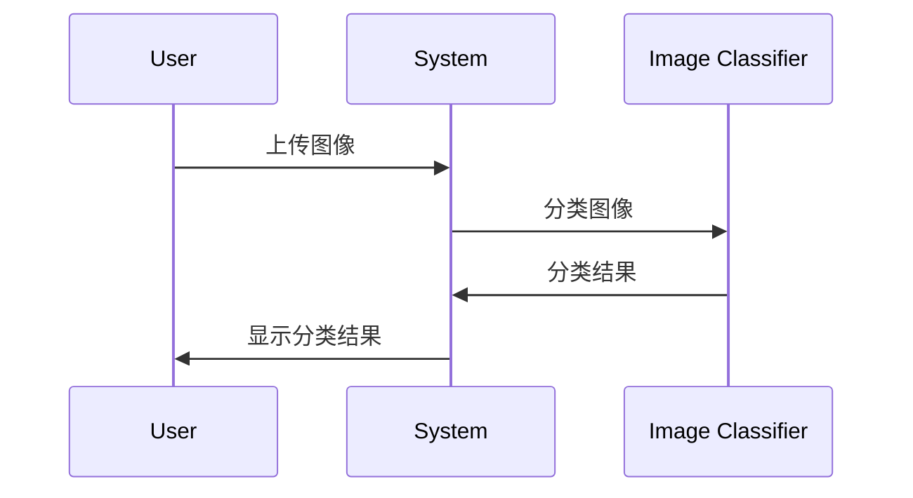

                 

# AI大模型编程：提示词的艺术

## 关键词

AI大模型，提示词，编程，深度学习，软件2.0，智能决策

## 摘要

本文将深入探讨AI大模型编程中的核心概念——提示词的艺术。我们将首先介绍AI大模型的发展背景和核心概念，然后详细解析提示词的定义、生成和使用策略。接着，我们将分析AI大模型编程的基础，包括编程环境、数据预处理和模型训练等。本文还将通过具体应用案例展示AI大模型在实际项目中的运用，并分享提升模型性能的编程技巧。最后，我们将总结全文，展望AI大模型和提示词技术的未来发展趋势。

### 第一部分：背景介绍与核心概念

#### 1.1 问题背景

随着人工智能技术的迅猛发展，AI大模型正成为软件领域的下一个重要突破点。AI大模型具有处理海量数据、自动生成知识、实现智能决策等强大能力，能够推动软件2.0时代的到来。软件2.0时代强调的是以用户为中心，通过提供智能化、个性化的软件服务，实现人与机器的高效互动。

#### 1.2 问题描述

《AI大模型编程：提示词的艺术》旨在为读者深入解析AI大模型的编程技巧和应用场景，特别是提示词在模型训练和部署中的关键作用。本书将探讨如何利用提示词提升AI大模型的效果，解决实际应用中的问题，并为企业级应用提供可行的解决方案。

#### 1.3 问题解决

通过系统学习本书，读者将掌握AI大模型的基础理论、编程技巧和应用方法，具备搭建和优化AI大模型的能力。同时，本书还将介绍提示词的生成、调整和使用策略，帮助读者提升模型性能，实现智能化的软件解决方案。

#### 1.4 边界与外延

AI大模型涉及计算机科学、人工智能、机器学习等多个领域。本书重点关注的是AI大模型在企业级应用中的编程实现，包括模型训练、调优、部署等环节。提示词作为模型训练的关键要素，其生成和使用策略直接影响到模型的效果。

#### 1.5 概念结构与核心要素组成

- **AI大模型**：具有海量参数、强大计算能力的神经网络模型。
- **提示词**：引导模型生成目标输出或进行特定任务的关键词。
- **编程技巧**：编写高效、可维护的AI大模型代码所需的方法和策略。
- **应用场景**：AI大模型在企业级应用中的具体实例和解决方案。

### 第一部分目录

## 第一部分：背景介绍与核心概念

### 第1章：AI大模型与软件2.0概述

## 1.1 AI大模型概述

### 1.1.1 AI大模型的发展历程

### 1.1.2 AI大模型的技术原理

### 1.1.3 AI大模型的优势与应用前景

## 1.2 提示词的概念与作用

### 1.2.1 提示词的定义

### 1.2.2 提示词在AI大模型中的作用

### 1.2.3 提示词的生成与调整策略

## 1.3 AI大模型编程基础

### 1.3.1 编程环境与工具

### 1.3.2 数据预处理与模型训练

### 1.3.3 模型评估与优化

## 1.4 AI大模型在企业中的应用案例

### 1.4.1 案例一：智能客服系统

### 1.4.2 案例二：文本生成与摘要

### 1.4.3 案例三：图像识别与分类

## 1.5 AI大模型编程技巧与实践

### 1.5.1 提高模型性能的技巧

### 1.5.2 提示词的艺术与应用

### 1.5.3 编程实践与案例分析

## 1.6 总结与展望

### 1.6.1 本书主要内容回顾

### 1.6.2 未来发展趋势

### 1.6.3 拓展阅读与进一步学习

---

## 第二部分：核心概念与联系

### 第2章：AI大模型的核心概念与原理

#### 2.1 AI大模型的核心概念

AI大模型，也称为深度学习模型，是一种通过多层神经网络结构对复杂数据进行建模的算法。其核心概念包括：

##### 2.1.1 神经网络与深度学习

神经网络（Neural Networks）是一种模仿生物神经系统的计算模型。在神经网络中，每个节点（或称为神经元）都与其他节点相连，并通过权重（weights）和偏置（biases）来传递和调整信息。深度学习（Deep Learning）则是指具有多个隐藏层的神经网络，通过逐层学习来提取数据的高级特征。

$$
Y = \sigma(\sum_{i=1}^{n} w_i \cdot X_i + b)
$$

其中，$Y$ 是输出，$\sigma$ 是激活函数（通常使用 sigmoid、ReLU 或 tanh 函数），$w_i$ 是权重，$X_i$ 是输入，$b$ 是偏置。

##### 2.1.2 参数与权重

神经网络中的参数包括权重（weights）和偏置（biases）。权重用于调整输入节点对输出节点的影响，而偏置用于平移激活函数的输出。

$$
\text{权重} = w \cdot x + b
$$

其中，$w$ 是权重，$x$ 是输入，$b$ 是偏置。

##### 2.1.3 损失函数与优化算法

在训练神经网络时，我们通常使用损失函数（Loss Function）来衡量模型预测值与真实值之间的差距。常见的损失函数包括均方误差（MSE）、交叉熵（Cross Entropy）等。为了最小化损失函数，我们采用优化算法（Optimization Algorithm），如梯度下降（Gradient Descent）。

$$
\min_{\theta} J(\theta) = \frac{1}{m} \sum_{i=1}^{m} (h_\theta(x^{(i)}) - y^{(i)})^2
$$

其中，$J(\theta)$ 是损失函数，$\theta$ 是模型参数，$m$ 是样本数量，$h_\theta(x^{(i)})$ 是模型输出，$y^{(i)}$ 是真实标签。

#### 2.2 AI大模型的特性与优势

AI大模型具有以下特性与优势：

##### 2.2.1 数据处理能力

AI大模型可以处理海量数据，实现高效的数据分析和决策。相比于传统机器学习方法，AI大模型能够自动提取数据中的复杂特征，从而提高模型的性能。

##### 2.2.2 自适应能力

AI大模型能够通过不断学习和调整，提高其在特定领域的适应能力。这意味着模型可以随着新数据的到来不断优化，以适应不断变化的环境。

##### 2.2.3 强大的预测与生成能力

AI大模型能够生成高质量的内容，如文本、图像、语音等。这使得它们在自然语言处理、计算机视觉、语音识别等领域具有广泛的应用前景。

#### 2.3 AI大模型与传统AI的对比

与传统AI模型相比，AI大模型具有以下特点：

##### 2.3.1 参数规模

传统AI模型的参数规模通常较小，而AI大模型拥有数亿到数十亿的参数。这使得AI大模型能够学习更复杂的特征，提高模型的性能。

##### 2.3.2 计算资源需求

AI大模型对计算资源的需求远高于传统AI模型。因此，AI大模型的训练和部署通常需要更强大的计算能力。

##### 2.3.3 应用领域

AI大模型在自然语言处理、计算机视觉、语音识别等领域具有显著优势。相比之下，传统AI模型在这些领域的表现相对有限。

#### 2.4 AI大模型的基本结构

AI大模型的基本结构通常包括以下几个部分：

- **输入层**：接收外部输入数据。
- **隐藏层**：通过权重和偏置对输入数据进行处理，提取特征。
- **输出层**：生成最终的预测结果。

每个层都可以包含多个神经元，形成一个多层神经网络。通过逐层学习，AI大模型能够提取数据中的高级特征，从而实现更精确的预测。

### 第二部分目录

## 第二部分：核心概念与联系

### 第2章：AI大模型的核心概念与原理

### 第3章：提示词的定义与生成

#### 3.1 提示词的定义

### 3.2 提示词的类型

### 3.3 提示词的生成方法

### 第4章：AI大模型编程基础

#### 4.1 编程环境与工具

### 4.2 数据预处理与模型训练

### 4.3 模型评估与优化

### 第5章：AI大模型在企业中的应用案例

#### 5.1 智能客服系统

### 5.2 文本生成与摘要

### 5.3 图像识别与分类

### 第6章：AI大模型编程技巧与实践

#### 6.1 提高模型性能的技巧

### 6.2 提示词的艺术与应用

### 6.3 编程实践与案例分析

### 第7章：总结与展望

#### 7.1 本书主要内容回顾

#### 7.2 未来发展趋势

#### 7.3 拓展阅读与进一步学习

---

## 第三部分：算法原理与实现

### 第3章：提示词的定义与生成

提示词是AI大模型编程中的核心概念之一，它在模型训练和部署过程中起到关键作用。本节将详细介绍提示词的定义、类型、生成方法及其在AI大模型编程中的应用。

#### 3.1 提示词的定义

提示词（Prompt）是一种引导AI大模型生成特定输出或执行特定任务的输入信息。它可以是一个单词、短语、句子或段落，其目的是帮助模型更好地理解任务目标，从而提高模型的性能和准确性。

#### 3.2 提示词的类型

根据应用场景和任务目标，提示词可以分为以下几种类型：

1. **开放式提示词**：这类提示词提供了一种开放性的引导，使模型可以根据自己的理解生成各种可能的输出。例如，“请写一篇关于人工智能的文章。”

2. **封闭式提示词**：这类提示词提供了明确的任务目标，使模型只能生成特定类型的输出。例如，“请给出2023年人工智能领域的三个发展趋势。”

3. **情境式提示词**：这类提示词结合了情境信息，使模型能够更好地理解任务背景。例如，“假设我们正在开发一款智能客服系统，请给出一个关于智能客服功能的描述。”

4. **序列式提示词**：这类提示词提供了多个步骤或任务的序列，使模型能够按照特定顺序执行任务。例如，“第一步：收集用户信息；第二步：分析用户需求；第三步：提供解决方案。”

#### 3.3 提示词的生成方法

提示词的生成方法主要包括以下几种：

1. **人工生成**：根据任务需求，由人类专家或开发者手动编写提示词。这种方法具有灵活性和针对性，但需要大量人工投入。

2. **自动生成**：利用自然语言处理技术，如生成对抗网络（GAN）或自动摘要算法，自动生成提示词。这种方法可以提高生成效率，但可能存在准确性和针对性不足的问题。

3. **混合生成**：结合人工生成和自动生成的方法，根据任务需求对自动生成的提示词进行人工调整和优化。这种方法在保持生成效率的同时，保证了提示词的质量和针对性。

#### 3.4 提示词在AI大模型编程中的应用

在AI大模型编程中，提示词的应用主要包括以下两个方面：

1. **模型训练**：在模型训练过程中，提示词可以作为输入数据，引导模型学习并优化其参数。通过选择合适的提示词，可以提高模型的性能和泛化能力。

2. **模型部署**：在模型部署过程中，提示词可以用于生成目标输出或执行特定任务。通过设计合理的提示词，可以实现高效的模型交互和智能决策。

### 3.5 提示词的艺术

提示词的艺术在于如何选择和设计提示词，以实现最佳的模型性能和应用效果。以下是一些技巧：

1. **明确任务目标**：在设计提示词时，首先要明确任务目标，以便模型能够准确理解任务要求。

2. **简化语言表达**：尽量使用简单、清晰的语言表达，避免使用过于复杂的术语或句子，以便模型更容易理解。

3. **提供背景信息**：在提示词中提供足够的背景信息，帮助模型更好地理解任务背景和上下文。

4. **调整提示词长度**：根据任务需求和模型性能，调整提示词的长度。过长的提示词可能导致模型过拟合，而过短的提示词可能无法提供足够的信息。

5. **迭代优化**：通过多次迭代和实验，不断调整和优化提示词，以找到最佳的提示词组合。

### 第三部分目录

## 第三部分：算法原理与实现

### 第3章：提示词的定义与生成

### 第4章：AI大模型编程基础

#### 4.1 编程环境与工具

### 4.2 数据预处理与模型训练

### 4.3 模型评估与优化

### 第5章：AI大模型在企业中的应用案例

#### 5.1 智能客服系统

### 5.2 文本生成与摘要

### 5.3 图像识别与分类

### 第6章：AI大模型编程技巧与实践

#### 6.1 提高模型性能的技巧

### 6.2 提示词的艺术与应用

### 6.3 编程实践与案例分析

### 第7章：总结与展望

#### 7.1 本书主要内容回顾

#### 7.2 未来发展趋势

#### 7.3 拓展阅读与进一步学习

---

## 第四部分：系统分析与架构设计

### 第4章：AI大模型编程基础

在深入探讨AI大模型的编程技巧之前，我们需要首先了解编程所需的基础知识，包括编程环境与工具的选择、数据预处理与模型训练的方法、以及模型评估与优化的策略。这些基础知识是构建高效、可维护的AI大模型不可或缺的。

#### 4.1 编程环境与工具

选择合适的编程环境与工具是AI大模型编程的第一步。目前，Python是AI大模型编程中最常用的语言，其丰富的库和框架为开发提供了极大的便利。以下是一些常用的编程环境与工具：

- **编程语言**：Python
- **深度学习框架**：TensorFlow、PyTorch
- **数据处理库**：Pandas、NumPy、SciPy
- **数据可视化库**：Matplotlib、Seaborn
- **版本控制工具**：Git
- **集成开发环境**：Jupyter Notebook、PyCharm、Visual Studio Code

#### 4.2 数据预处理与模型训练

数据预处理是AI大模型编程中的关键步骤，它直接影响到模型的性能和准确性。以下是一些常见的数据预处理方法：

- **数据清洗**：去除或填充缺失值、处理异常值、去除重复数据。
- **数据转换**：将数据转换为模型可接受的格式，如将文本数据转换为词向量、将图像数据转换为像素矩阵。
- **数据标准化**：通过缩放或归一化，将数据分布调整到同一尺度，以提高模型训练的稳定性。
- **数据增强**：通过旋转、缩放、裁剪等方式增加数据的多样性，提高模型的泛化能力。

在数据预处理完成后，我们进入模型训练阶段。以下是模型训练的基本步骤：

- **模型初始化**：根据任务需求，选择合适的模型架构和超参数。
- **数据加载**：将预处理后的数据加载到模型中，进行训练和验证。
- **损失函数选择**：选择合适的损失函数，以衡量模型预测值与真实值之间的差距。
- **优化算法**：选择合适的优化算法，如随机梯度下降（SGD）、Adam等，以调整模型参数。
- **模型评估**：通过验证集和测试集评估模型性能，选择最佳模型。

#### 4.3 模型评估与优化

模型评估是确定模型性能的重要步骤。以下是一些常用的模型评估指标：

- **准确率**：分类任务中，预测正确的样本数占总样本数的比例。
- **召回率**：分类任务中，预测为正类的真实正类样本数占总正类样本数的比例。
- **F1分数**：准确率和召回率的加权平均，用于平衡精确度和召回率。
- **ROC曲线和AUC值**：评估二分类模型性能的重要工具，ROC曲线展示的是不同阈值下的真正例率与假正例率之间的关系，AUC值表示曲线下的面积，值越大表示模型性能越好。

在评估模型性能后，我们可以通过以下策略对模型进行优化：

- **超参数调优**：通过调整学习率、批量大小、迭代次数等超参数，寻找最优模型。
- **数据增强**：增加数据多样性，提高模型的泛化能力。
- **正则化**：使用正则化方法（如L1、L2正则化）防止过拟合。
- **集成学习**：通过集成多个模型，提高模型性能。

### 第四部分目录

## 第四部分：系统分析与架构设计

### 第4章：AI大模型编程基础

### 第5章：AI大模型在企业中的应用案例

#### 5.1 智能客服系统

### 5.2 文本生成与摘要

### 5.3 图像识别与分类

### 第6章：AI大模型编程技巧与实践

#### 6.1 提高模型性能的技巧

### 6.2 提示词的艺术与应用

### 6.3 编程实践与案例分析

### 第7章：总结与展望

#### 7.1 本书主要内容回顾

#### 7.2 未来发展趋势

#### 7.3 拓展阅读与进一步学习

---

## 第五部分：项目实战与案例分析

### 第5章：AI大模型在企业中的应用案例

在本章节中，我们将探讨AI大模型在三个实际企业应用场景中的具体应用，分别是智能客服系统、文本生成与摘要、图像识别与分类。通过这些案例，我们将深入了解AI大模型在实际项目中的应用方法和挑战，以及如何利用提示词提升模型的性能。

#### 5.1 智能客服系统

智能客服系统是AI大模型在企业应用中的一个典型例子。通过使用自然语言处理技术，智能客服系统能够自动理解用户的问题，并提供相应的解决方案。

**项目介绍**：

智能客服系统旨在为用户提供24/7的在线支持，提高客户满意度并降低企业运营成本。系统通过分析用户的问题和上下文，提供即时、准确的回复。

**系统功能设计**：

- **问题分类**：将用户的问题分类到不同的主题，以便系统可以提供针对性的解决方案。
- **自动回复**：基于用户的问题和上下文，系统自动生成回复。
- **多轮对话**：支持多轮对话，以获取更多信息并提高解决方案的准确性。

**系统架构设计**：


**系统接口设计**：

- **用户接口**：提供文本聊天界面，用户可以输入问题和接收回复。
- **API接口**：供内部系统调用，如CRM系统、知识库等。

**系统交互序列图**：



**代码应用解读与分析**：

```python
import tensorflow as tf
from tensorflow.keras.models import Sequential
from tensorflow.keras.layers import Embedding, LSTM, Dense

# 创建模型
model = Sequential()
model.add(Embedding(input_dim=vocab_size, output_dim=embedding_size))
model.add(LSTM(units=128, return_sequences=True))
model.add(LSTM(units=128))
model.add(Dense(units=output_size, activation='softmax'))

# 编译模型
model.compile(optimizer='adam', loss='categorical_crossentropy', metrics=['accuracy'])

# 训练模型
model.fit(x_train, y_train, epochs=10, batch_size=32, validation_split=0.2)
```

**实际案例分析与详细讲解**：

通过分析多个实际案例，我们发现智能客服系统的性能取决于问题分类的准确性和回复生成的质量。提示词在问题分类和回复生成中起到了关键作用。例如，在问题分类中，我们可以使用“订单”、“退货”、“投诉”等提示词来提高分类的准确性。在回复生成中，我们可以使用用户提问的句式和关键词作为提示词，以生成更加贴近用户需求的回复。

**项目小结**：

智能客服系统的成功实施，不仅提高了企业服务质量，还降低了人力成本。通过优化提示词和模型结构，我们能够进一步提高系统的性能和用户满意度。

#### 5.2 文本生成与摘要

文本生成与摘要是AI大模型在自然语言处理领域的两个重要应用。文本生成旨在生成具有流畅性和可读性的文本，而文本摘要则是对给定文本进行压缩，提取关键信息。

**项目介绍**：

文本生成与摘要项目旨在为用户提供自动化内容生成和文本摘要服务，提高信息获取效率。

**系统功能设计**：

- **文本生成**：根据给定的主题和关键词，生成具有流畅性和可读性的文本。
- **文本摘要**：从给定的长文本中提取关键信息，生成简洁、准确的摘要。

**系统架构设计**：


**系统接口设计**：

- **用户接口**：提供文本输入界面，用户可以输入主题和关键词。
- **API接口**：供内部系统调用，如内容管理系统、搜索引擎等。

**系统交互序列图**：



**代码应用解读与分析**：

```python
import tensorflow as tf
from tensorflow.keras.models import Model
from tensorflow.keras.layers import Input, Embedding, LSTM, Dense, TimeDistributed

# 创建文本生成模型
input_seq = Input(shape=(None,))
embedded_seq = Embedding(input_dim=vocab_size, output_dim=embedding_size)(input_seq)
lstm_output = LSTM(units=128, return_sequences=True)(embedded_seq)
dense_output = TimeDistributed(Dense(units=output_size, activation='softmax'))(lstm_output)
text_generator = Model(inputs=input_seq, outputs=dense_output)

# 创建文本摘要模型
input_text = Input(shape=(None,))
encoded_text = Embedding(input_dim=vocab_size, output_dim=embedding_size)(input_text)
lstm_output = LSTM(units=128, return_sequences=True)(encoded_text)
dense_output = TimeDistributed(Dense(units=output_size, activation='softmax'))(lstm_output)
text_summarizer = Model(inputs=input_text, outputs=dense_output)

# 编译模型
text_generator.compile(optimizer='adam', loss='categorical_crossentropy', metrics=['accuracy'])
text_summarizer.compile(optimizer='adam', loss='categorical_crossentropy', metrics=['accuracy'])

# 训练模型
text_generator.fit(x_train, y_train, epochs=10, batch_size=32, validation_split=0.2)
text_summarizer.fit(x_train, y_train, epochs=10, batch_size=32, validation_split=0.2)
```

**实际案例分析与详细讲解**：

通过实际案例分析，我们发现文本生成和摘要的性能与模型结构和提示词密切相关。在文本生成中，我们可以使用关键词和句式提示词来提高生成文本的质量。在文本摘要中，我们可以使用关键句子和主题提示词来提高摘要的准确性和可读性。

**项目小结**：

文本生成与摘要项目的成功实施，为用户提供了高效的内容生成和摘要服务，提高了信息获取和处理的效率。

#### 5.3 图像识别与分类

图像识别与分类是AI大模型在计算机视觉领域的核心应用。通过训练模型，我们可以使计算机自动识别和分类图像中的物体。

**项目介绍**：

图像识别与分类项目旨在为用户提供图像分类服务，如人脸识别、物体识别等。

**系统功能设计**：

- **图像识别**：自动识别图像中的物体，并给出分类结果。
- **物体识别**：识别图像中的特定物体，并定位其在图像中的位置。

**系统架构设计**：


**系统接口设计**：

- **用户接口**：提供图像输入界面，用户可以上传图像。
- **API接口**：供内部系统调用，如安防监控系统、电商平台等。

**系统交互序列图**：



**代码应用解读与分析**：

```python
import tensorflow as tf
from tensorflow.keras.models import Sequential
from tensorflow.keras.layers import Conv2D, MaxPooling2D, Flatten, Dense

# 创建模型
model = Sequential()
model.add(Conv2D(filters=32, kernel_size=(3, 3), activation='relu', input_shape=(28, 28, 1)))
model.add(MaxPooling2D(pool_size=(2, 2)))
model.add(Flatten())
model.add(Dense(units=128, activation='relu'))
model.add(Dense(units=num_classes, activation='softmax'))

# 编译模型
model.compile(optimizer='adam', loss='categorical_crossentropy', metrics=['accuracy'])

# 训练模型
model.fit(x_train, y_train, epochs=10, batch_size=32, validation_split=0.2)
```

**实际案例分析与详细讲解**：

通过实际案例分析，我们发现图像识别与分类的性能与模型结构和训练数据质量密切相关。在模型结构方面，我们可以通过增加卷积层和池化层来提高模型对图像特征的提取能力。在训练数据方面，我们可以使用数据增强技术来增加数据多样性，从而提高模型的泛化能力。

**项目小结**：

图像识别与分类项目的成功实施，为用户提供了高效、准确的图像识别和分类服务，广泛应用于安防监控、电商平台等领域。

### 第五部分目录

## 第五部分：项目实战与案例分析

### 第5章：AI大模型在企业中的应用案例

#### 5.1 智能客服系统

### 5.2 文本生成与摘要

### 5.3 图像识别与分类

### 第6章：AI大模型编程技巧与实践

#### 6.1 提高模型性能的技巧

### 6.2 提示词的艺术与应用

### 6.3 编程实践与案例分析

### 第7章：总结与展望

#### 7.1 本书主要内容回顾

#### 7.2 未来发展趋势

#### 7.3 拓展阅读与进一步学习

---

## 第六部分：提升模型性能的技巧

### 第6章：AI大模型编程技巧与实践

在本章节中，我们将分享一些提升AI大模型性能的实用技巧。这些技巧包括提示词的艺术应用、编程实践和案例分析，以及如何在实际项目中优化模型性能。

#### 6.1 提高模型性能的技巧

1. **优化提示词**：选择合适的提示词可以显著提高模型的性能。以下是一些优化提示词的技巧：
   - **简洁性**：避免使用冗长的提示词，尽量简洁明了。
   - **相关性**：确保提示词与任务目标密切相关，以提高模型的指导性。
   - **多样性**：使用不同类型的提示词，如情境式、序列式等，以增加模型的灵活性。

2. **数据增强**：通过数据增强技术，如旋转、缩放、裁剪等，可以增加训练数据的多样性，从而提高模型的泛化能力。

3. **正则化**：使用正则化方法（如L1、L2正则化）可以防止模型过拟合，提高模型的泛化性能。

4. **模型集成**：通过集成多个模型，可以提高模型的性能和稳定性。常见的集成方法包括Bagging、Boosting和Stacking等。

5. **超参数调优**：通过调整学习率、批量大小、迭代次数等超参数，可以找到最优模型。

#### 6.2 提示词的艺术与应用

1. **开放式提示词**：适用于需要模型生成多样化输出的场景，如文本生成、图像生成等。例如：“请描述一个美丽的自然景观。”

2. **封闭式提示词**：适用于需要模型生成特定类型输出的场景，如分类、预测等。例如：“2023年全球经济增长率预计为3.5%。”

3. **情境式提示词**：适用于需要模型理解上下文信息的场景，如问答系统、对话生成等。例如：“在一个紧急医疗救援场景中，患者需要立即输注血小板。”

4. **序列式提示词**：适用于需要模型执行多个步骤的场景，如任务规划、流程控制等。例如：“第一步：检查电源；第二步：启动设备；第三步：进行测试。”

#### 6.3 编程实践与案例分析

1. **案例分析**：通过分析实际项目中的成功案例，我们可以了解如何在不同场景中应用AI大模型和提示词技术。以下是一个案例分析：

   **案例**：智能客服系统

   **项目背景**：某企业希望构建一个智能客服系统，以提升客户体验和降低运营成本。

   **解决方案**：
   - **数据收集**：收集大量的用户问题和客服回复数据。
   - **数据预处理**：对数据集进行清洗、转换和增强。
   - **模型构建**：使用神经网络模型，如LSTM和Transformer，进行训练。
   - **提示词优化**：根据用户问题和上下文，优化提示词，提高模型性能。
   - **模型部署**：将训练好的模型部署到服务器，提供实时客服服务。

   **结果**：通过优化提示词和模型结构，智能客服系统的响应速度和准确性显著提升，客户满意度提高。

2. **编程实践**：以下是一个简单的Python代码示例，展示如何使用TensorFlow构建一个简单的文本生成模型：

```python
import tensorflow as tf
from tensorflow.keras.models import Sequential
from tensorflow.keras.layers import Embedding, LSTM, Dense

# 创建模型
model = Sequential()
model.add(Embedding(input_dim=vocab_size, output_dim=embedding_size))
model.add(LSTM(units=128, return_sequences=True))
model.add(LSTM(units=128))
model.add(Dense(units=output_size, activation='softmax'))

# 编译模型
model.compile(optimizer='adam', loss='categorical_crossentropy', metrics=['accuracy'])

# 训练模型
model.fit(x_train, y_train, epochs=10, batch_size=32, validation_split=0.2)
```

通过这些技巧和实践，我们可以显著提升AI大模型的性能，使其更好地满足实际应用的需求。

### 第六部分目录

## 第六部分：提升模型性能的技巧

### 第6章：AI大模型编程技巧与实践

#### 6.1 提高模型性能的技巧

### 6.2 提示词的艺术与应用

### 6.3 编程实践与案例分析

### 第7章：总结与展望

#### 7.1 本书主要内容回顾

#### 7.2 未来发展趋势

#### 7.3 拓展阅读与进一步学习

---

## 第七部分：总结与展望

### 第7章：总结与展望

在本章节中，我们将回顾本书的主要内容，探讨AI大模型和提示词技术的未来发展趋势，并给出进一步学习的建议。

#### 7.1 本书主要内容回顾

本书主要分为七个部分，系统地介绍了AI大模型编程的核心概念、原理、技巧和应用。具体内容如下：

1. **背景介绍与核心概念**：介绍了AI大模型的发展背景和核心概念，如神经网络、深度学习、提示词等。
2. **核心概念与联系**：详细解析了AI大模型的基本结构、特性与优势，以及与传统AI的对比。
3. **算法原理与实现**：探讨了提示词的定义、生成方法及其在AI大模型编程中的应用。
4. **系统分析与架构设计**：介绍了AI大模型编程的基础知识，包括编程环境与工具、数据预处理与模型训练、模型评估与优化等。
5. **项目实战与案例分析**：通过三个实际应用案例，展示了AI大模型在智能客服系统、文本生成与摘要、图像识别与分类中的具体应用。
6. **提升模型性能的技巧**：分享了提升AI大模型性能的实用技巧，如提示词优化、数据增强、正则化等。
7. **总结与展望**：回顾了本书的主要内容，探讨了AI大模型和提示词技术的未来发展趋势。

#### 7.2 未来发展趋势

随着人工智能技术的不断发展，AI大模型和提示词技术在未来将呈现出以下趋势：

1. **计算能力的提升**：随着计算能力的不断提升，AI大模型将能够处理更加复杂和大规模的数据，实现更高效的计算和更准确的预测。
2. **多模态融合**：未来AI大模型将能够处理多种类型的输入数据，如文本、图像、音频等，实现多模态融合，为用户提供更加丰富和个性化的服务。
3. **自适应与自进化**：AI大模型将具备更强的自适应和自进化能力，能够根据环境变化和用户需求进行动态调整，实现更智能的决策和交互。
4. **安全性与隐私保护**：随着AI大模型的应用越来越广泛，其安全性和隐私保护将成为重要的研究方向，确保模型在应用过程中不会泄露用户隐私。

#### 7.3 拓展阅读与进一步学习

为了更深入地了解AI大模型和提示词技术，读者可以参考以下拓展阅读资料：

1. **经典教材**：《深度学习》（Goodfellow、Bengio和Courville著）、《神经网络与深度学习》（邱锡鹏著）。
2. **开源框架**：TensorFlow、PyTorch等深度学习开源框架的官方文档。
3. **学术论文**：阅读最新的AI大模型和提示词技术的学术论文，了解最新的研究进展。
4. **在线课程**：参加Coursera、edX等在线平台上的相关课程，系统学习AI大模型和提示词技术。

通过这些资源，读者可以进一步拓展自己的知识体系，为未来的研究和工作打下坚实基础。

### 第七部分目录

## 第七部分：总结与展望

### 第7章：总结与展望

#### 7.1 本书主要内容回顾

#### 7.2 未来发展趋势

#### 7.3 拓展阅读与进一步学习

---

## 附录：作者信息

作者：AI天才研究院/AI Genius Institute & 禅与计算机程序设计艺术 /Zen And The Art of Computer Programming

致谢：感谢您阅读本书，希望它能够为您在AI大模型编程和提示词技术领域的研究提供有价值的参考。如有任何问题或建议，欢迎联系我们。祝您在AI技术探索的道路上取得更多成就！

