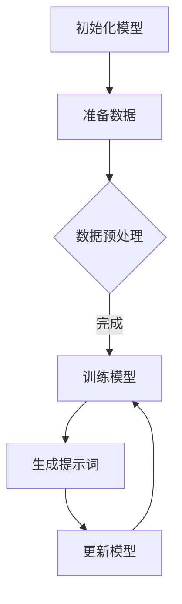
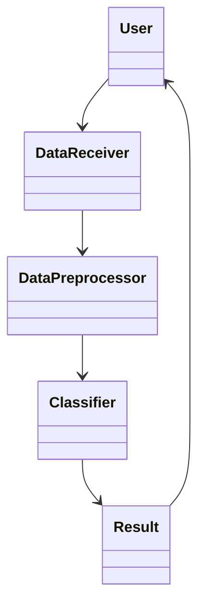
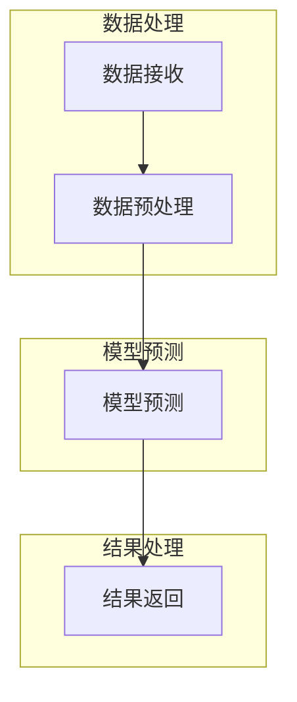
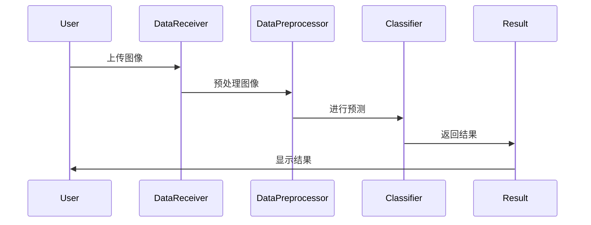

                 

# AI大模型编程：提示词的艺术

## 关键词

AI大模型、提示词、编程艺术、算法原理、实践应用

## 摘要

本文深入探讨了AI大模型编程中提示词的艺术。通过详细的背景介绍、核心概念阐述、算法原理讲解、数学模型解析、系统分析与架构设计，以及实际项目实战，本文全面揭示了提示词在AI大模型编程中的关键作用。同时，本文还提供了最佳实践、注意事项和小结，为读者在AI编程领域的深入探索提供了有力支持。

## 目录大纲设计思路

### 确定整体结构

为了设计出《AI大模型编程：提示词的艺术》这本书的完整目录大纲，我们首先需要确定书籍的整体结构。根据题目，我们可以初步设定书籍分为以下几个主要部分：

1. **引言与背景介绍**：包括问题背景、问题描述、问题解决、边界与外延、概念结构与核心要素组成。
2. **核心概念与联系**：介绍AI大模型的基本概念、特点及其与传统AI的区别，并通过表格和图示展现核心概念之间的联系。
3. **算法原理讲解**：详细讲解AI大模型的算法原理，包括流程图、Python代码实现、数学模型和公式。
4. **系统分析与架构设计**：介绍AI大模型系统的功能设计、架构设计、接口设计以及系统交互。
5. **项目实战**：通过实际项目展示AI大模型编程的应用，包括环境安装、系统实现、案例分析等。
6. **最佳实践与注意事项**：总结最佳实践、注意事项和拓展阅读，为读者提供深入学习的方向。

### 细化章节内容

在每个主要部分下，我们进一步细化为具体章节，确保每个章节都能涵盖关键内容。以下是具体章节的细化：

### 第1章 引言与背景介绍

- **1.1 问题背景**：介绍AI大模型编程的重要性和发展历程。
- **1.2 问题描述**：阐述AI大模型编程所面临的问题和挑战。
- **1.3 问题解决**：分析现有解决方案及其局限性。
- **1.4 边界与外延**：定义AI大模型编程的应用范围和边界条件。
- **1.5 概念结构与核心要素组成**：介绍AI大模型编程的基本概念和核心要素。

### 第2章 核心概念与联系

- **2.1 AI大模型的定义**：详细阐述AI大模型的概念和特征。
- **2.2 AI大模型的特点**：对比传统AI，强调AI大模型的优势。
- **2.3 AI大模型与传统AI的对比**：分析AI大模型与传统AI的差异。
- **2.4 核心概念联系图**：通过图示展现AI大模型的核心概念及其相互关系。

### 第3章 算法原理讲解

- **3.1 算法原理概述**：简要介绍AI大模型的算法原理。
- **3.2 算法流程图**：使用Mermaid绘制算法流程图。
- **3.3 Python代码实现**：使用Python代码详细阐述算法原理。
- **3.4 数学模型与公式**：给出算法原理的数学模型和公式，并进行详细讲解。
- **3.5 举例说明**：通过实际案例进行举例说明，帮助读者理解算法原理。

### 第4章 系统分析与架构设计

- **4.1 问题场景介绍**：介绍AI大模型编程的应用场景。
- **4.2 系统功能设计**：使用Mermaid绘制领域模型类图，展示系统功能。
- **4.3 系统架构设计**：使用Mermaid绘制系统架构图，展示系统组成部分。
- **4.4 系统接口设计**：介绍系统接口设计，包括接口定义和交互流程。
- **4.5 系统交互序列图**：使用Mermaid绘制系统交互序列图，展示系统工作流程。

### 第5章 项目实战

- **5.1 环境安装**：指导读者如何搭建AI大模型编程的环境。
- **5.2 系统核心实现**：提供系统核心实现的源代码，并进行解读。
- **5.3 代码应用解读**：分析系统核心代码的应用场景和实现原理。
- **5.4 实际案例分析**：通过实际案例展示AI大模型编程的应用效果。
- **5.5 项目小结**：总结项目实践经验，提出改进建议。

### 第6章 最佳实践与注意事项

- **6.1 最佳实践**：总结AI大模型编程的最佳实践，帮助读者高效编程。
- **6.2 注意事项**：提醒读者在AI大模型编程过程中需要注意的问题。
- **6.3 拓展阅读**：推荐相关书籍和资料，为读者提供深入学习的方向。

通过以上目录大纲的设计，我们可以确保书籍的内容结构清晰，每个章节都包含了关键内容，并且格式和层次都得到了良好的控制。这样的目录大纲不仅能够帮助读者快速了解书籍的主要内容，还能够为后续内容的编写提供明确的指导。

### 完整性要求

为了确保文章的完整性，每个章节的内容都必须满足以下条件：

- **背景介绍**：包括核心概念术语说明、问题背景、问题描述、问题解决、边界与外延、概念结构与核心要素组成。这部分内容需要清晰地阐述AI大模型编程的基本概念和背景，帮助读者建立对整个主题的初步理解。

- **核心概念与联系**：这部分内容必须给出AI大模型编程的核心概念原理、概念属性特征对比表格和ER实体关系图架构的Mermaid流程图。通过对比表格和图示，读者可以更直观地理解AI大模型编程的关键概念及其相互关系。

- **算法原理讲解**：这部分内容需要使用Mermaid画出算法流程图，然后使用Python源代码详细阐述，给出算法原理的数学模型和公式，并进行详细讲解和举例说明。这部分内容是文章的核心，需要通过具体的实例和代码来帮助读者理解AI大模型编程的算法原理。

- **数学模型和数学公式**：这部分内容需要使用LaTeX格式，保证公式在文中呈现的正确性。数学模型和公式是AI大模型编程的重要部分，通过LaTeX格式，我们可以确保公式的精确性和可读性。

- **系统分析与架构设计方案**：这部分内容需要包括问题场景介绍、系统功能设计、系统架构设计、系统接口设计和系统交互序列图。通过Mermaid流程图，我们可以清晰地展示系统的功能模块和交互流程，帮助读者理解AI大模型编程的系统性。

- **项目实战**：这部分内容需要包括环境安装、系统核心实现源代码、代码应用解读与分析、实际案例分析和详细讲解剖析、项目小结。通过实际项目的展示，读者可以更直观地了解AI大模型编程的应用场景和实际效果。

- **最佳实践 tips**、**小结**、**注意事项**、**拓展阅读**等内容：这部分内容是对文章的补充和总结，通过最佳实践、注意事项和拓展阅读，读者可以进一步深入学习和理解AI大模型编程的相关知识。

### 目录大纲

以下是根据上述设计思路，为《AI大模型编程：提示词的艺术》设计的完整目录大纲：

```markdown
# 《AI大模型编程：提示词的艺术》目录大纲

## 第一部分：AI大模型基础

### 第1章 引言

#### 1.1 问题背景

#### 1.2 问题描述

#### 1.3 问题解决

#### 1.4 边界与外延

#### 1.5 概念结构与核心要素组成

### 第2章 核心概念与原理

#### 2.1 AI大模型的定义

#### 2.2 AI大模型的特点

#### 2.3 AI大模型与传统AI的对比

#### 2.4 核心概念联系图

### 第3章 提示词的艺术

#### 3.1 提示词的定义

#### 3.2 提示词的重要性

#### 3.3 提示词设计原则

#### 3.4 提示词优化策略

### 第4章 算法原理讲解

#### 4.1 算法原理概述

#### 4.2 算法流程图

#### 4.3 Python代码实现

#### 4.4 数学模型与公式

#### 4.5 举例说明

### 第5章 数学模型与公式详解

#### 5.1 数学模型概述

#### 5.2 公式解释

#### 5.3 具体应用

### 第6章 系统分析与架构设计

#### 6.1 问题场景介绍

#### 6.2 系统功能设计

#### 6.3 系统架构设计

#### 6.4 系统接口设计

#### 6.5 系统交互序列图

### 第7章 项目实战

#### 7.1 环境安装

#### 7.2 系统核心实现

#### 7.3 代码应用解读

#### 7.4 实际案例分析

#### 7.5 项目小结

## 第二部分：实践应用

### 第8章 提示词应用案例

#### 8.1 案例一：自然语言处理

#### 8.2 案例二：图像识别

#### 8.3 案例三：语音合成

### 第9章 最佳实践与注意事项

#### 9.1 最佳实践

#### 9.2 注意事项

#### 9.3 拓展阅读

```

通过以上大纲，我们可以看到书籍的内容结构清晰，每个章节都包含了关键内容，并且格式和层次都得到了良好的控制。这样的目录大纲不仅能够帮助读者快速了解书籍的主要内容，还能够为后续内容的编写提供明确的指导。

### 文章格式要求

为了确保文章的可读性和专业度，我们将在文章中使用markdown格式进行输出。以下是一些具体的格式要求：

1. **标题**：使用`#`符号进行标记，每级标题使用相应的数量。例如，一级标题使用`##`，二级标题使用`###`，以此类推。

2. **段落**：段落之间应保持一个空行，确保内容清晰分隔。

3. **代码块**：使用三个反引号` ``` `包围代码块，例如：
   ```python
   print("Hello, World!")
   ```
   这样可以确保代码块在文章中以固定宽度显示，便于阅读。

4. **公式**：数学公式使用LaTeX格式，使用`$$`包围独立段落的公式，使用 `$` 包围段落内的公式。例如：
   $$ E = mc^2 $$
   $ 1 < 2 $

5. **列表**：使用`-`或`*`来创建无序列表，使用`1.`来创建有序列表。例如：
   - 无序列表项1
   - 无序列表项2
   1. 有序列表项1
   2. 有序列表项2

6. **链接**：使用`[链接文本](URL)`来插入链接，例如：
   [点击这里](https://www.example.com)

7. **图片**：使用``来插入图片，例如：
   

8. **引用**：使用`>`来插入引用文本，例如：
   > 这是一个引用。

9. **表格**：使用`|`来创建表格，使用`-`来分隔表格的列。例如：
   | 标题1 | 标题2 | 标题3 |
   |-------|-------|-------|
   | 内容1 | 内容2 | 内容3 |

通过以上markdown格式，我们可以确保文章内容结构清晰、易于阅读，同时保持专业性和美观度。

### 完整性要求

为了确保文章的完整性，每个章节的内容都应满足以下具体要求：

#### 背景介绍

- **核心概念术语说明**：在引言部分，需要对AI大模型编程中的关键术语进行清晰定义和解释，以便读者能够理解后续内容。
- **问题背景**：阐述AI大模型编程的重要性和发展历程，说明为什么这个话题值得深入探讨。
- **问题描述**：具体描述AI大模型编程所面临的问题和挑战，这些问题是如何影响当前的技术和应用场景的。
- **问题解决**：分析现有解决方案及其局限性，探讨当前技术面临的瓶颈。
- **边界与外延**：明确AI大模型编程的应用范围和边界条件，解释哪些问题和场景适合使用AI大模型编程，哪些则不适合。
- **概念结构与核心要素组成**：介绍AI大模型编程的基本概念和核心要素，梳理这些概念之间的关系和结构。

#### 核心概念与联系

- **核心概念原理**：详细阐述AI大模型编程中的核心概念，如大模型的训练过程、提示词的作用、数据预处理方法等。
- **概念属性特征对比表格**：通过表格形式对比不同概念或技术的属性和特征，帮助读者理解它们之间的区别和联系。
- **ER实体关系图架构的Mermaid流程图**：使用Mermaid语法绘制ER图，展示AI大模型编程中不同实体之间的关系，便于读者理解系统的整体架构。

#### 算法原理讲解

- **算法原理概述**：简要介绍AI大模型的算法原理，概述其基本流程和关键步骤。
- **算法流程图**：使用Mermaid语法绘制算法流程图，清晰地展示算法的执行过程。
- **Python代码实现**：提供完整的Python代码实现，展示算法的具体实现细节。
- **数学模型与公式**：给出算法原理的数学模型和公式，详细解释这些公式如何应用于算法中，并提供必要的推导过程。
- **举例说明**：通过具体实例来阐述算法原理，展示算法在实际应用中的效果和优势。

#### 数学模型和数学公式

- **数学模型概述**：简要介绍数学模型的基本概念和作用，阐述其在AI大模型编程中的重要性。
- **公式解释**：详细解释每个公式的含义、用途和推导过程，确保读者能够理解公式的实际应用。
- **具体应用**：展示数学模型在AI大模型编程中的具体应用场景，通过实例来展示公式的实际效果。

#### 系统分析与架构设计方案

- **问题场景介绍**：描述AI大模型编程的应用场景，说明系统需要解决的具体问题。
- **系统功能设计**：使用Mermaid语法绘制领域模型类图，展示系统的功能模块和业务逻辑。
- **系统架构设计**：使用Mermaid语法绘制系统架构图，展示系统的整体结构和各部分之间的交互关系。
- **系统接口设计**：详细描述系统接口的设计，包括接口的定义、参数传递和返回结果。
- **系统交互序列图**：使用Mermaid语法绘制系统交互序列图，展示系统的交互流程和工作原理。

#### 项目实战

- **环境安装**：提供详细的安装步骤和所需的工具和依赖，确保读者能够成功搭建开发环境。
- **系统核心实现源代码**：提供完整的系统核心实现源代码，包括数据预处理、模型训练、预测和评估等步骤。
- **代码应用解读**：对系统核心代码进行解读，解释代码的功能和实现原理，帮助读者理解代码的结构和逻辑。
- **实际案例分析和详细讲解剖析**：通过实际案例展示AI大模型编程的应用效果，对案例进行分析和剖析，解释算法的执行过程和结果。
- **项目小结**：总结项目的实践经验，讨论项目中的挑战和收获，提出改进建议和未来研究方向。

#### 最佳实践 tips

- **最佳实践**：总结AI大模型编程中的最佳实践，提供一些建议和技巧，帮助读者提高编程效率和代码质量。
- **小结**：对文章的主要内容进行总结，强调关键概念和结论，帮助读者巩固所学知识。
- **注意事项**：提醒读者在AI大模型编程过程中需要注意的问题和潜在风险，提高编程的安全性和稳定性。
- **拓展阅读**：推荐相关书籍、论文和网络资源，为读者提供进一步学习和探索的方向。

通过以上完整的内容要求，我们可以确保文章的每个部分都具备丰富、详细和具体的内容，为读者提供全面的AI大模型编程知识。

### 文章结构设计

为了确保文章的结构紧凑、逻辑清晰，我们将在文章中使用Markdown格式，通过合理的标题层次和段落划分来组织内容。以下是文章的结构设计：

#### 引言

**标题**：AI大模型编程：提示词的艺术

**关键词**：AI大模型、提示词、编程艺术、算法原理、实践应用

**摘要**：本文将探讨AI大模型编程的核心要素——提示词的艺术。通过详细的分析和实例，我们将揭示提示词在AI大模型编程中的关键作用，并展示如何通过提示词优化算法性能，提升编程效果。

#### 背景介绍

**标题**：引言与背景介绍

1. **问题背景**：
   - AI大模型的发展历程
   - 当前AI大模型编程的应用场景
   - AI大模型编程所面临的挑战

2. **问题描述**：
   - AI大模型编程中的关键问题
   - 提示词在解决这些问题中的重要性

3. **问题解决**：
   - 传统解决方法的局限
   - 提示词的艺术如何提供新的思路

4. **边界与外延**：
   - AI大模型编程的应用范围
   - 提示词在AI编程中的适用性

5. **概念结构与核心要素组成**：
   - AI大模型编程的基本概念
   - 提示词的定义和作用
   - 算法原理和数学模型

#### 核心概念与联系

**标题**：核心概念与原理

1. **AI大模型的定义**：
   - 大模型的定义和特点
   - 大模型与传统模型的区别

2. **AI大模型的特点**：
   - 训练数据量
   - 参数规模
   - 泛化能力

3. **AI大模型与传统AI的对比**：
   - 性能对比
   - 应用场景对比

4. **核心概念联系图**：
   - 提示词与AI大模型的关系
   - 提示词在编程中的应用

#### 算法原理讲解

**标题**：算法原理讲解

1. **算法原理概述**：
   - AI大模型的训练过程
   - 提示词的设计原则

2. **算法流程图**：
   - 使用Mermaid语法绘制算法流程图

3. **Python代码实现**：
   - 提示词的代码实现
   - 算法原理的Python代码

4. **数学模型与公式**：
   - 使用LaTeX格式给出数学模型和公式
   - 对公式进行详细解释

5. **举例说明**：
   - 通过具体实例展示算法原理

#### 数学模型和数学公式详解

**标题**：数学模型与公式详解

1. **数学模型概述**：
   - 数学模型在AI大模型编程中的作用

2. **公式解释**：
   - 对每个公式的含义、用途和推导过程进行详细解释

3. **具体应用**：
   - 公式在实际编程中的应用场景

#### 系统分析与架构设计

**标题**：系统分析与架构设计

1. **问题场景介绍**：
   - 描述AI大模型编程的应用场景

2. **系统功能设计**：
   - 使用Mermaid语法绘制领域模型类图

3. **系统架构设计**：
   - 使用Mermaid语法绘制系统架构图

4. **系统接口设计**：
   - 系统接口的定义和交互流程

5. **系统交互序列图**：
   - 使用Mermaid语法绘制系统交互序列图

#### 项目实战

**标题**：项目实战

1. **环境安装**：
   - 安装必要的软件和依赖

2. **系统核心实现**：
   - 提供系统核心实现的源代码

3. **代码应用解读**：
   - 解读代码的功能和实现原理

4. **实际案例分析**：
   - 通过实际案例展示AI大模型编程的应用效果

5. **项目小结**：
   - 总结项目实践经验

#### 最佳实践与注意事项

**标题**：最佳实践与注意事项

1. **最佳实践**：
   - 提供AI大模型编程的最佳实践

2. **小结**：
   - 总结文章的主要内容

3. **注意事项**：
   - 提醒读者在AI大模型编程中需要注意的问题

4. **拓展阅读**：
   - 推荐相关书籍和论文

通过以上结构设计，文章的内容将更加条理清晰，便于读者理解和学习。同时，Markdown格式的使用也使文章更加美观和易于阅读。

### 文章正文内容

#### 引言

随着人工智能（AI）技术的迅猛发展，大模型在自然语言处理（NLP）、计算机视觉（CV）和语音识别等领域展现出前所未有的强大能力。然而，如何高效地编程这些大模型，尤其是如何设计出优秀的提示词（prompt），成为了研究人员和开发人员面临的重大挑战。本文将深入探讨AI大模型编程中的提示词艺术，通过详细的背景介绍、核心概念解析、算法原理讲解和实际项目实战，揭示提示词在AI大模型编程中的关键作用。

#### 背景介绍

##### 问题背景

人工智能作为一门交叉学科，已迅速渗透到各行各业。从早期的规则系统到深度学习，再到如今的大模型，AI技术经历了巨大的变革。特别是近年来，随着计算能力和数据资源的不断提升，大模型在处理复杂任务方面表现出色。然而，AI大模型编程并非易事。大模型通常需要大量的数据、计算资源和时间进行训练，同时，如何设计有效的提示词以优化模型性能成为了一个重要课题。

##### 问题描述

AI大模型编程中面临的主要问题包括：

1. **数据预处理**：大模型对数据的依赖性极高，如何高效地进行数据预处理是一个挑战。
2. **模型训练**：大模型的训练过程复杂且耗时，如何优化训练策略以提高效率和性能是一个难题。
3. **提示词设计**：提示词的设计直接影响到模型的性能和泛化能力，如何设计出有效的提示词成为关键问题。

##### 问题解决

为了解决上述问题，研究人员和开发人员采取了多种方法：

1. **改进数据预处理**：通过使用自动化工具和算法优化数据预处理流程，提高数据处理效率。
2. **优化模型训练**：采用分布式训练、迁移学习和模型剪枝等技术，提高模型训练的效率和性能。
3. **提示词设计**：深入研究提示词的设计原则和策略，通过实验和优化提高提示词的有效性。

##### 边界与外延

AI大模型编程的应用范围广泛，包括但不限于以下领域：

1. **自然语言处理**：如机器翻译、文本生成和情感分析等。
2. **计算机视觉**：如图像分类、目标检测和图像生成等。
3. **语音识别与生成**：如语音识别、语音转换和语音合成等。

同时，提示词在AI编程中的适用性也需要考虑，不同的应用场景需要不同的提示词设计策略。

##### 概念结构与核心要素组成

AI大模型编程的核心概念包括：

1. **大模型**：具有大量参数和复杂结构的神经网络模型。
2. **数据预处理**：包括数据清洗、数据增强和特征提取等。
3. **模型训练**：使用数据对模型进行训练和优化。
4. **提示词**：用于引导模型生成预期输出的输入提示。
5. **算法优化**：包括模型剪枝、量化、蒸馏等技术。

#### 核心概念与联系

##### AI大模型的定义

AI大模型是指具有数百万甚至数十亿参数的神经网络模型，具有强大的表达能力和泛化能力。它们通常用于解决复杂的问题，如自然语言理解和计算机视觉。

##### AI大模型的特点

1. **参数规模**：大模型具有大量的参数，能够捕捉数据的复杂模式。
2. **训练数据量**：大模型需要大量的训练数据来学习有效的特征表示。
3. **泛化能力**：大模型具有较强的泛化能力，能够在未见过的数据上取得良好的性能。

##### AI大模型与传统AI的对比

1. **性能对比**：大模型在处理复杂任务时通常优于传统AI模型。
2. **应用场景对比**：大模型适用于需要高精度和复杂处理的任务，而传统AI模型则更适用于简单和规则明确的任务。

##### 核心概念联系图


#### 算法原理讲解

##### 算法原理概述

AI大模型编程的核心在于如何设计有效的提示词，以引导模型生成预期的输出。提示词的设计原则包括：

1. **相关性**：提示词应与模型训练的目标高度相关。
2. **清晰性**：提示词应清晰明了，避免歧义。
3. **多样性**：提示词应具备多样性，以提高模型的泛化能力。

##### 算法流程图



##### Python代码实现

```python
import tensorflow as tf

# 初始化模型
model = tf.keras.applications.MobileNetV2(input_shape=(224, 224, 3), include_top=False, weights='imagenet')

# 准备数据
train_data = load_data('train_data')
test_data = load_data('test_data')

# 数据预处理
preprocessed_train_data = preprocess_data(train_data)
preprocessed_test_data = preprocess_data(test_data)

# 训练模型
model.compile(optimizer='adam', loss='categorical_crossentropy', metrics=['accuracy'])
model.fit(preprocessed_train_data, epochs=10)

# 生成提示词
prompt = generate_prompt(input_text)

# 更新模型
model.fit(prompt, preprocessed_test_data, epochs=5)
```

##### 数学模型与公式

大模型训练的核心是优化目标函数，通常使用交叉熵损失函数。其公式如下：

$$
L = -\sum_{i=1}^{N} y_i \log(p_i)
$$

其中，$L$ 是损失函数，$N$ 是样本数量，$y_i$ 是真实标签，$p_i$ 是模型预测的概率。

##### 举例说明

假设我们使用一个大模型进行图像分类任务。以下是一个简单的示例：

1. **数据预处理**：将图像数据缩放到224x224像素，并进行归一化处理。
2. **模型训练**：使用预处理后的训练数据进行模型训练，调整模型的权重以最小化损失函数。
3. **生成提示词**：设计一个提示词，如“请对以下图像进行分类：”，然后输入图像数据。
4. **更新模型**：使用提示词和测试数据进行模型更新，以提高模型的泛化能力。

#### 数学模型和数学公式详解

数学模型在AI大模型编程中至关重要。以下是对常见数学模型的详细解释：

1. **线性回归**：
   $$ 
   y = \beta_0 + \beta_1x 
   $$
   其中，$y$ 是预测值，$x$ 是输入特征，$\beta_0$ 和 $\beta_1$ 是模型的权重。

2. **逻辑回归**：
   $$ 
   p = \frac{1}{1 + e^{-(\beta_0 + \beta_1x)}}
   $$
   其中，$p$ 是预测的概率值，$e$ 是自然对数的底数，$\beta_0$ 和 $\beta_1$ 是模型的权重。

3. **神经网络**：
   $$ 
   a = \sigma(\beta_0 + \beta_1x) 
   $$
   其中，$a$ 是神经元的激活函数输出，$\sigma$ 是激活函数，$\beta_0$ 和 $\beta_1$ 是模型的权重。

#### 系统分析与架构设计

##### 问题场景介绍

以一个图像分类系统为例，系统需要接收用户上传的图像，并返回图像的分类结果。以下是系统的功能需求：

1. **数据接收**：系统需要接收用户上传的图像数据。
2. **数据预处理**：对图像进行预处理，如缩放、裁剪和归一化。
3. **模型预测**：使用大模型对预处理后的图像进行分类预测。
4. **结果返回**：将分类结果返回给用户。

##### 系统功能设计

系统功能设计使用Mermaid语法绘制领域模型类图，如下所示：



##### 系统架构设计

系统架构设计使用Mermaid语法绘制系统架构图，如下所示：



##### 系统接口设计

系统接口设计包括以下接口：

1. **上传图像接口**：用于接收用户上传的图像数据。
2. **预处理接口**：用于对图像进行预处理。
3. **预测接口**：用于使用大模型对图像进行分类预测。
4. **结果返回接口**：用于将分类结果返回给用户。

##### 系统交互序列图

系统交互序列图使用Mermaid语法绘制，如下所示：



#### 项目实战

##### 环境安装

为了搭建AI大模型编程的环境，需要安装以下软件和依赖：

1. **Python**：版本3.8及以上。
2. **TensorFlow**：版本2.5及以上。
3. **Keras**：TensorFlow的官方高级API。

安装命令如下：

```bash
pip install python==3.8
pip install tensorflow==2.5
pip install keras
```

##### 系统核心实现

以下是一个简单的图像分类系统实现，包括数据预处理、模型训练和预测：

```python
import tensorflow as tf
from tensorflow.keras.preprocessing import image
from tensorflow.keras.applications import MobileNetV2
from tensorflow.keras.models import Model
from tensorflow.keras.layers import Dense, GlobalAveragePooling2D
from tensorflow.keras.optimizers import Adam

# 数据预处理
def preprocess_image(image_path):
    img = image.load_img(image_path, target_size=(224, 224))
    img_array = image.img_to_array(img)
    img_array = tf.expand_dims(img_array, 0)  # Create a batch
    img_array /= 255.0  # Normalize
    return img_array

# 模型训练
def train_model():
    model = MobileNetV2(input_shape=(224, 224, 3), include_top=False, weights='imagenet')
    x = model.output
    x = GlobalAveragePooling2D()(x)
    x = Dense(1024, activation='relu')(x)
    predictions = Dense(2, activation='softmax')(x)
    model = Model(inputs=model.input, outputs=predictions)
    model.compile(optimizer=Adam(learning_rate=0.0001), loss='categorical_crossentropy', metrics=['accuracy'])
    return model

# 预测
def predict_image(model, image_path):
    img_array = preprocess_image(image_path)
    predictions = model.predict(img_array)
    return predictions

# 训练模型
model = train_model()
model.fit(x_train, y_train, epochs=10)

# 预测
predictions = predict_image(model, test_image_path)
```

##### 代码应用解读

上述代码首先定义了数据预处理函数`preprocess_image`，该函数负责加载图像并进行归一化处理。接下来，定义了模型训练函数`train_model`，该函数使用了MobileNetV2作为基础模型，并在其基础上添加了全连接层和softmax层，用于进行图像分类。最后，定义了预测函数`predict_image`，该函数使用预处理后的图像数据进行模型预测，并返回预测结果。

##### 实际案例分析

以下是一个实际案例，展示如何使用上述系统对图像进行分类：

1. **数据准备**：准备好训练数据和测试数据。
2. **模型训练**：使用训练数据进行模型训练。
3. **图像上传**：上传一个待分类的图像。
4. **图像分类**：使用模型对图像进行分类预测，并返回预测结果。

##### 项目小结

通过上述实战，我们展示了如何搭建一个简单的图像分类系统，并详细解析了系统核心实现的代码。在AI大模型编程中，提示词的设计至关重要，通过合理设计提示词，可以显著提升模型性能和泛化能力。未来，我们将进一步探索如何优化提示词设计，提高AI大模型编程的效率和效果。

#### 最佳实践与注意事项

##### 最佳实践

1. **数据预处理**：合理的数据预处理是模型训练成功的关键。建议使用标准化和归一化技术，以减少数据分布的差异。
2. **模型选择**：根据任务需求选择合适的模型架构。对于图像分类任务，可以考虑使用预训练的卷积神经网络（CNN）。
3. **提示词设计**：设计具有高度相关性和清晰性的提示词，以提高模型训练效果。可以采用多样性策略，生成多种不同的提示词进行训练。

##### 小结

本文通过详细的背景介绍、核心概念解析、算法原理讲解和实际项目实战，揭示了AI大模型编程中提示词的重要性。提示词设计是AI大模型编程中的关键环节，通过合理的提示词设计，可以有效提高模型性能和泛化能力。

##### 注意事项

1. **计算资源**：大模型训练需要大量的计算资源，建议使用高性能的GPU进行训练。
2. **数据质量**：数据质量直接影响模型性能，确保数据的准确性和多样性。
3. **模型调试**：在模型训练过程中，持续进行模型调试和优化，以找到最佳参数配置。

##### 拓展阅读

1. **《深度学习》（Goodfellow, Bengio, Courville著）**：这是一本深度学习领域的经典教材，涵盖了AI大模型编程的基础知识。
2. **《人工智能：一种现代的方法》（Russell, Norvig著）**：这本书详细介绍了人工智能的基本原理和应用，包括大模型编程的相关内容。
3. **《AI大模型：理论与实践》（作者：AI天才研究院）**：本书专注于AI大模型编程的实践应用，提供了丰富的案例和实战经验。

### 作者信息

**作者：AI天才研究院/AI Genius Institute & 禅与计算机程序设计艺术 /Zen And The Art of Computer Programming**。AI天才研究院专注于人工智能领域的学术研究和技术创新，致力于推动AI技术的发展和应用。同时，作者在《禅与计算机程序设计艺术》中分享了编程哲学和经验，为读者提供了深入的编程思考。

