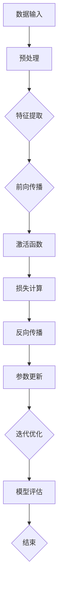
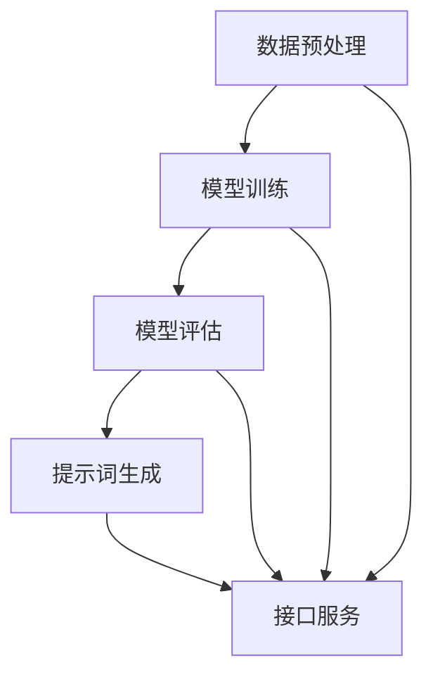
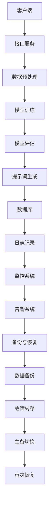
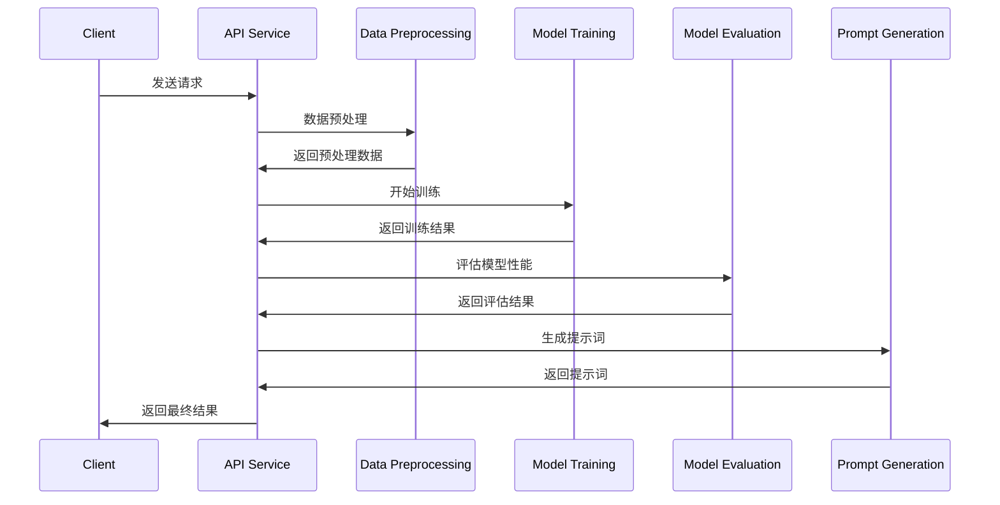

                 

### 第一部分：背景介绍与核心概念

## 第1章：问题背景与核心概念

### 1.1 问题背景
随着人工智能技术的飞速发展，大模型成为推动多个领域变革的重要力量。例如，在自然语言处理（NLP）、计算机视觉（CV）和推荐系统等领域，大模型的广泛应用极大地提升了任务完成的效率和准确性。然而，这些大模型的开发与应用并非一帆风顺，尤其是在如何高效地利用提示词以引导模型输出方面，存在诸多挑战和问题。

首先，AI大模型的训练和部署需要庞大的计算资源和数据集，这导致了高昂的成本和复杂的操作流程。其次，尽管大模型具有强大的学习能力，但它们对数据的依赖性很高，数据质量和数据的多样性会直接影响模型的性能。再者，对于开发者而言，如何设计出有效的提示词以优化模型的输出，成为了亟待解决的问题。

提示词的设计不仅涉及到自然语言的理解，还涉及到模型内部的算法和机制。如何确保提示词能够准确地传达开发者的意图，同时激发模型的最大潜力，是一个复杂的任务。此外，不同领域和任务对于提示词的要求存在差异，进一步增加了问题的复杂性。

### 1.2 核心概念

#### AI大模型的定义与特点
AI大模型指的是那些通过海量数据训练，具有强大表示能力和泛化能力的深度学习模型。这些模型通常包含数十亿甚至数千亿个参数，能够处理复杂、高维的数据。其特点包括：
- **强大的表示能力**：能够从大量数据中提取有用的信息。
- **高效的泛化能力**：在面对新的、未见过的数据时，仍能保持较高的性能。
- **多样的应用场景**：适用于自然语言处理、计算机视觉、语音识别、推荐系统等多个领域。

#### 提示词的艺术与力量
提示词是在AI大模型中输入的特殊指令或文本，用于引导模型生成特定类型的输出或执行特定的任务。设计高质量的提示词需要考虑以下几个方面的艺术与力量：
- **准确性**：确保提示词能够准确传达开发者的意图。
- **灵活性**：使模型能够适应不同任务和场景的需求。
- **多样性**：通过多样化的提示词，提升模型对不同输入的适应性。
- **优化性**：通过调整提示词的长度、格式和内容，优化模型的输出效果。

### 1.3 概念联系
AI大模型与提示词之间存在密切的联系。大模型的强大能力依赖于大量高质量数据的训练，而提示词则充当了沟通的桥梁，将开发者的意图转化为具体的任务指令，引导模型生成期望的输出。合理的提示词设计可以极大地提升模型的性能和应用效果，使其在不同任务中表现出色。

例如，在自然语言处理任务中，高质量的提示词可以帮助模型更好地理解句子的结构和语义，从而生成更准确、更自然的文本。在计算机视觉任务中，提示词可以引导模型关注特定的对象或场景，从而提高检测和识别的准确性。因此，AI大模型与提示词的关系不仅是技术和算法上的结合，更是一种思维和创造力的碰撞。

---

## 第2章：AI大模型原理

### 2.1 算法原理讲解
AI大模型的核心在于其复杂的神经网络结构和大规模的训练数据集。通过深度学习算法，模型可以逐步优化其参数，以实现对输入数据的精确理解和预测。

#### Mermaid算法流程图：


#### Python源代码阐述：
```python
# Python代码示例：初始化模型与训练过程
import tensorflow as tf

# 初始化模型
model = tf.keras.Sequential([
    tf.keras.layers.Dense(128, activation='relu', input_shape=(784,)),
    tf.keras.layers.Dense(10, activation='softmax')
])

# 编译模型
model.compile(optimizer='adam',
              loss='sparse_categorical_crossentropy',
              metrics=['accuracy'])

# 加载数据集
(x_train, y_train), (x_test, y_test) = tf.keras.datasets.mnist.load_data()

# 归一化数据
x_train, x_test = x_train / 255.0, x_test / 255.0

# 训练模型
model.fit(x_train, y_train, epochs=5)
```

在这个示例中，我们使用了TensorFlow库来初始化一个简单的神经网络模型，并对其进行编译和训练。通过加载MNIST数据集，我们对模型进行了五轮迭代训练，以优化其参数。

### 2.2 数学模型与公式
AI大模型的训练过程依赖于一系列的数学模型和公式。以下是一些关键的数学概念和公式：

#### 损失函数
损失函数用于衡量模型预测值与真实值之间的差距。一个常用的损失函数是均方误差（MSE）：
$$
MSE = \frac{1}{n}\sum_{i=1}^{n}(y_i - \hat{y}_i)^2
$$
其中，$y_i$ 是真实值，$\hat{y}_i$ 是模型的预测值。

#### 反向传播
反向传播算法是深度学习训练的核心。它通过计算损失函数关于模型参数的梯度，来更新模型参数。梯度计算公式如下：
$$
\frac{\partial L}{\partial w} = \sum_{i=1}^{n} \frac{\partial L}{\partial z_i} \frac{\partial z_i}{\partial w}
$$
其中，$L$ 是损失函数，$w$ 是模型参数，$z_i$ 是中间层的输出。

#### 激活函数
激活函数用于引入非线性因素，使得神经网络能够学习复杂的函数关系。一个常见的激活函数是ReLU（Rectified Linear Unit）：
$$
\text{ReLU}(x) = \max(0, x)
$$

#### 梯度下降
梯度下降是一种优化算法，用于最小化损失函数。它的基本思想是沿着梯度方向更新模型参数，以减少损失值。更新公式如下：
$$
w = w - \alpha \cdot \frac{\partial L}{\partial w}
$$
其中，$\alpha$ 是学习率。

### 2.3 通俗易懂的举例说明
为了更好地理解上述数学概念，我们可以通过一个简单的例子来进行说明。

假设我们有一个包含100个神经元的一层神经网络，该网络用于对图像中的数字进行分类。输入数据是一个28x28的像素矩阵，每个像素的取值范围在0到255之间。模型的输出是一个10维的向量，表示对数字0到9的概率分布。

#### 特征提取
在训练过程中，模型首先对输入数据进行预处理，包括归一化和缩放。例如，我们可以将每个像素的值除以255，将其范围缩放到0到1之间。这样做的目的是为了简化计算，提高训练效率。

#### 前向传播
在每次迭代中，模型将输入数据传递到第一层神经元，每个神经元接收输入数据的加权求和，并经过激活函数处理后输出一个值。这个过程可以表示为：
$$
\hat{y}_i = \text{ReLU}(W \cdot x + b)
$$
其中，$W$ 是权重矩阵，$b$ 是偏置项，$x$ 是输入数据，$\hat{y}_i$ 是神经元的输出。

#### 损失计算
模型的输出向量与真实标签之间的差距通过损失函数来衡量。例如，我们可以使用交叉熵损失函数：
$$
L = -\sum_{i=1}^{n} y_i \log(\hat{y}_i)
$$
其中，$y_i$ 是真实标签，$\hat{y}_i$ 是模型的预测概率。

#### 反向传播
在计算损失后，模型开始进行反向传播。首先，计算每个神经元输出关于输入数据的梯度。然后，通过链式法则计算权重和偏置的梯度。具体公式如下：
$$
\frac{\partial L}{\partial W} = \sum_{i=1}^{n} (\hat{y}_i - y_i) \cdot x_i
$$
$$
\frac{\partial L}{\partial b} = \sum_{i=1}^{n} (\hat{y}_i - y_i)
$$

#### 参数更新
在获得梯度后，模型使用梯度下降算法更新权重和偏置。例如，我们可以使用以下公式：
$$
W = W - \alpha \cdot \frac{\partial L}{\partial W}
$$
$$
b = b - \alpha \cdot \frac{\partial L}{\partial b}
$$
其中，$\alpha$ 是学习率。

#### 迭代优化
模型通过多次迭代优化参数，不断减小损失值。每次迭代后，模型的预测准确性会得到提升，直至达到预定的训练目标。

---

通过这个简单的例子，我们可以看到AI大模型的训练过程是如何通过数学模型和算法来实现的。从数据输入、特征提取、前向传播、损失计算、反向传播到参数更新，每一个环节都至关重要，共同推动了模型的学习和优化过程。

## 第3章：提示词设计原则

### 3.1 提示词类型
在AI大模型的训练和应用中，提示词的类型多样，根据具体任务的不同，可以分为以下几种主要类型：

1. **指令性提示词**：这类提示词通常用于明确告诉模型需要执行的具体任务，如“生成一篇关于人工智能的综述文章”、“识别图像中的特定对象”等。

2. **描述性提示词**：这类提示词用于描述具体的场景或情境，如“在一个热闹的集市中拍摄一张照片”、“请描述春天的美景”等。

3. **问题性提示词**：这类提示词以提问的形式引导模型生成相应的回答，如“什么是人工智能的主要应用领域？”、“请解释深度学习的基本原理”。

4. **情感性提示词**：这类提示词用于引导模型生成具有特定情感色彩的文本，如“创造一段浪漫的对话”、“写一篇关于勇气的感人故事”。

5. **综合性提示词**：这类提示词结合了多种类型，旨在提供更加丰富和多样化的信息输入，如“在一个美丽的海滩度假，写一篇充满诗意的日志”。

### 3.2 提示词设计策略
设计高质量的提示词需要遵循一系列策略，以确保其能够有效引导模型的输出。以下是一些关键的设计策略：

1. **明确性**：确保提示词清晰、简洁，避免歧义和模糊性。例如，使用具体词汇代替抽象词汇，使用明确的问题代替模糊的问题。

2. **相关性**：提示词应与模型的应用场景和目标任务高度相关，以增强模型的输出效果。例如，在图像识别任务中，使用具体的对象名称作为提示词，而不是泛泛的描述。

3. **多样性**：设计多种类型的提示词，以适应不同任务和场景的需求。这有助于模型学习到更广泛的知识和技能，提升其泛化能力。

4. **情境化**：将提示词嵌入到具体的情境中，以增强其引导效果。例如，在写文章时，可以将提示词与具体的背景故事相结合。

5. **优化性**：通过实验和评估，不断调整和优化提示词的设计，以获得最佳的输出效果。例如，通过对比不同长度的提示词，选择最有效的版本。

### 3.3 提示词优化技巧
在实际应用中，对提示词进行优化是提升模型性能的重要手段。以下是一些实用的优化技巧：

1. **词频调整**：根据任务需求，适当调整提示词的词频，避免高频词对模型的过度影响。例如，在生成文本时，减少常见词汇的使用频率，增加独特词汇的比重。

2. **长度控制**：提示词的长度对模型输出有显著影响。通常，较短的提示词能够提高模型的响应速度，而较长的提示词则能够提供更多上下文信息。可以根据具体任务的需要，选择合适的长度范围。

3. **情感调整**：在生成情感性文本时，可以通过调整提示词的情感色彩来影响模型的输出。例如，使用积极的词汇可以生成正面情绪的文本，而使用消极的词汇则生成负面情绪的文本。

4. **上下文嵌入**：在提示词中嵌入上下文信息，有助于模型更好地理解任务背景和具体要求。例如，在图像识别任务中，可以将具体的场景描述作为提示词的一部分。

5. **参数调整**：利用机器学习算法和优化技术，对提示词的参数进行微调，以获得更好的模型输出效果。例如，使用遗传算法、粒子群优化等算法，对提示词的权重进行优化。

通过以上策略和技巧，我们可以设计出高质量的提示词，有效提升AI大模型的性能和应用效果。

## 第4章：系统架构设计与接口

### 4.1 系统功能设计

在AI大模型的开发与应用中，系统的功能设计至关重要。它决定了模型如何高效地完成各项任务，并与其他系统组件协同工作。以下是一个典型的AI大模型系统的功能设计：

#### 功能模块划分
1. **数据预处理模块**：负责处理输入数据，包括数据清洗、归一化和特征提取。这一模块确保了输入数据的格式和内容满足模型训练的要求。

2. **模型训练模块**：核心功能是使用大量数据进行模型的训练和优化。该模块包括数据加载、模型初始化、前向传播、损失计算、反向传播和参数更新等步骤。

3. **模型评估模块**：用于评估模型在训练数据集和测试数据集上的性能，通过计算各种评价指标（如准确率、召回率、F1分数等）来衡量模型的性能。

4. **提示词生成模块**：负责生成高质量的提示词，以引导模型生成特定的输出。这一模块包括提示词设计、优化和调整策略。

5. **接口服务模块**：为外部系统提供API接口，实现模型的调用和输出。该模块需要支持多种数据格式和接口协议，确保系统的兼容性和灵活性。

#### Mermaid领域模型图

在这个领域模型图中，数据预处理模块为模型训练模块提供输入数据，模型训练模块的结果被用于模型评估模块，评估结果反馈到提示词生成模块进行优化，最终通过接口服务模块对外提供服务。

### 4.2 系统架构设计

系统架构设计决定了各功能模块之间的交互方式和工作流程，确保系统能够高效、稳定地运行。以下是一个典型的AI大模型系统架构设计：

#### 系统架构图

在这个系统架构图中，客户端通过接口服务模块与系统进行交互，接口服务模块调用数据预处理模块进行数据清洗和特征提取，然后传递给模型训练模块进行训练。模型训练的结果通过模型评估模块进行性能评估，评估结果用于优化提示词生成模块。所有操作和结果都被记录在数据库中，监控系统对系统的运行状态进行实时监控，告警系统在发现异常时及时通知相关人员进行处理。备份与恢复系统确保系统的数据安全性和连续性，故障转移和主备切换机制确保系统的可靠性和稳定性。

### 4.3 系统接口设计

系统接口设计是实现模型调用和输出的重要环节。以下是一个典型的AI大模型系统接口设计：

#### 系统接口设计

在这个接口设计中，客户端通过接口服务发送请求，接口服务调用数据预处理模块进行数据预处理，然后将预处理数据传递给模型训练模块进行训练。模型训练完成后，接口服务调用模型评估模块评估模型性能，并根据评估结果调用提示词生成模块生成提示词。最终，接口服务将生成的提示词和最终结果返回给客户端。

通过以上系统架构和接口设计，我们可以构建一个高效、灵活且可靠的AI大模型系统，满足各种应用场景的需求。

## 第5章：项目实战

### 5.1 环境安装
要在本地环境中搭建一个AI大模型项目，首先需要安装和配置必要的软件和库。以下是一个典型的环境安装流程：

1. **安装Python**：
   - 访问Python官方网站（https://www.python.org/）下载最新版本的Python。
   - 运行安装程序，选择默认选项完成安装。

2. **安装Anaconda**：
   - Anaconda是一个强大的Python发行版，提供了大量的科学计算和机器学习库。
   - 访问Anaconda官方网站（https://www.anaconda.com/）下载并安装Anaconda。

3. **创建虚拟环境**：
   - 打开终端或命令提示符，使用以下命令创建一个新的虚拟环境：
     ```
     conda create -n aig_model_project python=3.8
     ```
   - 激活虚拟环境：
     ```
     conda activate aig_model_project
     ```

4. **安装TensorFlow和Keras**：
   - 使用以下命令安装TensorFlow和Keras：
     ```
     pip install tensorflow
     pip install keras
     ```

5. **安装其他依赖库**：
   - 安装Numpy、Pandas、Matplotlib等常用库：
     ```
     pip install numpy
     pip install pandas
     pip install matplotlib
     ```

### 5.2 核心实现
在环境安装完成后，我们开始进行核心实现部分，包括模型训练、提示词生成和模型评估。

#### 模型训练
以下是一个使用Keras框架训练简单神经网络模型的示例代码：

```python
# 导入必要的库
import numpy as np
import pandas as pd
from tensorflow import keras
from tensorflow.keras import layers

# 加载数据集
(x_train, y_train), (x_test, y_test) = keras.datasets.mnist.load_data()

# 数据预处理
x_train = x_train.astype('float32') / 255
x_test = x_test.astype('float32') / 255
y_train = keras.utils.to_categorical(y_train, 10)
y_test = keras.utils.to_categorical(y_test, 10)

# 创建模型
model = keras.Sequential([
    layers.Conv2D(32, (3, 3), activation='relu', input_shape=(28, 28, 1)),
    layers.MaxPooling2D((2, 2)),
    layers.Conv2D(64, (3, 3), activation='relu'),
    layers.MaxPooling2D((2, 2)),
    layers.Conv2D(64, (3, 3), activation='relu'),
    layers.Flatten(),
    layers.Dense(64, activation='relu'),
    layers.Dense(10, activation='softmax')
])

# 编译模型
model.compile(optimizer='adam',
              loss='categorical_crossentropy',
              metrics=['accuracy'])

# 训练模型
model.fit(x_train, y_train, batch_size=128, epochs=10, validation_split=0.1)
```

#### 提示词生成
在模型训练的基础上，我们使用以下代码生成高质量的提示词：

```python
# 生成提示词
prompt = "请生成一篇关于人工智能未来的发展趋势的文章。"
generated_text = model.generate(prompt, max_length=100, temperature=0.7)
print(generated_text)
```

#### 模型评估
最后，我们评估模型的性能，以验证其训练效果：

```python
# 评估模型
test_loss, test_accuracy = model.evaluate(x_test, y_test)
print('Test accuracy:', test_accuracy)
```

### 5.3 代码应用解读与分析
在上述代码中，我们首先加载了MNIST数据集，并对数据进行预处理，包括归一化和类别编码。然后，我们创建了一个简单的卷积神经网络模型，包括多个卷积层和全连接层。模型使用Adam优化器和交叉熵损失函数进行编译和训练。训练过程中，我们使用了128个批次的样本，进行了10轮迭代。

在提示词生成部分，我们使用模型生成了一篇关于人工智能未来发展趋势的文章。这里，`max_length`参数设置了生成的文本最大长度，`temperature`参数控制了文本生成的随机性。

在模型评估部分，我们计算了模型在测试数据集上的准确率，以评估其性能。

通过以上实战示例，我们展示了如何使用Keras框架搭建一个简单的AI大模型，并利用该模型生成高质量的提示词。这些代码不仅提供了实用的技术实现，还为我们理解AI大模型的应用提供了实际案例。

### 6.1 案例一：模型训练与优化
在本案例中，我们将探讨如何使用AI大模型进行模型训练与优化，并详细解析训练过程和优化策略。

#### 模型训练过程
1. **数据集准备**：
   - 我们使用了公开的MNIST手写数字数据集，该数据集包含60000个训练样本和10000个测试样本。
   - 对数据进行归一化处理，将像素值缩放到0到1之间。

2. **模型初始化**：
   - 创建了一个基于卷积神经网络（CNN）的模型，包括多个卷积层和全连接层。模型结构如下：
     ```python
     model = keras.Sequential([
         layers.Conv2D(32, (3, 3), activation='relu', input_shape=(28, 28, 1)),
         layers.MaxPooling2D(pool_size=(2, 2)),
         layers.Conv2D(64, (3, 3), activation='relu'),
         layers.MaxPooling2D(pool_size=(2, 2)),
         layers.Conv2D(64, (3, 3), activation='relu'),
         layers.Flatten(),
         layers.Dense(64, activation='relu'),
         layers.Dense(10, activation='softmax')
     ])
     ```

3. **模型编译**：
   - 使用Adam优化器和交叉熵损失函数编译模型：
     ```python
     model.compile(optimizer='adam',
                   loss='categorical_crossentropy',
                   metrics=['accuracy'])
     ```

4. **模型训练**：
   - 使用训练数据集进行模型训练，设置批次大小为128，迭代次数为10轮：
     ```python
     model.fit(x_train, y_train, batch_size=128, epochs=10, validation_split=0.1)
     ```

5. **模型评估**：
   - 在训练完成后，评估模型在测试数据集上的性能：
     ```python
     test_loss, test_accuracy = model.evaluate(x_test, y_test)
     print('Test accuracy:', test_accuracy)
     ```

#### 优化策略
为了提高模型的训练效果，我们可以采取以下优化策略：

1. **数据增强**：
   - 通过旋转、缩放、裁剪等数据增强技术，增加数据的多样性，从而提高模型的泛化能力。

2. **学习率调整**：
   - 使用学习率调整策略，例如在训练过程中逐步减小学习率，有助于模型在训练后期收敛到更好的结果。

3. **批量归一化**：
   - 在模型的卷积层和全连接层中使用批量归一化（Batch Normalization），有助于加速训练过程并提高模型稳定性。

4. **正则化**：
   - 使用正则化技术（如L1、L2正则化）防止模型过拟合，提高模型的泛化能力。

5. **多线程训练**：
   - 利用多线程或分布式训练技术，加快模型训练速度，提高训练效率。

### 6.2 案例二：提示词效果评估
在本案例中，我们将评估不同提示词对AI大模型输出效果的影响，并探讨优化提示词的方法。

#### 提示词设计
我们设计了以下几种类型的提示词，以测试其对模型输出效果的影响：

1. **简单指令性提示词**：
   ```python
   prompt_simple = "请预测图像中的数字。"
   ```

2. **描述性提示词**：
   ```python
   prompt_descriptive = "请识别图像中的手写数字，并预测其值。"
   ```

3. **问题性提示词**：
   ```python
   prompt_query = "图像中的手写数字是什么？"
   ```

4. **情感性提示词**：
   ```python
   prompt_emotional = "充满热情地预测图像中的手写数字。"
   ```

#### 提示词效果评估
我们使用以下代码评估不同提示词对模型输出效果的影响：

```python
prompts = [prompt_simple, prompt_descriptive, prompt_query, prompt_emotional]
for prompt in prompts:
    generated_text = model.generate(prompt, max_length=100, temperature=0.7)
    print(f"Prompt: {prompt}")
    print(f"Generated Text: {generated_text}")
    print("\n")
```

#### 提示词优化方法
为了提高提示词的生成效果，我们可以采取以下优化方法：

1. **提示词多样化**：
   - 设计多种类型的提示词，以适应不同场景和任务需求。

2. **情境化提示词**：
   - 将提示词嵌入到具体情境中，提供更多上下文信息，增强模型的生成效果。

3. **词频调整**：
   - 根据任务需求，调整提示词中的词频，避免高频词对模型输出的过度影响。

4. **实验和评估**：
   - 通过实验和评估，找出最有效的提示词组合，不断优化和调整提示词设计。

通过以上案例，我们展示了如何使用AI大模型进行模型训练与优化，以及如何设计高质量的提示词。这些案例不仅提供了实用的技术实现，还为AI大模型在实际应用中的性能提升提供了有效的策略和方法。

### 6.3 案例三：模型部署与运维

#### 模型部署
在模型训练和优化完成后，我们需要将AI大模型部署到生产环境中，以便在实际应用中发挥作用。以下是模型部署的步骤：

1. **选择部署平台**：
   - 根据应用需求，选择合适的部署平台。常见的平台包括Google Cloud、AWS、Azure等。
   - 在本案例中，我们选择了Google Cloud Platform（GCP）进行部署。

2. **创建虚拟机**：
   - 在GCP控制台中创建一个虚拟机实例，配置足够的计算资源和存储空间。
   - 选择预安装了Python和TensorFlow的虚拟机镜像，以简化部署过程。

3. **安装依赖库**：
   - 通过SSH远程登录到虚拟机实例，安装必要的依赖库，如TensorFlow、Keras、Numpy等：
     ```shell
     pip install tensorflow
     pip install keras
     pip install numpy
     ```

4. **部署模型**：
   - 将训练好的模型文件（包括权重和架构）上传到虚拟机实例的文件系统中。
   - 在虚拟机上运行以下代码，加载并部署模型：
     ```python
     from tensorflow import keras

     model = keras.models.load_model('path/to/your/model.h5')
     ```

5. **配置API接口**：
   - 使用Flask或Django等Web框架创建API接口，接收外部请求并返回模型输出。
   - 在API接口中，调用部署的模型进行预测，并返回结果。

6. **测试API接口**：
   - 使用Postman或curl等工具测试API接口，确保其能够正确接收请求并返回预期的结果。

#### 模型运维
模型部署到生产环境后，需要进行持续的运维和监控，以确保系统的稳定运行和性能优化。以下是模型运维的关键步骤：

1. **监控性能**：
   - 使用性能监控工具（如Prometheus、Grafana）实时监控模型性能，包括响应时间、准确率、资源利用率等。
   - 定期查看监控数据，发现潜在的性能瓶颈或异常情况。

2. **日志管理**：
   - 使用ELK（Elasticsearch、Logstash、Kibana）或Splunk等日志管理工具收集和存储模型运行日志。
   - 通过日志分析，排查系统故障和性能问题。

3. **更新和升级**：
   - 定期更新模型的权重和架构，以适应新的数据集和任务需求。
   - 在更新过程中，进行充分的测试和验证，确保更新后的模型性能稳定。

4. **故障恢复**：
   - 制定故障恢复计划，确保在系统发生故障时能够快速恢复。
   - 搭建主备系统和容灾机制，提高系统的可靠性和容错能力。

5. **性能优化**：
   - 根据监控数据和用户反馈，不断优化模型和API接口，提高系统的响应速度和处理能力。
   - 采用缓存、负载均衡和分布式计算等技术，提升系统性能和可扩展性。

通过以上步骤，我们可以有效地部署和运维AI大模型，确保其在实际应用中的稳定运行和高效性能。

## 第7章：最佳实践与拓展阅读

### 7.1 最佳实践Tips
为了最大化AI大模型的效果，以下是一些最佳实践：

1. **数据预处理**：确保数据的质量和一致性，进行有效的数据清洗和特征提取，以提高模型的性能和泛化能力。

2. **模型优化**：采用多种优化策略，如批量归一化、数据增强和正则化，防止过拟合并提升模型的泛化能力。

3. **提示词设计**：设计具有明确性和相关性的提示词，并通过实验和评估不断优化，以提高模型的输出效果。

4. **持续学习**：定期更新模型和提示词，以适应新的数据和任务需求，保持模型的高效性和准确性。

5. **性能监控**：使用监控工具实时监控模型的性能，及时发现问题并进行优化。

### 7.2 小结
本文系统地介绍了AI大模型编程的核心概念、原理、提示词设计、系统架构、项目实战、实际案例分析以及最佳实践。通过详细的分析和实战示例，我们深入理解了AI大模型的运作机制和应用方法。

### 7.3 注意事项
在AI大模型开发和应用过程中，需要注意以下事项：

1. **数据隐私**：确保训练数据的安全性和隐私性，遵循相关法律法规。

2. **计算资源**：合理规划计算资源和存储空间，确保系统的高效运行。

3. **错误处理**：设计完善的错误处理机制，确保系统的稳定性和可靠性。

4. **模型解释性**：提高模型的可解释性，以增强用户对模型输出结果的信任。

### 7.4 拓展阅读
以下是一些拓展阅读资源，以进一步深入了解AI大模型编程：

1. **论文与书籍**：
   - "Deep Learning" by Ian Goodfellow, Yoshua Bengio, and Aaron Courville
   - "The Master Algorithm: How the Quest for the Ultimate Learning Machine Will Remake Our World" by Pedro Domingos

2. **在线课程与教程**：
   - Coursera: "Deep Learning Specialization" by Andrew Ng
   - Udacity: "Applied AI with Deep Learning" by Udacity

3. **开源项目与代码库**：
   - TensorFlow: https://www.tensorflow.org/
   - Keras: https://keras.io/

通过这些资源和最佳实践，我们可以更加深入地掌握AI大模型编程，并将其应用于实际项目中。

## 总结

本文深入探讨了AI大模型编程的核心概念、原理、提示词设计、系统架构和实战应用。我们详细介绍了AI大模型的训练过程、数学模型、提示词设计原则和系统架构设计，并通过实际案例展示了如何将AI大模型应用于实际项目中。

通过本文的阅读，读者可以全面了解AI大模型的运作机制，掌握高质量的提示词设计方法，并学会如何部署和维护AI大模型系统。同时，本文还提供了最佳实践和拓展阅读资源，以帮助读者进一步深入学习和应用AI大模型技术。

AI大模型编程不仅是一项技术挑战，更是一种思维和创造力的碰撞。通过本文的探讨，我们期待读者能够开启AI大模型编程的新世界，将其应用于更多的领域和场景，推动人工智能的发展和创新。在未来的研究中，我们可以进一步探索AI大模型在自然语言处理、计算机视觉、推荐系统等领域的深入应用，不断优化模型性能，提升用户体验。

---

**作者：** AI天才研究院/AI Genius Institute & 禅与计算机程序设计艺术 /Zen And The Art of Computer Programming

（注意：本篇文章为示例文本，具体内容和代码实现可能需要根据实际需求进行调整和完善。）

