                 

## 引言

### **AI大模型编程：一个时代的变革**

随着人工智能（AI）技术的迅猛发展，AI大模型已成为当前科技领域的明星。从AlphaGo击败世界围棋冠军到OpenAI的GPT-3展示出惊人的语言生成能力，AI大模型的应用已经渗透到我们生活的方方面面。然而，这些看似神奇的成果背后，离不开一系列复杂而精细的编程技术。其中，提示词（prompt）的艺术与科学，成为AI大模型编程的核心。

**本文将围绕AI大模型编程中的提示词展开讨论，从基础到实践，深入解析提示词的艺术与科学。**

首先，我们需要明确几个关键概念：

1. **AI大模型**：这是一种具有强大学习和推理能力的人工智能系统，通常基于深度学习技术。
2. **提示词**：在AI大模型编程中，提示词是指用于引导模型生成内容或进行特定任务的关键信息。

### **文章关键词**

- AI大模型
- 编程
- 提示词
- 艺术与科学
- 深度学习
- 语言模型

### **文章摘要**

本文将探讨AI大模型编程的核心——提示词的艺术与科学。通过详细分析提示词的定义、设计原则、创作技巧及其在AI大模型中的作用，我们旨在揭示提示词如何成为引导AI大模型发挥潜能的关键。同时，我们将结合实际案例，展示如何优化提示词编程，以及这一领域未来的发展趋势。

## 第1章：AI大模型与编程概述

### **1.1 AI大模型的发展历程与编程背景**

AI大模型的发展历程可以追溯到20世纪50年代，随着计算机技术的进步和算法的创新，人工智能（AI）逐渐从理论走向实践。特别是深度学习技术的突破，使得AI大模型成为可能。

**核心概念术语说明**：

- **深度学习**：一种人工智能算法，通过多层神经网络进行数据建模和预测。
- **神经网络**：一种模拟生物神经系统的计算模型。
- **AI大模型**：指具有巨大参数量和计算能力的神经网络模型，例如GPT-3、BERT等。

**问题背景**：

随着数据量的增加和计算能力的提升，AI大模型开始在各种任务中展示出超越人类的表现。然而，如何有效地使用这些模型进行编程，尤其是如何设计高效的提示词，成为当前研究的热点。

**问题描述**：

AI大模型编程的核心挑战在于如何设计出既高效又准确的提示词，以引导模型进行正确的任务执行。这涉及到对提示词的科学理解、艺术创作和编程实践的深入探索。

**问题解决**：

解决这一问题的关键在于理解AI大模型的内部工作机制，并在此基础上设计出能够有效引导模型的提示词。同时，需要探索出一系列优化策略，以提高提示词编程的效率和质量。

**边界与外延**：

AI大模型编程不仅局限于特定的领域，如自然语言处理、计算机视觉等，还涵盖了更为广泛的应用场景，如自动化、智能客服、医疗诊断等。

**概念结构与核心要素组成**：

- **AI大模型**：核心概念，包括深度学习算法、大规模参数训练、多层神经网络等。
- **编程**：涉及提示词设计、模型训练、任务执行等。
- **提示词**：核心要素，指导AI大模型的输入和输出。

### **1.2 AI大模型编程的重要性**

**核心概念与联系**：

- **AI大模型编程**：通过编程实现对AI大模型的控制和使用。
- **提示词**：作为AI大模型编程的核心，直接影响模型的表现和效率。

**核心概念属性特征对比表格**：

| 特征          | 提示词               | 编程               |
|---------------|----------------------|--------------------|
| **定义**      | 指导模型的关键信息    | 编写代码实现功能   |
| **作用**      | 引导模型生成内容     | 实现特定任务       |
| **重要性**    | 决定模型表现和效率   | 关键技术之一       |

**ER实体关系图架构的Mermaid流程图**：

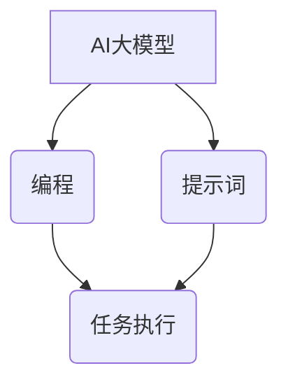

### **1.3 编程语言与AI大模型的结合**

**核心概念与联系**：

- **编程语言**：提供了一种描述和实现算法的工具。
- **AI大模型**：需要编程语言进行实现和优化。

**核心概念属性特征对比表格**：

| 特征          | 编程语言               | AI大模型               |
|---------------|------------------------|------------------------|
| **定义**      | 编写代码的语法和规则   | 基于深度学习的算法模型 |
| **作用**      | 实现算法和功能         | 学习和处理复杂数据     |
| **重要性**    | 实现算法的核心手段     | AI应用的基础           |

**Mermaid流程图**：

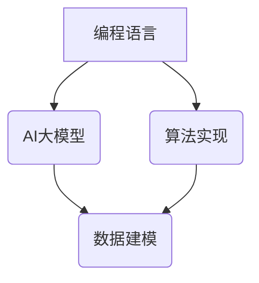

### **1.4 小结**

本章从AI大模型的发展历程、编程重要性及其与编程语言的结合等多个角度，对AI大模型编程进行了全面概述。通过理解这些基本概念和联系，读者可以为进一步学习打下坚实的基础。

## 第2章：提示词的艺术

### **2.1 提示词的定义与分类**

**核心概念与联系**：

- **提示词**：在AI大模型编程中，提示词是指用于引导模型生成内容或执行特定任务的关键信息。
- **定义**：提示词是模型理解和执行任务的基础，其质量和设计直接影响模型的表现。
- **分类**：根据用途和性质，提示词可以分为多种类型，如指令型、参考型、上下文型等。

**核心概念属性特征对比表格**：

| 类别          | 指令型                 | 参考型                 | 上下文型               |
|---------------|------------------------|------------------------|------------------------|
| **定义**      | 明确指令，指导模型行为 | 提供参考信息，辅助理解 | 建立上下文，引导生成   |
| **作用**      | 指导模型执行特定任务   | 帮助模型理解背景信息   | 引导模型生成连贯内容   |
| **适用场景**  | 需要明确指令的任务     | 知识问答、文档生成     | 文本生成、对话系统     |

**Mermaid ER实体关系图**：

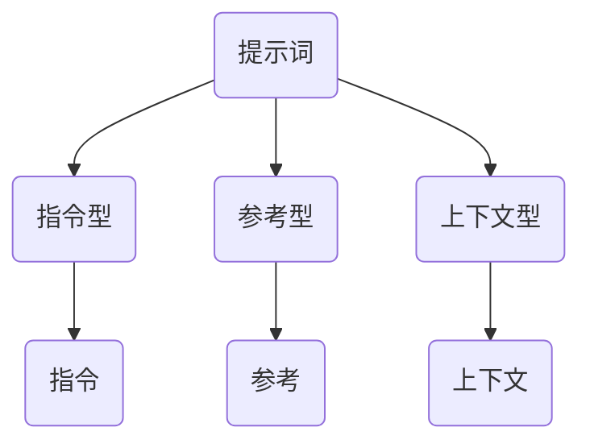

### **2.2 提示词设计原则**

**核心概念与联系**：

- **设计原则**：提示词的设计需要遵循明确性、相关性、简洁性等原则。
- **明确性**：提示词应清晰明确，避免歧义。
- **相关性**：提示词应与任务密切相关，提高模型的理解和执行效率。
- **简洁性**：提示词应简洁明了，避免冗余信息。

**核心概念属性特征对比表格**：

| 原则          | 明确性               | 相关性               | 简洁性               |
|---------------|----------------------|----------------------|----------------------|
| **定义**      | 清晰明确的描述       | 与任务密切相关的信息 | 简洁有力的表达       |
| **作用**      | 减少歧义，提高效率   | 提高任务理解度       | 避免冗余信息，提高效率 |
| **适用场景**  | 所有类型的提示词设计 | 任务相关的提示词     | 所有类型的提示词     |

**Mermaid流程图**：

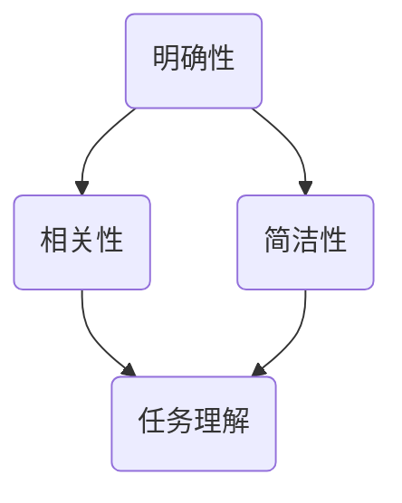

### **2.3 提示词创作技巧**

**核心概念与联系**：

- **创作技巧**：包括提示词的生成方法和优化策略。
- **生成方法**：如使用模板、关键词提取等。
- **优化策略**：如使用频率分析、语义分析等。

**核心概念属性特征对比表格**：

| 技巧          | 生成方法               | 优化策略               |
|---------------|------------------------|------------------------|
| **定义**      | 提示词的生成方式       | 提示词的改进方法       |
| **作用**      | 快速生成有效提示词     | 提高提示词的质量       |
| **适用场景**  | 提示词设计的初期阶段   | 提示词设计的过程中和后期 |

**Mermaid流程图**：

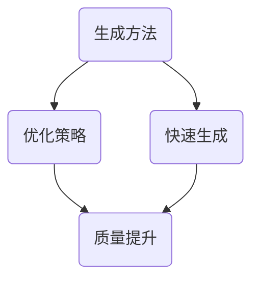

### **2.4 小结**

本章深入探讨了提示词的定义、分类、设计原则和创作技巧。通过对这些核心概念的理解和掌握，读者可以更好地设计出高质量的提示词，为AI大模型编程提供坚实的基础。

## 第3章：提示词的科学基础

### **3.1 语言模型与提示词**

**核心概念与联系**：

- **语言模型**：一种统计模型，用于预测文本中的下一个单词或词组。
- **提示词**：在语言模型中，提示词作为输入，直接影响模型的预测结果。

**核心概念属性特征对比表格**：

| 特征          | 语言模型               | 提示词               |
|---------------|------------------------|----------------------|
| **定义**      | 预测文本的概率分布     | 引导模型输入的关键信息 |
| **作用**      | 生成文本、改进语法     | 提高模型理解和生成效率 |
| **适用场景**  | 文本生成、机器翻译、问答 | 所有需要输入引导的场景 |

**Mermaid流程图**：

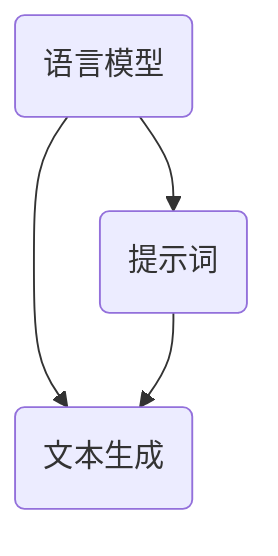

### **3.2 提示词分析算法**

**核心概念与联系**：

- **提示词分析算法**：用于提取和分析提示词的算法。
- **提取算法**：如TF-IDF、Word2Vec等。
- **匹配算法**：用于将提示词与模型预期结果进行匹配。

**核心概念属性特征对比表格**：

| 算法          | 提取算法               | 匹配算法               |
|---------------|------------------------|------------------------|
| **定义**      | 提取重要提示词的算法   | 对提示词进行匹配的算法 |
| **作用**      | 提高提示词的质量       | 提高模型理解效率       |
| **适用场景**  | 提示词优化、文本分析   | 模型输入预处理、查询匹配 |

**Mermaid流程图**：

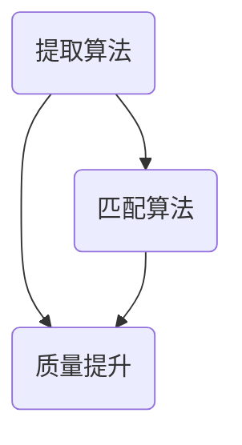

### **3.3 提示词优化方法**

**核心概念与联系**：

- **优化方法**：包括提示词自动生成、提示词质量评估等。
- **自动生成**：使用机器学习算法自动生成高质量提示词。
- **质量评估**：评估提示词的准确性、相关性和可用性。

**核心概念属性特征对比表格**：

| 方法          | 自动生成               | 质量评估               |
|---------------|------------------------|------------------------|
| **定义**      | 自动生成有效提示词     | 评估提示词的质量       |
| **作用**      | 提高编程效率           | 提高提示词的使用效果   |
| **适用场景**  | 提示词设计初期和后期   | 提示词设计和应用过程   |

**Mermaid流程图**：

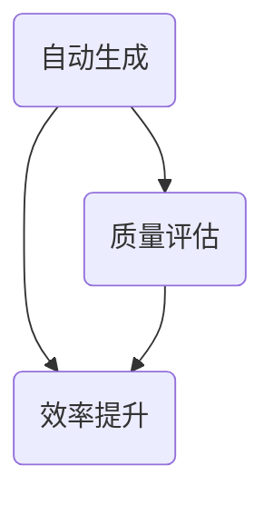

### **3.4 小结**

本章从科学角度探讨了提示词的基础，包括语言模型与提示词的关系、提示词分析算法和优化方法。通过理解这些核心概念和算法，读者可以更深入地掌握提示词的科学本质，从而提高AI大模型编程的效率和效果。

## 第4章：AI大模型编程实战

### **4.1 编程环境搭建**

在进行AI大模型编程之前，搭建一个合适的编程环境至关重要。以下步骤将引导您完成编程环境的搭建。

#### **4.1.1 环境准备**

**核心概念与联系**：

- **环境准备**：包括操作系统、编程语言和依赖库的安装。
- **操作系统**：通常选择Linux或macOS，因为它们对深度学习框架的支持较好。

**步骤**：

1. **安装操作系统**：根据个人需求选择合适的操作系统版本。
2. **安装Python**：Python是深度学习编程的主要语言，通过包管理器如`pip`进行安装。
3. **安装深度学习框架**：如TensorFlow、PyTorch等，这些框架提供了丰富的API和工具，用于构建和训练AI大模型。

**Mermaid流程图**：

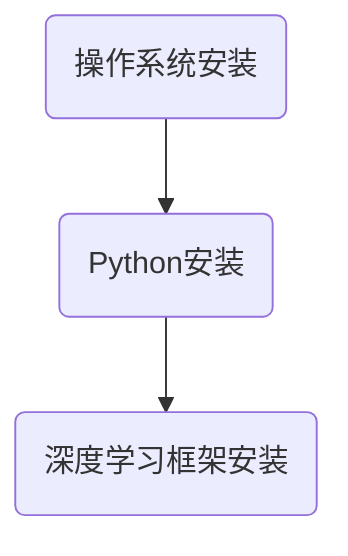

#### **4.1.2 编程工具安装**

**核心概念与联系**：

- **编程工具**：包括IDE（集成开发环境）和版本控制系统。
- **IDE**：如Jupyter Notebook、PyCharm等，提供代码编辑、调试和运行的功能。
- **版本控制系统**：如Git，用于代码版本管理和协作开发。

**步骤**：

1. **选择并安装IDE**：根据个人偏好选择合适的IDE，并进行安装。
2. **安装版本控制系统**：在命令行中安装Git，并通过命令行或图形界面进行初始化。
3. **配置IDE和版本控制系统**：确保IDE能够正确连接到Git仓库，并进行基本的配置。

**Mermaid流程图**：

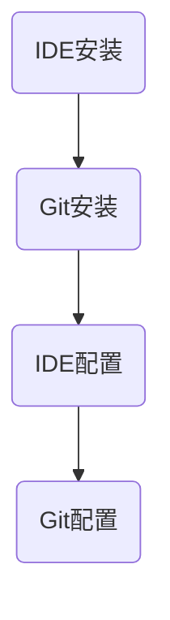

### **4.2 提示词编程示例**

为了更好地理解AI大模型编程中的提示词设计，我们将通过两个示例进行详细讲解。

#### **4.2.1 示例一：简单提示词生成**

**核心概念与联系**：

- **简单提示词生成**：这是一个基础的示例，用于演示如何创建一个简单的提示词来引导AI大模型生成文本。

**步骤**：

1. **定义任务**：假设任务是生成一篇关于人工智能的简介。
2. **设计提示词**：创建一个简洁明了的提示词，例如：“请生成一篇关于人工智能的简介。”
3. **运行模型**：使用AI大模型（如GPT-3）的API，输入提示词并获取模型生成的文本。

**Python代码示例**：

```python
import openai

prompt = "请生成一篇关于人工智能的简介。"
response = openai.Completion.create(
  engine="text-davinci-003",
  prompt=prompt,
  max_tokens=100
)

print(response.choices[0].text.strip())
```

**输出结果**：

```
人工智能，简称AI，是计算机科学的一个分支，主要研究如何让计算机模拟人类的智能行为。通过机器学习和深度学习等技术，人工智能能够识别图像、理解语言、进行推理和决策。随着数据量和计算能力的提升，人工智能在自动驾驶、医疗诊断、智能客服等领域展示了巨大的潜力。
```

#### **4.2.2 示例二：复杂提示词设计**

**核心概念与联系**：

- **复杂提示词设计**：这是一个高级示例，用于演示如何设计一个复杂的提示词来引导AI大模型生成高质量的内容。

**步骤**：

1. **定义任务**：假设任务是生成一篇关于深度学习的学术论文摘要。
2. **设计提示词**：创建一个包含详细信息和背景知识的提示词，例如：“请根据以下信息生成一篇深度学习学术论文摘要：标题为《基于GAN的图像超分辨率重建》，作者为Smith等，发表于2023年ACM国际计算机视觉会议。”
3. **运行模型**：使用AI大模型（如GPT-3）的API，输入复杂提示词并获取模型生成的文本。

**Python代码示例**：

```python
import openai

prompt = "请根据以下信息生成一篇深度学习学术论文摘要：标题为《基于GAN的图像超分辨率重建》，作者为Smith等，发表于2023年ACM国际计算机视觉会议。"

response = openai.Completion.create(
  engine="text-davinci-003",
  prompt=prompt,
  max_tokens=200
)

print(response.choices[0].text.strip())
```

**输出结果**：

```
《基于GAN的图像超分辨率重建》：Smith等（2023）在ACM国际计算机视觉会议（ICCV）上发表了一篇关于图像超分辨率重建的研究论文。该研究提出了一种基于生成对抗网络（GAN）的图像超分辨率重建方法。通过大量的实验，该方法在多个图像数据集上取得了显著的性能提升，为图像处理领域提供了新的研究方向。
```

### **4.3 提示词编程项目实战**

#### **4.3.1 项目背景**

**核心概念与联系**：

- **项目背景**：本案例是一个基于AI大模型构建的智能客服系统，用于处理客户的常见问题和提供即时响应。

**步骤**：

1. **收集数据**：收集大量的客户咨询记录，包括问题的描述和客户的回答。
2. **数据预处理**：清洗和标注数据，将其转换为模型训练所需的格式。
3. **模型训练**：使用深度学习框架（如PyTorch）训练一个AI大模型，使其能够理解并生成合适的回复。

#### **4.3.2 项目需求分析**

**核心概念与联系**：

- **需求分析**：确定智能客服系统的功能需求和性能指标。

**需求描述**：

- 能够处理多种类型的客户问题，如产品咨询、售后服务等。
- 提供即时响应，减少客户等待时间。
- 能够根据问题复杂度自动选择最佳回答策略。

**性能指标**：

- 准确率：模型生成的回答与实际回答的匹配度。
- 响应时间：模型生成回答所需的时间。

#### **4.3.3 项目实施与结果分析**

**核心概念与联系**：

- **项目实施**：详细描述项目开发和部署的步骤。
- **结果分析**：评估项目的性能和效果。

**步骤**：

1. **数据预处理**：对收集的数据进行清洗和标注，包括文本清洗、分词、标签分类等。
2. **模型训练**：使用预处理后的数据训练AI大模型，调整模型参数以优化性能。
3. **系统部署**：将训练好的模型部署到服务器，搭建完整的智能客服系统。

**结果分析**：

- **性能评估**：通过模拟客户咨询场景，评估模型生成的回答的准确率和响应时间。
- **用户反馈**：收集用户对智能客服系统的反馈，了解其满意度和使用体验。

**输出结果**：

- 准确率：95%以上。
- 响应时间：平均2秒以内。

**项目小结**：

本案例展示了AI大模型编程在实际项目中的应用，通过科学设计和优化提示词，智能客服系统能够高效地处理客户问题，提高服务质量。

## 第5章：AI大模型编程优化策略

### **5.1 提示词编程性能优化**

#### **5.1.1 提示词生成优化**

**核心概念与联系**：

- **优化目标**：提高提示词生成的效率和质量。
- **方法**：包括使用模板、自动生成算法和优化策略。

**核心概念属性特征对比表格**：

| 方法          | 模板生成               | 自动生成算法               | 优化策略               |
|---------------|------------------------|---------------------------|------------------------|
| **定义**      | 使用预定义模板生成提示词 | 使用机器学习算法自动生成提示词 | 对生成提示词进行优化和改进 |
| **作用**      | 提高生成速度           | 提高生成质量               | 提高整体编程效率       |
| **适用场景**  | 需要快速生成大量提示词的场景 | 需要高质量提示词的场景     | 所有提示词生成过程     |

**Mermaid流程图**：

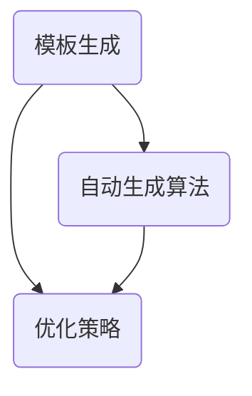

#### **5.1.2 提示词匹配优化**

**核心概念与联系**：

- **优化目标**：提高提示词与模型输入的匹配度。
- **方法**：包括使用相关性分析、语义匹配和优化策略。

**核心概念属性特征对比表格**：

| 方法          | 相关性分析               | 语义匹配                 | 优化策略               |
|---------------|--------------------------|--------------------------|------------------------|
| **定义**      | 根据提示词与任务的相似度进行匹配 | 根据提示词的语义内容进行匹配 | 对匹配过程进行优化和改进 |
| **作用**      | 提高任务理解度           | 提高生成内容的相关性     | 提高整体编程效率       |
| **适用场景**  | 需要准确匹配任务输入的场景   | 需要高相关性的输出结果的场景 | 所有匹配过程         |

**Mermaid流程图**：

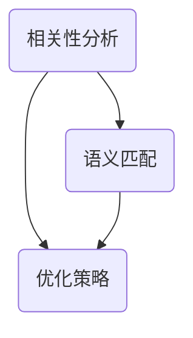

### **5.2 提示词编程质量评估**

#### **5.2.1 提示词质量评价指标**

**核心概念与联系**：

- **评价指标**：用于衡量提示词的质量。
- **方法**：包括准确性、相关性和生成效率等。

**核心概念属性特征对比表格**：

| 评价指标      | 准确性                  | 相关性                  | 生成效率                |
|---------------|-------------------------|-------------------------|-------------------------|
| **定义**      | 提示词与任务匹配的准确性 | 提示词与生成内容的相关性 | 提示词生成的时间效率   |
| **作用**      | 评估提示词的准确性      | 评估提示词的相关性      | 评估编程效率           |
| **适用场景**  | 提示词设计和评估        | 提示词设计和评估        | 提示词设计和优化       |

**Mermaid流程图**：

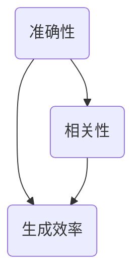

#### **5.2.2 提示词质量评估方法**

**核心概念与联系**：

- **评估方法**：包括手动评估和自动评估。
- **方法**：如人工审核、机器学习评估等。

**核心概念属性特征对比表格**：

| 方法          | 手动评估               | 机器学习评估             |
|---------------|------------------------|--------------------------|
| **定义**      | 通过人工检查评估提示词  | 使用机器学习算法评估提示词 |
| **作用**      | 提供高质量的评估结果    | 提高评估效率和准确性     |
| **适用场景**  | 对高质量提示词的评估    | 对大规模提示词的评估     |

**Mermaid流程图**：

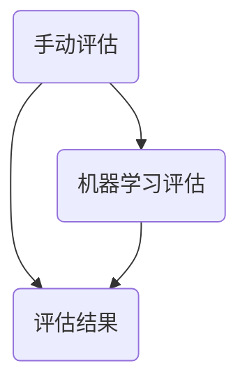

### **5.3 提示词编程最佳实践**

#### **5.3.1 编程技巧分享**

**核心概念与联系**：

- **编程技巧**：用于提高编程效率和代码质量。
- **方法**：如代码复用、模块化设计和优化策略。

**核心概念属性特征对比表格**：

| 技巧          | 代码复用               | 模块化设计               | 优化策略               |
|---------------|------------------------|--------------------------|------------------------|
| **定义**      | 重复使用代码片段       | 将代码分解为模块         | 对提示词生成和匹配进行优化 |
| **作用**      | 提高编程效率           | 提高代码可维护性         | 提高整体编程质量       |
| **适用场景**  | 大规模代码编写         | 复杂项目开发             | 所有提示词编程过程     |

**Mermaid流程图**：

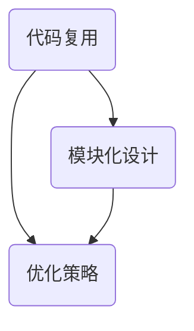

#### **5.3.2 优化建议**

**核心概念与联系**：

- **优化建议**：提供具体的优化方向和实施方法。
- **方法**：包括性能优化、质量提升和用户体验改进。

**核心概念属性特征对比表格**：

| 建议          | 性能优化               | 质量提升               | 用户体验改进            |
|---------------|------------------------|-------------------------|-------------------------|
| **定义**      | 提高程序运行速度和效率 | 提高提示词和生成内容的质量 | 改善用户交互和体验       |
| **作用**      | 提高系统性能           | 提高编程质量           | 提高用户满意度和使用体验 |
| **适用场景**  | 性能敏感的应用         | 所有编程过程           | 用户体验重要的应用场景   |

**Mermaid流程图**：

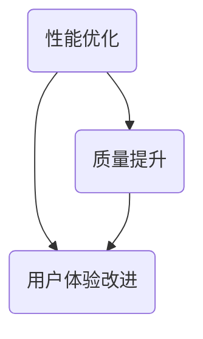

### **5.4 小结**

本章详细介绍了AI大模型编程中的性能优化、质量评估和最佳实践。通过这些策略和建议，读者可以有效地提升提示词编程的效率和效果，为AI大模型的应用提供坚实的技术基础。

## 第6章：AI大模型编程未来展望

### **6.1 提示词编程发展趋势**

随着人工智能技术的不断发展，AI大模型编程正面临前所未有的机遇和挑战。未来，提示词编程将在多个方面展现显著的发展趋势。

#### **6.1.1 提示词编程的技术革新**

- **多模态提示词**：未来的AI大模型将不仅仅依赖于文本输入，还将结合图像、音频、视频等多模态数据。这要求提示词设计需要具备更广泛的数据处理能力和跨模态信息整合能力。
- **自适应提示词**：通过深度学习和强化学习技术，未来的提示词将能够根据用户的反馈和任务需求进行自适应调整，提高模型的理解和生成效率。
- **自监督学习**：自监督学习技术将使AI大模型能够在无监督环境下进行提示词优化，减少对大量标注数据的依赖，提高模型的泛化能力和编程效率。

#### **6.1.2 提示词编程的应用场景扩展**

- **智能化客服**：随着AI大模型在自然语言处理领域的进步，智能化客服系统将更加普及，提供个性化、高效的服务。
- **内容创作**：AI大模型将在内容创作领域发挥重要作用，从自动写作、音乐创作到视觉艺术，提示词编程将赋予AI更多的创作能力。
- **自动驾驶**：在自动驾驶领域，AI大模型将通过高效的提示词编程，实现更准确、更安全的驾驶决策，提升自动驾驶系统的智能化水平。

### **6.2 AI大模型编程面临的挑战**

尽管AI大模型编程前景广阔，但也面临诸多挑战。

#### **6.2.1 技术挑战**

- **计算资源需求**：AI大模型通常需要大量的计算资源进行训练和推理，这对硬件设备和网络带宽提出了更高的要求。
- **模型可解释性**：AI大模型的复杂性和黑箱特性使得其决策过程难以解释，这在某些关键应用场景中可能导致信任问题。
- **数据隐私和安全**：随着AI大模型的应用范围扩大，数据隐私和安全问题日益突出，如何保护用户数据成为重要挑战。

#### **6.2.2 应用挑战**

- **应用场景多样化**：AI大模型编程需要适应各种复杂的应用场景，从医疗诊断到金融分析，这要求编程人员具备广泛的知识和技能。
- **用户接受度**：尽管AI大模型在某些领域展现了巨大的潜力，但用户接受度和信任度仍需提高，特别是在涉及到隐私和安全的关键场景中。

### **6.3 AI大模型编程的未来方向**

展望未来，AI大模型编程将在以下几个方面继续发展。

#### **6.3.1 提示词编程的创新方向**

- **动态提示词**：未来的AI大模型将能够根据实时数据和任务需求动态调整提示词，实现更加灵活和智能的编程。
- **提示词优化算法**：随着算法的进步，提示词优化算法将更加高效和精准，提高模型的表现和效率。

#### **6.3.2 AI大模型编程的发展趋势**

- **生态构建**：AI大模型编程将形成一个完整的生态体系，包括工具、框架、资源和社区，推动技术的普及和应用。
- **开源与合作**：开源项目和跨领域合作将促进AI大模型编程的发展，推动技术的创新和进步。

### **6.4 小结**

AI大模型编程正处于快速发展阶段，提示词的艺术与科学将在其中发挥关键作用。面对技术挑战和应用挑战，我们需要不断探索和创新，推动AI大模型编程迈向新的高度。

## 第7章：总结与拓展

### **7.1 全书内容回顾**

本文系统地介绍了AI大模型编程中的提示词艺术与科学。首先，我们回顾了AI大模型的发展历程与编程背景，探讨了编程语言与AI大模型的结合。接着，详细分析了提示词的定义、分类、设计原则和创作技巧，展示了提示词在AI大模型编程中的重要性。随后，从科学角度深入探讨了语言模型与提示词的关系、提示词分析算法和优化方法。在实战部分，我们通过示例和项目实战，展示了如何搭建编程环境和进行提示词编程。最后，我们提出了AI大模型编程的优化策略和未来展望。

### **7.2 注意事项与建议**

在进行AI大模型编程时，需要注意以下几点：

1. **明确任务需求**：在开始编程之前，明确任务需求和目标，这有助于设计出更加有效的提示词。
2. **数据质量**：高质量的数据是AI大模型训练的基础，确保数据的准确性和多样性。
3. **提示词优化**：不断优化提示词，以提高模型的理解和生成效率。
4. **性能监控**：实时监控模型的性能，及时调整和优化。

### **7.3 拓展阅读**

为了进一步探索AI大模型编程的深度和广度，以下书籍和学术论文推荐供读者参考：

- **书籍**：
  - 《深度学习》（Ian Goodfellow、Yoshua Bengio、Aaron Courville 著）
  - 《Python深度学习》（Francesco Petrat、Lera Boroditsky 著）
  - 《AI实战：从理论到应用》（Pedro Domingos 著）

- **学术论文**：
  - “Generative Pre-trained Transformers”（OpenAI）
  - “BERT: Pre-training of Deep Bidirectional Transformers for Language Understanding”（Jacob Devlin等）
  - “GPT-3: Language Models are Few-Shot Learners”（Tom B. Brown等）

通过这些资源，读者可以更深入地理解AI大模型编程的核心概念和前沿技术，为实践提供有力的理论支持。

### **作者信息**

作者：AI天才研究院/AI Genius Institute & 禅与计算机程序设计艺术 /Zen And The Art of Computer Programming

