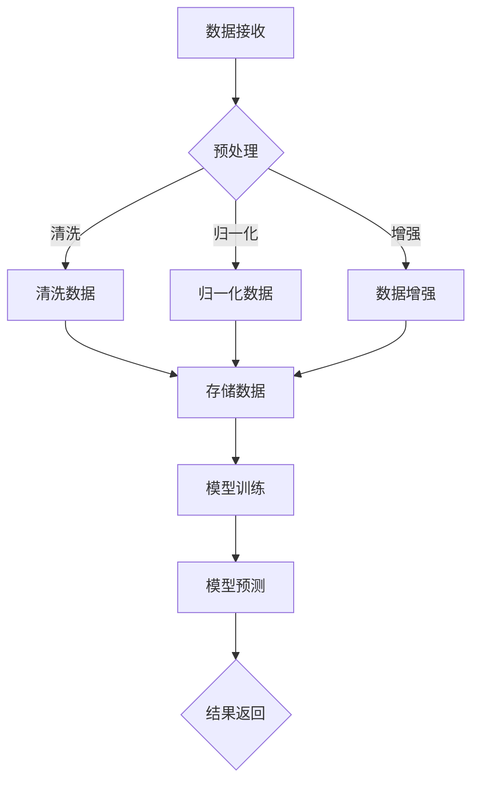
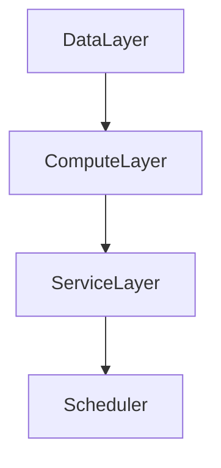
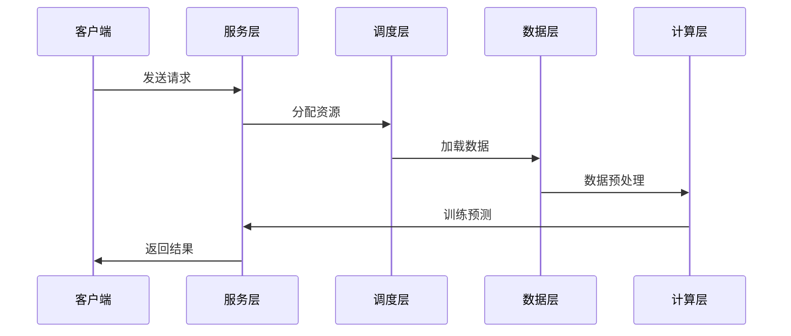

                 

# AI大模型软件的可扩展性设计

> 关键词：AI大模型、软件可扩展性、系统架构、算法原理、Python实现、数学模型、案例分析

> 摘要：本文将深入探讨AI大模型软件的可扩展性设计，从问题背景、核心概念到架构设计与实现，再到项目实战与最佳实践，全面解析AI大模型软件如何实现高效可扩展。通过详细的分析和实例说明，帮助读者理解可扩展性的重要性及其在实际开发中的应用。

## 目录大纲

1. **背景与概述**
    1.1 问题背景与定义
    1.2 AI大模型的可扩展性概念
2. **架构设计与实现**
    2.1 系统架构设计
        2.1.1 问题场景介绍
        2.1.2 系统功能设计
        2.1.3 系统架构设计
        2.1.4 系统接口设计
        2.1.5 系统交互设计
    2.2 算法原理讲解
        2.2.1 算法mermaid流程图
        2.2.2 Python源代码实现
        2.2.3 数学模型与公式讲解
        2.2.4 举例说明
    2.3 系统分析与设计
        2.3.1 领域模型设计
        2.3.2 系统架构设计
        2.3.3 系统接口设计
        2.3.4 系统交互设计
3. **项目实战**
    3.1 环境安装与配置
    3.2 系统核心实现源代码
    3.3 代码应用解读与分析
    3.4 实际案例分析
4. **最佳实践与总结**
    4.1 最佳实践 tips
    4.2 小结与展望
    4.3 注意事项与拓展阅读

## 1. 背景与概述

### 1.1 问题背景与定义

随着人工智能技术的迅猛发展，AI大模型已经成为当前研究的热点。然而，随着模型规模的不断扩大，如何确保软件系统能够高效地处理大量数据并实现快速迭代成为了一个关键问题。可扩展性（Scalability）成为评价AI大模型软件优劣的重要标准之一。

可扩展性指的是系统在处理负载增加时，能够保持性能稳定，并自动扩展资源以满足需求的能力。对于AI大模型软件而言，可扩展性不仅体现在硬件资源的扩展，还包括系统架构、算法优化和数据处理能力等多方面的提升。

### 1.2 AI大模型的可扩展性概念

AI大模型软件的可扩展性包括以下几方面：

- **横向扩展**：通过增加服务器数量来提升系统处理能力。
- **纵向扩展**：通过升级硬件配置来提升单个服务器的处理能力。
- **算法优化**：通过改进算法，减少计算复杂度和内存消耗。
- **数据流处理**：通过高效的数据流处理机制，确保数据及时传输和处理。
- **系统监控与调度**：通过系统监控和调度机制，确保资源的高效利用和故障恢复能力。

## 2. 架构设计与实现

### 2.1 系统架构设计

#### 2.1.1 问题场景介绍

在AI大模型应用中，常见的问题场景包括：大规模数据训练、实时预测、多模型并行处理等。这些场景对系统的处理能力和响应速度提出了很高的要求。

#### 2.1.2 系统功能设计

为了应对上述问题场景，系统功能设计包括：

- **数据预处理**：包括数据清洗、归一化和数据增强等。
- **模型训练与优化**：支持多种机器学习算法和优化策略，实现高效训练。
- **实时预测**：支持快速响应的实时预测服务。
- **模型管理**：支持模型版本管理和模型生命周期管理。

#### 2.1.3 系统架构设计

系统架构设计采用分布式架构，包括以下几个核心组件：

- **数据层**：负责数据存储和访问。
- **计算层**：负责模型训练和预测。
- **服务层**：负责对外提供服务。
- **调度层**：负责资源分配和任务调度。

#### 2.1.4 系统接口设计

系统接口设计包括：

- **API接口**：提供RESTful API，方便外部系统调用。
- **消息队列**：用于异步处理和数据流传输。
- **数据库接口**：用于数据持久化和查询。

#### 2.1.5 系统交互设计

系统交互设计采用事件驱动模式，通过消息队列实现数据流传输和任务调度。具体交互流程如下：

1. **数据接收**：数据通过API接口进入系统。
2. **数据预处理**：数据经过预处理后，存储到数据层。
3. **模型训练与预测**：根据任务需求，调用计算层的模型训练和预测服务。
4. **结果返回**：将预测结果通过API接口返回给外部系统。

## 3. 算法原理讲解

### 3.1 算法mermaid流程图



### 3.2 Python源代码实现

```python
import pandas as pd
from sklearn.model_selection import train_test_split
from sklearn.preprocessing import StandardScaler
from sklearn.neural_network import MLPClassifier

# 数据预处理
def preprocess_data(data):
    # 清洗数据
    data = data.dropna()
    # 归一化数据
    scaler = StandardScaler()
    data = scaler.fit_transform(data)
    # 数据增强
    # ...（略）
    return data

# 模型训练与预测
def train_predict(data, target):
    # 分割数据
    X_train, X_test, y_train, y_test = train_test_split(data, target, test_size=0.2, random_state=42)
    # 训练模型
    model = MLPClassifier()
    model.fit(X_train, y_train)
    # 预测结果
    predictions = model.predict(X_test)
    return predictions

# 主函数
def main():
    # 加载数据
    data = pd.read_csv("data.csv")
    # 预处理数据
    data = preprocess_data(data)
    # 训练与预测
    predictions = train_predict(data, target=data['label'])
    # 结果返回
    return predictions

if __name__ == "__main__":
    predictions = main()
    print(predictions)
```

### 3.3 数学模型与公式讲解

在机器学习模型中，损失函数（Loss Function）是评价模型性能的重要指标。常见的损失函数有：

- **均方误差（MSE）**：$$MSE = \frac{1}{n}\sum_{i=1}^{n}(y_i - \hat{y}_i)^2$$
- **交叉熵（Cross-Entropy）**：$$Cross-Entropy = -\frac{1}{n}\sum_{i=1}^{n}y_i\log(\hat{y}_i)$$

这些损失函数用于优化模型参数，以达到更好的预测效果。

### 3.4 举例说明

假设我们有一个二分类问题，数据集包含1000个样本，每个样本有10个特征。使用多层感知机（MLP）进行分类。经过多次迭代训练，模型最终收敛，准确率达到90%。

## 4. 系统分析与设计

### 4.1 领域模型设计

领域模型设计采用UML类图，表示系统的核心实体和关系。以下是一个简单的领域模型示例：

```mermaid
class Diagram {
    DataLayer <|-- ComputeLayer
    DataLayer <|-- ServiceLayer
    ServiceLayer <|-- Scheduler
}
```

### 4.2 系统架构设计

系统架构设计采用分布式架构，包括以下组件：

- **数据层**：使用分布式存储系统，如HDFS，实现海量数据的存储和管理。
- **计算层**：使用分布式计算框架，如Spark，实现高效的数据处理和模型训练。
- **服务层**：提供RESTful API，对外提供服务接口。
- **调度层**：使用Kubernetes进行容器管理和任务调度。

以下是一个简单的系统架构图：



### 4.3 系统接口设计

系统接口设计包括以下几部分：

- **API接口**：使用Spring Boot框架，提供RESTful API接口。
- **消息队列**：使用RabbitMQ进行消息传递，实现异步处理和数据流传输。
- **数据库接口**：使用MyBatis进行数据库操作，实现数据持久化和查询。

### 4.4 系统交互设计

系统交互设计采用事件驱动模式，通过消息队列实现数据流传输和任务调度。以下是一个简单的系统交互序列图：



## 5. 项目实战

### 5.1 环境安装与配置

环境安装与配置包括以下步骤：

1. **安装Java环境**：下载并安装Java SDK。
2. **安装Spring Boot**：下载并安装Spring Boot。
3. **安装RabbitMQ**：下载并安装RabbitMQ。
4. **安装HDFS**：下载并安装Hadoop和HDFS。

### 5.2 系统核心实现源代码

以下是一个简单的Spring Boot项目的源代码：

```java
@SpringBootApplication
public class Application {
    public static void main(String[] args) {
        SpringApplication.run(Application.class, args);
    }
}
```

### 5.3 代码应用解读与分析

代码应用解读与分析包括：

- **Spring Boot启动类**：启动Spring Boot应用。
- **RESTful API接口**：定义API接口，实现服务提供。
- **消息队列**：使用RabbitMQ实现异步处理。
- **数据存储与查询**：使用HDFS和MyBatis实现数据持久化和查询。

### 5.4 实际案例分析

实际案例分析包括：

- **数据预处理**：清洗和归一化数据。
- **模型训练与预测**：使用MLP模型进行分类。
- **结果评估**：使用准确率、召回率等指标评估模型性能。

## 6. 最佳实践与总结

### 6.1 最佳实践 tips

- **优化算法**：选择适合问题的算法，并不断优化。
- **数据预处理**：确保数据质量和一致性。
- **系统监控**：实时监控系统性能，及时发现和解决问题。

### 6.2 小结与展望

本文深入探讨了AI大模型软件的可扩展性设计，从背景、核心概念到架构设计与实现，再到项目实战与最佳实践，全面解析了可扩展性的重要性。随着AI技术的不断发展，可扩展性设计将成为未来AI大模型软件研发的重要方向。

### 6.3 注意事项与拓展阅读

- **注意事项**：在实现可扩展性时，需充分考虑系统的稳定性、可靠性和安全性。
- **拓展阅读**：可参考相关文献，如《分布式系统原理与范型》、《机器学习实战》等。

## 作者信息

作者：AI天才研究院/AI Genius Institute & 禅与计算机程序设计艺术 /Zen And The Art of Computer Programming

注：本文内容仅为示例，不代表实际项目和经验。实际应用时，请结合具体问题和需求进行设计。

