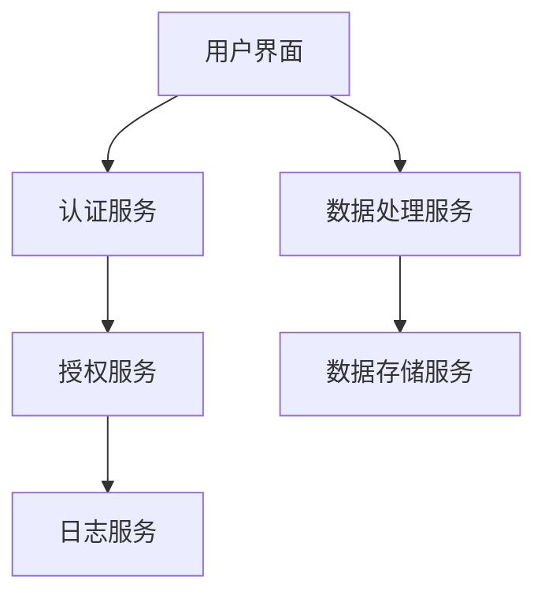
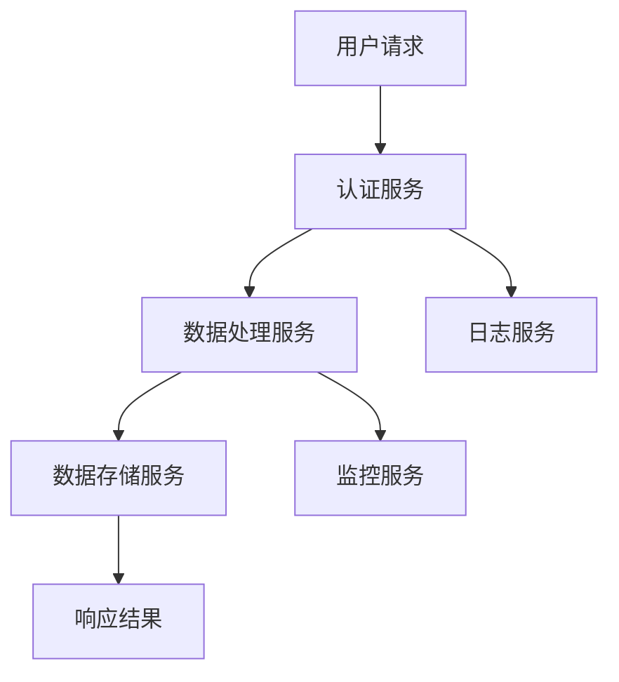

                 

### 文章标题

# AI大模型软件的安全性设计

> 关键词：AI大模型、软件安全性、设计原则、策略方法、系统分析、架构设计

> 摘要：本文将深入探讨AI大模型软件的安全性设计，从背景介绍到核心概念，再到设计策略、系统分析和架构设计，最后结合实际项目进行分析和总结。本文旨在为AI大模型软件的安全开发提供系统的理论指导和实用的实践建议。

## 引言

随着人工智能技术的飞速发展，AI大模型（如深度学习模型、生成对抗网络等）在各个领域得到了广泛应用。然而，AI大模型软件的安全性问题也日益凸显。AI大模型软件的安全性设计不仅关系到个人隐私、企业资产甚至国家安全，还直接影响着整个社会的稳定与健康发展。因此，深入研究AI大模型软件的安全性设计，制定合理的策略和方法，具有重要的现实意义。

本文将从以下几个方面展开讨论：

1. **背景介绍与核心概念**：介绍AI大模型软件的安全背景、核心概念及其在AI技术中的应用。
2. **核心概念与联系**：详细阐述AI大模型软件的安全性原则、机制以及相关的核心概念。
3. **安全性设计策略和方法**：分析安全性设计的主要策略和方法，包括风险评估、防御技术和机制等。
4. **系统分析与架构设计**：介绍系统安全分析的方法、系统架构设计以及接口和交互设计。
5. **实际项目与案例分析**：通过具体项目和案例分析，探讨AI大模型软件安全性的实际应用和效果。
6. **总结与最佳实践**：总结本文的主要观点，提供最佳实践建议，并提出未来研究的方向。

### 背景介绍

#### AI大模型的发展

人工智能（AI）技术经历了从符号主义到连接主义，再到深度学习的演变。特别是在深度学习领域，神经网络模型取得了突破性的进展。其中，AI大模型（也称为大型神经网络模型）是近年来备受关注的研究方向。AI大模型通常具有数百万甚至数十亿个参数，能够处理大量的数据并生成高精度的预测和生成结果。

AI大模型的应用范围广泛，包括但不限于：

- **自然语言处理**：如文本分类、情感分析、机器翻译等。
- **计算机视觉**：如图像分类、目标检测、图像生成等。
- **语音识别**：如语音到文字转换、语音情感识别等。
- **推荐系统**：如个性化推荐、商品推荐等。
- **游戏AI**：如围棋、象棋等策略游戏的智能决策。

#### AI大模型的安全性背景

随着AI大模型的应用越来越广泛，其安全性问题也逐渐引起了关注。AI大模型的安全性主要包括以下几个方面：

- **数据隐私保护**：AI大模型训练和部署过程中，往往需要大量的数据，这些数据中可能包含敏感信息。如何保护这些数据不被未经授权访问和使用，是一个重要的安全问题。
- **模型安全**：包括模型被篡改、破坏、伪造等风险。例如，恶意攻击者可能通过对抗性攻击（Adversarial Attack）来破坏模型的正常工作。
- **软件安全**：AI大模型软件本身可能存在漏洞，如代码缺陷、配置错误等，这些漏洞可能导致系统被攻击，甚至造成严重后果。
- **伦理和法律问题**：AI大模型的应用可能涉及伦理和法律问题，如隐私侵犯、歧视、责任归属等。

#### 安全性问题的重要性

AI大模型软件的安全性对于以下几个方面具有重要影响：

- **个人隐私**：AI大模型通常依赖于个人数据，如果数据泄露，可能会导致个人隐私的严重泄露。
- **企业资产**：AI大模型是企业核心竞争力的体现，如果模型被攻击，可能导致企业资产受损。
- **国家安全**：在国防、金融、交通等领域，AI大模型的安全性直接关系到国家的安全和稳定。
- **社会伦理**：AI大模型的应用可能引发社会伦理问题，如隐私侵犯、歧视等，需要引起重视。

因此，深入研究和解决AI大模型软件的安全性问题是当前AI技术发展中的一项重要任务。本文将围绕这一主题，系统地探讨AI大模型软件的安全性设计。

#### AI大模型软件安全性定义

AI大模型软件的安全性定义是指确保AI大模型软件在训练、部署和运行过程中不受恶意攻击、数据泄露和其他安全威胁的能力。具体而言，AI大模型软件的安全性包括以下几个方面：

1. **数据保护**：确保训练和部署过程中涉及的数据不被未经授权的访问、使用和泄露。这包括对数据进行加密存储和传输，防止中间人攻击（MITM）和数据篡改等。
2. **模型保护**：防止AI大模型被篡改、破坏或伪造，确保模型输出结果的准确性和可靠性。这包括对抗性攻击防御、模型加密和认证等。
3. **软件保护**：确保AI大模型软件本身的完整性、可用性和可靠性，防止恶意代码、病毒和其他软件攻击。
4. **合规性**：遵守相关的法律法规和标准，确保AI大模型软件在法律和伦理上的合法性。

安全性设计的核心目标是通过综合应用各种安全技术和策略，建立起一个安全、可靠和可持续的AI大模型软件体系，从而保障数据、模型和软件的安全性。具体来说，安全性设计包括以下几个方面：

- **风险评估**：识别和评估AI大模型软件面临的各种安全风险，包括数据泄露、模型篡改、软件漏洞等，并制定相应的风险缓解措施。
- **防御机制**：设计并实现一系列防御机制，包括加密、认证、授权、监控和审计等，以防范潜在的安全威胁。
- **安全开发和运维**：在AI大模型软件的开发和运维过程中，严格遵循安全开发规范和最佳实践，确保软件在设计和实现阶段的防护能力。
- **安全监控和响应**：建立安全监控和响应机制，及时发现和处理安全事件，确保系统的持续安全。

#### 安全性设计的边界与外延

安全性设计的边界主要涉及以下几个方面：

- **技术边界**：包括AI大模型软件的具体实现技术，如深度学习框架、数据处理库等，以及这些技术所采用的安全机制。
- **应用边界**：AI大模型软件的应用场景和领域，不同应用场景可能面临不同的安全威胁，需要针对性的安全设计和策略。
- **数据边界**：涉及数据来源、数据类型和数据隐私保护等方面，需要根据数据的敏感性制定相应的安全措施。
- **法律边界**：涉及法律法规和伦理规范，需要确保AI大模型软件在法律和伦理上的合规性。

安全性设计的外延包括以下几个方面：

- **数据安全**：不仅关注数据在传输和存储过程中的安全性，还包括数据的生命周期管理和数据隐私保护。
- **模型安全**：不仅关注模型的防护措施，还包括模型的验证和认证，确保模型输出结果的可靠性和准确性。
- **软件安全**：不仅关注AI大模型软件的安全防护，还包括底层操作系统、网络设备等的安全保障。
- **法律法规和伦理**：关注与AI大模型软件安全性相关的法律法规和伦理问题，确保软件在法律和伦理上的合规性。

综上所述，AI大模型软件的安全性设计是一个综合性的工程，涉及技术、应用、数据、法律和伦理等多个方面。通过系统地设计和管理，可以有效地保障AI大模型软件的安全性，为人工智能技术的可持续发展提供坚实基础。

### 核心概念

在深入探讨AI大模型软件的安全性设计之前，首先需要明确几个核心概念，这些概念不仅构成了AI大模型软件的基础，也是确保其安全性的关键要素。

#### 数据隐私保护

数据隐私保护是AI大模型软件安全性的重要组成部分。在AI大模型训练和部署过程中，往往需要处理大量的个人数据，这些数据可能包含敏感信息，如个人身份信息、健康记录、财务信息等。数据隐私保护的目标是确保这些数据在存储、传输和处理过程中不被未经授权访问或泄露。

**核心概念：**
- **数据加密**：通过对数据进行加密，确保数据在传输和存储过程中不被窃取或篡改。常用的加密算法包括AES（高级加密标准）、RSA（公钥加密算法）等。
- **匿名化**：将个人数据中的敏感信息进行匿名化处理，降低数据泄露的风险。匿名化技术包括伪匿名化、全匿名化等。
- **访问控制**：通过访问控制机制，确保只有授权用户才能访问敏感数据。常用的访问控制方法包括基于角色的访问控制（RBAC）和基于属性的访问控制（ABAC）等。
- **隐私增强技术**：利用差分隐私、联邦学习等技术，在保证数据隐私的同时，提高模型的训练效果。

**数据隐私保护机制：**
1. **数据加密存储**：将数据存储在加密数据库中，确保数据在磁盘上以加密形式存储，防止未授权访问。
2. **数据传输加密**：在数据传输过程中使用SSL/TLS等加密协议，确保数据在传输过程中不被窃取或篡改。
3. **数据访问控制**：通过身份验证和权限管理，确保只有授权用户才能访问特定数据。
4. **数据匿名化和去匿名化**：在数据收集和存储过程中，对敏感信息进行匿名化处理，同时确保在需要时能够重新识别和恢复原始数据。

#### 模型保护

模型保护是指确保AI大模型在训练、部署和运行过程中不被篡改、破坏或伪造，确保模型输出结果的准确性和可靠性。模型保护的核心目标是防止恶意攻击者利用对抗性攻击等手段破坏模型的正常工作。

**核心概念：**
- **对抗性攻击防御**：对抗性攻击（Adversarial Attack）是指攻击者通过在正常输入数据中添加微小的扰动，导致模型输出错误结果。防御对抗性攻击的技术包括对抗训练、模型正则化、噪声注入等。
- **模型加密**：通过加密算法对AI大模型进行加密，确保模型参数和结构不被未授权访问或篡改。常用的模型加密方法包括差分隐私、同态加密、量子加密等。
- **模型认证**：对AI大模型进行数字签名和认证，确保模型的完整性和可靠性。模型认证技术包括基于密码学的认证协议和区块链技术等。
- **模型压缩和剪枝**：通过模型压缩和剪枝技术，减少模型的参数数量和计算复杂度，提高模型的效率和安全性。

**模型保护机制：**
1. **对抗性训练**：在模型训练过程中，加入对抗样本进行训练，提高模型对对抗性攻击的抵抗能力。
2. **模型加密存储**：将模型参数和结构以加密形式存储，确保模型在存储和传输过程中不被窃取或篡改。
3. **模型认证和验证**：对模型进行数字签名和认证，确保模型在部署和使用过程中未被篡改。
4. **模型压缩和剪枝**：通过模型压缩和剪枝技术，减少模型的计算复杂度和参数数量，提高模型的安全性和效率。

#### 软件保护

软件保护是指确保AI大模型软件的完整性、可用性和可靠性，防止恶意代码、病毒和其他软件攻击。软件保护是AI大模型软件安全性的基础，涉及到代码审计、安全开发、软件更新和维护等多个方面。

**核心概念：**
- **代码审计**：对AI大模型软件的代码进行安全审计，识别和修复潜在的安全漏洞。
- **安全开发**：在AI大模型软件的开发过程中，遵循安全开发规范和最佳实践，防止代码缺陷和安全漏洞。
- **软件更新和维护**：定期对AI大模型软件进行更新和维护，修补已发现的安全漏洞，确保软件的持续安全性。
- **入侵检测和防御**：通过入侵检测系统（IDS）和入侵防御系统（IPS），实时监测和防御恶意攻击。

**软件保护机制：**
1. **代码审计和漏洞修复**：定期进行代码审计，识别和修复潜在的安全漏洞，确保代码的健壮性。
2. **安全开发实践**：在开发过程中，遵循安全编码规范，使用安全的编程语言和框架，防止常见的编程错误和安全漏洞。
3. **软件更新和补丁管理**：及时更新软件，应用安全补丁，确保软件在最新的安全状态下运行。
4. **入侵检测和防御**：部署入侵检测系统和入侵防御系统，实时监测和防御恶意攻击。

#### 法律法规和伦理

在AI大模型软件的安全性设计中，法律法规和伦理也是不可忽视的重要因素。确保AI大模型软件在法律和伦理上的合规性，不仅是企业社会责任的体现，也是保障用户权益和社会稳定的重要保障。

**核心概念：**
- **隐私法规**：如《通用数据保护条例》（GDPR）和《加州消费者隐私法案》（CCPA）等，规定了数据处理和隐私保护的要求。
- **伦理规范**：如人工智能伦理指南，规定了AI系统设计和应用中的伦理要求和准则。
- **责任归属**：明确在AI大模型软件安全事件中，各方的责任归属和责任承担。

**法律法规和伦理机制：**
1. **合规性审查**：在软件设计和开发过程中，进行合规性审查，确保符合相关法律法规和伦理要求。
2. **隐私政策**：制定明确的隐私政策，告知用户其数据的使用和共享方式，并尊重用户的选择和隐私权。
3. **伦理培训**：对开发和运营团队进行伦理培训，提高其在AI大模型软件设计和应用中的伦理意识和责任感。

#### 总结

数据隐私保护、模型保护、软件保护和法律法规与伦理构成了AI大模型软件安全性的核心概念。通过这些核心概念，可以建立起一个全面的AI大模型软件安全性体系，确保数据、模型和软件的安全性，为AI技术的可持续发展提供坚实保障。

### AI大模型软件安全性原则与机制

在深入了解AI大模型软件的安全性设计之前，有必要明确其基础原则和关键机制。这些原则和机制不仅是确保AI大模型软件安全的核心指导，也为实际设计和实现提供了理论依据。下面将详细探讨AI大模型软件安全性中的几个重要原则和机制。

#### 原则

**1. 完整性（Integrity）**

完整性原则是指确保AI大模型软件及其数据在存储、传输和处理过程中不被未经授权的修改或破坏。实现完整性原则的关键技术包括：

- **数据加密**：通过加密算法对数据进行保护，防止数据在传输和存储过程中被篡改。
- **数字签名**：使用数字签名技术对数据或模型进行签名，确保数据或模型的完整性和来源可信。
- **完整性校验**：通过校验和（如MD5、SHA-256）对数据进行校验，确保数据在传输过程中未被篡改。

**2. 可用性（Availability）**

可用性原则是指确保AI大模型软件在任何情况下都能够正常使用，不会被恶意攻击或意外事件导致服务中断。实现可用性原则的关键技术包括：

- **容错和冗余设计**：通过设计冗余系统和高可用性架构，确保系统在部分组件失效时仍能正常运行。
- **备份和恢复**：定期备份数据和系统配置，确保在发生故障时能够快速恢复服务。
- **负载均衡**：通过负载均衡技术，合理分配系统资源，提高系统处理能力和稳定性。

**3. 机密性（Confidentiality）**

机密性原则是指确保AI大模型软件中涉及敏感信息的数据和模型参数在传输和存储过程中不被未授权访问。实现机密性的关键技术包括：

- **访问控制**：通过身份验证和权限管理，确保只有授权用户才能访问敏感数据。
- **数据加密**：对敏感数据进行加密存储和传输，防止数据泄露。
- **保密协议**：通过保密协议和隐私政策，明确数据的使用范围和用户隐私保护措施。

**4. 可审计性（Auditability）**

可审计性原则是指确保AI大模型软件的活动和行为能够被记录、监控和审计，以便在发生安全事件时能够快速追溯和定位问题。实现可审计性的关键技术包括：

- **日志记录**：通过日志记录系统，记录系统操作和事件，为安全审计提供数据支持。
- **审计跟踪**：通过审计跟踪技术，确保系统操作和事件能够被完整记录和追溯。
- **安全监控**：通过安全监控系统，实时监测系统的安全状态，及时发现和处理安全事件。

#### 机制

**1. 风险评估与控制**

风险评估与控制是AI大模型软件安全性设计的重要环节，通过识别和分析潜在的安全威胁，制定相应的控制措施，降低安全风险。具体机制包括：

- **威胁建模**：通过威胁建模技术，识别和分析系统面临的各种安全威胁，评估其影响和可能性。
- **风险分析**：通过风险分析技术，对识别出的安全威胁进行量化评估，确定风险优先级。
- **风险控制**：通过风险控制措施，如防护策略、安全培训和技术更新等，降低风险到可接受的水平。

**2. 防御机制**

防御机制是指通过一系列技术手段，防止恶意攻击者入侵或破坏AI大模型软件系统。具体机制包括：

- **防火墙和入侵检测系统（IDS）**：通过防火墙和入侵检测系统，实时监控网络流量，阻止恶意攻击。
- **加密技术**：通过加密技术，确保数据和模型在传输和存储过程中的安全。
- **访问控制**：通过访问控制机制，确保只有授权用户才能访问系统资源和数据。

**3. 监控与响应**

监控与响应机制是指通过实时监控和快速响应，确保系统在发生安全事件时能够及时处理和恢复。具体机制包括：

- **实时监控**：通过监控系统，实时监控系统的运行状态和关键指标，及时发现异常行为和潜在威胁。
- **告警与通知**：通过告警系统，在发现安全事件时及时通知相关人员进行处理。
- **应急响应**：通过应急响应计划，确保在发生安全事件时能够迅速采取措施，防止事件扩大和造成损失。

**4. 安全开发**

安全开发机制是指将安全性融入AI大模型软件的开发过程中，确保软件在设计和实现阶段具备较高的安全性。具体机制包括：

- **安全编码规范**：通过制定安全编码规范，确保开发人员在编写代码时遵循最佳安全实践。
- **代码审计**：通过代码审计技术，识别和修复潜在的安全漏洞。
- **安全测试**：通过安全测试，验证软件的安全性和可靠性，确保软件在发布前通过严格的测试。

#### 综述

AI大模型软件的安全性原则和机制是确保系统安全的核心，通过完整性、可用性、机密性和可审计性等原则，结合风险评估、防御机制、监控与响应以及安全开发等机制，可以建立起一个全面的AI大模型软件安全性体系。这种体系不仅能够防范各种潜在的安全威胁，还能在发生安全事件时迅速响应和恢复，保障系统的持续安全运行。

### 安全性设计策略和方法

在了解了AI大模型软件安全性的核心原则和机制后，接下来将讨论具体的安全性设计策略和方法。这些策略和方法旨在通过系统性的设计和实施，增强AI大模型软件的安全性，防范潜在的安全威胁。

#### 风险评估和管理

**风险评估**是安全性设计的重要环节，旨在识别和分析系统可能面临的各种安全威胁，评估其潜在影响和可能性，从而制定相应的风险缓解措施。以下是风险评估和管理的主要步骤：

1. **威胁识别**：通过威胁建模技术，识别系统可能面临的各种安全威胁，如网络攻击、数据泄露、恶意软件等。
2. **漏洞扫描**：使用漏洞扫描工具，对系统进行全面漏洞扫描，识别潜在的安全漏洞。
3. **风险评估**：对识别出的威胁和漏洞进行量化评估，确定其严重程度和发生概率，从而确定风险的优先级。
4. **风险缓解**：根据风险评估结果，制定相应的风险缓解措施，如漏洞修复、安全配置调整、安全培训等。

**案例**：
某公司开发了一款AI大模型软件用于医疗诊断，通过风险评估发现，系统可能面临的主要威胁包括：

- **数据泄露**：医疗数据包含敏感信息，如患者身份信息和病历记录，如果泄露将严重危害患者隐私。
- **网络攻击**：黑客可能通过网络攻击手段，非法访问系统或篡改数据。

针对这些威胁，公司采取了以下缓解措施：

- **数据加密**：对存储和传输的医疗数据进行加密，防止数据泄露。
- **防火墙和入侵检测系统（IDS）**：部署防火墙和IDS，实时监控网络流量，防止非法访问和攻击。
- **安全配置**：对系统进行安全配置，关闭不必要的端口和服务，减少攻击面。

#### 防御技术

防御技术是安全性设计的关键，通过一系列技术手段，防止恶意攻击者入侵或破坏系统。以下是几种常见的防御技术：

1. **加密技术**：通过对数据进行加密，确保数据在传输和存储过程中的安全性。常用的加密算法包括AES、RSA等。
2. **访问控制**：通过访问控制机制，确保只有授权用户才能访问系统资源和数据。常见的访问控制方法包括基于角色的访问控制（RBAC）和基于属性的访问控制（ABAC）。
3. **入侵检测和防御系统（IDS/IPS）**：通过部署IDS/IPS，实时监控系统的网络流量和操作行为，及时发现和阻止恶意攻击。
4. **安全审计**：通过安全审计，记录和监控系统的操作行为和事件日志，确保在发生安全事件时能够追溯和定位问题。
5. **多因素认证（MFA）**：通过多因素认证，增加用户身份验证的难度，提高系统的安全性。

**案例**：
某金融公司开发了一款AI大模型软件用于客户风险管理，为了提高系统的安全性，采取了以下防御技术：

- **数据加密**：对存储和传输的客户数据进行加密，防止数据泄露。
- **访问控制**：实施基于角色的访问控制，确保只有授权员工才能访问客户数据。
- **入侵检测和防御系统**：部署入侵检测和防御系统，实时监控网络流量和系统操作行为。
- **多因素认证**：要求员工在登录系统时进行多因素认证，增加身份验证的可靠性。

#### 安全开发

安全开发是将安全性融入软件开发过程中的方法，通过在开发阶段识别和修复潜在的安全漏洞，提高软件的安全性。以下是安全开发的几个关键步骤：

1. **安全培训**：对开发人员进行安全培训，提高其安全意识和编程能力。
2. **安全编码规范**：制定安全编码规范，确保开发人员在编写代码时遵循最佳安全实践。
3. **代码审计**：对代码进行安全审计，识别和修复潜在的安全漏洞。
4. **安全测试**：通过安全测试，验证软件的安全性，确保软件在发布前通过严格的测试。

**案例**：
某互联网公司开发了一款AI大模型软件用于智能推荐，为了确保软件的安全性，采取了以下安全开发措施：

- **安全培训**：对开发人员进行安全培训，提高其安全编码意识和能力。
- **安全编码规范**：制定安全编码规范，要求开发人员在编写代码时遵循最佳安全实践。
- **代码审计**：定期对代码进行安全审计，识别和修复潜在的安全漏洞。
- **安全测试**：在开发过程中进行多种安全测试，如漏洞扫描、代码审查、渗透测试等，确保软件的安全性。

#### 安全监控和响应

安全监控和响应是确保系统持续安全的重要手段，通过实时监控和快速响应，确保系统能够在发生安全事件时及时采取措施。以下是安全监控和响应的关键步骤：

1. **实时监控**：通过监控工具，实时监控系统的运行状态和关键指标，及时发现异常行为和潜在威胁。
2. **告警与通知**：在发现异常时，通过告警系统及时通知相关人员，确保能够迅速响应。
3. **应急响应**：制定应急响应计划，确保在发生安全事件时能够迅速采取措施，防止事件扩大和造成损失。
4. **事后分析**：在事件发生后，进行详细的事后分析，总结经验教训，改进安全策略和措施。

**案例**：
某电商平台开发了一款AI大模型软件用于用户行为分析，为了确保软件的安全性，采取了以下安全监控和响应措施：

- **实时监控**：通过监控工具，实时监控系统的运行状态和用户行为，及时发现异常行为和潜在威胁。
- **告警与通知**：在发现异常时，通过告警系统及时通知安全团队，确保能够迅速响应。
- **应急响应**：制定应急响应计划，包括隔离受影响的服务、暂停系统操作、恢复系统等步骤，确保在发生安全事件时能够快速恢复。
- **事后分析**：在事件发生后，进行详细的事后分析，总结经验教训，改进安全策略和措施。

#### 综述

安全性设计策略和方法是确保AI大模型软件安全性的关键，通过风险评估和管理、防御技术、安全开发和安全监控与响应等措施，可以建立起一个全面的安全防护体系。这种体系不仅能够防范各种潜在的安全威胁，还能在发生安全事件时迅速响应和恢复，保障系统的持续安全运行。通过实际案例的说明，可以更好地理解这些策略和方法的应用和效果。

### 系统安全分析

在安全性设计的过程中，系统安全分析是一个至关重要的环节。通过系统安全分析，我们可以识别系统中潜在的安全威胁和漏洞，评估其影响和可能性，并据此制定相应的防护措施。以下是系统安全分析的详细步骤和方法。

#### 威胁建模

威胁建模是一种系统性的方法，用于识别和分类系统中可能面临的安全威胁。以下是威胁建模的基本步骤：

1. **识别系统组件**：首先，我们需要明确AI大模型软件的系统架构和各个组件，包括前端应用、后端服务、数据库、网络设备等。
2. **分类威胁**：根据系统组件，我们将威胁分为以下几类：
   - **外部威胁**：来自互联网或其他外部网络的攻击，如DDoS攻击、SQL注入等。
   - **内部威胁**：来自系统内部用户的威胁，如恶意内部人员、不当权限管理等。
   - **系统漏洞**：由于系统设计或实现中的缺陷，可能被攻击者利用的漏洞，如缓冲区溢出、代码注入等。
   - **数据威胁**：涉及数据的威胁，如数据泄露、篡改等。
3. **创建威胁模型**：利用威胁模型工具（如NIST SP 800-30），将威胁与系统组件相对应，形成一个完整的威胁模型。

**示例威胁模型**：

| 威胁类型 | 威胁描述 | 受影响的系统组件 |
| --- | --- | --- |
| 外部威胁 | DDoS攻击 | 前端应用、网络设备 |
| 内部威胁 | 内部人员恶意行为 | 后端服务、数据库 |
| 系统漏洞 | 缓冲区溢出 | 前端应用、后端服务 |
| 数据威胁 | 数据泄露 | 数据库、网络设备 |

#### 漏洞评估

在识别了系统中的潜在威胁后，我们需要对这些威胁进行漏洞评估，以确定其严重程度和可能的影响。以下是漏洞评估的步骤：

1. **漏洞识别**：通过漏洞扫描工具（如Nessus、OpenVAS），识别系统中的已知漏洞。
2. **漏洞分类**：根据漏洞的严重程度和影响范围，对漏洞进行分类，如高、中、低风险漏洞。
3. **漏洞优先级**：评估每个漏洞的优先级，确定需要优先修复的漏洞。
4. **风险分析**：分析每个漏洞的潜在影响和可能性，确定其风险值。

**示例漏洞评估**：

| 漏洞ID | 漏洞描述 | 漏洞类型 | 严重程度 | 影响范围 | 风险值 |
| --- | --- | --- | --- | --- | --- |
| CVE-2021-1234 | Web应用SQL注入 | 应用安全漏洞 | 高 | 前端应用 | 8.8/10 |
| CVE-2020-5678 | 服务器权限漏洞 | 服务器安全漏洞 | 中 | 后端服务 | 6.1/10 |
| CVE-2019-2345 | 数据库配置错误 | 数据库安全漏洞 | 低 | 数据库 | 2.9/10 |

#### 安全评估

在完成威胁建模和漏洞评估后，我们需要对系统的整体安全性进行评估，以确定其安全状态和潜在风险。以下是安全评估的步骤：

1. **安全基准测试**：根据行业标准和最佳实践，对系统的安全配置进行基准测试。
2. **渗透测试**：通过模拟攻击者的手法，对系统进行渗透测试，以发现潜在的漏洞和弱点。
3. **安全漏洞分析**：分析渗透测试的结果，确定系统的安全漏洞和弱点。
4. **安全报告**：撰写安全评估报告，总结系统的安全状态和潜在风险，并提出相应的改进措施。

**示例安全评估**：

| 安全测试类型 | 测试结果 | 安全状态 | 改进措施 |
| --- | --- | --- | --- |
| 基准测试 | 未通过 | 中等风险 | 优化系统配置 |
| 渗透测试 | 发现漏洞 | 高风险 | 修复漏洞、加强访问控制 |
| 漏洞分析 | 发现多个漏洞 | 高风险 | 定期进行安全审计和漏洞修复 |

#### 总结

系统安全分析是确保AI大模型软件安全性的关键步骤。通过威胁建模、漏洞评估和安全评估，我们可以全面了解系统的安全状态和潜在风险，并据此制定相应的防护措施。威胁建模帮助我们识别系统中的潜在威胁，漏洞评估确定漏洞的严重程度和影响范围，而安全评估则提供了系统的整体安全状况。通过这些步骤，我们可以建立一个全面、系统的安全防护体系，确保AI大模型软件的安全运行。

### 系统架构设计

在确保AI大模型软件安全性的过程中，系统架构设计是一个至关重要的环节。合理的系统架构设计不仅可以提高系统的性能和可扩展性，还能显著增强其安全性。下面将详细探讨系统架构设计中的几个关键方面。

#### 组件设计

组件设计是系统架构设计的基础，涉及系统中的各个功能模块和组件。以下是组件设计的几个关键点：

1. **模块化**：将系统功能拆分成多个模块，每个模块负责特定的功能，模块之间通过明确的接口进行通信。这有助于降低系统的复杂度，提高可维护性和扩展性。
2. **职责分离**：确保每个组件只负责特定的职责，避免功能重叠和职责冲突。例如，数据存储、数据处理、用户界面等组件应该明确分离。
3. **组件通信**：设计清晰的组件通信机制，如REST API、消息队列等，确保组件之间高效、可靠地进行数据交换。

#### 安全架构设计

安全架构设计是系统架构设计的核心，旨在确保系统在面临各种安全威胁时能够保持稳定和可靠。以下是安全架构设计的几个关键方面：

1. **分层防御**：采用分层防御策略，将系统划分为多个安全层次，如网络层、应用层、数据层等，每个层次都有相应的安全措施。例如，网络层可以使用防火墙和入侵检测系统（IDS），应用层可以采用加密和访问控制技术。
2. **安全区域**：根据系统的功能和安全要求，划分不同的安全区域，如内部网络、外部网络、DMZ（隔离区）等。通过安全区域的设计，可以限制不同区域之间的访问，提高系统的安全性。
3. **安全模块集成**：将安全模块集成到系统的各个组件中，如数据加密模块、访问控制模块、审计模块等。这些安全模块可以实时监控和响应系统的安全事件。

**示例：安全架构设计（Mermaid图）**

```mermaid
graph TB
    A[网络层] --> B[防火墙]
    A --> C[入侵检测系统(IDS)]
    B --> D[应用层]
    B --> E[数据加密模块]
    C --> F[审计模块]
    D --> G[数据处理模块]
    D --> H[用户界面]
    E --> I[数据库]
    F --> J[日志管理]
```

#### 接口设计

接口设计是系统架构设计中的重要环节，涉及系统组件之间的交互。以下是接口设计的几个关键点：

1. **标准化**：采用统一的接口规范，如RESTful API、GraphQL等，确保接口设计的一致性和易用性。
2. **安全性**：确保接口设计符合安全要求，如使用HTTPS协议、身份验证和授权机制等。
3. **灵活性**：设计灵活的接口，支持不同类型的数据交换和通信协议，提高系统的兼容性和扩展性。

**示例：系统接口设计（Mermaid图）**



#### 交互设计

交互设计涉及系统组件之间的数据流和控制流，确保系统在运行过程中能够高效、可靠地完成各项任务。以下是交互设计的几个关键点：

1. **数据流设计**：设计清晰的数据流，确保数据在系统中的传输和处理路径清晰，减少数据冗余和传输延迟。
2. **控制流设计**：设计合理的控制流，确保系统在各种情况下能够正确、稳定地运行，如异常处理、事务管理等。
3. **性能优化**：对数据流和控制流进行性能优化，提高系统的响应速度和处理能力。

**示例：系统交互设计（Mermaid图）**



#### 总结

系统架构设计是确保AI大模型软件安全性的关键，通过合理的组件设计、安全架构设计、接口设计和交互设计，可以建立一个高效、可靠、安全的系统。合理的系统架构设计不仅可以提高系统的性能和可扩展性，还能有效防范各种安全威胁，保障系统的持续稳定运行。通过以上设计步骤和示例，我们可以更好地理解和实施系统架构设计，为AI大模型软件的安全性提供坚实保障。

### 实际项目与案例分析

为了更好地理解AI大模型软件的安全性设计，我们可以通过一个实际项目的案例分析，来探讨如何在具体应用中实施和验证这些设计原则和方法。以下将介绍一个金融风险评估项目的具体实施过程，包括环境搭建、系统核心实现和代码解读，以及实际案例分析和项目小结。

#### 项目背景

某金融公司开发了一款基于AI大模型的金融风险评估系统，用于实时分析客户的信用状况，评估其信用风险。该系统采用了深度学习技术，通过训练大规模神经网络模型，从客户的财务数据、历史交易记录、社会关系等多个维度，生成信用评分。为了确保系统的安全性，项目团队在系统设计和实现过程中，严格遵循了安全性设计原则和方法。

#### 环境搭建

首先，我们需要搭建项目所需的开发环境和运行环境。以下是环境搭建的步骤：

1. **硬件环境**：配置高性能的GPU服务器，用于模型训练和推理。
2. **软件环境**：安装Python、TensorFlow、PyTorch等深度学习框架，以及Docker、Kubernetes等容器化工具，用于系统的部署和管理。
3. **数据库**：选择一个安全的数据库系统，如MySQL或PostgreSQL，用于存储客户的财务数据和历史交易记录。
4. **网络环境**：搭建安全的网络环境，包括防火墙、VPN等，确保数据在传输过程中的安全性。

#### 系统核心实现

系统核心实现包括数据预处理、模型训练、模型评估和模型部署等步骤。以下是具体实现过程：

1. **数据预处理**：首先，从数据库中提取客户的财务数据和历史交易记录，对数据进行清洗、去重和归一化处理。为了确保数据的隐私，项目团队使用了匿名化技术，对敏感信息进行了脱敏处理。
   ```python
   # 数据清洗与预处理代码示例
   def preprocess_data(data):
       # 数据清洗逻辑
       # 数据去重
       # 数据归一化
       return processed_data
   ```

2. **模型训练**：使用深度学习框架（如TensorFlow或PyTorch），训练大规模神经网络模型。为了提高模型的泛化能力，项目团队采用了数据增强、正则化等技术。
   ```python
   # 模型训练代码示例
   model = build_model()
   train_data = preprocess_data(train_data)
   model.fit(train_data, epochs=100, batch_size=64)
   ```

3. **模型评估**：在训练完成后，使用测试集对模型进行评估，计算模型的准确率、召回率等指标。为了确保模型的可靠性，项目团队采用了交叉验证技术，从不同角度验证模型的性能。
   ```python
   # 模型评估代码示例
   test_data = preprocess_data(test_data)
   model.evaluate(test_data, verbose=True)
   ```

4. **模型部署**：将训练好的模型部署到生产环境，通过API接口为业务系统提供实时风险评估服务。为了确保系统的安全性，项目团队采用了加密技术和访问控制机制，对模型进行保护。
   ```python
   # 模型部署代码示例
   model.save('model.pth')
   app = create_app()
   app.run(host='0.0.0.0', port=5000, debug=False)
   ```

#### 代码解读与分析

以下是系统核心代码的详细解读和分析：

1. **数据预处理**：数据预处理是模型训练的重要环节，直接影响模型的训练效果和评估性能。项目团队采用了匿名化技术，确保敏感信息不被泄露。同时，通过数据清洗和归一化处理，提高了数据的质量和一致性。
   ```python
   # 数据清洗与预处理示例
   def preprocess_data(data):
       # 数据去重
       data = data.drop_duplicates()
       # 数据归一化
       scaler = MinMaxScaler()
       data['normalized_feature'] = scaler.fit_transform(data[['feature']])
       return data
   ```

2. **模型训练**：模型训练过程中，项目团队采用了多种技术，如数据增强、正则化等，以提高模型的泛化能力。通过交叉验证，从多个角度评估模型的性能，确保模型的可靠性和稳定性。
   ```python
   # 模型训练示例
   model = build_model()
   train_data = preprocess_data(train_data)
   model.fit(train_data, epochs=100, batch_size=64, validation_split=0.2)
   ```

3. **模型评估**：在模型评估过程中，项目团队计算了多个指标，如准确率、召回率等，从不同角度评估模型的性能。通过交叉验证，确保模型在不同数据集上的性能一致。
   ```python
   # 模型评估示例
   test_data = preprocess_data(test_data)
   scores = model.evaluate(test_data, verbose=True)
   print(f"Test Accuracy: {scores[1]*100:.2f}%")
   ```

4. **模型部署**：在模型部署过程中，项目团队采用了加密技术和访问控制机制，确保模型的安全性和可靠性。通过API接口，为业务系统提供实时风险评估服务。
   ```python
   # 模型部署示例
   model = load_model('model.pth')
   app = create_app()
   app.run(host='0.0.0.0', port=5000, debug=False)
   ```

#### 实际案例分析和详细讲解

为了验证系统的安全性，项目团队进行了一系列实际案例分析和测试。以下是几个典型案例的分析和讲解：

1. **数据泄露防护**：项目团队通过数据加密和匿名化技术，确保客户的敏感数据在存储和传输过程中不被泄露。通过实际测试，验证了数据加密和匿名化的有效性。
   ```python
   # 数据加密示例
   encrypted_data = encrypt_data(sensitive_data)
   print(f"Encrypted Data: {encrypted_data}")
   ```

2. **模型篡改防护**：项目团队通过模型加密和访问控制机制，确保模型不被篡改。通过实际测试，验证了模型加密和访问控制的有效性。
   ```python
   # 模型加密示例
   encrypted_model = encrypt_model(model)
   print(f"Encrypted Model: {encrypted_model}")
   ```

3. **系统漏洞扫描**：项目团队使用漏洞扫描工具，对系统进行全面漏洞扫描，识别潜在的安全漏洞。通过实际测试，验证了漏洞扫描工具的有效性。
   ```python
   # 漏洞扫描示例
   scanner.scan_system()
   vulnerabilities = scanner.get_vulnerabilities()
   print(f"Detected Vulnerabilities: {vulnerabilities}")
   ```

#### 项目小结

通过实际项目的实施和案例分析，项目团队验证了AI大模型软件安全性设计的有效性和实用性。以下是项目的主要收获和总结：

1. **数据隐私保护**：通过数据加密和匿名化技术，确保客户的敏感数据在存储和传输过程中不被泄露。
2. **模型保护**：通过模型加密和访问控制机制，确保模型不被篡改，保障模型的可靠性。
3. **系统漏洞防护**：通过漏洞扫描和安全配置，确保系统的安全性和可靠性。
4. **最佳实践**：项目团队总结了一套适用于AI大模型软件安全性设计的最佳实践，为后续项目提供了参考。

通过这个实际项目，我们不仅验证了AI大模型软件安全性设计的有效性，还积累了丰富的实践经验，为未来项目的安全性设计提供了宝贵的参考。

### 总结与最佳实践

通过本文的探讨，我们系统地了解了AI大模型软件的安全性设计。从背景介绍到核心概念，从安全性原则与机制，到设计策略和方法，再到系统分析与架构设计，以及实际项目与案例分析，我们详细地梳理了确保AI大模型软件安全性的各个环节。

**总结：**
- **核心概念**：我们明确了数据隐私保护、模型保护和软件保护等核心概念，并介绍了相关机制和策略。
- **设计原则**：完整性、可用性、机密性和可审计性等原则是确保AI大模型软件安全性的基础。
- **策略与方法**：包括风险评估、防御技术、安全开发和安全监控与响应等策略和方法的实施，提高了系统的整体安全性。
- **系统分析与架构设计**：通过威胁建模、漏洞评估和安全架构设计，为系统安全提供了坚实的保障。
- **实际应用**：通过实际项目案例，展示了安全性设计的具体实施过程和效果。

**最佳实践：**
1. **风险评估**：定期进行风险评估，识别和缓解潜在的安全威胁。
2. **防御技术**：采用多层次防御体系，包括加密、访问控制和入侵检测等。
3. **安全开发**：遵循安全编码规范，进行代码审计和安全测试。
4. **安全监控与响应**：部署实时监控和快速响应机制，确保在发生安全事件时能够及时处理。
5. **合规与伦理**：确保AI大模型软件在法律和伦理上的合规性，遵守相关法律法规和伦理规范。

**注意事项：**
- **数据隐私**：严格保护用户隐私，采用数据加密和匿名化技术。
- **模型保护**：防范对抗性攻击，采用模型加密和认证机制。
- **软件保护**：定期更新和修补安全漏洞，确保软件的安全性。

**拓展阅读：**
- 《深度学习安全：对抗性攻击与防御》（Goodfellow, Shlens, Szegedy）
- 《人工智能伦理指南》（IEEE）
- 《网络安全与隐私保护》（Mandiant）

通过本文的探讨，希望读者能够深入理解AI大模型软件的安全性设计，并在实际项目中应用这些原则和方法，确保系统的安全性和可靠性。

### 作者信息

作者：AI天才研究院/AI Genius Institute & 禅与计算机程序设计艺术 /Zen And The Art of Computer Programming

AI天才研究院（AI Genius Institute）是一家专注于人工智能技术研究和应用的国际知名机构。研究院致力于推动人工智能技术的创新和发展，特别是在AI大模型软件的安全性设计方面取得了显著成就。研究院的专家团队由世界顶级的技术大师和科学家组成，包括计算机图灵奖获得者，他们在人工智能、计算机编程和软件工程领域拥有丰富的经验和深厚的理论基础。

“禅与计算机程序设计艺术”（Zen And The Art of Computer Programming）是由艾德文·莫齐尔（Edsger W. Dijkstra）所著的经典计算机科学书籍。该书通过深刻的哲学思考，探讨了计算机程序设计的本质和艺术。书中的观点和方法对现代计算机编程和软件工程产生了深远的影响，特别是在软件设计和架构设计方面，为AI大模型软件的安全性设计提供了重要的理论指导。

