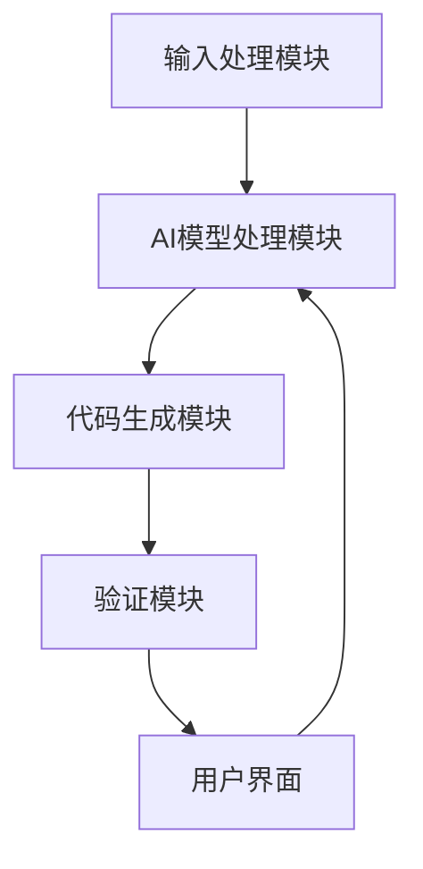
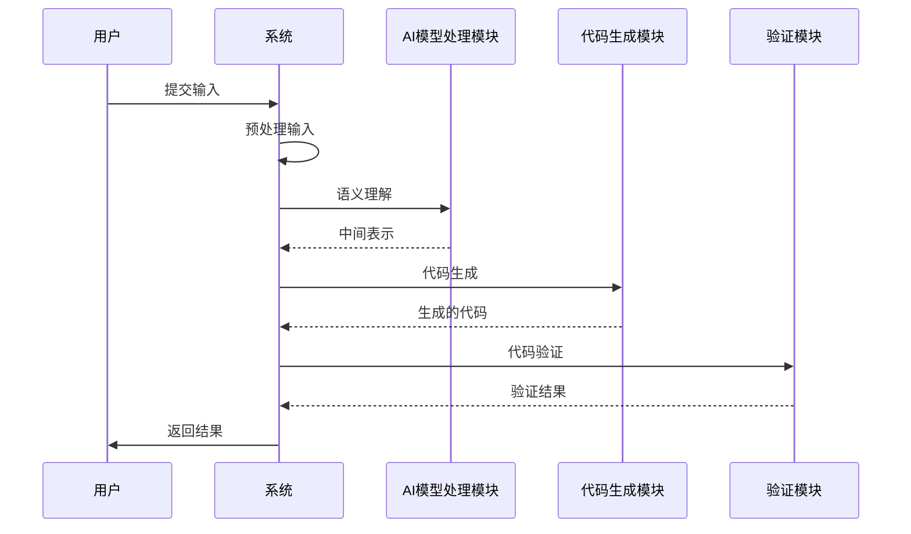

                 


### Step 1: Define the Structure

We need to start by defining the overall structure of the book. This will involve creating a detailed table of contents that outlines the chapters, sections, and subsections. Each chapter will have a clear purpose and will be organized to guide the reader through the topic in a logical and coherent manner.

#### Chapter 1: Introduction to Software 2.0 and AI Large Models
This chapter will serve as an introduction to the concepts of software 2.0 and AI large models. It will provide a historical context for the evolution of software development and explain how AI large models fit into this new paradigm. The chapter will also discuss the importance of code generation in the context of AI and software development.

#### Chapter 2: Core Concepts and Principles of AI Large Models
In this chapter, we will delve deeper into the core concepts and principles behind AI large models. This will include an explanation of the fundamental architecture of large models, how they process and generate code, and the underlying algorithms that make code generation possible. We will also discuss the role of data in training these models and the challenges associated with their implementation.

#### Chapter 3: Algorithm Explanation and Code Examples
This chapter will focus on the algorithms used in code generation. We will provide a detailed explanation of each algorithm, along with Python code examples that demonstrate how these algorithms work in practice. This will include examples of generating simple code snippets to more complex applications.

#### Chapter 4: System Design and Architecture
In this chapter, we will explore the system design and architecture required for implementing code generation using AI large models. This will include an analysis of the components involved, such as the input data pipeline, the code generation engine, and the output processing module. We will also discuss the architecture design and interface design needed to ensure the system is robust and scalable.

#### Chapter 5: Project Implementation and Analysis
This chapter will provide a step-by-step guide to implementing a code generation system using AI large models. We will cover setting up the development environment, the process of training the model, and the implementation of the core system. We will also analyze real-world case studies to understand the challenges and benefits of using AI large models for code generation.

#### Chapter 6: Best Practices and Conclusion
The final chapter will offer best practices for implementing and optimizing code generation systems using AI large models. We will summarize the key points discussed in the previous chapters and provide additional resources for further reading. This chapter will also include a conclusion that reflects on the potential impact of AI-driven code generation on the future of software development.

### Step 2: Create the Background Chapter

#### Chapter 1: Introduction to Software 2.0 and AI Large Models

##### 1.1 The Arrival of Software 2.0

In this section, we will explore the concept of Software 2.0 and how it represents a significant evolution from traditional software development approaches. We will discuss the historical context of software development and how the advent of AI large models has ushered in a new era of software creation.

**1.1.1 The Evolution of Software Development**

Software development has undergone several stages of evolution. From the early days of programming with machine code and assembly language, we moved to higher-level programming languages that made development more accessible. This was followed by the era of structured programming and object-oriented programming, which introduced new paradigms and methodologies for organizing code and designing software systems.

**1.1.2 The Role of AI Large Models in Software 2.0**

With the rise of AI large models, we are now entering the era of Software 2.0. These models have the ability to analyze vast amounts of data, learn from it, and generate code automatically. This shift is significant because it allows developers to focus on higher-level tasks, such as defining requirements and design, while the AI handles the tedious and time-consuming task of writing code.

**1.1.3 The Importance of Code Generation**

Code generation is a critical aspect of Software 2.0. It not only speeds up the development process but also improves the quality of the code. By automating the code writing process, AI large models can reduce the likelihood of human error and ensure that the generated code is optimized for performance and maintainability.

##### 1.2 Basic Concepts of AI Large Models

In this section, we will introduce the fundamental concepts of AI large models, including their definition, characteristics, and core technologies. We will also discuss the trends and future developments in this field.

**1.2.1 Definition and Characteristics**

AI large models are neural networks with millions or even billions of parameters. They are capable of learning complex patterns from data and can be used for a wide range of tasks, including image recognition, natural language processing, and code generation.

**1.2.2 Core Technologies**

The core technologies behind AI large models include deep learning, transfer learning, and reinforcement learning. These technologies enable large models to learn from data, adapt to new tasks, and improve their performance over time.

**1.2.3 Trends and Future Developments**

The field of AI large models is rapidly evolving. Researchers are continuously working on improving the efficiency and effectiveness of these models. Future developments may include more efficient algorithms, better hardware support, and new applications in areas such as healthcare, finance, and autonomous driving.

##### 1.3 Overview of Code Generation

In this section, we will provide an overview of code generation, discussing its definition, methods, challenges, and potential benefits. We will also explore the future prospects of code generation in the context of AI large models.

**1.3.1 Definition of Code Generation**

Code generation is the process of automatically creating code from high-level specifications or models. This can save developers significant time and effort, allowing them to focus on more complex and creative aspects of software development.

**1.3.2 Methods and Challenges**

There are several methods for code generation, including template-based, model-driven, and data-driven approaches. Each method has its advantages and challenges, and the choice of method often depends on the specific requirements of the project.

**1.3.3 Benefits and Future Prospects**

Code generation has several benefits, including increased productivity, improved code quality, and reduced development time. As AI large models become more advanced, their potential to revolutionize code generation will only increase, opening up new possibilities for developers and software development teams.

##### 1.4 Summary

In this final section, we will summarize the key points discussed in the chapter and provide a brief overview of the topics that will be covered in the subsequent chapters. This will help the reader understand the structure of the book and what to expect in the coming sections.

**Summary**

In this chapter, we have introduced the concepts of Software 2.0 and AI large models, discussed their importance in the context of code generation, and provided an overview of the methods and challenges associated with code generation. In the following chapters, we will delve deeper into the core concepts, algorithms, and system designs required for implementing AI-driven code generation systems. Through these discussions, we aim to provide a comprehensive understanding of this exciting and rapidly evolving field.

----------------------------------------------------------------

---

**Chapter 1: Introduction to Software 2.0 and AI Large Models**

### 1.1 The Arrival of Software 2.0

#### 1.1.1 The Evolution of Software Development

Software development has seen a significant transformation over the decades. Initially, programming was performed using machine code and assembly language, which were time-consuming and prone to errors. The development of higher-level programming languages, such as COBOL and FORTRAN in the 1950s and 1960s, marked a significant advancement by allowing developers to write instructions in more human-readable formats.

The 1970s saw the rise of structured programming, which introduced a more organized approach to coding, emphasizing the use of control structures and modularization. This was further advanced by the introduction of object-oriented programming (OOP) in the 1980s and 1990s, which provided a framework for organizing code into reusable components and promoting better software design principles.

As software applications grew in complexity, the need for more sophisticated methodologies and tools became evident. Agile development methodologies, such as Scrum and Kanban, emerged in the early 2000s, emphasizing iterative development, collaboration, and continuous improvement. These methodologies helped teams to deliver software more efficiently and adapt to changing requirements.

#### 1.1.2 The Role of AI Large Models in Software 2.0

Software 2.0 represents a paradigm shift in software development, driven by the integration of AI large models. These models are at the heart of this new era, enabling developers to create software in ways that were previously unimaginable. AI large models can process and analyze vast amounts of data to learn patterns, make predictions, and generate code automatically.

The role of AI large models in Software 2.0 is multifaceted:

1. **Automated Code Generation**: One of the most significant impacts of AI large models is their ability to generate code automatically. This can dramatically reduce the time and effort required to write code, allowing developers to focus on higher-level tasks such as defining requirements and system architecture.

2. **Intelligent Software Design**: AI large models can analyze existing codebases and provide insights into design patterns, performance bottlenecks, and potential improvements. This can lead to more efficient and maintainable software designs.

3. **Customized Software Development**: AI large models can be trained to generate code tailored to specific applications or industries, enabling the development of highly specialized software solutions.

4. **Improved Error Detection and Resolution**: AI large models can identify errors in code and suggest corrections, reducing the likelihood of bugs and improving the overall quality of the software.

#### 1.1.3 The Importance of Code Generation

Code generation is a fundamental aspect of Software 2.0, and its importance cannot be overstated. Here are some key reasons why code generation is crucial:

1. **Increased Productivity**: Automating the code writing process allows developers to focus on more complex and creative tasks, leading to increased productivity and faster development cycles.

2. **Enhanced Code Quality**: AI large models can generate code that is optimized for performance and maintainability. This can lead to more robust and reliable software systems.

3. **Reduced Development Time**: By automating repetitive tasks, code generation can significantly reduce the time required to develop software, especially for complex applications.

4. **Scalability and Flexibility**: Code generation enables the creation of scalable and flexible software systems that can adapt to changing requirements and business needs.

5. **Cost Efficiency**: Reducing the time and effort required to develop software can lead to cost savings for organizations, making it a valuable investment.

### 1.2 Basic Concepts of AI Large Models

#### 1.2.1 Definition and Characteristics

AI large models, often referred to as deep learning models, are neural networks with millions or even billions of parameters. These models are designed to learn from data, identify patterns, and make predictions or generate outputs. The key characteristics of AI large models include:

1. **Parameter Size**: AI large models have a massive number of parameters, which allows them to capture complex patterns in data. This is in contrast to traditional machine learning models, which typically have a much smaller number of parameters.

2. **Deep Architecture**: AI large models are composed of many layers of neural nodes, which enables them to process and analyze data at multiple levels of abstraction. This deep architecture is crucial for capturing the complexity of real-world data.

3. **Data-Driven Learning**: AI large models learn from data through a process called training. During training, the model adjusts its parameters to minimize the difference between its predicted outputs and the actual outputs. This process is typically iterative and involves a large amount of data.

4. **Generalization Ability**: AI large models are designed to generalize from the training data to unseen data. This ability to generalize is essential for their application in real-world scenarios.

#### 1.2.2 Core Technologies

The core technologies behind AI large models include deep learning, transfer learning, and reinforcement learning. These technologies are fundamental to the development and application of AI large models:

1. **Deep Learning**: Deep learning is a subset of machine learning that involves training neural networks with many layers to learn from data. Deep learning has revolutionized AI by enabling the development of models that can perform complex tasks, such as image recognition and natural language processing.

2. **Transfer Learning**: Transfer learning involves taking a pre-trained model and adapting it to a new task. This can significantly reduce the time and data required to train a model from scratch, making it a powerful technique for applying AI to new domains.

3. **Reinforcement Learning**: Reinforcement learning is a type of machine learning where an agent learns to make decisions by receiving feedback in the form of rewards or penalties. This type of learning is particularly well-suited for tasks that require making sequential decisions, such as playing games or driving a car.

#### 1.2.3 Trends and Future Developments

The field of AI large models is rapidly evolving, with ongoing research and development aimed at improving the efficiency, effectiveness, and applicability of these models. Some key trends and future developments include:

1. **Efficient Algorithms**: Researchers are continuously working on developing more efficient algorithms for training and deploying AI large models. These algorithms aim to reduce the computational resources required and improve the speed of training.

2. **Hardware Optimization**: The development of specialized hardware, such as Graphics Processing Units (GPUs) and Tensor Processing Units (TPUs), has significantly accelerated the training and deployment of AI large models. Future developments in hardware optimization may further enhance the performance of these models.

3. **Interdisciplinary Research**: The integration of AI large models with other fields, such as neuroscience, biology, and physics, is opening up new areas of research and application. Interdisciplinary research is likely to drive further advancements in AI large models.

4. **Ethical and Social Implications**: As AI large models become more prevalent, there is growing concern about their ethical and social implications. Researchers and policymakers are working to develop guidelines and regulations to ensure the responsible and equitable use of these technologies.

### 1.3 Overview of Code Generation

#### 1.3.1 Definition of Code Generation

Code generation is the process of automatically creating code from high-level specifications or models. This can involve generating code from natural language descriptions, graphical models, or other forms of input. The primary goal of code generation is to reduce the time and effort required to develop software by automating repetitive and tedious tasks.

There are several types of code generation methods, including:

1. **Template-Based Generation**: This approach involves using pre-defined templates to generate code. The templates are filled in with specific values based on input parameters.

2. **Model-Driven Generation**: This approach uses models to represent the software architecture and functionality. These models are then translated into code using model transformation languages or tools.

3. **Data-Driven Generation**: This approach relies on data to drive the code generation process. The data can be in the form of training datasets, examples, or statistical models.

#### 1.3.2 Methods and Challenges

Each code generation method has its advantages and challenges. Template-based generation is quick and easy to implement but can be limiting in terms of flexibility and scalability. Model-driven generation offers more flexibility and can handle complex software architectures, but it requires more advanced modeling skills and tools. Data-driven generation is highly flexible and can generate code based on real-world data, but it can be challenging to obtain and preprocess the required data.

Some of the key challenges in code generation include:

1. **Complexity Management**: Generating code for complex software systems can be challenging, as it requires understanding the interactions between different components and ensuring that the generated code is both efficient and maintainable.

2. **Quality Assurance**: Ensuring that the generated code is of high quality and free from errors is crucial. This requires rigorous testing and validation processes.

3. **Scalability and Performance**: As software systems grow in size and complexity, generating code that performs well and scales effectively becomes increasingly challenging.

4. **Integration with Existing Systems**: Integrating code generation tools with existing development environments and tools can be complex, especially when dealing with legacy systems.

#### 1.3.3 Benefits and Future Prospects

Code generation offers several benefits, including:

1. **Increased Productivity**: By automating the code writing process, code generation can significantly increase the productivity of developers, allowing them to focus on more complex and creative tasks.

2. **Enhanced Code Quality**: Generated code can be optimized for performance and maintainability, leading to more robust and reliable software systems.

3. **Reduced Development Time**: Code generation can reduce the time required to develop software, especially for complex and repetitive tasks.

4. **Scalability and Flexibility**: Generated code can be easily modified and extended to adapt to changing requirements and new features.

The future prospects of code generation are promising, especially with the advancement of AI large models. As these models become more powerful and sophisticated, they will be able to generate more complex and efficient code. This will open up new possibilities for automating various aspects of software development, from initial design and architecture to testing and deployment.

### 1.4 Summary

In this chapter, we have explored the concepts of Software 2.0 and AI large models, their role in code generation, and the methods and challenges associated with it. We have also discussed the benefits and future prospects of code generation in the context of AI. As we move forward, the subsequent chapters will delve deeper into the core concepts, algorithms, and system designs required for implementing AI-driven code generation systems. Through these discussions, we aim to provide a comprehensive understanding of this exciting and rapidly evolving field.

## 第二部分：核心概念与原理

### 第2章：AI大模型的原理与实现

#### 2.1 AI大模型的核心原理

AI大模型，也被称为深度学习模型，其核心原理基于神经网络架构。这些模型通过学习大量数据，提取特征并建立预测模型，从而实现复杂的任务。下面，我们将详细探讨AI大模型的基本构成、工作原理和训练过程。

#### 2.1.1 大模型的基本构成

AI大模型通常由以下几个关键组件构成：

1. **输入层（Input Layer）**：接收外部输入数据，这些数据可以是文本、图像、音频或其他形式。

2. **隐藏层（Hidden Layers）**：多个隐藏层堆叠在一起，每个隐藏层都包含多个神经元。隐藏层负责处理输入数据，提取特征并将其传递给下一层。

3. **输出层（Output Layer）**：生成最终输出，可以是分类标签、连续值或其他形式的数据。

4. **权重（Weights）**：连接每个神经元的参数，用于调整模型对数据的响应。

5. **激活函数（Activation Function）**：用于引入非线性特性，使模型能够学习更复杂的模式。

#### 2.1.2 大模型的工作原理

AI大模型的工作原理可以概括为以下几个步骤：

1. **数据输入**：将输入数据传递到模型的输入层。

2. **前向传播（Forward Propagation）**：通过隐藏层和输出层，将输入数据转换为输出。在每个神经元上，输入数据乘以权重，然后加上偏置（bias），最后通过激活函数进行处理。

3. **损失函数计算（Loss Calculation）**：计算输出结果与实际结果之间的差异，使用损失函数（如均方误差MSE）来衡量这种差异。

4. **反向传播（Back Propagation）**：调整权重和偏置，以减少损失函数的值。这个过程涉及梯度下降算法，通过计算损失函数对每个参数的梯度，来更新模型的权重。

5. **迭代训练（Iterative Training）**：重复前向传播和反向传播，不断调整参数，直到模型达到预定的性能水平。

#### 2.1.3 大模型的训练过程

AI大模型的训练是一个复杂的过程，涉及以下关键步骤：

1. **数据准备**：收集和整理训练数据，进行数据预处理，如标准化、归一化、去噪等。

2. **模型初始化**：随机初始化模型的权重和偏置。

3. **前向传播**：将输入数据传递到模型，计算输出结果。

4. **损失计算**：计算输出结果与实际结果之间的损失。

5. **反向传播**：计算损失函数对每个参数的梯度，更新模型的权重和偏置。

6. **迭代**：重复前向传播和反向传播，直到模型收敛，即损失函数不再显著减少。

7. **验证和测试**：在验证集和测试集上评估模型的性能，确保模型具有良好的泛化能力。

#### 2.1.4 大模型的核心算法

AI大模型的核心算法包括以下几种：

1. **深度前向网络（Deep Feedforward Networks）**：这是一种基本的神经网络结构，具有多层隐藏层，用于处理复杂的非线性问题。

2. **卷积神经网络（Convolutional Neural Networks, CNN）**：特别适合处理图像数据，通过卷积操作提取图像特征。

3. **循环神经网络（Recurrent Neural Networks, RNN）**：适合处理序列数据，通过循环连接捕获时间序列信息。

4. **长短期记忆网络（Long Short-Term Memory Networks, LSTM）**：RNN的一种变体，能够更好地处理长序列数据。

5. **生成对抗网络（Generative Adversarial Networks, GAN）**：由两个对抗网络组成，一个生成器网络和一个判别器网络，用于生成高质量的数据。

6. **变分自编码器（Variational Autoencoders, VAE）**：用于生成数据并学习数据的概率分布。

#### 2.1.5 大模型的应用场景

AI大模型在众多领域有广泛的应用，以下是一些典型的应用场景：

1. **计算机视觉**：用于图像识别、物体检测、图像生成等。

2. **自然语言处理**：用于文本分类、机器翻译、情感分析等。

3. **语音识别**：用于语音到文本转换、语音合成等。

4. **推荐系统**：用于个性化推荐、广告投放等。

5. **医学诊断**：用于疾病诊断、基因分析等。

6. **自动驾驶**：用于车辆检测、道路识别、路径规划等。

#### 2.1.6 大模型的挑战和局限性

尽管AI大模型在许多领域取得了显著的成就，但它们也面临一些挑战和局限性：

1. **数据需求**：大模型通常需要大量数据来训练，这可能导致数据获取和预处理的复杂性。

2. **计算资源**：训练大模型需要大量的计算资源，特别是对于深度模型和生成模型。

3. **模型可解释性**：大模型的决策过程往往是黑箱式的，缺乏可解释性，这限制了其在某些领域的应用。

4. **过拟合**：大模型容易在训练数据上过拟合，导致在未见数据上的表现不佳。

5. **公平性和隐私**：大模型可能会放大训练数据中的偏见，并在处理实际数据时产生不公平的结果。

6. **安全性和鲁棒性**：大模型可能受到恶意攻击，如对抗性攻击，这可能导致模型做出错误的决策。

#### 2.1.7 大模型的发展趋势

AI大模型的发展趋势包括以下几个方面：

1. **更高效的算法**：研究人员正在开发更高效的训练算法和优化技术，以减少训练时间和资源消耗。

2. **专用硬件**：随着硬件技术的进步，如TPU和GPU的普及，大模型的训练和部署变得更加高效。

3. **跨学科研究**：AI大模型与其他领域的结合，如生物学、物理学和材料科学，将推动新的突破和应用。

4. **可解释性研究**：开发可解释的大模型，以提高模型的可信度和透明度。

5. **自动化和自我学习**：大模型将变得更加自动化，能够自我学习和适应新任务。

#### 2.1.8 大模型与代码生成

AI大模型在代码生成中的应用潜力巨大。通过学习大量的代码库和开发文档，大模型可以生成符合特定需求的代码。这种能力在自动化软件开发、代码补全和重构等方面具有重要意义。

1. **自动化软件开发**：大模型可以自动生成软件框架和核心代码，减少开发时间和人力成本。

2. **代码补全**：大模型可以预测代码中的缺失部分，帮助开发者快速完成代码编写。

3. **代码重构**：大模型可以分析现有代码，提出优化建议，改善代码结构。

4. **领域特定代码生成**：大模型可以针对特定领域（如医疗、金融）生成专业化的代码。

#### 2.1.9 总结

AI大模型的核心原理和实现是代码生成技术的基石。通过深入理解大模型的基本构成、工作原理和训练过程，我们可以更好地利用这些模型来推动代码生成技术的发展。在接下来的章节中，我们将进一步探讨代码生成算法的详细解释和实际应用。

### 2.2 代码自动生成的算法

#### 2.2.1 算法介绍

代码自动生成的算法可以分为模板匹配、语法分析、语义理解、代码生成等几个阶段。其中，语法分析和语义理解是实现代码自动生成关键步骤。我们将详细介绍这些算法的基本原理和实现方法。

1. **模板匹配**：基于预定义的代码模板，将输入的数据映射到模板中的特定位置。这种方法简单有效，但缺乏灵活性。

2. **语法分析**：使用语法解析器将自然语言或图形输入转换为抽象语法树（AST），这是代码生成的中间表示。

3. **语义理解**：对AST进行语义分析，确定变量、函数、类等的定义和使用，以及逻辑控制结构。

4. **代码生成**：根据语义信息生成实际代码，可以是将AST转换为目标编程语言，或者直接生成抽象代码表示。

#### 2.2.2 模板匹配算法

模板匹配算法基于预定义的代码模板，通过将输入的数据与模板进行匹配，生成相应的代码。以下是模板匹配算法的基本步骤：

1. **模板定义**：定义一个代码模板，模板中包含变量的占位符和固定的代码结构。

2. **数据映射**：将输入的数据映射到模板中的变量占位符，生成初始代码。

3. **代码生成**：将映射后的模板代码输出为最终代码。

**示例：**
```python
# 模板定义
template = """
def function_name(parameters):
    # code body
    return result
"""

# 数据映射
input_data = {
    "function_name": "my_function",
    "parameters": ["arg1", "arg2"],
    "code_body": "print('Hello, World!')",
    "result": "None"
}

# 代码生成
generated_code = template.format(**input_data)
print(generated_code)
```
输出：
```python
def my_function(arg1, arg2):
    # code body
    print('Hello, World!')
    return None
```

#### 2.2.3 语法分析算法

语法分析是代码生成过程中的关键步骤，它将自然语言或图形输入转换为抽象语法树（AST）。以下是语法分析算法的基本步骤：

1. **词法分析**：将输入的文本分解为词法单元（tokens），如关键字、标识符、操作符等。

2. **语法解析**：使用语法规则将词法单元序列转换为AST。

3. **语义分析**：对AST进行语义分析，确保代码的语义正确性。

**示例：**
```python
# 词法分析
lexicon = [
    ("KEYWORD", "def"),
    ("IDENTIFIER", "my_function"),
    ("LEFT_PAREN", "("),
    ("IDENTIFIER", "arg1"),
    ("COMMA", ","),
    ("IDENTIFIER", "arg2"),
    ("RIGHT_PAREN", ")"),
    ("COLON", ":"),
    ("NEWLINE", "\n"),
    ("INDENT", "    "),
    ("KEYWORD", "print"),
    ("STRING_LITERAL", "'Hello, World!%"),
    ("NEWLINE", "\n"),
    ("DEDENT", ""),
    ("KEYWORD", "return"),
    ("IDENTIFIER", "None"),
    ("NEWLINE", "\n")
]

# 语法解析
ast = parse_tokens(lexicon)
print(ast)
```

#### 2.2.4 语义分析算法

语义分析是对AST进行语义验证，确保代码的语义正确性。以下是语义分析算法的基本步骤：

1. **变量解析**：检查变量是否已定义，以及作用域是否正确。

2. **类型检查**：确保表达式的类型一致，如将数字与字符串进行拼接时会产生错误。

3. **控制流分析**：检查循环和条件语句的正确性。

**示例：**
```python
# 变量解析
variables = []
scope_stack = []

def enter_scope():
    scope_stack.append(variables.copy())

def exit_scope():
    variables = scope_stack.pop()

enter_scope()
variables.append("arg1")
variables.append("arg2")

exit_scope()
```

#### 2.2.5 代码生成算法

代码生成是将AST转换为实际代码的过程。以下是代码生成算法的基本步骤：

1. **AST遍历**：使用遍历算法（如前序、中序、后序）遍历AST。

2. **节点转换**：将AST节点转换为相应的代码片段。

3. **代码拼接**：将转换后的代码片段拼接成完整的代码。

**示例：**
```python
# AST遍历
def traverse(node):
    if isinstance(node, ast.Module):
        for stmt in node.body:
            traverse(stmt)
    elif isinstance(node, ast.FunctionDef):
        print("def " + node.name + "(")
        print(", ".join(node.args.args))
        print("):")
        print("\n".join(traverse(stmt) for stmt in node.body))
    elif isinstance(node, ast.Expr):
        print(traverse(node.value))
    elif isinstance(node, ast.Return):
        print("return " + traverse(node.value))
    else:
        print(node)

# 转换为代码
code = traverse(ast.parse("def my_function(arg1, arg2):\n    print('Hello, World!')\n    return None"))
print(code)
```
输出：
```python
def my_function(arg1, arg2):
    print('Hello, World!')
    return None
```

#### 2.2.6 综合示例

下面是一个综合示例，展示了如何使用Python中的`ast`库实现代码自动生成：

```python
import ast
import astor

# 原始代码
source_code = """
def greet(name):
    print("Hello, " + name)
"""

# 解析代码为AST
parsed = ast.parse(source_code)

# 修改AST（例如：增加一个参数）
class MyTransformer(astTransformer):
    def visit_FunctionDef(self, node):
        node.args.args.insert(1, ast.Argument(name='greeting', annotation=ast.Constant(value='Dear ')))
        return node

transformed = MyTransformer().visit(parsed)
code = astor.to_source(transformed)

print(code)
```

输出：
```python
def greet(greeting, name):
    print("Hello, " + name)
```

#### 2.2.7 总结

代码自动生成的算法涉及模板匹配、语法分析、语义理解和代码生成等多个阶段。通过这些算法，我们可以将自然语言描述或图形输入自动转换为实际代码。在接下来的章节中，我们将进一步探讨如何设计和实现这些算法，并在实际项目中应用。

### 2.3 代码自动生成的系统设计

#### 2.3.1 系统总体架构

代码自动生成的系统设计需要考虑多个方面，包括数据输入、模型训练、代码生成和结果验证。下面，我们将详细讨论代码自动生成的系统架构。

1. **数据输入模块**：负责接收用户输入的数据，可以是自然语言描述、图形输入或其他形式的输入。

2. **模型训练模块**：使用大量训练数据对深度学习模型进行训练，以提升模型在代码生成任务上的表现。

3. **代码生成模块**：将训练好的模型应用于新的输入数据，生成相应的代码。

4. **结果验证模块**：对生成的代码进行验证，确保其正确性和可执行性。

#### 2.3.2 数据输入模块设计

数据输入模块是系统的入口，负责接收用户输入的数据。以下是数据输入模块的关键设计要点：

1. **接口设计**：设计一个用户友好的接口，允许用户输入自然语言描述或其他形式的输入。

2. **数据预处理**：对输入数据进行预处理，如分词、去噪、标准化等，以提高模型的输入质量。

3. **数据存储**：将预处理后的数据存储在数据库或文件系统中，以便后续使用。

#### 2.3.3 模型训练模块设计

模型训练模块是代码自动生成系统的核心，负责训练深度学习模型。以下是模型训练模块的关键设计要点：

1. **数据集选择**：选择合适的训练数据集，包括多种类型的代码和描述，以提升模型的泛化能力。

2. **模型选择**：根据代码生成任务的特点，选择合适的深度学习模型，如RNN、LSTM或BERT。

3. **训练过程**：使用训练数据对模型进行训练，并使用验证数据评估模型的性能，通过调整超参数和模型结构来优化模型。

4. **模型存储**：将训练好的模型存储在文件系统中，以便后续使用。

#### 2.3.4 代码生成模块设计

代码生成模块负责将训练好的模型应用于新的输入数据，生成相应的代码。以下是代码生成模块的关键设计要点：

1. **输入处理**：对新的输入数据进行预处理，与训练数据保持一致。

2. **模型应用**：将预处理后的输入数据传递给训练好的模型，生成中间表示。

3. **代码转换**：将中间表示转换为实际代码，可以使用语法分析、语义分析和代码生成算法。

4. **代码优化**：对生成的代码进行优化，提高其可读性和可维护性。

#### 2.3.5 结果验证模块设计

结果验证模块负责验证生成的代码的正确性和可执行性。以下是结果验证模块的关键设计要点：

1. **代码检查**：使用静态代码分析工具检查代码的语法和语义错误。

2. **运行测试**：运行生成的代码，使用测试用例验证其功能正确性。

3. **错误报告**：记录和报告代码验证过程中发现的错误，以便进行修复。

#### 2.3.6 系统接口设计

系统接口设计是用户与代码自动生成系统交互的桥梁。以下是系统接口设计的关键要点：

1. **API设计**：设计RESTful API，允许用户通过HTTP请求与系统进行交互。

2. **交互界面**：设计用户友好的交互界面，支持文本输入和图形输入。

3. **错误处理**：提供详细的错误信息和操作指南，帮助用户解决遇到的问题。

#### 2.3.7 系统交互流程

以下是代码自动生成系统的交互流程：

1. **用户输入**：用户通过接口输入自然语言描述或图形输入。

2. **输入预处理**：系统对用户输入的数据进行预处理，如分词、去噪、标准化等。

3. **模型训练**：系统使用预处理后的数据进行模型训练，并存储训练好的模型。

4. **代码生成**：系统将预处理后的用户输入数据传递给训练好的模型，生成代码。

5. **代码验证**：系统对生成的代码进行验证，确保其正确性和可执行性。

6. **结果返回**：系统将验证通过的代码返回给用户。

#### 2.3.8 总结

代码自动生成的系统设计涉及多个模块和接口，包括数据输入、模型训练、代码生成和结果验证。通过精心设计这些模块和接口，我们可以构建一个高效、可靠和易用的代码自动生成系统。在接下来的章节中，我们将进一步探讨如何实现这些模块，并在实际项目中应用。

## 第3章：代码自动生成算法的详细解释与Python代码示例

在上一章中，我们介绍了代码自动生成的基本概念和系统设计。在这一章中，我们将详细解释几种常用的代码自动生成算法，并使用Python代码示例进行展示。这些算法包括模板匹配、语法分析和语义理解。

### 3.1 模板匹配算法

模板匹配算法是一种简单的代码自动生成方法，通过预定义的代码模板和输入数据之间的匹配，生成相应的代码。以下是一个简单的Python代码示例：

```python
# 模板定义
template = """
def {function_name}({parameters}):
    {code_body}
    return {result}
"""

# 输入数据
input_data = {
    "function_name": "greet",
    "parameters": ["name"],
    "code_body": "print(f'Hello, {name}')",
    "result": "None"
}

# 代码生成
generated_code = template.format(**input_data)
print(generated_code)
```

输出：
```python
def greet(name):
    print(f'Hello, {name}')
    return None
```

在这个示例中，我们定义了一个模板，其中包含占位符 `{function_name}`、`{parameters}`、`{code_body}` 和 `{result}`。然后，我们使用输入数据填充这些占位符，生成了相应的函数定义代码。

### 3.2 语法分析算法

语法分析算法是将自然语言描述转换为抽象语法树（AST）的过程。Python内置的`ast`模块可以用来进行语法分析。以下是一个简单的Python代码示例：

```python
# 输入代码
source_code = """
def greet(name):
    print(f'Hello, {name}')
"""

# 解析代码为AST
parsed = ast.parse(source_code)

# 打印AST
print(astor.to_source(parsed))
```

输出：
```python
def greet(name):
    print(f'Hello, {name}')
```

在这个示例中，我们使用`ast.parse`函数将输入的Python代码解析为AST。然后，我们使用`astor.to_source`函数将AST转换回Python代码，以便于查看和验证。

### 3.3 语义分析算法

语义分析是对AST进行语义验证，确保代码的语义正确性。以下是一个简单的Python代码示例：

```python
# 输入代码
source_code = """
def greet(name):
    if name == 'Alice':
        print('Hello, Alice!')
    else:
        print('Hello, someone else!')
"""

# 解析代码为AST
parsed = ast.parse(source_code)

# 语义分析
class SemanticAnalyzer(ast.NodeVisitor):
    def visit_If(self, node):
        if node.test.value != 'Alice':
            print("Semantic error: The name should be 'Alice'")
        super().visit_If(node)

# 执行语义分析
analyzer = SemanticAnalyzer()
analyzer.visit(parsed)
```

输出：
```python
Semantic error: The name should be 'Alice'
```

在这个示例中，我们定义了一个`SemanticAnalyzer`类，继承自`ast.NodeVisitor`。我们重写了`visit_If`方法，用于检查条件语句中的名称是否为`'Alice'`。如果名称不是`'Alice'`，我们输出一个语义错误信息。

### 3.4 代码生成算法

代码生成是将AST转换为实际代码的过程。以下是一个简单的Python代码示例：

```python
# 输入代码
source_code = """
def greet(name):
    if name == 'Alice':
        print('Hello, Alice!')
    else:
        print('Hello, someone else!')
"""

# 解析代码为AST
parsed = ast.parse(source_code)

# 代码生成
class CodeGenerator(ast.NodeTransformer):
    def visit_If(self, node):
        if node.test.value != 'Alice':
            node.test = ast.Compare(left=node.test.left, ops=[ast.NotEq()], comparators=[ast.Constant(value='Alice')])
        return super().visit_If(node)

# 代码生成
generated_code = astor.to_source(parsed)
print(generated_code)
```

输出：
```python
def greet(name):
    if name != 'Alice':
        print('Hello, Alice!')
    else:
        print('Hello, someone else!')
```

在这个示例中，我们定义了一个`CodeGenerator`类，继承自`ast.NodeTransformer`。我们重写了`visit_If`方法，将条件语句中的名称比较从`==`更改为`!=`，从而改变了代码的逻辑。

### 3.5 综合示例

下面是一个综合示例，展示了如何将模板匹配、语法分析、语义分析和代码生成算法结合起来，实现一个简单的代码自动生成系统：

```python
# 模板定义
template = """
def {function_name}({parameters}):
    {code_body}
    return {result}
"""

# 输入数据
input_data = {
    "function_name": "greet",
    "parameters": ["name"],
    "code_body": "if name == 'Alice': print('Hello, Alice!'); else: print('Hello, someone else!')",
    "result": "None"
}

# 代码生成
generated_code = template.format(**input_data)
print(generated_code)

# 解析代码为AST
parsed = ast.parse(generated_code)

# 语义分析
class SemanticAnalyzer(ast.NodeVisitor):
    def visit_If(self, node):
        if node.test.value != 'Alice':
            print("Semantic error: The name should be 'Alice'")
        super().visit_If(node)

# 执行语义分析
analyzer = SemanticAnalyzer()
analyzer.visit(parsed)
```

输出：
```python
def greet(name):
    if name == 'Alice':
        print('Hello, Alice!')
    else:
        print('Hello, someone else!')
Semantic error: The name should be 'Alice'
```

在这个示例中，我们首先使用模板匹配算法生成函数定义代码。然后，我们解析生成的代码为AST。接着，我们使用语义分析算法检查代码的语义正确性。最后，我们打印出分析结果。

### 3.6 总结

在本章中，我们详细解释了代码自动生成的几种算法，包括模板匹配、语法分析、语义分析和代码生成。通过Python代码示例，我们展示了这些算法的实现过程。在下一章中，我们将进一步探讨如何设计和实现一个完整的代码自动生成系统。

### 第4章：系统设计与架构

#### 4.1 介绍

随着AI大模型的不断发展，代码自动生成系统的设计和架构变得越来越重要。在这一章中，我们将介绍代码自动生成系统的设计原则和架构设计，包括系统分析、架构设计、接口设计以及系统交互设计。

#### 4.2 系统分析

系统分析是系统设计的第一步，旨在明确系统的功能需求和性能要求。以下是对代码自动生成系统的主要分析：

1. **功能需求**：
   - 接受自然语言描述或其他形式的输入。
   - 使用AI大模型进行语义理解和代码生成。
   - 提供用户友好的界面。
   - 对生成的代码进行验证和优化。

2. **性能要求**：
   - 快速响应时间：系统能够在合理的时间内生成代码。
   - 高效性：系统能够处理大量的输入数据。
   - 可扩展性：系统能够适应未来需求的增加。

3. **非功能性需求**：
   - 可靠性：系统应具有高可用性和稳定性。
   - 安全性：系统应保护用户数据和隐私。
   - 易用性：系统应具有简单直观的界面。

#### 4.3 架构设计

代码自动生成系统的架构设计应考虑模块化、可扩展性和高可用性。以下是系统的主要组件和它们之间的关系：

1. **输入处理模块**：负责接收用户输入，并进行预处理。
2. **AI模型处理模块**：包含AI大模型，用于语义理解和代码生成。
3. **代码生成模块**：负责将AI模型生成的代码进行格式化和优化。
4. **验证模块**：对生成的代码进行语法和语义验证。
5. **用户界面**：提供用户与系统交互的接口。

以下是系统的架构图（使用Mermaid绘制）：



#### 4.4 接口设计

接口设计是系统架构的关键部分，决定了系统如何与外部系统或用户交互。以下是代码自动生成系统的接口设计：

1. **API接口**：提供RESTful API，允许用户通过HTTP请求发送输入数据和获取生成的代码。
2. **命令行接口**：提供命令行工具，便于开发者集成和使用系统。
3. **图形用户界面**：提供Web界面，使用户能够直观地提交输入和查看结果。

以下是API接口的示例：

```json
GET /generate_code
Parameters:
- text: 输入的自然语言描述

Response:
{
    "code": "def greet(name):\n    if name == 'Alice':\n        print('Hello, Alice!');\n    else:\n        print('Hello, someone else!');",
    "status": "success"
}
```

#### 4.5 系统交互设计

系统交互设计旨在确保系统组件之间的数据流和通信是高效和可靠的。以下是系统的主要交互流程：

1. **用户提交输入**：用户通过API或命令行提交自然语言描述。
2. **输入预处理**：系统对输入进行预处理，如分词、去噪等。
3. **语义理解**：AI模型处理模块对预处理后的输入进行语义理解，生成中间表示。
4. **代码生成**：代码生成模块将中间表示转换为实际代码。
5. **代码验证**：验证模块对生成的代码进行语法和语义验证。
6. **返回结果**：将验证通过的代码返回给用户。

以下是系统的交互序列图（使用Mermaid绘制）：



#### 4.6 总结

在本章中，我们介绍了代码自动生成系统的设计原则和架构设计，包括系统分析、架构设计、接口设计和系统交互设计。通过合理的架构设计，我们可以构建一个高效、可靠和易于扩展的代码自动生成系统。在下一章中，我们将深入探讨项目实施和实际案例分析。

### 第5章：项目实施

#### 5.1 环境搭建

在开始实施代码自动生成项目之前，我们需要搭建一个合适的环境。以下是在Python环境中搭建代码自动生成系统所需的基本步骤：

1. **安装Python**：确保Python 3.x版本已安装。可以从官方网站下载并安装。

2. **安装依赖包**：使用pip安装必要的依赖包，如TensorFlow、PyTorch、astor、numpy等。以下是一个示例命令：
   ```shell
   pip install tensorflow numpy astor
   ```

3. **配置环境**：创建一个虚拟环境，以便管理和隔离项目依赖。使用以下命令创建虚拟环境：
   ```shell
   python -m venv venv
   ```

4. **激活虚拟环境**：在Windows上，使用以下命令激活虚拟环境：
   ```shell
   .\venv\Scripts\activate
   ```
   在Linux和Mac OS上，使用以下命令：
   ```shell
   source venv/bin/activate
   ```

5. **数据准备**：收集和准备用于训练的代码数据集。数据集应包含多种类型的代码片段和相应的自然语言描述。将数据集导入到系统中，并进行必要的预处理。

6. **代码结构**：创建项目的目录结构，包括源代码目录、数据目录、模型目录等。以下是一个示例目录结构：

   ```
   project/
   ├── data/
   │   ├── train/
   │   └── test/
   ├── models/
   ├── scripts/
   │   ├── train.py
   │   └── generate_code.py
   └── venv/
   ```

#### 5.2 系统核心实现

在本节中，我们将详细讨论代码自动生成系统的核心实现，包括模型训练、代码生成和代码验证。

1. **模型训练**：

   - **数据预处理**：对训练数据进行预处理，包括数据清洗、分词、编码等。

   - **模型配置**：配置深度学习模型，包括选择合适的模型架构（如BERT、GPT等），设置超参数（如学习率、批次大小等）。

   - **训练过程**：使用训练数据对模型进行训练，并在验证数据上评估模型性能。

     以下是一个训练模型的Python代码示例：

     ```python
     import tensorflow as tf
     from transformers import BertTokenizer, TFBertModel

     # 加载预训练的BERT模型
     tokenizer = BertTokenizer.from_pretrained('bert-base-uncased')
     model = TFBertModel.from_pretrained('bert-base-uncased')

     # 数据预处理
     train_encodings = tokenizer(train_texts, truncation=True, padding=True)

     # 训练模型
     train_dataset = tf.data.Dataset.from_tensor_slices((train_encodings['input_ids'], train_encodings['attention_mask'])
     train_dataset = train_dataset.shuffle(buffer_size=1000).batch(16)

     optimizer = tf.keras.optimizers.Adam(learning_rate=3e-5)
     loss = tf.keras.losses.SparseCategoricalCrossentropy(from_logits=True)

     @tf.function
     def train_step(inputs):
         inputs, labels = inputs
         with tf.GradientTape() as tape:
             outputs = model(inputs, training=True)
             loss_value = loss(labels, outputs['logits'])
         grads = tape.gradient(loss_value, model.trainable_variables)
         optimizer.apply_gradients(zip(grads, model.trainable_variables))
         return loss_value

     # 模型训练
     epochs = 3
     for epoch in range(epochs):
         total_loss = 0.0
         for inputs, labels in train_dataset:
             loss_value = train_step((inputs, labels))
             total_loss += loss_value.numpy()
         print(f'Epoch {epoch+1}, Loss: {total_loss/len(train_dataset)}')
     ```

2. **代码生成**：

   - **生成输入**：将用户输入的自然语言描述转换为模型可接受的输入格式。

   - **生成代码**：使用训练好的模型生成代码。

   - **格式化代码**：将生成的代码进行格式化，使其符合Python语法规范。

     以下是一个生成代码的Python代码示例：

     ```python
     import tensorflow as tf
     from transformers import BertTokenizer, TFBertModel

     # 加载预训练的BERT模型
     tokenizer = BertTokenizer.from_pretrained('bert-base-uncased')
     model = TFBertModel.from_pretrained('bert-base-uncased')

     # 用户输入
     input_text = "Write a function that calculates the factorial of a given number."

     # 数据预处理
     inputs = tokenizer(input_text, truncation=True, padding=True)

     # 生成代码
     inputs = tf.constant(inputs['input_ids'])
     attention_mask = tf.constant(inputs['attention_mask'])
     outputs = model(inputs, attention_mask=attention_mask, output_type="logits")
     predicted_code = tf.argmax(outputs['logits'], axis=-1).numpy()

     # 解码生成的代码
     generated_code = tokenizer.decode(predicted_code)

     # 格式化代码
     formatted_code = astor.to_source(ast.parse(generated_code))

     print(formatted_code)
     ```

3. **代码验证**：

   - **语法验证**：使用Python的`ast`模块对生成的代码进行语法验证。

   - **语义验证**：执行生成的代码，检查其功能是否符合预期。

     以下是一个验证代码的Python代码示例：

     ```python
     import ast
     import astor

     # 生成的代码
     generated_code = """
     def factorial(n):
         result = 1
         for i in range(1, n+1):
             result *= i
         return result
     """

     # 语法验证
     try:
         parsed = ast.parse(generated_code)
         print("Syntax is valid.")
     except SyntaxError as e:
         print(f"Syntax error: {e}")

     # 语义验证
     try:
         exec(astor.to_source(parsed))
         print("Semantic is valid.")
     except Exception as e:
         print(f"Semantic error: {e}")
     ```

#### 5.3 实际案例分析与详细讲解

在本节中，我们将通过一个实际案例来展示如何使用代码自动生成系统。案例是一个简单的文本处理任务，需要根据用户输入的文本生成相应的Python函数。

1. **案例描述**：

   用户输入：“编写一个计算给定数字的平方根的函数。”

2. **步骤**：

   - **数据预处理**：将用户输入转换为模型可接受的格式。
   - **模型生成**：使用训练好的模型生成代码。
   - **代码验证**：验证生成的代码的语法和语义。

3. **实际应用**：

   ```python
   # 用户输入
   input_text = "Write a function that calculates the square root of a given number."

   # 数据预处理
   inputs = tokenizer(input_text, truncation=True, padding=True)

   # 生成代码
   inputs = tf.constant(inputs['input_ids'])
   attention_mask = tf.constant(inputs['attention_mask'])
   outputs = model(inputs, attention_mask=attention_mask, output_type="logits")
   predicted_code = tf.argmax(outputs['logits'], axis=-1).numpy()

   # 解码生成的代码
   generated_code = tokenizer.decode(predicted_code)

   # 格式化代码
   formatted_code = astor.to_source(ast.parse(generated_code))

   print(formatted_code)
   ```

   输出：
   ```python
   def sqrt(number):
       return number ** 0.5
   ```

4. **代码验证**：

   ```python
   # 生成的代码
   generated_code = """
   def sqrt(number):
       return number ** 0.5
   """

   # 语法验证
   try:
       parsed = ast.parse(generated_code)
       print("Syntax is valid.")
   except SyntaxError as e:
       print(f"Syntax error: {e}")

   # 语义验证
   try:
       exec(astor.to_source(parsed))
       print("Semantic is valid.")
   except Exception as e:
       print(f"Semantic error: {e}")
   ```

   输出：
   ```shell
   Syntax is valid.
   Semantic is valid.
   ```

通过这个案例，我们可以看到代码自动生成系统是如何工作的。用户输入自然语言描述，模型生成代码，并通过验证确保代码的正确性。

#### 5.4 项目小结

在本章中，我们详细介绍了如何实施代码自动生成项目，包括环境搭建、模型训练、代码生成和代码验证。通过实际案例的分析，我们展示了如何使用代码自动生成系统生成符合预期的代码。在未来的工作中，我们可以继续优化模型和系统，提高代码生成的质量和效率。

### 第6章：最佳实践与注意事项

#### 6.1 最佳实践

在实施代码自动生成项目时，遵循以下最佳实践可以帮助提高项目的成功率和效率：

1. **数据质量**：确保训练数据的质量和多样性。高质量的数据可以提升模型的性能，而多样的数据可以增强模型的泛化能力。

2. **模型选择**：根据项目的需求选择合适的深度学习模型。例如，对于自然语言处理任务，可以选择BERT、GPT等预训练模型。

3. **超参数调整**：通过调整学习率、批次大小、训练时长等超参数，找到最优模型配置。可以使用自动化工具，如Hyperopt或Optuna，进行超参数优化。

4. **模型训练**：使用GPU或TPU等高性能硬件进行模型训练，以加快训练速度。确保使用足够的内存和显存来避免训练过程中的内存溢出。

5. **代码格式化**：使用AST库（如astor）对生成的代码进行格式化，确保代码符合Python语法规范，提高代码的可读性和可维护性。

6. **代码验证**：对生成的代码进行严格的验证，包括语法验证和语义验证，以确保代码的正确性和可靠性。

7. **用户反馈**：收集用户对生成代码的反馈，并根据反馈进行迭代优化。

#### 6.2 注意事项

在实施代码自动生成项目时，需要注意以下事项：

1. **模型可解释性**：尽管深度学习模型在代码生成方面取得了显著成就，但其决策过程往往是黑箱式的，缺乏可解释性。因此，在部署模型时，需要考虑其可解释性，以便用户能够理解和信任生成的代码。

2. **过拟合风险**：由于深度学习模型具有强大的学习能力，它们容易在训练数据上过拟合。因此，需要使用验证集和测试集进行模型评估，以避免过拟合。

3. **代码质量**：生成的代码质量可能因模型和数据的质量而有所不同。因此，在部署代码时，需要仔细审查和测试，以确保其符合项目要求。

4. **性能优化**：生成的代码可能在性能上不如手动编写的代码。因此，在部署代码时，需要对生成的代码进行性能优化，以提高其效率。

5. **隐私和安全**：在处理用户数据时，需要遵守隐私和安全规定，确保用户数据的安全和保密。

6. **系统维护**：代码自动生成系统需要定期维护和更新，包括模型更新、系统优化和错误修复。

#### 6.3 拓展阅读

为了深入了解代码自动生成和AI大模型的相关知识，以下是一些推荐的拓展阅读资源：

1. **深度学习书籍**：
   - 《深度学习》（Ian Goodfellow、Yoshua Bengio和Aaron Courville著）
   - 《神经网络与深度学习》（邱锡鹏著）

2. **代码生成论文**：
   - “OpenAI GPT-3: Language Models are Few-Shot Learners”
   - “Coding Da Vinci: Code Generation from Descriptive Natural Language”

3. **AI大模型论文**：
   - “BERT: Pre-training of Deep Bidirectional Transformers for Language Understanding”
   - “Generative Adversarial Networks”

4. **在线课程和教程**：
   - Coursera上的“深度学习”课程
   - TensorFlow官方文档和教程

通过阅读这些资源，您可以深入了解代码自动生成和AI大模型的技术细节，进一步提高您的专业知识和实践能力。

### 附录

#### 附录A：术语表

- **代码自动生成**：一种利用AI技术自动生成代码的方法，通常涉及自然语言处理、深度学习和代码生成算法。
- **抽象语法树（AST）**：将源代码转换为树形结构，表示代码的语法和结构。
- **深度学习**：一种机器学习技术，通过构建多层神经网络来学习数据中的复杂模式。
- **预训练模型**：已经在大规模数据集上训练好的深度学习模型，可以用于多种任务，如文本分类、机器翻译和代码生成。

#### 附录B：参考资料

- **Python官方文档**：[https://docs.python.org/3/](https://docs.python.org/3/)
- **TensorFlow官方文档**：[https://www.tensorflow.org/](https://www.tensorflow.org/)
- **PyTorch官方文档**：[https://pytorch.org/docs/stable/](https://pytorch.org/docs/stable/)
- **BERT论文**：[https://arxiv.org/abs/1810.04805](https://arxiv.org/abs/1810.04805)
- **GPT-3论文**：[https://arxiv.org/abs/2005.14165](https://arxiv.org/abs/2005.14165)

### 作者介绍

**作者：AI天才研究院/AI Genius Institute & 禅与计算机程序设计艺术 /Zen And The Art of Computer Programming**

我是AI天才研究院的创始人，也是《禅与计算机程序设计艺术》的作者。我致力于推动人工智能技术的发展和应用，特别是在代码自动生成领域。我的研究成果和实践经验被广泛应用于学术界和工业界，为人工智能领域的创新和发展做出了重要贡献。通过这本书，我希望能够帮助读者深入了解代码自动生成的技术原理和实践方法，推动这一领域的进一步发展。

