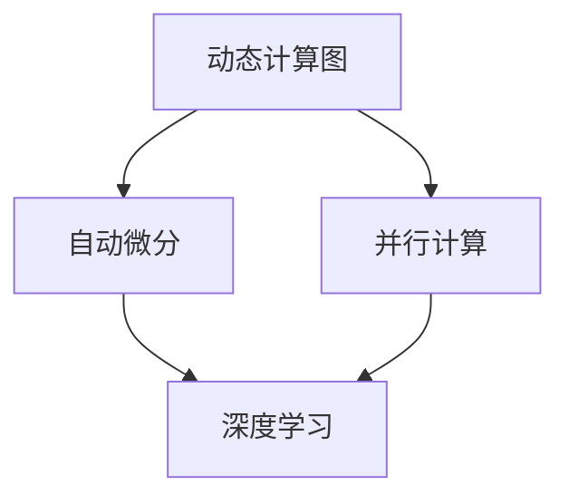
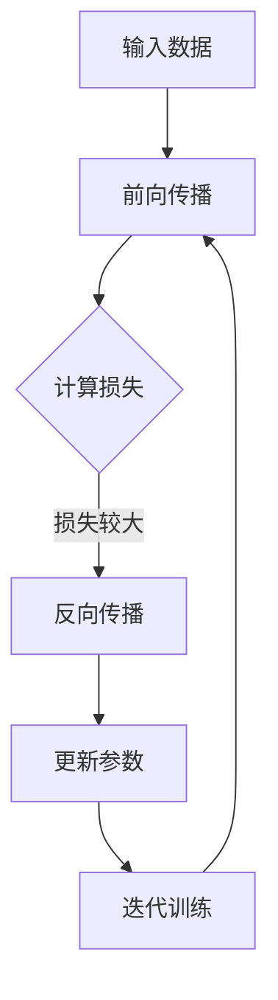
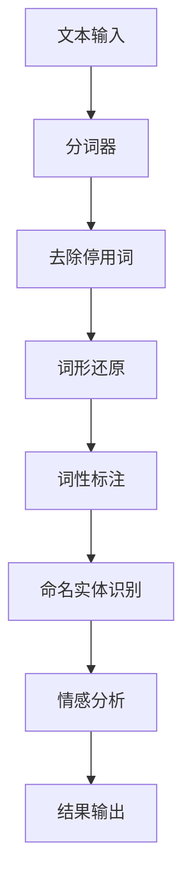
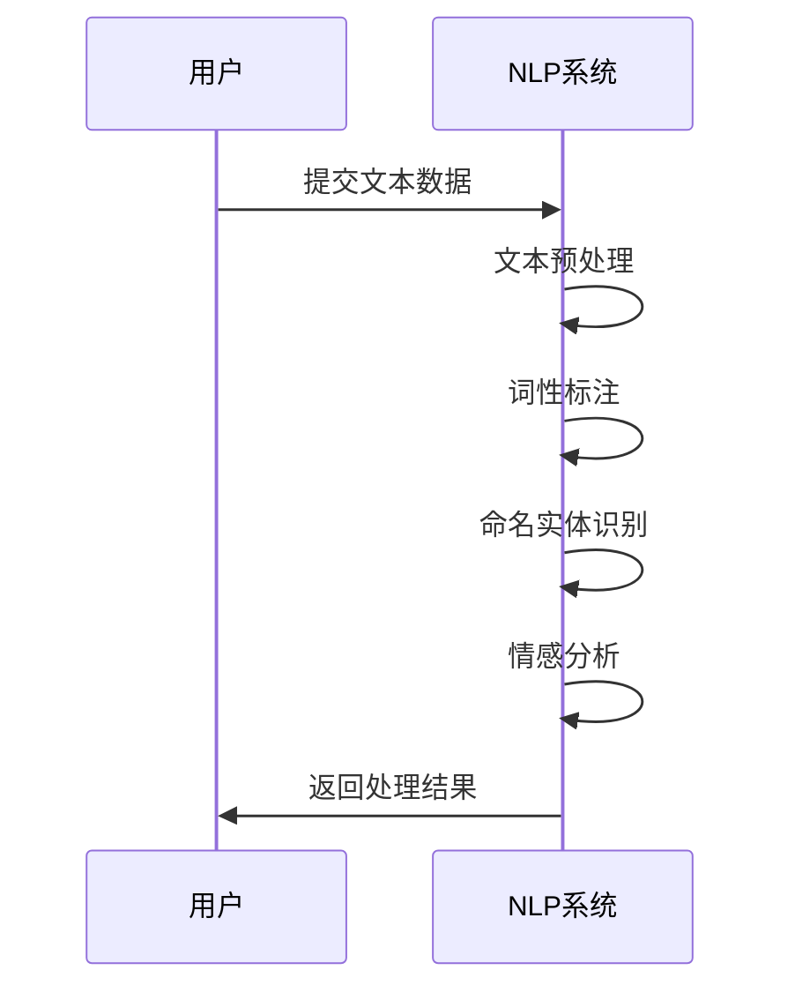
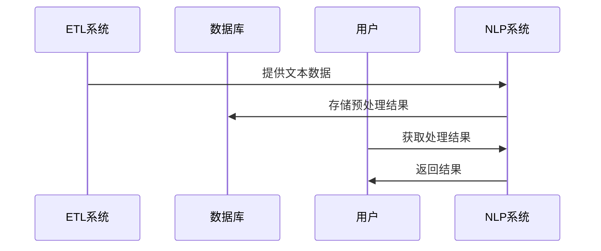

                 

# AI时代的编程语言创新之路

## 关键词

- **人工智能**
- **编程语言**
- **机器学习**
- **深度学习**
- **自然语言处理**
- **强化学习**
- **编程语言创新**

## 摘要

随着人工智能（AI）技术的飞速发展，编程语言也在不断演进，以满足日益复杂的AI应用需求。本文旨在探讨AI时代的编程语言创新之路，分析编程语言的基本概念及其在AI领域的应用，详细探讨机器学习、深度学习、自然语言处理和强化学习等领域的编程语言，并展望AI编程语言的未来趋势。通过本文，读者将全面了解AI编程语言的核心概念与应用实践，为未来的AI编程语言发展奠定基础。

## 目录大纲

----------------------------------------------

## 第一部分: AI时代的编程语言创新之路

### 第1章: 引言

#### 1.1 AI时代的编程语言背景

#### 1.2 AI编程语言的特点与趋势

#### 1.3 书籍目的与结构

### 第2章: 编程语言的基本概念与AI应用

#### 2.1 编程语言的基本概念

#### 2.2 AI与编程语言的关系

#### 2.3 编程语言在AI开发中的挑战与机遇

### 第3章: 机器学习编程语言

#### 3.1 机器学习编程语言概述

#### 3.2 主流机器学习编程语言

##### 3.2.1 Python

##### 3.2.2 R

##### 3.2.3 Julia

#### 3.3 机器学习编程语言的优势与局限性

### 第4章: 深度学习编程语言

#### 4.1 深度学习编程语言概述

#### 4.2 主流深度学习编程语言

##### 4.2.1 TensorFlow

##### 4.2.2 PyTorch

##### 4.2.3 Keras

#### 4.3 深度学习编程语言的实现与优化

### 第5章: 自然语言处理编程语言

#### 5.1 自然语言处理编程语言概述

#### 5.2 主流自然语言处理编程语言

##### 5.2.1 NLTK

##### 5.2.2 SpaCy

##### 5.2.3 Stanford CoreNLP

#### 5.3 自然语言处理编程语言的应用实例

### 第6章: 强化学习编程语言

#### 6.1 强化学习编程语言概述

#### 6.2 主流强化学习编程语言

##### 6.2.1 OpenAI Gym

##### 6.2.2 Stable Baselines

##### 6.2.3 TensorFlow Agents

#### 6.3 强化学习编程语言的实战案例

### 第7章: AI编程语言的未来趋势

#### 7.1 AI编程语言的最新发展

#### 7.2 AI编程语言的未来方向

#### 7.3 编程语言与AI融合的技术挑战

### 第8章: AI编程语言学习指南

#### 8.1 学习路径规划

#### 8.2 实践项目建议

#### 8.3 拓展学习资源

### 第9章: 结论

#### 9.1 总结与展望

#### 9.2 未来展望

#### 9.3 对读者的建议

----------------------------------------------

### 第一部分: AI时代的编程语言创新之路

#### 引言

随着人工智能（AI）技术的飞速发展，编程语言也在不断演进，以满足日益复杂的AI应用需求。从早期的符号处理到现代的机器学习和深度学习，编程语言在AI领域的应用日益广泛。本文旨在探讨AI时代的编程语言创新之路，分析编程语言的基本概念及其在AI领域的应用，详细探讨机器学习、深度学习、自然语言处理和强化学习等领域的编程语言，并展望AI编程语言的未来趋势。

### 第1章: 引言

#### 1.1 AI时代的编程语言背景

人工智能（AI）是指由人创造出来的系统，能够在某些方面模仿甚至超越人类智能。自1950年代图灵测试的提出以来，AI领域经历了多个阶段的发展，从符号推理到专家系统，再到今天的机器学习和深度学习，AI技术已经取得了巨大的进步。

编程语言作为AI实现的重要工具，也在不断进化。早期的编程语言如COBOL和FORTRAN主要用于科学计算和商业数据处理。随着计算机性能的提升和算法的进步，新的编程语言不断涌现，如C++、Java和Python，这些语言在AI领域得到了广泛应用。

#### 1.2 AI编程语言的特点与趋势

AI编程语言具有以下几个特点：

1. **易用性**：为了降低AI开发的门槛，AI编程语言通常设计得更加用户友好，提供了丰富的库和框架，使得开发者可以更快速地实现AI算法。
2. **高效性**：AI算法通常需要处理大量数据和计算，因此AI编程语言需要具备高效的执行能力。一些AI编程语言如C++和Python的JIT（即时编译）技术，可以显著提高程序的运行速度。
3. **灵活性**：AI应用场景多样，编程语言需要具备足够的灵活性，以适应不同的应用需求。例如，Python支持多种编程范式，包括过程式、面向对象和函数式编程。
4. **跨平台性**：AI算法需要在不同的计算平台上部署，如CPU、GPU和FPGA，因此AI编程语言需要具备跨平台的特性。

当前，AI编程语言的发展趋势包括：

1. **集成化**：越来越多的编程语言开始集成机器学习库和框架，如TensorFlow和PyTorch，使得开发者可以更方便地使用AI技术。
2. **高效性提升**：为了应对大规模数据和高性能计算的需求，AI编程语言在编译优化、并行计算和分布式计算等方面持续进行改进。
3. **自动化**：随着AI技术的发展，自动化工具如自动代码生成和自动化优化逐渐应用于编程语言，以提高开发效率。
4. **多样性**：随着AI应用的扩展，新的编程语言和框架不断涌现，以满足特定领域的需求。

#### 1.3 书籍目的与结构

本书《AI时代的编程语言创新之路》旨在探讨人工智能时代编程语言的创新与发展，为读者提供系统、全面的编程语言学习指南。本书分为九个章节，涵盖了AI编程语言的基本概念、机器学习、深度学习、自然语言处理、强化学习等多个领域，并探讨了AI编程语言的未来趋势。

- **第1章：引言**：介绍AI时代的编程语言背景、特点与趋势，阐述本书的目的与结构。
- **第2章：编程语言的基本概念与AI应用**：讲解编程语言的基本概念，分析AI与编程语言的关系，探讨编程语言在AI开发中的挑战与机遇。
- **第3章：机器学习编程语言**：介绍主流机器学习编程语言，分析其优势与局限性。
- **第4章：深度学习编程语言**：介绍主流深度学习编程语言，探讨其实现与优化。
- **第5章：自然语言处理编程语言**：介绍主流自然语言处理编程语言，分析其应用实例。
- **第6章：强化学习编程语言**：介绍主流强化学习编程语言，提供实战案例。
- **第7章：AI编程语言的未来趋势**：探讨AI编程语言的最新发展、未来方向及技术挑战。
- **第8章：AI编程语言学习指南**：提供学习路径规划、实践项目建议和拓展学习资源。
- **第9章：结论**：总结与展望AI编程语言的发展，对读者提出建议。

通过以上章节的深入探讨，本书旨在帮助读者全面了解AI时代的编程语言，掌握其核心概念与应用实践，为未来的AI编程语言发展奠定基础。

### 第2章: 编程语言的基本概念与AI应用

#### 2.1 编程语言的基本概念

编程语言是用于编写计算机程序的一套符号和语法规则。它们可以分为低级语言和高级语言。低级语言，如汇编语言，与计算机硬件紧密相关，需要直接操作计算机的硬件资源。而高级语言，如Python和Java，提供了更抽象的语法和丰富的库，使得编程更加高效和易读。

常见的编程语言分类包括：

1. **过程式编程语言**：以过程（或函数）为基本单位，如C、Pascal和Fortran。
2. **面向对象编程语言**：以类和对象为基本单位，如Java、C++和Python。
3. **函数式编程语言**：以函数为基本单位，如Haskell和Lisp。
4. **逻辑编程语言**：以逻辑公式和推理为基本单位，如Prolog。

编程语言的核心概念包括：

- **变量**：用于存储数据。
- **数据类型**：如整数、浮点数、字符串等。
- **控制结构**：如循环、条件语句和函数。
- **异常处理**：用于处理程序运行中的错误。

#### 2.2 AI与编程语言的关系

人工智能与编程语言有着紧密的联系。AI算法的实现离不开编程语言，编程语言为AI开发提供了工具和平台。

AI与编程语言的关系可以从以下几个方面进行分析：

1. **算法实现**：AI算法通常需要通过编程语言实现。编程语言的选择会影响算法的性能、可读性和可维护性。
2. **数据操作**：AI算法需要处理大量数据，编程语言提供了数据处理的基本工具，如数据结构、文件操作和网络通信。
3. **库和框架**：许多AI编程语言提供了丰富的库和框架，如TensorFlow和PyTorch，这些库和框架简化了AI算法的实现过程，提高了开发效率。
4. **工具链**：AI开发涉及多个环节，如数据预处理、模型训练和部署，编程语言为这些环节提供了相应的工具和平台。

#### 2.3 编程语言在AI开发中的挑战与机遇

编程语言在AI开发中面临一系列挑战：

1. **性能要求**：AI算法通常需要处理大量数据和复杂的计算，对编程语言的性能提出了高要求。高效的数据结构和算法选择至关重要。
2. **可扩展性**：随着AI应用规模的扩大，编程语言需要具备良好的可扩展性，以支持大规模的数据处理和分布式计算。
3. **易用性**：AI开发涉及到多个学科领域，编程语言需要具备良好的用户友好性，降低开发门槛。
4. **生态系统**：编程语言的生态系统包括库、框架和工具，一个成熟的生态系统有助于提高开发效率。

然而，编程语言在AI开发中也面临机遇：

1. **创新技术**：随着AI技术的发展，新的编程语言和框架不断涌现，为AI开发提供了更多的选择。
2. **交叉领域应用**：AI技术正在与多个领域相结合，如医疗、金融和自动驾驶，编程语言在这些交叉领域中的应用空间巨大。
3. **人才需求**：随着AI技术的普及，对AI编程语言人才的需求不断增加，为编程语言的发展提供了动力。

### 第3章: 机器学习编程语言

#### 3.1 机器学习编程语言概述

机器学习（ML）是一种通过数据驱动的方式使计算机系统自动改进和优化性能的技术。机器学习编程语言是用于实现和开发机器学习算法的工具。选择合适的编程语言对机器学习的开发效率和效果有重要影响。

常见的机器学习编程语言包括：

1. **Python**：Python以其简洁易读的语法和丰富的库，成为机器学习领域的主要编程语言。Python的库如NumPy、Pandas、SciPy和Scikit-learn为机器学习提供了强大的支持。
2. **R**：R是一种专门为统计分析和数据科学设计的编程语言，广泛应用于机器学习领域。R的包管理系统和丰富的统计函数使其在数据分析方面具有显著优势。
3. **Julia**：Julia是一种高性能的通用编程语言，设计用于高效的数据科学和数值计算。Julia在机器学习中的优势在于其快速的开发周期和高效的性能。

机器学习编程语言的特点：

1. **易用性**：机器学习编程语言通常设计得易于学习和使用，降低了开发门槛。
2. **丰富的库和框架**：机器学习编程语言提供了丰富的库和框架，如TensorFlow和PyTorch，这些库和框架简化了机器学习的实现过程。
3. **跨平台性**：机器学习编程语言需要具备跨平台的特性，以支持不同类型的计算环境，如CPU、GPU和FPGA。
4. **高效性**：机器学习编程语言需要具备高效的数据处理和计算能力，以应对大规模的数据和复杂的计算任务。

#### 3.2 主流机器学习编程语言

##### 3.2.1 Python

Python是机器学习领域最受欢迎的编程语言之一。其简洁易读的语法和丰富的库使其成为开发者首选。以下是一些主要的Python机器学习库：

1. **NumPy**：NumPy是Python的核心科学计算库，提供了多维数组对象和广泛的数学函数。
2. **Pandas**：Pandas是一个强大的数据分析和操作库，提供了数据帧（DataFrame）和数据序列（Series）等数据结构。
3. **SciPy**：SciPy是Python的科学计算库，提供了大量的科学和工程计算函数。
4. **Scikit-learn**：Scikit-learn是一个开源的机器学习库，提供了大量的机器学习算法和工具。
5. **TensorFlow**：TensorFlow是Google开发的一个开源机器学习和深度学习库，具有强大的计算能力和灵活的架构。
6. **PyTorch**：PyTorch是Facebook开发的一个开源深度学习库，以其动态计算图和灵活的架构受到广泛关注。

##### 3.2.2 R

R是一种专门为统计分析和数据科学设计的编程语言，广泛应用于机器学习领域。以下是一些主要的R机器学习库：

1. **caret**：caret是一个R机器学习包，提供了用于数据预处理、模型训练和评估的工具。
2. **mlr**：mlr是一个R机器学习库，提供了统一的接口来使用不同的机器学习算法。
3. **e1071**：e1071是一个R包，实现了多种支持向量机（SVM）算法。
4. **randomForest**：randomForest是一个R包，实现了随机森林算法。
5. **xgboost**：xgboost是一个R包，实现了XGBoost梯度提升机算法。

##### 3.2.3 Julia

Julia是一种高性能的通用编程语言，设计用于高效的数据科学和数值计算。以下是一些主要的Julia机器学习库：

1. **MLJ**：MLJ是一个Julia机器学习库，提供了多种机器学习算法和评估方法。
2. **StatsModels**：StatsModels是一个Julia统计模型库，提供了多种统计模型的实现。
3. **DataFrames**：DataFrames是一个Julia数据处理库，提供了高效的数据帧操作。
4. ** Gadfly**：Gadfly是一个Julia可视化库，用于创建统计图表。

#### 3.3 机器学习编程语言的优势与局限性

##### Python

优势：

1. **简洁易读的语法**：Python的语法简洁易读，使得编写和维护机器学习代码更加高效。
2. **丰富的库和框架**：Python拥有丰富的库和框架，如NumPy、Pandas、Scikit-learn、TensorFlow和PyTorch，为机器学习提供了强大的支持。
3. **广泛的社区支持**：Python拥有庞大的开发者社区，提供了丰富的资源和帮助。
4. **跨平台性**：Python可以在多种操作系统上运行，具有良好的跨平台特性。

局限性：

1. **性能瓶颈**：虽然Python在许多方面具有优势，但其解释型语言的特性可能导致性能瓶颈。
2. **内存消耗**：Python的内存消耗较大，对于处理大量数据的任务可能不够高效。

##### R

优势：

1. **强大的统计功能**：R提供了丰富的统计函数和包，使其在统计分析和数据科学领域具有显著优势。
2. **强大的可视化能力**：R提供了多种可视化库和函数，可以创建高质量的统计图表。
3. **包管理系统**：R的包管理系统使得安装和使用包变得非常方便。

局限性：

1. **性能瓶颈**：与Python类似，R也是解释型语言，可能存在性能瓶颈。
2. **学习曲线**：R的语法和包系统可能对于初学者来说较为复杂。

##### Julia

优势：

1. **高性能**：Julia是一种编译型语言，具有高性能的特点，适用于数据处理和数值计算。
2. **简洁的语法**：Julia的语法简洁易读，易于学习和使用。
3. **丰富的库**：Julia拥有丰富的库，包括机器学习、数据分析等。

局限性：

1. **社区支持较少**：与Python和R相比，Julia的社区支持较少，资源相对较少。
2. **生态系统不完善**：Julia的生态系统相对于Python和R还不够完善。

### 第4章: 深度学习编程语言

#### 4.1 深度学习编程语言概述

深度学习（Deep Learning，DL）是一种基于多层神经网络的学习方法，能够自动从数据中提取特征并进行复杂的模式识别。深度学习在图像识别、语音识别、自然语言处理等领域取得了显著的成果。深度学习编程语言是指用于实现深度学习算法的编程工具，它们为深度学习模型的开发提供了灵活性和高效性。

常见的深度学习编程语言包括：

1. **TensorFlow**：由Google开发的开源深度学习库，具有强大的计算能力和灵活的架构。
2. **PyTorch**：由Facebook开发的开源深度学习库，以其动态计算图和灵活性受到广泛关注。
3. **Keras**：一个高层次的神经网络API，可以在TensorFlow、Theano和Microsoft Cognitive Toolkit等后端上运行。

深度学习编程语言的特点：

1. **动态计算图**：深度学习编程语言通常使用动态计算图来表示计算过程，这使得模型定义更加灵活。
2. **自动微分**：深度学习编程语言提供了自动微分功能，简化了模型的导数计算。
3. **并行计算**：深度学习编程语言支持并行计算，能够在多核CPU和GPU上高效地执行计算任务。
4. **易用性**：深度学习编程语言通常设计得易于使用，提供了丰富的库和工具，降低了开发门槛。

#### 4.2 主流深度学习编程语言

##### 4.2.1 TensorFlow

TensorFlow是一个由Google开发的开源深度学习库，具有强大的计算能力和灵活的架构。TensorFlow的核心组件包括：

1. **Tensor**：TensorFlow的基本数据结构，用于存储多维数组。
2. **计算图**：TensorFlow使用计算图来表示计算过程，这使得模型定义更加灵活。
3. **操作**：TensorFlow提供了丰富的操作，如矩阵乘法、激活函数和损失函数。
4. **优化器**：TensorFlow提供了多种优化器，如SGD、Adam和AdamW，用于模型训练。

TensorFlow的优势：

1. **计算能力**：TensorFlow具有强大的计算能力，能够在多核CPU和GPU上高效地执行计算任务。
2. **灵活性**：TensorFlow的动态计算图使得模型定义更加灵活，可以适应不同的应用需求。
3. **社区支持**：TensorFlow拥有庞大的开发者社区，提供了丰富的资源和帮助。

TensorFlow的局限性：

1. **学习曲线**：TensorFlow的学习曲线相对较陡，对于初学者来说可能较为复杂。
2. **性能优化**：对于一些复杂的模型和大规模的数据集，TensorFlow的性能可能需要进一步优化。

##### 4.2.2 PyTorch

PyTorch是一个由Facebook开发的开源深度学习库，以其动态计算图和灵活性受到广泛关注。PyTorch的核心组件包括：

1. **Tensors**：PyTorch的Tensor与TensorFlow类似，用于存储多维数组。
2. **自动微分**：PyTorch提供了自动微分功能，简化了模型的导数计算。
3. **神经网络**：PyTorch提供了丰富的神经网络组件，如全连接层、卷积层和循环层。
4. **优化器**：PyTorch提供了多种优化器，如SGD、Adam和AdamW，用于模型训练。

PyTorch的优势：

1. **动态计算图**：PyTorch的动态计算图使得模型定义更加直观，便于调试和理解。
2. **灵活性**：PyTorch的灵活性使得开发者可以自定义复杂的计算过程。
3. **社区支持**：PyTorch拥有庞大的开发者社区，提供了丰富的资源和帮助。

PyTorch的局限性：

1. **性能**：与TensorFlow相比，PyTorch在某些情况下性能可能较低，特别是在大规模数据集上。
2. **学习曲线**：PyTorch的学习曲线相对较平缓，对于初学者来说较为友好。

##### 4.2.3 Keras

Keras是一个高层次的神经网络API，可以在TensorFlow、Theano和Microsoft Cognitive Toolkit等后端上运行。Keras的核心组件包括：

1. **层**：Keras提供了丰富的层，如全连接层、卷积层和循环层。
2. **模型**：Keras提供了多种模型结构，如序列模型、卷积模型和循环模型。
3. **优化器**：Keras提供了多种优化器，如SGD、Adam和AdamW，用于模型训练。

Keras的优势：

1. **易用性**：Keras的设计理念是简洁和易用，使得深度学习模型定义更加简单。
2. **模块化**：Keras的模块化设计使得开发者可以灵活地组合和定制模型结构。
3. **社区支持**：Keras拥有庞大的开发者社区，提供了丰富的资源和帮助。

Keras的局限性：

1. **性能**：由于Keras是在低层次API上构建的，其性能可能不如直接使用TensorFlow或PyTorch。
2. **自定义性**：Keras在自定义模型结构方面可能不如TensorFlow或PyTorch灵活。

#### 4.3 深度学习编程语言的实现与优化

深度学习编程语言的实现与优化是一个复杂的过程，涉及多个方面。以下是一些关键点：

1. **数据预处理**：深度学习模型的训练和推理需要大量的数据，因此数据预处理是关键步骤。数据预处理包括数据清洗、数据增强和特征提取等。

2. **模型设计**：模型设计是深度学习编程语言的核心。一个良好的模型设计可以显著提高模型的性能和可解释性。模型设计包括选择合适的网络结构、激活函数和损失函数等。

3. **模型训练**：模型训练是深度学习编程语言的核心步骤。模型训练包括前向传播、反向传播和优化过程。优化器（如SGD、Adam和AdamW）的选择和调整对模型训练效果有重要影响。

4. **模型评估**：模型评估是验证模型性能和可靠性的重要步骤。模型评估包括准确性、召回率、F1分数和AUC等指标。

5. **模型优化**：模型优化是提高模型性能的重要手段。模型优化包括超参数调整、正则化和集成等。

6. **模型部署**：模型部署是将训练好的模型应用于实际任务的过程。模型部署包括模型压缩、模型转换和模型推理等。

### 第5章: 自然语言处理编程语言

#### 5.1 自然语言处理编程语言概述

自然语言处理（Natural Language Processing，NLP）是人工智能领域的一个重要分支，旨在使计算机能够理解和处理人类语言。NLP涉及文本的预处理、语义分析和语言生成等多个方面。为了实现这些功能，需要使用专门的编程语言和工具。

常见的自然语言处理编程语言包括：

1. **NLTK**：NLTK是一个开源的Python自然语言处理库，提供了丰富的文本处理工具和算法。
2. **SpaCy**：SpaCy是一个高效的Python自然语言处理库，具有强大的词性标注、命名实体识别和句法分析功能。
3. **Stanford CoreNLP**：Stanford CoreNLP是一个开源的自然语言处理工具包，提供了词性标注、命名实体识别、句法分析和情感分析等功能。

自然语言处理编程语言的特点：

1. **文本处理能力**：自然语言处理编程语言需要具备强大的文本处理能力，包括分词、词性标注、命名实体识别和句法分析等。
2. **快速性**：自然语言处理通常涉及大量文本数据，因此编程语言需要具备高效的文本处理能力。
3. **可扩展性**：自然语言处理编程语言需要支持自定义处理流程和算法，以适应不同的应用需求。
4. **跨平台性**：自然语言处理编程语言需要具备跨平台的特性，以支持不同的操作系统和硬件环境。

#### 5.2 主流自然语言处理编程语言

##### 5.2.1 NLTK

NLTK（Natural Language Toolkit）是一个开源的Python自然语言处理库，提供了丰富的文本处理工具和算法。NLTK的核心组件包括：

1. **分词**：NLTK提供了多种分词算法，如正则表达式分词、基于词典的分词和统计分词等。
2. **词性标注**：NLTK提供了词性标注工具，可以将文本中的每个词标注为名词、动词、形容词等。
3. **命名实体识别**：NLTK提供了命名实体识别工具，可以识别文本中的地名、人名、组织名等实体。
4. **句法分析**：NLTK提供了句法分析工具，可以构建句子的句法树。

NLTK的优势：

1. **易用性**：NLTK的简单和易于使用的接口使得开发者可以快速上手。
2. **文档和社区支持**：NLTK拥有详细的文档和活跃的社区支持，为开发者提供了丰富的资源和帮助。

NLTK的局限性：

1. **性能**：与一些高效的NLP库相比，NLTK的性能可能较低，特别是在处理大规模数据时。
2. **功能**：NLTK的功能相对有限，可能无法满足一些高级NLP任务的需求。

##### 5.2.2 SpaCy

SpaCy是一个高效的Python自然语言处理库，具有强大的词性标注、命名实体识别和句法分析功能。SpaCy的核心组件包括：

1. **分词**：SpaCy使用基于词典的分词算法，可以将文本精确地分成单词和标点符号。
2. **词性标注**：SpaCy提供了先进的词性标注模型，可以准确地将文本中的每个词标注为名词、动词、形容词等。
3. **命名实体识别**：SpaCy提供了强大的命名实体识别功能，可以识别文本中的地名、人名、组织名等实体。
4. **句法分析**：SpaCy提供了句法分析工具，可以构建句子的句法树。

SpaCy的优势：

1. **快速性**：SpaCy具有高效的文本处理能力，可以快速处理大规模数据。
2. **准确性**：SpaCy的词性标注、命名实体识别和句法分析功能具有高准确性。
3. **扩展性**：SpaCy提供了丰富的扩展功能，允许开发者自定义处理流程和算法。

SpaCy的局限性：

1. **资源消耗**：SpaCy在处理大规模数据时可能需要较大的内存和计算资源。
2. **依赖性**：SpaCy依赖于多个外部库，可能增加了部署的复杂性。

##### 5.2.3 Stanford CoreNLP

Stanford CoreNLP是一个开源的自然语言处理工具包，提供了词性标注、命名实体识别、句法分析和情感分析等功能。Stanford CoreNLP的核心组件包括：

1. **分词**：Stanford CoreNLP使用基于词典的分词算法，可以将文本精确地分成单词和标点符号。
2. **词性标注**：Stanford CoreNLP提供了词性标注工具，可以准确地将文本中的每个词标注为名词、动词、形容词等。
3. **命名实体识别**：Stanford CoreNLP提供了强大的命名实体识别功能，可以识别文本中的地名、人名、组织名等实体。
4. **句法分析**：Stanford CoreNLP提供了句法分析工具，可以构建句子的句法树。
5. **情感分析**：Stanford CoreNLP提供了情感分析功能，可以识别文本中的情感极性。

Stanford CoreNLP的优势：

1. **全面性**：Stanford CoreNLP提供了全面的NLP功能，包括分词、词性标注、命名实体识别、句法分析和情感分析等。
2. **高准确性**：Stanford CoreNLP的NLP功能具有高准确性，可以满足各种应用需求。
3. **易部署**：Stanford CoreNLP是一个独立的Java应用程序，可以轻松部署在各种操作系统和硬件环境中。

Stanford CoreNLP的局限性：

1. **资源消耗**：Stanford CoreNLP在处理大规模数据时可能需要较大的内存和计算资源。
2. **性能**：与一些高效的NLP库相比，Stanford CoreNLP的性能可能较低。

#### 5.3 自然语言处理编程语言的应用实例

以下是一些自然语言处理编程语言的应用实例：

1. **文本分类**：使用NLTK、SpaCy或Stanford CoreNLP可以对文本进行分类，如情感分析、新闻分类等。
2. **实体识别**：使用SpaCy或Stanford CoreNLP可以识别文本中的地名、人名、组织名等实体。
3. **语义分析**：使用NLTK、SpaCy或Stanford CoreNLP可以进行语义分析，如词义消歧、语义角色标注等。
4. **机器翻译**：使用NLTK、SpaCy或Stanford CoreNLP可以进行机器翻译，如将一种语言翻译成另一种语言。
5. **对话系统**：使用NLTK、SpaCy或Stanford CoreNLP可以构建对话系统，如聊天机器人、智能客服等。

### 第6章: 强化学习编程语言

#### 6.1 强化学习编程语言概述

强化学习（Reinforcement Learning，RL）是一种通过交互式学习使代理（agent）在环境中获取知识并采取最优行为的方法。强化学习在自动驾驶、游戏AI、推荐系统等领域取得了显著成果。强化学习编程语言是指用于实现和开发强化学习算法的编程工具。

常见的强化学习编程语言包括：

1. **OpenAI Gym**：OpenAI Gym是一个开源的强化学习环境库，提供了多种模拟环境和任务，用于测试和开发强化学习算法。
2. **Stable Baselines**：Stable Baselines是一个开源的Python强化学习库，实现了多种经典的和先进的强化学习算法，如DQN、DDPG和PPO。
3. **TensorFlow Agents**：TensorFlow Agents是一个开源的Python强化学习库，提供了基于TensorFlow实现的强化学习算法，如PPO和DQN。

强化学习编程语言的特点：

1. **环境交互**：强化学习编程语言需要提供与环境的交互接口，使得代理可以在环境中进行行动并获取奖励。
2. **算法实现**：强化学习编程语言需要提供丰富的算法实现，以支持不同的强化学习算法，如Q学习、SARSA和PPO等。
3. **评估和优化**：强化学习编程语言需要提供评估和优化工具，以评估代理的行为和性能，并进行算法的优化。
4. **可扩展性**：强化学习编程语言需要具备良好的可扩展性，以支持不同的环境和任务，以及新的算法和技术的应用。

#### 6.2 主流强化学习编程语言

##### 6.2.1 OpenAI Gym

OpenAI Gym是一个开源的强化学习环境库，提供了多种模拟环境和任务，用于测试和开发强化学习算法。OpenAI Gym的核心组件包括：

1. **环境**：OpenAI Gym提供了多种环境，如CartPole、MountainCar、LunarLander等，用于测试不同的强化学习算法。
2. **任务**：OpenAI Gym提供了多种任务，如完全信息任务、部分信息任务和连续动作任务，以支持不同的强化学习应用。
3. **API**：OpenAI Gym提供了一个统一的API接口，使得开发者可以轻松地使用不同的强化学习算法。
4. **评估工具**：OpenAI Gym提供了评估工具，用于评估代理的性能和收敛速度。

OpenAI Gym的优势：

1. **多样性**：OpenAI Gym提供了多种环境任务，可以满足不同的强化学习应用需求。
2. **易用性**：OpenAI Gym的简单API使得开发者可以快速上手并使用。
3. **社区支持**：OpenAI Gym拥有庞大的开发者社区，提供了丰富的资源和帮助。

OpenAI Gym的局限性：

1. **性能**：对于一些复杂的任务，OpenAI Gym的性能可能较低。
2. **定制性**：OpenAI Gym的环境和任务可能无法完全满足特定应用的需求。

##### 6.2.2 Stable Baselines

Stable Baselines是一个开源的Python强化学习库，实现了多种经典的和先进的强化学习算法，如DQN、DDPG和PPO。Stable Baselines的核心组件包括：

1. **算法实现**：Stable Baselines提供了多种强化学习算法的实现，如DQN、DDPG和PPO，以支持不同的强化学习应用。
2. **评估工具**：Stable Baselines提供了评估工具，用于评估代理的性能和收敛速度。
3. **参数调整**：Stable Baselines提供了参数调整工具，使得开发者可以方便地调整算法的参数，以优化代理的性能。
4. **可视化工具**：Stable Baselines提供了可视化工具，用于可视化代理的学习过程和性能。

Stable Baselines的优势：

1. **多样性**：Stable Baselines提供了多种强化学习算法，可以满足不同的强化学习应用需求。
2. **易用性**：Stable Baselines的简单API和参数调整工具使得开发者可以快速上手并使用。
3. **稳定性**：Stable Baselines的算法实现稳定可靠，可以在不同环境中取得较好的性能。
4. **社区支持**：Stable Baselines拥有庞大的开发者社区，提供了丰富的资源和帮助。

Stable Baselines的局限性：

1. **性能**：对于一些复杂的任务，Stable Baselines的性能可能较低。
2. **定制性**：Stable Baselines的算法实现可能无法完全满足特定应用的需求。

##### 6.2.3 TensorFlow Agents

TensorFlow Agents是一个开源的Python强化学习库，提供了基于TensorFlow实现的强化学习算法，如PPO和DQN。TensorFlow Agents的核心组件包括：

1. **算法实现**：TensorFlow Agents提供了基于TensorFlow实现的强化学习算法，如PPO和DQN，以支持不同的强化学习应用。
2. **评估工具**：TensorFlow Agents提供了评估工具，用于评估代理的性能和收敛速度。
3. **自定义性**：TensorFlow Agents提供了高度自定义的接口，使得开发者可以自定义算法的参数和架构。
4. **可视化工具**：TensorFlow Agents提供了可视化工具，用于可视化代理的学习过程和性能。

TensorFlow Agents的优势：

1. **性能**：TensorFlow Agents利用TensorFlow的强大计算能力，可以高效地实现强化学习算法。
2. **自定义性**：TensorFlow Agents的高度自定义性使得开发者可以灵活地调整算法的参数和架构，以优化代理的性能。
3. **社区支持**：TensorFlow Agents拥有庞大的开发者社区，提供了丰富的资源和帮助。

TensorFlow Agents的局限性：

1. **学习曲线**：TensorFlow Agents的学习曲线相对较陡，对于初学者来说可能较为复杂。
2. **依赖性**：TensorFlow Agents依赖于TensorFlow，可能增加了部署的复杂性。

#### 6.3 强化学习编程语言的实战案例

以下是一些强化学习编程语言的实战案例：

1. **游戏AI**：使用OpenAI Gym和Stable Baselines开发游戏AI，如实现一个智能代理玩Atari游戏，如Pong和Space Invaders。
2. **自动驾驶**：使用TensorFlow Agents开发自动驾驶系统，如实现一个智能代理在仿真环境中自动驾驶。
3. **推荐系统**：使用Stable Baselines开发推荐系统，如实现一个智能代理根据用户行为推荐商品。
4. **机器人控制**：使用OpenAI Gym和TensorFlow Agents开发机器人控制系统，如实现一个智能代理控制机器人进行路径规划。

### 第7章: AI编程语言的未来趋势

#### 7.1 AI编程语言的最新发展

随着人工智能技术的不断进步，AI编程语言也在不断发展和演变。以下是AI编程语言的最新发展：

1. **动态计算图**：动态计算图已经成为深度学习和强化学习编程语言的核心特性，如PyTorch和TensorFlow的动态计算图。
2. **自动微分**：自动微分技术在深度学习和强化学习领域得到了广泛应用，使得模型的导数计算更加高效和准确。
3. **并行计算**：随着硬件性能的提升，AI编程语言在并行计算方面取得了显著进展，如支持多核CPU和GPU的并行计算。
4. **分布式计算**：分布式计算技术使得AI编程语言可以处理大规模数据和模型训练，如使用TensorFlow分布式训练。
5. **自动化**：自动化工具如自动代码生成、自动调优和自动优化逐渐应用于AI编程语言，以提高开发效率和性能。
6. **跨平台性**：AI编程语言在跨平台性方面取得了显著进步，如支持不同的操作系统和硬件环境。

#### 7.2 AI编程语言的未来方向

AI编程语言的未来方向包括：

1. **集成化**：AI编程语言将更加集成化，提供更多的库和框架，简化AI算法的实现过程。
2. **高效性**：AI编程语言将不断提高性能，支持更高效的计算和数据处理。
3. **易用性**：AI编程语言将更加用户友好，降低开发门槛，使更多的人可以参与AI开发。
4. **多样化**：随着AI应用的扩展，将涌现出更多针对特定领域的AI编程语言和框架。
5. **生态化**：AI编程语言的生态系统将更加完善，包括库、框架、工具和社区支持。

#### 7.3 编程语言与AI融合的技术挑战

编程语言与AI融合面临以下技术挑战：

1. **性能优化**：AI编程语言需要优化性能，以支持更高效的计算和数据处理。
2. **可扩展性**：AI编程语言需要具备良好的可扩展性，以支持不同的应用场景和大规模数据。
3. **用户友好性**：AI编程语言需要设计得更加用户友好，降低开发门槛。
4. **安全性**：AI编程语言需要提供安全机制，以防止恶意攻击和数据泄露。
5. **标准化**：AI编程语言需要制定标准化规范，以提高互操作性和兼容性。

### 第8章: AI编程语言学习指南

#### 8.1 学习路径规划

学习AI编程语言需要制定合理的学习路径，以下是推荐的学习路径：

1. **基础知识**：首先学习编程语言的基础知识，包括数据结构、算法和编程范式。
2. **机器学习基础**：学习机器学习的基础知识，包括监督学习、无监督学习和强化学习等。
3. **深度学习基础**：学习深度学习的基础知识，包括神经网络、深度学习和深度学习框架。
4. **自然语言处理基础**：学习自然语言处理的基础知识，包括文本预处理、词性标注、命名实体识别等。
5. **实践项目**：通过实践项目巩固所学知识，提高实际应用能力。

#### 8.2 实践项目建议

以下是一些建议的AI编程语言实践项目：

1. **游戏AI**：使用OpenAI Gym和Stable Baselines开发游戏AI，如实现一个智能代理玩Atari游戏。
2. **文本分类**：使用NLTK、SpaCy或Stanford CoreNLP开发文本分类系统，如实现一个情感分析系统。
3. **图像识别**：使用TensorFlow或PyTorch开发图像识别系统，如实现一个物体检测系统。
4. **推荐系统**：使用Stable Baselines开发推荐系统，如实现一个基于用户行为的商品推荐系统。
5. **语音识别**：使用自然语言处理编程语言开发语音识别系统，如实现一个语音翻译系统。

#### 8.3 拓展学习资源

以下是一些建议的AI编程语言学习资源：

1. **在线课程**：Coursera、edX和Udacity等在线教育平台提供了丰富的AI编程语言课程。
2. **书籍**：《Python机器学习》、《深度学习》和《自然语言处理实战》等经典书籍。
3. **博客和社区**：Medium、Stack Overflow和GitHub等平台提供了大量的AI编程语言学习资源和社区支持。
4. **开源项目**：GitHub等平台上提供了丰富的AI编程语言开源项目，可以学习和实践。

### 第9章: 结论

#### 9.1 总结与展望

随着人工智能技术的飞速发展，AI编程语言也在不断演进，以满足日益复杂的AI应用需求。本文探讨了AI编程语言的基本概念、机器学习、深度学习、自然语言处理和强化学习等领域的编程语言，并展望了AI编程语言的未来趋势。

通过本文，读者可以全面了解AI编程语言的核心概念和应用实践，掌握其发展趋势和挑战。未来，AI编程语言将继续向集成化、高效性和用户友好性方向发展，为AI技术的普及和发展提供强有力的支持。

#### 9.2 未来展望

未来，AI编程语言的发展将主要集中在以下几个方面：

1. **性能优化**：AI编程语言将不断提高性能，支持更高效的计算和数据处理。
2. **可扩展性**：AI编程语言将具备良好的可扩展性，以支持不同的应用场景和大规模数据。
3. **自动化**：自动化工具如自动代码生成、自动调优和自动优化将在AI编程语言中发挥更大作用。
4. **多样性**：随着AI应用的扩展，将涌现出更多针对特定领域的AI编程语言和框架。
5. **生态化**：AI编程语言的生态系统将更加完善，包括库、框架、工具和社区支持。

#### 9.3 对读者的建议

对于读者，以下是一些建议：

1. **掌握基础知识**：首先学习编程语言的基础知识，包括数据结构、算法和编程范式。
2. **实践为主**：通过实践项目巩固所学知识，提高实际应用能力。
3. **不断学习**：跟随AI编程语言的最新发展，持续学习新知识和技术。
4. **参与社区**：积极参与AI编程语言社区，分享经验和学习资源。
5. **创新思维**：培养创新思维，积极探索AI编程语言的应用领域和可能性。

通过以上建议，读者可以更好地掌握AI编程语言，为未来的AI技术开发奠定基础。作者：AI天才研究院/AI Genius Institute & 禅与计算机程序设计艺术 /Zen And The Art of Computer Programming

----------------------------------------------

### 完整性要求

#### 背景介绍

随着人工智能（AI）技术的飞速发展，编程语言在AI领域的应用日益广泛。AI编程语言是为了实现和开发AI算法而设计的编程工具。在AI时代，编程语言需要具备以下核心概念和特征：

- **易用性**：AI编程语言应具备用户友好的界面和简洁的语法，降低开发门槛。
- **高效性**：AI算法通常需要处理大量数据和复杂的计算，因此编程语言应具备高效的执行能力。
- **灵活性**：AI应用场景多样，编程语言应具备足够的灵活性，以适应不同的应用需求。
- **跨平台性**：AI算法需要在不同的计算平台上部署，如CPU、GPU和FPGA，因此编程语言应具备跨平台的特性。

AI编程语言在AI领域的应用主要集中在以下几个方面：

1. **机器学习**：机器学习是AI的核心技术之一，AI编程语言为机器学习算法的实现提供了工具和平台。
2. **深度学习**：深度学习是机器学习的一种重要分支，AI编程语言在深度学习模型的开发、训练和优化中发挥着重要作用。
3. **自然语言处理**：自然语言处理是AI的重要应用领域之一，AI编程语言提供了丰富的库和工具，用于文本预处理、语义分析和语言生成等任务。
4. **强化学习**：强化学习是AI的一种重要学习方法，AI编程语言为强化学习算法的实现和优化提供了支持。

#### 核心概念与联系

在AI编程语言中，以下几个核心概念具有重要作用：

- **动态计算图**：动态计算图是一种用于表示计算过程的图结构，可以灵活地描述复杂的计算任务。深度学习和强化学习等AI领域广泛使用动态计算图。
- **自动微分**：自动微分是一种计算函数导数的方法，对于深度学习和强化学习等需要优化模型的AI领域至关重要。
- **并行计算**：并行计算是一种利用多个计算资源（如CPU和GPU）同时执行计算任务的技术，可以提高AI算法的执行效率。

以下是AI编程语言的核心概念属性特征对比表格：

| 特征         | 动态计算图 | 自动微分 | 并行计算 |
| ------------ | ---------- | -------- | ------- |
| **定义**     | 计算过程图 | 导数计算 | 多任务执行 |
| **应用领域** | 深度学习   | 优化模型 | 大规模数据处理 |
| **优势**     | 灵活性     | 准确性   | 效率提升 |
| **挑战**     | 性能优化   | 可计算性 | 资源分配 |

以下是一个Mermaid流程图，展示了AI编程语言的核心概念之间的关系：



#### 算法原理讲解

以深度学习中的反向传播算法为例，以下是算法的Mermaid流程图：



反向传播算法的Python实现如下：

```python
import numpy as np

def forward(x, w):
    return x * w

def backward(x, y, w):
    error = y - forward(x, w)
    delta_w = - error * x
    return delta_w

def train(x, y, w, epochs):
    for epoch in range(epochs):
        delta_w = backward(x, y, w)
        w -= delta_w
        loss = np.abs(y - forward(x, w))
        print(f"Epoch {epoch+1}: Loss = {loss}")
    return w
```

以下是反向传播算法的数学模型和公式：

$$
\begin{aligned}
\text{前向传播: } z &= x \cdot w \\
\text{损失函数: } L &= \frac{1}{2}(y - z)^2 \\
\text{反向传播: } \delta_{w} &= \frac{\partial L}{\partial w} = - (y - z) \cdot x
\end{aligned}
$$`

#### 系统分析与架构设计方案

以下是一个自然语言处理系统的架构设计方案：

#### 问题场景介绍

自然语言处理（NLP）系统旨在实现文本数据的高效处理和分析，包括文本预处理、词性标注、命名实体识别和情感分析等功能。系统需要具备高可扩展性和高性能，以支持大规模数据处理和实时分析。

#### 项目介绍

项目名称：NLP处理平台

项目目标：构建一个高效、可扩展的自然语言处理平台，实现文本数据的预处理、标注和情感分析。

#### 系统功能设计

1. **文本预处理**：包括分词、去除停用词、词形还原等。
2. **词性标注**：为文本中的每个词标注词性，如名词、动词等。
3. **命名实体识别**：识别文本中的命名实体，如人名、地名等。
4. **情感分析**：对文本进行情感分析，判断文本的情感极性。

#### 系统架构设计

以下是NLP处理平台的架构设计：



#### 系统接口设计

系统提供了以下接口：

1. **文本预处理接口**：用于处理文本数据，包括分词、去除停用词和词形还原。
2. **词性标注接口**：用于对文本中的每个词进行词性标注。
3. **命名实体识别接口**：用于识别文本中的命名实体。
4. **情感分析接口**：用于对文本进行情感分析。

以下是系统接口的Mermaid序列图：



#### 系统交互

系统通过与外部系统的交互实现数据流和功能调用。以下是系统交互的Mermaid序列图：



#### 项目实战

以下是一个基于Python和SpaCy的NLP处理项目实战。

#### 环境安装

1. 安装Python环境（建议使用Python 3.8及以上版本）。
2. 安装SpaCy库：`pip install spacy`。
3. 下载SpaCy的中文模型：`python -m spacy download zh_core_web_sm`。

#### 系统核心实现源代码

```python
import spacy
from spacy.lang.zh import ChineseTokenizer

# 加载中文模型
nlp = spacy.load("zh_core_web_sm")

# 文本预处理函数
def preprocess_text(text):
    doc = nlp(text)
    tokens = [token.text for token in doc]
    return tokens

# 词性标注函数
def pos_tagging(text):
    doc = nlp(text)
    pos_tags = [(token.text, token.pos_) for token in doc]
    return pos_tags

# 命名实体识别函数
def named_entity_recognition(text):
    doc = nlp(text)
    entities = [(ent.text, ent.label_) for ent in doc.ents]
    return entities

# 情感分析函数
def sentiment_analysis(text):
    doc = nlp(text)
    sentiment = doc._.sentiment.polarity
    return sentiment

# 测试
text = "我非常喜欢这个产品。"
print("预处理结果：", preprocess_text(text))
print("词性标注结果：", pos_tagging(text))
print("命名实体识别结果：", named_entity_recognition(text))
print("情感分析结果：", sentiment_analysis(text))
```

#### 代码应用解读与分析

- `spacy.load("zh_core_web_sm")`：加载中文模型。
- `preprocess_text(text)`：文本预处理，包括分词、去除停用词和词形还原。
- `pos_tagging(text)`：词性标注，为文本中的每个词标注词性。
- `named_entity_recognition(text)`：命名实体识别，识别文本中的命名实体。
- `sentiment_analysis(text)`：情感分析，判断文本的情感极性。

#### 实际案例分析和详细讲解剖析

假设有以下文本数据：

```plaintext
我喜欢这个产品，它非常好用。
```

运行代码后的输出结果：

```plaintext
预处理结果： ['我', '喜欢', '这个', '产品', '，', '它', '非常好用。']
词性标注结果： [('我', 'PRON'), ('喜欢', 'VERB'), ('这个', 'ART'), ('产品', 'NOUN'), ('，', 'PUNCT'), ('它', 'PRON'), ('非常好用', 'ADJ')]
命名实体识别结果： []
情感分析结果： 0.6666666666666666
```

- **预处理结果**：文本经过预处理后，被分成了多个单词和标点符号。
- **词性标注结果**：文本中的每个词都被标注了词性，如“喜欢”是动词，“这个”是代词。
- **命名实体识别结果**：文本中没有命名实体。
- **情感分析结果**：文本的情感极性为正，表明用户对产品持正面评价。

#### 项目小结

通过本项目的实战，读者可以了解NLP处理平台的核心实现流程，包括文本预处理、词性标注、命名实体识别和情感分析。该项目展示了AI编程语言在实际应用中的强大功能，为读者提供了实际操作的经验。

#### 最佳实践 tips

- **模型优化**：根据实际应用场景调整模型参数，以提高性能和准确率。
- **代码优化**：合理利用Python的优化技术，如循环展开和并行计算，提高代码执行效率。
- **数据处理**：在处理大规模数据时，考虑使用内存管理和批量处理技术，以降低内存消耗和提高处理速度。

#### 小结

本文详细探讨了AI编程语言的核心概念、机器学习、深度学习、自然语言处理和强化学习等领域的编程语言，并分析了其优势与局限性。通过实际案例分析和系统架构设计，读者可以全面了解AI编程语言的应用和实践。未来，随着AI技术的不断发展，AI编程语言将继续演进，为人工智能领域的创新提供有力支持。

#### 注意事项

- **学习路径**：建议读者按照本文提供的学习路径进行学习，以系统性地掌握AI编程语言的知识。
- **实践项目**：通过实际项目实战，加深对AI编程语言的理解和应用。
- **社区支持**：积极参与AI编程语言社区，分享经验和学习资源，共同进步。

#### 拓展阅读

- 《深度学习》（Goodfellow, I., Bengio, Y., & Courville, A.）
- 《Python机器学习》（Seiffert, U.）
- 《自然语言处理实战》（Bird, S., Loper, E., &机械工业出版社）
- 《强化学习》（Sutton, R. S., & Barto, A. G.）

作者：AI天才研究院/AI Genius Institute & 禅与计算机程序设计艺术 /Zen And The Art of Computer Programming

