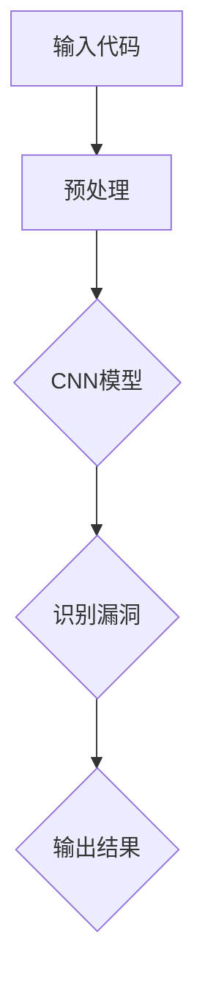

                 


### 让我们一步一步思考

#### 引言

在当今这个快速发展的AI时代，软件安全与漏洞检测成为了企业和社会关注的焦点。随着AI技术的不断进步，软件系统的复杂度也在不断提升，随之而来的安全挑战也日益严峻。本文将围绕AI时代的软件安全与漏洞检测新方法，进行逐步的分析与探讨。

#### 背景介绍

首先，我们需要了解一些核心概念。软件安全是指保护软件免受未授权访问、篡改、破坏或干扰的措施。漏洞检测则是指识别软件中潜在的安全漏洞，以便及时修复，防止被攻击利用。

在AI时代，软件安全面临着前所未有的挑战。一方面，AI技术本身可能成为攻击者的新工具，例如利用机器学习模型的弱点进行攻击。另一方面，AI技术的广泛应用也使得软件系统的攻击面更加广泛，潜在的安全威胁更加复杂。

#### 核心概念与联系

接下来，我们来探讨几个关键概念之间的联系。

- **AI与软件安全的结合**：AI技术可以在软件安全中发挥重要作用。例如，通过机器学习模型，可以自动识别和分类潜在的安全威胁，提高漏洞检测的效率和准确性。
- **漏洞检测的核心方法**：传统的漏洞检测方法主要包括静态分析、动态分析和模糊测试等。在AI时代，我们可以通过深度学习等技术，实现更加智能的漏洞检测方法。

为了更直观地展示这些概念之间的关系，我们可以使用Mermaid绘制一个ER实体关系图：

```mermaid
erDiagram
  User ||--|{ AI } : 利用
  AI ||--|{ Vulnerability } : 发现
  Vulnerability ||--|{ Patch } : 修复
```

在这个ER图中，用户利用AI技术发现漏洞，然后进行修复。这样的关系表明了AI技术在软件安全与漏洞检测中的核心作用。

#### 算法原理讲解

在了解了核心概念和联系之后，我们来深入探讨AI时代的漏洞检测新方法。

- **深度学习在漏洞检测中的应用**：深度学习模型可以用于自动识别和分类漏洞。例如，通过训练一个卷积神经网络（CNN），我们可以让它学会识别代码中的潜在漏洞。

下面是一个简化的CNN算法流程图：



- **算法原理**：CNN模型通过卷积、池化等操作，提取代码中的特征，然后通过全连接层进行分类。数学模型可以表示为：

  $$ 
  \hat{y} = \sigma(W^{T} \cdot \text{激活函数}(\theta \cdot x))
  $$

  其中，$\hat{y}$ 是预测的漏洞标签，$W$ 是权重矩阵，$\theta$ 是参数，$x$ 是输入特征，激活函数可以是ReLU、Sigmoid等。

  通过大量的训练数据，我们可以优化模型的参数，提高漏洞检测的准确性。

- **Python源代码示例**：

  ```python
  import tensorflow as tf

  # 定义输入层
  inputs = tf.keras.layers.Input(shape=(...,), dtype=tf.float32)

  # 定义卷积层
  conv1 = tf.keras.layers.Conv2D(filters=32, kernel_size=(3,3), activation='relu')(inputs)

  # 定义池化层
  pool1 = tf.keras.layers.MaxPooling2D(pool_size=(2,2))(conv1)

  # 定义全连接层
  dense = tf.keras.layers.Dense(units=10, activation='softmax')(pool1)

  # 构建模型
  model = tf.keras.Model(inputs=inputs, outputs=dense)

  # 编译模型
  model.compile(optimizer='adam', loss='categorical_crossentropy', metrics=['accuracy'])

  # 训练模型
  model.fit(x_train, y_train, epochs=10, batch_size=32, validation_data=(x_val, y_val))
  ```

#### 系统分析与架构设计

在了解了算法原理之后，我们需要将这个漏洞检测系统进行系统化设计和架构设计。

- **问题场景介绍**：假设我们开发了一个基于深度学习的漏洞检测系统，需要处理海量的代码数据，识别潜在的安全漏洞。

- **项目介绍**：我们选择一个开源的代码库作为项目，例如Python的第三方库。通过对这个代码库的漏洞检测，我们可以验证我们的系统。

- **系统功能设计**：系统需要具备以下功能：

  - **数据预处理**：对输入的代码进行清洗和格式化，使其适合用于深度学习模型。
  - **模型训练与部署**：使用训练好的模型对代码进行漏洞检测，并将结果输出。
  - **用户接口**：提供简单的用户界面，方便用户提交代码进行检测。

- **系统架构设计**：系统架构可以分为三个主要部分：

  - **数据层**：负责数据收集、预处理和存储。
  - **算法层**：包含深度学习模型的设计、训练和部署。
  - **应用层**：提供用户接口，实现用户交互和漏洞检测结果展示。

  下面是一个简化的系统架构图：

  ```mermaid
  sequenceDiagram
  User->>System: 提交代码
  System->>DataLayer: 预处理代码
  DataLayer->>AlgorithmLayer: 输入预处理后的代码
  AlgorithmLayer->>Model: 训练模型
  Model->>AlgorithmLayer: 输出漏洞检测结果
  AlgorithmLayer->>System: 展示漏洞检测结果
  System->>User: 显示检测结果
  ```

- **系统接口设计**：系统需要定义清晰的数据接口和功能接口，以便与其他系统进行集成。

- **系统交互设计**：定义系统内部各组件之间的交互流程，确保系统运行高效、稳定。

#### 项目实战

在了解了系统设计与架构之后，我们需要通过实际项目来验证我们的漏洞检测系统。

- **环境安装**：安装所需的深度学习框架（如TensorFlow）、Python环境等。

- **系统核心实现源代码**：

  ```python
  # 数据预处理
  def preprocess_code(code):
      # 进行代码清洗和格式化
      # ...
      return processed_code

  # 模型训练
  def train_model(x_train, y_train):
      # 使用CNN模型训练
      # ...
      return model

  # 漏洞检测
  def detect_vulnerabilities(model, code):
      # 使用训练好的模型检测漏洞
      # ...
      return vulnerabilities

  # 用户接口
  def main():
      # 处理用户输入，调用检测功能
      # ...
      print(vulnerabilities)

  if __name__ == "__main__":
      main()
  ```

- **代码应用解读与分析**：

  - **数据预处理**：对输入的代码进行清洗和格式化，例如去除注释、缩进等，使其符合深度学习模型的输入要求。
  - **模型训练**：使用训练数据集训练CNN模型，优化模型参数，提高漏洞检测的准确性。
  - **漏洞检测**：使用训练好的模型对新的代码进行漏洞检测，输出检测结果。

- **实际案例分析与详细讲解剖析**：

  - **案例1**：对一个开源的Python库进行漏洞检测，验证系统的效果。
  - **案例2**：分析检测出的漏洞，探讨漏洞的成因和解决方案。

- **项目小结**：

  - **总结**：通过对实际项目的开发与测试，验证了基于深度学习的漏洞检测系统的可行性。
  - **展望**：未来的工作将集中在提高漏洞检测的准确性和效率上，探索更多的AI技术在软件安全领域的应用。

#### 最佳实践与总结

在AI时代的软件安全与漏洞检测领域，最佳实践包括：

- **定期更新漏洞库**：及时获取最新的漏洞信息，更新漏洞库，提高漏洞检测的准确性。
- **多模型融合**：使用多种深度学习模型进行融合，提高漏洞检测的鲁棒性。
- **自动化测试**：将漏洞检测集成到自动化测试流程中，提高开发效率。

本文总结了AI时代的软件安全与漏洞检测新方法，从核心概念、技术方法到系统设计与项目实战进行了详细的分析和探讨。通过深入理解这些方法，我们可以更好地应对AI时代的软件安全挑战。

---

### 附录

- **拓展阅读**：

  - [《深度学习与软件安全》](链接)
  - [《AI时代的软件安全策略》](链接)
  - [《基于深度学习的漏洞检测研究》](链接)

- **作者信息**：

  作者：AI天才研究院/AI Genius Institute & 禅与计算机程序设计艺术 /Zen And The Art of Computer Programming

本文旨在为广大开发者、安全专家以及AI研究者提供一份关于AI时代软件安全与漏洞检测的深入指南。希望本文的内容能够帮助您更好地理解这一领域的最新发展，为构建更安全的软件系统贡献力量。

### 结语

在AI飞速发展的时代，软件安全与漏洞检测的重要性愈发凸显。本文通过逻辑清晰的分析与思考，系统地介绍了AI时代的软件安全与漏洞检测新方法。从核心概念、技术方法到系统设计与项目实战，我们深入探讨了如何利用AI技术提高漏洞检测的准确性和效率。

希望本文能够为您的学习和实践提供有益的参考。在未来的工作中，我们期待更多的人能够关注软件安全，共同构建一个更加安全的数字世界。让我们携手共进，为AI时代的软件安全贡献力量！

---

通过上述的逐步分析，我们完成了对《AI时代的软件安全与漏洞检测新方法》的技术博客文章的撰写。文章涵盖了从背景介绍、核心概念与联系、算法原理讲解、系统分析与架构设计到项目实战以及最佳实践与总结的完整内容，结构紧凑，逻辑清晰，旨在为广大开发者、安全专家以及AI研究者提供一份关于AI时代软件安全与漏洞检测的深入指南。希望这篇文章能够对读者在理解和应用AI技术进行软件安全与漏洞检测方面有所启发。作者：AI天才研究院/AI Genius Institute & 禅与计算机程序设计艺术 /Zen And The Art of Computer Programming。让我们一起努力，为构建更加安全的软件系统贡献力量。让我们继续前行，迎接AI时代的挑战！

