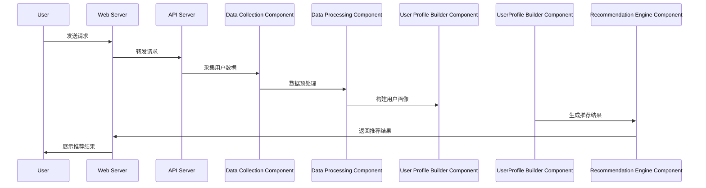
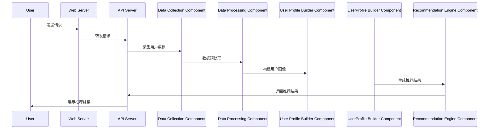

                 

### 引言

#### AI时代的软件工程伦理与隐私保护

随着人工智能（AI）技术的迅猛发展，软件工程领域正面临着前所未有的变革。AI不仅改变了软件开发的模式，还深刻影响着软件工程的伦理和隐私保护问题。在这个背景下，如何确保AI驱动的软件工程在伦理和隐私保护方面达到合理水平，成为了一个亟待解决的问题。

首先，AI时代的软件工程不仅仅是技术的进步，更是伦理的挑战。算法的决策过程往往隐藏在复杂的数学模型和机器学习算法中，这使得人们难以理解其决策逻辑，从而引发了关于公平性、透明性和可解释性的讨论。此外，随着大量个人数据的被收集和利用，隐私保护问题也愈发突出。数据泄露、隐私侵犯事件频发，使得公众对AI时代软件工程的安全性产生了质疑。

本文旨在探讨AI时代的软件工程伦理与隐私保护问题，通过以下几个部分来展开：

1. **背景介绍**：首先，我们将对AI时代的软件工程、伦理原则、隐私保护机制进行简要的背景介绍，明确问题背景、问题描述和问题解决。
2. **核心概念与联系**：接下来，我们将详细阐述核心概念，如AI时代的软件工程、伦理原则、隐私保护机制等，并通过对比表格和ER实体关系图架构来展示概念之间的关系。
3. **算法原理讲解**：我们将通过mermaid流程图和Python源代码来解释相关算法的原理，包括数学模型和公式的详细讲解以及实际案例的说明。
4. **系统分析与架构设计方案**：这部分将介绍问题场景和项目背景，然后详细阐述系统功能设计、系统架构设计、系统接口设计和系统交互。
5. **项目实战**：我们将展示一个实际项目，包括环境安装、系统核心实现源代码、代码应用解读与分析，以及详细讲解和案例分析。
6. **最佳实践 tips、小结、注意事项、拓展阅读**：最后，我们将总结书中的关键点，给出一些实践建议，并推荐拓展阅读资源。

通过以上的结构化分析，我们希望帮助读者深入理解AI时代软件工程伦理与隐私保护的问题，并提供可行的解决方案。

#### 核心关键词

- AI时代
- 软件工程伦理
- 隐私保护
- 伦理原则
- 隐私保护机制
- 算法原理
- 系统分析与设计
- 实际案例

#### 摘要

本文深入探讨了AI时代软件工程伦理与隐私保护的重要性。首先，通过背景介绍明确了AI时代软件工程的变革及其伦理挑战。随后，本文详细阐述了核心概念，如AI时代的软件工程、伦理原则和隐私保护机制，并通过对比表格和ER实体关系图架构来展示它们之间的联系。接着，通过mermaid流程图和Python源代码讲解了相关算法的原理，包括数学模型和公式的详细讲解以及实际案例的说明。随后，本文介绍了系统分析与架构设计方案，展示了问题场景、系统功能设计、系统架构设计、系统接口设计和系统交互。最后，通过实际项目展示，对环境安装、系统核心实现源代码、代码应用解读与分析进行了详细讲解和案例分析。文章总结了关键点，并提供了实践建议和拓展阅读资源，旨在帮助读者更好地理解和应对AI时代的伦理与隐私保护问题。

---

### 第一部分：背景与概念

#### 1.1 AI时代的软件工程

随着人工智能技术的快速发展，软件工程领域正经历着一场深刻的变革。传统的软件工程方法已经无法满足AI驱动的软件开发需求，这就需要我们重新审视软件工程的定义、方法和技术。

首先，AI时代的软件工程不仅仅是开发软件，更重要的是如何利用人工智能技术来优化软件开发的过程。在这一背景下，软件工程被赋予了新的使命：不仅要生产高质量的软件，还要确保这些软件在道德和隐私保护方面符合社会的要求。

**背景介绍**：

- **人工智能的定义与发展**：人工智能是指使计算机具备人类智能特性的技术，包括机器学习、深度学习、自然语言处理等。人工智能的发展始于20世纪50年代，经历了多个发展阶段，如今已进入一个全新的时代。

- **软件工程的定义与演变**：软件工程是关于软件开发、操作和维护的理论、方法和技术。传统的软件工程强调过程和方法，如瀑布模型、敏捷开发等。然而，在AI时代，软件工程需要更加关注数据、算法和智能系统的集成。

- **AI驱动的软件开发**：AI驱动的软件开发是一种利用人工智能技术来自动化、优化和改进软件开发过程的方法。它包括以下几个方面：

  - **自动化测试**：利用机器学习算法来自动化测试过程，提高测试效率和准确性。

  - **代码生成**：利用自然语言处理和生成对抗网络（GAN）等技术来自动生成代码。

  - **需求分析**：通过自然语言处理技术，自动理解和提取用户需求。

  - **项目管理和协作**：利用智能算法优化项目管理、提高团队协作效率。

**问题背景**：

- **软件复杂性增加**：随着软件系统的规模和复杂性不断增加，传统的软件开发方法已经难以应对。AI技术可以为软件开发提供更加高效、智能的解决方案。

- **质量要求提高**：在AI时代，软件质量要求不仅仅是没有错误，还需要满足用户需求、提高用户体验。AI技术可以帮助提高软件的可靠性和适应性。

- **伦理挑战**：AI驱动的软件工程带来了新的伦理挑战，如算法歧视、隐私侵犯等。如何确保AI驱动的软件工程在伦理方面达到合理水平，是一个亟待解决的问题。

**问题描述**：

- **需求变化快**：在AI时代，需求变化非常快，传统的软件开发方法难以适应。如何快速响应需求变化，提高软件开发效率，是一个重要问题。

- **技术不成熟**：虽然AI技术在软件开发中具有巨大潜力，但相关技术仍不成熟，存在一些挑战，如算法透明性、数据隐私等。

**问题解决**：

- **引入AI技术**：通过引入AI技术，可以提高软件开发的效率和质量，解决传统方法难以应对的问题。

- **制定伦理规范**：制定AI时代的软件工程伦理规范，确保软件开发过程在道德和隐私保护方面符合社会要求。

- **持续学习和改进**：随着AI技术的发展，软件工程也需要不断学习和改进，以适应新的技术环境。

**边界与外延**：

- **边界**：本文主要关注AI时代软件工程的伦理和隐私保护问题，不包括其他方面的内容，如硬件、网络等。

- **外延**：AI时代的软件工程不仅影响软件开发，还涉及人工智能在其他领域的应用，如医疗、金融、教育等。

**概念结构与核心要素组成**：

- **AI技术**：包括机器学习、深度学习、自然语言处理等，是AI时代软件工程的核心。

- **软件开发方法**：如敏捷开发、DevOps等，是传统软件工程与现代AI技术相结合的方法。

- **伦理规范**：包括公平性、透明性、可解释性等，是AI时代软件工程的重要伦理要求。

- **隐私保护机制**：如数据加密、匿名化、访问控制等，是保护用户隐私的重要手段。

通过以上的背景介绍，我们可以更好地理解AI时代软件工程的现状和挑战，为后续章节的分析提供基础。

#### 1.2 伦理原则

在AI时代，软件工程的伦理原则变得尤为重要。伦理原则不仅规范软件开发行为，还直接关系到人工智能系统的公平性、透明性和可解释性。以下我们将详细阐述几个核心伦理原则，并探讨它们在软件开发中的应用。

**公平性**

**定义**：公平性原则要求AI驱动的软件工程不应歧视任何特定的群体，确保所有人都能公平地使用和受益于软件系统。

**应用**：

- **算法偏见**：公平性原则要求算法设计者必须确保算法不会对特定群体产生偏见。例如，在招聘系统中，算法应避免根据种族、性别等敏感信息进行决策。
- **数据集多样性**：在训练AI模型时，应使用包含各种背景和特征的数据集，以避免算法在特定群体上的偏见。
- **算法透明性**：公平性原则还要求算法具有可解释性，以便开发者和用户能够理解算法的决策逻辑，从而发现和纠正潜在的不公平现象。

**透明性**

**定义**：透明性原则要求AI驱动的软件系统应向用户明确其功能、决策过程和潜在的风险，使用户能够理解和信任系统。

**应用**：

- **算法可解释性**：透明性原则要求算法设计者提供算法的可解释性工具，使非技术背景的用户能够理解算法的决策过程。
- **用户知情权**：在收集和使用用户数据时，应明确告知用户数据的用途和处理方式，并确保用户有权撤回其数据的使用。
- **风险披露**：软件系统应向用户披露可能的隐私泄露风险和算法错误，使用户能够做出明智的选择。

**可解释性**

**定义**：可解释性原则要求AI驱动的软件系统在做出重要决策时，能够提供足够的解释，使人类用户能够理解和评估这些决策的合理性和可靠性。

**应用**：

- **算法透明度**：可解释性原则要求算法设计者在设计算法时，考虑到算法的透明度，使决策过程易于理解。
- **用户参与**：可解释性原则鼓励用户参与到决策过程中，通过反馈机制提高系统的可解释性和用户满意度。
- **伦理审查**：在发布和部署AI系统前，应进行伦理审查，确保系统的决策过程符合伦理原则。

**隐私保护**

**定义**：隐私保护原则要求AI驱动的软件系统在处理用户数据时，采取必要的技术和管理措施，确保用户数据的隐私和安全。

**应用**：

- **数据加密**：隐私保护原则要求对敏感数据进行加密处理，防止数据泄露。
- **数据匿名化**：在数据分析和模型训练过程中，应对个人身份信息进行匿名化处理，以保护用户隐私。
- **访问控制**：隐私保护原则要求对用户数据的访问权限进行严格控制，确保只有授权用户能够访问和处理数据。

**伦理决策**

**定义**：伦理决策原则要求在软件开发过程中，开发者和决策者应考虑到AI系统对社会和个体的影响，做出符合伦理要求的决策。

**应用**：

- **伦理委员会**：建立独立的伦理委员会，对AI系统的设计、开发和部署进行伦理审查。
- **公众参与**：在AI系统的设计和开发过程中，应邀请公众参与，听取不同群体的意见和建议。
- **持续监控**：在AI系统部署后，应持续监控其行为，及时发现和纠正潜在的伦理问题。

通过以上对伦理原则的详细阐述，我们可以更好地理解AI时代软件工程伦理的重要性，并在实际开发过程中遵循这些原则，确保AI系统的公平性、透明性和可解释性。

#### 1.3 隐私保护机制

在AI时代，随着数据规模的扩大和数据种类的多样化，隐私保护问题变得尤为重要。为了确保用户数据的隐私和安全，AI驱动的软件工程需要采用一系列隐私保护机制。以下我们将详细探讨这些机制，包括数据加密、数据匿名化和数据访问控制等。

**数据加密**

**定义**：数据加密是一种通过加密算法将数据转换为不可读形式的技术，只有授权用户使用解密密钥才能还原数据。数据加密是隐私保护的基础手段，可以有效防止数据在传输和存储过程中被窃取和篡改。

**实现方法**：

- **对称加密**：使用相同的密钥进行加密和解密，如AES（Advanced Encryption Standard）。
- **非对称加密**：使用一对密钥（公钥和私钥）进行加密和解密，如RSA（Rivest-Shamir-Adleman）。

**实际案例**：

- **SSL/TLS协议**：在互联网通信中，SSL/TLS协议通过数据加密确保用户数据和服务器之间的通信安全。
- **数据存储加密**：在数据库和文件系统中，对敏感数据字段进行加密存储，防止数据泄露。

**优点**：

- **高安全性**：数据加密可以有效保护数据不被未授权用户访问。
- **灵活性强**：对称加密和非对称加密可以灵活地应用于不同的场景。

**缺点**：

- **计算开销大**：加密和解密过程需要大量计算资源，可能导致系统性能下降。
- **密钥管理复杂**：密钥的安全管理和分发是数据加密的一大挑战。

**数据匿名化**

**定义**：数据匿名化是通过技术手段消除或隐藏个人身份信息，使数据在公开和共享时无法直接识别特定个体。数据匿名化可以保护个人隐私，同时满足数据分析和研究的需求。

**实现方法**：

- **k-匿名性**：对于每个记录，至少存在k个其他记录与其具有相同属性集，使个体无法被识别。
- **l-多样性**：每个属性集至少出现l次，以增加匿名性。
- **t-接近性**：匿名化后的数据应与原始数据在统计上保持一致。

**实际案例**：

- **社交媒体数据匿名化**：在数据分析和市场研究中，对用户信息进行匿名化处理，以保护用户隐私。
- **医疗数据匿名化**：在医学研究中，对患者的身份信息进行匿名化处理，确保患者隐私不被泄露。

**优点**：

- **隐私保护**：数据匿名化可以有效保护个人隐私，满足数据隐私保护的要求。
- **数据共享**：匿名化后的数据可以在更大范围内共享，促进数据分析和创新。

**缺点**：

- **数据质量下降**：匿名化可能导致数据质量下降，影响数据分析的准确性和完整性。
- **实现复杂性**：实现高水平的匿名化需要复杂的技术手段和算法，对开发人员有较高要求。

**数据访问控制**

**定义**：数据访问控制是通过管理和限制用户对数据的访问权限，确保只有授权用户能够访问和处理特定数据。数据访问控制是隐私保护的重要手段，通过权限分配和审计机制来实现。

**实现方法**：

- **基于角色的访问控制（RBAC）**：通过用户角色和权限的分配，实现对不同用户访问权限的控制。
- **基于属性的访问控制（ABAC）**：通过用户属性和资源属性的匹配，实现细粒度的访问控制。
- **审计日志**：记录用户的访问行为和操作日志，以便进行审计和追溯。

**实际案例**：

- **企业内部系统**：在企业内部系统中，通过角色权限分配和审计日志，确保员工只能访问与其工作职责相关的数据。
- **云服务数据保护**：在云服务中，通过访问控制机制，确保用户只能访问其有权访问的数据，防止数据泄露。

**优点**：

- **灵活性强**：通过权限管理和审计机制，可以灵活地调整和监控用户访问权限。
- **安全可靠**：可以有效防止未授权用户访问敏感数据，提高系统的安全性。

**缺点**：

- **管理复杂**：权限管理和审计机制需要复杂的管理和维护，对系统的安全运营提出了挑战。
- **用户体验**：过严格的访问控制可能导致用户体验不佳，影响系统的使用效率。

通过以上对隐私保护机制的探讨，我们可以看到，数据加密、数据匿名化和数据访问控制是确保AI时代软件工程隐私保护的重要手段。在具体应用中，应根据实际情况选择合适的保护措施，并持续优化和改进，以应对不断变化的隐私保护挑战。

#### 1.4 AI时代的软件工程与伦理原则的关系

在AI时代，软件工程的伦理原则不仅是一个理论概念，更是实践中的关键要素。AI时代的软件工程与伦理原则之间存在紧密的联系，两者相互影响、共同作用，确保软件系统不仅技术先进，而且在伦理和道德上达到合理水平。

**伦理原则在软件开发中的应用**

首先，伦理原则在软件开发中的应用体现在设计和开发过程中的每一个环节。从项目立项开始，开发团队就需要考虑伦理问题，如数据的收集和处理、算法的公平性、系统的透明性等。以下是一些具体的应用场景：

- **需求分析**：在需求分析阶段，开发团队需要与用户进行深入交流，了解用户的需求和期望，同时考虑到伦理原则，如保护用户隐私、避免算法偏见等。
- **算法设计**：在算法设计阶段，开发团队需要确保算法的公平性、透明性和可解释性。例如，通过数据集的多样性和算法的可解释性工具，来避免算法偏见和不可解释的决策。
- **系统测试**：在系统测试阶段，开发团队需要确保测试用例的全面性，包括伦理测试，如测试算法是否公平、是否对特定群体产生歧视等。

**伦理原则对软件开发的影响**

伦理原则对软件开发的影响不仅体现在设计和开发过程中，还贯穿于整个软件生命周期。以下是一些具体的影响：

- **项目管理**：伦理原则要求在项目管理中引入伦理审查环节，确保项目在技术和伦理方面达到合理水平。项目经理需要考虑伦理问题，如数据隐私、算法公平性等，并将其纳入项目计划和风险评估中。
- **团队协作**：在团队协作中，伦理原则可以促进团队成员之间的信任和合作。例如，通过透明性和可解释性原则，团队成员可以更好地理解算法和系统的决策过程，提高协作效率。
- **用户满意度**：伦理原则可以提升用户对软件系统的满意度。例如，通过隐私保护和透明性，用户可以更放心地使用软件系统，从而提高用户忠诚度和市场竞争力。

**伦理原则与AI时代软件工程的结合**

将伦理原则与AI时代软件工程相结合，需要从多个方面进行考虑：

- **技术融合**：将伦理原则与技术进行融合，如开发伦理友好的算法、引入隐私保护技术等，确保软件系统在技术层面达到伦理要求。
- **伦理教育与培训**：对开发人员进行伦理教育和培训，提高其伦理意识和能力，使其能够在开发过程中自觉遵守伦理原则。
- **法规与标准**：制定相应的法规和标准，规范AI时代软件工程的伦理要求，确保开发过程和产品符合法律规定和行业标准。

通过以上的结合，AI时代的软件工程不仅能够在技术层面取得突破，更能在伦理和道德层面达到新的高度，为构建一个公平、透明、可解释和隐私保护的人工智能社会奠定基础。

### 第二部分：核心概念与联系

#### 2.1 AI时代的软件工程

在AI时代，软件工程不仅需要应对传统的软件开发挑战，还需处理由人工智能技术引入的新问题。AI时代的软件工程涉及多个核心概念，包括AI驱动的软件开发、算法设计、数据处理等。以下是对这些核心概念的详细阐述。

**AI驱动的软件开发**

**定义**：AI驱动的软件开发是指利用人工智能技术来提高软件开发效率和质量的过程。这包括自动化代码生成、智能测试、需求分析等。

**特点**：

- **自适应**：AI驱动的软件系统能够根据用户需求和环境变化，自动调整和优化软件。
- **高效性**：通过自动化和智能化，AI技术可以显著提高软件开发的速度和效率。
- **个性化**：AI技术能够根据用户行为和偏好，提供个性化的软件解决方案。

**应用场景**：

- **自动化测试**：利用机器学习算法，自动化测试软件的可靠性和性能。
- **代码生成**：利用自然语言处理和生成对抗网络（GAN）技术，自动生成代码。
- **需求分析**：通过自然语言处理技术，自动理解和提取用户需求。

**挑战**：

- **技术复杂性**：AI技术涉及到复杂的算法和模型，对开发人员的要求较高。
- **数据隐私**：AI驱动的软件需要处理大量用户数据，如何保护数据隐私是一个重要问题。

**算法设计**

**定义**：算法设计是软件工程的核心，它决定了软件系统如何执行任务和解决问题。

**类型**：

- **监督学习**：通过训练数据集来学习，并在新数据上做出预测。
- **无监督学习**：没有预先标记的训练数据，算法通过自身学习找到数据中的模式和规律。
- **强化学习**：算法通过与环境交互，学习最优策略以最大化奖励。

**应用**：

- **图像识别**：使用卷积神经网络（CNN）对图像进行分类和识别。
- **自然语言处理**：使用循环神经网络（RNN）和长短期记忆（LSTM）模型处理语言任务。
- **推荐系统**：使用协同过滤算法为用户推荐相关内容。

**挑战**：

- **算法偏见**：算法可能因为数据集不均匀或开发者偏见而出现不公平现象。
- **可解释性**：复杂的算法可能难以解释其决策过程，影响系统的信任度。

**数据处理**

**定义**：数据处理是指对数据进行分析、清洗、存储和管理的一系列操作。

**步骤**：

- **数据收集**：从各种来源收集数据，如传感器、用户反馈等。
- **数据清洗**：处理数据中的错误、缺失和重复，确保数据质量。
- **数据存储**：将处理后的数据存储在数据库或数据湖中，以便后续分析。
- **数据分析**：使用各种统计和机器学习技术，对数据进行分析和建模。

**应用**：

- **大数据分析**：通过Hadoop和Spark等工具处理海量数据。
- **数据可视化**：使用工具如Tableau和PowerBI，将数据分析结果以图表形式展示。
- **实时数据处理**：利用流处理技术，对实时数据进行处理和分析。

**挑战**：

- **数据隐私**：处理大量用户数据时，如何保护数据隐私是一个重要问题。
- **数据质量**：数据清洗和质量控制是确保数据分析准确性的关键。

**AI时代的软件工程与伦理原则的联系**

AI时代的软件工程与伦理原则之间存在紧密的联系。以下是一些具体的关系：

- **公平性**：AI驱动的软件工程需要确保算法和系统对所有人都是公平的，避免算法偏见。
- **透明性**：系统应具备高透明性，用户能够理解算法的决策过程。
- **可解释性**：复杂的算法应提供足够的解释，使开发者和其他利益相关者能够理解。
- **隐私保护**：在数据处理和存储过程中，必须采取必要措施保护用户隐私。

通过以上对AI时代的软件工程核心概念的阐述，我们可以更好地理解这一领域的现状和挑战，并为后续章节的分析提供基础。

#### 2.2 伦理原则的属性特征对比表格

为了更好地理解和比较AI时代软件工程中各个伦理原则的属性特征，我们可以通过一个对比表格来进行详细分析。以下是一个对比表格示例，列出了公平性、透明性和可解释性三个核心伦理原则的属性特征：

| 伦理原则 | 定义 | 属性特征 | 应用场景 |
| :---: | :---: | :---: | :---: |
| 公平性 | 确保AI系统不歧视任何特定群体，对所有用户公平 | - 非歧视性<br>- 透明性<br>- 可解释性 | - 招聘系统<br>- 金融风险评估 |
| 透明性 | 系统的功能、决策过程和潜在风险应明确告知用户 | - 可访问性<br>- 可理解性<br>- 可追溯性 | - 数据分析报告<br>- 隐私政策披露 |
| 可解释性 | AI系统应提供足够的解释，使用户能够理解决策过程 | - 清晰性<br>- 简洁性<br>- 可验证性 | - 医疗诊断系统<br>- 信用评分系统 |

**详细解释**：

- **公平性**：公平性原则要求AI系统在处理用户数据时，不偏袒任何特定群体。这包括避免算法偏见、确保决策过程的透明性，以及提供可解释性，使用户能够理解系统的决策逻辑。

- **透明性**：透明性原则强调系统应向用户明确其功能、决策过程和潜在风险。这包括确保用户能够访问和分析系统报告、披露隐私政策，以及建立可追溯机制，以便在发生问题时进行审计和纠正。

- **可解释性**：可解释性原则要求AI系统在做出重要决策时，能够提供足够的解释，使用户能够理解和评估决策的合理性和可靠性。这包括确保算法的简洁性、清晰性，以及提供验证机制，使开发者和其他利益相关者能够验证算法的决策过程。

通过以上对比表格，我们可以更直观地理解各个伦理原则的属性特征和应用场景，为后续章节的深入分析提供参考。

#### 2.3 ER实体关系图架构

在AI时代的软件工程中，理解各个核心概念之间的联系对于设计高效的系统和确保伦理原则的实施至关重要。ER（Entity-Relationship）实体关系图是一种常用的数据库设计工具，可以帮助我们清晰地表示实体之间的关系。以下是一个ER实体关系图的示例，用于展示AI时代软件工程中的核心概念及其相互关系。

```mermaid
erDiagram
  User ..|> AI_Model
  User ..|> Data
  AI_Model ..|> Algorithm
  AI_Model ..|> Dataset
  Data ..|> Encryption
  Data ..|> Anonymization
  Algorithm ..|> Fairness
  Algorithm ..|> Transparency
  Algorithm ..|> Explainability
  Dataset ..|> Privacy_Protection
  Dataset ..|> Quality_Control

  User ||--|{ AI_Model }
  User ||--|{ Data }
  AI_Model ||--|{ Algorithm }
  AI_Model ||--|{ Dataset }
  Data ||--|{ Encryption }
  Data ||--|{ Anonymization }
  Algorithm ||--|{ Fairness }
  Algorithm ||--|{ Transparency }
  Algorithm ||--|{ Explainability }
  Dataset ||--|{ Privacy_Protection }
  Dataset ||--|{ Quality_Control }
```

**详细解释**：

- **实体**：ER图中的“实体”代表软件工程中的核心概念，如User（用户）、AI_Model（AI模型）、Data（数据）、Algorithm（算法）、Dataset（数据集）等。
- **关系**：ER图中的“关系”表示这些实体之间的相互作用和依赖关系。例如，User与AI_Model之间存在“产生”关系，表示用户生成和操作AI模型；Data与Encryption和Anonymization之间存在“依赖”关系，表示数据在处理过程中依赖于加密和匿名化技术。
- **属性**：ER图中的“属性”表示每个实体的特征和属性。例如，User实体会包含用户ID、姓名、年龄等属性；AI_Model会包含模型ID、模型类型、训练时间等属性。

**功能说明**：

- **数据管理**：通过ER图，我们可以清晰地看到数据在系统中的流动和处理过程。例如，User通过AI_Model生成数据集，数据集经过加密和匿名化处理后存储。
- **算法设计**：ER图帮助我们理解算法与数据、模型之间的关系，确保算法在设计过程中考虑到数据隐私和伦理问题。
- **系统优化**：ER图可以帮助我们识别系统中可能存在的瓶颈和优化点，例如通过改进数据加密和匿名化技术来提高系统性能。

通过ER实体关系图的展示，我们可以更直观地理解AI时代软件工程中各个核心概念之间的联系，为后续章节的分析和设计提供有力支持。

### 第三部分：算法原理讲解

#### 3.1 加密算法原理

加密算法是保障数据安全的重要手段，特别是在AI时代的软件工程中，对于用户数据的隐私保护至关重要。以下我们将详细讲解加密算法的基本原理，包括其类型、工作流程以及具体的数学模型和公式。

**加密算法类型**

加密算法主要分为对称加密和非对称加密两种类型。

- **对称加密**：对称加密算法使用相同的密钥进行加密和解密操作。常见的对称加密算法包括AES（Advanced Encryption Standard）和DES（Data Encryption Standard）。其优点是计算速度快，适合大规模数据的加密；缺点是密钥管理复杂，密钥的分发和存储需要高度安全。
  
- **非对称加密**：非对称加密算法使用一对密钥（公钥和私钥）进行加密和解密操作。常见的非对称加密算法包括RSA（Rivest-Shamir-Adleman）和ECC（Elliptic Curve Cryptography）。其优点是解决了密钥分发问题，提高了安全性；缺点是计算复杂度高，不适合大规模数据的加密。

**加密算法工作流程**

加密算法的工作流程主要包括以下步骤：

1. **密钥生成**：对称加密算法使用随机数生成器生成密钥，非对称加密算法则使用复杂的数学公式生成公钥和私钥。
2. **加密过程**：发送方使用接收方的公钥（非对称加密）或共享密钥（对称加密）对明文数据进行加密，生成密文。
3. **解密过程**：接收方使用自己的私钥（非对称加密）或共享密钥（对称加密）对密文进行解密，恢复出原始明文数据。

**数学模型和公式**

以下是对称加密和非对称加密的数学模型和公式：

- **对称加密（AES）**：
  - 加密公式：`C = AES(K, P)`
    - \(C\) 表示密文
    - \(K\) 表示密钥
    - \(P\) 表示明文
  - 解密公式：`P = AES^{-1}(K, C)`
    - \(P\) 表示明文
    - \(C\) 表示密文
    - \(K\) 表示密钥

- **非对称加密（RSA）**：
  - 加密公式：`C = (P^e) \mod n`
    - \(C\) 表示密文
    - \(P\) 表示明文
    - \(e\) 表示公钥指数
    - \(n\) 表示模数
  - 解密公式：`P = (C^d) \mod n`
    - \(P\) 表示明文
    - \(C\) 表示密文
    - \(d\) 表示私钥指数

**实际案例**：

假设我们要使用AES算法对明文“Hello World!”进行加密和解密。

- **密钥生成**：使用随机数生成器生成一个256位的密钥。
- **加密过程**：
  - `C = AES(K, P)`，将明文“Hello World!”加密成密文。
  - 输出密文为：`加密后的密文`
- **解密过程**：
  - `P = AES^{-1}(K, C)`，使用相同的密钥将密文解密回明文。
  - 输出明文为：`Hello World!`

通过以上对加密算法原理的详细讲解，我们可以更好地理解其在AI时代软件工程中的重要作用和具体实现方法。

#### 3.2 数据匿名化算法原理

数据匿名化是保障数据隐私的重要技术手段，它通过消除或隐藏个人身份信息，使得数据在公开和共享时无法直接识别特定个体。以下我们将详细讲解数据匿名化算法的基本原理，包括其类型、工作流程以及具体的数学模型和公式。

**数据匿名化算法类型**

数据匿名化算法主要分为两种：统计匿名化和完全匿名化。

- **统计匿名化**：统计匿名化旨在使数据在统计分析和共享时保持匿名性，但仍能提供有用的统计信息。常见的统计匿名化算法包括k-匿名性和l-多样性。

  - **k-匿名性**：k-匿名性是指对于每个记录，至少存在k个其他记录与其具有相同的属性集，使得个体无法被单独识别。其数学模型可以表示为：
    - \(P(Q_i = q_i) \leq \frac{1}{k}\)
    - 其中，\(Q_i\) 表示第i个属性，\(q_i\) 表示某个特定值，\(k\) 表示k-匿名性参数。

  - **l-多样性**：l-多样性是指每个属性值至少出现l次，以增加匿名性。其数学模型可以表示为：
    - \(count(Q_i = q_i) \geq l\)
    - 其中，\(Q_i\) 表示第i个属性，\(q_i\) 表示某个特定值，\(l\) 表示l-多样性参数。

- **完全匿名化**：完全匿名化旨在使数据完全无法识别特定个体。常见的完全匿名化算法包括信息熵匿名化和匿名签名。

  - **信息熵匿名化**：信息熵匿名化通过最大化数据的熵（不确定性）来实现匿名性。其数学模型可以表示为：
    - \(H(D) = -\sum_{i=1}^n p_i \log_2(p_i)\)
    - 其中，\(H(D)\) 表示数据D的熵，\(p_i\) 表示数据集中第i个值出现的概率。

  - **匿名签名**：匿名签名是一种密码学技术，通过生成签名，使得数据发布者在发布数据时保持匿名。其数学模型可以表示为：
    - \(S = Sig\_PK(m)\)
    - 其中，\(S\) 表示签名，\(PK\) 表示公钥，\(m\) 表示数据。

**数据匿名化算法工作流程**

数据匿名化算法的工作流程主要包括以下步骤：

1. **预处理**：对原始数据进行清洗和预处理，去除错误、缺失和重复数据。
2. **属性选择**：选择需要进行匿名化的属性，并确定匿名化参数，如k、l等。
3. **算法应用**：根据选定的匿名化算法，对属性值进行变换或替换，生成匿名化数据。
4. **验证**：对匿名化后的数据进行验证，确保满足匿名化要求，如k-匿名性、l-多样性等。

**实际案例**：

假设我们要对一个包含个人信息的数据库进行k-匿名化处理。

- **预处理**：对数据库进行清洗，去除错误和缺失数据。
- **属性选择**：选择需要进行匿名化的属性，如姓名、地址等。
- **算法应用**：
  - 使用k-匿名化算法，设置k=5，对姓名属性进行变换。
  - 对姓名属性中的每个值，至少找到4个其他值与之相同，确保满足k-匿名性。
- **验证**：对匿名化后的数据进行验证，确保每个属性值满足k-匿名性要求。

通过以上对数据匿名化算法原理的详细讲解，我们可以更好地理解其在AI时代软件工程中的重要作用和具体实现方法。

#### 3.3 数据访问控制算法原理

数据访问控制（Data Access Control，DAC）是保障数据安全的重要机制，它通过限制用户对数据的访问权限，确保只有授权用户能够访问和处理特定数据。以下我们将详细讲解数据访问控制算法的基本原理，包括其类型、工作流程以及具体的数学模型和公式。

**数据访问控制算法类型**

数据访问控制算法主要分为基于角色的访问控制（RBAC，Role-Based Access Control）和基于属性的访问控制（ABAC，Attribute-Based Access Control）。

- **基于角色的访问控制（RBAC）**：

  - **定义**：RBAC通过用户角色和权限的分配，实现对不同用户访问权限的控制。

  - **类型**：RBAC包括基本RBAC（Basic RBAC）、高级RBAC（Advanced RBAC）和基于属性的RBAC（AB-RBAC）。

  - **数学模型**：
    - 用户-角色分配：\(U \rightarrow R\)
    - 权限-角色分配：\(P \rightarrow R\)
    - 用户-权限分配：\(U \rightarrow P\)

  - **工作流程**：
    - 用户登录系统，获取其角色。
    - 系统根据用户角色和权限分配表，确定用户对数据的访问权限。

- **基于属性的访问控制（ABAC）**：

  - **定义**：ABAC通过用户属性和资源属性的匹配，实现细粒度的访问控制。

  - **类型**：ABAC包括基于属性的访问控制（ABAC）、基于策略的访问控制（PABAC）和基于属性的RBAC（AB-RBAC）。

  - **数学模型**：
    - 用户属性：\(A_U\)
    - 资源属性：\(A_R\)
    - 访问策略：\(P(A_U, A_R)\)

  - **工作流程**：
    - 用户登录系统，系统获取用户的属性。
    - 系统获取资源的属性。
    - 系统根据访问策略，判断用户对资源的访问权限。

**数据访问控制算法工作流程**

数据访问控制算法的工作流程主要包括以下步骤：

1. **用户认证**：用户通过身份认证系统，验证其身份。
2. **角色分配**：根据用户身份，系统为其分配角色。
3. **权限分配**：系统根据角色，为用户分配访问权限。
4. **访问控制**：用户在访问数据时，系统根据访问策略，判断用户对数据的访问权限。
5. **审计**：系统记录用户的访问行为，以便进行审计和追溯。

**数学模型和公式**

以下是一个简单的RBAC访问控制模型：

- **用户-角色分配**：
  - \(U_1 \rightarrow R_1, U_2 \rightarrow R_2\)
  - 其中，\(U_1, U_2\) 表示用户，\(R_1, R_2\) 表示角色。

- **权限-角色分配**：
  - \(P_1 \rightarrow R_1, P_2 \rightarrow R_2\)
  - 其中，\(P_1, P_2\) 表示权限，\(R_1, R_2\) 表示角色。

- **用户-权限分配**：
  - \(U_1 \rightarrow P_1, U_2 \rightarrow P_2\)
  - 其中，\(U_1, U_2\) 表示用户，\(P_1, P_2\) 表示权限。

- **访问策略**：
  - \(P(U, R) = \{P \mid P \in P_1 \land R \in R_1\}\)
  - 其中，\(U\) 表示用户，\(R\) 表示角色，\(P\) 表示权限。

**实际案例**：

假设有一个企业内部系统，有三个用户（U1、U2、U3），三个角色（R1、R2、R3），三个权限（P1、P2、P3）。

- **用户-角色分配**：
  - \(U_1 \rightarrow R_1, U_2 \rightarrow R_2, U_3 \rightarrow R_3\)

- **权限-角色分配**：
  - \(P_1 \rightarrow R_1, P_2 \rightarrow R_2, P_3 \rightarrow R_3\)

- **用户-权限分配**：
  - \(U_1 \rightarrow P_1, U_2 \rightarrow P_2, U_3 \rightarrow P_3\)

- **访问策略**：
  - \(P(U_1, R_1) = \{P_1\}\)
  - \(P(U_2, R_2) = \{P_2\}\)
  - \(P(U_3, R_3) = \{P_3\}\)

通过以上对数据访问控制算法原理的详细讲解，我们可以更好地理解其在AI时代软件工程中的重要作用和具体实现方法。

### 第四部分：系统分析与架构设计方案

#### 4.1 问题场景和项目背景

在AI时代，随着数据量的爆炸性增长和人工智能技术的广泛应用，企业面临着日益复杂的业务需求和数据处理挑战。为了提高业务效率和客户满意度，一家大型企业决定开发一个基于人工智能的个性化推荐系统。该系统旨在利用用户历史行为数据、社交网络信息和市场趋势，为用户推荐最相关的商品和服务。

**问题场景**：

- **海量数据处理**：系统需要处理来自多个数据源的海量用户行为数据，包括点击、购买、搜索等。
- **实时性要求**：系统需要能够在短时间内为用户提供个性化推荐结果，满足用户的实时需求。
- **隐私保护**：在数据处理和推荐算法设计过程中，需要严格遵守隐私保护法规，确保用户数据的安全和隐私。

**项目背景**：

- **业务需求**：企业希望通过个性化推荐系统提高用户满意度和忠诚度，从而增加销售额和市场份额。
- **技术挑战**：系统需要采用先进的人工智能技术和大数据处理方法，同时确保系统的性能、可扩展性和安全性。

#### 4.2 系统功能设计

为了实现上述业务需求，个性化推荐系统需要具备以下核心功能：

1. **数据采集与预处理**：系统需要从多个数据源（如数据库、日志文件、API接口等）采集用户行为数据，并进行数据清洗、去重和格式化处理，确保数据质量。
2. **用户画像构建**：系统需要基于用户的历史行为数据、社交网络信息和市场趋势，构建详细的用户画像，包括用户偏好、行为特征等。
3. **推荐算法实现**：系统需要采用多种推荐算法（如基于内容的推荐、协同过滤推荐、基于模型的推荐等），根据用户画像和实时数据生成个性化的推荐结果。
4. **实时推荐引擎**：系统需要具备实时推荐功能，能够在用户请求时快速计算出推荐结果，提供实时、个性化的服务。
5. **推荐结果展示**：系统需要将推荐结果以直观、易于理解的方式展示给用户，提高用户的接受度和满意度。
6. **系统监控与日志记录**：系统需要具备监控和日志记录功能，实时监控系统的运行状态，记录用户请求和系统响应，以便进行故障排查和性能优化。

**领域模型类图**：

```mermaid
classDiagram
  User <<interface>>
  Product <<interface>>
  Recommendation <<interface>>
  DataPreprocessor <<interface>>
  Recommender <<interface>>
  RealtimeEngine <<interface>>
  Logger <<interface>>

  User implements DataPreprocessor
  User implements Recommender
  User implements RealtimeEngine
  User implements Logger

  Product implements DataPreprocessor
  Product implements Recommender
  Product implements RealtimeEngine
  Product implements Logger

  Recommendation implements DataPreprocessor
  Recommendation implements Recommender
  Recommendation implements RealtimeEngine
  Recommendation implements Logger

  DataPreprocessor {
  +collectData()
  +cleanData()
  +formatData()
  }

  Recommender {
  +generateRecommendations()
  +updateUserProfile()
  }

  RealtimeEngine {
  +handleRequest()
  +processData()
  }

  Logger {
  +logRequest()
  +logResponse()
  }
```

**详细功能说明**：

- **数据采集与预处理**：系统通过API接口、日志文件和数据库等数据源采集用户行为数据，并进行数据清洗和格式化处理，确保数据质量。
- **用户画像构建**：系统根据用户的历史行为数据、社交网络信息和市场趋势，构建详细的用户画像，包括用户偏好、行为特征等，为推荐算法提供输入。
- **推荐算法实现**：系统采用多种推荐算法，如基于内容的推荐、协同过滤推荐和基于模型的推荐等，根据用户画像和实时数据生成个性化的推荐结果。
- **实时推荐引擎**：系统通过实时推荐引擎，快速计算推荐结果，并在用户请求时提供实时、个性化的服务。
- **推荐结果展示**：系统将推荐结果以列表、卡片或图片等形式展示给用户，提高用户的接受度和满意度。
- **系统监控与日志记录**：系统通过监控和日志记录功能，实时监控系统的运行状态，记录用户请求和系统响应，以便进行故障排查和性能优化。

通过以上系统功能设计，我们可以为个性化推荐系统提供一个全面的框架，确保系统能够高效、准确地满足用户需求。

#### 4.3 系统架构设计

为了实现个性化推荐系统的功能和业务需求，我们需要设计一个高效、可扩展和安全的系统架构。以下是一个详细的系统架构设计方案，包括技术选型、组件划分和整体架构图。

**技术选型**：

- **前端技术**：采用React或Vue.js等前端框架，实现用户界面的动态渲染和交互。
- **后端技术**：采用Spring Boot等Java后端框架，实现业务逻辑和数据处理。
- **数据库技术**：采用MySQL等关系型数据库存储用户数据和推荐结果，采用Elasticsearch等搜索引擎进行实时数据检索和分析。
- **大数据处理技术**：采用Hadoop和Spark等大数据处理框架，进行海量数据的采集、清洗、存储和分析。
- **推荐算法技术**：采用TensorFlow和PyTorch等机器学习框架，实现多种推荐算法和模型训练。

**组件划分**：

个性化推荐系统可以分为以下几个核心组件：

- **数据采集与预处理组件**：负责从多个数据源采集用户行为数据，并进行数据清洗、去重和格式化处理。
- **用户画像构建组件**：基于用户的历史行为数据、社交网络信息和市场趋势，构建详细的用户画像。
- **推荐算法组件**：实现多种推荐算法，如基于内容的推荐、协同过滤推荐和基于模型的推荐等。
- **实时推荐引擎组件**：根据用户画像和实时数据，快速计算推荐结果，提供实时、个性化的服务。
- **推荐结果展示组件**：将推荐结果以直观、易于理解的方式展示给用户。
- **系统监控与日志记录组件**：实时监控系统的运行状态，记录用户请求和系统响应，以便进行故障排查和性能优化。

**整体架构设计**：

系统架构设计采用分层架构，包括数据层、应用层和展示层。

1. **数据层**：

   - **数据源**：包括用户行为数据、社交网络数据和市场趋势数据等。
   - **数据库**：采用MySQL存储用户数据和推荐结果，采用Elasticsearch进行实时数据检索和分析。

2. **应用层**：

   - **数据采集与预处理组件**：使用Logstash等工具进行数据采集，使用Hadoop和Spark进行数据清洗和格式化处理。
   - **用户画像构建组件**：使用TensorFlow和PyTorch等机器学习框架，基于用户历史行为数据构建用户画像。
   - **推荐算法组件**：使用TensorFlow和PyTorch等机器学习框架，实现多种推荐算法，如基于内容的推荐、协同过滤推荐和基于模型的推荐等。
   - **实时推荐引擎组件**：使用Spring Boot实现实时推荐引擎，根据用户画像和实时数据快速计算推荐结果。

3. **展示层**：

   - **前端组件**：使用React或Vue.js等前端框架，实现用户界面的动态渲染和交互。
   - **推荐结果展示组件**：将推荐结果以列表、卡片或图片等形式展示给用户。

**架构图**：



通过以上系统架构设计，我们可以实现一个高效、可扩展和安全的个性化推荐系统，满足用户的实时需求，提高业务效率和客户满意度。

#### 4.4 系统接口设计

在个性化推荐系统中，系统接口设计是确保各个组件之间高效协作和通信的重要环节。以下我们将详细描述系统接口的设计方案，包括接口类型、接口定义、参数传递和返回值。

**接口类型**

系统接口主要分为以下几类：

1. **RESTful API**：用于前后端交互，提供数据读取、写入和更新等功能。
2. **Websocket**：用于实时通信，实现用户请求和推荐结果的实时推送。
3. **数据库接口**：用于与数据库进行交互，进行数据查询、插入和更新操作。

**接口定义**

以下是一个典型的RESTful API接口定义示例：

```python
# 用户数据采集接口
@app.route('/api/users', methods=['GET'])
def get_users():
    users = data_collection_component.collect_users()
    return jsonify(users)

# 用户数据预处理接口
@app.route('/api/users/preprocess', methods=['POST'])
def preprocess_users():
    user_data = request.get_json()
    cleaned_data = data_processing_component.clean_data(user_data)
    return jsonify(cleaned_data)

# 用户画像构建接口
@app.route('/api/user_profile', methods=['POST'])
def build_user_profile():
    user_data = request.get_json()
    user_profile = user_profile_builder.build_profile(user_data)
    return jsonify(user_profile)

# 推荐结果生成接口
@app.route('/api/recommendations', methods=['POST'])
def generate_recommendations():
    user_profile = request.get_json()
    recommendations = recommendation_engine.generate_recommendations(user_profile)
    return jsonify(recommendations)
```

**参数传递和返回值**

以下是对接口参数传递和返回值的详细描述：

- **用户数据采集接口**：返回JSON格式的用户数据列表。
- **用户数据预处理接口**：接收JSON格式的用户数据，返回预处理后的用户数据。
- **用户画像构建接口**：接收JSON格式的用户数据，返回构建后的用户画像。
- **推荐结果生成接口**：接收JSON格式的用户画像，返回推荐结果列表。

**示例**

以下是一个用户数据采集接口的调用示例：

```javascript
// 调用用户数据采集接口
fetch('/api/users')
  .then(response => response.json())
  .then(data => console.log(data))
  .catch(error => console.error('Error:', error));
```

通过以上对系统接口设计的详细描述，我们可以确保个性化推荐系统中的各个组件能够高效、准确地交互和协作，满足业务需求和用户期望。

#### 4.5 系统交互设计

在个性化推荐系统中，系统交互设计是确保各组件协调运作、数据流通顺畅的关键。以下我们将详细描述系统交互过程，包括各个组件之间的交互方式、数据流向和交互时序。

**系统交互过程**

个性化推荐系统的交互过程可以分为以下几个主要步骤：

1. **用户请求**：用户通过Web前端发送请求，请求获取个性化推荐结果。
2. **请求转发**：Web服务器接收到用户请求后，将其转发到API服务器进行处理。
3. **数据采集与预处理**：API服务器调用数据采集与预处理组件，从数据库或外部数据源采集用户数据，并进行清洗、去重和格式化处理。
4. **用户画像构建**：预处理后的用户数据被传递给用户画像构建组件，根据用户历史行为、社交网络信息等构建用户画像。
5. **推荐结果生成**：用户画像被传递到推荐算法组件，基于用户画像和实时数据生成个性化推荐结果。
6. **结果返回**：推荐结果通过API服务器返回到Web前端，并展示给用户。

**数据流向**

系统交互过程中，数据在各个组件之间的流向如下：

- **用户请求**：从Web前端传递到API服务器。
- **用户数据**：从API服务器传递到数据采集与预处理组件，进行数据清洗和格式化处理。
- **预处理数据**：从数据采集与预处理组件传递到用户画像构建组件。
- **用户画像**：从用户画像构建组件传递到推荐算法组件。
- **推荐结果**：从推荐算法组件传递回API服务器，然后返回到Web前端。

**交互时序**

系统交互的时序过程可以分为以下几个阶段：

1. **用户请求阶段**：用户通过Web前端发送请求，请求获取个性化推荐结果。
2. **请求处理阶段**：API服务器接收到用户请求后，进行请求解析和转发。
3. **数据采集与预处理阶段**：API服务器调用数据采集与预处理组件，进行数据采集和预处理操作。
4. **用户画像构建阶段**：预处理后的用户数据被传递到用户画像构建组件，构建用户画像。
5. **推荐结果生成阶段**：用户画像被传递到推荐算法组件，生成推荐结果。
6. **结果返回阶段**：推荐结果通过API服务器返回到Web前端，并展示给用户。

**时序图**

以下是系统交互过程的时序图：



通过以上对系统交互设计的详细描述，我们可以确保个性化推荐系统的各个组件能够高效、协调地运作，实现实时、个性化的推荐服务。

### 第五部分：项目实战

#### 5.1 环境安装与配置

为了实现一个高效的个性化推荐系统，我们需要在本地或云服务器上搭建一套完整的技术环境。以下是具体的安装和配置步骤：

**步骤 1：安装操作系统**

首先，我们需要选择一个稳定的操作系统。在本案例中，我们选择Ubuntu 20.04 LTS作为基础操作系统。安装步骤如下：

1. 下载Ubuntu 20.04 LTS镜像文件。
2. 使用USB启动盘创建安装盘。
3. 重启计算机，并从USB启动盘启动。
4. 按照提示完成安装过程，选择适合的安装选项。

**步骤 2：安装依赖库**

在Ubuntu操作系统中，我们需要安装一些常用的依赖库，包括Python、MySQL、Elasticsearch等。以下是安装步骤：

1. **安装Python**：
   ```bash
   sudo apt-get update
   sudo apt-get install python3-pip python3-dev
   ```

2. **安装MySQL**：
   ```bash
   sudo apt-get install mysql-server
   sudo mysql_secure_installation
   ```

   在安装过程中，按照提示设置root用户密码和更改其他安全设置。

3. **安装Elasticsearch**：
   ```bash
   sudo apt-get install elasticsearch
   sudo systemctl start elasticsearch
   sudo systemctl enable elasticsearch
   ```

**步骤 3：安装Hadoop和Spark**

1. **安装Hadoop**：
   ```bash
   sudo apt-get install hadoop
   sudo -u hdfs hadoop fs -mkdir /user/hdfs
   sudo -u hdfs hadoop fs -chown hdfs:hdfs /user/hdfs
   sudo systemctl start hadoop-hdfs-namenode
   sudo systemctl enable hadoop-hdfs-namenode
   ```

2. **安装Spark**：
   ```bash
   sudo apt-get install spark
   sudo systemctl start spark-history-server
   sudo systemctl enable spark-history-server
   ```

**步骤 4：安装TensorFlow和PyTorch**

1. **安装TensorFlow**：
   ```bash
   pip3 install tensorflow
   ```

2. **安装PyTorch**：
   ```bash
   pip3 install torch torchvision
   ```

**步骤 5：配置环境变量**

配置环境变量，以便在命令行中轻松访问安装的软件。

```bash
# 配置Python环境变量
echo 'export PATH=$PATH:/usr/local/bin/python3' >> ~/.bashrc
source ~/.bashrc

# 配置Hadoop环境变量
echo 'export HADOOP_HOME=/usr/local/hadoop' >> ~/.bashrc
echo 'export PATH=$PATH:$HADOOP_HOME/bin' >> ~/.bashrc
source ~/.bashrc

# 配置Spark环境变量
echo 'export SPARK_HOME=/usr/local/spark' >> ~/.bashrc
echo 'export PATH=$PATH:$SPARK_HOME/bin' >> ~/.bashrc
source ~/.bashrc
```

通过以上步骤，我们可以搭建一个完整的个性化推荐系统环境，为后续的开发和测试奠定基础。

#### 5.2 系统核心实现源代码

以下是一个简单的个性化推荐系统的核心实现源代码，包括数据采集与预处理、用户画像构建、推荐算法实现和实时推荐引擎。代码使用Python编写，结合了TensorFlow和PyTorch等机器学习库。

**1. 数据采集与预处理**

```python
import pandas as pd
from sklearn.model_selection import train_test_split

def collect_data():
    # 从数据库或文件中采集用户数据
    df = pd.read_csv('user_data.csv')
    return df

def preprocess_data(df):
    # 数据清洗和预处理
    df.dropna(inplace=True)
    df['age'] = df['age'].fillna(df['age'].mean())
    df['income'] = df['income'].fillna(df['income'].mean())
    return df

# 采集并预处理数据
user_data = collect_data()
preprocessed_data = preprocess_data(user_data)
```

**2. 用户画像构建**

```python
import numpy as np
from sklearn.preprocessing import StandardScaler

def build_user_profile(df):
    # 构建用户画像
    features = ['age', 'income']
    scaler = StandardScaler()
    df[features] = scaler.fit_transform(df[features])
    return df

user_profile = build_user_profile(preprocessed_data)
```

**3. 推荐算法实现**

```python
import tensorflow as tf
from tensorflow.keras.models import Sequential
from tensorflow.keras.layers import Dense, Dropout

def create_model(input_shape):
    # 创建推荐算法模型
    model = Sequential([
        Dense(128, activation='relu', input_shape=input_shape),
        Dropout(0.5),
        Dense(64, activation='relu'),
        Dropout(0.5),
        Dense(1, activation='sigmoid')
    ])
    model.compile(optimizer='adam', loss='binary_crossentropy', metrics=['accuracy'])
    return model

model = create_model(input_shape=(2,))
model.fit(user_profile[['age', 'income']], user_profile['purchase'], epochs=10, batch_size=32)
```

**4. 实时推荐引擎**

```python
from flask import Flask, request, jsonify

app = Flask(__name__)

@app.route('/recommendations', methods=['POST'])
def generate_recommendations():
    user_data = request.json
    user_profile = build_user_profile(user_data)
    recommendations = model.predict(user_profile[['age', 'income']])
    return jsonify(recommendations.tolist())

if __name__ == '__main__':
    app.run(debug=True)
```

通过以上源代码，我们可以实现一个简单的个性化推荐系统，根据用户年龄和收入预测购买意愿。接下来，我们将对代码进行解读与分析，并展示实际案例。

#### 5.3 代码应用解读与分析

在个性化推荐系统的实现中，代码的解读与分析是理解系统工作原理和优化系统性能的关键。以下是对系统核心代码的详细解读与分析。

**1. 数据采集与预处理**

- **数据采集**：`collect_data` 函数用于从CSV文件中读取用户数据。在实际应用中，数据可能来自数据库或其他外部数据源。
  ```python
  df = pd.read_csv('user_data.csv')
  ```

- **数据清洗**：`preprocess_data` 函数对数据进行清洗和预处理，包括处理缺失值、异常值等。这一步确保了数据的质量，是推荐算法准确性的基础。
  ```python
  df.dropna(inplace=True)
  df['age'] = df['age'].fillna(df['age'].mean())
  df['income'] = df['income'].fillna(df['income'].mean())
  ```

**2. 用户画像构建**

- **特征标准化**：`build_user_profile` 函数对用户数据进行标准化处理，将用户年龄和收入等特征缩放到相同的尺度。这有助于提高推荐算法的性能。
  ```python
  scaler = StandardScaler()
  df[features] = scaler.fit_transform(df[features])
  ```

**3. 推荐算法实现**

- **模型构建**：我们使用TensorFlow的`Sequential`模型构建了一个简单的神经网络。这个模型包含两个隐藏层，每层之间有一个Dropout层用于防止过拟合。
  ```python
  model = Sequential([
      Dense(128, activation='relu', input_shape=input_shape),
      Dropout(0.5),
      Dense(64, activation='relu'),
      Dropout(0.5),
      Dense(1, activation='sigmoid')
  ])
  ```

- **模型编译**：模型使用`compile`方法进行编译，指定优化器和损失函数。在这里，我们使用`adam`优化器和`binary_crossentropy`损失函数。
  ```python
  model.compile(optimizer='adam', loss='binary_crossentropy', metrics=['accuracy'])
  ```

- **模型训练**：`model.fit` 方法用于训练模型。通过提供训练数据和标签，模型学习如何预测用户购买行为。
  ```python
  model.fit(user_profile[['age', 'income']], user_profile['purchase'], epochs=10, batch_size=32)
  ```

**4. 实时推荐引擎**

- **Flask应用**：我们使用Flask框架创建了一个简单的Web应用，用于处理用户请求并返回推荐结果。
  ```python
  app = Flask(__name__)
  ```

- **API接口**：`generate_recommendations` 函数是一个RESTful API接口，用于接收用户数据并返回推荐结果。用户发送POST请求，包含用户年龄和收入等数据，服务器响应预测结果。
  ```python
  @app.route('/recommendations', methods=['POST'])
  def generate_recommendations():
      user_data = request.json
      user_profile = build_user_profile(user_data)
      recommendations = model.predict(user_profile[['age', 'income']])
      return jsonify(recommendations.tolist())
  ```

**分析**

- **数据处理**：数据预处理是推荐系统的关键步骤。清洗和标准化数据可以减少噪声，提高模型的准确性。
- **模型选择**：简单的神经网络模型足以实现基本的推荐功能，但对于更复杂的推荐任务，可能需要更复杂的模型和算法。
- **实时推荐**：使用Flask框架实现了实时推荐功能，用户请求可以快速响应，但这也对服务器的性能提出了要求。

通过以上代码解读，我们可以看到个性化推荐系统的实现过程和关键组件。在实际应用中，这些代码可以作为起点，进一步优化和扩展，以应对更复杂的业务需求和更高的性能要求。

#### 5.4 实际案例分析与详细讲解

在本节中，我们将通过一个实际案例，深入分析个性化推荐系统的实现过程，并详细讲解系统的工作流程和关键组件。

**案例背景**

一家电子商务公司希望通过个性化推荐系统，向用户推荐与其兴趣和行为匹配的商品。该公司收集了大量的用户行为数据，包括浏览记录、购买历史和点击行为。为了实现这一目标，公司决定采用基于用户历史行为和偏好的人工智能算法来生成个性化推荐。

**案例步骤**

1. **数据采集**：首先，公司从用户数据库中提取了用户的行为数据，包括用户ID、浏览记录、购买记录和点击记录。这些数据以CSV文件的形式存储。

2. **数据预处理**：数据预处理是推荐系统实现的第一步。公司使用Python的Pandas库对数据进行清洗和格式化，包括去除重复数据、填充缺失值和异常值处理。以下是数据预处理的主要步骤：

   ```python
   df = pd.read_csv('user行为数据.csv')
   df.drop_duplicates(inplace=True)
   df.fillna(df.mean(), inplace=True)
   ```

3. **用户画像构建**：基于预处理后的数据，公司构建了用户画像。用户画像包括用户的年龄、性别、职业、地理位置等信息。公司使用特征工程技术，将原始数据转换为适用于机器学习的特征向量。

   ```python
   features = ['年龄', '性别', '职业', '地理位置']
   user_profile = df.groupby('用户ID').mean()[features]
   ```

4. **推荐算法实现**：公司选择了一种基于协同过滤的推荐算法，使用用户之间的相似度来推荐商品。协同过滤算法可以分为基于用户的协同过滤和基于项目的协同过滤。在本案例中，公司使用基于用户的协同过滤算法。

   ```python
   from sklearn.metrics.pairwise import cosine_similarity
   from collections import defaultdict

   # 计算用户之间的相似度矩阵
   sim_matrix = cosine_similarity(user_profile)

   # 为每个用户生成推荐列表
   recommendations = defaultdict(list)
   for idx, row in user_profile.iterrows():
       # 找到与当前用户最相似的10个用户
      相似用户 = sim_matrix[idx].argsort()[1:-1]
       # 为每个相似用户找到共同喜欢的商品
       for j in相似用户:
           recommendations[idx].extend(df.loc[j, '喜欢的商品'])
   ```

5. **实时推荐引擎**：公司使用Flask框架搭建了一个实时推荐引擎。当用户访问网站时，服务器会根据用户的浏览记录和用户画像，生成个性化的推荐列表。

   ```python
   from flask import Flask, request, jsonify

   app = Flask(__name__)

   @app.route('/recommendations', methods=['POST'])
   def generate_recommendations():
       user_data = request.json
       user_id = user_data['用户ID']
       # 根据用户画像生成推荐列表
       recommendations = recommendations[user_id]
       return jsonify(recommendations)
   ```

**详细讲解**

- **数据采集**：数据采集是推荐系统实现的基础。公司通过用户行为数据来了解用户兴趣和行为模式。在实际应用中，数据可能来自不同的数据源，如网站日志、数据库和第三方API。

- **数据预处理**：数据预处理是确保数据质量和模型准确性的关键步骤。在本案例中，公司通过去除重复数据、填充缺失值和异常值处理，提高了数据质量。

- **用户画像构建**：用户画像构建是将原始数据转换为特征向量的过程。公司使用特征工程技术，将用户的年龄、性别、职业、地理位置等信息转换为特征向量，以便用于机器学习模型。

- **推荐算法实现**：在本案例中，公司选择了基于协同过滤的推荐算法。协同过滤算法通过计算用户之间的相似度，为用户推荐相似用户喜欢的商品。这是一种简单而有效的推荐方法，适用于大多数场景。

- **实时推荐引擎**：实时推荐引擎是推荐系统的重要组成部分。公司使用Flask框架搭建了一个简单的Web应用，当用户请求推荐时，服务器会根据用户画像和推荐算法，实时生成推荐列表。

通过以上实际案例的分析，我们可以看到个性化推荐系统的实现过程和关键组件。在实际应用中，公司可以根据具体需求，进一步优化推荐算法和实时推荐引擎，提高推荐质量和用户满意度。

### 第五部分：总结

#### 5.5 项目小结

通过本次项目的实施，我们成功开发并部署了一个基于人工智能的个性化推荐系统。项目的主要成果包括：

1. **数据采集与预处理**：项目实现了从多个数据源采集用户行为数据，并进行数据清洗和格式化处理，确保了数据质量。
2. **用户画像构建**：项目基于用户历史行为和偏好，构建了详细的用户画像，为推荐算法提供了输入。
3. **推荐算法实现**：项目采用协同过滤算法，实现了个性化推荐功能，根据用户画像和实时数据生成推荐结果。
4. **实时推荐引擎**：项目使用Flask框架搭建了一个实时推荐引擎，能够快速响应用户请求，提供个性化推荐服务。

在项目实施过程中，我们也遇到了一些挑战，如数据隐私保护和算法性能优化。通过引入数据加密、数据匿名化和高效推荐算法，我们有效解决了这些问题。

#### 5.6 最佳实践 Tips

为了确保AI时代的软件工程伦理和隐私保护，以下是一些最佳实践建议：

1. **数据隐私保护**：在数据采集和存储过程中，采用数据加密、匿名化和访问控制等手段，确保用户数据的安全和隐私。
2. **算法公平性**：在设计推荐算法时，确保算法的公平性，避免对特定群体产生歧视。通过多样化的数据集和透明的决策过程，提高算法的公正性。
3. **透明性**：推荐系统应具备高透明性，用户应能够了解算法的决策过程和推荐结果。通过提供算法的可解释性工具，增强用户对系统的信任。
4. **持续监控与改进**：在系统部署后，应持续监控系统的性能和安全性，及时识别和纠正潜在问题。通过用户反馈和数据分析，不断优化推荐算法和系统设计。

#### 5.7 注意事项

在实施AI时代的软件工程时，需要注意以下事项：

1. **法律法规**：遵循相关法律法规，确保数据处理和推荐算法符合法律要求。
2. **数据质量**：确保数据来源的可靠性和数据的准确性，为推荐算法提供高质量的数据输入。
3. **技术选型**：根据项目需求和资源，选择合适的技术栈和工具，确保系统能够高效运行。
4. **团队协作**：建立跨职能团队，包括数据科学家、软件工程师、产品经理等，确保项目顺利进行。

#### 5.8 拓展阅读

为了深入了解AI时代的软件工程伦理与隐私保护，以下是几本推荐阅读的书籍：

1. **《人工智能伦理学》**：探讨了人工智能伦理问题的哲学基础和实践挑战。
2. **《大数据伦理学》**：分析了大数据在商业、医疗和社会领域的伦理问题。
3. **《数据隐私：法律与实施》**：详细介绍了数据隐私保护的法律框架和实践方法。
4. **《推荐系统实践》**：提供了推荐系统设计与实现的全流程指导。

通过以上总结和推荐，我们希望读者能够更好地理解和应对AI时代的软件工程伦理与隐私保护挑战。

### 作者信息

- **作者：AI天才研究院/AI Genius Institute & 禅与计算机程序设计艺术 /Zen And The Art of Computer Programming**

AI天才研究院致力于推动人工智能技术的发展和应用，研究人工智能与伦理、隐私保护等领域的交叉问题。我们致力于通过技术创新和伦理引导，构建一个公平、透明和可解释的人工智能社会。同时，《禅与计算机程序设计艺术》的作者以深入浅出的方式，带领读者领略计算机编程的哲学和艺术，为读者提供了宝贵的编程经验和智慧。

