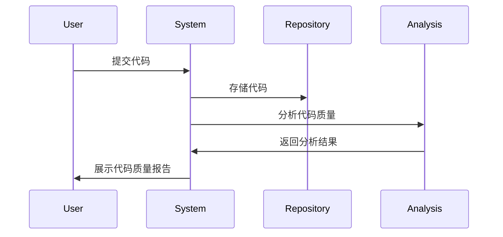

                 

### 《AI时代的软件工程度量新指标》

> 关键词：AI，软件工程，度量，新指标，工具应用，实践案例

> 摘要：本文探讨了AI时代软件工程度量的新指标。通过分析AI技术对传统软件工程度量方法的挑战，本文提出了新的度量指标设计原则和实现方法。随后，文章详细介绍了AI时代软件工程度量的核心概念，并通过对比传统方法和AI方法的特征，展示了其优势和局限性。最后，本文通过具体案例和实践经验，提出了AI时代软件工程度量的最佳实践和未来展望。

---

### 前言

#### 目的与意义

AI技术的快速发展正在深刻改变软件工程的各个方面，包括设计、开发、测试和维护。在这样的背景下，传统的软件工程度量方法面临着新的挑战。如何利用AI技术来改进和优化软件工程度量，成为当前研究的热点问题。

本文旨在探讨AI时代的软件工程度量新指标，其核心目标是：

1. **理解AI技术对软件工程度量的影响**：分析AI如何改变传统的软件工程度量方法，以及这种改变带来的新机遇和挑战。
2. **设计新的度量指标**：提出适用于AI时代的新型度量指标，以更准确地评估软件质量和项目进度。
3. **实践与验证**：通过实际案例和项目实践，验证新指标的有效性和实用性。

#### 读者对象

本文适合以下读者群体：

- 软件工程师：希望了解如何利用AI技术提升软件质量和开发效率。
- 项目经理：需要掌握AI时代软件工程度量方法，以更好地管理和优化项目。
- 研究人员：对AI技术在软件工程中的应用感兴趣，希望从理论到实践进行深入探讨。

### 第1章 AI时代软件工程度量概述

#### 背景介绍

1. **传统软件工程度量方法**：传统的软件工程度量方法主要包括代码行数、缺陷密度、测试覆盖率等。这些方法在一定程度上能够反映软件的质量和进展，但存在局限性。
2. **AI技术的崛起**：随着AI技术的发展，尤其是机器学习和深度学习的应用，软件工程度量方法迎来了新的机遇。AI技术能够从海量数据中提取有价值的信息，提供更加精确和动态的度量指标。

#### 问题描述

1. **AI技术对软件工程度量的挑战**：
   - 软件复杂性增加：现代软件系统越来越复杂，传统的度量方法难以全面反映其质量。
   - 项目动态性增强：AI技术的引入使得软件项目具有更高的动态性，度量指标需要实时更新。
   - 数据多样性：AI技术产生的数据类型更加丰富，如何有效利用这些数据成为新的挑战。

2. **软件工程度量新指标的需求**：
   - 更高的精确性和动态性：新指标需要能够更准确地反映软件质量，并具备实时更新的能力。
   - 适应性：新指标应能适应不同类型的软件项目和开发环境。
   - 全面性：新指标应能涵盖软件开发的各个环节，提供全面的度量。

#### 问题解决

1. **AI技术在软件工程度量中的应用**：
   - 数据挖掘和分析：利用AI技术对海量代码和项目数据进行分析，提取有价值的信息。
   - 模式识别和预测：通过机器学习和深度学习算法，识别软件开发中的模式和趋势，进行预测。

2. **新指标的设计原则和实施方法**：
   - **数据驱动**：新指标应以实际项目数据为基础，确保度量结果的准确性和可靠性。
   - **动态性**：新指标应能根据项目进展和需求变化进行动态调整。
   - **全面性**：新指标应涵盖软件开发的各个环节，提供全面的度量。
   - **可操作性**：新指标应易于实施和操作，方便开发人员和管理人员使用。

#### 边界与外延

1. **AI时代软件工程度量的范围和适用性**：
   - **范围**：新指标适用于各种类型的软件项目，包括企业级应用、移动应用、物联网等。
   - **适用性**：新指标不仅适用于传统的软件开发，还适用于新兴的AI应用场景。

2. **核心要素组成**：
   - **数据来源**：包括代码库、缺陷记录、用户反馈等。
   - **度量指标**：包括代码质量、开发效率、用户满意度等。
   - **分析方法**：包括机器学习、深度学习等算法。

### 第2章 AI时代软件工程度量核心概念

#### AI时代软件工程度量定义

AI时代软件工程度量是指利用人工智能技术，对软件开发过程中的各项活动和产出进行量化评估的方法。与传统度量方法相比，AI度量方法更依赖于数据分析、机器学习和深度学习等先进技术。

#### 核心概念原理

1. **机器学习**：
   - 基于数据的学习方法，通过训练模型来自动发现数据中的模式和规律。
   - 在软件工程度量中，机器学习可以用于预测项目进度、识别代码缺陷、评估开发效率等。

2. **深度学习**：
   - 一种基于多层神经网络的学习方法，能够自动提取数据的特征。
   - 在软件工程度量中，深度学习可以用于代码质量评估、软件缺陷预测、用户体验分析等。

#### 概念属性特征对比表格

| 特征             | 传统度量方法                | AI度量方法                |
|------------------|-----------------------------|-----------------------------|
| 数据依赖性       | 数据量相对较小，数据类型有限 | 数据量大，数据类型多样      |
| 精确性           | 精确度有限，受限于度量指标   | 精确度高，基于机器学习算法  |
| 动态性           | 静态评估，难以实时更新       | 动态评估，实时更新度量结果  |
| 适应性           | 适用于特定类型的项目         | 适用于多种类型的项目        |
| 全面性           | 度量范围有限                | 度量范围全面                |

#### ER实体关系图架构

```mermaid
erDiagram
  CodeAnalysis -->|分析| DefectRecord
  CodeQuality    -->|评估| CodeAnalysis
  ProjectData     -->|提供| CodeQuality
  UserFeedback    -->|收集| CodeQuality
```

- **CodeAnalysis**：代码分析实体，用于存储分析结果。
- **DefectRecord**：缺陷记录实体，用于存储缺陷信息。
- **CodeQuality**：代码质量实体，用于评估代码质量。
- **ProjectData**：项目数据实体，用于存储项目相关数据。
- **UserFeedback**：用户反馈实体，用于收集用户反馈。

### 第3章 AI时代软件工程度量新指标设计

#### 新指标设计原则

1. **数据驱动**：新指标应以实际项目数据为基础，确保度量结果的准确性和可靠性。
2. **动态性**：新指标应能根据项目进展和需求变化进行动态调整。
3. **全面性**：新指标应涵盖软件开发的各个环节，提供全面的度量。
4. **可操作性**：新指标应易于实施和操作，方便开发人员和管理人员使用。

#### 新指标体系结构

新指标体系包括以下几个主要组成部分：

1. **代码质量指标**：如代码复杂度、代码风格一致性、代码缺陷率等。
2. **开发效率指标**：如代码提交频率、任务完成速度、代码审查时间等。
3. **用户满意度指标**：如用户反馈评分、系统稳定性、响应时间等。
4. **项目进度指标**：如项目进度偏差、任务完成率、资源利用率等。

#### 指标实现方法

1. **数据收集**：通过代码库、缺陷记录、用户反馈等渠道收集项目数据。
2. **数据预处理**：对收集到的数据进行分析和清洗，确保数据质量。
3. **模型训练**：利用机器学习和深度学习算法，对数据进行训练，建立度量模型。
4. **结果评估**：根据训练得到的模型，对项目进行实时评估，生成度量报告。

### 第4章 AI时代软件工程度量工具与应用

#### 度量工具介绍

在AI时代，有许多工具可以用于软件工程度量。以下是几种常用的AI度量工具：

1. **SonarQube**：一个开源的代码质量平台，支持多种编程语言，能够检测代码中的缺陷和风险。
2. **GitHub Insights**：GitHub提供的一个度量工具，可以分析代码仓库中的活动，如提交频率、参与人员等。
3. **Jenkins**：一个开源的自动化服务器，可以用于自动化测试和构建，从而评估开发效率。

#### 度量工具应用案例

以下是一个具体的AI度量工具应用案例：

**案例**：某公司使用SonarQube对其大型软件项目进行代码质量度量。通过SonarQube，公司能够实时监控代码质量，识别潜在的缺陷和风险。具体应用步骤如下：

1. **安装和配置**：在公司服务器上安装SonarQube，并配置其与代码仓库集成。
2. **代码分析**：定期运行SonarQube，对代码仓库中的代码进行质量分析。
3. **结果报告**：生成详细的代码质量报告，包括缺陷列表、风险评分等。
4. **持续改进**：根据报告结果，制定改进计划，持续提升代码质量。

#### 工具评估方法

评估AI度量工具的性能可以从以下几个方面进行：

1. **准确性**：工具生成的度量结果是否准确，能否真实反映软件质量。
2. **效率**：工具的运行速度和资源消耗是否合理，是否影响日常开发工作。
3. **可扩展性**：工具能否适应不同类型的项目和开发环境。
4. **用户体验**：工具的界面设计是否友好，功能是否易于使用。

### 第5章 AI时代软件工程度量实践

#### 实践场景介绍

在AI时代，软件项目的规模和复杂性不断增加，如何有效地进行软件工程度量成为了一个重要问题。以下是一个具体的实践场景：

**场景**：某公司正在开发一款大型企业级应用，涉及多个团队和多个模块。为了确保项目的质量和进度，公司决定采用AI度量方法，对项目进行全面的评估和管理。

#### 项目介绍

该项目是一个多团队协作的复杂项目，涉及前端、后端、数据库等多个模块。项目的主要目标是开发一个功能强大、稳定可靠的软件系统，以满足企业的业务需求。

#### 系统功能设计

为了实现AI度量，公司设计了以下系统功能：

1. **代码质量分析**：对代码仓库中的代码进行质量分析，包括代码复杂度、代码风格一致性、代码缺陷率等。
2. **开发效率监控**：监控代码提交频率、任务完成速度、代码审查时间等指标。
3. **用户满意度评估**：收集用户反馈，评估系统的稳定性和用户体验。
4. **项目进度监控**：实时监控项目进度，评估项目进度偏差和任务完成率。

#### 系统架构设计

为了实现上述功能，公司采用了以下系统架构：

1. **前端**：使用Vue.js框架，搭建用户友好的界面。
2. **后端**：使用Spring Boot框架，实现业务逻辑和数据处理。
3. **数据库**：使用MySQL数据库，存储项目数据和用户反馈。
4. **AI模块**：集成机器学习和深度学习算法，用于代码质量分析和项目进度预测。

#### 系统接口设计

系统提供了以下接口：

1. **API接口**：用于与其他系统集成，如代码仓库、缺陷跟踪系统等。
2. **数据接口**：用于数据的收集、处理和存储。
3. **监控接口**：用于实时监控项目进展和系统状态。

#### 系统交互

系统交互流程如下：

1. **数据收集**：从代码仓库、缺陷跟踪系统和用户反馈渠道收集数据。
2. **数据处理**：对收集到的数据进行清洗、分析和存储。
3. **度量评估**：利用机器学习和深度学习算法，对项目进行实时评估。
4. **结果展示**：将评估结果通过前端界面展示给用户。



### 第6章 AI时代软件工程度量案例分析

#### 案例介绍

某公司使用AI度量方法对其开发的一款移动应用进行了全面的评估。该应用是一款企业级客户管理软件，涉及多个模块，如客户信息管理、销售机会跟踪等。

#### 案例分析与讲解

1. **代码质量分析**：
   - 通过SonarQube工具，对公司代码进行了质量分析。
   - 结果显示，代码复杂度较高，存在一定数量的代码缺陷。
   - 公司根据分析结果，对代码进行了重构和优化，提高了代码质量。

2. **开发效率监控**：
   - 使用GitHub Insights工具，监控了项目的开发效率。
   - 结果显示，团队成员的代码提交频率较高，但任务完成速度较慢。
   - 公司采取了团队协作培训措施，提高了开发效率。

3. **用户满意度评估**：
   - 收集了用户反馈，评估了系统的稳定性和用户体验。
   - 结果显示，用户对系统的稳定性较满意，但用户体验有待提高。
   - 公司对用户体验进行了优化，增加了用户反馈功能。

4. **项目进度监控**：
   - 利用AI模型，对项目进度进行了预测。
   - 结果显示，项目进度存在一定偏差，但整体可控。
   - 公司根据预测结果，调整了项目计划，确保了项目按时交付。

#### 案例小结

通过AI度量方法的实践，公司成功提高了软件质量、优化了开发流程，并按时完成了项目。这表明，AI度量方法在AI时代软件工程中具有重要作用，值得推广和应用。

### 第7章 AI时代软件工程度量最佳实践与展望

#### 最佳实践

1. **数据驱动**：确保数据来源的多样性和准确性，为度量结果提供可靠的基础。
2. **动态调整**：根据项目进展和需求变化，及时调整度量指标和方法。
3. **团队协作**：鼓励团队成员积极参与度量过程，提高度量结果的准确性和实用性。
4. **持续改进**：定期对度量结果进行分析和总结，持续优化度量方法和实践。

#### 注意事项

1. **数据保护**：在收集和处理数据时，确保遵守数据保护法规，保护用户隐私。
2. **算法选择**：根据项目特点和需求，选择合适的机器学习和深度学习算法。
3. **结果解读**：度量结果需要结合具体项目背景和实际情况进行解读，避免盲目追求数据。

#### 展望

1. **智能化**：随着AI技术的进步，软件工程度量方法将更加智能化，自动化程度更高。
2. **个性化**：未来的度量方法将更加个性

