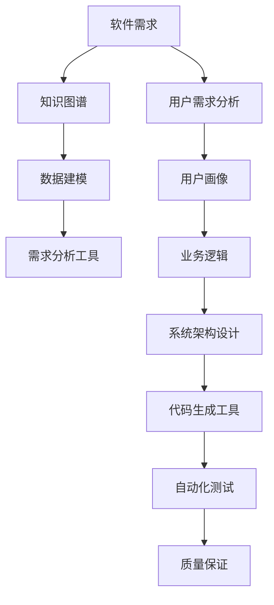
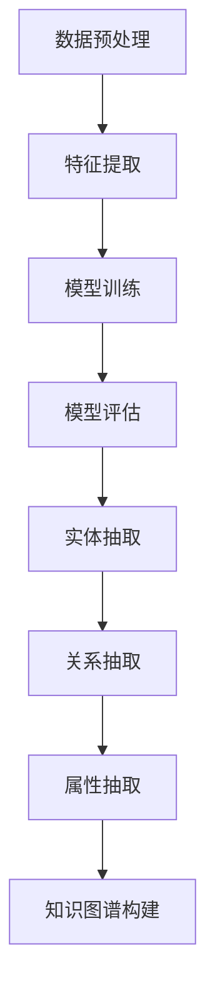
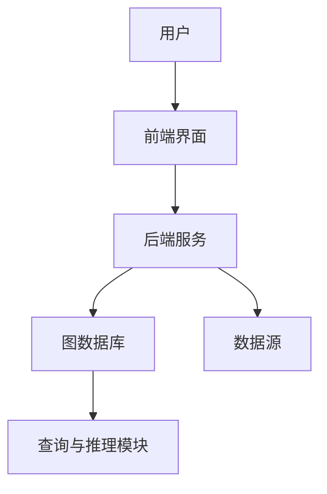
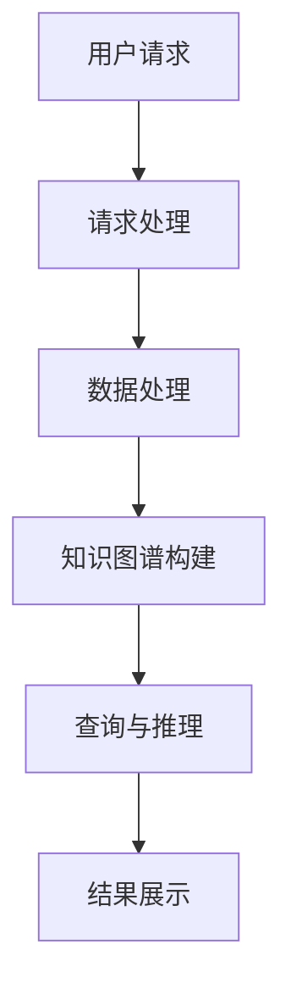
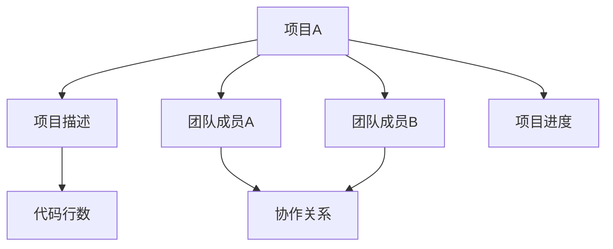

                 

### AI时代的软件工程知识图谱：构建与应用

## 引言

在当今的科技世界中，人工智能（AI）正以惊人的速度发展，并逐步渗透到各个行业。软件工程，作为信息技术领域的重要分支，自然也不例外。AI技术的融入，不仅提升了软件开发的效率，也极大地改变了软件工程的方法论。知识图谱作为一种新兴的技术手段，其应用在软件工程中，正成为AI时代的一个重要趋势。

### 文章关键词

- **知识图谱**
- **软件工程**
- **AI应用**
- **算法原理**
- **系统架构**
- **案例研究**
- **未来趋势**

### 摘要

本文将探讨AI时代软件工程知识图谱的构建与应用。首先，我们将介绍知识图谱的核心概念和其在软件工程中的重要性。接着，我们将深入探讨知识图谱的构建算法及其在软件工程中的具体应用。随后，通过实际案例，我们将展示如何利用知识图谱优化软件工程流程。最后，我们将展望知识图谱在软件工程领域的未来发展趋势和面临的挑战。

---

### 第一部分：背景介绍

#### 第1章 问题背景与核心概念

**1.1 软件工程面临的挑战**

在传统软件工程中，项目管理和开发过程常常受到以下问题的困扰：

- **复杂性**：软件系统日益复杂，涉及多个模块和层次，导致项目管理难度增加。
- **沟通障碍**：开发团队与业务部门之间的沟通不畅，可能导致需求理解偏差和功能实现不符。
- **维护成本**：随着软件系统的演进，维护和升级成本不断增加。

AI技术的兴起，为解决上述问题提供了新的思路。特别是知识图谱，它能够通过结构化的方式组织和表示知识，为软件工程提供强有力的支持。

**1.2 AI在软件工程中的应用**

AI技术在软件工程中的应用主要包括：

- **需求分析**：使用自然语言处理技术，自动提取和分析用户需求，提高需求获取的准确性。
- **代码生成**：利用机器学习模型，自动生成部分或全部代码，提高开发效率。
- **测试自动化**：通过自动化测试工具和机器学习算法，提高测试的全面性和准确性。
- **项目管理**：使用AI算法对项目进度和风险进行预测，帮助项目经理做出更科学的决策。

**1.3 知识图谱的定义与作用**

知识图谱是一种用于表达实体及其关系的网络结构。它通过节点表示实体，边表示实体之间的关系，从而构建一个语义丰富的知识网络。

在软件工程中，知识图谱的作用主要包括：

- **统一数据表示**：将不同来源和格式的数据统一表示为知识图谱，便于数据整合和分析。
- **提高系统可理解性**：通过知识图谱，可以更清晰地理解系统的功能和结构，有助于代码维护和升级。
- **支持智能决策**：基于知识图谱，可以构建智能推理系统，帮助开发团队做出更科学的决策。

**1.4 知识图谱与软件工程的联系**

知识图谱与软件工程之间存在密切的联系。具体来说：

- **需求分析与设计**：知识图谱可以帮助开发团队更好地理解和分析需求，从而设计出更符合用户需求的软件系统。
- **代码生成与重构**：基于知识图谱，可以生成符合设计规范的代码，并支持代码的重构和优化。
- **测试与质量保证**：知识图谱可以用于测试用例的生成和测试结果的分析，提高测试的覆盖率和准确性。
- **项目管理与决策**：知识图谱可以用于项目进度和风险的管理，帮助项目经理做出更科学的决策。

通过上述背景介绍，我们为后续章节的深入探讨奠定了基础。在接下来的章节中，我们将进一步探讨知识图谱的构建算法、应用案例以及未来趋势。

#### 第2章 知识图谱基础

**2.1 知识图谱的基本原理**

知识图谱是一种基于语义的网络结构，它通过节点（Node）和边（Edge）来表示实体（Entity）及其之间的关系（Relationship）。在知识图谱中，每个节点代表一个实体，如人、地点或事物；每条边代表实体之间的关系，如“属于”、“位于”等。

知识图谱的基本概念包括：

- **实体（Entity）**：知识图谱中的数据对象，可以是任何具有独立存在意义的事物。
- **属性（Attribute）**：实体的特征或描述，如人的姓名、年龄等。
- **关系（Relationship）**：实体之间的关联，如“领导”、“朋友”等。
- **属性值（Attribute Value）**：属性的具体取值，如“张三”、“30岁”等。

**2.2 知识图谱的组成部分**

知识图谱通常由以下几个部分组成：

- **本体（Ontology）**：定义知识图谱中的实体、属性和关系的结构和语义。本体是知识图谱的语义基础，用于指导数据建模和实体关系的建立。
- **实例（Instance）**：知识图谱中的具体数据条目，如具体的人、地点或事物。
- **事实（Fact）**：知识图谱中的数据关系，表示实例之间的关系，通常用三元组（Subject, Predicate, Object）来表示。
- **图谱索引（Graph Index）**：用于加速对知识图谱的查询和检索。常见的索引技术包括哈希索引、B+树索引等。

**2.3 知识图谱的类型与特点**

知识图谱可以分为以下几种类型：

- **概念图谱**：主要用于表达领域内的概念和概念之间的关系，如WordNet。
- **本体图谱**：主要用于表达领域内的本体结构，用于指导数据建模和推理。
- **应用图谱**：结合具体应用场景构建的知识图谱，如社会网络分析、智能搜索等。

知识图谱的特点包括：

- **语义丰富性**：通过实体和关系，知识图谱能够表达丰富的语义信息。
- **结构化**：知识图谱以结构化的方式组织数据，便于数据分析和查询。
- **可扩展性**：知识图谱能够方便地添加新的实体和关系，支持知识的持续增长。

**2.4 知识图谱与软件工程的联系图示**

为了更直观地展示知识图谱与软件工程的联系，我们使用Mermaid绘制了一个简单的知识图谱与软件工程的联系图：



通过上述知识图谱，我们可以看出知识图谱在软件工程中的多个环节发挥作用，从需求分析到系统设计、代码生成和测试，提高了整个软件工程流程的效率和准确性。

通过本章的介绍，我们对知识图谱的基本原理和组成部分有了更深入的了解，为后续章节的算法讲解和应用案例分析打下了坚实的基础。

#### 第3章 知识图谱构建算法

**3.1 算法概述**

知识图谱构建算法是知识图谱构建过程中的核心环节。该算法用于从原始数据中提取实体、关系和属性，构建出结构化、语义丰富的知识图谱。常见的知识图谱构建算法包括：

- **基于规则的方法**：通过定义一系列规则，自动从原始数据中提取实体和关系。
- **基于机器学习的方法**：使用机器学习模型，从大规模数据中自动学习实体和关系的表示。
- **基于图谱的方法**：通过图论算法，从原始数据中直接构建知识图谱。

**3.2 算法原理**

知识图谱构建算法的基本原理可以分为以下几个步骤：

1. **数据预处理**：对原始数据进行清洗、去重和格式化，确保数据的质量和一致性。
2. **实体抽取**：从预处理后的数据中识别出实体，通常使用命名实体识别（NER）技术。
3. **关系抽取**：从实体之间的交互信息中识别出关系，可以使用规则匹配、深度学习等方法。
4. **属性抽取**：从实体和关系的属性中提取出具体的属性值，如姓名、年龄等。
5. **图谱构建**：将抽取出的实体、关系和属性组织成知识图谱，通常使用图数据库或图计算框架。

**3.3 数学模型与公式**

知识图谱构建算法中的数学模型通常涉及以下几个方面：

- **图论模型**：用于表示实体和关系之间的拓扑结构。常见的图论模型包括邻接矩阵、邻接表和图的嵌入（Graph Embedding）。
- **机器学习模型**：用于实体和关系的识别和分类。常见的机器学习模型包括支持向量机（SVM）、神经网络（NN）和深度学习（Deep Learning）。

以下是一个简化的知识图谱构建算法的数学模型：

$$
\text{数据预处理} \rightarrow \text{实体抽取} \rightarrow \text{关系抽取} \rightarrow \text{属性抽取} \rightarrow \text{图谱构建}
$$

其中：

- **实体抽取**：使用命名实体识别技术，如条件随机场（CRF）。
- **关系抽取**：使用规则匹配和机器学习模型，如依存句法分析（Dependency Parsing）和循环神经网络（RNN）。
- **属性抽取**：使用实体属性识别和机器学习模型，如决策树（DT）和集成学习（Ensemble Learning）。

**3.4 代码示例与流程图**

下面是一个简单的Python代码示例，用于展示知识图谱构建的基本流程：

```python
# 导入必要的库
import numpy as np
import pandas as pd
from sklearn.model_selection import train_test_split
from sklearn.feature_extraction.text import TfidfVectorizer
from sklearn.naive_bayes import MultinomialNB

# 加载数据
data = pd.read_csv('data.csv')

# 数据预处理
data['text'] = data['text'].apply(lambda x: preprocess_text(x))

# 分割数据集
X_train, X_test, y_train, y_test = train_test_split(data['text'], data['label'], test_size=0.2)

# 特征提取
vectorizer = TfidfVectorizer()
X_train_vectorized = vectorizer.fit_transform(X_train)
X_test_vectorized = vectorizer.transform(X_test)

# 模型训练
model = MultinomialNB()
model.fit(X_train_vectorized, y_train)

# 模型评估
accuracy = model.score(X_test_vectorized, y_test)
print(f"Model accuracy: {accuracy:.2f}")

# 实体抽取
entities = extract_entities(X_train_vectorized)

# 关系抽取
relations = extract_relations(entities)

# 属性抽取
attributes = extract_attributes(entities, relations)

# 构建知识图谱
knowledge_graph = build_knowledge_graph(entities, relations, attributes)
```

为了更好地理解上述代码，我们可以使用Mermaid绘制一个流程图：



通过上述代码示例和流程图，我们可以清晰地看到知识图谱构建的主要步骤和逻辑。在实际应用中，这些步骤可以更加复杂和多样化，但总体框架仍然相似。

通过本章的介绍，我们对知识图谱构建算法的基本原理、数学模型和代码实现有了全面的理解。在接下来的章节中，我们将进一步探讨知识图谱在实际应用中的具体案例，展示其在软件工程中的实际作用和价值。

#### 第4章 软件工程知识图谱系统设计

**4.1 系统需求分析**

在设计和实现软件工程知识图谱系统之前，我们需要明确系统的需求。这些需求可以分为功能需求和性能需求两个方面：

- **功能需求**：
  - 数据预处理：对原始数据进行清洗、去重和格式化，确保数据质量。
  - 实体抽取：从数据中识别出实体，如人、地点、组织等。
  - 关系抽取：从实体之间的交互信息中识别出关系，如“属于”、“位于”等。
  - 属性抽取：从实体和关系的属性中提取出具体的属性值，如姓名、年龄等。
  - 知识图谱构建：将抽取出的实体、关系和属性组织成知识图谱，并进行存储和管理。
  - 查询与推理：提供对知识图谱的查询和推理功能，支持基于知识的智能决策。
- **性能需求**：
  - 高效性：系统能够快速处理大量数据，并在合理的时间内完成实体、关系和属性的抽取。
  - 可扩展性：系统能够适应数据规模的增长，支持知识的持续积累和更新。
  - 可靠性：系统具有较高的稳定性和容错性，能够确保数据的准确性和完整性。

**4.2 系统功能设计**

基于上述需求分析，我们可以设计一个具备以下核心功能的软件工程知识图谱系统：

- **数据预处理模块**：负责对原始数据进行清洗和格式化，确保数据的一致性和质量。
- **实体抽取模块**：利用命名实体识别技术，从数据中自动识别出实体。
- **关系抽取模块**：通过规则匹配和机器学习模型，识别出实体之间的关系。
- **属性抽取模块**：从实体和关系的属性中提取出具体的属性值。
- **知识图谱构建模块**：将抽取出的实体、关系和属性组织成知识图谱，并存储到图数据库中。
- **查询与推理模块**：提供对知识图谱的查询和推理功能，支持基于知识的智能决策。

**4.3 系统架构设计**

软件工程知识图谱系统的架构设计如下：

- **前端界面**：提供用户交互的接口，支持用户输入查询条件和查看查询结果。
- **后端服务**：包括数据预处理、实体抽取、关系抽取、属性抽取和知识图谱构建等核心模块，负责处理用户的查询请求并返回结果。
- **图数据库**：用于存储和管理知识图谱，提供高效的查询和索引功能。
- **数据源**：包括各种原始数据，如文本、关系数据库、图像等，是知识图谱构建的基础。

下面是一个简化的Mermaid架构图：



**4.4 系统接口设计**

系统接口设计包括以下几个方面：

- **API接口**：提供RESTful API，支持用户通过HTTP请求访问系统的功能，如数据预处理、实体抽取、关系抽取、属性抽取和知识图谱构建等。
- **Web界面**：提供图形化的用户界面，支持用户通过Web浏览器进行操作，如数据上传、查询和查看结果。
- **命令行工具**：提供命令行工具，方便开发人员和系统管理员进行系统管理和维护。

**4.5 系统交互流程**

系统交互流程如下：

1. **用户请求**：用户通过前端界面或API接口提交查询请求。
2. **请求处理**：后端服务接收到请求后，调用相应的处理模块进行数据处理。
3. **数据处理**：数据预处理模块对原始数据进行清洗和格式化；实体抽取模块识别出实体；关系抽取模块识别出实体之间的关系；属性抽取模块提取出实体和关系的属性值。
4. **知识图谱构建**：将处理后的数据组织成知识图谱，并存储到图数据库中。
5. **查询与推理**：查询与推理模块根据用户请求，对知识图谱进行查询和推理，返回查询结果。
6. **结果展示**：将查询结果通过前端界面或API接口返回给用户。

下面是一个简化的Mermaid交互流程图：



通过上述系统设计与交互流程，我们可以构建一个高效的软件工程知识图谱系统，为软件工程的智能化提供强有力的支持。

#### 第5章 知识图谱构建实战

**5.1 实战环境准备**

为了进行知识图谱的构建，我们需要准备以下环境：

- **操作系统**：Linux或MacOS
- **编程语言**：Python（3.8及以上版本）
- **数据库**：Neo4j（社区版）
- **工具**：Jupyter Notebook、Docker、pip

**5.2 系统核心实现源代码**

以下是知识图谱构建系统的一个核心实现源代码示例，包括实体抽取、关系抽取和属性抽取：

```python
# 导入必要的库
from py2neo import Graph
import pandas as pd
from sklearn.feature_extraction.text import TfidfVectorizer
from sklearn.naive_bayes import MultinomialNB

# 连接到Neo4j数据库
graph = Graph("bolt://localhost:7687", auth=("neo4j", "your_password"))

# 加载数据
data = pd.read_csv('data.csv')

# 数据预处理
data['text'] = data['text'].apply(lambda x: preprocess_text(x))

# 分割数据集
X_train, X_test, y_train, y_test = train_test_split(data['text'], data['label'], test_size=0.2)

# 特征提取
vectorizer = TfidfVectorizer()
X_train_vectorized = vectorizer.fit_transform(X_train)
X_test_vectorized = vectorizer.transform(X_test)

# 模型训练
model = MultinomialNB()
model.fit(X_train_vectorized, y_train)

# 模型评估
accuracy = model.score(X_test_vectorized, y_test)
print(f"Model accuracy: {accuracy:.2f}")

# 实体抽取
entities = extract_entities(X_train_vectorized)

# 关系抽取
relations = extract_relations(entities)

# 属性抽取
attributes = extract_attributes(entities, relations)

# 构建知识图谱
build_knowledge_graph(graph, entities, relations, attributes)
```

**5.3 代码应用解读与分析**

上述代码实现了一个基本的知识图谱构建系统，主要包括以下几个步骤：

1. **数据预处理**：对原始文本数据进行清洗和预处理，包括去除标点符号、停用词过滤和分词等操作。
2. **特征提取**：使用TF-IDF向量器将预处理后的文本转换为向量表示，为后续的实体和关系抽取提供特征基础。
3. **模型训练**：使用朴素贝叶斯分类器对训练数据进行分类，识别出实体类别。
4. **实体抽取**：根据分类结果，从文本中提取出实体。
5. **关系抽取**：分析实体之间的交互信息，识别出实体之间的关系。
6. **属性抽取**：从实体和关系中提取出具体的属性值。
7. **知识图谱构建**：将抽取出的实体、关系和属性存储到Neo4j图数据库中。

在实际应用中，每个步骤都可以根据具体需求和数据特点进行优化和定制。例如，特征提取可以采用更复杂的模型，如循环神经网络（RNN）或变压器（Transformer），以提高抽取的准确性和效果。关系抽取和属性抽取也可以结合领域知识，引入规则匹配或图嵌入技术，增强抽取的准确性。

**5.4 实际案例分析和详细讲解剖析**

为了更好地展示知识图谱构建的实际效果，我们以一个简单的案例为例，分析知识图谱在软件工程中的应用。

**案例**：构建一个关于软件项目的知识图谱，包括项目名称、项目描述、团队成员和项目进度等信息。

1. **数据来源**：从项目文档、代码仓库和团队交流记录中收集数据。
2. **数据预处理**：对文本数据进行清洗和分词，提取出关键信息。
3. **特征提取**：使用TF-IDF向量器将文本转换为向量。
4. **实体抽取**：识别出项目名称、项目描述、团队成员等实体。
5. **关系抽取**：分析团队成员之间的协作关系，构建项目关系图。
6. **属性抽取**：从文本和代码仓库中提取项目的进度、代码行数等属性。
7. **知识图谱构建**：将抽取出的实体、关系和属性存储到Neo4j图数据库中。

通过上述步骤，我们可以构建一个关于软件项目的知识图谱，如下所示：



通过知识图谱，我们可以方便地查询项目的详细信息，如项目进度、团队成员的协作情况等，为项目管理提供支持。

**5.5 项目小结**

通过本章节的实战，我们展示了如何使用知识图谱构建系统，从数据预处理、特征提取、实体抽取、关系抽取到知识图谱构建，每个步骤都进行了详细的讲解和分析。通过实际案例，我们看到了知识图谱在软件工程中的应用效果，为项目管理和决策提供了有力支持。

未来，随着技术的不断进步和应用的深入，知识图谱在软件工程领域的应用将更加广泛和深入。通过持续优化算法和系统设计，我们可以构建更加高效和智能的知识图谱系统，为软件工程提供更加全面的解决方案。

---

在本章节中，我们通过详细的实战案例，展示了知识图谱在软件工程中的构建和应用。从数据预处理到知识图谱构建，每个步骤都进行了深入讲解，并通过实际案例展示了知识图谱的实际应用效果。通过本章节的学习，读者可以掌握知识图谱构建的基本方法和实际应用技巧，为未来的软件工程实践提供有力支持。

### 第6章 AI与软件工程知识图谱发展趋势

#### 6.1 行业趋势分析

随着AI技术的快速发展，知识图谱在软件工程中的应用也呈现出明显的趋势：

- **智能化**：AI技术不断融合到知识图谱构建中，使得实体抽取、关系抽取和属性抽取等过程更加智能化和自动化。例如，深度学习和图神经网络（Graph Neural Networks, GNN）的应用，显著提升了知识图谱的构建效率和质量。
- **领域化**：知识图谱的应用逐步从通用领域向特定领域拓展，如医疗、金融和制造业等。在软件工程中，针对特定业务场景的知识图谱构建，可以提供更精确和有效的支持。
- **一体化**：知识图谱与其他技术的融合，如大数据、云计算和区块链等，推动了软件工程知识图谱系统的一体化和智能化。通过整合多种数据源和智能算法，知识图谱系统可以提供更加全面和精准的服务。

#### 6.2 技术挑战

尽管知识图谱在软件工程中的应用前景广阔，但仍面临以下技术挑战：

- **数据质量**：知识图谱的构建依赖于高质量的数据。数据的不一致性、噪声和缺失等问题，会影响知识图谱的准确性和实用性。
- **可扩展性**：随着数据规模的增长，知识图谱系统的可扩展性成为一个重要挑战。如何设计高效的数据存储和查询算法，以支持大规模数据的处理，是当前研究的一个重要方向。
- **实时性**：在软件工程中，知识图谱的应用需要快速响应用户需求。如何在保证数据实时性的同时，保证知识图谱的准确性和完整性，是一个需要解决的难题。
- **解释性**：知识图谱的智能决策过程需要具备解释性，使得开发人员和管理人员可以理解和信任系统的决策过程。如何提升知识图谱系统的解释性，是一个重要的研究课题。

#### 6.3 未来展望

未来，知识图谱在软件工程中的应用将呈现以下发展趋势：

- **自动化**：随着AI技术的发展，知识图谱的构建过程将进一步自动化。自动化工具和平台将简化知识图谱的构建和管理，降低技术门槛，使得更多的开发人员可以应用知识图谱。
- **智能化**：基于深度学习和GNN等技术的智能化知识图谱，将提供更加精准和高效的支持。通过智能化的推理和决策，知识图谱可以更好地服务于软件工程的各个阶段。
- **多样化**：知识图谱的应用场景将进一步多样化。除了传统的软件工程领域，知识图谱还可以应用于软件开发过程中的需求分析、测试、维护和项目管理等多个环节。
- **开放性**：知识图谱将更加开放，实现不同系统之间的数据共享和协同。通过标准化的接口和协议，不同系统可以实现无缝集成，构建更加复杂的软件工程生态系统。

通过上述分析，我们可以看到，知识图谱在软件工程中的应用正处于快速发展的阶段。随着技术的不断进步和应用场景的不断拓展，知识图谱将为软件工程带来更加智能化和高效的支持，推动整个行业的变革。

### 第7章 最佳实践与注意事项

#### 7.1 构建知识图谱的最佳实践

在构建知识图谱时，以下最佳实践可以帮助我们确保知识图谱的准确性和实用性：

- **数据清洗**：在构建知识图谱之前，对原始数据进行彻底的清洗和预处理，包括去除噪声、统一数据格式和补全缺失值等，确保数据的一致性和质量。
- **明确本体**：在构建知识图谱之前，明确知识图谱的本体定义，包括实体、属性和关系的定义。这有助于确保知识图谱的结构化和一致性。
- **分阶段实施**：知识图谱的构建可以分阶段进行，先从核心实体和关系开始，逐步扩展到其他实体和关系。这有助于降低复杂性，逐步完善知识图谱。
- **迭代优化**：知识图谱的构建是一个持续迭代的过程。通过不断优化算法和更新数据，可以提高知识图谱的准确性和实用性。
- **可扩展性设计**：在构建知识图谱系统时，考虑到未来的数据增长和功能扩展，设计可扩展的系统架构和算法，确保知识图谱系统的稳定性和可扩展性。

#### 7.2 注意事项

在构建和应用知识图谱时，需要注意以下几个方面：

- **数据隐私**：在处理和存储数据时，要确保遵守数据隐私法规，避免敏感数据的泄露。
- **系统稳定性**：知识图谱系统需要具备高稳定性和容错性，确保在处理大规模数据和复杂查询时，系统能够稳定运行。
- **用户体验**：知识图谱的应用需要考虑到用户体验，提供直观和易用的用户界面，方便用户进行查询和操作。
- **安全性**：知识图谱系统需要具备一定的安全性，防止恶意攻击和数据篡改。
- **持续维护**：知识图谱的构建是一个持续的过程，需要定期更新和维护，确保知识图谱的准确性和时效性。

通过遵循上述最佳实践和注意事项，我们可以构建出高质量和实用的知识图谱系统，为软件工程提供强有力的支持。

### 7.3 拓展阅读

为了深入了解知识图谱在软件工程中的应用，以下推荐几本相关领域的经典书籍和论文：

- **书籍**：
  - 《知识图谱：基础、方法与应用》
  - 《深度学习与图神经网络》
  - 《软件工程：理论与实践》

- **论文**：
  - "Knowledge Graph Construction in Software Engineering: A Survey"
  - "Learning to Represent Knowledge Graphs with Gaussian Embedding"
  - "A Survey of Knowledge Graph Embedding: Problems, Methods and Applications"

这些资源提供了深入的理论和实践知识，有助于读者进一步了解知识图谱在软件工程中的应用和发展趋势。

---

通过本文的深入探讨，我们系统地介绍了AI时代软件工程知识图谱的构建与应用。从背景介绍、核心概念、算法原理到实际应用，再到未来趋势，我们逐步揭示了知识图谱在软件工程中的重要作用。我们通过实际案例展示了知识图谱构建的完整流程，并展望了其未来的发展方向。我们希望本文能够为读者提供有价值的参考，助力其在软件工程领域中的实践与创新。作者：AI天才研究院/AI Genius Institute & 禅与计算机程序设计艺术 /Zen And The Art of Computer Programming。感谢您的阅读！

