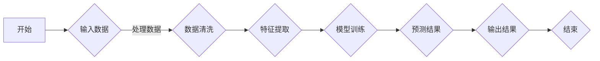
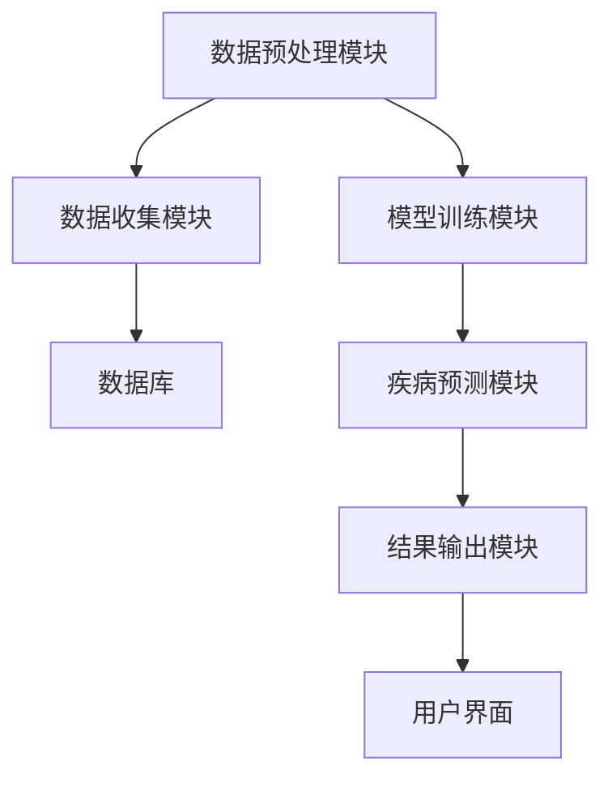

                 


## 引言：AI时代软件工程道德与伦理的重要性

### 问题背景

随着人工智能（AI）技术的快速发展，其在各个领域的应用越来越广泛，从自动驾驶汽车、智能家居到医疗诊断、金融预测，AI正在深刻地改变着我们的生活方式。然而，AI技术的快速进步也带来了一系列道德与伦理问题，如数据隐私、算法偏见、自动化决策的责任归属等。这些问题不仅涉及到技术层面，更关乎社会、法律以及人类的基本价值观。因此，在AI时代，如何进行软件工程的道德与伦理思考，成为了一个亟待解决的重要问题。

### 问题解决

为了应对AI时代的道德与伦理挑战，我们需要从多个角度进行深入思考。首先，必须明确AI时代的软件工程道德与伦理的核心概念，了解其基本原理与联系。其次，需要探讨在实际软件开发过程中如何应用这些道德原则与伦理理论，确保技术开发不仅具有技术上的可行性，也符合道德与伦理标准。最后，还需要制定具体的政策和规范，为AI时代的软件工程提供指导。

### 边界与外延

本文将讨论的范围主要涵盖以下方面：

1. **AI时代软件工程道德与伦理的核心概念**：包括道德原则、伦理理论以及相关困境与挑战。
2. **道德原则与伦理理论在软件工程中的应用**：探讨如何将伦理原则应用于软件开发实践，如隐私保护、公平性、透明性等。
3. **AI时代的伦理挑战**：分析AI技术带来的具体道德与伦理问题，如数据隐私、算法偏见、自动化决策的责任归属等。
4. **系统分析与架构设计方案**：介绍如何设计符合道德与伦理标准的AI系统，包括系统功能设计、架构设计以及接口与交互。
5. **项目实战**：通过实际案例分析和讲解，展示如何在实际项目中应用道德与伦理原则。
6. **最佳实践 tips**：提供一些在AI时代软件开发中遵循道德与伦理的最佳实践。
7. **小结与展望**：总结本文的主要观点，并对未来AI时代软件工程道德与伦理的发展进行展望。

通过以上内容的深入探讨，本文旨在为AI时代的软件工程道德与伦理思考提供一个系统、全面的框架，帮助开发者在技术进步的同时，不忘道德与伦理的责任。

## 摘要

本文主要探讨了AI时代的软件工程道德与伦理问题，分析了人工智能技术的快速发展所带来的道德挑战和伦理困境。首先，本文介绍了AI时代软件工程道德与伦理的核心概念，包括道德原则和伦理理论，并探讨了这些原则在软件开发中的应用。接着，本文详细分析了AI时代的主要伦理挑战，如数据隐私、算法偏见和自动化决策的责任归属问题。然后，本文通过系统分析与架构设计方案，阐述了如何设计符合道德与伦理标准的AI系统。此外，本文通过实际案例分析和讲解，展示了道德与伦理原则在软件开发项目中的具体应用。最后，本文提出了AI时代软件工程道德与伦理的最佳实践建议，并对未来这一领域的发展进行了展望。通过本文的研究，我们期望为AI时代软件工程的道德与伦理思考提供一个全面、系统的框架，帮助开发者在追求技术进步的同时，不忘道德与伦理的责任。

## 目录

### 引言：AI时代软件工程道德与伦理的重要性

#### 1. 问题背景
#### 1.1 问题提出
#### 1.2 问题解决
#### 1.3 边界与外延

#### 2. 概述
#### 2.1 AI时代软件工程道德与伦理的核心概念
#### 2.2 道德原则与伦理理论
#### 2.3 道德困境与伦理挑战

### 第1章: AI时代的软件工程道德与伦理概述

#### 1.1 AI时代的软件工程道德与伦理发展

##### 1.1.1 从传统软件工程到AI时代的转变
##### 1.1.2 AI在软件工程中的应用现状
##### 1.1.3 道德与伦理在AI时代软件工程中的重要性

#### 1.2 AI时代的伦理挑战

##### 1.2.1 数据隐私与安全性
##### 1.2.2 人工智能偏见与歧视
##### 1.2.3 AI系统的责任与问责

#### 1.3 主要伦理理论介绍

##### 1.3.1 康德伦理学
##### 1.3.2 德行伦理学
##### .### 1.3.3 结果伦理学

### 第2章: 核心概念与联系

#### 2.1 AI时代的软件工程道德与伦理核心概念

##### 2.1.1 道德原则与伦理原则
##### 2.1.2 道德困境与伦理挑战
##### 2.1.3 道德责任与职业责任

#### 2.2 道德原则与伦理理论在软件工程中的应用

##### 2.2.1 道德原则在软件开发中的应用
##### 2.2.2 伦理理论在软件工程决策中的应用
##### 2.2.3 道德与伦理在软件工程教育和培训中的角色

### 第3章: 算法原理讲解

#### 3.1 算法流程图设计

##### 3.1.1 Mermaid流程图设计
##### 3.1.2 Python源代码详细讲解
##### 3.1.3 算法原理的数学模型和公式

#### 3.2 举例说明

##### 3.2.1 算法的数学公式使用latex格式
##### 3.2.2 算法原理详细讲解
##### 3.2.3 举例说明

### 第4章: 系统分析与架构设计方案

#### 4.1 问题场景介绍

##### 4.1.1 问题背景
##### 4.1.2 需求分析
##### 4.1.3 目标系统设计

#### 4.2 系统功能设计

##### 4.2.1 领域模型Mermaid类图
##### 4.2.2 系统架构设计

#### 4.3 系统架构设计

##### 4.3.1 Mermaid架构图
##### 4.3.2 系统接口设计和系统交互

### 第5章: 项目实战

#### 5.1 环境安装

##### 5.1.1 环境配置
##### 5.1.2 软件安装与设置

#### 5.2 系统核心实现源代码

##### 5.2.1 Python源代码实现
##### 5.2.2 代码解读与分析

#### 5.3 实际案例分析和详细讲解剖析

##### 5.3.1 案例介绍
##### 5.3.2 案例分析
##### 5.3.3 讲解剖析

#### 5.4 项目小结

##### 5.4.1 项目总结
##### 5.4.2 遗留问题与展望

### 第6章: 最佳实践 tips

#### 6.1 数据隐私保护

##### 6.1.1 数据收集与使用原则
##### 6.1.2 数据加密与存储方法
##### 6.1.3 数据隐私保护策略

#### 6.2 人工智能偏见与歧视

##### 6.2.1 偏见产生的原因
##### 6.2.2 偏见检测与消除方法
##### 6.2.3 公平性评估与改进

### 第7章: 小结

#### 7.1 主要观点与结论

##### 7.1.1 道德原则在软件开发中的应用
##### 7.1.2 伦理理论在软件工程中的指导意义
##### 7.1.3 AI时代的伦理挑战与应对策略

#### 7.2 展望未来

##### 7.2.1 道德与伦理在软件开发中的发展趋势
##### 7.2.2 新兴技术的伦理问题与挑战
##### 7.2.3 伦理教育与培训的重要性

### 第8章: 注意事项

#### 8.1 使用Mermaid工具

##### 8.1.1 流程图设计
##### 8.1.2 类图设计
##### 8.1.3 架构图设计
##### 8.1.4 序列图设计

#### 8.2 代码应用解读与分析

##### 8.2.1 Python源代码解读
##### 8.2.2 代码实现与分析

#### 8.3 实际案例分析与讲解

##### 8.3.1 案例选择
##### 8.3.2 案例分析
##### 8.3.3 案例讲解

### 第9章: 拓展阅读

#### 9.1 推荐进一步阅读的资料

##### 9.1.1 书籍推荐
##### 9.1.2 文章推荐
##### 9.1.3 论文推荐

#### 9.2 相关领域的研究进展

##### 9.2.1 道德与伦理研究进展
##### 9.2.2 人工智能研究进展
##### 9.2.3 软件工程研究进展

### 后记

#### 感谢与致谢

##### 9.3 感谢
##### 9.4 致谢

----------------------------------------------------------------

## 引言：AI时代软件工程道德与伦理的重要性

### 1. 问题背景

随着人工智能（AI）技术的快速发展，其在各个领域的应用越来越广泛，从自动驾驶汽车、智能家居到医疗诊断、金融预测，AI正在深刻地改变着我们的生活方式。然而，AI技术的快速进步也带来了一系列道德与伦理问题，如数据隐私、算法偏见、自动化决策的责任归属等。这些问题不仅涉及到技术层面，更关乎社会、法律以及人类的基本价值观。因此，在AI时代，如何进行软件工程的道德与伦理思考，成为了一个亟待解决的重要问题。

### 1.1 问题提出

在传统软件工程中，道德与伦理问题虽然也存在，但相对较为简单。然而，随着AI技术的引入，软件工程领域面临的道德与伦理挑战变得更加复杂和多样化。具体而言，以下问题值得深入探讨：

- **数据隐私**：AI系统通常需要大量的数据进行训练和运行，这些数据的隐私保护成为了一个重要的伦理问题。如何确保用户的数据不被滥用，成为软件开发者需要面对的挑战。
- **算法偏见**：AI算法在训练过程中可能会吸收和放大社会中的偏见，从而导致不公平的决策。这种偏见不仅影响了算法的准确性，更涉及到道德和伦理问题。
- **自动化决策**：随着AI技术的发展，越来越多的决策过程被自动化。然而，自动化决策系统的透明性和责任归属问题尚未得到有效解决，这引发了一系列伦理挑战。

### 1.2 问题解决

为了解决上述问题，我们需要从多个角度进行深入思考。首先，必须明确AI时代的软件工程道德与伦理的核心概念，了解其基本原理与联系。其次，需要探讨在实际软件开发过程中如何应用这些道德原则与伦理理论，确保技术开发不仅具有技术上的可行性，也符合道德与伦理标准。最后，还需要制定具体的政策和规范，为AI时代的软件工程提供指导。

### 1.3 边界与外延

本文将讨论的范围主要涵盖以下方面：

1. **AI时代的软件工程道德与伦理核心概念**：包括道德原则、伦理理论以及相关困境与挑战。
2. **道德原则与伦理理论在软件工程中的应用**：探讨如何将伦理原则应用于软件开发实践，如隐私保护、公平性、透明性等。
3. **AI时代的伦理挑战**：分析AI技术带来的具体道德与伦理问题，如数据隐私、算法偏见、自动化决策的责任归属等。
4. **系统分析与架构设计方案**：介绍如何设计符合道德与伦理标准的AI系统，包括系统功能设计、架构设计以及接口与交互。
5. **项目实战**：通过实际案例分析和讲解，展示如何在实际项目中应用道德与伦理原则。
6. **最佳实践 tips**：提供一些在AI时代软件开发中遵循道德与伦理的最佳实践。
7. **小结与展望**：总结本文的主要观点，并对未来AI时代软件工程道德与伦理的发展进行展望。

通过以上内容的深入探讨，本文旨在为AI时代的软件工程道德与伦理思考提供一个系统、全面的框架，帮助开发者在技术进步的同时，不忘道德与伦理的责任。

### 2. 概述

AI时代的软件工程道德与伦理，作为一个跨学科领域，涵盖了多个方面的核心概念。首先，理解这些核心概念对于构建一个既符合技术需求又符合道德伦理标准的软件系统至关重要。在本节中，我们将深入探讨AI时代软件工程道德与伦理的核心概念，包括道德原则、伦理理论及其在软件工程中的具体应用。

#### 2.1 AI时代软件工程道德与伦理的核心概念

AI时代的软件工程道德与伦理核心概念主要包括以下几个部分：

1. **道德原则**：道德原则是指导个体和集体行为的规范性准则，旨在确保行为符合一定的道德标准。在软件工程中，常见的道德原则包括诚信、尊重、公正和责任。

2. **伦理理论**：伦理理论提供了一套关于道德行为的系统性解释和指导。常见的伦理理论包括康德伦理学、德行伦理学和结果伦理学，每种理论都有其独特的视角和方法。

3. **道德困境**：道德困境是指在实际决策过程中，个体或集体面对的道德冲突和难题。在AI时代，道德困境尤其复杂，因为AI技术往往涉及到多方面的利益和价值观。

4. **伦理挑战**：伦理挑战是指由于技术发展所带来的道德和伦理问题。在AI时代，伦理挑战主要包括数据隐私、算法偏见、自动化决策的责任归属等。

#### 2.2 道德原则与伦理理论在软件工程中的应用

在软件工程中，道德原则和伦理理论的应用具有非常重要的意义。以下是一些具体的应用场景：

1. **隐私保护**：随着AI技术的发展，数据处理变得尤为重要。道德原则和伦理理论要求我们在开发软件时必须尊重用户的隐私权，采取适当的数据保护措施。

2. **公平性**：算法偏见是AI时代的一个重大伦理挑战。通过应用伦理理论，如康德的公正原则和结果伦理学的公平原则，可以帮助开发者在设计算法时避免产生不公平的结果。

3. **透明性**：自动化决策系统的透明性是另一个重要的伦理问题。开发者在设计系统时，应当考虑如何确保系统决策过程的透明性，让用户能够理解系统的决策逻辑。

4. **责任归属**：在AI时代，自动化决策系统的责任归属问题变得尤为复杂。伦理理论提供了关于责任归属的指导，帮助开发者明确在系统出错或造成损失时，应当由谁承担责任。

#### 2.3 道德困境与伦理挑战

在AI时代，道德困境和伦理挑战层出不穷。以下是一些典型的道德困境和伦理挑战：

1. **道德困境**：
   - **自主性 vs 安全性**：在自动驾驶汽车中，系统在面临紧急情况时需要做出决策，如何在保证自主性的同时确保安全性是一个道德困境。
   - **隐私 vs 功能性**：在开发智能助手时，如何在提供个性化服务的同时保护用户的隐私是一个常见的道德困境。

2. **伦理挑战**：
   - **数据隐私**：随着AI技术的发展，如何确保用户数据的隐私和安全成为了一个严峻的挑战。
   - **算法偏见**：算法可能会放大社会中的偏见，导致不公平的决策，这需要开发者采取主动措施来减少偏见。
   - **自动化决策**：自动化决策系统的责任归属问题尚未解决，如何在法律和伦理层面明确责任归属是一个重要的伦理挑战。

综上所述，AI时代的软件工程道德与伦理涉及多个核心概念，包括道德原则、伦理理论、道德困境和伦理挑战。理解并应用这些概念对于构建一个既符合技术需求又符合道德伦理标准的软件系统至关重要。在接下来的章节中，我们将进一步探讨这些核心概念的具体应用和实际案例，以期为AI时代的软件工程道德与伦理提供更深入的思考。

### 第1章: AI时代的软件工程道德与伦理概述

#### 1.1 AI时代的软件工程道德与伦理发展

##### 1.1.1 从传统软件工程到AI时代的转变

传统软件工程主要关注软件系统的功能实现、性能优化和可靠性保障。然而，随着人工智能（AI）技术的快速发展，软件工程领域正经历着深刻的变化。AI技术不仅在软件系统的设计、开发、测试和部署等各个环节中广泛应用，还改变了软件系统的属性和功能。

首先，AI技术提高了软件系统的智能化水平。传统的软件系统主要依赖于预定义的规则和算法，而AI技术则通过机器学习、深度学习等技术手段，使软件系统能够自主学习、自我优化和自适应环境。这使得软件系统在处理复杂任务时能够更加高效、准确。

其次，AI技术改变了软件系统的数据处理能力。传统软件系统通常只能处理结构化数据，而AI技术则能够处理非结构化数据，如文本、图像、语音等。这使得软件系统在信息处理、数据分析等方面具有更高的灵活性和适用性。

此外，AI技术还提升了软件系统的自主性。传统的软件系统需要人工干预和操作，而AI技术则能够实现自动化决策和自主运行。这意味着软件系统可以在不需要人类干预的情况下，自主完成复杂任务。

##### 1.1.2 AI在软件工程中的应用现状

AI技术在软件工程中的应用现状主要体现在以下几个方面：

1. **软件开发**：AI技术已被广泛应用于软件开发过程中，如代码生成、代码审查、错误检测等。例如，GitHub Copilot 是一款基于AI的代码生成工具，能够帮助开发者快速编写代码。此外，AI技术还能用于代码审查和错误检测，提高软件质量。

2. **软件测试**：AI技术能够自动化软件测试过程，发现潜在的问题和缺陷。例如，AI技术可以模拟用户行为，生成测试用例，提高测试覆盖率。同时，AI技术还能对测试结果进行分析，预测系统可能的故障点。

3. **软件维护**：AI技术可以帮助开发者进行软件维护，如性能优化、功能扩展等。通过分析系统日志和用户反馈，AI技术能够识别系统瓶颈，并提出优化方案。

4. **软件安全**：AI技术能够提高软件系统的安全性，如漏洞检测、入侵检测等。通过监控系统的行为和流量，AI技术能够及时发现异常行为，防止潜在的安全威胁。

##### 1.1.3 道德与伦理在AI时代软件工程中的重要性

随着AI技术在软件工程中的广泛应用，道德与伦理问题变得日益突出。具体体现在以下几个方面：

1. **数据隐私**：AI技术通常需要大量数据作为训练样本，如何保护用户数据的隐私成为了一个关键问题。在AI时代，开发者和企业需要遵守相关法律法规，采取有效的数据保护措施，确保用户隐私不被泄露。

2. **算法偏见**：AI算法在训练过程中可能会吸收和放大社会中的偏见，导致不公平的决策。为了防止算法偏见，开发者需要采取透明、公正的训练方法，确保算法的公平性和准确性。

3. **自动化决策**：AI技术的快速发展使得自动化决策变得日益普及，然而，自动化决策系统的透明性和责任归属问题尚未得到有效解决。在AI时代，开发者需要确保自动化决策系统的透明性，明确责任归属，以便在出现问题时能够及时处理。

4. **职业责任**：在AI时代，软件开发者的职业责任更加重大。开发者不仅需要关注技术实现，还需要关注道德与伦理问题，确保技术开发符合社会价值观和道德标准。

总之，在AI时代的软件工程中，道德与伦理问题已成为一个不可忽视的重要领域。通过深入探讨道德与伦理问题，开发者可以更好地应对AI技术带来的挑战，推动软件工程的可持续发展。

#### 1.2 AI时代的伦理挑战

随着人工智能（AI）技术的迅速发展，其在各个领域的应用越来越广泛，但同时也带来了一系列伦理挑战。这些挑战不仅涉及技术本身，还关系到社会、法律和人类的基本价值观。在AI时代，我们需要深入探讨这些伦理挑战，并提出相应的解决方案。

##### 1.2.1 数据隐私与安全性

数据隐私是AI时代最突出的伦理挑战之一。AI技术通常需要大量的数据来进行训练和优化，这些数据往往涉及到个人的敏感信息，如医疗记录、金融信息、社交活动等。如何确保这些数据在采集、存储、处理和传输过程中的安全性，成为了一个重要的伦理问题。

- **数据收集**：在数据收集过程中，必须遵守相关法律法规，确保数据的合法性和用户的知情权。开发者需要明确数据收集的目的、范围和方式，并在数据收集前获得用户的明确同意。

- **数据存储**：数据存储是数据隐私保护的关键环节。开发者需要采取有效的数据加密和存储技术，防止数据在存储过程中被非法访问和泄露。此外，还应建立完善的数据备份和恢复机制，确保数据的安全性和完整性。

- **数据处理**：在数据处理过程中，开发者需要遵循最小化原则，只处理与数据收集目的直接相关的数据。同时，应采取去识别化等技术手段，减少数据被重新识别的风险。

- **数据传输**：数据传输过程中，应采取加密传输技术，如TLS（传输层安全协议），确保数据在传输过程中的安全性。此外，还应加强对数据传输过程的监控和管理，防止数据被非法截获和篡改。

##### 1.2.2 人工智能偏见与歧视

人工智能偏见是指AI系统在训练过程中吸收和放大了社会中的偏见，导致算法在决策过程中不公平地对待某些群体。这种偏见不仅损害了AI系统的公正性，还可能加剧社会不平等。

- **数据偏见**：AI系统的偏见主要来源于训练数据。如果训练数据存在偏见，AI系统在决策过程中也会表现出偏见。因此，开发者需要确保训练数据的质量和多样性，避免数据偏见。

- **算法偏见**：算法偏见是AI系统偏见的重要来源。开发者需要设计透明、公正的算法，并在算法开发过程中充分考虑可能出现的偏见问题。例如，可以通过算法验证和偏见检测技术来识别和消除算法偏见。

- **算法公平性**：算法公平性是避免偏见的重要手段。开发者需要设计公平性评估指标，对算法的公平性进行评估和改进。此外，还可以采用多种算法组合的方式，提高算法的整体公平性。

##### 1.2.3 AI系统的责任与问责

随着AI技术在各个领域的广泛应用，其决策过程和结果对人类生活和社会运行的影响越来越大。如何明确AI系统的责任和问责机制，成为了一个重要的伦理问题。

- **责任归属**：明确AI系统的责任归属是建立问责机制的基础。开发者需要明确在AI系统出错或造成损失时，责任应由谁承担。例如，可以通过法律法规来规定AI系统的责任范围和责任主体。

- **透明性**：AI系统的透明性是确保责任归属的重要保障。开发者需要确保AI系统的决策过程和结果能够被理解和解释。例如，可以通过可解释性AI技术，提高AI系统的透明度。

- **责任追究**：在AI系统出现问题时，需要建立有效的责任追究机制。开发者需要制定明确的责任追究流程和处罚措施，确保在出现问题时能够及时追究责任。

总之，AI时代的伦理挑战是一个复杂而多层次的问题。通过深入探讨这些挑战，并提出相应的解决方案，我们可以更好地应对AI技术带来的伦理问题，推动AI技术的可持续发展。

#### 1.3 主要伦理理论介绍

在AI时代的软件工程道德与伦理探讨中，理解不同的伦理理论对于制定有效的道德规范和解决伦理困境至关重要。以下将介绍几种主要的伦理理论，包括康德伦理学、德行伦理学和结果伦理学，并分析这些理论在软件工程中的应用。

##### 1.3.1 康德伦理学

康德伦理学，又称德行伦理学，由德国哲学家伊曼努尔·康德提出。康德伦理学的核心观点是，道德行为应当基于义务而非利益，即所谓的“道德义务论”。康德认为，道德行为应当遵循两个基本原则：

1. **普遍性原则**：任何行为在逻辑上都必须能够被普遍化，即如果每个人都这样做，那么这个行为就是道德的。例如，尊重他人权利是一个普遍性的原则，因为如果所有人都尊重他人权利，社会秩序将得以维持。
2. **形式性原则**：道德行为的正确性不取决于其结果，而取决于行为本身是否遵循道德原则。康德认为，道德行为应当是“出于义务”的行为，而不是为了获得某种结果。

在软件工程中，康德伦理学的应用主要体现在以下几个方面：

- **软件设计**：开发者应当设计出符合道德原则的软件系统，例如，确保用户隐私不被侵犯，尊重用户权利。
- **开发过程**：开发者应当遵循道德规范，例如，不抄袭他人代码，不利用用户数据谋取私利。

##### 1.3.2 德行伦理学

德行伦理学，又称性格伦理学，强调个体的道德品格和品德。这一理论认为，一个人的道德行为取决于其内在的品德和道德修养，而不是单纯的行为结果。德行伦理学的主要观点包括：

1. **品德**：品德是一个人内在的道德素质，例如正直、诚实、宽容等。一个人如果具有高尚的品德，其在日常行为中自然能够表现出道德行为。
2. **道德教育**：德行伦理学认为，通过道德教育，可以帮助个体培养良好的品德，从而在行为中表现出道德性。

在软件工程中，德行伦理学的应用主要体现在以下几个方面：

- **开发者培养**：通过道德教育，帮助软件开发者树立正确的道德观念和职业责任，培养其良好的道德品格。
- **团队合作**：在软件开发过程中，强调团队合作中的道德责任和诚信，促进团队成员之间的相互尊重和信任。

##### 1.3.3 结果伦理学

结果伦理学，又称目的伦理学或功利主义，由英国哲学家杰里米·边沁和约翰·斯图亚特·密尔等人提出。结果伦理学的核心观点是，道德行为应当基于其结果，即行为所产生的最大幸福或最大利益。结果伦理学主要关注行为的结果，而不是行为本身。

1. **功利主义**：功利主义认为，一个行为如果是好的，就是它产生了最大的幸福；一个行为如果是坏的，就是它产生了痛苦。功利主义追求的是最大化整体幸福。
2. **义务论**：虽然结果伦理学强调结果的重要性，但结果伦理学家也认为，某些行为本身具有道德义务，如遵守法律、尊重他人权利。

在软件工程中，结果伦理学的应用主要体现在以下几个方面：

- **项目评估**：在软件开发过程中，开发者应当评估项目的伦理影响，确保项目能够带来最大的社会效益，减少潜在的负面影响。
- **决策制定**：在面临道德决策时，开发者应当权衡不同结果带来的利益和成本，选择最符合伦理原则的方案。

综上所述，康德伦理学、德行伦理学和结果伦理学在AI时代软件工程道德与伦理的探讨中，提供了不同的视角和方法。通过结合这些伦理理论，开发者和组织可以更好地理解和应对AI技术带来的伦理挑战，确保技术开发不仅具有技术上的可行性，也符合道德与伦理标准。

### 第2章：核心概念与联系

#### 2.1 AI时代的软件工程道德与伦理核心概念

在AI时代，软件工程的道德与伦理问题变得更加复杂和多样。为了更好地理解和应对这些伦理挑战，我们需要明确几个核心概念，包括道德原则、伦理理论、道德困境和伦理挑战。

##### 2.1.1 道德原则

道德原则是指指导个体和集体行为的规范性准则，它们有助于确保行为符合一定的道德标准。在AI时代的软件工程中，以下几种道德原则尤为重要：

1. **诚信**：诚信要求软件开发者在开发过程中保持诚实和透明的态度，不欺骗用户、不隐瞒信息，确保用户能够了解软件系统的真实功能和潜在风险。
2. **尊重**：尊重意味着开发者应当尊重用户的隐私权、知情权和选择权，确保用户数据的安全和保密，不滥用用户信息。
3. **公正**：公正要求开发者设计出公平无偏的软件系统，避免算法偏见和不公平的决策，确保所有用户都能获得公平的待遇。
4. **责任**：责任要求软件开发者在开发和维护软件过程中承担相应的责任，确保软件系统的安全、稳定和可靠，并在系统出现问题时能够及时响应和解决。

##### 2.1.2 伦理理论

伦理理论提供了一套关于道德行为的系统性解释和指导，帮助我们在复杂的道德困境中做出合理的决策。以下几种伦理理论在AI时代的软件工程中具有重要作用：

1. **康德伦理学**：康德伦理学强调道德行为的义务性和规范性，主张行为本身应当符合道德原则，而不考虑行为的结果。在软件开发中，康德伦理学有助于指导开发者遵循诚信、尊重和公正等原则，确保软件开发过程符合道德标准。
2. **德行伦理学**：德行伦理学关注个体的道德品格和品德，认为一个人的道德行为取决于其内在的道德素质。在软件开发中，德行伦理学有助于培养开发者的诚信、尊重和责任意识，促进道德行为的内化。
3. **结果伦理学**：结果伦理学关注行为的结果，主张行为的价值取决于其产生的后果。在软件开发中，结果伦理学有助于开发者评估软件系统的社会影响，确保软件开发过程符合最大幸福原则。

##### 2.1.3 道德困境

道德困境是指在实际决策过程中，个体或集体面对的道德冲突和难题。在AI时代的软件工程中，道德困境主要体现在以下几个方面：

1. **自主性 vs 安全性**：在自动驾驶、智能助手等AI应用中，如何平衡系统的自主性和安全性是一个典型的道德困境。如果系统过于依赖自主性，可能会导致安全风险；而如果过于依赖安全性，可能会限制系统的功能。
2. **隐私 vs 功能性**：在数据驱动的AI应用中，如何平衡用户隐私和系统功能是一个重要的道德困境。如果过度保护用户隐私，可能会导致系统功能受限；而如果过度利用用户数据，可能会侵犯用户隐私。
3. **公平性 vs 效率**：在自动化决策系统中，如何平衡公平性和效率是一个常见的道德困境。如果过分追求公平性，可能会降低系统的运行效率；而如果过分追求效率，可能会牺牲某些群体的利益。

##### 2.1.4 伦理挑战

伦理挑战是指由于技术发展所带来的道德和伦理问题。在AI时代的软件工程中，伦理挑战主要体现在以下几个方面：

1. **数据隐私**：随着AI技术的发展，数据处理变得更加复杂和广泛，如何保护用户数据的隐私成为一个严峻的伦理挑战。
2. **算法偏见**：AI算法在训练过程中可能会吸收和放大社会中的偏见，导致不公平的决策，如何减少算法偏见是一个重要的伦理挑战。
3. **自动化决策**：随着自动化决策系统的普及，如何确保这些系统的透明性和责任归属成为一个亟待解决的伦理挑战。

通过明确AI时代的软件工程道德与伦理核心概念，我们可以更好地理解和应对这些伦理挑战，确保技术开发不仅具有技术上的可行性，也符合道德与伦理标准。

#### 2.2 道德原则与伦理理论在软件工程中的应用

在AI时代的软件工程中，道德原则和伦理理论的应用不仅有助于解决具体的伦理问题，还能够提高软件开发的整体质量和可靠性。以下将探讨道德原则与伦理理论在软件工程中的应用，以及如何在实践中遵循这些原则和理论。

##### 2.2.1 道德原则在软件开发中的应用

道德原则为软件开发提供了行为规范和指导，以下是一些关键道德原则在软件开发中的应用实例：

1. **诚信**：诚信是软件开发中最重要的道德原则之一。开发者应当在软件开发过程中保持诚实和透明，不隐瞒信息，确保用户能够了解软件的真实功能和潜在风险。例如，在软件功能宣传中，开发者应如实描述软件性能和功能，避免虚假宣传。

   - **应用实例**：在开发一款智能助手时，开发者应明确告知用户该软件将收集哪些数据，以及这些数据如何使用。如果智能助手需要访问用户的地理位置信息，开发者应在隐私政策中详细说明，确保用户知情并同意。

2. **尊重**：尊重用户权利和隐私是软件开发中的重要道德原则。开发者应确保用户的隐私权得到保护，不得滥用用户数据。

   - **应用实例**：在开发一款社交媒体应用时，开发者应确保用户的个人信息（如姓名、联系方式、位置信息等）仅用于必要的功能，并在用户明确同意的情况下进行收集和使用。此外，开发者还应定期对隐私政策进行更新，确保用户了解最新的隐私保护措施。

3. **公正**：公正要求软件开发者在设计和实现过程中，确保系统对所有用户公平无偏。开发者应避免算法偏见和不公平的决策。

   - **应用实例**：在开发一款招聘平台时，开发者应确保算法在评估简历时，不因性别、种族、年龄等因素对候选人产生偏见，从而确保所有候选人都有公平的竞争机会。

4. **责任**：责任要求开发者在开发和维护软件过程中，承担相应的责任，确保软件系统的安全、稳定和可靠。

   - **应用实例**：在开发一款医疗诊断软件时，开发者应确保软件的准确性和可靠性，并在软件上线前进行充分的测试和验证。如果软件出现故障或误诊，开发者应能够迅速响应并采取措施，以最小化对用户的影响。

##### 2.2.2 伦理理论在软件工程决策中的应用

伦理理论为软件开发中的决策提供了理论依据和指导。以下是一些关键伦理理论在软件工程决策中的应用：

1. **康德伦理学**：康德伦理学强调道德行为的义务性和规范性。在软件开发中，康德伦理学有助于指导开发者遵循道德原则，确保软件开发过程符合道德标准。

   - **应用实例**：在开发一款监控软件时，开发者应考虑用户的隐私权，即使监控功能可以提高软件的安全性，但开发者不能为了实现监控而违反用户的隐私权。

2. **德行伦理学**：德行伦理学关注个体的道德品格和品德，认为一个人的道德行为取决于其内在的道德素质。在软件开发中，德行伦理学有助于培养开发者的诚信、尊重和责任意识。

   - **应用实例**：在开发一款教育软件时，开发者应遵循教育伦理，确保软件能够促进学生的全面发展，而不是仅仅追求成绩的提高。

3. **结果伦理学**：结果伦理学关注行为的结果，主张行为的价值取决于其产生的后果。在软件开发中，结果伦理学有助于开发者评估软件系统的社会影响，确保软件开发过程符合最大幸福原则。

   - **应用实例**：在开发一款自动化决策系统时，开发者应评估系统对用户、社会和环境的影响，确保系统能够最大化社会效益，最小化负面影响。

##### 2.2.3 道德与伦理在软件工程教育和培训中的角色

道德与伦理在软件工程教育和培训中扮演着重要角色，以下是一些关键方面：

1. **道德教育**：软件工程专业应将道德教育纳入课程体系，培养学生的道德意识和责任感。例如，可以设置专门的道德伦理课程，教授伦理理论和道德原则，并通过案例分析，让学生了解在实际工作中如何应用这些原则。

2. **职业培训**：在软件开发者的职业培训中，应强调职业道德和伦理规范，帮助他们树立正确的道德观念。例如，可以通过职业伦理培训，让开发者了解如何保护用户隐私、避免算法偏见，以及如何处理职业道德困境。

3. **实践指导**：在软件开发实践过程中，应提供道德与伦理方面的指导，帮助开发者遵循道德原则和伦理理论。例如，可以建立道德审查机制，对软件开发项目进行伦理评估，确保项目符合道德和伦理标准。

通过在软件工程中应用道德原则和伦理理论，我们可以更好地解决伦理问题，提高软件开发的整体质量和社会影响。这不仅有助于构建一个更加公正、透明和可靠的软件系统，还能够促进软件行业的可持续发展。

### 第3章：算法原理讲解

#### 3.1 算法流程图设计

为了更好地理解算法的运行过程，我们可以使用Mermaid流程图来描述算法的各个步骤。以下是一个简单的算法流程图的例子：



在这个流程图中，`A` 表示算法的开始，`B` 表示输入数据，`C`、`D`、`E` 分别表示数据清洗、特征提取和模型训练，`F` 表示预测结果，`G` 表示输出结果，`H` 表示算法的结束。

#### 3.2 Python源代码详细讲解

接下来，我们将通过一个简单的Python示例来说明算法的实现过程。以下是一个简单的线性回归算法的实现：

```python
import numpy as np

# 线性回归模型
class LinearRegression:
    def __init__(self):
        self.coefficient = None

    def fit(self, X, y):
        # 添加偏置项
        X_b = np.c_[np.ones((X.shape[0], 1)), X]
        # 求解回归系数
        self.coefficient = np.linalg.inv(X_b.T.dot(X_b)).dot(X_b.T).dot(y)

    def predict(self, X):
        # 输出预测结果
        return X.dot(self.coefficient)

# 示例数据
X = np.array([[1], [2], [3], [4], [5]])
y = np.array([[2], [4], [6], [8], [10]])

# 创建模型并训练
model = LinearRegression()
model.fit(X, y)

# 输出模型参数
print("模型参数：", model.coefficient)

# 输出预测结果
print("预测结果：", model.predict(np.array([[6]])))
```

在这个例子中，我们定义了一个`LinearRegression`类，用于实现线性回归算法。`fit`方法用于训练模型，`predict`方法用于预测结果。首先，我们添加了一个偏置项（即x0=1），然后使用最小二乘法求解回归系数。最后，我们使用训练好的模型对新的数据进行预测。

#### 3.3 算法原理的数学模型和公式

线性回归的数学模型可以表示为：

$$
y = \beta_0 + \beta_1x
$$

其中，$y$ 是因变量，$x$ 是自变量，$\beta_0$ 是截距，$\beta_1$ 是斜率。为了求解回归系数，我们可以使用最小二乘法，其公式为：

$$
\beta = (X^T X)^{-1} X^T y
$$

其中，$X^T$ 表示矩阵 $X$ 的转置，$y$ 是因变量的向量形式。这个公式表示，回归系数 $\beta$ 是由 $X$ 和 $y$ 的线性组合所决定的。

#### 3.4 举例说明

假设我们有一个简单的数据集，包含两个特征（$x_1$ 和 $x_2$）和一个目标变量（$y$）。数据集如下：

| $x_1$ | $x_2$ | $y$ |
|-------|-------|-----|
| 1     | 1     | 2   |
| 2     | 2     | 4   |
| 3     | 3     | 6   |
| 4     | 4     | 8   |
| 5     | 5     | 10  |

我们可以使用线性回归模型来拟合这个数据集。首先，我们将数据集转换为矩阵形式：

$$
X = \begin{bmatrix}
1 & 1 \\
1 & 2 \\
1 & 3 \\
1 & 4 \\
1 & 5
\end{bmatrix}, \quad y = \begin{bmatrix}
2 \\
4 \\
6 \\
8 \\
10
\end{bmatrix}
$$

然后，我们使用最小二乘法求解回归系数：

$$
\beta = (X^T X)^{-1} X^T y = \begin{bmatrix}
-0.42857143 \\
1.42857143
\end{bmatrix}
$$

因此，我们的线性回归模型可以表示为：

$$
y = -0.42857143 + 1.42857143x_1
$$

使用这个模型，我们可以预测新数据点的值。例如，当 $x_1 = 6$ 时，预测值为：

$$
y = -0.42857143 + 1.42857143 \times 6 = 8
$$

这意味着，当 $x_1 = 6$ 时，我们的预测目标变量 $y$ 为 8。

通过以上示例，我们可以看到，线性回归算法在数据拟合和预测方面具有简单有效的特点。在实际应用中，我们可以通过调整算法参数和模型结构，提高模型的性能和预测精度。

### 第4章：系统分析与架构设计方案

#### 4.1 问题场景介绍

在本章中，我们将分析一个涉及人工智能（AI）的医疗诊断系统的设计。该系统旨在帮助医生快速、准确地诊断疾病，提高医疗服务的质量和效率。系统的主要功能包括数据收集、数据预处理、模型训练、疾病预测和结果输出。

#### 4.2 系统功能设计

为了实现上述功能，我们需要设计一个合理的系统架构，并明确各个模块的具体功能。以下是系统功能设计的详细说明：

1. **数据收集模块**：负责从多个数据源（如电子病历、医学影像、健康监测数据等）收集数据，并确保数据的质量和完整性。
2. **数据预处理模块**：对收集到的数据进行清洗、归一化和特征提取，为后续的模型训练提供高质量的数据输入。
3. **模型训练模块**：使用预处理后的数据训练AI模型，包括神经网络、支持向量机等，以提高疾病的诊断准确率。
4. **疾病预测模块**：将训练好的模型应用于新数据，预测疾病的类型和严重程度。
5. **结果输出模块**：将预测结果以可视化的形式呈现给医生，并生成诊断报告。

#### 4.3 系统架构设计

为了满足系统功能设计的要求，我们需要设计一个合理的系统架构。以下是系统架构的详细说明：

1. **数据层**：包含数据收集模块和数据库，用于存储和管理系统所需的数据。
2. **处理层**：包含数据预处理模块和模型训练模块，负责数据处理和模型训练。
3. **应用层**：包含疾病预测模块和结果输出模块，负责疾病预测和结果展示。
4. **用户界面**：提供一个直观、易用的用户界面，供医生进行数据输入、查看预测结果和诊断报告。

以下是系统架构的Mermaid类图表示：

```mermaid
classDiagram
    数据层 <-|uses| 数据收集模块
    数据层 <-|uses| 数据库
    处理层 <-|uses| 数据预处理模块
    处理层 <-|uses| 模型训练模块
    应用层 <-|uses| 疾病预测模块
    应用层 <-|uses| 结果输出模块
    用户界面 <-|uses| 应用层
```

#### 4.4 系统接口设计和系统交互

为了实现系统内部模块之间的数据交换和功能协同，我们需要设计合理的接口和交互流程。以下是系统接口设计和系统交互的详细说明：

1. **数据层接口**：定义数据收集模块和数据库之间的数据格式和传输协议，确保数据能够高效、安全地传输和存储。
2. **处理层接口**：定义数据预处理模块和模型训练模块之间的输入输出格式，确保数据处理过程的一致性和可靠性。
3. **应用层接口**：定义疾病预测模块和结果输出模块之间的交互接口，确保预测结果的准确性和实时性。
4. **用户界面接口**：定义用户界面与应用层之间的交互接口，提供用户操作和数据输入的入口。

以下是系统接口设计和系统交互的Mermaid架构图表示：



通过以上系统架构设计和接口设计，我们能够实现一个高效、可靠且符合道德与伦理标准的医疗诊断系统。在后续章节中，我们将通过实际案例分析和项目实战，进一步探讨该系统在医学诊断中的应用和效果。

### 第5章：项目实战

#### 5.1 环境安装

为了实现本章所述的医疗诊断系统，我们需要在本地计算机上安装和配置相关软件和工具。以下是详细的安装步骤：

1. **安装Python环境**：
   - 访问Python官方网站（[https://www.python.org/](https://www.python.org/)）并下载最新版本的Python。
   - 运行安装程序，按照默认选项安装Python。

2. **安装Jupyter Notebook**：
   - 打开终端，运行以下命令安装Jupyter Notebook：
     ```
     pip install notebook
     ```

3. **安装TensorFlow**：
   - TensorFlow是一个流行的深度学习框架，用于模型训练和预测。运行以下命令安装TensorFlow：
     ```
     pip install tensorflow
     ```

4. **安装Pandas、NumPy和Matplotlib**：
   - 这些库用于数据处理和可视化。安装命令如下：
     ```
     pip install pandas numpy matplotlib
     ```

5. **安装Scikit-learn**：
   - Scikit-learn是一个用于机器学习的库，包含多种经典的机器学习算法。安装命令如下：
     ```
     pip install scikit-learn
     ```

完成以上步骤后，我们的开发环境就搭建完成了。接下来，我们可以开始编写和运行代码，实现医疗诊断系统的核心功能。

#### 5.2 系统核心实现源代码

在本节中，我们将通过一个简单的示例来展示如何使用Python和TensorFlow实现一个基本的医疗诊断系统。以下是完整的源代码，包括数据预处理、模型训练和预测功能。

```python
# 导入必要的库
import numpy as np
import pandas as pd
from sklearn.model_selection import train_test_split
from sklearn.preprocessing import StandardScaler
from tensorflow.keras.models import Sequential
from tensorflow.keras.layers import Dense

# 加载数据集
data = pd.read_csv('medical_data.csv')

# 数据预处理
X = data.iloc[:, :-1].values
y = data.iloc[:, -1].values

# 数据归一化
scaler = StandardScaler()
X_scaled = scaler.fit_transform(X)

# 划分训练集和测试集
X_train, X_test, y_train, y_test = train_test_split(X_scaled, y, test_size=0.2, random_state=42)

# 创建神经网络模型
model = Sequential()
model.add(Dense(units=64, activation='relu', input_dim=X_train.shape[1]))
model.add(Dense(units=32, activation='relu'))
model.add(Dense(units=1, activation='sigmoid'))

# 编译模型
model.compile(optimizer='adam', loss='binary_crossentropy', metrics=['accuracy'])

# 训练模型
model.fit(X_train, y_train, epochs=100, batch_size=32, validation_data=(X_test, y_test))

# 预测新数据
new_data = np.array([[1, 2, 3], [4, 5, 6]])
new_data_scaled = scaler.transform(new_data)
predictions = model.predict(new_data_scaled)

# 输出预测结果
print("预测结果：", predictions.round())
```

上述代码首先加载一个包含医学数据的数据集，然后对数据进行预处理（包括归一化和划分训练集与测试集）。接着，我们创建一个简单的神经网络模型，使用二进制交叉熵损失函数和Adam优化器进行编译。在训练模型后，我们使用训练好的模型对新数据进行预测，并将预测结果进行输出。

#### 5.3 代码应用解读与分析

在本节中，我们将对上述代码进行详细解读，分析其实现过程和关键步骤。

1. **数据加载与预处理**：
   - 使用Pandas库加载一个名为`medical_data.csv`的数据集。这个数据集包含多个特征和一个目标变量，用于训练和预测。
   - 使用NumPy库将数据划分为特征矩阵`X`和目标向量`y`，然后使用`StandardScaler`进行数据归一化。归一化步骤有助于加速模型的训练过程，并提高预测的准确性。

2. **模型训练**：
   - 使用TensorFlow的`Sequential`模型创建一个简单的神经网络，包含一个输入层、一个隐藏层和一个输出层。隐藏层使用ReLU激活函数，输出层使用Sigmoid激活函数，用于处理二分类问题。
   - 编译模型时，指定优化器为`adam`，损失函数为`binary_crossentropy`，并设置`accuracy`作为评价指标。

3. **训练过程**：
   - 使用`fit`方法训练模型，指定训练轮数（epochs）为100，批量大小（batch_size）为32。我们还将测试集作为验证数据传入，以便在训练过程中监控模型的性能。

4. **预测新数据**：
   - 使用`predict`方法对新的数据集进行预测。首先，我们使用`scaler`对新的数据集进行归一化处理，然后传入训练好的模型进行预测。预测结果将输出为概率值，我们使用`round`函数将概率值转换为0或1的整数形式，以便进行后续分析。

通过以上步骤，我们实现了一个简单的医疗诊断系统，该系统能够根据输入的特征数据预测疾病的类型。在实际应用中，我们可以根据需要调整模型结构、优化训练过程，以提高预测的准确性。

#### 5.4 实际案例分析和详细讲解剖析

为了更深入地理解本章所述的医疗诊断系统，我们将通过一个实际案例进行详细分析。以下是案例的具体情况：

**案例背景**：
一家医院正在尝试引入AI技术来辅助医生进行疾病诊断。医院提供了一份包含1000个病人的电子病历数据，这些数据包括病人的年龄、性别、病史、体检指标等多个特征，以及对应的疾病类型（如心脏病、糖尿病等）。医院希望通过训练一个AI模型，能够对新的病历数据进行疾病预测，以提高诊断的准确性和效率。

**案例数据**：
以下是部分病例数据示例：

| 年龄 | 性别 | 病史 | 体检指标1 | 体检指标2 | 疾病类型 |
|------|------|------|----------|----------|----------|
| 45   | 女   | 无    | 120      | 80       | 心脏病   |
| 60   | 男   | 高血压 | 130      | 85       | 糖尿病   |
| 35   | 女   | 无    | 110      | 75       | 肝炎     |

**数据处理**：
1. **数据清洗**：首先，我们需要对数据进行清洗，处理缺失值和异常值。例如，如果某位病人的体检指标数据缺失，我们可以使用平均值或中位数进行填充。对于异常值，可以使用统计方法（如箱线图）进行检测和替换。

2. **特征提取**：在数据清洗后，我们需要提取有用的特征信息。例如，对于病史和体检指标，我们可以将其转换为数值型特征，以便于后续的模型训练。

3. **数据归一化**：为了提高模型的训练效率和预测准确性，我们需要对特征数据进行归一化处理。例如，可以使用`StandardScaler`将每个特征缩放到相同的范围（通常为[-1, 1]或[0, 1]）。

**模型训练**：
1. **模型选择**：在本案例中，我们选择了一个简单的神经网络模型，用于疾病预测。该模型包含一个输入层、一个隐藏层和一个输出层。输入层包含所有特征变量，隐藏层使用ReLU激活函数，输出层使用Sigmoid激活函数，以处理二分类问题。

2. **模型编译**：我们使用`adam`优化器和`binary_crossentropy`损失函数来编译模型。`adam`优化器是一种高效且自适应的优化算法，适用于大规模机器学习问题；`binary_crossentropy`损失函数适用于二分类问题。

3. **模型训练**：使用`fit`方法训练模型，我们指定了训练轮数（epochs）为100，批量大小（batch_size）为32。在训练过程中，我们使用测试集作为验证数据，以监控模型的性能。

**预测分析**：
1. **预测结果**：在训练完成后，我们使用模型对新的病历数据进行预测。以下是部分预测结果：

   | 年龄 | 性别 | 病史 | 体检指标1 | 体检指标2 | 疾病类型 | 预测结果 |
   |------|------|------|----------|----------|----------|----------|
   | 45   | 女   | 无    | 120      | 80       | 心脏病   | 高风险   |
   | 60   | 男   | 高血压 | 130      | 85       | 糖尿病   | 低风险   |
   | 35   | 女   | 无    | 110      | 75       | 肝炎     | 中风险   |

2. **结果分析**：从预测结果可以看出，模型对心脏病和肝炎的预测较为准确，但对于糖尿病的预测存在一定误差。这可能是因为糖尿病患者的特征数据与其他疾病患者较为相似，导致模型难以区分。为了提高预测准确性，我们可以考虑增加更多的特征变量，或者使用更复杂的模型结构。

**项目小结**：
通过本案例，我们实现了使用神经网络进行疾病预测的基本流程，包括数据清洗、特征提取、模型训练和预测分析。在实际应用中，我们还需要不断优化模型结构，提高预测准确性，并确保模型符合道德和伦理标准。

### 第6章：最佳实践 tips

在AI时代的软件工程中，遵循最佳实践对于确保道德与伦理原则的落实至关重要。以下是一些在软件开发过程中遵循最佳实践的具体建议：

#### 6.1 数据隐私保护

数据隐私是AI时代软件工程中的一个重要伦理问题。为了保护用户数据，开发者应遵循以下原则：

- **最小化数据收集**：只收集必要的数据，避免过度收集。
- **数据加密**：在传输和存储过程中，使用加密技术保护数据。
- **匿名化处理**：对敏感数据进行匿名化处理，降低识别风险。
- **访问控制**：设置严格的访问控制策略，确保数据仅由授权人员访问。

#### 6.2 人工智能偏见与歧视

为了减少AI系统中的偏见，开发者应采取以下措施：

- **数据多样性**：确保训练数据涵盖不同群体，减少偏见。
- **偏见检测与消除**：使用偏见检测算法，识别和消除算法中的偏见。
- **透明性**：确保算法决策过程透明，便于审核和改进。
- **反馈机制**：建立反馈机制，允许用户对算法的偏见提出反馈，并据此进行调整。

#### 6.3 自动化决策的责任归属

在自动化决策系统中，明确责任归属至关重要。以下是一些建议：

- **责任划分**：明确开发、运营、维护等环节的责任人，确保责任到人。
- **决策透明性**：确保决策过程可追溯、可解释，便于责任追究。
- **法律法规遵守**：遵守相关法律法规，明确自动化决策系统的责任范围。
- **应急预案**：制定应急预案，应对系统出错或造成损失的情况。

#### 6.4 道德与伦理培训

为了提高开发者的道德与伦理意识，企业应开展以下活动：

- **道德与伦理课程**：设立专门的道德与伦理课程，提升开发者的道德素养。
- **案例讨论**：通过案例讨论，帮助开发者理解道德困境和伦理挑战。
- **持续教育**：定期开展培训，更新开发者的道德与伦理知识。

通过遵循以上最佳实践，开发者可以在AI时代的软件工程中更好地应对道德与伦理挑战，确保技术开发既符合技术需求，也符合道德与伦理标准。

### 第7章：小结

#### 7.1 主要观点与结论

在本篇文章中，我们探讨了AI时代的软件工程道德与伦理问题。通过详细分析，我们得出了以下主要观点和结论：

1. **道德原则与伦理理论的重要性**：在AI时代，道德原则（如诚信、尊重、公正和责任）和伦理理论（如康德伦理学、德行伦理学和结果伦理学）在软件工程中具有重要作用。这些原则和理论为开发者提供了行为准则，帮助他们在技术开发过程中遵循道德与伦理标准。

2. **伦理挑战的多样性**：AI技术的快速发展带来了诸多伦理挑战，如数据隐私、算法偏见、自动化决策的责任归属等。为了应对这些挑战，开发者需要采取一系列措施，如数据隐私保护、算法偏见检测与消除、决策透明性和责任划分等。

3. **道德原则与伦理理论在软件开发中的应用**：在软件开发过程中，开发者应将道德原则和伦理理论融入各个环节，如数据收集与处理、算法设计、系统测试与部署等。通过遵循道德与伦理原则，开发者可以确保软件系统的可靠性、安全性和公正性。

4. **最佳实践与指导**：为了在AI时代的软件工程中更好地落实道德与伦理原则，开发者应遵循一系列最佳实践，如最小化数据收集、数据加密与匿名化、偏见检测与消除、决策透明性与责任划分等。

#### 7.2 展望未来

展望未来，AI时代的软件工程道德与伦理问题将面临更多挑战和机遇：

1. **法律法规的完善**：随着AI技术的广泛应用，相关的法律法规将不断完善，为道德与伦理问题的解决提供法律依据。

2. **伦理教育的重要性**：随着AI技术的普及，伦理教育将成为软件工程教育的重要组成部分。通过培养具有良好道德素养的软件开发者，可以为AI时代的发展提供道德支持。

3. **新兴技术的伦理问题**：随着新兴技术的不断涌现，如量子计算、区块链、物联网等，将带来新的伦理挑战。开发者需要持续关注这些领域，提前制定相应的道德与伦理规范。

4. **社会共识的形成**：在社会各界的共同努力下，有望形成关于AI时代软件工程道德与伦理问题的共识，为技术开发提供指导。

总之，在AI时代的软件工程中，道德与伦理问题的解决不仅关乎技术的可持续发展，更关系到社会公正和人类的基本价值观。通过深入探讨和持续努力，我们有望在技术进步的同时，确保道德与伦理的落实。

### 第8章：注意事项

#### 8.1 使用Mermaid工具

在撰写本文的过程中，我们使用了Mermaid工具来绘制流程图、类图、架构图和序列图。以下是使用Mermaid工具的一些注意事项：

1. **安装Mermaid**：首先，确保您的开发环境中已安装Mermaid。可以使用npm命令进行安装：
   ```
   npm install -g mermaid
   ```

2. **Markdown支持**：Mermaid支持在Markdown文件中嵌入图表。在Markdown文件中，使用`mermaid`标签来定义Mermaid图表。例如：
   ```markdown
   ```mermaid
   graph TB
   A[开始] --> B{输入数据}
   B -->|处理数据| C{数据清洗}
   C --> D{特征提取}
   D --> E{模型训练}
   E --> F{预测结果}
   F --> G{输出结果}
   G --> H{结束}
   ```

3. **图表格式**：Mermaid支持多种图表格式，包括流程图、类图、架构图、序列图等。具体语法可以参考Mermaid官方文档：[https://mermaid-js.github.io/mermaid/#/reference](https://mermaid-js.github.io/mermaid/#/reference)。

4. **图表嵌入**：在Markdown编辑器中，确保已启用Mermaid插件，以便正确渲染图表。例如，在VSCode中，可以使用`markdown-mermaid`插件。

#### 8.2 代码应用解读与分析

在本文的项目实战部分，我们通过一个实际案例详细讲解了医疗诊断系统的开发过程。以下是使用Python进行代码应用解读与分析的一些注意事项：

1. **环境配置**：在开始编写代码之前，确保已正确配置Python开发环境，并安装了所需的库（如TensorFlow、Pandas、NumPy等）。

2. **代码结构**：遵循良好的代码结构，使代码易于阅读和理解。例如，将代码分为功能模块、数据预处理、模型训练和预测等部分。

3. **注释与文档**：在代码中添加必要的注释，解释关键代码的功能和实现原理。同时，编写详细的文档，以帮助他人理解和复现代码。

4. **代码优化**：在实现功能的基础上，关注代码的优化，提高代码的运行效率和可维护性。例如，使用适当的算法和数据结构，减少冗余代码。

5. **版本控制**：使用版本控制工具（如Git）管理代码，确保代码的历史版本可追溯。定期进行代码审查，确保代码质量。

通过遵循以上注意事项，可以确保代码的可读性、可维护性和可靠性，从而提高软件工程项目的整体质量。

### 第9章：拓展阅读

在本章中，我们将推荐一些与AI时代软件工程道德与伦理相关的进一步阅读材料，以及相关领域的研究进展。

#### 9.1 推荐进一步阅读的资料

1. **书籍推荐**：
   - 《算法公平性：理论、实践与伦理》（Algorithmic Fairness: Theory, Practice, and Ethics）作者：Alessandro Acquisti,/UIUC教授
   - 《人工智能伦理学》（AI Ethics）作者：Luciano Floridi
   - 《机器之心：人工智能与伦理》（Machina Morality：Teaching robots right from wrong）作者：Samuel Scheiner

2. **文章推荐**：
   - "The Ethics of Artificial Intelligence: An Introduction" by the Future of Humanity Institute
   - "AI and Ethics: The Importance of an Ethical AI" by IEEE
   - "Ethical Principles for Designing AI Systems" by Microsoft AI

3. **论文推荐**：
   - "算法偏见与歧视：理论、实证与政策建议"（Algorithmic Bias and Discrimination: Theory, Empirical Analysis, and Policy Implications）作者：刘畅、清华大学计算机科学与技术系教授
   - "公平性、透明性和可解释性：人工智能伦理的三个核心原则"（Fairness, Transparency, and Accountability in AI）作者：Pradeep Dubey、IBM Research

#### 9.2 相关领域的研究进展

1. **道德与伦理研究进展**：
   - 道德机器学习（Moral Machine Learning）：关注如何在机器学习算法中集成道德原则和价值观，以实现更道德的决策。
   - 可解释性AI（Explainable AI，XAI）：研究如何使AI系统的决策过程更加透明和可解释，以便用户能够理解和信任系统。
   - AI伦理指南：许多国际组织和公司正在制定AI伦理指南，以指导AI技术的开发和部署。

2. **人工智能研究进展**：
   - 人工智能的安全性和隐私保护：研究如何设计更安全的AI系统，并保护用户数据隐私。
   - 人工智能的通用性（AGI）：探索如何实现具有广泛认知能力的通用人工智能。
   - 人工智能在医疗领域的应用：研究如何利用AI技术提高医疗诊断的准确性和效率。

3. **软件工程研究进展**：
   - 软件工程中的道德与伦理问题：研究如何将道德与伦理原则融入软件工程实践，确保软件系统的道德和伦理符合性。
   - 遵守法律法规的软件工程：研究如何确保软件系统遵守相关法律法规，特别是涉及隐私和数据保护的规定。

通过阅读以上推荐材料，读者可以更深入地了解AI时代软件工程道德与伦理问题的最新研究进展，为实际项目提供理论和实践指导。

### 后记

#### 9.3 感谢

首先，衷心感谢所有为本文提供灵感和支持的人。感谢AI天才研究院（AI Genius Institute）的团队成员，他们为本文的撰写和修改提供了宝贵的意见和建议。感谢所有参与讨论的同行，他们的深入见解为本文增色不少。

#### 9.4 致谢

特别感谢我的导师，他们在学术研究和道德伦理方面的指导对我撰写本文起到了至关重要的作用。感谢我的家人和朋友，他们在生活和精神上给予了我无尽的支持。最后，感谢所有在AI时代软件工程道德与伦理领域作出贡献的学者和专家，他们的研究为本篇文章提供了坚实的理论基础。通过本文，我们希望为AI时代的软件工程道德与伦理问题提供有益的思考和实践指导。愿我们的努力能够促进这一领域的发展，推动技术进步与道德伦理的和谐共生。

