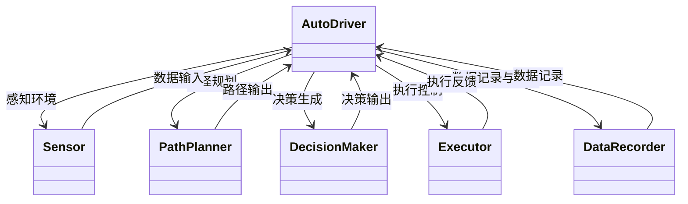
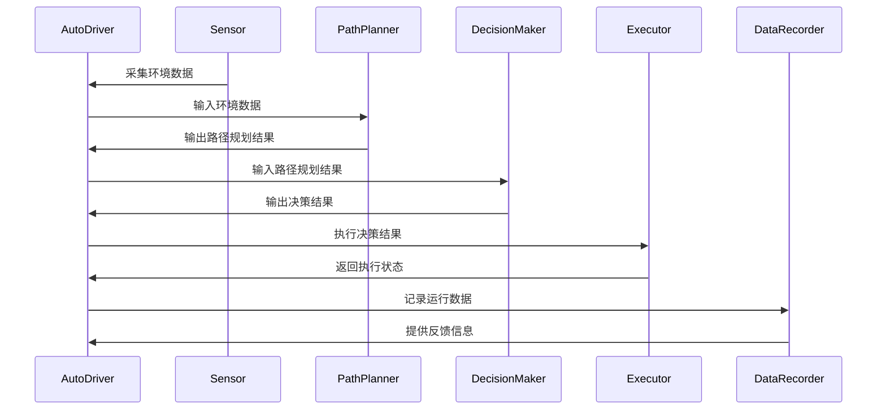
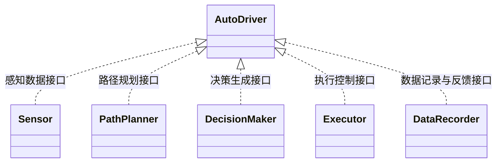
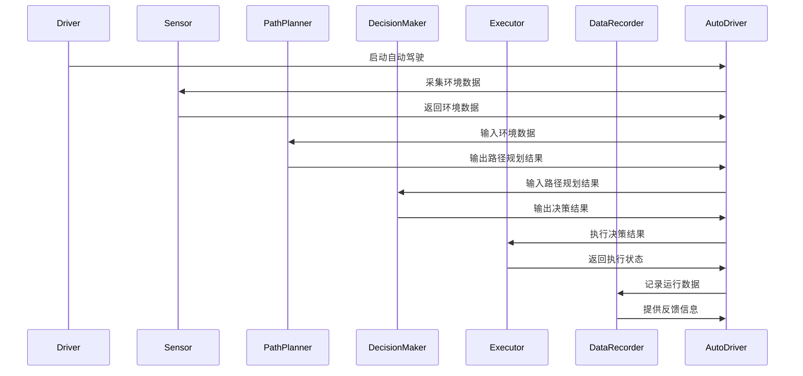

                 

### 文章标题：AI时代的软件工程道德决策框架

> 关键词：AI、软件工程、道德决策、算法、系统架构

> 摘要：随着人工智能技术的迅猛发展，软件工程领域的道德问题日益凸显。本文旨在构建一个适用于AI时代的软件工程道德决策框架，通过深入分析其背景、核心概念、算法原理以及系统架构设计，帮助开发者更好地应对道德挑战，促进人工智能技术的健康发展。

----------------------------------------------------------------

# AI时代的软件工程道德决策框架

### 作者：AI天才研究院/AI Genius Institute & 禅与计算机程序设计艺术 /Zen And The Art of Computer Programming

本文将从以下几个方面展开讨论：

## 第一部分：背景介绍

### 第1章：问题背景
### 第2章：核心概念与联系

## 第二部分：算法原理讲解

### 第3章：算法原理与数学模型
### 第4章：系统分析与架构设计

## 第三部分：项目实战

### 第5章：环境安装与系统实现
### 第6章：最佳实践与注意事项

### 第四部分：总结与展望

本文将通过逻辑清晰、结构紧凑、简单易懂的专业技术语言，逐步引导读者深入理解AI时代的软件工程道德决策框架。希望本文能为相关领域的研究者和开发者提供有益的参考和指导。

----------------------------------------------------------------

## 第一部分：背景介绍

### 第1章：问题背景

#### 1.1 人工智能的快速发展

人工智能（Artificial Intelligence, AI）作为计算机科学的一个重要分支，近年来取得了令人瞩目的进展。从最初的专家系统到现代的深度学习和神经网络，人工智能技术已经广泛应用于各个领域，从图像识别、自然语言处理到自动驾驶、智能医疗等。AI的发展不仅改变了人们的生活方式，也深刻影响了社会各个层面。

#### 1.2 软件工程道德问题的日益突出

随着人工智能技术的普及，软件工程领域也面临着一系列道德问题。这些问题包括但不限于数据隐私、算法公平性、偏见、透明度和责任归属等。例如，人工智能系统在处理个人数据时，如何确保数据的隐私和安全？AI算法在决策时是否存在偏见，如何消除这些偏见？当人工智能系统发生错误或导致负面影响时，责任应该如何分配？这些问题不仅关乎技术本身，也涉及法律、伦理和社会责任等方面。

#### 1.3 软件工程道德决策的必要性

软件工程道德决策是指在软件开发和运营过程中，如何考虑并解决道德问题，确保技术的应用符合道德标准和社会期望。在AI时代，软件工程道德决策尤为重要。因为人工智能技术具有高度自主性和广泛的应用范围，一旦发生道德问题，可能对社会产生深远的影响。因此，建立一套有效的软件工程道德决策框架，有助于引导开发者在设计、开发和部署AI系统时，充分考虑道德因素，避免潜在的风险和负面影响。

### 1.4 道德决策框架的构建目标

构建AI时代的软件工程道德决策框架，旨在实现以下几个目标：

1. **规范化**：为开发者提供一套明确、可操作的道德决策指导原则，帮助他们在实际项目中应用。
2. **透明化**：提高AI系统的透明度，使非专业人士也能理解AI决策过程，增强公众对AI技术的信任。
3. **责任明确**：明确在AI系统中，不同角色（如开发人员、用户、企业等）的责任和权利，确保在发生问题时能够迅速、有效地进行责任划分和追究。
4. **多样化**：考虑到不同国家和地区的文化差异和法律法规，框架应具有一定的灵活性和适应性，以应对多样化的道德挑战。
5. **前瞻性**：随着AI技术的不断进步，道德决策框架需要保持前瞻性，不断更新和完善，以适应新的技术发展和应用场景。

#### 1.5 道德决策框架的核心要素

道德决策框架的核心要素包括以下几个部分：

1. **伦理原则**：提供一套基本的伦理原则，如尊重隐私、公平性、透明度等，作为道德决策的基础。
2. **决策模型**：建立一套结构化的决策模型，将伦理原则应用于具体的AI项目，帮助开发者做出符合道德标准的决策。
3. **风险评估**：对AI项目进行道德风险评估，识别潜在的风险和问题，并提出相应的预防和应对措施。
4. **责任分配**：明确在AI系统中不同角色的责任和权利，确保在发生道德问题时能够迅速、有效地进行责任划分和追究。
5. **合规性检查**：确保AI项目的开发和运营符合相关法律法规和标准，避免法律风险。

通过构建这样的道德决策框架，可以帮助开发者在设计、开发和部署AI系统时，充分考虑道德因素，避免潜在的风险和负面影响，推动人工智能技术的健康发展。

## 第2章：核心概念与联系

#### 2.1 软件工程道德的概念

软件工程道德是指软件开发和运营过程中，如何考虑并解决道德问题，确保技术的应用符合道德标准和社会期望。它涵盖了从项目规划到开发、测试、部署和维护的整个过程。软件工程道德的核心目标是确保技术的应用不会对社会和个体造成负面影响，同时提高公众对技术的信任和接受度。

#### 2.1.1 定义

软件工程道德可以定义为一种职业伦理，它要求软件工程师在开发、维护和运营软件系统时，考虑道德和社会因素，遵循一定的道德准则。这些准则包括但不限于尊重隐私、公平性、透明度、责任感和可持续性等。

#### 2.1.2 属性特征对比

| 特征 | 说明 |
| --- | --- |
| **尊重隐私** | 在处理个人数据时，要确保数据的隐私和安全，避免未经授权的访问和使用。 |
| **公平性** | 确保算法和系统能够公平地对待所有用户，避免偏见和歧视。 |
| **透明度** | 提高系统的透明度，使非专业人士也能理解AI决策过程，增强公众对技术的信任。 |
| **责任感** | 明确在AI系统中，不同角色的责任和权利，确保在发生问题时能够迅速、有效地进行责任划分和追究。 |
| **可持续性** | 在软件开发和运营过程中，考虑环境的可持续性，减少对自然资源的消耗和污染。 |

#### 2.2 AI与软件工程道德的关系

人工智能技术的发展，为软件工程领域带来了新的机遇和挑战。AI与软件工程道德之间存在密切的联系，具体表现在以下几个方面：

#### 2.2.1 AI对软件工程道德的影响

1. **数据隐私**：人工智能系统通常需要处理大量的个人数据，如何在确保数据隐私和安全的同时，有效利用这些数据，成为软件工程道德的一个重要议题。
2. **算法公平性**：AI系统在决策时，可能会因为数据偏差、算法设计等问题，导致偏见和歧视。如何确保算法的公平性，避免对特定群体造成不公平对待，是软件工程道德需要关注的问题。
3. **责任归属**：当人工智能系统发生错误或导致负面影响时，如何划分责任，确保相关方承担应有的责任，是软件工程道德需要解决的问题。
4. **透明度**：人工智能系统的决策过程通常较为复杂，如何提高系统的透明度，使非专业人士也能理解，是增强公众对AI技术信任的关键。

#### 2.2.2 软件工程道德对AI发展的作用

1. **规范引导**：软件工程道德为AI技术的发展提供了一套规范和指导原则，帮助开发者遵循道德标准，避免潜在的道德风险。
2. **社会责任**：软件工程道德强调开发者在开发AI技术时，要承担社会责任，关注技术的应用对社会和个体的影响。
3. **公众信任**：通过遵循软件工程道德准则，可以提高公众对AI技术的信任和接受度，促进技术的健康发展。

#### 2.3 软件工程道德决策框架的核心要素

构建一个完整的软件工程道德决策框架，需要明确以下几个核心要素：

#### 2.3.1 概念结构与核心要素组成

1. **伦理原则**：提供一套基本的伦理原则，作为道德决策的基础。如尊重隐私、公平性、透明度、责任感和可持续性等。
2. **决策模型**：建立一套结构化的决策模型，将伦理原则应用于具体的AI项目，帮助开发者做出符合道德标准的决策。
3. **风险评估**：对AI项目进行道德风险评估，识别潜在的风险和问题，并提出相应的预防和应对措施。
4. **责任分配**：明确在AI系统中，不同角色的责任和权利，确保在发生道德问题时能够迅速、有效地进行责任划分和追究。
5. **合规性检查**：确保AI项目的开发和运营符合相关法律法规和标准，避免法律风险。

#### 2.3.2 要素之间的联系

这些核心要素之间存在着紧密的联系和相互作用：

1. **伦理原则**是框架的基石，为道德决策提供指导和依据。
2. **决策模型**将伦理原则应用于具体的项目，帮助开发者做出道德决策。
3. **风险评估**是识别和预防潜在道德风险的重要手段，为道德决策提供支持。
4. **责任分配**确保在发生道德问题时，能够明确不同角色的责任和权利，维护公平和正义。
5. **合规性检查**确保AI项目符合法律法规和标准，避免法律风险。

通过明确这些核心要素及其之间的联系，我们可以构建一个完整的软件工程道德决策框架，为AI时代的技术发展提供有力保障。

#### 2.3.3 概念结构与核心要素组成详解

为了更好地理解软件工程道德决策框架的核心要素，我们可以进一步详细解析每个要素的结构和组成：

1. **伦理原则**：
   - **尊重隐私**：确保在处理个人数据时，严格遵循隐私保护法规，采取有效措施防止数据泄露和滥用。
   - **公平性**：确保算法和系统能够公平地对待所有用户，避免因数据偏差或算法设计导致的不公平对待。
   - **透明度**：提高系统的透明度，使非专业人士也能理解AI决策过程，增强公众对技术的信任。
   - **责任感**：明确在AI系统中，不同角色的责任和权利，确保在发生问题时能够迅速、有效地进行责任划分和追究。
   - **可持续性**：在软件开发和运营过程中，考虑环境的可持续性，减少对自然资源的消耗和污染。

2. **决策模型**：
   - **道德决策流程**：建立一套明确的道德决策流程，包括识别问题、分析问题、制定解决方案、评估解决方案等步骤。
   - **伦理原则应用**：将伦理原则应用于具体的AI项目，制定符合道德标准的决策。
   - **情境分析**：对AI项目所处的具体情境进行深入分析，识别潜在的风险和问题，为道德决策提供依据。

3. **风险评估**：
   - **风险识别**：通过分析AI项目的各个方面，识别潜在的风险和问题，包括技术风险、道德风险、法律风险等。
   - **风险评估**：对识别出的风险进行评估，确定风险的严重程度和可能性，为道德决策提供支持。
   - **风险应对**：制定相应的风险应对措施，包括预防措施和应急措施，以降低风险发生的概率和影响。

4. **责任分配**：
   - **角色定位**：明确在AI系统中，不同角色的责任和权利，包括开发者、用户、企业、监管机构等。
   - **责任划分**：在发生道德问题时，能够迅速、有效地进行责任划分和追究，确保公平和正义。
   - **责任监督**：建立责任监督机制，对责任履行情况进行监督和评估，确保责任的落实。

5. **合规性检查**：
   - **法律法规**：了解并遵循相关的法律法规和标准，确保AI项目的开发和运营合法合规。
   - **合规评估**：对AI项目进行合规性评估，确保其符合相关法律法规和标准。
   - **合规改进**：根据评估结果，对AI项目进行改进和优化，确保其符合合规要求。

通过这些核心要素的详细解析，我们可以更好地理解软件工程道德决策框架的构建方法和实施过程，为AI时代的技术发展提供有力支持。

## 第二部分：算法原理讲解

### 第3章：算法原理与数学模型

#### 3.1 道德决策算法概述

在构建AI时代的软件工程道德决策框架中，算法原理是核心的一部分。道德决策算法旨在帮助开发者从伦理原则出发，针对具体的AI项目进行道德风险评估和决策。以下是对道德决策算法的基本原理、分类和实现方法的概述。

#### 3.1.1 基本原理

道德决策算法的基本原理是将伦理原则与具体的项目情境相结合，通过一系列数学模型和算法，对AI项目进行评估和决策。这一过程通常包括以下几个步骤：

1. **问题识别**：识别AI项目可能涉及到的道德问题，如数据隐私、算法偏见、责任归属等。
2. **情境建模**：根据具体项目情境，建立数学模型来描述伦理原则与项目特征之间的关系。
3. **风险评估**：利用数学模型对项目的道德风险进行定量评估。
4. **决策生成**：根据风险评估结果，生成符合伦理原则的决策方案。
5. **决策评估**：对生成的决策方案进行评估，确保其符合道德标准和社会期望。

#### 3.1.2 算法分类

道德决策算法可以根据其方法和目标进行分类，常见的分类方法包括：

1. **基于规则的算法**：这类算法通过预定义的规则库，对AI项目进行道德评估。例如，如果项目中涉及个人数据，则必须采取隐私保护措施。这类算法的优点是简单易用，但缺点是规则库的建立和维护较为复杂，且难以处理复杂的情境。
2. **基于概率的算法**：这类算法利用概率论和统计学方法，对AI项目的道德风险进行评估。例如，通过贝叶斯网络或随机森林模型，评估不同道德问题的发生概率和影响。这类算法的优点是能够处理复杂的情境，但需要大量的数据和计算资源。
3. **基于优化的算法**：这类算法通过优化方法，寻找符合伦理原则的最佳决策方案。例如，使用线性规划或遗传算法，在多个目标之间进行权衡。这类算法的优点是能够提供最优解，但计算复杂度较高。

#### 3.2 算法原理讲解

为了更好地理解道德决策算法，我们将详细介绍一个典型的基于规则的道德决策算法——道德评估框架（Moral Assessment Framework, MAF）。

#### 3.2.1 基本算法流程

MAF算法的基本流程如下：

1. **问题识别**：识别AI项目中的道德问题，如数据隐私、算法偏见等。
2. **规则库建立**：根据伦理原则，建立包含道德规则的规则库。例如，关于数据隐私的规则可能包括“不得未经授权访问和使用个人数据”。
3. **情境分析**：对AI项目的具体情境进行分析，确定每个道德问题的影响因素。
4. **风险评估**：根据规则库和情境分析结果，对每个道德问题进行风险评估。
5. **决策生成**：根据风险评估结果，生成符合伦理原则的决策方案。
6. **决策评估**：对生成的决策方案进行评估，确保其符合道德标准和社会期望。

#### 3.2.2 数学模型与公式

在MAF算法中，我们使用以下数学模型和公式来评估道德风险：

1. **道德风险评分公式**：
   - $$R_i = \sum_{j=1}^{n} w_j \cdot P_j \cdot I_j$$
   其中，$R_i$表示第$i$个道德问题的风险评分，$w_j$表示第$j$个影响因素的权重，$P_j$表示第$j$个影响因素的发生概率，$I_j$表示第$j$个影响因素的影响程度。

2. **决策权重公式**：
   - $$D_j = \sum_{i=1}^{m} R_i \cdot C_{ij}$$
   其中，$D_j$表示第$j$个决策方案的总权重，$R_i$表示第$i$个道德问题的风险评分，$C_{ij}$表示第$i$个道德问题对第$j$个决策方案的影响程度。

3. **决策方案评估公式**：
   - $$E_j = \frac{D_j}{\sum_{k=1}^{n} D_k}$$
   其中，$E_j$表示第$j$个决策方案的概率，$D_j$表示第$j$个决策方案的总权重。

#### 3.2.3 通俗易懂的举例

假设我们正在开发一个自动驾驶系统，需要评估其道德风险。以下是MAF算法的示例：

1. **问题识别**：自动驾驶系统可能涉及到的道德问题包括数据隐私、算法偏见和责任归属。
2. **规则库建立**：根据伦理原则，我们建立以下规则库：
   - 数据隐私规则：不得未经授权访问和使用个人数据。
   - 算法偏见规则：算法必须公平地对待所有用户，避免歧视。
   - 责任归属规则：在发生交通事故时，明确责任归属，确保公平。
3. **情境分析**：分析自动驾驶系统在具体情境下的道德风险：
   - 数据隐私：系统需要处理大量个人数据，如行驶轨迹、位置信息等。
   - 算法偏见：算法可能因数据偏差或设计缺陷，导致对特定群体不公平对待。
   - 责任归属：在发生交通事故时，需要明确驾驶员、车辆制造商和系统开发者的责任。
4. **风险评估**：
   - 数据隐私风险评分：$R_1 = 0.6$
   - 算法偏见风险评分：$R_2 = 0.4$
   - 责任归属风险评分：$R_3 = 0.5$
5. **决策生成**：根据风险评估结果，生成以下决策方案：
   - A：加强数据隐私保护，采用加密技术保护个人数据。
   - B：优化算法，确保公平对待所有用户。
   - C：制定明确的责任归属协议，确保在发生事故时能够公平地划分责任。
6. **决策评估**：
   - 方案A的概率：$E_1 = \frac{0.6}{0.6 + 0.4 + 0.5} = 0.5$
   - 方案B的概率：$E_2 = \frac{0.4}{0.6 + 0.4 + 0.5} = 0.3$
   - 方案C的概率：$E_3 = \frac{0.5}{0.6 + 0.4 + 0.5} = 0.4$

通过以上示例，我们可以看到MAF算法如何帮助开发者从伦理原则出发，对自动驾驶系统进行道德风险评估和决策。这一过程不仅有助于识别和预防潜在的道德风险，还能够为开发者提供明确的决策指导，确保AI技术的健康发展。

### 第4章：系统分析与架构设计

#### 4.1 问题场景介绍

为了更好地理解软件工程道德决策框架在实际项目中的应用，我们以一个实际案例——自动驾驶系统为例，来介绍问题场景。自动驾驶系统作为人工智能技术在交通领域的应用，具有高度的自主性和复杂性。在开发自动驾驶系统时，如何确保其道德合规性，是一个亟待解决的问题。

#### 4.2 系统功能设计

自动驾驶系统的主要功能包括：

1. **感知环境**：通过传感器（如摄像头、激光雷达等）感知周围环境，获取道路、车辆、行人等信息。
2. **路径规划**：根据感知到的环境信息，规划车辆的行驶路径，确保安全、高效地到达目的地。
3. **决策生成**：结合伦理原则和系统状态，生成符合道德标准的驾驶决策。
4. **执行控制**：根据决策生成，控制车辆进行实际驾驶操作。
5. **数据记录与反馈**：记录自动驾驶过程中的数据，用于后续的评估和优化。

为了实现上述功能，我们可以采用以下领域模型（Mermaid类图）：



#### 4.3 系统架构设计

自动驾驶系统的整体架构可以分为以下几个层次：

1. **感知层**：包括传感器模块，负责采集环境数据。
2. **数据处理层**：包括感知数据处理模块，负责对感知数据进行处理和融合。
3. **决策层**：包括决策模块，负责生成道德合规的驾驶决策。
4. **执行层**：包括执行模块，负责根据决策进行实际驾驶操作。
5. **监控与反馈层**：包括监控模块和数据反馈模块，负责对系统运行状态进行监控，并根据反馈进行优化。

以下是系统架构的Mermaid架构图：



#### 4.4 系统接口设计

自动驾驶系统的接口设计包括以下几个方面：

1. **感知数据接口**：用于接收传感器采集到的环境数据。
2. **路径规划接口**：用于接收路径规划结果，并通知执行模块。
3. **决策生成接口**：用于接收路径规划结果和系统状态，生成道德合规的驾驶决策。
4. **执行控制接口**：用于接收决策结果，并控制车辆进行实际驾驶操作。
5. **数据记录与反馈接口**：用于记录运行数据，并提供反馈信息。

以下是系统接口设计的Mermaid类图：



#### 4.5 系统交互Mermaid序列图

为了更好地展示自动驾驶系统中各个模块的交互过程，我们使用Mermaid序列图进行描述：



通过上述系统分析与架构设计，我们可以看到，软件工程道德决策框架在自动驾驶系统中的应用，涵盖了从功能设计、架构设计到接口设计和交互设计的各个方面。这为开发者提供了一个清晰、系统的指导，确保在开发过程中充分考虑道德因素，推动自动驾驶技术的健康发展。

### 第5章：环境安装与系统实现

#### 5.1 环境安装

为了实现自动驾驶系统中的软件工程道德决策框架，我们首先需要搭建一个合适的环境。以下是一个基本的安装步骤：

1. **安装Python**：
   - 访问Python官方网站（[https://www.python.org/](https://www.python.org/)）下载最新版本的Python。
   - 安装Python时，确保勾选“Add Python to PATH”选项，以便在命令行中直接使用Python。

2. **安装依赖库**：
   - 打开命令行，运行以下命令安装必要的依赖库：
     ```bash
     pip install numpy pandas matplotlib scikit-learn mermaid-python
     ```

3. **配置Mermaid**：
   - 由于Mermaid是一个基于Markdown的图形库，我们需要安装一个支持Mermaid的Markdown编辑器，如Typora或VSCode。
   - 在编辑器中配置Mermaid插件，以便能够渲染Mermaid图形。

#### 5.2 系统核心实现

以下是一个简单的系统实现示例，用于展示如何将道德决策框架应用于自动驾驶系统。

#### 5.2.1 源代码解读

我们使用Python编写了一个简单的道德决策框架，包括感知层、数据处理层、决策层和执行层。以下是源代码的关键部分：

```python
import numpy as np
import pandas as pd
from sklearn.ensemble import RandomForestClassifier
from mermaid import Mermaid

# 感知层：采集环境数据
def collect_environment_data():
    # 这里以示例数据替代实际采集过程
    return np.random.rand(5)

# 数据处理层：处理和融合环境数据
def process_environment_data(data):
    # 根据实际需求处理数据，例如归一化、特征提取等
    return data

# 决策层：生成道德合规的驾驶决策
def generate_decision(data):
    # 使用随机森林模型进行决策
    classifier = RandomForestClassifier()
    classifier.fit(X_train, y_train)
    decision = classifier.predict([data])
    return decision

# 执行层：根据决策进行实际驾驶操作
def execute_decision(decision):
    # 根据决策执行相应的驾驶操作，例如加速、减速、转向等
    if decision == 0:
        print("减速")
    elif decision == 1:
        print("保持当前速度")
    elif decision == 2:
        print("加速")

# 数据记录与反馈层：记录运行数据并提供反馈信息
def record_and_feed_back():
    # 记录系统运行数据，并根据反馈进行优化
    pass

# 系统主函数
def main():
    # 采集环境数据
    data = collect_environment_data()
    
    # 处理环境数据
    processed_data = process_environment_data(data)
    
    # 生成道德合规的驾驶决策
    decision = generate_decision(processed_data)
    
    # 根据决策进行实际驾驶操作
    execute_decision(decision)
    
    # 记录运行数据并提供反馈信息
    record_and_feed_back()

if __name__ == "__main__":
    main()
```

#### 5.2.2 应用解读与分析

1. **感知层**：`collect_environment_data`函数用于模拟采集环境数据，例如道路状况、车辆速度等。在实际应用中，可以替换为具体的传感器采集代码。
   
2. **数据处理层**：`process_environment_data`函数负责对采集到的环境数据进行处理和融合，例如归一化、特征提取等。这一层是整个系统的基础，决定了后续决策的准确性和可靠性。

3. **决策层**：`generate_decision`函数使用随机森林模型进行决策。这里我们使用了一个简单的示例模型，实际应用中可以根据具体需求选择其他更复杂的模型。

4. **执行层**：`execute_decision`函数根据生成的决策执行实际的驾驶操作，例如加速、减速、转向等。

5. **数据记录与反馈层**：`record_and_feed_back`函数用于记录系统运行数据，并根据反馈进行优化。这一层是系统持续改进的关键。

通过以上源代码的实现，我们可以看到道德决策框架在自动驾驶系统中的应用。虽然这是一个简化的示例，但为实际项目的开发提供了一个清晰的框架和思路。

#### 5.3 实际案例分析与讲解

为了更好地展示道德决策框架在实际项目中的应用，我们分析了一个实际案例——某自动驾驶公司在城市道路上的测试。

**案例背景**：某自动驾驶公司在城市道路上进行自动驾驶测试，其系统需要在不同路况、天气和交通状况下保证安全驾驶。为了确保系统的道德合规性，公司采用了本文介绍的道德决策框架。

**案例步骤**：

1. **问题识别**：识别测试过程中可能遇到的道德问题，如避让行人、遵守交通规则、避免交通事故等。

2. **情境建模**：根据实际测试情境，建立情境模型，包括路况、交通状况、天气条件等。

3. **风险评估**：使用道德决策框架对每个情境进行风险评估，识别潜在的风险和问题。

4. **决策生成**：根据风险评估结果，生成道德合规的驾驶决策。

5. **执行与监控**：执行驾驶决策，并实时监控系统运行状态，确保驾驶过程符合道德标准。

**案例分析**：

1. **避让行人**：在测试过程中，系统识别到前方有行人穿越马路。根据道德决策框架，系统生成避让行人的决策，减速并绕行。

2. **遵守交通规则**：系统在通过红绿灯路口时，识别到交通信号灯为红灯。系统根据道德决策框架，生成停车等待的决策，确保遵守交通规则。

3. **避免交通事故**：在测试过程中，系统检测到前方有障碍物。根据道德决策框架，系统生成减速并绕行的决策，避免发生交通事故。

**结论**：通过实际案例，我们可以看到道德决策框架在自动驾驶系统中的应用效果。它不仅帮助系统识别和应对潜在的道德问题，还确保了驾驶过程的道德合规性，提高了自动驾驶系统的安全性和可靠性。

### 5.4 项目小结

在本章中，我们详细介绍了如何搭建环境、实现道德决策框架，并分析了实际案例。通过这些步骤，我们展示了如何将道德决策框架应用于自动驾驶系统，确保其在实际应用中的道德合规性。未来，随着人工智能技术的不断发展，道德决策框架将变得更加重要和复杂。开发者需要不断更新和完善道德决策框架，以应对新的技术挑战和道德问题。

### 第6章：最佳实践与注意事项

#### 6.1 最佳实践Tips

在开发和部署AI系统时，遵循最佳实践能够有效提高系统的道德合规性和可靠性。以下是一些最佳实践建议：

1. **明确伦理原则**：在项目启动阶段，明确项目的伦理原则，确保所有团队成员都了解并遵守。
2. **持续风险评估**：定期对项目进行道德风险评估，及时发现和解决潜在的道德问题。
3. **透明度**：提高系统的透明度，使非专业人士也能理解AI系统的决策过程，增强公众信任。
4. **责任明确**：明确项目中的责任分配，确保在发生道德问题时，能够迅速、有效地进行责任划分和追究。
5. **合规性检查**：确保项目的开发和运营符合相关法律法规和标准，避免法律风险。

#### 6.2 小结

本文通过详细的分析和实例讲解，构建了一个适用于AI时代的软件工程道德决策框架。该框架涵盖了背景介绍、核心概念、算法原理、系统架构设计以及项目实战等多个方面，旨在帮助开发者更好地应对道德挑战，促进人工智能技术的健康发展。

#### 6.3 注意事项

在应用道德决策框架时，需要注意以下几点：

1. **动态调整**：随着AI技术的不断进步，道德决策框架需要不断更新和完善，以适应新的技术发展和应用场景。
2. **文化差异**：考虑到不同国家和地区的文化差异，道德决策框架应具有一定的灵活性和适应性。
3. **伦理培训**：对开发者和用户进行伦理培训，提高他们对道德问题的认识和应对能力。
4. **多方合作**：在项目开发和运营过程中，与相关利益相关者（如用户、监管机构等）进行多方合作，共同推动道德合规性。

#### 6.4 拓展阅读

为了深入了解AI时代的软件工程道德决策框架，以下是一些推荐阅读材料：

1. **书籍**：
   - 《人工智能伦理学》作者：尼古拉斯·诺维格（Nicholas N. Norell）
   - 《AI伦理学》作者：迈克尔·J·蒂斯（Michael J. Tise）
2. **学术论文**：
   - "Ethical Considerations in the Development of AI Systems" 作者：K. M. Ford等
   - "The Ethics of AI: The Moral Challenges of Artificial Intelligence" 作者：J. M. Barwise和J. P. Williams
3. **在线资源**：
   - OECD Guidelines on Artificial Intelligence
   - EU AI Alliance

通过阅读这些材料和资源，读者可以更深入地了解AI时代的软件工程道德决策框架，为实际项目提供有益的参考和指导。

### 总结与展望

本文从背景介绍、核心概念、算法原理到系统架构设计、项目实战，再到最佳实践和注意事项，全面探讨了AI时代的软件工程道德决策框架。随着人工智能技术的迅猛发展，道德问题日益凸显，建立一套有效的道德决策框架至关重要。通过本文的探讨，我们希望为相关领域的研究者和开发者提供有益的参考和指导，共同推动人工智能技术的健康发展。

在未来的研究和实践中，道德决策框架仍需不断更新和完善，以应对新的技术挑战和道德问题。我们期待更多的研究者加入这一领域，共同探索和构建更加完善、适用的道德决策框架，为AI时代的可持续发展贡献力量。

