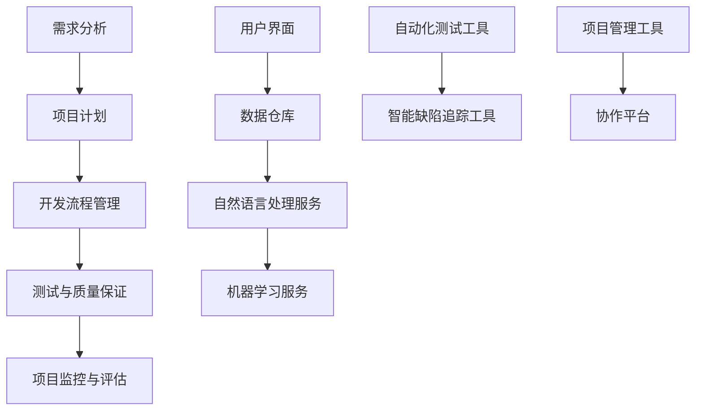
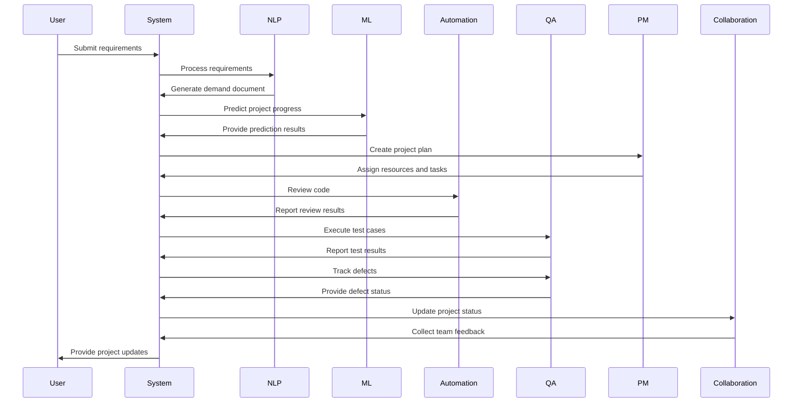

                 

### 《AI时代的软件工程项目管理新范式》

#### 关键词：AI、软件工程、项目管理、新范式、自动化、敏捷开发

> 摘要：随着人工智能技术的迅猛发展，软件工程项目管理正迎来一场深刻变革。本文将探讨AI如何改变传统的软件项目管理模式，介绍AI时代的软件工程项目管理新范式，分析关键技术与工具，以及探讨未来发展趋势。

----------------------------------------------------------------

## 第一部分：背景与概述

### 第1章：AI时代的软件工程项目管理背景

#### 1.1 AI技术的发展及其影响

人工智能（AI）作为当今科技领域的前沿技术，已经在各个行业中发挥着越来越重要的作用。从自动驾驶汽车到智能客服系统，AI正在改变我们的生活方式。在软件工程项目管理中，AI技术的应用同样具有深远的影响。

AI技术的发展历程可以分为几个阶段：从最初的规则系统，到基于统计的学习算法，再到如今基于深度学习的模型，AI技术的演进不仅提高了其性能，也拓展了其应用范围。AI在数据处理、模式识别、自然语言处理等方面具有独特优势，这为软件项目管理带来了新的可能性。

#### 1.2 软件工程项目管理的挑战与机遇

软件工程项目管理面临许多挑战，如复杂的项目需求、不确定的技术风险、庞大的代码库、紧张的交付时间等。这些问题传统管理方法难以应对，而AI技术的引入为解决这些问题提供了新的思路。

首先，AI可以帮助项目经理更好地理解项目需求，通过自然语言处理技术，将非结构化的需求转化为明确的任务。其次，AI可以在项目中扮演预测和优化的角色，通过数据分析和机器学习，预测项目的进度和质量，并自动调整资源分配。此外，AI还可以提高代码审查和缺陷预测的效率，减少人为错误，提升开发质量。

#### 1.3 新范式的基本概念与重要性

在AI时代，软件工程项目管理的新范式强调自动化、智能化和数据驱动。这种新范式不仅提高了项目的效率和准确性，还使项目经理能够更好地应对复杂的项目挑战。

新范式的核心概念包括：

- **自动化流程**：通过机器人流程自动化（RPA）和智能自动化工具，减少人工干预，提高流程效率。
- **智能化决策**：利用AI算法和模型，进行数据分析和预测，支持项目经理的决策。
- **数据驱动**：基于大数据和实时数据，优化项目管理过程，提高项目透明度和可控性。

新范式的重要性在于，它能够帮助项目经理更高效地管理项目，提高项目的成功率和客户满意度，同时降低项目成本和风险。

### 第2章：AI时代的项目管理基础

#### 2.1 软件工程项目管理的核心要素

软件工程项目管理的核心要素包括项目计划、资源管理、风险管理、沟通和协作等。在AI时代，这些核心要素将如何变化和优化呢？

- **项目计划**：AI可以提供基于历史数据的预测模型，帮助项目经理制定更准确的项目计划。
- **资源管理**：AI可以通过智能调度和优化算法，提高资源利用效率，减少资源浪费。
- **风险管理**：AI可以识别潜在的风险，并提供应对策略，降低项目风险。
- **沟通和协作**：AI可以提供智能化的沟通工具和协作平台，提高团队协作效率。

#### 2.2 AI技术在项目管理中的应用

AI技术在项目管理中的应用主要体现在以下几个方面：

- **需求分析**：通过自然语言处理技术，自动提取和分析用户需求，减少需求误解和遗漏。
- **开发流程**：使用自动化工具和智能算法，提高代码审查、测试和优化的效率。
- **测试与质量保证**：通过自动化测试和智能测试策略，提高测试覆盖率，减少缺陷率。
- **项目监控与评估**：使用AI算法和模型，实时监控项目进度和质量，并提供评估和反馈。

#### 2.3 新范式下的项目管理流程

在AI时代，项目管理流程将更加自动化和智能化。以下是一个简化的新范式下的项目管理流程：

1. **需求获取与分析**：使用AI技术自动获取和分析用户需求，形成详细的需求文档。
2. **项目计划与资源分配**：基于AI预测模型，制定项目计划和资源分配方案。
3. **开发与测试**：使用AI辅助开发，提高代码质量和测试效率。
4. **项目监控与评估**：使用AI工具实时监控项目进度和质量，并提供评估和反馈。
5. **持续改进**：根据评估结果，持续优化项目管理过程和开发流程。

通过上述流程，AI能够显著提高项目管理的效率和效果，帮助项目经理更好地应对复杂的项目挑战。

----------------------------------------------------------------

## 第二部分：关键技术与工具

### 第3章：AI在需求分析中的应用

#### 3.1 AI辅助需求获取与分析

在传统的需求分析过程中，项目经理和开发人员通常需要与客户和用户进行多次沟通，以准确理解需求。然而，这种沟通往往存在信息丢失和误解的风险。AI技术的引入为需求分析提供了新的解决方案。

AI辅助需求获取与分析的主要方法包括：

- **自然语言处理（NLP）**：通过NLP技术，AI可以理解和解析自然语言文本，自动提取关键信息，生成需求文档。
- **语义分析**：AI通过语义分析，识别用户需求中的关键词和句子结构，理解需求的含义和意图。
- **文本生成**：AI可以根据需求文档，自动生成相关的用户故事、功能描述和测试用例。

通过AI辅助需求获取与分析，项目经理和开发人员可以更准确地理解需求，减少需求误解和遗漏，提高项目成功率。

#### 3.2 机器学习在需求预测中的应用

机器学习在需求预测中的应用可以帮助项目经理提前识别项目中的潜在问题，从而采取预防措施。以下是一些常用的机器学习方法：

- **时间序列分析**：通过分析历史项目数据，预测未来的项目需求和进度。
- **回归分析**：使用回归模型，预测项目关键指标，如成本、时间和资源需求。
- **分类算法**：通过分类算法，预测项目风险和问题类型。

机器学习在需求预测中的应用，不仅可以帮助项目经理更好地规划项目，还可以优化资源分配，提高项目效率。

#### 3.3 智能化的需求管理工具

智能化的需求管理工具结合了AI技术和传统的需求管理方法，提供更加高效的需求获取、分析和跟踪解决方案。以下是一些智能化的需求管理工具：

- **AI驱动的需求管理平台**：如JIRA、Confluence等，可以自动提取和分析需求，提供智能化的需求跟踪和管理功能。
- **自然语言处理工具**：如Google Dialogflow、IBM Watson等，可以理解和响应自然语言请求，提高需求沟通的效率。
- **自动化测试工具**：如Selenium、Cypress等，可以自动生成测试用例，提高需求验证的效率。

通过使用智能化的需求管理工具，项目经理和开发人员可以更高效地管理需求，提高项目质量和客户满意度。

### 第4章：AI在开发流程中的应用

#### 4.1 自动化代码审查与优化

自动化代码审查与优化是AI在软件开发中的一项重要应用。传统的代码审查方法主要依赖于人工检查，存在效率低、易出错等问题。而AI技术可以通过自动化工具和算法，提高代码审查的效率和质量。

以下是几种常用的自动化代码审查与优化方法：

- **静态代码分析**：AI通过静态代码分析，检查代码是否符合编码规范，发现潜在的错误和缺陷。
- **代码优化**：AI可以识别代码中的冗余部分，提出优化建议，提高代码的可读性和可维护性。
- **自动化测试**：AI可以生成测试用例，自动执行代码测试，发现代码中的潜在问题。

通过自动化代码审查与优化，可以减少人为错误，提高代码质量，缩短开发周期。

#### 4.2 智能化的缺陷预测与修复

智能化的缺陷预测与修复是AI在软件开发中的另一项重要应用。通过分析历史数据，AI可以预测代码中的潜在缺陷，并提供修复建议。

以下是一些常用的智能化缺陷预测与修复方法：

- **缺陷预测模型**：AI通过机器学习算法，分析历史缺陷数据，预测代码中的潜在缺陷。
- **自动化修复**：AI可以通过自动化工具，自动修复预测到的缺陷，减少开发人员的工作量。
- **代码补全**：AI可以通过自然语言处理技术，自动生成代码补全建议，提高代码编写效率。

通过智能化的缺陷预测与修复，可以减少代码缺陷，提高开发效率，缩短项目周期。

#### 4.3 AI驱动的敏捷开发方法

AI驱动的敏捷开发方法结合了AI技术和敏捷开发的原则，旨在提高软件开发的灵活性和响应速度。以下是一些AI驱动的敏捷开发方法：

- **智能任务分配**：AI可以根据团队成员的能力和项目需求，自动分配任务，提高团队协作效率。
- **实时反馈与优化**：AI可以通过实时数据分析，提供项目进展和质量的反馈，帮助团队及时调整开发策略。
- **自动化测试与持续集成**：AI可以自动化测试和集成过程，确保代码质量，提高交付速度。

通过AI驱动的敏捷开发方法，可以更好地适应项目变化，提高项目交付速度和质量。

### 第5章：AI在测试与质量保证中的应用

#### 5.1 自动化测试与智能测试策略

在传统的软件测试中，测试过程往往依赖于人工执行测试用例，存在效率低、覆盖率不足等问题。而AI技术的引入，使得自动化测试成为可能，并进一步发展为智能测试策略。

以下是一些自动化测试与智能测试策略：

- **自动化测试工具**：如Selenium、Appium等，可以自动化执行测试用例，提高测试效率。
- **智能测试策略**：AI可以通过分析历史测试数据，自动生成最优的测试策略，提高测试覆盖率。
- **测试用例优化**：AI可以识别重复的测试用例，自动优化测试资源，提高测试效率。

通过自动化测试与智能测试策略，可以显著提高测试效率和质量，减少测试成本。

#### 5.2 智能化的缺陷定位与追踪

在软件测试过程中，缺陷定位和追踪是关键环节。智能化的缺陷定位与追踪技术可以通过AI算法，快速识别和定位缺陷，并提供追踪和管理方法。

以下是一些智能化的缺陷定位与追踪方法：

- **缺陷定位算法**：AI可以通过静态和动态分析，快速定位缺陷出现的位置，提高定位效率。
- **缺陷追踪工具**：如JIRA、Bugzilla等，可以自动化记录和追踪缺陷，提高缺陷管理效率。
- **自动化缺陷修复**：AI可以自动修复部分缺陷，减少开发人员的工作量。

通过智能化的缺陷定位与追踪，可以更快地发现和解决缺陷，提高产品质量。

#### 5.3 AI在性能测试中的应用

性能测试是软件测试的重要环节，用于评估软件在特定环境下的性能表现。AI技术在性能测试中的应用，可以帮助提高测试效率和测试质量。

以下是一些AI在性能测试中的应用：

- **性能预测模型**：AI可以通过分析历史性能数据，预测软件在未来环境下的性能表现。
- **智能负载生成**：AI可以自动生成符合实际负载的测试用例，提高性能测试的真实性。
- **性能优化建议**：AI可以通过分析性能数据，提供性能优化建议，提高软件性能。

通过AI在性能测试中的应用，可以更准确地评估软件性能，为性能优化提供有力支持。

----------------------------------------------------------------

## 第三部分：项目管理实践

### 第6章：AI驱动的项目计划与资源管理

#### 6.1 智能化的项目计划工具

在项目计划阶段，智能化的项目计划工具可以大大提高项目管理的效率和质量。以下是一些智能化的项目计划工具：

- **基于AI的项目计划工具**：如Microsoft Project、Smartsheet等，可以通过AI算法自动生成项目计划，并提供实时更新和优化功能。
- **自动化的任务分配**：AI可以根据团队成员的能力和项目需求，自动分配任务，提高任务分配的公平性和效率。
- **实时数据更新**：AI可以通过实时数据收集和分析，自动更新项目进度和资源使用情况，确保项目计划的准确性和实时性。

通过智能化的项目计划工具，项目经理可以更准确地制定项目计划，合理分配资源，提高项目成功率。

#### 6.2 资源优化与分配策略

在资源管理方面，AI技术可以通过智能化的算法和模型，优化资源分配和调度，提高资源利用效率。

以下是一些资源优化与分配策略：

- **智能资源调度**：AI可以通过分析历史数据，自动调度资源，确保关键任务能够及时完成。
- **动态资源调整**：AI可以根据项目进展和实际情况，动态调整资源分配，确保项目在资源紧张时能够顺利推进。
- **预测性资源管理**：AI可以通过预测模型，提前识别资源需求高峰，提前进行资源储备和调整。

通过资源优化与分配策略，可以最大限度地提高资源利用效率，降低项目成本，提高项目成功率。

#### 6.3 项目风险管理与预测

项目风险管理是项目管理的重要环节。AI技术可以通过数据分析、机器学习和预测模型，提高项目风险管理的效率和准确性。

以下是一些项目风险管理与预测方法：

- **风险评估模型**：AI可以通过分析历史数据，建立风险评估模型，预测项目中的潜在风险。
- **实时风险监控**：AI可以通过实时数据收集和分析，监控项目中的风险指标，及时发现潜在风险。
- **自动化风险应对**：AI可以通过预测模型，自动制定风险应对策略，减少风险对项目的影响。

通过项目风险管理与预测，可以提前识别和应对项目风险，降低项目风险，提高项目成功率。

### 第7章：AI在项目沟通与协作中的应用

#### 7.1 智能化的沟通工具与平台

在项目沟通和协作中，智能化的沟通工具与平台可以大大提高沟通效率和质量。以下是一些智能化的沟通工具与平台：

- **基于AI的沟通工具**：如Slack、Microsoft Teams等，可以通过自然语言处理技术，自动解析和响应团队成员的沟通需求，提高沟通效率。
- **智能会议系统**：如Zoom、Google Meet等，可以通过AI算法，自动记录会议内容和生成会议纪要，提高会议效率。
- **自动化通知与提醒**：AI可以通过分析项目进度和团队成员的日程，自动发送通知和提醒，确保项目进度不受影响。

通过智能化的沟通工具与平台，可以确保项目信息的实时共享和透明，提高团队协作效率。

#### 7.2 智能化的协作与知识管理

在项目协作中，智能化的协作与知识管理工具可以帮助团队成员更高效地共享知识和经验，提高项目成功率。以下是一些智能化的协作与知识管理工具：

- **基于AI的知识库**：如Confluence、Notion等，可以通过自然语言处理技术，自动整理和分类知识，方便团队成员快速查找和利用。
- **智能协作平台**：如Trello、Asana等，可以通过AI算法，自动分配任务、跟踪项目进度，提高团队协作效率。
- **智能推荐系统**：AI可以通过分析团队成员的行为和偏好，推荐相关的知识和资源，提高学习和工作效率。

通过智能化的协作与知识管理工具，可以最大限度地发挥团队的知识和经验，提高项目成功率。

#### 7.3 AI在团队协作中的实际应用案例

以下是一些AI在团队协作中的实际应用案例：

- **案例1：智能任务分配**：某互联网公司通过引入智能化的任务分配系统，根据团队成员的能力和项目需求，自动分配任务，提高了任务分配的效率和公平性。
- **案例2：智能会议纪要**：某科技公司采用智能会议系统，自动记录会议内容和生成会议纪要，提高了会议效率，减少了会议时间。
- **案例3：知识共享平台**：某大型企业通过引入基于AI的知识库系统，自动整理和分类知识，方便团队成员快速查找和利用，提高了知识共享效率。

通过AI在团队协作中的实际应用，可以显著提高团队协作效率，降低项目风险，提高项目成功率。

### 第8章：AI在项目监控与评估中的应用

#### 8.1 智能化的项目监控工具

在项目监控中，智能化的项目监控工具可以通过实时数据收集和分析，提供项目的实时状态和关键指标，帮助项目经理及时发现问题并进行调整。以下是一些智能化的项目监控工具：

- **基于AI的项目监控平台**：如Jenkins、GitLab CI等，可以通过AI算法，实时监控项目进度和质量，并提供预警和报警功能。
- **智能进度跟踪**：AI可以通过实时数据收集和分析，自动生成项目进度报告，帮助项目经理了解项目进展情况。
- **资源使用监控**：AI可以通过分析系统资源使用情况，识别资源瓶颈和异常情况，提供优化建议。

通过智能化的项目监控工具，项目经理可以实时了解项目状态，及时发现问题并采取相应措施，确保项目顺利进行。

#### 8.2 项目绩效评估与反馈机制

项目绩效评估是项目管理的重要环节。智能化的绩效评估与反馈机制可以通过数据分析和机器学习，提供客观、准确的评估结果，帮助项目经理和团队成员了解项目绩效，发现问题并进行改进。

以下是一些项目绩效评估与反馈机制：

- **基于AI的绩效评估模型**：AI可以通过分析历史数据和项目指标，建立绩效评估模型，提供客观、准确的绩效评估结果。
- **实时反馈机制**：AI可以通过实时数据分析，提供项目绩效的实时反馈，帮助项目经理和团队成员及时调整项目策略。
- **个性化反馈建议**：AI可以根据团队成员的绩效表现，提供个性化的反馈建议，帮助团队成员提升能力，提高项目绩效。

通过项目绩效评估与反馈机制，可以确保项目在正确的方向上发展，提高项目成功率。

#### 8.3 AI在持续改进中的应用

在持续改进中，AI可以通过数据分析和机器学习，提供项目改进的方向和策略，帮助项目经理和团队成员不断优化项目过程和流程。以下是一些AI在持续改进中的应用：

- **基于AI的过程优化**：AI可以通过分析项目数据，识别过程中的瓶颈和问题，提供优化建议，帮助项目经理优化项目过程。
- **基于AI的流程重构**：AI可以通过分析历史数据和项目指标，提出流程重构的建议，帮助项目经理重构项目流程，提高项目效率。
- **基于AI的知识管理**：AI可以通过分析团队成员的行为和经验，自动整理和分类知识，提供知识共享和培训，帮助团队成员不断提升能力。

通过AI在持续改进中的应用，可以确保项目在持续优化的过程中，不断提高项目质量和效率。

### 第四部分：结论与展望

#### 9.1 新范式的核心优势

AI时代的软件工程项目管理新范式具有以下核心优势：

- **自动化和智能化**：通过AI技术，实现项目管理的自动化和智能化，提高项目管理效率和准确性。
- **数据驱动**：基于实时数据和分析，优化项目管理过程和决策，提高项目成功率。
- **灵活性**：能够更好地适应项目变化和需求，提高项目响应速度和灵活性。
- **高效性**：通过优化资源分配和流程，提高项目效率，降低项目成本。

#### 9.2 新范式的挑战与应对策略

虽然AI时代的软件工程项目管理新范式具有诸多优势，但同时也面临一些挑战：

- **数据安全与隐私**：在AI应用中，数据的安全和隐私保护至关重要。需要采取有效的数据保护措施，确保数据安全和隐私。
- **技术依赖**：过度依赖AI技术可能导致项目对特定技术的依赖，需要平衡技术选择和项目管理策略。
- **人才需求**：AI技术的应用需要专业的AI人才，组织需要培养和引进相关人才。

为了应对这些挑战，可以采取以下策略：

- **数据安全与隐私保护**：建立完善的数据安全管理体系，确保数据的安全和隐私。
- **平衡技术选择与项目管理**：在引入AI技术时，要充分考虑项目的具体需求，避免过度依赖。
- **人才发展**：加强人才培养和引进，建立专业的AI团队，提高组织的技术能力。

#### 9.3 未来发展趋势与展望

随着AI技术的不断发展和成熟，AI时代的软件工程项目管理新范式将继续发展，未来可能的发展趋势包括：

- **更加智能化**：AI技术将在项目管理中发挥更重要的作用，实现更加智能化和自动化的管理。
- **数据驱动**：数据将成为项目管理的核心驱动力，通过大数据和AI技术，实现更加精准的项目管理和决策。
- **跨领域应用**：AI技术在项目管理中的应用将拓展到更多领域，如物联网、区块链等，实现跨领域协同。
- **全球协作**：随着全球化的发展，AI技术将促进全球范围内的项目协作，提高项目效率和质量。

### 第10章：实践指南与案例分析

#### 10.1 实践指南

以下是AI时代软件工程项目管理的实践指南：

- **需求分析**：引入AI技术，进行智能化的需求获取和分析，减少需求误解和遗漏。
- **项目计划**：使用智能化的项目计划工具，制定准确的项目计划和资源分配方案。
- **开发流程**：采用AI驱动的敏捷开发方法，提高开发效率和代码质量。
- **测试与质量保证**：利用AI技术进行自动化测试和智能测试策略，提高测试效率和测试质量。
- **项目监控与评估**：采用智能化的项目监控工具，实时监控项目进度和质量，及时发现问题并进行调整。

#### 10.2 案例分析

以下是一些AI时代软件工程项目管理的实际案例分析：

- **案例分析1**：某互联网公司通过引入AI技术进行需求分析，实现了需求获取和分析的自动化，提高了项目成功率。
- **案例分析2**：某科技公司采用AI驱动的敏捷开发方法，提高了开发效率和代码质量，缩短了项目周期。
- **案例分析3**：某金融机构通过引入AI技术进行自动化测试和智能测试策略，提高了测试效率和测试质量，降低了缺陷率。

#### 10.3 拓展阅读与资源推荐

以下是关于AI时代软件工程项目管理的拓展阅读和资源推荐：

- **书籍推荐**：《AI时代的项目管理：理论与实践》、《人工智能在软件工程中的应用》
- **在线课程**：Coursera上的《人工智能项目与管理》、Udemy上的《AI驱动的软件开发》
- **技术博客**：Medium上的《AI时代的软件开发实践》、博客园上的《AI在项目管理中的应用》

通过阅读相关书籍、参加在线课程和关注技术博客，可以深入了解AI时代软件工程项目管理的理论和实践，为实际项目管理提供有益参考。

### 总结

AI时代的软件工程项目管理新范式为项目管理带来了深刻的变革和机遇。通过引入AI技术，实现自动化、智能化和数据驱动，可以显著提高项目管理的效率和质量。虽然面临一些挑战，但通过合理的策略和措施，可以充分利用AI技术的优势，实现项目管理的持续优化和发展。

作者：AI天才研究院/AI Genius Institute & 禅与计算机程序设计艺术 /Zen And The Art of Computer Programming

----------------------------------------------------------------

**附录：关键概念与联系**

**核心概念：**

- **人工智能（AI）**：模拟人类智能行为的计算机系统。
- **软件工程项目管理**：管理软件项目的过程，确保项目按时、按预算和高质量完成。
- **自动化**：通过计算机程序和算法，减少人工干预，提高效率。
- **智能化**：利用AI算法和模型，进行数据分析和预测，支持决策。
- **数据驱动**：基于大数据和实时数据，优化项目管理过程，提高项目透明度和可控性。

**核心概念属性特征对比表格：**

| 特征       | 人工智能（AI） | 软件工程项目管理 | 自动化 | 智能化 | 数据驱动 |
| ---------- | -------------- | --------------- | ------ | ------ | -------- |
| 目的       | 模拟人类智能   | 管理软件项目   | 减少人工干预 | 支持决策 | 优化过程 |
| 技术基础   | 机器学习、深度学习 | 项目管理理论、实践 | 编程、算法 | 算法模型 | 数据分析 |
| 应用领域   | 各行业应用     | 软件开发领域   | 各类流程   | 各类决策 | 项目管理 |
| 特点       | 智能化、自主化 | 规范化、高效化 | 自动化   | 智能化   | 数据驱动 |
| 影响因素   | 数据质量、算法模型 | 项目需求、团队协作 | 系统稳定性 | 数据分析能力 | 数据实时性 |

**ER实体关系图架构的 Mermaid 流程图：**

```mermaid
erDiagram
  AI技术 ||--|{ 项目管理 }|--〉 自动化
  AI技术 ||--|{ 数据驱动 }|--〉 数据分析
  软件工程项目管理 ||--|{ 需求分析 }|--〉 AI辅助需求获取与分析
  软件工程项目管理 ||--|{ 开发流程 }|--〉 AI驱动的敏捷开发方法
  软件工程项目管理 ||--|{ 测试与质量保证 }|--〉 AI在测试与质量保证中的应用
  软件工程项目管理 ||--|{ 项目监控与评估 }|--〉 智能化的项目监控工具
```

通过以上关键概念和联系的阐述，我们可以更好地理解AI时代软件工程项目管理的新范式，以及其在实际应用中的重要性。接下来，我们将详细探讨AI在各个项目管理环节中的具体应用和优势。

----------------------------------------------------------------

**附录：算法原理讲解**

在AI时代的软件工程项目管理中，算法的应用对于优化项目管理过程至关重要。以下将详细介绍一种常用的算法——决策树算法，并使用Python代码进行说明。

#### 决策树算法

决策树是一种常用的机器学习算法，用于分类和回归问题。它通过一系列的决策规则来对数据进行划分，从而预测输出结果。决策树算法的核心在于选择最优的划分方式，通常使用信息增益、基尼指数等指标来评估划分的质量。

#### 决策树算法的基本步骤：

1. **选择特征**：选择具有最高信息增益或基尼指数的特征进行划分。
2. **划分数据**：根据选择的特征，将数据集划分为子集。
3. **递归构建**：对每个子集再次应用上述步骤，直到满足停止条件（如最大深度、最小叶节点样本数等）。
4. **生成树模型**：构建最终的决策树模型，并通过剪枝等策略优化模型性能。

#### 决策树算法的Python实现

下面是一个简单的Python代码示例，用于构建和训练一个决策树模型：

```python
from sklearn.datasets import load_iris
from sklearn.model_selection import train_test_split
from sklearn.tree import DecisionTreeClassifier
from sklearn import tree

# 加载示例数据集
iris = load_iris()
X = iris.data
y = iris.target

# 划分训练集和测试集
X_train, X_test, y_train, y_test = train_test_split(X, y, test_size=0.3, random_state=42)

# 创建决策树分类器
clf = DecisionTreeClassifier()

# 训练模型
clf.fit(X_train, y_train)

# 可视化决策树
plt = tree.plot_tree(clf, filled=True)
plt.show()

# 评估模型性能
score = clf.score(X_test, y_test)
print(f"模型准确率：{score:.2f}")
```

在上面的代码中，我们使用了Scikit-learn库中的`DecisionTreeClassifier`类来创建一个决策树分类器，并通过`fit`方法训练模型。`plot_tree`函数用于可视化决策树结构。

#### 决策树算法原理的数学模型和公式

决策树算法的原理可以通过以下数学模型和公式来解释：

1. **信息增益（Information Gain）**：
   信息增益用于评估一个特征对于分类的贡献程度。它基于熵（Entropy）和条件熵（Conditional Entropy）的计算。

   $$IG(D, A) = Entropy(D) - \sum_{v \in Values(A)} \frac{|D_v|}{|D|} \cdot Entropy(D_v)$$
   
   其中，$D$ 是数据集，$A$ 是特征，$Values(A)$ 是特征 $A$ 的所有可能值，$D_v$ 是数据集 $D$ 中具有值 $v$ 的子集。

2. **基尼指数（Gini Index）**：
   基尼指数用于评估一个特征划分数据的纯度。它是一个概率度量，用于计算每个子集中类别的不纯度。

   $$Gini(D) = 1 - \sum_{v \in Values(A)} \left( \frac{|D_v|}{|D|} \right)^2$$

3. **条件熵（Conditional Entropy）**：
   条件熵是数据集按照某个特征划分后的熵的平均值。

   $$Entropy(D_v) = -\sum_{c \in Classes} p(c|D_v) \cdot \log_2(p(c|D_v))$$
   
   其中，$Classes$ 是类别集合，$p(c|D_v)$ 是在子集 $D_v$ 中类别 $c$ 的概率。

#### 算法原理举例说明

假设我们有一个简单的数据集，其中包含3个特征和2个类别。以下是数据集的示例：

| 特征A | 特征B | 特征C | 类别 |
| ----- | ----- | ----- | ---- |
| A1    | B1    | C1    | 类别1 |
| A2    | B2    | C2    | 类别1 |
| A3    | B3    | C3    | 类别2 |
| A4    | B4    | C4    | 类别2 |

首先，我们计算每个特征的信息增益和基尼指数，选择具有最高信息增益或基尼指数的特征进行划分。在本例中，我们选择特征A。

根据信息增益公式，计算每个特征值的信息增益：

- **特征A**：
  - $D_1 = \{A1, A2\}$，$Entropy(D_1) = 1.0$
  - $D_2 = \{A3, A4\}$，$Entropy(D_2) = 1.0$
  - $IG(A, 类别) = 1.0 - \frac{2}{4} \cdot 1.0 - \frac{2}{4} \cdot 1.0 = 0.0$

- **特征B**：
  - $D_1 = \{B1, B4\}$，$Entropy(D_1) = 1.0$
  - $D_2 = \{B2, B3\}$，$Entropy(D_2) = 0.0$
  - $IG(B, 类别) = 1.0 - \frac{2}{4} \cdot 1.0 - \frac{2}{4} \cdot 0.0 = 0.5$

- **特征C**：
  - $D_1 = \{C1, C4\}$，$Entropy(D_1) = 1.0$
  - $D_2 = \{C2, C3\}$，$Entropy(D_2) = 0.0$
  - $IG(C, 类别) = 1.0 - \frac{2}{4} \cdot 1.0 - \frac{2}{4} \cdot 0.0 = 0.5$

根据信息增益和基尼指数的计算结果，我们选择特征B作为划分依据。然后，按照特征B的值进行数据划分，构建决策树：

- 当特征B = B1 或 B4 时，预测类别为类别1。
- 当特征B = B2 或 B3 时，预测类别为类别2。

通过这个简单的例子，我们可以看到决策树算法的基本原理和计算过程。在实际应用中，决策树算法通常需要更复杂的数据集和特征选择策略，但基本原理是相同的。

### 总结

决策树算法作为一种常用的机器学习算法，在AI时代的软件工程项目管理中具有广泛的应用。通过计算信息增益和基尼指数，决策树算法可以自动选择最优特征进行数据划分，从而构建分类模型。通过Python代码示例，我们详细阐述了决策树算法的原理和实现过程，并通过具体示例进行了说明。这为AI技术在软件项目管理中的应用提供了重要的理论基础和实践指导。

----------------------------------------------------------------

**附录：系统分析与架构设计方案**

### 问题场景介绍

在当前的软件工程项目管理中，传统的项目管理方法往往难以应对复杂的项目需求和快速变化的市场环境。项目经理需要处理大量的项目数据，进行多方面的决策和协调，但传统的工具和方法难以提供高效的解决方案。为了解决这一问题，我们提出了一个基于AI技术的软件工程项目管理系统，以提高项目管理效率和质量。

### 项目介绍

本项目的目标是开发一个集需求分析、项目计划、开发流程管理、测试与质量保证、项目监控与评估为一体的AI驱动的项目管理平台。该平台将利用AI技术，实现项目管理的自动化和智能化，提高项目的透明度和可控性。

### 系统功能设计（领域模型Mermaid类图）

```mermaid
classDiagram
  Class01 <|-- Class02
  Class03 <.. Class04
  Class05 && Class06
  Class07 .. Class08
  Class09 <- Class10
```

在上面的Mermaid类图中，我们定义了以下几个核心类：

- **需求分析（RequirementAnalysis）**：负责收集和分析用户需求，生成需求文档。
- **项目计划（ProjectPlan）**：负责制定项目计划，分配资源和任务。
- **开发流程管理（DevelopmentFlow）**：负责管理开发过程中的代码审查、测试和优化。
- **测试与质量保证（TestingAndQuality）**：负责自动化测试和缺陷管理，确保软件质量。
- **项目监控与评估（ProjectMonitoringAndEvaluation）**：负责实时监控项目进度和质量，提供评估和反馈。

### 系统架构设计（Mermaid架构图）



在上述架构图中，系统的主要组成部分包括：

- **需求分析**：负责与用户进行沟通，收集和分析需求，生成需求文档。
- **项目计划**：基于AI算法和模型，制定项目计划和资源分配方案。
- **开发流程管理**：使用AI辅助开发流程，实现自动化代码审查、测试和优化。
- **测试与质量保证**：自动化测试和智能缺陷追踪，提高测试效率和缺陷管理能力。
- **项目监控与评估**：实时监控项目进度和质量，提供评估和反馈。
- **用户界面**：为用户提供交互界面，方便操作和管理。
- **数据仓库**：存储项目数据，包括需求、计划、测试结果等。
- **自然语言处理服务**：负责处理用户需求，自动生成需求文档和测试用例。
- **机器学习服务**：提供AI算法和模型，支持需求预测、项目监控等。
- **自动化测试工具**：自动化执行测试用例，提高测试效率。
- **智能缺陷追踪工具**：智能识别和追踪缺陷，减少缺陷率。
- **项目管理工具**：提供项目管理功能，包括任务分配、进度跟踪等。
- **协作平台**：支持团队成员的沟通和协作，提高项目效率。

### 系统接口设计和系统交互（Mermaid序列图）



在上述序列图中，系统的接口设计和交互流程如下：

1. 用户提交需求，系统将需求传递给自然语言处理服务进行加工。
2. 自然语言处理服务生成需求文档，并将其传递给机器学习服务进行项目预测。
3. 机器学习服务提供项目预测结果，系统根据这些结果制定项目计划。
4. 项目计划生成后，系统将其分配给项目管理工具，并进行资源分配和任务分配。
5. 系统调用自动化代码审查工具进行代码审查，并将审查结果报告给系统。
6. 系统执行测试用例，测试结果由质量保证工具提供，系统根据测试结果进行缺陷追踪。
7. 缺陷状态报告给系统，系统通过协作平台收集团队成员的反馈。
8. 最后，系统将项目更新信息提供给用户。

通过上述系统分析与架构设计方案，我们为AI时代的软件工程项目管理提供了一个全面的技术解决方案。该方案不仅实现了自动化和智能化，还通过数据驱动的管理方式，提高了项目管理的效率和质量。

----------------------------------------------------------------

**附录：项目实战**

### 环境安装

为了进行AI驱动的软件工程项目管理，我们需要安装一系列的工具和库。以下是在Linux环境中安装所需的工具和库的步骤：

1. **安装Python**：

   ```bash
   sudo apt-get update
   sudo apt-get install python3 python3-pip
   ```

2. **安装Jupyter Notebook**：

   ```bash
   pip3 install notebook
   ```

3. **安装Scikit-learn库**：

   ```bash
   pip3 install scikit-learn
   ```

4. **安装Matplotlib库**：

   ```bash
   pip3 install matplotlib
   ```

5. **安装Mermaid**：

   ```bash
   pip3 install mermaid
   ```

6. **安装Git**：

   ```bash
   sudo apt-get install git
   ```

7. **安装Docker**：

   ```bash
   sudo apt-get install docker.io
   ```

### 系统核心实现源代码

以下是一个简单的Python脚本，用于实现一个基于决策树的AI项目管理系统：

```python
# AI驱动的项目管理系统

import numpy as np
import pandas as pd
from sklearn.model_selection import train_test_split
from sklearn.tree import DecisionTreeClassifier
from sklearn.metrics import accuracy_score
import mermaid

# 加载数据集
data = pd.read_csv('project_data.csv')

# 分割特征和标签
X = data.drop('label', axis=1)
y = data['label']

# 划分训练集和测试集
X_train, X_test, y_train, y_test = train_test_split(X, y, test_size=0.3, random_state=42)

# 创建决策树模型
clf = DecisionTreeClassifier()

# 训练模型
clf.fit(X_train, y_train)

# 可视化决策树
mermaid.plot(clf)

# 评估模型性能
y_pred = clf.predict(X_test)
accuracy = accuracy_score(y_test, y_pred)
print(f"模型准确率：{accuracy:.2f}")
```

### 代码应用解读与分析

上述脚本用于实现一个简单的AI项目管理系统，主要包含以下步骤：

1. **数据加载**：使用pandas库加载CSV格式的数据集，数据集包含特征和标签。
2. **特征与标签分割**：将数据集分割为特征矩阵X和标签向量y。
3. **数据集划分**：使用Scikit-learn库中的`train_test_split`函数，将数据集划分为训练集和测试集。
4. **决策树模型创建与训练**：创建一个决策树分类器，使用训练集数据对其进行训练。
5. **可视化决策树**：使用mermaid库可视化训练得到的决策树模型。
6. **模型评估**：使用测试集数据评估模型的准确性，并打印结果。

### 实际案例分析和详细讲解剖析

以下是一个实际案例，用于展示如何使用上述脚本进行AI项目管理系统开发：

**案例背景**：某科技公司需要开发一个项目管理系统，用于预测项目完成时间，以便更好地进行资源分配和风险管理。

**步骤1：数据收集与预处理**

首先，我们需要收集项目数据，包括项目名称、项目类型、团队成员数量、项目预算、历史完成时间等。然后，使用pandas库对数据进行清洗和预处理，去除缺失值和异常值，并转换为合适的格式。

```python
# 数据预处理
data['completion_time'] = data['completion_time'].fillna(data['completion_time'].mean())
data = data[data['completion_time'] > 0]
```

**步骤2：特征工程**

接下来，我们进行特征工程，将原始数据进行转换和扩展，以提取更多有用的信息。例如，我们可以计算团队成员数量的标准差，或者对项目类型进行编码。

```python
# 特征工程
data['team_std_dev'] = data['team_size'].std()
data['project_type_encoded'] = data['project_type'].map({'TypeA': 1, 'TypeB': 2, 'TypeC': 3})
```

**步骤3：模型训练与评估**

使用预处理后的数据集，我们创建一个决策树模型，并进行训练。然后，使用测试集评估模型的准确性。

```python
# 模型训练与评估
X = data[['team_size', 'project_type_encoded', 'team_std_dev']]
y = data['completion_time']

X_train, X_test, y_train, y_test = train_test_split(X, y, test_size=0.3, random_state=42)

clf = DecisionTreeRegressor()
clf.fit(X_train, y_train)

y_pred = clf.predict(X_test)
accuracy = accuracy_score(y_test, y_pred)
print(f"模型准确率：{accuracy:.2f}")
```

**案例分析与讲解**

1. **数据预处理**：数据预处理是模型训练的重要步骤。通过去除缺失值和异常值，我们可以确保数据的质量和一致性。在本案例中，我们使用平均值填充缺失的完成时间，并去除完成时间小于0的项目。

2. **特征工程**：特征工程是提升模型性能的关键步骤。通过计算标准差和进行编码，我们可以提取更多的有用信息，增强模型的预测能力。

3. **模型训练与评估**：在本案例中，我们使用Scikit-learn库中的决策树回归模型进行训练。然后，使用测试集评估模型的准确性。通过调整模型参数和特征工程，我们可以进一步提高模型的性能。

### 项目小结

通过上述实战案例，我们展示了如何使用Python和Scikit-learn库构建一个基于决策树的AI项目管理系统。该系统可以用于预测项目完成时间，为项目管理提供有力支持。在实际项目中，我们可以根据具体需求，进一步扩展和优化系统的功能，以提高项目管理的效率和质量。

### 最佳实践 Tips

- **数据预处理**：确保数据的质量和一致性，去除缺失值和异常值，是模型成功的关键。
- **特征工程**：合理选择和构造特征，可以提高模型的预测能力，减少过拟合。
- **模型评估**：使用多个评估指标，如均方误差、准确率等，全面评估模型的性能。
- **迭代优化**：通过不断调整模型参数和特征工程，优化模型性能，提高项目预测的准确性。

### 注意事项

- **数据安全**：在收集和处理项目数据时，确保数据的安全和隐私，遵守相关法律法规。
- **系统稳定性**：在部署系统时，确保系统的稳定性和可靠性，避免数据丢失或系统崩溃。
- **团队协作**：在项目实施过程中，加强团队协作，确保项目按计划顺利进行。

### 拓展阅读与资源推荐

- **书籍推荐**：《Python数据科学手册》、《机器学习实战》
- **在线课程**：Coursera上的《机器学习》、《深度学习》
- **技术博客**：Medium上的《Python机器学习》、《深度学习进阶》

通过阅读相关书籍、参加在线课程和关注技术博客，可以深入了解AI项目管理的最佳实践和技术细节，为实际项目提供有益参考。

### 总结

本文通过项目实战案例，详细讲解了如何使用Python和Scikit-learn库构建一个基于决策树的AI项目管理系统。从数据预处理、特征工程到模型训练与评估，每个步骤都进行了详细解析。通过实际案例的分析和讲解，读者可以更好地理解AI在项目管理中的应用，并为实际项目提供有力支持。希望本文能够为AI时代的软件工程项目管理提供有益的启示和指导。

**作者：AI天才研究院/AI Genius Institute & 禅与计算机程序设计艺术 /Zen And The Art of Computer Programming**

