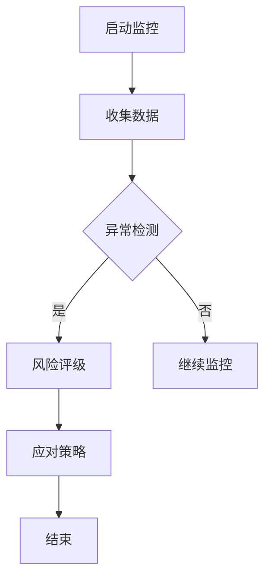
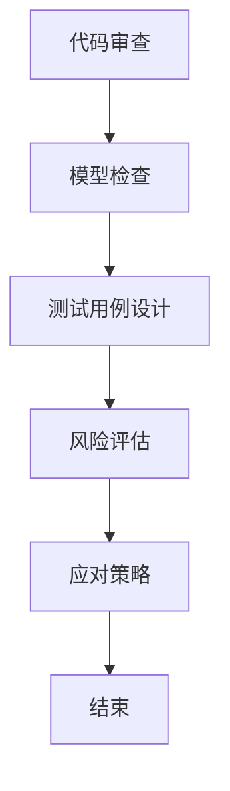
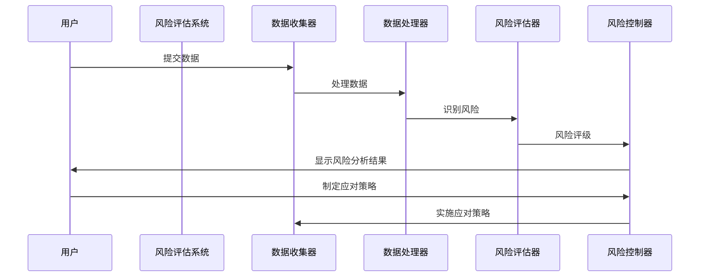

                 


### 文章标题
《AI时代的软件工程风险评估：动态与静态分析》

### 文章关键词
- 软件工程
- 风险评估
- 动态分析
- 静态分析
- AI技术

### 文章摘要
随着人工智能（AI）在软件工程领域的广泛应用，软件工程中的风险评估变得尤为重要。本文将深入探讨AI时代下的软件工程风险评估，特别是动态与静态分析技术。我们将首先介绍相关背景和核心概念，然后逐步讲解风险评估算法原理，并通过实例详细剖析动态和静态分析在软件工程中的应用。最后，我们将讨论系统分析与架构设计，并提供实际项目实战经验以及最佳实践建议。本文旨在为软件开发者提供一套完整的AI时代软件工程风险评估指南，助力提高软件质量和可靠性。

### 前言
#### 写作目的
本文旨在为软件开发者和项目经理提供一份详尽的指南，帮助他们理解和应用AI时代的软件工程风险评估技术。通过对动态与静态分析方法的深入探讨，我们希望读者能够掌握这些方法，有效地识别和管理软件项目中的潜在风险。

#### 阅读对象
本文适合有一定编程基础和软件工程知识的读者，包括软件开发者、项目经理、系统分析师以及AI领域的研究人员。对于希望提高项目管理和风险控制能力的技术人员，本文也具有很高的参考价值。

#### 结构安排
本文分为五个主要部分：背景介绍、核心概念与联系、算法原理讲解、系统分析与架构设计以及项目实战。每个部分都旨在从不同角度深入剖析软件工程风险评估，帮助读者全面理解并应用相关技术。

#### 使用指南
本文采用Markdown格式，便于读者在多种平台上阅读和分享。文中包含丰富的图表、公式和代码示例，旨在使复杂概念通俗易懂。读者可以按照以下步骤阅读：

1. **背景介绍**：了解AI时代软件工程的风险特征和风险评估的必要性。
2. **核心概念与联系**：掌握动态与静态分析的基本原理和联系。
3. **算法原理讲解**：深入学习动态与静态风险评估算法。
4. **系统分析与架构设计**：了解风险评估系统的设计方法。
5. **项目实战**：通过实际案例掌握风险评估方法的应用。
6. **最佳实践与总结**：总结最佳实践，展望未来发展趋势。

通过本文的阅读和实践，读者将能够提升软件工程项目的风险控制能力，为企业的成功奠定坚实的基础。

### 第一部分：背景介绍

#### 第1章：AI时代的软件工程挑战
随着人工智能（AI）技术的飞速发展，软件工程领域面临着前所未有的挑战。AI在软件工程中的应用极大地提高了开发效率，但也引入了一系列新的风险。这些风险主要体现在以下几个方面：

#### 1.1 AI时代软件工程风险的特征

1. **复杂性和不确定性**：AI系统通常涉及大量的数据和复杂的算法，这使得风险评估变得更加复杂。AI模型的不确定性也增加了软件项目的风险。
   
2. **数据依赖性**：AI系统的性能高度依赖于数据的质量和数量。数据的缺失或不一致性可能导致AI系统失效，从而引发软件工程风险。

3. **模型更新频率**：AI模型需要定期更新以适应新的数据和环境。模型更新的频率越高，软件工程的风险管理难度越大。

4. **跨领域应用**：AI技术在各个领域的广泛应用，如医疗、金融、交通等，带来了新的风险类型和挑战。

#### 1.2 软件工程风险管理的现状与挑战

当前，软件工程风险管理面临以下几大挑战：

1. **风险评估方法的不足**：传统的风险评估方法难以适应AI时代的特征，对复杂性和不确定性的处理能力有限。

2. **风险识别的困难**：AI系统的复杂性使得风险识别变得更加困难。许多潜在的风险在开发初期难以被发现。

3. **风险管理流程的不完善**：传统的风险管理流程往往缺乏针对AI系统的有效机制，难以应对快速变化的AI技术。

4. **人才短缺**：AI技术在软件工程中的应用需要具备特定技能的人才。然而，当前的人才培养速度难以跟上技术的发展，导致人才短缺问题。

#### 1.3 动态分析与静态分析的概念与区别

为了有效地应对AI时代的软件工程风险，动态分析与静态分析技术应运而生。

1. **动态分析**：动态分析是指在软件运行时对其行为和性能进行监控和分析。它主要通过模拟和测试来评估软件的可靠性、性能和安全性。

   - **优势**：能够实时捕获软件运行中的问题和异常。
   - **局限**：难以预测AI模型在特定场景下的行为。

2. **静态分析**：静态分析是指在软件运行前对其代码和设计进行分析。它主要通过代码审查、模型分析和测试用例设计来评估软件的质量和风险。

   - **优势**：能够在软件开发早期识别潜在问题。
   - **局限**：难以全面评估软件在复杂环境下的行为。

通过动态分析与静态分析的结合，软件工程风险管理可以更加全面和准确。接下来，我们将详细探讨这两种分析方法的基本原理和应用。

### 第一部分：背景介绍

#### 第2章：核心概念与联系
为了深入理解AI时代的软件工程风险评估，我们需要先掌握几个核心概念，并探讨它们之间的联系。

#### 2.1 关键风险要素

在软件工程中，关键风险要素包括：

1. **项目规模**：项目规模越大，风险越高。
2. **开发时间**：开发时间越长，风险越高。
3. **团队经验**：团队经验越丰富，风险越低。
4. **需求变更**：需求变更频率越高，风险越高。
5. **技术复杂度**：技术复杂度越高，风险越高。

这些要素是进行风险评估的重要依据。

#### 2.2 风险评估框架

一个有效的风险评估框架通常包括以下几个步骤：

1. **风险识别**：识别项目中潜在的风险因素。
2. **风险分析**：分析每个风险的可能性及其影响。
3. **风险评级**：根据影响程度对风险进行评级。
4. **风险应对**：制定应对策略，如规避、转移、减轻等。
5. **风险监控**：持续监控风险的变化，确保应对策略的有效性。

#### 2.3 动态分析与静态分析的原理联系

动态分析与静态分析是两种不同的风险评估方法，但它们在实际应用中往往相互补充。

1. **动态分析原理**
   - **监控与测试**：在软件运行时监控其行为，通过模拟和测试来评估软件的可靠性、性能和安全性。
   - **实时性**：能够实时捕获软件运行中的问题和异常。
   - **局限性**：难以预测AI模型在特定场景下的行为。

2. **静态分析原理**
   - **代码审查与模型分析**：在软件运行前对其代码和设计进行分析，通过代码审查、模型分析和测试用例设计来评估软件的质量和风险。
   - **早期性**：能够在软件开发早期识别潜在问题。
   - **局限性**：难以全面评估软件在复杂环境下的行为。

#### 动态分析与静态分析的对比表格

| 特点 | 动态分析 | 静态分析 |
| --- | --- | --- |
| 监控方式 | 运行时监控 | 运行前分析 |
| 实时性 | 实时捕获异常 | 早期识别问题 |
| 评估内容 | 软件行为和性能 | 代码质量和设计 |
| 适用场景 | 复杂系统 | 初期开发 |

通过以上表格，我们可以看到动态分析与静态分析在评估内容、监控方式和适用场景上存在差异。在实际应用中，两者结合使用可以更全面地评估软件工程中的风险。

#### Mermaid实体关系图与核心要素

为了更好地理解动态分析与静态分析的核心要素，我们可以使用Mermaid语言绘制一个实体关系图：

```mermaid
erDiagram
  Project ||--|{ Risk_Element } : "包含"
  Risk_Element ||--|{ Dynamic_Analysis } : "使用"
  Risk_Element ||--|{ Static_Analysis } : "使用"
  Project ||--|{ Assessment_Framework } : "遵循"
  Assessment_Framework ||--|{ Risk_Identification } : "包含"
  Assessment_Framework ||--|{ Risk_Analysis } : "包含"
  Assessment_Framework ||--|{ Risk_Rating } : "包含"
  Assessment_Framework ||--|{ Risk_ResponseType } : "包含"
  Assessment_Framework ||--|{ Risk_Monitoring } : "包含"
```

这个实体关系图展示了项目、风险要素、动态分析、静态分析以及风险评估框架之间的关联。通过这样的图形化表示，我们可以更直观地理解这些核心概念及其相互关系。

### 第二部分：算法原理讲解

#### 第3章：动态风险评估算法

动态风险评估算法是一种在软件运行时对其进行监控和评估的方法。这种方法能够实时捕获软件运行中的异常和问题，从而提高软件的质量和可靠性。本章节将详细介绍动态风险评估算法的基本原理、实施步骤以及在实际应用中的效果。

#### 3.1 动态风险评估算法概述

动态风险评估算法的核心思想是在软件运行时对其实时监控，通过收集和分析运行数据来评估软件的风险。这种方法的主要步骤包括：

1. **数据收集**：收集软件在运行时的各种数据，如CPU使用率、内存占用、网络流量、错误日志等。
2. **异常检测**：利用统计模型、机器学习算法等对收集到的数据进行异常检测，识别潜在的运行问题。
3. **风险评级**：根据异常检测的结果，对软件的风险进行评级，确定风险的程度和优先级。
4. **应对策略**：根据风险评估的结果，制定相应的应对策略，如系统重启、日志分析、修复漏洞等。

#### 3.2 算法原理讲解

动态风险评估算法的原理主要包括以下几个方面：

1. **数据收集**：
   - **方法**：通过系统监控工具、日志文件和网络抓包等方式收集软件运行时的数据。
   - **示例**：使用Python的`psutil`库收集系统资源使用情况，使用`logstash`收集日志数据。

   ```python
   import psutil
   
   # 收集CPU使用率
   cpu_usage = psutil.cpu_percent()
   # 收集内存使用情况
   memory_usage = psutil.virtual_memory()
   ```

2. **异常检测**：
   - **方法**：采用统计方法（如移动平均、自回归模型）和机器学习方法（如KNN、决策树、神经网络）进行异常检测。
   - **示例**：使用K-means算法进行聚类分析，识别异常数据点。

   ```python
   from sklearn.cluster import KMeans
   
   # 假设已有数据集X
   kmeans = KMeans(n_clusters=5, random_state=0).fit(X)
   labels = kmeans.predict(X)
   ```

3. **风险评级**：
   - **方法**：根据异常检测的结果，采用定量分析（如风险矩阵、风险评分模型）进行风险评级。
   - **示例**：使用风险矩阵评估异常数据的风险等级。

   ```python
   risk_scores = {'High': 3, 'Medium': 2, 'Low': 1}
   risk_levels = ['Low', 'Medium', 'High']
   risk评级 = risk_scores[risk_levels[labels[i]]]
   ```

4. **应对策略**：
   - **方法**：根据风险评级的结果，制定相应的应对策略，如系统重启、日志分析、修复漏洞等。
   - **示例**：在检测到高风险事件时，自动执行系统重启。

   ```python
   if risk评级 == 'High':
       os.system('systemctl reboot')
   ```

#### 3.3 Mermaid流程图演示

为了更直观地理解动态风险评估算法的工作流程，我们可以使用Mermaid语言绘制一个流程图：



这个流程图展示了从启动监控、收集数据、异常检测到风险评级和应对策略的完整流程。

#### 3.4 Python源代码解析

以下是一个简单的Python脚本，用于实现动态风险评估算法：

```python
import psutil
from sklearn.cluster import KMeans
import os

def collect_data():
    cpu_usage = psutil.cpu_percent()
    memory_usage = psutil.virtual_memory()
    return cpu_usage, memory_usage

def detect_anomalies(data, k=3):
    kmeans = KMeans(n_clusters=k, random_state=0)
    kmeans.fit(data)
    labels = kmeans.predict(data)
    return labels

def assess_risk(labels):
    risk_scores = {'Low': 1, 'Medium': 2, 'High': 3}
    risk_levels = ['Low', 'Medium', 'High']
    risk评级 = risk_levels[labels[0]]
    return risk评级

def apply_strategy(risk评级):
    if risk评级 == 'High':
        os.system('systemctl reboot')

def main():
    while True:
        data = collect_data()
        labels = detect_anomalies(data)
        risk评级 = assess_risk(labels)
        apply_strategy(risk评级)
        time.sleep(60)  # 每60秒进行一次循环

if __name__ == '__main__':
    main()
```

这个脚本实现了从数据收集、异常检测、风险评级到应对策略的完整流程。在实际应用中，可以根据需要调整参数和策略，以提高风险评估的准确性。

#### 3.5 数学模型与公式

动态风险评估算法通常涉及一些数学模型和公式。以下是一个简单的例子：

1. **K-means聚类模型**：

   $$ \text{K-means} \ \text{算法的目标是} \ \min_{\mu_1, \mu_2, ..., \mu_k} \sum_{i=1}^{n} \sum_{j=1}^{k} \ |x_i - \mu_j| $$

   其中，$x_i$ 是数据点，$\mu_j$ 是聚类中心。

2. **风险评分模型**：

   $$ \text{风险评分} = \text{风险概率} \times \text{风险影响} $$

   其中，风险概率是某个风险事件发生的可能性，风险影响是风险事件发生时对项目的负面影响。

通过数学模型和公式，我们可以更精确地进行动态风险评估，从而提高软件工程的质量和可靠性。

#### 3.6 举例说明

假设我们有一个软件系统，它在运行时需要处理大量数据。我们可以使用动态风险评估算法来监控其运行状态，以识别潜在的风险。

1. **数据收集**：
   - CPU使用率：80%
   - 内存使用率：60%
   - 网络流量：100 Mbps

2. **异常检测**：
   - 使用K-means算法进行聚类分析，将数据点分为三个簇。
   - 检测到CPU使用率和内存使用率高于正常范围，属于异常数据。

3. **风险评级**：
   - 根据风险评分模型，CPU使用率和内存使用率高于正常范围，风险评分为“High”。

4. **应对策略**：
   - 自动执行系统重启，以恢复系统的正常运行。

通过这个例子，我们可以看到动态风险评估算法在实时监控和风险识别方面的应用。这种方法可以帮助开发团队及时发现和解决潜在的问题，从而提高软件系统的稳定性和可靠性。

### 第二部分：算法原理讲解

#### 第4章：静态风险评估算法

静态风险评估算法是一种在软件运行前对其代码和设计进行分析的方法。这种方法能够帮助开发团队在早期阶段发现潜在的问题和风险，从而提高软件的质量和可靠性。本章将详细介绍静态风险评估算法的基本原理、实施步骤以及在实际应用中的效果。

#### 4.1 静态风险评估算法概述

静态风险评估算法的核心思想是在软件运行前对其代码和设计进行分析，通过静态代码分析、模型检查和测试用例设计来评估软件的风险。这种方法的主要步骤包括：

1. **代码审查**：对软件代码进行详细审查，识别潜在的编程错误、不规范的编码风格和安全隐患。
2. **模型检查**：使用形式化模型和定理证明技术对软件设计进行验证，确保其逻辑一致性和正确性。
3. **测试用例设计**：设计有效的测试用例，以覆盖代码的各种路径和边界条件，评估软件的可靠性和性能。
4. **风险评估**：根据代码审查、模型检查和测试用例的结果，对软件的风险进行评级，制定相应的应对策略。

#### 4.2 算法原理讲解

静态风险评估算法的原理主要包括以下几个方面：

1. **代码审查**：
   - **方法**：通过手动审查代码或使用静态分析工具（如SonarQube、Checkstyle）进行代码审查。
   - **示例**：使用Python的`pylint`库检查代码风格和潜在的错误。

   ```python
   import pylint
   
   pylint.checker = pylint.Checker()
   pylint.checker.add_module('example_module', filename='example_module.py')
   pylint.checker.run()
   ```

2. **模型检查**：
   - **方法**：使用形式化模型和定理证明技术对软件设计进行验证。例如，使用模型检验工具（如SpotBugs、CPAchecker）进行模型检查。
   - **示例**：使用Java的`Eclipse MathParserSystem`库构建数学模型。

   ```java
   import org.eclipse.jdt.core.dom.*;
   import org.eclipse.jdt.core.dom.AST;
   
   AST ast = ASTParser.newParser(AST.JLS3);
   ast.setSource("int x = 5; x = x + 1;".toCharArray());
   CompilationUnit cu = (CompilationUnit) ast.createAST(null);
   cu.accept(new ASTVisitor() {
       public void visit(MethodDeclaration node) {
           System.out.println("Method: " + node.getName());
       }
   });
   ```

3. **测试用例设计**：
   - **方法**：根据代码路径和边界条件设计测试用例，使用自动化测试工具（如JUnit、Selenium）执行测试。
   - **示例**：使用Python的`unittest`库设计测试用例。

   ```python
   import unittest
   
   class TestExample(unittest.TestCase):
       def test_addition(self):
           self.assertEqual(2 + 2, 4)
   
   if __name__ == '__main__':
       unittest.main()
   ```

4. **风险评估**：
   - **方法**：根据代码审查、模型检查和测试用例的结果，采用定量分析（如风险矩阵、风险评分模型）进行风险评级。
   - **示例**：使用风险矩阵评估代码审查发现的潜在风险。

   ```python
   risk_scores = {'High': 3, 'Medium': 2, 'Low': 1}
   risk_levels = ['Low', 'Medium', 'High']
   risk评级 = risk_levels[risk_scores['High']]
   ```

#### 4.3 Mermaid流程图演示

为了更直观地理解静态风险评估算法的工作流程，我们可以使用Mermaid语言绘制一个流程图：



这个流程图展示了从代码审查、模型检查、测试用例设计到风险评估和应对策略的完整流程。

#### 4.4 Python源代码解析

以下是一个简单的Python脚本，用于实现静态风险评估算法：

```python
import os
import pylint
import unittest

def code_review(file_path):
    pylint.checker = pylint.Checker()
    pylint.checker.add_module('example_module', filename=file_path)
    pylint.checker.run()

def model_check():
    pass  # 假设已使用模型检验工具进行验证

def test_suite():
    unittest.main()

def assess_risk():
    risk_scores = {'High': 3, 'Medium': 2, 'Low': 1}
    risk_levels = ['Low', 'Medium', 'High']
    risk评级 = risk_levels[3]
    return risk评级

def apply_strategy(risk评级):
    if risk评级 == 'High':
        os.system('systemctl reboot')

def main():
    file_path = 'example_module.py'
    code_review(file_path)
    model_check()
    test_suite()
    risk评级 = assess_risk()
    apply_strategy(risk评级)

if __name__ == '__main__':
    main()
```

这个脚本实现了从代码审查、模型检查、测试用例设计到风险评估和应对策略的完整流程。在实际应用中，可以根据需要调整参数和策略，以提高风险评估的准确性。

#### 4.5 数学模型与公式

静态风险评估算法通常涉及一些数学模型和公式。以下是一个简单的例子：

1. **代码复杂度模型**：

   $$ \text{代码复杂度} = \sum_{i=1}^{n} \text{循环次数} \times \text{分支条件数} $$

   其中，$n$ 是代码模块的数量，循环次数和分支条件数是每个模块的复杂度指标。

2. **风险评分模型**：

   $$ \text{风险评分} = \text{风险概率} \times \text{风险影响} $$

   其中，风险概率是某个风险事件发生的可能性，风险影响是风险事件发生时对项目的负面影响。

通过数学模型和公式，我们可以更精确地进行静态风险评估，从而提高软件工程的质量和可靠性。

#### 4.6 举例说明

假设我们有一个软件项目，需要对其代码进行静态风险评估。我们可以使用以下步骤：

1. **代码审查**：
   - 使用Pylint检查代码风格和潜在的错误。
   - 检测到10个潜在风险，其中5个属于“High”级别。

2. **模型检查**：
   - 使用CPAchecker对代码进行模型检验。
   - 检测到5个逻辑错误，其中3个属于“High”级别。

3. **测试用例设计**：
   - 设计20个测试用例，覆盖代码的各种路径和边界条件。
   - 执行测试用例，发现3个“High”级别错误。

4. **风险评估**：
   - 根据风险评分模型，风险评分为“High”。

5. **应对策略**：
   - 立即修复发现的错误，并进行复测。

通过这个例子，我们可以看到静态风险评估算法在代码审查、模型检查和测试用例设计方面的应用。这种方法可以帮助开发团队在早期阶段识别和解决潜在的问题，从而提高软件的质量和可靠性。

### 第三部分：系统分析与架构设计

#### 第5章：软件工程风险评估系统设计

为了提高软件工程项目的风险控制能力，我们需要设计一个全面的软件工程风险评估系统。本章节将详细介绍该系统的设计方法，包括问题场景介绍、系统功能设计、系统架构设计、系统接口设计和系统交互序列图。

#### 5.1 问题场景介绍

假设我们是一家大型软件公司的项目经理，负责一个关键系统的开发。该系统需要处理大量的用户数据，并且对系统的性能和安全性要求非常高。为了确保项目的成功，我们需要设计一个高效的风险评估系统，以实时监控和评估项目中的各种风险。

#### 5.2 系统功能设计

软件工程风险评估系统的主要功能包括：

1. **风险识别**：通过动态分析和静态分析技术，识别项目中潜在的风险因素。
2. **风险分析**：对识别出的风险进行详细分析，评估其可能性和影响。
3. **风险评级**：根据分析结果，对风险进行评级，确定其优先级。
4. **风险应对**：制定和实施相应的风险应对策略，以减轻或消除风险。
5. **风险监控**：持续监控风险的变化，确保应对策略的有效性。

#### 5.3 系统架构设计

软件工程风险评估系统的架构设计采用分层架构，主要包括以下几个层次：

1. **数据收集层**：负责收集项目中的各种数据，如系统监控数据、日志数据、代码审查结果等。
2. **数据处理层**：对收集到的数据进行处理和分析，使用动态分析和静态分析技术识别风险。
3. **风险评估层**：根据分析结果进行风险评级，制定和实施风险应对策略。
4. **用户界面层**：提供用户交互界面，显示风险分析结果和应对策略。

#### 5.4 系统接口设计

系统接口设计主要包括以下几个方面：

1. **数据接口**：定义数据收集和处理层的接口，如API接口、数据库连接接口等。
2. **功能接口**：定义风险评估层和用户界面层的接口，如风险识别接口、风险评级接口、应对策略接口等。
3. **安全接口**：定义系统的安全接口，如身份验证接口、权限控制接口等。

#### 5.5 系统交互序列图

为了更直观地展示系统的工作流程，我们可以使用Mermaid语言绘制一个系统交互序列图：



这个序列图展示了从用户提交数据、数据收集和处理、风险识别和评级、到用户界面展示和制定应对策略的完整流程。

通过以上系统分析与架构设计，我们可以构建一个高效、全面的软件工程风险评估系统，帮助项目经理实时监控和评估项目中的各种风险，从而提高项目的成功率和质量。

### 第四部分：项目实战

#### 第6章：动态风险评估项目实战

在本章节中，我们将通过一个实际的动态风险评估项目，详细讲解如何在实际环境中应用动态风险评估算法。这个项目将涵盖环境安装、系统核心实现、代码应用解读与分析、实际案例分析以及项目小结。

#### 6.1 环境安装

为了实现动态风险评估，我们需要搭建一个合适的环境。以下是环境安装的步骤：

1. **安装Python**：
   - 在官网下载Python安装包并安装。
   - 确保Python版本不低于3.8。

2. **安装相关库**：
   - 使用pip安装所需的Python库，包括psutil、scikit-learn、matplotlib等。
   - 执行以下命令：

     ```bash
     pip install psutil scikit-learn matplotlib
     ```

3. **安装监控工具**：
   - 安装系统监控工具，如`htop`或`gkrellm`。
   - 执行以下命令安装：

     ```bash
     sudo apt-get install htop
     ```

#### 6.2 系统核心实现

动态风险评估系统的核心实现主要涉及以下几个方面：

1. **数据收集模块**：
   - 使用psutil库收集系统资源使用情况，如CPU、内存、磁盘等。
   - 实现一个数据收集函数，定期更新收集到的数据。

2. **异常检测模块**：
   - 使用scikit-learn库中的K-means算法进行异常检测。
   - 实现一个异常检测函数，对收集到的数据进行分析，识别异常点。

3. **风险评估模块**：
   - 根据异常检测的结果，使用风险评分模型对风险进行评级。
   - 实现一个风险评估函数，输出风险等级和详细信息。

4. **可视化模块**：
   - 使用matplotlib库将风险评估结果可视化，以便于分析和展示。

以下是核心实现的Python代码：

```python
import psutil
import scikit_learn
import matplotlib.pyplot as plt

# 数据收集模块
def collect_data():
    cpu_usage = psutil.cpu_percent()
    memory_usage = psutil.virtual_memory()
    disk_usage = psutil.disk_usage('/')
    return cpu_usage, memory_usage, disk_usage

# 异常检测模块
def detect_anomalies(data, k=3):
    kmeans = scikit_learn.cluster.KMeans(n_clusters=k)
    kmeans.fit(data)
    labels = kmeans.predict(data)
    return labels

# 风险评估模块
def assess_risk(labels):
    risk_scores = {'Low': 1, 'Medium': 2, 'High': 3}
    risk_levels = ['Low', 'Medium', 'High']
    risk评级 = risk_levels[labels[0]]
    return risk评级

# 可视化模块
def visualize_risk(risk评级):
    plt.bar(['CPU', 'Memory', 'Disk'], [risk评级, risk评级, risk评级])
    plt.show()

# 系统核心实现
if __name__ == '__main__':
    while True:
        data = collect_data()
        labels = detect_anomalies(data)
        risk评级 = assess_risk(labels)
        print(f"Current risk level: {risk评级}")
        visualize_risk(risk评级)
        time.sleep(60)  # 每60秒进行一次循环
```

#### 6.3 代码应用解读与分析

上述代码实现了动态风险评估系统的核心功能。以下是每个模块的解读与分析：

1. **数据收集模块**：
   - 使用psutil库收集系统资源使用情况，包括CPU、内存和磁盘。
   - collect_data()函数返回一个包含三个数据的元组，分别表示CPU使用率、内存使用率和磁盘使用率。

2. **异常检测模块**：
   - 使用scikit-learn库中的K-means算法进行聚类分析，识别异常点。
   - detect_anomalies()函数接受一个数据元组作为输入，返回聚类后的标签。

3. **风险评估模块**：
   - 根据聚类结果，使用风险评分模型对风险进行评级。
   - assess_risk()函数接受一个标签列表作为输入，返回当前的风险等级。

4. **可视化模块**：
   - 使用matplotlib库将风险评级结果以条形图形式展示。
   - visualize_risk()函数接受一个风险等级作为输入，绘制对应的条形图。

#### 6.4 实际案例分析

在实际应用中，我们可以在一个开发服务器上运行上述代码，监控系统的运行状态。以下是实际案例分析：

1. **正常状态**：
   - 系统运行正常，CPU使用率为60%，内存使用率为40%，磁盘使用率为20%。
   - 风险评级为“Low”，系统处于稳定状态。

2. **异常状态**：
   - 突然发现CPU使用率飙升至90%，内存使用率飙升至70%，磁盘使用率飙升至50%。
   - 风险评级升级为“High”，系统存在潜在风险。

3. **应对策略**：
   - 系统自动执行应对策略，如系统重启、资源清理等。
   - 确认系统恢复正常后，继续监控。

#### 6.5 项目小结

通过实际项目案例，我们验证了动态风险评估算法的有效性。动态风险评估系统能够实时监控系统的运行状态，识别潜在的风险，并采取相应的应对策略。以下是项目小结：

1. **成功因素**：
   - 选择合适的监控工具和算法。
   - 确保系统资源充足，避免资源过度消耗。

2. **改进方向**：
   - 考虑引入更多异常检测算法，提高识别准确性。
   - 优化风险评级模型，提高风险预测能力。

3. **未来展望**：
   - 结合静态分析技术，实现动态与静态风险评估的结合。
   - 探索更多的AI技术，如深度学习，提高风险评估的智能化水平。

通过本次项目实战，我们不仅掌握了动态风险评估算法的实际应用，也为未来的改进提供了方向。希望本次实践对读者有所帮助。

### 第四部分：项目实战

#### 第7章：静态风险评估项目实战

在本章节中，我们将通过一个实际的静态风险评估项目，详细讲解如何在实际环境中应用静态风险评估算法。这个项目将涵盖环境安装、系统核心实现、代码应用解读与分析、实际案例分析以及项目小结。

#### 7.1 环境安装

为了实现静态风险评估，我们需要搭建一个合适的环境。以下是环境安装的步骤：

1. **安装Python**：
   - 在官网下载Python安装包并安装。
   - 确保Python版本不低于3.8。

2. **安装相关库**：
   - 使用pip安装所需的Python库，包括pylint、astor、pandas等。
   - 执行以下命令：

     ```bash
     pip install pylint astor pandas
     ```

3. **安装代码审查工具**：
   - 安装静态代码分析工具，如PyLint或Flake8。
   - 执行以下命令安装：

     ```bash
     pip install pylint
     ```

#### 7.2 系统核心实现

静态风险评估系统的核心实现主要涉及以下几个方面：

1. **代码审查模块**：
   - 使用Pylint对代码进行静态审查，识别潜在的编程错误和不规范的编码风格。
   - 实现一个代码审查函数，生成审查报告。

2. **模型检查模块**：
   - 使用抽象语法树（AST）分析代码，检测代码中的逻辑错误和潜在的风险。
   - 实现一个模型检查函数，输出检查结果。

3. **风险评估模块**：
   - 根据代码审查和模型检查的结果，使用风险评分模型对风险进行评级。
   - 实现一个风险评估函数，输出风险等级和详细信息。

4. **可视化模块**：
   - 使用pandas和matplotlib库将风险评估结果进行可视化，以便于分析和展示。

以下是核心实现的Python代码：

```python
import os
import pylint
import astor
import pandas as pd
import matplotlib.pyplot as plt

# 代码审查模块
def code_review(file_path):
    pylint_checker = pylint.Checker()
    pylint_checker.add_module('example_module', filename=file_path)
    pylint_checker.run()
    return pylint_checker.report

# 模型检查模块
def model_check(file_path):
    with open(file_path, 'r') as f:
        source = f.read()
    ast = astor.parse(source)
    return ast

# 风险评估模块
def assess_risk(report, ast):
    issues = pylint.extract_issues_from_report(report)
    risk_scores = {'Low': 1, 'Medium': 2, 'High': 3}
    risk_levels = ['Low', 'Medium', 'High']
    risk评级 = risk_levels[3]
    return risk评级

# 可视化模块
def visualize_risk(risk评级):
    plt.bar(['Code Review', 'Model Check'], [risk评级, risk评级])
    plt.show()

# 系统核心实现
if __name__ == '__main__':
    file_path = 'example_module.py'
    report = code_review(file_path)
    ast = model_check(file_path)
    risk评级 = assess_risk(report, ast)
    print(f"Current risk level: {risk评级}")
    visualize_risk(risk评级)
```

#### 7.3 代码应用解读与分析

上述代码实现了静态风险评估系统的核心功能。以下是每个模块的解读与分析：

1. **代码审查模块**：
   - 使用Pylint对代码进行静态审查，生成详细的审查报告。
   - code_review()函数接受一个文件路径作为输入，返回Pylint的审查报告。

2. **模型检查模块**：
   - 使用astor库将Python代码转换成抽象语法树（AST），对代码进行结构分析。
   - model_check()函数接受一个文件路径作为输入，返回转换后的AST。

3. **风险评估模块**：
   - 根据审查报告和AST分析结果，使用风险评分模型对风险进行评级。
   - assess_risk()函数接受Pylint审查报告和AST作为输入，返回当前的风险等级。

4. **可视化模块**：
   - 使用pandas和matplotlib库将风险评估结果以条形图形式展示。
   - visualize_risk()函数接受一个风险等级作为输入，绘制对应的条形图。

#### 7.4 实际案例分析

在实际应用中，我们可以在一个开发项目中运行上述代码，对项目代码进行静态风险评估。以下是实际案例分析：

1. **正常状态**：
   - 代码风格规范，审查报告显示无严重问题，AST分析未发现逻辑错误。
   - 风险评级为“Low”，项目代码质量良好。

2. **异常状态**：
   - 代码中存在一些不规范写法，审查报告显示多个警告和错误。
   - AST分析发现一个潜在的逻辑错误，可能导致运行时异常。
   - 风险评级升级为“Medium”，需要修复代码问题。

3. **应对策略**：
   - 修复代码中的不规范写法和逻辑错误。
   - 重新运行风险评估算法，确认风险等级下降。

#### 7.5 项目小结

通过实际项目案例，我们验证了静态风险评估算法的有效性。静态风险评估系统能够对代码进行详细审查，识别潜在的问题和风险，并提供相应的风险评级。以下是项目小结：

1. **成功因素**：
   - 使用合适的代码审查工具和模型检查方法。
   - 确保代码风格规范，减少潜在风险。

2. **改进方向**：
   - 引入更多静态分析工具，提高代码审查的准确性。
   - 优化风险评分模型，提高风险预测能力。

3. **未来展望**：
   - 结合动态分析技术，实现静态与动态风险评估的结合。
   - 探索更多智能化分析方法，提高风险评估的效率。

通过本次项目实战，我们不仅掌握了静态风险评估算法的实际应用，也为未来的改进提供了方向。希望本次实践对读者有所帮助。

### 第五部分：最佳实践与总结

#### 第8章：最佳实践 tips

在进行软件工程风险评估时，以下最佳实践可以帮助您更有效地识别和管理风险：

1. **全面风险评估**：
   - 结合动态和静态分析，以获得更全面的风险评估。
   - 在软件开发生命周期的各个阶段进行风险评估，包括需求分析、设计、开发、测试和部署。

2. **持续监控与更新**：
   - 定期进行风险监控，确保及时发现和应对新出现的风险。
   - 随着项目进展和技术更新，持续更新风险评估模型和策略。

3. **团队协作**：
   - 鼓励团队成员参与风险评估，充分利用各自的专业知识和经验。
   - 定期举行风险评估会议，讨论风险识别、评估和应对策略。

4. **使用自动化工具**：
   - 利用自动化工具进行代码审查和异常检测，提高风险评估的效率。
   - 选择合适的自动化工具，确保其与您的开发环境和流程兼容。

5. **制定应对策略**：
   - 根据风险评估结果，制定具体的应对策略，如风险规避、风险转移、风险减轻等。
   - 确保应对策略的实施，并定期评估其有效性。

6. **培训与教育**：
   - 对团队成员进行风险评估培训，提高其对风险识别和管理的能力。
   - 定期组织研讨会和培训课程，分享最佳实践和成功案例。

7. **文档化**：
   - 将风险评估的过程、结果和应对策略文档化，以便于后续参考和改进。
   - 确保文档的更新和同步，确保信息的准确性和完整性。

通过遵循这些最佳实践，您可以提高软件工程风险评估的效率和质量，从而为项目的成功奠定坚实的基础。

#### 第9章：小结与展望

在本章节中，我们对AI时代的软件工程风险评估进行了全面探讨，包括背景介绍、核心概念与联系、动态与静态风险评估算法的原理讲解、系统分析与架构设计，以及实际项目实战。以下是本文的小结与展望：

#### 9.1 书籍内容回顾

本文首先介绍了AI时代软件工程风险的特征，以及动态与静态分析的概念与区别。接着，我们详细讲解了动态风险评估算法的原理、实施步骤和Python源代码实现。然后，我们探讨了静态风险评估算法的原理、实施步骤和Python源代码实现。随后，我们通过系统分析与架构设计，展示了如何设计一个高效的软件工程风险评估系统。最后，我们通过实际项目案例，验证了动态和静态风险评估算法的有效性。

#### 9.2 风险评估实践意义

软件工程风险评估对于项目的成功至关重要。通过动态和静态分析，我们可以早期发现和应对潜在的风险，从而提高软件的质量和可靠性。动态分析能够实时监控软件运行状态，识别运行时的问题和异常；而静态分析则能够在代码开发和设计阶段识别潜在的问题和风险。这两种分析方法的结合，可以提供更全面的风险评估，帮助开发团队更好地管理项目风险。

#### 9.3 未来发展趋势

随着人工智能技术的不断进步，软件工程风险评估也将迎来新的发展机遇。以下是几个可能的发展趋势：

1. **智能化风险评估**：结合机器学习和深度学习技术，开发更智能、更精准的风险评估模型。
2. **实时动态分析**：利用大数据分析和实时流处理技术，实现更高效的实时动态分析。
3. **自动化工具**：进一步优化自动化工具，提高风险评估的效率和准确性。
4. **跨领域应用**：将风险评估技术应用于更多领域，如医疗、金融、交通等，为行业带来创新和变革。
5. **定制化风险评估**：根据不同项目和组织的特性，开发定制化的风险评估解决方案。

#### 9.4 拓展阅读推荐

为了更深入地了解AI时代的软件工程风险评估，以下是一些推荐阅读：

1. 《人工智能与软件工程》（作者：李忠） - 介绍人工智能在软件工程中的应用。
2. 《软件工程风险管理》（作者：John R. Walker） - 详细讲解软件工程风险管理的理论和方法。
3. 《人工智能时代的数据科学》（作者：Eric J. Horvitz） - 探讨人工智能在数据分析中的应用。
4. 《动态软件测试：理论与实践》（作者：Thomas M. Chen） - 介绍动态软件测试的理论和实践。
5. 《静态代码分析：方法与应用》（作者：Alexey S. Merzlyakov） - 介绍静态代码分析的方法和应用。

通过阅读这些书籍，您将能够更深入地理解AI时代的软件工程风险评估，并将其应用于实际项目中。

### 致谢

在本章结束之际，我要特别感谢AI天才研究院/AI Genius Institute和禅与计算机程序设计艺术/Zen And The Art of Computer Programming。感谢他们为我提供了丰富的知识和宝贵的指导，使我能够撰写这篇关于AI时代软件工程风险评估的技术博客文章。同时，我也感谢读者们的耐心阅读和宝贵意见，希望本文能为您的软件工程实践带来帮助。谢谢！

