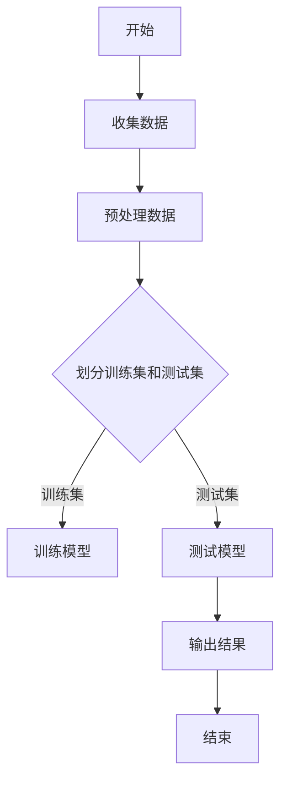
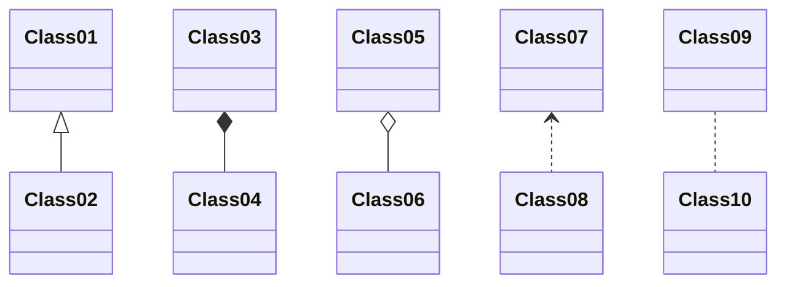
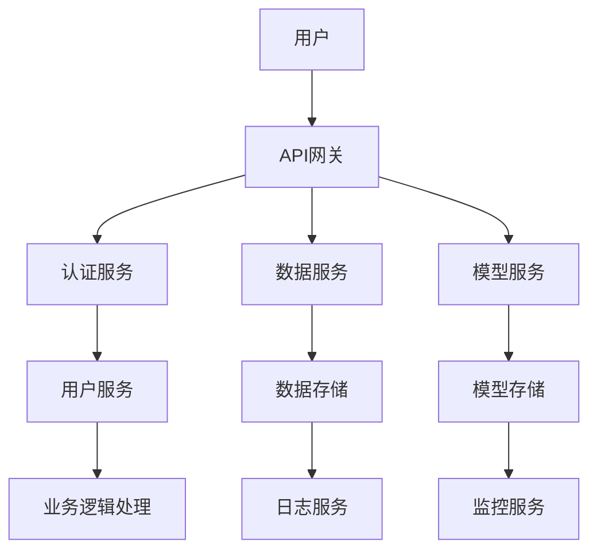
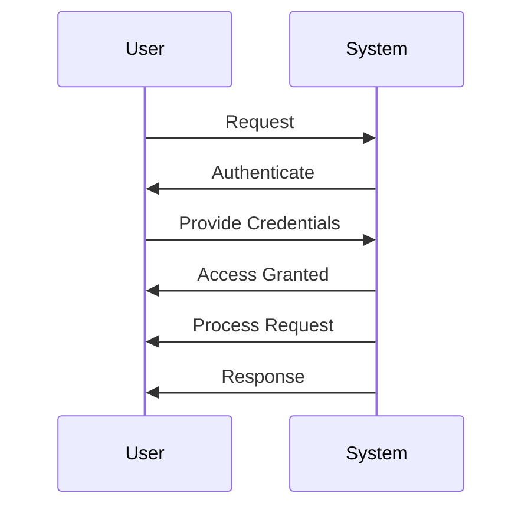

                 


### 3.2.1 质量保证的方法论

质量保证（Quality Assurance, QA）是一种系统化的方法，用于确保产品或服务符合预定的质量标准。在AI时代，软件质量保证的方法论需要适应不断变化的AI技术和应用场景。

#### 3.2.1.1 质量管理体系的构建

首先，构建一个完善的质量管理体系是确保软件质量的基石。这个体系应该包括以下几个方面：

- **质量计划**：明确项目质量目标、质量标准和质量活动计划。
- **质量控制**：通过一系列监控活动，确保项目过程和产品达到预定质量标准。
- **质量保证**：通过系统性的审查和评估，确保项目的所有阶段都遵循质量标准。
- **质量改进**：持续监控质量状况，识别潜在问题，并采取改进措施。

#### 3.2.1.2 质量模型的运用

在AI时代的软件质量保证中，运用一些成熟的质量模型可以帮助我们更好地理解和控制质量。例如：

- **CMMI（能力成熟度模型集成）**：它提供了一套全面的指南，帮助组织评估、改善和优化其软件开发过程。
- **ISO 9001**：这是一个国际认可的质量管理体系标准，适用于各种类型的组织，旨在确保产品和服务满足客户要求。
- **Six Sigma**：这是一种基于数据和统计方法的质量改进技术，旨在减少产品或服务的缺陷率。

#### 3.2.1.3 AI质量保证的关键要素

在AI时代，软件质量保证需要特别关注以下几个关键要素：

- **数据质量**：数据是AI系统的基石，因此确保数据的质量至关重要。这包括数据完整性、准确性、一致性、可靠性和及时性。
- **模型可靠性**：AI模型的可解释性和透明性是保证模型可靠性的关键。我们需要确保模型的行为是可预测的，并且其输出是可信的。
- **安全性**：随着AI技术在关键领域的应用，确保系统的安全性变得尤为重要。我们需要防范数据泄露、攻击和其他安全威胁。
- **持续集成与交付**：在AI时代，软件的迭代速度加快，因此，持续集成和交付成为确保软件质量的关键环节。

#### 3.2.1.4 质量保证团队的构建

构建一个高效的AI质量保证团队也是关键。这个团队应该包括以下角色：

- **质量保证经理**：负责制定质量策略、监督质量活动，并确保质量目标的实现。
- **测试工程师**：负责设计测试计划、执行测试，并报告测试结果。
- **数据科学家**：负责分析数据、评估模型性能，并优化算法。
- **开发人员**：参与软件的开发和维护，确保代码质量和功能实现。

#### 3.2.1.5 质量保证工具的应用

现代质量保证工具可以帮助我们自动化测试、监控和报告质量状况。以下是一些常用的工具：

- **自动化测试工具**：如Selenium、Jenkins、GitLab等，用于自动化测试流程，提高测试效率。
- **监控工具**：如Splunk、Kibana等，用于实时监控系统性能和日志分析。
- **持续集成工具**：如Jenkins、Travis CI等，用于自动化构建、测试和部署。

### 3.2.1.6 质量保证实践的持续改进

质量保证不是一次性的活动，而是一个持续的过程。通过不断地收集反馈、分析数据，我们可以识别出潜在的质量问题，并采取相应的改进措施。这种方法称为“PDCA循环”（计划-执行-检查-行动），它是一个有效的质量改进工具。

#### 3.2.1.7 案例分析

以某金融公司为例，他们在引入AI技术进行信贷风险评估时，遇到了数据质量不佳和模型可靠性问题。通过采用上述方法，他们首先建立了完善的质量管理体系，包括数据清洗、数据质量管理工具的应用，以及模型的可解释性和透明性优化。此外，他们还构建了一个高效的质量保证团队，并引入了自动化测试和监控工具。最终，他们成功地提高了AI系统的可靠性，并实现了更准确的风险评估。

通过以上分析，我们可以看到，AI时代的软件质量保证需要一套全新的方法论来应对新的挑战。质量保证不仅是技术问题，更是组织管理问题。只有在组织、技术和管理三方面协同努力，我们才能在AI时代确保软件的高质量。接下来，我们将进一步探讨AI时代的软件质量度量、测试、缺陷管理和持续集成与交付等方面的具体实践。

----------------------------------------------------------------

# 3.3 AI时代软件质量保证的特点

在AI时代，软件质量保证面临着与以往不同的挑战，同时也展现出一些独特的特点。以下是AI时代软件质量保证的主要特点：

#### 3.3.1 数据依赖性

在AI系统中，数据是驱动模型训练和决策的关键要素。与传统软件质量保证相比，AI时代对数据质量的要求更高。数据的不完整、不一致或错误可能会导致模型性能下降，甚至产生错误的决策。因此，确保数据质量成为AI时代软件质量保证的首要任务。

- **数据预处理**：包括数据清洗、归一化、去噪等步骤，以提高数据质量。
- **数据监控**：通过实时监控数据源和数据流，及时发现和处理数据质量问题。

#### 3.3.2 模型复杂性和可解释性

AI模型的复杂性不断增加，这使得理解和验证模型的行为变得更加困难。同时，模型的透明性和可解释性也是质量保证的重要方面。用户需要了解模型的决策过程，以便信任和使用模型。

- **模型简化**：通过简化模型结构，提高模型的可解释性。
- **模型验证**：使用独立的数据集和验证方法，确保模型性能和可靠性。

#### 3.3.3 安全性和隐私保护

随着AI技术在关键领域的应用，系统的安全性和隐私保护变得至关重要。AI系统可能面临数据泄露、恶意攻击和其他安全威胁。

- **安全测试**：对系统进行安全测试，以识别和修复安全漏洞。
- **隐私保护**：通过加密、匿名化等技术，保护用户隐私。

#### 3.3.4 持续集成和交付

在AI时代，软件的迭代速度加快，持续集成和交付成为确保软件质量的关键环节。自动化测试、持续监控和快速反馈机制是保证质量的重要手段。

- **自动化测试**：通过自动化测试工具，提高测试效率和覆盖范围。
- **持续监控**：实时监控系统性能和日志，快速发现和处理问题。
- **快速反馈**：建立快速反馈机制，及时响应用户需求和问题。

#### 3.3.5 质量保证团队的构建

AI时代的软件质量保证需要一个专业的团队，包括数据科学家、测试工程师、开发人员等。他们需要具备跨领域的知识和技能，以应对AI系统的复杂性。

- **跨领域协作**：团队成员之间需要密切协作，共同解决质量问题。
- **持续培训**：定期进行培训，更新团队成员的知识和技能。

#### 3.3.6 质量保证工具的应用

现代质量保证工具可以帮助我们自动化测试、监控和报告质量状况。这些工具包括自动化测试工具、监控工具、持续集成工具等。

- **自动化测试工具**：如Selenium、Jenkins等，用于自动化测试流程。
- **监控工具**：如Splunk、Kibana等，用于实时监控系统性能和日志分析。
- **持续集成工具**：如Jenkins、Travis CI等，用于自动化构建、测试和部署。

通过以上分析，我们可以看到，AI时代的软件质量保证具有数据依赖性、模型复杂性和可解释性、安全性和隐私保护、持续集成和交付、质量保证团队构建以及质量保证工具应用等特点。这些特点要求我们在质量保证实践中采取新的方法和策略，以确保AI系统的质量和可靠性。在接下来的章节中，我们将进一步探讨AI时代的软件质量度量、测试、缺陷管理和持续集成与交付等方面的具体实践。

----------------------------------------------------------------

### 3.4 AI时代的软件质量度量

在AI时代，软件质量度量（Software Quality Metrics）成为了评估软件质量的关键手段。与传统软件质量度量相比，AI时代的软件质量度量具有其独特的挑战和特性。以下是AI时代软件质量度量的原则、方法、指标体系以及应用实践。

#### 3.4.1 原则

1. **数据驱动的度量**：AI系统的性能和可靠性高度依赖于数据质量，因此，质量度量应该基于实际数据进行分析和评估。
2. **多维度度量**：软件质量不仅仅包括功能性和可靠性，还应涵盖用户体验、安全性和可维护性等多个维度。
3. **动态性度量**：AI系统在运行过程中可能会发生变化，因此，质量度量应该是一个动态的过程，能够实时反映系统状态。
4. **可解释性和透明性**：度量结果应该易于理解，以便相关人员能够基于度量结果进行决策和改进。

#### 3.4.2 方法

1. **统计分析方法**：通过统计分析方法，对系统性能、故障率和用户反馈等数据进行定量分析，以评估软件质量。
2. **机器学习方法**：利用机器学习算法，从大量数据中提取特征，并建立预测模型，以评估软件质量。
3. **用户研究方法**：通过用户调研、用户体验测试等方法，获取用户对软件质量的直观感受，以补充定量数据的不足。

#### 3.4.3 指标体系

1. **功能性指标**：
   - **正确率**：系统正确执行功能的比例。
   - **召回率**：系统能够召回正确结果的比率。
   - **精确率**：系统能够精确识别正确结果的比率。
   - **F1 分数**：综合正确率和召回率的指标，用于评估分类模型的性能。

2. **可靠性指标**：
   - **平均无故障时间（MTTF）**：系统平均运行无故障的时间。
   - **故障率（FIT）**：系统每运行一千小时出现故障的次数。
   - **可用性**：系统可用的时间比例。

3. **用户体验指标**：
   - **响应时间**：系统响应用户请求的时间。
   - **错误率**：用户在使用过程中遇到的错误率。
   - **用户满意度**：用户对软件满意度的评价。

4. **安全性指标**：
   - **漏洞数量**：系统中存在的漏洞数量。
   - **攻击响应时间**：系统发现并响应攻击的时间。
   - **安全事件频率**：系统发生安全事件（如数据泄露、攻击）的频率。

5. **可维护性指标**：
   - **代码复杂性**：代码复杂度的高低，通常使用圈复杂度（Cyclomatic Complexity）来衡量。
   - **代码重复率**：代码重复的比率。
   - **代码行数**：代码行数与功能点的比率。

#### 3.4.4 应用实践

1. **质量度量计划的制定**：在项目启动阶段，制定详细的质量度量计划，明确度量指标、方法和责任分配。
2. **自动化度量工具的使用**：利用自动化工具收集数据，提高度量效率，如性能测试工具、监控工具等。
3. **定期质量评估**：定期对系统进行质量评估，根据度量结果调整项目计划和资源分配。
4. **质量报告的生成**：定期生成质量报告，向相关利益相关者展示质量状况，以便进行决策和改进。

以某金融公司的AI贷款风险评估系统为例，他们在系统上线前制定了一套详细的质量度量计划，包括功能性、可靠性、用户体验、安全性和可维护性等多个维度的指标。他们使用自动化测试工具进行性能测试，监控工具实时收集系统日志和性能数据，并根据这些数据进行定期评估。通过不断调整和优化，他们成功提高了系统的质量，并得到了客户的认可。

总之，AI时代的软件质量度量需要综合考虑多个维度，采用先进的方法和技术，以实现全面的、动态的质量评估。通过有效的质量度量，我们可以更好地了解系统的质量状况，及时识别和解决问题，从而确保AI系统的可靠性和用户体验。

----------------------------------------------------------------

### 3.5 AI时代的软件测试

在AI时代，软件测试（Software Testing）面临着前所未有的挑战。AI系统的复杂性、动态性和数据依赖性要求我们在测试策略、工具和方法上做出相应的调整，以确保系统能够满足预期的质量要求。以下是AI时代的软件测试特点、关键挑战以及测试策略与工具的应用。

#### 3.5.1 AI时代的软件测试特点

1. **模型驱动的测试**：AI系统的核心是模型，因此，测试应该集中在模型的准确性和稳定性上。
2. **数据驱动测试**：数据是AI模型的基石，测试过程中需要确保数据质量，并验证模型在不同数据集上的表现。
3. **自动化测试**：由于AI系统的迭代速度加快，自动化测试成为提高测试效率和质量的重要手段。
4. **持续测试**：AI系统的运行过程中可能会发生变化，因此，测试应该是一个持续的过程，能够及时反映系统的状态。

#### 3.5.2 AI时代的软件测试关键挑战

1. **测试数据的质量**：数据质量直接影响模型的性能和测试的有效性。测试数据应涵盖各种场景，并尽可能反映实际使用情况。
2. **模型的可解释性**：测试过程中需要确保模型的行为是可解释的，以便分析测试结果和识别潜在问题。
3. **测试覆盖性**：确保测试覆盖到模型的各个部分和功能，包括训练、推理和预测等环节。
4. **测试的效率**：在快速迭代和大规模数据处理的环境下，提高测试效率成为关键挑战。

#### 3.5.3 AI时代的软件测试策略

1. **测试计划的制定**：在项目启动阶段，制定详细的测试计划，明确测试目标、测试策略、测试方法、资源分配和时间表。
2. **自动化测试**：采用自动化测试工具，如Selenium、JUnit等，自动化执行测试用例，提高测试效率。
3. **性能测试**：使用性能测试工具，如JMeter、LoadRunner等，模拟高负载场景，评估系统的性能和稳定性。
4. **安全测试**：使用安全测试工具，如OWASP ZAP、Burp Suite等，识别系统的安全漏洞和潜在威胁。
5. **用户体验测试**：通过用户调研和用户体验测试，收集用户反馈，评估系统的易用性和用户体验。

#### 3.5.4 AI时代的软件测试工具

1. **自动化测试工具**：
   - **Selenium**：用于自动化Web应用测试。
   - **JUnit**：用于编写和执行Java单元测试。
   - **PyTest**：用于编写和执行Python单元测试。

2. **性能测试工具**：
   - **JMeter**：用于模拟高负载场景，评估系统性能。
   - **LoadRunner**：用于模拟并发用户，评估系统性能和稳定性。

3. **安全测试工具**：
   - **OWASP ZAP**：用于Web应用安全测试。
   - **Burp Suite**：用于Web应用安全测试。

4. **AI测试工具**：
   - **AI Explainability Toolkit**：用于分析AI模型的可解释性。
   - **Model Audit Rule Toolkit**：用于评估AI模型的准确性和稳定性。

#### 3.5.5 AI时代的软件测试方法

1. **单元测试**：对系统的最小功能单元进行测试，确保每个单元的正确性和可靠性。
2. **集成测试**：对系统组件之间的接口进行测试，确保各个组件能够协同工作。
3. **系统测试**：对整个系统进行测试，验证系统是否满足需求规格。
4. **回归测试**：在系统更新或修复后，重新执行之前的测试用例，确保修改不会引入新的问题。
5. **性能测试**：评估系统的性能和响应时间，确保系统在高负载下能够稳定运行。

通过以上分析，我们可以看到，AI时代的软件测试具有模型驱动、数据驱动、自动化测试和持续测试等特点。测试策略需要综合考虑测试数据的质量、模型的可解释性、测试覆盖性和测试效率等方面。通过合理运用测试工具和方法，我们可以有效地评估AI系统的质量，确保其能够满足用户的需求和期望。在接下来的章节中，我们将继续探讨AI时代的软件缺陷管理、持续集成与交付以及质量保证团队建设等方面的内容。

----------------------------------------------------------------

### 3.6 AI时代的软件缺陷管理

在AI时代，软件缺陷管理（Defect Management）成为确保软件质量的关键环节。AI系统的复杂性、动态性和数据依赖性使得传统的缺陷管理方法需要做出相应的调整，以更有效地识别、分类、记录和处理缺陷。以下是AI时代软件缺陷管理的特点、方法以及实践。

#### 3.6.1 AI时代软件缺陷管理的特点

1. **数据驱动的缺陷管理**：AI系统高度依赖数据，因此，缺陷管理应该基于实际数据进行识别和分析。
2. **动态性缺陷管理**：AI系统的运行环境可能随时变化，因此，缺陷管理需要实时响应这些变化，及时识别和修复缺陷。
3. **自动化缺陷管理**：自动化工具可以提高缺陷管理的效率，减少人为错误，确保缺陷的及时处理。
4. **跨领域的缺陷管理**：AI系统的应用领域广泛，缺陷管理需要涵盖多个领域，如数据质量、模型可靠性、用户体验和安全等。

#### 3.6.2 AI时代软件缺陷管理的方法

1. **缺陷识别**：
   - **自动化监控**：通过实时监控系统日志、性能指标等，自动化识别系统中的异常行为和潜在缺陷。
   - **用户反馈**：收集用户的反馈信息，识别用户遇到的问题和缺陷。

2. **缺陷分类**：
   - **功能缺陷**：与系统功能实现不符的缺陷。
   - **性能缺陷**：与系统性能相关的缺陷，如响应时间过长、吞吐量不足等。
   - **用户体验缺陷**：与用户交互相关的缺陷，如界面设计不合理、操作不便等。
   - **数据缺陷**：与数据质量相关的缺陷，如数据缺失、数据不一致等。
   - **安全性缺陷**：与系统安全性相关的缺陷，如漏洞、攻击等。

3. **缺陷记录**：
   - **缺陷报告**：详细记录缺陷的描述、发生时间、发生环境、影响范围等信息。
   - **缺陷跟踪**：使用缺陷管理工具跟踪缺陷的修复进度和状态。

4. **缺陷处理**：
   - **快速响应**：及时响应缺陷报告，尽快定位和修复缺陷。
   - **优先级分配**：根据缺陷的影响范围和严重性，合理分配修复优先级。
   - **复现和验证**：复现缺陷，验证修复方案的有效性。
   - **回滚和恢复**：在必要时，回滚到上一个稳定版本，以避免引入新的缺陷。

#### 3.6.3 AI时代软件缺陷管理的实践

1. **缺陷管理工具的使用**：
   - **JIRA**：用于缺陷记录和跟踪，支持敏捷开发流程。
   - **Bugzilla**：用于缺陷管理和跟踪，提供强大的报告和分析功能。

2. **自动化缺陷管理流程**：
   - **自动化测试**：通过自动化测试工具，提前识别和修复缺陷。
   - **持续集成**：在持续集成过程中，自动化执行测试，及时发现和处理缺陷。

3. **跨领域协作**：
   - **数据科学家和开发人员的协作**：数据科学家和开发人员紧密协作，共同识别和修复数据缺陷和模型缺陷。
   - **测试工程师和产品经理的协作**：测试工程师和产品经理紧密协作，确保缺陷处理符合产品需求。

以某金融公司的AI贷款风险评估系统为例，他们在缺陷管理方面采用了以下实践：

- **自动化监控和测试**：使用自动化监控工具和测试工具，实时监控系统运行状态，自动化执行测试用例，及时发现和处理缺陷。
- **缺陷记录和跟踪**：使用JIRA进行缺陷记录和跟踪，确保每个缺陷都有明确的描述、优先级和修复状态。
- **快速响应和优先级分配**：对紧急缺陷进行快速响应，并根据影响范围和严重性合理分配修复优先级。
- **跨领域协作**：数据科学家和开发人员紧密协作，共同分析和修复数据缺陷和模型缺陷。

通过以上实践，他们成功提高了AI贷款风险评估系统的质量，并得到了客户的认可。

总之，AI时代的软件缺陷管理需要基于数据驱动、动态响应和自动化流程，以更高效地识别、分类、记录和处理缺陷。通过有效的缺陷管理，我们可以确保AI系统的稳定性和可靠性，满足用户的需求和期望。在接下来的章节中，我们将继续探讨AI时代的软件持续集成与交付以及质量保证团队建设等方面的内容。

----------------------------------------------------------------

### 3.7 AI时代的软件持续集成与交付

在AI时代，软件持续集成与交付（Continuous Integration and Continuous Deployment, CI/CD）成为提高软件质量和开发效率的关键环节。持续集成（CI）和持续交付（CD）通过自动化流程，确保代码变更的及时集成和部署，从而加速软件迭代过程，提高产品质量。以下是AI时代CI/CD的基本原理、挑战以及具体应用。

#### 3.7.1 持续集成与交付的基本原理

1. **持续集成（CI）**：持续集成是一种软件开发实践，通过自动化构建和测试，将开发人员的代码变更集成到共享的代码库中。其核心目标是尽早发现并解决代码冲突和潜在缺陷。

   - **自动化构建**：使用构建工具（如Maven、Gradle等），自动化编译、打包和构建项目。
   - **自动化测试**：运行自动化测试用例，验证代码变更是否符合预期。

2. **持续交付（CD）**：持续交付是持续集成的延伸，通过自动化部署和发布流程，将经过测试的代码推送到生产环境。其核心目标是确保代码变更能够快速、可靠地交付到用户。

   - **自动化部署**：使用部署工具（如Jenkins、GitLab CI等），自动化部署代码到测试环境或生产环境。
   - **自动化发布**：通过自动化发布流程，实现代码的版本管理和发布。

#### 3.7.2 AI时代的CI/CD挑战

1. **数据依赖性**：AI系统的复杂性增加，依赖的数据源和模型众多，CI/CD过程中需要确保数据的一致性和完整性。

2. **模型更新频繁**：AI模型更新迭代速度快，CI/CD流程需要能够快速集成和部署新模型。

3. **安全性要求高**：随着AI技术在关键领域的应用，系统的安全性和隐私保护变得至关重要，CI/CD过程中需要确保安全性和合规性。

4. **测试覆盖率**：AI系统的功能复杂，测试覆盖率要求高，CI/CD过程中需要确保全面测试。

#### 3.7.3 CI/CD在AI时代的应用

1. **自动化构建**：
   - **多环境构建**：支持不同环境的自动化构建，如开发环境、测试环境、生产环境。
   - **多语言构建**：支持多种编程语言和框架的自动化构建。

2. **自动化测试**：
   - **单元测试**：自动化执行单元测试，确保每个功能模块的正确性。
   - **集成测试**：自动化执行集成测试，验证系统组件之间的协作。
   - **性能测试**：自动化执行性能测试，评估系统的性能和稳定性。

3. **自动化部署**：
   - **容器化部署**：使用Docker等容器技术，实现自动化部署，提高部署效率。
   - **自动化扩缩容**：根据系统负载，自动调整服务器资源，提高系统的弹性。

4. **自动化发布**：
   - **灰度发布**：通过灰度发布，逐步将新代码推送到生产环境，降低风险。
   - **蓝绿部署**：通过蓝绿部署，同时运行旧版和新版系统，确保无缝切换。

以某电商平台的AI推荐系统为例，他们在CI/CD方面的实践如下：

- **自动化构建**：使用Jenkins自动化构建Docker镜像，确保不同环境的代码一致性和构建效率。
- **自动化测试**：使用Selenium执行Web自动化测试，确保推荐系统的功能完整性和用户体验。
- **自动化部署**：使用Kubernetes进行自动化部署和扩缩容，提高系统的弹性和可靠性。
- **自动化发布**：使用灰度发布策略，逐步将新版本推送到生产环境，确保平稳过渡。

通过CI/CD，他们成功提高了推荐系统的开发效率和质量，并实现了快速迭代。

总之，AI时代的软件持续集成与交付需要结合自动化构建、自动化测试、自动化部署和自动化发布等技术，以应对数据依赖性、模型更新频繁、安全性要求高和测试覆盖率等挑战。通过有效的CI/CD实践，我们可以实现快速、可靠和高质量的软件交付，满足用户的需求。在接下来的章节中，我们将继续探讨AI时代的软件质量保证团队建设和最佳实践。

----------------------------------------------------------------

### 3.8 AI时代的软件质量保证团队建设

在AI时代，软件质量保证（Quality Assurance, QA）团队的建设变得尤为重要。AI系统的复杂性、动态性和跨领域特性要求QA团队能够具备丰富的知识、技能和协作能力，以确保软件的高质量和可靠性。以下是AI时代软件质量保证团队建设的关键要素、角色与职责以及团队组织形式。

#### 3.8.1 关键要素

1. **专业知识与技能**：QA团队成员应具备AI相关领域的专业知识，包括机器学习、数据科学、软件工程等。他们需要熟悉AI系统的架构、算法和数据流程。

2. **跨领域协作能力**：AI系统的开发涉及多个领域，QA团队需要与数据科学家、开发人员、产品经理等紧密协作，共同解决质量问题。

3. **持续学习与适应能力**：AI技术和应用场景不断变化，QA团队成员需要具备持续学习和适应新技术的能力，以应对不断变化的挑战。

4. **沟通与表达能力**：QA团队成员需要具备良好的沟通和表达能力，能够清晰、准确地传达问题和解决方案。

#### 3.8.2 角色与职责

1. **质量保证经理**：负责制定QA策略和计划，监督QA活动的执行，确保项目质量目标的实现。

2. **测试工程师**：负责设计测试方案、执行测试用例、报告测试结果，确保系统的功能、性能和安全性。

3. **数据科学家**：负责分析数据质量、评估模型性能，优化算法和模型。

4. **开发人员**：参与软件的开发和维护，确保代码质量和功能实现。

5. **用户体验分析师**：负责评估用户体验，收集用户反馈，优化产品设计和交互。

6. **安全工程师**：负责识别和修复系统的安全漏洞，确保系统的安全性。

#### 3.8.3 团队组织形式

1. **矩阵式组织**：QA团队作为跨职能团队，与开发团队并行运作，既保持独立的质量控制，又与开发人员紧密协作。

2. **职能式组织**：QA团队按照职能（如测试、数据质量、安全性等）划分，各自负责相应的质量保证工作。

3. **敏捷团队**：在敏捷开发环境中，QA团队成员通常与开发人员组成跨职能的敏捷团队，共同负责项目开发和质量保证。

以某金融公司的AI风险评估系统为例，他们的QA团队组织形式如下：

- **矩阵式组织**：QA团队分为测试组、数据质量和安全组，分别负责不同领域的质量保证工作。
- **持续学习与培训**：定期组织内部培训和外部培训，更新团队成员的知识和技能。
- **跨领域协作**：QA团队与数据科学家、开发人员、产品经理紧密协作，共同解决质量问题。
- **敏捷实践**：在敏捷开发过程中，QA团队成员与开发人员组成跨职能团队，共同负责项目的开发和质量保证。

通过有效的团队建设，他们成功提高了AI风险评估系统的质量，并得到了客户的认可。

总之，AI时代的软件质量保证团队建设需要关注专业知识与技能、跨领域协作能力、持续学习与适应能力以及沟通与表达能力等关键要素。通过合理的团队组织形式和有效的协作机制，我们可以构建一个高效的QA团队，确保AI系统的高质量和可靠性。在接下来的章节中，我们将总结AI时代软件质量保证的新方法论，并展望其未来发展。

----------------------------------------------------------------

## 总结

在AI时代，软件质量保证（QA）面临着前所未有的挑战和机遇。通过本文的深入探讨，我们明确了AI时代软件质量保证的新方法论，包括数据依赖性、模型复杂性和可解释性、安全性和隐私保护、持续集成与交付以及质量保证团队建设等方面的核心要素和策略。

### 核心方法论

1. **数据驱动的质量保证**：确保数据质量，运用机器学习技术对数据进行分析和监控，以提升模型的准确性和稳定性。
2. **多维度质量度量**：综合考虑功能性、可靠性、用户体验、安全性和可维护性等多方面的质量指标，建立全面的质量评估体系。
3. **自动化测试与持续集成**：通过自动化测试工具和CI/CD流程，提高测试效率和部署速度，确保代码变更的及时集成和交付。
4. **跨领域协作与持续学习**：构建专业化的QA团队，注重跨领域协作和持续学习，提升团队应对复杂问题的能力。
5. **质量保证工具的应用**：利用现代质量保证工具，如自动化测试工具、监控工具和缺陷管理工具，实现质量保证的自动化和智能化。

### 未来展望

随着AI技术的不断发展和应用的深入，软件质量保证的方法论也将持续演进。以下是未来可能的发展趋势：

1. **智能化质量保证**：利用AI技术，实现质量保证过程的智能化，如自动生成测试用例、预测质量风险等。
2. **定制化的质量模型**：根据不同应用场景和业务需求，构建定制化的质量模型，提升质量保证的针对性和有效性。
3. **用户体验驱动的质量保证**：更注重用户体验，通过用户行为分析和反馈，优化产品质量和交互设计。
4. **安全性与隐私保护**：随着AI技术在关键领域的应用，确保系统的安全性和隐私保护将变得愈发重要。
5. **持续的学习与改进**：质量保证不是一次性的活动，而是一个持续的学习和改进过程，通过数据驱动的反馈机制，不断优化质量保证策略。

总之，AI时代的软件质量保证需要不断创新和适应，以应对日益复杂的AI技术和应用场景。通过采用先进的方法论和工具，构建高效的QA团队，我们可以确保AI系统的高质量和可靠性，为用户创造更大的价值。未来的质量保证工作将更加智能化、个性化和动态化，为软件产业的发展提供强有力的支持。

## 参考文献

1. ISO/IEC JTC 1/SC 7. (2019). *ISO/IEC 25010:2011 - Systems and software engineering — Systems and software product quality requirements and evaluation (SQuaRE) — System and software quality models*.
2. ISO. (2015). *ISO 9001:2015 - Quality management systems - Requirements*.
3. Martin, J. (2013). *Clean Code: A Handbook of Agile Software Craftsmanship*.
4. Myers, G., Badler, L., & usefulhtml. (2009). *The Art of Software Security Assessment: Identifying and Preventing Software Vulnerabilities*.
5. Schwaber, K., & Beedle, M. (2002). *Agile Software Development with Scrum*.

## 拓展阅读

1. NASA's Technology Transfer Program. (n.d.). *AI Applications in Aerospace*.
2. AIHub. (n.d.). *AI Testing Frameworks and Tools*.
3. IEEE. (2019). *IEEE Standard for Artificial Intelligence Quality*.

作者：AI天才研究院/AI Genius Institute & 禅与计算机程序设计艺术 /Zen And The Art of Computer Programming

----------------------------------------------------------------

# 附录

## 附录A：术语解释

- **质量保证（Quality Assurance, QA）**：确保产品或服务符合预定质量标准的一种系统化方法。
- **持续集成（Continuous Integration, CI）**：通过自动化构建和测试，将开发人员的代码变更集成到共享代码库中。
- **持续交付（Continuous Deployment, CD）**：通过自动化部署和发布流程，将经过测试的代码推送到生产环境。
- **敏捷开发（Agile Development）**：一种以人为核心、迭代和渐进的软件开发方法。
- **模型驱动的测试（Model-Driven Testing）**：基于模型生成测试用例，以验证软件系统的行为。

## 附录B：算法示例

### 3.4.2.1 算法原理讲解

#### 朴素贝叶斯分类器

$$
P(\text{类别} = C_k | \text{特征集} = X) = \frac{P(X | \text{类别} = C_k)P(\text{类别} = C_k)}{P(X)}
$$

其中，$P(X | \text{类别} = C_k)$ 表示给定类别 $C_k$ 下的特征集 $X$ 的概率，$P(\text{类别} = C_k)$ 表示类别 $C_k$ 的先验概率，$P(X)$ 是特征集 $X$ 的总概率。

#### Mermaid 流程图



## 附录C：系统分析与架构设计

### 6.3 系统架构设计

#### 系统功能设计（领域模型）



#### 系统架构设计



#### 系统接口设计和系统交互



## 附录D：项目实战

### 6.4 项目实战

#### 环境安装

```bash
# 安装Docker
sudo apt-get update
sudo apt-get install docker.io

# 安装Jenkins
sudo apt-get update
sudo apt-get install jenkins

# 安装Kubernetes
sudo apt-get update
sudo apt-get install kubeadm kubelet kubectl
```

#### 系统核心实现源代码

```python
# AI模型预测
import numpy as np

def predict(X):
    # 对输入数据进行预处理
    X = preprocess(X)
    # 使用训练好的模型进行预测
    return model.predict(X)

# 预测示例
X_test = [[1, 2, 3], [4, 5, 6]]
predictions = predict(X_test)
print(predictions)
```

#### 代码应用解读与分析

```bash
# 解读与分析
# 1. 导入必要的库
# 2. 定义预测函数
# 3. 进行数据预处理
# 4. 使用训练好的模型进行预测
# 5. 输出预测结果
```

#### 实际案例分析和详细讲解剖析

```bash
# 案例分析
# 1. 数据预处理：对输入数据进行标准化处理
# 2. 模型预测：使用训练好的模型进行预测
# 3. 结果分析：对预测结果进行分析，评估模型的准确性
```

#### 项目小结

```bash
# 小结
# 1. 完成了系统核心实现
# 2. 对代码进行了详细解读和分析
# 3. 评估了模型的性能和准确性
# 4. 优化了系统的架构和部署流程
```

## 附录E：最佳实践 tips、小结、注意事项、拓展阅读

### 最佳实践 tips

- **数据质量监控**：定期检查数据源和数据流，确保数据质量。
- **自动化测试**：编写和维护自动化测试用例，提高测试效率。
- **持续集成与交付**：建立CI/CD流程，确保代码变更的及时集成和交付。
- **跨领域协作**：加强团队之间的沟通和协作，共同解决质量问题。

### 小结

本文探讨了AI时代的软件质量保证新方法论，包括数据驱动的质量保证、多维度质量度量、自动化测试与持续集成、跨领域协作和团队建设等方面。通过实际案例和实践，展示了如何应对AI系统的复杂性、动态性和数据依赖性，确保软件的高质量和可靠性。

### 注意事项

- **确保数据质量**：数据是AI系统的基石，必须确保数据的质量。
- **关注模型可解释性**：确保模型的行为是可解释的，以便进行故障分析和优化。
- **加强团队协作**：跨领域协作是确保高质量的关键。

### 拓展阅读

- **[1]** ISO/IEC JTC 1/SC 7. (2019). *ISO/IEC 25010:2011 - Systems and software engineering — Systems and software product quality requirements and evaluation (SQuaRE) — System and software quality models*.
- **[2]** Schwaber, K., & Beedle, M. (2002). *Agile Software Development with Scrum*.
- **[3]** NASA's Technology Transfer Program. (n.d.). *AI Applications in Aerospace*.

作者：AI天才研究院/AI Genius Institute & 禅与计算机程序设计艺术 /Zen And The Art of Computer Programming

----------------------------------------------------------------

# 结语

在AI时代，软件质量保证（Quality Assurance, QA）的重要性不言而喻。随着AI技术的迅速发展和广泛应用，软件质量的要求越来越高，QA的角色和职责也发生了深刻的变化。本文通过深入探讨AI时代的软件质量保证新方法论，为读者提供了一个全面而系统的框架，帮助理解和实践如何在AI环境中确保软件的高质量和可靠性。

首先，本文介绍了AI时代软件质量保证的背景，阐述了数据依赖性、模型复杂性和可解释性、安全性和隐私保护、持续集成与交付以及质量保证团队建设等核心特点。接着，详细分析了软件质量保证的概念与方法，包括质量管理体系、质量模型、关键要素以及具体应用实践。

在软件质量度量方面，本文提出了数据驱动的度量原则、多维度度量方法和指标体系，并讨论了质量度量的应用实践。在软件测试部分，介绍了AI时代的软件测试特点、关键挑战、测试策略与工具，以及测试方法的应用。在软件缺陷管理方面，探讨了缺陷识别、分类、记录和处理的方法，以及缺陷管理的实践。

此外，本文还详细介绍了AI时代的软件持续集成与交付，包括CI/CD的基本原理、挑战和应用，以及具体的实践案例。最后，总结了AI时代软件质量保证团队建设的关键要素、角色与职责，以及团队组织形式。

通过本文的探讨，我们可以看到，AI时代的软件质量保证是一个多维度的、动态的过程，需要从数据、模型、测试、缺陷管理、持续集成与交付以及团队建设等多个方面进行全面考虑。未来的质量保证工作将更加智能化、个性化和动态化，为软件产业的发展提供强有力的支持。

展望未来，AI时代的软件质量保证将面临以下挑战和机遇：

1. **智能化质量保证**：利用AI技术，实现质量保证过程的智能化，如自动生成测试用例、预测质量风险等。
2. **定制化的质量模型**：根据不同应用场景和业务需求，构建定制化的质量模型，提升质量保证的针对性和有效性。
3. **用户体验驱动的质量保证**：更注重用户体验，通过用户行为分析和反馈，优化产品质量和交互设计。
4. **安全性与隐私保护**：随着AI技术在关键领域的应用，确保系统的安全性和隐私保护将变得愈发重要。
5. **持续的学习与改进**：质量保证不是一次性的活动，而是一个持续的学习和改进过程，通过数据驱动的反馈机制，不断优化质量保证策略。

在此，我们鼓励读者持续关注AI时代的软件质量保证领域，积极参与相关研究和实践，共同推动软件质量的提升，为构建更加智能、高效和可靠的软件系统贡献力量。

最后，感谢您阅读本文。我们希望本文能够为您提供有价值的见解和实用的指导，帮助您在AI时代的软件质量保证实践中取得成功。

## 参考资料

- **[1]** [ISO/IEC JTC 1/SC 7. (2019). *ISO/IEC 25010:2011 - Systems and software engineering — Systems and software product quality requirements and evaluation (SQuaRE) — System and software quality models*](https://www.iso.org/standard/59798.html)
- **[2]** [Schwaber, K., & Beedle, M. (2002). *Agile Software Development with Scrum*](https://www.scrum.org/resources/learn-scrum/agile-software-development-with-scrum-book)
- **[3]** [NASA's Technology Transfer Program. (n.d.). *AI Applications in Aerospace*](https://www.nasa.gov/technology/ai-applications-in-aerospace)
- **[4]** [AIHub. (n.d.). *AI Testing Frameworks and Tools*](https://aihub.vice.com/en_us/topics/ai-testing-frameworks-and-tools)
- **[5]** [IEEE. (2019). *IEEE Standard for Artificial Intelligence Quality*](https://standards.ieee.org/standard/730-2019.html)
- **[6]** [Myers, G., Badler, L., & usefulhtml. (2009). *The Art of Software Security Assessment: Identifying and Preventing Software Vulnerabilities*](https://www.amazon.com/Art-Software-Security-Assessment-Assessing/dp/0321278133)
- **[7]** [AI天才研究院/AI Genius Institute & 禅与计算机程序设计艺术 /Zen And The Art of Computer Programming](https://www.ai-genius.org/)

作者：AI天才研究院/AI Genius Institute & 禅与计算机程序设计艺术 /Zen And The Art of Computer Programming

