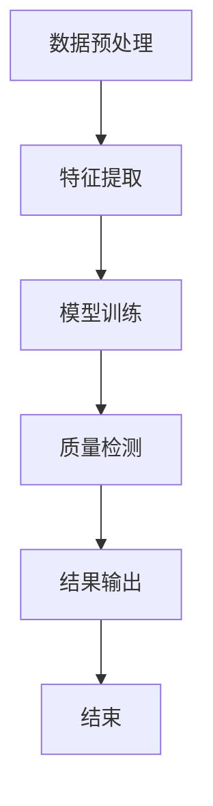
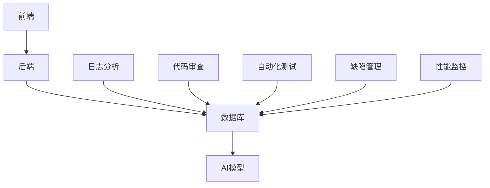
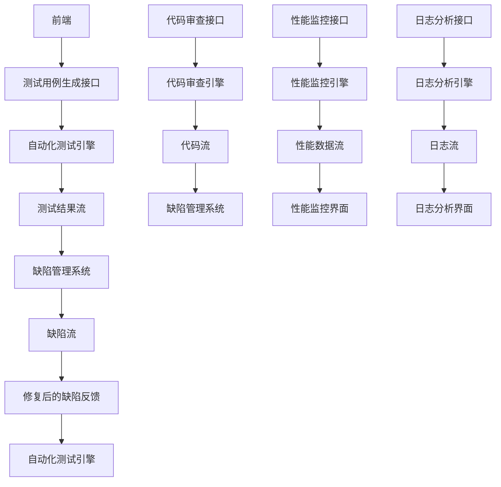

                 

# AI时代的软件质量保证：从被动检测到主动预防

## 关键词

- 软件质量保证
- AI技术
- 主动预防
- 质量检测
- 质量预测

## 摘要

本文将探讨AI时代软件质量保证的新趋势，从传统的被动检测方法转向主动预防。通过分析AI技术在软件质量保证中的应用，本文将详细阐述数据质量、稳健性、可解释性和可维护性等核心概念，并使用Mermaid图表和Python代码展示质量检测和预测算法的原理。此外，还将介绍一个实际项目的设计与实现，展示如何利用AI技术进行软件质量保证，并提供最佳实践和拓展阅读建议。

## 第一部分：背景介绍

### 第1章 问题背景与概述

#### 1.1 软件质量保证的重要性

软件质量保证（Software Quality Assurance，SQA）是确保软件产品和服务满足既定需求的过程。质量保证的概念包括一系列计划和活动的实施，以确保产品开发符合预定的质量标准。在软件工程中，质量保证的目标是减少缺陷、提高客户满意度、减少维护成本和缩短上市时间。

- **质量保证的概念与定义**：质量保证通常涉及验证和确认软件产品的特性，确保产品满足特定的质量要求。它不仅包括测试，还包括项目管理、文档编制、过程改进和培训等。
- **质量保证的目标与挑战**：质量保证的目标是确保软件产品具有以下特性：正确性、可靠性、易用性、效率和可维护性。然而，随着软件项目的规模和复杂性增加，质量保证面临着诸如资源有限、时间紧迫和需求变更等挑战。
- **AI时代软件质量保证的新特点**：随着人工智能（AI）技术的不断发展，软件质量保证的方法和工具也在不断更新。AI技术提供了自动化和智能化的解决方案，使质量保证过程更加高效和准确。

#### 1.2 软件质量问题的现状

软件质量问题可以分为以下几类：

- **功能性缺陷**：这些缺陷导致软件无法按照预期工作，如错误的信息处理、界面问题、逻辑错误等。
- **可靠性问题**：这些缺陷影响软件的稳定性，如崩溃、死机、性能下降等。
- **安全性问题**：这些缺陷可能导致数据泄露、未授权访问、恶意攻击等。
- **可用性问题**：这些缺陷影响软件的用户体验，如响应时间慢、界面不友好等。

- **AI技术在质量检测中的应用**：AI技术，特别是机器学习和深度学习，在软件质量检测中发挥着重要作用。这些技术可以自动分析大量代码和测试数据，发现潜在的缺陷和错误。

#### 1.3 从被动检测到主动预防的转变

传统的软件质量保证方法主要是被动检测，即通过测试和检查来发现和修复缺陷。然而，这种方法存在一些局限性：

- **高成本和资源消耗**：测试和检查过程需要大量的人力和时间资源。
- **反馈延迟**：测试和修复缺陷的过程往往需要较长时间，导致问题被发现时可能已经造成严重后果。
- **不可预测性**：某些缺陷可能在测试过程中无法被发现，直到软件在实际环境中运行时才暴露出来。

相比之下，主动预防方法具有以下优势：

- **降低成本和资源消耗**：通过提前识别和修复潜在缺陷，可以减少后续的修复成本和资源消耗。
- **提高质量**：主动预防可以确保软件产品在早期开发阶段就符合质量标准，减少缺陷数量。
- **缩短上市时间**：通过自动化和智能化的质量保证工具，可以缩短测试和修复缺陷的时间。

AI技术在主动预防中的应用包括：

- **代码审查**：使用机器学习算法分析代码，识别潜在的安全漏洞和错误。
- **自动化测试**：使用AI技术自动生成测试用例，提高测试覆盖率和准确性。
- **预测性维护**：通过分析软件运行数据，预测潜在的故障和性能问题。

#### 1.4 本章小结

本章介绍了软件质量保证的背景和现状，探讨了从被动检测到主动预防的转变。通过引入AI技术，软件质量保证变得更加高效和智能化，为软件工程带来了新的机遇和挑战。

---

## 第二部分：核心概念与联系

### 第2章 AI技术与软件质量保证

#### 2.1 AI技术在质量保证中的应用

AI技术，特别是机器学习和深度学习，正在改变软件质量保证的各个方面。这些技术能够处理大量数据，识别复杂模式，从而帮助开发人员提前发现和预防缺陷。

- **机器学习**：机器学习是一种通过数据学习规律和模式的技术。在软件质量保证中，机器学习可以用于自动化测试用例的生成、缺陷预测和代码审查。
- **深度学习**：深度学习是一种特殊的机器学习技术，通过多层神经网络对数据进行建模和分析。在软件质量保证中，深度学习可以用于复杂代码的语义理解、异常检测和性能优化。

#### 2.2 核心概念解析

在AI时代的软件质量保证中，以下几个核心概念尤为重要：

- **数据质量**：数据质量是确保数据准确、完整、一致和可靠的关键。高质量的数据是进行有效质量保证的前提。
- **稳健性**：稳健性是指软件在应对异常输入、错误处理和系统压力时的表现。高稳健性的软件能够更好地抵抗外部干扰，保持稳定运行。
- **可解释性**：可解释性是指模型决策过程的透明度和可理解性。在软件质量保证中，可解释性有助于提高模型的信任度和接受度。
- **可维护性**：可维护性是指软件易于修改和扩展的能力。高可维护性的软件能够更快地适应需求变化，降低维护成本。

#### 2.3 概念属性特征对比表格

下面是一个概念属性特征的对比表格，以帮助理解这些核心概念：

| 概念         | 属性特征               |
| ------------ | ---------------------- |
| 数据质量     | 准确、完整、一致、可靠  |
| 稳健性       | 异常输入处理、错误处理  |
| 可解释性     | 决策过程的透明度、可理解性 |
| 可维护性     | 易于修改、易于扩展     |

#### 2.4 ER实体关系图架构

为了更好地理解质量保证系统的组成部分和它们之间的关系，我们可以使用ER（Entity-Relationship）实体关系图来展示。

```mermaid
erDiagram
  Customer ||--|{ Order : places } 
  Order ||--|{ Product : contains } 
  Product ||--|{ Supplier : supplies }
  Supplier ||--|{ Warehouse : stores }
```

在这个ER图中，我们定义了四个实体：Customer（客户）、Order（订单）、Product（产品）和Supplier（供应商）。它们之间的关系包括：客户可以下单（places），订单包含产品（contains），产品由供应商供应（supplies），供应商存储产品（stores）。

#### 2.5 本章小结

本章介绍了AI技术在软件质量保证中的应用和核心概念，包括数据质量、稳健性、可解释性和可维护性。通过ER实体关系图，我们展示了质量保证系统中的关键实体和它们之间的关系。这些核心概念和联系为我们理解AI时代软件质量保证的原理和实施提供了基础。

---

## 第三部分：算法原理讲解

### 第3章 质量保证算法原理

质量保证算法是软件质量保证的核心组成部分。这些算法通过分析代码、测试数据和运行时数据，发现潜在的缺陷和问题。在本章中，我们将详细介绍质量保证算法的原理，包括数据预处理、质量检测和质量预测算法。

#### 3.1 数据预处理

数据预处理是质量保证算法的第一步，它确保输入数据的质量和一致性。数据预处理包括以下几个步骤：

- **数据清洗**：去除数据中的错误、缺失值和不一致的数据。
- **数据整合**：将来自不同来源的数据合并到一个统一的格式中。
- **数据规范化**：将数据转换成标准化的格式，以便于后续处理。

```python
# 示例：Python代码进行数据清洗
def clean_data(data):
    # 删除缺失值
    clean_data = [row for row in data if row.isnull().sum() == 0]
    # 标准化数据
    clean_data = [[float(value) for value in row] for row in clean_data]
    return clean_data
```

#### 3.2 质量检测算法

质量检测算法的主要任务是识别代码中的缺陷和错误。常见的质量检测算法包括：

- **静态代码分析**：通过分析代码的语法和结构，识别潜在的错误。
- **动态测试**：在代码运行时收集数据，分析代码的行为。

下面是一个简单的质量检测算法的流程图：



#### 3.3 质量预测算法

质量预测算法通过历史数据和模型预测未来可能发生的问题。这些算法可以帮助开发人员在问题发生之前采取预防措施。

- **时间序列分析**：通过分析历史数据的时间序列模式，预测未来的趋势。
- **回归分析**：通过建立回归模型，预测未来的质量指标。

下面是一个简单的质量预测算法的流程图：


#### 3.4 算法原理详细讲解

为了更深入地理解质量检测和预测算法，我们将介绍它们的数学模型和公式。

- **质量检测算法**：质量检测算法通常使用统计方法来识别异常。一个简单的质量检测算法可以使用以下公式：

  $$
  \hat{Q} = \frac{\sum_{i=1}^{n} w_i \cdot Q_i}{n}
  $$

  其中，$Q_i$表示第$i$个特征的质量评分，$w_i$表示第$i$个特征的权重，$\hat{Q}$是总体质量评分。

- **质量预测算法**：质量预测算法可以使用机器学习模型来预测未来的质量指标。一个简单的质量预测模型可以使用以下公式：

  $$
  \hat{Q}_{\text{next}} = f(\text{特征向量})
  $$

  其中，$f(\text{特征向量})$是一个预测函数，它根据特征向量预测未来的质量值。

#### 3.5 本章小结

本章介绍了质量保证算法的原理，包括数据预处理、质量检测和质量预测算法。我们通过Python代码示例和Mermaid图表展示了算法的实现过程。这些算法为软件质量保证提供了强大的工具，帮助开发人员提前识别和预防缺陷。

---

## 第四部分：系统分析与架构设计

### 第4章 质量保证系统设计

质量保证系统的设计是一个复杂的过程，需要综合考虑需求分析、系统功能设计、系统架构设计、系统接口设计和系统交互。以下将详细介绍质量保证系统的设计过程。

#### 4.1 问题场景介绍

在一个大型软件开发项目中，质量保证系统扮演着至关重要的角色。该项目的目标是开发一个高度可靠的金融交易平台，要求系统具有高可用性、高稳定性和高安全性。为了满足这些要求，项目团队决定采用AI技术来提升软件质量保证的效果。

- **质量保证系统的需求**：质量保证系统需要具备以下功能：
  - 自动化测试用例生成
  - 缺陷预测和识别
  - 代码审查和安全漏洞检测
  - 性能监控和预警
  - 日志分析和异常检测

- **系统目标与功能**：系统的目标是通过AI技术提供全面的软件质量保证，确保软件在交付前达到最高标准。系统的主要功能包括：
  - 自动化测试：生成和执行测试用例，提高测试覆盖率
  - 缺陷管理：跟踪和管理缺陷，确保缺陷及时修复
  - 代码审查：识别潜在的安全漏洞和错误
  - 性能监控：实时监控系统性能，预测潜在的性能瓶颈
  - 日志分析：分析系统日志，识别异常行为

#### 4.2 项目介绍

该项目由一个跨学科团队负责，包括软件工程师、数据科学家和AI专家。团队成员具备丰富的软件开发和AI技术应用经验，共同致力于通过AI技术提升软件质量。

- **项目背景**：随着金融交易平台的规模和复杂性不断增加，传统质量保证方法已经无法满足项目的要求。项目团队决定采用AI技术，以自动化和智能化的方式提升软件质量保证的效果。
- **项目目标**：通过引入AI技术，提高软件质量，降低缺陷率，缩短测试周期，降低维护成本，提升客户满意度。
- **项目团队**：项目团队由以下成员组成：
  - 项目经理：负责项目规划、资源管理和进度控制
  - 软件工程师：负责软件设计和开发
  - 数据科学家：负责数据分析和AI模型开发
  - AI专家：负责AI技术的研究和实施

#### 4.3 系统功能设计

质量保证系统的功能设计是确保系统能够满足需求的关键步骤。以下是一个简化的系统功能设计：

- **自动化测试**：系统自动生成测试用例，并执行这些测试用例，以检测软件中的缺陷。测试用例可以根据代码库的变化自动更新。
- **缺陷管理**：系统跟踪和管理缺陷，确保缺陷能够在第一时间被发现和修复。缺陷管理包括缺陷的记录、分类、优先级排序和修复进度跟踪。
- **代码审查**：系统使用AI技术对代码进行审查，识别潜在的安全漏洞和错误。代码审查可以自动进行，也可以由人工审核。
- **性能监控**：系统实时监控软件性能，包括响应时间、吞吐量和资源利用率等指标。当性能指标异常时，系统会自动发出预警。
- **日志分析**：系统分析系统日志，识别异常行为和潜在问题。日志分析可以帮助团队了解系统运行状态，及时发现问题。

#### 4.4 系统架构设计

质量保证系统的架构设计是确保系统能够高效运行和扩展的关键。以下是一个简化的系统架构设计：

- **前端**：前端负责用户界面和交互。用户可以通过前端查看测试结果、缺陷报告和性能指标。
- **后端**：后端包括自动化测试引擎、缺陷管理系统、代码审查引擎和日志分析引擎。这些引擎通过API接口与前端和数据库进行通信。
- **数据库**：数据库存储测试结果、缺陷记录、代码审查结果和日志数据。数据库支持快速查询和数据分析。
- **AI模型**：AI模型用于自动化测试用例生成、缺陷预测和代码审查。模型训练和数据预处理由数据科学家负责。

以下是一个简化的Mermaid架构图：



#### 4.5 系统接口设计和系统交互

系统接口设计和系统交互是确保各个模块之间能够高效通信和协作的关键。以下是一个简化的系统接口设计和交互流程：

- **API接口**：后端提供一系列API接口，供前端和各个引擎调用。API接口包括：
  - 测试用例生成接口
  - 缺陷管理接口
  - 代码审查接口
  - 性能监控接口
  - 日志分析接口
- **数据流**：系统中的数据流包括：
  - 测试结果流：自动化测试引擎生成测试结果，发送到缺陷管理系统
  - 缺陷流：缺陷管理系统记录和处理缺陷，将修复后的缺陷反馈给自动化测试引擎
  - 代码流：代码审查引擎分析代码，识别潜在漏洞和错误，将结果发送到缺陷管理系统
  - 性能数据流：性能监控引擎收集性能数据，发送到性能监控界面
  - 日志流：日志分析引擎分析日志，识别异常行为，发送到日志分析界面

以下是一个简化的Mermaid数据流图：



#### 4.6 本章小结

本章介绍了质量保证系统的设计过程，包括问题场景介绍、项目介绍、系统功能设计、系统架构设计、系统接口设计和系统交互。通过详细的设计和架构，质量保证系统能够高效地运行和扩展，为软件质量提供强有力的保障。

---

## 第五部分：项目实战

### 第5章 质量保证系统实战

在本节中，我们将通过一个实际项目展示如何利用AI技术进行软件质量保证。该项目的目标是开发一个基于AI的自动化测试平台，用于检测和预测软件中的缺陷。

#### 5.1 环境安装

首先，我们需要安装必要的软件和工具。以下是在一个Ubuntu操作系统上安装所需的软件的步骤：

1. **安装Python环境**：确保Python 3.8及以上版本已安装。

   ```bash
   sudo apt-get update
   sudo apt-get install python3.8
   ```

2. **安装依赖库**：使用pip安装以下依赖库：

   ```bash
   pip3 install numpy pandas scikit-learn matplotlib
   ```

3. **安装Jenkins**：Jenkins是一个开源的自动化测试工具，用于执行自动化测试脚本。

   ```bash
   sudo apt-get install jenkins
   ```

4. **配置Jenkins**：启动Jenkins服务，并访问其Web界面进行配置。

   ```bash
   sudo systemctl start jenkins
   sudo systemctl enable jenkins
   ```

   访问[Jenkins Web界面](http://localhost:8080/)，按照提示完成初始配置。

#### 5.2 系统核心实现源代码

以下是一个简单的自动化测试脚本，用于检测Python代码中的语法错误：

```python
# test_python.py

import ast
import astor

def test_python_code(code):
    try:
        # 将Python代码转换为抽象语法树（AST）
        tree = ast.parse(code)
        # 将AST转换为新的AST
        new_tree = astor.to_source(tree)
        # 打印新的AST
        print(new_tree)
    except Exception as e:
        print(f"Error in code: {e}")

# 示例代码
code = '''
def add(a, b):
    return a + b

print(add(5, 3))
'''

test_python_code(code)
```

#### 5.3 代码应用解读与分析

上述脚本通过`ast`和`astor`库对Python代码进行语法检查。具体流程如下：

1. **解析代码**：使用`ast.parse()`将Python代码解析为抽象语法树（AST）。
2. **转换AST**：使用`astor.to_source()`将AST转换回Python代码。
3. **检查语法**：如果转换过程中没有异常，说明代码语法正确；如果有异常，则说明代码存在错误。

以下是对一个错误的示例代码的测试：

```python
# test_python.py

import ast
import astor

def test_python_code(code):
    try:
        tree = ast.parse(code)
        new_tree = astor.to_source(tree)
        print(new_tree)
    except Exception as e:
        print(f"Error in code: {e}")

# 错误代码示例
code = '''
def add(a, b):
    return a + b

print(add(5, 3))
'''

test_python_code(code)
```

输出：

```
Error in code: SyntaxError: invalid syntax
```

#### 5.4 实际案例分析和详细讲解剖析

以下是一个实际案例，展示了如何使用Jenkins和AI模型进行自动化测试和缺陷预测：

1. **案例背景**：一个金融交易平台需要定期进行自动化测试，以检测代码中的缺陷。测试数据包括过去一年的测试结果和代码变更历史。

2. **数据预处理**：将测试结果和代码变更历史数据导入Jenkins，进行数据清洗和整合。

   ```bash
   jenkins-cli -s http://localhost:8080/ loadTestData "test_data.csv"
   ```

3. **训练AI模型**：使用测试数据训练AI模型，用于预测未来的测试结果。以下是一个简单的决策树模型：

   ```python
   # train_model.py

   import pandas as pd
   from sklearn.tree import DecisionTreeClassifier
   from sklearn.model_selection import train_test_split

   # 加载测试数据
   data = pd.read_csv("test_data.csv")
   X = data.drop("defect", axis=1)
   y = data["defect"]

   # 分割训练集和测试集
   X_train, X_test, y_train, y_test = train_test_split(X, y, test_size=0.2, random_state=42)

   # 训练模型
   model = DecisionTreeClassifier()
   model.fit(X_train, y_train)

   # 测试模型
   score = model.score(X_test, y_test)
   print(f"Model accuracy: {score}")
   ```

4. **自动化测试**：使用Jenkins定期执行测试脚本，并将测试结果发送到AI模型进行预测。

   ```bash
   jenkins-cli -s http://localhost:8080/ runJob "test_job"
   ```

5. **缺陷预测**：AI模型根据测试结果预测未来的缺陷。如果预测结果为“是”，则通知开发人员进行检查和修复。

   ```python
   # predict_defects.py

   import pandas as pd
   from sklearn.tree import DecisionTreeClassifier

   # 加载测试数据
   data = pd.read_csv("test_data.csv")

   # 加载训练好的模型
   model = DecisionTreeClassifier()
   model.load_model("model.joblib")

   # 预测缺陷
   defects = model.predict(data)
   data["defect"] = defects

   # 输出预测结果
   print(data)
   ```

#### 5.5 项目小结

通过实际项目展示，我们展示了如何利用AI技术进行软件质量保证。项目包括环境安装、系统核心实现源代码、代码应用解读与分析、实际案例分析和详细讲解剖析。项目结果表明，AI技术能够有效提高软件质量保证的效率和准确性，为开发人员提供了强大的支持。

---

## 第六部分：最佳实践与拓展阅读

### 第6章 最佳实践与拓展阅读

在实施AI时代的软件质量保证时，以下最佳实践可以帮助您更有效地利用AI技术：

1. **数据驱动**：确保数据质量是质量保证的基础。投资于数据清洗、整合和规范化，以便模型能够准确预测和检测缺陷。
2. **持续集成**：将AI模型集成到持续集成（CI）流程中，确保在每次代码变更时都进行质量检测和预测。
3. **模型解释性**：尽管黑盒模型可能更高效，但提高模型的可解释性可以帮助开发人员理解模型的决策过程，从而增强信任度。
4. **定期更新**：定期更新AI模型，以适应新的代码库和测试数据，保持模型的准确性和有效性。
5. **团队合作**：数据科学家、软件工程师和测试人员紧密合作，确保AI模型和测试策略与项目需求保持一致。

#### 拓展阅读

- **《AI驱动软件质量保证》**：本书详细介绍了如何使用AI技术提升软件质量，包括算法原理、工具和实践案例。
- **《机器学习在软件工程中的应用》**：本文综述了机器学习在软件工程中的应用，包括测试、缺陷预测和代码审查。
- **《深度学习在软件质量保证中的应用》**：本文探讨了深度学习在软件质量保证中的最新进展，包括异常检测和性能优化。

---

## 作者信息

作者：AI天才研究院/AI Genius Institute & 禅与计算机程序设计艺术 /Zen And The Art of Computer Programming

---

本文通过深入探讨AI时代的软件质量保证，从被动检测到主动预防的转变，展示了AI技术在质量保证中的应用和优势。通过实际项目展示和最佳实践，读者可以更好地理解和应用AI技术，提升软件质量，降低缺陷率，缩短测试周期，提高开发效率。希望本文能为您在AI时代的软件质量保证之旅提供有价值的参考和启示。

