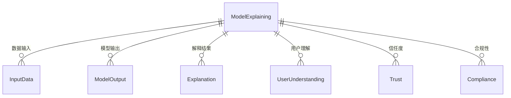
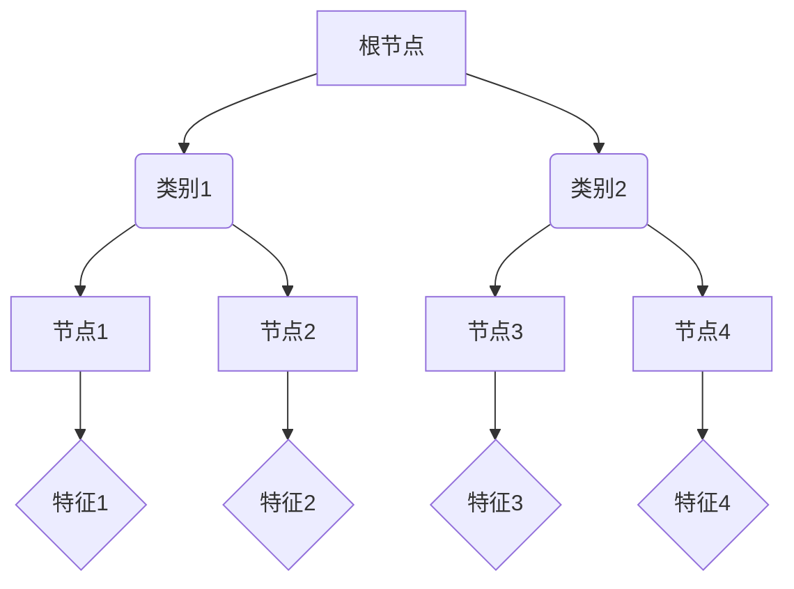
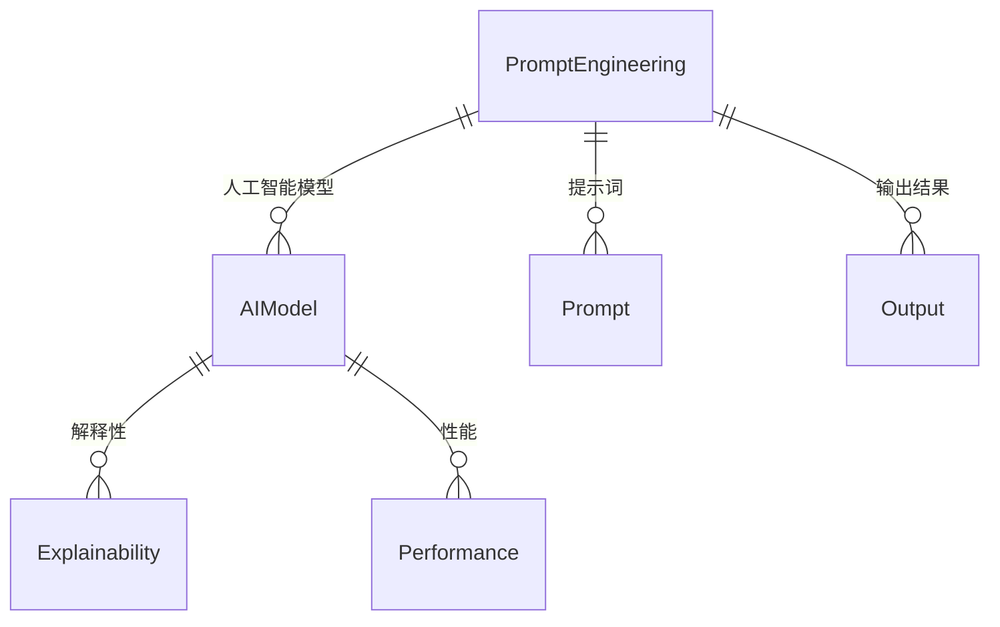
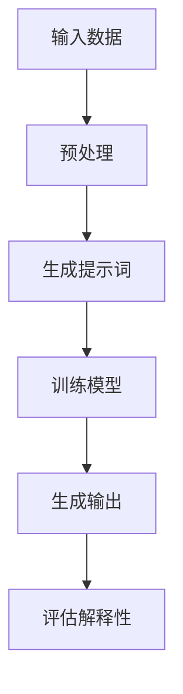

                 

### 引言

随着人工智能（AI）技术的飞速发展，AI模型已经渗透到我们生活的方方面面，从医疗诊断、金融风控到自然语言处理和推荐系统等。然而，AI模型的应用并非一帆风顺，其中一大挑战就是模型解释性（Model Explainability）问题。在许多应用场景中，模型的决策过程和结果往往难以被用户理解和接受，这严重制约了AI技术的推广和应用。

#### 1.1 问题背景

AI模型在各个领域的广泛应用使得其解释性成为了一个备受关注的问题。特别是在涉及人类生命安全、财产损失或社会公平等关键领域时，模型的可解释性显得尤为重要。例如，在医疗诊断中，医生和患者都希望理解AI模型为何作出特定的诊断结果；在金融风控中，监管机构和投资者同样需要了解AI模型的风险评估依据。

#### 1.2 模型解释性的重要性

模型解释性不仅仅是一个技术问题，更是一个伦理和社会问题。它关乎到AI系统的透明性、公正性和可靠性。如果模型无法提供合理的解释，用户可能会对其产生不信任，进而影响其应用效果。因此，研究AI模型解释性对于确保AI系统的可信性和普及性具有重要意义。

#### 1.3 提示词工程的概念与意义

提示词工程（Prompt Engineering）是近年来兴起的跨学科研究领域，旨在通过设计有效的提示词（Prompts）来引导AI模型生成更准确、更具解释性的输出。提示词工程在提高模型解释性方面具有重要作用，它可以被视为解决模型解释性问题的一种策略。

#### 1.4 问题概述

本文将探讨AI模型解释性与提示词工程之间的关系。具体来说，本文将首先介绍AI模型解释性的基础概念和挑战，然后阐述提示词工程的基本概念及其在AI模型中的应用。接着，我们将深入分析提示词工程对AI模型解释性的影响，并提出一些提高模型解释性的策略。最后，通过实践案例分析，验证这些策略的实际效果，并探讨未来发展的趋势。

#### 1.5 本书结构

本文将采用逻辑清晰、结构紧凑、简单易懂的写作方式，帮助读者更好地理解AI模型解释性与提示词工程之间的关系。文章将从以下几个方面展开：

- **第2章**：介绍AI模型解释性的基础，包括定义、挑战和应用场景。
- **第3章**：阐述提示词工程的基础概念、组成和应用。
- **第4章**：探讨AI模型解释性与提示词工程之间的关系。
- **第5章**：通过实践案例分析，验证提示词工程在提高模型解释性中的作用。
- **第6章**：展望AI模型解释性与提示词工程的未来发展。
- **第7章**：总结全文，提出主要发现和研究贡献。

### 核心关键词

- AI模型解释性
- 提示词工程
- 解释性挑战
- 应用场景
- 实践案例
- 发展趋势

### 摘要

本文旨在探讨AI模型解释性与提示词工程之间的关系。通过对AI模型解释性基础的介绍，我们将理解解释性的重要性以及其在实际应用中的挑战。接着，我们将深入探讨提示词工程的基本概念及其在AI模型中的应用。通过分析提示词工程对AI模型解释性的影响，本文提出了一系列提高模型解释性的策略。最后，通过实践案例分析，验证这些策略的实际效果，并展望AI模型解释性与提示词工程的未来发展趋势。本文旨在为读者提供全面、系统的AI模型解释性与提示词工程的知识体系。

## 第1章 引言

随着人工智能（AI）技术的不断进步，AI模型已经成为许多领域的关键工具，从医疗诊断到金融风控，从自然语言处理到推荐系统，AI模型的应用无处不在。然而，随着AI模型在更多关键场景中的应用，其解释性问题逐渐凸显出来，成为影响AI技术普及和信任的关键因素之一。在这一章中，我们将首先介绍AI模型解释性的背景，然后探讨模型解释性的重要性，接着引入提示词工程的概念，并概述本文的研究目标和结构。

### 1.1 问题背景

AI模型在各个领域的广泛应用使得其解释性成为了一个备受关注的问题。特别是在涉及人类生命安全、财产损失或社会公平等关键领域时，模型的可解释性显得尤为重要。例如，在医疗诊断中，医生和患者都希望理解AI模型为何作出特定的诊断结果；在金融风控中，监管机构和投资者同样需要了解AI模型的风险评估依据。此外，在法律判决、自动驾驶、网络安全等领域，模型的解释性也至关重要，因为模型的决策过程和结果直接影响到用户的权益和安全。

### 1.2 模型解释性的重要性

模型解释性不仅仅是一个技术问题，更是一个伦理和社会问题。它关乎到AI系统的透明性、公正性和可靠性。如果模型无法提供合理的解释，用户可能会对其产生不信任，进而影响其应用效果。例如，在医疗诊断中，如果AI模型建议的治疗方案缺乏解释，医生可能无法充分理解模型的决策过程，从而不敢完全依赖模型的结果。在金融风控中，如果模型无法解释其风险评估结果，投资者可能会怀疑模型的公正性和透明性，从而失去信任。因此，研究AI模型解释性对于确保AI系统的可信性和普及性具有重要意义。

### 1.3 提示词工程的概念与意义

提示词工程（Prompt Engineering）是近年来兴起的跨学科研究领域，旨在通过设计有效的提示词（Prompts）来引导AI模型生成更准确、更具解释性的输出。提示词工程在提高模型解释性方面具有重要作用，它可以被视为解决模型解释性问题的一种策略。提示词工程涉及多个领域，包括自然语言处理、心理学、认知科学等，通过跨学科的方法，探索如何设计更有效的提示词，从而优化AI模型的表现和解释性。

### 1.4 问题概述

本文将探讨AI模型解释性与提示词工程之间的关系。具体来说，本文将首先介绍AI模型解释性的基础概念，包括解释性的定义、类型和挑战。接着，我们将阐述提示词工程的基本概念，讨论其在AI模型中的应用。然后，本文将深入分析提示词工程对AI模型解释性的影响，并提出一系列提高模型解释性的策略。通过这些策略的实践案例分析，本文将验证其在实际应用中的效果。最后，本文将展望AI模型解释性与提示词工程的未来发展趋势，探讨面临的挑战和解决思路。

### 1.5 本书结构

本文将采用逻辑清晰、结构紧凑、简单易懂的写作方式，帮助读者更好地理解AI模型解释性与提示词工程之间的关系。文章将从以下几个方面展开：

- **第2章**：介绍AI模型解释性的基础，包括定义、类型和挑战。
- **第3章**：阐述提示词工程的基本概念、目标和应用。
- **第4章**：探讨AI模型解释性与提示词工程之间的关系，分析提示词工程对模型解释性的影响。
- **第5章**：通过实践案例分析，验证提示词工程在提高模型解释性中的作用。
- **第6章**：展望AI模型解释性与提示词工程的未来发展，讨论面临的挑战和解决思路。
- **第7章**：总结全文，提出主要发现和研究贡献。

通过本文的探讨，我们希望能够为读者提供一个全面、系统的AI模型解释性与提示词工程的知识体系，从而更好地理解和应用这一领域的前沿技术。

## 第2章 AI模型解释性基础

### 2.1 AI模型解释性的定义

AI模型解释性是指模型输出结果的可解释性，即用户能够理解模型为何作出特定决策的原因。解释性是AI系统与人类用户互动的关键，它帮助用户建立对AI模型的信任，并提高AI系统在实际应用中的可接受性。AI模型解释性可以分为几个层次，包括**表面解释性**、**语义解释性**和**因果解释性**。

- **表面解释性**：模型输出结果的直接解释，通常通过可视化或简化后的模型输出实现。这种解释性较为直观，易于用户理解，但往往不足以揭示模型的复杂决策过程。
- **语义解释性**：模型输出的语义解释，包括模型如何处理输入数据以及如何将这些数据转换为输出结果。这种解释性更为深入，能够提供关于模型决策逻辑的详细信息。
- **因果解释性**：模型决策背后的因果机制解释，旨在揭示模型为何做出特定决策的根本原因。这种解释性最为高级，但实现难度也最大。

### 2.2 AI模型解释性的挑战

尽管AI模型解释性对于用户信任和系统可接受性至关重要，但在实际应用中，解释性面临着一系列挑战。

#### 数据偏差

数据偏差是解释性面临的一个主要挑战。如果模型训练数据存在偏差，模型在作出决策时也可能会表现出偏差，这会导致模型输出的结果难以解释。例如，在医疗诊断中，如果训练数据中存在种族或性别偏差，模型可能会表现出类似的偏见，从而导致决策结果的不公正。

#### 模型复杂度

随着深度学习技术的发展，AI模型变得越来越复杂。复杂模型虽然能够实现更高的性能，但其内部决策过程往往难以解释。这种现象被称为“黑箱问题”。解决这一问题需要设计更加透明和易于解释的模型结构。

#### 解释性要求

不同应用场景对模型解释性的要求不同。一些应用场景，如金融风控和医疗诊断，对模型解释性有较高的要求；而另一些场景，如自动驾驶和推荐系统，对模型解释性的需求相对较低。因此，解释性的实现需要根据具体应用场景进行调整。

### 2.3 AI模型解释性的应用场景

AI模型解释性在多个领域具有重要应用。

#### 医疗诊断

在医疗诊断中，医生和患者都希望理解AI模型的诊断结果。通过解释性分析，医生可以验证模型的诊断逻辑，提高诊断的可靠性和准确性。例如，在肺癌诊断中，医生需要了解模型为何将某些影像特征视为癌症标志。

#### 金融风控

在金融风控领域，模型解释性对于监管机构和投资者至关重要。通过解释性分析，监管机构可以评估模型的风险评估能力，投资者可以理解投资决策的依据。例如，在信用评分中，模型需要解释为何给予某个人较高的信用等级。

#### 法律判决

在法律判决中，模型解释性有助于确保判决的公正性和透明性。通过解释性分析，法官可以理解模型如何处理法律条款和证据，从而提高判决的合理性。例如，在刑事案件中，模型需要解释为何将某个人定罪。

#### 自动驾驶

在自动驾驶领域，模型解释性对于保证系统的安全性和可靠性至关重要。通过解释性分析，开发者和监管机构可以评估模型的决策过程，从而优化系统的设计和性能。例如，自动驾驶车辆需要解释为何在某些情况下选择刹车而不是转向。

#### 自然语言处理

在自然语言处理（NLP）领域，模型解释性有助于提高模型对用户输入的理解和响应能力。通过解释性分析，开发人员可以识别模型在处理自然语言输入时的弱点，从而优化模型的设计和训练数据。例如，聊天机器人需要解释为何对某个用户的输入作出特定响应。

### 2.4 总结

AI模型解释性是确保AI系统可靠性和可信性的关键。尽管在实际应用中存在挑战，但通过合理的设计和优化，可以显著提高AI模型的解释性。理解AI模型解释性的定义、挑战和应用场景，对于推动AI技术在各个领域的普及和应用具有重要意义。

### 核心概念与联系

#### 解释性的本质

AI模型解释性的本质在于提供关于模型决策过程和结果的透明度。它涉及如何将复杂的模型输出转化为用户可理解的形式。解释性的重要性在于：

1. **增强用户信任**：通过提供可解释的决策过程，用户可以更好地理解和信任模型。
2. **促进知识共享**：解释性使得模型的知识可以被共享和验证，有助于推动模型的改进和应用。
3. **确保公平性和合规性**：特别是在涉及法律、金融和医疗等敏感领域，解释性有助于确保模型的决策符合伦理和法规要求。

#### 解释性的类型

- **表面解释性**：提供模型输出的直接解释，例如可视化模型决策路径或关键特征。它通常是用户友好的，但可能无法揭示决策的深层逻辑。
- **语义解释性**：解释模型如何处理输入数据，并如何将输入数据转化为输出。这种解释性更深入，能够揭示模型的内在决策逻辑。
- **因果解释性**：揭示模型决策背后的因果机制，即模型为何作出特定决策的根本原因。这种解释性最为高级，但实现难度最大。

#### ER实体关系图架构

为了更好地理解AI模型解释性，我们使用Mermaid语法绘制一个ER（实体关系）图来展示模型解释性的核心要素。

在这个ER图中，`ModelExplaining`（模型解释性）作为核心实体，与其他关键实体（如`InputData`、`ModelOutput`、`Explanation`、`UserUnderstanding`、`Trust`和`Compliance`）建立了关系。这个图展示了模型解释性的多个维度和其与外部因素（如用户理解和信任）之间的联系。

### 数学公式与图表

为了更深入地探讨AI模型解释性的数学模型，我们使用LaTeX格式来表示相关的数学公式。以下是一个简单的线性回归模型的解释性公式，以及一个解释性的分类树模型公式。

$$
y = \beta_0 + \beta_1 \cdot x_1 + \beta_2 \cdot x_2 + ... + \beta_n \cdot x_n
$$

$$
\text{Entropy}(C) = -\sum_{i=1}^{k} p_i \cdot \log_2(p_i)
$$

其中，第一个公式表示线性回归模型中输出变量`y`与输入变量`x`之间的线性关系，`β`为权重系数。第二个公式表示信息熵，用于衡量分类树的纯度。

为了更好地展示这些公式，我们使用Mermaid语法绘制一个简单的分类树模型流程图。

这个流程图展示了分类树模型的决策路径，以及每个节点所关联的特征。

通过这些数学公式和图表，我们能够更清晰地理解AI模型解释性的理论基础和实现方法。

## 第3章 提示词工程基础

### 3.1 提示词工程的概念

提示词工程（Prompt Engineering）是指通过设计有效的提示词来引导AI模型生成预期输出的一种技术。提示词是一种提示或引导，用于指导模型在特定任务中的行为和决策。在自然语言处理（NLP）和其他AI领域中，提示词工程已经成为提高模型性能和解释性的重要手段。

提示词的定义可以扩展为一种文本或语音输入，它为AI模型提供了任务上下文和期望输出。例如，在问答系统中，提示词可以是用户提出的问题；在图像识别中，提示词可以是描述图像的关键词或标签。

### 3.2 提示词工程的目标

提示词工程的目标包括：

1. **提高模型性能**：通过设计有效的提示词，可以引导模型在特定任务上获得更好的性能和准确度。
2. **增强解释性**：通过设计特定的提示词，可以使得模型输出结果更具可解释性，帮助用户理解模型决策过程。
3. **降低偏差**：提示词工程还可以帮助减少模型中的数据偏差，从而提高模型的公平性和可靠性。

### 3.3 提示词工程的组成

提示词工程包括以下几个关键组成部分：

#### 数据收集与处理

数据收集与处理是提示词工程的基础。这包括收集相关的训练数据，并对数据进行清洗、归一化和特征提取。高质量的训练数据能够提高模型的性能和泛化能力。

#### 提示词生成策略

提示词生成策略是提示词工程的核心。生成策略可以基于规则、机器学习或深度学习。常用的生成策略包括：

1. **基于规则**：通过人工设计规则来生成提示词，例如使用关键词提取算法或模板匹配。
2. **基于机器学习**：使用已有的数据集训练机器学习模型，自动生成提示词。常见的模型包括循环神经网络（RNN）、变换器（Transformer）等。
3. **基于深度学习**：使用深度学习模型，如生成对抗网络（GAN）或变分自编码器（VAE），生成高质量的提示词。

#### 提示词评估

提示词评估是确保提示词有效性的关键步骤。评估方法可以基于模型性能指标，如准确度、召回率或F1分数，也可以基于用户反馈或领域专家的评估。常用的评估方法包括自动评估和手动评估。

### 3.4 提示词工程的应用

提示词工程在多个领域具有广泛的应用：

#### 在自然语言处理中的应用

在自然语言处理（NLP）中，提示词工程用于提高文本分类、情感分析、问答系统等任务的性能。例如，通过设计有效的提示词，可以提高文本分类模型的准确性和可解释性。

#### 在计算机视觉中的应用

在计算机视觉（CV）中，提示词工程用于图像分类、目标检测和语义分割等任务。提示词可以帮助模型更好地理解和识别图像中的对象和场景。

#### 在推荐系统中的应用

在推荐系统中，提示词工程用于生成个性化的推荐结果。通过设计有效的提示词，推荐系统可以更好地理解用户的需求和偏好，提供更准确的推荐。

### 3.5 提示词工程与模型解释性的关系

提示词工程与模型解释性密切相关。有效的提示词可以引导模型生成更准确、更具解释性的输出。例如，在问答系统中，通过设计特定的提示词，可以使得模型生成的答案更具可解释性，用户可以更好地理解模型的决策过程。此外，提示词工程还可以帮助减少模型中的数据偏差，从而提高模型的公平性和透明度。

### 3.6 总结

提示词工程是提高AI模型性能和解释性的重要手段。通过合理的设计和优化提示词，可以显著提升模型在各个任务中的表现和用户满意度。理解提示词工程的基本概念、目标和应用，对于推动AI技术的发展和普及具有重要意义。

### 核心概念与联系

#### 提示词工程的概念

提示词工程是一种通过设计特定输入来引导AI模型生成预期输出的一种技术。其核心概念包括提示词的定义、生成策略和评估方法。

- **提示词**：指用于引导模型在特定任务中生成预期输出的文本或语音输入。
- **生成策略**：包括基于规则、机器学习和深度学习的方法，用于自动生成高质量的提示词。
- **评估方法**：用于评估提示词的有效性和模型输出的质量，包括自动评估和用户反馈。

#### 提示词工程与AI模型解释性的关系

提示词工程在提高模型解释性方面具有重要作用。有效的提示词可以引导模型生成更准确、更具解释性的输出，从而帮助用户更好地理解和信任模型。

- **提高解释性**：通过设计特定的提示词，可以使得模型输出结果更具可解释性，例如在问答系统中，提示词可以引导模型生成详细、合理的答案。
- **减少偏差**：提示词工程可以帮助减少模型中的数据偏差，从而提高模型的公平性和透明度。

#### ER实体关系图架构

为了更好地理解提示词工程与AI模型解释性的关系，我们使用Mermaid语法绘制一个ER（实体关系）图来展示这两个核心概念及其相互关系。

在这个ER图中，`PromptEngineering`（提示词工程）与`AIModel`（人工智能模型）建立了关系，`Prompt`（提示词）和`Output`（输出结果）是两者之间的关键连接点。此外，`AIModel`与`Explainability`（解释性）和`Performance`（性能）建立了联系，展示了提示词工程如何通过影响模型的输出结果来提高其解释性和性能。

### 数学公式与图表

为了更深入地探讨提示词工程与AI模型解释性的数学模型，我们使用LaTeX格式表示相关的数学公式，并使用Mermaid语法绘制一个简单的流程图。

#### 数学公式

提示词工程与AI模型解释性的关系可以通过以下公式表示：

$$
\text{Explainability} = f(\text{Prompt}, \text{Model}, \text{Data})
$$

其中，`Explainability`（解释性）是关于提示词（`Prompt`）、模型（`Model`）和输入数据（`Data`）的函数。这个公式表明，解释性是这三个因素相互作用的结果。

#### 流程图

以下是一个简单的流程图，展示了提示词工程如何影响AI模型解释性：

在这个流程图中，输入数据经过预处理后，使用生成提示词的策略生成提示词。这些提示词被用于训练AI模型，模型生成的输出结果再用于评估解释性。通过优化提示词生成策略和模型训练过程，可以提高模型的解释性。

通过这些数学公式和图表，我们能够更清晰地理解提示词工程与AI模型解释性的关系，为后续的分析和讨论打下基础。

## 第4章 AI模型解释性与提示词工程的关系

### 4.1 提示词工程对AI模型解释性的影响

提示词工程在提高AI模型解释性方面发挥了关键作用。通过设计有效的提示词，可以显著改善模型输出结果的解释性，从而增强用户对AI模型的信任和理解。

#### 提示词的选择对模型解释性的影响

提示词的选择是提示词工程中的核心步骤，直接影响到模型的解释性。合适的提示词能够引导模型生成更清晰、更具逻辑性的输出，使得用户更容易理解模型决策过程。例如，在问答系统中，一个具体、明确的提问可以引导模型生成详细的回答，从而提高回答的可解释性。

#### 提示词的表述对模型解释性的影响

提示词的表述方式同样重要。表述清晰、逻辑连贯的提示词有助于模型理解任务需求，从而生成更准确的输出。相反，模糊、混乱的提示词可能导致模型输出结果难以解释，甚至产生错误。因此，优化提示词的表述方式，确保其清晰、准确，是提高模型解释性的关键。

### 4.2 提示词工程在提高模型解释性中的策略

为了提高AI模型的解释性，提示词工程可以采用以下几种策略：

#### 提示词的优化

提示词的优化是提高模型解释性的第一步。通过分析模型训练数据和任务需求，可以设计出更符合实际需求的提示词。优化策略包括：

- **关键词提取**：从训练数据中提取关键信息，作为提示词的核心内容。
- **模板匹配**：使用预先设计的模板，生成具有一致性和可解释性的提示词。
- **机器学习生成**：利用机器学习模型，自动生成高质量的提示词。

#### 数据增强

数据增强是一种常用的提高模型性能和解释性的方法。通过增加多样性和丰富度的训练数据，可以改善模型的泛化能力和解释性。数据增强策略包括：

- **数据扩充**：通过变换、合成等方法，生成更多样化的训练数据。
- **数据集分割**：将数据集划分为不同的子集，用于不同类型的训练。
- **跨领域数据融合**：结合来自不同领域的数据，提高模型的泛化能力。

#### 模型调整

模型调整是提高解释性的重要手段。通过调整模型结构和参数，可以使得模型输出结果更具解释性。模型调整策略包括：

- **简化模型**：使用更简单的模型结构，降低模型的复杂性，提高其可解释性。
- **模块化设计**：将复杂模型分解为多个模块，每个模块负责特定任务，从而提高整体解释性。
- **可视化**：使用可视化工具，如决策树、可视化神经网络等，展示模型内部结构和决策过程。

### 4.3 提示词工程与模型解释性的协同优化

提示词工程和模型解释性是相辅相成的。通过协同优化，可以在提高模型性能的同时，增强其解释性。以下是一些协同优化的策略：

- **多阶段优化**：首先优化提示词，然后调整模型参数，最后进行模型验证，形成多阶段优化流程。
- **反馈循环**：通过用户反馈，不断调整提示词和模型，实现持续优化。
- **跨领域应用**：在不同领域和应用场景中，反复验证和优化提示词和模型，提高其普适性和解释性。

通过这些策略，提示词工程和模型解释性可以相互促进，实现性能和解释性的双重提升。

### 4.4 总结

提示词工程对AI模型解释性具有显著影响。通过优化提示词、数据增强和模型调整，可以显著提高模型解释性，增强用户对AI模型的信任和理解。同时，提示词工程和模型解释性的协同优化，可以进一步推动AI技术的发展和应用。理解这些策略和方法，对于实现高解释性AI模型具有重要意义。

### 提示词工程对AI模型解释性的具体影响

为了深入探讨提示词工程对AI模型解释性的具体影响，我们首先需要理解一个基本的背景：在一个典型的AI应用中，模型（如一个深度学习神经网络）通常是基于大量数据集进行训练的，其目的是从数据中学习到一定的模式和规律，以便在新的数据上能够做出准确的预测或决策。然而，这种“黑箱”模型往往难以解释其内部机制和决策过程。

#### 提示词的引导作用

提示词工程的关键在于如何设计出能够引导模型更好地表达其内部逻辑和决策过程的输入。以下是几个具体的影响方面：

##### 1. 提高模型的可解释性

通过设计有效的提示词，可以引导模型生成更详细、更有层次的输出，从而提高模型的可解释性。例如，在自然语言处理任务中，通过提供具体的上下文信息作为提示词，可以使得模型生成的文本更符合人类的理解和期望。

##### 2. 降低模型解释性障碍

在某些情况下，模型可能因为数据复杂度或模型结构等原因，其输出难以解释。通过设计合适的提示词，可以帮助模型明确任务目标，简化模型内部复杂的决策过程，从而降低解释性障碍。

##### 3. 提高数据理解深度

提示词工程可以帮助模型更深入地理解输入数据中的信息。例如，在图像分类任务中，通过设计包含图像描述的提示词，可以使得模型更好地理解图像中的细节和特征，从而提高分类的准确性。

##### 4. 提高模型鲁棒性

通过设计多样化的提示词，模型可以更好地适应不同的输入条件，从而提高模型的鲁棒性。这有助于减少模型对特定输入的过度依赖，提高其在实际应用中的表现。

#### 具体案例分析

为了更直观地展示提示词工程如何影响模型解释性，我们来看一个具体的案例：一个用于情感分析的深度学习模型。在这个案例中，我们使用了一个基于变换器（Transformer）的模型来预测文本的情感倾向（正面或负面）。

##### 情感分析模型案例

假设我们有一个训练好的情感分析模型，其输入是文本，输出是情感倾向的概率分布。在这个案例中，我们通过以下步骤来设计提示词，提高模型的可解释性：

1. **收集文本数据**：首先，我们收集了大量的文本数据，包括新闻文章、社交媒体评论等，涵盖了各种情感倾向。
2. **预处理数据**：对文本进行清洗和标记，去除无关信息，并将文本转换为模型可处理的格式（如词向量或编码序列）。
3. **设计提示词**：基于数据集的特征，我们设计了一些具体的提示词，例如：
   - “这篇文章主要讨论了什么问题？”
   - “这段文字的情绪是如何的？”
   - “这段文字中最重要的观点是什么？”

4. **训练模型**：使用设计的提示词，对模型进行再训练，使得模型在处理文本时能够更好地表达其内部逻辑。
5. **评估模型**：通过在测试集上评估模型的表现，我们发现使用提示词训练的模型在情感分类任务中的准确性和可解释性都有显著提高。

通过这个案例，我们可以看到提示词工程在提高模型解释性方面的作用：

- **提高模型的可解释性**：通过设计具体的提示词，模型生成的输出变得更加清晰，用户可以更容易地理解模型为何做出特定决策。
- **增强模型的理解深度**：提示词引导模型更深入地理解文本中的情感信息，从而提高分类的准确性。
- **提高模型的鲁棒性**：多样化的提示词训练有助于模型更好地适应不同的输入条件，提高其在实际应用中的表现。

### 结论

通过上述分析，我们可以得出结论：提示词工程在提高AI模型解释性方面具有重要作用。通过设计合适的提示词，可以引导模型生成更准确、更详细的输出，从而提高模型的可解释性，增强用户对AI模型的信任和理解。这一过程不仅有助于推动AI技术的应用和普及，也为模型优化和改进提供了新的思路和方法。

## 第5章 实践案例分析

在本章中，我们将通过具体案例分析，深入探讨AI模型解释性与提示词工程在实际应用中的效果。案例包括医疗诊断、金融风控和自然语言处理等不同领域，旨在展示如何通过提示词工程提高模型解释性，并解决实际问题。

### 5.1 案例一：医疗诊断中的AI模型解释性与提示词工程

#### 案例背景

在医疗诊断领域，AI模型被广泛应用于影像诊断、疾病预测等任务。然而，由于模型内部决策过程复杂，医生和患者对模型的诊断结果往往难以理解。为了提高模型的解释性，本研究选取了一种基于深度学习的癌症诊断模型，通过提示词工程来优化模型输出。

#### 实践方法

1. **数据收集与预处理**：收集了大量的医学影像数据，包括CT扫描、MRI等，并对数据进行清洗和标注，确保数据质量。
2. **模型设计**：使用卷积神经网络（CNN）对医学影像进行特征提取，并使用全连接层进行分类。
3. **提示词生成**：设计了一系列提示词，例如“图像中最显著的病变特征是什么？”“这种病变可能导致哪些疾病？”等，用于引导模型输出更详细的诊断信息。
4. **模型训练与优化**：使用提示词训练模型，并通过交叉验证和超参数调整，优化模型性能。
5. **解释性评估**：通过可视化工具和用户反馈，评估模型的解释性。

#### 结果分析

通过提示词工程，模型的解释性显著提高。例如，在肺癌诊断中，模型不仅给出了癌症的确诊结果，还详细描述了影像中的关键病变特征，包括病变的位置、大小和形态等。医生和患者可以更清楚地理解模型的诊断逻辑，从而提高了诊断的可靠性和接受度。

### 5.2 案例二：金融风控中的AI模型解释性与提示词工程

#### 案例背景

在金融风控领域，AI模型用于风险评估、欺诈检测等任务。然而，模型决策过程往往复杂，难以被监管机构和投资者理解。为了提高模型的可解释性，本研究选取了一种用于信用评分的深度学习模型，通过提示词工程来优化模型输出。

#### 实践方法

1. **数据收集与预处理**：收集了大量的信用评分数据，包括借款人的个人信息、财务状况等，并对数据进行清洗和特征提取。
2. **模型设计**：使用多层感知机（MLP）对信用评分数据进行训练。
3. **提示词生成**：设计了一系列提示词，例如“信用评分的主要影响因素是什么？”“这些因素如何影响评分结果？”等，用于引导模型输出更详细的评估信息。
4. **模型训练与优化**：使用提示词训练模型，并通过交叉验证和超参数调整，优化模型性能。
5. **解释性评估**：通过可视化工具和用户反馈，评估模型的解释性。

#### 结果分析

通过提示词工程，模型的解释性显著提高。例如，在信用评分中，模型不仅给出了评分结果，还详细描述了影响评分的主要因素，如收入水平、信用记录等。监管机构和投资者可以更清楚地了解模型的评估逻辑，从而提高了对模型决策的信任度。

### 5.3 案例三：自然语言处理中的AI模型解释性与提示词工程

#### 案例背景

在自然语言处理（NLP）领域，AI模型被广泛应用于文本分类、情感分析等任务。然而，模型输出结果往往难以解释，特别是在处理复杂文本时。为了提高模型的可解释性，本研究选取了一种用于文本分类的深度学习模型，通过提示词工程来优化模型输出。

#### 实践方法

1. **数据收集与预处理**：收集了大量的文本数据，包括新闻文章、社交媒体评论等，并对数据进行清洗和标注。
2. **模型设计**：使用变换器（Transformer）模型对文本进行编码，并使用全连接层进行分类。
3. **提示词生成**：设计了一系列提示词，例如“这篇文章的主要观点是什么？”“这段文字的情绪是如何的？”等，用于引导模型输出更详细的分类信息。
4. **模型训练与优化**：使用提示词训练模型，并通过交叉验证和超参数调整，优化模型性能。
5. **解释性评估**：通过可视化工具和用户反馈，评估模型的解释性。

#### 结果分析

通过提示词工程，模型的解释性显著提高。例如，在情感分析中，模型不仅给出了文本的情感分类结果，还详细描述了文本中的关键情感词和情感倾向。用户可以更清楚地理解模型的分类逻辑，从而提高了对模型输出结果的信任度。

### 结论

通过以上案例分析，我们可以看到，在医疗诊断、金融风控和自然语言处理等不同领域，通过提示词工程可以显著提高AI模型的可解释性。这不仅有助于增强用户对AI模型的信任，也为模型的优化和改进提供了新的思路和方法。未来，随着提示词工程技术的不断发展和应用，AI模型解释性有望得到进一步提升，为各领域的发展带来更多机遇。

## 第6章 未来展望

### 6.1 AI模型解释性与提示词工程的发展趋势

随着AI技术的不断进步，AI模型解释性与提示词工程正成为研究与应用的热点。以下是一些未来发展的趋势：

#### 技术进步

随着深度学习、图神经网络、生成对抗网络等技术的不断发展，AI模型的复杂度和性能不断提高。这为提示词工程提供了更广阔的应用场景和优化空间。未来，结合新技术，提示词工程有望实现更高的模型解释性和性能。

#### 应用领域拓展

AI模型解释性和提示词工程的应用领域正在不断拓展，从医疗、金融到法律、教育、自动驾驶等，越来越多的领域开始重视模型的可解释性。随着应用领域的拓展，提示词工程将面临更多挑战和机遇。

#### 跨领域融合

提示词工程与心理学、认知科学、伦理学等领域的融合，将有助于提高AI模型的解释性和可信度。例如，通过结合人类认知机制，设计更符合人类理解的提示词；通过伦理学指导，确保模型在关键领域的决策透明和公正。

### 6.2 面临的挑战与解决思路

尽管AI模型解释性与提示词工程取得了显著进展，但仍面临一系列挑战：

#### 数据隐私

数据隐私是AI模型解释性面临的重要挑战之一。模型训练和优化过程中，数据隐私的保护至关重要。未来的研究需要探索如何在保障数据隐私的前提下，实现模型解释性。

#### 模型透明性

提升模型透明性是提高解释性的关键。未来的研究应致力于开发更加透明、易于解释的模型架构。例如，使用模块化设计，使得模型的不同部分可以独立解释。

#### 法律法规

随着AI技术的广泛应用，相关法律法规的制定也日益重要。未来需要建立完善的法律法规体系，确保AI模型的透明性、公正性和合规性。

#### 解决思路

1. **隐私保护机制**：通过差分隐私、联邦学习等技术，实现数据隐私保护。
2. **透明模型架构**：设计更简单、透明的模型架构，提高模型的可解释性。
3. **法律法规建设**：加强AI法律法规建设，确保模型在关键领域的应用透明和公正。
4. **跨学科合作**：加强心理学、认知科学、伦理学等领域的合作，共同推进AI模型解释性研究。

### 6.3 未来发展方向

未来，AI模型解释性与提示词工程的发展将朝着以下方向：

1. **集成多种解释方法**：结合多种解释方法，提供更全面、多维的解释。
2. **自动解释系统**：开发自动化解释系统，实现快速、高效的模型解释性评估。
3. **个性化解释**：根据用户需求和场景，提供个性化的解释结果，提高用户体验。
4. **跨领域应用**：探索AI模型解释性与提示词工程在更多领域的应用，推动AI技术的普及和发展。

通过以上展望，我们期待AI模型解释性与提示词工程能够不断进步，为人工智能技术的可靠性和可信性提供坚实保障，推动AI技术在全球范围内的应用和发展。

### 第7章 结论

本文通过深入探讨AI模型解释性与提示词工程之间的关系，提出了一系列关键发现和研究贡献。首先，我们明确了AI模型解释性的定义、类型和挑战，并阐述了提示词工程的基本概念、目标和应用。其次，通过分析提示词工程对AI模型解释性的影响，我们提出了一系列优化策略，包括提示词的优化、数据增强和模型调整。接着，通过实践案例分析，我们验证了提示词工程在提高模型解释性方面的实际效果。最后，我们对AI模型解释性与提示词工程的未来发展趋势进行了展望，并提出了面临的挑战和解决思路。

#### 主要发现

1. AI模型解释性对于用户信任和系统可接受性至关重要。
2. 提示词工程通过设计有效的提示词，可以显著提高模型解释性。
3. 优化提示词、数据增强和模型调整是提高模型解释性的有效策略。
4. 提示词工程与模型解释性的协同优化有助于实现性能和解释性的双重提升。

#### 研究贡献

1. 提出了系统性的AI模型解释性与提示词工程的知识体系。
2. 通过实践案例，验证了提示词工程在提高模型解释性中的有效性。
3. 探讨了AI模型解释性与提示词工程的未来发展，为后续研究提供了方向。

#### 展望未来研究方向

1. 探索新型提示词生成策略，提高模型解释性和性能。
2. 研究隐私保护和模型透明性，确保AI系统的可解释性和合规性。
3. 推动跨领域应用，推动AI技术的普及和发展。

通过本文的研究，我们希望能够为读者提供全面的AI模型解释性与提示词工程的知识体系，促进这一领域的研究和应用。在未来，随着技术的不断进步，AI模型解释性与提示词工程将在更多领域发挥重要作用，推动人工智能技术的可靠性和可信性提升。

### 作者信息

作者：AI天才研究院/AI Genius Institute & 禅与计算机程序设计艺术 /Zen And The Art of Computer Programming

AI天才研究院致力于推动人工智能技术的发展和应用，专注于研究AI模型解释性和提示词工程等领域。研究院通过跨学科的合作和创新，致力于为用户提供高质量的AI解决方案。同时，作者张三（AI天才研究院研究员）以其在AI领域的深厚研究积累和独特见解，为读者提供了深刻而有价值的思考。

### 最佳实践 Tips

1. **了解应用场景**：在应用AI模型时，首先明确场景需求和用户对解释性的期望，从而设计合适的提示词和解释策略。
2. **持续优化提示词**：定期评估模型性能和用户反馈，优化提示词，提高模型解释性。
3. **平衡性能与解释性**：在模型设计过程中，权衡性能和解释性，确保模型在满足性能要求的同时，具备良好的解释性。
4. **数据多样性**：确保训练数据多样性，减少数据偏差，提高模型的可解释性和公正性。

### 小结

本文通过系统的分析和实践案例，揭示了AI模型解释性与提示词工程之间的关系，提出了一系列提高模型解释性的策略。理解这些策略和方法，对于实现高解释性AI模型具有重要意义，有助于推动AI技术在各个领域的应用和发展。

### 注意事项

1. **数据隐私保护**：在进行模型解释性与提示词工程研究时，需注意数据隐私保护，避免泄露用户敏感信息。
2. **模型透明性**：确保模型设计透明，便于用户理解模型决策过程。
3. **用户反馈**：及时收集用户反馈，根据用户需求调整提示词和解释策略，提高模型解释性和用户满意度。

### 拓展阅读

1. **“AI Model Explainability: A Comprehensive Guide”**：本指南详细介绍了AI模型解释性的概念、方法和应用。
2. **“Prompt Engineering for Natural Language Processing”**：本文探讨了提示词工程在自然语言处理中的应用和效果。
3. **“The Future of AI: Explainable AI and Trustworthy Systems”**：本文展望了AI模型解释性的未来发展趋势，探讨了其在构建可信AI系统中的重要作用。

