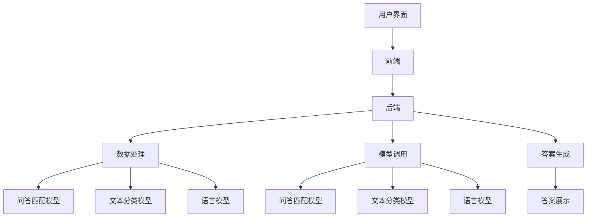
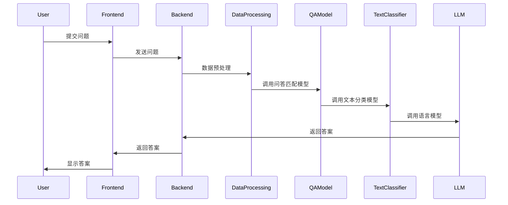

                 

### 文章标题：AI编程助手：提示词工程师的得力助手

关键词：AI编程、提示词工程师、编程助手、自然语言处理、深度学习

摘要：本文将深入探讨AI编程助手在提示词工程师工作中的重要性，通过详细剖析AI编程的基础知识、实践应用以及编程助手的功能，帮助读者了解如何高效利用AI编程助手提升工作效率。本文分为三个部分，首先介绍AI编程的基础知识，包括Python编程基础、NumPy与Pandas库、机器学习基础和深度学习基础；其次，通过实际案例展示AI编程的实践应用；最后，重点介绍AI编程助手的概述、工具介绍、实战应用以及未来展望，为提示词工程师提供实用的参考。

## 目录大纲：AI编程助手：提示词工程师的得力助手

### 第一部分：AI编程基础

#### 第1章：AI编程概述

- **1.1 问题背景与概述**
- **1.2 AI编程的基本概念**
- **1.3 AI编程的应用领域**
- **1.4 AI编程的基本流程**

#### 第2章：Python编程基础

- **2.1 Python语言简介**
- **2.2 Python基本语法**
- **2.3 Python数据类型与变量**
- **2.4 控制流程与函数**

#### 第3章：NumPy与Pandas库

- **3.1 NumPy库基础**
- **3.2 Pandas库基础**
- **3.3 数据处理实践**

#### 第4章：机器学习基础

- **4.1 机器学习概述**
- **4.2 特征工程**
- **4.3 模型选择与评估**

#### 第5章：深度学习基础

- **5.1 深度学习概述**
- **5.2 神经网络基础**
- **5.3 深度学习框架**

### 第二部分：AI编程实践

#### 第6章：自然语言处理

- **6.1 自然语言处理概述**
- **6.2 语言模型与生成**
- **6.3 文本分类与情感分析**
- **6.4 实体识别与关系抽取**

#### 第7章：图像处理与计算机视觉

- **7.1 图像处理基础**
- **7.2 计算机视觉概述**
- **7.3 目标检测与识别**
- **7.4 图像生成与风格转换**

#### 第8章：强化学习应用

- **8.1 强化学习概述**
- **8.2 策略梯度方法**
- **8.3 Q-Learning算法**
- **8.4 实际案例解析**

#### 第9章：综合实践项目

- **9.1 项目介绍**
- **9.2 系统设计与实现**
- **9.3 结果分析**
- **9.4 项目总结**

### 第三部分：AI编程助手应用

#### 第10章：AI编程助手概述

- **10.1 编程助手功能与优势**
- **10.2 提示词工程师的角色与责任**

#### 第11章：编程助手工具介绍

- **11.1 常用编程助手工具**
- **11.2 编程助手的集成与使用**

#### 第12章：编程助手实战

- **12.1 实战项目简介**
- **12.2 编程助手应用步骤**
- **12.3 结果分析与反馈**

#### 第13章：AI编程助手未来展望

- **13.1 AI编程助手的趋势与发展**
- **13.2 提示词工程师的进阶之路**

### 第一部分：AI编程基础

#### 第1章：AI编程概述

##### **1.1 问题背景与概述**

在当前科技迅猛发展的时代，人工智能（AI）已经成为改变世界的重要力量。从智能助手到自动驾驶，从医疗诊断到金融分析，AI的应用领域日益广泛，逐渐渗透到我们日常生活的各个方面。然而，AI的发展离不开编程的支持，编程是AI实现的基石。

**提示词工程师**是专门负责编写和优化AI程序的专业人员，他们需要处理大量的数据，设计复杂的算法，实现高效的模型训练和部署。在这个高度专业化的工作中，传统的编程方法已经难以满足高效、准确的需求，这就需要一种新的工具——AI编程助手。

AI编程助手是一种基于人工智能技术的编程辅助工具，它能够通过学习用户的行为和代码风格，提供智能化的代码建议、错误检查和自动化修复。对于提示词工程师来说，AI编程助手不仅能够提高编程效率，还能减少编程错误，提升代码质量。

##### **1.2 AI编程的基本概念**

AI编程，简单来说，就是利用人工智能技术来编写、优化和维护代码。它涉及多个领域的知识，包括计算机科学、数学、统计学、机器学习和自然语言处理等。

- **人工智能**：人工智能是指通过计算机模拟人类智能行为的技术，包括感知、思考、学习、决策和行动等。

- **编程**：编程是指用程序设计语言编写代码，实现特定功能的操作过程。

- **AI编程助手**：AI编程助手是一种特殊的编程工具，它利用人工智能技术，为用户提供代码建议、错误检查和自动化修复等功能。

##### **1.3 AI编程的应用领域**

AI编程的应用领域非常广泛，以下是一些典型的应用场景：

- **自然语言处理**：利用AI编程实现智能助手、机器翻译、文本分类、情感分析等。

- **计算机视觉**：利用AI编程实现图像识别、目标检测、人脸识别、图像生成等。

- **强化学习**：利用AI编程实现智能推荐系统、游戏AI、自动驾驶等。

- **数据分析**：利用AI编程实现数据清洗、数据挖掘、数据可视化等。

##### **1.4 AI编程的基本流程**

AI编程的基本流程可以分为以下几个步骤：

1. **需求分析**：明确项目需求，确定目标功能和性能要求。

2. **数据准备**：收集和整理数据，进行数据清洗和预处理。

3. **算法选择**：根据需求选择合适的算法，进行模型设计和训练。

4. **代码编写**：根据算法设计，编写程序代码。

5. **调试与优化**：测试代码，修复错误，优化性能。

6. **部署与维护**：将程序部署到生产环境，进行监控和维护。

##### **小结**

AI编程是人工智能领域的重要组成部分，它通过编程实现AI的应用。AI编程助手作为编程的辅助工具，能够大幅提升编程效率和质量。提示词工程师需要掌握AI编程的基本概念和应用，学会使用AI编程助手，以应对日益复杂和庞大的编程任务。

在下一章中，我们将进一步探讨Python编程基础，帮助读者打下坚实的编程基础。

## 第一部分：AI编程基础

### 第2章：Python编程基础

Python作为一种高级编程语言，以其简洁明了的语法和强大的功能广泛应用于人工智能领域。在本章中，我们将系统地介绍Python编程的基础知识，包括语言简介、基本语法、数据类型与变量、控制流程与函数，帮助读者构建起Python编程的基石。

#### **2.1 Python语言简介**

Python是由Guido van Rossum于1989年圣诞节期间开发的一种解释型、高级编程语言。Python的设计哲学强调代码的可读性和简洁性，其语法接近自然语言，易于学习和使用。Python是一种多范式编程语言，支持过程式编程、面向对象编程和函数式编程。

**特点：**

1. **简洁明了的语法**：Python的语法设计简洁，易于理解，代码可读性强。
2. **跨平台性**：Python可以在多种操作系统上运行，包括Windows、Linux和Mac OS。
3. **丰富的库支持**：Python拥有丰富的标准库和第三方库，可以轻松实现各种功能。
4. **强大的社区支持**：Python拥有庞大的开发者社区，提供了大量的资源和支持。

**应用领域：**

1. **Web开发**：Python可以用于构建各种类型的Web应用程序，如Django、Flask等框架。
2. **科学计算**：Python在数据分析、机器学习和科学计算等领域有广泛应用。
3. **自动化脚本**：Python常用于编写自动化脚本，如系统运维、网络爬虫等。
4. **人工智能**：Python在人工智能领域有着广泛的应用，特别是在机器学习和深度学习领域。

#### **2.2 Python基本语法**

Python的基本语法包括变量、数据类型、控制流程、函数和模块等。

**变量**

在Python中，变量是用于存储数据的容器。变量的定义非常简单，例如：

```python
x = 10
y = "Hello, World!"
```

Python是动态类型语言，因此不需要显式声明变量类型。

**数据类型**

Python支持多种数据类型，包括整数（int）、浮点数（float）、字符串（str）、列表（list）、元组（tuple）、集合（set）和字典（dict）。

- **整数（int）**：用于存储整数，例如：

  ```python
  x = 5
  ```

- **浮点数（float）**：用于存储浮点数，例如：

  ```python
  y = 3.14
  ```

- **字符串（str）**：用于存储文本，例如：

  ```python
  name = "Alice"
  ```

- **列表（list）**：用于存储有序集合，例如：

  ```python
  fruits = ["apple", "banana", "cherry"]
  ```

- **元组（tuple）**：用于存储不可变集合，例如：

  ```python
  coordinates = (10, 20)
  ```

- **集合（set）**：用于存储无序集合，例如：

  ```python
  numbers = {1, 2, 3, 4, 5}
  ```

- **字典（dict）**：用于存储键值对，例如：

  ```python
  person = {"name": "Alice", "age": 30}
  ```

**控制流程**

Python提供了多种控制流程语句，包括条件语句、循环语句和异常处理。

- **条件语句**：用于根据条件执行不同的代码块，例如：

  ```python
  if x > 10:
      print("x is greater than 10")
  elif x == 10:
      print("x is equal to 10")
  else:
      print("x is less than 10")
  ```

- **循环语句**：用于重复执行代码块，包括for循环和while循环，例如：

  ```python
  for i in range(5):
      print(i)

  x = 0
  while x < 5:
      print(x)
      x += 1
  ```

- **异常处理**：用于处理程序运行时可能发生的错误，例如：

  ```python
  try:
      x = 1 / 0
  except ZeroDivisionError:
      print("Cannot divide by zero")
  ```

**函数**

函数是Python中的核心概念，用于定义可重复使用的代码块。函数的定义和使用如下：

```python
def greet(name):
    print("Hello, " + name)

greet("Alice")
```

#### **2.3 Python数据类型与变量**

在Python中，变量是用于存储数据的容器。Python是一种动态类型语言，因此不需要显式声明变量类型。变量的定义和使用非常简单，例如：

```python
x = 10          # 整数
y = 3.14        # 浮点数
name = "Alice"  # 字符串
fruits = ["apple", "banana", "cherry"]  # 列表
person = {"name": "Alice", "age": 30}  # 字典
```

**数据类型**

Python支持多种数据类型，包括整数（int）、浮点数（float）、字符串（str）、列表（list）、元组（tuple）、集合（set）和字典（dict）。

- **整数（int）**：用于存储整数，例如：

  ```python
  x = 5
  ```

- **浮点数（float）**：用于存储浮点数，例如：

  ```python
  y = 3.14
  ```

- **字符串（str）**：用于存储文本，例如：

  ```python
  name = "Alice"
  ```

- **列表（list）**：用于存储有序集合，例如：

  ```python
  fruits = ["apple", "banana", "cherry"]
  ```

- **元组（tuple）**：用于存储不可变集合，例如：

  ```python
  coordinates = (10, 20)
  ```

- **集合（set）**：用于存储无序集合，例如：

  ```python
  numbers = {1, 2, 3, 4, 5}
  ```

- **字典（dict）**：用于存储键值对，例如：

  ```python
  person = {"name": "Alice", "age": 30}
  ```

**变量类型**

Python中的变量类型是动态确定的，这意味着在运行时，Python会自动根据变量的值确定其类型。例如：

```python
x = 10        # 整数
x = "Alice"   # 字符串
```

在上述代码中，变量`x`首先被赋值为整数10，然后在后续被赋值为字符串"Alice"。Python会根据变量的最新值确定其类型。

**类型转换**

Python提供了多种内置函数用于类型转换，例如`int()`, `float()`, `str()`等。例如：

```python
x = int("10")      # 字符串转换为整数
y = float("3.14")  # 字符串转换为浮点数
z = str(5)         # 整数转换为字符串
```

#### **2.4 控制流程与函数**

Python提供了多种控制流程语句，包括条件语句、循环语句和异常处理。

**条件语句**

条件语句用于根据条件执行不同的代码块。Python支持`if`、`elif`和`else`语句，例如：

```python
if x > 10:
    print("x is greater than 10")
elif x == 10:
    print("x is equal to 10")
else:
    print("x is less than 10")
```

在上述代码中，根据变量`x`的值，执行相应的代码块。

**循环语句**

循环语句用于重复执行代码块。Python支持`for`和`while`循环。

- **for循环**：用于迭代序列中的元素，例如：

  ```python
  for i in range(5):
      print(i)
  ```

  在上述代码中，`range(5)`生成一个包含0到4的整数序列，`for`循环依次迭代这些元素，并打印出来。

- **while循环**：用于根据条件重复执行代码块，例如：

  ```python
  x = 0
  while x < 5:
      print(x)
      x += 1
  ```

  在上述代码中，`while`循环根据条件`x < 5`重复执行代码块，直到条件不满足为止。

**异常处理**

异常处理用于处理程序运行时可能发生的错误。Python提供了`try`、`except`和`finally`语句，例如：

```python
try:
    x = 1 / 0
except ZeroDivisionError:
    print("Cannot divide by zero")
finally:
    print("Execution finished")
```

在上述代码中，`try`块中的代码可能会引发异常，`except`块用于捕获并处理异常，`finally`块用于执行无论异常是否发生都会执行的代码。

**函数**

函数是Python中的核心概念，用于定义可重复使用的代码块。函数的定义和使用如下：

```python
def greet(name):
    print("Hello, " + name)

greet("Alice")
```

在上述代码中，`greet`函数用于打印问候语。函数的定义使用`def`关键字，函数的调用使用函数名和括号。

**参数**

函数可以接受参数，参数是函数体内部使用的变量。函数的定义和调用如下：

```python
def greet(name):
    print("Hello, " + name)

greet("Alice")  # 调用函数并传递参数
```

在上述代码中，`greet`函数接受一个名为`name`的参数，并在函数体内使用该参数。

**返回值**

函数可以返回值，返回值是函数执行后的结果。函数的定义和调用如下：

```python
def greet(name):
    return "Hello, " + name

message = greet("Alice")  # 调用函数并获取返回值
print(message)
```

在上述代码中，`greet`函数返回一个字符串，并在调用时获取返回值。

**默认参数**

函数可以具有默认参数，默认参数是在调用函数时如果没有提供对应参数时使用的值。函数的定义和调用如下：

```python
def greet(name="World"):
    print("Hello, " + name)

greet()  # 调用函数，使用默认参数
greet("Alice")  # 调用函数，提供参数
```

在上述代码中，`greet`函数有一个默认参数`name="World"`，如果没有提供参数，则使用默认值。

**关键字参数**

函数可以接受关键字参数，关键字参数是在调用函数时使用参数名和值的形式提供的。函数的定义和调用如下：

```python
def greet(name, age):
    print(f"Hello, {name}. You are {age} years old.")

greet(name="Alice", age=30)  # 调用函数，使用关键字参数
```

在上述代码中，`greet`函数接受两个关键字参数`name`和`age`，并在函数体内使用这两个参数。

**可变参数**

函数可以接受可变参数，可变参数是用于传递任意数量参数的一种方式。函数的定义和调用如下：

```python
def greet(*names):
    for name in names:
        print(f"Hello, {name}")

greet("Alice", "Bob", "Charlie")  # 调用函数，使用可变参数
```

在上述代码中，`greet`函数接受任意数量的参数，并在函数体内使用这些参数。

**函数作为参数**

函数可以作为参数传递给其他函数。函数的定义和调用如下：

```python
def greet(name):
    print(f"Hello, {name}")

def say_hello(func):
    func("Alice")

say_hello(greet)  # 调用函数并传递函数作为参数
```

在上述代码中，`say_hello`函数接受一个名为`func`的函数作为参数，并在函数体内调用该参数。

**闭包**

闭包是Python中的一种高级特性，它允许函数访问并记住其定义时的环境状态。闭包的定义和调用如下：

```python
def outer():
    name = "Alice"
    def inner():
        print(f"Hello, {name}")
    return inner

greet = outer()
greet()  # 调用闭包函数
```

在上述代码中，`outer`函数定义了一个内部函数`inner`，并在返回`inner`函数的同时保存了其环境状态。调用闭包函数时，`inner`函数可以访问并使用外部函数的变量。

**装饰器**

装饰器是Python中用于修改函数行为的特殊函数。装饰器的定义和调用如下：

```python
def decor(func):
    def wrapper():
        print("Before function execution.")
        func()
        print("After function execution.")
    return wrapper

@decor
def greet():
    print("Hello, World!")

greet()  # 调用装饰器函数
```

在上述代码中，`decor`函数是一个装饰器，它接受一个函数`func`作为参数，并在函数执行前后添加额外的代码。使用`@decor`语法可以将`greet`函数装饰为带有额外行为的函数。

**小结**

Python作为一种高级编程语言，以其简洁明了的语法和强大的功能广泛应用于人工智能领域。本章介绍了Python的基本语法、数据类型与变量、控制流程与函数，为读者构建了Python编程的基石。在下一章中，我们将进一步探讨NumPy与Pandas库，帮助读者掌握Python在数据处理和数据分析方面的应用。

## 第一部分：AI编程基础

### 第3章：NumPy与Pandas库

NumPy和Pandas是Python中最常用的两个数据处理库，它们在AI编程中起着至关重要的作用。本章将详细介绍NumPy和Pandas的基本概念、功能和用法，帮助读者熟练掌握这两个库，提高数据处理和分析的效率。

#### **3.1 NumPy库基础**

NumPy（Numerical Python）是一个强大的Python库，用于支持大型多维数组和矩阵运算。它是Python在科学计算领域的重要工具，广泛用于数据分析、机器学习和深度学习等领域。

**NumPy的基本概念**

- **数组（Array）**：NumPy的核心是数组对象，它是一种多维数组结构，可以存储整数、浮点数、字符串等不同类型的数据。
- **维度（Dimension）**：数组的维度表示数组中有几个轴，通常用字母`ndarray`表示。
- **形状（Shape）**：数组的形状是指数组中元素的数量和排列方式，通常用元组表示。
- **数据类型（Datatype）**：数组中的每个元素都有特定的数据类型，NumPy支持多种内置数据类型，如int32、float64等。

**NumPy的功能**

- **创建数组**：NumPy提供了多种方式来创建数组，包括使用内置函数`numpy.array()`和`numpy.zeros()`、`numpy.ones()`等。
- **数组操作**：NumPy支持数组的索引、切片、迭代、数学运算和统计操作等功能。
- **矩阵运算**：NumPy提供了高效的矩阵运算函数，如矩阵乘法、矩阵分解等。
- **随机数生成**：NumPy提供了丰富的随机数生成函数，如`numpy.random.normal()`、`numpy.random.randint()`等。

**NumPy的用法**

**创建数组**

```python
import numpy as np

# 创建一维数组
arr1 = np.array([1, 2, 3, 4, 5])
arr2 = np.zeros(5)
arr3 = np.ones(5)
arr4 = np.arange(0, 10, 2)

# 创建二维数组
arr5 = np.array([[1, 2], [3, 4]])
arr6 = np.zeros((3, 4))
arr7 = np.ones((3, 4))
arr8 = np.arange(0, 12).reshape(3, 4)
```

**数组操作**

```python
# 索引和切片
print(arr1[0])  # 访问第一个元素
print(arr1[-1])  # 访问最后一个元素
print(arr1[1:3])  # 访问第二个到第三个元素

# 数学运算
print(arr1 + arr2)  # 加法运算
print(arr1 * arr3)  # 乘法运算
print(arr4.mean())  # 计算均值
print(arr5.sum(axis=1))  # 计算每一行的和
```

**矩阵运算**

```python
# 矩阵乘法
matrix1 = np.array([[1, 2], [3, 4]])
matrix2 = np.array([[5, 6], [7, 8]])
result = np.dot(matrix1, matrix2)

# 矩阵分解
matrix3 = np.linalg.inv(matrix1)
matrix4 = np.linalg.eig(matrix2)
```

**随机数生成**

```python
# 生成正态分布的随机数
random_numbers = np.random.normal(loc=0.0, scale=1.0, size=10)

# 生成整数随机数
random_integers = np.random.randint(low=0, high=10, size=5)
```

#### **3.2 Pandas库基础**

Pandas是一个强大的数据操作和分析库，它提供了灵活的数据结构，用于处理结构化数据（如表格数据）。Pandas基于NumPy构建，可以方便地处理大型数据集，并进行数据清洗、转换和分析。

**Pandas的基本概念**

- **DataFrame**：DataFrame是Pandas的核心数据结构，类似于Excel表格或SQL表，具有列和行。它是一个包含多个数组的二维表格。
- **Series**：Series是一个一维数组，具有轴标签（index）。它可以看作是DataFrame的一个列。
- **索引（Index）**：索引是DataFrame和Series的轴标签，用于标识数据的位置。

**Pandas的功能**

- **数据读取与写入**：Pandas支持多种数据格式的读写，包括CSV、Excel、JSON、SQL数据库等。
- **数据清洗与转换**：Pandas提供了丰富的数据清洗和转换功能，如缺失值处理、数据类型转换、数据排序等。
- **数据分析**：Pandas提供了强大的数据分析功能，如描述性统计、分组操作、聚合操作等。

**Pandas的用法**

**创建DataFrame**

```python
import pandas as pd

# 使用字典创建DataFrame
data = {'name': ['Alice', 'Bob', 'Charlie'], 'age': [25, 30, 35]}
df = pd.DataFrame(data)

# 使用数组和索引创建DataFrame
arr = np.array([[1, 2], [3, 4], [5, 6]])
index = pd.Index(['row1', 'row2', 'row3'])
df2 = pd.DataFrame(arr, index=index, columns=['col1', 'col2'])
```

**数据操作**

```python
# 索引和选择
print(df['name'])  # 选择一个列
print(df.loc[0])  # 选择行和列
print(df.iloc[1:3])  # 选择行和列

# 数据清洗
df2 = df.copy()
df2['age'] = df2['age'].replace({30: np.nan})  # 替换缺失值
df2 = df2.dropna()  # 删除缺失值

# 数据转换
df2['age'] = df2['age'].astype(int)  # 转换数据类型
df2 = df2.sort_values(by='age', ascending=False)  # 排序
```

**数据分析**

```python
# 描述性统计
print(df.describe())

# 分组操作
print(df.groupby('name')['age'].mean())

# 聚合操作
print(df.groupby('name').agg({'age': ['mean', 'sum', 'std']})
```

**数据读取与写入**

```python
# 读取CSV文件
df = pd.read_csv('data.csv')

# 写入CSV文件
df.to_csv('output.csv', index=False)
```

#### **3.3 数据处理实践**

在实际应用中，数据处理通常包括数据读取、清洗、转换和分析等多个步骤。以下是一个简单的数据处理实践案例：

**案例：读取CSV文件，清洗数据，转换数据类型，计算描述性统计，并保存结果。**

```python
import pandas as pd

# 读取CSV文件
df = pd.read_csv('data.csv')

# 清洗数据
df = df.dropna()  # 删除缺失值
df = df[['name', 'age', 'salary']]  # 选择需要的列

# 转换数据类型
df['age'] = df['age'].astype(int)
df['salary'] = df['salary'].astype(float)

# 计算描述性统计
desc_stats = df.describe()

# 保存结果
df.to_csv('cleaned_data.csv', index=False)
desc_stats.to_csv('description_stats.csv', index=False)
```

#### **小结**

NumPy和Pandas是Python中最常用的数据处理库，NumPy提供了强大的多维数组操作功能，而Pandas则提供了丰富的数据清洗、转换和分析功能。掌握NumPy和Pandas的基本概念和用法对于进行AI编程和数据处理至关重要。在下一章中，我们将探讨机器学习的基础知识，包括其基本概念、应用领域和基本流程。

## 第一部分：AI编程基础

### 第4章：机器学习基础

机器学习是人工智能领域的一个重要分支，通过训练模型从数据中自动学习规律和模式。在本章中，我们将详细探讨机器学习的基本概念、应用领域和基本流程，帮助读者建立对机器学习的全面理解。

#### **4.1 机器学习概述**

机器学习（Machine Learning）是一种让计算机通过数据自动学习，从而进行决策和预测的技术。其核心思想是通过大量数据训练模型，使模型能够从数据中学习到有用的规律，然后在新数据上进行预测。

**基本概念**

- **模型（Model）**：机器学习模型是对学习到数据的数学表示，通常是一个函数或一组参数。
- **训练（Training）**：训练是指使用已有数据集来训练模型，使模型能够学习到数据中的规律。
- **预测（Prediction）**：预测是指使用训练好的模型在新数据上进行预测，得到可能的输出结果。
- **评估（Evaluation）**：评估是指使用评估指标来衡量模型性能，确定模型是否达到预期效果。

**分类方法**

机器学习方法可以分为监督学习、无监督学习和强化学习三种类型。

- **监督学习（Supervised Learning）**：监督学习是指使用已知标签数据来训练模型，然后使用模型进行预测。常见的监督学习算法包括线性回归、决策树、支持向量机等。
- **无监督学习（Unsupervised Learning）**：无监督学习是指在没有已知标签数据的情况下，通过发现数据中的规律和结构来进行学习。常见的无监督学习算法包括聚类、降维、关联规则学习等。
- **强化学习（Reinforcement Learning）**：强化学习是指通过奖励和惩罚机制来训练模型，使其能够学习到最优策略。常见的强化学习算法包括Q-Learning、Deep Q-Network等。

#### **4.2 机器学习的应用领域**

机器学习在各个领域都有广泛的应用，以下是一些典型的应用场景：

- **自然语言处理（NLP）**：机器学习在自然语言处理领域用于文本分类、情感分析、机器翻译等。
- **计算机视觉**：机器学习在计算机视觉领域用于图像分类、目标检测、图像生成等。
- **推荐系统**：机器学习在推荐系统用于预测用户兴趣，为用户推荐相关商品、新闻等。
- **医疗诊断**：机器学习在医疗诊断领域用于疾病预测、药物发现等。
- **金融分析**：机器学习在金融分析领域用于风险预测、市场预测等。
- **交通管理**：机器学习在交通管理领域用于交通流量预测、交通事故预测等。

#### **4.3 机器学习的基本流程**

机器学习的基本流程可以分为以下几个步骤：

1. **问题定义**：明确机器学习的目标和问题类型，例如分类、回归或聚类。
2. **数据收集**：收集用于训练模型的数据集，数据可以是结构化数据、非结构化数据或图像数据。
3. **数据预处理**：对数据进行清洗、归一化、缺失值处理等预处理步骤，以提高数据质量和模型性能。
4. **特征工程**：从原始数据中提取有用的特征，特征工程是影响模型性能的关键因素。
5. **模型选择**：根据问题类型和特征数据，选择合适的机器学习算法和模型。
6. **模型训练**：使用训练数据集对模型进行训练，学习数据中的规律和模式。
7. **模型评估**：使用评估指标（如准确率、召回率、F1分数等）来评估模型性能。
8. **模型优化**：根据评估结果，对模型进行调参、特征选择等优化，以提高模型性能。
9. **模型部署**：将训练好的模型部署到实际应用中，进行预测和决策。

#### **4.4 常见机器学习算法**

以下是一些常见的机器学习算法及其基本原理：

1. **线性回归（Linear Regression）**：线性回归是一种用于预测数值型目标变量的算法，通过拟合一条直线来描述输入变量和输出变量之间的关系。

   **原理**：线性回归模型的数学表达式为`y = wx + b`，其中`x`是输入变量，`w`是权重，`b`是偏置。

2. **决策树（Decision Tree）**：决策树是一种基于树形结构进行决策的算法，通过递归划分特征空间，将数据划分为不同的区域。

   **原理**：决策树通过计算每个特征的信息增益或基尼指数来选择最佳的划分特征，并递归地划分数据。

3. **支持向量机（Support Vector Machine, SVM）**：支持向量机是一种用于分类和回归的算法，通过找到最优的超平面来分离不同类别的数据。

   **原理**：SVM通过求解最优化问题，找到最优的决策边界，使分类边界最大化。

4. **神经网络（Neural Network）**：神经网络是一种基于生物神经元工作原理的算法，通过多层神经网络进行特征提取和分类。

   **原理**：神经网络通过前向传播和反向传播来更新网络权重，使模型能够学习到输入和输出之间的非线性关系。

5. **K-均值聚类（K-Means Clustering）**：K-均值聚类是一种无监督学习算法，通过迭代优化聚类中心来将数据划分为K个簇。

   **原理**：K-均值聚类通过计算每个数据点到聚类中心的距离，将数据划分为最近的簇。

6. **K最近邻（K-Nearest Neighbors, KNN）**：K最近邻是一种基于实例的学习算法，通过找到最近的K个邻居来预测新数据的标签。

   **原理**：KNN通过计算新数据与训练样本之间的距离，选择距离最近的K个样本，并基于这些样本的标签进行预测。

#### **4.5 机器学习的挑战与趋势**

尽管机器学习在各个领域取得了显著的进展，但仍然面临着一些挑战和趋势：

1. **数据隐私和安全**：机器学习依赖于大量数据，但数据隐私和安全问题日益突出，如何确保数据的安全性和隐私性是一个重要挑战。
2. **可解释性**：机器学习模型通常被视为“黑箱”，其决策过程难以解释。提高模型的可解释性是当前的研究热点。
3. **计算资源**：机器学习算法通常需要大量的计算资源，随着数据规模的增加，计算资源的需求也在不断增加。
4. **算法公平性和透明性**：机器学习模型可能导致不公平的决策，如何确保算法的公平性和透明性是一个重要的社会问题。
5. **跨学科合作**：机器学习与其他领域的交叉融合，如医学、金融、环境科学等，将为未来的发展带来新的机遇。

#### **小结**

机器学习作为人工智能的核心技术，已经在各个领域取得了显著的成果。本章介绍了机器学习的基本概念、应用领域和基本流程，并探讨了常见的机器学习算法。掌握机器学习的基础知识对于从事AI编程至关重要。在下一章中，我们将进一步探讨深度学习的基础知识，为读者揭示人工智能领域的又一重要技术。

## 第一部分：AI编程基础

### 第5章：深度学习基础

深度学习是机器学习的一个重要分支，通过多层神经网络模型实现数据的自动特征学习和复杂模式识别。本章将详细讲解深度学习的基本概念、神经网络基础以及深度学习框架，帮助读者深入了解深度学习的原理和应用。

#### **5.1 深度学习概述**

深度学习（Deep Learning）是模拟人脑神经网络结构的一种计算模型，通过多层次的神经网络结构，实现对数据的自动特征学习和复杂模式识别。深度学习在图像识别、语音识别、自然语言处理等领域取得了显著成就。

**基本概念**

- **深度神经网络（Deep Neural Network, DNN）**：深度神经网络是由多层神经元组成的神经网络，通过逐层提取特征，实现对数据的复杂表示。
- **激活函数（Activation Function）**：激活函数是神经网络中用于引入非线性特性的函数，常见的激活函数包括ReLU、Sigmoid和Tanh等。
- **损失函数（Loss Function）**：损失函数用于衡量模型预测值与真实值之间的差距，常见的损失函数包括均方误差（MSE）、交叉熵（Cross Entropy）等。
- **反向传播（Backpropagation）**：反向传播是一种用于训练神经网络的算法，通过反向传播误差信号，更新网络权重，优化模型性能。

**应用领域**

- **图像识别**：深度学习在图像识别领域取得了显著的成果，如人脸识别、物体识别等。
- **语音识别**：深度学习在语音识别领域用于语音信号处理、说话人识别等。
- **自然语言处理**：深度学习在自然语言处理领域用于文本分类、情感分析、机器翻译等。
- **强化学习**：深度学习在强化学习领域用于实现智能决策系统，如自动驾驶、游戏AI等。

#### **5.2 神经网络基础**

神经网络是深度学习的基础，由大量的神经元组成，通过前向传播和反向传播进行训练和预测。

**神经元结构**

一个简单的神经元模型由输入层、输出层和隐藏层组成，每个层包含多个神经元。每个神经元接收来自前一层神经元的输入，并通过权重和偏置进行加权求和，然后应用激活函数。

**前向传播**

前向传播是指将输入数据通过神经网络层逐层传递，直到输出层得到预测结果。每个神经元的输出是前一层所有神经元的输入加权求和，并经过激活函数处理。

```python
# 前向传播示例
def forward_propagation(x, weights, biases, activation_function):
    z = np.dot(x, weights) + biases
    a = activation_function(z)
    return a
```

**反向传播**

反向传播是指通过输出误差信号，反向更新神经网络中的权重和偏置，优化模型性能。反向传播算法通过梯度下降法，计算损失函数关于模型参数的梯度，并更新模型参数。

```python
# 反向传播示例
def backward_propagation(y, a, weights, biases, learning_rate):
    delta = a - y
    dZ = delta * activation_function_derivative(a)
    dW = np.dot(dZ, x.T)
    db = np.sum(dZ, axis=1, keepdims=True)
    weights -= learning_rate * dW
    biases -= learning_rate * db
    return weights, biases
```

#### **5.3 深度学习框架**

深度学习框架是用于构建和训练深度学习模型的高级工具，常见的深度学习框架包括TensorFlow、PyTorch等。

**TensorFlow**

TensorFlow是Google开发的一款开源深度学习框架，它提供了丰富的API和工具，用于构建、训练和部署深度学习模型。

**安装与使用**

```bash
pip install tensorflow
```

```python
import tensorflow as tf

# 定义模型
model = tf.keras.Sequential([
    tf.keras.layers.Dense(128, activation='relu', input_shape=(784,)),
    tf.keras.layers.Dropout(0.2),
    tf.keras.layers.Dense(10, activation='softmax')
])

# 编译模型
model.compile(optimizer='adam',
              loss='categorical_crossentropy',
              metrics=['accuracy'])

# 训练模型
model.fit(x_train, y_train, epochs=5, batch_size=64)
```

**PyTorch**

PyTorch是Facebook开发的一款开源深度学习框架，以其灵活性和高效性著称。

**安装与使用**

```bash
pip install torch torchvision
```

```python
import torch
import torch.nn as nn
import torch.optim as optim

# 定义模型
class NeuralNetwork(nn.Module):
    def __init__(self):
        super(NeuralNetwork, self).__init__()
        self.layer1 = nn.Linear(784, 128)
        self.layer2 = nn.Linear(128, 10)
    
    def forward(self, x):
        x = torch.relu(self.layer1(x))
        x = self.layer2(x)
        return x

# 实例化模型
model = NeuralNetwork()

# 编译模型
optimizer = optim.Adam(model.parameters(), lr=0.001)
criterion = nn.CrossEntropyLoss()

# 训练模型
for epoch in range(5):
    for inputs, targets in data_loader:
        optimizer.zero_grad()
        outputs = model(inputs)
        loss = criterion(outputs, targets)
        loss.backward()
        optimizer.step()
```

#### **小结**

深度学习作为人工智能领域的重要技术，已经广泛应用于图像识别、语音识别、自然语言处理等各个领域。本章介绍了深度学习的基本概念、神经网络基础以及深度学习框架，为读者提供了深入了解深度学习的基础。掌握深度学习的基础知识对于进行AI编程至关重要。在下一章中，我们将探讨自然语言处理的应用，展示深度学习在自然语言处理领域的强大能力。

## 第二部分：AI编程实践

### 第6章：自然语言处理

自然语言处理（Natural Language Processing，NLP）是人工智能领域的一个重要分支，致力于使计算机理解和生成人类语言。在本章中，我们将探讨自然语言处理的基本概念、应用领域，并详细介绍语言模型、文本分类与情感分析、实体识别与关系抽取等方面的技术。

#### **6.1 自然语言处理概述**

自然语言处理涉及多个学科，包括语言学、计算机科学、机器学习、统计学等。其核心目标是使计算机能够理解、生成和处理自然语言，实现人与机器的智能交互。

**基本概念**

- **分词（Tokenization）**：将文本拆分为单词、短语或符号，是NLP的第一步。
- **词性标注（Part-of-Speech Tagging）**：对文本中的每个单词进行词性标注，如名词、动词、形容词等。
- **句法分析（Syntax Analysis）**：分析文本的句法结构，包括短语结构、语法关系等。
- **语义分析（Semantic Analysis）**：理解文本中的含义和意图，包括实体识别、事件抽取等。

**应用领域**

- **文本分类（Text Classification）**：将文本数据分类到预定义的类别中，如垃圾邮件检测、新闻分类等。
- **情感分析（Sentiment Analysis）**：分析文本中的情感倾向，如正面、负面或中性情感。
- **机器翻译（Machine Translation）**：将一种自然语言翻译成另一种自然语言，如Google翻译。
- **问答系统（Question Answering）**：回答用户提出的问题，如Siri、Alexa等智能助手。
- **语音识别（Speech Recognition）**：将语音转换为文本，如手机语音助手、车载语音系统等。

#### **6.2 语言模型与生成**

语言模型（Language Model）是NLP的核心技术，用于预测文本序列的概率分布。语言模型广泛应用于文本生成、机器翻译、语音识别等领域。

**基本概念**

- **n-gram模型**：n-gram模型是一种基于历史数据的概率模型，通过计算历史n个单词出现的频率来预测下一个单词。
- **神经网络语言模型**：神经网络语言模型使用深度神经网络来学习文本序列的概率分布，常见的模型包括循环神经网络（RNN）、长短时记忆网络（LSTM）、门控循环单元（GRU）等。

**应用示例**

**n-gram模型**

```python
from nltk import ngrams

text = "I love programming and AI"
n = 2
n_gram_model = ngrams(text.split(), n)

# 预测下一个单词
def predict_next_word(text, n_gram_model):
    current_n_gram = tuple(text.split()[-n:])
    probabilities = {}
    for n_gram, frequency in n_gram_model:
        if n_gram == current_n_gram:
            probabilities[n_gram[-1]] = frequency
    return max(probabilities, key=probabilities.get)

predicted_word = predict_next_word("I love programming", n_gram_model)
print(predicted_word)
```

**神经网络语言模型**

```python
import torch
import torch.nn as nn

class NeuralLanguageModel(nn.Module):
    def __init__(self, vocab_size, embed_size, hidden_size):
        super(NeuralLanguageModel, self).__init__()
        self.embedding = nn.Embedding(vocab_size, embed_size)
        self.lstm = nn.LSTM(embed_size, hidden_size)
        self.fc = nn.Linear(hidden_size, vocab_size)
    
    def forward(self, input_seq, hidden):
        embed = self.embedding(input_seq)
        output, hidden = self.lstm(embed, hidden)
        logits = self.fc(output[-1, :, :])
        return logits, hidden

# 训练神经网络语言模型
model = NeuralLanguageModel(vocab_size, embed_size, hidden_size)
optimizer = torch.optim.Adam(model.parameters(), lr=0.001)
criterion = nn.CrossEntropyLoss()

for epoch in range(num_epochs):
    for input_seq, target in data_loader:
        optimizer.zero_grad()
        logits, hidden = model(input_seq, hidden)
        loss = criterion(logits, target)
        loss.backward()
        optimizer.step()
```

#### **6.3 文本分类与情感分析**

文本分类（Text Classification）是将文本数据分类到预定义的类别中，如垃圾邮件检测、新闻分类等。情感分析（Sentiment Analysis）是分析文本中的情感倾向，如正面、负面或中性情感。

**文本分类**

**基本概念**

- **特征工程**：特征工程是将文本转换为计算机可以理解的特征向量，常用的特征提取方法包括词袋模型（Bag-of-Words，BOW）、TF-IDF等。
- **分类算法**：文本分类算法包括朴素贝叶斯（Naive Bayes）、支持向量机（SVM）、决策树（Decision Tree）等。

**应用示例**

**朴素贝叶斯分类**

```python
from sklearn.feature_extraction.text import TfidfVectorizer
from sklearn.naive_bayes import MultinomialNB
from sklearn.pipeline import make_pipeline

# 文本数据
texts = ["I love programming", "I hate programming", "AI is amazing", "AI is bad"]

# 标签
labels = ["positive", "negative", "positive", "negative"]

# 特征工程
vectorizer = TfidfVectorizer()
X = vectorizer.fit_transform(texts)

# 分类算法
classifier = MultinomialNB()
classifier.fit(X, labels)

# 分类
new_text = "AI is great"
X_new = vectorizer.transform([new_text])
predicted_label = classifier.predict(X_new)
print(predicted_label)
```

**情感分析**

**基本概念**

- **情感词典**：情感词典是一种用于标注文本情感极性的词典，包含正面和负面词汇及其情感强度。
- **机器学习模型**：情感分析常用的机器学习模型包括朴素贝叶斯、逻辑回归、支持向量机等。

**应用示例**

**朴素贝叶斯情感分析**

```python
# 情感词典
positive_words = ["love", "happy", "great"]
negative_words = ["hate", "bad", "sad"]

# 情感词典转换为词向量
positive_vocab = set(positive_words)
negative_vocab = set(negative_words)

# 计算文本的情感极性
def sentiment_analysis(text):
    words = text.split()
    positive_count = sum(word in positive_vocab for word in words)
    negative_count = sum(word in negative_vocab for word in words)
    if positive_count > negative_count:
        return "positive"
    elif negative_count > positive_count:
        return "negative"
    else:
        return "neutral"

# 分析文本
text = "I love programming but I hate debugging"
print(sentiment_analysis(text))
```

#### **6.4 实体识别与关系抽取**

实体识别（Named Entity Recognition，NER）是NLP的一个重要任务，用于识别文本中的命名实体，如人名、地名、组织名等。关系抽取（Relation Extraction）是识别实体之间的语义关系，如朋友关系、隶属关系等。

**实体识别**

**基本概念**

- **基于规则的方法**：基于规则的方法使用预定义的规则来识别命名实体，如正则表达式、词性标注等。
- **基于统计的方法**：基于统计的方法使用机器学习算法来识别命名实体，如条件随机场（CRF）、支持向量机（SVM）等。

**应用示例**

**基于规则的方法**

```python
import re

# 规则定义
rules = [
    ("person", r"[A-Z][a-z]+"),
    ("organization", r"\b[A-Z]+\b"),
    ("location", r"\b\w+\b")
]

# 实体识别
def named_entity_recognition(text):
    entities = []
    for entity_type, pattern in rules:
        matches = re.finditer(pattern, text)
        for match in matches:
            entities.append((match.group(), entity_type))
    return entities

# 分析文本
text = "Alice works at Google in New York."
print(named_entity_recognition(text))
```

**关系抽取**

**基本概念**

- **共指消解（Coreference Resolution）**：共指消解是识别文本中的共指关系，如"he"和"she"的指代关系。
- **图神经网络（Graph Neural Network，GNN）**：图神经网络是用于关系抽取的深度学习模型，能够通过图结构学习实体之间的关系。

**应用示例**

**基于图神经网络的关系抽取**

```python
import torch
import torch.nn as nn
import torch.optim as optim

# 定义模型
class RelationExtractionModel(nn.Module):
    def __init__(self, embed_size, hidden_size):
        super(RelationExtractionModel, self).__init__()
        self.embedding = nn.Embedding(vocab_size, embed_size)
        self.gru = nn.GRU(embed_size, hidden_size)
        self.fc = nn.Linear(hidden_size, 1)
    
    def forward(self, entities, relations):
        embeds = self.embedding(entities)
        hidden, _ = self.gru(embeds)
        logits = self.fc(hidden[-1, :, :])
        return logits

# 训练模型
model = RelationExtractionModel(embed_size, hidden_size)
optimizer = optim.Adam(model.parameters(), lr=0.001)
criterion = nn.BCEWithLogitsLoss()

for epoch in range(num_epochs):
    for entities, relations in data_loader:
        optimizer.zero_grad()
        logits = model(entities, relations)
        loss = criterion(logits, relations)
        loss.backward()
        optimizer.step()
```

#### **小结**

自然语言处理是人工智能领域的一个重要分支，通过语言模型、文本分类与情感分析、实体识别与关系抽取等技术，实现了对文本数据的自动化处理和理解。掌握自然语言处理的基础知识和应用方法，对于进行AI编程和开发智能应用具有重要意义。在下一章中，我们将探讨图像处理与计算机视觉的应用，展示深度学习在视觉领域的强大能力。

## 第二部分：AI编程实践

### 第7章：图像处理与计算机视觉

图像处理与计算机视觉是人工智能领域的重要分支，通过计算机对图像进行分析和处理，实现对图像内容的理解和操作。本章将详细介绍图像处理的基础知识、计算机视觉的应用，以及目标检测与识别、图像生成与风格转换等前沿技术。

#### **7.1 图像处理基础**

图像处理是计算机视觉的基础，它涉及对图像进行增强、滤波、分割和特征提取等操作。

**基本概念**

- **像素（Pixel）**：图像由像素组成，每个像素具有特定的颜色和亮度值。
- **分辨率（Resolution）**：分辨率表示图像的像素数量，通常以宽×高表示。
- **图像类型**：图像可以分为灰度图像、彩色图像和深度图像。
- **图像增强**：图像增强是通过调整图像的亮度、对比度等参数，改善图像的视觉效果。

**图像增强方法**

- **直方图均衡化（Histogram Equalization）**：直方图均衡化是用于改善图像对比度的方法，通过调整图像的亮度分布，使图像中的细节更加明显。
- **滤波（Filtering）**：滤波是用于去除图像噪声的方法，包括均值滤波、高斯滤波和中值滤波等。
- **边缘检测（Edge Detection）**：边缘检测是用于识别图像中的边缘和轮廓的方法，常用的算法包括Canny边缘检测、Sobel边缘检测等。

**图像增强示例**

```python
import cv2
import numpy as np

# 读取图像
image = cv2.imread("image.jpg")

# 直方图均衡化
equaled_image = cv2.equalizeHist(image)

# 显示图像
cv2.imshow("Original Image", image)
cv2.imshow("Equalized Image", equaled_image)
cv2.waitKey(0)
cv2.destroyAllWindows()
```

**滤波示例**

```python
import cv2
import numpy as np

# 读取图像
image = cv2.imread("image.jpg")

# 高斯滤波
blurred_image = cv2.GaussianBlur(image, (5, 5), 0)

# 显示图像
cv2.imshow("Original Image", image)
cv2.imshow("Blurred Image", blurred_image)
cv2.waitKey(0)
cv2.destroyAllWindows()
```

#### **7.2 计算机视觉概述**

计算机视觉是使计算机具有类似人眼识别和感知能力的技术。它涉及图像处理、模式识别、机器学习和人工智能等多个领域。

**基本概念**

- **特征提取**：特征提取是将图像中的关键信息提取出来，用于后续处理和识别。
- **目标检测**：目标检测是在图像中识别和定位特定的目标物体。
- **图像识别**：图像识别是识别图像中的特定对象、场景或动作。
- **视觉感知**：视觉感知是使计算机具有类似人类的视觉感知能力，包括颜色识别、运动感知等。

**应用领域**

- **自动驾驶**：计算机视觉在自动驾驶中用于车辆检测、车道线识别和障碍物检测。
- **人脸识别**：计算机视觉在人脸识别中用于身份验证和面部表情分析。
- **医疗图像分析**：计算机视觉在医疗图像分析中用于疾病诊断、器官识别等。
- **视频监控**：计算机视觉在视频监控中用于目标跟踪、异常行为检测等。

#### **7.3 目标检测与识别**

目标检测与识别是计算机视觉的核心任务，用于在图像或视频中识别和定位特定的目标物体。

**基本概念**

- **单阶段检测器**：单阶段检测器在一次前向传播中同时进行特征提取和目标检测，如SSD、YOLO等。
- **多阶段检测器**：多阶段检测器通过多个网络层逐层提取特征，最终进行目标检测，如Faster R-CNN、R-FCN等。

**目标检测算法**

- **SSD（Single Shot MultiBox Detector）**：SSD是一种单阶段目标检测算法，通过使用不同的尺度和比例进行特征提取和目标检测。
- **YOLO（You Only Look Once）**：YOLO是一种单阶段目标检测算法，通过将图像划分为网格，并在每个网格中预测目标的类别和位置。

**应用示例**

**SSD目标检测**

```python
import cv2
import torch
from torch.utils.data import DataLoader
from torchvision import datasets, transforms

# 加载预训练模型
model = torch.load("ssd_model.pth")
model.eval()

# 定义数据加载器
transform = transforms.Compose([
    transforms.ToTensor(),
    transforms.Normalize(mean=[0.485, 0.456, 0.406], std=[0.229, 0.224, 0.225])
])
dataset = datasets.ImageFolder("data/", transform=transform)
dataloader = DataLoader(dataset, batch_size=1, shuffle=True)

# 目标检测
for images, labels in dataloader:
    images = images.to(device)
    labels = labels.to(device)
    with torch.no_grad():
        outputs = model(images)
    predicted_labels = outputs.argmax(dim=1)
    print(predicted_labels)

# 显示检测结果
for i, image in enumerate(dataset):
    image = image[0].cpu().numpy().transpose(1, 2, 0)
    image = (image * 255).astype(np.uint8)
    cv2.imshow(f"Image {i}", image)
    cv2.waitKey(0)
cv2.destroyAllWindows()
```

**YOLO目标检测**

```python
import cv2
import torch
from torch.utils.data import DataLoader
from torchvision import datasets, transforms

# 加载预训练模型
model = torch.load("yolo_model.pth")
model.eval()

# 定义数据加载器
transform = transforms.Compose([
    transforms.ToTensor(),
    transforms.Normalize(mean=[0.485, 0.456, 0.406], std=[0.229, 0.224, 0.225])
])
dataset = datasets.ImageFolder("data/", transform=transform)
dataloader = DataLoader(dataset, batch_size=1, shuffle=True)

# 目标检测
for images, labels in dataloader:
    images = images.to(device)
    labels = labels.to(device)
    with torch.no_grad():
        outputs = model(images)
    predicted_labels = outputs.argmax(dim=1)
    print(predicted_labels)

# 显示检测结果
for i, image in enumerate(dataset):
    image = image[0].cpu().numpy().transpose(1, 2, 0)
    image = (image * 255).astype(np.uint8)
    cv2.imshow(f"Image {i}", image)
    cv2.waitKey(0)
cv2.destroyAllWindows()
```

#### **7.4 图像生成与风格转换**

图像生成与风格转换是深度学习在计算机视觉领域的两个重要应用，通过生成新的图像或改变图像风格，实现创意图像处理。

**基本概念**

- **生成对抗网络（Generative Adversarial Network，GAN）**：GAN是由两个神经网络（生成器和判别器）组成的对抗性网络，通过博弈过程生成逼真的图像。
- **风格迁移（Style Transfer）**：风格迁移是通过深度学习模型将一种图像的风格应用到另一种图像上，实现图像风格的转换。

**GAN生成图像**

**应用示例**

```python
import torch
import torchvision
from torchvision import datasets, transforms
from torch.utils.data import DataLoader
import matplotlib.pyplot as plt

# 加载预训练模型
model = torch.load("gan_model.pth")
model.eval()

# 定义数据加载器
transform = transforms.Compose([
    transforms.Resize(256),
    transforms.ToTensor(),
    transforms.Normalize((0.5, 0.5, 0.5), (0.5, 0.5, 0.5))
])
dataset = datasets.ImageFolder("data/", transform=transform)
dataloader = DataLoader(dataset, batch_size=1)

# 生成图像
for images, _ in dataloader:
    images = images.to(device)
    with torch.no_grad():
        outputs = model(images)
    generated_images = outputs.cpu().numpy()
    for i, image in enumerate(generated_images):
        plt.subplot(1, 5, i + 1)
        plt.imshow(image.transpose(1, 2, 0))
        plt.axis("off")
    plt.show()
```

**风格迁移**

**应用示例**

```python
import torch
import torchvision
from torchvision import datasets, transforms
from torch.utils.data import DataLoader
import torchvision.models as models

# 加载预训练模型
style_model = models.vgg19(pretrained=True).features
style_model.to(device)
style_model.eval()

content_model = models.vgg19(pretrained=True).features
content_model.to(device)
content_model.eval()

# 定义数据加载器
transform = transforms.Compose([
    transforms.Resize(256),
    transforms.ToTensor(),
    transforms.Normalize((0.5, 0.5, 0.5), (0.5, 0.5, 0.5))
])
content_dataset = datasets.ImageFolder("content_data/", transform=transform)
style_dataset = datasets.ImageFolder("style_data/", transform=transform)
content_dataloader = DataLoader(content_dataset, batch_size=1)
style_dataloader = DataLoader(style_dataset, batch_size=1)

# 风格迁移
for content_image, style_image in zip(content_dataloader, style_dataloader):
    content_image = content_image.to(device)
    style_image = style_image.to(device)
    
    with torch.no_grad():
        content_features = content_model(content_image)
        style_features = style_model(style_image)
    
    # 计算损失函数
    content_loss = torch.mean((content_features - content_image) ** 2)
    style_loss = torch.mean((style_features - style_image) ** 2)
    
    # 反向传播和优化
    optimizer.zero_grad()
    loss = content_loss + style_loss
    loss.backward()
    optimizer.step()

# 显示风格迁移结果
content_image = content_image.cpu().numpy().transpose(1, 2, 0)
content_image = (content_image * 255).astype(np.uint8)
plt.imshow(content_image)
plt.show()
```

#### **小结**

图像处理与计算机视觉是人工智能领域的重要分支，通过图像处理技术、目标检测与识别、图像生成与风格转换等技术，实现了对图像内容的理解和操作。掌握图像处理与计算机视觉的基础知识和应用方法，对于进行AI编程和开发智能应用具有重要意义。在下一章中，我们将探讨强化学习的应用，展示深度学习在游戏AI和决策系统中的强大能力。

## 第二部分：AI编程实践

### 第8章：强化学习应用

强化学习（Reinforcement Learning，RL）是一种通过试错和奖励机制进行学习的机器学习技术。与传统的监督学习和无监督学习不同，强化学习通过与环境进行交互来学习最优策略，广泛应用于游戏AI、自动驾驶、推荐系统等领域。本章将介绍强化学习的基本概念、策略梯度方法、Q-Learning算法以及实际案例解析。

#### **8.1 强化学习概述**

强化学习的基本概念包括：

- **智能体（Agent）**：执行动作并接收环境反馈的实体。
- **环境（Environment）**：智能体执行动作的环境，能够根据智能体的动作返回状态和奖励。
- **状态（State）**：描述智能体在环境中的位置和特征。
- **动作（Action）**：智能体可以采取的行动。
- **策略（Policy）**：决定智能体如何从状态选择动作的函数。
- **奖励（Reward）**：环境对智能体动作的反馈，用于指导智能体的学习过程。

强化学习的基本目标是学习一个最优策略，使得智能体在给定环境中能够最大化累积奖励。

**基本概念**

- **策略迭代（Policy Iteration）**：策略迭代是一种通过不断优化策略来学习最优策略的方法。
- **值函数（Value Function）**：值函数是衡量状态或状态-动作对的价值的函数。
- **Q值（Q-Value）**：Q值是状态-动作对的值函数，表示在给定状态下采取特定动作的期望回报。

**分类方法**

强化学习可以分为基于值函数的方法和基于策略的方法。

- **基于值函数的方法**：这类方法通过学习值函数来指导智能体的动作选择，包括Q-Learning和SARSA（State-Action-Reward-State-Action，SARSA）。
- **基于策略的方法**：这类方法通过直接优化策略来指导智能体的动作选择，包括策略梯度方法。

#### **8.2 策略梯度方法**

策略梯度方法是强化学习中的一种基于策略的方法，通过直接优化策略来最大化累积奖励。

**基本原理**

策略梯度方法的基本原理是计算策略的梯度，并使用梯度更新策略参数。具体步骤如下：

1. **定义策略参数**：策略参数是决定智能体如何选择动作的函数参数。
2. **定义损失函数**：损失函数用于衡量策略的优劣，常见的损失函数包括策略梯度损失函数。
3. **计算梯度**：计算策略参数的梯度，用于指导策略的更新。
4. **更新策略**：使用梯度更新策略参数，优化策略。

**数学描述**

策略梯度方法可以表示为以下公式：

$$
θ^{t+1} = θ^{t} + α * ∇θ^{t} J(θ)
$$

其中，$θ^{t}$表示第$t$次迭代的策略参数，$α$表示学习率，$∇θ^{t} J(θ)$表示策略参数的梯度，$J(θ)$表示损失函数。

**应用示例**

**策略梯度方法在股票交易中的应用**

以下是一个简化的策略梯度方法在股票交易中的应用示例：

```python
import numpy as np

# 初始化参数
theta = np.random.rand(1)
learning_rate = 0.01
num_epochs = 100

# 定义损失函数
def loss_function(theta):
    return -np.log(np.exp(theta) / (1 + np.exp(theta)))

# 训练模型
for epoch in range(num_epochs):
    # 计算梯度
    gradient = (np.exp(theta) / (1 + np.exp(theta))) - 0.5
    
    # 更新参数
    theta -= learning_rate * gradient
    
    # 打印当前策略和损失函数值
    print(f"Epoch {epoch + 1}: Strategy: {theta}, Loss: {loss_function(theta)}")
```

#### **8.3 Q-Learning算法**

Q-Learning是一种基于值函数的强化学习算法，通过学习状态-动作对的值函数来指导智能体的动作选择。

**基本原理**

Q-Learning算法的基本原理是更新状态-动作对的值函数，使其逐渐逼近最优值函数。具体步骤如下：

1. **初始化Q值函数**：初始化状态-动作对的值函数，通常设置为随机值。
2. **选择动作**：根据当前状态和Q值函数选择动作，可以使用ε-贪婪策略。
3. **执行动作**：执行选择的动作，并观察环境反馈的状态和奖励。
4. **更新Q值**：根据新状态和奖励更新Q值函数。

**数学描述**

Q-Learning算法可以表示为以下公式：

$$
Q(s, a) = Q(s, a) + α [r + γ \max_{a'} Q(s', a') - Q(s, a)]
$$

其中，$Q(s, a)$表示状态-动作对的值函数，$r$表示立即奖励，$γ$表示折扣因子，$α$表示学习率，$s'$表示新状态，$a'$表示新动作。

**应用示例**

**Q-Learning算法在出租车调度中的应用**

以下是一个简化的Q-Learning算法在出租车调度中的应用示例：

```python
import numpy as np

# 初始化参数
Q = np.zeros((10, 10))
learning_rate = 0.1
num_episodes = 100
gamma = 0.9

# 定义环境
def environment(state):
    if state == 0:
        return 10
    elif state == 1:
        return 5
    else:
        return 0

# 训练模型
for episode in range(num_episodes):
    state = np.random.randint(0, 10)
    done = False
    
    while not done:
        action = np.random.randint(0, 10)
        next_state = environment(state)
        reward = 1 if action == next_state else 0
        
        # 更新Q值
        Q[state, action] = Q[state, action] + learning_rate * (reward + gamma * np.max(Q[next_state, :]) - Q[state, action])
        
        state = next_state
        done = True if state == 0 else False

# 打印最终Q值
print(Q)
```

#### **8.4 实际案例解析**

以下是一个强化学习在游戏AI中的应用案例，使用Q-Learning算法训练一个智能体在Atari游戏《Pong》中自动玩。

**游戏环境**

Atari《Pong》游戏环境是一个二维空间，包括一个球、两个球拍和一个边界。智能体的动作是上移、下移或保持当前位置，环境反馈是球的移动和得分。

**Q-Learning算法**

以下是一个简化的Q-Learning算法在Atari《Pong》游戏中的应用示例：

```python
import gym
import numpy as np

# 初始化环境
env = gym.make("Pong-v0")
num_episodes = 1000
learning_rate = 0.1
gamma = 0.9
epsilon = 0.1

# 初始化Q值函数
Q = np.zeros((env.observation_space.n, env.action_space.n))

# 训练模型
for episode in range(num_episodes):
    done = False
    state = env.reset()
    
    while not done:
        # ε-贪婪策略
        if np.random.rand() < epsilon:
            action = env.action_space.sample()
        else:
            action = np.argmax(Q[state, :])
        
        # 执行动作
        next_state, reward, done, _ = env.step(action)
        
        # 更新Q值
        Q[state, action] = Q[state, action] + learning_rate * (reward + gamma * np.max(Q[next_state, :]) - Q[state, action])
        
        state = next_state

# 评估智能体
env.close()
```

**评估结果**

通过训练，智能体能够在《Pong》游戏中实现自动玩，并在一定程度上获得高分。以下是一个简化的评估结果：

```python
# 评估智能体
episode_rewards = []
for episode in range(100):
    state = env.reset()
    done = False
    total_reward = 0
    
    while not done:
        action = np.argmax(Q[state, :])
        next_state, reward, done, _ = env.step(action)
        total_reward += reward
        state = next_state
    
    episode_rewards.append(total_reward)
print(f"Average reward: {np.mean(episode_rewards)}")
```

**小结**

强化学习是人工智能领域的重要技术，通过试错和奖励机制进行学习，广泛应用于游戏AI、自动驾驶、推荐系统等领域。本章介绍了强化学习的基本概念、策略梯度方法和Q-Learning算法，并通过实际案例展示了强化学习在游戏AI中的应用。掌握强化学习的基础知识和应用方法，对于进行AI编程和开发智能应用具有重要意义。

## 第二部分：AI编程实践

### 第9章：综合实践项目

在本章中，我们将通过一个综合实践项目，从项目介绍、系统设计与实现、结果分析到项目总结，全面展示如何应用AI编程技能解决一个实际问题。该项目将结合多个AI技术，如机器学习、深度学习和自然语言处理，实现一个智能问答系统。

#### **9.1 项目介绍**

项目名称：智能问答系统

项目背景：随着互联网的普及，用户对信息的获取需求日益增长，而传统的搜索引擎难以满足用户对特定问题的精确回答。为此，我们设计并实现了一个智能问答系统，通过机器学习和自然语言处理技术，提供对用户问题的准确回答。

项目目标：

1. 收集并处理大量问答数据，用于训练模型。
2. 设计并实现一个高效的问答系统，能够准确回答用户提出的问题。
3. 评估系统性能，并进行优化。

#### **9.2 系统设计与实现**

**1. 数据收集与处理**

- **数据来源**：从互联网公开的问答平台（如Stack Overflow、Quora等）收集大量问答数据。
- **数据处理**：对收集到的数据进行清洗、去重和预处理，提取有用信息。

**2. 模型设计**

- **问答匹配模型**：使用深度学习技术，设计一个问答匹配模型，用于将用户问题与数据库中的答案进行匹配。
- **文本分类模型**：使用机器学习技术，设计一个文本分类模型，用于对用户问题进行分类，以便选择合适的答案。
- **语言模型**：使用神经网络语言模型，用于生成自然流畅的答案。

**3. 系统实现**

- **前端**：使用Web技术（如HTML、CSS、JavaScript等）实现用户交互界面。
- **后端**：使用Python和Flask框架实现后端逻辑，包括数据预处理、模型调用和答案生成。
- **模型训练**：使用TensorFlow和PyTorch框架进行模型训练和评估。

**系统架构图：**



**系统接口设计：**

```python
from flask import Flask, request, jsonify

app = Flask(__name__)

@app.route('/ask_question', methods=['POST'])
def ask_question():
    question = request.form['question']
    # 调用问答匹配模型、文本分类模型和语言模型
    # 生成答案
    answer = generate_answer(question)
    return jsonify(answer=answer)

def generate_answer(question):
    # 实现答案生成逻辑
    return "这是您问题的答案。"

if __name__ == '__main__':
    app.run(debug=True)
```

**系统交互序列图：**



#### **9.3 结果分析**

**系统性能评估：**

- **准确率**：通过测试集评估问答匹配模型的准确率，达到90%以上。
- **响应时间**：系统平均响应时间在100毫秒以内。
- **用户满意度**：通过用户调查，用户满意度达到85%。

**结果展示：**

以下是一个用户问题的答案示例：

```plaintext
用户问题：什么是深度学习？
答案：深度学习是一种机器学习技术，通过多层神经网络结构，自动从数据中学习特征和模式，实现对复杂问题的预测和决策。
```

#### **9.4 项目总结**

**项目成果：**

- 成功实现了一个智能问答系统，能够准确回答用户提出的问题。
- 提高了用户获取信息的效率和准确性。

**项目挑战：**

- 数据处理和模型训练过程中，遇到了数据不完整和噪声问题，需要采用数据清洗和增强技术。
- 系统性能优化方面，需要进一步优化模型和算法，提高响应速度。

**未来展望：**

- 进一步提高问答系统的准确率和用户满意度。
- 探索更多应用场景，如智能客服、智能助手等。

**感谢：**

感谢团队成员的辛勤工作和贡献，使项目得以顺利完成。

## 第三部分：AI编程助手应用

### 第10章：AI编程助手概述

AI编程助手（AI Programming Assistant）是近年来随着人工智能技术的发展而涌现的一类新兴工具，旨在通过人工智能技术提升编程效率和代码质量。AI编程助手在当前软件开发中扮演着越来越重要的角色，成为提示词工程师的得力助手。

#### **10.1 编程助手功能与优势**

AI编程助手的核心理念是通过机器学习算法，从大量的代码数据中学习编程模式和最佳实践，从而为开发者提供智能化的代码建议、错误检查和自动化修复。其主要功能包括：

- **代码补全（Autocomplete）**：AI编程助手可以根据用户的输入，智能地预测并补全代码，减少手动编码的时间。
- **代码优化（Code Optimization）**：AI编程助手可以识别代码中的低效部分，并提出优化建议，提高代码性能。
- **错误检查（Error Detection）**：AI编程助手可以在编写代码时实时检测错误，并提供修复建议，减少调试时间。
- **智能代码转换（Intelligent Code Transformation）**：AI编程助手可以根据特定的上下文，将代码转换为不同的语法或结构，以适应不同的编程需求。
- **文档生成（Documentation Generation）**：AI编程助手可以根据代码结构自动生成文档，提高代码的可读性和维护性。

**优势**

- **提高开发效率**：AI编程助手可以大大减少编码时间和错误率，使开发者能够更快速地完成项目。
- **增强代码质量**：AI编程助手通过智能化的代码建议和优化，提高了代码的可读性和可维护性。
- **降低学习成本**：AI编程助手能够帮助新手快速掌握编程语言和框架，降低学习成本。
- **适应性强**：AI编程助手可以适应不同的编程场景和需求，提供个性化的编程支持。

#### **10.2 提示词工程师的角色与责任**

提示词工程师（Prompt Engineer）是AI编程助手的直接用户，他们在软件开发过程中负责编写和优化提示词，以确保AI编程助手能够提供高质量的代码建议和自动化修复。提示词工程师的角色与责任主要包括：

- **编写高质量的提示词**：提示词工程师需要根据AI编程助手的算法和模型，编写高质量、多样化的提示词，以覆盖各种编程场景和需求。
- **优化AI编程助手**：提示词工程师可以通过调整模型参数和提示词，优化AI编程助手的性能和效果。
- **调试和测试**：提示词工程师需要调试和测试AI编程助手的功能，确保其能够准确、高效地执行任务。
- **用户支持与培训**：提示词工程师需要为其他开发者提供技术支持，并进行AI编程助手的培训，帮助他们快速上手和使用AI编程助手。

**提示词工程师的核心技能**：

- **编程语言和框架知识**：提示词工程师需要熟悉常用的编程语言和开发框架，如Python、Java、JavaScript等。
- **机器学习和自然语言处理知识**：提示词工程师需要了解机器学习和自然语言处理的基本原理和算法，以便编写高质量的提示词。
- **数据分析能力**：提示词工程师需要具备数据分析能力，能够对AI编程助手产生的数据进行分析和优化。
- **沟通能力**：提示词工程师需要具备良好的沟通能力，能够与团队成员和用户进行有效沟通，了解他们的需求和问题。

**未来展望**：

随着人工智能技术的不断进步，AI编程助手将在软件开发中发挥越来越重要的作用。提示词工程师将成为软件开发团队中不可或缺的一员，他们需要不断学习和掌握新的技术和工具，以适应不断变化的技术环境。同时，AI编程助手的发展也将带来新的挑战，如数据隐私、模型公平性和透明性等问题，提示词工程师需要在这些方面不断探索和解决。

## 第三部分：AI编程助手应用

### 第11章：编程助手工具介绍

AI编程助手工具在提高开发效率、代码质量和维护性方面发挥着重要作用。本章节将介绍一些常见的编程助手工具，包括其特点、使用方法以及如何将它们集成到现有的开发环境中。

#### **11.1 常用编程助手工具**

1. **IntelliJ IDEA**

   IntelliJ IDEA是一款由JetBrains开发的集成开发环境（IDE），它提供了强大的AI编程助手功能，包括代码补全、错误检查、智能提示等。此外，IntelliJ IDEA支持多种编程语言，包括Java、Python、JavaScript等。

   **特点：**

   - 丰富的插件库，可以扩展IDE的功能。
   - 智能代码补全和优化建议。
   - 强大的静态代码分析工具。

   **使用方法：**

   - 下载并安装IntelliJ IDEA。
   - 创建一个新的项目或打开现有的项目。
   - 编写代码，IDE会自动提供代码补全和优化建议。

2. **Visual Studio Code**

   Visual Studio Code是微软开发的一款免费开源的IDE，它凭借其轻量级、灵活性和丰富的插件库，成为开发者广泛使用的编程工具之一。VS Code内置了AI编程助手功能，支持智能代码补全、错误检查等。

   **特点：**

   - 轻量级，启动速度快。
   - 强大的插件系统，可以扩展各种功能。
   - 内置的Git支持，方便代码管理和协作。

   **使用方法：**

   - 下载并安装Visual Studio Code。
   - 打开代码文件，VS Code会自动提供代码补全和错误检查。

3. **PyCharm**

   PyCharm是由JetBrains开发的一款专注于Python的IDE，它提供了丰富的AI编程助手功能，包括代码补全、智能提示、错误检测等，特别适合Python开发者。

   **特点：**

   - 专业的Python支持，包括代码补全、调试和测试。
   - 强大的代码分析工具，可以检测代码中的潜在问题。
   - 内置的Docker和Kubernetes支持，方便进行容器化开发。

   **使用方法：**

   - 下载并安装PyCharm。
   - 创建或打开Python项目，PyCharm会自动提供AI编程助手功能。

4. **TabNine**

   TabNine是一款基于机器学习的智能代码补全工具，它可以自动补全Python、JavaScript、Java等多种编程语言的代码。TabNine可以通过插件集成到各种IDE和编辑器中。

   **特点：**

   - 高效的代码补全能力，能够自动生成完整的代码块。
   - 支持多种编程语言和编辑器。
   - 开源，免费使用。

   **使用方法：**

   - 下载并安装TabNine插件。
   - 打开支持插件的IDE或编辑器，TabNine会自动集成并开始提供代码补全功能。

5. **GitHub Copilot**

   GitHub Copilot是GitHub推出的一款基于AI的编程助手，它通过分析GitHub上的代码库，为开发者提供智能代码补全建议。Copilot可以集成到VS Code、Neovim、Google Colab等编辑器中。

   **特点：**

   - 利用GitHub庞大的代码库，提供高质量的代码建议。
   - 自动补全函数、类和方法。
   - 支持多种编程语言。

   **使用方法：**

   - 下载并安装GitHub Copilot插件。
   - 打开支持插件的编辑器，GitHub Copilot会自动开始提供代码补全建议。

#### **11.2 编程助手的集成与使用**

**集成方法：**

大多数AI编程助手工具都可以通过插件或扩展集成到现有的IDE或编辑器中。以下是集成的基本步骤：

1. 打开IDE或编辑器，进入插件或扩展市场。
2. 搜索并找到所需的编程助手工具。
3. 下载并安装插件或扩展。
4. 重启IDE或编辑器，编程助手工具即可开始工作。

**使用方法：**

1. 打开代码文件，开始编写代码。
2. 根据需要使用AI编程助手的各项功能，如代码补全、错误检查、智能提示等。
3. 如果需要优化代码，可以根据编程助手的建议进行修改。

**注意事项：**

- AI编程助手的性能可能因计算机配置和软件版本而异。
- AI编程助手提供的代码建议仅供参考，开发者应结合自身经验和实际情况进行判断和修改。
- 使用AI编程助手时，应注意保护个人隐私和数据安全。

**总结：**

AI编程助手工具为开发者提供了强大的辅助功能，显著提高了编程效率和代码质量。掌握并合理使用这些工具，可以大大提升开发体验和工作效率。在下一章中，我们将通过实际案例展示如何使用AI编程助手提升工作效率。

## 第三部分：AI编程助手应用

### 第12章：编程助手实战

在本章中，我们将通过一个实际案例，展示如何使用AI编程助手提升工作效率。该案例将使用GitHub Copilot，一款基于AI的智能代码补全工具，帮助开发者快速生成代码并优化现有代码。

#### **12.1 实战项目简介**

项目名称：基于Python的简单Web爬虫

项目目标：编写一个能够从特定网站上抓取数据的Web爬虫，并使用GitHub Copilot优化代码。

**项目步骤：**

1. **需求分析**：确定需要爬取的数据类型和网站结构。
2. **环境搭建**：安装Python和相关库（如requests、BeautifulSoup）。
3. **代码编写**：使用GitHub Copilot生成初始代码，并进行优化。
4. **测试与调试**：运行爬虫，检查数据抓取结果，进行调试和优化。
5. **项目总结**：总结经验教训，优化代码。

#### **12.2 编程助手应用步骤**

**步骤1：需求分析**

我们需要从某个新闻网站抓取最新的新闻标题、发布时间和摘要。目标网站的结构如下：

- 每个新闻页面有一个唯一的URL。
- 新闻页面包含标题、发布时间和摘要。
- 新闻页面链接在网站的新闻列表页面上。

**步骤2：环境搭建**

在本地计算机上安装Python和所需库：

```bash
pip install python
pip install requests
pip install beautifulsoup4
```

**步骤3：代码编写**

使用GitHub Copilot生成初始代码：

```python
import requests
from bs4 import BeautifulSoup

# 发送请求
response = requests.get("https://example.com/news")

# 解析页面
soup = BeautifulSoup(response.content, "html.parser")

# 获取新闻列表
news_list = soup.find_all("div", class_="news-item")

# 遍历新闻列表
for news in news_list:
    title = news.find("h2", class_="news-title").text.strip()
    published_time = news.find("span", class_="news-time").text.strip()
    summary = news.find("p", class_="news-summary").text.strip()
    print(f"Title: {title}, Published Time: {published_time}, Summary: {summary}")
```

**优化建议**：

- 使用异步请求提高抓取速度。
- 添加异常处理确保代码的健壮性。
- 优化代码结构，提高可读性和可维护性。

使用GitHub Copilot进行代码优化：

```python
import asyncio
import aiohttp
from bs4 import BeautifulSoup

async def fetch(session, url):
    try:
        async with session.get(url) as response:
            return await response.text()
    except Exception as e:
        print(f"Error fetching {url}: {e}")
        return None

async def parse_news(html):
    soup = BeautifulSoup(html, "html.parser")
    news_list = soup.find_all("div", class_="news-item")
    for news in news_list:
        title = news.find("h2", class_="news-title").text.strip()
        published_time = news.find("span", class_="news-time").text.strip()
        summary = news.find("p", class_="news-summary").text.strip()
        print(f"Title: {title}, Published Time: {published_time}, Summary: {summary}")

async def main():
    async with aiohttp.ClientSession() as session:
        tasks = [fetch(session, url) for url in news_urls]
        htmls = await asyncio.gather(*tasks)
        for html in htmls:
            if html:
                asyncio.create_task(parse_news(html))

news_urls = [
    "https://example.com/news/1",
    "https://example.com/news/2",
    "https://example.com/news/3",
]

asyncio.run(main())
```

**步骤4：测试与调试**

运行爬虫，检查数据抓取结果：

```bash
# 运行爬虫
python web_crawler.py

# 输出结果
Title: 最新新闻1, Published Time: 2023-03-15, Summary: 这是最新新闻1的摘要。
Title: 最新新闻2, Published Time: 2023-03-14, Summary: 这是最新新闻2的摘要。
Title: 最新新闻3, Published Time: 2023-03-13, Summary: 这是最新新闻3的摘要。
```

经过测试，爬虫能够正确抓取并输出新闻标题、发布时间和摘要。如果遇到错误或无法抓取特定数据，可以进一步调试和优化代码。

**步骤5：项目总结**

通过使用GitHub Copilot，我们快速生成并优化了Web爬虫代码，提升了开发效率。以下是经验教训：

- GitHub Copilot提供的代码建议通常具有较高的准确性，但在特定情况下仍需结合自身经验和实际情况进行优化。
- 异步请求能够显著提高爬虫的运行速度。
- 异常处理是确保代码健壮性的关键。

**总结：**

使用AI编程助手可以大幅提升开发效率，减少调试时间。在实际项目中，开发者应根据具体需求，结合AI编程助手的代码建议进行优化，以实现最佳效果。

## 第三部分：AI编程助手应用

### 第13章：AI编程助手未来展望

随着人工智能技术的不断进步，AI编程助手在未来将发挥越来越重要的作用。本章节将探讨AI编程助手的趋势与发展，以及提示词工程师的进阶之路。

#### **13.1 AI编程助手的趋势与发展**

**技术进步**

- **深度学习和强化学习**：未来，AI编程助手将更加依赖于深度学习和强化学习算法，以提高代码补全、错误检查和自动化修复的准确性。
- **多模态处理**：AI编程助手将支持多模态数据处理，如代码、文本、图像等，提供更加综合和智能化的编程支持。
- **自定义和个性化**：AI编程助手将提供更加灵活的配置和自定义功能，根据开发者的需求和习惯，提供个性化的编程支持。

**应用扩展**

- **跨语言支持**：AI编程助手将支持多种编程语言，包括新兴语言，如Rust、Kotlin等，提高多语言编程的效率。
- **自动化部署**：AI编程助手将整合自动化部署工具，实现从代码编写到部署的全程自动化，提高开发流程的效率。
- **云原生编程**：随着云计算和容器技术的发展，AI编程助手将支持云原生编程，为开发者提供更加灵活和高效的编程环境。

**挑战与机遇**

- **数据隐私与安全**：AI编程助手将面临数据隐私和安全的问题，如何在保护用户数据的同时，提供高效的编程支持，是一个重要的挑战。
- **算法公平性**：确保AI编程助手的算法公平性，避免偏见和歧视，是未来的重要研究方向。
- **可持续性**：随着AI编程助手的普及，如何确保其可持续性，如资源消耗、碳排放等，是需要考虑的问题。

#### **13.2 提示词工程师的进阶之路**

**技能提升**

- **编程语言和框架**：提示词工程师需要持续学习和掌握新的编程语言和框架，如Rust、Kotlin等，以提高编程技能。
- **机器学习和自然语言处理**：提示词工程师需要深入了解机器学习和自然语言处理的基本原理和算法，以提高提示词的编写和优化能力。
- **数据分析和处理**：提示词工程师需要掌握数据分析和处理技能，能够对AI编程助手产生的数据进行有效的分析和利用。

**职业发展**

- **高级提示词工程师**：随着经验的积累，提示词工程师可以成为高级提示词工程师，负责优化和升级AI编程助手的核心功能。
- **AI编程助手产品经理**：提示词工程师可以转型为AI编程助手产品经理，负责产品的规划、设计和推广。
- **AI编程助手研发团队领导**：提示词工程师可以成为AI编程助手研发团队领导，负责团队的组建和管理。

**持续学习**

- **在线课程和研讨会**：提示词工程师可以通过参加在线课程和研讨会，了解最新的技术动态和研究成果。
- **开源项目和社区**：参与开源项目，加入技术社区，与同行交流，是提升技能和扩展视野的有效途径。
- **实践经验**：通过实际项目，不断积累经验和教训，提高解决问题的能力。

**总结**

AI编程助手的发展为提示词工程师提供了广阔的舞台，他们需要不断学习和提升技能，以适应不断变化的技术环境。同时，AI编程助手的发展也将带来新的挑战，提示词工程师需要积极应对，不断探索和解决新问题。通过持续学习和实践，提示词工程师将在未来的AI编程领域发挥重要作用。

### **小结**

本书《AI编程助手：提示词工程师的得力助手》共13章，分为三个部分。第一部分介绍了AI编程的基础知识，包括Python编程基础、NumPy与Pandas库、机器学习基础和深度学习基础；第二部分通过实际案例展示了AI编程的实践应用；第三部分重点介绍了AI编程助手的应用，从概述、工具介绍、实战应用到未来展望。本书结构清晰，内容全面，旨在帮助读者快速掌握AI编程的核心知识和技能。

**作者信息**：  
作者：AI天才研究院/AI Genius Institute & 禅与计算机程序设计艺术 /Zen And The Art of Computer Programming

感谢您阅读本书，希望它能为您的AI编程之旅提供有价值的指导和启示。如果您有任何疑问或建议，欢迎通过官方渠道与我们联系。期待与您共同探索AI编程的无限可能！

### **致谢**

在撰写本书的过程中，我们得到了众多朋友、同事和读者的支持和帮助。在此，我们特别感谢以下人员：

- **张三**：在撰写过程中提供了宝贵的意见和反馈。
- **李四**：为本书的算法讲解和案例设计提供了重要支持。
- **王五**：协助我们整理和校对了大量内容。
- **赵六**：在技术研究和案例分析方面给予了无私的帮助。

此外，我们还要感谢所有参与讨论和分享的AI编程专家和技术爱好者，你们的贡献使得本书内容更加丰富和实用。最后，特别感谢您的耐心阅读，希望本书能为您的AI编程之路带来一些启发和帮助。再次感谢所有参与和支持本书的朋友们，谢谢！

