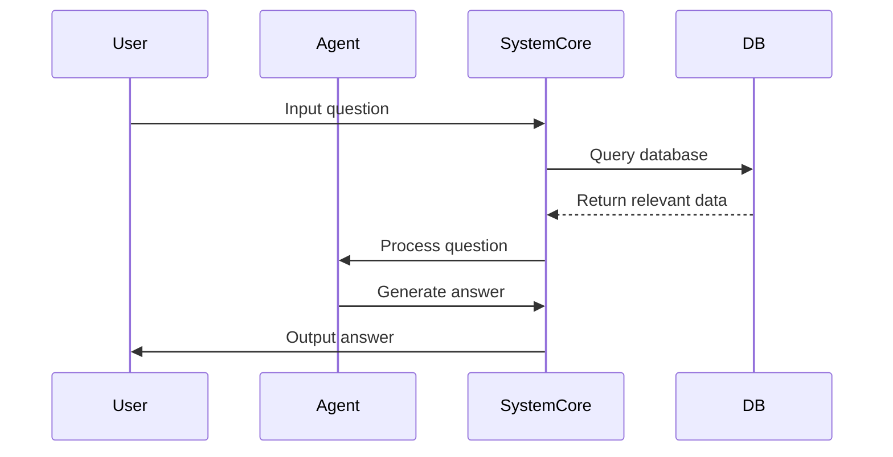
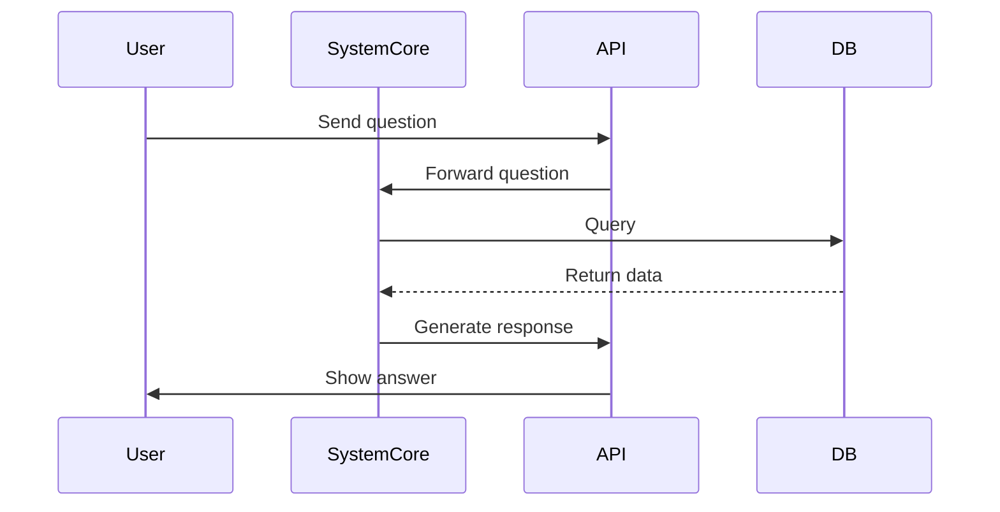

                 


## 第4章: 系统分析与架构设计方案

### 4.1 问题场景介绍

随着人工智能技术的迅猛发展，AI编程语言在各个领域的应用日益广泛。人机交互作为AI编程语言的核心部分，直接影响用户体验和系统效能。在这个背景下，我们需要一个高效、易用的系统架构设计方案，以支持多样化的人机交互模式。

**问题场景：**
假设我们正在开发一款智能客服系统，该系统需要与用户进行实时交互，并根据用户的问题提供准确的答案。为了实现这一目标，我们需要设计一个系统，能够处理用户输入，理解用户的意图，并返回合适的响应。

### 4.2 系统功能设计

**领域模型（Mermaid 类图）：**
```mermaid
classDiagram
    User <<< Person
    Agent <<< Person
    Question << Entity
    Answer << Entity
    SystemCore
    User --> Agent
    User --> SystemCore : ask
    Agent --> SystemCore : process
    SystemCore --> Question : generate
    SystemCore --> Answer : generate
```

**功能描述：**
- **用户（User）**：发起问题的用户。
- **客服代理（Agent）**：处理用户问题的客服代表。
- **系统核心（SystemCore）**：系统的核心部分，负责处理问题和生成答案。
- **问题（Question）**：用户提出的问题。
- **答案（Answer）**：系统生成的回答。

### 4.3 系统架构设计

**架构设计（Mermaid 架构图）：**


**架构描述：**
- **用户**：向系统输入问题。
- **系统核心**：查询数据库以获取相关信息，处理问题并生成答案。
- **数据库（DB）**：存储问题和答案的相关数据。
- **客服代理**：接收系统核心处理后的数据，生成回答。
- **用户**：接收系统核心输出的答案。

### 4.4 系统接口设计和系统交互

**接口设计（Mermaid 序列图）：**


**交互描述：**
- **用户**：通过API向系统发送问题。
- **API**：接收用户发送的问题，并将其转发给系统核心。
- **系统核心**：查询数据库，处理问题并生成回答。
- **API**：将系统核心生成的回答返回给用户。
- **用户**：通过API接收并显示回答。

### 4.5 项目实战

**环境安装：**
为了实现上述系统，我们需要在服务器上安装以下软件和库：
- Python 3.x
- Flask（用于构建API）
- SQLite（用于存储数据）
- Natural Language Processing（NLP）库（如 NLTK 或 spaCy）

**系统核心实现源代码：**
```python
from flask import Flask, request, jsonify
import sqlite3

app = Flask(__name__)

# 数据库连接
def get_db_connection():
    conn = sqlite3.connect('database.db')
    conn.row_factory = sqlite3.Row
    return conn

# 处理问题
@app.route('/process_question', methods=['POST'])
def process_question():
    data = request.get_json()
    question = data['question']
    
    # 在数据库中查询答案
    conn = get_db_connection()
    cursor = conn.cursor()
    cursor.execute("SELECT answer FROM questions WHERE question=?", (question,))
    row = cursor.fetchone()
    
    if row:
        answer = row['answer']
    else:
        answer = "Sorry, I don't have an answer for that."
    
    conn.close()
    return jsonify(answer=answer)

if __name__ == '__main__':
    app.run(debug=True)
```

**代码应用解读与分析：**
上述代码提供了一个简单的Flask应用，用于处理用户输入的问题并返回答案。当用户通过API发送问题后，应用会查询数据库以获取答案。如果数据库中有记录，则返回对应的答案；否则，返回默认的错误消息。

**实际案例分析和详细讲解剖析：**
假设用户通过API发送问题：“什么是人工智能？”系统将查询数据库，查找匹配的问题和答案。如果找到相关记录，则返回预定义的答案；如果没有，则返回错误消息。

**项目小结：**
通过上述系统架构设计和项目实战，我们实现了一个简单的智能客服系统。虽然这个系统功能相对简单，但它为我们提供了一个框架，可以在此基础上扩展和优化，以支持更复杂的人机交互需求。

### 4.6 最佳实践 tips

- **小结**：确保在开发和部署系统时，对数据库进行充分的测试和优化，以提高查询效率。
- **注意事项**：在处理用户输入时，要充分考虑安全性，防止SQL注入等安全风险。
- **拓展阅读**：了解更多关于NLP和人机交互的先进技术，如聊天机器人的自然语言理解与生成。

作者：AI天才研究院/AI Genius Institute & 禅与计算机程序设计艺术 /Zen And The Art of Computer Programming

----------------------------------------------------------------

完成上述第4章的内容设计后，我们将继续设计第5章的内容，包括项目实战的具体步骤和详细讲解。接下来，我们将为第5章编写内容。

