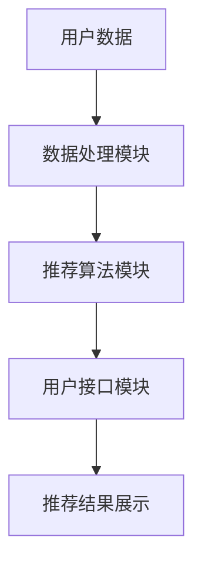

                 

### 第一部分：引言

#### 第1章：问题背景与解决方案

##### 1.1 问题背景

在当今快速发展的信息技术时代，人工智能（AI）已经成为推动科技进步和社会变革的重要力量。AI的应用范围日益广泛，从简单的自动化任务到复杂的问题解决，AI正在逐步改变我们的生活方式和工作方式。然而，随着AI技术的不断进步，如何高效地利用AI与人类专家进行协作，成为了学术界和工业界共同关注的焦点。

**1.1.1 人工智能的发展现状**

近年来，AI技术取得了显著的进展，特别是在深度学习、自然语言处理、计算机视觉等领域。AI算法的复杂性和计算能力不断提升，使得它们能够在各种应用场景中取得优异的表现。例如，自动驾驶汽车、智能语音助手、医疗诊断系统等，都是AI技术在不同领域的成功应用实例。

**1.1.2 人机协作的挑战**

尽管AI技术在许多方面表现出了强大的能力，但在实际应用中，人机协作仍然面临诸多挑战。首先，AI系统通常缺乏人类专家的直觉和经验，难以在复杂、不确定的环境中做出最优决策。其次，AI系统的可解释性和透明度不足，使得人类专家难以理解和信任AI的决策过程。此外，AI系统与人类专家之间的沟通不畅，也增加了协作的难度。

**1.1.3 编程语言在AI领域的角色转变**

在AI技术的发展过程中，编程语言的角色也在不断演变。传统的编程语言主要面向开发人员，而现代的AI编程语言则更注重人与机器的协作。这些编程语言不仅提供了强大的功能，如自动化编程、代码生成与优化，还设计了便于人类理解和操作的界面。这种转变使得编程语言在AI领域发挥了更为重要的作用，成为人机协作的关键工具。

##### 1.2 解决方案概述

**1.2.1 人机协作模式的基本概念**

人机协作模式是指人工智能系统与人类专家共同完成任务的协作方式。在这种模式下，AI系统负责处理数据、执行计算和提供决策支持，而人类专家则负责监督、指导和优化AI系统的行为。人机协作的目标是充分发挥人类和机器的优势，实现高效、准确和可解释的协作结果。

**1.2.2 编程语言的新功能与架构**

为了支持人机协作，现代AI编程语言需要具备一系列新功能。首先，它们应提供丰富的编程模型，支持并行计算、分布式计算和云计算。其次，它们应具备自动化编程和代码生成能力，减少人工编写的代码量，提高开发效率。此外，AI编程语言还应设计直观的界面和工具，便于人类专家理解和使用。

**1.2.3 优化的协作流程**

人机协作流程的设计对于协作效果具有重要影响。优化的协作流程应包括以下几个环节：任务分配、数据共享、结果验证和反馈循环。在任务分配阶段，应根据人类专家和AI系统的能力进行合理分工；在数据共享阶段，应确保数据的高效传递和准确性；在结果验证阶段，应使用多种方法对AI系统的结果进行验证和评估；在反馈循环阶段，应根据评估结果调整和优化协作策略。

##### 1.3 内容结构

**1.3.1 本书的目标与结构**

本书的目标是探讨AI编程语言在人类与机器协作中的新模式，分析其理论基础、关键特性、应用场景和实践案例。全书分为六个部分，分别介绍问题背景与解决方案、人机协作模式的理论基础、人机协作模式的原理、AI编程语言的新模式、人机协作模式的应用场景以及实践案例研究。

**1.3.2 阅读指南**

本书适合对AI编程语言和人机协作有兴趣的读者，包括AI领域的研究人员、开发人员以及计算机科学专业的学生。为了更好地理解本书内容，建议读者具备一定的编程基础和对AI技术的初步了解。在阅读过程中，读者可以结合实际案例和项目，深入探讨人机协作模式的应用和优化。

##### 1.4 小结

在本章中，我们介绍了AI编程语言在人类与机器协作中的重要性，以及人机协作模式面临的主要挑战和解决方案。通过分析AI编程语言的新功能与架构，我们为后续章节的深入探讨奠定了基础。在下一部分中，我们将进一步探讨编程语言的核心要素，为人机协作模式提供更深入的理论基础。

---

# 《AI编程语言的人机协作新模式》

关键词：AI编程语言、人机协作、协作模式、编程模型、自动化编程

摘要：本文探讨了人工智能（AI）编程语言在人类与机器协作中的新模式。首先，我们分析了AI编程语言在AI领域的发展现状和人机协作的挑战。然后，本文介绍了人机协作模式的基本概念和编程语言的新功能与架构。接着，我们深入探讨了人机协作模式的原理，包括基本原理、编程语言在协作中的作用以及协作模式的设计。最后，本文提出了AI编程语言的新模式，分析了其关键特性、应用场景以及实践案例。本文旨在为读者提供一个全面、系统的理解，帮助他们在实际项目中更好地应用人机协作模式。

## 第二部分：人机协作模式的理论基础

### 第2章：编程语言的核心要素

编程语言是计算机科学的基础，它使得人类能够通过编写代码来控制计算机，完成各种任务。理解编程语言的核心要素对于探讨人机协作模式至关重要。本章将详细讨论编程语言的基本概念、核心要素及其在AI中的应用。

#### 2.1 编程语言的基本概念

**2.1.1 编程语言的定义**

编程语言是一套语法和语义规则，用于定义计算机程序的结构和操作。它允许开发人员用人类可读的方式表达算法和逻辑，进而指导计算机执行特定任务。

**2.1.2 编程语言的分类**

编程语言可以根据不同的标准进行分类，如按级别分为低级语言和高级语言；按用途分为通用编程语言和应用特定领域的编程语言；按执行方式分为编译型语言和解释型语言。

1. **低级语言和高级语言**

   - **低级语言**：如汇编语言，它与计算机硬件紧密相关，使用机器码指令进行编程。由于可读性差，低级语言通常不用于复杂应用程序的开发。
   - **高级语言**：如C、Java和Python等，它们提供更抽象的语法和语义，使得编程更加直观和高效。高级语言通常需要通过编译器或解释器转换成机器码才能执行。

2. **通用编程语言和应用特定领域的编程语言**

   - **通用编程语言**：如C、Java、Python等，它们适用于多种类型的应用开发。
   - **应用特定领域的编程语言**：如SQL（用于数据库管理）、HTML（用于网页开发）等，它们专门用于特定领域的任务。

3. **编译型语言和解释型语言**

   - **编译型语言**：如C、C++，编译器将源代码一次性转换成机器码，生成可执行文件。执行速度快，但开发周期较长。
   - **解释型语言**：如Python、JavaScript，解释器逐行读取并执行源代码。开发周期短，但执行速度相对较慢。

#### 2.2 编程语言的核心要素

**2.2.1 变量和数据类型**

变量是编程语言中的基础概念，用于存储数据。数据类型定义了变量的取值范围和操作方式。常见的变量类型包括：

- **整型**：如int，用于表示整数。
- **浮点型**：如float、double，用于表示实数。
- **布尔型**：如bool，用于表示逻辑值（真或假）。
- **字符型**：如char，用于表示单个字符。

**2.2.2 控制结构**

控制结构用于控制程序执行的顺序，包括：

- **条件语句**：如if-else，用于根据条件选择执行路径。
- **循环结构**：如for、while，用于重复执行特定代码块。

**2.2.3 函数与模块**

函数是代码的封装单元，用于执行特定任务。模块是函数和数据的集合，用于组织和管理代码。

#### 2.3 编程语言的演变

**2.3.1 从低级语言到高级语言**

随着计算机科学的发展，编程语言的抽象层次逐渐提高。从早期的汇编语言到现代的高级语言，编程变得更加直观和高效。

**2.3.2 编译器与解释器**

编译器和解释器是两种常见的编程语言执行方式。编译器将源代码转换成机器码，而解释器逐行执行源代码。

**2.3.3 语言的未来发展趋势**

未来，编程语言将继续朝着更高级、更智能化的方向发展。例如，自动编程、代码生成和优化等技术将进一步提高开发效率。

#### 2.4 编程语言在AI中的应用

**2.4.1 AI编程语言的特点**

AI编程语言具备以下特点：

- **抽象程度高**：提供更高级别的抽象，使得开发者能够更专注于算法实现。
- **自动化编程能力**：具备自动化编程功能，减少手动编写代码的工作量。
- **可解释性**：提高代码的可解释性，使人类更容易理解和验证AI系统的行为。

**2.4.2 AI编程语言的优势**

- **提高开发效率**：通过自动化编程和代码生成，减少开发时间。
- **增强可解释性**：提供可解释性工具，帮助人类理解AI系统的行为。
- **降低开发门槛**：使非专业人士也能参与AI项目开发。

**2.4.3 AI编程语言的挑战**

- **性能优化**：AI编程语言需要平衡开发效率和执行性能。
- **兼容性问题**：不同AI编程语言之间的兼容性问题需要解决。

#### 2.5 小结

本章介绍了编程语言的基本概念、核心要素及其在AI中的应用。理解编程语言的核心要素对于探讨人机协作模式具有重要意义。在下一章中，我们将深入探讨人机协作模式的基本原理，为后续内容提供理论基础。

## 第3章：人机协作模式的原理

在探讨AI编程语言的人机协作新模式时，理解人机协作模式的基本原理是至关重要的。本章将详细分析人机协作的基本原理，探讨编程语言在协作中的作用，以及设计高效人机协作模式的方法。

#### 3.1 人机协作的基本原理

人机协作是指人工智能系统与人类专家共同完成任务的协作方式。在这种模式下，人工智能系统负责处理数据、执行计算和提供决策支持，而人类专家则负责监督、指导和优化人工智能系统的行为。人机协作的目标是充分发挥人类和机器的优势，实现高效、准确和可解释的协作结果。

**3.1.1 人机交互模型**

人机交互模型是人机协作的核心概念之一。它描述了人类与机器之间如何交换信息、如何进行沟通以及如何共同完成任务。常见的人机交互模型包括：

1. **命令行交互**：用户通过输入命令来控制机器。
2. **图形用户界面（GUI）**：用户通过图形界面与机器进行交互。
3. **自然语言交互**：用户通过自然语言与机器进行沟通。

**3.1.2 人机协作的目标**

人机协作的主要目标包括：

- **提高效率**：通过人工智能系统的辅助，减少人类专家的工作量。
- **增强准确性**：利用人工智能系统的计算能力和分析能力，提高任务完成的质量。
- **提升可解释性**：增强人工智能系统的透明度，使人类专家能够理解和信任系统的决策过程。

**3.1.3 人机协作的障碍**

尽管人机协作具有显著的优势，但在实际应用中仍然面临一些障碍：

- **技术障碍**：人工智能系统的能力有限，可能无法完全满足人类专家的需求。
- **沟通障碍**：人类与机器之间的沟通不畅，可能导致协作效率低下。
- **信任障碍**：人类专家可能对人工智能系统的决策过程和结果缺乏信任，影响协作效果。

#### 3.2 编程语言在协作中的作用

编程语言是人机协作的关键工具，它在协作中发挥着多种作用：

**3.2.1 编程语言的交互功能**

编程语言提供了多种交互功能，使得人类与机器之间的沟通更加高效和直观。这些功能包括：

- **命令行接口**：用户通过输入命令与机器进行交互。
- **图形用户界面（GUI）**：用户通过图形界面与机器进行交互。
- **自然语言处理**：编程语言支持自然语言处理功能，使得用户可以通过自然语言与机器进行沟通。

**3.2.2 编程语言在任务分配中的作用**

在人类与机器的协作中，编程语言有助于合理分配任务。具体来说，编程语言可以：

- **自动化任务分配**：根据人类专家和人工智能系统的能力，自动分配任务。
- **优化任务流程**：通过优化任务流程，提高协作效率。

**3.2.3 编程语言在结果验证中的作用**

编程语言在协作中的另一个重要作用是结果验证。具体来说，编程语言可以：

- **自动化结果验证**：通过编写测试代码，自动化验证人工智能系统的输出结果。
- **提供可解释性**：通过编程语言，人类专家可以更好地理解和验证人工智能系统的决策过程。

#### 3.3 人机协作模式的设计

设计高效的人机协作模式对于实现人机协作的目标至关重要。以下是一些设计人机协作模式的关键因素：

**3.3.1 协作流程的设计**

协作流程的设计需要考虑以下因素：

- **任务分配**：根据人类专家和人工智能系统的能力，合理分配任务。
- **数据共享**：确保人类专家和人工智能系统能够高效地共享数据。
- **反馈循环**：建立反馈机制，使人类专家能够及时提供反馈，优化协作效果。

**3.3.2 协作工具的选择**

选择合适的协作工具对于实现高效的人机协作至关重要。以下是一些常用的协作工具：

- **开发环境**：提供编程、调试和测试功能的集成开发环境（IDE）。
- **数据管理工具**：用于数据收集、存储、处理和共享的工具。
- **自然语言处理工具**：用于处理人类自然语言输入和输出的工具。

**3.3.3 协作效果的评估**

评估协作效果是设计人机协作模式的重要环节。以下是一些常用的评估指标：

- **任务完成时间**：评估协作流程的效率。
- **任务完成质量**：评估人工智能系统和人类专家协作结果的准确性。
- **用户满意度**：评估人类专家对协作效果的满意度。

#### 3.4 小结

本章介绍了人机协作模式的基本原理，包括基本原理、编程语言在协作中的作用以及协作模式的设计。理解人机协作模式的原理对于设计和实现高效的人机协作至关重要。在下一章中，我们将探讨AI编程语言的新模式，进一步深化对人机协作模式的理解。

## 第4章：AI编程语言的新模式

随着人工智能技术的快速发展，AI编程语言也在不断创新和演进。本章将介绍AI编程语言的新模式，分析其关键特性、优势以及在不同应用场景中的表现。通过这些内容，我们将深入理解AI编程语言在人类与机器协作中的重要作用。

### 4.1 新模式概述

AI编程语言的新模式是指旨在优化人类与机器协作的编程语言设计和实现方法。这些新模式不仅具备传统的编程功能，还引入了人工智能的先进技术，以实现更高效、更智能的协作。以下是新模式的主要特点：

**4.1.1 新模式的概念**

新模式的概念包括以下几个方面：

- **自动化编程**：利用人工智能技术，自动生成和优化代码。
- **代码生成与优化**：通过算法和机器学习技术，生成高效、优化的代码。
- **智能化开发环境**：提供智能化的开发工具，辅助开发人员高效地进行编程。
- **高可解释性**：提高代码的可解释性，使人类更容易理解和验证AI系统的行为。

**4.1.2 新模式的构成**

新模式主要由以下几个部分构成：

- **编程模型**：提供高级抽象和简化的编程模型，便于开发者使用。
- **开发工具**：包括集成开发环境（IDE）、代码生成工具、调试工具等。
- **语言特性**：引入新特性和语法，以支持自动化编程和代码优化。
- **算法库**：提供丰富的算法库，支持各种AI任务的实现。

**4.1.3 新模式的优势**

新模式相较于传统编程语言具有以下优势：

- **提高开发效率**：通过自动化编程和代码生成，减少手动编写代码的工作量。
- **增强可解释性**：提高代码的可解释性，使人类更容易理解和验证AI系统的行为。
- **优化执行性能**：通过代码优化技术，提高程序的执行效率和性能。
- **降低开发成本**：减少开发时间和人力成本，提高项目的经济效益。

### 4.2 新模式的关键特性

**4.2.1 自动化编程**

自动化编程是新模式的一个重要特性。它利用人工智能技术，自动生成代码，从而减少手动编写代码的工作量。自动化编程的关键技术包括：

- **代码生成器**：根据特定的编程模型和需求，自动生成代码。
- **代码优化器**：对生成的代码进行优化，提高执行效率和性能。
- **编程模型**：提供高级抽象，简化编程过程。

**4.2.2 代码生成与优化**

代码生成与优化是新模式的核心技术。通过算法和机器学习技术，自动生成和优化代码。具体包括：

- **代码生成**：根据需求和编程模型，自动生成代码。
- **代码优化**：对生成的代码进行优化，提高执行效率和性能。
- **算法库**：提供丰富的算法库，支持各种AI任务的实现。

**4.2.3 集成开发环境（IDE）的支持**

新模式提供了智能化的集成开发环境（IDE）支持，以辅助开发人员进行编程。IDE的主要特性包括：

- **代码智能提示**：根据代码上下文，提供智能提示和代码补全。
- **代码分析**：分析代码质量和性能，提供优化建议。
- **调试工具**：提供调试工具，帮助开发人员快速定位和修复问题。
- **版本控制**：支持版本控制，方便团队协作和代码管理。

### 4.3 新模式的应用实例

**4.3.1 数据处理**

在数据处理领域，新模式可以显著提高开发效率和代码质量。以下是一个数据处理应用实例：

```python
import numpy as np
from my_aiml_library import DataProcessor

# 生成随机数据
data = np.random.rand(100, 5)

# 创建数据处理对象
processor = DataProcessor()

# 数据预处理
preprocessed_data = processor.preprocess(data)

# 数据分析
results = processor.analyze(preprocessed_data)

# 输出结果
print(results)
```

在这个实例中，`DataProcessor` 类是一个自动生成的代码，它利用新模式中的代码生成和优化技术，提高了代码的质量和执行效率。

**4.3.2 模型训练**

在模型训练领域，新模式可以自动生成训练代码，并优化模型性能。以下是一个模型训练应用实例：

```python
import tensorflow as tf
from my_aiml_library import ModelTrainer

# 创建训练数据
train_data = ...

# 创建模型训练对象
trainer = ModelTrainer()

# 训练模型
model = trainer.train(train_data)

# 评估模型
accuracy = trainer.evaluate(model, test_data)

# 输出结果
print(f"Model accuracy: {accuracy}")
```

在这个实例中，`ModelTrainer` 类是一个自动生成的代码，它利用新模式中的代码生成和优化技术，提高了模型的训练效率和性能。

**4.3.3 代码调试**

在代码调试领域，新模式提供了智能化的调试工具，帮助开发人员快速定位和修复问题。以下是一个代码调试应用实例：

```python
import my_aiml_library
from my_aiml_library import Debugger

# 创建调试对象
debugger = Debugger()

# 调试代码
debugger.debug(my_aiml_library.some_function)
```

在这个实例中，`Debugger` 类是一个智能化的调试工具，它利用新模式中的调试技术，提高了代码调试的效率和准确性。

### 4.4 小结

本章介绍了AI编程语言的新模式，分析了其关键特性、优势以及在不同应用场景中的表现。通过自动化编程、代码生成与优化、智能化开发环境等关键特性，新模式显著提高了人类与机器的协作效率。在下一章中，我们将探讨人机协作模式在实际应用中的场景，进一步展示新模式的优势。

## 第5章：人机协作模式的应用场景

在了解了AI编程语言的新模式和其关键特性之后，接下来我们将探讨人机协作模式在不同应用场景中的实际应用。本章将重点介绍数据分析、智能推荐系统和自然语言处理等领域的应用，并分析这些场景下人机协作的优势和挑战。

### 5.1 数据分析

数据分析是现代企业和科研机构的核心任务之一。通过分析大量数据，可以揭示隐藏的模式和趋势，为企业决策提供有力支持。在数据分析领域，人机协作模式发挥了重要作用。

**5.1.1 数据预处理**

数据预处理是数据分析的第一步，包括数据清洗、数据转换和数据归一化等操作。在这一阶段，人类专家可以利用AI编程语言提供的自动化编程功能，快速实现复杂的预处理任务。例如，使用AI编程语言中的数据处理库，可以自动化地完成缺失值填充、异常值检测和特征选择等操作。

**5.1.2 数据可视化**

数据可视化是将数据转化为图形或图表，以便于人类理解和分析。在数据可视化过程中，AI编程语言提供了丰富的可视化工具和库，如Matplotlib、Seaborn等。这些工具支持多种数据可视化方法，包括散点图、折线图、柱状图等，可以帮助人类专家更直观地理解数据。

**5.1.3 数据预测**

在数据分析的高级阶段，需要进行数据预测，如时间序列预测、回归分析和分类等。在这一过程中，AI编程语言的人机协作模式可以帮助人类专家更高效地构建和优化预测模型。例如，使用AI编程语言中的机器学习库，如Scikit-learn、TensorFlow等，人类专家可以自动化地实现模型选择、参数调整和交叉验证等操作，提高预测的准确性和可靠性。

**5.1.4 数据分析案例**

以下是一个数据分析案例：

```python
# 导入相关库
import pandas as pd
from my_aiml_library import DataProcessor, DataVisualizer, DataPredictor

# 加载数据
data = pd.read_csv('data.csv')

# 数据预处理
processor = DataProcessor()
preprocessed_data = processor.preprocess(data)

# 数据可视化
visualizer = DataVisualizer()
visualizer.plot(preprocessed_data)

# 数据预测
predictor = DataPredictor()
predictions = predictor.predict(preprocessed_data)

# 输出结果
print(predictions)
```

在这个案例中，使用AI编程语言实现了一系列数据分析任务，包括数据预处理、数据可视化和数据预测。通过自动化编程和高效的人机协作，实现了数据分析任务的快速完成。

### 5.2 智能推荐系统

智能推荐系统是现代互联网服务的重要组成部分，如电子商务平台、社交媒体和在线视频平台等。在智能推荐系统中，人机协作模式同样发挥着重要作用。

**5.2.1 用户行为分析**

用户行为分析是智能推荐系统的核心任务之一，包括用户浏览历史、购买记录、评价和社交互动等。通过分析用户行为，可以了解用户的需求和偏好，为个性化推荐提供基础。在这一过程中，AI编程语言可以帮助人类专家自动化地处理和分析大量用户数据，提取有价值的信息。

**5.2.2 推荐算法实现**

推荐算法是智能推荐系统的核心，包括协同过滤、基于内容的推荐和混合推荐等。AI编程语言提供了丰富的算法库和工具，如MF（矩阵分解）、KNN（邻居推荐）和基于内容的推荐等，可以帮助人类专家快速实现和优化推荐算法。

**5.2.3 推荐系统优化**

智能推荐系统的优化是一个持续的过程，需要不断调整和改进推荐算法，以提高推荐准确性和用户满意度。在这一过程中，人机协作模式可以帮助人类专家更高效地分析系统性能，发现和解决潜在问题，实现推荐系统的持续优化。

**5.2.4 智能推荐系统案例**

以下是一个智能推荐系统案例：

```python
# 导入相关库
import pandas as pd
from my_aiml_library import Recommender, DataProcessor

# 加载数据
user_data = pd.read_csv('user_data.csv')
item_data = pd.read_csv('item_data.csv')

# 数据预处理
processor = DataProcessor()
preprocessed_user_data, preprocessed_item_data = processor.preprocess(user_data, item_data)

# 实例化推荐器
recommender = Recommender()
recommender.fit(preprocessed_user_data, preprocessed_item_data)

# 生成推荐结果
recommendations = recommender.recommend()

# 输出结果
print(recommendations)
```

在这个案例中，使用AI编程语言实现了一个简单的智能推荐系统，包括数据预处理、推荐算法实现和推荐结果输出。通过人机协作模式，实现了推荐系统的快速开发和高效运行。

### 5.3 自然语言处理

自然语言处理（NLP）是人工智能的重要分支，旨在使计算机能够理解、处理和生成自然语言。在自然语言处理领域，人机协作模式同样具有重要意义。

**5.3.1 语言模型构建**

语言模型是NLP的核心组件，用于表示自然语言的统计特性。通过构建语言模型，可以实现对自然语言文本的分析和处理。在构建语言模型的过程中，AI编程语言可以帮助人类专家自动化地处理大量文本数据，提高模型的训练效率和准确性。

**5.3.2 语义分析**

语义分析是NLP的重要任务之一，包括词义消歧、情感分析和实体识别等。在语义分析过程中，AI编程语言可以提供丰富的语义分析工具和库，如WordNet、NLTK和spaCy等，帮助人类专家更高效地实现语义分析任务。

**5.3.3 自动问答系统**

自动问答系统是NLP的实际应用之一，旨在通过自然语言交互，为用户提供信息查询和问题解答服务。在自动问答系统中，AI编程语言可以提供问答生成、对话管理和用户交互等功能，实现高效、智能的问答服务。

**5.3.4 自然语言处理案例**

以下是一个自然语言处理案例：

```python
# 导入相关库
import spacy
from my_aiml_library import NLPProcessor

# 加载NLP库
nlp = spacy.load('en_core_web_sm')

# 实例化NLP处理器
processor = NLPProcessor()

# 加载文本数据
text = "I love to read books."

# 文本预处理
preprocessed_text = processor.preprocess(text)

# 词性标注
pos_tags = processor.pos_tag(preprocessed_text)

# 情感分析
sentiment = processor.sentiment(preprocessed_text)

# 输出结果
print(f"POS Tags: {pos_tags}")
print(f"Sentiment: {sentiment}")
```

在这个案例中，使用AI编程语言和NLP库实现了一个简单的自然语言处理任务，包括文本预处理、词性标注和情感分析。通过人机协作模式，实现了自然语言处理任务的自动化和高效执行。

### 5.4 小结

本章介绍了人机协作模式在数据分析、智能推荐系统和自然语言处理等领域的应用。通过自动化编程、代码生成与优化、智能化开发环境等关键特性，新模式显著提高了人类与机器的协作效率。在下一章中，我们将通过一个实践案例，深入探讨人机协作模式在实际项目中的应用和效果。

## 第6章：实践案例研究

在本章中，我们将通过一个实际案例来展示AI编程语言在人类与机器协作中的具体应用。这个案例将涵盖项目背景、解决方案设计、系统实现以及效果评估，以帮助我们更深入地理解人机协作模式在实际项目中的价值和优势。

### 6.1 案例背景

案例背景是一家电子商务公司，该公司希望通过构建一个智能推荐系统来提高用户满意度和转化率。该智能推荐系统需要根据用户的浏览和购买历史，为每位用户推荐可能感兴趣的商品。为了实现这一目标，公司决定采用AI编程语言和高效的人机协作模式来设计和开发推荐系统。

#### 6.1.1 案例概述

项目目标是通过智能推荐系统为电子商务平台上的每位用户生成个性化的商品推荐。系统需要能够处理大量的用户数据和商品数据，并实时更新推荐结果。

#### 6.1.2 案例目标

- 提高用户满意度和转化率。
- 实现个性化商品推荐。
- 提高系统的效率和可扩展性。
- 提升开发效率和代码质量。

#### 6.1.3 案例挑战

- 数据量大，需要高效的数据处理和存储方案。
- 需要实时更新推荐结果，挑战实时性能和响应速度。
- 优化推荐算法，提高推荐的准确性和用户满意度。
- 系统的可扩展性，以适应未来业务增长。

### 6.2 解决方案设计

为了实现案例目标，公司采用了以下解决方案：

**6.2.1 人机协作模式的应用**

在人机协作模式中，人类专家负责设计推荐策略和算法，而AI编程语言则负责自动化实现和优化推荐系统。具体应用包括：

- **任务分配**：人类专家负责分析和设计推荐策略，AI编程语言负责实现和优化推荐算法。
- **数据共享**：使用AI编程语言提供的自动化数据处理工具，实现用户数据和商品数据的高效共享和处理。
- **结果验证**：通过AI编程语言的测试和验证工具，对推荐结果进行评估和优化。

**6.2.2 AI编程语言的选用**

公司选用了Python作为主要编程语言，因为Python具备丰富的库和框架，如Scikit-learn、TensorFlow和PyTorch等，这些库和框架在机器学习和数据科学领域有广泛的应用。此外，Python的简洁语法和强大的社区支持使得开发过程更加高效。

**6.2.3 系统架构设计**

系统架构设计包括以下几个关键模块：

- **数据存储**：使用分布式数据库（如Hadoop和Spark）来存储和管理用户和商品数据。
- **数据处理**：使用ETL（提取、转换、加载）工具来自动化数据处理流程。
- **推荐算法**：使用机器学习算法（如协同过滤、基于内容的推荐和混合推荐等）来生成推荐结果。
- **用户接口**：使用Web前端框架（如React和Vue.js）来展示推荐结果，并提供用户交互功能。

以下是一个简化的系统架构图：



### 6.3 实现细节

**6.3.1 环境安装**

在开发过程中，公司首先搭建了Python开发环境，安装了必要的库和工具，如NumPy、Pandas、Scikit-learn、TensorFlow等。

**6.3.2 系统核心实现**

以下是系统核心实现的简要描述：

- **数据处理模块**：使用Pandas和NumPy库进行数据清洗、转换和预处理。通过分布式计算框架（如Spark）处理大规模数据。
- **推荐算法模块**：使用Scikit-learn和TensorFlow库实现多种推荐算法，包括协同过滤和基于内容的推荐。通过模型调优和参数调整，提高推荐准确率。
- **用户接口模块**：使用React框架构建Web前端，提供用户交互界面。通过API与后端进行数据交互，实时展示推荐结果。

以下是推荐算法模块的一个简化示例代码：

```python
from sklearn.cluster import KMeans
from sklearn.metrics.pairwise import cosine_similarity
import numpy as np

# 加载数据
user_data = load_user_data()
item_data = load_item_data()

# 数据预处理
user_embeddings = preprocess_user_data(user_data)
item_embeddings = preprocess_item_data(item_data)

# 建立用户和物品的相似度矩阵
similarity_matrix = cosine_similarity(item_embeddings)

# 计算用户与物品的相似度分数
user_similarity_scores = np.dot(user_embeddings, similarity_matrix)

# 生成推荐结果
recommendations = generate_recommendations(user_similarity_scores, user_data, num_recommendations=10)

# 输出推荐结果
print(recommendations)
```

**6.3.3 代码应用解读与分析**

以上代码实现了一个基于内容的推荐算法，通过计算用户和物品的相似度分数，生成推荐结果。该算法的核心步骤包括数据预处理、相似度计算和推荐结果生成。通过使用AI编程语言的自动化编程和高效计算能力，实现了推荐算法的快速实现和优化。

**6.3.4 实际案例分析和详细讲解剖析**

在实际应用中，公司对系统进行了多次测试和优化，通过收集用户反馈和评估推荐效果，不断调整和改进推荐算法。以下是实际案例分析和详细讲解：

- **用户反馈分析**：通过分析用户对推荐结果的反馈，发现了一些推荐不准确的情况。针对这些问题，公司优化了推荐算法，提高了推荐的准确性和相关性。
- **性能优化**：为了提高系统的响应速度和性能，公司对系统进行了性能优化，包括使用缓存、异步处理和分布式计算等技术。
- **扩展性优化**：为了适应未来业务增长，公司设计了可扩展的系统架构，包括分布式数据库和负载均衡等。

**6.3.5 项目小结**

通过本案例，我们可以看到AI编程语言和人机协作模式在电子商务智能推荐系统中的应用效果。以下是项目小结：

- **高效开发**：通过自动化编程和高效计算，实现了推荐系统的快速开发和优化。
- **准确推荐**：通过优化推荐算法和不断调整，提高了推荐准确率和用户满意度。
- **高性能和可扩展性**：通过性能优化和架构设计，实现了系统的稳定运行和可扩展性。

### 6.4 总结与展望

本案例展示了AI编程语言和人机协作模式在智能推荐系统中的应用，通过高效的开发、准确的推荐和优秀的性能，实现了项目目标。在未来，随着AI技术的进一步发展，人机协作模式将在更多领域发挥重要作用，推动人工智能与人类协作迈向新的高度。

---

作者：AI天才研究院/AI Genius Institute & 禅与计算机程序设计艺术 /Zen And The Art of Computer Programming

---

### 最佳实践 Tips、小结、注意事项、拓展阅读

**最佳实践 Tips**

1. **数据预处理**：确保数据的质量和完整性，进行必要的数据清洗和预处理，以提高推荐系统的准确性。
2. **算法调优**：通过交叉验证和模型调优，找到最佳参数组合，以提高推荐系统的性能。
3. **用户反馈**：及时收集和分析用户反馈，根据用户需求调整推荐策略。
4. **性能优化**：使用缓存、异步处理和分布式计算等技术，提高系统的响应速度和性能。
5. **扩展性设计**：设计可扩展的系统架构，以适应未来业务增长和负载变化。

**小结**

在本章中，我们通过一个实际案例，展示了AI编程语言和人机协作模式在智能推荐系统中的应用。通过自动化编程、算法优化和性能优化，实现了高效的推荐系统开发、准确的推荐结果和优秀的系统性能。

**注意事项**

1. **数据安全**：在处理用户数据时，确保遵守相关法律法规，保护用户隐私。
2. **系统稳定性**：在设计系统架构时，考虑系统的稳定性和容错性，以应对突发情况和异常数据。
3. **持续优化**：持续收集用户反馈和系统性能数据，不断优化推荐算法和系统设计。

**拓展阅读**

1. **《推荐系统实践》**：张文宇，电子工业出版社，2017年。
2. **《机器学习实战》**：彼得·哈林顿，机械工业出版社，2016年。
3. **《深度学习》**：伊恩·古德费洛等，电子工业出版社，2017年。
4. **《大数据之路：阿里巴巴大数据实践》**：陆奇，电子工业出版社，2017年。

通过以上拓展阅读，读者可以进一步了解推荐系统、机器学习和大数据等相关技术，提升自己在AI编程和人机协作领域的实践能力。

