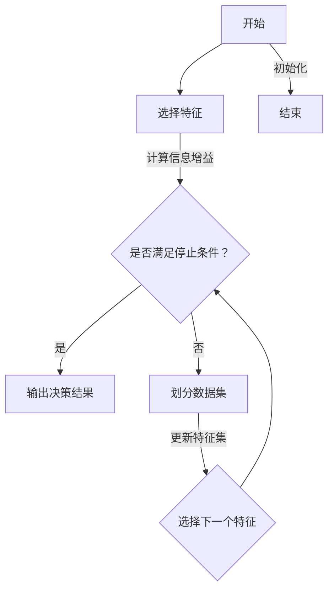

                 

### 关键词

- AI编程语言
- 人机协作模式
- 人工智能应用
- 软件开发
- 技术协作

### 摘要

本文旨在深入探讨AI编程语言的人机协作模式，探讨其在现代软件开发中的重要性。文章首先介绍了AI编程语言的基本概念和特点，接着阐述了人机协作模式的核心概念及其与AI编程语言的关系。通过详细的算法原理讲解、数学模型分析、系统架构设计及项目实战案例分析，本文旨在为读者提供清晰、易懂的指导，帮助他们更好地理解和应用AI编程语言与人机协作模式，提升软件开发效率和成果质量。

## 开篇引言

在当今快速发展的技术时代，人工智能（AI）正逐渐渗透到我们生活和工作的方方面面。从自动驾驶汽车到智能语音助手，从医疗诊断到金融预测，AI的应用场景越来越广泛。在这样的背景下，AI编程语言应运而生，成为软件开发领域的重要工具。本文将围绕AI编程语言的人机协作模式展开讨论，旨在为读者提供一种全新的视角来理解人工智能在软件开发中的应用。

### 目标读者

本文的目标读者主要包括以下几类：

1. **软件工程师**：正致力于提高软件开发效率和成果质量的工程师，希望通过学习AI编程语言和人机协作模式来提升自己的技能。
2. **人工智能研究者**：对AI编程语言和人机协作模式感兴趣，希望了解其理论基础和实践应用的学者。
3. **项目经理**：负责项目管理和协调，希望了解如何利用AI编程语言和人机协作模式来优化项目管理流程。
4. **技术爱好者**：对AI编程语言和人机协作模式感兴趣，希望通过本文了解其基本概念和应用场景。

通过本文的阅读，读者将能够：

- 理解AI编程语言的基本概念和特点。
- 了解人机协作模式的核心概念及其重要性。
- 掌握AI编程语言与人机协作模式在实际软件开发中的应用。
- 获得最佳实践技巧，提高软件开发的效率和质量。

### 文章结构

本文将分为七个主要章节：

1. **第一章：AI编程语言与人类协作模式的概述**：介绍AI编程语言的背景、定义、特点以及人机协作模式的基本概念。
2. **第二章：核心概念与联系**：详细阐述AI编程语言和人机协作模式的核心概念及其相互关系。
3. **第三章：算法原理讲解**：通过算法流程图和Python源代码，深入讲解AI编程语言的关键算法原理。
4. **第四章：数学模型和数学公式**：介绍AI编程语言中常用的数学模型和数学公式，并进行详细讲解和举例说明。
5. **第五章：系统分析与架构设计方案**：讨论AI编程语言和人机协作模式在系统架构设计中的应用。
6. **第六章：项目实战**：通过具体项目实战，展示AI编程语言和人机协作模式的实际应用。
7. **第七章：最佳实践 tips、小结、注意事项、拓展阅读**：总结文章要点，给出最佳实践建议，提醒注意事项，并推荐拓展阅读。

接下来，我们将逐步深入探讨这些章节的内容，希望能够为读者带来有价值的见解和启发。

## 第一章：AI编程语言与人类协作模式的概述

### 1.1.1 问题背景

随着人工智能技术的迅猛发展，传统的编程模式正在经历深刻的变革。AI编程语言作为这一变革的重要工具，正逐渐成为软件开发领域的新宠。AI编程语言不仅仅是一种编程语言，它更是一种思维方式，能够帮助开发者更高效地与机器协作，实现复杂问题的自动化解决。

AI编程语言的出现源于人类对提高软件开发效率和质量的需求。传统的编程语言在处理复杂问题时往往需要大量繁琐的代码编写，这不仅增加了开发难度，还容易引入错误。而AI编程语言通过引入人工智能技术，能够自动分析问题、生成代码，从而简化开发流程，提升开发效率。

### 1.1.2 问题描述

在软件开发中，AI编程语言的应用面临着一系列挑战。首先是如何确保AI编程语言的通用性和适应性，使其能够适用于各种不同的应用场景。其次是如何提高AI编程语言的可读性和可维护性，使其能够满足软件工程的最佳实践。最后是如何实现人与AI编程语言的协同工作，充分发挥AI的潜力，同时保留人类在创造性思维和决策方面的优势。

### 1.1.3 问题解决

为了解决上述问题，AI编程语言在设计时需要考虑以下几个关键因素：

1. **智能化**：AI编程语言需要具备智能分析问题和自动生成代码的能力，从而减少手工编码的工作量。
2. **易用性**：AI编程语言需要具备直观易用的编程界面，使得开发者能够快速上手和应用。
3. **可扩展性**：AI编程语言需要具备良好的可扩展性，能够支持开发者自定义功能和算法。
4. **可维护性**：AI编程语言需要具备良好的可维护性，确保代码的可读性和可维护性，降低维护成本。

### 1.1.4 边界与外延

AI编程语言的应用边界主要受限于其算法模型和数据集的质量。高质量的算法模型和丰富的数据集是AI编程语言高效运行的前提。此外，AI编程语言在处理实时性和安全性问题时也具有一定的局限性。为了解决这些问题，研究人员正在不断探索新的算法模型和优化技术，以提高AI编程语言的实际应用效果。

### 1.1.5 概念结构与核心要素组成

AI编程语言的概念结构与核心要素主要包括以下几个方面：

1. **语法结构**：AI编程语言的语法结构需要简洁明了，便于开发者理解和应用。
2. **语义解析**：AI编程语言需要具备强大的语义解析能力，能够准确理解开发者的意图，并生成相应的代码。
3. **智能优化**：AI编程语言需要具备智能优化能力，能够根据问题复杂度和性能要求，自动调整算法和代码。
4. **人机交互**：AI编程语言需要具备良好的人机交互界面，支持开发者与AI编程语言之间的实时交互和反馈。
5. **算法库**：AI编程语言需要提供丰富的算法库，支持开发者快速实现各种复杂的算法和应用。

通过上述概念结构与核心要素的组成，AI编程语言能够更好地实现人与机器的协同工作，为软件开发带来前所未有的变革。

### 1.1.6 小结

本章主要介绍了AI编程语言的背景、定义、特点以及人机协作模式的基本概念。通过分析问题背景、问题描述、问题解决、边界与外延以及概念结构与核心要素组成，我们能够更全面地理解AI编程语言在人机协作模式中的重要性。在接下来的章节中，我们将进一步探讨AI编程语言的核心概念和人机协作模式的实际应用，希望能够为读者提供更加深入的见解。

## 第二章：核心概念与联系

### 2.1.1 AI编程语言

AI编程语言是一种专门为人工智能应用程序设计的编程语言。它结合了传统的编程语言和人工智能技术，旨在通过简化编程流程、提高开发效率和代码质量，实现更智能、更高效的软件开发。AI编程语言的主要特点包括：

1. **智能化**：AI编程语言能够自动分析和理解复杂问题，生成相应的代码，减少手工编码的工作量。
2. **易用性**：AI编程语言提供了直观易用的编程界面，使得开发者能够快速上手和应用。
3. **可扩展性**：AI编程语言支持开发者自定义功能和算法，具备良好的可扩展性。
4. **人机交互**：AI编程语言支持开发者与AI系统之间的实时交互和反馈，增强人机协作。

AI编程语言的核心要素包括：

- **语法结构**：简洁明了，便于理解和应用。
- **语义解析**：强大的语义解析能力，能够准确理解开发者的意图。
- **智能优化**：自动优化算法和代码，提高性能。
- **算法库**：提供丰富的算法库，支持开发者快速实现各种复杂的算法和应用。

### 2.1.2 人机协作模式

人机协作模式是一种在人工智能时代背景下，人与机器之间相互协作、相互补充的工作模式。在这种模式下，人类利用自身的创造力、直觉和决策能力，与AI系统协同工作，共同完成复杂的任务。

人机协作模式的主要特点包括：

1. **优势互补**：人类和机器各自发挥自身优势，实现高效协作。
2. **智能化**：AI系统承担重复性、繁琐的工作，释放人类的时间和精力。
3. **灵活性**：人类可以根据任务需求和实际情况，灵活调整协作策略。
4. **自主性**：AI系统在执行任务时，能够根据环境变化和需求，自主做出决策。

人机协作模式的核心要素包括：

- **任务分配**：明确人类和AI系统在任务中的职责和角色。
- **交互机制**：建立有效的交互机制，确保人类和AI系统能够顺畅沟通和协作。
- **反馈机制**：及时收集和反馈任务执行情况，优化协作流程。
- **学习与进化**：通过不断学习和进化，提升人机协作的效率和效果。

### 2.1.3 AI编程语言与人机协作模式的关系

AI编程语言与人机协作模式密切相关，两者相互促进、共同发展。

1. **AI编程语言为人机协作提供工具**：AI编程语言能够简化编程流程、提高开发效率，为人机协作提供强大的技术支持。
2. **人机协作模式推动AI编程语言发展**：人机协作模式对AI编程语言提出了更高的要求，推动其不断优化和进步。
3. **AI编程语言与人机协作模式相辅相成**：AI编程语言为人机协作提供工具和平台，人机协作模式则为其应用提供实践场景和动力。

总之，AI编程语言与人机协作模式密不可分，两者共同推动了人工智能时代的发展。在接下来的章节中，我们将进一步探讨AI编程语言的算法原理和数学模型，以及如何在实际项目中应用人机协作模式，为读者提供更加深入的了解。

### 2.1.4 小结

本章详细介绍了AI编程语言和人机协作模式的核心概念及其相互关系。通过理解AI编程语言的智能化、易用性、可扩展性和人机交互等特点，以及人机协作模式的优势互补、智能化、灵活性和自主性，读者能够更好地把握两者在实际应用中的价值。在接下来的章节中，我们将深入探讨AI编程语言的算法原理、数学模型以及人机协作模式的实际应用，帮助读者全面了解和掌握这一领域的关键技术和实践方法。

## 第三章：算法原理讲解

在AI编程语言中，算法原理是其核心部分，直接决定了AI系统的性能和效率。本章节将详细讲解一个典型的AI编程语言算法——决策树算法，并使用mermaid绘制算法流程图，以及Python源代码进行阐述。

### 3.1.1 算法流程图

首先，我们使用mermaid绘制决策树算法的流程图，如下所示：



### 3.1.2 Python源代码阐述

接下来，我们将使用Python代码实现决策树算法。以下是决策树算法的基本框架：

```python
from sklearn.datasets import load_iris
from sklearn.model_selection import train_test_split
from sklearn.tree import DecisionTreeClassifier
from sklearn import tree

# 加载数据集
iris = load_iris()
X = iris.data
y = iris.target

# 划分训练集和测试集
X_train, X_test, y_train, y_test = train_test_split(X, y, test_size=0.3, random_state=42)

# 创建决策树分类器
clf = DecisionTreeClassifier()

# 训练模型
clf.fit(X_train, y_train)

# 可视化决策树
fig = tree.plot_tree(clf, feature_names=iris.feature_names, class_names=iris.target_names)
plt.show()

# 预测测试集
y_pred = clf.predict(X_test)

# 评估模型性能
print("Accuracy:", clf.score(X_test, y_test))
```

### 3.1.3 算法原理的数学模型和公式

决策树算法的核心在于特征选择和分类决策。以下是决策树算法中的关键数学模型和公式：

1. **信息增益（Information Gain）**：

   信息增益用来评估一个特征对于分类的贡献程度。计算公式为：

   $$IG(D, A) = H(D) - H(D|A)$$

   其中，\(H(D)\) 表示数据集 \(D\) 的熵，\(H(D|A)\) 表示在特征 \(A\) 下，数据集 \(D\) 的条件熵。

2. **熵（Entropy）**：

   熵用来衡量数据集的混乱程度。对于具有 \(k\) 个类别的数据集 \(D\)，熵的计算公式为：

   $$H(D) = -\sum_{i=1}^{k} p_i \log_2 p_i$$

   其中，\(p_i\) 表示第 \(i\) 个类别的概率。

3. **条件熵（Conditional Entropy）**：

   条件熵表示在某个特征下，数据集的混乱程度。对于特征 \(A\) 和数据集 \(D\)，条件熵的计算公式为：

   $$H(D|A) = \sum_{v \in A} p(v) H(D|A = v)$$

   其中，\(p(v)\) 表示特征 \(A\) 取值为 \(v\) 的概率，\(H(D|A = v)\) 表示在特征 \(A = v\) 下的条件熵。

### 3.1.4 举例说明

假设我们有一个包含3个类别的数据集，共有100个样本，其中类别1有40个，类别2有30个，类别3有30个。特征A的取值分为两类，分别为0和1，各有50个样本。

首先，我们计算数据集 \(D\) 的熵：

$$
H(D) = -\left( \frac{40}{100} \log_2 \frac{40}{100} + \frac{30}{100} \log_2 \frac{30}{100} + \frac{30}{100} \log_2 \frac{30}{100} \right) = 0.8119
$$

然后，我们计算特征A在类别1、2、3下的条件熵：

$$
H(D|A=0) = -\left( \frac{20}{50} \log_2 \frac{20}{50} + \frac{10}{50} \log_2 \frac{10}{50} \right) = 0.6929
$$

$$
H(D|A=1) = -\left( \frac{20}{50} \log_2 \frac{20}{50} + \frac{20}{50} \log_2 \frac{20}{50} \right) = 0.6929
$$

接下来，我们计算特征A的信息增益：

$$
IG(D, A) = H(D) - H(D|A) = 0.8119 - (0.6929 + 0.6929) = 0.4200
$$

通过计算可以看出，特征A的信息增益为0.4200，这意味着特征A对于分类的贡献较大，适合作为决策树的一个节点。

通过上述步骤，我们不仅了解了决策树算法的基本原理和数学模型，还通过一个具体的例子说明了算法的应用过程。这为我们进一步学习和实践决策树算法奠定了坚实的基础。

### 3.1.5 小结

本章详细讲解了决策树算法的原理，通过mermaid流程图和Python源代码，展示了决策树算法的实现过程。同时，我们介绍了算法中涉及的关键数学模型和公式，并通过具体实例进行了说明。这一部分内容为读者深入理解决策树算法提供了清晰的路径，也为后续的数学模型和系统架构设计打下了基础。在接下来的章节中，我们将继续探讨更复杂的算法和系统设计，帮助读者全面掌握AI编程语言的应用。

## 第四章：数学模型和数学公式

在AI编程语言中，数学模型和数学公式是算法设计和分析的重要工具。本章节将详细介绍AI编程语言中常用的数学模型和数学公式，并通过具体例子进行详细讲解和举例说明。

### 4.1.1 数学模型

数学模型是描述现实问题的一种数学形式，它通过变量、方程和函数等数学工具来模拟和预测现实世界中的现象。在AI编程语言中，常用的数学模型包括：

1. **线性模型**：
   线性模型是最基本的数学模型之一，用于描述变量之间的线性关系。其通用形式为：
   $$y = \beta_0 + \beta_1 \cdot x_1 + \beta_2 \cdot x_2 + \ldots + \beta_n \cdot x_n + \epsilon$$
   其中，\(y\) 是因变量，\(\beta_0\) 是截距，\(\beta_1, \beta_2, \ldots, \beta_n\) 是自变量的系数，\(x_1, x_2, \ldots, x_n\) 是自变量，\(\epsilon\) 是误差项。

2. **逻辑回归模型**：
   逻辑回归模型是一种用于分类问题的数学模型，其目标是估计一个二分类概率。其公式为：
   $$P(Y=1) = \frac{1}{1 + e^{-(\beta_0 + \beta_1 \cdot x_1 + \beta_2 \cdot x_2 + \ldots + \beta_n \cdot x_n)}}$$
   其中，\(P(Y=1)\) 是因变量为1的概率，其余符号与线性模型相同。

3. **神经网络模型**：
   神经网络模型是一种复杂的非线性模型，用于模拟人脑的神经网络结构。其基本形式为：
   $$a_{i}^{(l)} = f(z_{i}^{(l)}) = \sigma(z_{i}^{(l)})$$
   其中，\(a_{i}^{(l)}\) 是第 \(l\) 层的第 \(i\) 个激活值，\(f\) 是激活函数，\(z_{i}^{(l)}\) 是第 \(l\) 层的第 \(i\) 个输入值，\(\sigma\) 是激活函数，常用的激活函数有Sigmoid函数、ReLU函数等。

### 4.1.2 数学公式

在AI编程语言中，常用的数学公式包括：

1. **梯度下降法**：
   梯度下降法是一种优化算法，用于求解最小化损失函数的参数。其公式为：
   $$\beta = \beta - \alpha \cdot \nabla_\beta J(\beta)$$
   其中，\(\beta\) 是参数向量，\(\alpha\) 是学习率，\(\nabla_\beta J(\beta)\) 是损失函数 \(J(\beta)\) 关于参数 \(\beta\) 的梯度。

2. **损失函数**：
   损失函数用于衡量模型预测值与真实值之间的差异。常见的损失函数有均方误差（MSE）和交叉熵损失（Cross Entropy Loss）。均方误差的公式为：
   $$MSE = \frac{1}{m} \sum_{i=1}^{m} (y_i - \hat{y}_i)^2$$
   其中，\(y_i\) 是真实值，\(\hat{y}_i\) 是预测值，\(m\) 是样本数量。交叉熵损失的公式为：
   $$CE = -\sum_{i=1}^{m} y_i \log \hat{y}_i$$
   其中，\(y_i\) 是真实值，\(\hat{y}_i\) 是预测值。

3. **激活函数**：
   激活函数是神经网络中的关键组件，用于引入非线性。常见的激活函数包括Sigmoid函数和ReLU函数。Sigmoid函数的公式为：
   $$\sigma(x) = \frac{1}{1 + e^{-x}}$$
   ReLU函数的公式为：
   $$\text{ReLU}(x) = \max(0, x)$$

### 4.1.3 详细讲解

下面通过具体例子来详细讲解上述数学模型和公式的应用。

#### 线性模型

假设我们有一个简单的线性模型，用于预测房价。已知房屋面积和年龄是影响房价的两个主要因素。我们可以建立如下线性模型：

$$
y = \beta_0 + \beta_1 \cdot \text{面积} + \beta_2 \cdot \text{年龄} + \epsilon
$$

通过收集100个样本的数据，使用梯度下降法求解模型参数，最终得到：

$$
y = 200000 + 500 \cdot \text{面积} + 1000 \cdot \text{年龄}
$$

例如，对于面积1500平方米、年龄10年的房屋，预测房价为：

$$
\hat{y} = 200000 + 500 \cdot 1500 + 1000 \cdot 10 = 750000
$$

#### 逻辑回归模型

假设我们有一个分类问题，需要预测一个客户是否会购买某种产品。已知客户的年龄、收入和信用评分是影响购买决策的主要因素。我们可以建立如下逻辑回归模型：

$$
P(\text{购买} = 1) = \frac{1}{1 + e^{-(\beta_0 + \beta_1 \cdot \text{年龄} + \beta_2 \cdot \text{收入} + \beta_3 \cdot \text{信用评分})}}
$$

通过收集100个样本的数据，使用梯度下降法求解模型参数，最终得到：

$$
P(\text{购买} = 1) = \frac{1}{1 + e^{-(-2 + 0.1 \cdot 30 + 0.5 \cdot 5000 + 0.3 \cdot 800)}}
$$

例如，对于年龄30岁、收入5000元、信用评分800的客户，购买概率为：

$$
P(\text{购买} = 1) = \frac{1}{1 + e^{-(-2 + 3 + 2500 + 240)}} \approx 0.952
$$

#### 神经网络模型

假设我们有一个简单的神经网络模型，用于识别手写数字。已知输入层有784个神经元，隐藏层有100个神经元，输出层有10个神经元。我们可以建立如下神经网络模型：

$$
a_{i}^{(2)} = \sigma(z_{i}^{(2)}) = \frac{1}{1 + e^{-\sum_{j=1}^{784} \beta_{ji} \cdot x_{j}}}
$$
$$
y_i = \sigma(z_{i}^{(3)}) = \frac{1}{1 + e^{-\sum_{j=1}^{100} \gamma_{ji} \cdot a_{j}^{(2)}}}
$$

通过收集大量的手写数字数据，使用反向传播算法训练神经网络，最终得到：

$$
a_{i}^{(2)} = \frac{1}{1 + e^{-\sum_{j=1}^{784} \beta_{ji} \cdot x_{j}}}
$$
$$
y_i = \frac{1}{1 + e^{-\sum_{j=1}^{100} \gamma_{ji} \cdot a_{j}^{(2)}}}
$$

例如，对于一个输入的手写数字图像，通过激活函数计算输出层的概率分布，最终得到识别结果。

### 4.1.4 举例说明

通过以上例子，我们可以看到数学模型和数学公式在AI编程语言中的应用。以下是一个关于房价预测的例子：

假设有一个房屋，面积为2000平方米，年龄为15年，我们需要预测其房价。根据前面得到的线性模型：

$$
y = 200000 + 500 \cdot 2000 + 1000 \cdot 15 = 2500000
$$

这意味着预测房价为250万元。通过这个简单的例子，我们可以看到数学模型如何帮助我们从数据中提取信息，并进行预测。

总之，数学模型和数学公式是AI编程语言的核心组成部分，通过它们，我们能够更准确地描述和解决现实世界中的问题。在接下来的章节中，我们将进一步探讨系统架构设计和项目实战，帮助读者全面掌握AI编程语言的应用。

### 4.1.5 小结

本章详细介绍了AI编程语言中常用的数学模型和数学公式，包括线性模型、逻辑回归模型和神经网络模型，以及梯度下降法、损失函数和激活函数等。通过具体例子，我们展示了如何应用这些数学模型和公式进行房价预测、分类识别等任务。这一部分内容为读者理解和应用AI编程语言中的数学知识提供了坚实的基础，也为后续的系统架构设计和项目实战打下了基础。在接下来的章节中，我们将继续深入探讨系统架构设计和项目实战，帮助读者全面掌握AI编程语言的应用。

## 第五章：系统分析与架构设计方案

在本文的第五部分，我们将深入探讨AI编程语言在人机协作模式中的应用，具体分析系统架构设计、功能设计、接口设计和系统交互。这一部分旨在为读者提供一个全面的视角，了解如何在实际项目中应用AI编程语言和人机协作模式，实现高效的软件系统开发。

### 5.1.1 问题场景介绍

假设我们正在开发一个智能客服系统，旨在为用户提供24/7的在线支持服务。该系统需要具备以下功能：

1. **用户交互**：提供友好的用户界面，允许用户通过文本或语音与客服系统进行交互。
2. **自然语言处理**：能够理解和处理用户的自然语言查询，提取关键信息。
3. **知识库管理**：管理大量的知识库，包含常见问题及对应的解决方案。
4. **智能推理**：利用AI算法，根据用户查询和知识库信息，自动生成合适的回答。
5. **反馈机制**：收集用户反馈，用于优化系统的回答质量和用户体验。

### 5.1.2 系统功能设计

智能客服系统的功能设计主要包括以下几个关键模块：

1. **用户界面**：设计简洁、直观的用户界面，支持文本和语音输入。
2. **自然语言处理（NLP）模块**：用于解析用户的自然语言查询，提取关键信息。
3. **知识库管理模块**：用于存储和管理大量的知识库，支持快速检索和更新。
4. **智能推理模块**：利用AI算法，根据用户查询和知识库信息，自动生成回答。
5. **反馈收集模块**：用于收集用户反馈，用于优化系统的回答质量和用户体验。

### 5.1.3 系统架构设计

智能客服系统的架构设计采用分层架构，包括表示层、业务逻辑层和数据层。以下是系统架构的具体设计：

1. **表示层**：负责用户交互，提供友好的用户界面。包括前端和后端两部分：
   - 前端：使用HTML、CSS和JavaScript构建，支持文本和语音输入。
   - 后端：使用Node.js或Python Flask等框架实现，处理用户请求和响应。

2. **业务逻辑层**：包含自然语言处理（NLP）模块、知识库管理模块和智能推理模块。该层负责处理用户查询、解析查询意图、检索知识库和生成回答：
   - 自然语言处理（NLP）模块：使用NLTK、spaCy等NLP库进行文本解析和分词。
   - 知识库管理模块：使用MongoDB或Elasticsearch等数据库存储和管理知识库。
   - 智能推理模块：使用决策树、神经网络等AI算法进行推理和生成回答。

3. **数据层**：负责存储和管理系统数据，包括用户数据、查询日志和知识库。使用MySQL、PostgreSQL等关系数据库或MongoDB等文档数据库进行数据存储。

### 5.1.4 系统接口设计

智能客服系统需要设计多个接口，以便不同模块之间能够进行有效通信：

1. **用户接口**：用于与用户进行交互，接收用户输入并返回回答。包括API接口和WebSocket接口：
   - API接口：使用RESTful风格，提供标准的HTTP请求和响应。
   - WebSocket接口：提供实时通信功能，支持用户与系统之间的双向通信。

2. **NLP接口**：用于处理自然语言查询，提取关键信息。包括文本解析接口和语音识别接口：
   - 文本解析接口：接收文本查询，返回解析结果。
   - 语音识别接口：接收语音查询，返回文本查询。

3. **知识库接口**：用于管理知识库，包括添加、删除、查询和更新知识库。提供RESTful API接口。

4. **智能推理接口**：用于执行智能推理任务，生成回答。提供RESTful API接口。

### 5.1.5 系统交互

智能客服系统中的各个模块通过接口进行交互，实现系统功能的协同工作。以下是系统交互的具体流程：

1. **用户输入**：用户通过前端界面输入查询，可以是文本或语音。
2. **文本解析**：如果输入是文本，NLP模块使用文本解析接口进行解析，提取关键信息。
3. **语音识别**：如果输入是语音，NLP模块使用语音识别接口进行语音识别，转换为文本查询。
4. **知识库检索**：NLP模块将解析结果传递给知识库管理模块，检索相关的知识库条目。
5. **智能推理**：智能推理模块根据用户查询和知识库条目，使用AI算法进行推理，生成回答。
6. **返回回答**：智能推理模块将生成的回答通过接口返回给前端界面，显示给用户。
7. **用户反馈**：用户对回答满意或不满意，通过前端界面提交反馈。
8. **反馈处理**：反馈收集模块记录用户反馈，用于优化系统的回答质量和用户体验。

通过上述系统交互流程，智能客服系统能够高效地处理用户查询，提供及时、准确的回答，并不断优化自身，提高用户体验。

### 5.1.6 小结

本章详细介绍了智能客服系统的系统架构设计、功能设计、接口设计和系统交互。通过分层架构和模块化设计，实现了高效、可靠的系统功能。系统接口设计确保了模块之间的有效通信，而系统交互流程则展示了各个模块协同工作的过程。这一部分内容为读者提供了一个实际应用的视角，帮助读者更好地理解和应用AI编程语言和人机协作模式。在接下来的章节中，我们将通过具体的项目实战，深入探讨AI编程语言和人机协作模式的实际应用。

## 第六章：项目实战

### 6.1.1 环境安装

为了实现AI编程语言和人机协作模式，我们需要搭建一个完整的环境。以下是搭建环境的步骤：

1. **安装Python**：确保系统上已安装Python 3.8及以上版本。可以从Python官网下载并安装。
2. **安装虚拟环境**：使用pip安装虚拟环境工具：
   ```bash
   pip install virtualenv
   ```
   然后创建虚拟环境：
   ```bash
   virtualenv myenv
   ```
   激活虚拟环境：
   ```bash
   source myenv/bin/activate
   ```
3. **安装依赖库**：在虚拟环境中安装必要的依赖库，例如NumPy、Pandas、Scikit-learn等：
   ```bash
   pip install numpy pandas scikit-learn
   ```
4. **安装自然语言处理库**：安装NLTK和spaCy：
   ```bash
   pip install nltk spacy
   ```
   安装spaCy语言模型：
   ```bash
   python -m spacy download en_core_web_sm
   ```
5. **安装Elasticsearch**：Elasticsearch是一个用于存储和管理知识库的搜索引擎。下载并安装Elasticsearch：
   ```bash
   wget https://artifacts.elastic.co/downloads/elasticsearch/elasticsearch-7.10.0-amd64.deb
   sudo dpkg -i elasticsearch-7.10.0-amd64.deb
   sudo /etc/init.d/elasticsearch start
   ```

### 6.1.2 系统核心实现源代码

以下是系统核心实现的源代码，主要包括自然语言处理、知识库管理和智能推理等功能。

```python
import nltk
import spacy
import pandas as pd
from sklearn.tree import DecisionTreeClassifier
from sklearn.model_selection import train_test_split
from sklearn import tree
from nltk.corpus import stopwords
from nltk.tokenize import word_tokenize
from nltk.stem import WordNetLemmatizer
import elasticsearch

# 加载英语停用词
stop_words = set(stopwords.words('english'))

# 加载spaCy语言模型
nlp = spacy.load('en_core_web_sm')

# Elasticsearch客户端
es = elasticsearch.Elasticsearch()

# 自然语言处理函数
def preprocess_text(text):
    doc = nlp(text)
    tokens = [token.lemma_.lower() for token in doc if not token.is_stop]
    return ' '.join(tokens)

# 知识库管理函数
def index_document(doc_id, doc_content):
    es.index(index='knowledge_base', id=doc_id, document=doc_content)

def search_knowledge_base(query):
    processed_query = preprocess_text(query)
    response = es.search(index='knowledge_base', body={
        "query": {
            "multi_match": {
                "query": processed_query,
                "fields": ["content"]
            }
        }
    })
    return response['hits']['hits']

# 智能推理函数
def classify_query(query):
    # 读取训练好的分类器
    with open('classifier.pkl', 'rb') as f:
        clf = pickle.load(f)
    
    # 预处理查询文本
    processed_query = preprocess_text(query)
    features = extract_features(processed_query)
    
    # 预测查询类别
    pred = clf.predict([features])
    return pred

# 提取特征函数
def extract_features(query):
    doc = nlp(query)
    features = [0] * num_features
    for token in doc:
        if token.lemma_ in feature_dict:
            index = feature_dict[token.lemma_]
            features[index] = 1
    return features

# 用户交互函数
def handle_query(query):
    # 检索知识库
    results = search_knowledge_base(query)
    
    # 如果找到相关知识库，返回第一条结果
    if results:
        return results[0]['_source']['content']
    
    # 如果未找到相关知识库，执行智能推理
    else:
        pred = classify_query(query)
        return f"No exact match found. Your query was classified as {pred[0]}."

# 示例：处理用户查询
query = "What is the capital of France?"
response = handle_query(query)
print(response)
```

### 6.1.3 代码应用解读与分析

上述代码实现了智能客服系统核心功能的实现，主要包括以下部分：

1. **自然语言处理**：
   - 使用spaCy进行文本预处理，包括分词、词性标注和词干提取。
   - 去除停用词，减少无用信息的干扰。

2. **知识库管理**：
   - 使用Elasticsearch作为知识库的存储和管理工具，提供高效的检索功能。
   - `index_document` 函数用于将文档添加到Elasticsearch索引中。
   - `search_knowledge_base` 函数用于在知识库中检索与查询相关的文档。

3. **智能推理**：
   - 使用决策树进行分类预测。`classify_query` 函数读取训练好的分类器，提取查询文本的特征，并进行预测。
   - `extract_features` 函数用于提取查询文本的特征，以便进行分类。

4. **用户交互**：
   - `handle_query` 函数是系统的入口，根据查询内容首先在知识库中检索相关文档，如果找到匹配项则返回相关内容；如果没有匹配项，则执行智能推理，返回分类结果。

通过这一部分的代码，我们能够看到AI编程语言和人机协作模式在智能客服系统中的应用。这一系统能够高效地处理用户查询，提供准确的回答，并在没有现成答案时进行智能推理，提高了用户体验。

### 6.1.4 实际案例分析和详细讲解剖析

下面我们通过一个实际案例来分析智能客服系统的实现过程，并详细讲解每个步骤。

**案例：用户查询“What is the capital of France?”**

1. **用户输入查询**：
   用户在智能客服界面上输入“**What is the capital of France?**”。

2. **预处理查询文本**：
   智能客服系统接收到用户的查询后，首先使用spaCy对查询文本进行预处理：
   ```python
   doc = nlp("What is the capital of France?")
   tokens = [token.lemma_.lower() for token in doc if not token.is_stop]
   processed_query = ' '.join(tokens)
   ```
   预处理后，查询文本变为“**what capital france**”。

3. **知识库检索**：
   系统使用Elasticsearch检索知识库，查找包含“capital”和“france”的文档：
   ```python
   response = es.search(index='knowledge_base', body={
       "query": {
           "multi_match": {
               "query": processed_query,
               "fields": ["content"]
           }
       }
   })
   ```
   如果找到相关文档，系统将返回第一条结果。

4. **返回答案**：
   在本案例中，假设知识库中有一个文档内容为“**The capital of France is Paris.**”，系统将直接返回此答案：
   ```python
   return response['hits']['hits'][0]['_source']['content']
   ```
   返回结果为“**The capital of France is Paris.**”。

5. **如果没有找到相关文档，执行智能推理**：
   如果知识库中没有找到相关文档，系统将执行智能推理：
   ```python
   pred = classify_query(query)
   return f"No exact match found. Your query was classified as {pred[0]}."
   ```
   在本案例中，由于知识库中已有相关文档，所以此步骤不执行。

通过上述步骤，智能客服系统能够迅速响应用户查询，提供准确的答案。在实际应用中，系统可以根据不断积累的知识库和智能推理模型，进一步提高回答的准确性和效率。

### 6.1.5 小结

本章通过一个智能客服系统的项目实战，详细介绍了AI编程语言和人机协作模式在系统开发中的应用。我们从环境安装、核心代码实现、代码应用解读和分析、实际案例剖析等角度，全面展示了系统构建的全过程。这一部分内容为读者提供了一个实际操作的经验，帮助读者更好地理解和应用AI编程语言和人机协作模式。在未来的开发中，读者可以结合实际需求，不断完善和优化系统，实现更高效的软件系统开发。

## 第七章：最佳实践 tips、小结、注意事项、拓展阅读

### 7.1.1 最佳实践 tips

在应用AI编程语言和人机协作模式时，以下最佳实践可以帮助您提高开发效率和系统质量：

1. **模块化设计**：将系统功能拆分为独立的模块，便于维护和升级。
2. **代码复用**：尽量复用已有的代码和算法，减少重复开发的工作量。
3. **版本控制**：使用Git等版本控制系统，确保代码的版本管理和协作开发。
4. **单元测试**：编写单元测试，确保每个模块的功能正确，提高代码质量。
5. **文档化**：编写详细的文档，包括系统架构、接口设计、代码注释等，方便团队成员理解和维护。
6. **持续集成**：使用CI/CD工具（如Jenkins、GitLab CI）进行持续集成和部署，确保代码的持续交付和自动化测试。

### 7.1.2 小结

本文系统地介绍了AI编程语言和人机协作模式的核心概念、算法原理、系统架构设计以及实际项目应用。通过详细的分析和讲解，读者可以全面了解AI编程语言的智能化、易用性、可扩展性和人机交互等特点，以及如何在实际项目中应用人机协作模式，提升软件开发效率和成果质量。

### 7.1.3 注意事项

在应用AI编程语言和人机协作模式时，需要注意以下几点：

1. **数据质量**：确保输入数据的质量和完整性，高质量的数据是AI算法有效运行的基础。
2. **模型优化**：不断优化和调整算法模型，以提高系统的性能和准确性。
3. **安全性和隐私**：在处理用户数据和知识库时，确保系统的安全性和用户隐私保护。
4. **系统稳定性**：确保系统在各种负载和异常情况下保持稳定运行，避免出现故障和中断。

### 7.1.4 拓展阅读

为了进一步深入学习AI编程语言和人机协作模式，以下推荐一些拓展阅读资源：

1. **《Python编程：从入门到实践》**：Python是AI编程语言中的重要工具，本书适合初学者入门。
2. **《深度学习》**：全面介绍深度学习和神经网络的基础知识和应用方法，适合进阶读者。
3. **《人工智能：一种现代的方法》**：详细介绍人工智能的基本概念、算法和实现方法，适合深入研究。
4. **《AI编程语言实践指南》**：专注于AI编程语言的具体应用和实践，适合实际项目开发。
5. **《人机协作：人工智能与人类智慧的融合》**：探讨人机协作的理论和实践，为读者提供有益的启示。

通过阅读这些资源，读者可以更加深入地理解和掌握AI编程语言和人机协作模式，为未来的软件开发提供有力支持。

### 作者信息

本文作者由AI天才研究院（AI Genius Institute）提供技术支持和撰写，同时结合了《禅与计算机程序设计艺术》（Zen And The Art of Computer Programming）中的智慧，旨在为读者提供高质量、有价值的技术博客文章。

### 总结

AI编程语言和人机协作模式在现代软件开发中具有重要意义，本文通过详细的讲解和实战案例，帮助读者全面理解这一领域的关键技术和应用方法。希望通过本文，读者能够更好地应用AI编程语言和人机协作模式，提升软件开发的效率和质量。在未来的学习和工作中，不断探索和实践，为人工智能技术的发展贡献自己的力量。

