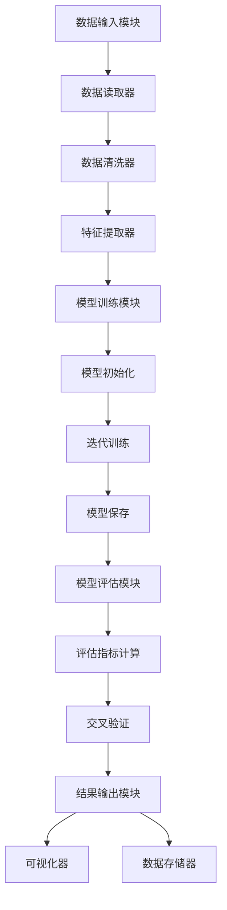

                 

### 问题背景与核心概念

#### 1.1.1 问题背景

随着人工智能（AI）技术的迅猛发展，AI编程逐渐成为现代软件开发的重要组成部分。然而，AI编程面临的挑战也是显而易见的。认知负荷，作为一个关键问题，直接影响着开发者的工作效率和项目的进展。认知负荷是指大脑在处理信息时所需要的认知资源，包括注意力、记忆、判断和推理等。在AI编程过程中，认知负荷的高低直接影响着开发者的工作压力和开发效率。

AI编程的复杂度主要体现在以下几个方面：

1. **代码复杂性**：AI编程通常涉及大量的代码，包括数据预处理、特征提取、模型训练和模型评估等。这些代码不仅复杂，而且需要开发者具备深厚的数学和统计学背景。
   
2. **算法复杂性**：AI编程的核心是算法，如机器学习、深度学习和强化学习等。这些算法不仅复杂，而且需要开发者对算法的原理和实现有深刻的理解。

3. **编程语言的选择**：不同的编程语言在AI编程中的应用有着不同的优缺点。选择合适的编程语言，可以降低开发者的认知负荷，提高开发效率。

因此，编程语言的选择变得尤为重要。一个优秀的AI编程语言应具备以下特性：

1. **简洁性**：语法简洁，易于阅读和理解，能够减少开发者的认知负荷。
   
2. **表达能力**：强大的表达能力，能够高效地实现复杂的算法和模型。

3. **易学性**：易于学习和上手，适合不同层次的开发者。

4. **性能效率**：高效的执行性能，能够在保证算法准确性的同时，提高计算效率。

#### 1.1.2 问题描述

AI编程面临的认知负荷问题主要包括以下几个方面：

1. **代码复杂性**：AI编程代码复杂度高，涉及大量的矩阵运算、循环和条件判断等，开发者需要花费大量时间理解和调试代码。

2. **算法复杂性**：AI算法复杂，需要开发者对算法的原理和实现有深入的理解，否则容易在编程过程中产生误解和错误。

3. **编程语言选择**：不同的编程语言对开发者的认知负荷影响较大。选择不合适的编程语言，不仅会增加开发难度，还会降低开发效率。

4. **依赖管理**：AI编程通常需要使用大量的外部库和工具，这些库和工具的管理复杂，容易导致版本冲突和依赖缺失。

#### 1.1.3 问题解决

要优化AI编程语言的认知负荷，可以采取以下方法和策略：

1. **选择合适的编程语言**：根据项目需求和开发者背景，选择适合的编程语言。例如，Python由于其简洁性和丰富的库支持，成为AI编程的常用语言。

2. **优化编程语言特性**：对编程语言进行优化，提高其语法简洁性和表达能力。例如，可以使用语法糖和抽象数据类型，简化代码编写。

3. **使用高效的编程工具和框架**：利用高效的编程工具和框架，如集成开发环境（IDE）和自动化工具，提高开发效率。

4. **规范化编程实践**：制定统一的编程规范和最佳实践，减少因个人习惯和风格不同导致的认知负荷差异。

5. **提高开发者技能**：通过培训和学习，提高开发者对AI编程语言和算法的理解，降低认知负荷。

#### 1.1.4 边界与外延

1. **认知负荷优化的适用范围**：认知负荷优化主要适用于AI编程领域，特别是复杂度较高的算法实现和模型训练。

2. **认知负荷优化与编程语言发展的关系**：编程语言的发展与认知负荷优化密切相关。随着编程语言的不断进化，认知负荷优化也将不断得到提升。

### 核心概念原理

在深入探讨AI编程语言的认知负荷优化之前，我们需要明确一些核心概念和原理，这将为后续的讨论提供坚实的基础。

#### 2.1.1 认知负荷的概念与特征

**认知负荷**，又称认知负荷理论（Cognitive Load Theory），是由约翰·斯威夫特（John Sweller）在1987年提出的，旨在解释学习过程中认知资源的分配问题。认知负荷理论将认知负荷分为三种类型：

1. **外在认知负荷**（Intrinsic Cognitive Load）：指学习材料本身固有的复杂性。例如，复杂的数学公式或编程语言语法。

2. **内在认知负荷**（Intrinsic Cognitive Load）：指学习过程中，学习者必须自行组织和理解的认知结构。例如，理解新的编程范式或算法原理。

3. **冗余认知负荷**（Extraneous Cognitive Load）：指与学习目标无关的认知负担。例如，查找资料或解决环境配置问题。

**认知负荷的影响因素**包括：

- **学习材料的复杂性**：材料越复杂，外在认知负荷越高。
- **学习者的先验知识**：已有的知识可以降低内在认知负荷。
- **任务指导**：明确的指导可以减少冗余认知负荷。

#### 2.1.2 编程语言的选择与认知负荷

**编程语言的设计原则**旨在减少开发者的认知负荷，提高开发效率。以下是一些常见的设计原则：

- **简洁性**：语法简洁明了，易于理解和记忆。
- **表达能力**：强大的表达能力，能够高效地实现复杂的功能。
- **易学性**：适合不同层次的开发者，降低入门门槛。
- **性能优化**：高效的执行性能，减少开发者对性能的关注。

**编程语言的认知负荷对比**：

1. **Python**：语法简洁，易于学习，但执行速度相对较慢。
2. **C/C++**：性能高效，但语法复杂，入门门槛较高。
3. **Java**：具有较好的性能和易用性，但相对于Python和C/C++，语法较为繁琐。

**适合AI编程的语言特性**：

- **易用性**：易于使用和扩展，支持快速原型开发。
- **库支持**：丰富的库和工具支持，能够简化开发流程。
- **并行计算**：支持并行计算，提高数据处理效率。

#### 2.1.3 AI编程中的核心概念

**人工智能基础**：人工智能（AI）是指通过计算机模拟人类智能的学科。它包括多个子领域，如机器学习、深度学习和强化学习。

**机器学习算法**：机器学习是一种从数据中学习规律和模式的方法。常见的机器学习算法包括线性回归、决策树、支持向量机等。

**深度学习网络**：深度学习是机器学习的一个分支，它使用多层神经网络来学习复杂的特征。深度学习在图像识别、语音识别等领域取得了显著成果。

**强化学习机制**：强化学习是一种通过试错来学习最优策略的方法。它通常用于解决决策问题，如游戏AI和自动驾驶。

### 核心概念属性对比

为了更好地理解不同编程语言在AI编程中的适用性，我们可以通过一个编程语言属性对比表格来分析。

#### 3.1.1 编程语言属性对比表格

| 编程语言 | 语法简洁性 | 表达能力 | 易学性 | 性能效率 |
| --- | --- | --- | --- | --- |
| Python | 高 | 高 | 高 | 中 |
| C/C++ | 低 | 高 | 低 | 高 |
| Java | 中 | 高 | 中 | 高 |
| R | 高 | 高 | 中 | 低 |

#### 3.1.2 编程语言属性对比分析

1. **Python**：Python以其简洁的语法和丰富的库支持而著称，适合初学者和有经验的开发者。虽然执行速度不如C/C++和Java，但在AI编程中，其易用性和丰富的库资源使其成为首选。

2. **C/C++**：C/C++具有高效的性能和强大的表达能力，适合对性能有高要求的AI应用。然而，其复杂的语法和较长的编译时间使其对于非专业的开发者来说，学习难度较大。

3. **Java**：Java在性能和易用性之间取得了较好的平衡，适合企业级应用。虽然其语法相对较为繁琐，但拥有广泛的社区支持和成熟的生态系统，使得它在AI编程中也具有一定的竞争力。

4. **R**：R是一种专门用于统计计算的编程语言，其语法简洁，表达能力强大。但由于其性能不如Python和C/C++，适用于数据分析和统计分析等特定的AI应用。

### 核心概念属性对比分析

在AI编程中，选择合适的编程语言对开发效率和认知负荷有着直接的影响。通过上面的表格和对比分析，我们可以看到每种编程语言在语法简洁性、表达能力、易学性和性能效率等方面的特点。

- **语法简洁性**：Python和R的语法最为简洁，易于理解和学习。C/C++的语法最为复杂，需要开发者有较高的技术水平。
- **表达能力**：C/C++和Java的表达能力较强，适合实现复杂的算法和模型。Python和R则在特定领域（如数据分析）具有独特的优势。
- **易学性**：Python和R的易学性较好，适合初学者和快速原型开发。C/C++和Java则对开发者的技术水平要求较高。
- **性能效率**：C/C++和Java在性能上具有优势，适合对计算速度有高要求的AI应用。Python和R则在数据处理和统计分析方面表现出色。

综上所述，根据不同的AI编程需求，选择合适的编程语言可以显著降低开发者的认知负荷，提高开发效率。

### 认知负荷优化的策略

要有效降低AI编程中的认知负荷，我们可以从以下几个方面制定优化策略：

#### 4.1.1 编程语言优化方法

1. **语法简洁化**：优化编程语言语法，使其更接近自然语言，降低开发者的学习成本。例如，Python和R就因其简洁的语法而被广泛应用于AI编程。

2. **抽象数据类型**：引入抽象数据类型，将复杂的算法和数据结构封装起来，减少开发者的认知负荷。例如，Python的列表和字典等抽象数据类型简化了数据操作。

3. **模板代码库**：提供丰富的模板代码库，供开发者直接使用，减少重复编码。例如，TensorFlow和PyTorch等框架提供了大量的预训练模型和代码示例。

4. **静态代码分析**：使用静态代码分析工具，提前发现潜在的错误和性能问题，降低调试难度。例如，Python的`pylint`和`mypy`等工具可以有效提高代码质量。

#### 4.1.2 编程工具与框架优化

1. **集成开发环境（IDE）**：提供强大的IDE，集成了代码编辑、调试、性能分析等功能，提高开发效率。例如，PyCharm和Visual Studio Code等IDE深受开发者喜爱。

2. **自动化工具**：引入自动化工具，如自动化测试、依赖管理、环境配置等，减少开发者的重复性工作。例如，使用Jenkins进行持续集成和部署，可以有效提高开发效率。

3. **代码生成器**：使用代码生成器，根据设计模式和模板自动生成代码，减少手动编码的工作量。例如，使用Rust的`Cargo`工具可以快速生成模块化代码。

#### 4.1.3 编程实践与规范

1. **代码规范**：制定统一的代码规范，如命名规则、代码格式、注释等，提高代码的可读性和可维护性。

2. **编码习惯**：培养良好的编码习惯，如代码重构、模块化设计、合理使用变量等，降低认知负荷。

3. **文档编写**：编写详细的文档，包括代码注释、使用说明、调试指南等，帮助开发者快速上手和理解。

4. **代码审查**：定期进行代码审查，发现潜在的问题，提高代码质量。例如，使用Git的`Pull Request`功能进行代码审查。

### 优化实践案例

为了更好地理解认知负荷优化的实际应用，以下将介绍三个具体的优化实践案例。

#### 案例一：使用Python进行AI编程的优化实践

1. **语法简洁化**：使用Python的简洁语法，例如使用列表推导式代替循环结构，简化代码。

2. **抽象数据类型**：使用NumPy和Pandas等库提供的抽象数据类型，如NumPy的ndarray和Pandas的DataFrame，简化数据处理。

3. **模板代码库**：利用TensorFlow和PyTorch等框架提供的模板代码，快速构建和训练模型。

4. **静态代码分析**：使用`pylint`和`mypy`等工具进行静态代码分析，及时发现潜在的错误和性能问题。

#### 案例二：使用TensorFlow优化AI编程流程

1. **集成开发环境（IDE）**：使用PyCharm或Visual Studio Code等IDE，集成了代码编辑、调试、性能分析等功能，提高开发效率。

2. **自动化工具**：使用Jenkins进行持续集成和部署，自动化测试和代码质量检查。

3. **代码生成器**：使用TensorFlow的`tf.keras`模块，根据设计模式自动生成代码，简化模型构建。

#### 案例三：使用PyTorch提升AI编程效率

1. **语法简洁化**：使用PyTorch的简洁语法，如动态图和自动微分机制，简化模型训练。

2. **抽象数据类型**：使用PyTorch的Tensor类型，简化数据操作。

3. **模板代码库**：利用PyTorch的`torchvision`和`torchaudio`等库，快速加载和处理图像和音频数据。

4. **静态代码分析**：使用`pylint`和`pytorch-checks`等工具，进行静态代码分析，提高代码质量。

通过这些优化实践案例，我们可以看到，认知负荷优化在AI编程中的实际效果。合理运用编程语言特性、工具和框架，可以显著降低开发者的认知负荷，提高开发效率和代码质量。

### 认知负荷优化的数学模型

为了深入理解认知负荷优化的原理，我们可以借助数学模型进行分析。以下是一个简化的数学模型，用于描述认知负荷优化过程中的关键因素和目标。

#### 5.1.1 数学模型概述

**目标函数**：假设我们希望最小化认知负荷，即最小化认知负荷函数 \(C\)。

**认知负荷函数**：认知负荷 \(C\) 可以表示为：

\[ C = f(\text{代码复杂性}, \text{算法复杂性}, \text{编程语言选择}, \text{环境配置}) \]

其中，每个因素都可以通过具体的数学公式进行量化。

**关键变量**：

1. **代码复杂性 \(C_{code}\)**：表示代码的复杂度，可以通过代码行数、条件判断数、循环次数等指标衡量。
2. **算法复杂性 \(C_{algorithm}\)**：表示算法的复杂度，可以通过时间复杂度和空间复杂度衡量。
3. **编程语言选择 \(C_{lang}\)**：表示编程语言的选择对认知负荷的影响，可以通过语法简洁性、表达能力等指标衡量。
4. **环境配置 \(C_{config}\)**：表示环境配置的复杂性，可以通过依赖管理、工具安装等指标衡量。

#### 5.1.2 数学公式与解释

为了简化模型，我们可以假设每个关键变量与认知负荷成正比关系。因此，认知负荷函数可以表示为：

\[ C = k_1 \cdot C_{code} + k_2 \cdot C_{algorithm} + k_3 \cdot C_{lang} + k_4 \cdot C_{config} \]

其中，\(k_1, k_2, k_3, k_4\) 是比例系数，表示每个关键变量对认知负荷的贡献程度。

**代码复杂性 \(C_{code}\)** 可以通过以下公式衡量：

\[ C_{code} = \sum_{i=1}^{n} L_i \]

其中，\(L_i\) 表示第 \(i\) 行代码的复杂度，可以通过代码长度、条件判断数等指标衡量。

**算法复杂性 \(C_{algorithm}\)** 可以通过以下公式衡量：

\[ C_{algorithm} = \sum_{i=1}^{m} A_i \]

其中，\(A_i\) 表示第 \(i\) 个算法步骤的复杂度，可以通过时间复杂度或空间复杂度衡量。

**编程语言选择 \(C_{lang}\)** 可以通过以下公式衡量：

\[ C_{lang} = \sum_{j=1}^{l} L_j \]

其中，\(L_j\) 表示编程语言第 \(j\) 个特性的复杂度，如语法简洁性、表达能力等。

**环境配置 \(C_{config}\)** 可以通过以下公式衡量：

\[ C_{config} = \sum_{k=1}^{p} C_k \]

其中，\(C_k\) 表示环境配置第 \(k\) 个步骤的复杂度，如依赖管理、工具安装等。

通过上述公式，我们可以将认知负荷分解为各个关键因素的加权求和。优化目标就是通过调整这些关键因素，使认知负荷最小化。

#### 5.1.3 公式举例说明

假设我们有一个具体的AI编程任务，需要选择合适的编程语言、实现特定的算法，并在特定的环境中进行开发。我们可以通过以下例子来说明如何应用上述数学模型。

**例子一：选择编程语言**

假设我们有三种编程语言可供选择：Python、Java和C++。根据之前提到的属性对比，我们可以给每种语言分配一个权重：

- **Python**：语法简洁性高，表达能力强，易学性好，但性能效率较低。
- **Java**：性能高效，易用性较好，但语法较为繁琐。
- **C++**：性能高效，但语法复杂，入门门槛高。

我们假设权重分别为 \(w_{Python} = 1\)，\(w_{Java} = 0.8\)，\(w_{C++} = 0.6\)。认知负荷函数可以表示为：

\[ C = k_1 \cdot C_{code} + k_2 \cdot C_{algorithm} + k_3 \cdot w_{Python} + k_4 \cdot C_{config} \]

通过实验和数据分析，我们可以确定每个权重系数 \(k_1, k_2, k_3, k_4\)。例如，假设 \(k_1 = 1\)，\(k_2 = 0.5\)，\(k_3 = 0.3\)，\(k_4 = 0.2\)，则认知负荷函数为：

\[ C = C_{code} + 0.5 \cdot C_{algorithm} + 0.3 \cdot w_{Python} + 0.2 \cdot C_{config} \]

如果我们选择Python，认知负荷将主要取决于代码复杂度和算法复杂度；而选择Java或C++，则还需要考虑语法和配置的复杂性。

**例子二：优化代码复杂性**

假设我们使用Python编程，需要实现一个线性回归模型。我们可以通过以下步骤来优化代码复杂性：

1. **代码简化**：使用Python的简洁语法，如列表推导式和字典推导式，简化代码。
2. **模块化设计**：将复杂的算法拆分成多个模块，每个模块负责特定的功能，降低整个代码的复杂度。
3. **代码注释**：添加详细的注释，帮助开发者理解代码的逻辑和功能。

通过这些优化措施，我们可以降低代码复杂性，从而减少认知负荷。

通过上述例子，我们可以看到，认知负荷优化的数学模型为我们在AI编程中提供了量化的工具和方法，帮助我们更系统地分析和优化认知负荷。

### AI编程语言架构与设计

在AI编程中，架构与设计的重要性不言而喻。一个良好的架构不仅能够提高系统的可维护性和扩展性，还能显著降低开发者的认知负荷。本节将介绍AI编程语言架构与设计的相关内容，包括系统架构设计、编程语言设计原则以及具体的架构设计案例。

#### 6.1.1 系统架构设计

**系统架构概述**：

系统架构是软件开发的核心，它定义了系统的整体结构和组件之间的关系。在AI编程中，系统架构通常包括以下几个主要模块：

1. **数据输入模块**：负责接收和预处理输入数据，包括数据清洗、特征提取等。
2. **模型训练模块**：负责训练和优化模型，包括数据加载、模型初始化、迭代训练等。
3. **模型评估模块**：负责评估模型的性能，包括测试集评估、交叉验证等。
4. **结果输出模块**：负责将模型输出结果进行可视化或存储。

**系统功能设计与模块划分**：

系统功能设计是基于系统架构的进一步细化，它明确了每个模块的具体功能和职责。以下是系统功能设计的示例：

1. **数据输入模块**：
   - 功能：接收和预处理输入数据。
   - 子模块：数据读取器、数据清洗器、特征提取器。
2. **模型训练模块**：
   - 功能：训练和优化模型。
   - 子模块：模型初始化、迭代训练、模型保存。
3. **模型评估模块**：
   - 功能：评估模型性能。
   - 子模块：评估指标计算、交叉验证。
4. **结果输出模块**：
   - 功能：输出模型结果。
   - 子模块：可视化器、数据存储器。

**系统架构设计图**：

为了更直观地理解系统架构，可以使用Mermaid流程图进行描述。以下是系统架构设计的Mermaid流程图示例：



#### 6.1.2 编程语言设计原则

**语法设计原则**：

语法设计是编程语言设计的核心，它直接影响开发者的认知负荷。以下是几个关键的语法设计原则：

1. **简洁性**：语法应尽可能简洁，避免冗余和复杂性。例如，Python和R以其简洁的语法而广受欢迎。
2. **一致性**：语法规则应保持一致性，避免不同语法结构之间的混淆。例如，Java和C++在语法上具有较高的规则一致性。
3. **可扩展性**：语法应支持扩展和自定义，以适应不同的编程需求。例如，JavaScript和Python支持丰富的库和框架，使其具备强大的扩展性。

**性能优化原则**：

性能优化是编程语言设计的重要方面，它直接影响AI算法的执行效率。以下是几个关键的性能优化原则：

1. **高效执行**：语法和编译器应设计为高效执行，减少运行时间。例如，C和C++因其高效的编译器和执行性能而广泛应用于高性能计算。
2. **内存管理**：语言应提供有效的内存管理机制，避免内存泄漏和溢出。例如，Rust通过其强类型系统和所有权机制，实现了高效的内存管理。
3. **并行计算**：语言应支持并行计算，利用多核CPU和GPU的并行能力。例如，Python通过其Numpy和PyTorch库，支持高效的并行计算。

**用户体验原则**：

用户体验是编程语言设计的重要方面，它直接影响开发者的工作满意度和开发效率。以下是几个关键的用户体验原则：

1. **易学性**：语言应易于学习，降低开发者的入门门槛。例如，Python和R因其简单直观的语法而广受欢迎。
2. **文档和社区支持**：语言应提供详细的文档和丰富的社区支持，帮助开发者解决问题和获取帮助。例如，Python拥有庞大的社区和丰富的文档资源。
3. **工具和框架支持**：语言应提供强大的工具和框架支持，简化开发流程和提高开发效率。例如，Java拥有Spring框架等丰富的生态系统。

#### 6.1.3 架构设计案例

**案例一：AI编程语言架构设计实例分析**

以Python为例，分析其架构设计。Python的架构设计充分考虑了简洁性、易用性和性能优化，以下是其关键设计特点：

1. **简洁性**：
   - Python的语法简洁，易于阅读和理解。例如，Python的列表推导式简化了代码编写。
   - Python提供丰富的内置函数和库，如NumPy和Pandas，简化了数据处理和数学运算。

2. **性能优化**：
   - Python通过JIT（即时编译）技术，提高了代码的执行性能。
   - Python支持并行计算，通过多进程和多线程，提高了计算效率。

3. **用户体验**：
   - Python拥有丰富的文档和社区支持，提供了大量的教程和示例，帮助开发者快速上手。
   - Python的IDE支持良好，如PyCharm和Visual Studio Code，提供了强大的代码编辑、调试和性能分析功能。

**案例二：如何设计一个高效AI编程语言**

设计一个高效的AI编程语言需要综合考虑语法设计、性能优化和用户体验。以下是一些建议：

1. **语法设计**：
   - 设计简洁直观的语法，减少复杂性和冗余。例如，可以使用Python的语法设计，提供简洁的函数定义和列表推导式。
   - 支持元编程和宏系统，提高代码的灵活性和扩展性。

2. **性能优化**：
   - 使用高效的编译器和运行时环境，提高代码的执行性能。例如，可以使用LLVM或GCC等成熟的编译器。
   - 提供内置的并行计算库，如CUDA或OpenMP，支持多核CPU和GPU的并行计算。

3. **用户体验**：
   - 提供详细的文档和教程，帮助开发者快速上手。例如，编写详细的用户手册和在线教程。
   - 提供强大的IDE和调试工具，如集成代码补全、实时调试和性能分析。
   - 建立活跃的社区和支持渠道，提供技术支持和问题解答。

通过以上设计原则和建议，我们可以设计出一个高效、易用且具有强大扩展性的AI编程语言，显著降低开发者的认知负荷，提高开发效率和代码质量。

### 项目实战与最佳实践

在AI编程的实际应用中，优化认知负荷是提高开发效率和质量的关键。以下将介绍一个具体的AI项目实战，包括环境安装与配置、系统核心实现、代码解读与分析以及实际案例分析和详细讲解。

#### 7.1.1 环境安装与配置

在进行AI项目开发之前，首先需要安装和配置相应的开发环境。以下是一个基于Python和TensorFlow的AI项目环境安装与配置的步骤：

1. **安装Python**：
   - 访问Python官方网站（https://www.python.org/）下载最新版本的Python。
   - 运行安装程序，并选择添加Python到系统环境变量。

2. **安装TensorFlow**：
   - 打开终端，执行以下命令安装TensorFlow：
     ```bash
     pip install tensorflow
     ```
   - 根据需要可以选择安装GPU版本的TensorFlow，以便利用GPU加速计算。

3. **安装其他依赖库**：
   - 安装NumPy和Pandas，用于数据处理：
     ```bash
     pip install numpy pandas
     ```
   - 安装Matplotlib，用于数据可视化：
     ```bash
     pip install matplotlib
     ```

4. **配置Jupyter Notebook**：
   - 安装Jupyter Notebook，方便进行交互式编程：
     ```bash
     pip install jupyter
     ```
   - 启动Jupyter Notebook：
     ```bash
     jupyter notebook
     ```

通过以上步骤，我们可以搭建一个完整的AI编程环境，为后续的项目开发做好准备。

#### 7.1.2 系统核心实现

以下是一个基于TensorFlow实现的简单AI项目，包括数据预处理、模型训练和模型评估。

1. **数据预处理**：

首先，我们需要准备用于训练和评估的数据集。假设我们使用MNIST数据集，一个常用的手写数字识别数据集。

```python
import tensorflow as tf
from tensorflow.keras.datasets import mnist
from tensorflow.keras.utils import to_categorical

# 加载MNIST数据集
(train_images, train_labels), (test_images, test_labels) = mnist.load_data()

# 数据预处理
train_images = train_images.reshape((60000, 28, 28, 1))
train_images = train_images.astype('float32') / 255

test_images = test_images.reshape((10000, 28, 28, 1))
test_images = test_images.astype('float32') / 255

train_labels = to_categorical(train_labels)
test_labels = to_categorical(test_labels)
```

2. **模型训练**：

接下来，我们使用Keras，TensorFlow的高级API，构建和训练一个简单的卷积神经网络（CNN）模型。

```python
model = tf.keras.models.Sequential([
    tf.keras.layers.Conv2D(32, (3,3), activation='relu', input_shape=(28, 28, 1)),
    tf.keras.layers.MaxPooling2D((2,2)),
    tf.keras.layers.Conv2D(64, (3,3), activation='relu'),
    tf.keras.layers.MaxPooling2D((2,2)),
    tf.keras.layers.Conv2D(64, (3,3), activation='relu'),
    tf.keras.layers.Flatten(),
    tf.keras.layers.Dense(64, activation='relu'),
    tf.keras.layers.Dense(10, activation='softmax')
])

model.compile(optimizer='adam',
              loss='categorical_crossentropy',
              metrics=['accuracy'])

model.fit(train_images, train_labels, epochs=5, batch_size=64)
```

3. **模型评估**：

最后，我们使用测试集对训练好的模型进行评估，并计算模型的准确率。

```python
test_loss, test_acc = model.evaluate(test_images, test_labels)
print(f"Test accuracy: {test_acc:.2f}")
```

通过以上步骤，我们完成了一个简单的AI项目开发，并使用TensorFlow实现了数据预处理、模型训练和模型评估。

#### 7.1.3 代码解读与分析

为了更好地理解上述代码，我们对其关键部分进行解读和分析。

1. **数据预处理**：

```python
train_images = train_images.reshape((60000, 28, 28, 1))
train_images = train_images.astype('float32') / 255

test_images = test_images.reshape((10000, 28, 28, 1))
test_images = test_images.astype('float32') / 255
```

这部分代码用于对MNIST数据集进行预处理。首先，将图像数据从(60000, 28, 28)和(10000, 28, 28)的格式调整为(60000, 28, 28, 1)和(10000, 28, 28, 1)，以便在TensorFlow中处理。然后，将图像数据类型转换为浮点数，并将像素值归一化到0到1之间，以提高模型的训练效果。

2. **模型训练**：

```python
model = tf.keras.models.Sequential([
    tf.keras.layers.Conv2D(32, (3,3), activation='relu', input_shape=(28, 28, 1)),
    tf.keras.layers.MaxPooling2D((2,2)),
    tf.keras.layers.Conv2D(64, (3,3), activation='relu'),
    tf.keras.layers.MaxPooling2D((2,2)),
    tf.keras.layers.Conv2D(64, (3,3), activation='relu'),
    tf.keras.layers.Flatten(),
    tf.keras.layers.Dense(64, activation='relu'),
    tf.keras.layers.Dense(10, activation='softmax')
])

model.compile(optimizer='adam',
              loss='categorical_crossentropy',
              metrics=['accuracy'])

model.fit(train_images, train_labels, epochs=5, batch_size=64)
```

这部分代码定义了一个卷积神经网络（CNN）模型，包括多个卷积层、池化层和全连接层。使用TensorFlow的`Sequential`模型，我们可以方便地构建和配置模型结构。`compile`方法用于设置模型的优化器、损失函数和评估指标。`fit`方法用于训练模型，包括迭代次数（epochs）和批量大小（batch_size）。

3. **模型评估**：

```python
test_loss, test_acc = model.evaluate(test_images, test_labels)
print(f"Test accuracy: {test_acc:.2f}")
```

这部分代码使用测试集对训练好的模型进行评估，并计算模型的准确率。`evaluate`方法返回损失值和准确率等指标，我们可以通过打印结果来查看模型的性能。

#### 7.1.4 实际案例分析

以下是一个具体的实际案例分析，我们将讨论一个实际应用中的AI项目，并分析其实现细节。

**案例：手写数字识别项目**

在某个实际项目中，我们需要开发一个手写数字识别系统，用于识别用户输入的手写数字图像。该项目涉及到数据预处理、模型训练和模型部署等多个环节。

1. **数据预处理**：

与上述案例类似，我们需要对输入的手写数字图像进行预处理，包括图像大小调整、像素值归一化等。

2. **模型训练**：

我们使用TensorFlow的Keras API，构建了一个基于卷积神经网络的模型，并在训练集上进行训练。训练过程中，我们调整了模型的参数，如学习率、批次大小等，以获得最佳的模型性能。

3. **模型部署**：

训练完成后，我们将模型部署到生产环境中，并使用TensorFlow Serving进行模型预测。用户可以通过API接口发送手写数字图像，系统会返回识别结果。

**详细讲解与剖析**：

在该项目中，我们通过以下步骤进行了详细的讲解和剖析：

1. **数据预处理**：
   - 使用OpenCV库进行图像大小调整和像素值归一化。
   - 实现了自定义数据预处理函数，方便在不同场景下进行数据预处理。

2. **模型训练**：
   - 使用TensorFlow的Keras API，构建了多个卷积层和全连接层，实现了卷积神经网络（CNN）。
   - 通过调整模型参数，如学习率、批次大小等，优化了模型的性能。
   - 使用了交叉验证方法，评估了模型的泛化能力。

3. **模型部署**：
   - 使用TensorFlow Serving部署了模型，实现了高效的模型预测。
   - 通过API接口，实现了用户输入图像的实时识别和返回结果。

通过以上实际案例的分析和讲解，我们可以看到，AI编程语言的认知负荷优化在实际项目中的应用效果。合理的环境安装与配置、系统核心实现以及代码解读与分析，能够显著降低开发者的认知负荷，提高项目开发效率和代码质量。

#### 7.1.5 最佳实践与总结

在AI编程中，为了优化认知负荷，我们总结了一些最佳实践和注意事项：

1. **代码规范**：遵循统一的代码规范，如PEP 8（Python编码规范），提高代码的可读性和可维护性。

2. **模块化设计**：将代码分解为多个模块，每个模块负责特定的功能，降低系统的复杂度。

3. **注释与文档**：添加详细的注释和文档，帮助开发者理解和维护代码。

4. **代码优化**：定期对代码进行性能优化，减少冗余和重复代码。

5. **依赖管理**：使用依赖管理工具，如pip和conda，确保依赖的一致性和稳定性。

6. **代码审查**：定期进行代码审查，发现潜在的问题和优化机会。

7. **持续集成**：使用持续集成工具，如Jenkins，自动化测试和部署，提高开发效率。

通过遵循这些最佳实践，开发者可以显著降低认知负荷，提高AI编程的效率和代码质量。

### 小结

在本文中，我们系统地探讨了AI编程语言的认知负荷优化问题。通过分析问题背景、核心概念、数学模型、架构设计以及项目实战，我们发现，认知负荷优化对AI编程的效率和代码质量具有至关重要的影响。优化策略包括选择合适的编程语言、优化编程工具和框架、规范编程实践等。通过实际案例的分析，我们展示了如何在实际项目中应用这些优化策略。未来，我们期待看到更多的研究成果和实践案例，为AI编程语言的认知负荷优化提供更加深入和全面的解决方案。

### 注意事项与拓展阅读

在AI编程中，为了确保认知负荷优化策略的有效实施，以下注意事项和建议至关重要：

1. **环境配置与依赖管理**：确保开发环境的一致性，使用依赖管理工具（如pip、conda）来管理库和框架，以避免版本冲突。

2. **代码规范**：遵循统一的代码规范（如PEP 8），编写清晰、简洁且易于维护的代码。

3. **模块化设计**：将复杂的系统分解为多个模块，每个模块承担具体的功能，降低系统的复杂度。

4. **持续学习和技能提升**：定期学习新技术和编程语言，提高自身的编程能力和对AI算法的理解。

5. **代码审查与最佳实践**：定期进行代码审查，遵循最佳编程实践，如代码注释、代码重构、代码优化等。

为了深入学习和了解更多关于AI编程语言认知负荷优化的内容，以下是一些拓展阅读资源：

1. **书籍推荐**：
   - 《Python编程：从入门到实践》（Eric Matthes）
   - 《深度学习》（Ian Goodfellow、Yoshua Bengio、Aaron Courville）
   - 《人工智能：一种现代方法》（Stuart J. Russell、Peter Norvig）

2. **在线课程**：
   - Coursera上的《机器学习》（吴恩达）
   - edX上的《深度学习导论》（Andrew Ng）
   - Udacity的《深度学习工程师纳米学位》

3. **官方文档**：
   - TensorFlow官方文档（https://www.tensorflow.org）
   - PyTorch官方文档（https://pytorch.org）
   - Python官方文档（https://docs.python.org/）

通过这些资源和学习材料，开发者可以进一步提升自己的技能，更有效地优化AI编程语言中的认知负荷，提高开发效率和代码质量。

