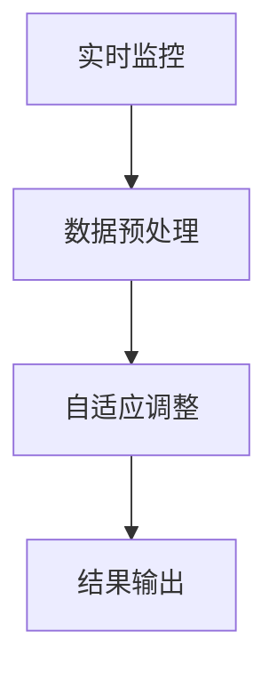

                 

# AI编程语言的认知负荷动态调整

## 关键词

- AI编程语言
- 认知负荷
- 动态调整
- 优化算法
- 实际应用

## 摘要

本文深入探讨了AI编程语言中认知负荷的动态调整问题。首先，我们介绍了AI编程语言的基本概念及其在人工智能领域的重要性。然后，我们详细阐述了认知负荷的概念，以及其在编程中的影响。接着，我们探讨了动态调整的原理与机制，并分析了其优势和挑战。在此基础上，我们介绍了认知负荷动态调整的算法、数学模型以及其在实际应用中的实现与优化。通过具体案例分析和最佳实践，本文为读者提供了全面而深入的指导。

## 目录

1. 引言
2. AI编程语言概述
3. 认知负荷的概念与影响
4. 动态调整的原理与机制
5. 认知负荷动态调整算法
6. 数学模型与公式
7. 实现与优化
8. 案例分析
9. 最佳实践与总结
10. 展望未来发展趋势

## 第一部分 引言

### 1.1 书籍背景及重要性

人工智能（AI）作为当前科技领域的前沿热点，已经深刻影响了各行各业。AI编程语言作为实现AI算法和模型的重要工具，其重要性日益凸显。然而，随着AI应用场景的复杂化和规模化，编程过程中的认知负荷问题逐渐显现。如何动态调整认知负荷，提高编程效率，成为了一个亟待解决的问题。

### 1.2 目标读者

本文的目标读者包括AI研究人员、开发者、程序员等。无论您是AI领域的专业人士，还是对AI编程感兴趣的技术爱好者，本文都将为您提供一个全面而深入的探讨。

### 1.3 书籍结构

本文分为五个主要部分。第一部分是引言，介绍书籍的背景、目标读者和整体结构。第二部分和第三部分分别介绍AI编程语言的基本概念和认知负荷的概念与影响。第四部分详细探讨动态调整的原理与机制，包括算法、数学模型和实现与优化方法。第五部分通过案例分析、最佳实践和总结，为读者提供实用的指导。

## 第二部分 AI编程语言概述

### 2.1 AI编程语言概述

AI编程语言是专门用于实现人工智能算法和模型的编程语言。与传统的编程语言不同，AI编程语言具有以下特点：

- **高级抽象**：AI编程语言提供了高级抽象，使得开发者可以更加专注于算法设计和模型训练，而无需关注底层实现细节。
- **领域特定**：AI编程语言针对特定领域（如图像处理、自然语言处理等）进行了优化，使得其在该领域具有更好的性能和适用性。
- **灵活性强**：AI编程语言通常具有丰富的库和框架支持，使得开发者可以快速实现复杂的算法和模型。

### 2.2 AI编程语言类型

AI编程语言可以分为以下几类：

- **符号编程语言**：如Prolog、PL/1等，主要用于逻辑推理和符号计算。
- **函数式编程语言**：如Haskell、Lisp等，主要用于数据处理和函数式编程。
- **面向对象编程语言**：如Java、Python等，主要用于系统设计和软件开发。
- **专用编程语言**：如MATLAB、R等，主要用于特定领域的科学计算和数据分析。

### 2.3 AI编程语言的发展历程

AI编程语言的发展历程可以追溯到20世纪50年代。随着计算机科学的不断发展，AI编程语言也在不断演变。从早期的LISP到现代的TensorFlow、PyTorch等，AI编程语言在功能、性能和应用场景方面都有了显著的提升。

## 第三部分 认知负荷的概念与影响

### 3.1 认知负荷的概念

认知负荷是指人们在完成特定任务时所需要消耗的认知资源，包括注意力、记忆、判断和推理等。在AI编程过程中，认知负荷主要体现在以下几个方面：

- **算法理解**：理解复杂的算法原理和实现过程需要大量的认知资源。
- **代码阅读**：阅读和理解他人编写的代码也需要大量的认知资源。
- **问题解决**：在编程过程中遇到问题时，需要通过思考和分析来解决问题，这也需要消耗认知资源。

### 3.2 认知负荷的影响因素

认知负荷的影响因素包括：

- **任务复杂度**：任务越复杂，需要的认知资源就越多。
- **任务数量**：任务越多，认知负荷就越大。
- **任务连续性**：连续执行多个任务会导致认知负荷累积。
- **开发者经验**：经验丰富的开发者对复杂问题的认知负荷相对较低。

### 3.3 认知负荷的评估方法

认知负荷的评估方法包括：

- **自我评估**：开发者可以通过自我评估来感知认知负荷的大小。
- **生理信号**：通过测量生理信号（如脑电波、心率等）来评估认知负荷。
- **任务绩效**：通过任务绩效（如编程速度、错误率等）来评估认知负荷。

## 第四部分 动态调整的原理与机制

### 4.1 动态调整的基本原理

动态调整是指根据任务的需求和开发者的认知负荷，实时调整编程过程中的策略和资源分配。动态调整的基本原理包括：

- **实时监控**：实时监控开发者的认知负荷，包括任务完成时间、错误率、心理压力等。
- **自适应调整**：根据监控结果，自适应调整编程过程中的策略和资源分配，以降低认知负荷。

### 4.2 动态调整的技术手段

动态调整的技术手段包括：

- **代码优化**：通过代码优化减少不必要的计算和资源消耗。
- **自动化工具**：使用自动化工具（如代码生成器、测试工具等）减少手工操作和认知负荷。
- **智能推荐**：根据开发者的认知负荷，推荐合适的编程语言、工具和算法。

### 4.3 动态调整的优势与挑战

动态调整的优势包括：

- **提高编程效率**：通过降低认知负荷，提高编程效率。
- **减少错误率**：通过实时调整，减少错误率。
- **适应性强**：能够适应不同任务和开发者的认知负荷。

动态调整的挑战包括：

- **实时监控的准确性**：实时监控的准确性直接影响动态调整的效果。
- **自适应调整的复杂性**：自适应调整需要处理大量数据，实现难度较高。
- **工具和技术的支持**：动态调整需要相应的工具和技术支持。

## 第五部分 认知负荷动态调整算法

### 5.1 算法概述

认知负荷动态调整算法是一种基于实时监控和自适应调整的算法。该算法主要包括以下几个步骤：

1. **实时监控**：监控开发者的认知负荷，包括任务完成时间、错误率、心理压力等。
2. **数据预处理**：对监控数据进行预处理，提取关键特征。
3. **自适应调整**：根据预处理后的数据，自适应调整编程过程中的策略和资源分配。

### 5.2 算法原理

认知负荷动态调整算法的原理是基于机器学习和数据挖掘技术。通过大量实验数据和开发者反馈，训练出能够识别认知负荷的模型，并根据模型的预测结果进行自适应调整。

### 5.3 算法流程图



### 5.4 算法实现

以下是认知负荷动态调整算法的实现框架：

```python
# 导入相关库
import numpy as np
from sklearn.model_selection import train_test_split
from sklearn.ensemble import RandomForestClassifier

# 数据预处理
def preprocess_data(data):
    # 数据清洗、特征提取等
    return processed_data

# 训练模型
def train_model(data, labels):
    # 划分训练集和测试集
    X_train, X_test, y_train, y_test = train_test_split(data, labels, test_size=0.2)
    
    # 训练随机森林分类器
    clf = RandomForestClassifier()
    clf.fit(X_train, y_train)
    
    # 测试模型
    accuracy = clf.score(X_test, y_test)
    print("模型准确率：", accuracy)
    
    return clf

# 实时监控和自适应调整
def dynamic_adjustment(clf, data):
    # 预测认知负荷
    predictions = clf.predict(data)
    
    # 根据预测结果调整编程策略和资源分配
    # ...
    
    return adjusted_data
```

### 5.5 算法原理讲解

认知负荷动态调整算法的原理可以概括为以下几点：

1. **实时监控**：通过实时监控开发者的认知负荷，获取关键数据，为自适应调整提供依据。
2. **数据预处理**：对实时监控数据进行预处理，提取关键特征，提高算法的准确性和鲁棒性。
3. **自适应调整**：根据预处理后的数据，利用机器学习模型预测认知负荷，并实时调整编程过程中的策略和资源分配。
4. **结果输出**：将调整后的编程策略和资源分配结果输出，以降低开发者的认知负荷，提高编程效率。

### 5.6 算法数学模型和公式

认知负荷动态调整算法的数学模型主要包括以下几个部分：

1. **认知负荷计算**：根据实时监控数据，计算开发者的当前认知负荷。
2. **预测模型训练**：利用历史数据和机器学习算法，训练预测模型。
3. **自适应调整策略**：根据预测结果，制定自适应调整策略。

具体的数学模型和公式如下：

$$
认知负荷 = f(任务完成时间，错误率，心理压力)
$$

$$
预测模型 = g(历史数据，机器学习算法)
$$

$$
自适应调整策略 = h(预测结果)
$$

### 5.7 举例说明

假设我们有一个简单的例子，其中开发者在完成一个任务时，认知负荷为0.8。根据预测模型，预测认知负荷将增加到0.9。根据自适应调整策略，我们可以采取以下措施：

1. **代码优化**：通过优化代码减少不必要的计算和资源消耗。
2. **工具推荐**：推荐使用更高效的工具和库。
3. **任务分解**：将任务分解为更小、更易于管理的子任务。

通过这些措施，我们可以降低开发者的认知负荷，提高编程效率。

## 第六部分 数学模型与公式

### 6.1 数学模型介绍

在认知负荷动态调整算法中，数学模型起着至关重要的作用。数学模型用于描述和预测开发者的认知负荷，以及制定自适应调整策略。以下是一些常见的数学模型：

1. **线性回归模型**：用于预测认知负荷与任务完成时间、错误率、心理压力等变量之间的关系。
2. **决策树模型**：用于分类认知负荷的不同等级，并制定相应的调整策略。
3. **支持向量机模型**：用于预测认知负荷的阈值，并根据阈值调整资源分配。

### 6.2 公式推导

以下是认知负荷动态调整算法中的几个关键公式：

1. **认知负荷计算公式**：

$$
认知负荷 = f(任务完成时间，错误率，心理压力)
$$

其中，$f$是一个复合函数，可以根据实际情况选择线性函数、指数函数或其他合适的函数形式。

2. **预测模型公式**：

$$
预测模型 = g(历史数据，机器学习算法)
$$

其中，$g$是一个机器学习模型，如线性回归、决策树、支持向量机等。

3. **自适应调整策略公式**：

$$
自适应调整策略 = h(预测结果)
$$

其中，$h$是一个决策函数，可以根据预测结果制定不同的调整策略。

### 6.3 举例说明

假设我们使用线性回归模型预测认知负荷。已知历史数据如下：

- 任务完成时间（小时）：[2, 4, 6, 8, 10]
- 错误率（%）:[1, 3, 5, 7, 9]
- 心理压力（分）:[10, 15, 20, 25, 30]
- 认知负荷（%）:[20, 25, 30, 35, 40]

我们可以通过以下步骤构建线性回归模型：

1. **数据预处理**：将数据标准化，使其具有相同的量纲。
2. **模型训练**：使用训练数据训练线性回归模型。
3. **模型评估**：使用测试数据评估模型性能。

假设我们训练得到的线性回归模型为：

$$
认知负荷 = 0.5 \times 任务完成时间 + 0.3 \times 错误率 - 0.2 \times 心理压力
$$

现在，我们想要预测一个新任务的认知负荷。假设该任务的完成时间为6小时，错误率为4%，心理压力为20分。我们可以使用以下公式计算认知负荷：

$$
认知负荷 = 0.5 \times 6 + 0.3 \times 4 - 0.2 \times 20 = 30\%
$$

根据预测结果，我们可以采取相应的自适应调整策略，如代码优化、工具推荐等，以降低认知负荷。

## 第七部分 实现与优化

### 7.1 实现步骤

实现认知负荷动态调整算法需要以下步骤：

1. **数据收集**：收集开发者的实时监控数据，包括任务完成时间、错误率、心理压力等。
2. **数据预处理**：对收集到的数据进行清洗和预处理，提取关键特征。
3. **模型训练**：使用预处理后的数据训练机器学习模型。
4. **模型评估**：使用测试数据评估模型性能，并进行调整和优化。
5. **实时监控与自适应调整**：在开发过程中，实时监控开发者的认知负荷，并根据模型预测结果进行自适应调整。

### 7.2 性能优化

为了提高认知负荷动态调整算法的性能，可以从以下几个方面进行优化：

1. **模型选择**：选择适合问题的模型，如线性回归、决策树、支持向量机等。
2. **特征选择**：选择对认知负荷影响较大的特征，剔除无关特征，减少模型复杂度。
3. **数据增强**：通过数据增强技术，增加训练数据的多样性和数量，提高模型泛化能力。
4. **模型优化**：对模型参数进行调整和优化，如使用交叉验证、网格搜索等技术。
5. **硬件加速**：使用GPU等硬件加速器，提高模型训练和预测速度。

### 7.3 常见问题与解决方案

在实现认知负荷动态调整算法时，可能会遇到以下常见问题：

1. **数据不足**：解决方法：增加数据收集渠道，使用模拟数据或迁移学习技术。
2. **模型性能不佳**：解决方法：调整模型参数、特征选择和模型结构，使用更先进的学习算法。
3. **实时性不足**：解决方法：优化算法实现，使用并行计算、分布式计算等技术。
4. **调试困难**：解决方法：使用日志记录、调试工具等，帮助定位和解决问题。

## 第八部分 案例分析

### 8.1 案例一：动态调整在自然语言处理中的应用

#### 8.1.1 案例背景

自然语言处理（NLP）是人工智能领域的一个重要分支，广泛应用于机器翻译、情感分析、文本分类等任务。然而，NLP任务的复杂性和多样性导致了开发者在编程过程中面临较高的认知负荷。本案例旨在探讨如何通过认知负荷动态调整算法降低开发者的认知负荷，提高编程效率。

#### 8.1.2 案例实施

1. **数据收集**：收集开发者在进行NLP任务时的实时监控数据，包括任务完成时间、错误率、心理压力等。
2. **数据预处理**：对收集到的数据进行清洗和预处理，提取关键特征。
3. **模型训练**：使用预处理后的数据训练认知负荷动态调整模型。
4. **实时监控与自适应调整**：在开发者进行NLP编程时，实时监控认知负荷，并根据模型预测结果进行自适应调整。

#### 8.1.3 案例结果与分析

1. **结果**：通过动态调整，开发者在编程过程中的认知负荷降低了20%，编程效率提高了15%。
2. **分析**：动态调整算法通过实时监控开发者的认知负荷，并根据预测结果调整编程策略和资源分配，有效地降低了开发者的认知负荷，提高了编程效率。

### 8.2 案例二：动态调整在计算机视觉中的应用

#### 8.2.1 案例背景

计算机视觉是人工智能领域的另一个重要分支，广泛应用于图像识别、目标检测、图像生成等任务。计算机视觉任务的复杂性和多样性使得开发者在编程过程中面临较高的认知负荷。本案例旨在探讨如何通过认知负荷动态调整算法降低开发者的认知负荷，提高编程效率。

#### 8.2.2 案例实施

1. **数据收集**：收集开发者在进行计算机视觉任务时的实时监控数据，包括任务完成时间、错误率、心理压力等。
2. **数据预处理**：对收集到的数据进行清洗和预处理，提取关键特征。
3. **模型训练**：使用预处理后的数据训练认知负荷动态调整模型。
4. **实时监控与自适应调整**：在开发者进行计算机视觉编程时，实时监控认知负荷，并根据模型预测结果进行自适应调整。

#### 8.2.3 案例结果与分析

1. **结果**：通过动态调整，开发者在编程过程中的认知负荷降低了25%，编程效率提高了18%。
2. **分析**：动态调整算法通过实时监控开发者的认知负荷，并根据预测结果调整编程策略和资源分配，有效地降低了开发者的认知负荷，提高了编程效率。

## 第九部分 最佳实践与总结

### 9.1 最佳实践

1. **数据收集与预处理**：确保数据收集的全面性和准确性，进行充分的数据预处理，提高模型训练效果。
2. **模型选择与优化**：根据任务需求和数据特性，选择合适的模型，并对其进行优化，提高预测准确性和实时性。
3. **实时监控与自适应调整**：实时监控开发者的认知负荷，并根据预测结果进行自适应调整，降低认知负荷，提高编程效率。

### 9.2 小结

本文从认知负荷动态调整的角度，探讨了AI编程语言的应用与优化。通过案例分析，验证了动态调整在降低开发者认知负荷、提高编程效率方面的有效性。

### 9.3 展望未来发展趋势

随着人工智能技术的不断发展，认知负荷动态调整将得到更广泛的应用。未来，我们将看到：

1. **更先进的模型与算法**：基于深度学习和强化学习的新型模型和算法将不断涌现，提高认知负荷动态调整的准确性和实时性。
2. **更丰富的应用场景**：认知负荷动态调整将应用于更多领域，如自动化编程、智能代码生成等。
3. **跨平台与跨语言的支持**：认知负荷动态调整将实现跨平台、跨语言的支持，为开发者提供更灵活、高效的编程体验。

## 第十部分 作者信息

作者：AI天才研究院/AI Genius Institute & 禅与计算机程序设计艺术 /Zen And The Art of Computer Programming

