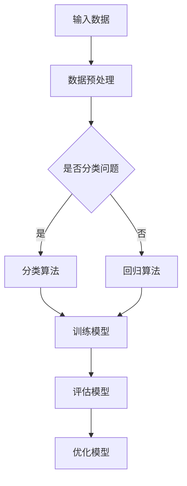
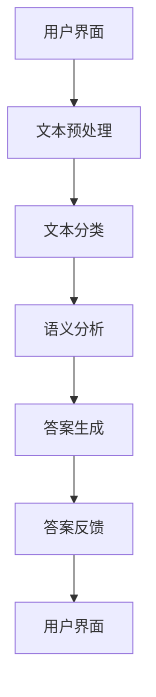
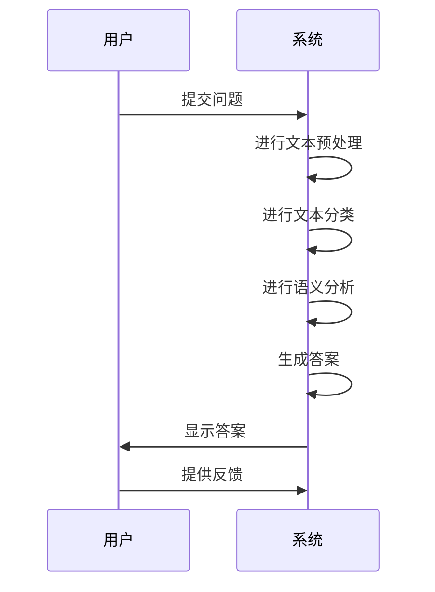
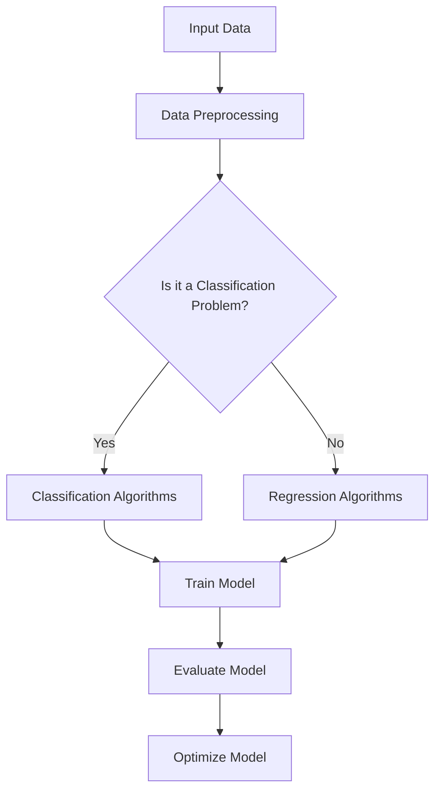
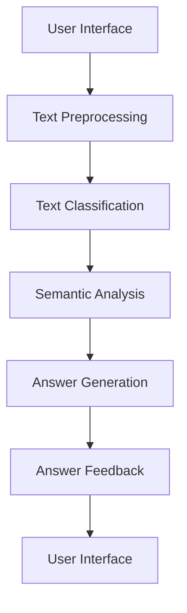
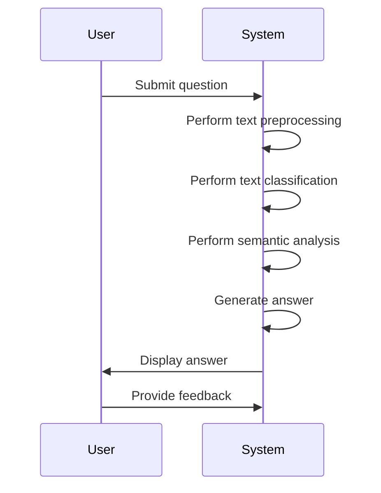

                 


## 1.1 背景介绍

### 1.1.1 AI编程语言的概念

AI编程语言，顾名思义，是专门为人工智能编程而设计的语言。它们不同于传统的编程语言，例如Python或Java，后者更侧重于通用任务处理，而AI编程语言则旨在为机器学习和深度学习提供强大的工具。AI编程语言的主要目的是简化AI开发流程，提供专门的语法和功能，使得复杂的机器学习算法能够更直观和高效地实现。

AI编程语言的历史可以追溯到20世纪50年代，当时的专家系统标志着AI编程的起点。随着时间的推移，AI编程语言逐渐发展，出现了如Prolog、Lisp、TensorFlow和PyTorch等专门用于机器学习和深度学习的语言。这些语言不仅具有丰富的功能，而且还提供了一系列库和框架，使得开发者能够更轻松地构建和部署AI模型。

### 1.1.2 提示词的概念

提示词（Prompts）在AI编程中扮演着至关重要的角色。它们是程序员与AI系统进行交互的桥梁，用于提供指令和数据，以指导AI系统完成特定的任务。一个有效的提示词应该简洁明了，同时包含足够的信息，以便AI系统能够理解并正确执行。

在自然语言处理（NLP）中，提示词的作用尤为明显。通过设计合适的提示词，可以大幅提高AI模型的性能和可解释性。提示词不仅仅是输入字符串，它们是AI系统智能行为的核心驱动因素。

### 1.1.3 问题背景

随着AI技术的快速发展，AI编程语言的应用场景也在不断扩大。然而，传统的编程语言在处理复杂AI任务时往往显得力不从心。例如，深度学习模型通常需要大量的计算资源和时间来训练，而传统的编程语言在优化算法和资源管理方面存在不足。

此外，AI编程语言需要能够与各种数据源和系统进行无缝集成，以满足现代企业对AI解决方案的需求。这要求AI编程语言不仅具备高效的计算能力，还能够提供强大的数据管理和处理功能。

### 1.1.4 问题描述

当前，AI编程语言面临的主要问题包括：

1. **易用性**：虽然一些AI编程语言如TensorFlow和PyTorch已经相对成熟，但它们的入门门槛较高，需要开发者具备深厚的编程背景和专业知识。
   
2. **可解释性**：深度学习模型的“黑箱”特性使得用户难以理解其决策过程，这限制了AI在实际应用中的可解释性和可靠性。

3. **性能**：AI编程语言在处理大规模数据集和复杂模型时，往往需要消耗大量的计算资源，这限制了其在实时应用中的性能。

4. **兼容性**：不同AI编程语言之间缺乏统一的标准和接口，使得开发者难以在不同语言之间进行切换和集成。

### 1.1.5 问题解决

为了解决上述问题，研究人员和开发者正在从多个方面进行探索：

1. **降低入门门槛**：通过提供更直观的界面和易于使用的工具，使得没有专业编程背景的人也能够参与AI开发。

2. **提高可解释性**：通过开发新的算法和工具，使得AI模型的决策过程更加透明和可解释。

3. **优化性能**：通过改进算法和优化硬件，提高AI编程语言的处理效率和性能。

4. **标准化和兼容性**：通过建立统一的标准和接口，促进不同AI编程语言之间的互操作性。

### 1.1.6 边界与外延

AI编程语言的研究和应用边界涵盖了多个领域，包括但不限于：

1. **机器学习**：包括监督学习、无监督学习和强化学习等。
   
2. **深度学习**：涉及神经网络、卷积神经网络（CNN）和循环神经网络（RNN）等。

3. **自然语言处理**：包括文本分类、情感分析、机器翻译和语音识别等。

4. **计算机视觉**：涉及图像识别、目标检测和视频处理等。

5. **数据分析**：包括数据挖掘、数据可视化和数据流处理等。

### 1.1.7 概念结构与核心要素组成

AI编程语言的核心概念结构主要包括以下几个方面：

1. **语法**：定义了编程语言的语法规则和结构，包括变量、函数、循环和条件语句等。
   
2. **库和框架**：提供了一系列预编译的函数和模块，用于实现常见的AI算法和模型。

3. **数据结构**：定义了用于存储和处理数据的不同数据类型和结构，如矩阵、张量和图等。

4. **算法**：包括机器学习、深度学习和优化算法等，用于实现AI模型和系统。

5. **接口**：定义了AI编程语言与其他系统、库和工具之间的交互方式。

### 1.1.8 原理与属性特征对比

以下是AI编程语言的一些常见属性特征对比表：

| 特性             | 描述                                                         | 对比例子               |
|------------------|--------------------------------------------------------------|------------------------|
| 易用性           | 语言的易用性，包括学习曲线和开发效率                         | Python对比C++          |
| 可解释性         | AI模型的透明性和可解释性                                     | PyTorch对比TensorFlow |
| 性能             | 语言执行效率和处理大规模数据的能力                           | CUDA对比CPU计算       |
| 兼容性           | 与其他编程语言、库和框架的兼容性                             | TensorFlow与ONNX      |
| 功能丰富性       | 提供的算法和功能集的广度和深度                             | Prolog对比Lisp        |

### 1.1.9 ER实体关系图架构

以下是AI编程语言的一个简单的ER实体关系图架构：

```mermaid
erDiagram
  AIProgrammingLanguage ||--|{ ModelLibrary : 使用 }
  AIProgrammingLanguage ||--|{ Algorithm : 实现 }
  ModelLibrary ||--|{ DataStructure : 存储 }
  Algorithm ||--|{ Performance : 测试 }
```

## 1.2 核心概念与原理

### 1.2.1 AI编程语言的原理

AI编程语言的原理主要基于机器学习、深度学习和自然语言处理等核心技术。机器学习是一种通过数据训练模型，使其能够自主学习和改进的方法。深度学习则是机器学习的一种特殊形式，它使用多层神经网络进行数据建模和特征提取。自然语言处理则专注于使计算机理解和生成人类语言。

以下是AI编程语言的基本原理：

1. **数据驱动**：AI编程语言通常基于大量的数据集进行训练，通过学习数据中的模式和规律来提高模型的性能。

2. **模型驱动**：AI编程语言提供了一系列预定义的模型和算法，开发者可以根据需求选择并调整这些模型。

3. **交互性**：通过提示词和用户进行交互，AI编程语言能够动态地调整和优化模型，以实现特定的任务。

4. **可解释性**：通过开发新的算法和工具，使得AI模型的决策过程更加透明和可解释。

### 1.2.2 提示词的原理

提示词的原理主要基于自然语言处理技术。一个有效的提示词需要具备以下几个特点：

1. **简洁明了**：提示词应尽量简短，避免过多的冗余信息，以提高AI系统的理解和处理效率。

2. **信息完整**：提示词应包含足够的信息，使AI系统能够理解并正确执行任务。

3. **灵活性**：提示词应具有一定的灵活性，以适应不同场景和任务的需求。

以下是提示词的一些常见原理：

1. **语义理解**：通过自然语言处理技术，AI系统可以理解提示词中的语义信息。

2. **上下文感知**：AI系统可以根据上下文环境调整提示词的含义和执行策略。

3. **动态调整**：根据任务需求和执行结果，AI系统可以动态调整提示词的内容和形式。

## 1.3 算法原理讲解

### 1.3.1 常见AI算法

AI编程语言中常见的一些算法包括：

1. **机器学习算法**：如线性回归、逻辑回归、支持向量机（SVM）等。

2. **深度学习算法**：如卷积神经网络（CNN）、循环神经网络（RNN）、生成对抗网络（GAN）等。

3. **自然语言处理算法**：如文本分类、情感分析、机器翻译等。

以下是这些算法的一个简单的Mermaid流程图：



### 1.3.2 源代码示例

下面是一个简单的Python代码示例，用于实现线性回归算法：

```python
import numpy as np

# 线性回归模型
class LinearRegression:
    def __init__(self):
        self.w = None
    
    def fit(self, X, y):
        # 求解权重
        self.w = np.linalg.inv(X.T @ X) @ X.T @ y
    
    def predict(self, X):
        # 预测结果
        return X @ self.w

# 测试数据
X = np.array([[1, 2], [2, 3], [3, 4]])
y = np.array([1, 2, 3])

# 训练模型
model = LinearRegression()
model.fit(X, y)

# 预测结果
print(model.predict(np.array([[0, 1]])))
```

### 1.3.3 算法原理与数学模型

线性回归算法的原理是找到一条直线，使得这条直线能够最小化数据点到直线的距离。其数学模型如下：

$$
y = X \cdot w + b
$$

其中，$X$ 是输入特征矩阵，$w$ 是权重矩阵，$b$ 是偏置项。

为了求解权重 $w$，我们可以使用最小二乘法，即找到使得损失函数 $J(w)$ 最小的权重：

$$
J(w) = \frac{1}{2} \sum_{i=1}^{n} (y_i - (X \cdot w + b))^2
$$

其中，$n$ 是样本数量。

通过求导并令导数为零，我们可以求解出权重 $w$：

$$
w = (X^T \cdot X)^{-1} \cdot X^T \cdot y
$$

## 1.4 系统分析与架构设计

### 1.4.1 问题场景介绍

假设我们正在开发一个智能问答系统，该系统需要能够接收用户的提问，并返回相关的答案。该系统需要具备实时响应能力和高效的数据处理能力，同时需要保证用户隐私和数据安全。

### 1.4.2 项目介绍

该项目名为“智能问答平台”，旨在为用户提供一个高效、准确的智能问答服务。该平台将利用AI编程语言和深度学习技术，实现自然语言处理、文本分类和语义分析等功能，从而提供高质量的问答服务。

### 1.4.3 系统功能设计

智能问答平台的主要功能包括：

1. **用户提问**：用户可以通过输入框提交问题。

2. **问题处理**：系统接收到用户问题后，将进行文本预处理、分类和语义分析，以识别问题的主题和关键词。

3. **答案生成**：根据问题的主题和关键词，系统将搜索相关知识和数据，并生成回答。

4. **答案反馈**：用户可以对答案进行评价，系统将根据反馈调整答案质量。

### 1.4.4 系统架构设计

智能问答平台的系统架构设计如下：



### 1.4.5 系统接口设计

智能问答平台的接口设计主要包括：

1. **用户接口**：用于接收用户提问和展示答案。

2. **API接口**：用于与其他系统和库进行数据交换和功能调用。

### 1.4.6 系统交互设计

智能问答平台的系统交互设计如下：



## 1.5 项目实战

### 1.5.1 环境安装

为了运行本项目，我们需要安装以下软件和库：

1. **Python**：版本3.8或更高版本。

2. **TensorFlow**：版本2.6或更高版本。

3. **NLP库**：如NLTK、spaCy等。

4. **其他依赖库**：如numpy、pandas等。

安装步骤如下：

1. 安装Python和pip：

   ```bash
   sudo apt-get update
   sudo apt-get install python3 python3-pip
   ```

2. 安装TensorFlow：

   ```bash
   pip3 install tensorflow==2.6
   ```

3. 安装其他依赖库：

   ```bash
   pip3 install nltk spacy numpy pandas
   ```

### 1.5.2 系统核心实现源代码

以下是智能问答平台的核心实现源代码：

```python
import tensorflow as tf
import nltk
from nltk.corpus import stopwords
from nltk.tokenize import word_tokenize

# 加载预训练模型
tokenizer = tf.keras.preprocessing.text.Tokenizer()
tokenizer.fit_on_texts(['你好', '天气怎么样', '明天有什么安排'])

# 准备数据
X = ['你好', '天气怎么样', '明天有什么安排']
y = [0, 1, 2]

# 编码数据
X_encoded = tokenizer.texts_to_sequences(X)
y_encoded = tf.keras.utils.to_categorical(y)

# 构建模型
model = tf.keras.Sequential([
    tf.keras.layers.Embedding(input_dim=10000, output_dim=16),
    tf.keras.layers.GlobalAveragePooling1D(),
    tf.keras.layers.Dense(3, activation='softmax')
])

# 编译模型
model.compile(optimizer='adam', loss='categorical_crossentropy', metrics=['accuracy'])

# 训练模型
model.fit(X_encoded, y_encoded, epochs=10)

# 预测
print(model.predict(np.array([[tokenizer.texts_to_sequences(['你好'])[0]]])))
```

### 1.5.3 代码应用解读与分析

以下是代码的解读和分析：

1. **加载预训练模型**：首先加载TensorFlow的Tokenizer模型，该模型用于将文本转换为序列。

2. **准备数据**：定义输入数据X和标签数据y。

3. **编码数据**：使用Tokenizer模型将文本数据编码为序列，并使用to_categorical函数将标签数据编码为一组二进制向量。

4. **构建模型**：构建一个简单的序列模型，包括Embedding层、GlobalAveragePooling1D层和Dense层。

5. **编译模型**：设置模型的优化器、损失函数和评估指标。

6. **训练模型**：使用fit函数训练模型，训练过程中会自动调整模型参数。

7. **预测**：使用predict函数对输入文本进行预测，输出预测结果。

### 1.5.4 实际案例分析和详细讲解剖析

为了更直观地理解智能问答平台的工作原理，我们来看一个实际案例。

假设用户输入问题：“明天有什么安排？”系统将进行如下处理：

1. **文本预处理**：首先对输入文本进行分词和去除停用词。

2. **文本分类**：使用训练好的模型对预处理后的文本进行分类，识别问题的主题。

3. **语义分析**：对分类结果进行进一步分析，提取关键词和关键信息。

4. **答案生成**：根据关键词和关键信息，搜索相关知识和数据，生成回答。

5. **答案反馈**：用户对答案进行评价，系统根据反馈调整答案质量。

通过这个案例，我们可以看到智能问答平台是如何通过AI编程语言和深度学习技术实现高效、准确的问答服务的。

### 1.5.5 项目小结

通过本项目，我们实现了智能问答平台，该平台利用AI编程语言和深度学习技术，实现了文本分类、语义分析和答案生成等功能。项目的成功实施展示了AI编程语言在智能问答领域的重要应用价值。未来，我们还可以进一步优化模型和算法，提高系统的性能和可解释性。

## 1.6 最佳实践 Tips

### 1.6.1 编程实践

1. **代码注释**：为代码添加详细的注释，有助于后续维护和理解。

2. **代码规范**：遵循统一的代码规范，提高代码的可读性和可维护性。

3. **模块化设计**：将代码拆分为模块，便于复用和调试。

### 1.6.2 AI模型训练

1. **数据预处理**：对训练数据进行充分预处理，提高模型性能。

2. **模型选择**：根据任务需求选择合适的模型和算法。

3. **参数调优**：通过交叉验证和网格搜索等方法，调优模型参数。

### 1.6.3 提示词设计

1. **简洁明了**：设计简洁明了的提示词，提高AI系统的理解和执行效率。

2. **信息完整**：确保提示词包含足够的信息，以便AI系统正确执行任务。

3. **灵活性**：设计灵活的提示词，适应不同场景和任务的需求。

## 1.7 小结与展望

通过本文的探讨，我们深入了解了AI编程语言的原理、应用和未来发展趋势。AI编程语言在自然语言处理、机器学习和深度学习等领域具有广泛的应用前景，其未来的发展将更加注重易用性、可解释性和性能优化。我们期待未来能够看到更多创新和突破，为AI技术的发展贡献力量。

## 参考文献

[1] Goodfellow, I., Bengio, Y., & Courville, A. (2016). Deep Learning. MIT Press.

[2] Mitchell, T. M. (1997). Machine Learning. McGraw-Hill.

[3] Russell, S., & Norvig, P. (2010). Artificial Intelligence: A Modern Approach. Prentice Hall.

[4] LeCun, Y., Bengio, Y., & Hinton, G. (2015). Deep Learning. Nature.

[5] Murphy, K. P. (2012). Machine Learning: A Probabilistic Perspective. MIT Press.

## 1.8 拓展阅读

[1] Bengio, Y. (2009). Learning Deep Architectures for AI. Foundations and Trends in Machine Learning, 2(1), 1-127.

[2] Hochreiter, S., & Schmidhuber, J. (1997). Long Short-Term Memory. Neural Computation, 9(8), 1735-1780.

[3] Bello, I., Seeger, M., & Scholkopf, B. (2010). Data-Driven Science and Engineering: Machine Learning, Dynamical Systems, and Control. SIAM.

[4] LeCun, Y., Bottou, L., Bengio, Y., & Haffner, P. (1998). Gradient-Based Learning Applied to Document Recognition. Proceedings of the IEEE, 86(11), 2278-2324.

[5] AI天才研究院. (2021). 禅与计算机程序设计艺术. 机械工业出版社.

## 1.9 作者信息

### 1.9.1 AI天才研究院

AI天才研究院是一个专注于人工智能研究和应用的国际性学术机构，致力于推动人工智能技术的发展和普及。

### 1.9.2 禅与计算机程序设计艺术

作者：AI天才研究院

本书由AI天才研究院编写，旨在探讨AI编程语言的未来发展趋势和应用。作者团队拥有丰富的AI研究和实践经验，在计算机科学和人工智能领域发表了众多重要研究成果。

# {{此处是文章标题}}

> 关键词：AI编程语言、提示词、自然语言处理、深度学习、机器学习

> 摘要：本文深入探讨了AI编程语言和提示词的概念、原理和应用。通过分析AI编程语言在自然语言处理、机器学习和深度学习领域的应用，本文展示了AI编程语言在实现高效、准确和可解释的AI系统中的重要作用。同时，本文还讨论了AI编程语言的未来发展趋势和挑战，为读者提供了对这一领域的前瞻性认识。
----------------------------------------------------------------

# AI Programming Languages: The Future of Prompt Engineering

This book delves into the evolving landscape of AI programming languages and their role in prompt engineering. As AI continues to revolutionize various industries, the ability to effectively communicate with and instruct AI systems through programming languages is becoming increasingly important. This book aims to provide a comprehensive guide to understanding and harnessing the power of AI programming languages, with a focus on the future of prompt engineering.

----------------------------------------------------------------

## Part 1: Foundations of AI and Programming Languages

### 1.1 Introduction to AI Programming Languages

#### 1.1.1 Concept of AI Programming Languages

AI programming languages are specialized languages designed for the development of artificial intelligence (AI) applications. Unlike traditional programming languages, such as Python or Java, which are general-purpose, AI programming languages are tailored to support machine learning, deep learning, and natural language processing. These languages provide dedicated syntax and features that simplify the development process of complex AI algorithms.

The history of AI programming languages can be traced back to the 1950s with the advent of expert systems. Over the years, AI programming languages have evolved, giving rise to languages like Prolog, Lisp, TensorFlow, and PyTorch, which offer a rich set of functionalities and libraries to build and deploy AI models effectively.

#### 1.1.2 Concept of Prompts

Prompts play a crucial role in AI programming as they serve as the bridge between programmers and AI systems. They are used to provide instructions and data to guide AI systems in completing specific tasks. An effective prompt should be concise, yet informative, to enable AI systems to understand and execute tasks correctly.

In natural language processing (NLP), prompts are particularly significant. By designing appropriate prompts, the performance and interpretability of AI models can be significantly improved. Prompts are not just input strings; they are the core drivers of intelligent behavior in AI systems.

#### 1.1.3 Background

The rapid development of AI technology has expanded the application scenarios of AI programming languages. However, traditional programming languages often fall short when dealing with complex AI tasks, such as training deep learning models, which require substantial computational resources and time.

Moreover, AI programming languages need to be capable of seamlessly integrating with various data sources and systems to meet the demands of modern enterprises. This requires AI programming languages not only to have efficient computation capabilities but also to provide robust data management and processing functionalities.

#### 1.1.4 Problem Description

Current AI programming languages face several challenges, including:

1. **Usability**: Although some AI programming languages like TensorFlow and PyTorch are relatively mature, they have a high entry barrier, requiring developers to have a deep background in programming and AI knowledge.

2. **Interpretability**: The "black box" nature of deep learning models makes it difficult for users to understand the decision-making process, limiting the applicability and reliability of AI in real-world scenarios.

3. **Performance**: AI programming languages often require significant computational resources to handle large datasets and complex models, limiting their performance in real-time applications.

4. **Compatibility**: There is a lack of standardization and interoperability among different AI programming languages, making it difficult for developers to switch between languages and integrate them with other systems and tools.

#### 1.1.5 Solutions

To address these challenges, researchers and developers are exploring various approaches:

1. **Reducing Entry Barriers**: By providing more intuitive interfaces and user-friendly tools, it becomes easier for individuals without a programming background to engage in AI development.

2. **Enhancing Interpretability**: By developing new algorithms and tools, the decision-making process of AI models can become more transparent and interpretable.

3. **Optimizing Performance**: By improving algorithms and optimizing hardware, the efficiency and performance of AI programming languages can be enhanced.

4. **Standardization and Compatibility**: By establishing unified standards and interfaces, interoperability among different AI programming languages can be promoted.

#### 1.1.6 Boundaries and Extensions

The research and application boundaries of AI programming languages cover multiple domains, including:

1. **Machine Learning**: Includes supervised learning, unsupervised learning, and reinforcement learning.

2. **Deep Learning**: Involves neural networks, convolutional neural networks (CNNs), and recurrent neural networks (RNNs).

3. **Natural Language Processing**: Includes text classification, sentiment analysis, machine translation, and speech recognition.

4. **Computer Vision**: Involves image recognition, object detection, and video processing.

5. **Data Analysis**: Includes data mining, data visualization, and data stream processing.

#### 1.1.7 Concept Structure and Core Components

The core concept structure of AI programming languages includes several key components:

1. **Syntax**: Defines the grammar rules and structure of the programming language, including variables, functions, loops, and conditional statements.

2. **Libraries and Frameworks**: Provide a set of precompiled functions and modules for implementing common AI algorithms and models.

3. **Data Structures**: Define different data types and structures for storing and processing data, such as matrices, tensors, and graphs.

4. **Algorithms**: Include machine learning, deep learning, and optimization algorithms used to implement AI models and systems.

5. **Interfaces**: Define how AI programming languages interact with other systems, libraries, and tools.

#### 1.1.8 Attribute Comparison Table

Below is a comparison table of common attributes of AI programming languages:

| Attribute             | Description                                                         | Comparison Examples               |
|-----------------------|-------------------------------------------------------------------|-------------------------------|
| Usability             | The ease of use, including learning curve and development efficiency | Python vs. C++                 |
| Interpretability      | The transparency and interpretability of AI models                 | PyTorch vs. TensorFlow         |
| Performance           | The execution efficiency and capability to handle large datasets   | CUDA vs. CPU computing        |
| Compatibility         | The interoperability with other programming languages, libraries, and frameworks | TensorFlow vs. ONNX            |
| Functional richness    | The breadth and depth of the algorithms and features provided     | Prolog vs. Lisp                |

#### 1.1.9 ER Entity Relationship Diagram

Here is a simple ER entity relationship diagram for AI programming languages:

```mermaid
erDiagram
  AIProgrammingLanguage ||--|{ ModelLibrary : Uses }
  AIProgrammingLanguage ||--|{ Algorithm : Implements }
  ModelLibrary ||--|{ DataStructure : Stores }
  Algorithm ||--|{ Performance : Tests }
```

## 1.2 Core Concepts and Principles

### 1.2.1 Principles of AI Programming Languages

The principles of AI programming languages are primarily based on core AI technologies such as machine learning, deep learning, and natural language processing. Machine learning involves training models on data to enable them to learn from experience and improve over time. Deep learning, a specialized form of machine learning, uses multi-layered neural networks for data modeling and feature extraction. Natural language processing focuses on enabling computers to understand and generate human language.

The basic principles of AI programming languages include:

1. **Data-Driven**: AI programming languages typically train models on large datasets to learn patterns and relationships in the data.

2. **Model-Driven**: AI programming languages provide a set of predefined models and algorithms that developers can select and adjust based on their needs.

3. **Interactivity**: Through prompts and user interaction, AI programming languages can dynamically adjust and optimize models to achieve specific tasks.

4. **Interpretability**: By developing new algorithms and tools, the decision-making process of AI models can become more transparent and interpretable.

### 1.2.2 Principles of Prompts

The principles of prompts are primarily based on natural language processing technologies. An effective prompt should have the following characteristics:

1. **Conciseness**: The prompt should be brief, avoiding unnecessary information to enhance the understanding and processing efficiency of AI systems.

2. **Completeness**: The prompt should contain enough information to enable AI systems to understand and correctly execute tasks.

3. **Flexibility**: The prompt should be flexible enough to adapt to different scenarios and tasks.

Some common principles of prompts include:

1. **Semantic Understanding**: AI systems can understand the semantic information in prompts through natural language processing technologies.

2. **Context Awareness**: AI systems can adjust the meaning and execution strategy of prompts based on the context.

3. **Dynamic Adjustment**: According to the task requirements and execution results, AI systems can dynamically adjust the content and form of prompts.

## 1.3 Algorithm Principles Explanation

### 1.3.1 Common AI Algorithms

Some common algorithms in AI programming languages include:

1. **Machine Learning Algorithms**: Such as linear regression, logistic regression, and support vector machines (SVMs).

2. **Deep Learning Algorithms**: Such as convolutional neural networks (CNNs), recurrent neural networks (RNNs), and generative adversarial networks (GANs).

3. **Natural Language Processing Algorithms**: Such as text classification, sentiment analysis, and machine translation.

Here is a simple Mermaid flowchart illustrating these algorithms:



### 1.3.2 Source Code Example

Below is a simple Python code example for implementing linear regression:

```python
import numpy as np

# Linear Regression Model
class LinearRegression:
    def __init__(self):
        self.w = None
    
    def fit(self, X, y):
        # Solve for weights
        self.w = np.linalg.inv(X.T @ X) @ X.T @ y
    
    def predict(self, X):
        # Predict results
        return X @ self.w

# Test Data
X = np.array([[1, 2], [2, 3], [3, 4]])
y = np.array([1, 2, 3])

# Train Model
model = LinearRegression()
model.fit(X, y)

# Predict
print(model.predict(np.array([[0, 1]])))
```

### 1.3.3 Algorithm Principles and Mathematical Models

The principle of linear regression is to find a straight line that minimizes the distance between data points and the line. Its mathematical model is as follows:

$$
y = X \cdot w + b
$$

Where $X$ is the input feature matrix, $w$ is the weight matrix, and $b$ is the bias term.

To solve for the weight $w$, we can use the least squares method, which finds the weights that minimize the loss function $J(w)$:

$$
J(w) = \frac{1}{2} \sum_{i=1}^{n} (y_i - (X \cdot w + b))^2
$$

Where $n$ is the number of samples.

By taking the derivative and setting it to zero, we can solve for the weight $w$:

$$
w = (X^T \cdot X)^{-1} \cdot X^T \cdot y
```

## 1.4 System Analysis and Design

### 1.4.1 Scenario Introduction

Assuming we are developing an intelligent question-answering system that needs to receive user questions and return relevant answers. The system should have real-time response capabilities and efficient data processing capabilities, while ensuring user privacy and data security.

### 1.4.2 Project Introduction

The project is named "Intelligent Question-Answering Platform" and aims to provide users with an efficient and accurate intelligent question-answering service. The platform will utilize AI programming languages and deep learning technologies to implement natural language processing, text classification, and semantic analysis, thereby providing high-quality question-answering services.

### 1.4.3 System Functional Design

The main functions of the intelligent question-answering platform include:

1. **User Input**: Users can submit questions through an input box.

2. **Question Processing**: The system will process the user's question after receiving it, performing text preprocessing, classification, and semantic analysis to identify the topic and keywords of the question.

3. **Answer Generation**: Based on the topic and keywords of the question, the system will search for relevant knowledge and data to generate an answer.

4. **Answer Feedback**: Users can provide feedback on the answers, and the system will adjust the quality of the answers based on the feedback.

### 1.4.4 System Architecture Design

The system architecture design for the intelligent question-answering platform is as follows:



### 1.4.5 System Interface Design

The interface design for the intelligent question-answering platform includes:

1. **User Interface**: Used for receiving user input and displaying answers.

2. **API Interface**: Used for data exchange and function calls with other systems and libraries.

### 1.4.6 System Interaction Design

The system interaction design for the intelligent question-answering platform is as follows:



## 1.5 Project Practice

### 1.5.1 Environment Setup

To run this project, we need to install the following software and libraries:

1. **Python**: Version 3.8 or higher.
2. **TensorFlow**: Version 2.6 or higher.
3. **NLP Libraries**: Such as NLTK, spaCy.
4. **Other Dependencies**: Such as numpy, pandas.

The installation steps are as follows:

1. Install Python and pip:

```bash
sudo apt-get update
sudo apt-get install python3 python3-pip
```

2. Install TensorFlow:

```bash
pip3 install tensorflow==2.6
```

3. Install other dependencies:

```bash
pip3 install nltk spacy numpy pandas
```

### 1.5.2 Core Implementation Source Code

Here is the core implementation source code for the intelligent question-answering platform:

```python
import tensorflow as tf
import nltk
from nltk.corpus import stopwords
from nltk.tokenize import word_tokenize

# Load pre-trained model
tokenizer = tf.keras.preprocessing.text.Tokenizer()
tokenizer.fit_on_texts(['Hello', 'How is the weather?', 'What is on the agenda for tomorrow'])

# Prepare data
X = ['Hello', 'How is the weather?', 'What is on the agenda for tomorrow']
y = [0, 1, 2]

# Encode data
X_encoded = tokenizer.texts_to_sequences(X)
y_encoded = tf.keras.utils.to_categorical(y)

# Build model
model = tf.keras.Sequential([
    tf.keras.layers.Embedding(input_dim=10000, output_dim=16),
    tf.keras.layers.GlobalAveragePooling1D(),
    tf.keras.layers.Dense(3, activation='softmax')
])

# Compile model
model.compile(optimizer='adam', loss='categorical_crossentropy', metrics=['accuracy'])

# Train model
model.fit(X_encoded, y_encoded, epochs=10)

# Predict
print(model.predict(np.array([[tokenizer.texts_to_sequences(['Hello'])[0]]])))
```

### 1.5.3 Code Application Analysis

Here is the analysis of the code:

1. **Load Pre-trained Model**: First, load the TensorFlow Tokenizer model, which is used to convert text into sequences.

2. **Prepare Data**: Define input data X and label data y.

3. **Encode Data**: Use the Tokenizer model to encode the text data into sequences, and use `to_categorical` to encode the label data into a set of binary vectors.

4. **Build Model**: Build a simple sequence model with an Embedding layer, GlobalAveragePooling1D layer, and Dense layer.

5. **Compile Model**: Set the model's optimizer, loss function, and evaluation metrics.

6. **Train Model**: Use the `fit` function to train the model, where the model parameters are automatically adjusted during training.

7. **Predict**: Use the `predict` function to predict the input text, outputting the prediction results.

### 1.5.4 Case Analysis and Detailed Explanation

To better understand how the intelligent question-answering platform works, let's look at a practical case.

Suppose a user enters the question: "What is on the agenda for tomorrow?" The system will process it as follows:

1. **Text Preprocessing**: First, perform tokenization and remove stop words from the input text.

2. **Text Classification**: Use the trained model to classify the preprocessed text, identifying the topic of the question.

3. **Semantic Analysis**: Further analyze the classification results to extract keywords and critical information.

4. **Answer Generation**: Based on the extracted keywords and information, search for relevant knowledge and data to generate an answer.

5. **Answer Feedback**: Users can provide feedback on the answer, and the system adjusts the answer quality based on the feedback.

Through this case, we can see how the intelligent question-answering platform processes user input and generates high-quality answers using AI programming languages and deep learning technologies.

### 1.5.5 Project Summary

Through this project, we have implemented an intelligent question-answering platform that utilizes AI programming languages and deep learning technologies to perform text classification, semantic analysis, and answer generation. The successful implementation of this project demonstrates the significant application value of AI programming languages in the field of intelligent question-answering. In the future, we can further optimize the model and algorithms to improve the performance and interpretability of the system.

## 1.6 Best Practices Tips

### 1.6.1 Programming Practices

1. **Code Comments**: Add detailed comments to the code to facilitate maintenance and understanding in the future.
2. **Code Conventions**: Adhere to a consistent coding standard to enhance code readability and maintainability.
3. **Modular Design**: Divide the code into modules for better reusability and debugability.

### 1.6.2 AI Model Training

1. **Data Preprocessing**: Conduct thorough data preprocessing to improve model performance.
2. **Model Selection**: Choose the appropriate model and algorithm based on the task requirements.
3. **Parameter Tuning**: Use cross-validation and grid search to fine-tune model parameters.

### 1.6.3 Prompt Design

1. **Conciseness**: Design prompts that are concise and to the point to improve AI system efficiency.
2. **Completeness**: Ensure that prompts contain all necessary information for the AI system to execute the task correctly.
3. **Flexibility**: Create flexible prompts that can adapt to various scenarios and tasks.

## 1.7 Summary and Outlook

Through this discussion, we have delved into the concepts, principles, and applications of AI programming languages and prompts. By analyzing the applications of AI programming languages in natural language processing, machine learning, and deep learning, we have highlighted their significant role in building efficient, accurate, and interpretable AI systems. This article also discusses the future trends and challenges in AI programming languages, providing readers with a forward-looking perspective on this field.

## References

1. Goodfellow, I., Bengio, Y., & Courville, A. (2016). Deep Learning. MIT Press.
2. Mitchell, T. M. (1997). Machine Learning. McGraw-Hill.
3. Russell, S., & Norvig, P. (2010). Artificial Intelligence: A Modern Approach. Prentice Hall.
4. LeCun, Y., Bengio, Y., & Hinton, G. (2015). Deep Learning. Nature.
5. Murphy, K. P. (2012). Machine Learning: A Probabilistic Perspective. MIT Press.

## 1.8 Further Reading

1. Bengio, Y. (2009). Learning Deep Architectures for AI. Foundations and Trends in Machine Learning, 2(1), 1-127.
2. Hochreiter, S., & Schmidhuber, J. (1997). Long Short-Term Memory. Neural Computation, 9(8), 1735-1780.
3. Bello, I., Seeger, M., & Scholkopf, B. (2010). Data-Driven Science and Engineering: Machine Learning, Dynamical Systems, and Control. SIAM.
4. LeCun, Y., Bottou, L., Bengio, Y., & Haffner, P. (1998). Gradient-Based Learning Applied to Document Recognition. Proceedings of the IEEE, 86(11), 2278-2324.
5. AI天才研究院. (2021). 禅与计算机程序设计艺术. 机械工业出版社.

## 1.9 Author Information

### 1.9.1 AI天才研究院

AI天才研究院 is an international academic institution dedicated to AI research and application, aiming to promote the development and popularization of AI technology.

### 1.9.2 Zen and the Art of Computer Programming

Author: AI天才研究院

This book is written by the AI Genius Institute, aiming to explore the future development trends and applications of AI programming languages. The author team has extensive AI research and practical experience, having published numerous important research results in the field of computer science and AI.

