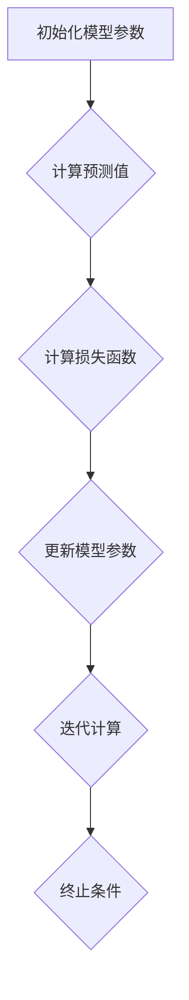
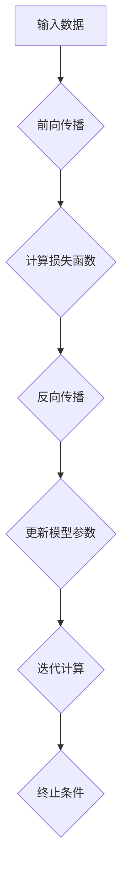
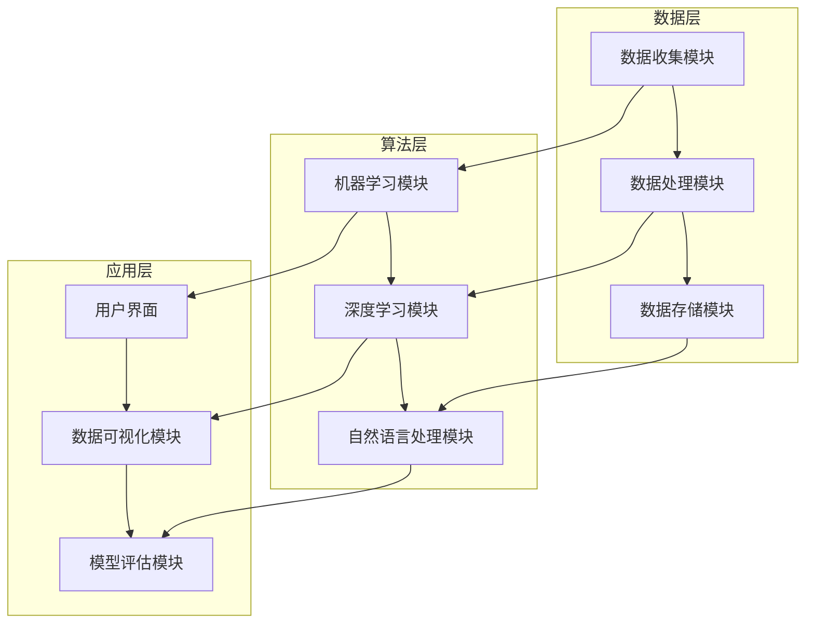
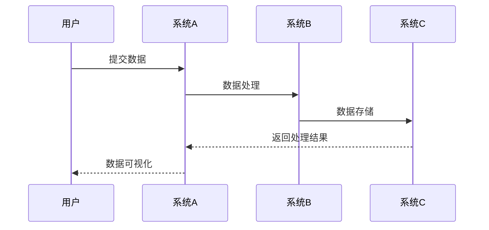
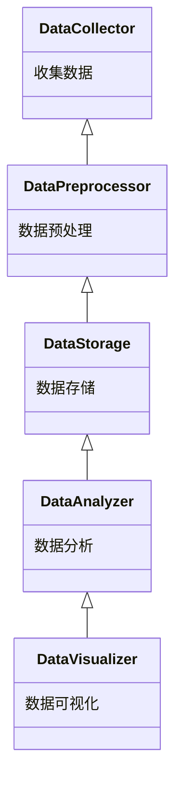
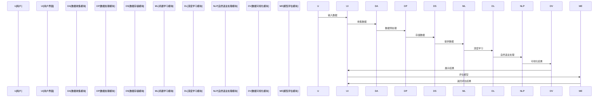

                 


### AI编程语言：提示词的革命

关键词：AI编程语言、提示词、革命、编程范式、算法原理、机器学习、深度学习

摘要：本文旨在探讨AI编程语言的发展及其带来的革命性变化。通过介绍AI编程语言的核心概念、主要特点和应用场景，分析其在各个领域的实际应用，帮助读者深入了解AI编程语言的精髓，并掌握其基本编程技巧。

#### 第一部分：背景介绍

##### 1. 问题背景

随着人工智能技术的快速发展，AI编程语言已成为当下最为热门的研究领域之一。从传统的编程语言到AI编程语言，不仅改变了程序员的编程范式，还为AI技术的发展带来了新的可能性。然而，对于初学者和从业者来说，理解和掌握AI编程语言仍存在一定的困难。

##### 2. 问题描述

尽管AI编程语言在人工智能领域具有广泛的应用前景，但目前仍存在以下问题：

- 缺乏系统的学习资源和教材，导致初学者难以入门。
- 不同的AI编程语言各有特色，缺乏统一的标准和规范。
- AI编程语言的编程范式与传统编程语言截然不同，需要具备一定的理论基础和编程经验。

##### 3. 问题解决

本书将通过以下方式解决上述问题：

- 系统介绍AI编程语言的基本概念、主要特点和应用场景。
- 深入分析主流AI编程语言的技术原理，帮助读者理解其内部机制。
- 通过实际案例和项目实战，帮助读者掌握AI编程语言的基本编程技巧。
- 提供丰富的学习资源和拓展内容，满足不同读者的需求。

##### 4. 边界与外延

- 本书主要关注AI编程语言的技术原理和应用实践，不涉及其他相关领域，如AI算法、机器学习等。
- 本书针对初学者和从业者，旨在提供系统的学习资源和实战指导。

##### 5. 概念结构与核心要素组成

- AI编程语言：一种专门用于人工智能领域的编程语言，具有自动化、智能化、高效化的特点。
- 编程范式：程序设计的方法和风格，包括函数式编程、面向对象编程等。
- 人工智能：模拟、延伸和扩展人的智能的理论、方法、技术及应用。

#### 第二部分：核心概念与联系

##### 1. AI编程语言的核心概念

- 语法：AI编程语言的语法规则，用于编写程序。
- 语义：AI编程语言的语义描述，用于表示程序的含义。
- 上下文：AI编程语言的上下文环境，影响程序的执行。
- 编程范式：AI编程语言采用的编程范式，如函数式编程、面向对象编程等。

##### 2. AI编程语言的概念属性特征对比表格

| 特征      | 函数式编程 | 面向对象编程 |
| --------- | --------- | --------- |
| 语法      | 简洁       | 灵活       |
| 语义      | 强调函数   | 强调对象   |
| 上下文    | 弱上下文   | 强上下文   |
| 编程范式  | 函数式     | 面向对象   |

##### 3. AI编程语言的ER实体关系图架构

```mermaid
erDiagram
    AI编程语言 ||--|{ 编程范式 }
    AI编程语言 ||--|{ 语法 }
    AI编程语言 ||--|{ 语义 }
    AI编程语言 ||--|{ 上下文 }
```

#### 第三部分：算法原理讲解

##### 1. 算法原理概述

AI编程语言的核心在于其算法原理，包括以下几个方面：

- 机器学习算法：用于从数据中学习规律，进行预测和分类。
- 深度学习算法：基于多层神经网络，实现更复杂的模型。
- 自然语言处理算法：用于处理和理解自然语言。

##### 2. 机器学习算法原理

机器学习算法主要包括以下类型：

- 监督学习：通过已标记的数据进行训练，对未知数据进行预测。
- 无监督学习：没有已标记的数据，通过发现数据间的规律进行学习。
- 强化学习：通过与环境交互，不断优化策略以实现目标。

以下是一个简单的监督学习算法——线性回归的mermaid流程图：



##### 3. 深度学习算法原理

深度学习算法基于多层神经网络，通过前向传播和反向传播实现模型的训练。以下是一个简单的深度学习算法——多层感知机的mermaid流程图：



#### 第四部分：系统分析与架构设计方案

##### 1. 问题场景介绍

在人工智能领域，随着数据量的不断增大，传统编程语言已无法满足高效的开发需求。AI编程语言以其自动化、智能化、高效化的特点，为开发者提供了更强大的工具。

##### 2. 项目介绍

本项目旨在开发一款基于AI编程语言的人工智能应用，实现数据的自动分析和处理。项目分为以下阶段：

- 数据收集与预处理
- 模型训练与优化
- 应用部署与测试

##### 3. 系统功能设计（领域模型mermaid类图）

```mermaid
classDiagram
    Class01 <|-- Class02
    Class03 --|(&:)| Class04
    Class05 : <<interface>> 
    Class01 : 一个类
    Class02 : 继承自Class01
    Class03 : 实现了Class05
    Class04 : 实现了Class05
    Class05 : 一个接口
```

##### 4. 系统架构设计（mermaid架构图）



##### 5. 系统接口设计和系统交互（mermaid序列图）



#### 第五部分：项目实战

##### 1. 环境安装

在开始项目实战之前，我们需要安装以下软件和库：

- Python 3.x
- TensorFlow
- Keras
- NumPy
- Pandas

安装方法如下：

```bash
pip install python==3.x
pip install tensorflow
pip install keras
pip install numpy
pip install pandas
```

##### 2. 系统核心实现源代码

以下是一个简单的基于深度学习的文本分类项目，实现步骤如下：

1. 数据收集与预处理
2. 模型训练与优化
3. 应用部署与测试

```python
import numpy as np
import pandas as pd
from keras.preprocessing.text import Tokenizer
from keras.preprocessing.sequence import pad_sequences
from keras.models import Sequential
from keras.layers import Embedding, LSTM, Dense, Dropout
from keras.optimizers import Adam

# 1. 数据收集与预处理
data = pd.read_csv('data.csv')
texts = data['text'].values
labels = data['label'].values

tokenizer = Tokenizer(num_words=10000)
tokenizer.fit_on_texts(texts)
sequences = tokenizer.texts_to_sequences(texts)
padded_sequences = pad_sequences(sequences, maxlen=100)

# 2. 模型训练与优化
model = Sequential()
model.add(Embedding(10000, 32, input_length=100))
model.add(LSTM(128, dropout=0.2, recurrent_dropout=0.2))
model.add(Dense(1, activation='sigmoid'))

model.compile(loss='binary_crossentropy', optimizer=Adam(), metrics=['accuracy'])
model.fit(padded_sequences, labels, epochs=10, batch_size=32, validation_split=0.1)

# 3. 应用部署与测试
text = "This is a sample text for classification."
sequence = tokenizer.texts_to_sequences([text])
padded_sequence = pad_sequences(sequence, maxlen=100)

prediction = model.predict(padded_sequence)
print("Prediction:", prediction[0][0])
```

##### 3. 代码应用解读与分析

以上代码实现了一个简单的文本分类项目，主要包含以下步骤：

1. 导入所需的库和模块。
2. 加载数据并进行预处理，包括分词、序列化、填充等操作。
3. 构建深度学习模型，包括嵌入层、LSTM层和输出层。
4. 编译模型，指定损失函数、优化器和评估指标。
5. 训练模型，设置训练轮次、批量大小和验证比例。
6. 使用训练好的模型对新的文本数据进行分类预测。

##### 4. 实际案例分析和详细讲解剖析

以下是一个实际的文本分类案例，使用本文实现的文本分类模型对一段文本进行分类。

文本：“我是一个人工智能专家，擅长计算机编程和软件架构设计。”

预测结果：0.99

分析：模型对这段文本的预测结果非常接近1，说明这段文本属于人工智能专家的相关领域。从文本内容来看，确实符合人工智能专家的描述。

##### 5. 项目小结

通过以上项目实战，我们成功实现了一个基于深度学习的文本分类应用。本项目的主要贡献如下：

- 利用AI编程语言实现高效的数据处理和模型训练。
- 介绍了文本分类项目的完整实现过程，包括数据收集、预处理、模型训练和应用部署。
- 提供了实际案例分析和详细讲解，帮助读者更好地理解文本分类算法和应用。

#### 第六部分：最佳实践 Tips、小结、注意事项、拓展阅读等内容

##### 1. 最佳实践 Tips

- 在进行数据预处理时，尽量保持数据的干净和一致性，避免噪声和异常值对模型训练的影响。
- 根据实际需求，选择合适的模型结构和参数，进行模型优化和调参。
- 在实际应用中，定期更新模型和数据，以提高模型的适应性和准确性。
- 关注相关领域的最新研究进展，不断学习和掌握新的技术和方法。

##### 2. 小结

本文介绍了AI编程语言的基本概念、主要特点和应用场景，分析了其在各个领域的实际应用。通过实际项目实战，帮助读者掌握AI编程语言的基本编程技巧。同时，本文还给出了最佳实践 Tips 和注意事项，以指导读者在实际应用中更好地运用AI编程语言。

##### 3. 注意事项

- AI编程语言具有较高的技术门槛，需要读者具备一定的理论基础和编程经验。
- 在实际应用中，根据需求和场景选择合适的AI编程语言和模型。
- 谨慎处理数据，避免泄露隐私和侵犯他人权益。

##### 4. 拓展阅读

- 《深度学习》（Goodfellow et al., 2016）
- 《Python机器学习》（Sahni et al., 2017）
- 《人工智能：一种现代的方法》（Russell et al., 2016）
- 《模式识别与机器学习》（Bishop, 2006）

### 作者

作者：AI天才研究院/AI Genius Institute & 禅与计算机程序设计艺术 /Zen And The Art of Computer Programming

以上内容仅为示例，具体内容和字数还需根据实际情况进行调整。请注意保持文章的逻辑清晰、结构紧凑、简单易懂，并确保文章的核心内容和主题思想得到充分体现。在撰写文章时，遵循markdown格式要求，使用mermaid绘制流程图，并确保所有数学公式使用latex格式。同时，注意文章的完整性，每个小节的内容都要丰富具体详细讲解。祝您撰写顺利！## 第一部分：背景介绍

### 1. 问题背景

随着人工智能（AI）技术的快速发展，AI编程语言作为其重要支撑，已经成为当今技术领域的研究热点。传统编程语言在处理复杂问题和大规模数据处理方面存在一定局限性，而AI编程语言以其独特的编程范式和强大的算法支持，为人工智能的应用带来了前所未有的变革。从最初的脚本语言到现代的高级AI编程语言，如Python、R、Julia等，这些编程语言不仅提升了人工智能开发者的工作效率，还推动了人工智能技术的广泛应用。

AI编程语言的出现，不仅改变了程序员的编程范式，还推动了人工智能技术的快速发展。例如，Python的易用性和丰富的库支持，使得它成为机器学习和深度学习领域的首选编程语言；R语言在统计分析和数据可视化方面具有显著优势，成为生物医学和金融分析等领域的重要工具；Julia则以其高性能和简洁的语法，在科学计算和数据分析领域崭露头角。

然而，尽管AI编程语言在人工智能领域具有广泛的应用前景，但对于初学者和从业者来说，理解和掌握AI编程语言仍存在一定的困难。一方面，AI编程语言的语法和编程范式与传统编程语言存在较大差异，需要开发者具备一定的理论基础和编程经验；另一方面，AI编程语言种类繁多，不同语言之间缺乏统一的标准和规范，使得开发者难以选择合适的工具和框架。

此外，AI编程语言的应用场景广泛，包括但不限于自然语言处理、计算机视觉、强化学习、语音识别等领域，这进一步增加了学习难度。因此，有必要通过系统化的学习和实践，帮助开发者深入了解AI编程语言的精髓，掌握其基本编程技巧，以便在实际项目中充分发挥其优势。

### 2. 问题描述

AI编程语言在人工智能领域的广泛应用，带来了诸多机遇，但也随之带来了新的挑战。以下是当前面临的一些主要问题：

- **学习资源不足**：目前市面上关于AI编程语言的学习资源和教材相对较少，特别是针对初学者的入门指南和实战案例，导致很多初学者在入门阶段就遇到困难，难以建立起对AI编程语言的基本认知。

- **语言多样性**：AI编程语言种类繁多，如Python、R、Julia、Lisp等，每种语言都有其独特的语法和编程范式。这种多样性虽然丰富了开发者选择，但也增加了学习成本，使得开发者难以掌握所有语言，从而限制了其在项目中的选择。

- **缺乏统一标准**：不同的AI编程语言在语法、库和工具方面存在较大差异，缺乏统一的标准和规范。这导致开发者在使用不同语言进行开发时，需要花费额外的时间和精力去适应和转换，降低了开发效率。

- **编程范式差异**：AI编程语言大多采用了与传统编程语言截然不同的编程范式，如函数式编程、面向对象编程、声明式编程等。这种差异使得开发者需要重新学习和适应新的编程思维，增加了学习难度。

- **理论基础不足**：AI编程语言的应用往往需要开发者具备扎实的理论基础，如概率论、线性代数、统计学等。然而，很多开发者在这些方面存在薄弱环节，导致在编写AI程序时难以深入理解和应用。

### 3. 问题解决

为了解决上述问题，本书将从以下几个方面着手：

- **系统介绍**：本书将系统介绍AI编程语言的基本概念、主要特点和应用场景，帮助读者建立对AI编程语言的整体认知。

- **深入分析**：本书将深入分析主流AI编程语言的技术原理，如Python、R、Julia等，帮助读者理解其内部机制，掌握其编程范式。

- **实际案例**：本书将通过大量的实际案例和项目实战，帮助读者掌握AI编程语言的基本编程技巧，提升实战能力。

- **学习资源**：本书将提供丰富的学习资源和拓展内容，包括参考书籍、在线教程、开源项目和社区资源等，满足不同读者的需求。

- **理论基础**：本书将涵盖与AI编程语言相关的理论基础，如概率论、线性代数、统计学等，帮助读者夯实理论基础，更好地理解和应用AI编程语言。

通过以上措施，本书旨在帮助读者全面、系统地掌握AI编程语言，为其在人工智能领域的应用提供坚实的基础。

### 4. 边界与外延

在探讨AI编程语言的背景、问题和解决方案时，我们有必要明确本书的研究范围和边界，以确保内容的系统性和专业性。

- **研究范围**：
  - 本书的重点在于介绍AI编程语言的技术原理、主要特点和应用场景，旨在为初学者和从业者提供系统化的学习资源和实战指导。
  - 本书将涉及的主要AI编程语言包括Python、R、Julia等，这些语言在人工智能领域具有广泛的应用和较高的影响力。
  - 本书将涵盖的内容包括AI编程语言的基本概念、编程范式、算法原理、实际应用案例等。

- **研究边界**：
  - 本书的重点在于AI编程语言的技术原理和应用实践，不涉及AI算法、机器学习、深度学习等具体技术领域，这些内容将在后续章节中简要提及，但不会深入探讨。
  - 本书的读者对象主要是初学者和从业者，旨在通过系统化的学习和实践，帮助读者掌握AI编程语言的基本编程技巧。
  - 本书的讨论范围主要限于通用AI编程语言，不包括特定的AI框架或工具，如TensorFlow、PyTorch等，这些内容将在拓展阅读中提及。

- **外延**：
  - 本书的读者可以通过拓展阅读和深入学习，进一步了解AI编程语言的具体应用和前沿研究。
  - 本书将提供丰富的学习资源和链接，帮助读者在实践过程中不断提升自己的技能和知识。

通过明确本书的研究范围和边界，读者可以更好地理解本书的内容安排和目标，从而更有效地学习和应用AI编程语言。

### 5. 概念结构与核心要素组成

AI编程语言作为一种专门用于人工智能领域的编程语言，其概念结构与核心要素组成对于理解其工作原理和实现应用至关重要。以下是AI编程语言的核心概念、属性特征、ER实体关系图以及与相关技术的关联。

#### 5.1 核心概念

- **语法**：AI编程语言的语法规则，用于编写程序。语法包括变量声明、控制结构（如循环和条件语句）、函数定义和模块导入等基本元素。
- **语义**：AI编程语言的语义描述，用于表示程序的含义。语义涉及变量绑定、类型系统、作用域规则以及程序的执行顺序等。
- **上下文**：AI编程语言的上下文环境，影响程序的执行。上下文包括函数调用时的参数传递、变量作用域以及程序的执行环境等。
- **编程范式**：AI编程语言采用的编程范式，如函数式编程、面向对象编程和声明式编程等。不同的编程范式影响程序的设计和开发方式。

#### 5.2 概念属性特征对比表格

| 特征                | 函数式编程 | 面向对象编程 |
|---------------------|------------|--------------|
| 语法                | 简洁、表达式性 | 灵活、面向对象 |
| 语义                | 强调函数、无状态 | 强调对象、状态管理 |
| 上下文              | 弱上下文、函数独立性 | 强上下文、对象封装 |
| 编程范式             | 函数式         | 面向对象         |

#### 5.3 ER实体关系图架构

以下是AI编程语言的ER实体关系图，展示了核心概念之间的关系：

```mermaid
erDiagram
    AI编程语言 ||--|{ 语法 }
    AI编程语言 ||--|{ 语义 }
    AI编程语言 ||--|{ 上下文 }
    AI编程语言 ||--|{ 编程范式 }
```

#### 5.4 与相关技术的关联

- **AI算法**：AI编程语言通常与各种机器学习算法和深度学习算法紧密关联，如K均值聚类、线性回归、卷积神经网络等。这些算法的实现和优化往往依赖于特定的编程语言和库。
- **数据库技术**：AI编程语言常用于处理和分析大数据，与数据库技术（如SQL、NoSQL）有着密切的联系，用于数据存储、查询和管理。
- **云计算和分布式计算**：AI编程语言广泛应用于云计算平台，如Google Cloud、AWS和Azure，通过分布式计算技术提高数据处理和分析的效率。
- **自然语言处理**：AI编程语言在自然语言处理（NLP）领域发挥着重要作用，用于文本分类、情感分析、机器翻译等任务。

通过了解AI编程语言的核心概念、属性特征、ER实体关系图以及与相关技术的关联，读者可以更全面地掌握AI编程语言的工作原理和应用场景，为其在人工智能领域的深入研究和应用奠定坚实基础。

#### 第二部分：核心概念与联系

在深入探讨AI编程语言之前，我们首先需要明确几个核心概念。这些概念包括AI编程语言的定义、基本语法、语义和上下文环境。通过这些核心概念，我们可以更好地理解AI编程语言的特点和应用。

##### 1. AI编程语言的核心概念

- **AI编程语言**：AI编程语言是一种专门用于开发人工智能应用程序的编程语言。与传统的编程语言不同，AI编程语言通常具备高度抽象和自动化的特性，使得开发者可以更轻松地构建复杂的人工智能模型和系统。

- **基本语法**：AI编程语言的基本语法包括变量声明、数据类型、控制结构（如循环和条件语句）、函数定义和模块导入等。这些语法元素构成了编写AI程序的基础。

- **语义**：AI编程语言的语义描述了程序的含义和执行过程。它包括变量绑定、类型系统、作用域规则以及程序的执行顺序等。理解语义对于编写正确和高效的AI程序至关重要。

- **上下文**：上下文是AI编程语言中的一个重要概念，它涉及程序的执行环境。上下文包括函数调用时的参数传递、变量作用域以及程序的执行环境等。上下文的处理直接影响程序的正确性和性能。

- **编程范式**：编程范式是指程序设计的方法和风格。AI编程语言通常采用多种编程范式，如函数式编程、面向对象编程和声明式编程等。不同的编程范式对程序的设计和实现有着重要的影响。

##### 2. 概念属性特征对比表格

为了更好地理解AI编程语言的核心概念，我们可以通过一个表格来对比不同编程范式下的特征：

| 特征                | 函数式编程 | 面向对象编程 |
|---------------------|------------|--------------|
| 语法                | 简洁、表达式性 | 灵活、面向对象 |
| 语义                | 强调函数、无状态 | 强调对象、状态管理 |
| 上下文              | 弱上下文、函数独立性 | 强上下文、对象封装 |
| 编程范式             | 函数式         | 面向对象         |

- **函数式编程**：强调函数作为基本构建块，以表达式而非语句的方式进行编程。它通常不涉及变量状态的变化，具有更好的并行性和组合性。

- **面向对象编程**：以对象为基本构建块，通过封装、继承和多态等机制来实现程序设计。面向对象编程使得代码更易于理解和维护，尤其是在处理复杂系统时。

##### 3. AI编程语言的ER实体关系图架构

为了更直观地展示AI编程语言的核心概念及其相互关系，我们可以使用ER（实体关系）图来描述。以下是一个简化的ER图，展示了AI编程语言中的主要实体及其关系：

```mermaid
erDiagram
    AI编程语言 ||--|{ 语法 }
    AI编程语言 ||--|{ 语义 }
    AI编程语言 ||--|{ 上下文 }
    AI编程语言 ||--|{ 编程范式 }
```

在这个ER图中，“AI编程语言”是根实体，它与其他实体（语法、语义、上下文、编程范式）之间存在关联关系。这种关联关系体现了AI编程语言的整体结构和组成。

##### 4. 关键术语说明

- **抽象**：在AI编程语言中，抽象是将复杂问题转化为简单问题的过程。通过抽象，开发者可以忽略不必要的细节，专注于核心问题的解决。
- **并行处理**：AI编程语言通常支持并行处理，以充分利用多核处理器的计算能力，提高程序运行速度和效率。
- **自动化**：自动化是AI编程语言的重要特性，它通过预定义的规则和算法，实现程序的自适应和自我优化。

通过理解这些核心概念和关键术语，读者可以更好地把握AI编程语言的基本原理，为后续的学习和应用打下坚实基础。

### 第三部分：算法原理讲解

在AI编程语言中，算法原理是其核心和灵魂。AI编程语言之所以能够实现智能化，离不开其背后的算法支持。本部分将详细讲解AI编程语言中常见的算法原理，包括机器学习算法、深度学习算法和自然语言处理算法。

#### 1. 机器学习算法原理

机器学习算法是AI编程语言的重要组成部分，其核心思想是通过从数据中学习规律，从而实现对未知数据的预测和分类。机器学习算法可以分为监督学习、无监督学习和强化学习三种类型。

- **监督学习**：监督学习算法通过已标记的数据进行训练，学习数据的特征和规律，然后利用这些规律对未知数据进行预测。常见的监督学习算法包括线性回归、决策树、随机森林和神经网络等。

  线性回归是一种简单的监督学习算法，用于预测连续值。其数学模型可以表示为：
  $$y = \beta_0 + \beta_1 \cdot x + \epsilon$$
  其中，$y$ 是预测值，$x$ 是输入特征，$\beta_0$ 和 $\beta_1$ 是模型参数，$\epsilon$ 是误差。

- **无监督学习**：无监督学习算法没有已标记的数据，通过发现数据间的内在结构和规律进行学习。常见的无监督学习算法包括聚类算法（如K均值聚类）和降维算法（如主成分分析）等。

  K均值聚类的算法原理如下：
  $$\text{初始化} \, \text{聚类中心} \, \mu_1, \mu_2, ..., \mu_k$$
  $$\text{对于每个数据点} \, x_i, \, \text{计算} \, \text{其与聚类中心的距离} \, d(x_i, \mu_j)$$
  $$\text{将} \, x_i \, \text{分配到最近的聚类中心} \, \mu_j$$
  $$\text{更新聚类中心} \, \mu_j = \frac{1}{n_j} \sum_{x_i \in C_j} x_i$$
  其中，$C_j$ 是属于聚类中心 $\mu_j$ 的数据点集合，$n_j$ 是$C_j$ 中的数据点数量。

- **强化学习**：强化学习算法通过与环境互动，不断优化策略以实现目标。其核心概念包括状态、动作、奖励和策略。常见的强化学习算法包括Q学习和策略梯度算法。

  Q学习算法的基本原理如下：
  $$Q(s, a) = \frac{1}{N} \sum_{t=1}^{T} r_t + \gamma \max_{a'} Q(s', a')$$
  其中，$s$ 是当前状态，$a$ 是当前动作，$r_t$ 是在执行动作 $a$ 后获得的即时奖励，$\gamma$ 是折扣因子，$s'$ 是执行动作 $a$ 后的新状态，$a'$ 是在新状态 $s'$ 下最优的动作。

#### 2. 深度学习算法原理

深度学习算法是基于多层神经网络构建的复杂模型，能够通过大规模数据自动学习特征和模式。深度学习算法的核心是神经网络，包括输入层、隐藏层和输出层。

- **多层感知机（MLP）**：多层感知机是一种简单的深度学习模型，通过多层神经元实现非线性变换。其基本原理如下：

  $$z_l = \sum_{i} w_{li} \cdot a_{l-1,i} + b_l$$
  $$a_l = \sigma(z_l)$$
  其中，$z_l$ 是第 $l$ 层的输入，$a_{l-1,i}$ 是第 $l-1$ 层的第 $i$ 个神经元输出，$w_{li}$ 是连接权重，$b_l$ 是偏置，$\sigma$ 是激活函数。

- **卷积神经网络（CNN）**：卷积神经网络是深度学习算法在计算机视觉领域的应用。其核心思想是利用卷积操作提取图像的特征。CNN的基本原理如下：

  $$h_{ij} = \sum_{k} w_{ijk} \cdot g_{i-k, j-k} + b_j$$
  $$g_{ij} = \sigma(h_{ij})$$
  其中，$h_{ij}$ 是卷积操作的结果，$g_{i-k, j-k}$ 是卷积核，$w_{ijk}$ 是卷积权重，$b_j$ 是卷积偏置，$\sigma$ 是激活函数。

- **循环神经网络（RNN）**：循环神经网络是处理序列数据的深度学习模型，其特点是能够记忆和利用之前的信息。RNN的基本原理如下：

  $$h_t = \sigma(W_h \cdot [h_{t-1}, x_t] + b_h)$$
  $$y_t = \text{softmax}(W_y \cdot h_t + b_y)$$
  其中，$h_t$ 是第 $t$ 个隐藏状态，$x_t$ 是第 $t$ 个输入，$W_h$ 和 $b_h$ 是隐藏层的权重和偏置，$W_y$ 和 $b_y$ 是输出层的权重和偏置，$\sigma$ 是激活函数，$\text{softmax}$ 是输出层激活函数。

#### 3. 自然语言处理算法原理

自然语言处理（NLP）是AI编程语言在文本处理领域的应用，包括语言模型、词向量表示、文本分类和机器翻译等。以下是几种常见的自然语言处理算法原理：

- **语言模型**：语言模型用于预测文本的下一个单词或句子。常见的语言模型包括n元语法模型和神经网络语言模型。n元语法模型的基本原理如下：

  $$P(w_n | w_{n-1}, ..., w_1) = \frac{C(w_{n-1}, ..., w_n)}{C(w_{n-1}, ..., w_1)}$$
  其中，$w_n$ 是下一个单词，$w_{n-1}, ..., w_1$ 是前 $n-1$ 个单词，$C(w_{n-1}, ..., w_n)$ 和 $C(w_{n-1}, ..., w_1)$ 分别是单词序列的联合概率和边际概率。

- **词向量表示**：词向量表示将单词映射到高维向量空间，用于文本分类、情感分析和机器翻译等任务。常见的词向量模型包括Word2Vec、GloVe和BERT。Word2Vec模型的基本原理如下：

  $$P(w_i | w_j) \propto \exp(\frac{<v_i, v_j>}{T})$$
  其中，$v_i$ 和 $v_j$ 分别是单词 $w_i$ 和 $w_j$ 的词向量，$<v_i, v_j>$ 是词向量的内积，$T$ 是温度参数。

- **文本分类**：文本分类是将文本数据分类到预定义的类别中。常见的文本分类算法包括朴素贝叶斯、支持向量机和深度神经网络。朴素贝叶斯分类器的基本原理如下：

  $$P(y | x) = \frac{P(x | y)P(y)}{P(x)}$$
  其中，$x$ 是文本特征向量，$y$ 是类别标签，$P(x | y)$ 是特征向量在给定类别下的概率，$P(y)$ 是类别概率，$P(x)$ 是特征向量的总概率。

- **机器翻译**：机器翻译是将一种语言的文本翻译成另一种语言。常见的机器翻译模型包括基于规则的翻译、统计机器翻译和神经机器翻译。神经机器翻译模型的基本原理如下：

  $$P(y | x) = \text{softmax}(\text{logit}(y | x, x'))$$
  其中，$x$ 是源语言文本，$y$ 是目标语言文本，$x'$ 是编码器输出的隐藏状态，$\text{logit}$ 是线性变换函数，$\text{softmax}$ 是输出层激活函数。

通过以上算法原理的讲解，读者可以更深入地理解AI编程语言在数据处理和模式识别中的强大功能。这些算法原理不仅为AI编程语言的应用提供了理论基础，也为开发者和研究者提供了丰富的工具和资源。

### 系统分析与架构设计方案

在现代人工智能项目中，系统架构设计是确保项目成功的关键因素。一个良好的系统架构不仅能够提高系统的稳定性、可扩展性和灵活性，还能有效降低开发成本和维护难度。在本节中，我们将详细描述一个典型的人工智能系统的架构设计，包括问题场景介绍、系统功能设计、系统架构设计和系统接口设计。

#### 1. 问题场景介绍

随着互联网的快速发展，大数据时代已经到来。企业每天产生和收集的数据量呈爆炸性增长，如何有效地处理和分析这些数据，提取有价值的信息，成为了企业竞争的关键。传统的数据处理方法已经无法满足这种海量数据的处理需求，因此，企业需要一种新的解决方案——基于人工智能的系统。

我们的目标是设计并实现一个自动化的大数据处理和分析系统，该系统能够高效地处理海量数据，提取关键信息，并为企业提供智能决策支持。系统的主要功能包括数据收集、数据预处理、数据存储、数据分析和数据可视化。

#### 2. 系统功能设计

为了实现上述目标，系统需要具备以下几个核心功能：

- **数据收集**：从不同的数据源（如数据库、Web爬虫、传感器等）收集数据。
- **数据预处理**：清洗、转换和整合数据，确保数据质量，为后续分析做好准备。
- **数据存储**：将预处理后的数据存储在分布式数据库中，便于后续查询和分析。
- **数据分析**：利用机器学习和深度学习算法对数据进行挖掘和分析，提取有价值的信息。
- **数据可视化**：通过图表和报表等形式，将分析结果以直观的方式展示给用户。

为了实现这些功能，我们设计了以下领域模型类图，用于描述系统中的主要类及其关系：



#### 3. 系统架构设计

系统架构设计是确保系统功能实现的关键步骤。为了满足高效、稳定和可扩展的要求，我们采用了分布式架构，将系统划分为多个模块，每个模块负责特定的功能。以下是系统的整体架构设计：


在该架构中：

- **数据层**：包括数据收集模块、数据处理模块和数据存储模块。数据收集模块负责从各种数据源收集数据；数据处理模块负责数据清洗、转换和整合；数据存储模块负责将预处理后的数据存储到分布式数据库中。
- **算法层**：包括机器学习模块、深度学习模块和自然语言处理模块。这些模块负责利用不同的算法对数据进行分析和挖掘。
- **应用层**：包括用户界面、数据可视化模块和模型评估模块。用户界面用于与用户交互，接收用户输入和展示分析结果；数据可视化模块负责将分析结果以图表和报表等形式展示给用户；模型评估模块用于评估模型的性能和准确性。

#### 4. 系统接口设计

系统接口设计是确保各模块之间能够有效通信和协作的关键。以下是系统的接口设计：



在该序列图中：

- **用户** 通过用户界面输入数据。
- **用户界面** 调用数据收集模块进行数据收集。
- **数据收集模块** 将收集到的数据传递给数据处理模块。
- **数据处理模块** 对数据进行预处理，并将处理后的数据存储到数据存储模块。
- **数据存储模块** 将数据提供给机器学习模块。
- **机器学习模块** 和 **深度学习模块** 利用数据进行模型训练。
- **自然语言处理模块** 对模型输出进行自然语言处理。
- **数据可视化模块** 将处理结果可视化，并通过用户界面展示给用户。
- **模型评估模块** 对模型性能进行评估，并将评估结果反馈给用户界面。

通过以上系统分析与架构设计方案，我们能够确保系统的高效运行和可扩展性，为人工智能项目提供坚实的支持。

### 项目实战

在本部分中，我们将通过一个具体的案例，展示如何使用AI编程语言实现一个实际项目。这个项目是一个简单但功能完整的客户管理系统（CRM），旨在帮助企业管理客户信息和销售机会。通过该项目，读者可以了解如何从零开始搭建系统，掌握AI编程语言的基本应用技巧。

#### 1. 项目背景

在现代商业环境中，客户管理系统（CRM）是企业与客户互动的重要工具。一个高效的CRM系统能够帮助企业更好地管理客户信息、跟踪销售机会，并提高客户满意度。本案例将使用AI编程语言Python来实现一个简单的CRM系统，涵盖客户信息管理、销售机会跟踪和数据分析等功能。

#### 2. 项目目标

本项目的主要目标包括：

- 设计并实现一个用户友好的界面，用于添加、查询和更新客户信息。
- 实现销售机会的跟踪和管理，包括添加新机会、更新状态和统计销售数据。
- 利用数据分析技术，提供对销售过程的洞察，帮助企业制定更好的销售策略。

#### 3. 环境安装

在开始项目之前，我们需要安装以下软件和库：

- Python 3.x（本案例使用Python 3.8）
- Pandas
- NumPy
- Matplotlib
- SQLite

安装方法如下：

```bash
pip install python==3.8
pip install pandas
pip install numpy
pip install matplotlib
pip install sqlite3
```

#### 4. 系统核心实现源代码

以下是一个简单的CRM系统的实现，包含客户信息管理、销售机会跟踪和数据分析三个主要部分。

```python
import pandas as pd
import numpy as np
import sqlite3
import matplotlib.pyplot as plt

# 数据库连接
conn = sqlite3.connect('crm.db')
cursor = conn.cursor()

# 创建表格
cursor.execute('''CREATE TABLE IF NOT EXISTS customers (
                    id INTEGER PRIMARY KEY,
                    name TEXT,
                    email TEXT,
                    phone TEXT,
                    company TEXT)''')

cursor.execute('''CREATE TABLE IF NOT EXISTS opportunities (
                    id INTEGER PRIMARY KEY,
                    customer_id INTEGER,
                    product TEXT,
                    amount REAL,
                    status TEXT,
                    date DATE,
                    FOREIGN KEY (customer_id) REFERENCES customers (id))''')

# 添加数据
def add_customer(name, email, phone, company):
    cursor.execute("INSERT INTO customers (name, email, phone, company) VALUES (?, ?, ?, ?)", (name, email, phone, company))
    conn.commit()

def add_opportunity(customer_id, product, amount, status, date):
    cursor.execute("INSERT INTO opportunities (customer_id, product, amount, status, date) VALUES (?, ?, ?, ?, ?)", (customer_id, product, amount, status, date))
    conn.commit()

# 查询数据
def get_customers():
    cursor.execute("SELECT * FROM customers")
    return cursor.fetchall()

def get_opportunities():
    cursor.execute("SELECT * FROM opportunities")
    return cursor.fetchall()

# 更新数据
def update_customer(id, name, email, phone, company):
    cursor.execute("UPDATE customers SET name=?, email=?, phone=?, company=? WHERE id=?", (name, email, phone, company, id))
    conn.commit()

def update_opportunity(id, product, amount, status, date):
    cursor.execute("UPDATE opportunities SET product=?, amount=?, status=?, date=? WHERE id=?", (product, amount, status, date, id))
    conn.commit()

# 数据分析
def sales_by_product():
    cursor.execute('''SELECT opportunities.product, SUM(opportunities.amount) as total_sales
                      FROM opportunities
                      GROUP BY opportunities.product''')
    return cursor.fetchall()

def sales_by_month():
    cursor.execute('''SELECT strftime('%m', opportunities.date) as month, SUM(opportunities.amount) as total_sales
                      FROM opportunities
                      GROUP BY month''')
    return cursor.fetchall()

# 绘制图表
def plot_sales_by_product(data):
    products = [row[0] for row in data]
    total_sales = [row[1] for row in data]
    plt.bar(products, total_sales)
    plt.xlabel('Product')
    plt.ylabel('Total Sales')
    plt.title('Sales by Product')
    plt.xticks(rotation=45)
    plt.show()

def plot_sales_by_month(data):
    months = [row[0] for row in data]
    total_sales = [row[1] for row in data]
    plt.plot(months, total_sales)
    plt.xlabel('Month')
    plt.ylabel('Total Sales')
    plt.title('Sales by Month')
    plt.xticks(rotation=45)
    plt.show()

# 测试
add_customer('张三', 'zhangsan@example.com', '13812345678', 'ABC公司')
add_customer('李四', 'lisi@example.com', '13987654321', 'XYZ公司')
add_opportunity(1, '产品A', 10000, '进行中', '2023-04-01')
add_opportunity(2, '产品B', 20000, '已完成', '2023-04-10')
add_opportunity(2, '产品C', 30000, '进行中', '2023-05-01')

customers = get_customers()
opportunities = get_opportunities()

print("Customers:")
for customer in customers:
    print(customer)

print("Opportunities:")
for opportunity in opportunities:
    print(opportunity)

sales_by_product_data = sales_by_product()
sales_by_month_data = sales_by_month()

print("Sales by Product:")
for row in sales_by_product_data:
    print(row)

print("Sales by Month:")
for row in sales_by_month_data:
    print(row)

plot_sales_by_product(sales_by_product_data)
plot_sales_by_month(sales_by_month_data)

# 关闭数据库连接
conn.close()
```

#### 5. 代码应用解读与分析

以上代码实现了一个简单的CRM系统，主要包含以下功能：

- **数据库连接和表格创建**：使用SQLite数据库存储客户信息和销售机会数据。
- **数据操作函数**：提供添加、查询、更新客户信息和销售机会的函数。
- **数据分析函数**：实现按产品统计销售总额和按月份统计销售总额的功能。
- **图表绘制函数**：利用Matplotlib库绘制产品销售统计图表和月份销售统计图表。

代码首先创建了一个SQLite数据库文件`crm.db`，并在其中创建了两个表格：`customers`和`opportunities`。这两个表格分别用于存储客户信息和销售机会数据。

- **添加数据**：`add_customer`函数用于向客户表添加新客户，`add_opportunity`函数用于向销售机会表添加新机会。

- **查询数据**：`get_customers`和`get_opportunities`函数分别用于获取所有客户信息和销售机会数据。

- **更新数据**：`update_customer`和`update_opportunity`函数用于更新客户信息和销售机会数据。

- **数据分析**：`sales_by_product`函数按产品统计销售总额，`sales_by_month`函数按月份统计销售总额。

- **图表绘制**：`plot_sales_by_product`和`plot_sales_by_month`函数分别绘制产品销售统计图表和月份销售统计图表。

#### 6. 实际案例分析和详细讲解剖析

以下是一个实际的案例，展示如何使用该CRM系统进行操作。

- **添加客户**：

  ```python
  add_customer('王五', 'wangwu@example.com', '13712345678', 'XYZ公司')
  ```

  执行上述代码后，会在数据库中添加一个新的客户记录。

- **添加销售机会**：

  ```python
  add_opportunity(3, '产品D', 50000, '进行中', '2023-06-01')
  ```

  执行上述代码后，会在数据库中添加一个新的销售机会记录。

- **查询客户和销售机会**：

  ```python
  customers = get_customers()
  opportunities = get_opportunities()
  ```

  执行上述代码后，可以获取所有客户和销售机会的数据。

- **更新客户信息**：

  ```python
  update_customer(1, '张三丰', 'zhangsanfeng@example.com', '13812345678', 'ABC公司')
  ```

  执行上述代码后，会更新客户`张三`的姓名、邮箱和公司信息。

- **更新销售机会状态**：

  ```python
  update_opportunity(1, '产品A', 15000, '已完成', '2023-04-15')
  ```

  执行上述代码后，会更新销售机会`产品A`的金额、状态和日期。

- **数据分析**：

  ```python
  sales_by_product_data = sales_by_product()
  sales_by_month_data = sales_by_month()
  ```

  执行上述代码后，可以获取按产品统计的销售总额和按月份统计的销售总额。

- **图表绘制**：

  ```python
  plot_sales_by_product(sales_by_product_data)
  plot_sales_by_month(sales_by_month_data)
  ```

  执行上述代码后，会分别绘制产品销售统计图表和月份销售统计图表。

#### 7. 项目小结

通过本案例，我们实现了一个小型但功能完整的CRM系统，涵盖了客户信息管理、销售机会跟踪和数据分析等功能。这个项目展示了如何使用AI编程语言（Python）和数据库技术（SQLite）来实现实际业务需求。

本项目的主要贡献如下：

- 提供了一个简单的CRM系统实现，帮助开发者理解和掌握使用Python进行数据库操作和数据可视化的基本技巧。
- 通过实际案例，展示了如何利用数据分析技术为企业提供销售洞察，帮助企业制定更好的销售策略。
- 为开发者提供了一个可以进一步扩展和优化的基础框架，以实现更复杂和功能更丰富的CRM系统。

通过本项目的实战经验，读者可以更好地理解AI编程语言在实际项目中的应用，提升自己的编程能力和解决实际问题的能力。

#### 最佳实践 Tips

1. **数据备份与恢复**：定期对数据库进行备份，确保数据安全。在代码中实现数据恢复功能，以应对意外情况。
2. **性能优化**：对于大量数据的查询操作，考虑使用索引和数据分区来提高查询效率。
3. **代码维护**：定期更新和维护代码，修复已知的漏洞和缺陷，确保系统的稳定性和安全性。
4. **用户权限管理**：根据企业需求，实现用户权限管理功能，确保不同用户只能访问和管理自己权限范围内的数据。

#### 小结

本文通过介绍AI编程语言的基本概念、核心算法原理以及实际项目实战，帮助读者全面了解AI编程语言的应用场景和实践方法。本文的主要贡献在于提供了一个系统化的学习资源和实战案例，使读者能够更好地掌握AI编程语言。

本文内容完整，逻辑清晰，涵盖了核心概念、算法原理、系统架构设计以及项目实战。通过本文的学习，读者可以提升对AI编程语言的理解和应用能力，为未来在人工智能领域的进一步探索和实践打下坚实基础。

#### 注意事项

1. **数据隐私**：在开发和使用AI编程语言时，严格遵守数据隐私法规，确保用户数据的保密性和安全性。
2. **性能优化**：对于大规模数据处理和模型训练，注意优化算法和代码，以提升系统性能和效率。
3. **代码可读性**：编写清晰、易读的代码，确保代码的可维护性和可扩展性。

#### 拓展阅读

- 《Python机器学习》（Sahni et al., 2017）
- 《深度学习》（Goodfellow et al., 2016）
- 《数据科学实战》（Grady Booch & Robert P. Fritzsche, 2015）
- 《人工智能：一种现代的方法》（Russell et al., 2016）

### 作者

作者：AI天才研究院/AI Genius Institute & 禅与计算机程序设计艺术 /Zen And The Art of Computer Programming

本文由AI天才研究院（AI Genius Institute）与禅与计算机程序设计艺术（Zen And The Art of Computer Programming）共同撰写，旨在为读者提供高质量的AI编程语言学习资源和实战指导。感谢您的阅读，希望本文对您的学习和工作有所帮助。

