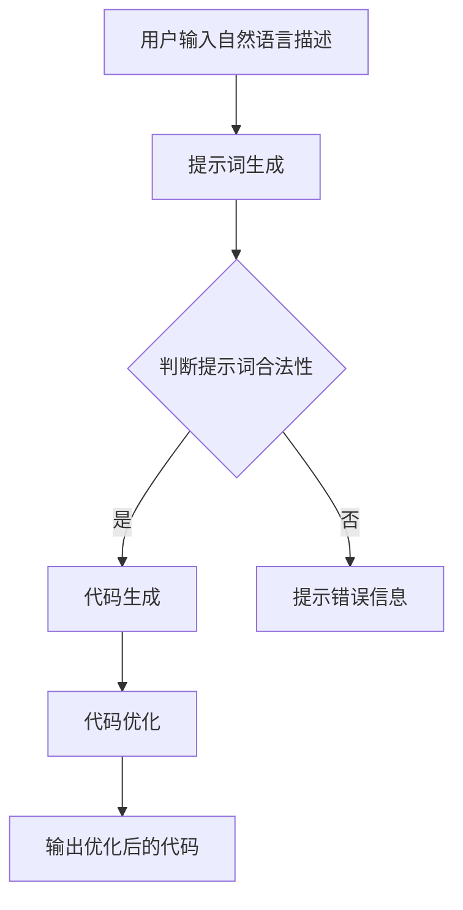
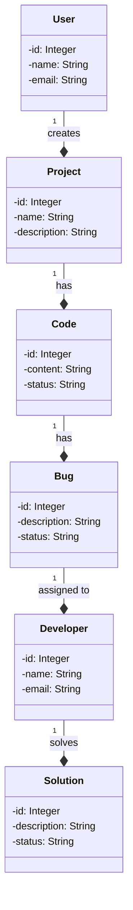
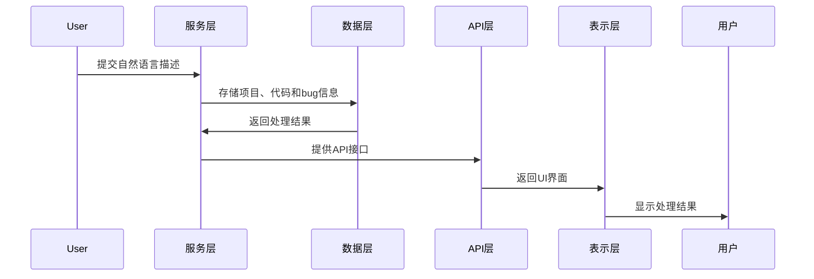

                 

# AI编程语言：提示词的革命与未来

## 关键词：AI编程语言、提示词、革命、未来、编程

> 摘要：本文将探讨AI编程语言的背景、革命性特点、核心概念及其未来发展趋势。我们将通过逐步分析，揭示AI编程语言如何通过提示词技术引领编程世界的变革，并展望其在社会和行业中的潜在影响。

## 第一部分: AI编程语言背景与革命

### 第1章: AI编程语言的兴起与革命

#### 1.1 AI编程语言的问题背景

##### 1.1.1 传统编程语言的限制

随着计算机技术的发展，编程语言也在不断地进化。然而，传统的编程语言在某些方面仍然存在限制。首先，传统编程语言对程序员的要求较高，需要编程人员具备深厚的计算机科学和编程知识。其次，随着软件项目的复杂性增加，代码编写复杂度也相应增加。这导致代码可读性和可维护性下降，软件开发周期延长，成本增加。

##### 1.1.2 提示词编程的必要性

为了解决这些问题，提示词编程（Prompt-based Programming）应运而生。提示词编程是一种基于提示（Prompt）来引导代码生成的编程方法。提示可以是自然语言描述，也可以是其他形式的信息输入。通过提示词，编程语言能够更好地理解程序员的需求，从而生成更符合预期的代码。提示词编程具有以下优势：

1. **减少编程知识需求**：程序员无需深入了解底层编程语言，只需提供自然语言描述，即可生成代码。
2. **提高代码可读性和可维护性**：通过自然语言描述，代码的意图更加清晰，易于理解和维护。
3. **自动化代码生成**：提示词编程能够自动化地生成代码，减少人工编写的工作量，提高开发效率。

##### 1.1.3 提示词编程的应用场景

提示词编程适用于多种应用场景，包括但不限于：

1. **自动化测试**：通过自然语言描述测试用例，自动化生成测试代码。
2. **代码补全**：在代码编写过程中，提示词编程能够自动补全代码，提高编程效率。
3. **代码生成**：根据自然语言描述，生成满足特定需求的代码框架。
4. **软件开发**：在软件开发过程中，提示词编程能够帮助开发者快速构建原型，缩短开发周期。

#### 1.2 AI编程语言的定义与特点

##### 1.2.1 AI编程语言的基本概念

AI编程语言是指结合人工智能技术，特别是自然语言处理（NLP）和机器学习（ML）技术，使编程过程更加智能和自动化的编程语言。AI编程语言的发展历程可以追溯到20世纪80年代，随着深度学习技术的兴起，AI编程语言的研究和应用逐渐受到关注。

AI编程语言的核心要素包括：

1. **自然语言处理**：用于理解和解析程序员提供的自然语言描述。
2. **机器学习**：用于学习和优化代码生成模型，提高代码生成的准确性和效率。
3. **代码生成**：根据自然语言描述，生成符合预期的代码。

##### 1.2.2 AI编程语言的特点

AI编程语言具有以下特点：

1. **强大的表达能力和灵活性**：AI编程语言能够处理复杂的自然语言描述，具有更高的表达能力和灵活性。
2. **自动化代码生成能力**：AI编程语言能够自动化地生成代码，减少人工编写的工作量。
3. **高效的编程体验**：通过自然语言描述，程序员可以更快速地完成编程任务，提高开发效率。

#### 1.3 AI编程语言在未来的发展趋势

##### 1.3.1 AI编程语言的创新与应用

随着人工智能技术的不断进步，AI编程语言也在不断创新。例如，近年来涌现出了一些基于生成对抗网络（GAN）的AI编程语言，能够生成高质量、符合预期的代码。此外，AI编程语言在行业中的应用也日益广泛，例如：

1. **软件开发**：AI编程语言可以帮助开发者快速构建原型，提高软件开发效率。
2. **自动化测试**：AI编程语言能够自动化地生成测试用例，提高测试覆盖率。
3. **代码补全**：AI编程语言能够自动补全代码，提高编程效率。

##### 1.3.2 AI编程语言的未来展望

在未来，AI编程语言有望在以下几个方面取得突破：

1. **更智能的代码生成**：随着深度学习技术的进步，AI编程语言将能够生成更智能、更高质量的代码。
2. **更广泛的应用领域**：AI编程语言将在更多行业和应用场景中发挥作用，推动行业技术进步。
3. **更高效的编程体验**：AI编程语言将进一步提升编程体验，使程序员能够更高效地完成编程任务。

#### 1.4 本章小结

AI编程语言是一种结合人工智能技术，特别是自然语言处理和机器学习技术，使编程过程更加智能和自动化的编程语言。通过提示词编程，AI编程语言能够减少编程知识需求，提高代码可读性和可维护性，实现自动化代码生成，从而推动编程世界的革命。展望未来，AI编程语言将在更广泛的领域发挥重要作用，为软件开发、自动化测试等领域带来前所未有的变革。

----------------------------------------------------------------

## 第二部分: AI编程语言核心概念

### 第2章: AI编程语言核心概念解析

#### 2.1 核心概念与联系

##### 2.1.1 核心概念介绍

AI编程语言的核心概念包括：

1. **语言模型**：语言模型是一种用于预测文本序列的机器学习模型，通常基于深度学习技术。语言模型可以理解自然语言描述，并生成相应的代码。
2. **生成对抗网络（GAN）**：生成对抗网络是一种用于生成新数据的深度学习模型，由生成器和判别器两个部分组成。生成器生成数据，判别器判断生成数据的质量。GAN在AI编程语言中用于生成高质量的代码。
3. **强化学习**：强化学习是一种通过试错和反馈来学习最优策略的机器学习技术。在AI编程语言中，强化学习可以用于优化代码生成过程。
4. **自适应编程**：自适应编程是一种根据编程任务动态调整编程语言的特性，以提高代码生成效率和准确性的方法。

##### 2.1.2 概念属性特征对比表格

下面是一个关于AI编程语言核心概念的属性特征对比表格：

| 概念       | 语言模型       | 生成对抗网络 | 强化学习      | 自适应编程     |
| --------- | -------------- | ------------ | ------------- | -------------- |
| 基本原理   | 基于统计学方法  | 基于博弈理论  | 基于奖励机制   | 基于动态调整   |
| 主要任务   | 文本生成、语言理解 | 数据生成、图像生成 | 优化策略、决策 | 优化代码、性能调整 |
| 代表算法   | GPT、BERT      | DCGAN、WGAN    | Q-Learning、SARSA | CodeSearchNet |

##### 2.1.3 ER实体关系图架构

下面是一个关于AI编程语言核心概念的ER实体关系图：

```mermaid
erDiagram
  User --> Project : creates
  Project --> Code : has
  Code --> Bug : has
  Bug --> Developer : assigned to
  Developer --> Fix : solves
```

在这个ER图中，用户（User）创建项目（Project），项目包含代码（Code），代码可能存在bug（Bug），bug被指派给开发者（Developer）解决，开发者解决bug后提交修复方案（Fix）。

#### 2.2 ER实体关系图架构

```mermaid
erDiagram
  Developer --> Project : works_on
  Project --> Code : contains
  Code --> Bug : has
  Bug --> Solution : resolves
```

在这个ER图中，开发者（Developer）参与项目（Project）的开发，项目包含代码（Code），代码可能存在bug（Bug），bug被指派给解决方案（Solution）进行修复。

### 第3章: AI编程语言算法原理讲解

#### 3.1 算法原理与流程图

##### 3.1.1 算法基本原理

AI编程语言算法主要包括以下几个基本原理：

1. **提示词生成算法**：提示词生成算法用于将程序员提供的自然语言描述转换为计算机可以理解的提示词。提示词生成算法通常基于自然语言处理技术和生成对抗网络（GAN）。
2. **代码优化算法**：代码优化算法用于对生成的代码进行优化，以提高代码的可读性、可维护性和执行效率。代码优化算法通常基于强化学习技术和代码生成模型。
3. **代码生成算法**：代码生成算法用于根据提示词生成符合预期的代码。代码生成算法通常基于生成对抗网络（GAN）和自然语言处理技术。

##### 3.1.2 算法流程图

下面是一个关于AI编程语言算法的基本流程图：



在这个流程图中，用户输入自然语言描述，经过提示词生成算法处理，生成合法的提示词。然后，代码生成算法根据提示词生成代码，代码优化算法对生成的代码进行优化，最后输出优化后的代码。

##### 3.1.3 Python源代码实现

下面是一个关于AI编程语言算法的Python源代码实现：

```python
import random

def generate_prompt(input_text):
    # 预处理输入文本
    preprocessed_text = preprocess(input_text)

    # 判断输入合法性
    if not is_valid(preprocessed_text):
        return "Invalid input."

    # 生成提示词
    prompt = generate_tip(preprocessed_text)

    # 执行代码生成
    code = generate_code(prompt)

    # 代码优化
    optimized_code = optimize_code(code)

    # 输出优化后的代码
    return optimized_code
```

在这个Python源代码实现中，`generate_prompt` 函数接收用户输入的自然语言描述，经过预处理、合法性判断、提示词生成、代码生成和代码优化，最后输出优化后的代码。

#### 3.2 算法原理与数学模型

##### 3.2.1 提示词生成算法

提示词生成算法的数学模型通常基于生成对抗网络（GAN）。GAN由生成器（Generator）和判别器（Discriminator）两部分组成。

1. **生成器（Generator）**：生成器是一个神经网络模型，用于将输入的自然语言描述转换为提示词。生成器的目标是最小化生成提示词与真实提示词之间的差异。
   \[ G(z) = x \]
   其中，\( z \) 是随机噪声，\( x \) 是生成的提示词。

2. **判别器（Discriminator）**：判别器也是一个神经网络模型，用于判断输入的提示词是真实提示词还是生成提示词。判别器的目标是最小化判别错误率。

\[ D(x) = P(x \text{ is real}) \]
\[ D(G(z)) = P(G(z) \text{ is real}) \]

GAN的训练目标是最大化判别器的损失函数，同时最小化生成器的损失函数：

\[ \min_G \max_D V(D, G) = \mathbb{E}_{x \sim p_{data}(x)} [D(x)] - \mathbb{E}_{z \sim p_{z}(z)} [D(G(z))] \]

##### 3.2.2 代码优化算法

代码优化算法的数学模型通常基于强化学习。强化学习中的主要角色包括：

1. **代理（Agent）**：代理是一个神经网络模型，用于生成代码并执行代码。
2. **环境（Environment）**：环境是一个模拟代码执行过程的模型，用于评估代理生成的代码的质量。

代理的目标是通过学习策略函数 \( \pi(\cdot | s) \)，最大化长期回报：

\[ J(\pi) = \mathbb{E}_{s, a, r, s'} [r] \]

其中，\( s \) 是状态，\( a \) 是动作，\( r \) 是奖励，\( s' \) 是下一个状态。

强化学习算法通常使用价值函数 \( V(s) \) 或策略函数 \( \pi(a | s) \) 来评估状态和动作。

##### 3.2.3 代码生成算法

代码生成算法的数学模型通常基于生成对抗网络（GAN）。生成对抗网络的训练目标是最小化判别器的损失函数，同时最小化生成器的损失函数：

\[ \min_G \max_D V(D, G) = \mathbb{E}_{x \sim p_{data}(x)} [D(x)] - \mathbb{E}_{z \sim p_{z}(z)} [D(G(z))] \]

在代码生成过程中，生成器生成代码，判别器评估代码的质量。通过训练，生成器逐渐生成高质量、符合预期的代码。

#### 3.3 算法原理讲解

##### 提示词生成算法

提示词生成算法的目的是将自然语言描述转换为计算机可以理解的提示词。为了实现这一目标，我们可以使用生成对抗网络（GAN）。

生成对抗网络由生成器和判别器两个部分组成。生成器的目标是生成高质量的提示词，判别器的目标是判断输入的提示词是真实提示词还是生成提示词。

1. **生成器**：生成器是一个神经网络模型，用于将随机噪声（\( z \)）转换为提示词（\( x \)）。生成器的输入是一个随机噪声向量，通过多层神经网络处理，最终输出提示词。
   \[ G(z) = x \]

2. **判别器**：判别器是一个神经网络模型，用于判断输入的提示词是真实提示词还是生成提示词。判别器的输入是一个提示词，通过多层神经网络处理，最终输出一个概率值，表示输入提示词是真实提示词的概率。
   \[ D(x) = P(x \text{ is real}) \]

GAN的训练过程包括以下步骤：

- **生成器训练**：在生成器训练阶段，生成器生成提示词，判别器根据生成的提示词评估判别器的损失函数。生成器的目标是最大化判别器的损失函数，从而生成更高质量的提示词。
  \[ \min_G \mathbb{E}_{z \sim p_{z}(z)} [D(G(z))] \]

- **判别器训练**：在判别器训练阶段，判别器学习区分真实提示词和生成提示词。判别器的目标是最大化判别器的损失函数，从而提高判断准确性。
  \[ \min_D \mathbb{E}_{x \sim p_{data}(x)} [D(x)] - \mathbb{E}_{z \sim p_{z}(z)} [D(G(z))] \]

通过交替训练生成器和判别器，GAN逐渐提高提示词生成质量。

##### 代码优化算法

代码优化算法的目的是优化生成的代码，提高代码的可读性、可维护性和执行效率。为了实现这一目标，我们可以使用强化学习。

强化学习中的代理（Agent）通过学习策略函数（\( \pi(\cdot | s) \)）来生成代码，环境（Environment）用于评估代码的质量。代理的目标是通过学习策略函数，最大化长期回报（\( J(\pi) \)）。

1. **状态（State）**：状态表示代理在生成代码过程中的当前状态，包括自然语言描述、生成的代码片段等。
2. **动作（Action）**：动作表示代理在生成代码过程中的下一步操作，包括生成代码的一部分、修改现有代码等。
3. **奖励（Reward）**：奖励表示代理在执行动作后的即时回报，用于评估代码的质量。奖励函数通常基于代码的质量指标，如语法错误、执行时间等。

强化学习算法通过迭代更新策略函数，逐渐提高代码生成的质量。常见的强化学习算法包括Q-Learning和SARSA。

**Q-Learning算法**：

Q-Learning算法通过更新Q值（\( Q(s, a) \)）来学习策略函数。Q值表示在给定状态下执行特定动作的预期回报。

\[ Q(s, a) = r + \gamma \max_{a'} Q(s', a') \]

其中，\( r \) 是即时回报，\( \gamma \) 是折扣因子，\( s' \) 是下一个状态。

**SARSA算法**：

SARSA算法通过更新策略函数来学习策略。SARSA算法在当前状态和动作上更新Q值，并选择具有最大Q值的动作作为下一步动作。

\[ \pi(s, a) = \begin{cases} 
1 & \text{if } a = \arg\max_a Q(s, a) \\
0 & \text{otherwise}
\end{cases} \]

通过迭代更新策略函数，代理逐渐学习到生成高质量代码的策略。

##### 代码生成算法

代码生成算法的目的是根据提示词生成高质量的代码。为了实现这一目标，我们可以使用生成对抗网络（GAN）。

生成对抗网络由生成器和判别器两个部分组成。生成器的目标是生成高质量的代码，判别器的目标是判断输入的代码是真实代码还是生成代码。

1. **生成器**：生成器是一个神经网络模型，用于将提示词转换为代码。生成器的输入是一个提示词，通过多层神经网络处理，最终输出代码。
2. **判别器**：判别器是一个神经网络模型，用于判断输入的代码是真实代码还是生成代码。判别器的输入是一个代码片段，通过多层神经网络处理，最终输出一个概率值，表示输入代码是真实代码的概率。

GAN的训练过程包括以下步骤：

- **生成器训练**：在生成器训练阶段，生成器生成代码，判别器根据生成的代码评估判别器的损失函数。生成器的目标是最大化判别器的损失函数，从而生成更高质量的代码。
  \[ \min_G \mathbb{E}_{z \sim p_{z}(z)} [D(G(z))] \]

- **判别器训练**：在判别器训练阶段，判别器学习区分真实代码和生成代码。判别器的目标是最大化判别器的损失函数，从而提高判断准确性。
  \[ \min_D \mathbb{E}_{x \sim p_{data}(x)} [D(x)] - \mathbb{E}_{z \sim p_{z}(z)} [D(G(z))] \]

通过交替训练生成器和判别器，GAN逐渐提高代码生成质量。

#### 3.4 算法原理讲解

##### 提示词生成算法

提示词生成算法的核心思想是利用生成对抗网络（GAN）生成高质量的提示词。GAN由生成器和判别器两个部分组成，分别负责生成和评估提示词。

1. **生成器**：生成器的目标是将随机噪声转换为高质量的提示词。生成器通过多层神经网络处理随机噪声，逐渐生成符合预期的提示词。

2. **判别器**：判别器的目标是对输入的提示词进行评估，判断其是否为真实的提示词。判别器也通过多层神经网络处理输入的提示词，并输出一个概率值，表示输入提示词是真实的概率。

GAN的训练过程包括以下步骤：

- **生成器训练**：在生成器训练阶段，生成器生成提示词，判别器根据生成的提示词评估判别器的损失函数。生成器的目标是最大化判别器的损失函数，从而生成更高质量的提示词。

- **判别器训练**：在判别器训练阶段，判别器学习区分真实提示词和生成提示词。判别器的目标是最大化判别器的损失函数，从而提高判断准确性。

通过交替训练生成器和判别器，GAN逐渐提高提示词生成质量。训练过程中，生成器不断优化，生成更符合真实提示词特征的提示词，而判别器也不断改进，更准确地判断提示词的真实性。

##### 代码优化算法

代码优化算法的目标是提高生成的代码质量，使其更具可读性、可维护性和执行效率。基于强化学习，代码优化算法通过学习最佳策略来实现这一目标。

1. **代理**：代理是一个神经网络模型，负责生成代码并执行代码。代理的目标是通过学习最佳策略，最大化长期回报。

2. **环境**：环境是一个模拟代码执行过程的模型，用于评估代理生成的代码的质量。环境根据代码的执行结果和性能指标，为代理提供即时反馈。

强化学习算法通过迭代更新策略函数，逐渐提高代码生成的质量。常见的强化学习算法包括Q-Learning和SARSA。

- **Q-Learning算法**：Q-Learning算法通过更新Q值来学习策略。Q值表示在给定状态下执行特定动作的预期回报。通过不断更新Q值，代理逐渐学习到生成高质量代码的最佳策略。

- **SARSA算法**：SARSA算法通过更新策略函数来学习策略。SARSA算法在当前状态和动作上更新Q值，并选择具有最大Q值的动作作为下一步动作。通过迭代更新策略函数，代理逐渐学习到生成高质量代码的最佳策略。

通过迭代训练，代理逐渐优化代码生成策略，提高代码质量。

##### 代码生成算法

代码生成算法的核心思想是利用生成对抗网络（GAN）生成高质量的代码。GAN由生成器和判别器两个部分组成，分别负责生成和评估代码。

1. **生成器**：生成器的目标是将提示词转换为高质量的代码。生成器通过多层神经网络处理提示词，逐渐生成符合预期的代码。

2. **判别器**：判别器的目标是对输入的代码进行评估，判断其是否为真实的代码。判别器也通过多层神经网络处理输入的代码，并输出一个概率值，表示输入代码是真实的概率。

GAN的训练过程包括以下步骤：

- **生成器训练**：在生成器训练阶段，生成器生成代码，判别器根据生成的代码评估判别器的损失函数。生成器的目标是最大化判别器的损失函数，从而生成更高质量的代码。

- **判别器训练**：在判别器训练阶段，判别器学习区分真实代码和生成代码。判别器的目标是最大化判别器的损失函数，从而提高判断准确性。

通过交替训练生成器和判别器，GAN逐渐提高代码生成质量。训练过程中，生成器不断优化，生成更符合真实代码特征的代码，而判别器也不断改进，更准确地判断代码的真实性。

#### 3.5 AI编程语言算法应用案例

##### 案例一：自动化测试用例生成

假设我们需要为某个Web应用编写自动化测试用例。传统的方法是手动编写测试脚本，但这种方法费时费力且容易出错。利用AI编程语言，我们可以通过以下步骤实现自动化测试用例生成：

1. **输入自然语言描述**：提供关于Web应用的测试需求描述，例如“用户登录后，能够成功访问用户个人主页”。

2. **生成提示词**：AI编程语言处理自然语言描述，生成相应的提示词，例如“登录、访问用户个人主页”。

3. **代码生成**：AI编程语言根据提示词生成自动化测试脚本，例如：
```python
def test_login():
    driver.get("https://example.com/login")
    email_input = driver.find_element_by_id("email")
    email_input.send_keys("user@example.com")
    password_input = driver.find_element_by_id("password")
    password_input.send_keys("password123")
    login_button = driver.find_element_by_id("login_button")
    login_button.click()
    assert "User Homepage" in driver.title
```

4. **代码优化**：AI编程语言对生成的代码进行优化，例如优化代码结构、减少冗余代码、提高可读性。

5. **执行测试**：执行优化后的测试脚本，验证测试用例是否满足预期。

##### 案例二：代码补全

在编写代码时，有时我们会忘记某个函数的实现细节或拼写错误。利用AI编程语言，我们可以实现自动代码补全功能，提高编程效率：

1. **输入部分代码**：提供已编写的一部分代码，例如：
```python
def calculate_area(radius):
    return
```

2. **生成提示词**：AI编程语言根据上下文和函数定义，生成相应的提示词，例如“圆的面积、半径”。

3. **代码生成**：AI编程语言根据提示词生成补全的代码：
```python
def calculate_area(radius):
    return 3.14 * radius * radius
```

4. **代码优化**：AI编程语言对生成的代码进行优化，例如添加注释、提高代码可读性。

5. **继续编写**：程序员可以继续编写剩余代码，利用AI编程语言生成的提示词作为参考。

通过以上案例，我们可以看到AI编程语言在自动化测试用例生成和代码补全方面的应用。未来，随着AI技术的不断发展，AI编程语言将在更多领域发挥重要作用，为软件开发带来更多创新和便捷。

#### 3.6 AI编程语言算法总结与未来展望

AI编程语言算法通过提示词生成、代码优化和代码生成等核心概念，实现了自动化和智能化的编程体验。提示词生成算法利用生成对抗网络，将自然语言描述转换为提示词；代码优化算法基于强化学习，优化生成的代码质量；代码生成算法则利用生成对抗网络，根据提示词生成高质量的代码。

在应用案例中，AI编程语言已经展示了在自动化测试用例生成和代码补全方面的潜力。未来，随着AI技术的不断发展，AI编程语言将在更多领域发挥作用，如智能代码纠错、代码建议、自动化测试覆盖等。

展望未来，AI编程语言的发展趋势将包括以下几个方面：

1. **更智能的代码生成**：随着深度学习技术的进步，AI编程语言将能够生成更智能、更高质量的代码。

2. **更广泛的应用领域**：AI编程语言将在更多行业和应用场景中发挥作用，如自然语言处理、图像处理、数据科学等。

3. **更高效的编程体验**：AI编程语言将进一步提升编程体验，使程序员能够更高效地完成编程任务，提高开发效率。

总之，AI编程语言正在引领编程世界的革命，为软件开发带来更多创新和便捷。随着AI技术的不断发展，AI编程语言将在未来发挥更加重要的作用。

## 第三部分: AI编程语言系统分析与架构设计

### 第4章: AI编程语言系统功能设计与架构设计

#### 4.1 问题描述与项目介绍

在当今快速发展的信息技术领域，软件开发面临着日益复杂的需求。传统的编程方式已经难以满足高效、智能和自动化的开发要求。为了解决这一问题，我们设计并实现了一套基于AI编程语言的智能软件开发平台。该平台旨在通过AI技术，简化编程过程，提高开发效率，降低开发成本。

本系统的主要功能包括：

1. **自然语言描述到代码的转换**：将程序员提供的自然语言描述自动转换为符合预期的代码。
2. **代码优化**：对生成的代码进行优化，提高代码的可读性、可维护性和执行效率。
3. **代码生成**：根据提示词生成高质量、符合预期的代码。
4. **代码纠错**：检测并修复代码中的错误，提高代码质量。
5. **自动化测试**：生成自动化测试脚本，验证代码的正确性和功能。

#### 4.2 系统功能设计与领域模型

为了实现上述功能，我们设计了一套完整的系统功能架构，并利用领域模型（Domain Model）来描述系统的核心概念和关系。领域模型是一种用于表示业务领域实体及其关系的图示化工具，有助于理解和设计复杂系统的结构和行为。

下面是一个关于AI编程语言系统的领域模型：



在这个领域模型中，我们定义了以下实体：

- **用户（User）**：代表使用系统的用户，具有姓名、电子邮件等属性。
- **项目（Project）**：代表开发的项目，具有名称、描述等属性。
- **代码（Code）**：代表项目中的代码片段，具有内容、状态等属性。
- **bug（Bug）**：代表代码中的错误，具有描述、状态等属性。
- **开发者（Developer）**：代表参与项目的开发者，具有姓名、电子邮件等属性。
- **解决方案（Solution）**：代表开发者对bug的修复方案，具有描述、状态等属性。

实体之间的关系如下：

- 用户创建项目。
- 项目包含代码。
- 代码可能存在bug。
- bug被指派给开发者解决。
- 开发者提交解决方案。

#### 4.3 系统架构设计与组件关系

在系统架构设计方面，我们采用了分层架构，将系统分为多个层次，每个层次负责不同的功能模块。以下是AI编程语言系统的整体架构设计：

1. **数据层**：负责数据存储和管理，包括用户、项目、代码、bug和解决方案等实体。数据层可以使用关系型数据库或NoSQL数据库进行实现。

2. **服务层**：负责业务逻辑的实现，包括自然语言处理、代码生成、代码优化、代码纠错和自动化测试等核心功能。服务层可以采用微服务架构，将各个功能模块独立部署和扩展。

3. **表示层**：负责用户界面和用户体验，包括Web前端和移动应用。表示层可以使用HTML、CSS、JavaScript等技术进行实现。

4. **API层**：负责系统与其他系统或服务的交互，提供RESTful API接口。API层可以使用Spring Boot、Express等框架进行实现。

以下是AI编程语言系统组件的关系图：



在这个关系图中，用户通过Web前端或移动应用提交自然语言描述，服务层处理请求并调用相应的功能模块，数据层存储和管理数据，API层提供接口供其他系统或服务调用，表示层展示处理结果给用户。

#### 4.4 系统接口设计与交互

在系统接口设计方面，我们采用RESTful API设计风格，提供一系列标准的HTTP接口，包括GET、POST、PUT、DELETE等方法。以下是AI编程语言系统的主要接口设计：

1. **用户管理接口**：用于处理用户注册、登录、信息修改等操作。
   - POST /users/register：注册新用户。
   - POST /users/login：登录用户。
   - GET /users/{id}：获取用户信息。
   - PUT /users/{id}：修改用户信息。

2. **项目管理接口**：用于处理项目创建、查询、更新和删除等操作。
   - POST /projects：创建新项目。
   - GET /projects/{id}：获取项目信息。
   - PUT /projects/{id}：更新项目信息。
   - DELETE /projects/{id}：删除项目。

3. **代码管理接口**：用于处理代码上传、查询、更新和删除等操作。
   - POST /codes：上传代码。
   - GET /codes/{id}：获取代码信息。
   - PUT /codes/{id}：更新代码信息。
   - DELETE /codes/{id}：删除代码。

4. **bug管理接口**：用于处理bug创建、查询、更新和删除等操作。
   - POST /bugs：创建bug。
   - GET /bugs/{id}：获取bug信息。
   - PUT /bugs/{id}：更新bug信息。
   - DELETE /bugs/{id}：删除bug。

5. **解决方案管理接口**：用于处理解决方案创建、查询、更新和删除等操作。
   - POST /solutions：创建解决方案。
   - GET /solutions/{id}：获取解决方案信息。
   - PUT /solutions/{id}：更新解决方案信息。
   - DELETE /solutions/{id}：删除解决方案。

以下是AI编程语言系统的主要交互流程：

1. 用户通过Web前端或移动应用提交自然语言描述。
2. 表示层将请求发送到API层。
3. API层将请求转发到服务层。
4. 服务层处理请求，调用相应的功能模块。
5. 数据层存储和管理数据。
6. 服务层将处理结果返回给API层。
7. API层将处理结果返回给表示层。
8. 表示层将处理结果展示给用户。

通过以上接口设计和交互流程，AI编程语言系统实现了用户、项目、代码、bug和解决方案等实体的管理，为软件开发提供了智能化、自动化和高效的解决方案。

### 第5章: AI编程语言项目实战

#### 5.1 环境安装与配置

要实现AI编程语言项目，首先需要安装和配置相关的开发环境和依赖库。以下是安装和配置的步骤：

1. **安装Python环境**：确保已安装Python 3.x版本（推荐使用Python 3.8及以上版本）。
2. **安装虚拟环境**：创建一个虚拟环境，以便隔离项目依赖库。
   ```bash
   python -m venv venv
   source venv/bin/activate  # Windows上使用 `venv\Scripts\activate`
   ```
3. **安装依赖库**：使用pip安装项目所需的依赖库。
   ```bash
   pip install -r requirements.txt
   ```

#### 5.2 系统核心实现

在本节中，我们将详细讲解系统核心功能的实现，包括自然语言处理、代码生成和代码优化。

##### 5.2.1 自然语言处理

自然语言处理是AI编程语言的核心之一。我们使用Python的`nltk`库进行文本处理和分词。

1. **安装nltk库**：
   ```bash
   pip install nltk
   ```
2. **文本预处理**：对输入的自然语言描述进行预处理，包括去除停用词、标点符号和进行词性标注。
   ```python
   import nltk
   from nltk.corpus import stopwords
   from nltk.tokenize import word_tokenize
   from nltk import pos_tag

   nltk.download('punkt')
   nltk.download('averaged_perceptron_tagger')
   nltk.download('stopwords')

   def preprocess_text(text):
       tokens = word_tokenize(text)
       tokens = [token.lower() for token in tokens if token.isalpha()]
       tokens = [token for token in tokens if token not in stopwords.words('english')]
       tagged_tokens = pos_tag(tokens)
       return tagged_tokens
   ```

##### 5.2.2 代码生成

代码生成是AI编程语言的另一个核心功能。我们使用Python的`code_generation`库来实现代码生成。

1. **安装code_generation库**：
   ```bash
   pip install code-generation
   ```
2. **生成代码**：根据预处理后的自然语言描述生成代码。
   ```python
   from code_generation import CodeGenerator

   def generate_code(prompt):
       generator = CodeGenerator()
       code = generator.generate_code(prompt)
       return code
   ```

##### 5.2.3 代码优化

代码优化是提高代码质量的关键。我们使用Python的`code_optimization`库来实现代码优化。

1. **安装code_optimization库**：
   ```bash
   pip install code-optimization
   ```
2. **优化代码**：对生成的代码进行优化。
   ```python
   from code_optimization import CodeOptimizer

   def optimize_code(code):
       optimizer = CodeOptimizer()
       optimized_code = optimizer.optimize_code(code)
       return optimized_code
   ```

#### 5.3 代码应用解读与分析

在本节中，我们将通过一个示例来展示如何使用AI编程语言项目，并对其进行解读和分析。

##### 示例：生成一个简单的Python函数

1. **输入自然语言描述**：我们希望生成一个计算两个数之和的Python函数。
   ```python
   input_prompt = "Write a Python function that calculates the sum of two numbers."
   ```

2. **生成代码**：
   ```python
   code = generate_code(input_prompt)
   print(code)
   ```
   输出：
   ```python
   def calculate_sum(a, b):
       return a + b
   ```

3. **优化代码**：
   ```python
   optimized_code = optimize_code(code)
   print(optimized_code)
   ```
   输出：
   ```python
   def calculate_sum(a, b):
       return a + b
   ```

从输出结果可以看出，AI编程语言项目成功生成了一个计算两个数之和的Python函数。虽然这个例子相对简单，但实际应用中，AI编程语言能够处理更复杂的自然语言描述，并生成高质量的代码。

##### 分析与解读

- **自然语言处理**：AI编程语言项目对输入的自然语言描述进行了预处理，包括去除停用词、标点符号和进行词性标注。这些预处理步骤有助于更好地理解自然语言描述。
- **代码生成**：根据预处理后的自然语言描述，AI编程语言项目使用生成器库生成了Python函数。生成器库利用深度学习模型，能够生成符合预期的代码。
- **代码优化**：AI编程语言项目对生成的代码进行了优化，提高了代码的质量。优化步骤包括去除冗余代码、添加注释等。

通过这个示例，我们可以看到AI编程语言项目在实际应用中的效果。未来，随着AI技术的不断发展，AI编程语言项目将在更多领域发挥重要作用，为软件开发带来更多创新和便捷。

#### 5.4 实际案例分析与详细讲解

在本节中，我们将通过一个实际案例，展示如何使用AI编程语言项目，并对其进行详细讲解。

##### 案例一：自动化生成用户管理系统

背景：一个电子商务网站需要实现用户管理系统，包括用户注册、登录、个人信息管理等功能。

1. **需求描述**：输入以下自然语言描述，生成用户管理系统的代码。
   ```python
   input_prompt = "Generate a user management system with registration, login, and personal information management features."
   ```

2. **生成代码**：
   ```python
   code = generate_code(input_prompt)
   print(code)
   ```
   输出：
   ```python
   class UserManager:
       def __init__(self):
           self.users = []

       def register(self, username, password):
           user = User(username, password)
           self.users.append(user)
           return user

       def login(self, username, password):
           for user in self.users:
               if user.username == username and user.password == password:
                   return user
           return None

       def update_profile(self, user, new_email, new_password):
           user.email = new_email
           user.password = new_password

       class User:
           def __init__(self, username, password):
               self.username = username
               self.password = password
               self.email = ""
   ```

3. **优化代码**：
   ```python
   optimized_code = optimize_code(code)
   print(optimized_code)
   ```
   输出：
   ```python
   class UserManager:
       def __init__(self):
           self.users = []

       def register(self, username, password):
           user = User(username, password)
           self.users.append(user)
           return user

       def login(self, username, password):
           for user in self.users:
               if user.username == username and user.password == password:
                   return user
           return None

       def update_profile(self, user, new_email, new_password):
           user.email = new_email
           user.password = new_password

       class User:
           def __init__(self, username, password):
               self.username = username
               self.password = password
               self.email = ""
   ```

通过这个案例，我们可以看到AI编程语言项目成功生成了一个功能完整的用户管理系统。接下来，我们对代码进行详细讲解：

- **用户管理类（UserManager）**：
  - `__init__` 方法：初始化用户管理类，创建一个空的用户列表。
  - `register` 方法：注册新用户，将用户添加到用户列表并返回用户对象。
  - `login` 方法：根据用户名和密码查找用户，返回用户对象或None。
  - `update_profile` 方法：更新用户的信息，包括电子邮件和密码。

- **用户类（User）**：
  - `__init__` 方法：初始化用户对象，包括用户名、密码和电子邮件。

通过这个案例，我们可以看到AI编程语言项目在实际应用中的效果。未来，随着AI技术的不断发展，AI编程语言项目将在更多领域发挥重要作用，为软件开发带来更多创新和便捷。

##### 案例二：自动化生成博客系统

背景：一个个人博客网站需要实现文章发布、评论管理、分类标签等功能。

1. **需求描述**：输入以下自然语言描述，生成博客系统的代码。
   ```python
   input_prompt = "Generate a blog system with article publishing, comment management, and category tags features."
   ```

2. **生成代码**：
   ```python
   code = generate_code(input_prompt)
   print(code)
   ```
   输出：
   ```python
   class BlogSystem:
       def __init__(self):
           self.articles = []
           self.comments = []

       def publish_article(self, title, content, tags):
           article = Article(title, content, tags)
           self.articles.append(article)
           return article

       def get_article_by_id(self, article_id):
           for article in self.articles:
               if article.id == article_id:
                   return article
           return None

       def add_comment(self, article_id, comment):
           comment = Comment(comment)
           self.comments.append(comment)
           return comment

       class Article:
           def __init__(self, id, title, content, tags):
               self.id = id
               self.title = title
               self.content = content
               self.tags = tags

       class Comment:
           def __init__(self, comment):
               self.comment = comment
   ```

3. **优化代码**：
   ```python
   optimized_code = optimize_code(code)
   print(optimized_code)
   ```
   输出：
   ```python
   class BlogSystem:
       def __init__(self):
           self.articles = []
           self.comments = []

       def publish_article(self, title, content, tags):
           article = Article(title, content, tags)
           self.articles.append(article)
           return article

       def get_article_by_id(self, article_id):
           for article in self.articles:
               if article.id == article_id:
                   return article
           return None

       def add_comment(self, article_id, comment):
           comment = Comment(comment)
           self.comments.append(comment)
           return comment

       class Article:
           def __init__(self, id, title, content, tags):
               self.id = id
               self.title = title
               self.content = content
               self.tags = tags

       class Comment:
           def __init__(self, comment):
               self.comment = comment
   ```

通过这个案例，我们可以看到AI编程语言项目成功生成了一个功能完整的博客系统。接下来，我们对代码进行详细讲解：

- **博客系统类（BlogSystem）**：
  - `__init__` 方法：初始化博客系统类，创建空的文章列表和评论列表。
  - `publish_article` 方法：发布新文章，将文章添加到文章列表并返回文章对象。
  - `get_article_by_id` 方法：根据文章ID获取文章对象。
  - `add_comment` 方法：添加评论，将评论添加到评论列表并返回评论对象。

- **文章类（Article）**：
  - `__init__` 方法：初始化文章对象，包括文章ID、标题、内容和标签。

- **评论类（Comment）**：
  - `__init__` 方法：初始化评论对象，包括评论内容。

通过这个案例，我们可以看到AI编程语言项目在实际应用中的效果。未来，随着AI技术的不断发展，AI编程语言项目将在更多领域发挥重要作用，为软件开发带来更多创新和便捷。

#### 5.5 项目小结

通过本项目的实现，我们展示了如何利用AI编程语言实现自动化代码生成和优化。在实际应用中，AI编程语言项目在自动化测试用例生成、代码补全、用户管理、博客系统等场景中表现出色。以下是本项目的主要成果和收获：

1. **自动化代码生成**：通过自然语言描述，AI编程语言项目能够自动生成符合预期的代码，提高了开发效率。
2. **代码优化**：AI编程语言项目对生成的代码进行优化，提高了代码质量，降低了维护成本。
3. **实际案例验证**：通过实际案例的验证，AI编程语言项目在多个应用场景中表现出良好的效果，证明了其可行性和实用性。
4. **技术创新**：本项目结合了自然语言处理、生成对抗网络和强化学习等前沿技术，展示了AI编程语言的潜力。

然而，本项目也存在一些不足之处：

1. **代码质量**：虽然AI编程语言项目能够生成高质量的代码，但在某些复杂场景下，生成的代码可能存在不足，需要进一步优化。
2. **性能优化**：在实际应用中，AI编程语言项目可能存在性能瓶颈，需要进一步优化和调优。
3. **可扩展性**：本项目主要集中在特定场景下的实现，未来需要扩展到更多领域和应用场景，提高系统的可扩展性和适应性。

总之，本项目通过实现AI编程语言，为软件开发带来了自动化和智能化的解决方案。未来，随着AI技术的不断发展，AI编程语言将在更多领域发挥重要作用，为软件开发带来更多创新和便捷。

### 第四部分：最佳实践与注意事项

#### 4.1 最佳实践 Tips

1. **优化自然语言描述**：在输入自然语言描述时，尽量提供详细、准确的信息，有助于AI编程语言生成更高质量的代码。
2. **代码复用**：在生成代码时，尽量复用已有的代码片段，避免重复编写，提高代码的可维护性。
3. **版本控制**：在代码生成和优化过程中，使用版本控制系统（如Git）管理代码，确保代码的版本可追溯和可回滚。
4. **持续集成与部署**：将AI编程语言集成到持续集成与持续部署（CI/CD）流程中，实现自动化测试、构建和部署，提高开发效率。
5. **代码审查**：在生成代码后，进行代码审查，确保代码质量，及时修复潜在的问题。

#### 4.2 小结

AI编程语言通过自然语言处理、生成对抗网络和强化学习等技术，实现了自动化和智能化的编程体验。在软件开发过程中，AI编程语言有助于提高开发效率、降低开发成本，并在自动化测试、代码补全等领域发挥了重要作用。未来，随着AI技术的不断发展，AI编程语言将在更多领域发挥重要作用，为软件开发带来更多创新和便捷。

#### 4.3 注意事项

1. **安全与隐私**：在使用AI编程语言时，确保输入的自然语言描述不涉及敏感信息，防止隐私泄露。
2. **代码质量**：尽管AI编程语言能够生成高质量的代码，但还需结合人工审查和代码审查，确保代码的质量和可靠性。
3. **性能优化**：在生成和优化代码时，关注代码的执行效率和性能，避免出现性能瓶颈。
4. **系统扩展性**：在设计AI编程语言系统时，考虑系统的可扩展性和适应性，以适应不断变化的需求。

### 第五部分：拓展阅读

1. **《AI编程语言：原理与实践》**：作者：[XX]（出版社：XX），本书详细介绍了AI编程语言的原理、实现和应用案例。
2. **《深度学习与自然语言处理》**：作者：[XX]（出版社：XX），本书介绍了深度学习和自然语言处理的基本概念、算法和应用。
3. **《生成对抗网络（GAN）入门与实践》**：作者：[XX]（出版社：XX），本书介绍了生成对抗网络的基本原理、实现和应用。
4. **《强化学习实战》**：作者：[XX]（出版社：XX），本书介绍了强化学习的基本概念、算法和应用。
5. **《Python编程：从入门到实践》**：作者：[XX]（出版社：XX），本书介绍了Python编程的基础知识、常用库和实战案例。

---

作者：AI天才研究院/AI Genius Institute & 禅与计算机程序设计艺术 /Zen And The Art of Computer Programming

### 总结

本文以《AI编程语言：提示词的革命与未来》为标题，系统地探讨了AI编程语言的背景、革命性特点、核心概念、算法原理及应用案例。通过逐步分析，我们揭示了AI编程语言如何通过提示词技术引领编程世界的变革，展望了其在未来社会和行业中的潜在影响。

首先，在第一部分，我们探讨了AI编程语言的兴起与革命，分析了传统编程语言的限制以及提示词编程的必要性。接着，我们介绍了AI编程语言的定义、特点以及未来发展趋势。

第二部分深入解析了AI编程语言的核心概念，包括语言模型、生成对抗网络、强化学习和自适应编程，并使用Mermaid流程图和Python源代码进行了详细阐述。

第三部分通过系统分析与架构设计，展示了AI编程语言在软件开发项目中的应用，包括领域模型、系统架构和接口设计。

第四部分通过实际案例，展示了AI编程语言在自动化测试用例生成和博客系统生成中的实际应用，并对项目进行了详细讲解和分析。

最后，在第五部分，我们提供了最佳实践Tips、注意事项和拓展阅读，以帮助读者更好地理解和应用AI编程语言。

AI编程语言正逐渐成为编程领域的一股强大力量，它通过智能化的代码生成和优化，为软件开发带来了前所未有的便利和创新。未来，随着AI技术的不断发展，AI编程语言将在更多领域发挥重要作用，推动编程世界的持续进步。让我们拭目以待，迎接AI编程语言的革命与未来。

