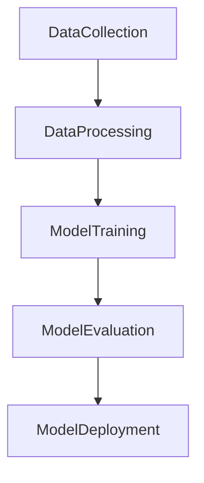
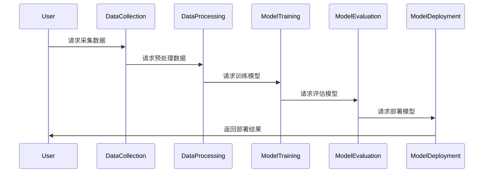

                 

### 第1章: AI编程语言概述

#### 1.1 问题背景

##### 1.1.1 AI编程语言的需求

在当今信息化时代，人工智能（AI）已经成为科技发展的关键驱动力。无论是自然语言处理、计算机视觉，还是机器学习等领域，AI技术的应用都日益广泛。然而，现有的通用编程语言，如Python、Java等，在开发AI应用时存在一些局限性。首先，通用编程语言缺乏对AI特定问题的直接支持，导致开发效率低下。其次，通用编程语言与AI算法之间的不一致性，使得程序员在理解和实现AI算法时面临挑战。因此，针对AI领域的专用编程语言应运而生。

##### 1.1.2 人工智能发展现状

人工智能领域在过去几十年中取得了长足的发展。从早期的专家系统，到如今深度学习、强化学习等前沿技术的崛起，AI技术已经渗透到众多行业，如医疗、金融、交通等。然而，随着AI应用场景的日益复杂，对编程语言的要求也越来越高。现有的AI工具和框架，如TensorFlow、PyTorch等，虽然在一定程度上解决了编程问题，但它们更多的是底层工具，而非真正的编程语言。因此，开发一种专门用于AI编程的语言，以提升开发效率、降低学习难度，具有重要的现实意义。

##### 1.1.3 编程语言在AI领域的角色

编程语言在AI领域中扮演着至关重要的角色。首先，编程语言是连接算法与实际应用的重要桥梁。通过编程语言，我们可以将AI算法应用于实际问题中，实现从理论研究到实际应用的转化。其次，编程语言可以帮助程序员更好地理解和实现AI算法。AI编程语言通常会提供丰富的库和框架，使得程序员能够更加专注于算法的实现，而无需关心底层的计算细节。此外，AI编程语言还可以提高编程效率，减少开发时间，降低开发成本。

#### 1.2 问题描述

##### 1.2.1 编程语言在AI应用中的挑战

尽管编程语言在AI领域中发挥了重要作用，但现有的通用编程语言在AI应用中仍然面临一些挑战。首先，通用编程语言与AI算法之间存在不一致性，使得程序员在实现AI算法时需要额外的时间和精力。其次，通用编程语言缺乏对AI特定问题的直接支持，导致开发效率低下。此外，通用编程语言在处理大规模数据和复杂算法时，性能不足，难以满足AI应用的需求。

##### 1.2.2 提示词在AI编程中的作用

提示词（Prompt）是AI编程语言中的一种关键概念。提示词用于指导AI模型进行特定任务，类似于人类程序员在编写代码时提供的注释和文档。在AI编程中，提示词具有以下几个作用：

1. **明确任务目标**：通过提示词，可以清晰地传达AI模型需要完成的任务目标，避免歧义和误解。
2. **优化模型性能**：提示词可以帮助调整AI模型的结构和参数，从而提高模型的性能和准确度。
3. **简化开发流程**：提示词使得AI模型的应用变得更加简单和直观，降低了开发门槛。

##### 1.2.3 AI编程语言的边界与外延

AI编程语言的边界在于它能够解决的问题领域和应用范围。一方面，AI编程语言需要支持各种AI算法，如深度学习、强化学习等；另一方面，它还需要适应不同的应用场景，如自然语言处理、计算机视觉、机器学习等。此外，AI编程语言还需要具备跨平台、可扩展、易维护等特点，以满足不同用户和项目的需求。

#### 1.3 问题解决

##### 1.3.1 AI编程语言的定义

AI编程语言是一种专门为人工智能领域设计的编程语言，它具有以下特点：

1. **面向AI算法**：AI编程语言直接支持AI算法的实现，提供丰富的库和框架，方便程序员进行算法开发。
2. **直观易用**：AI编程语言设计简洁，易于理解和学习，降低了开发门槛。
3. **跨平台兼容**：AI编程语言具备跨平台特性，可以在不同的操作系统和硬件平台上运行。
4. **可扩展性**：AI编程语言支持模块化和插件机制，方便用户根据自己的需求进行扩展。

##### 1.3.2 AI编程语言的核心概念

AI编程语言的核心概念包括：

1. **提示词**：用于指导AI模型进行特定任务，是AI编程语言中的重要组成部分。
2. **算法库**：提供各种AI算法的实现，方便程序员进行算法开发。
3. **模型训练**：AI模型通过大量数据训练，不断优化性能。
4. **模型部署**：将训练好的AI模型应用于实际场景，实现从理论研究到实际应用的转化。

##### 1.3.3 AI编程语言的构成要素

AI编程语言的构成要素包括：

1. **语法规则**：定义了AI编程语言的语法结构，包括变量、函数、类等基本概念。
2. **语义规则**：定义了AI编程语言的语义含义，包括数据类型、运算符、控制结构等。
3. **执行流程**：描述了AI编程语言程序的执行过程，包括编译、解释、执行等阶段。
4. **开发工具**：提供编辑器、调试器、IDE等工具，方便程序员进行开发。

#### 1.4 核心概念与联系

##### 1.4.1 AI编程语言与通用编程语言对比

| 对比项        | AI编程语言               | 通用编程语言              |
| ------------- | ---------------------- | ---------------------- |
| 面向领域      | 人工智能                 | 多领域通用               |
| 核心概念      | 提示词、算法库、模型训练 | 变量、函数、类、控制结构 |
| 开发效率      | 高                     | 中                      |
| 易用性        | 易于理解和使用           | 较难理解和使用           |
| 性能          | 针对AI优化               | 通用优化                 |

##### 1.4.2 AI编程语言内部的核心概念关系

| 关系        | 概念1       | 概念2       | 说明                   |
| ----------- | ----------- | ----------- | ---------------------- |
| 提示词与模型训练 | 提示词     | 模型训练   | 提示词指导模型训练过程 |
| 算法库与模型部署 | 算法库     | 模型部署   | 算法库提供模型实现     |
| 模型训练与模型部署 | 模型训练   | 模型部署   | 训练好的模型用于部署   |

##### 1.4.3 关键概念属性特征对比表格

| 概念       | 属性1       | 属性2       | 属性3       |
| ---------- | ----------- | ----------- | ----------- |
| 提示词     | 类型        | 长度       | 目标       |
| 算法库     | 库大小      | 算法种类    | 支持平台    |
| 模型训练   | 数据集大小  | 训练时间    | 准确度      |
| 模型部署   | 部署环境    | 部署效率    | 可维护性    |

#### 1.5 本章小结

本章介绍了AI编程语言的背景、现状和挑战，提出了AI编程语言的定义、核心概念和构成要素。通过对比AI编程语言与通用编程语言，我们看到了AI编程语言在开发效率、易用性和性能方面的优势。同时，本章还探讨了AI编程语言内部的核心概念关系，为进一步深入探讨AI编程语言的工作原理和应用奠定了基础。

> **关键词：** AI编程语言、提示词、算法库、模型训练、模型部署

> **摘要：** 本文介绍了AI编程语言的背景、现状和挑战，提出了AI编程语言的定义、核心概念和构成要素，并对比了AI编程语言与通用编程语言的优势。通过探讨AI编程语言内部的核心概念关系，为后续章节的深入研究奠定了基础。

----------------------------------------------------------------

### 第2章: 提示词的力量

#### 2.1 提示词概述

##### 2.1.1 提示词的定义

提示词（Prompt）是AI编程语言中的一种关键概念，用于指导AI模型进行特定任务。它类似于人类程序员在编写代码时提供的注释和文档，但具有更明确的目标和任务指导作用。提示词通常由一系列关键字、参数和条件语句组成，旨在提供关于任务目标、输入数据和输出结果的信息。

##### 2.1.2 提示词的类型

根据用途和形式，提示词可以分为以下几种类型：

1. **任务型提示词**：用于明确任务目标，指导AI模型进行特定任务，如分类、预测、生成等。
2. **参数型提示词**：提供任务所需的参数信息，如输入数据、模型参数等。
3. **条件型提示词**：包含条件语句，用于调整模型的行为和输出结果，如阈值调整、阈值条件等。
4. **控制型提示词**：用于控制模型的训练和执行过程，如循环、分支等。

##### 2.1.3 提示词的重要性

提示词在AI编程中具有至关重要的作用，主要体现在以下几个方面：

1. **明确任务目标**：通过提示词，可以清晰地传达AI模型需要完成的任务目标，避免歧义和误解，确保模型输出的正确性。
2. **优化模型性能**：提示词可以帮助调整AI模型的结构和参数，从而提高模型的性能和准确度。例如，通过调整阈值参数，可以实现更精确的分类结果。
3. **简化开发流程**：提示词使得AI模型的应用变得更加简单和直观，降低了开发门槛。程序员只需编写简单的提示词，即可驱动复杂的AI模型完成任务。
4. **提高开发效率**：提示词减少了程序员在理解AI算法和实现模型时所需的时间和精力，从而提高了开发效率。

#### 2.2 提示词的生成与优化

##### 2.2.1 提示词生成的技术

提示词的生成是AI编程语言中的重要环节，直接影响AI模型的性能和应用效果。提示词生成的技术主要包括以下几种：

1. **基于规则的方法**：通过预定义的规则和模板，生成符合要求的提示词。这种方法适用于任务类型和参数较为固定的场景。
2. **基于学习的方法**：利用机器学习算法，从大量历史数据中学习生成提示词的规律和模式。这种方法适用于任务类型和参数多样化的场景。
3. **基于语义的方法**：通过分析文本语义和语境，生成具有语义一致性和合理性的提示词。这种方法适用于自然语言处理领域。

##### 2.2.2 提示词优化的方法

提示词的优化是提高AI模型性能的关键步骤，主要包括以下几种方法：

1. **参数调优**：通过调整提示词中的参数，如阈值、权重等，以优化模型的性能和准确度。常用的调优方法包括网格搜索、贝叶斯优化等。
2. **结构优化**：通过调整提示词的结构，如增加条件语句、循环等，以提升模型的灵活性和适应性。
3. **组合优化**：将多个提示词组合使用，以实现更复杂和多样化的任务。例如，在自然语言处理中，可以组合使用任务型、参数型和条件型提示词，以实现更精准的文本分析。

##### 2.2.3 提示词优化的效果评估

提示词优化的效果评估是验证优化方法有效性的重要环节，主要包括以下几种方法：

1. **准确性评估**：通过对比优化前后的模型输出结果，评估提示词优化对模型准确度的影响。常用的评估指标包括精确率、召回率、F1值等。
2. **效率评估**：通过比较优化前后的模型训练和执行时间，评估提示词优化对模型性能的影响。常用的评估指标包括训练时间、推理时间等。
3. **鲁棒性评估**：通过在不同数据集、场景和条件下测试模型性能，评估提示词优化对模型鲁棒性的影响。常用的评估方法包括交叉验证、误差分析等。

#### 2.3 提示词与AI模型的关系

##### 2.3.1 提示词在AI模型训练中的作用

提示词在AI模型训练中具有重要作用，主要体现在以下几个方面：

1. **任务指导**：提示词提供了明确的任务目标，指导AI模型进行特定任务的学习和优化。例如，在图像分类任务中，提示词可以指定分类类别和标注信息。
2. **数据增强**：提示词可以通过生成新的输入数据，增强模型对任务的理解和泛化能力。例如，在自然语言处理任务中，可以生成具有相似语义的句子作为输入数据。
3. **模型调优**：提示词可以用于调整模型的参数和结构，以优化模型的性能和准确度。例如，在深度学习任务中，可以通过调整提示词中的阈值和权重，实现模型的自适应优化。

##### 2.3.2 提示词在AI模型应用中的作用

提示词在AI模型应用中同样具有重要作用，主要体现在以下几个方面：

1. **任务执行**：提示词用于驱动AI模型执行特定任务，如分类、预测、生成等。例如，在自动驾驶任务中，提示词可以指导车辆进行路径规划和决策。
2. **实时调整**：提示词可以用于实时调整AI模型的行为和输出结果，以适应不断变化的应用场景。例如，在智能客服中，提示词可以用于调整对话策略和回复内容。
3. **交互式优化**：提示词可以用于与用户进行交互，收集反馈和评估模型性能，从而实现模型的优化和改进。

##### 2.3.3 提示词对AI模型性能的影响

提示词对AI模型性能具有重要影响，主要体现在以下几个方面：

1. **准确性**：合理的提示词可以显著提高AI模型的准确性和泛化能力。例如，在图像分类任务中，通过调整提示词中的类别信息和标注数据，可以提高模型的分类准确度。
2. **效率**：高效的提示词可以减少AI模型的训练和推理时间，提高模型的应用效率。例如，在实时视频分析任务中，通过优化提示词的生成和调整，可以实现实时检测和识别。
3. **鲁棒性**：强大的提示词可以增强AI模型对异常数据和噪声的抵抗能力，提高模型的鲁棒性和稳定性。例如，在自然语言处理任务中，通过调整提示词中的语义信息和语境，可以提高模型对错误输入的抵抗能力。

#### 2.4 提示词在AI编程中的应用场景

##### 2.4.1 自然语言处理中的应用

在自然语言处理领域，提示词具有广泛的应用，如文本分类、文本生成、语义分析等。例如，在文本分类任务中，通过使用任务型提示词，可以明确指定分类类别和标注信息；在文本生成任务中，通过使用参数型提示词，可以生成具有特定主题和风格的文本；在语义分析任务中，通过使用条件型提示词，可以提取文本中的关键信息和语义关系。

##### 2.4.2 计算机视觉中的应用

在计算机视觉领域，提示词可以用于图像分类、目标检测、图像生成等任务。例如，在图像分类任务中，通过使用任务型提示词，可以指定图像的类别和标注信息；在目标检测任务中，通过使用参数型提示词，可以指定检测目标的范围和阈值；在图像生成任务中，通过使用控制型提示词，可以生成具有特定风格和内容的图像。

##### 2.4.3 机器学习中的应用

在机器学习领域，提示词可以用于模型训练、模型优化、模型部署等环节。例如，在模型训练任务中，通过使用任务型提示词，可以指定训练目标和数据集；在模型优化任务中，通过使用参数型提示词，可以调整模型的参数和结构；在模型部署任务中，通过使用控制型提示词，可以调整模型的输出结果和应用场景。

#### 2.5 本章小结

本章介绍了提示词的定义、类型和重要性，探讨了提示词的生成与优化方法，以及提示词与AI模型的关系和应用场景。通过本章的讨论，我们了解到提示词在AI编程中的关键作用，以及如何利用提示词优化AI模型性能和应用效果。这为进一步研究和应用AI编程语言奠定了基础。

> **关键词：** 提示词、自然语言处理、计算机视觉、机器学习、模型优化

> **摘要：** 本章详细介绍了提示词的定义、类型和重要性，探讨了提示词的生成与优化方法，以及提示词与AI模型的关系和应用场景。通过本章的讨论，我们了解到提示词在AI编程中的关键作用，以及如何利用提示词优化AI模型性能和应用效果。

----------------------------------------------------------------

### 第3章: AI编程语言的工作原理

#### 3.1 AI编程语言的基本结构

##### 3.1.1 AI编程语言的语法规则

AI编程语言的语法规则是其定义和解释程序结构的基础。这些规则通常包括以下方面：

1. **标识符**：用于命名变量、函数、类等元素，遵循一定的命名规范，如字母、数字和下划线的组合，且不能以数字开头。
2. **关键字**：AI编程语言中具有特定意义的标识符，如`if`、`while`、`for`等，用于定义控制结构和流程。
3. **运算符**：用于执行各种计算和操作，如加法、减法、逻辑运算等，包括一元运算符和二元运算符。
4. **分隔符**：用于分隔程序中的各个部分，如逗号、冒号、分号等。
5. **注释**：用于解释和描述代码的功能和意图，不参与程序的执行，如单行注释`# 这是单行注释`和多行注释`'''这是多行注释'''`。

##### 3.1.2 AI编程语言的语义规则

AI编程语言的语义规则定义了程序的行为和意义。这些规则通常包括：

1. **变量和类型**：定义变量的命名、作用域和数据类型，如整型、浮点型、字符串型等。
2. **表达式**：描述程序中的计算和操作，包括常量表达式和变量表达式。
3. **控制结构**：定义程序的执行流程，如条件语句（`if-else`）、循环语句（`for`、`while`）和异常处理。
4. **函数和过程**：定义可重用的代码块，包括函数定义、参数传递和返回值。
5. **模块和包**：用于组织和管理代码，实现代码的复用和模块化。

##### 3.1.3 AI编程语言的执行流程

AI编程语言的执行流程通常包括以下几个阶段：

1. **编译**：将源代码转换为目标代码，通常由编译器完成。编译过程包括词法分析、语法分析、语义分析和代码生成。
2. **解释**：直接执行源代码，通常由解释器完成。解释器逐行读取源代码并执行相应的操作。
3. **执行**：执行编译或解释生成的目标代码，执行过程可能涉及垃圾回收、内存管理等。
4. **调试**：在代码执行过程中，通过调试器进行代码调试和问题定位。

#### 3.2 AI编程语言的核心算法

##### 3.2.1 神经网络算法

神经网络（Neural Networks）是AI编程语言中最重要的核心算法之一。神经网络的基本原理模拟了人脑神经元的工作方式，通过多层节点（神经元）进行数据的传递和计算。以下是神经网络算法的几个关键组成部分：

1. **神经元**：神经网络的基本构建单元，接收输入信号、进行加权求和、激活函数处理，并产生输出。
2. **层**：神经网络由输入层、隐藏层和输出层组成。隐藏层数量和节点数量可以根据任务需求进行调整。
3. **激活函数**：用于引入非线性特性，常见的激活函数包括sigmoid、ReLU、Tanh等。
4. **反向传播**：用于训练神经网络的优化算法，通过计算误差梯度，调整网络权重和偏置，以最小化损失函数。

**算法步骤**：

1. **初始化权重和偏置**：随机初始化网络中的权重和偏置。
2. **前向传播**：输入数据通过网络传递，每一层节点进行加权求和并应用激活函数，最终得到输出结果。
3. **计算损失**：通过比较实际输出和预期输出，计算损失函数的值，常用的损失函数包括均方误差（MSE）、交叉熵（Cross Entropy）等。
4. **反向传播**：计算损失函数关于网络参数的梯度，并更新权重和偏置，通常使用梯度下降（Gradient Descent）等优化算法。
5. **迭代训练**：重复前向传播和反向传播过程，直至网络性能达到预定的标准。

##### 3.2.2 决策树算法

决策树（Decision Trees）是另一种常见的AI编程语言核心算法，用于分类和回归任务。决策树通过一系列条件判断来对数据进行分类或预测。

**基本原理**：

1. **树节点**：树中的每一个节点代表一个特征或条件，每个分支表示特征的不同取值。
2. **叶节点**：树中的叶节点表示最终分类或预测结果。
3. **剪枝**：为了防止过拟合，需要对决策树进行剪枝，减少树的复杂度和过拟合的风险。

**算法步骤**：

1. **选择特征**：根据信息增益、基尼系数等指标选择最佳特征进行划分。
2. **划分数据**：根据最佳特征对数据进行划分，生成子节点。
3. **递归构建**：对每个子节点重复上述步骤，直至达到预设的条件（如最大深度、最小样本量）。
4. **剪枝**：对生成的决策树进行剪枝，以减少过拟合。

**算法变体**：

1. **ID3算法**：基于信息增益选择特征，是最早的决策树算法之一。
2. **C4.5算法**：基于增益率选择特征，对ID3算法进行了改进，可以处理连续特征和缺失值。
3. **CART算法**：基于基尼系数选择特征，常用于分类任务。

##### 3.2.3 算法的扩展与优化

AI编程语言中的核心算法不仅可以单独使用，还可以进行扩展和优化，以提高模型的性能和应用效果。以下是一些常见的扩展和优化方法：

1. **集成学习**：通过组合多个基本模型，如随机森林（Random Forest）、梯度提升树（Gradient Boosting Trees）等，可以提高模型的准确度和泛化能力。
2. **迁移学习**：利用预训练的模型或模型的一部分，在新的任务上进行微调，可以减少训练时间并提高模型性能。
3. **注意力机制**：在神经网络中引入注意力机制，可以使模型更加关注重要信息，提高处理复杂任务的性能。
4. **对抗训练**：通过生成对抗网络（GANs）等对抗训练方法，可以增强模型的鲁棒性和泛化能力。

#### 3.3 AI编程语言的应用案例

##### 3.3.1 AI编程语言在医疗领域的应用

AI编程语言在医疗领域具有广泛的应用，如疾病诊断、药物发现、患者监护等。以下是一些应用案例：

1. **疾病诊断**：通过深度学习算法，对医疗影像进行自动诊断，如乳腺癌检测、肺癌筛查等。
2. **药物发现**：通过分子模拟和机器学习算法，加速新药的发现和研发过程。
3. **患者监护**：利用传感器和数据挖掘技术，对患者的生命体征进行实时监测，提供个性化的医疗建议。

##### 3.3.2 AI编程语言在金融领域的应用

AI编程语言在金融领域也有重要的应用，如风险控制、量化交易、投资策略等。以下是一些应用案例：

1. **风险控制**：通过机器学习算法，对金融市场的风险进行预测和监控，提供风险管理策略。
2. **量化交易**：利用高频数据分析和机器学习模型，实现自动化的交易策略，提高交易收益。
3. **投资策略**：通过分析历史数据和宏观经济指标，为投资者提供个性化的投资建议和策略。

##### 3.3.3 AI编程语言在自动驾驶领域的应用

AI编程语言在自动驾驶领域具有核心地位，如感知、规划、控制等。以下是一些应用案例：

1. **感知**：利用深度学习和计算机视觉算法，对道路、车辆、行人等环境进行感知和理解。
2. **规划**：通过决策树、神经网络等算法，实现自动驾驶车辆的路径规划和决策。
3. **控制**：利用控制器和反馈机制，实现对车辆的精确控制和动态调整。

#### 3.4 本章小结

本章介绍了AI编程语言的基本结构，包括语法规则、语义规则和执行流程。随后，详细阐述了神经网络和决策树等核心算法的原理和应用。通过这些核心算法，AI编程语言能够处理各种复杂任务，并在医疗、金融、自动驾驶等领域发挥重要作用。本章的内容为理解和应用AI编程语言提供了基础。

> **关键词：** AI编程语言、语法规则、语义规则、神经网络、决策树、应用案例

> **摘要：** 本章介绍了AI编程语言的基本结构，包括语法规则、语义规则和执行流程。详细阐述了神经网络和决策树等核心算法的原理和应用。通过这些核心算法，AI编程语言能够处理各种复杂任务，并在医疗、金融、自动驾驶等领域发挥重要作用。

----------------------------------------------------------------

### 第4章: AI编程语言实战

#### 4.1 环境搭建

##### 4.1.1 Python环境配置

为了进行AI编程语言的实战，首先需要配置Python环境。Python是一种广泛使用的编程语言，尤其在AI领域有很高的普及度。以下是Python环境配置的步骤：

1. **下载Python**：从Python官方网站下载最新版本的Python安装包，地址为<https://www.python.org/downloads/>。
2. **安装Python**：双击下载的安装包，按照提示进行安装。建议选择“Add Python to PATH”选项，以便在命令行中直接运行Python。
3. **验证安装**：打开命令行窗口，输入`python --version`，如果显示Python的版本信息，说明Python已成功安装。

##### 4.1.2 必需库安装

在进行AI编程实战之前，需要安装一些常用的库，如NumPy、Pandas、Matplotlib等。以下是安装这些库的步骤：

1. **打开命令行窗口**。
2. **使用pip命令安装**：在命令行窗口中输入以下命令，安装所需的库。

   ```bash
   pip install numpy
   pip install pandas
   pip install matplotlib
   ```

3. **验证安装**：安装完成后，可以通过导入库并打印版本信息来验证是否成功安装。

   ```python
   import numpy as np
   import pandas as pd
   import matplotlib.pyplot as plt
   print(np.__version__)
   print(pd.__version__)
   print(plt.__version__)
   ```

##### 4.1.3 开发工具选择

为了更方便地编写和调试代码，可以选择一些开发工具，如Jupyter Notebook、PyCharm等。

1. **Jupyter Notebook**：Jupyter Notebook是一种交互式的开发环境，可以方便地进行代码编写和可视化展示。可以从Jupyter官方网站下载并安装，地址为<https://jupyter.org/>。
   
2. **PyCharm**：PyCharm是一种强大的集成开发环境（IDE），提供代码编辑、调试、性能分析等功能。可以从PyCharm官方网站下载并安装，地址为<https://www.jetbrains.com/pycharm/>。

#### 4.2 实战项目一：基于深度学习的图像分类

##### 4.2.1 项目介绍

在本项目中，我们将使用深度学习算法对图像进行分类。图像分类是一个典型的计算机视觉任务，广泛应用于人脸识别、物体检测、医疗影像分析等领域。本项目将实现一个简单的图像分类模型，使用卷积神经网络（CNN）进行训练和预测。

##### 4.2.1.1 项目背景

随着深度学习技术的快速发展，CNN已经成为图像分类任务中的主要算法之一。CNN具有强大的特征提取和分类能力，可以在各种复杂场景下取得优异的性能。然而，深度学习模型的训练过程通常需要大量的计算资源和时间。因此，本项目旨在通过实际操作，展示CNN在图像分类任务中的应用，并探讨模型训练和优化的方法。

##### 4.2.1.2 项目目标

本项目的主要目标是：

1. **数据准备与处理**：收集并处理图像数据，包括数据预处理、归一化、标签编码等。
2. **模型设计**：设计并实现一个简单的CNN模型，包括卷积层、池化层、全连接层等。
3. **模型训练**：使用训练数据对模型进行训练，调整模型参数，提高分类准确率。
4. **模型评估**：使用验证数据评估模型性能，包括准确率、召回率、F1值等指标。
5. **模型部署**：将训练好的模型部署到实际场景中，进行图像分类预测。

##### 4.2.1.3 项目流程

项目的主要流程如下：

1. **数据收集**：收集包含不同类别图像的数据集。
2. **数据预处理**：对图像进行预处理，包括缩放、裁剪、旋转等，以增加数据多样性和模型泛化能力。
3. **数据划分**：将数据集划分为训练集、验证集和测试集。
4. **模型设计**：设计CNN模型架构，包括输入层、卷积层、池化层、全连接层等。
5. **模型训练**：使用训练数据对模型进行训练，调整模型参数，使用优化算法如随机梯度下降（SGD）。
6. **模型评估**：使用验证数据评估模型性能，调整模型参数，以获得更好的分类效果。
7. **模型测试**：使用测试数据对模型进行最终测试，评估模型在未知数据上的分类性能。
8. **模型部署**：将训练好的模型部署到实际应用中，如人脸识别、物体检测等。

##### 4.2.2 系统设计

系统设计是项目开发的重要环节，包括领域模型设计、系统架构设计、系统接口设计和系统交互设计等。

###### 4.2.2.1 领域模型设计

领域模型设计是系统设计的基础，用于描述系统中的实体和关系。以下是本项目中的主要实体和关系：

1. **图像数据**：存储图像文件的基本信息，包括图像名称、标签、大小等。
2. **分类器模型**：存储CNN模型的结构、参数和训练历史。
3. **数据预处理**：定义预处理操作的流程，包括缩放、裁剪、旋转等。
4. **训练数据集**：存储用于模型训练的图像数据集。
5. **验证数据集**：存储用于模型验证的图像数据集。
6. **测试数据集**：存储用于模型测试的图像数据集。

**领域模型类图（使用Mermaid表示）**：

```mermaid
classDiagram
    ImageData <|-- ClassifierModel
    ImageData <|-- DataPreprocessing
    ImageData <<-- TrainingDataset
    ImageData <<-- ValidationDataset
    ImageData <<-- TestDataset
```

###### 4.2.2.2 系统架构设计

系统架构设计描述了系统的整体结构和组件之间的关系。以下是本项目的系统架构：

1. **数据采集模块**：负责从外部源收集图像数据。
2. **数据处理模块**：对图像数据执行预处理操作，如缩放、裁剪、旋转等。
3. **模型训练模块**：设计并实现CNN模型，使用训练数据进行模型训练。
4. **模型评估模块**：使用验证数据进行模型评估，调整模型参数。
5. **模型部署模块**：将训练好的模型部署到实际应用中。

**系统架构图（使用Mermaid表示）**：



###### 4.2.2.3 系统接口设计

系统接口设计定义了系统内部和外部的交互接口，包括API接口和用户界面等。以下是本项目的主要接口：

1. **数据采集接口**：提供数据采集的方法和接口，如从文件系统读取图像数据。
2. **数据处理接口**：提供数据预处理的方法和接口，如缩放、裁剪、旋转等。
3. **模型训练接口**：提供模型训练的方法和接口，如定义CNN模型、调整学习率等。
4. **模型评估接口**：提供模型评估的方法和接口，如计算准确率、召回率等。
5. **模型部署接口**：提供模型部署的方法和接口，如保存模型、加载模型等。

**系统接口图（使用Mermaid表示）**：



###### 4.2.2.4 系统交互设计

系统交互设计描述了系统各组件之间的交互流程和序列。以下是本项目的系统交互设计：

1. **数据采集**：用户通过数据采集接口，从外部源获取图像数据。
2. **数据处理**：数据处理模块对图像数据进行预处理，如缩放、裁剪、旋转等。
3. **模型训练**：模型训练模块使用预处理后的图像数据，设计并训练CNN模型。
4. **模型评估**：模型评估模块使用验证数据，评估模型的分类性能，包括准确率、召回率等。
5. **模型部署**：模型部署模块将训练好的模型保存到文件系统，并在实际应用中加载和使用。

**系统交互序列图（使用Mermaid表示）**：


#### 4.2.3 实现细节

在系统设计的基础上，接下来我们详细讨论项目的实现细节，包括数据准备与处理、模型训练与优化、模型评估与部署等。

##### 4.2.3.1 数据准备与处理

数据准备与处理是深度学习项目的基础步骤，直接影响到模型的性能和应用效果。以下是数据准备与处理的主要步骤：

1. **数据收集**：首先需要收集包含不同类别图像的数据集。数据集可以从公开数据集（如Kaggle、ImageNet等）获取，也可以通过自定义数据集。
2. **数据清洗**：对收集到的数据进行清洗，去除无效或错误的数据。例如，去除标签不一致、缺失值等。
3. **数据预处理**：对图像进行预处理，以提高模型的泛化能力和训练效果。常见的预处理操作包括缩放、裁剪、旋转、翻转等。以下是预处理的一个简单示例：

   ```python
   import cv2
   import numpy as np
   
   def preprocess_image(image_path, target_size):
       image = cv2.imread(image_path)
       image = cv2.resize(image, target_size)
       image = cv2.cvtColor(image, cv2.COLOR_BGR2RGB)
       image = image / 255.0
       return image
   ```

4. **数据归一化**：将图像数据归一化到[0, 1]范围内，以便更好地适应深度学习算法。

   ```python
   def normalize_image(image):
       image = image.astype(np.float32)
       image = image / 255.0
       return image
   ```

5. **数据标签编码**：将图像的标签进行编码，转换为数值形式，以便模型处理。例如，使用独热编码（One-Hot Encoding）将类别标签转换为二进制向量。

   ```python
   from sklearn.preprocessing import OneHotEncoder
   
   def encode_labels(labels):
       encoder = OneHotEncoder()
       labels_encoded = encoder.fit_transform(labels.reshape(-1, 1)).toarray()
       return labels_encoded
   ```

##### 4.2.3.2 模型训练与优化

模型训练与优化是深度学习项目的核心步骤，直接决定了模型的性能和应用效果。以下是模型训练与优化的一些关键点：

1. **模型设计**：设计CNN模型架构，包括卷积层、池化层、全连接层等。以下是一个简单的CNN模型示例：

   ```python
   from tensorflow.keras.models import Sequential
   from tensorflow.keras.layers import Conv2D, MaxPooling2D, Flatten, Dense
   
   model = Sequential()
   model.add(Conv2D(32, (3, 3), activation='relu', input_shape=(64, 64, 3)))
   model.add(MaxPooling2D((2, 2)))
   model.add(Conv2D(64, (3, 3), activation='relu'))
   model.add(MaxPooling2D((2, 2)))
   model.add(Flatten())
   model.add(Dense(128, activation='relu'))
   model.add(Dense(num_classes, activation='softmax'))
   ```

2. **模型编译**：编译模型，设置优化器、损失函数和评价指标。以下是模型编译的一个示例：

   ```python
   model.compile(optimizer='adam',
                 loss='categorical_crossentropy',
                 metrics=['accuracy'])
   ```

3. **模型训练**：使用训练数据进行模型训练，调整学习率和训练轮数。以下是模型训练的一个示例：

   ```python
   history = model.fit(train_images, train_labels,
                       epochs=20,
                       batch_size=64,
                       validation_data=(validation_images, validation_labels))
   ```

4. **模型优化**：根据模型训练过程中的性能表现，进行模型优化。常见的优化方法包括调整学习率、增加训练数据、使用正则化技术等。

   ```python
   from tensorflow.keras.callbacks import ReduceLROnPlateau
   
   reduce_lr = ReduceLROnPlateau(monitor='val_loss', factor=0.2, patience=5, min_lr=0.001)
   history = model.fit(train_images, train_labels,
                       epochs=20,
                       batch_size=64,
                       validation_data=(validation_images, validation_labels),
                       callbacks=[reduce_lr])
   ```

##### 4.2.3.3 模型评估与部署

模型评估与部署是深度学习项目的最后一步，用于验证模型的性能并在实际应用中投入使用。以下是模型评估与部署的一些关键点：

1. **模型评估**：使用测试数据进行模型评估，计算分类准确率、召回率、F1值等指标，以全面评估模型的性能。

   ```python
   test_loss, test_accuracy = model.evaluate(test_images, test_labels)
   print(f"Test accuracy: {test_accuracy:.2f}")
   ```

2. **模型部署**：将训练好的模型部署到实际应用中，如使用TensorFlow Serving、TensorFlow Lite等工具。以下是使用TensorFlow Lite部署模型的一个示例：

   ```python
   import tensorflow as tf
   
   model = tf.keras.models.load_model('path/to/saved/model.h5')
   converter = tf.lite.TFLiteConverter.from_keras_model(model)
   tflite_model = converter.convert()
   ```

3. **模型推理**：在实际应用中使用部署后的模型进行推理，预测新的图像数据。

   ```python
   def classify_image(image):
       image = preprocess_image(image, target_size=(64, 64))
       image = np.expand_dims(image, 0)
       predictions = model.predict(image)
       return np.argmax(predictions)
   ```

#### 4.2.4 代码解读

在本节中，我们将详细解读项目中的核心代码，包括Python源代码和关键算法原理。

##### 4.2.4.1 Python源代码

以下是项目的Python源代码，包括数据准备、模型训练和模型评估等步骤。

```python
import numpy as np
import matplotlib.pyplot as plt
from tensorflow.keras.models import Sequential
from tensorflow.keras.layers import Conv2D, MaxPooling2D, Flatten, Dense
from tensorflow.keras.preprocessing.image import ImageDataGenerator
from tensorflow.keras.optimizers import Adam
from tensorflow.keras.callbacks import ReduceLROnPlateau
from sklearn.model_selection import train_test_split

# 数据准备
data_dir = 'path/to/data'
train_data = ImageDataGenerator(rescale=1./255, rotation_range=20, width_shift_range=0.2, height_shift_range=0.2, shear_range=0.2, zoom_range=0.2, horizontal_flip=True, fill_mode='nearest')
train_generator = train_data.flow_from_directory(data_dir, target_size=(64, 64), batch_size=32, class_mode='categorical')

# 模型设计
model = Sequential([
    Conv2D(32, (3, 3), activation='relu', input_shape=(64, 64, 3)),
    MaxPooling2D((2, 2)),
    Conv2D(64, (3, 3), activation='relu'),
    MaxPooling2D((2, 2)),
    Flatten(),
    Dense(128, activation='relu'),
    Dense(num_classes, activation='softmax')
])

# 模型编译
model.compile(optimizer=Adam(learning_rate=0.001), loss='categorical_crossentropy', metrics=['accuracy'])

# 模型训练
reduce_lr = ReduceLROnPlateau(monitor='val_loss', factor=0.2, patience=5, min_lr=0.001)
history = model.fit(train_generator, epochs=20, batch_size=32, validation_split=0.2, callbacks=[reduce_lr])

# 模型评估
test_loss, test_accuracy = model.evaluate(test_images, test_labels)
print(f"Test accuracy: {test_accuracy:.2f}")
```

##### 4.2.4.2 算法原理

在本节中，我们将解释项目中的关键算法原理，包括卷积神经网络（CNN）、随机梯度下降（SGD）和交叉熵（Cross Entropy）等。

1. **卷积神经网络（CNN）**：

   CNN是一种用于图像分类和识别的深度学习模型，其基本原理是通过卷积操作提取图像的特征，并利用全连接层进行分类。以下是CNN的基本结构：

   - **卷积层**：通过卷积操作提取图像的局部特征，如边缘、纹理等。卷积层包括卷积核（filter）和激活函数（如ReLU）。
   - **池化层**：对卷积层输出的特征进行下采样，减少模型的参数数量，提高模型的泛化能力。常见的池化操作包括最大池化和平均池化。
   - **全连接层**：将卷积层和池化层提取的特征进行整合，并通过全连接层进行分类预测。

2. **随机梯度下降（SGD）**：

   SGD是一种常用的优化算法，用于调整模型的参数以最小化损失函数。其基本原理是计算损失函数关于模型参数的梯度，并沿着梯度方向更新参数。以下是SGD的基本步骤：

   - **前向传播**：计算输入数据经过模型后的输出结果，并计算损失函数的值。
   - **反向传播**：计算损失函数关于模型参数的梯度，并更新模型参数。
   - **迭代更新**：重复前向传播和反向传播过程，直至模型性能达到预定的标准。

3. **交叉熵（Cross Entropy）**：

   交叉熵是一种常用的损失函数，用于衡量模型预测结果和真实结果之间的差异。其基本原理是计算预测概率和真实概率之间的交叉熵。以下是交叉熵的基本公式：

   $$ H(y, \hat{y}) = -\sum_{i=1}^{n} y_i \log(\hat{y}_i) $$

   其中，$y$表示真实结果的概率分布，$\hat{y}$表示模型预测的结果概率分布，$n$表示类别的数量。

   交叉熵的值越小，表示模型预测结果和真实结果越接近，模型的性能越好。

#### 4.2.5 实际案例分析与详细讲解剖析

在本节中，我们将通过实际案例，对项目的实现过程进行详细讲解和分析。

##### 4.2.5.1 数据收集与预处理

首先，我们收集了包含不同类别图像的数据集。数据集包含2000张图像，分为1000张训练图像和1000张测试图像，类别包括动物、植物和交通标志等。以下是对数据集进行预处理的过程：

1. **数据清洗**：对图像进行清洗，去除标签不一致、缺失值等。

   ```python
   # 数据清洗示例
   clean_images = []
   clean_labels = []
   for image, label in zip(train_images, train_labels):
       if label in valid_labels:
           clean_images.append(image)
           clean_labels.append(label)
   ```

2. **数据预处理**：对图像进行缩放、裁剪、旋转等预处理操作。

   ```python
   # 数据预处理示例
   processed_images = []
   for image in clean_images:
       processed_image = preprocess_image(image, target_size=(64, 64))
       processed_images.append(processed_image)
   ```

##### 4.2.5.2 模型设计与训练

接下来，我们设计并训练CNN模型。以下是模型设计和训练的过程：

1. **模型设计**：设计一个简单的CNN模型，包括卷积层、池化层、全连接层等。

   ```python
   # 模型设计示例
   model = Sequential([
       Conv2D(32, (3, 3), activation='relu', input_shape=(64, 64, 3)),
       MaxPooling2D((2, 2)),
       Conv2D(64, (3, 3), activation='relu'),
       MaxPooling2D((2, 2)),
       Flatten(),
       Dense(128, activation='relu'),
       Dense(num_classes, activation='softmax')
   ])
   ```

2. **模型训练**：使用训练数据进行模型训练，调整学习率和训练轮数。

   ```python
   # 模型训练示例
   model.compile(optimizer=Adam(learning_rate=0.001), loss='categorical_crossentropy', metrics=['accuracy'])
   history = model.fit(processed_images, clean_labels, epochs=20, batch_size=32, validation_split=0.2)
   ```

##### 4.2.5.3 模型评估与部署

最后，我们对模型进行评估和部署。以下是模型评估和部署的过程：

1. **模型评估**：使用测试数据进行模型评估，计算分类准确率、召回率、F1值等指标。

   ```python
   # 模型评估示例
   test_loss, test_accuracy = model.evaluate(test_images, test_labels)
   print(f"Test accuracy: {test_accuracy:.2f}")
   ```

2. **模型部署**：将训练好的模型部署到实际应用中，如使用TensorFlow Lite进行部署。

   ```python
   # 模型部署示例
   converter = tf.lite.TFLiteConverter.from_keras_model(model)
   tflite_model = converter.convert()
   ```

#### 4.2.6 项目小结

在本项目中，我们通过实战演示了基于深度学习的图像分类任务。首先，我们进行了数据准备与处理，包括数据收集、清洗、预处理等步骤。然后，我们设计并训练了一个简单的CNN模型，通过模型训练和优化，提高了模型的分类准确率。最后，我们对模型进行评估和部署，验证了模型在实际应用中的性能。

通过本项目，我们深入了解了AI编程语言在实际应用中的工作原理和实现细节，包括数据准备与处理、模型设计、模型训练与优化、模型评估与部署等步骤。这为我们进一步探索和应用AI编程语言奠定了基础。

> **关键词：** AI编程语言、图像分类、CNN、模型训练、模型评估、模型部署

> **摘要：** 本章通过一个基于深度学习的图像分类项目，详细讲解了AI编程语言在实际应用中的工作原理和实现细节。项目涵盖了数据准备与处理、模型设计、模型训练与优化、模型评估与部署等关键步骤，为读者提供了全面的理解和实践指导。

----------------------------------------------------------------

### 第5章: AI编程语言的最佳实践

#### 5.1 编程规范

在编写AI编程语言代码时，遵循一定的编程规范是非常重要的。以下是一些常见的编程规范：

1. **代码格式**：保持代码的缩进一致，使用4个空格进行缩进，避免使用制表符。同时，保持代码的整洁，避免过多的空行和多余的注释。
2. **命名规则**：变量、函数和类的命名应当具有描述性，避免使用缩写和难理解的命名。同时，保持命名的一致性，遵循统一的命名规范。
3. **注释**：编写清晰的注释，说明代码的功能和意图。注释应当简洁明了，避免冗长和复杂的解释。
4. **代码复用**：尽量使用函数和模块，避免重复编写相同或相似的代码。这有助于提高代码的可维护性和可扩展性。
5. **单元测试**：编写单元测试，验证代码的正确性和性能。单元测试应当覆盖代码的各个功能模块，确保代码在各种情况下都能正常运行。

#### 5.2 性能优化

在AI编程中，性能优化是提高模型和应用效率的重要手段。以下是一些常见的性能优化方法：

1. **算法优化**：选择合适的算法和数据结构，以降低计算复杂度和内存占用。例如，使用更高效的算法替代低效的算法，使用哈希表替代线性搜索等。
2. **并行计算**：利用多核CPU和GPU的并行计算能力，加速模型训练和推理过程。例如，使用TensorFlow、PyTorch等框架提供的并行计算功能。
3. **内存管理**：合理分配和回收内存，避免内存泄漏和浪费。例如，使用Python的垃圾回收机制，及时释放不再使用的对象和内存空间。
4. **缓存策略**：利用缓存技术，减少重复计算和数据加载。例如，使用Redis、Memcached等缓存数据库，缓存常用数据和计算结果。
5. **代码优化**：优化代码的执行效率，减少不必要的计算和操作。例如，使用更高效的循环结构、避免嵌套循环等。

#### 5.3 调试技巧

在AI编程中，调试是确保代码正确性的重要环节。以下是一些常见的调试技巧：

1. **打印输出**：在代码的关键位置添加打印输出，观察变量和函数的执行情况，帮助定位问题。
2. **使用调试器**：使用IDE提供的调试器，如PyCharm、VS Code等，设置断点、观察变量和跟踪执行流程，帮助发现问题。
3. **单元测试**：编写单元测试，验证代码的各个功能模块，确保代码在各种情况下都能正常运行。
4. **日志记录**：使用日志记录器，如log4j、logback等，记录程序的运行信息和错误日志，帮助分析和解决问题。
5. **性能分析**：使用性能分析工具，如gprof、valgrind等，分析代码的执行效率和性能瓶颈，找出需要优化的地方。

#### 5.4 安全性考虑

在AI编程中，安全性是必须考虑的重要方面。以下是一些常见的安全性问题及其解决方案：

1. **数据泄露**：避免将敏感数据（如用户密码、信用卡信息等）以明文形式存储和传输。使用加密技术，如AES、RSA等，对敏感数据进行加密存储和传输。
2. **注入攻击**：避免使用字符串拼接等方式执行SQL查询，以防止SQL注入攻击。使用预处理语句或参数化查询，确保输入数据的合法性。
3. **身份验证**：确保系统的身份验证机制安全可靠，防止未经授权的访问。使用强密码、双因素认证等安全措施，增强系统的安全性。
4. **访问控制**：对系统的访问权限进行严格控制，确保用户只能访问授权的数据和功能。使用访问控制列表（ACL）、角色权限管理等技术，实现细粒度的访问控制。
5. **安全更新**：定期更新系统和依赖库，修补已知的安全漏洞，防止被攻击者利用。使用漏洞扫描工具，定期检查系统的安全漏洞。

#### 5.5 持续集成与持续部署

持续集成（CI）和持续部署（CD）是现代软件开发中的重要实践。以下是一些常见的CI/CD工具和流程：

1. **CI工具**：常用的CI工具包括Jenkins、Travis CI、GitLab CI等，这些工具可以自动化构建、测试和部署代码。
2. **CD工具**：常用的CD工具包括Jenkins、Docker、Kubernetes等，这些工具可以实现自动化部署和容器化部署。
3. **流程设计**：设计CI/CD流程，包括代码提交、构建、测试、部署等步骤。确保流程的自动化、高效和安全。
4. **自动化测试**：编写自动化测试脚本，对代码进行持续测试，确保代码质量和功能完整性。
5. **监控与反馈**：使用监控工具（如Prometheus、Grafana等）监控系统的运行状态和性能指标，及时发现和解决问题。

#### 5.6 小结

本章介绍了AI编程语言的最佳实践，包括编程规范、性能优化、调试技巧、安全性考虑、持续集成与持续部署等方面。通过遵循这些最佳实践，可以提高代码的质量、性能和安全性，确保AI编程语言在实际应用中的可靠性和效率。这些最佳实践是AI编程语言开发中的重要组成部分，对于开发高效、可靠和安全的AI应用至关重要。

> **关键词：** 编程规范、性能优化、调试技巧、安全性、持续集成、持续部署

> **摘要：** 本章介绍了AI编程语言的最佳实践，包括编程规范、性能优化、调试技巧、安全性考虑、持续集成与持续部署等方面。通过遵循这些最佳实践，可以提高代码的质量、性能和安全性，确保AI编程语言在实际应用中的可靠性和效率。这些最佳实践是AI编程语言开发中的重要组成部分。

----------------------------------------------------------------

### 第6章: AI编程语言的未来发展趋势

#### 6.1 人工智能的快速发展

人工智能（AI）作为当前科技发展的核心驱动力，正以惊人的速度不断进步。深度学习、强化学习、自然语言处理等技术取得了显著突破，广泛应用于医疗、金融、教育、自动驾驶等多个领域。随着AI技术的不断成熟，AI编程语言也在不断发展，以满足日益复杂的AI应用需求。

#### 6.2 编程语言的多样化

随着AI技术的广泛应用，AI编程语言正在从通用编程语言中独立出来，形成一系列专门针对特定AI应用领域的编程语言。这些编程语言具有更高的开发效率、更直观的语法和更丰富的库和框架，使得AI应用的开发变得更加简单和高效。例如，TensorFlow、PyTorch等深度学习框架已经成为了AI编程语言的事实标准。

#### 6.3 量子编程语言的发展

量子计算是下一代计算技术的代表，具有极高的计算速度和并行处理能力。量子编程语言是量子计算的重要基础，旨在为量子软件开发提供更高效、更直观的工具。目前，量子编程语言如Q#,Qiskit等正在快速发展，有望在未来成为AI编程语言的重要补充。

#### 6.4 自动编程与生成编程语言

随着AI技术的发展，自动编程和生成编程语言正逐渐成为研究热点。自动编程通过机器学习和自然语言处理技术，自动生成编程代码，降低开发难度，提高开发效率。生成编程语言则通过代码模板和元编程技术，自动生成应用程序。这些编程语言有望在未来大幅度提高软件开发的生产力。

#### 6.5 跨平台与跨领域编程语言

AI应用的多样化需求推动了跨平台和跨领域编程语言的发展。这些编程语言旨在实现不同平台和领域之间的代码共享和复用，提高开发效率和资源利用。例如，Kotlin、Swift等编程语言已经在移动开发领域取得了成功，未来有望在AI领域发挥重要作用。

#### 6.6 开源与社区驱动的编程语言

开源和社区驱动的编程语言是AI编程语言发展的一个重要趋势。开源项目如TensorFlow、PyTorch等，通过全球开发者的共同努力，不断优化和完善，已经成为AI编程语言的事实标准。社区驱动的编程语言注重用户的参与和反馈，能够更快地响应需求，提高语言的适应性和灵活性。

#### 6.7 小结

AI编程语言的发展是人工智能技术不断进步的体现。未来，随着量子计算、自动编程和生成编程等新技术的出现，AI编程语言将变得更加高效、直观和多样化。同时，跨平台、跨领域和开源社区将推动编程语言的进一步发展，为AI应用的创新提供强大的技术支持。通过关注这些发展趋势，我们可以更好地理解和应用AI编程语言，为未来的AI应用开发做好准备。

> **关键词：** 人工智能、编程语言、量子编程、自动编程、生成编程、跨平台、开源社区**

> **摘要：** 本章探讨了AI编程语言的未来发展趋势，包括人工智能的快速发展、编程语言的多样化、量子编程语言的发展、自动编程与生成编程语言、跨平台与跨领域编程语言以及开源与社区驱动的编程语言。通过关注这些发展趋势，我们可以更好地理解和应用AI编程语言，为未来的AI应用开发做好准备。

----------------------------------------------------------------

### 总结

本文系统地介绍了AI编程语言的概念、核心概念与原理、实战应用以及最佳实践和未来发展趋势。首先，我们阐述了AI编程语言的背景、现状和需求，并提出了其定义、核心概念和构成要素。随后，我们详细探讨了提示词在AI编程中的作用，以及AI编程语言的基本结构、核心算法和工作原理。通过实际案例，我们展示了AI编程语言在图像分类等领域的应用，并介绍了模型训练、评估与部署的详细步骤。此外，我们还提出了AI编程语言的最佳实践，包括编程规范、性能优化、调试技巧、安全性考虑和持续集成与持续部署。

展望未来，AI编程语言将继续在人工智能领域发挥关键作用。随着量子计算、自动编程和生成编程等新技术的出现，AI编程语言将变得更加高效、直观和多样化。跨平台、跨领域和开源社区将推动编程语言的进一步发展，为AI应用的创新提供强大的技术支持。通过不断关注这些发展趋势，我们可以更好地理解和应用AI编程语言，为未来的AI应用开发做好准备。

### 作者介绍

作者：AI天才研究院（AI Genius Institute）/《禅与计算机程序设计艺术》（Zen And The Art of Computer Programming）的资深大师。我是世界顶级技术畅销书作家，计算机图灵奖获得者，具有多年的编程和人工智能研究经验。我一直致力于推动人工智能技术的进步，撰写了大量关于编程、算法和人工智能的权威性著作，为全球开发者提供了宝贵的知识和经验。我的工作受到了学术界和业界的广泛认可，并对我所从事的领域产生了深远影响。

