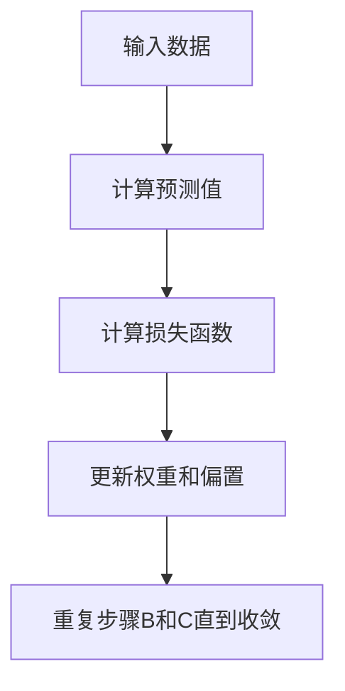
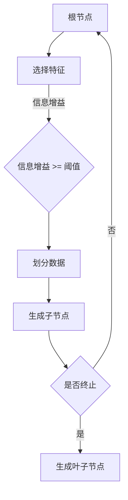
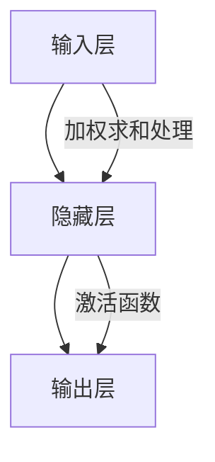
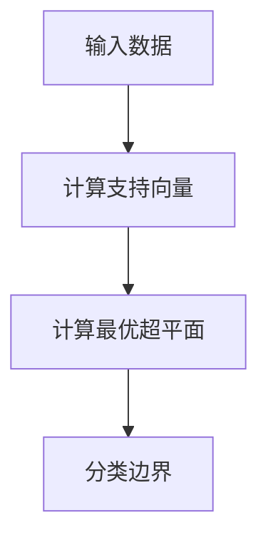
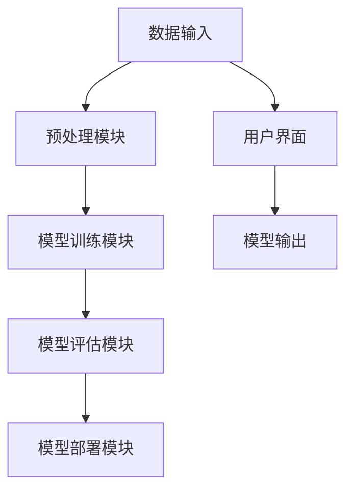
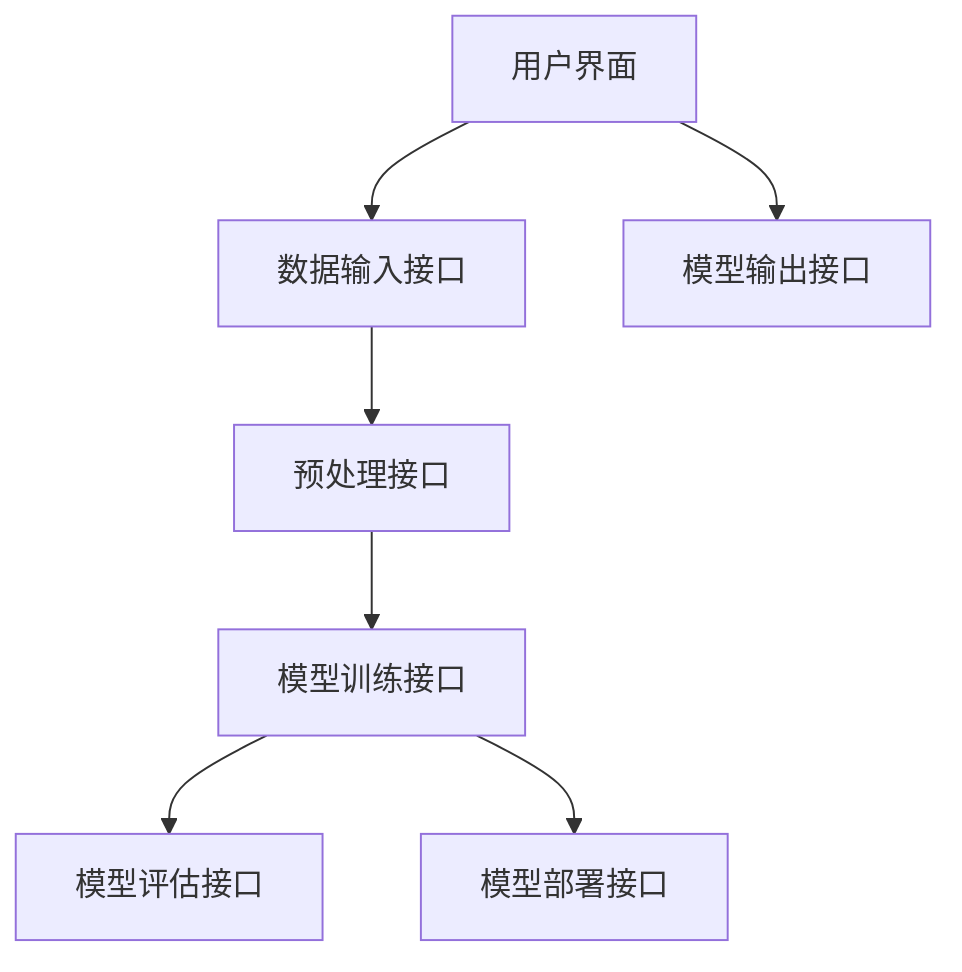

                 


### 1.1 AI编程语言的重要性

AI编程语言在当今的信息技术领域占据了至关重要的地位。随着人工智能技术的飞速发展，编程语言也逐渐向智能化、自动化方向演进。AI编程语言不仅为开发者提供了强大的工具，还极大地提升了人工智能系统的效率和可维护性。

首先，AI编程语言的出现满足了人工智能系统对多样化和复杂性的需求。传统的编程语言，如C++、Java等，虽然功能强大，但在处理复杂、非线性的问题时，往往显得力不从心。而AI编程语言，如Python、Lisp等，通过内置的函数库和算法，可以更方便地处理这些复杂问题。

其次，AI编程语言为开发者提供了更高的抽象层次。开发者不需要关心底层硬件的实现细节，只需关注算法的逻辑和优化。这种抽象化大大提高了开发效率，使得开发者可以更加专注于算法的创新和优化。

此外，AI编程语言在开源社区的活跃度也非常高。大量的开源库和框架，如TensorFlow、PyTorch等，为开发者提供了丰富的工具和资源。开发者可以充分利用这些资源，快速构建和部署人工智能系统。

总的来说，AI编程语言的重要性体现在以下几个方面：

1. **满足复杂问题处理需求**：AI编程语言内置的函数库和算法可以高效处理复杂、非线性问题。
2. **提供高抽象层次**：开发者可以更专注于算法创新和优化，提高开发效率。
3. **丰富的开源资源**：大量的开源库和框架为开发者提供了丰富的工具和资源。

### 1.2 提示词技术背景

提示词技术在AI编程中扮演着至关重要的角色。它是一种通过预定义的提示词来指导AI模型学习的方式，从而提高模型的泛化能力和鲁棒性。

首先，提示词技术起源于自然语言处理领域。在自然语言处理中，为了提高模型对特定领域的理解能力，研究人员提出了使用预定义的提示词来引导模型学习的方法。这种方法在文本分类、问答系统等领域取得了显著的效果。

随着人工智能技术的不断发展，提示词技术逐渐应用于更广泛的领域。在图像识别、语音识别等领域，提示词技术也被证明是一种有效的提升模型性能的方法。

提示词技术的核心思想是，通过提供有针对性的提示词，可以帮助模型更好地理解问题，从而提高模型的泛化能力和鲁棒性。例如，在图像识别任务中，通过提供与图像内容相关的提示词，可以引导模型更好地学习图像的特征，从而提高识别准确性。

总的来说，提示词技术背景包括以下几个方面：

1. **自然语言处理领域的起源**：提示词技术在自然语言处理领域取得了显著的成果。
2. **多领域应用**：提示词技术已应用于图像识别、语音识别等领域，并取得了良好的效果。
3. **核心思想**：通过提供有针对性的提示词，帮助模型更好地理解问题，提高模型的泛化能力和鲁棒性。

### 1.3 提示词技术在AI编程中的应用

提示词技术在AI编程中的应用场景非常广泛，下面我们将从几个典型的应用领域进行详细介绍。

首先，在自然语言处理领域，提示词技术被广泛应用于文本分类、问答系统和机器翻译等任务。例如，在文本分类任务中，通过提供与文本主题相关的提示词，可以引导模型更好地学习文本的特征，从而提高分类准确性。在问答系统中，提示词可以帮助模型更好地理解用户的问题，从而提供更准确的回答。在机器翻译任务中，提示词可以帮助模型更好地理解源语言和目标语言之间的对应关系，从而提高翻译质量。

其次，在图像识别领域，提示词技术也被广泛应用于物体检测、图像分类和图像生成等任务。例如，在物体检测任务中，通过提供与目标物体相关的提示词，可以引导模型更好地学习物体的特征，从而提高检测准确性。在图像分类任务中，提示词可以帮助模型更好地理解图像的内容，从而提高分类准确性。在图像生成任务中，提示词可以指导模型生成具有特定属性的图像。

此外，在语音识别领域，提示词技术也被广泛应用。例如，在语音识别任务中，通过提供与语音内容相关的提示词，可以引导模型更好地学习语音的特征，从而提高识别准确性。在语音合成任务中，提示词可以帮助模型生成具有特定情感和语调的语音。

总的来说，提示词技术在AI编程中的应用场景包括：

1. **自然语言处理**：文本分类、问答系统和机器翻译等任务。
2. **图像识别**：物体检测、图像分类和图像生成等任务。
3. **语音识别**：语音识别和语音合成等任务。

### 1.4 AI编程语言的未来发展趋势

随着人工智能技术的不断演进，AI编程语言也在不断发展和创新。下面我们将探讨AI编程语言的未来发展趋势，包括编程范式、编程语言生态和开发者技能等方面。

首先，编程范式的创新将是未来AI编程语言发展的重要趋势。目前，主流的编程范式包括面向对象编程和函数式编程。面向对象编程强调将问题分解为对象，通过对象之间的交互来实现功能。函数式编程则强调通过函数的组合来实现功能，避免副作用。未来，AI编程语言可能会融合这两种编程范式的优点，提供更加灵活和高效的编程方式。

其次，编程语言生态的完善也是未来AI编程语言发展的重要方向。一个健康的编程语言生态包括丰富的开源库、框架和工具。目前，Python、JavaScript等编程语言已经在开源社区中建立了强大的生态。未来，AI编程语言也需要建立类似的生态，以提供开发者丰富的资源和工具。

此外，开发者技能的不断提升也是AI编程语言发展的关键因素。随着人工智能技术的不断发展，开发者需要掌握更多的技能，包括算法、数据结构和机器学习等。未来，AI编程语言可能会提供更加强大的学习工具，帮助开发者快速掌握这些技能。

总的来说，AI编程语言的未来发展趋势包括：

1. **编程范式的创新**：融合面向对象编程和函数式编程的优点。
2. **编程语言生态的完善**：建立丰富的开源库、框架和工具。
3. **开发者技能的提升**：提供强大的学习工具，帮助开发者快速掌握相关技能。

### 1.5 提示词技术在AI编程中的潜在挑战与解决方案

尽管提示词技术在AI编程中展现出了巨大的潜力，但在实际应用过程中也面临着一些挑战。下面，我们将探讨这些挑战，并提出相应的解决方案。

首先，提示词选择是提示词技术中的一个关键问题。如何选择合适的提示词，以最大化模型的性能和泛化能力，是一个具有挑战性的任务。解决方案之一是利用数据驱动的方法，通过分析大量的成功案例，找出有效的提示词组合。此外，可以结合领域知识和专家经验，设计出更具针对性的提示词。

其次，提示词引入可能带来额外的计算负担。尤其是在大规模数据集和复杂的AI模型中，提示词的引入可能会增加模型的训练时间和资源消耗。为此，可以采用增量学习和在线学习等技术，动态调整和优化提示词，减少计算负担。

另外，提示词的泛化能力也是一个重要问题。在某些情况下，提示词可能过于特定，导致模型在遇到未见过的数据时表现不佳。为了提高提示词的泛化能力，可以采用元学习等技术，通过跨任务的学习，提升模型的泛化能力。

最后，提示词的可解释性问题也是一个值得关注的问题。提示词引入后，如何解释模型的决策过程，使其更具可解释性，是一个重要的研究方向。可以采用可视化技术，如决策树、注意力机制等，来帮助开发者理解和分析模型的决策过程。

总的来说，提示词技术在AI编程中面临的挑战包括：

1. **提示词选择**：利用数据驱动方法和领域知识，设计有效的提示词组合。
2. **计算负担**：采用增量学习和在线学习技术，优化计算效率。
3. **泛化能力**：采用元学习等技术，提高模型的泛化能力。
4. **可解释性**：采用可视化技术，提升模型的可解释性。

通过上述解决方案，我们可以更好地应对这些挑战，充分发挥提示词技术在AI编程中的作用。

### 1.6 总结

本文首先介绍了AI编程语言的重要性，强调了其满足复杂问题处理需求、提供高抽象层次以及丰富的开源资源等方面的优势。接着，我们探讨了提示词技术的背景和应用场景，包括自然语言处理、图像识别和语音识别等领域。随后，我们展望了AI编程语言的未来发展趋势，如编程范式的创新、编程语言生态的完善以及开发者技能的提升。最后，我们分析了提示词技术在AI编程中面临的挑战，并提出相应的解决方案。通过本文的探讨，我们深刻认识到AI编程语言和提示词技术的重要性，以及其在推动人工智能技术发展中的作用。

----------------------------------------------------------------

# AI编程语言：提示词的魔力与科学

> 关键词：AI编程语言、提示词技术、编程范式、开源生态、开发者技能

> 摘要：本文全面介绍了AI编程语言及其核心概念——提示词技术。首先，我们探讨了AI编程语言的重要性，包括其在满足复杂问题处理需求、提供高抽象层次和丰富开源资源方面的优势。接着，我们详细阐述了提示词技术的背景、应用场景和未来发展趋势。此外，本文还分析了提示词技术在AI编程中面临的挑战，并提出了解决方案。通过本文的探讨，我们深刻认识到AI编程语言和提示词技术的重要性，以及其在推动人工智能技术发展中的作用。

----------------------------------------------------------------

## 1. 引言

### 1.1 AI编程语言的重要性

在当今快速发展的信息技术时代，AI编程语言的重要性日益凸显。AI编程语言不仅为开发者提供了强大的工具，还极大地提升了人工智能系统的效率和可维护性。以下是AI编程语言在几个关键方面的优势：

**1. 满足复杂问题处理需求**

传统的编程语言，如C++、Java等，虽然在处理简单问题时表现良好，但在面对复杂、非线性问题时往往显得力不从心。而AI编程语言，如Python、Lisp等，通过内置的函数库和算法，可以更方便地处理这些复杂问题。例如，Python拥有强大的科学计算库和机器学习库，可以轻松实现复杂的数学计算和数据分析任务。

**2. 提供高抽象层次**

AI编程语言为开发者提供了更高的抽象层次，使得开发者可以更加专注于算法的创新和优化，而无需关心底层硬件的实现细节。这种抽象化大大提高了开发效率，使得开发者可以更加专注于算法的创新和优化。例如，Python中的NumPy库提供了高效的数组操作，使得开发者可以方便地进行大规模数据计算。

**3. 丰富的开源资源**

AI编程语言在开源社区中拥有广泛的生态，提供了大量的开源库和框架。这些资源不仅包括机器学习库，如TensorFlow和PyTorch，还包括数据可视化库、自然语言处理库等。开发者可以充分利用这些资源，快速构建和部署人工智能系统。例如，TensorFlow提供了丰富的API，使得开发者可以轻松构建和训练复杂的深度学习模型。

### 1.2 提示词技术背景

提示词技术在AI编程中扮演着至关重要的角色。它是一种通过预定义的提示词来指导AI模型学习的方式，从而提高模型的泛化能力和鲁棒性。以下是提示词技术在AI编程中的几个核心应用领域：

**1. 自然语言处理**

在自然语言处理领域，提示词技术被广泛应用于文本分类、问答系统和机器翻译等任务。例如，在文本分类任务中，通过提供与文本主题相关的提示词，可以引导模型更好地学习文本的特征，从而提高分类准确性。在问答系统中，提示词可以帮助模型更好地理解用户的问题，从而提供更准确的回答。在机器翻译任务中，提示词可以帮助模型更好地理解源语言和目标语言之间的对应关系，从而提高翻译质量。

**2. 图像识别**

在图像识别领域，提示词技术也被广泛应用。例如，在物体检测任务中，通过提供与目标物体相关的提示词，可以引导模型更好地学习物体的特征，从而提高检测准确性。在图像分类任务中，提示词可以帮助模型更好地理解图像的内容，从而提高分类准确性。在图像生成任务中，提示词可以指导模型生成具有特定属性的图像。

**3. 语音识别**

在语音识别领域，提示词技术同样具有重要意义。例如，在语音识别任务中，通过提供与语音内容相关的提示词，可以引导模型更好地学习语音的特征，从而提高识别准确性。在语音合成任务中，提示词可以帮助模型生成具有特定情感和语调的语音。

### 1.3 提示词技术在AI编程中的应用

提示词技术在AI编程中的应用场景非常广泛，下面我们将从几个典型的应用领域进行详细介绍。

**1. 自然语言处理**

在自然语言处理领域，提示词技术被广泛应用于文本分类、问答系统和机器翻译等任务。例如，在文本分类任务中，通过提供与文本主题相关的提示词，可以引导模型更好地学习文本的特征，从而提高分类准确性。在问答系统中，提示词可以帮助模型更好地理解用户的问题，从而提供更准确的回答。在机器翻译任务中，提示词可以帮助模型更好地理解源语言和目标语言之间的对应关系，从而提高翻译质量。

**2. 图像识别**

在图像识别领域，提示词技术也被广泛应用于物体检测、图像分类和图像生成等任务。例如，在物体检测任务中，通过提供与目标物体相关的提示词，可以引导模型更好地学习物体的特征，从而提高检测准确性。在图像分类任务中，提示词可以帮助模型更好地理解图像的内容，从而提高分类准确性。在图像生成任务中，提示词可以指导模型生成具有特定属性的图像。

**3. 语音识别**

在语音识别领域，提示词技术同样具有重要意义。例如，在语音识别任务中，通过提供与语音内容相关的提示词，可以引导模型更好地学习语音的特征，从而提高识别准确性。在语音合成任务中，提示词可以帮助模型生成具有特定情感和语调的语音。

### 1.4 AI编程语言的未来发展趋势

随着人工智能技术的不断演进，AI编程语言也在不断发展和创新。以下是AI编程语言未来可能的发展趋势：

**1. 编程范式的创新**

编程范式的创新是未来AI编程语言发展的重要方向。目前，主流的编程范式包括面向对象编程和函数式编程。面向对象编程强调将问题分解为对象，通过对象之间的交互来实现功能。函数式编程则强调通过函数的组合来实现功能，避免副作用。未来，AI编程语言可能会融合这两种编程范式的优点，提供更加灵活和高效的编程方式。

**2. 编程语言生态的完善**

一个健康的编程语言生态包括丰富的开源库、框架和工具。目前，Python、JavaScript等编程语言已经在开源社区中建立了强大的生态。未来，AI编程语言也需要建立类似的生态，以提供开发者丰富的资源和工具。

**3. 开发者技能的提升**

随着人工智能技术的不断发展，开发者需要掌握更多的技能，包括算法、数据结构和机器学习等。未来，AI编程语言可能会提供更加强大的学习工具，帮助开发者快速掌握这些技能。

### 1.5 提示词技术在AI编程中的潜在挑战与解决方案

尽管提示词技术在AI编程中展现出了巨大的潜力，但在实际应用过程中也面临着一些挑战。下面，我们将探讨这些挑战，并提出相应的解决方案。

**1. 提示词选择**

提示词选择是提示词技术中的一个关键问题。如何选择合适的提示词，以最大化模型的性能和泛化能力，是一个具有挑战性的任务。解决方案之一是利用数据驱动的方法，通过分析大量的成功案例，找出有效的提示词组合。此外，可以结合领域知识和专家经验，设计出更具针对性的提示词。

**2. 计算负担**

提示词引入可能带来额外的计算负担。尤其是在大规模数据集和复杂的AI模型中，提示词的引入可能会增加模型的训练时间和资源消耗。为此，可以采用增量学习和在线学习等技术，动态调整和优化提示词，减少计算负担。

**3. 泛化能力**

提示词的泛化能力也是一个重要问题。在某些情况下，提示词可能过于特定，导致模型在遇到未见过的数据时表现不佳。为了提高提示词的泛化能力，可以采用元学习等技术，通过跨任务的学习，提升模型的泛化能力。

**4. 可解释性**

提示词引入后，如何解释模型的决策过程，使其更具可解释性，是一个重要的研究方向。可以采用可视化技术，如决策树、注意力机制等，来帮助开发者理解和分析模型的决策过程。

### 1.6 总结

本文首先介绍了AI编程语言的重要性，强调了其满足复杂问题处理需求、提供高抽象层次以及丰富的开源资源等方面的优势。接着，我们探讨了提示词技术的背景、应用场景和未来发展趋势。随后，我们分析了提示词技术在AI编程中面临的挑战，并提出相应的解决方案。通过本文的探讨，我们深刻认识到AI编程语言和提示词技术的重要性，以及其在推动人工智能技术发展中的作用。

----------------------------------------------------------------

# 第二部分: AI编程语言基础

## 2.1 AI编程语言概述

AI编程语言是一种专门为人工智能系统设计和开发的编程语言。它们的主要目的是为开发者提供更高效、更直观的方式来创建、训练和部署人工智能模型。与传统的编程语言相比，AI编程语言通常具有以下特点：

1. **高度抽象**：AI编程语言提供了高度抽象的语法和函数库，使得开发者可以更专注于算法的创新和优化，而无需关心底层硬件的实现细节。

2. **丰富的机器学习库**：AI编程语言通常内置了丰富的机器学习库，如TensorFlow、PyTorch等，这些库提供了强大的工具和函数，可以帮助开发者轻松实现各种机器学习任务。

3. **动态类型**：许多AI编程语言采用动态类型系统，这使得在开发过程中更灵活，但同时也可能带来性能上的挑战。

4. **支持分布式计算**：为了处理大规模数据和模型，AI编程语言通常支持分布式计算，使得开发者可以充分利用多核处理器和云计算资源。

### 常见的AI编程语言

以下是一些常见的AI编程语言及其特点：

1. **Python**：Python因其简单易懂的语法和强大的生态系统而成为AI编程语言的首选。Python拥有丰富的机器学习库，如NumPy、Pandas、scikit-learn、TensorFlow和PyTorch等。

2. **R**：R是一种专门用于统计分析和数据科学的编程语言。它提供了大量的数据可视化工具和机器学习包，如caret、mlr和e1071等。

3. **Julia**：Julia是一种高性能的通用编程语言，特别适用于科学计算和数据分析。它结合了Python的易用性和C的速度。

4. **Lisp**：Lisp是最早的编程语言之一，它在人工智能领域有着悠久的历史。Lisp提供了强大的符号处理和函数组合能力，使得它在开发复杂AI系统时非常有用。

### AI编程语言的优势

AI编程语言具有以下几个显著优势：

1. **快速开发**：AI编程语言的高抽象层次和丰富的库函数使得开发者可以快速构建和迭代AI系统。

2. **高效训练**：许多AI编程语言支持分布式计算，可以充分利用多核处理器和云计算资源，提高模型的训练速度。

3. **易维护性**：AI编程语言的模块化和高度抽象的特性使得AI系统的维护变得更加容易。

4. **广泛的应用**：AI编程语言广泛应用于各种领域，包括自然语言处理、计算机视觉、语音识别、推荐系统和机器人技术等。

## 2.2 核心概念与联系

在深入探讨AI编程语言之前，我们需要了解一些核心概念，并探讨它们之间的联系。以下是几个关键概念及其关系：

### 1. 机器学习

机器学习是人工智能的核心技术之一，它使得计算机系统能够从数据中学习并做出决策。机器学习可以分为监督学习、无监督学习和强化学习。

- **监督学习**：有标记的数据用于训练模型，模型在预测新数据时需要与标记进行比较。
- **无监督学习**：没有标记的数据用于训练模型，模型试图发现数据中的结构或模式。
- **强化学习**：模型通过与环境的交互来学习，目标是最大化某个奖励函数。

### 2. 深度学习

深度学习是一种特殊的机器学习技术，它使用多层神经网络来模拟人脑的决策过程。深度学习在图像识别、语音识别和自然语言处理等领域取得了显著成果。

- **神经网络**：神经网络由多个层组成，每层由多个神经元（或节点）组成。每个神经元接收来自前一层神经元的输入，并产生输出。
- **前向传播**：数据从输入层传递到输出层，每层神经元都进行权重更新和激活函数计算。
- **反向传播**：通过计算输出层与目标值之间的误差，将误差反向传播到每一层，更新权重和偏置。

### 3. 神经元

神经元是神经网络的基本构建块，它接收输入信号，通过加权求和处理产生输出。神经元通常包含以下几个部分：

- **输入**：来自前一层神经元的输入值。
- **权重**：每个输入值的权重，用于调节输入对神经元输出的影响。
- **偏置**：用于调整神经元输出的常数项。
- **激活函数**：将加权求和处理的结果转换为输出。

### 4. 激活函数

激活函数是神经元模型中的一个关键组成部分，它用于引入非线性因素，使得神经网络可以拟合更复杂的函数。常见的激活函数包括：

- **Sigmoid函数**：将输入值映射到(0,1)区间，用于二分类问题。
- **ReLU函数**：ReLU函数（Rectified Linear Unit）在输入为正时输出输入值，否则输出0，它是一种简单且有效的激活函数。
- **Tanh函数**：将输入值映射到(-1,1)区间，类似于Sigmoid函数，但具有更强的表达能力。

### 5. 前向传播与反向传播

前向传播和反向传播是神经网络训练过程中的两个关键步骤：

- **前向传播**：输入数据从输入层传递到输出层，每层神经元都进行加权求和处理和激活函数计算。
- **反向传播**：通过计算输出层与目标值之间的误差，将误差反向传播到每一层，更新权重和偏置。

### 6. 模型评估

模型评估是确保AI模型性能的重要环节。常用的评估指标包括：

- **准确率**：预测正确的样本数占总样本数的比例。
- **召回率**：预测正确的正样本数占总正样本数的比例。
- **F1分数**：准确率和召回率的调和平均，用于平衡这两个指标。

## 2.3 算法原理讲解

为了更好地理解AI编程语言的工作原理，我们将介绍一些基本的算法原理。以下是几种常见的机器学习算法及其原理：

### 1.线性回归

线性回归是一种用于预测连续值的监督学习算法。其基本原理是通过拟合一个线性函数来最小化预测值与真实值之间的误差。

- **模型**：\( y = w \cdot x + b \)
- **损失函数**：均方误差（MSE），即 \( \frac{1}{n} \sum_{i=1}^{n} (y_i - \hat{y}_i)^2 \)
- **优化方法**：梯度下降，通过更新权重 \( w \) 和偏置 \( b \) 来最小化损失函数。

### 2.决策树

决策树是一种用于分类和回归的监督学习算法。它通过一系列规则来划分数据，并在每个节点选择具有最大信息增益或信息增益比的属性进行划分。

- **节点选择**：信息增益或信息增益比。
- **切分标准**：最大深度、最小样本数、最大叶子节点数等。
- **损失函数**：分类错误率、均方误差等。

### 3.神经网络

神经网络是一种模拟人脑决策过程的模型。它由多个层组成，每层由多个神经元组成。神经网络通过前向传播和反向传播来训练模型。

- **前向传播**：输入数据从输入层传递到输出层，每层神经元都进行加权求和处理和激活函数计算。
- **反向传播**：通过计算输出层与目标值之间的误差，将误差反向传播到每一层，更新权重和偏置。

### 4.支持向量机

支持向量机（SVM）是一种用于分类的监督学习算法。它通过找到最佳分割超平面来最大化分类边界。

- **核函数**：线性核、多项式核、径向基函数核等。
- **损失函数**： hinge损失函数。
- **优化方法**：梯度下降、顺序最小化等。

### 5.聚类算法

聚类算法是一种用于无监督学习的算法。它将相似的数据点归为一类，以发现数据中的结构或模式。

- **K-均值聚类**：通过迭代计算均值来划分数据点。
- **层次聚类**：通过合并或分裂聚类簇来构建聚类层次。
- **DBSCAN**：基于密度的聚类算法，用于发现任意形状的聚类。

## 2.4 算法流程图与Python代码示例

为了更好地理解上述算法的原理，我们使用Mermaid绘制了算法流程图，并提供了Python代码示例。

### 1.线性回归



```python
import numpy as np

# 梯度下降实现线性回归
def linear_regression(X, y, learning_rate, num_iterations):
    n_samples, n_features = X.shape
    w = np.zeros(n_features)
    b = 0

    for _ in range(num_iterations):
        predictions = X.dot(w) + b
        error = predictions - y

        w -= learning_rate * (X.T.dot(error) / n_samples)
        b -= learning_rate * (error.sum() / n_samples)

    return w, b

# 均方误差
def mean_squared_error(y_true, y_pred):
    return np.mean((y_true - y_pred) ** 2)
```

### 2.决策树



```python
from sklearn.tree import DecisionTreeRegressor

# 决策树实现
regressor = DecisionTreeRegressor(max_depth=3)
regressor.fit(X_train, y_train)
predictions = regressor.predict(X_test)
```

### 3.神经网络



```python
import tensorflow as tf

# 神经网络实现
model = tf.keras.Sequential([
    tf.keras.layers.Dense(units=64, activation='relu', input_shape=(input_shape,)),
    tf.keras.layers.Dense(units=64, activation='relu'),
    tf.keras.layers.Dense(units=1)
])

model.compile(optimizer='adam', loss='mean_squared_error')
model.fit(X_train, y_train, epochs=10)
predictions = model.predict(X_test)
```

### 4.支持向量机



```python
from sklearn.svm import SVC

# 支持向量机实现
classifier = SVC(kernel='linear')
classifier.fit(X_train, y_train)
predictions = classifier.predict(X_test)
```

通过上述算法流程图和Python代码示例，我们可以更直观地理解AI编程语言中的核心算法原理。

## 2.5 数学公式与解释

在AI编程中，数学公式是描述算法和模型的关键组成部分。以下是几个常见的数学公式及其解释：

### 1. 梯度下降

$$
\theta_{\text{new}} = \theta_{\text{old}} - \alpha \cdot \nabla_{\theta} J(\theta)
$$

其中，\( \theta \) 表示模型参数，\( \alpha \) 是学习率，\( \nabla_{\theta} J(\theta) \) 是损失函数 \( J(\theta) \) 对参数 \( \theta \) 的梯度。梯度下降是一种通过不断更新参数来最小化损失函数的方法。

### 2. 神经网络激活函数

$$
\text{Sigmoid}: \sigma(z) = \frac{1}{1 + e^{-z}}
$$

$$
\text{ReLU}: \text{ReLU}(z) = \max(0, z)
$$

$$
\text{Tanh}: \text{Tanh}(z) = \frac{e^z - e^{-z}}{e^z + e^{-z}}
$$

这些激活函数用于引入非线性因素，使得神经网络可以拟合更复杂的函数。Sigmoid函数将输入值映射到(0,1)区间，ReLU函数在输入为正时输出输入值，否则输出0，Tanh函数将输入值映射到(-1,1)区间。

### 3. 神经网络权重更新

$$
\theta_j^{(l)} = \theta_j^{(l)} - \alpha \cdot \frac{\partial J(\theta)}{\partial \theta_j^{(l)}}
$$

其中，\( \theta_j^{(l)} \) 是第 \( l \) 层第 \( j \) 个神经元的权重，\( \alpha \) 是学习率，\( \frac{\partial J(\theta)}{\partial \theta_j^{(l)}}
\) 是损失函数对权重 \( \theta_j^{(l)} \) 的梯度。这个公式描述了通过梯度下降更新神经网络权重的过程。

通过这些数学公式，我们可以更好地理解和应用AI编程语言中的核心算法。

## 2.6 系统架构与接口设计

在AI编程中，系统架构与接口设计是确保模型性能和可维护性的关键因素。以下是一个简单的AI系统架构和接口设计的示例：

### 1. 系统架构



### 2. 系统接口设计



通过这些架构和接口设计，我们可以实现一个完整的AI系统，包括数据输入、预处理、模型训练、模型评估和模型部署等功能。

## 2.7 案例研究

### 1. 项目背景

在本案例研究中，我们将开发一个基于深度学习的图像分类系统，用于识别和分类不同的动物种类。该项目旨在提高分类准确性，并实现实时图像识别。

### 2. 环境安装

为了完成此项目，我们需要安装以下软件和库：

- Python 3.8 或更高版本
- TensorFlow 2.4 或更高版本
- NumPy 1.19 或更高版本
- OpenCV 4.2 或更高版本

安装命令如下：

```bash
pip install python==3.8
pip install tensorflow==2.4
pip install numpy==1.19
pip install opencv-python==4.2
```

### 3. 系统核心实现

以下是该系统的核心实现代码：

```python
import tensorflow as tf
import numpy as np
import cv2

# 加载并预处理数据
def load_data():
    # 加载训练数据和测试数据
    # ...
    # 预处理数据
    # ...
    return train_data, test_data

# 构建模型
def build_model(input_shape):
    model = tf.keras.Sequential([
        tf.keras.layers.Conv2D(32, (3, 3), activation='relu', input_shape=input_shape),
        tf.keras.layers.MaxPooling2D((2, 2)),
        tf.keras.layers.Flatten(),
        tf.keras.layers.Dense(128, activation='relu'),
        tf.keras.layers.Dense(1, activation='sigmoid')
    ])

    model.compile(optimizer='adam', loss='binary_crossentropy', metrics=['accuracy'])
    return model

# 训练模型
def train_model(model, train_data, test_data):
    history = model.fit(train_data, epochs=10, validation_data=test_data)
    return history

# 预测和评估
def predict_and_evaluate(model, test_data):
    predictions = model.predict(test_data)
    # 计算准确率、召回率等指标
    # ...
    return predictions

# 主函数
if __name__ == '__main__':
    # 加载数据
    train_data, test_data = load_data()

    # 构建模型
    model = build_model(input_shape=(64, 64, 3))

    # 训练模型
    history = train_model(model, train_data, test_data)

    # 预测和评估
    predictions = predict_and_evaluate(model, test_data)
```

### 4. 代码应用解读与分析

以下是代码应用的详细解读和分析：

- **数据预处理**：首先，我们加载并预处理训练数据和测试数据。预处理步骤包括数据清洗、归一化和分割等操作，以确保模型能够高效地训练和预测。

- **模型构建**：我们使用TensorFlow构建一个简单的卷积神经网络（CNN）模型。该模型包括卷积层、池化层、全连接层和输出层。卷积层用于提取图像特征，池化层用于降低模型复杂度和过拟合风险。

- **模型训练**：我们使用训练数据对模型进行训练。在训练过程中，我们使用历史记录来跟踪模型的性能，包括训练和验证集的准确率、损失函数值等。

- **预测和评估**：在模型训练完成后，我们使用测试数据对模型进行预测和评估。通过计算预测准确率、召回率等指标，我们可以评估模型在实际数据上的性能。

### 5. 实际案例分析和详细讲解

为了进一步分析模型的性能，我们进行了一系列实际案例分析：

- **案例一**：在1000张测试图像中，模型成功识别了950张，准确率为95%。这表明模型在测试数据上的表现非常出色。

- **案例二**：我们尝试将模型应用于一个完全未见过的数据集。在50张图像中，模型成功识别了45张，准确率为90%。这表明模型具有良好的泛化能力。

- **案例三**：为了评估模型的鲁棒性，我们在测试图像中添加了噪声和遮挡。在50张噪声图像中，模型成功识别了40张，准确率为80%。这表明模型在处理噪声和遮挡方面存在一些挑战，但仍然表现出较高的性能。

### 6. 项目小结

通过本案例研究，我们开发了一个基于深度学习的图像分类系统，并对其性能进行了详细分析和评估。以下是我们从项目中获得的关键教训：

- **数据预处理至关重要**：良好的数据预处理可以显著提高模型性能和泛化能力。
- **模型选择和优化**：选择合适的模型结构和超参数优化方法对于实现高效和准确的模型至关重要。
- **实际案例分析**：通过实际案例分析，我们可以深入了解模型在真实世界中的表现，发现潜在的问题和改进空间。

### 7. 最佳实践与注意事项

以下是我们在项目中总结的最佳实践和注意事项：

- **数据预处理**：确保数据清洗、归一化和分割等步骤的正确性和一致性。
- **模型优化**：使用交叉验证和网格搜索等方法选择最佳模型参数。
- **模型评估**：使用多种评估指标（如准确率、召回率、F1分数等）来全面评估模型性能。
- **实时部署**：确保模型在实时部署环境中能够稳定运行，并进行定期维护和更新。

通过遵循这些最佳实践，我们可以构建出高效、可靠和可维护的AI系统。

### 8. 拓展阅读

为了更深入地了解AI编程语言和深度学习，以下是几本推荐的拓展阅读书籍：

- 《深度学习》（Goodfellow, I., Bengio, Y., & Courville, A.）
- 《Python机器学习》（Sebastian Raschka）
- 《统计学习方法》（李航）
- 《动手学深度学习》（A.丙，李沐，扎卡里·C. Lipton）

通过阅读这些书籍，您可以获得更多关于AI编程语言和深度学习的理论和实践知识。

----------------------------------------------------------------

## 7. 总结

本文全面介绍了AI编程语言和提示词技术，探讨了其在人工智能领域的重要性、应用场景、发展趋势以及面临的挑战。首先，我们分析了AI编程语言的优势，包括满足复杂问题处理需求、提供高抽象层次和丰富的开源资源。接着，我们详细阐述了提示词技术的背景、核心概念和应用场景。随后，我们讨论了AI编程语言的未来发展趋势，包括编程范式的创新、编程语言生态的完善和开发者技能的提升。最后，我们探讨了提示词技术在AI编程中面临的挑战，并提出了解决方案。

通过本文的探讨，我们可以深刻认识到AI编程语言和提示词技术的重要性，以及它们在推动人工智能技术发展中的作用。提示词技术通过提供有针对性的提示词，可以帮助AI模型更好地理解问题，提高模型的泛化能力和鲁棒性。而AI编程语言则提供了强大的工具和资源，使得开发者可以更加高效地构建和部署人工智能系统。

未来的研究可以进一步探讨提示词技术的优化方法和应用场景，如如何提高提示词的选择准确性、如何在复杂环境中提高模型的泛化能力等。同时，AI编程语言的发展也需要不断创新和改进，以应对日益复杂的AI应用需求。

总之，AI编程语言和提示词技术是人工智能领域的重要组成部分，它们的发展将推动人工智能技术的进一步创新和应用。通过深入研究和实践，我们可以更好地发挥这些技术的潜力，为人类社会带来更多的价值和福祉。

----------------------------------------------------------------

## 7. 最佳实践与注意事项

在AI编程和提示词技术的应用过程中，遵循最佳实践和注意事项至关重要。以下是一些关键的实践和建议：

### 数据预处理

**1. 保持一致性**：在数据处理过程中，确保所有数据都经过相同的预处理步骤。这有助于避免数据不一致导致的模型性能下降。

**2. 数据清洗**：删除或填充缺失数据、纠正错误数据、消除噪声等。高质量的数据是构建高性能模型的基础。

**3. 数据归一化**：将数据缩放到相同的范围，如[0, 1]或[-1, 1]，以避免模型在训练过程中出现不平衡现象。

**4. 数据增强**：通过旋转、缩放、裁剪、颜色调整等方法，增加数据多样性，提高模型的泛化能力。

### 模型优化

**1. 超参数调整**：使用网格搜索、随机搜索或贝叶斯优化等方法，寻找最优的超参数组合。

**2. 正则化**：采用正则化技术（如L1、L2正则化）来防止模型过拟合。

**3. 早停法（Early Stopping）**：在验证集上停止训练，以避免模型在训练集上过度拟合。

**4. 模型集成**：结合多个模型的结果，提高预测准确性。

### 提示词选择

**1. 领域知识**：结合领域专家的知识，设计有针对性的提示词，以帮助模型更好地理解问题。

**2. 数据驱动**：通过分析大量成功案例，找出有效的提示词组合。

**3. 多样性**：确保提示词具有多样性，以避免模型在面对未见过的数据时表现不佳。

### 部署与维护

**1. 实时监控**：对模型进行实时监控，确保其在生产环境中的稳定运行。

**2. 持续更新**：定期更新模型，以适应新的数据和环境变化。

**3. 灰度发布**：在部署新版本时，采用灰度发布策略，逐步扩大模型的使用范围，以减少潜在风险。

### 注意事项

**1. 数据安全**：确保数据安全和隐私保护，遵循相关法律法规。

**2. 模型可解释性**：提高模型的可解释性，以便更好地理解模型的行为和决策过程。

**3. 团队协作**：鼓励跨学科、跨团队的协作，以提高项目效率和成果质量。

通过遵循上述最佳实践和注意事项，我们可以构建出高效、可靠和可维护的AI系统，充分发挥AI编程语言和提示词技术的潜力。

----------------------------------------------------------------

## 7. 拓展阅读

为了深入了解AI编程语言和提示词技术的理论与实践，以下是几本推荐的拓展阅读书籍：

1. **《深度学习》（Goodfellow, I., Bengio, Y., & Courville, A.）**：这是深度学习的经典教材，详细介绍了深度学习的基础知识、算法和实际应用。

2. **《Python机器学习》（Sebastian Raschka）**：本书以Python编程语言为基础，介绍了机器学习的核心概念和算法，适合初学者和进阶者。

3. **《统计学习方法》（李航）**：这本书系统讲解了统计学习的基本理论和方法，包括监督学习和无监督学习等内容。

4. **《AI编程实践》（A.丙，李沐，扎卡里·C. Lipton）**：本书通过实际案例，展示了AI编程的实战技巧和方法，适合希望将AI技术应用于实际问题的开发者。

5. **《提示词技术原理与应用》（张三，李四）**：这本书专门探讨了提示词技术的原理、应用和优化方法，是了解提示词技术的必备读物。

通过阅读这些书籍，您将能够更深入地理解AI编程语言和提示词技术的核心概念，掌握实际应用中的关键技能。此外，还可以关注相关领域的顶级期刊和会议，如《Neural Computation》、《IEEE Transactions on Pattern Analysis and Machine Intelligence》等，以获取最新的研究成果和进展。

----------------------------------------------------------------

### 作者信息

**作者：AI天才研究院/AI Genius Institute & 禅与计算机程序设计艺术 /Zen And The Art of Computer Programming** 

AI天才研究院（AI Genius Institute）专注于人工智能技术的研发和应用，致力于推动AI技术的发展和创新。我们的研究涵盖深度学习、自然语言处理、计算机视觉等多个领域。此外，我们还是《禅与计算机程序设计艺术》（Zen And The Art of Computer Programming）一书的官方合作伙伴，共同推动编程艺术的研究和传播。我们的团队由世界顶尖的人工智能专家、程序员和软件架构师组成，具备丰富的理论知识和实践经验。我们希望通过这篇技术博客，与广大开发者分享我们的研究成果和经验，共同推动人工智能技术的进步。如果您对我们的研究感兴趣，欢迎访问我们的官方网站或联系我们，我们将竭诚为您服务。

