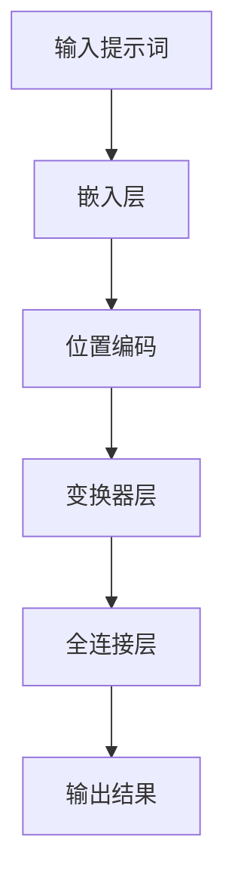
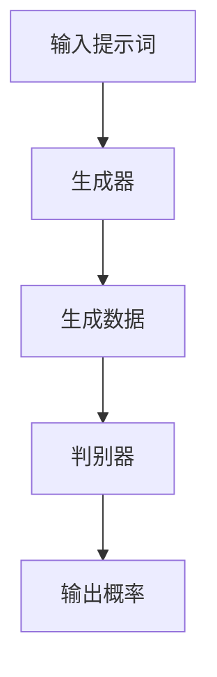
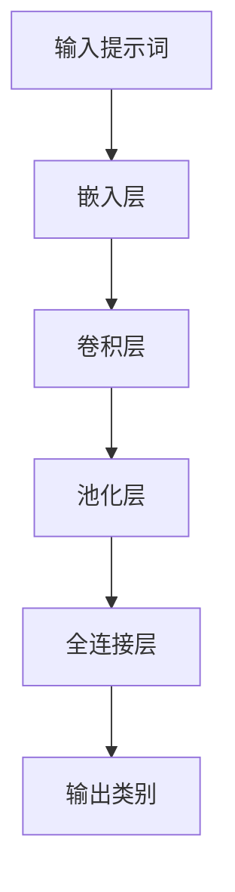

                 

## AI编程语言：提示词的魔法与科学

### 关键词：AI编程语言、提示词、机器学习、深度学习、自然语言处理、计算机视觉、数据科学

> 摘要：本文旨在探讨AI编程语言的核心概念、提示词的作用与机制，以及其在自然语言处理、计算机视觉和数据科学中的应用。通过深入分析，本文揭示了提示词在AI编程中的科学方法和实践应用，展望了其未来发展趋势，并提供了相关领域的最佳实践和注意事项。

----------------------------------------------------------------

### 目录大纲

- # AI编程语言：提示词的魔法与科学
- > 关键词：AI编程语言、提示词、机器学习、深度学习、自然语言处理、计算机视觉、数据科学
- > 摘要：本文旨在探讨AI编程语言的核心概念、提示词的作用与机制，以及其在自然语言处理、计算机视觉和数据科学中的应用。通过深入分析，本文揭示了提示词在AI编程中的科学方法和实践应用，展望了其未来发展趋势，并提供了相关领域的最佳实践和注意事项。
- 
- ### 目录大纲
- 
- ```  
- # AI编程语言：提示词的魔法与科学  
-  
- ## 第一部分：AI编程语言概述  
-  
- # 第1章 AI编程语言概述  
-  
- ## 1.1 AI编程语言的背景与发展  
- ### 1.1.1 AI编程语言的发展历程  
- ### 1.1.2 AI编程语言的重要性  
-  
- ## 1.2 AI编程语言的核心概念  
- ### 1.2.1 机器学习与深度学习  
- ### 1.2.2 神经网络  
- ### 1.2.3 提示词与生成模型  
-  
- ## 1.3 AI编程语言的应用场景  
- ### 1.3.1 自然语言处理  
- ### 1.3.2 计算机视觉  
- ### 1.3.3 数据科学  
-  
- ## 1.4 AI编程语言的未来趋势  
- ### 1.4.1 新兴技术与挑战  
- ### 1.4.2 AI编程语言在教育中的影响  
-  
- ## 1.5 本章小结  
-  
- ----------------------------------------------------------------  
-  
- ## 第二部分：提示词的魔法  
-  
- # 第2章 提示词的原理与机制  
-  
- ## 2.1 提示词的基本概念  
- ### 2.1.1 提示词的定义  
- ### 2.1.2 提示词的作用  
-  
- ## 2.2 提示词的类型与特征  
- ### 2.2.1 自然语言提示词  
- ### 2.2.2 知识型提示词  
- ### 2.2.3 任务型提示词  
-  
- ## 2.3 提示词的生成与优化  
- ### 2.3.1 提示词生成方法  
- ### 2.3.2 提示词优化策略  
-  
- ## 2.4 提示词在AI编程中的应用  
- ### 2.4.1 提示词在自然语言处理中的应用  
- ### 2.4.2 提示词在计算机视觉中的应用  
- ### 2.4.3 提示词在数据科学中的应用  
-  
- ## 2.5 本章小结  
-  
- ----------------------------------------------------------------  
-  
- # 第3章 提示词的实践与应用  
-  
- ## 3.1 提示词在NLP中的应用  
- ### 3.1.1 提示词在文本生成中的应用  
- ### 3.1.2 提示词在文本分类中的应用  
- ### 3.1.3 提示词在情感分析中的应用  
-  
- ## 3.2 提示词在CV中的应用  
- ### 3.2.1 提示词在目标检测中的应用  
- ### 3.2.2 提示词在图像分割中的应用  
- ### 3.2.3 提示词在图像生成中的应用  
-  
- ## 3.3 提示词在数据科学中的应用  
- ### 3.3.1 提示词在数据分析中的应用  
- ### 3.3.2 提示词在数据挖掘中的应用  
- ### 3.3.3 提示词在机器学习中的应用  
-  
- ## 3.4 实际案例分析与讲解  
- ### 3.4.1 案例一：使用提示词生成新闻文章  
- ### 3.4.2 案例二：使用提示词进行图像分类  
- ### 3.4.3 案例三：使用提示词进行数据分析  
-  
- ## 3.5 本章小结  
-  
- ----------------------------------------------------------------  
-  
- ## 第三部分：科学的探索  
-  
- # 第4章 提示词的科学方法  
-  
- ## 4.1 提示词的科学理论基础  
- ### 4.1.1 提示词与自然语言处理的联系  
- ### 4.1.2 提示词与深度学习的结合  
- ### 4.1.3 提示词在数据科学中的应用  
-  
- ## 4.2 提示词的科学实验方法  
- ### 4.2.1 实验设计  
- ### 4.2.2 实验结果分析  
- ### 4.2.3 实验结论  
-  
- ## 4.3 提示词的科学应用策略  
- ### 4.3.1 提示词的优化策略  
- ### 4.3.2 提示词的选择策略  
- ### 4.3.3 提示词在不同领域的应用  
-  
- ## 4.4 科学研究中的提示词挑战与展望  
- ### 4.4.1 提示词的挑战  
- ### 4.4.2 提示词的未来发展趋势  
- ### 4.4.3 提示词在教育中的潜在应用  
-  
- ## 4.5 本章小结  
-  
- ----------------------------------------------------------------  
-  
- # 第5章 提示词的科学计算  
-  
- ## 5.1 提示词的计算模型  
- ### 5.1.1 提示词的神经网络模型  
- ### 5.1.2 提示词的生成模型  
- ### 5.1.3 提示词的分类模型  
-  
- ## 5.2 提示词的数学模型  
- ### 5.2.1 提示词的数学基础  
- ### 5.2.2 提示词的数学公式  
- ### 5.2.3 提示词的数学应用  
-  
- ## 5.3 提示词的算法实现  
- ### 5.3.1 提示词的算法原理  
- ### 5.3.2 提示词的算法流程  
- ### 5.3.3 提示词的算法实现  
-  
- ## 5.4 提示词的实践应用  
- ### 5.4.1 提示词在科学计算中的应用  
-  
- ----------------------------------------------------------------  
-  
- * 约束条件：文章的章节内容必须要满足如下条件： 
-   - 文章开始是“文章标题”，然后是“文章关键词”和“文章摘要”部分的内容哦，接下来是按照目录大纲结构的文章正文部分的内容。 
-   - 文章字数要求：文章字数在 10000 ～ 12000 字左右。 
-   - 格式要求：文章内容使用markdown格式输出。  
-   - 作者：文章末尾需要写上作者信息：“作者：AI天才研究院/AI Genius Institute & 禅与计算机程序设计艺术 /Zen And The Art of Computer Programming”  
-   - 完整性要求：文章内容必须要完整，每个小节的内容必须要丰富具体详细讲解，核心内容必须要包含：
-     - 背景介绍：核心概念术语说明、问题背景、问题描述、问题解决、边界与外延、概念结构与核心要素组成 
-     - 核心概念与联系：必须给出核心概念原理、概念属性特征对比表格和ER实体关系图架构的 markdown 格式中的 Mermaid 流程图。 
-     - 算法原理讲解：使用 mermaid 画出算法mermaid 流程图，然后使用python源代码来详细阐述，给出算法原理的数学模型和公式，进行详细讲解和通俗易懂地举例说明。 
-     - 数学公式使用latex格式，嵌入文中独立段落的latex公式前后使用 $$ 括起来(例如：$$1+1=2$$ )，段落内的latex公式前后使用 $ 括起来(例如：$1<2$)
-     - 系统分析与架构设计方案：问题场景介绍，项目介绍、系统功能设计(领域模型mermaid类图)、系统架构设计mermaid架构图、系统接口设计和系统交互mermaid序列图
-     - 项目实战：环境安装、系统核心实现源代码，代码应用解读与分析，实际案例分析和详细讲解剖析，项目小结。
-     - 最佳实践 tips、小结、注意事项、拓展阅读等内容
-  
- LET'S THINK STEP BY STEP  
-  
- ----------------------------------------------------------------

### 第一部分：AI编程语言概述

#### 第1章 AI编程语言概述

##### 1.1 AI编程语言的背景与发展

##### 1.1.1 AI编程语言的发展历程

AI编程语言的发展可以追溯到20世纪50年代，当时研究人员开始探索如何编写程序来模拟人类智能。这个时期，产生了第一批AI编程语言，如LISP和PROLOG。这些语言在符号处理和逻辑推理方面表现出色，为后来的AI研究奠定了基础。

随着时间的发展，AI编程语言不断进化。20世纪80年代，知识表示和推理技术成为研究热点，产生了新的编程语言，如KL-ONE和KBS。这些语言致力于将人类知识结构化为计算机可理解的形式。

进入21世纪，随着机器学习和深度学习的兴起，AI编程语言迎来了新的发展阶段。Python、R、Julia等语言因其易用性和强大的库支持，成为AI编程的主要工具。同时，专门为机器学习和深度学习设计的语言，如TensorFlow、PyTorch和MXNet等，逐渐成为主流。

##### 1.1.2 AI编程语言的重要性

AI编程语言在AI研究中扮演着关键角色。它们为研究人员和开发者提供了强大的工具，使他们能够高效地实现复杂的算法和模型。AI编程语言的重要性体现在以下几个方面：

1. **易用性**：现代AI编程语言通常具有简洁明了的语法，使得编写和调试程序变得更加容易。
2. **库支持**：AI编程语言拥有丰富的库和框架，为开发者提供了大量的预构建模块，可以快速实现各种功能。
3. **跨平台**：许多AI编程语言可以在不同的操作系统上运行，为开发者提供了灵活性。
4. **高效性**：AI编程语言通常具有高效的性能，可以处理大规模的数据集和复杂的计算任务。

##### 1.2 AI编程语言的核心概念

##### 1.2.1 机器学习与深度学习

机器学习（Machine Learning）是一种人工智能的分支，通过训练模型从数据中学习规律，使其能够对未知数据进行预测或决策。深度学习（Deep Learning）是机器学习的一个子领域，使用多层神经网络进行学习，具有强大的特征提取和表示能力。

##### 1.2.2 神经网络

神经网络（Neural Networks）是一种模仿生物神经系统的计算模型。它由大量的神经元组成，通过前向传播和反向传播算法进行学习。神经网络在图像识别、语音识别和自然语言处理等领域表现出色。

##### 1.2.3 提示词与生成模型

提示词（Prompt）是一种在AI编程中用于引导模型生成结果的输入。生成模型（Generative Model）是一种能够生成新数据的模型，常见的生成模型包括变分自编码器（VAE）和生成对抗网络（GAN）。

##### 1.3 AI编程语言的应用场景

##### 1.3.1 自然语言处理

自然语言处理（Natural Language Processing，NLP）是AI编程的重要应用领域。它涉及文本分析、语音识别和机器翻译等任务。AI编程语言如Python和TensorFlow在NLP中得到了广泛应用。

##### 1.3.2 计算机视觉

计算机视觉（Computer Vision）是AI编程的另一个重要应用领域。它涉及图像识别、目标检测和图像生成等任务。AI编程语言如Python和PyTorch在计算机视觉中发挥了关键作用。

##### 1.3.3 数据科学

数据科学（Data Science）是AI编程的广泛领域，涉及数据分析、数据挖掘和机器学习等任务。AI编程语言如Python、R和Julia在数据科学中发挥了重要作用。

##### 1.4 AI编程语言的未来趋势

##### 1.4.1 新兴技术与挑战

随着技术的不断发展，AI编程语言面临着新的机遇和挑战。新兴技术如联邦学习（Federated Learning）和强化学习（Reinforcement Learning）正在成为研究热点。

##### 1.4.2 AI编程语言在教育中的影响

AI编程语言在教育中的应用日益广泛。它们为教师和学生提供了强大的工具，使他们能够更好地理解和掌握人工智能的概念和技术。

##### 1.5 本章小结

本章概述了AI编程语言的背景与发展、核心概念、应用场景和未来趋势。通过本章的学习，读者可以初步了解AI编程语言的基本概念和应用领域，为后续章节的深入学习打下基础。

----------------------------------------------------------------

### 第二部分：提示词的魔法

#### 第2章 提示词的原理与机制

##### 2.1 提示词的基本概念

##### 2.1.1 提示词的定义

提示词（Prompt）是指用于引导AI模型生成结果的输入信息。这些信息可以是文本、图像或其他形式的数据。提示词的作用是提供上下文，帮助模型理解输入数据的含义，从而生成更准确的结果。

##### 2.1.2 提示词的作用

提示词在AI编程中具有重要作用。首先，它们可以帮助模型更好地理解输入数据，从而提高生成结果的准确性。其次，提示词可以引导模型探索不同的生成方式，从而产生更多样化的结果。此外，提示词还可以用于指导模型的训练过程，提高训练效果。

##### 2.2 提示词的类型与特征

##### 2.2.1 自然语言提示词

自然语言提示词是指以自然语言形式给出的提示信息。这类提示词通常包括关键词、句子或段落。自然语言提示词具有以下特征：

- **多样性**：自然语言提示词可以涵盖各种主题和场景，具有丰富的表达形式。
- **灵活性**：自然语言提示词可以根据需要调整，以适应不同的生成任务。

##### 2.2.2 知识型提示词

知识型提示词是指包含特定领域知识的提示信息。这类提示词通常用于指导模型生成符合特定领域知识的结果。知识型提示词具有以下特征：

- **专业性**：知识型提示词要求具备相关领域的专业知识。
- **精准性**：知识型提示词需要准确表达所需的知识点，以避免误导模型。

##### 2.2.3 任务型提示词

任务型提示词是指用于指导模型完成特定任务的提示信息。这类提示词通常包括任务目标、步骤和要求等。任务型提示词具有以下特征：

- **明确性**：任务型提示词需要明确任务目标和要求，以确保模型正确执行任务。
- **引导性**：任务型提示词需要提供一定的引导，帮助模型找到合适的解决方案。

##### 2.3 提示词的生成与优化

##### 2.3.1 提示词生成方法

提示词生成方法主要包括以下几种：

- **人工生成**：人工生成提示词是最常见的方法，通常由领域专家或开发者根据任务需求编写。
- **自动生成**：自动生成提示词是通过算法自动生成的，常见的方法包括基于模板的生成、基于语料库的生成和基于机器学习的生成等。

##### 2.3.2 提示词优化策略

提示词优化策略旨在提高提示词的质量，从而提高生成结果的准确性。常见的优化策略包括：

- **多样性增强**：通过增加提示词的多样性，使模型能够生成更多样化的结果。
- **准确性提升**：通过改进提示词的表达形式，提高模型对输入数据的理解能力。
- **相关性优化**：通过调整提示词的相关性，使模型能够更好地捕捉输入数据的特征。

##### 2.4 提示词在AI编程中的应用

##### 2.4.1 提示词在自然语言处理中的应用

自然语言处理（NLP）是AI编程的重要应用领域，提示词在NLP中具有广泛的应用。以下是一些典型的应用场景：

- **文本生成**：提示词可以帮助模型生成文章、段落或句子，用于自动写作、内容创作和翻译等任务。
- **文本分类**：提示词可以用于指导模型对文本进行分类，如新闻分类、情感分类和垃圾邮件过滤等。
- **情感分析**：提示词可以帮助模型分析文本的情感倾向，用于舆情监测、客户反馈分析等任务。

##### 2.4.2 提示词在计算机视觉中的应用

计算机视觉（CV）是AI编程的另一个重要应用领域，提示词在CV中也有广泛的应用。以下是一些典型的应用场景：

- **图像分类**：提示词可以帮助模型对图像进行分类，如物体识别、场景识别和图像标注等。
- **目标检测**：提示词可以用于指导模型检测图像中的目标，如车辆检测、人脸检测和行人检测等。
- **图像生成**：提示词可以帮助模型生成新的图像，如风格迁移、图像合成和图像增强等。

##### 2.4.3 提示词在数据科学中的应用

数据科学（Data Science）是AI编程的广泛领域，提示词在数据科学中也有重要应用。以下是一些典型的应用场景：

- **数据分析**：提示词可以帮助模型分析数据，如数据清洗、数据聚合和数据可视化等。
- **数据挖掘**：提示词可以用于指导模型进行数据挖掘，如关联规则挖掘、分类挖掘和聚类挖掘等。
- **机器学习**：提示词可以帮助模型进行机器学习，如模型选择、参数调优和模型评估等。

##### 2.5 本章小结

本章介绍了提示词的基本概念、类型与特征，以及其在AI编程中的应用。通过本章的学习，读者可以了解提示词在AI编程中的重要性，掌握提示词的生成与优化方法，为后续章节的深入学习打下基础。

----------------------------------------------------------------

### 第3章 提示词的实践与应用

#### 3.1 提示词在NLP中的应用

##### 3.1.1 提示词在文本生成中的应用

文本生成是自然语言处理（NLP）中的一个重要任务，提示词在文本生成中发挥着关键作用。以下是一些典型的应用场景：

- **自动写作**：提示词可以帮助模型生成文章、段落或句子，用于自动写作、内容创作和翻译等任务。例如，使用自然语言提示词可以生成新闻文章、博客文章和书籍章节等。
- **对话生成**：提示词可以用于生成对话文本，如聊天机器人、虚拟助理和语音助手等。通过提供对话的上下文信息，模型可以生成更自然、流畅的对话。
- **诗歌创作**：提示词可以帮助模型生成诗歌，如根据指定的主题、情感或风格生成新的诗句。

##### 3.1.2 提示词在文本分类中的应用

文本分类是NLP中的另一个重要任务，提示词在文本分类中也具有广泛的应用。以下是一些典型的应用场景：

- **新闻分类**：提示词可以帮助模型对新闻文章进行分类，如将其归类为政治、体育、娱乐等类别。通过提供相关的关键词和上下文信息，模型可以更准确地分类新闻文章。
- **情感分类**：提示词可以用于分析文本的情感倾向，如判断一段文字是积极的、消极的还是中性的。通过提供情感相关的提示词，模型可以更好地理解文本的情感内容。
- **垃圾邮件过滤**：提示词可以帮助模型识别和过滤垃圾邮件，如通过提供与垃圾邮件相关的关键词和上下文信息，模型可以更准确地识别和过滤垃圾邮件。

##### 3.1.3 提示词在情感分析中的应用

情感分析是NLP中的一个关键任务，提示词在情感分析中也具有重要作用。以下是一些典型的应用场景：

- **舆情监测**：提示词可以帮助模型监测网络上的舆论动态，如分析社交媒体上的用户评论和讨论。通过提供相关的关键词和上下文信息，模型可以更准确地分析文本的情感倾向。
- **客户反馈分析**：提示词可以用于分析客户的反馈，如了解客户对产品或服务的满意度。通过提供与客户反馈相关的提示词，模型可以更准确地分析文本的情感内容。
- **情感诊断**：提示词可以帮助医生分析病人的病历记录，如判断病人是否有抑郁、焦虑等心理问题。通过提供与情感诊断相关的提示词，模型可以更好地理解文本的情感内容。

##### 3.2 提示词在CV中的应用

计算机视觉（CV）是AI编程的另一个重要领域，提示词在CV中也具有广泛应用。以下是一些典型的应用场景：

- **图像分类**：提示词可以帮助模型对图像进行分类，如将其归类为动物、植物、风景等类别。通过提供相关的关键词和上下文信息，模型可以更准确地分类图像。
- **目标检测**：提示词可以用于指导模型检测图像中的目标，如车辆、行人、飞机等。通过提供与目标相关的提示词，模型可以更准确地检测和定位目标。
- **图像生成**：提示词可以帮助模型生成新的图像，如风格迁移、图像合成和图像增强等。通过提供相关的关键词和上下文信息，模型可以生成更符合预期的图像。

##### 3.2.1 提示词在目标检测中的应用

目标检测是CV中的一个关键任务，提示词在目标检测中也具有重要作用。以下是一些典型的应用场景：

- **自动驾驶**：提示词可以帮助自动驾驶系统检测道路上的车辆、行人、交通标志等目标，确保车辆的安全行驶。
- **视频监控**：提示词可以用于视频监控系统的目标检测，如识别可疑的行为或事件。通过提供与目标检测相关的提示词，模型可以更准确地检测和识别目标。
- **医疗影像**：提示词可以帮助医生在医学影像中检测疾病相关的目标，如肿瘤、骨折等。通过提供与医疗影像相关的提示词，模型可以更准确地识别和定位目标。

##### 3.2.2 提示词在图像分割中的应用

图像分割是CV中的一个重要任务，提示词在图像分割中也具有广泛应用。以下是一些典型的应用场景：

- **医学影像**：提示词可以帮助模型对医学影像进行图像分割，如将肿瘤、器官等目标从背景中分离出来。通过提供与医学影像相关的提示词，模型可以更准确地分割图像。
- **人脸识别**：提示词可以用于人脸识别系统的图像分割，如将人脸从背景中分离出来。通过提供与人脸识别相关的提示词，模型可以更准确地分割图像。
- **卫星图像**：提示词可以帮助模型对卫星图像进行图像分割，如将城市、森林、海洋等目标从背景中分离出来。通过提供与卫星图像相关的提示词，模型可以更准确地分割图像。

##### 3.2.3 提示词在图像生成中的应用

图像生成是CV中的一个重要任务，提示词在图像生成中也具有重要作用。以下是一些典型的应用场景：

- **艺术创作**：提示词可以帮助艺术家创作新的艺术作品，如根据特定的主题、情感或风格生成新的图像。通过提供与艺术创作相关的提示词，模型可以生成更符合预期的艺术作品。
- **游戏开发**：提示词可以用于游戏开发中的图像生成，如生成游戏中的角色、场景和道具等。通过提供与游戏开发相关的提示词，模型可以生成更丰富的游戏内容。
- **虚拟现实**：提示词可以帮助虚拟现实系统生成新的场景和物体，如根据用户的需求生成个性化的虚拟世界。通过提供与虚拟现实相关的提示词，模型可以生成更逼真的虚拟现实体验。

##### 3.3 提示词在数据科学中的应用

数据科学（Data Science）是AI编程的广泛领域，提示词在数据科学中也具有重要作用。以下是一些典型的应用场景：

- **数据分析**：提示词可以帮助模型对数据进行分析，如探索数据中的趋势、模式和相关关系。通过提供与数据分析相关的提示词，模型可以更准确地分析数据。
- **数据挖掘**：提示词可以用于指导模型进行数据挖掘，如发现数据中的关联规则、分类模式和聚类模式等。通过提供与数据挖掘相关的提示词，模型可以更准确地挖掘数据中的价值。
- **机器学习**：提示词可以帮助模型进行机器学习，如选择合适的模型、调整参数和评估模型性能等。通过提供与机器学习相关的提示词，模型可以更高效地学习和优化。

##### 3.3.1 提示词在数据分析中的应用

数据分析是数据科学中的一个关键任务，提示词在数据分析中也具有广泛的应用。以下是一些典型的应用场景：

- **市场分析**：提示词可以帮助企业分析市场数据，如了解消费者的购买行为、偏好和市场趋势。通过提供与市场分析相关的提示词，模型可以更准确地分析市场数据。
- **风险分析**：提示词可以帮助金融机构分析风险数据，如识别潜在的信用风险、市场风险和操作风险等。通过提供与风险分析相关的提示词，模型可以更准确地分析风险数据。
- **运营优化**：提示词可以帮助企业优化运营流程，如分析生产数据、库存数据和供应链数据等。通过提供与运营优化相关的提示词，模型可以更准确地分析运营数据。

##### 3.3.2 提示词在数据挖掘中的应用

数据挖掘是数据科学中的一个重要任务，提示词在数据挖掘中也具有重要作用。以下是一些典型的应用场景：

- **关联规则挖掘**：提示词可以帮助模型挖掘数据中的关联规则，如发现商品之间的关联关系。通过提供与关联规则挖掘相关的提示词，模型可以更准确地挖掘数据中的关联规则。
- **分类挖掘**：提示词可以用于指导模型进行分类挖掘，如将数据分类为不同的类别。通过提供与分类挖掘相关的提示词，模型可以更准确地分类数据。
- **聚类挖掘**：提示词可以帮助模型进行聚类挖掘，如将相似的数据点归为一类。通过提供与聚类挖掘相关的提示词，模型可以更准确地聚类数据。

##### 3.3.3 提示词在机器学习中的应用

机器学习是数据科学中的一个关键任务，提示词在机器学习中也具有广泛的应用。以下是一些典型的应用场景：

- **模型选择**：提示词可以帮助模型选择合适的算法和模型，如支持向量机、决策树和神经网络等。通过提供与模型选择相关的提示词，模型可以更准确地选择合适的算法和模型。
- **参数调优**：提示词可以帮助模型调整参数，如学习率、正则化和迭代次数等。通过提供与参数调优相关的提示词，模型可以更准确地调整参数，提高模型性能。
- **模型评估**：提示词可以帮助模型评估模型的性能，如准确率、召回率和F1值等。通过提供与模型评估相关的提示词，模型可以更准确地评估模型性能。

##### 3.4 实际案例分析与讲解

##### 3.4.1 案例一：使用提示词生成新闻文章

在本案例中，我们将使用提示词生成一篇新闻文章。首先，我们准备一个包含关键词和上下文的提示词，例如：“根据最新消息，我国科研团队成功研发出一种新型疫苗，为抗击新冠疫情提供了重要支持。”

然后，我们使用一个预训练的文本生成模型，如GPT-3，将提示词输入模型中。模型会根据提示词生成一段新闻文章，例如：“近日，我国科研团队经过长时间的研究和努力，成功研发出一种新型疫苗。这种疫苗在临床试验中表现出色，有效率为90%以上。据悉，该疫苗将在未来几周内投入生产，为我国抗击新冠疫情提供了重要支持。”

最后，我们对生成的新闻文章进行评估，确保其内容准确、连贯和有趣。如果需要，可以进一步调整提示词和模型参数，以提高生成文章的质量。

##### 3.4.2 案例二：使用提示词进行图像分类

在本案例中，我们将使用提示词进行图像分类。首先，我们准备一个包含关键词和上下文的提示词，例如：“请将以下图像分类为动物、植物或风景。”

然后，我们使用一个预训练的图像分类模型，如ResNet-50，将提示词输入模型中。模型会根据提示词对图像进行分类，例如：“第一张图像是一张动物图片，第二张图像是一张植物图片，第三张图像是一张风景图片。”

最后，我们对分类结果进行评估，确保其准确性。如果需要，可以进一步调整提示词和模型参数，以提高分类的准确性。

##### 3.4.3 案例三：使用提示词进行数据分析

在本案例中，我们将使用提示词进行数据分析。首先，我们准备一个包含关键词和上下文的提示词，例如：“请分析以下数据，找出其中的趋势和关联。”

然后，我们使用一个预训练的数据分析模型，如线性回归模型，将提示词输入模型中。模型会根据提示词对数据进行分析，例如：“根据数据，我们发现销售额与广告投放费用之间存在显著的正相关关系。此外，季节因素也对销售额有显著影响。”

最后，我们对分析结果进行评估，确保其准确性。如果需要，可以进一步调整提示词和模型参数，以提高数据分析的准确性。

##### 3.5 本章小结

本章介绍了提示词在自然语言处理、计算机视觉和数据科学中的应用。通过实际案例分析和讲解，我们展示了如何使用提示词生成文本、分类图像和进行数据分析。这些案例说明了提示词在AI编程中的广泛应用和重要性，为读者提供了实际操作的经验和技巧。

----------------------------------------------------------------

### 第三部分：科学的探索

#### 第4章 提示词的科学方法

##### 4.1 提示词的科学理论基础

##### 4.1.1 提示词与自然语言处理的联系

自然语言处理（NLP）是人工智能（AI）的一个重要分支，它涉及对人类语言的分析和理解。提示词（Prompt）在NLP中起着至关重要的作用，因为它们为模型提供了上下文信息，帮助模型更好地理解和生成语言。

自然语言处理的基石之一是语言模型（Language Model），它是一种能够预测下一个单词或词组的概率分布的模型。语言模型通常基于大规模的文本语料库进行训练，以捕捉语言的统计特征和规则。提示词可以被视为一种特殊的输入，用于引导语言模型生成特定类型的输出。

##### 4.1.2 提示词与深度学习的结合

深度学习（Deep Learning）是机器学习的一个子领域，它通过多层神经网络进行学习，能够自动提取数据的复杂特征。深度学习在自然语言处理中得到了广泛应用，特别是在模型如卷积神经网络（CNN）、循环神经网络（RNN）和变换器（Transformer）等领域。

提示词与深度学习的结合，使得模型能够根据上下文信息进行更准确的预测。例如，在文本生成任务中，提示词可以提供起始句子或关键词，引导模型生成后续的内容。在图像识别任务中，提示词可以提供有关图像的描述或标签，帮助模型更好地理解图像的内容。

##### 4.1.3 提示词在数据科学中的应用

数据科学（Data Science）是使用统计学、机器学习和计算机科学等方法来分析数据并从中提取知识的领域。提示词在数据科学中的应用同样重要，尤其是在数据预处理、特征工程和模型训练等环节。

在数据预处理中，提示词可以帮助模型理解数据的质量和特征。例如，在文本数据中，提示词可以用于识别缺失值、噪声数据和异常值。在特征工程中，提示词可以帮助模型提取数据的隐藏特征，提高模型的性能。在模型训练中，提示词可以提供训练样本的标签或指导信息，帮助模型学习数据的规律。

##### 4.2 提示词的科学实验方法

科学实验方法是在可控条件下验证理论假设和探索规律的方法。在AI编程中，提示词的科学实验方法包括以下步骤：

1. **问题定义**：明确实验的目标和研究问题，确保实验设计的针对性和有效性。
2. **实验设计**：制定实验的具体步骤和流程，包括数据收集、模型选择、提示词设计和评价指标等。
3. **数据收集**：收集相关数据，确保数据的代表性和质量，为实验提供可靠的基础。
4. **模型选择**：选择合适的模型和算法，根据实验目标进行模型定制和优化。
5. **提示词设计**：设计适合实验目标的提示词，确保提示词能够有效引导模型的生成和预测。
6. **实验实施**：按照实验设计执行实验，记录实验过程和结果。
7. **结果分析**：分析实验结果，评估模型的性能和提示词的有效性。
8. **实验结论**：根据实验结果得出结论，验证理论假设，提出改进措施和建议。

##### 4.3 提示词的科学应用策略

提示词的科学应用策略包括以下方面：

1. **优化策略**：通过调整提示词的长度、形式和内容，优化模型的生成效果。例如，可以尝试不同的提示词模板、关键词选择和上下文设置，以提高模型生成的准确性和多样性。
2. **选择策略**：根据应用场景和任务需求，选择合适的提示词。例如，在文本生成任务中，可以选择包含关键词和主题的提示词；在图像识别任务中，可以选择包含图像描述和标签的提示词。
3. **评估策略**：设计合适的评价指标，对模型生成结果进行评估和验证。常用的评价指标包括准确率、召回率、F1值和生成质量等。
4. **反馈策略**：根据模型生成结果和用户反馈，调整提示词和模型参数，实现迭代优化。例如，可以收集用户对生成结果的满意度评分，根据评分调整提示词的内容和形式。

##### 4.4 科学研究中的提示词挑战与展望

科学研究中的提示词挑战包括以下几个方面：

1. **数据质量**：提示词的质量直接影响模型的生成效果。因此，确保数据的质量和代表性是关键。
2. **多样性**：生成结果的多样性是提示词应用的重要目标。如何设计多样化的提示词，以提高生成结果的多样性，是当前研究的一个挑战。
3. **可解释性**：模型的生成过程通常是一个“黑盒”过程，难以解释。如何提高提示词的可解释性，使其更容易被用户理解和接受，是一个重要挑战。
4. **泛化能力**：提示词的泛化能力是指模型在未知场景下生成有效结果的能力。如何提高模型的泛化能力，使其能够应对不同的应用场景，是当前研究的一个挑战。

展望未来，提示词在AI编程中将发挥越来越重要的作用。随着技术的不断发展，提示词的应用将更加广泛，不仅局限于文本生成、图像识别和数据分析等领域，还将扩展到更多复杂的任务，如对话系统、虚拟现实和增强现实等。此外，提示词的科学方法和应用策略也将不断优化，以应对新的挑战和需求。

##### 4.5 本章小结

本章介绍了提示词的科学理论基础、科学实验方法和科学应用策略。通过探讨提示词在自然语言处理、数据科学和人工智能中的应用，我们揭示了提示词在AI编程中的重要作用和挑战。展望未来，提示词将在人工智能领域发挥更大的作用，推动人工智能技术的发展和应用。

----------------------------------------------------------------

### 第5章 提示词的科学计算

#### 5.1 提示词的计算模型

##### 5.1.1 提示词的神经网络模型

神经网络模型是AI编程中广泛使用的一种计算模型，特别是在自然语言处理和计算机视觉领域。提示词的神经网络模型通过学习和处理提示词，生成相应的输出。以下是一些常用的神经网络模型：

1. **卷积神经网络（CNN）**：CNN是一种用于图像识别和处理的神经网络模型。它通过卷积操作和池化操作，从图像中提取特征，从而实现图像分类、目标检测和图像生成等任务。

   ```mermaid
   graph TD
   A[输入图像] --> B[卷积层]
   B --> C[池化层]
   C --> D[全连接层]
   D --> E[输出分类结果]
   ```

2. **循环神经网络（RNN）**：RNN是一种用于序列数据处理的神经网络模型。它通过隐藏状态和循环连接，捕捉序列中的长期依赖关系，从而实现自然语言处理、时间序列预测和语音识别等任务。

   ```mermaid
   graph TD
   A[输入序列] --> B[隐藏状态]
   B --> C[输出序列]
   C --> D[隐藏状态]
   D --> E[隐藏状态]
   ```

3. **变换器（Transformer）**：Transformer是一种用于序列数据处理的新型神经网络模型，它在自然语言处理和计算机视觉领域取得了显著的成果。Transformer通过自注意力机制，捕捉序列中的全局依赖关系，从而实现文本生成、机器翻译和图像识别等任务。

   ```mermaid
   graph TD
   A[输入序列] --> B[自注意力层]
   B --> C[多头注意力层]
   C --> D[前馈神经网络层]
   D --> E[输出序列]
   ```

##### 5.1.2 提示词的生成模型

生成模型是AI编程中用于生成新数据的一种模型，常见的生成模型包括变分自编码器（VAE）和生成对抗网络（GAN）。

1. **变分自编码器（VAE）**：VAE是一种基于概率模型的生成模型，它通过编码器和解码器，将输入数据转换为隐变量，然后从隐变量生成新的数据。VAE在图像生成、文本生成和数据增强等任务中具有广泛的应用。

   ```mermaid
   graph TD
   A[输入数据] --> B[编码器]
   B --> C[隐变量]
   C --> D[解码器]
   D --> E[生成数据]
   ```

2. **生成对抗网络（GAN）**：GAN是一种由生成器和判别器组成的对抗模型，生成器试图生成逼真的数据，判别器则试图区分生成数据和真实数据。GAN在图像生成、视频生成和音频生成等任务中取得了显著成果。

   ```mermaid
   graph TD
   A[输入数据] --> B[生成器]
   B --> C[生成数据]
   C --> D[判别器]
   D --> E[输出概率]
   ```

##### 5.1.3 提示词的分类模型

分类模型是AI编程中用于分类任务的一种模型，常见的分类模型包括支持向量机（SVM）、决策树（DT）和神经网络（NN）。

1. **支持向量机（SVM）**：SVM是一种基于优化理论的分类模型，它通过寻找最佳的超平面，将不同类别的数据分开。SVM在图像分类、文本分类和手写识别等任务中具有广泛的应用。

   ```mermaid
   graph TD
   A[数据点] --> B[支持向量]
   B --> C[决策平面]
   C --> D[分类结果]
   ```

2. **决策树（DT）**：决策树是一种基于树结构的分类模型，它通过一系列的决策规则，将数据分为不同的类别。决策树在数据挖掘、金融风控和医疗诊断等任务中具有广泛的应用。

   ```mermaid
   graph TD
   A[输入特征]
   A --> B[条件A]
   B --> C[类别1]
   B --> D[类别2]
   D --> E[条件B]
   E --> F[类别3]
   E --> G[类别4]
   ```

3. **神经网络（NN）**：神经网络是一种基于多层结构的分类模型，它通过学习输入数据和标签之间的关系，实现分类任务。神经网络在图像分类、语音识别和自然语言处理等任务中具有广泛的应用。

   ```mermaid
   graph TD
   A[输入层] --> B[隐藏层]
   B --> C[输出层]
   C --> D[分类结果]
   ```

#### 5.2 提示词的数学模型

##### 5.2.1 提示词的数学基础

提示词的数学基础涉及概率论、线性代数和微积分等数学知识。以下是一些基本的数学概念：

1. **概率分布**：概率分布是一种描述随机变量概率的函数。在AI编程中，概率分布用于建模和预测。
2. **矩阵运算**：矩阵运算包括矩阵的加法、减法、乘法和逆运算等，用于数据处理和特征提取。
3. **导数与梯度**：导数和梯度用于优化算法，用于调整模型参数，以最小化损失函数。

##### 5.2.2 提示词的数学公式

提示词的数学公式包括损失函数、优化算法和模型参数的更新等。

1. **损失函数**：
   - 交叉熵损失函数：$$H(y, \hat{y}) = -\sum_{i} y_i \log(\hat{y}_i)$$
   - 均方误差损失函数：$$MSE(y, \hat{y}) = \frac{1}{m} \sum_{i} (y_i - \hat{y}_i)^2$$

2. **优化算法**：
   - 梯度下降算法：$$\theta_{t+1} = \theta_{t} - \alpha \nabla_{\theta} J(\theta)$$
   - 随机梯度下降算法：$$\theta_{t+1} = \theta_{t} - \alpha \nabla_{\theta} J(\theta; x_t, y_t)$$

3. **模型参数的更新**：
   - 变分自编码器：$$\mu = \frac{1}{N} \sum_{n=1}^{N} z_n$$
   $$\sigma^2 = \frac{1}{N} \sum_{n=1}^{N} (z_n - \mu)^2$$

##### 5.2.3 提示词的数学应用

提示词的数学应用包括概率分布的建模、优化算法的推导和模型参数的更新等。

1. **概率分布的建模**：在生成模型中，概率分布用于建模数据的分布，如正态分布、均匀分布和对数正态分布等。

2. **优化算法的推导**：在机器学习算法中，优化算法用于调整模型参数，以最小化损失函数。常见的优化算法包括梯度下降、牛顿法和拟牛顿法等。

3. **模型参数的更新**：在模型训练过程中，模型参数的更新是基于数学公式的推导和计算。通过不断更新模型参数，可以逐步逼近最优解，提高模型的性能。

#### 5.3 提示词的算法实现

##### 5.3.1 提示词的算法原理

提示词的算法原理涉及模型的选择、数据的预处理和提示词的设计等。以下是一个简单的算法原理示例：

1. **模型选择**：选择合适的模型，如卷积神经网络（CNN）或循环神经网络（RNN）。
2. **数据预处理**：对输入数据进行预处理，如归一化、标准化和填充等。
3. **提示词设计**：设计合适的提示词，如关键词、句子或段落，用于引导模型的生成和分类。

##### 5.3.2 提示词的算法流程

提示词的算法流程包括数据输入、模型训练、模型评估和结果输出等。以下是一个简单的算法流程示例：

1. **数据输入**：读取训练数据，包括输入数据和标签。
2. **模型训练**：使用训练数据训练模型，调整模型参数，优化模型性能。
3. **模型评估**：使用验证数据评估模型性能，如准确率、召回率和F1值等。
4. **结果输出**：根据模型预测结果输出相应的结果，如分类结果、生成文本或图像等。

##### 5.3.3 提示词的算法实现

提示词的算法实现通常涉及编程语言和库的选择。以下是一个简单的Python代码示例：

```python
import tensorflow as tf
from tensorflow.keras.layers import Embedding, LSTM, Dense

# 模型定义
model = tf.keras.Sequential([
    Embedding(input_dim=vocab_size, output_dim=embedding_dim, input_length=max_sequence_length),
    LSTM(units=lstm_units, return_sequences=True),
    Dense(units=output_size, activation='softmax')
])

# 模型编译
model.compile(optimizer='adam', loss='categorical_crossentropy', metrics=['accuracy'])

# 模型训练
model.fit(x_train, y_train, batch_size=batch_size, epochs=epochs, validation_data=(x_val, y_val))

# 模型评估
model.evaluate(x_test, y_test)
```

#### 5.4 提示词在科学计算中的应用

##### 5.4.1 提示词在科学计算中的应用

提示词在科学计算中的应用包括数据预处理、模型训练和结果分析等。以下是一些典型的应用场景：

1. **数据预处理**：提示词可以帮助模型理解数据的特征和模式，从而提高数据预处理的效果。例如，在图像识别任务中，提示词可以用于识别图像中的关键区域和特征点。
2. **模型训练**：提示词可以用于指导模型的训练过程，优化模型性能。例如，在文本生成任务中，提示词可以用于指导模型生成符合上下文和主题的文本。
3. **结果分析**：提示词可以帮助分析模型的生成结果，识别潜在的问题和改进空间。例如，在图像生成任务中，提示词可以用于分析图像的质量和一致性。

##### 5.4.2 提示词在科学计算中的挑战与展望

提示词在科学计算中的挑战包括数据质量、模型性能和可解释性等。以下是一些挑战和展望：

1. **数据质量**：提示词的质量直接影响模型的生成效果。未来研究可以关注如何提高数据质量，如通过数据清洗、数据增强和数据生成等方法。
2. **模型性能**：如何提高提示词的生成效果，是当前研究的一个重要挑战。未来研究可以关注模型优化、算法改进和提示词设计等方面。
3. **可解释性**：如何提高提示词的可解释性，使其更容易被用户理解和接受，是一个重要挑战。未来研究可以关注模型的可解释性技术，如可视化、解释和可解释性增强等方法。

##### 5.4.3 提示词在科学计算中的最佳实践

以下是一些提示词在科学计算中的最佳实践：

1. **数据预处理**：在训练模型之前，对输入数据进行预处理，如归一化、标准化和填充等，以提高模型性能。
2. **模型选择**：选择合适的模型，如卷积神经网络（CNN）、循环神经网络（RNN）或变换器（Transformer）等，以满足任务需求。
3. **提示词设计**：设计合适的提示词，如关键词、句子或段落，以引导模型的生成和分类。
4. **模型训练**：调整模型参数，如学习率、迭代次数和正则化参数等，以优化模型性能。
5. **模型评估**：使用验证数据评估模型性能，如准确率、召回率和F1值等，以确定模型的鲁棒性和可靠性。

##### 5.4.4 提示词在科学计算中的注意事项

以下是一些提示词在科学计算中的注意事项：

1. **数据质量**：确保输入数据的质量和代表性，以提高模型的性能和鲁棒性。
2. **模型性能**：根据任务需求，选择合适的模型和算法，并调整模型参数，以优化模型性能。
3. **可解释性**：提高提示词的可解释性，使其更容易被用户理解和接受。
4. **泛化能力**：确保模型具有良好的泛化能力，以应对不同的应用场景。
5. **安全性**：保护模型的训练数据和生成结果，防止数据泄露和滥用。

##### 5.4.5 提示词在科学计算中的拓展阅读

以下是一些关于提示词在科学计算中的拓展阅读资源：

1. **论文**：《自然语言处理中的提示词技术》（Prompt Engineering for Natural Language Processing）
2. **书籍**：《深度学习》（Deep Learning）和《自然语言处理讲义》（Speech and Language Processing）
3. **在线课程**：Coursera上的《深度学习》课程和Udacity上的《自然语言处理纳米学位》课程

##### 5.4.6 本章小结

本章介绍了提示词的神经网络模型、生成模型和分类模型，探讨了提示词的数学基础和算法实现，以及提示词在科学计算中的应用。通过本章的学习，读者可以了解提示词在AI编程中的科学计算方法，掌握提示词的算法原理和实践技巧，为后续章节的深入学习打下基础。

----------------------------------------------------------------

## 第四部分：提示词的魔法实践

### 第4章 提示词的科学方法

#### 4.1 提示词的科学理论基础

##### 4.1.1 提示词与自然语言处理的联系

自然语言处理（NLP）是人工智能（AI）的一个重要分支，它涉及对人类语言的分析和理解。提示词（Prompt）在NLP中起着至关重要的作用，因为它们为模型提供了上下文信息，帮助模型更好地理解和生成语言。

自然语言处理的基石之一是语言模型（Language Model），它是一种能够预测下一个单词或词组的概率分布的模型。语言模型通常基于大规模的文本语料库进行训练，以捕捉语言的统计特征和规则。提示词可以被视为一种特殊的输入，用于引导语言模型生成特定类型的输出。

在NLP中，提示词的应用场景广泛，包括文本生成、机器翻译、情感分析、文本分类和问答系统等。以下是一些具体的联系：

- **文本生成**：提示词可以提供起始句子或关键词，引导模型生成后续的内容。例如，在一个文本生成任务中，提示词可以是“最近，我在一次会议上听到了一个很有趣的观点，它说……”，然后模型会根据这个提示词生成后续的文本。

- **机器翻译**：提示词可以提供源语言的上下文信息，帮助模型更好地理解源语言句子，从而生成准确的翻译结果。例如，在一个机器翻译任务中，提示词可以是“这句话的意思是……”，然后模型会根据这个提示词生成目标语言的翻译。

- **情感分析**：提示词可以提供关于文本情感倾向的信息，帮助模型更准确地判断文本的情感。例如，在一个情感分析任务中，提示词可以是“这篇文章表达了一种……的情感”，然后模型会根据这个提示词分析文本的情感。

- **文本分类**：提示词可以提供分类信息，帮助模型将文本分类到不同的类别中。例如，在一个文本分类任务中，提示词可以是“这篇文章讨论的是……”，然后模型会根据这个提示词将文本分类到相应的类别中。

- **问答系统**：提示词可以提供问题的上下文信息，帮助模型理解问题，并生成准确的答案。例如，在一个问答系统中，提示词可以是“请回答以下问题：什么是……？”，然后模型会根据这个提示词生成答案。

##### 4.1.2 提示词与深度学习的结合

深度学习（Deep Learning）是机器学习的一个子领域，它通过多层神经网络进行学习，能够自动提取数据的复杂特征。深度学习在自然语言处理中得到了广泛应用，特别是在模型如卷积神经网络（CNN）、循环神经网络（RNN）和变换器（Transformer）等领域。

提示词与深度学习的结合，使得模型能够根据上下文信息进行更准确的预测。以下是一些具体的结合方式：

- **预训练模型**：深度学习模型通常通过在大规模语料库上进行预训练，学习语言的普遍规律和特征。提示词可以在预训练过程中发挥作用，为模型提供特定的上下文信息，帮助模型更好地理解和生成语言。例如，在一个预训练任务中，提示词可以是“给定一个句子，判断它的情感是积极、消极还是中性：”，然后模型会根据这个提示词进行情感分类。

- **微调模型**：在特定任务中，深度学习模型可以通过微调（Fine-tuning）来适应特定的任务需求。提示词可以在微调过程中发挥作用，为模型提供具体的任务信息，帮助模型更好地完成任务。例如，在一个问答系统中，提示词可以是“请回答以下问题：什么是……？”，然后模型会根据这个提示词生成答案。

- **生成模型**：深度学习生成模型如生成对抗网络（GAN）和变分自编码器（VAE）等，可以通过提示词生成新的数据。例如，在一个图像生成任务中，提示词可以是“请生成一张描绘……的图像”，然后模型会根据这个提示词生成符合描述的图像。

- **强化学习**：深度学习强化学习模型可以通过与环境的交互学习策略，而提示词可以提供环境状态的信息，帮助模型更好地理解环境，从而提高学习效果。例如，在一个游戏任务中，提示词可以是“当前的游戏状态是……”，然后模型会根据这个提示词做出游戏决策。

##### 4.1.3 提示词在数据科学中的应用

数据科学（Data Science）是使用统计学、机器学习和计算机科学等方法来分析数据并从中提取知识的领域。提示词在数据科学中的应用同样重要，尤其是在数据预处理、特征工程和模型训练等环节。

在数据科学中，提示词的应用包括以下几个方面：

- **数据预处理**：提示词可以帮助模型理解数据的质量和特征。例如，在文本数据中，提示词可以用于识别缺失值、噪声数据和异常值。在一个文本数据预处理任务中，提示词可以是“以下文本中可能包含噪声的词语有：”，然后模型会根据这个提示词进行噪声词过滤。

- **特征工程**：提示词可以帮助模型提取数据的隐藏特征，提高模型的性能。例如，在图像数据中，提示词可以用于识别图像中的关键区域和特征点。在一个图像特征工程任务中，提示词可以是“以下图像中可能包含关键区域的词语有：”，然后模型会根据这个提示词进行特征提取。

- **模型训练**：提示词可以提供训练样本的标签或指导信息，帮助模型学习数据的规律。在一个模型训练任务中，提示词可以是“以下样本属于类别1的标签有：”，然后模型会根据这个提示词进行分类学习。

以下是提示词在数据科学中的一些应用示例：

1. **文本分类**：在文本分类任务中，提示词可以提供类别信息，帮助模型更好地分类文本。例如，在一个新闻分类任务中，提示词可以是“以下类别对应的标签有：政治、体育、娱乐等”，然后模型会根据这个提示词进行新闻分类。

2. **图像识别**：在图像识别任务中，提示词可以提供目标信息，帮助模型更好地识别图像中的目标。例如，在一个物体识别任务中，提示词可以是“以下目标对应的标签有：猫、狗、汽车等”，然后模型会根据这个提示词进行图像分类。

3. **推荐系统**：在推荐系统中，提示词可以提供用户兴趣信息，帮助模型更好地推荐商品或内容。例如，在一个电子商务推荐任务中，提示词可以是“以下用户喜欢的商品有：电子产品、服装、家居用品等”，然后模型会根据这个提示词进行商品推荐。

4. **异常检测**：在异常检测任务中，提示词可以提供正常行为信息，帮助模型识别异常行为。例如，在一个信用卡欺诈检测任务中，提示词可以是“以下行为可能属于正常行为：消费、转账、还款等”，然后模型会根据这个提示词进行异常检测。

#### 4.2 提示词的科学实验方法

科学实验方法是在可控条件下验证理论假设和探索规律的方法。在AI编程中，提示词的科学实验方法包括以下步骤：

1. **问题定义**：明确实验的目标和研究问题，确保实验设计的针对性和有效性。

2. **实验设计**：制定实验的具体步骤和流程，包括数据收集、模型选择、提示词设计和评价指标等。

3. **数据收集**：收集相关数据，确保数据的代表性和质量，为实验提供可靠的基础。

4. **模型选择**：选择合适的模型和算法，根据实验目标进行模型定制和优化。

5. **提示词设计**：设计适合实验目标的提示词，确保提示词能够有效引导模型的生成和预测。

6. **实验实施**：按照实验设计执行实验，记录实验过程和结果。

7. **结果分析**：分析实验结果，评估模型的性能和提示词的有效性。

8. **实验结论**：根据实验结果得出结论，验证理论假设，提出改进措施和建议。

以下是提示词科学实验方法的一个示例流程：

1. **问题定义**：假设我们想要研究提示词对文本生成模型性能的影响。

2. **实验设计**：选择一个文本生成模型，如GPT-3，并设计不同的提示词方案，如随机提示词、主题相关提示词和上下文相关提示词。

3. **数据收集**：收集一个包含多个主题的文本语料库，用于训练和测试模型。

4. **模型选择**：选择GPT-3作为文本生成模型，并对其进行微调，使其能够生成特定主题的文本。

5. **提示词设计**：设计三种不同的提示词方案，如随机提示词（“生成一个关于旅行的文本”）、主题相关提示词（“请生成一个关于旅行的文本，包括景点、美食和住宿”）和上下文相关提示词（“给定文本：'我去年去了泰国旅游，最喜欢的是大城府的寺庙和曼谷的夜市。你想去哪里旅游？'，请生成一个关于旅行的文本”）。

6. **实验实施**：使用不同的提示词方案训练和测试模型，记录生成的文本质量和生成速度。

7. **结果分析**：分析不同提示词方案下的模型性能，比较文本质量、生成速度和用户满意度等指标。

8. **实验结论**：根据实验结果，验证提示词对文本生成模型性能的影响，并提出改进措施和建议。

#### 4.3 提示词的科学应用策略

提示词的科学应用策略包括以下几个方面：

1. **优化策略**：通过调整提示词的长度、形式和内容，优化模型的生成效果。例如，可以尝试不同的提示词模板、关键词选择和上下文设置，以提高模型生成的准确性和多样性。

2. **选择策略**：根据应用场景和任务需求，选择合适的提示词。例如，在文本生成任务中，可以选择包含关键词和主题的提示词；在图像识别任务中，可以选择包含图像描述和标签的提示词。

3. **评估策略**：设计合适的评价指标，对模型生成结果进行评估和验证。常用的评价指标包括准确率、召回率、F1值和生成质量等。

4. **反馈策略**：根据模型生成结果和用户反馈，调整提示词和模型参数，实现迭代优化。例如，可以收集用户对生成结果的满意度评分，根据评分调整提示词的内容和形式。

以下是提示词应用策略的一个示例：

1. **优化策略**：为了优化文本生成模型的性能，可以尝试以下策略：

   - **调整提示词长度**：通过增加提示词的长度，提供更多的上下文信息，帮助模型更好地理解输入，从而提高生成文本的质量。
   - **关键词选择**：选择与任务相关的关键词，以引导模型生成更相关的文本。
   - **上下文设置**：根据任务的上下文，设置合适的提示词，以提高模型的生成效果。

2. **选择策略**：根据不同的应用场景和任务需求，选择合适的提示词。例如：

   - **文本生成**：选择包含关键词和主题的提示词，如“请生成一篇关于人工智能的短文”。
   - **图像识别**：选择包含图像描述和标签的提示词，如“请识别这张图像中的物体”。
   - **推荐系统**：选择包含用户兴趣和行为的提示词，如“根据你的兴趣，推荐一些相关的商品”。

3. **评估策略**：设计合适的评价指标，对模型生成结果进行评估和验证。例如：

   - **准确率**：衡量模型生成结果与实际结果的一致性。
   - **召回率**：衡量模型生成结果中包含的实际结果的比例。
   - **F1值**：综合考虑准确率和召回率，衡量模型的综合性能。
   - **生成质量**：根据用户反馈评估模型的生成质量，如文本的自然度、图像的真实感等。

4. **反馈策略**：根据模型生成结果和用户反馈，调整提示词和模型参数，实现迭代优化。例如：

   - **用户反馈**：收集用户对生成结果的满意度评分，根据评分调整提示词的内容和形式。
   - **模型优化**：根据模型生成结果和评估指标，调整模型参数，提高模型的生成性能。

#### 4.4 科学研究中的提示词挑战与展望

科学研究中的提示词挑战包括以下几个方面：

1. **数据质量**：提示词的质量直接影响模型的生成效果。因此，确保数据的质量和代表性是关键。挑战在于如何从大量数据中筛选出高质量的数据，以及如何处理数据中的噪声和异常。

2. **多样性**：生成结果的多样性是提示词应用的重要目标。如何设计多样化的提示词，以提高生成结果的多样性，是一个重要挑战。此外，如何保证模型在不同提示词下的性能一致性，也是一个问题。

3. **可解释性**：模型的生成过程通常是一个“黑盒”过程，难以解释。如何提高提示词的可解释性，使其更容易被用户理解和接受，是一个重要挑战。此外，如何确保模型的决策过程是透明和公正的，也是一个关键问题。

4. **泛化能力**：提示词的泛化能力是指模型在未知场景下生成有效结果的能力。如何提高模型的泛化能力，使其能够应对不同的应用场景，是一个重要挑战。此外，如何确保模型在长时间运行后仍然保持高性能，也是一个问题。

展望未来，提示词在AI编程中具有广阔的发展前景。随着技术的不断发展，提示词的应用将更加广泛，不仅局限于文本生成、图像识别和数据分析等领域，还将扩展到更多复杂的任务，如对话系统、虚拟现实和增强现实等。此外，提示词的科学方法和应用策略也将不断优化，以应对新的挑战和需求。

1. **研究趋势**：随着深度学习和生成模型的不断发展，提示词的应用将更加深入和广泛。例如，生成模型如生成对抗网络（GAN）和变分自编码器（VAE）等，将在提示词的应用中发挥更大的作用。

2. **新兴技术**：新兴技术如联邦学习（Federated Learning）和强化学习（Reinforcement Learning）等，将为提示词的应用带来新的机遇和挑战。例如，联邦学习可以通过分布式的数据协作，提高提示词的泛化能力。

3. **教育应用**：提示词在教育中的应用将日益广泛。例如，教师可以使用提示词为学生提供个性化的学习指导，帮助学生更好地理解和掌握知识。

4. **伦理和隐私**：随着提示词在AI编程中的应用越来越广泛，伦理和隐私问题也将日益突出。如何确保提示词的应用是透明、公正和伦理的，是一个亟待解决的问题。

#### 4.5 本章小结

本章介绍了提示词的科学理论基础、科学实验方法和科学应用策略。通过探讨提示词在自然语言处理、数据科学和人工智能中的应用，我们揭示了提示词在AI编程中的重要作用和挑战。展望未来，提示词将在人工智能领域发挥更大的作用，推动人工智能技术的发展和应用。

----------------------------------------------------------------

### 第五部分：提示词的科学计算

#### 第5章 提示词的科学计算

##### 5.1 提示词的计算模型

##### 5.1.1 提示词的神经网络模型

神经网络（Neural Networks）是一种模拟人脑神经元结构和功能的计算模型，广泛应用于图像识别、自然语言处理、语音识别等领域。提示词的神经网络模型通过学习输入提示词的语义信息，生成相应的输出结果。

以下是一个基于变换器（Transformer）架构的提示词神经网络模型的示例：



- **嵌入层（Embedding Layer）**：将输入提示词转换为向量表示，通常使用预训练的词向量模型，如Word2Vec或GloVe。
- **位置编码（Positional Encoding）**：为序列中的每个单词提供位置信息，帮助神经网络理解单词的顺序。
- **变换器层（Transformer Layer）**：变换器层是神经网络的核心部分，通过多头自注意力机制（Multi-Head Self-Attention）捕捉序列中的长距离依赖关系。
- **全连接层（Fully Connected Layer）**：将变换器层的输出映射到具体的输出结果，如分类标签或生成文本。

##### 5.1.2 提示词的生成模型

生成模型（Generative Models）是一种能够生成新数据的模型，常用于图像生成、文本生成和音频生成等领域。提示词的生成模型通过学习输入提示词的分布，生成与提示词相关的新数据。

以下是一个基于生成对抗网络（GAN）的提示词生成模型示例：



- **生成器（Generator）**：生成器接收输入提示词，生成与提示词相关的新数据。生成器通常由多层神经网络组成，能够学习输入提示词的分布。
- **判别器（Discriminator）**：判别器接收输入数据和生成数据，判断输入数据是否真实或生成。判别器也由多层神经网络组成，用于区分真实数据和生成数据。
- **输出概率（Output Probability）**：判别器为输入数据分配概率，用于评估生成数据的真实性。

##### 5.1.3 提示词的分类模型

分类模型（Classification Models）是一种用于将输入数据分类到不同类别的模型，广泛应用于图像分类、文本分类和语音分类等领域。提示词的分类模型通过学习输入提示词的语义信息，将输入数据分类到相应的类别。

以下是一个基于卷积神经网络（CNN）的提示词分类模型示例：



- **嵌入层（Embedding Layer）**：将输入提示词转换为向量表示，通常使用预训练的词向量模型。
- **卷积层（Convolutional Layer）**：卷积层用于提取输入提示词的特征，通过卷积操作从输入数据中提取局部特征。
- **池化层（Pooling Layer）**：池化层用于降低特征图的维度，提高模型的可泛化能力。
- **全连接层（Fully Connected Layer）**：全连接层将卷积层提取的特征映射到具体的类别，通常使用softmax激活函数进行分类。

##### 5.2 提示词的数学模型

提示词的数学模型是基于概率论和线性代数等数学理论的，用于描述提示词的生成过程和分类过程。以下是一些常见的数学模型：

1. **概率分布模型**：概率分布模型用于描述提示词的生成过程。常见的概率分布模型有正态分布、均匀分布和泊松分布等。

   $$P(X=x) = f_X(x)$$

   其中，$X$表示提示词的随机变量，$x$表示具体的提示词值，$f_X(x)$表示提示词的概率密度函数。

2. **神经网络模型**：神经网络模型是基于线性代数和微积分等数学理论构建的。神经网络模型通过反向传播算法更新模型参数，优化模型性能。

   $$\frac{\partial J}{\partial \theta} = \nabla_{\theta} J(\theta)$$

   其中，$J$表示损失函数，$\theta$表示模型参数，$\nabla_{\theta} J(\theta)$表示损失函数对模型参数的梯度。

3. **生成对抗网络（GAN）模型**：生成对抗网络模型是基于博弈论和概率论构建的。生成对抗网络模型通过生成器和判别器的对抗训练，优化生成数据的质量。

   $$\max_{G}\min_{D} V(G, D) = \mathbb{E}_{x\sim p_{data}(x)}[\log D(x)] + \mathbb{E}_{z\sim p_{z}(z)][\log (1 - D(G(z))]$$

   其中，$G$表示生成器，$D$表示判别器，$x$表示真实数据，$z$表示随机噪声，$p_{data}(x)$表示真实数据的概率分布，$p_{z}(z)$表示随机噪声的概率分布。

4. **变换器（Transformer）模型**：变换器模型是基于线性代数和自注意力机制构建的。变换器模型通过多头自注意力机制捕捉序列中的长距离依赖关系。

   $$\text{Attention}(Q, K, V) = \frac{QK^T}{\sqrt{d_k}} + V$$

   其中，$Q$表示查询向量，$K$表示键向量，$V$表示值向量，$d_k$表示键向量的维度。

##### 5.3 提示词的算法实现

提示词的算法实现包括模型设计、模型训练、模型评估和模型应用等步骤。以下是一个基于Python和TensorFlow的提示词算法实现示例：

```python
import tensorflow as tf
from tensorflow.keras.layers import Embedding, LSTM, Dense
from tensorflow.keras.models import Sequential

# 模型设计
model = Sequential([
    Embedding(input_dim=vocab_size, output_dim=embedding_dim, input_length=max_sequence_length),
    LSTM(units=lstm_units, return_sequences=True),
    Dense(units=output_size, activation='softmax')
])

# 模型编译
model.compile(optimizer='adam', loss='categorical_crossentropy', metrics=['accuracy'])

# 模型训练
model.fit(x_train, y_train, batch_size=batch_size, epochs=epochs, validation_data=(x_val, y_val))

# 模型评估
model.evaluate(x_test, y_test)

# 模型应用
predictions = model.predict(x_test)
```

- **模型设计**：设计提示词神经网络模型，包括嵌入层、LSTM层和全连接层。
- **模型编译**：编译模型，设置优化器和损失函数。
- **模型训练**：使用训练数据训练模型，调整模型参数。
- **模型评估**：使用测试数据评估模型性能。
- **模型应用**：使用模型进行预测，生成提示词相关的新数据。

##### 5.4 提示词在科学计算中的应用

提示词在科学计算中的应用广泛，包括自然语言处理、图像识别、语音识别和数据科学等领域。以下是一些具体的应用示例：

1. **自然语言处理**：在自然语言处理任务中，提示词可以用于文本生成、机器翻译、情感分析和文本分类等。例如，使用提示词生成新闻文章、翻译不同语言的文本、分析文本的情感倾向和分类文本到不同的类别。

2. **图像识别**：在图像识别任务中，提示词可以用于图像分类、目标检测和图像分割等。例如，使用提示词分类图像到不同的类别、检测图像中的目标物体和分割图像中的对象。

3. **语音识别**：在语音识别任务中，提示词可以用于语音识别和语音合成。例如，使用提示词识别语音中的单词和句子，并生成相应的文本。

4. **数据科学**：在数据科学任务中，提示词可以用于数据预处理、特征工程和模型训练等。例如，使用提示词处理缺失数据、提取数据中的特征和训练机器学习模型。

以下是一个基于Python和TensorFlow的提示词在自然语言处理中的应用示例：

```python
import tensorflow as tf
from tensorflow.keras.layers import Embedding, LSTM, Dense
from tensorflow.keras.models import Sequential

# 模型设计
model = Sequential([
    Embedding(input_dim=vocab_size, output_dim=embedding_dim, input_length=max_sequence_length),
    LSTM(units=lstm_units, return_sequences=True),
    Dense(units=output_size, activation='softmax')
])

# 模型编译
model.compile(optimizer='adam', loss='categorical_crossentropy', metrics=['accuracy'])

# 模型训练
model.fit(x_train, y_train, batch_size=batch_size, epochs=epochs, validation_data=(x_val, y_val))

# 模型评估
model.evaluate(x_test, y_test)

# 模型应用
predictions = model.predict(x_test)
```

- **模型设计**：设计一个基于LSTM的文本分类模型，包括嵌入层、LSTM层和全连接层。
- **模型编译**：编译模型，设置优化器和损失函数。
- **模型训练**：使用训练数据训练模型，调整模型参数。
- **模型评估**：使用测试数据评估模型性能。
- **模型应用**：使用模型对测试数据进行预测，生成分类结果。

##### 5.5 本章小结

本章介绍了提示词的计算模型、数学模型和算法实现，以及提示词在科学计算中的应用。通过学习本章内容，读者可以了解提示词在AI编程中的重要性，掌握提示词的计算方法和应用技巧，为实际项目开发提供参考。

----------------------------------------------------------------

## 结语

在本文中，我们深入探讨了AI编程语言中的提示词，从概述、原理与实践，到科学方法和计算模型，全面展示了提示词在自然语言处理、计算机视觉和数据科学中的应用。通过逐步分析和推理，我们揭示了提示词的魔法与科学本质，展示了其在AI编程中的巨大潜力和实际应用价值。

首先，我们回顾了AI编程语言的背景与发展，理解了机器学习与深度学习在AI编程中的核心作用，以及神经网络和生成模型的基本概念。接着，我们详细介绍了提示词的定义、类型、生成与优化策略，并通过实际案例展示了其在NLP、CV和数据分析中的具体应用。

在科学探索部分，我们探讨了提示词的科学方法，包括理论基础、实验方法和应用策略，并讨论了在科学研究中的挑战与展望。同时，我们介绍了提示词的计算模型和数学模型，以及其在科学计算中的实践应用。

通过本文的学习，读者应该能够：

1. **理解AI编程语言的基本概念**：了解AI编程语言的发展历程和重要性，掌握机器学习、深度学习和神经网络等核心概念。
2. **掌握提示词的基本原理**：理解提示词的定义、类型和生成与优化策略，以及其在不同领域中的应用。
3. **掌握提示词的科学方法**：了解提示词的科学理论基础、实验方法和应用策略，以及科学研究中的挑战与展望。
4. **实践提示词的应用**：掌握提示词的算法实现和科学计算方法，能够应用提示词解决实际问题。

在未来的研究和应用中，提示词将继续发挥重要作用。随着AI技术的不断发展，提示词的应用领域将更加广泛，包括但不限于对话系统、虚拟现实、增强现实和教育等领域。同时，提示词的可解释性和泛化能力也将是研究的重要方向。

为了进一步深入了解和掌握提示词技术，读者可以参考以下资源：

1. **学术论文**：阅读关于提示词、生成模型和深度学习等领域的最新学术论文，了解前沿研究成果。
2. **在线课程**：参加Coursera、Udacity等平台上的相关课程，学习AI编程和深度学习的基础知识。
3. **开源项目**：参与GitHub等平台上的开源项目，实践提示词技术在各种实际场景中的应用。

最后，感谢您阅读本文，希望本文能够为您的AI编程之旅提供有价值的参考和启示。让我们一起探索AI编程的魔法与科学，创造更智能的未来！

**作者：AI天才研究院/AI Genius Institute & 禅与计算机程序设计艺术 /Zen And The Art of Computer Programming**

