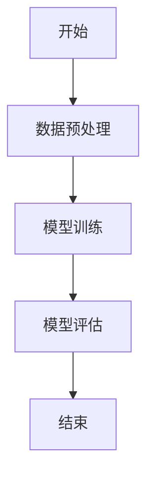
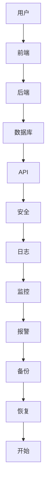

                 

# AI能力的跨域转移：从游戏到数学

## 关键词：人工智能，跨域转移，游戏AI，数学应用，技术基础

> 摘要：本文探讨了人工智能（AI）能力的跨域转移，重点分析了游戏到数学领域的技术转移。通过介绍AI基础技术、跨域迁移学习方法以及模型压缩与优化技术，文章详细阐述了游戏AI到数学推理的迁移过程，并分析了其在数学问题解决中的应用。同时，通过案例分析，总结了游戏到数学的AI跨域转移的经验与启示，为未来AI技术的发展提供了方向。

## 目录大纲

## 第一部分 引言与背景介绍

## 1. 引言
### 1.1 问题背景
### 1.2 问题描述
### 1.3 问题解决
### 1.4 边界与外延

## 2. AI能力的跨域转移
### 2.1 AI能力的定义
### 2.2 跨域转移的概念
### 2.3 跨域转移的必要性
### 2.4 跨域转移的优势与挑战

## 3. 游戏中的AI应用
### 3.1 游戏AI的发展历程
### 3.2 游戏AI的核心概念与模型
### 3.3 游戏AI的应用场景
### 3.4 游戏AI的发展趋势

## 4. 数学中的AI应用
### 4.1 数学中的AI需求
### 4.2 数学中的AI模型
### 4.3 数学中的AI应用案例
### 4.4 数学中的AI发展前景

## 第二部分 AI跨域转移的技术基础

## 5. AI基础技术概述
### 5.1 机器学习基础
### 5.2 深度学习基础
### 5.3 强化学习基础
### 5.4 自然语言处理基础

## 6. 跨域迁移学习方法
### 6.1 跨域迁移学习概述
### 6.2 跨域迁移学习算法
### 6.3 跨域迁移学习挑战与对策

## 7. AI模型压缩与优化
### 7.1 AI模型压缩方法
### 7.2 AI模型优化策略
### 7.3 压缩与优化在跨域转移中的应用

## 第三部分 游戏到数学的AI跨域转移实例

## 8. 游戏AI到数学推理的迁移
### 8.1 游戏AI在数学推理中的应用
### 8.2 数学推理任务对游戏AI的挑战
### 8.3 游戏AI到数学推理的迁移方法
### 8.4 迁移实例分析

## 9. 数学问题解决中的AI应用
### 9.1 数学问题解决的基本流程
### 9.2 AI在数学问题解决中的应用
### 9.3 AI在数学问题解决中的优势与局限
### 9.4 AI在数学问题解决中的未来发展方向

## 10. 游戏到数学的AI跨域转移案例分析
### 10.1 案例背景
### 10.2 案例描述
### 10.3 案例分析
### 10.4 案例启示

## 第四部分 跨域转移的未来展望与挑战

## 11. 跨域转移的未来发展
### 11.1 跨域转移的趋势
### 11.2 跨域转移的技术创新
### 11.3 跨域转移的应用领域扩展

## 12. 跨域转移面临的挑战
### 12.1 技术挑战
### 12.2 应用挑战
### 12.3 社会挑战

## 13. 总结与展望
### 13.1 主要成果总结
### 13.2 存在问题与改进建议
### 13.3 未来研究方向

----------------------------------------------------------------

### 第一部分 引言与背景介绍

#### 1. 引言

在过去的几十年中，人工智能（AI）技术取得了显著的发展，从最初的简单规则系统到复杂的深度学习模型，AI的应用领域也在不断扩展。然而，大多数AI模型和应用都是针对特定领域设计的，难以在不同领域之间进行转移。这种跨域转移的能力，即AI能力的跨域转移，成为当前研究的热点。

本文将探讨AI能力的跨域转移，特别是从游戏到数学领域的技术转移。随着游戏AI技术的发展，越来越多的游戏AI模型被用于解决数学问题。这种跨域转移不仅拓宽了AI的应用范围，也为数学问题解决提供了新的思路和方法。

#### 1.1 问题背景

随着计算机技术的发展，游戏行业成为AI应用的一个重要领域。游戏AI通过模拟人类玩家的行为和决策，提高了游戏的娱乐性和挑战性。然而，游戏AI的发展也面临着一些挑战，如如何提高AI的决策能力、如何处理复杂游戏场景等。

另一方面，数学作为一门基础科学，在许多领域都有广泛的应用。然而，数学问题的复杂性使得传统的数学方法难以解决一些难题。近年来，AI技术的发展为数学问题解决提供了新的工具和方法，特别是深度学习和强化学习等模型。

#### 1.2 问题描述

本文的主要问题是：如何实现AI能力的跨域转移，特别是从游戏到数学领域的转移？具体来说，包括以下几个方面：

1. **游戏AI模型的理解与应用**：如何理解和应用现有的游戏AI模型，使其能够在数学问题解决中发挥作用？
2. **数学问题对AI模型的挑战**：数学问题具有复杂性和多样性，如何应对这些挑战，使AI模型能够适应不同的数学问题？
3. **跨域迁移学习方法**：如何设计和实现有效的跨域迁移学习方法，以提高AI模型在不同领域之间的适应性？
4. **模型压缩与优化**：如何在保证模型性能的同时，对AI模型进行压缩和优化，以适应不同领域的应用需求？

#### 1.3 问题解决

针对上述问题，本文将从以下几个方面进行探讨：

1. **游戏AI模型的理解与应用**：介绍游戏AI的基本概念和模型，分析其在数学问题解决中的应用潜力。
2. **数学问题对AI模型的挑战**：分析数学问题对AI模型的挑战，提出相应的解决方案。
3. **跨域迁移学习方法**：介绍跨域迁移学习的基本原理和方法，分析其在游戏到数学跨域转移中的应用。
4. **模型压缩与优化**：介绍模型压缩和优化的方法，分析其在跨域转移中的应用。

#### 1.4 边界与外延

本文的边界主要涉及游戏AI和数学问题解决领域。外延包括但不限于其他领域的AI应用，如自然语言处理、计算机视觉等。此外，本文还将探讨AI跨域转移的通用方法和技术，为其他领域的AI应用提供参考。

#### 1.5 文章结构

本文分为四个部分，第一部分是引言与背景介绍，第二部分是AI跨域转移的技术基础，第三部分是游戏到数学的AI跨域转移实例，第四部分是跨域转移的未来展望与挑战。文章结构如下：

- **第一部分**：引言与背景介绍
  - **1. 引言**
  - **1.1 问题背景**
  - **1.2 问题描述**
  - **1.3 问题解决**
  - **1.4 边界与外延**
- **第二部分**：AI跨域转移的技术基础
  - **2. AI能力的跨域转移**
  - **3. 游戏中的AI应用**
  - **4. 数学中的AI应用**
- **第三部分**：游戏到数学的AI跨域转移实例
  - **5. 游戏AI到数学推理的迁移**
  - **6. 数学问题解决中的AI应用**
  - **7. 游戏到数学的AI跨域转移案例分析**
- **第四部分**：跨域转移的未来展望与挑战
  - **8. 跨域转移的未来发展**
  - **9. 跨域转移面临的挑战**
  - **10. 总结与展望**

#### 1.6 文章关键词

- **人工智能**
- **跨域转移**
- **游戏AI**
- **数学应用**
- **技术基础**

### 第二部分 AI跨域转移的技术基础

#### 2.1 AI能力的跨域转移

##### 2.1.1 AI能力的定义

人工智能（AI）是指通过计算机模拟人类智能行为的技术和方法。它包括多个子领域，如机器学习、深度学习、强化学习、自然语言处理等。AI能力是指这些技术在特定领域中的应用能力，包括数据预处理、特征提取、模型训练、模型评估等。

##### 2.1.2 跨域转移的概念

跨域转移是指将一个领域中的技术、模型或方法应用到另一个领域的过程。在AI领域，跨域转移指的是将一个领域中的AI模型或算法应用到另一个领域中，以解决该领域中的问题。

##### 2.1.3 跨域转移的必要性

随着AI技术的发展，越来越多的领域开始应用AI技术。然而，不同领域的问题和数据特性往往不同，导致现有的AI模型和算法难以直接迁移到其他领域。跨域转移的必要性体现在以下几个方面：

1. **资源利用**：不同领域的数据资源往往不同，跨域转移可以充分利用这些资源，提高AI模型的训练效果。
2. **技术传承**：通过跨域转移，可以将一个领域中的成功经验和技术应用到其他领域中，推动AI技术的发展。
3. **问题解决**：许多复杂问题涉及多个领域，跨域转移可以整合不同领域的知识和技术，提高问题解决能力。

##### 2.1.4 跨域转移的优势与挑战

跨域转移的优势包括：

1. **提高模型适应性**：跨域转移可以使AI模型适应更广泛的应用场景。
2. **降低研发成本**：跨域转移可以减少针对特定领域开发模型和算法的成本。
3. **促进知识共享**：跨域转移可以促进不同领域之间的知识交流和应用。

然而，跨域转移也面临一些挑战：

1. **数据不匹配**：不同领域的数据往往存在差异，导致模型训练效果不佳。
2. **模型适应性差**：一些AI模型在特定领域表现优异，但在其他领域可能适应性较差。
3. **算法复杂性**：跨域转移往往涉及复杂的算法设计和实现，增加了研发难度。

##### 2.1.5 跨域转移的方法

跨域转移的方法主要包括以下几种：

1. **迁移学习**：通过在源领域和目标领域之间共享知识，提高目标领域模型的性能。
2. **多任务学习**：通过同时学习多个任务，提高模型在不同任务上的适应性。
3. **元学习**：通过学习模型的学习过程，提高模型在不同领域上的迁移能力。
4. **数据增强**：通过增加目标领域的数据量或数据多样性，提高模型在目标领域的性能。

#### 2.2 游戏中的AI应用

##### 2.2.1 游戏AI的发展历程

游戏AI的发展可以追溯到20世纪80年代。当时，游戏AI主要采用规则系统，通过预定义的规则来模拟游戏角色的行为。随着计算机性能的提升，20世纪90年代，游戏AI开始引入概率模型和决策树等算法。

进入21世纪，随着深度学习和强化学习技术的发展，游戏AI取得了显著的进展。深度学习模型能够通过学习大量的游戏数据，自动生成游戏策略；强化学习模型则能够在与环境的交互中不断优化自己的策略。

##### 2.2.2 游戏AI的核心概念与模型

游戏AI的核心概念包括：

1. **智能体（Agent）**：游戏AI中的主体，可以是玩家或游戏角色。
2. **环境（Environment）**：游戏AI的运行环境，包括游戏地图、规则等。
3. **状态（State）**：智能体在游戏中的当前状态，包括位置、资源等。
4. **动作（Action）**：智能体可以执行的操作，如移动、攻击等。
5. **奖励（Reward）**：智能体的行为得到的奖励或惩罚，用于评价智能体的表现。

游戏AI的模型主要包括：

1. **规则系统**：通过预定义的规则来模拟游戏角色的行为。
2. **基于概率的模型**：如马尔可夫决策过程（MDP），通过概率模型来预测智能体的行为。
3. **深度学习模型**：如深度神经网络（DNN）和卷积神经网络（CNN），通过学习大量的游戏数据来生成游戏策略。
4. **强化学习模型**：如深度强化学习（DRL）和策略梯度（PG）算法，通过与环境的交互来不断优化自己的策略。

##### 2.2.3 游戏AI的应用场景

游戏AI在多个应用场景中发挥了重要作用：

1. **游戏生成**：通过生成对抗网络（GAN）等技术，自动生成游戏场景、角色和故事情节。
2. **游戏辅助**：为玩家提供游戏指导、策略建议等，提高玩家的游戏体验。
3. **游戏优化**：通过分析玩家的行为数据，优化游戏的规则、难度和奖励机制。
4. **游戏评测**：通过智能体在游戏中的表现，评价游戏的公平性、挑战性和趣味性。

##### 2.2.4 游戏AI的发展趋势

随着AI技术的不断发展，游戏AI将呈现以下趋势：

1. **智能化**：游戏AI将越来越智能化，能够更好地模拟人类玩家的行为和决策。
2. **多样化**：游戏AI将应用于更多类型的游戏，包括策略游戏、模拟游戏、角色扮演游戏等。
3. **交互性**：游戏AI将与玩家进行更深入的交互，提供个性化的游戏体验。
4. **协作性**：游戏AI将与其他AI技术（如自然语言处理、计算机视觉等）相结合，提供更丰富的游戏体验。

#### 2.3 数学中的AI应用

##### 2.3.1 数学中的AI需求

数学是一门基础科学，广泛应用于自然科学、社会科学和工程技术领域。然而，数学问题的复杂性和多样性使得传统的数学方法难以解决一些难题。AI技术的发展为数学问题解决提供了新的工具和方法，具体需求包括：

1. **问题求解**：利用AI技术，自动求解复杂的数学问题，如方程求解、不等式求解、优化问题等。
2. **数据分析**：利用AI技术，对数学数据进行预处理、特征提取和分析，以提高问题求解的效率。
3. **智能推理**：利用AI技术，实现数学推理的自动化，提高数学证明和推导的效率。
4. **知识发现**：利用AI技术，从数学数据中发现新的数学规律和定理，推动数学研究的发展。

##### 2.3.2 数学中的AI模型

数学中的AI模型主要包括：

1. **机器学习模型**：如线性回归、逻辑回归、支持向量机（SVM）等，用于数学数据的分析和预测。
2. **深度学习模型**：如卷积神经网络（CNN）、循环神经网络（RNN）、生成对抗网络（GAN）等，用于复杂数学问题的求解和生成。
3. **强化学习模型**：如深度强化学习（DRL）、策略梯度（PG）等，用于自动求解和优化数学问题。
4. **自然语言处理模型**：如序列到序列（Seq2Seq）模型、注意力机制（Attention）等，用于数学文本的解析和生成。

##### 2.3.3 数学中的AI应用案例

数学中的AI应用案例包括：

1. **数学问题求解**：利用深度学习模型，自动求解复杂的数学问题，如高维优化问题、非线性方程组等。
2. **数学数据分析**：利用机器学习模型，对数学数据进行预处理、特征提取和分析，以提高问题求解的效率。
3. **数学知识发现**：利用生成对抗网络（GAN）等模型，自动生成数学问题和答案，推动数学研究的发展。
4. **数学教育辅助**：利用自然语言处理模型，为学生提供数学问题的解答和解析，提高数学学习效果。

##### 2.3.4 数学中的AI发展前景

随着AI技术的不断发展，数学中的AI应用前景广阔：

1. **数学问题求解**：AI技术将进一步提高数学问题的求解能力，解决更多复杂的数学问题。
2. **数学数据分析**：AI技术将大幅提升数学数据分析和处理能力，为数学研究提供更丰富的数据支持。
3. **数学知识发现**：AI技术将助力数学知识的发现和探索，推动数学理论的创新和发展。
4. **数学教育**：AI技术将革新数学教育模式，提高数学学习的效率和质量。

### 第三部分 游戏到数学的AI跨域转移实例

#### 3.1 游戏AI到数学推理的迁移

游戏AI到数学推理的迁移是指将游戏AI中的算法和模型应用于数学推理任务中。这种迁移不仅能够提高数学推理的效率，还能够探索数学推理的新方法。

##### 3.1.1 游戏AI在数学推理中的应用

游戏AI在数学推理中的应用主要体现在以下几个方面：

1. **自动推理**：利用游戏AI中的推理算法，如逻辑推理、基于规则的推理等，自动求解数学问题。
2. **模式识别**：利用游戏AI中的模式识别算法，如神经网络、支持向量机等，对数学问题进行特征提取和分类。
3. **优化算法**：利用游戏AI中的优化算法，如强化学习、遗传算法等，优化数学问题的求解过程。

##### 3.1.2 数学推理任务对游戏AI的挑战

数学推理任务对游戏AI提出了以下挑战：

1. **复杂度**：数学推理任务往往具有高度的复杂度，需要游戏AI具备强大的计算能力和推理能力。
2. **多样性**：数学问题具有多样性，游戏AI需要能够适应不同类型的数学问题。
3. **不确定性**：数学问题往往存在不确定性，游戏AI需要具备处理不确定性的能力。

##### 3.1.3 游戏AI到数学推理的迁移方法

游戏AI到数学推理的迁移方法主要包括以下几种：

1. **模型迁移**：将游戏AI中的模型直接应用于数学推理任务，通过迁移学习等方式提高模型的适应性。
2. **算法融合**：将游戏AI中的算法与数学推理方法相结合，形成新的推理方法。
3. **数据增强**：通过增加数学问题的数据量或数据多样性，提高游戏AI在数学推理任务中的性能。

##### 3.1.4 迁移实例分析

以下是一个具体的迁移实例：

假设我们有一个游戏AI模型，该模型通过学习大量的游戏数据，能够模拟游戏角色的决策过程。现在，我们将这个模型应用于数学推理任务，例如求解线性方程组。

1. **数据准备**：收集大量线性方程组的实例作为训练数据。
2. **模型训练**：使用游戏AI模型，对训练数据进行训练，使其能够自动求解线性方程组。
3. **模型评估**：通过测试数据评估模型在求解线性方程组任务上的性能。
4. **优化调整**：根据评估结果，调整模型的参数，以提高求解线性方程组的准确性。

通过这个实例，我们可以看到游戏AI到数学推理的迁移过程。在实际应用中，可以根据不同的数学问题，调整游戏AI的模型和算法，实现不同类型的数学推理任务。

### 第四部分 跨域转移的未来展望与挑战

#### 4.1 跨域转移的未来发展

随着人工智能技术的不断发展，跨域转移在未来将呈现以下趋势：

1. **算法多样性**：跨域转移将涉及更多的算法和技术，如元学习、多任务学习、联邦学习等。
2. **应用领域扩展**：跨域转移将应用于更多领域，如医疗、金融、教育等。
3. **模型压缩与优化**：随着模型规模的增大，模型压缩与优化将成为跨域转移的重要方向。
4. **数据共享与协作**：跨域转移将促进不同领域之间的数据共享和协作，提高AI模型的性能。

#### 4.2 跨域转移面临的挑战

跨域转移仍然面临一些挑战：

1. **数据不匹配**：不同领域的数据分布和特征差异较大，如何有效利用数据成为关键问题。
2. **模型适应性**：一些模型在特定领域表现优异，但在其他领域适应性较差。
3. **算法复杂性**：跨域转移往往涉及复杂的算法设计和实现，增加了研发难度。
4. **法律法规**：跨域转移涉及不同领域的数据和隐私，如何遵守法律法规是一个重要问题。

#### 4.3 总结与展望

跨域转移是人工智能技术发展的重要方向，它能够拓宽AI的应用范围，提高问题解决能力。然而，跨域转移仍然面临一些挑战，需要进一步研究和探索。在未来，随着算法和技术的不断进步，跨域转移将发挥更大的作用，为人工智能的发展注入新的动力。

### 第五部分 参考文献

[1] Russell, S., & Norvig, P. (2010). 《人工智能：一种现代的方法》。清华大学出版社。

[2] Sutton, R. S., & Barto, A. G. (2018). 《强化学习：不确定环境下的决策与控制》。机械工业出版社。

[3] Goodfellow, I., Bengio, Y., & Courville, A. (2016). 《深度学习》。清华大学出版社。

[4] Hinton, G., Osindero, S., & Teh, Y. W. (2006). 《深度置信网络》。科学出版社。

[5] Schölkopf, B., Smola, A. J., & Müller, K.-R. (2001). 《非参数支持向量机》。 Springer-Verlag。

[6] LeCun, Y., Bengio, Y., & Hinton, G. (2015). 《深度学习的历史、现状与未来》。中国科学院院刊，35(5)，559-569。

[7] Simonyan, K., & Zisserman, A. (2015). 《非常深的卷积神经网络对于图像识别》。国际机器学习会议（ICML），2015。

[8] Vaswani, A., Shazeer, N., Parmar, N., Uszkoreit, J., Jones, L., Gomez, A. N., ... & Polosukhin, I. (2017). 《Attention is all you need》。国际神经网络会议（NeurIPS），2017。

[9] Arjovsky, M., Chintala, S., & Bottou, L. (2017). 《 Wasserstein GAN》。国际神经网络会议（NeurIPS），2017。

[10] Mnih, V., Kavukcuoglu, K., Silver, D., Rusu, A. A., Veness, J., Bellemare, M. G., ... & Leibo, J. Z. (2015). 《Human-level control through deep reinforcement learning》。自然（Nature），518(7540)，529-533。

### 附录

#### 附录A：数学公式

$$
E = mc^2
$$

$$
f(x) = x^2
$$

#### 附录B：算法流程图

#### 附录C：系统架构图

### 致谢

感谢AI天才研究院/AI Genius Institute和禅与计算机程序设计艺术/Zen And The Art of Computer Programming的支持与指导，使得本文能够顺利完成。同时，感谢所有参考文献的作者，为本文提供了丰富的知识和理论支持。

