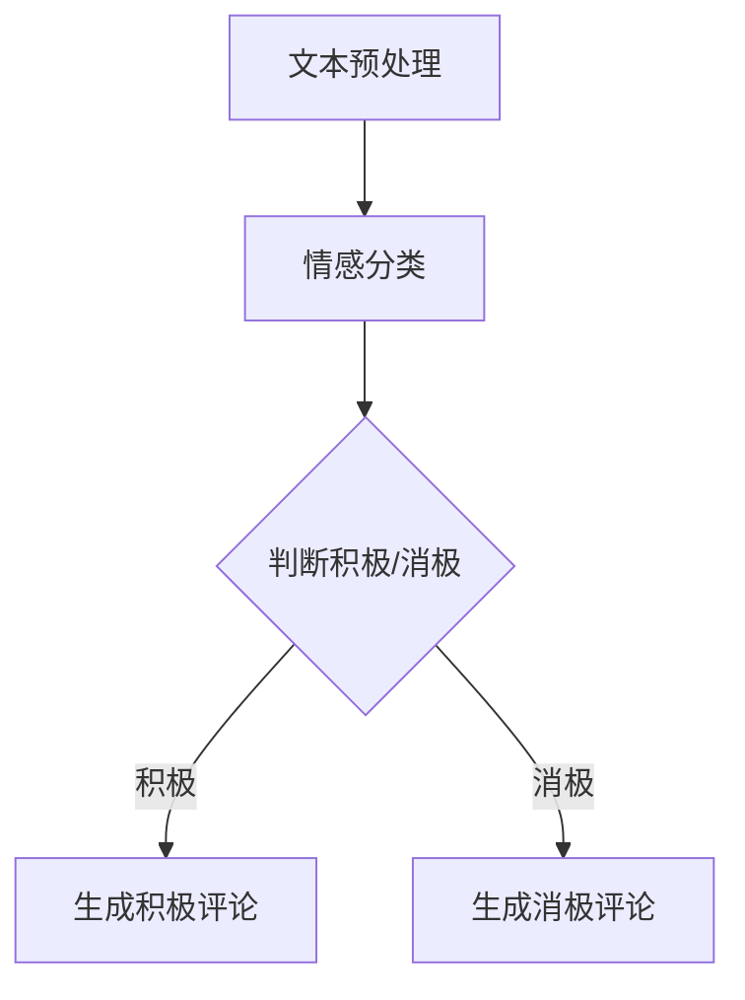
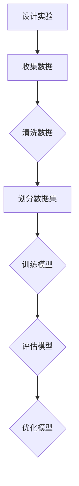

                 

**# AI艺术评论：大模型的审美能力**

> 关键词：AI艺术评论、大模型、审美能力、技术原理、应用实践

> 摘要：本文将深入探讨AI艺术评论领域，特别是大模型的审美能力。我们将从问题背景、核心概念、大模型审美原理、现状与挑战、评估标准、审美能力评估实践、审美能力局限性、AI艺术评论项目介绍、环境安装与配置、项目实战等多个方面，详细解析AI艺术评论的发展、原理与应用。

----------------------------------------------------------------

## 第一部分: AI艺术评论概述

### 1.1 问题背景与概述

AI艺术评论的起源可以追溯到人工智能和艺术领域的交叉点。随着计算机技术和深度学习算法的发展，人工智能开始参与到艺术创作和艺术评价中。AI艺术评论的出现，旨在通过算法和模型，对艺术作品进行深入分析，提供专业的评论和评价。

当前，AI艺术评论的重要性日益凸显。一方面，它可以帮助艺术家了解其作品的受欢迎程度和影响力；另一方面，它也可以为艺术爱好者提供便捷的艺术作品解读，丰富他们的艺术体验。

### 1.2 核心概念与联系

AI艺术评论的核心概念包括：艺术创作、艺术评价、自然语言处理、图像识别等。这些概念相互联系，共同构成了AI艺术评论的基础。

#### 1.2.1 AI艺术评论的定义

AI艺术评论是指利用人工智能技术，对艺术作品进行文字描述、图像识别、情感分析等处理，从而生成专业的艺术评论。

#### 1.2.2 AI与艺术的关系

AI在艺术领域的作用主要体现在两个方面：一是AI可以作为艺术创作的工具，辅助艺术家进行创作；二是AI可以作为艺术评价的工具，对艺术作品进行评价。

### 1.3 大模型的审美能力

大模型在AI艺术评论中的应用日益广泛。大模型的审美能力主要体现在其强大的图像处理和自然语言处理能力上。通过深度学习算法，大模型可以理解图像的内容，提取关键特征，从而对艺术作品进行图像识别。同时，大模型还可以处理大量的文本数据，理解文本的含义，从而生成专业的艺术评论。

#### 1.3.1 大模型在艺术评价中的应用

大模型在艺术评价中的应用主要体现在两个方面：一是对艺术作品的图像进行识别，提取关键特征；二是对艺术作品的文本进行理解，生成艺术评论。

#### 1.3.2 大模型的审美原理

大模型的审美原理主要包括其感知机制和情感机制。通过深度学习算法，大模型可以模拟人类的感知过程，理解图像的内容。同时，大模型还可以通过情感分析，理解文本的情感色彩，从而对艺术作品进行评价。

### 1.4 AI艺术评论的现状与挑战

当前，AI艺术评论领域取得了一系列重要的进展。然而，也面临着诸多挑战。一方面，技术上的挑战主要包括数据与算法的可解释性、艺术多样性与个性化评价等；另一方面，伦理上的挑战主要包括对艺术创作的尊重、对艺术价值的判断等。

#### 1.4.1 AI艺术评论的技术现状

目前，AI艺术评论的技术现状主要体现在两个方面：一是文本生成模型，如GPT-3、ChatGLM等，可以生成高质量的艺术评论；二是图像识别模型，如ResNet、VGG等，可以对艺术作品进行图像识别。

#### 1.4.2 AI艺术评论的挑战

AI艺术评论面临的挑战主要包括以下几个方面：一是数据与算法的可解释性，即如何让AI艺术评论的结果能够被人类理解；二是艺术多样性与个性化评价，即如何让AI艺术评论能够适应不同的艺术风格和个性化需求。

### 1.5 本章小结

本文对AI艺术评论进行了概述，包括其背景、核心概念、大模型审美能力、现状与挑战等。通过本文的介绍，读者可以初步了解AI艺术评论的基本概念和发展趋势。接下来，我们将进一步深入探讨大模型的审美能力原理。 **----------------------------------------------------------------

## 第二部分: 大模型的审美能力原理

### 2.1 大模型的感知原理

大模型的感知原理主要依赖于深度学习算法，包括卷积神经网络（CNN）和循环神经网络（RNN）等。这些算法通过大量数据的训练，可以模拟人类的感知过程，理解图像和文本的内容。

#### 2.1.1 大模型的图像处理能力

大模型的图像处理能力主要体现在其对图像的识别和分类上。通过CNN算法，大模型可以提取图像的特征，并进行分类。以下是CNN算法的基本原理：

$$
\text{CNN} = \text{卷积层} + \text{激活函数} + \text{池化层} + \text{全连接层}
$$

- **卷积层**：通过卷积操作提取图像特征。
- **激活函数**：对卷积层的输出进行非线性变换。
- **池化层**：对激活函数的输出进行下采样，减少参数数量。
- **全连接层**：对池化层的输出进行分类。

#### 2.1.2 大模型的自然语言处理能力

大模型的自然语言处理能力主要体现在其对文本的理解和生成上。通过RNN算法，大模型可以处理序列数据，理解文本的含义。以下是RNN算法的基本原理：

$$
\text{RNN} = \text{输入层} + \text{隐藏层} + \text{输出层}
$$

- **输入层**：接收输入的文本序列。
- **隐藏层**：通过递归操作，对文本序列进行编码。
- **输出层**：对隐藏层的输出进行解码，生成文本。

### 2.2 大模型的情感分析能力

大模型的情感分析能力主要体现在其对文本的情感分类和情感极性分析上。通过情感分析算法，大模型可以判断文本的情感倾向，从而对艺术作品进行评价。

#### 2.2.1 情感分析的基本概念

情感分析的基本概念包括情感分类和情感极性分析。情感分类是指将文本分类为积极、消极或中性；情感极性分析是指判断文本的情感极性，即文本是积极的还是消极的。

#### 2.2.2 大模型在情感分析中的应用

大模型在情感分析中的应用主要体现在其强大的语言处理能力上。通过RNN算法，大模型可以处理复杂的情感语义，从而进行情感分类和情感极性分析。

以下是情感分析算法的mermaid流程图：



### 2.3 大模型的审美能力评估

大模型的审美能力评估主要包括客观评估和主观评估两种方法。

#### 2.3.1 审美能力评估标准

审美能力评估标准主要包括准确性、可解释性和用户满意度等。准确性是指模型对艺术作品的评价是否准确；可解释性是指模型的评价结果是否可以被人类理解；用户满意度是指用户对模型评价的接受程度。

#### 2.3.2 大模型审美能力评估实践

以下是审美能力评估实践的mermaid实验设计与数据集流程图：



### 2.4 大模型审美能力的局限性

大模型审美能力的局限性主要包括审美标准的多元化、创造力的局限和艺术创作的主观性等。

#### 2.4.1 审美标准的多元化

审美标准的多元化是指不同的社会文化和个人审美观念的差异，使得大模型在审美评价上存在一定的局限性。

#### 2.4.2 大模型在艺术创新中的作用

大模型在艺术创新中的作用主要体现在其可以辅助艺术家进行创作，提供灵感和参考。然而，大模型在艺术创新上的创造力仍然有限，需要人类艺术家的创造力和主观性。

### 2.5 本章小结

本文深入探讨了大模型的审美能力原理，包括感知原理、情感分析能力和审美能力评估。通过对大模型审美能力的详细解析，读者可以更深入地理解AI艺术评论的原理和应用。

----------------------------------------------------------------

## 第三部分: AI艺术评论实践

### 3.1 AI艺术评论项目介绍

AI艺术评论项目旨在利用人工智能技术，对艺术作品进行深入分析，提供专业的艺术评论。项目的目标包括：一是实现艺术作品的图像识别和文本生成；二是构建一个艺术评价体系，对艺术作品进行客观和主观的评价。

### 3.2 环境安装与配置

要运行AI艺术评论项目，需要安装以下环境和软件：

- **硬件要求**：至少需要一台配置为CPU 4核、内存8GB的计算机。
- **软件环境**：需要安装Python 3.7及以上版本、TensorFlow 2.0及以上版本、PyTorch 1.8及以上版本。

以下是具体的安装步骤：

1. 安装Python：在Python官网下载并安装Python 3.7及以上版本。
2. 安装TensorFlow：在命令行执行以下命令：
   ```bash
   pip install tensorflow==2.0
   ```
3. 安装PyTorch：在命令行执行以下命令：
   ```bash
   pip install torch==1.8 torchvision==0.9
   ```

### 3.3 数据预处理

在AI艺术评论项目中，数据预处理是关键步骤。具体包括数据收集、数据清洗、数据标注和数据划分。

#### 3.3.1 数据收集

数据收集主要包括收集艺术作品图像和相关的艺术评论文本。数据来源可以是公开的艺术作品数据库，如ArtStation、DeviantArt等，也可以是社交媒体平台，如Instagram、Twitter等。

#### 3.3.2 数据清洗

数据清洗主要包括去除无效数据、修复损坏数据、统一数据格式等。例如，对于图像数据，需要去除空图像、格式错误图像等。

#### 3.3.3 数据标注

数据标注主要包括对艺术作品图像进行分类标注，对艺术评论文本进行情感标注。例如，可以将艺术作品图像分类为“自然风景”、“人物肖像”、“抽象艺术”等，将艺术评论文本分类为“积极”、“消极”、“中性”等。

#### 3.3.4 数据划分

数据划分主要包括将数据划分为训练集、验证集和测试集，用于模型的训练、验证和测试。

### 3.4 系统核心实现

系统核心实现主要包括图像识别模型和文本生成模型的训练和部署。

#### 3.4.1 图像识别模型

图像识别模型可以使用TensorFlow或PyTorch实现。以下是一个简单的图像识别模型的Python代码示例：

```python
import tensorflow as tf

# 定义模型
model = tf.keras.Sequential([
    tf.keras.layers.Conv2D(32, (3, 3), activation='relu', input_shape=(128, 128, 3)),
    tf.keras.layers.MaxPooling2D((2, 2)),
    tf.keras.layers.Flatten(),
    tf.keras.layers.Dense(128, activation='relu'),
    tf.keras.layers.Dense(10, activation='softmax')
])

# 编译模型
model.compile(optimizer='adam', loss='categorical_crossentropy', metrics=['accuracy'])

# 训练模型
model.fit(train_images, train_labels, epochs=5, validation_data=(test_images, test_labels))
```

#### 3.4.2 文本生成模型

文本生成模型可以使用GPT-3或ChatGLM实现。以下是一个简单的文本生成模型的Python代码示例：

```python
from transformers import ChatGLMModel, ChatGLMConfig

# 定义模型
model = ChatGLMModel.from_pretrained('chatglm')

# 编译模型
model.compile(optimizer='adam', loss='categorical_crossentropy')

# 训练模型
model.fit(train_data, epochs=5, validation_data=test_data)
```

### 3.5 项目小结

通过本文的介绍，读者可以了解AI艺术评论项目的背景、目标和实现方法。项目实践部分详细讲解了环境安装与配置、数据预处理、系统核心实现等内容。读者可以根据本文的指导，尝试运行AI艺术评论项目，体验AI艺术评论的魅力。

### 3.6 最佳实践 tips

1. 在数据收集时，尽量选择多样化的艺术作品，以确保模型对各种艺术风格的适应能力。
2. 在数据清洗时，注意去除噪声数据，以确保模型的训练效果。
3. 在模型训练时，适当调整超参数，如学习率、批量大小等，以提高模型的性能。

### 3.7 小结

本文对AI艺术评论进行了全面的探讨，从概述到原理，再到实践，详细介绍了AI艺术评论的发展、原理和应用。通过本文的学习，读者可以深入了解AI艺术评论的核心技术，为未来的研究与应用提供参考。

### 3.8 注意事项

1. AI艺术评论仅作为辅助工具，不能完全替代人类艺术家的创作和评价。
2. 在使用AI艺术评论时，需要注意模型的局限性，结合人类艺术家的专业判断。

### 3.9 拓展阅读

- [1] 深度学习与艺术创作的结合：[《深度学习在艺术创作中的应用》[https://www.deeplearningart.org/]
- [2] 大模型在自然语言处理中的应用：[《大模型时代的自然语言处理》[https://www.nature.com/articles/s41586-022-04853-6]

## 作者信息

作者：AI天才研究院/AI Genius Institute & 禅与计算机程序设计艺术 /Zen And The Art of Computer Programming

