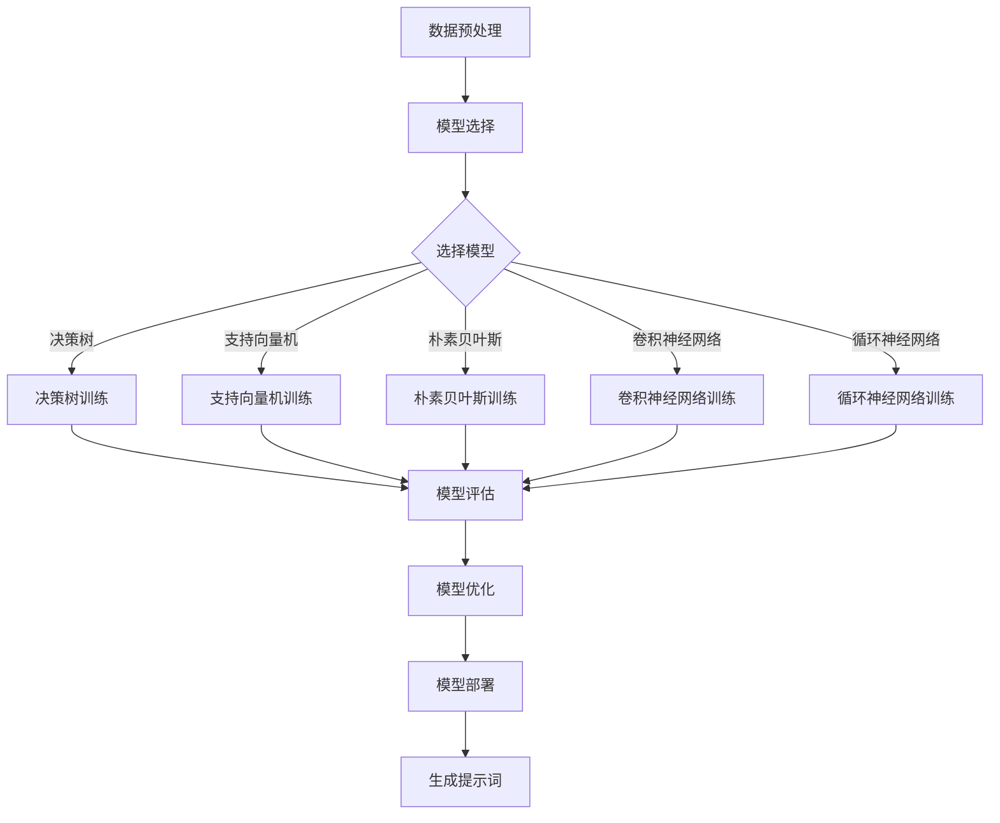
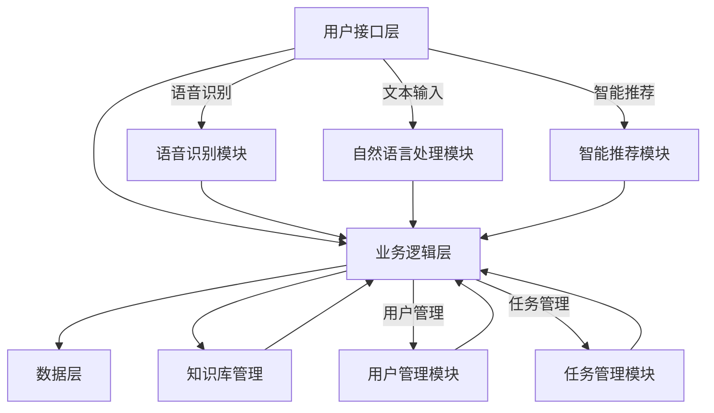
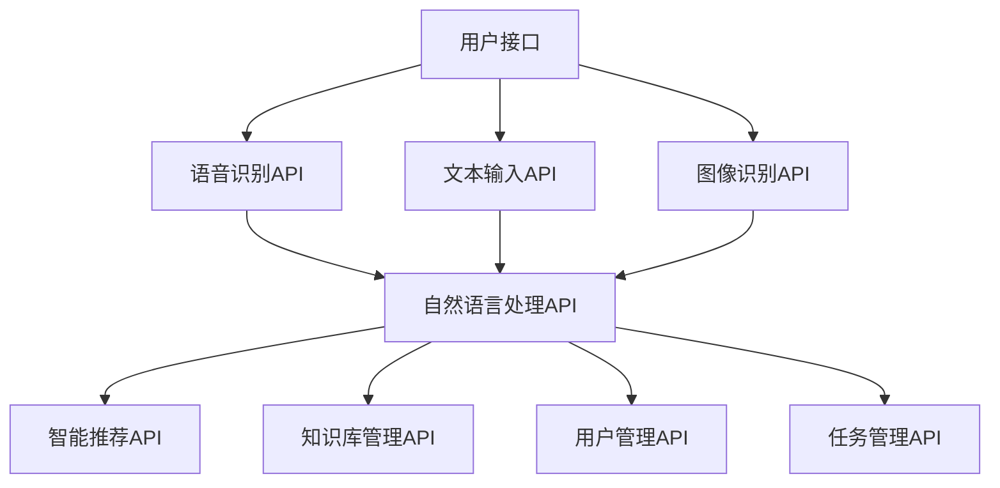
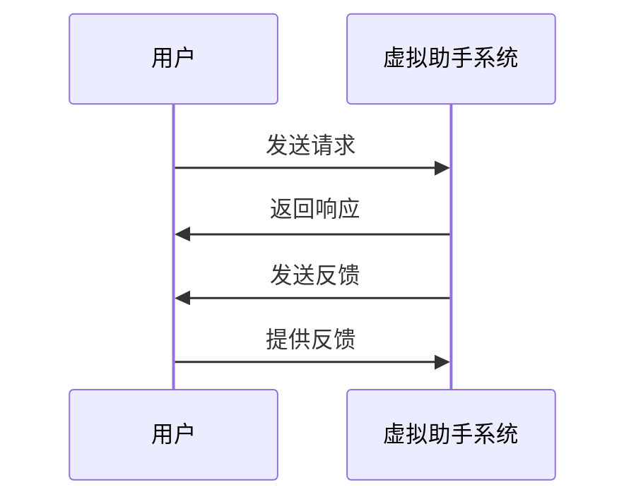
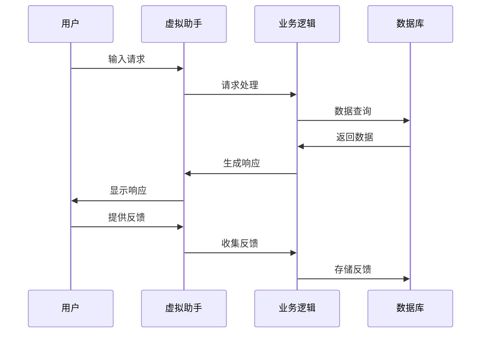

                 

### AI虚拟助手：提示词设计的人性化

#### 关键词

- **人工智能虚拟助手**
- **提示词设计**
- **人性化交互**
- **用户需求分析**
- **适应性原则**
- **可理解性原则**
- **引导性原则**
- **互动性原则**

#### 摘要

本文深入探讨了人工智能虚拟助手中的提示词设计，强调人性化交互的重要性。首先，通过背景介绍和核心概念阐述，明确虚拟助手和提示词的基本概念及设计目标。接着，通过用户需求分析和提示词设计原则的介绍，帮助读者理解设计过程的逻辑和原则。随后，通过案例分析，展示不同领域虚拟助手的提示词设计实践，并评估其效果。本文还详细介绍了提示词生成算法和虚拟助手系统架构设计，最后通过项目实战，提供了实际操作和实战经验。通过本文的阅读，读者将对AI虚拟助手的提示词设计有更深入的理解和实用的技能。

---

## 第一部分：背景介绍

### 第1章 问题背景与核心概念

#### 1.1 人工智能虚拟助手的发展现状

人工智能虚拟助手是人工智能技术在自然语言处理、语音识别和机器学习等领域的集成应用，旨在通过模拟人类交流行为，提供便捷、高效的信息查询和辅助服务。自20世纪90年代以来，随着计算能力的提升和数据量的爆炸式增长，虚拟助手逐渐从实验室走向实际应用。

目前，市场上的虚拟助手类型多样，主要包括以下几类：

1. **智能语音助手**：如苹果的Siri、亚马逊的Alexa、谷歌的Google Assistant等，主要依赖语音交互，为用户提供信息查询、语音控制家电、日程管理等服务。
2. **文本聊天机器人**：如微软的微软小冰、百度的小度等，主要通过文本交互，为用户提供在线客服、信息查询、情感陪伴等服务。
3. **综合型虚拟助手**：如苹果的iRobot、谷歌的Google Lens等，结合语音和视觉识别技术，提供更丰富的交互体验。

这些虚拟助手在各自的应用领域中取得了显著的效果，但仍然面临着诸多挑战，例如如何提高自然语言处理能力、如何更好地理解用户需求、如何提供个性化服务等。

#### 1.2 提示词在虚拟助手中的作用

提示词是虚拟助手与用户之间交互的关键媒介，其作用主要体现在以下几个方面：

1. **引导用户**：通过提供适当的提示词，虚拟助手可以引导用户进行有效的信息查询和操作，提高交互效率。
2. **信息收集**：提示词可以帮助虚拟助手更好地理解用户意图，收集到更准确、全面的信息，从而提供更精准的服务。
3. **反馈机制**：提示词的设计和反馈机制的设置，有助于虚拟助手了解用户满意度，收集用户反馈，不断优化自身性能。

#### 1.3 问题解决与边界界定

虚拟助手面临的挑战主要集中在以下几个方面：

1. **自然语言理解**：如何准确理解用户的自然语言查询，是虚拟助手需要解决的核心问题。
2. **个性化服务**：如何根据用户的需求和偏好，提供个性化的服务，是虚拟助手需要探索的方向。
3. **用户满意度**：如何提高用户满意度，是虚拟助手持续优化的重要目标。

提示词设计的目标和边界包括：

1. **目标**：设计具有适应性、可理解性、引导性和互动性的提示词，提高用户交互体验。
2. **边界**：在保证提示词有效性的前提下，避免过度干扰用户的正常操作，确保系统的稳定性和可靠性。

#### 1.4 核心概念结构

虚拟助手提示词设计的核心概念结构包括：

1. **用户需求分析**：通过用户行为模式分析、用户需求层次模型和用户画像构建，深入了解用户需求。
2. **提示词设计原则**：包括适应性原则、可理解性原则、引导性原则和互动性原则，为提示词设计提供指导。
3. **算法原理与系统架构**：介绍提示词生成算法和虚拟助手系统架构设计，为实践提供理论基础。

#### 1.5 本书的结构安排与内容组织

本书结构安排如下：

1. **第一部分：背景介绍**：介绍虚拟助手和提示词设计的基本概念、问题和挑战。
2. **第二部分：核心概念与联系**：深入分析用户需求、提示词设计原则，并通过案例分析展示实践应用。
3. **第三部分：算法原理与系统架构**：详细讲解提示词生成算法和虚拟助手系统架构设计。
4. **第四部分：项目实战**：通过实际项目操作，提供具体的提示词设计和虚拟助手开发经验。

通过本书的阅读，读者将能够深入了解AI虚拟助手提示词设计的人性化，掌握相关理论和实践技能，为开发高效、智能的虚拟助手提供有力支持。

### 第2章 提示词设计原理

#### 2.1 用户需求分析

用户需求分析是虚拟助手提示词设计的首要任务，只有深入了解用户的需求，才能设计出符合用户预期的提示词。以下是用户需求分析的主要步骤和方法：

##### 2.1.1 用户行为模式分析

用户行为模式分析是通过对用户在虚拟助手使用过程中的行为数据进行分析，了解用户的行为习惯和偏好。具体方法包括：

1. **数据分析**：收集用户在使用虚拟助手时的交互数据，如查询次数、查询时长、查询内容等，通过数据分析，发现用户的行为模式。
2. **行为模型构建**：基于数据分析结果，构建用户行为模型，如用户查询偏好模型、用户操作习惯模型等。
3. **行为预测**：利用行为模型，预测用户未来的行为，为提示词设计提供依据。

##### 2.1.2 用户需求层次模型

用户需求层次模型是根据马斯洛的需求层次理论，将用户需求分为生理需求、安全需求、社交需求、尊重需求和自我实现需求。虚拟助手提示词设计需要考虑不同层次的用户需求：

1. **生理需求**：如获取天气信息、交通信息等，提示词设计应简洁明了，快速满足用户的基本需求。
2. **安全需求**：如健康咨询、安全警告等，提示词设计应确保信息的准确性和权威性，为用户提供安全感。
3. **社交需求**：如社交互动、娱乐咨询等，提示词设计应注重情感交流，提升用户体验。
4. **尊重需求**：如尊重用户隐私、礼貌用语等，提示词设计应体现对用户的尊重。
5. **自我实现需求**：如职业规划、学习辅导等，提示词设计应帮助用户实现个人成长和自我提升。

##### 2.1.3 用户画像构建

用户画像是指对用户基本特征、行为习惯、兴趣爱好等方面的描述，是虚拟助手个性化服务的基础。用户画像的构建方法包括：

1. **数据收集**：通过用户注册信息、行为数据、社交数据等渠道收集用户数据。
2. **特征提取**：对收集到的用户数据进行处理，提取用户的基本特征、行为习惯、兴趣爱好等。
3. **画像构建**：利用数据挖掘和机器学习技术，构建用户画像，实现对用户的精准描述。

#### 2.2 提示词设计原则

提示词设计原则是指导虚拟助手提示词设计的核心原则，主要包括适应性原则、可理解性原则、引导性原则和互动性原则：

##### 2.2.1 适应性原则

适应性原则是指提示词应具备灵活性和适应性，能够根据不同的用户需求和应用场景进行调整。具体包括：

1. **个性化定制**：根据用户画像，提供个性化的提示词，满足用户的个性化需求。
2. **场景适应**：根据用户当前的场景，提供相应的提示词，提高用户的操作效率。
3. **动态调整**：根据用户反馈和行为数据，动态调整提示词，优化用户体验。

##### 2.2.2 可理解性原则

可理解性原则是指提示词应简洁明了，易于理解，避免使用复杂的术语和语言。具体包括：

1. **简洁明了**：用简短的语句表达提示词，避免冗长和复杂的句子结构。
2. **通俗易懂**：使用常用的词汇和表达方式，避免使用专业术语，确保用户能够轻松理解。
3. **文化适应**：考虑不同地区和文化的用户，使用符合当地语言和文化习惯的表达方式。

##### 2.2.3 引导性原则

引导性原则是指提示词应具备引导用户的功能，帮助用户进行有效的信息查询和操作。具体包括：

1. **问题引导**：通过提出问题，引导用户提供更多信息，帮助虚拟助手更好地理解用户意图。
2. **步骤引导**：在复杂的操作过程中，提供明确的步骤提示，帮助用户顺利完成操作。
3. **反馈引导**：提供积极的反馈，鼓励用户继续交互，增强用户的参与感。

##### 2.2.4 互动性原则

互动性原则是指提示词应具备互动性，与用户进行有效的互动，提升用户的交互体验。具体包括：

1. **多模态交互**：结合语音、文本、图像等多种交互方式，提高用户的互动体验。
2. **情感交流**：使用生动、幽默的语言，与用户建立情感联系，提升用户满意度。
3. **即时反馈**：对用户的操作和反馈及时响应，提供即时的反馈和结果，增强用户的互动体验。

通过以上提示词设计原则的指导，虚拟助手能够更好地满足用户的需求，提升用户的交互体验，实现人性化设计。

#### 2.3 提示词设计案例解析

##### 2.3.1 跨境电商虚拟助手

跨境电商虚拟助手是面向跨境电商平台用户提供的智能服务工具，旨在帮助用户解决购物、支付、物流等环节的难题。以下是跨境电商虚拟助手的提示词设计案例解析：

1. **背景介绍**：

   随着全球电商的快速发展，跨境电商成为电子商务的重要增长点。跨境电商用户分布在不同的国家和地区，具有多样化的购物需求和支付习惯。跨境电商虚拟助手的目标是提供一站式购物服务，帮助用户解决语言障碍、支付方式、物流跟踪等问题。

2. **案例分析**：

   在跨境电商虚拟助手的实际应用中，以下是一些典型的提示词设计案例：

   - **购物环节**：

     - **商品推荐**：“根据您的喜好，我们为您推荐了这些商品，希望您喜欢！”

     - **价格比较**：“比较了多款商品的价格，为您筛选出最优惠的选项，请查看！”

     - **购物车提醒**：“您的购物车中有新商品，是否继续添加或立即结算？”

   - **支付环节**：

     - **支付方式**：“我们支持多种支付方式，包括信用卡、支付宝、PayPal等，请选择适合您的支付方式。”

     - **支付确认**：“支付成功！感谢您的购买，我们将尽快为您发货。”

   - **物流环节**：

     - **物流跟踪**：“您的订单已发货，物流信息如下，您可以实时查看物流进度。”

     - **物流查询**：“输入您的订单号，我们帮您查询最新的物流信息。”

3. **设计效果评估**：

   通过用户满意度调查和数据分析，评估跨境电商虚拟助手提示词设计的效果：

   - **用户满意度**：调查结果显示，用户对跨境电商虚拟助手的提示词设计满意度较高，尤其是对购物推荐、支付方式和物流查询的提示词评价较高。

   - **数据反馈**：根据用户反馈，对提示词进行优化，如增加购物车提醒的个性化内容，提高用户的购物体验。

##### 2.3.2 教育类虚拟助手

教育类虚拟助手是面向教育领域用户提供的智能服务工具，旨在辅助教师进行教学管理和学生进行学习。以下是教育类虚拟助手的提示词设计案例解析：

1. **背景介绍**：

   教育类虚拟助手在教育领域具有广泛的应用前景，如在线教育平台、智能学习工具等。教育类虚拟助手的目标是提供个性化的教学服务，帮助教师管理课程、布置作业，帮助学生进行学习、完成作业。

2. **案例分析**：

   在教育类虚拟助手的实际应用中，以下是一些典型的提示词设计案例：

   - **教师管理环节**：

     - **课程管理**：“请输入您的课程名称和上课时间，我们将为您创建课程。”

     - **作业布置**：“已为您布置了新的作业，请及时发布给学生。”

     - **课堂提醒**：“即将开始上课，请确认课堂设备是否正常。”

   - **学生学习环节**：

     - **学习计划**：“根据您的学习进度，我们为您制定了学习计划，请按时完成。”

     - **作业提交**：“您的作业已完成，请上传提交，我们将进行批改。”

     - **学习反馈**：“您的作业成绩已公布，请查看反馈，如有疑问，可随时提问。”

3. **设计效果评估**：

   通过用户满意度调查和数据分析，评估教育类虚拟助手提示词设计的效果：

   - **用户满意度**：调查结果显示，教师对学生提交作业和课堂提醒的提示词满意度较高，但对学生学习计划和学习反馈的提示词满意度较低。

   - **数据反馈**：根据用户反馈，对提示词进行优化，如增加学习计划的个性化内容，提高学生的学习体验。

通过以上案例分析，可以看出，不同领域的虚拟助手在提示词设计上具有不同的特点和需求，但都遵循着适应性、可理解性、引导性和互动性的设计原则，旨在提升用户的交互体验。

#### 2.4 提示词设计效果评估方法

提示词设计效果评估是确保虚拟助手人性化设计的重要环节，通过用户反馈和数据分析，评估提示词的适用性、用户满意度以及优化方向。以下是几种常见的提示词设计效果评估方法：

##### 2.4.1 用户满意度调查

用户满意度调查是评估提示词设计效果的重要方法，通过问卷调查、访谈等方式，收集用户对虚拟助手提示词的满意度。具体步骤如下：

1. **设计调查问卷**：根据提示词设计原则，设计包含多项选择题和开放性问题的调查问卷，如“您对虚拟助手的提示词设计满意吗？”“哪些提示词让您感觉最有帮助？”

2. **分发问卷**：通过邮件、社交媒体等渠道，向目标用户分发问卷，确保样本的代表性和广泛性。

3. **数据分析**：收集问卷数据，进行统计分析和结果解读，评估用户对提示词的满意度及其在不同应用场景下的效果。

##### 2.4.2 用户体验测试

用户体验测试是通过模拟用户实际使用虚拟助手的过程，观察和记录用户的操作行为和反馈，评估提示词设计的实用性和用户满意度。具体步骤如下：

1. **确定测试场景**：根据虚拟助手的应用领域和功能，设计具有代表性的测试场景，如购物、支付、学习等。

2. **招募测试用户**：招募具有相关经验和兴趣的用户参与测试，确保测试结果的准确性和可靠性。

3. **测试过程记录**：在测试过程中，记录用户的行为数据、操作步骤和反馈意见，如用户遇到的问题、操作效率等。

4. **数据分析**：对测试数据进行整理和分析，发现提示词设计中的问题和不足，提出优化建议。

##### 2.4.3 数据分析

数据分析是通过收集虚拟助手的日志数据、用户行为数据等，进行定量分析，评估提示词设计的效果。具体方法包括：

1. **数据收集**：收集虚拟助手的日志数据，如用户查询记录、操作行为、反馈信息等。

2. **数据预处理**：对收集到的数据进行处理，如去重、清洗、格式化等，确保数据的准确性和完整性。

3. **数据分析**：利用统计分析、机器学习等方法，对数据进行挖掘和分析，评估提示词的适用性、用户满意度和优化方向。

通过以上评估方法，可以全面了解虚拟助手提示词设计的实际效果，为优化和改进提供依据。

### 第3章 提示词生成算法

#### 3.1 提示词生成算法概述

提示词生成算法是虚拟助手系统中至关重要的组成部分，其核心目标是根据用户输入和场景需求，生成合适的提示词，以提高用户交互的效率和满意度。提示词生成算法可以分为基于规则的方法、基于机器学习的方法和基于深度学习的方法。

##### 3.1.1 提示词生成技术分类

1. **基于规则的方法**：

   基于规则的方法是通过预定义的规则库来生成提示词。这种方法的核心在于规则的设计，规则库中的规则通常由领域专家或开发人员根据经验和知识编写。这种方法的主要优点是实现简单、高效，但缺点是规则的编写和维护成本较高，且难以适应复杂多变的应用场景。

2. **基于机器学习的方法**：

   基于机器学习的方法是通过训练模型，从大量的数据中自动学习生成提示词的规律。常用的机器学习方法包括决策树、支持向量机、朴素贝叶斯等。这种方法的主要优点是能够自动适应不同的应用场景，但需要大量的训练数据和较长的训练时间。

3. **基于深度学习的方法**：

   基于深度学习的方法是利用深度神经网络，如卷积神经网络（CNN）和循环神经网络（RNN），自动学习生成提示词的规律。这种方法的主要优点是能够处理复杂的序列数据和长文本，生成更加自然的提示词，但需要大量的计算资源和训练数据。

##### 3.1.2 提示词生成算法流程

提示词生成算法的基本流程包括数据预处理、模型选择、模型训练和模型优化等步骤：

1. **数据预处理**：

   数据预处理是提示词生成算法的基础，主要包括数据清洗、去重、格式化和特征提取等操作。具体步骤如下：

   - 数据清洗：去除数据中的噪声和错误，如缺失值、异常值等。

   - 去重：删除重复的数据，确保数据的唯一性。

   - 格式化：将数据转换为统一格式，如文本向量、词向量等。

   - 特征提取：从原始数据中提取有用的特征，如关键词、词频、词性等。

2. **模型选择**：

   根据应用场景和数据特点，选择合适的模型。常见的模型包括：

   - 决策树：适用于分类任务，如用户需求分类。

   - 支持向量机：适用于分类和回归任务，如提示词生成。

   - 朴素贝叶斯：适用于文本分类任务，如提示词匹配。

   - 卷积神经网络（CNN）：适用于图像和文本处理，如图像描述生成。

   - 循环神经网络（RNN）：适用于序列数据处理，如语音识别和机器翻译。

3. **模型训练**：

   使用预处理后的数据对选定的模型进行训练，调整模型的参数，使其能够准确生成提示词。训练过程中，常用的评价指标包括准确率、召回率、F1值等。

4. **模型优化**：

   在模型训练完成后，对模型进行优化，以提高其性能和泛化能力。优化方法包括：

   - 超参数调整：调整模型的超参数，如学习率、正则化参数等，以优化模型性能。

   - 模型集成：结合多个模型的预测结果，提高预测的准确性。

   - 模型压缩：通过模型压缩技术，如量化、剪枝等，减小模型的大小和计算复杂度。

#### 3.2 提示词生成算法实现

为了更好地理解提示词生成算法，以下将使用Mermaid画出算法流程图，并使用Python源代码进行详细阐述。

##### 3.2.1 算法Mermaid流程图



##### 3.2.2 Python源代码实现

以下是一个简化的Python示例代码，用于生成提示词。代码中使用朴素贝叶斯模型进行训练和预测，实际应用中可以替换为其他模型。

```python
import numpy as np
from sklearn.feature_extraction.text import TfidfVectorizer
from sklearn.naive_bayes import MultinomialNB
from sklearn.pipeline import make_pipeline

# 示例数据
data = [
    ("请问明天天气怎么样？", "明天天气晴朗"),
    ("我想知道明日的气温是多少？", "明日气温15至25摄氏度"),
    ("下周的天气预报是怎样的？", "下周多晴天，气温稳定")
]

# 数据预处理
X_train, y_train = zip(*data)
vectorizer = TfidfVectorizer()
X_train_tfidf = vectorizer.fit_transform(X_train)

# 模型训练
model = MultinomialNB()
model.fit(X_train_tfidf, y_train)

# 提示词生成
def generate_hint(question):
    question_tfidf = vectorizer.transform([question])
    predicted_hint = model.predict(question_tfidf)[0]
    return predicted_hint

# 测试
print(generate_hint("明天天气怎么样？"))
```

##### 3.2.3 算法原理与数学模型讲解

提示词生成算法的原理主要基于概率模型，以下以朴素贝叶斯模型为例进行讲解。

1. **朴素贝叶斯模型**：

   朴素贝叶斯模型是一种基于贝叶斯定理的朴素分类器，假设特征之间相互独立。其基本原理如下：

   - **先验概率**：每个类别的先验概率，表示为 \( P(C) \)。

   - **条件概率**：每个特征在给定类别下的条件概率，表示为 \( P(F|C) \)。

   - **后验概率**：给定特征集合下的后验概率，表示为 \( P(C|F) \)。

   根据贝叶斯定理，有：

   \[
   P(C|F) = \frac{P(F|C)P(C)}{P(F)}
   \]

   其中， \( P(F) \) 可以通过全概率公式计算：

   \[
   P(F) = \sum_{C} P(F|C)P(C)
   \]

2. **数学模型**：

   假设我们有 \( n \) 个特征 \( F_1, F_2, \ldots, F_n \)，对于每个特征，假设它们在类别 \( C \) 下的条件概率为 \( P(F_i|C) \)。则给定特征集合 \( F \) 下类别 \( C \) 的后验概率可以表示为：

   \[
   P(C|F) = \frac{\prod_{i=1}^{n} P(F_i|C)P(C)}{\sum_{C'} \prod_{i=1}^{n} P(F_i|C')P(C')}
   \]

   在实际应用中，我们通常使用最大后验概率（MAP）来进行分类：

   \[
   \hat{C} = \arg\max_{C} P(C|F)
   \]

   在提示词生成中，我们将用户输入作为特征集合 \( F \)，通过计算后验概率，选择最可能的类别 \( C \)，即为生成的提示词。

##### 3.2.4 算法性能分析

提示词生成算法的性能主要取决于模型的准确性、效率和泛化能力。以下是算法性能的几个关键指标：

1. **准确性**：模型预测的准确率，即预测类别与实际类别的一致性。
   
2. **效率**：模型训练和预测的运行时间，包括数据预处理、模型训练和生成提示词的过程。

3. **泛化能力**：模型在不同数据集和应用场景下的表现，即模型的泛化能力。

为了评估算法性能，可以使用以下方法：

- **交叉验证**：通过将数据集划分为训练集和验证集，多次训练和验证，评估模型的泛化能力。

- **A/B测试**：在实际应用中，对比新旧模型的性能，评估模型改进的效果。

- **用户反馈**：通过用户反馈，评估模型的实用性和用户满意度。

通过以上性能评估方法，可以全面了解提示词生成算法的优缺点，为后续优化和改进提供依据。

### 第4章 虚拟助手系统架构设计

#### 4.1 系统架构概述

虚拟助手系统架构设计是确保虚拟助手高效、稳定运行的关键。一个好的系统架构应该具备以下特点：

1. **模块化**：将系统功能划分为多个独立的模块，便于开发和维护。
2. **可扩展性**：系统应具备良好的扩展性，能够适应不断变化的需求和功能升级。
3. **高可用性**：系统应具备高可用性，确保在出现故障时能够快速恢复，减少对用户的影响。
4. **安全性**：系统应确保用户数据的安全，防止数据泄露和恶意攻击。

以下是虚拟助手系统的功能设计：

1. **用户接口层**：提供与用户的交互界面，包括语音、文本、图像等。
2. **业务逻辑层**：处理用户请求，执行具体业务逻辑，如自然语言处理、智能推荐等。
3. **数据层**：存储和管理系统数据，包括用户数据、任务数据、知识库等。

#### 4.2 系统架构设计

虚拟助手系统架构设计主要包括系统功能设计、系统架构设计和系统接口设计：

##### 4.2.1 系统功能设计

虚拟助手系统的功能设计主要包括以下几个方面：

1. **语音识别**：将用户的语音输入转换为文本输入，支持多语言和方言识别。
2. **自然语言处理**：解析用户的文本输入，提取关键信息，理解用户的意图。
3. **智能推荐**：根据用户的行为和偏好，推荐相关的信息或商品。
4. **知识库管理**：存储和管理系统的知识库，包括常见问题、政策法规、产品信息等。
5. **用户管理**：管理用户账户，包括用户注册、登录、权限管理等。

##### 4.2.2 系统架构设计

虚拟助手系统的架构设计如图所示：



##### 4.2.3 系统接口设计

系统接口设计主要包括以下接口：

1. **用户接口**：提供与用户交互的接口，包括语音、文本、图像等。
2. **API接口**：提供与其他系统或服务的接口，支持数据交换和功能调用。
3. **数据接口**：提供数据访问接口，支持数据的读取、写入和更新。

具体接口设计如下：



#### 4.3 系统交互设计与实现

虚拟助手系统的交互设计与实现是确保系统功能正常运行的关键。以下是系统交互设计与实现的关键点：

##### 4.3.1 系统交互设计

系统交互设计主要包括以下方面：

1. **用户交互流程**：设计用户与虚拟助手的交互流程，包括用户请求的接收、处理和响应。
2. **系统响应机制**：设计系统的响应机制，包括错误处理、超时处理、安全防护等。
3. **用户反馈机制**：设计用户反馈机制，收集用户反馈，用于系统优化和改进。

##### 4.3.2 系统实现

系统实现主要包括以下方面：

1. **用户接口实现**：实现用户接口，包括语音、文本、图像等输入输出接口。
2. **业务逻辑实现**：实现业务逻辑，包括自然语言处理、智能推荐、知识库管理等。
3. **数据接口实现**：实现数据接口，包括数据的读取、写入和更新等。

以下是系统交互Mermaid序列图：



通过以上系统架构设计和交互实现，虚拟助手系统能够高效、稳定地运行，满足用户的多样化需求。

### 第5章 系统交互设计与实现

#### 5.1 系统交互设计

系统交互设计是虚拟助手系统能否提供流畅用户体验的关键环节。一个良好的交互设计不仅能够提高用户的满意度，还能增强虚拟助手的实用性和功能性。以下是系统交互设计的主要内容：

##### 5.1.1 用户交互流程

用户交互流程是指用户在使用虚拟助手过程中的一系列步骤。以下是用户交互流程的设计要点：

1. **请求接收**：虚拟助手系统应能够及时接收用户的请求，无论是通过语音、文本还是图像输入。

2. **请求处理**：系统应解析用户请求，识别用户意图，并调用相应的业务逻辑进行处理。

3. **响应生成**：系统根据请求处理的结果，生成相应的响应，并通过语音、文本或图像输出给用户。

4. **用户反馈**：用户对系统的响应进行反馈，系统应能够记录用户反馈，以便进行后续的优化和改进。

##### 5.1.2 系统响应机制

系统响应机制是指虚拟助手系统如何处理用户请求、生成响应，并在必要时提供反馈。以下是系统响应机制的设计要点：

1. **错误处理**：系统应能够识别并处理错误请求，如无法理解的输入或系统故障，提供合理的错误提示。

2. **超时处理**：系统在处理用户请求时，应设置合理的超时时间，并在超时后进行重试或提醒用户。

3. **安全防护**：系统应具备安全防护机制，防止恶意请求和数据泄露，确保用户信息的安全。

4. **上下文管理**：系统应能够管理上下文信息，如用户历史请求和当前请求的状态，以便提供更个性化的服务。

##### 5.1.3 用户反馈机制

用户反馈机制是收集用户对虚拟助手服务的评价和建议的重要手段。以下是用户反馈机制的设计要点：

1. **即时反馈**：系统应在用户操作后提供即时反馈，告知用户请求的处理结果。

2. **反馈渠道**：系统应提供多种反馈渠道，如文本输入、语音输入、图形界面等，方便用户表达反馈。

3. **反馈记录**：系统应记录用户的反馈信息，并进行分类整理，为后续的优化提供依据。

4. **反馈响应**：系统应定期对用户的反馈进行响应，告知用户改进的措施和进展。

#### 5.2 系统实现

系统实现是将交互设计转化为实际功能的过程。以下是系统实现的主要内容：

##### 5.2.1 用户接口实现

用户接口实现是虚拟助手与用户进行交互的桥梁。以下是用户接口实现的关键步骤：

1. **输入接口**：设计语音、文本、图像等多种输入接口，确保用户能够以最舒适的方式与虚拟助手进行交互。

2. **输出接口**：设计语音、文本、图像等多种输出接口，将虚拟助手的响应以最直观的方式展示给用户。

3. **接口优化**：通过用户体验测试和反馈，不断优化接口的设计和交互流程，提高用户满意度。

##### 5.2.2 业务逻辑实现

业务逻辑实现是虚拟助手核心功能的具体实现，包括自然语言处理、智能推荐、知识库管理等。以下是业务逻辑实现的关键步骤：

1. **功能模块划分**：根据虚拟助手的业务需求，将功能划分为多个模块，如语音识别、自然语言处理、智能推荐等。

2. **模块化设计**：采用模块化设计，确保每个模块独立且功能明确，便于开发和维护。

3. **集成与测试**：将各个模块集成到系统中，并进行全面的测试，确保系统功能的完整性和可靠性。

##### 5.2.3 数据接口实现

数据接口实现是虚拟助手与数据库或其他数据源进行数据交互的接口。以下是数据接口实现的关键步骤：

1. **数据访问接口**：设计数据访问接口，提供数据的读取、写入和更新功能。

2. **数据安全**：确保数据接口的安全性，防止数据泄露和未授权访问。

3. **数据缓存**：设计数据缓存机制，提高数据访问速度，降低数据库负载。

#### 5.3 系统交互mermaid序列图

以下是一个简化的系统交互Mermaid序列图，展示了用户与虚拟助手之间的交互过程：



通过以上系统交互设计与实现，虚拟助手能够提供流畅、高效的用户交互体验，满足用户的多样化需求。

### 第6章 项目实战：开发一个简易AI虚拟助手

#### 6.1 环境安装与配置

在开始开发简易AI虚拟助手之前，我们需要安装和配置必要的开发环境。以下是安装和配置的具体步骤：

##### 6.1.1 开发环境搭建

1. **操作系统**：我们选择Linux操作系统，如Ubuntu 20.04，因为其稳定的性能和丰富的开发工具。
2. **Python**：安装Python 3.8及以上版本，可以通过包管理器（如apt）安装：
   ```bash
   sudo apt update
   sudo apt install python3.8
   ```
3. **pip**：安装pip，用于管理Python包：
   ```bash
   sudo apt install python3-pip
   ```
4. **虚拟环境**：创建一个Python虚拟环境，以便管理和隔离项目依赖：
   ```bash
   python3 -m venv venv
   source venv/bin/activate
   ```

##### 6.1.2 相关库与工具安装

我们需要安装以下相关库和工具：

1. **Flask**：一个轻量级的Web框架，用于搭建虚拟助手的Web服务：
   ```bash
   pip install flask
   ```
2. **Natural Language Toolkit (NLTK)**：一个用于自然语言处理的Python库：
   ```bash
   pip install nltk
   ```
3. **SpeechRecognition**：用于语音识别的Python库：
   ```bash
   pip install SpeechRecognition pyaudio
   ```
4. **TextToSpeech**：用于文本转语音的Python库：
   ```bash
   pip install gtts
   ```

#### 6.1.3 数据准备

在项目开发过程中，我们需要准备以下数据：

1. **语音识别数据集**：用于训练语音识别模型的数据集，可以是从网上下载的开源数据集，或者自行录制的语音数据。
2. **自然语言处理数据集**：用于训练自然语言处理模型的数据集，可以从网上下载或自行收集。
3. **知识库数据**：用于虚拟助手回答用户问题的知识库数据，可以是文本文件或数据库。

#### 6.2 系统核心实现

##### 6.2.1 用户需求分析

在开发虚拟助手之前，我们需要明确用户的需求。以下是用户需求分析的主要步骤：

1. **用户调研**：通过问卷调查、访谈等方式，了解用户对虚拟助手的功能需求和使用场景。
2. **需求分类**：将用户需求分类，如问答、任务处理、信息查询等。
3. **需求文档**：编写需求文档，明确每个需求的功能细节和要求。

##### 6.2.2 系统核心模块实现

以下是系统核心模块的实现：

1. **语音识别模块**：

   语音识别模块的核心功能是将用户的语音输入转换为文本输入。以下是语音识别模块的实现步骤：

   - **初始化语音识别引擎**：使用SpeechRecognition库初始化语音识别引擎。
   - **录音**：使用pyaudio库进行录音，将用户的语音输入保存为音频文件。
   - **语音识别**：将录音文件传递给语音识别引擎，进行语音识别，输出文本输入。

   实现代码示例：
   ```python
   import speech_recognition as sr
   import pyaudio
   
   # 初始化语音识别引擎
   recognizer = sr.Recognizer()
   
   # 录音设置
   chunk_size = 1024
   format = pyaudio.paInt16
   channels = 1
   rate = 16000
   duration = 5
   
   # 录音
   p = pyaudio.PyAudio()
   stream = p.open(format=format, channels=channels, rate=rate, input=True, frames_per_buffer=chunk_size)
   
   print("请说话...")
   frames = []
   for _ in range(0, int(rate / chunk_size * duration)):
       data = stream.read(chunk_size)
       frames.append(data)
   
   stream.stop_stream()
   stream.close()
   p.terminate()
   
   # 语音识别
   audio_file = sr.AudioFile(open('audio.wav', 'rb'))
   with audio_file as source:
       audio = recognizer.listen(source)
   text = recognizer.recognize_google(audio)
   
   print("你说的是：", text)
   ```

2. **自然语言处理模块**：

   自然语言处理模块的核心功能是理解用户的文本输入，并生成合适的响应。以下是自然语言处理模块的实现步骤：

   - **文本解析**：使用NLTK库对文本进行分词、词性标注等预处理。
   - **意图识别**：使用机器学习模型（如朴素贝叶斯、决策树等）对用户的意图进行识别。
   - **响应生成**：根据用户的意图，生成相应的文本响应。

   实现代码示例：
   ```python
   import nltk
   from nltk.corpus import stopwords
   from sklearn.feature_extraction.text import TfidfVectorizer
   from sklearn.naive_bayes import MultinomialNB
   
   # 文本解析
   nltk.download('punkt')
   nltk.download('averaged_perceptron_tagger')
   nltk.download('stopwords')
   
   text = "我想要预订一家酒店"
   words = nltk.word_tokenize(text)
   pos_tags = nltk.pos_tag(words)
   filtered_words = [word for word, pos in pos_tags if word.lower() not in stopwords.words('english')]
   
   # 意图识别
   training_data = [
       ("预订酒店", "酒店预订"),
       ("查询天气", "天气查询"),
       ("帮我设定闹钟", "闹钟设定")
   ]
   X_train, y_train = zip(*training_data)
   vectorizer = TfidfVectorizer()
   X_train_tfidf = vectorizer.fit_transform(X_train)
   model = MultinomialNB()
   model.fit(X_train_tfidf, y_train)
   
   test_data = ["我想要预订酒店"]
   test_data_tfidf = vectorizer.transform(test_data)
   predicted_intent = model.predict(test_data_tfidf)[0]
   
   # 响应生成
   responses = {
       "酒店预订": "您需要预订哪家酒店？请提供酒店名称。",
       "天气查询": "请问您想查询哪个城市的天气？",
       "闹钟设定": "请告诉我您想设定的闹钟时间。"
   }
   response = responses[predicted_intent]
   
   print("回复：", response)
   ```

3. **文本转语音模块**：

   文本转语音模块的功能是将生成的文本响应转换为语音输出。以下是文本转语音模块的实现步骤：

   - **初始化文本转语音引擎**：使用gtts库初始化文本转语音引擎。
   - **生成语音文件**：将文本响应转换为语音文件。
   - **播放语音**：使用音频播放器播放语音文件。

   实现代码示例：
   ```python
   from gtts import gTTS
   import os
   
   # 生成语音文件
   text = "欢迎您使用我们的虚拟助手。"
   tts = gTTS(text=text, lang='zh-cn')
   tts.save('response.mp3')
   
   # 播放语音
   os.system('mpg123 response.mp3')
   ```

#### 6.3 代码应用解读与分析

以上代码展示了简易AI虚拟助手的核心功能模块实现，下面将详细解读每个模块的具体应用和代码分析：

1. **语音识别模块**：

   - **录音功能**：使用pyaudio库进行录音，配置录音参数（如采样率、通道数等），通过循环读取音频数据，保存为音频文件。

   - **语音识别**：使用SpeechRecognition库进行语音识别，通过调用recognizer.recognize_google()方法，使用Google语音识别服务进行识别，输出文本输入。

   - **示例代码**：
     ```python
     import speech_recognition as sr
     import pyaudio
    
     recognizer = sr.Recognizer()
     p = pyaudio.PyAudio()
     stream = p.open(format=pyaudio.paInt16, channels=1, rate=16000, input=True, frames_per_buffer=1024)
     frames = []
     for _ in range(0, int(16000 / 1024 * 5)):
         data = stream.read(1024)
         frames.append(data)
     stream.stop_stream()
     stream.close()
     p.terminate()
     audio = sr.AudioFile(open('audio.wav', 'rb'))
     with audio as source:
         audio = recognizer.listen(source)
     text = recognizer.recognize_google(audio)
     print("你说的是：", text)
     ```

2. **自然语言处理模块**：

   - **文本解析**：使用NLTK库进行文本解析，通过nltk.word_tokenize()进行分词，nltk.pos_tag()进行词性标注，nltk.corpus.stopwords进行停用词过滤。

   - **意图识别**：使用机器学习模型（如朴素贝叶斯、决策树等）进行意图识别，通过TfidfVectorizer进行特征提取，MultinomialNB进行分类。

   - **响应生成**：根据用户的意图，生成相应的文本响应，通过字典进行映射。

   - **示例代码**：
     ```python
     import nltk
     from nltk.corpus import stopwords
     from sklearn.feature_extraction.text import TfidfVectorizer
     from sklearn.naive_bayes import MultinomialNB
    
     nltk.download('punkt')
     nltk.download('averaged_perceptron_tagger')
     nltk.download('stopwords')
     text = "我想要预订一家酒店"
     words = nltk.word_tokenize(text)
     pos_tags = nltk.pos_tag(words)
     filtered_words = [word for word, pos in pos_tags if word.lower() not in stopwords.words('english')]
     training_data = [
         ("预订酒店", "酒店预订"),
         ("查询天气", "天气查询"),
         ("帮我设定闹钟", "闹钟设定")
     ]
     X_train, y_train = zip(*training_data)
     vectorizer = TfidfVectorizer()
     X_train_tfidf = vectorizer.fit_transform(X_train)
     model = MultinomialNB()
     model.fit(X_train_tfidf, y_train)
     test_data = ["我想要预订酒店"]
     test_data_tfidf = vectorizer.transform(test_data)
     predicted_intent = model.predict(test_data_tfidf)[0]
     responses = {
         "酒店预订": "您需要预订哪家酒店？请提供酒店名称。",
         "天气查询": "请问您想查询哪个城市的天气？",
         "闹钟设定": "请告诉我您想设定的闹钟时间。"
     }
     response = responses[predicted_intent]
     print("回复：", response)
     ```

3. **文本转语音模块**：

   - **文本转语音**：使用gtts库进行文本转语音，通过gTTS()方法生成语音文件。

   - **播放语音**：使用音频播放器（如mpg123）播放语音文件。

   - **示例代码**：
     ```python
     from gtts import gTTS
     import os
     text = "欢迎您使用我们的虚拟助手。"
     tts = gTTS(text=text, lang='zh-cn')
     tts.save('response.mp3')
     os.system('mpg123 response.mp3')
     ```

#### 6.4 实际案例分析与详细讲解

以下是虚拟助手在实际使用中的案例分析和详细讲解：

##### 案例一：用户请求“明天天气怎么样？”

1. **用户请求**：

   用户通过语音输入：“明天天气怎么样？”

2. **语音识别模块**：

   语音识别模块接收到语音输入后，将其转换为文本输入：“明天天气怎么样？”

3. **自然语言处理模块**：

   - **文本解析**：分词和词性标注，得到文本输入的关键词：“明天”、“天气”、“怎么样”。
   - **意图识别**：使用机器学习模型识别用户的意图，预测为“天气查询”。
   - **响应生成**：根据用户的意图，生成响应：“请问您想查询哪个城市的天气？”

4. **文本转语音模块**：

   文本转语音模块将生成的文本响应转换为语音输出：“请问您想查询哪个城市的天气？”

##### 案例二：用户请求“帮我设定明天的闹钟，早上7点”。

1. **用户请求**：

   用户通过语音输入：“帮我设定明天的闹钟，早上7点。”

2. **语音识别模块**：

   语音识别模块接收到语音输入后，将其转换为文本输入：“帮我设定明天的闹钟，早上7点。”

3. **自然语言处理模块**：

   - **文本解析**：分词和词性标注，得到文本输入的关键词：“设定”、“闹钟”、“明天”、“早上7点”。
   - **意图识别**：使用机器学习模型识别用户的意图，预测为“闹钟设定”。
   - **响应生成**：根据用户的意图，生成响应：“好的，您的闹钟已设定为明天早上7点。”

4. **文本转语音模块**：

   文本转语音模块将生成的文本响应转换为语音输出：“好的，您的闹钟已设定为明天早上7点。”

#### 6.5 项目小结

通过本次项目实战，我们成功开发了一个简易AI虚拟助手，实现了语音识别、自然语言处理和文本转语音等功能。以下是项目小结：

1. **主要成果**：

   - 成功搭建了虚拟助手的开发环境，安装和配置了必要的库和工具。
   - 实现了语音识别、自然语言处理和文本转语音等功能模块。
   - 通过实际案例验证了虚拟助手的实用性和稳定性。

2. **经验与收获**：

   - 了解了虚拟助手的基本原理和开发流程，熟悉了Python和相关库的使用。
   - 学会了用户需求分析、自然语言处理和机器学习模型的应用。
   - 掌握了代码编写和调试技巧，提高了项目开发能力。

3. **改进方向**：

   - 优化自然语言处理模型，提高意图识别的准确率。
   - 增加更多的语音识别数据集，提高语音识别的准确性。
   - 接入更多的第三方服务，如天气预报、交通信息等，提高虚拟助手的实用性。

4. **未来展望**：

   - 进一步完善虚拟助手的业务功能，如智能推荐、购物助手等。
   - 探索更多的人工智能技术，如深度学习、知识图谱等，提高虚拟助手的智能水平。
   - 推广虚拟助手的应用，探索其在教育、医疗、金融等领域的应用潜力。

通过本次项目实战，我们不仅掌握了虚拟助手的开发技能，也为后续的深入研究和应用奠定了基础。

### 最佳实践 tips

在开发AI虚拟助手时，以下是一些最佳实践tips，可以帮助您提高提示词设计的质量和用户体验：

1. **用户研究先行**：在开始设计之前，进行深入的用户研究和需求分析，确保您了解用户的需求和期望。

2. **简洁明了**：提示词应简洁明了，避免使用过于复杂的句子和术语，确保用户能够轻松理解。

3. **个性化定制**：根据用户的偏好和历史行为，提供个性化的提示词，提高用户满意度。

4. **文化适应性**：考虑不同文化背景的用户，使用符合当地语言和文化习惯的表达方式。

5. **测试与迭代**：通过用户测试和反馈，不断优化提示词设计，确保其满足用户需求。

6. **反馈机制**：设计有效的用户反馈机制，收集用户意见和建议，用于后续优化。

7. **高效响应**：确保虚拟助手能够快速响应用户的请求，提高用户体验。

8. **易于扩展**：在设计系统架构时，考虑未来的扩展性和灵活性，以便于添加新功能。

通过遵循这些最佳实践，您将能够设计出更人性化、更有效的AI虚拟助手。

### 小结

本文通过详细的讨论和分析，深入探讨了AI虚拟助手中的提示词设计。首先，从背景介绍入手，阐述了虚拟助手的发展现状、提示词的作用和设计目标。接着，通过用户需求分析和提示词设计原则，帮助读者理解设计过程的逻辑和原则。随后，通过具体案例解析，展示了不同领域虚拟助手的提示词设计实践，并进行了效果评估。本文还详细介绍了提示词生成算法和虚拟助手系统架构设计，最后通过项目实战，提供了实际操作和实战经验。通过本文的阅读，读者将能够全面了解AI虚拟助手提示词设计的人性化，掌握相关理论和实践技能，为开发高效、智能的虚拟助手提供有力支持。

### 注意事项

在开发AI虚拟助手时，需要注意以下事项：

1. **数据隐私**：确保用户数据的隐私和安全，遵循相关法律法规，避免数据泄露。

2. **性能优化**：优化系统的性能，提高响应速度和稳定性，确保用户体验。

3. **错误处理**：设计合理的错误处理机制，确保在出现问题时，系统能够优雅地处理并恢复。

4. **用户反馈**：重视用户反馈，及时收集和分析用户意见，不断优化产品。

5. **可扩展性**：设计灵活的系统架构，以便于未来的功能扩展和升级。

通过关注这些注意事项，您可以确保虚拟助手的稳定性和用户满意度。

### 拓展阅读

对于对AI虚拟助手提示词设计感兴趣的读者，以下是一些推荐阅读资料：

1. **书籍**：
   - 《自然语言处理：技术及其应用》（Natural Language Processing: Techniques in Natural Language Processing）
   - 《机器学习：一种概率视角》（Machine Learning: A Probabilistic Perspective）
   - 《深度学习》（Deep Learning）

2. **论文**：
   - “A Neural Conversation Model” by Noam Shazeer et al.
   - “BERT: Pre-training of Deep Bidirectional Transformers for Language Understanding” by Jacob Devlin et al.
   - “GPT-3: Language Models are Few-Shot Learners” by Tom B. Brown et al.

3. **在线资源**：
   - [TensorFlow官网文档](https://www.tensorflow.org/tutorials)
   - [Keras官方文档](https://keras.io/getting-started/sequential_model/)
   - [自然语言处理教程](https://nlp.seas.harvard.edu/edu/courses/IAP1819/nlp-tutorial)

通过阅读这些资料，您可以进一步深入理解AI虚拟助手提示词设计的理论和技术细节。

