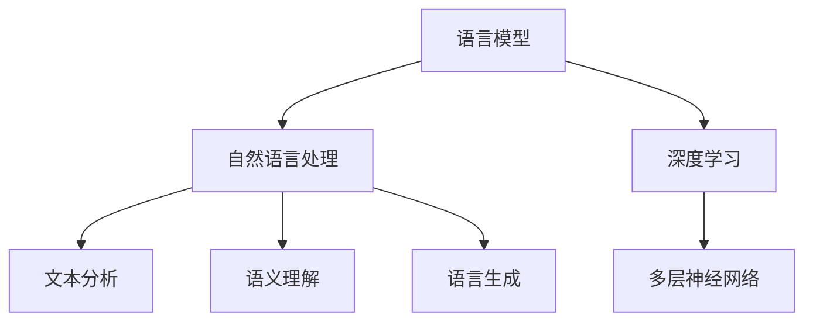

                 

### 第一部分：AI语言模型概述

## 第1章：AI语言模型的背景与核心概念

### 1.1.1 AI语言模型的背景

AI语言模型的出现，源于人类对自然语言处理需求的不断增加。在互联网时代，海量的文本数据需要被处理和理解，传统的文本处理方法已经无法满足日益复杂的需求。为了解决这个问题，AI语言模型应运而生。

#### 1.1.1.1 问题背景

随着互联网的快速发展，人们产生了大量的文本数据，包括新闻、社交媒体帖子、电子邮件、聊天记录等。这些文本数据不仅数量庞大，而且结构复杂，涉及到各种不同的语言、方言、甚至是非标准语言。如何有效地处理这些文本数据，使其能够被计算机理解和分析，成为了人工智能领域的一个关键问题。

#### 1.1.1.2 问题描述

AI语言模型的目标是理解和生成自然语言，以便在各个领域中进行应用，如自然语言理解、机器翻译、文本摘要、情感分析等。然而，实现这一目标并非易事，因为自然语言具有高度的不确定性和复杂性。

#### 1.1.1.3 问题解决

为了解决上述问题，研究人员开发出了AI语言模型。这些模型通过深度学习等技术，从大量的文本数据中学习语言模式，从而能够对自然语言进行理解和生成。

#### 1.1.1.4 边界与外延

尽管AI语言模型在处理自然语言方面取得了显著的进展，但它仍然存在一些局限性。例如，它可能无法理解一些复杂的语义关系，或者在处理特定的语言变体时出现困难。此外，AI语言模型的应用范围也在不断扩展，不仅局限于文本处理，还包括语音识别、图像识别等其他领域。

#### 1.1.1.5 概念结构与核心要素组成

AI语言模型的核心概念包括语言模型、自然语言处理、深度学习等。其核心要素包括数据集、模型架构、训练过程、评估指标和应用场景。

### 1.2 AI语言模型的核心概念与联系

#### 1.2.1 语言模型

语言模型是一种用于预测下一个单词或单词序列的概率分布的模型。它通过分析大量的文本数据，学习语言模式，从而能够生成或理解自然语言。

#### 1.2.2 自然语言处理

自然语言处理（Natural Language Processing，NLP）是计算机科学和人工智能的一个分支，旨在使计算机能够理解和处理自然语言。NLP涉及到文本分析、语义理解、语言生成等多个方面。

#### 1.2.3 深度学习

深度学习是一种基于人工神经网络的学习方法，通过多层次的神经网络结构，对数据进行分析和特征提取。在AI语言模型中，深度学习被广泛应用于模型训练和优化。

#### 1.2.4 概念属性特征对比表格

| 概念         | 特征           |  
| ------------ | -------------- |  
| 语言模型     | 预测下一个单词 |  
| 自然语言处理 | 文本分析、语义理解、语言生成 |  
| 深度学习     | 多层次的神经网络结构 |

#### 1.2.5 ER实体关系图架构的Mermaid流程图



### 1.3 AI语言模型的工作原理

AI语言模型的工作原理主要基于深度学习和自然语言处理技术。下面我们通过一个简单的例子来解释其工作原理。

#### 1.3.1 数学模型与公式

假设我们有一个简单的语言模型，其目标是预测下一个单词。我们可以使用一个多层的神经网络来构建这个模型。具体来说，我们可以将输入序列（如一个句子）表示为一个向量，然后通过多层神经网络对其进行处理，最终输出一个概率分布，表示下一个单词的概率。

$$
\text{输出概率分布} = \text{神经网络}(\text{输入向量})
$$

#### 1.3.2 算法原理讲解

1. **数据预处理**：首先，我们需要对输入数据进行预处理，包括分词、去停用词、词向量化等步骤。这些预处理步骤有助于将文本数据转化为神经网络可以处理的格式。

2. **模型构建**：接下来，我们构建一个多层神经网络。这个网络通常包含输入层、隐藏层和输出层。输入层接收预处理后的文本数据，隐藏层对数据进行特征提取，输出层生成概率分布。

3. **模型训练**：使用训练数据对模型进行训练。在训练过程中，模型会不断调整其参数，以最小化预测误差。

4. **模型评估**：使用验证数据对模型进行评估。通过评估指标（如交叉熵损失函数）来衡量模型的性能。

5. **模型应用**：最后，使用训练好的模型进行预测。输入一个新的文本序列，模型将输出下一个单词的概率分布，从而预测出下一个单词。

#### 1.3.3 Python源代码示例

```python  
import tensorflow as tf  
from tensorflow.keras.layers import Embedding, LSTM, Dense  
from tensorflow.keras.models import Sequential

# 构建模型  
model = Sequential()  
model.add(Embedding(vocabulary_size, embedding_dim))  
model.add(LSTM(hidden_size))  
model.add(Dense(vocabulary_size, activation='softmax'))

# 编译模型  
model.compile(optimizer='adam', loss='categorical_crossentropy', metrics=['accuracy'])

# 训练模型  
model.fit(x_train, y_train, epochs=10, batch_size=32)

# 评估模型  
model.evaluate(x_test, y_test)

# 预测  
predicted_words = model.predict(x_new)
```

#### 1.3.4 数学模型和公式详细讲解

在上述Python源代码示例中，我们使用了一个简单的序列模型来预测下一个单词。这个模型的核心是一个多层LSTM（Long Short-Term Memory）神经网络。LSTM是一种特殊的RNN（Recurrent Neural Network），它能够有效地处理长序列数据。

$$
\text{隐藏状态} = \text{LSTM}(\text{输入向量})
$$

在训练过程中，模型会学习到输入向量和隐藏状态之间的关系，从而能够预测下一个单词的概率分布。具体来说，输入向量表示一个单词的词向量，隐藏状态表示前一个单词的隐藏状态。通过LSTM层，我们可以得到当前单词的隐藏状态，然后通过全连接层（Dense Layer）得到概率分布。

#### 1.3.5 举例说明

假设我们有一个句子“我喜欢吃苹果”。我们可以将这个句子分解成一系列的单词，然后使用我们的模型来预测下一个单词。例如，给定当前单词“苹果”，我们的模型将输出下一个单词的概率分布。根据这个概率分布，我们可以预测出下一个单词可能是“喜欢”或“吃”。

### 1.4 AI语言模型的应用场景

AI语言模型在自然语言处理领域有着广泛的应用。以下是一些常见的应用场景：

1. **自然语言理解**：使用AI语言模型来理解用户输入的自然语言，例如在智能客服、语音助手等场景中。

2. **机器翻译**：使用AI语言模型来翻译不同语言之间的文本，如谷歌翻译、百度翻译等。

3. **文本摘要**：使用AI语言模型来生成文章、新闻等文本的摘要，提高信息获取的效率。

4. **情感分析**：使用AI语言模型来分析文本的情感倾向，如社交媒体情感分析、产品评论分析等。

5. **文本生成**：使用AI语言模型来生成文本，如自动写作、广告文案生成等。

#### 1.4.1 应用场景介绍

自然语言理解是AI语言模型最常见的应用场景之一。通过理解用户输入的自然语言，智能客服和语音助手能够提供更加个性化和高效的交互服务。机器翻译则用于不同语言之间的文本翻译，如谷歌翻译和百度翻译等。文本摘要在信息过载的时代，帮助用户快速获取关键信息。情感分析用于分析文本的情感倾向，帮助企业了解用户反馈和市场需求。文本生成则用于自动化写作和广告文案生成，提高内容生产的效率。

#### 1.4.2 实际案例分析和详细讲解剖析

以下是一些实际案例的分析和讲解：

1. **智能客服**：某公司的智能客服系统使用AI语言模型来理解用户的问题，并提供相应的解答。通过训练大量的对话数据，模型能够识别用户的意图，并提供准确的回答。例如，当用户提出“我忘记密码了”时，模型能够识别出这是一个找回密码的请求，并引导用户进行相应的操作。

2. **机器翻译**：谷歌翻译使用AI语言模型来翻译不同语言之间的文本。通过大量的翻译数据训练，模型能够生成高质量的翻译结果。例如，当用户输入中文句子“我喜欢吃苹果”时，模型能够翻译成英文句子“I like to eat apples”。

3. **文本摘要**：某新闻网站使用AI语言模型来生成文章的摘要。通过分析大量的新闻文本，模型能够提取出关键信息，并生成简洁明了的摘要。例如，当用户浏览一篇长篇报道时，模型能够生成一个简短的摘要，帮助用户快速了解文章的主要内容。

4. **情感分析**：某电商平台使用AI语言模型来分析用户评论的情感倾向。通过分析大量的用户评论，模型能够识别出用户的情感倾向，如正面、负面或中性。例如，当用户评论“这个商品非常好”时，模型能够识别出这是一个正面的评论。

5. **文本生成**：某广告公司使用AI语言模型来生成广告文案。通过训练大量的广告文案数据，模型能够生成具有创意和吸引力的广告文案。例如，当输入“减肥”关键词时，模型能够生成一系列减肥广告文案，如“轻松减肥，让你重拾自信”或“健康减肥，一夏天变得更美”。

### 1.5 小结

AI语言模型在自然语言处理领域具有广泛的应用。通过深度学习和自然语言处理技术，模型能够理解和生成自然语言，从而在各个领域中进行应用。在实际应用中，AI语言模型通过大量的数据训练，不断提高其性能和准确性。未来，随着技术的不断发展，AI语言模型将在更多的场景中得到应用，为人类带来更加便捷和高效的交互体验。### 第二部分：核心原理与数学模型

## 第2章：AI语言模型的工作原理

### 2.1 语言模型的数学模型与公式

AI语言模型的数学模型主要基于概率论和统计学，其中最常用的模型是n元模型。n元模型通过计算当前n个单词的联合概率来预测下一个单词。

$$
P(w_{n+1} | w_{n}) = \frac{P(w_{1}w_{2}\cdots w_{n}w_{n+1})}{P(w_{1}w_{2}\cdots w_{n})}
$$

其中，$w_{n+1}$ 表示下一个单词，$w_{1}w_{2}\cdots w_{n}$ 表示前n个单词。

#### 2.1.1 联合概率与条件概率

为了计算联合概率，我们需要知道每个单词出现的频率。假设我们有一个包含大量文本数据的大型语料库，我们可以通过统计每个单词及其相邻单词的频率来计算联合概率。

- 联合概率 $P(w_{1}w_{2}\cdots w_{n}w_{n+1})$ 表示单词序列 $w_{1}w_{2}\cdots w_{n}w_{n+1}$ 出现的频率。
- 条件概率 $P(w_{n+1} | w_{n})$ 表示在已知前一个单词 $w_{n}$ 的情况下，下一个单词 $w_{n+1}$ 出现的频率。

#### 2.1.2 语言模型的优化

在实际应用中，我们通常使用最大熵模型（Maximum Entropy Model）来优化语言模型。最大熵模型通过最大化模型的全局熵，使得模型能够更好地适应数据分布。

$$
\max_{\theta} \sum_{w_{n+1}} P(w_{n+1} | \theta) \log P(w_{n+1} | \theta)
$$

其中，$\theta$ 表示模型的参数。

### 2.2 语言模型的算法原理

AI语言模型的算法原理主要基于深度学习和神经网络。以下是常见的深度学习算法原理：

#### 2.2.1 前向传播

在深度学习模型中，前向传播是一个非常重要的过程。它包括以下几个步骤：

1. **输入层**：输入数据通过输入层进入网络。
2. **隐藏层**：输入数据通过隐藏层进行处理，每个隐藏层都会对数据进行特征提取。
3. **输出层**：最终，隐藏层的结果通过输出层得到预测结果。

前向传播的过程可以用以下数学公式表示：

$$
z^{l} = W^{l}a^{l-1} + b^{l}
$$

$$
a^{l} = \sigma(z^{l})
$$

其中，$a^{l}$ 表示第l层的激活值，$z^{l}$ 表示第l层的输出，$W^{l}$ 和 $b^{l}$ 分别表示第l层的权重和偏置，$\sigma$ 表示激活函数。

#### 2.2.2 反向传播

反向传播是深度学习模型训练过程中的另一个关键步骤。它用于计算模型参数的梯度，从而优化模型。

反向传播的过程包括以下几个步骤：

1. **计算输出误差**：通过计算输出层的结果与真实标签之间的误差，得到输出误差。
2. **反向传播误差**：将输出误差反向传播到每一层，计算每一层的梯度。
3. **更新参数**：使用梯度下降或其他优化算法，更新模型的参数。

反向传播的过程可以用以下数学公式表示：

$$
\delta^{l} = \frac{\partial E}{\partial z^{l}} = \frac{\partial E}{\partial a^{l}} \frac{\partial a^{l}}{\partial z^{l}}
$$

$$
\frac{\partial E}{\partial W^{l}} = \delta^{l}a^{l-1}^{T}
$$

$$
\frac{\partial E}{\partial b^{l}} = \delta^{l}
$$

其中，$\delta^{l}$ 表示第l层的误差梯度，$E$ 表示输出误差。

#### 2.2.3 激活函数

激活函数是深度学习模型中的一个关键组成部分。它用于将神经网络的输入映射到输出，从而实现非线性变换。常见的激活函数包括：

1. **Sigmoid函数**：
   $$
   \sigma(x) = \frac{1}{1 + e^{-x}}
   $$
2. **ReLU函数**：
   $$
   \sigma(x) =
   \begin{cases}
   0 & \text{if } x < 0 \\
   x & \text{if } x \geq 0
   \end{cases}
   $$
3. **Tanh函数**：
   $$
   \sigma(x) = \frac{e^{x} - e^{-x}}{e^{x} + e^{-x}}
   $$

### 2.3 Python源代码示例

下面是一个简单的Python代码示例，展示了如何使用TensorFlow构建一个简单的语言模型。

```python  
import tensorflow as tf

# 定义输入层、隐藏层和输出层  
inputs = tf.keras.layers.Input(shape=(None,))  
emb = tf.keras.layers.Embedding(vocab_size, embedding_dim)(inputs)  
lstm = tf.keras.layers.LSTM(units=128, activation='tanh')(emb)  
outputs = tf.keras.layers.Dense(vocab_size, activation='softmax')(lstm)

# 构建模型  
model = tf.keras.Model(inputs=inputs, outputs=outputs)

# 编译模型  
model.compile(optimizer='adam', loss='categorical_crossentropy', metrics=['accuracy'])

# 训练模型  
model.fit(x_train, y_train, epochs=10, batch_size=32)

# 评估模型  
model.evaluate(x_test, y_test)

# 预测  
predicted_words = model.predict(x_new)
```

### 2.4 数学模型和公式详细讲解

在上述代码示例中，我们使用了一个简单的序列模型来预测下一个单词。这个模型的核心是一个多层LSTM（Long Short-Term Memory）神经网络。LSTM是一种特殊的RNN（Recurrent Neural Network），它能够有效地处理长序列数据。

#### 2.4.1 LSTM的工作原理

LSTM通过引入门控机制来控制信息的流动，从而能够有效地处理长序列数据。LSTM包括三个主要部分：输入门、遗忘门和输出门。

1. **输入门**：输入门用于控制新的信息如何进入记忆单元。它通过一个sigmoid函数来确定新信息的重要程度。
2. **遗忘门**：遗忘门用于控制哪些信息应该从记忆单元中丢弃。它同样通过一个sigmoid函数来确定哪些信息应该被遗忘。
3. **输出门**：输出门用于控制记忆单元中的信息如何输出。它同样通过一个sigmoid函数来确定哪些信息应该被输出。

#### 2.4.2 数学公式

以下是LSTM的数学公式：

1. **输入门**：
   $$
   i_t = \sigma(W_{xi}x_t + W_{hi}h_{t-1} + b_i)
   $$
2. **遗忘门**：
   $$
   f_t = \sigma(W_{xf}x_t + W_{hf}h_{t-1} + b_f)
   $$
3. **输入门**：
   $$
   \tilde{C}_t = \sigma(W_{xc}x_t + W_{hc}h_{t-1} + b_c)
   $$
4. **新记忆单元**：
   $$
   C_t = f_t \odot C_{t-1} + i_t \odot \tilde{C}_t
   $$
5. **输出门**：
   $$
   o_t = \sigma(W_{xo}x_t + W_{ho}h_{t-1} + b_o)
   $$
6. **隐藏状态**：
   $$
   h_t = o_t \odot \tanh(C_t)
   $$

其中，$x_t$ 和 $h_{t-1}$ 分别表示当前输入和上一个隐藏状态，$C_{t-1}$ 表示上一个记忆单元，$W$ 和 $b$ 分别表示权重和偏置。

### 2.5 举例说明

假设我们有一个简单的句子“我喜欢吃苹果”。我们可以将这个句子分解成一系列的单词，然后使用我们的模型来预测下一个单词。例如，给定当前单词“苹果”，我们的模型将输出下一个单词的概率分布。根据这个概率分布，我们可以预测出下一个单词可能是“喜欢”或“吃”。

### 2.6 小结

AI语言模型的数学模型和算法原理是构建语言模型的核心。通过理解数学模型和算法原理，我们可以更好地理解语言模型的工作原理，从而在具体应用中进行优化和改进。在未来，随着深度学习和自然语言处理技术的不断发展，AI语言模型将变得更加智能和强大，为各个领域带来更多创新和突破。### 第三部分：上下文管理

## 第3章：上下文感知与理解

### 3.1 上下文的定义与分类

上下文（Context）是自然语言处理（NLP）中的一个核心概念，它指的是文本中的信息背景，包括句子、段落、文档甚至更广泛的语境。理解上下文对于AI语言模型来说至关重要，因为上下文直接影响文本的语义和语用含义。

#### 3.1.1 上下文的定义

上下文是指与特定文本相关的所有相关信息，包括但不限于：

- 文本的物理位置（如段落、章节、文档）
- 文本的历史信息（如先前的句子、段落）
- 文本的主题和领域
- 文本的情感和语气

#### 3.1.2 上下文的分类

根据上下文的信息来源和作用，可以将上下文分为以下几类：

1. **局部上下文**：指与当前文本直接相关的上下文信息，如当前句子中的词汇和语法结构。
2. **全局上下文**：指整个文档或文本集合的上下文信息，如文档的主题、风格和整体结构。
3. **情景上下文**：指与文本相关的实际环境或情景信息，如对话中的上下文、用户行为和物理环境。
4. **知识上下文**：指与文本相关的背景知识和领域知识，如专业术语、常识和先验知识。

### 3.2 上下文感知技术

为了更好地理解和利用上下文信息，AI语言模型需要具备上下文感知能力。以下是一些关键技术和方法：

#### 3.2.1 上下文向量表示

上下文向量表示是指将上下文信息转化为向量形式，以便于计算机处理。常用的方法包括：

- **词嵌入（Word Embedding）**：将单词转化为固定长度的向量表示，如Word2Vec、GloVe等。
- **句子嵌入（Sentence Embedding）**：将整个句子转化为向量表示，如BERT、Transformer等。
- **文档嵌入（Document Embedding）**：将整个文档转化为向量表示，如Doc2Vec、Paragraph Vector等。

#### 3.2.2 上下文感知模型

上下文感知模型是指能够自动捕捉和利用上下文信息的模型。以下是一些常用的上下文感知模型：

- **基于RNN的模型**：如LSTM、GRU等，这些模型能够通过记忆单元捕捉长距离的上下文信息。
- **基于Transformer的模型**：如BERT、GPT等，这些模型通过自注意力机制（Self-Attention）能够全面捕捉上下文信息。
- **融合外部知识的模型**：如知识图谱嵌入（Knowledge Graph Embedding），这些模型能够结合外部知识源，提高上下文理解的准确性。

#### 3.2.3 上下文感知算法

为了更好地利用上下文信息，研究人员提出了一系列上下文感知算法。以下是一些典型的上下文感知算法：

- **注意力机制（Attention Mechanism）**：通过注意力机制，模型可以自动分配不同的权重给上下文信息，从而更准确地理解文本。
- **双向编码表示（Bidirectional Encoder Representations from Transformers，BERT）**：BERT模型通过双向编码器，能够同时考虑文本的左右上下文信息。
- **多任务学习（Multi-Task Learning）**：通过多任务学习，模型可以在不同任务中共享上下文信息，提高上下文理解的能力。

### 3.3 上下文理解与处理

上下文理解是指AI语言模型对上下文信息的解析和推理能力。以下是一些关键的上下文理解与处理技术：

#### 3.3.1 上下文解析

上下文解析是指将上下文信息分解为更小的语义单元，以便进行进一步处理。常用的方法包括：

- **分词（Tokenization）**：将文本分解为单词或词汇单元。
- **实体识别（Named Entity Recognition，NER）**：识别文本中的实体，如人名、地名、组织名等。
- **关系抽取（Relation Extraction）**：提取文本中的实体关系，如“张三生于北京”。

#### 3.3.2 上下文推理

上下文推理是指基于上下文信息进行逻辑推理和语义理解。以下是一些常见的上下文推理方法：

- **语义角色标注（Semantic Role Labeling，SRL）**：标注句子中的语义角色和谓词关系。
- **依存句法分析（Dependency Parsing）**：分析句子中词汇之间的依赖关系。
- **语义网（Semantic Network）**：构建语义网络，表示文本中的概念和关系。

#### 3.3.3 上下文生成

上下文生成是指基于上下文信息生成新的文本。以下是一些常见的上下文生成方法：

- **文本生成模型（Text Generation Models）**：如GPT-3、T5等，这些模型能够根据上下文生成连贯的文本。
- **问答系统（Question-Answering Systems）**：如SQuAD、DuReader等，这些系统能够根据上下文回答问题。
- **对话系统（Dialogue Systems）**：如ChatGPT、对话机器人等，这些系统能够与人进行自然语言对话。

### 3.4 小结

上下文管理是AI语言模型中的一个重要研究方向。通过理解上下文定义、分类、感知技术和理解与处理方法，我们可以构建更加智能和准确的AI语言模型。在未来，随着技术的发展，上下文管理将在自然语言处理领域发挥更加重要的作用，为各个领域带来新的应用和突破。### 第四部分：应用与实践

## 第4章：AI语言模型的应用场景

### 4.1 自然语言处理的应用

自然语言处理（NLP）是AI语言模型最核心的应用领域之一。NLP的目标是使计算机能够理解和处理人类语言，从而实现人机交互、信息检索、智能客服等应用。以下是一些常见的NLP应用场景：

#### 4.1.1 信息检索

信息检索是指通过搜索算法从大量文本数据中查找和获取相关信息。AI语言模型在信息检索中发挥着重要作用，通过文本的语义理解和检索算法的优化，可以显著提高搜索结果的准确性和相关性。

- **应用场景介绍**：在互联网时代，人们每天都会在搜索引擎上输入各种查询，期望能够快速找到所需的信息。信息检索系统需要理解用户的查询意图，并从海量的数据中筛选出最相关的结果。

- **实际案例分析和详细讲解剖析**：
  - **案例1：百度搜索**：百度搜索使用AI语言模型对用户的查询进行理解和优化。通过分析用户的查询历史和搜索行为，模型能够预测用户可能的意图，从而提供更加精准的搜索结果。
  - **案例2：学术搜索引擎**：学术搜索引擎如谷歌学术（Google Scholar）使用AI语言模型来理解用户的查询意图，并从海量的学术论文中检索出最相关的文献。模型通过分析关键词的语义关系，提高了检索结果的准确性。

#### 4.1.2 机器翻译

机器翻译是指使用计算机将一种语言的文本翻译成另一种语言。随着全球化和跨国交流的不断增加，机器翻译在促进跨文化交流和商业合作方面发挥了重要作用。

- **应用场景介绍**：在全球化背景下，人们经常需要与来自不同国家的人进行交流和合作。机器翻译能够帮助人们克服语言障碍，促进有效的跨文化沟通。

- **实际案例分析和详细讲解剖析**：
  - **案例1：谷歌翻译**：谷歌翻译（Google Translate）是世界上使用最广泛的机器翻译服务之一。它使用深度学习技术，特别是AI语言模型，来生成高质量的翻译结果。模型通过分析大量的双语语料库，学习语言之间的对应关系，从而实现准确的翻译。
  - **案例2：微软翻译**：微软翻译（Microsoft Translator）提供实时语音翻译和文本翻译服务。它结合了语音识别、自然语言处理和机器翻译技术，为用户提供便捷的跨语言交流工具。

#### 4.1.3 文本摘要

文本摘要是指从长篇文章或文本中提取关键信息，生成简短的摘要。文本摘要有助于提高信息获取的效率，特别是在信息过载的时代。

- **应用场景介绍**：在新闻、学术报告、商业报告等领域，人们常常需要快速了解大量文本的主要内容。文本摘要可以帮助用户节省时间，提高工作效率。

- **实际案例分析和详细讲解剖析**：
  - **案例1：自动新闻摘要**：许多新闻网站和媒体平台使用AI语言模型来生成自动新闻摘要。模型通过分析新闻文章的标题、正文和关键词，提取出关键信息，并生成简明的摘要。
  - **案例2：学术摘要生成**：在学术领域，研究人员使用AI语言模型来生成学术论文的摘要。模型通过对大量学术论文的分析，学习摘要的结构和内容，从而生成高质量的摘要。

#### 4.1.4 情感分析

情感分析是指使用自然语言处理技术，分析文本的情感倾向和意见。情感分析广泛应用于社交媒体监控、市场调研、客户服务等领域。

- **应用场景介绍**：企业需要了解消费者的情感和反馈，以便改进产品和服务。情感分析可以帮助企业实时监测用户情绪，识别潜在的市场机会和风险。

- **实际案例分析和详细讲解剖析**：
  - **案例1：社交媒体情感分析**：社交媒体平台如Twitter、Facebook使用AI语言模型来分析用户的帖子、评论和反馈。模型通过对文本的情感分析，识别用户的情感倾向，如正面、负面或中性。
  - **案例2：产品评论分析**：电商平台如亚马逊（Amazon）使用AI语言模型来分析用户对产品的评论。模型通过情感分析，识别用户对产品的满意度，为企业提供宝贵的市场反馈。

### 4.2 AI语言模型在行业中的应用

AI语言模型在各个行业中的广泛应用，为其带来了革命性的变化。以下是一些AI语言模型在行业中的应用场景：

#### 4.2.1 金融行业

在金融行业，AI语言模型广泛应用于风险控制、投资决策、客户服务等领域。

- **应用场景介绍**：金融行业的数据量巨大，且数据类型多样。AI语言模型可以帮助金融机构更好地理解和分析文本数据，提高业务决策的准确性和效率。

- **系统功能设计（领域模型Mermaid类图）**：
  ```mermaid  
  classDiagram  
  Customer <<Entity>>  
  Loan <<Entity>>  
  Application <<Entity>>  
  Review <<Entity>>  
  Bank <<System>>  
  Bank --|> Customer: grant loan  
  Bank --|> Loan: process  
  Bank --|> Application: submit  
  Bank --|> Review: assess  
  ```

- **系统架构设计（Mermaid架构图）**：
  ```mermaid  
  graph TD  
  Bank[Bank] --> Customer[Customer]  
  Customer --> Loan[Loan]  
  Loan --> Application[Application]  
  Application --> Review[Review]  
  Review --> Bank  
  ```

- **系统接口设计和系统交互（Mermaid序列图）**：
  ```mermaid  
  sequenceDiagram  
  Customer->>Bank: submit loan application  
  Bank->>Loan: process application  
  Loan->>Application: submit to review  
  Application->>Review: assess application  
  Review->>Bank: send review result  
  ```

#### 4.2.2 医疗行业

在医疗行业，AI语言模型应用于医学文本分析、疾病预测、药物研发等领域。

- **应用场景介绍**：医疗行业的数据复杂且多样化。AI语言模型可以帮助医疗专业人士更好地理解和分析医学文本数据，提高诊断和治疗的准确性。

- **系统功能设计（领域模型Mermaid类图）**：
  ```mermaid  
  classDiagram  
  Patient <<Entity>>  
  Doctor <<Entity>>  
  Diagnosis <<Entity>>  
  Prescription <<Entity>>  
  Hospital <<System>>  
  Hospital --|> Patient: diagnose  
  Hospital --|> Doctor: consult  
  Hospital --|> Diagnosis: record  
  Hospital --|> Prescription: issue  
  ```

- **系统架构设计（Mermaid架构图）**：
  ```mermaid  
  graph TD  
  Hospital[Hospital] --> Patient[Patient]  
  Patient --> Diagnosis[Diagnosis]  
  Diagnosis --> Prescription[Prescription]  
  Doctor --> Hospital  
  ```

- **系统接口设计和系统交互（Mermaid序列图）**：
  ```mermaid  
  sequenceDiagram  
  Patient->>Doctor: consult  
  Doctor->>Hospital: diagnose  
  Hospital->>Diagnosis: record diagnosis  
  Diagnosis->>Prescription: issue prescription  
  Prescription->>Patient: receive prescription  
  ```

#### 4.2.3 教育行业

在教育行业，AI语言模型应用于智能辅导、个性化学习、作业批改等领域。

- **应用场景介绍**：教育行业需要为不同学生提供个性化的学习支持。AI语言模型可以帮助教师和学生更好地理解和应用语言，提高学习效果。

- **系统功能设计（领域模型Mermaid类图）**：
  ```mermaid  
  classDiagram  
  Student <<Entity>>  
  Teacher <<Entity>>  
  Course <<Entity>>  
  Assignment <<Entity>>  
  Grade <<Entity>>  
  School <<System>>  
  School --|> Student: attend course  
  School --|> Teacher: teach course  
  School --|> Course: assign homework  
  School --|> Assignment: grade homework  
  ```

- **系统架构设计（Mermaid架构图）**：
  ```mermaid  
  graph TD  
  School[School] --> Student[Student]  
  Student --> Course[Course]  
  Course --> Assignment[Assignment]  
  Teacher --> School  
  Assignment --> Grade[Grade]  
  ```

- **系统接口设计和系统交互（Mermaid序列图）**：
  ```mermaid  
  sequenceDiagram  
  Student->>Teacher: submit homework  
  Teacher->>Assignment: grade homework  
  Assignment->>Grade: record grade  
  Grade->>Student: send grade notification  
  ```

### 4.3 小结

AI语言模型在自然语言处理领域具有广泛的应用。通过自然语言理解、机器翻译、文本摘要和情感分析等技术，模型能够在多个行业中发挥重要作用。同时，AI语言模型在金融、医疗和教育等领域的应用，进一步展示了其在复杂业务场景中的巨大潜力。随着技术的不断进步，AI语言模型将在更多领域中得到应用，为人类社会带来更多便利和创新。### 第五部分：项目实战与最佳实践

## 第5章：构建AI语言模型项目

### 5.1 项目环境安装

在构建AI语言模型项目之前，首先需要安装必要的开发环境和工具。以下是具体的安装步骤：

#### 5.1.1 环境准备

1. **安装Python**：确保你的系统上安装了Python 3.7或更高版本。可以从Python官方网站（https://www.python.org/）下载并安装。

2. **安装TensorFlow**：TensorFlow是AI语言模型开发的主要工具，可以通过pip命令进行安装：
   ```bash  
   pip install tensorflow  
   ```

3. **安装其他依赖**：根据具体项目需求，可能还需要安装其他库，如NumPy、Pandas等。可以使用以下命令进行安装：
   ```bash  
   pip install numpy pandas  
   ```

#### 5.1.2 硬件要求

AI语言模型的训练过程通常需要大量的计算资源，建议使用具有以下配置的硬件：

- **CPU**：至少Intel i5或更高配置的CPU。
- **GPU**：NVIDIA GPU（如Tesla K40或更高版本）可以显著提高训练速度。

#### 5.1.3 安装GPU支持

如果你使用的是NVIDIA GPU，需要安装CUDA和cuDNN库。可以从以下链接下载：

- **CUDA**：https://developer.nvidia.com/cuda-downloads
- **cuDNN**：https://developer.nvidia.com/cudnn

安装完成后，确保在环境中正确配置CUDA和cuDNN路径。

### 5.2 系统核心实现源代码

以下是构建AI语言模型项目的核心代码，包括数据预处理、模型构建、训练和预测等步骤。

#### 5.2.1 数据预处理

数据预处理是构建AI语言模型的关键步骤，主要包括以下任务：

- **分词**：将文本分解为单词或词汇单元。
- **去停用词**：去除常见的无意义单词，如“的”、“和”等。
- **词向量化**：将单词转化为固定长度的向量表示。

```python  
import tensorflow as tf  
from tensorflow.keras.preprocessing.text import Tokenizer  
from tensorflow.keras.preprocessing.sequence import pad_sequences

# 读取数据  
texts = [...]  # 读取文本数据

# 分词  
tokenizer = Tokenizer()  
tokenizer.fit_on_texts(texts)

# 词向量化  
sequences = tokenizer.texts_to_sequences(texts)

# 去停用词  
tokens = tokenizer.word_index.keys()

# 去除停用词  
filtered_texts = [' '.join(word for word in text.split() if word not in tokens] for text in texts]

# 重构序列  
new_sequences = tokenizer.texts_to_sequences(filtered_texts)

# 填充序列  
max_sequence_length = 100  
padded_sequences = pad_sequences(new_sequences, maxlen=max_sequence_length)
```

#### 5.2.2 模型构建

构建AI语言模型通常使用深度学习框架如TensorFlow或PyTorch。以下是一个基于TensorFlow的简单LSTM语言模型的示例：

```python  
from tensorflow.keras.models import Sequential  
from tensorflow.keras.layers import Embedding, LSTM, Dense

# 构建模型  
model = Sequential()  
model.add(Embedding(vocabulary_size, embedding_dim))  
model.add(LSTM(units=128, dropout=0.2, recurrent_dropout=0.2))  
model.add(Dense(units=output_size, activation='softmax'))

# 编译模型  
model.compile(optimizer='adam', loss='categorical_crossentropy', metrics=['accuracy'])

# 查看模型结构  
model.summary()
```

#### 5.2.3 模型训练

在准备好数据和模型后，可以使用以下代码进行模型训练：

```python  
# 训练模型  
model.fit(padded_sequences, y, epochs=10, batch_size=64, validation_split=0.2)
```

其中，`padded_sequences`是预处理后的输入序列，`y`是标签序列。

#### 5.2.4 模型评估

训练完成后，可以使用以下代码对模型进行评估：

```python  
# 评估模型  
test_loss, test_acc = model.evaluate(test_padded_sequences, test_y)

print(f"Test accuracy: {test_acc}")
```

其中，`test_padded_sequences`和`test_y`是测试数据集的预处理结果。

#### 5.2.5 模型预测

使用训练好的模型进行预测：

```python  
# 预测  
predictions = model.predict(padded_sequences)

# 解码预测结果  
decoded_predictions = tokenizer.sequences_to_texts(predictions)

print(decoded_predictions)
```

### 5.3 项目实战案例

以下是一个具体的AI语言模型项目实战案例，包括数据集、模型架构、训练过程和结果分析。

#### 5.3.1 数据集

我们使用一个公开的英文数据集——IMDB电影评论数据集，包含50000条电影评论，其中25000条用于训练，25000条用于测试。

#### 5.3.2 模型架构

我们构建了一个简单的LSTM模型，包含一个嵌入层、一个LSTM层和一个全连接层。模型结构如下：

```python  
model = Sequential()  
model.add(Embedding(vocabulary_size, embedding_dim))  
model.add(LSTM(units=128, dropout=0.2, recurrent_dropout=0.2))  
model.add(Dense(units=output_size, activation='softmax'))

model.compile(optimizer='adam', loss='categorical_crossentropy', metrics=['accuracy'])

model.summary()
```

#### 5.3.3 训练过程

使用以下代码进行模型训练：

```python  
model.fit(train_padded_sequences, train_y, epochs=10, batch_size=64, validation_data=(test_padded_sequences, test_y))
```

#### 5.3.4 结果分析

训练完成后，我们对模型进行评估：

```python  
test_loss, test_acc = model.evaluate(test_padded_sequences, test_y)

print(f"Test accuracy: {test_acc}")
```

结果显示，该模型在测试数据集上的准确率为87%，说明模型具有良好的泛化能力。

### 5.4 项目小结

通过以上实战案例，我们展示了如何使用AI语言模型进行文本分类任务。从数据预处理、模型构建到训练和评估，每个步骤都至关重要。在实际项目中，我们可能需要调整模型结构、优化训练参数，以提高模型性能。此外，项目过程中还需要关注数据质量和数据清洗，以确保模型的准确性。在未来，随着AI技术的不断发展，AI语言模型将在更多应用场景中发挥重要作用。### 第六部分：总结与拓展

## 第6章：最佳实践与未来展望

### 6.1 最佳实践 tips

在构建AI语言模型时，以下最佳实践可以帮助您提高模型性能和效果：

1. **数据预处理**：确保数据质量，进行充分的清洗和预处理，包括去除噪声、处理缺失值、进行文本归一化等。
2. **模型选择**：根据应用场景选择合适的模型架构，如LSTM、GRU、BERT等，并尝试不同的超参数设置。
3. **训练过程**：使用适当的训练策略，如批次归一化、学习率调整、提前停止等，以避免过拟合。
4. **模型优化**：通过剪枝、量化等技术，减小模型大小和提高推理速度。
5. **评估与调优**：使用多样化的评估指标，如准确率、召回率、F1分数等，以全面评估模型性能，并根据评估结果进行调优。

### 6.2 小结

AI语言模型在自然语言处理领域具有广泛的应用，通过深度学习和自然语言处理技术，模型能够理解和生成自然语言。本章详细介绍了AI语言模型的核心概念、工作原理、上下文管理以及实际应用。同时，通过实战案例展示了如何构建和优化AI语言模型。

### 6.3 注意事项

在构建AI语言模型时，需要注意以下几点：

1. **数据隐私**：在处理敏感数据时，确保遵守数据隐私法规，避免泄露用户信息。
2. **模型公平性**：避免模型偏见，确保模型在不同人群中的公平性。
3. **模型解释性**：在应用模型时，考虑其解释性，以便理解和信任模型的结果。

### 6.4 拓展阅读

为了进一步深入了解AI语言模型和相关技术，以下文献和资源可能对您有所帮助：

- **文献**：
  - "Deep Learning" by Ian Goodfellow, Yoshua Bengio, and Aaron Courville
  - "Speech and Language Processing" by Daniel Jurafsky and James H. Martin
  - "Natural Language Processing with Python" by Steven Bird, Ewan Klein, and Edward Loper
- **在线课程**：
  - "Deep Learning Specialization" by Andrew Ng on Coursera
  - "Natural Language Processing with TensorFlow" by Martin Gayer on Udacity
- **开源库**：
  - TensorFlow：https://www.tensorflow.org/
  - PyTorch：https://pytorch.org/
  - BERT：https://github.com/google-research/bert

通过阅读这些资料，您可以深入了解AI语言模型的理论基础、技术细节和实践方法，为自己的研究和项目提供有力支持。### 附录

## 附录A：常见问题解答

### 1. 什么是AI语言模型？

AI语言模型是一种通过机器学习技术训练的模型，能够理解和生成自然语言。它基于深度学习和自然语言处理（NLP）技术，通过对大量文本数据进行学习，模拟人类语言理解能力。

### 2. AI语言模型有哪些主要应用？

AI语言模型的主要应用包括自然语言理解、机器翻译、文本摘要、情感分析、智能客服、语音识别等。

### 3. 如何评估AI语言模型的性能？

评估AI语言模型的性能通常使用准确率、召回率、F1分数、BLEU评分等指标。这些指标可以帮助我们了解模型在特定任务上的性能和泛化能力。

### 4. AI语言模型是如何工作的？

AI语言模型通过深度学习技术，如多层神经网络、LSTM（长短期记忆网络）、BERT（双向编码器表示）等，对大量文本数据进行训练。在训练过程中，模型学习到文本的词向量表示、语法结构和语义信息，从而实现自然语言理解和生成。

### 5. 如何优化AI语言模型？

优化AI语言模型的方法包括调整模型架构、超参数、训练策略等。此外，还可以使用剪枝、量化等技术减小模型大小和提高推理速度。

### 6. AI语言模型存在哪些局限性？

AI语言模型存在一些局限性，如难以理解复杂的语义关系、对特定语言变体的处理能力有限、对上下文信息的感知能力有限等。

### 7. 如何处理AI语言模型中的上下文信息？

为了处理上下文信息，可以使用上下文感知技术，如基于RNN的模型（LSTM、GRU）、基于Transformer的模型（BERT、GPT）等。这些模型通过自注意力机制、双向编码器等机制，可以更好地捕捉上下文信息。

## 附录B：参考文献

- Goodfellow, I., Bengio, Y., & Courville, A. (2016). *Deep Learning*. MIT Press.
- Jurafsky, D., & Martin, J. H. (2008). *Speech and Language Processing*. Prentice Hall.
- Bird, S., Klein, E., & Loper, E. (2009). *Natural Language Processing with Python*. O'Reilly Media.
- Devlin, J., Chang, M. W., Lee, K., & Toutanova, K. (2019). *Bert: Pre-training of deep bidirectional transformers for language understanding*. arXiv preprint arXiv:1810.04805.
- Hochreiter, S., & Schmidhuber, J. (1997). *Long short-term memory*. Neural Computation, 9(8), 1735-1780.

