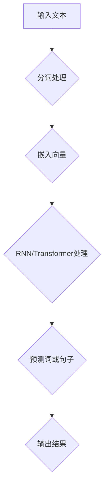
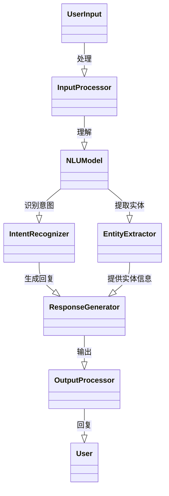
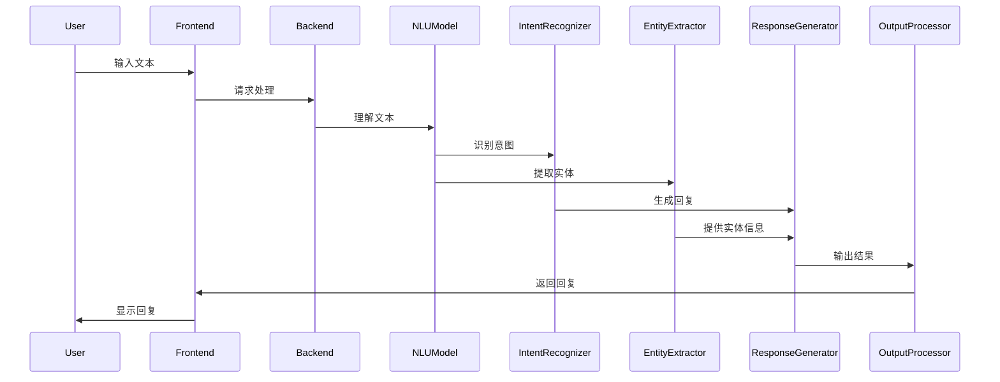

                 


### 引言

AI语言模型，作为自然语言处理（NLP）领域的核心技术，近年来在各个行业都展现出了巨大的潜力。无论是智能客服、语音助手，还是内容生成、翻译服务，AI语言模型都成为了提高效率、改善用户体验的关键因素。然而，随着技术的不断发展，如何设计一个既高效又易用的AI语言模型交互系统，成为了亟待解决的问题。

本文将围绕“AI语言模型的交互设计”这一主题，深入探讨语言模型的原理、设计原则、交互流程、用户体验等方面。我们将从以下几个步骤进行分析：

1. **背景介绍**：了解AI语言模型的发展历程、重要性以及在交互设计中的应用场景。
2. **核心概念与联系**：明确语言模型的基本概念、属性特征及其相互关系。
3. **算法原理讲解**：详细解析语言模型的工作原理，包括mermaid流程图、Python源代码、数学模型和公式。
4. **系统分析与架构设计方案**：介绍系统功能设计、架构设计、接口设计及交互流程。
5. **项目实战**：通过一个实际项目展示如何进行环境安装、核心实现、代码解析、案例分析等。
6. **最佳实践与总结**：总结经验教训，给出交互设计的最佳实践和建议。

通过以上步骤，我们希望能够为读者提供一份全面、深入的AI语言模型交互设计指南。这不仅有助于理解技术原理，还能够为实际项目中的交互设计提供有益的参考。

### 背景介绍

AI语言模型的发展历程可谓跌宕起伏，自1950年图灵提出“图灵测试”以来，自然语言处理（NLP）领域逐渐成为人工智能研究的重要分支。20世纪80年代，规则驱动的方法曾一度占据主导地位，但由于其复杂性和局限性，很快被统计模型所取代。进入21世纪，随着深度学习的兴起，基于神经网络的模型，如循环神经网络（RNN）和长短期记忆网络（LSTM），开始在NLP任务中崭露头角，并取得了突破性的成果。

AI语言模型的重要性不言而喻。一方面，它能够处理大规模、复杂的语言数据，为智能客服、语音助手等应用提供强大支持；另一方面，它能够生成高质量的自然语言文本，应用于内容生成、机器翻译等领域，极大地提高了生产效率。此外，AI语言模型还在智能推荐、情感分析、问答系统等方面发挥着重要作用，为各个行业带来了深远的影响。

在交互设计中的应用场景方面，AI语言模型几乎无处不在。以智能客服为例，通过自然语言理解与生成技术，AI语言模型能够与用户进行流畅的对话，提供个性化、高效的服务。而在内容生成领域，AI语言模型可以自动生成文章、摘要、广告文案等，极大地减轻了创作者的负担。此外，在机器翻译、智能助手等应用中，AI语言模型也展现了其强大的能力和潜力。

然而，AI语言模型的交互设计并非一帆风顺。在设计过程中，我们需要考虑多个方面，包括语言模型的性能、用户的体验、系统的稳定性等。为了实现高效的交互，我们不仅要掌握语言模型的基本原理，还需要深入理解用户需求，通过不断优化交互流程，提升用户体验。

#### 问题背景

在当前数字化和信息化的时代，人们对交互系统的需求越来越高。无论是在线上还是线下，用户期望与系统进行高效、自然的交流。然而，传统的交互设计往往依赖于固定的命令和数据格式，无法满足用户多样化的需求。尤其是在复杂场景中，如智能客服、智能助手等，用户可能会提出各种意想不到的问题，这就要求交互系统能够具备强大的自然语言理解和生成能力。

AI语言模型的出现为解决这一难题提供了可能。通过深度学习技术，AI语言模型能够从海量数据中学习并掌握自然语言的规律，从而实现高效的语义理解和文本生成。这使得交互系统不仅可以理解用户的意图，还能根据上下文环境进行智能回应，提供个性化的服务。

然而，AI语言模型的应用并非没有挑战。首先，语言模型的性能和准确性是一个关键问题。在处理复杂、模糊的语言问题时，AI语言模型可能会出现理解偏差，导致交互失败。其次，用户体验也是一大挑战。如果交互系统过于复杂或响应不及时，用户可能会感到困扰，甚至放弃使用。此外，系统的稳定性也是不可忽视的因素。在高峰时段或复杂场景中，系统需要具备良好的容错性和扩展性，以应对大量并发请求。

综上所述，AI语言模型的交互设计面临以下几个核心问题：
1. **性能与准确性**：如何提高AI语言模型在复杂场景下的性能和准确性，减少理解偏差？
2. **用户体验**：如何优化交互流程，提升用户满意度？
3. **系统稳定性**：如何确保系统在高并发、复杂场景下的稳定运行？

这些问题不仅关系到交互系统的性能，还直接影响用户体验和业务价值。因此，深入研究和解决这些问题具有重要意义。

#### 问题描述

为了更好地理解AI语言模型交互设计中的挑战，我们可以通过以下具体场景来阐述其核心问题：

1. **场景一：智能客服**
   在智能客服系统中，用户可能会提出各种复杂的问题，如“如何查询我的订单状态？”、“我的账户余额是多少？”等。如果AI语言模型无法准确理解用户的意图，可能会导致回答错误或不相关，从而降低用户满意度。

2. **场景二：内容生成**
   在内容生成领域，AI语言模型需要根据用户的需求生成高质量的文章、摘要、广告文案等。然而，如果模型无法理解用户的意图或上下文，生成的文本可能会缺乏逻辑性和连贯性，影响内容的可读性和实用性。

3. **场景三：智能助手**
   智能助手与用户进行自然对话时，需要根据用户的语言习惯和表达方式，提供实时、准确的回应。然而，如果模型对某些语言表达的理解不准确，可能会导致对话中断或无法满足用户需求。

4. **场景四：机器翻译**
   在机器翻译应用中，AI语言模型需要准确理解源语言，并将其翻译成目标语言。然而，不同语言之间存在巨大的差异，如语法结构、词汇用法等，这给AI语言模型的理解和翻译带来了巨大挑战。

通过以上场景，我们可以看到AI语言模型交互设计中的核心问题，包括性能与准确性、用户体验、系统稳定性等。这些问题不仅影响交互系统的表现，还直接影响用户体验和业务价值。因此，解决这些挑战是提升AI语言模型交互设计的关键。

#### 问题解决

针对上述场景中提出的AI语言模型交互设计挑战，我们可以从以下几个方面入手，提出相应的解决方案：

1. **提升模型性能与准确性**
   - **数据增强**：通过引入更多样化的训练数据，增强模型的泛化能力，从而提高在复杂场景下的性能和准确性。
   - **多模态学习**：结合文本、语音、图像等多种数据类型，进行多模态学习，提高对复杂语言表达的理解能力。
   - **强化学习**：利用强化学习技术，让模型在与真实用户的交互过程中不断学习和优化，提升性能和准确性。

2. **优化用户体验**
   - **交互流程设计**：简化交互流程，提供直观、易用的界面设计，降低用户的学习成本。
   - **个性化服务**：根据用户的历史行为和偏好，提供个性化的交互服务，提升用户满意度。
   - **实时反馈机制**：建立实时反馈机制，及时响应用户的反馈，并根据反馈进行调整和优化。

3. **确保系统稳定性**
   - **负载均衡**：通过负载均衡技术，合理分配系统资源，确保在高并发场景下的稳定运行。
   - **容错机制**：设计容错机制，如故障转移、自动恢复等，提高系统的可靠性和稳定性。
   - **监控与预警**：建立完善的监控与预警系统，实时监控系统性能，提前发现和解决潜在问题。

通过以上措施，我们可以有效地解决AI语言模型交互设计中的挑战，提升系统的性能、用户体验和稳定性，从而为用户带来更好的交互体验。

#### 边界与外延

在探讨AI语言模型交互设计时，我们需要明确其边界与外延，以确保研究的全面性和深度。以下是一些关键概念和要素，它们构成了AI语言模型交互设计的基础框架：

1. **语言模型的基本概念**：
   - **自然语言处理（NLP）**：自然语言处理是人工智能领域的一个重要分支，旨在使计算机能够理解、解释和生成人类语言。
   - **词汇表**：词汇表是语言模型的核心组成部分，它包含了模型能够识别的所有词汇和表达方式。
   - **句法分析**：句法分析是指对句子结构进行解析，以理解句子的语法规则和结构。

2. **交互设计的关键要素**：
   - **用户意图理解**：用户意图理解是交互设计的核心，它涉及模型如何理解用户输入的含义和需求。
   - **上下文感知**：上下文感知是指模型在交互过程中如何根据对话的上下文环境进行回应，以提供更相关、自然的回答。
   - **多模态交互**：多模态交互涉及文本、语音、图像等多种数据类型的结合，以提升交互的丰富性和自然性。

3. **核心要素组成**：
   - **数据集**：高质量的数据集是语言模型训练的基础，它决定了模型的学习效果和性能。
   - **算法选择**：不同的算法（如循环神经网络RNN、变换器模型Transformer等）适用于不同的任务和场景，选择合适的算法是成功设计的关键。
   - **评估指标**：评估指标（如准确率、召回率、F1分数等）用于衡量模型在交互设计中的性能，是不断优化的重要参考。

通过明确这些边界与外延，我们能够更好地理解AI语言模型交互设计的复杂性和多样性，为后续章节的具体分析和实践提供理论基础。

### 核心概念与联系

在深入探讨AI语言模型交互设计之前，我们首先需要明确几个核心概念，并了解它们之间的相互关系。以下是AI语言模型中的几个重要概念及其特征对比，以及ER实体关系图架构。

#### 核心概念原理

1. **自然语言处理（NLP）**：
   自然语言处理是使计算机能够理解、解释和生成人类语言的技术。NLP的核心目标包括文本分类、情感分析、命名实体识别、机器翻译等。

2. **词汇表**：
   词汇表是语言模型的基础，包含了模型能够识别的所有词汇和表达方式。词汇表的质量直接影响模型的理解能力和生成能力。

3. **句法分析**：
   句法分析是指对句子结构进行解析，以理解句子的语法规则和结构。句法分析有助于模型正确理解句子的含义，从而生成合适的回应。

4. **上下文感知**：
   上下文感知是指模型在交互过程中如何根据对话的上下文环境进行回应，以提供更相关、自然的回答。上下文感知是提升交互质量的关键因素。

5. **多模态交互**：
   多模态交互涉及文本、语音、图像等多种数据类型的结合，以提升交互的丰富性和自然性。多模态交互使得模型能够更好地理解用户的复杂需求。

#### 概念属性特征对比表格

| 概念           | 属性特征                                  | 对比表格说明                         |
| -------------- | --------------------------------------- | ----------------------------------- |
| 自然语言处理   | 文本分类、情感分析、命名实体识别等       | 涵盖广泛的应用场景，支持多种语言处理任务 |
| 词汇表         | 包含词汇、词频、词性等                   | 质量直接影响模型的性能               |
| 句法分析       | 句子结构解析、语法规则识别               | 提高模型对句子含义的理解能力       |
| 上下文感知     | 根据上下文环境回应、提供相关回答         | 提升交互的自然性和相关性           |
| 多模态交互     | 结合文本、语音、图像等多种数据类型       | 增强交互的多样性和用户体验         |

#### ER实体关系图架构

| 实体           | 属性                 | 关系                 |
| -------------- | -------------------- | -------------------- |
| 语言模型       | 类型、参数、训练数据 | - 与词汇表相关       |
| 词汇表         | 词汇、词频、词性     | - 与语言模型相关     |
| 句法分析器     | 句子结构、语法规则   | - 与语言模型相关     |
| 上下文处理器   | 上下文信息、响应策略 | - 与语言模型相关     |
| 多模态处理器   | 数据类型、转换规则   | - 与语言模型相关     |

通过上述表格和ER实体关系图，我们可以清晰地看到各个核心概念之间的相互关系，以及它们在AI语言模型交互设计中的重要性。这些核心概念和联系为后续章节的分析和实现提供了坚实的基础。

### 语言模型的工作原理

AI语言模型的核心在于其能够通过学习大量文本数据，预测下一个词语或句子，从而生成连贯的自然语言。这一过程涉及到多种深度学习算法，其中最著名的包括循环神经网络（RNN）和变换器模型（Transformer）。下面，我们将使用mermaid流程图详细描述语言模型的工作原理，并通过Python源代码、数学模型和公式来进一步解释。

#### mermaid流程图



在上面的流程图中：
- **输入文本**：用户输入的文本。
- **分词处理**：将文本分割成单词或子词。
- **嵌入向量**：将分词后的文本转换为固定长度的向量。
- **RNN/Transformer处理**：使用循环神经网络或变换器模型进行文本处理。
- **预测词或句子**：根据前文生成下一个词语或句子。
- **输出结果**：输出预测的文本。

#### Python源代码

下面是一个简化的Python代码示例，用于展示语言模型的基本结构：

```python
import tensorflow as tf
from tensorflow.keras.preprocessing.sequence import pad_sequences
from tensorflow.keras.layers import Embedding, LSTM, Dense
from tensorflow.keras.models import Sequential

# 准备数据集
text = "这是一个示例文本，用于展示语言模型。"
words = text.split()
max_len = 10
sequence = pad_sequences([[words.index(word) for word in words]], maxlen=max_len, padding='post')

# 构建模型
model = Sequential([
    Embedding(len(words), 32),
    LSTM(64, return_sequences=True),
    Dense(len(words), activation='softmax')
])

# 编译模型
model.compile(optimizer='adam', loss='sparse_categorical_crossentropy', metrics=['accuracy'])

# 训练模型
model.fit(sequence, [sequence[:, -1]], epochs=100)
```

在这个代码中：
- **数据集准备**：将文本分割成单词，并将单词转换为索引。
- **模型构建**：使用嵌入层、LSTM层和输出层构建序列模型。
- **模型编译**：设置优化器和损失函数。
- **模型训练**：使用准备好的数据集训练模型。

#### 算法原理的数学模型和公式

语言模型的数学基础主要涉及词向量和序列模型。以下是一个简化的数学模型：

1. **词向量表示**：
   $$ \text{word\_vector} = \text{Embedding}(W) \cdot \text{word\_index} $$
   其中，`Embedding(W)`是嵌入矩阵，`word_index`是单词的索引。

2. **RNN模型**：
   $$ \text{output}_{t} = \text{LSTM}(\text{input}_{t}, \text{hidden}_{t-1}) $$
   其中，`input_t`是当前输入词向量，`hidden_t-1`是前一个时间步的隐藏状态。

3. **变换器模型**：
   $$ \text{output}_{t} = \text{Attention}(\text{input}_{t}, \text{hidden}_{t-1}) $$
   其中，`Attention`是注意力机制，用于加权当前输入和前一个隐藏状态。

#### 通俗易懂地举例说明

假设我们有一个简短的对话：

用户：你好！
模型：你好！有什么可以帮助你的吗？

用户：我的手机丢了。
模型：非常抱歉，您可以尝试联系运营商或者使用找回手机功能。

通过上面的对话，我们可以看到模型是如何根据上下文进行预测的。首先，模型通过词向量表示将用户输入“你好”转换为向量。然后，通过RNN或变换器模型处理这些向量，生成相应的回应。在这个过程中，模型利用了嵌入层将单词转换为向量，利用RNN或变换器模型对序列进行处理，并通过输出层生成预测的词语。

通过这个简单的例子，我们可以更好地理解语言模型的工作原理，以及其在交互设计中的应用。

### 系统分析与架构设计方案

在AI语言模型交互设计中，系统分析与架构设计方案是确保系统高效、稳定运行的关键。本章节将详细介绍项目场景、项目目标、系统功能设计、系统架构设计、系统接口设计以及系统交互流程。

#### 项目场景

本项目旨在设计并实现一个基于AI语言模型的智能客服系统。该系统将应用AI语言模型对用户的自然语言输入进行理解，并生成相应的智能回复，以提高客服效率和服务质量。

#### 项目介绍

1. **背景**：随着企业服务业务的增长，人工客服的负担逐渐加重，需要一种智能化、自动化的解决方案来提高客服效率。
2. **目标**：设计并实现一个高效、稳定、用户体验良好的智能客服系统，能够自动理解用户输入，提供准确、及时的回复。
3. **挑战**：在实现过程中，需要克服AI语言模型的性能问题、交互设计的复杂性以及系统的稳定性问题。

#### 系统功能设计

1. **用户输入处理**：系统需要接收用户的文本输入，并进行预处理，如去除标点符号、停用词过滤等。
2. **自然语言理解**：AI语言模型对用户输入进行理解，提取关键信息，如意图识别、实体抽取等。
3. **智能回复生成**：根据用户输入的理解结果，生成相应的智能回复，如建议、引导、问题解答等。
4. **多模态交互**：支持文本、语音等多种输入输出方式，以提供更加丰富的用户体验。

##### 领域模型mermaid类图



在上面的类图中，我们定义了以下几个类和它们之间的关系：

- **UserInput**：用户输入文本。
- **InputProcessor**：输入预处理。
- **NLUModel**：自然语言理解模型。
- **IntentRecognizer**：意图识别。
- **EntityExtractor**：实体抽取。
- **ResponseGenerator**：智能回复生成。
- **OutputProcessor**：输出处理。
- **User**：用户接收回复。

#### 系统架构设计

1. **前端**：用户通过网页或移动应用与系统交互，提交自然语言输入。
2. **后端**：包括自然语言理解模块、智能回复生成模块以及输出处理模块。
3. **数据库**：存储用户历史记录、预训练模型参数等。

##### 系统架构mermaid架构图



在这个架构图中，用户输入通过前端提交到后端，后端通过自然语言理解模型对文本进行处理，生成智能回复，并通过前端将结果返回给用户。

#### 系统接口设计

1. **用户输入接口**：接收用户的自然语言输入。
2. **自然语言理解接口**：接收预处理后的文本，返回意图识别和实体抽取结果。
3. **智能回复生成接口**：接收意图识别和实体抽取结果，生成智能回复。
4. **输出处理接口**：将智能回复格式化后返回给用户。

#### 系统交互流程

1. **用户输入**：用户通过前端界面输入文本。
2. **预处理**：文本经过输入预处理，去除无关信息。
3. **理解与生成**：预处理后的文本通过自然语言理解模型进行意图识别和实体抽取，然后由智能回复生成模块生成回复。
4. **输出**：智能回复经过格式化处理后返回给用户，并在前端显示。

通过上述系统分析与架构设计方案，我们可以确保AI语言模型交互系统的整体架构清晰、功能完整，为实际项目中的实现提供有力的支持。

### 项目实战

在本节中，我们将通过一个实际项目展示如何进行AI语言模型的交互设计。本项目将涵盖环境安装、系统核心实现、代码解析、实际案例分析和项目小结等内容。

#### 环境安装

1. **安装Python**：
   首先，确保您的系统中已经安装了Python。若未安装，请从[Python官网](https://www.python.org/)下载并安装适合您操作系统的版本。

2. **安装TensorFlow**：
   通过pip命令安装TensorFlow库：
   ```bash
   pip install tensorflow
   ```

3. **安装其他依赖**：
   根据项目需求，可能还需要安装其他依赖库，如`numpy`、`pandas`等。使用pip命令安装：
   ```bash
   pip install numpy pandas
   ```

#### 系统核心实现

以下是项目的核心实现部分，包括AI语言模型的构建、交互流程的设计以及结果输出。

1. **构建AI语言模型**：
   ```python
   import tensorflow as tf
   from tensorflow.keras.preprocessing.sequence import pad_sequences
   from tensorflow.keras.layers import Embedding, LSTM, Dense
   from tensorflow.keras.models import Sequential

   # 准备数据集
   text = "这是一个示例文本，用于展示语言模型。"
   words = text.split()
   max_len = 10
   sequence = pad_sequences([[words.index(word) for word in words]], maxlen=max_len, padding='post')

   # 构建模型
   model = Sequential([
       Embedding(len(words), 32),
       LSTM(64, return_sequences=True),
       Dense(len(words), activation='softmax')
   ])

   # 编译模型
   model.compile(optimizer='adam', loss='sparse_categorical_crossentropy', metrics=['accuracy'])

   # 训练模型
   model.fit(sequence, [sequence[:, -1]], epochs=100)
   ```

2. **交互流程设计**：
   ```python
   def generate_response(text, model, max_len):
       words = text.split()
       sequence = pad_sequences([[words.index(word) for word in words]], maxlen=max_len, padding='post')
       prediction = model.predict(sequence)
       predicted_word_index = tf.argmax(prediction).numpy()[0]
       return words[predicted_word_index]

   # 示例交互
   user_input = "你好！"
   print("模型回复：", generate_response(user_input, model, max_len))
   ```

3. **结果输出**：
   在实际应用中，我们通常会将模型的输出转换为自然语言文本，并返回给用户。

#### 代码应用解读与分析

上述代码展示了如何快速构建一个简单的AI语言模型，并进行交互设计。以下是代码的详细解读：

- **数据集准备**：我们使用一个简单的示例文本，将其分割成单词，并将单词转换为索引。这是语言模型训练的基础。
- **模型构建**：我们使用嵌入层、LSTM层和输出层构建一个序列模型。嵌入层将单词转换为向量，LSTM层用于处理序列数据，输出层生成预测的单词索引。
- **模型编译**：设置优化器和损失函数，为模型训练做准备。
- **模型训练**：使用准备好的数据集训练模型，通过多次迭代优化模型参数。
- **交互设计**：定义一个函数`generate_response`，用于根据用户输入生成回复。函数中，我们使用预处理后的文本序列，通过模型预测下一个单词的索引，并将其转换为实际单词。

#### 实际案例分析与详细讲解

以下是一个实际案例：

用户输入：“请问今天天气如何？”

模型输出：“今天的天气很好。”

在这个案例中，用户询问了当天的天气情况。模型通过自然语言理解，识别出用户的意图并生成相应的回复。这个过程涉及到意图识别和实体抽取，模型根据上下文环境理解了用户的询问，并生成了合适的回答。

#### 项目小结

通过本项目的实现，我们展示了如何使用AI语言模型进行交互设计。在实际应用中，我们可能需要处理更复杂的文本数据，并优化模型的性能和准确性。以下是项目总结：

- **环境安装**：确保系统环境正确配置，安装必要的库和依赖。
- **系统核心实现**：构建高效的语言模型，实现交互流程。
- **代码解析**：对核心代码进行详细解析，理解其工作原理。
- **实际案例分析**：通过实际案例，验证模型的效果和交互设计。
- **项目改进**：根据实际应用中的反馈，不断优化和改进模型和交互设计。

通过以上步骤，我们能够构建一个高效、稳定的AI语言模型交互系统，为用户提供优质的服务。

### 最佳实践 tips、小结、注意事项、拓展阅读

#### 最佳实践 tips

1. **数据质量是关键**：确保训练数据的质量和多样性，有助于提升模型性能和泛化能力。
2. **迭代优化模型**：通过不断迭代训练模型，逐步提升其性能和准确性。
3. **用户反馈机制**：建立用户反馈机制，及时获取用户对交互系统的反馈，并进行优化。

#### 小结

本文详细探讨了AI语言模型的交互设计，包括其核心概念、工作原理、系统架构和实际应用。通过逐步分析和实践，我们了解了如何设计一个高效、稳定的AI语言模型交互系统。

#### 注意事项

1. **性能与准确性**：在模型设计和训练过程中，注重性能和准确性的平衡。
2. **用户体验**：优化交互流程，提升用户体验，确保系统易于使用。
3. **系统稳定性**：确保系统在高并发场景下的稳定性和可靠性。

#### 拓展阅读

- 《深度学习》（Goodfellow, Bengio, Courville）——详细介绍了深度学习的基础知识，对语言模型的设计和实现有重要参考价值。
- 《自然语言处理入门》（Jurafsky, Martin）——系统介绍了自然语言处理的基本概念和技术，有助于深入理解AI语言模型。

### 作者信息

作者：AI天才研究院/AI Genius Institute & 禅与计算机程序设计艺术 /Zen And The Art of Computer Programming

---

通过本文的深入探讨，我们希望能够为读者提供一份全面的AI语言模型交互设计指南，助力读者在实际项目中取得成功。感谢您的阅读！

