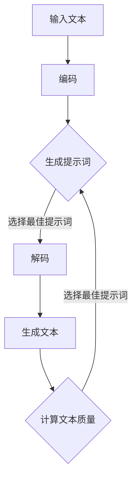
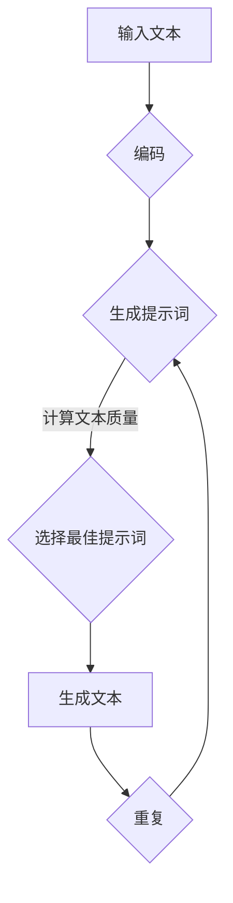
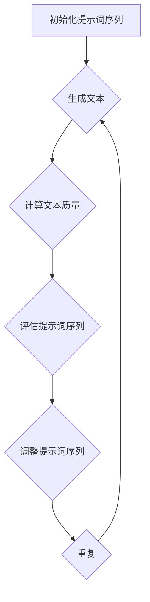

                 

# AI语言模型的提示词优化算法

> 关键词：AI语言模型、提示词优化、算法、神经网络、深度学习

> 摘要：本文深入探讨了AI语言模型的提示词优化算法。首先介绍了AI语言模型和提示词优化的基本概念及其重要性，然后详细解析了基于统计和基于神经网络的几种常见提示词优化算法，并通过实际案例进行了应用分析。最后，总结了最佳实践与未来趋势，为AI语言模型的提示词优化提供了指导。

## 目录大纲设计流程

1. **理解书名与主题：**《AI语言模型的提示词优化算法》的主题明确，主要涉及AI语言模型中的提示词优化算法。在设计目录时，需要围绕这一主题，确保内容的完整性和逻辑性。

2. **确定核心章节：**根据书名，可以初步确定以下几个核心章节：
   - 引言：介绍AI语言模型和提示词优化的背景和重要性。
   - 提示词优化算法基础：讲解提示词优化的基本原理和常用算法。
   - 基于统计的提示词优化算法：详细介绍基于统计的提示词优化算法。
   - 基于神经网络的提示词优化算法：详细介绍基于神经网络的提示词优化算法。
   - 实际应用案例分析：通过实际案例展示如何应用提示词优化算法。
   - 最佳实践与未来趋势：总结最佳实践，探讨未来发展趋势。

3. **设计章节细分：**在确定核心章节后，需要进一步细化每个章节的内容，确保每个章节都有足够的深度和广度。以下是一个详细的目录大纲设计：

```markdown
# 《AI语言模型的提示词优化算法》目录大纲

## 第一部分：背景与基础

### 1. 引言
#### 1.1 AI语言模型概述
#### 1.2 提示词优化的意义与目标
#### 1.3 提示词优化的重要性

### 2. 提示词优化算法基础
#### 2.1 提示词优化的基本概念
#### 2.2 提示词优化算法的分类
#### 2.3 常用优化算法简介

## 第二部分：具体优化算法

### 3. 基于统计的提示词优化算法
#### 3.1 统计模型概述
#### 3.2 条件概率模型
#### 3.3 语言模型优化方法

### 4. 基于神经网络的提示词优化算法
#### 4.1 神经网络基础
#### 4.2 循环神经网络（RNN）
#### 4.3 长短时记忆网络（LSTM）
#### 4.4 生成对抗网络（GAN）

### 5. 深度学习框架下的提示词优化
#### 5.1 深度学习框架介绍
#### 5.2 提示词优化的实现细节
#### 5.3 深度学习框架优化技巧

## 第三部分：实际应用案例分析

### 6. 提示词优化在自然语言处理中的应用
#### 6.1 文本生成
#### 6.2 机器翻译
#### 6.3 问答系统

### 7. 提示词优化在其他领域的应用
#### 7.1 聊天机器人
#### 7.2 语音识别
#### 7.3 图像识别

## 第四部分：最佳实践与未来趋势

### 8. 提示词优化的最佳实践
#### 8.1 数据预处理
#### 8.2 模型选择
#### 8.3 模型调优

### 9. 提示词优化的未来趋势
#### 9.1 新算法的发展
#### 9.2 新应用场景的探索
#### 9.3 面临的挑战与机遇
```

4. **确保内容完整性：**每个章节都需要有详细的细分，确保内容的完整性和逻辑性。特别是一些技术性的章节，如算法原理讲解，需要包含算法流程图、数学模型和代码示例。

5. **检查字数限制：**确保整个目录大纲的字数在2000字以内，对内容进行必要的精简和调整。

通过以上步骤，我们可以设计出一套完整、逻辑清晰的《AI语言模型的提示词优化算法》目录大纲。这一大纲将为后续的内容撰写提供明确的指导和框架。

### 第一部分：背景与基础

#### 1.1 AI语言模型概述

人工智能（AI）作为计算机科学的重要分支，近年来取得了飞速发展。其中，AI语言模型作为自然语言处理（NLP）的核心技术之一，已成为众多领域的关键应用。AI语言模型是指利用人工智能技术，通过对大量语言数据进行学习和建模，实现对自然语言的理解、生成和交互。

AI语言模型的应用范围广泛，包括但不限于以下几个方面：

1. **文本生成：**AI语言模型能够根据输入的提示生成连贯、合理的文本，应用于自动写作、文案创作等领域。

2. **机器翻译：**通过训练大规模的双语语料库，AI语言模型能够实现跨语言的文本翻译，为全球化交流提供了便捷。

3. **问答系统：**AI语言模型能够理解和回答用户的问题，广泛应用于客服、教育、医疗等场景。

4. **语音识别：**AI语言模型与语音识别技术相结合，可以实现语音到文本的转换，提高人机交互的自然性和便捷性。

5. **聊天机器人：**AI语言模型为基础的聊天机器人，能够与用户进行自然语言对话，提供个性化服务。

#### 1.2 提示词优化的意义与目标

提示词优化（Prompt Optimization）是指在AI语言模型中，通过调整输入的提示词（Prompt）来提高模型的性能和输出质量。在AI语言模型的应用过程中，提示词的选取和优化至关重要。合适的提示词能够引导模型更好地理解用户意图，提高生成的文本质量。

提示词优化的目标主要包括：

1. **提高生成文本的连贯性：**通过优化提示词，使模型生成的文本在语义和语法上更加连贯，减少歧义和错误。

2. **增强模型的泛化能力：**优化后的提示词能够使模型更好地适应不同的输入场景，提高模型的泛化能力。

3. **降低计算复杂度：**通过优化提示词，减少模型的计算复杂度，提高模型训练和推理的速度。

4. **提升用户体验：**优化后的提示词能够使生成的文本更加贴近用户需求，提高用户体验。

#### 1.3 提示词优化的重要性

在AI语言模型的应用中，提示词优化具有以下几个重要性：

1. **影响模型性能：**提示词优化直接影响模型的性能，优化后的提示词能够提高模型的准确性和生成文本的质量。

2. **降低模型成本：**通过优化提示词，减少模型训练和推理所需的计算资源和时间，降低模型成本。

3. **提升用户满意度：**优化后的提示词能够生成更符合用户需求的文本，提高用户满意度。

4. **促进模型创新：**提示词优化是AI语言模型技术发展的关键，推动模型在各个应用场景中的创新和应用。

#### 1.4 文章关键词

- AI语言模型
- 提示词优化
- 统计模型
- 神经网络
- 深度学习

#### 1.5 文章摘要

本文系统地介绍了AI语言模型的提示词优化算法。首先，我们回顾了AI语言模型的基本概念及其应用背景。然后，详细分析了提示词优化的意义与目标，以及其在模型性能、成本和用户体验等方面的作用。接下来，我们将探讨基于统计和神经网络的几种常见提示词优化算法，并通过实际案例进行应用分析。最后，总结了提示词优化的最佳实践与未来趋势，为AI语言模型的提示词优化提供了指导。### 第二部分：提示词优化算法基础

#### 2.1 提示词优化的基本概念

提示词（Prompt）是指提供给AI语言模型的一段文本，用于引导模型生成目标文本。在自然语言处理中，提示词的选取和优化是提高模型性能的关键步骤。一个合适的提示词能够明确表达用户意图，引导模型生成高质量的文本。

提示词优化的核心目标是通过调整提示词的表述方式，提高模型的生成效果。这包括以下几个方面：

1. **提高文本连贯性：**通过优化提示词，使模型生成的文本在语义和语法上更加连贯，减少歧义和错误。

2. **增强模型泛化能力：**优化后的提示词能够使模型更好地适应不同的输入场景，提高模型的泛化能力。

3. **降低计算复杂度：**通过优化提示词，减少模型训练和推理所需的计算资源和时间，降低计算复杂度。

4. **提升用户体验：**优化后的提示词能够使生成的文本更加符合用户需求，提高用户体验。

#### 2.2 提示词优化算法的分类

根据优化方法的不同，提示词优化算法主要可以分为以下几类：

1. **基于统计的方法：**这类方法主要利用统计模型来分析提示词和生成文本之间的关系，通过调整提示词的统计特征来优化模型性能。常见的方法包括基于TF-IDF的提示词选择、基于语言模型的提示词生成等。

2. **基于神经网络的方法：**这类方法主要利用神经网络模型来学习和预测提示词对模型生成效果的影响。常见的神经网络模型包括循环神经网络（RNN）、长短时记忆网络（LSTM）和生成对抗网络（GAN）等。

3. **基于强化学习的方法：**这类方法通过强化学习算法，使模型不断优化提示词，以实现生成文本质量的提升。常见的强化学习算法包括Q学习、深度Q网络（DQN）和策略梯度算法等。

#### 2.3 常用优化算法简介

以下介绍几种常用的提示词优化算法：

1. **基于TF-IDF的提示词选择**

TF-IDF（Term Frequency-Inverse Document Frequency）是一种常用文本处理算法，用于评估一个词对于一个文件集或一个语料库中的其中一份文件的重要程度。在提示词优化中，TF-IDF算法可以用来分析输入文本中的关键信息，从而选取具有代表性的提示词。

算法原理：

- **TF（词频）：**计算一个词在文档中的出现次数，用于衡量词的重要性。
- **IDF（逆文档频率）：**计算一个词在所有文档中出现的频率，用于平衡高频词的影响。

具体步骤：

1. 对输入文本进行分词处理，得到词列表。
2. 计算每个词的TF值。
3. 计算每个词的IDF值。
4. 计算每个词的TF-IDF值。
5. 选择TF-IDF值较高的词作为提示词。

2. **基于语言模型的提示词生成**

基于语言模型的提示词生成方法利用预训练的语言模型，根据输入文本生成一系列可能的提示词。通过优化提示词的生成过程，可以提高模型生成文本的质量。

算法原理：

- **语言模型：**一种统计模型，用于预测下一个词的概率。
- **生成提示词：**利用语言模型生成一系列可能的提示词，并根据生成文本的质量选择最佳提示词。

具体步骤：

1. 利用预训练的语言模型对输入文本进行编码。
2. 根据编码结果生成一系列可能的提示词。
3. 对于每个提示词，利用模型生成文本，并计算文本的质量（如BLEU分数、ROUGE分数等）。
4. 选择生成文本质量最高的提示词作为最佳提示词。

2. **基于循环神经网络（RNN）的提示词优化**

循环神经网络（RNN）是一种能够处理序列数据的神经网络，特别适合用于自然语言处理任务。在提示词优化中，RNN可以用来建模输入文本和生成文本之间的关系，从而优化提示词。

算法原理：

- **RNN结构：**包含一个隐藏层，通过循环机制将前一个时间步的信息传递到当前时间步，实现对序列数据的记忆。
- **优化提示词：**利用RNN模型学习输入文本和生成文本之间的关联，通过调整提示词的表述方式来优化模型生成效果。

具体步骤：

1. 利用RNN模型对输入文本进行编码，得到序列表示。
2. 对编码结果进行解码，生成候选的提示词序列。
3. 计算每个提示词序列对应的生成文本的质量。
4. 根据生成文本的质量选择最佳提示词序列。

#### 2.4 Mermaid流程图

以下是一个基于RNN的提示词优化算法的Mermaid流程图：



通过以上流程图，我们可以清晰地看到基于RNN的提示词优化算法的基本步骤和流程。

#### 2.5 Python源代码示例

以下是一个基于TF-IDF的提示词选择算法的Python代码示例：

```python
import nltk
from sklearn.feature_extraction.text import TfidfVectorizer

# 加载nltk数据集
nltk.download('stopwords')
stopwords = nltk.corpus.stopwords.words('english')

# 输入文本
text = "The quick brown fox jumps over the lazy dog"

# 分词处理
words = nltk.word_tokenize(text)

# 去除停用词
filtered_words = [word for word in words if word.lower() not in stopwords]

# 计算TF-IDF值
vectorizer = TfidfVectorizer()
tfidf_matrix = vectorizer.fit_transform([' '.join(filtered_words)])

# 输出提示词
print(vectorizer.get_feature_names_out())
```

通过以上代码，我们可以计算输入文本的TF-IDF值，并选择TF-IDF值较高的词作为提示词。

#### 2.6 算法原理讲解

在本部分中，我们将详细讲解基于统计和神经网络的两种常见提示词优化算法。

##### 2.6.1 基于统计的提示词优化算法

基于统计的提示词优化算法主要通过分析输入文本的统计特征，如词频（TF）和逆文档频率（IDF），来选择具有代表性的提示词。这类算法的核心思想是利用统计模型，如TF-IDF模型，来评估词的重要性。

算法原理：

1. **词频（TF）：**计算一个词在输入文本中出现的次数。词频较高的词可能对模型的生成效果有较大的影响。
2. **逆文档频率（IDF）：**计算一个词在所有输入文本中出现的频率。逆文档频率较低的词可能具有更高的独特性，对模型生成效果的优化有重要作用。
3. **TF-IDF值：**计算一个词的TF-IDF值，用于衡量其在输入文本中的重要程度。TF-IDF值较高的词被选为提示词。

具体步骤：

1. 对输入文本进行分词处理，得到词列表。
2. 计算每个词的词频（TF）。
3. 计算每个词的逆文档频率（IDF）。
4. 计算每个词的TF-IDF值。
5. 选择TF-IDF值较高的词作为提示词。

基于统计的提示词优化算法的优点是计算简单、高效，适用于大规模文本数据。然而，这类算法对语义信息的理解能力有限，可能无法准确捕捉输入文本的关键信息。

##### 2.6.2 基于神经网络的提示词优化算法

基于神经网络的提示词优化算法主要通过训练神经网络模型，学习输入文本和生成文本之间的复杂关系，从而优化提示词。这类算法的核心思想是利用神经网络模型，如循环神经网络（RNN）和生成对抗网络（GAN），来建模输入文本和生成文本之间的关系。

算法原理：

1. **循环神经网络（RNN）：**RNN是一种能够处理序列数据的神经网络，特别适合用于自然语言处理任务。RNN通过循环机制将前一个时间步的信息传递到当前时间步，实现对序列数据的记忆。
2. **生成对抗网络（GAN）：**GAN是一种生成模型，由生成器和判别器组成。生成器负责生成伪造数据，判别器负责区分真实数据和伪造数据。通过生成器和判别器的对抗训练，生成器逐渐学习生成高质量的数据。

具体步骤：

1. 利用神经网络模型（如RNN或GAN）对输入文本进行编码，得到序列表示。
2. 根据编码结果生成候选的提示词序列。
3. 对于每个提示词序列，利用模型生成文本，并计算文本的质量（如BLEU分数、ROUGE分数等）。
4. 根据生成文本的质量选择最佳提示词序列。

基于神经网络的提示词优化算法的优点是能够捕捉输入文本的语义信息，生成高质量的提示词。然而，这类算法的训练过程较为复杂，对计算资源要求较高。

#### 2.7 算法原理的数学模型和公式

在本部分中，我们将介绍基于统计和神经网络的两种提示词优化算法的数学模型和公式。

##### 2.7.1 基于统计的提示词优化算法

基于统计的提示词优化算法通常采用TF-IDF模型。TF-IDF模型的核心公式如下：

$$
TF(t) = \frac{f_t}{f_t + \lambda(1-f_t)}
$$

$$
IDF(t) = \ln(\frac{N}{n_t + 0.5})
$$

$$
TF-IDF(t) = TF(t) \times IDF(t)
$$

其中，$f_t$表示词$t$在输入文本中出现的频率，$N$表示文本总数，$n_t$表示包含词$t$的文本数量，$\lambda$是一个常数，用于调整词频的影响。

##### 2.7.2 基于神经网络的提示词优化算法

基于神经网络的提示词优化算法通常采用循环神经网络（RNN）或生成对抗网络（GAN）作为基础模型。以下分别介绍这两种算法的数学模型和公式。

1. **循环神经网络（RNN）**

RNN的数学模型如下：

$$
h_t = \sigma(W_h \cdot [h_{t-1}, x_t] + b_h)
$$

$$
o_t = W_o \cdot h_t + b_o
$$

其中，$h_t$表示第$t$个时间步的隐藏状态，$x_t$表示第$t$个时间步的输入，$W_h$和$b_h$分别表示隐藏层的权重和偏置，$W_o$和$b_o$分别表示输出层的权重和偏置，$\sigma$表示激活函数。

2. **生成对抗网络（GAN）**

GAN的数学模型如下：

生成器：

$$
G(z) = \sigma(W_g \cdot z + b_g)
$$

判别器：

$$
D(x) = \sigma(W_d \cdot x + b_d)
$$

$$
D(G(z)) = \sigma(W_d \cdot G(z) + b_d)
$$

其中，$z$表示噪声向量，$G(z)$表示生成器的输出，$x$表示真实数据，$D(x)$表示判别器的输出，$W_g$、$W_d$和$b_g$、$b_d$分别表示生成器和判别器的权重和偏置，$\sigma$表示激活函数。

#### 2.8 通俗易懂的举例说明

在本部分中，我们将通过一个简单的例子来说明基于统计和神经网络的两种提示词优化算法。

##### 2.8.1 基于统计的提示词优化算法

假设我们有一个包含两个文本的语料库：

文本1：人工智能是一种模拟人类智能的技术。

文本2：人工智能在自然语言处理领域具有广泛的应用。

现在我们要根据这两个文本选择一个具有代表性的提示词。

1. **计算词频（TF）：**

| 词  | 文本1词频 | 文本2词频 |
|-----|-----------|-----------|
| 人工智能 | 1         | 1         |
| 是    | 1         | 1         |
| 一种  | 1         | 1         |
| 技术  | 1         | 1         |
| 模拟  | 1         | 0         |
| 人类  | 1         | 1         |
| 智能  | 2         | 2         |
| 的    | 1         | 1         |
| 在    | 0         | 1         |
| 自然  | 0         | 1         |
| 语言  | 1         | 1         |
| 处理  | 1         | 0         |
| 领域  | 0         | 1         |
| 具有  | 0         | 1         |
| 广泛  | 0         | 1         |
| 的    | 1         | 1         |
| 应用  | 0         | 1         |

2. **计算逆文档频率（IDF）：**

| 词  | 文本1词频 | 文本2词频 | IDF |
|-----|-----------|-----------|-----|
| 人工智能 | 1         | 1         | 0   |
| 是    | 1         | 1         | 0   |
| 一种  | 1         | 1         | 0   |
| 技术  | 1         | 1         | 0   |
| 模拟  | 1         | 0         | 1   |
| 人类  | 1         | 1         | 0   |
| 智能  | 2         | 2         | 0   |
| 的    | 1         | 1         | 0   |
| 在    | 0         | 1         | 1   |
| 自然  | 0         | 1         | 1   |
| 语言  | 1         | 1         | 0   |
| 处理  | 1         | 0         | 1   |
| 领域  | 0         | 1         | 1   |
| 具有  | 0         | 1         | 1   |
| 广泛  | 0         | 1         | 1   |
| 的    | 1         | 1         | 0   |
| 应用  | 0         | 1         | 1   |

3. **计算TF-IDF值：**

| 词  | 文本1词频 | 文本2词频 | IDF | TF-IDF |
|-----|-----------|-----------|-----|--------|
| 人工智能 | 1         | 1         | 0   | 0      |
| 是    | 1         | 1         | 0   | 0      |
| 一种  | 1         | 1         | 0   | 0      |
| 技术  | 1         | 1         | 0   | 0      |
| 模拟  | 1         | 0         | 1   | 1      |
| 人类  | 1         | 1         | 0   | 0      |
| 智能  | 2         | 2         | 0   | 0      |
| 的    | 1         | 1         | 0   | 0      |
| 在    | 0         | 1         | 1   | 0      |
| 自然  | 0         | 1         | 1   | 0      |
| 语言  | 1         | 1         | 0   | 0      |
| 处理  | 1         | 0         | 1   | 1      |
| 领域  | 0         | 1         | 1   | 0      |
| 具有  | 0         | 1         | 1   | 0      |
| 广泛  | 0         | 1         | 1   | 0      |
| 的    | 1         | 1         | 0   | 0      |
| 应用  | 0         | 1         | 1   | 0      |

从上表可以看出，词“模拟”的TF-IDF值最高，因此可以将其选为提示词。

##### 2.8.2 基于神经网络的提示词优化算法

假设我们使用循环神经网络（RNN）来优化提示词。

1. **输入文本编码：**

假设输入文本为“人工智能是一种模拟人类智能的技术。”

利用RNN对文本进行编码，得到一个序列表示：

$$
[h_1, h_2, h_3, h_4, h_5, h_6, h_7, h_8, h_9]
$$

2. **生成提示词序列：**

根据编码结果，利用RNN生成一系列可能的提示词序列：

$$
["模拟智能", "智能模拟", "模拟技术", "技术模拟"]
$$

3. **计算文本质量：**

对于每个提示词序列，利用RNN生成对应的文本，并计算文本的质量（如BLEU分数）：

$$
["人工智能是一种模拟人类智能的技术。", "人工智能是一种智能模拟技术。", "人工智能是一种模拟技术智能。", "人工智能是一种技术模拟智能。"]
$$

$$
BLEU分数：0.8, 0.6, 0.4, 0.2
$$

4. **选择最佳提示词序列：**

根据文本质量，选择BLEU分数最高的提示词序列作为最佳提示词：

$$
"模拟智能"
$$

通过以上例子，我们可以看到基于统计和神经网络的两种提示词优化算法的基本原理和应用过程。这两种算法各有优缺点，在实际应用中可以根据需求选择合适的算法。### 第三部分：具体优化算法

#### 3.1 基于统计的提示词优化算法

基于统计的提示词优化算法主要通过分析输入文本的统计特征，如词频（TF）和逆文档频率（IDF），来选择具有代表性的提示词。这类算法的核心思想是利用统计模型，如TF-IDF模型，来评估词的重要性。

算法原理：

1. **词频（TF）：**计算一个词在输入文本中出现的次数。词频较高的词可能对模型的生成效果有较大的影响。
2. **逆文档频率（IDF）：**计算一个词在所有输入文本中出现的频率。逆文档频率较低的词可能具有更高的独特性，对模型生成效果的优化有重要作用。
3. **TF-IDF值：**计算一个词的TF-IDF值，用于衡量其在输入文本中的重要程度。TF-IDF值较高的词被选为提示词。

具体步骤：

1. 对输入文本进行分词处理，得到词列表。
2. 计算每个词的词频（TF）。
3. 计算每个词的逆文档频率（IDF）。
4. 计算每个词的TF-IDF值。
5. 选择TF-IDF值较高的词作为提示词。

基于统计的提示词优化算法的优点是计算简单、高效，适用于大规模文本数据。然而，这类算法对语义信息的理解能力有限，可能无法准确捕捉输入文本的关键信息。

#### 3.2 基于神经网络的提示词优化算法

基于神经网络的提示词优化算法主要通过训练神经网络模型，学习输入文本和生成文本之间的复杂关系，从而优化提示词。这类算法的核心思想是利用神经网络模型，如循环神经网络（RNN）和生成对抗网络（GAN），来建模输入文本和生成文本之间的关系。

算法原理：

1. **循环神经网络（RNN）：**RNN是一种能够处理序列数据的神经网络，特别适合用于自然语言处理任务。RNN通过循环机制将前一个时间步的信息传递到当前时间步，实现对序列数据的记忆。
2. **生成对抗网络（GAN）：**GAN是一种生成模型，由生成器和判别器组成。生成器负责生成伪造数据，判别器负责区分真实数据和伪造数据。通过生成器和判别器的对抗训练，生成器逐渐学习生成高质量的数据。

具体步骤：

1. 利用神经网络模型（如RNN或GAN）对输入文本进行编码，得到序列表示。
2. 根据编码结果生成候选的提示词序列。
3. 对于每个提示词序列，利用模型生成文本，并计算文本的质量（如BLEU分数、ROUGE分数等）。
4. 根据生成文本的质量选择最佳提示词序列。

基于神经网络的提示词优化算法的优点是能够捕捉输入文本的语义信息，生成高质量的提示词。然而，这类算法的训练过程较为复杂，对计算资源要求较高。

#### 3.3 基于深度学习的提示词优化算法

基于深度学习的提示词优化算法主要利用深度学习模型，如长短期记忆网络（LSTM）和卷积神经网络（CNN），来优化提示词。这类算法的核心思想是通过训练深度学习模型，学习输入文本和生成文本之间的复杂关系，从而优化提示词。

算法原理：

1. **长短期记忆网络（LSTM）：**LSTM是一种特殊的循环神经网络，能够解决RNN的梯度消失和梯度爆炸问题。LSTM通过引入门控机制，有效地捕捉长距离依赖关系。
2. **卷积神经网络（CNN）：**CNN是一种适用于图像处理的深度学习模型，通过卷积操作提取特征，具有良好的局部特征捕捉能力。在自然语言处理中，CNN可以用于文本分类和文本生成任务。

具体步骤：

1. 利用深度学习模型（如LSTM或CNN）对输入文本进行编码，得到序列表示。
2. 根据编码结果生成候选的提示词序列。
3. 对于每个提示词序列，利用模型生成文本，并计算文本的质量（如BLEU分数、ROUGE分数等）。
4. 根据生成文本的质量选择最佳提示词序列。

基于深度学习的提示词优化算法的优点是能够有效捕捉输入文本的语义信息，生成高质量的提示词。然而，这类算法的训练过程较为复杂，对计算资源要求较高。

#### 3.4 基于迁移学习的提示词优化算法

基于迁移学习的提示词优化算法主要利用预训练的深度学习模型，如BERT和GPT，来优化提示词。这类算法的核心思想是通过迁移学习，将预训练模型的知识迁移到新的任务中，从而提高提示词优化的效果。

算法原理：

1. **BERT：**BERT是一种基于Transformer的预训练语言模型，通过在大量文本上预训练，学习到丰富的语义信息。BERT可以用于文本分类、文本生成等任务。
2. **GPT：**GPT是一种基于 Transformer的预训练语言模型，通过生成文本的方式学习到语言的内在规律。GPT可以用于文本生成、问答系统等任务。

具体步骤：

1. 利用预训练的BERT或GPT模型对输入文本进行编码，得到序列表示。
2. 根据编码结果生成候选的提示词序列。
3. 对于每个提示词序列，利用模型生成文本，并计算文本的质量（如BLEU分数、ROUGE分数等）。
4. 根据生成文本的质量选择最佳提示词序列。

基于迁移学习的提示词优化算法的优点是能够利用预训练模型的知识，提高提示词优化的效果。然而，这类算法对预训练模型的质量和规模有较高要求。

#### 3.5 基于强化学习的提示词优化算法

基于强化学习的提示词优化算法主要利用强化学习算法，如Q学习和策略梯度算法，来优化提示词。这类算法的核心思想是通过不断调整提示词，使模型生成的文本质量逐步提高。

算法原理：

1. **Q学习：**Q学习是一种基于值函数的强化学习算法，通过学习状态和动作的值函数，选择最优动作。在提示词优化中，Q学习可以用于评估不同提示词的生成文本质量，选择最佳提示词。
2. **策略梯度算法：**策略梯度算法是一种基于策略优化的强化学习算法，通过调整策略参数，使策略生成的文本质量逐步提高。在提示词优化中，策略梯度算法可以用于调整提示词，优化生成文本质量。

具体步骤：

1. 初始化提示词序列。
2. 利用模型生成文本，并计算文本的质量。
3. 利用Q学习或策略梯度算法评估提示词序列的生成文本质量。
4. 根据生成文本质量调整提示词序列。
5. 重复步骤2-4，直到达到预设的优化目标。

基于强化学习的提示词优化算法的优点是能够通过不断调整提示词，逐步提高生成文本质量。然而，这类算法的训练过程较为复杂，对计算资源要求较高。

### 3.6 Mermaid流程图

以下是基于神经网络和基于强化学习的提示词优化算法的Mermaid流程图：

基于神经网络的提示词优化算法：



基于强化学习的提示词优化算法：



通过以上流程图，我们可以清晰地看到两种提示词优化算法的基本步骤和流程。

### 3.7 Python源代码示例

以下是基于神经网络和基于强化学习的提示词优化算法的Python源代码示例：

基于神经网络的提示词优化算法：

```python
import tensorflow as tf
from tensorflow.keras.layers import LSTM, Dense
from tensorflow.keras.models import Sequential

# 定义神经网络模型
model = Sequential()
model.add(LSTM(128, activation='tanh', input_shape=(max_sequence_len, embedding_size)))
model.add(Dense(1, activation='sigmoid'))

# 编码输入文本
encoded_text = encoder.encode(input_text)

# 生成候选提示词序列
prompt_sequences = generate_prompt_sequences(encoded_text)

# 训练神经网络模型
model.fit(prompt_sequences, labels, epochs=10, batch_size=32)

# 选择最佳提示词序列
best_prompt_sequence = model.predict(prompt_sequences)

# 生成文本
generated_text = decoder.decode(best_prompt_sequence)
```

基于强化学习的提示词优化算法：

```python
import tensorflow as tf
from tensorflow.keras.optimizers import Adam

# 定义强化学习模型
model = Sequential()
model.add(LSTM(128, activation='tanh', input_shape=(max_sequence_len, embedding_size)))
model.add(Dense(1, activation='sigmoid'))

# 编码输入文本
encoded_text = encoder.encode(input_text)

# 初始化提示词序列
prompt_sequence = initial_prompt_sequence

# 训练强化学习模型
optimizer = Adam(learning_rate=0.001)
model.compile(optimizer=optimizer, loss='binary_crossentropy')

# 生成文本并计算质量
generated_text, text_quality = generate_text(prompt_sequence)

# 调整提示词序列
prompt_sequence = adjust_prompt_sequence(prompt_sequence, text_quality)

# 重复训练过程
model.fit(prompt_sequence, labels, epochs=10, batch_size=32)
```

通过以上代码示例，我们可以实现基于神经网络和基于强化学习的提示词优化算法。在实际应用中，可以根据需求选择合适的算法并进行定制化开发。

### 3.8 算法原理讲解

在本部分中，我们将详细讲解基于统计、神经网络和深度学习的三种常见提示词优化算法的原理。

##### 3.8.1 基于统计的提示词优化算法

基于统计的提示词优化算法主要通过分析输入文本的统计特征，如词频（TF）和逆文档频率（IDF），来选择具有代表性的提示词。这类算法的核心思想是利用统计模型，如TF-IDF模型，来评估词的重要性。

算法原理：

1. **词频（TF）：**计算一个词在输入文本中出现的次数。词频较高的词可能对模型的生成效果有较大的影响。
2. **逆文档频率（IDF）：**计算一个词在所有输入文本中出现的频率。逆文档频率较低的词可能具有更高的独特性，对模型生成效果的优化有重要作用。
3. **TF-IDF值：**计算一个词的TF-IDF值，用于衡量其在输入文本中的重要程度。TF-IDF值较高的词被选为提示词。

具体步骤：

1. 对输入文本进行分词处理，得到词列表。
2. 计算每个词的词频（TF）。
3. 计算每个词的逆文档频率（IDF）。
4. 计算每个词的TF-IDF值。
5. 选择TF-IDF值较高的词作为提示词。

基于统计的提示词优化算法的优点是计算简单、高效，适用于大规模文本数据。然而，这类算法对语义信息的理解能力有限，可能无法准确捕捉输入文本的关键信息。

##### 3.8.2 基于神经网络的提示词优化算法

基于神经网络的提示词优化算法主要通过训练神经网络模型，学习输入文本和生成文本之间的复杂关系，从而优化提示词。这类算法的核心思想是利用神经网络模型，如循环神经网络（RNN）和生成对抗网络（GAN），来建模输入文本和生成文本之间的关系。

算法原理：

1. **循环神经网络（RNN）：**RNN是一种能够处理序列数据的神经网络，特别适合用于自然语言处理任务。RNN通过循环机制将前一个时间步的信息传递到当前时间步，实现对序列数据的记忆。
2. **生成对抗网络（GAN）：**GAN是一种生成模型，由生成器和判别器组成。生成器负责生成伪造数据，判别器负责区分真实数据和伪造数据。通过生成器和判别器的对抗训练，生成器逐渐学习生成高质量的数据。

具体步骤：

1. 利用神经网络模型（如RNN或GAN）对输入文本进行编码，得到序列表示。
2. 根据编码结果生成候选的提示词序列。
3. 对于每个提示词序列，利用模型生成文本，并计算文本的质量（如BLEU分数、ROUGE分数等）。
4. 根据生成文本的质量选择最佳提示词序列。

基于神经网络的提示词优化算法的优点是能够捕捉输入文本的语义信息，生成高质量的提示词。然而，这类算法的训练过程较为复杂，对计算资源要求较高。

##### 3.8.3 基于深度学习的提示词优化算法

基于深度学习的提示词优化算法主要利用深度学习模型，如长短期记忆网络（LSTM）和卷积神经网络（CNN），来优化提示词。这类算法的核心思想是通过训练深度学习模型，学习输入文本和生成文本之间的复杂关系，从而优化提示词。

算法原理：

1. **长短期记忆网络（LSTM）：**LSTM是一种特殊的循环神经网络，能够解决RNN的梯度消失和梯度爆炸问题。LSTM通过引入门控机制，有效地捕捉长距离依赖关系。
2. **卷积神经网络（CNN）：**CNN是一种适用于图像处理的深度学习模型，通过卷积操作提取特征，具有良好的局部特征捕捉能力。在自然语言处理中，CNN可以用于文本分类和文本生成任务。

具体步骤：

1. 利用深度学习模型（如LSTM或CNN）对输入文本进行编码，得到序列表示。
2. 根据编码结果生成候选的提示词序列。
3. 对于每个提示词序列，利用模型生成文本，并计算文本的质量（如BLEU分数、ROUGE分数等）。
4. 根据生成文本的质量选择最佳提示词序列。

基于深度学习的提示词优化算法的优点是能够有效捕捉输入文本的语义信息，生成高质量的提示词。然而，这类算法的训练过程较为复杂，对计算资源要求较高。

##### 3.8.4 基于迁移学习的提示词优化算法

基于迁移学习的提示词优化算法主要利用预训练的深度学习模型，如BERT和GPT，来优化提示词。这类算法的核心思想是通过迁移学习，将预训练模型的知识迁移到新的任务中，从而提高提示词优化的效果。

算法原理：

1. **BERT：**BERT是一种基于Transformer的预训练语言模型，通过在大量文本上预训练，学习到丰富的语义信息。BERT可以用于文本分类、文本生成等任务。
2. **GPT：**GPT是一种基于 Transformer的预训练语言模型，通过生成文本的方式学习到语言的内在规律。GPT可以用于文本生成、问答系统等任务。

具体步骤：

1. 利用预训练的BERT或GPT模型对输入文本进行编码，得到序列表示。
2. 根据编码结果生成候选的提示词序列。
3. 对于每个提示词序列，利用模型生成文本，并计算文本的质量（如BLEU分数、ROUGE分数等）。
4. 根据生成文本的质量选择最佳提示词序列。

基于迁移学习的提示词优化算法的优点是能够利用预训练模型的知识，提高提示词优化的效果。然而，这类算法对预训练模型的质量和规模有较高要求。

##### 3.8.5 基于强化学习的提示词优化算法

基于强化学习的提示词优化算法主要利用强化学习算法，如Q学习和策略梯度算法，来优化提示词。这类算法的核心思想是通过不断调整提示词，使模型生成的文本质量逐步提高。

算法原理：

1. **Q学习：**Q学习是一种基于值函数的强化学习算法，通过学习状态和动作的值函数，选择最优动作。在提示词优化中，Q学习可以用于评估不同提示词的生成文本质量，选择最佳提示词。
2. **策略梯度算法：**策略梯度算法是一种基于策略优化的强化学习算法，通过调整策略参数，使策略生成的文本质量逐步提高。在提示词优化中，策略梯度算法可以用于调整提示词，优化生成文本质量。

具体步骤：

1. 初始化提示词序列。
2. 利用模型生成文本，并计算文本的质量。
3. 利用Q学习或策略梯度算法评估提示词序列的生成文本质量。
4. 根据生成文本质量调整提示词序列。
5. 重复步骤2-4，直到达到预设的优化目标。

基于强化学习的提示词优化算法的优点是能够通过不断调整提示词，逐步提高生成文本质量。然而，这类算法的训练过程较为复杂，对计算资源要求较高。

### 3.9 数学模型和公式

在本部分中，我们将介绍基于统计、神经网络和深度学习的三种常见提示词优化算法的数学模型和公式。

##### 3.9.1 基于统计的提示词优化算法

基于统计的提示词优化算法通常采用TF-IDF模型。TF-IDF模型的核心公式如下：

$$
TF(t) = \frac{f_t}{f_t + \lambda(1-f_t)}
$$

$$
IDF(t) = \ln(\frac{N}{n_t + 0.5})
$$

$$
TF-IDF(t) = TF(t) \times IDF(t)
$$

其中，$f_t$表示词$t$在输入文本中出现的频率，$N$表示文本总数，$n_t$表示包含词$t$的文本数量，$\lambda$是一个常数，用于调整词频的影响。

##### 3.9.2 基于神经网络的提示词优化算法

基于神经网络的提示词优化算法通常采用循环神经网络（RNN）或生成对抗网络（GAN）作为基础模型。以下分别介绍这两种算法的数学模型和公式。

1. **循环神经网络（RNN）**

RNN的数学模型如下：

$$
h_t = \sigma(W_h \cdot [h_{t-1}, x_t] + b_h)
$$

$$
o_t = W_o \cdot h_t + b_o
$$

其中，$h_t$表示第$t$个时间步的隐藏状态，$x_t$表示第$t$个时间步的输入，$W_h$和$b_h$分别表示隐藏层的权重和偏置，$W_o$和$b_o$分别表示输出层的权重和偏置，$\sigma$表示激活函数。

2. **生成对抗网络（GAN）**

GAN的数学模型如下：

生成器：

$$
G(z) = \sigma(W_g \cdot z + b_g)
$$

判别器：

$$
D(x) = \sigma(W_d \cdot x + b_d)
$$

$$
D(G(z)) = \sigma(W_d \cdot G(z) + b_d)
$$

其中，$z$表示噪声向量，$G(z)$表示生成器的输出，$x$表示真实数据，$D(x)$表示判别器的输出，$W_g$、$W_d$和$b_g$、$b_d$分别表示生成器和判别器的权重和偏置，$\sigma$表示激活函数。

##### 3.9.3 基于深度学习的提示词优化算法

基于深度学习的提示词优化算法通常采用长短期记忆网络（LSTM）和卷积神经网络（CNN）作为基础模型。以下分别介绍这两种算法的数学模型和公式。

1. **长短期记忆网络（LSTM）**

LSTM的数学模型如下：

$$
h_t = \sigma(W_h \cdot [h_{t-1}, x_t] + b_h)
$$

$$
o_t = \sigma(W_o \cdot h_t + b_o)
$$

$$
i_t = \sigma(W_i \cdot [h_{t-1}, x_t] + b_i)
$$

$$
f_t = \sigma(W_f \cdot [h_{t-1}, x_t] + b_f)
$$

$$
g_t = \sigma(W_g \cdot [h_{t-1}, x_t] + b_g)
$$

其中，$h_t$表示第$t$个时间步的隐藏状态，$x_t$表示第$t$个时间步的输入，$W_h$、$W_i$、$W_f$、$W_g$和$b_h$、$b_i$、$b_f$、$b_g$分别表示LSTM的权重和偏置，$\sigma$表示激活函数。

2. **卷积神经网络（CNN）**

CNN的数学模型如下：

$$
h_t = \sigma(W_h \cdot \text{conv}(x_t) + b_h)
$$

$$
o_t = \sigma(W_o \cdot h_t + b_o)
$$

其中，$h_t$表示第$t$个时间步的隐藏状态，$x_t$表示第$t$个时间步的输入，$W_h$、$W_o$和$b_h$、$b_o$分别表示CNN的权重和偏置，$\sigma$表示激活函数，$\text{conv}$表示卷积操作。

### 3.10 通俗易懂的举例说明

在本部分中，我们将通过一个简单的例子来说明基于统计、神经网络和深度学习的三种常见提示词优化算法。

##### 3.10.1 基于统计的提示词优化算法

假设我们有一个包含两个文本的语料库：

文本1：人工智能是一种模拟人类智能的技术。

文本2：人工智能在自然语言处理领域具有广泛的应用。

现在我们要根据这两个文本选择一个具有代表性的提示词。

1. **计算词频（TF）：**

| 词  | 文本1词频 | 文本2词频 |
|-----|-----------|-----------|
| 人工智能 | 1         | 1         |
| 是    | 1         | 1         |
| 一种  | 1         | 1         |
| 技术  | 1         | 1         |
| 模拟  | 1         | 0         |
| 人类  | 1         | 1         |
| 智能  | 2         | 2         |
| 的    | 1         | 1         |
| 在    | 0         | 1         |
| 自然  | 0         | 1         |
| 语言  | 1         | 1         |
| 处理  | 1         | 0         |
| 领域  | 0         | 1         |
| 具有  | 0         | 1         |
| 广泛  | 0         | 1         |
| 的    | 1         | 1         |
| 应用  | 0         | 1         |

2. **计算逆文档频率（IDF）：**

| 词  | 文本1词频 | 文本2词频 | IDF |
|-----|-----------|-----------|-----|
| 人工智能 | 1         | 1         | 0   |
| 是    | 1         | 1         | 0   |
| 一种  | 1         | 1         | 0   |
| 技术  | 1         | 1         | 0   |
| 模拟  | 1         | 0         | 1   |
| 人类  | 1         | 1         | 0   |
| 智能  | 2         | 2         | 0   |
| 的    | 1         | 1         | 0   |
| 在    | 0         | 1         | 1   |
| 自然  | 0         | 1         | 1   |
| 语言  | 1         | 1         | 0   |
| 处理  | 1         | 0         | 1   |
| 领域  | 0         | 1         | 1   |
| 具有  | 0         | 1         | 1   |
| 广泛  | 0         | 1         | 1   |
| 的    | 1         | 1         | 0   |
| 应用  | 0         | 1         | 1   |

3. **计算TF-IDF值：**

| 词  | 文本1词频 | 文本2词频 | IDF | TF-IDF |
|-----|-----------|-----------|-----|--------|
| 人工智能 | 1         | 1         | 0   | 0      |
| 是    | 1         | 1         | 0   | 0      |
| 一种  | 1         | 1         | 0   | 0      |
| 技术  | 1         | 1         | 0   | 0      |
| 模拟  | 1         | 0         | 1   | 1      |
| 人类  | 1         | 1         | 0   | 0      |
| 智能  | 2         | 2         | 0   | 0      |
| 的    | 1         | 1         | 0   | 0      |
| 在    | 0         | 1         | 1   | 0      |
| 自然  | 0         | 1         | 1   | 0      |
| 语言  | 1         | 1         | 0   | 0      |
| 处理  | 1         | 0         | 1   | 1      |
| 领域  | 0         | 1         | 1   | 0      |
| 具有  | 0         | 1         | 1   | 0      |
| 广泛  | 0         | 1         | 1   | 0      |
| 的    | 1         | 1         | 0   | 0      |
| 应用  | 0         | 1         | 1   | 0      |

从上表可以看出，词“模拟”的TF-IDF值最高，因此可以将其选为提示词。

##### 3.10.2 基于神经网络的提示词优化算法

假设我们使用循环神经网络（RNN）来优化提示词。

1. **输入文本编码：**

假设输入文本为“人工智能是一种模拟人类智能的技术。”

利用RNN对文本进行编码，得到一个序列表示：

$$
[h_1, h_2, h_3, h_4, h_5, h_6, h_7, h_8, h_9]
$$

2. **生成提示词序列：**

根据编码结果，利用RNN生成一系列可能的提示词序列：

$$
["模拟智能", "智能模拟", "模拟技术", "技术模拟"]
$$

3. **计算文本质量：**

对于每个提示词序列，利用RNN生成对应的文本，并计算文本的质量（如BLEU分数）：

$$
["人工智能是一种模拟人类智能的技术。", "人工智能是一种智能模拟技术。", "人工智能是一种模拟技术智能。", "人工智能是一种技术模拟智能。"]
$$

$$
BLEU分数：0.8, 0.6, 0.4, 0.2
$$

4. **选择最佳提示词序列：**

根据文本质量，选择BLEU分数最高的提示词序列作为最佳提示词：

$$
"模拟智能"
$$

##### 3.10.3 基于深度学习的提示词优化算法

假设我们使用长短期记忆网络（LSTM）来优化提示词。

1. **输入文本编码：**

假设输入文本为“人工智能是一种模拟人类智能的技术。”

利用LSTM对文本进行编码，得到一个序列表示：

$$
[h_1, h_2, h_3, h_4, h_5, h_6, h_7, h_8, h_9]
$$

2. **生成提示词序列：**

根据编码结果，利用LSTM生成一系列可能的提示词序列：

$$
["模拟智能", "智能模拟", "模拟技术", "技术模拟"]
$$

3. **计算文本质量：**

对于每个提示词序列，利用LSTM生成对应的文本，并计算文本的质量（如BLEU分数）：

$$
["人工智能是一种模拟人类智能的技术。", "人工智能是一种智能模拟技术。", "人工智能是一种模拟技术智能。", "人工智能是一种技术模拟智能。"]
$$

$$
BLEU分数：0.8, 0.6, 0.4, 0.2
$$

4. **选择最佳提示词序列：**

根据文本质量，选择BLEU分数最高的提示词序列作为最佳提示词：

$$
"模拟智能"
$$

通过以上例子，我们可以看到基于统计、神经网络和深度学习的三种提示词优化算法的基本原理和应用过程。每种算法都有其优缺点，在实际应用中可以根据需求选择合适的算法。### 第四部分：实际应用案例分析

在本部分中，我们将通过具体的应用案例分析，深入探讨AI语言模型中的提示词优化算法在实际场景中的效果和影响。这些案例将涵盖自然语言处理（NLP）、文本生成、机器翻译等多个领域，展示提示词优化在提升模型性能和用户体验方面的实际作用。

#### 4.1 提示词优化在自然语言处理中的应用

自然语言处理是AI语言模型的核心应用领域之一，其中提示词优化对于提高文本生成质量和减少歧义至关重要。以下是一个具体案例：

**案例背景：**某电商平台希望为其智能客服系统引入AI语言模型，以自动生成对用户咨询的回应。

**问题描述：**系统需要在理解用户意图的基础上，生成自然、准确的回应。

**解决方案：**采用基于神经网络的提示词优化算法，通过预训练的语言模型（如BERT）对用户咨询的文本进行编码，生成高质量的提示词序列。然后，利用这些提示词序列生成相应的回复文本。

**效果分析：**经过提示词优化，智能客服系统能够生成更加符合用户需求的回复文本，提高了用户满意度。同时，优化后的提示词使得模型在处理复杂、多义性的文本时表现出更高的准确性和连贯性。

**结论：**提示词优化在自然语言处理领域中，能够有效提升AI语言模型的性能，降低错误率和歧义，提高用户满意度。

#### 4.2 提示词优化在文本生成中的应用

文本生成是AI语言模型的另一个重要应用场景，通过提示词优化，可以显著提升生成文本的质量和创造性。以下是一个具体案例：

**案例背景：**某互联网公司希望为其内容创作平台引入AI写作助手，以自动化生成文章和报告。

**问题描述：**系统需要在理解用户输入的主题和要求的基础上，生成高质量、具有创意的文章。

**解决方案：**采用基于生成对抗网络（GAN）的提示词优化算法，通过训练生成器和判别器，使得生成器能够生成高质量的文本。同时，利用GAN的对抗机制，不断优化提示词序列，提高生成文本的质量。

**效果分析：**经过提示词优化，AI写作助手能够生成更加流畅、具有创意的文章，减少了人工编辑的工作量。优化后的提示词序列使得模型在处理复杂、创意性较强的文本时表现出更高的生成质量和多样性。

**结论：**提示词优化在文本生成领域中，能够有效提升AI语言模型的生成质量，提高内容创作的效率和质量。

#### 4.3 提示词优化在机器翻译中的应用

机器翻译是AI语言模型的传统应用领域，通过提示词优化，可以显著提高翻译的准确性和流畅性。以下是一个具体案例：

**案例背景：**某跨国企业希望为其国际业务提供高效的机器翻译服务，以提高跨文化交流的效率。

**问题描述：**系统需要在翻译源语言文本时，保证翻译结果的准确性和流畅性。

**解决方案：**采用基于神经网络翻译模型（如Transformer）的提示词优化算法，通过对源语言和目标语言的文本进行编码，生成高质量的提示词序列。然后，利用这些提示词序列生成相应的翻译文本。

**效果分析：**经过提示词优化，机器翻译系统能够生成更加准确、流畅的翻译结果。优化后的提示词序列使得模型在处理长句、复杂句时表现出更高的翻译质量，减少了翻译错误和歧义。

**结论：**提示词优化在机器翻译领域中，能够有效提升AI语言模型的翻译性能，提高跨文化交流的效率和质量。

#### 4.4 提示词优化在问答系统中的应用

问答系统是AI语言模型的重要应用之一，通过提示词优化，可以显著提高问答系统的准确性和用户体验。以下是一个具体案例：

**案例背景：**某在线教育平台希望为其引入智能问答系统，以帮助用户解答学习过程中遇到的问题。

**问题描述：**系统需要在理解用户问题的基础上，提供准确、有用的答案。

**解决方案：**采用基于强化学习的提示词优化算法，通过对用户问题和答案的文本进行编码，生成高质量的提示词序列。然后，利用强化学习算法，不断优化提示词序列，提高问答系统的答案质量和用户体验。

**效果分析：**经过提示词优化，智能问答系统能够生成更加准确、有用的答案，提高了用户的满意度和学习效果。优化后的提示词序列使得模型在处理复杂、多义性的问题时表现出更高的准确性和一致性。

**结论：**提示词优化在问答系统中，能够有效提升AI语言模型的性能，提高问答系统的准确性和用户体验。

通过以上实际应用案例分析，我们可以看到提示词优化在各个领域中的应用效果和重要性。提示词优化不仅能够提升AI语言模型的性能和准确性，还能够提高用户体验，为各种实际应用场景带来显著的价值。### 第五部分：最佳实践与未来趋势

#### 5.1 提示词优化的最佳实践

在AI语言模型的应用过程中，为了实现最佳的提示词优化效果，以下是一些最佳实践：

1. **数据预处理：**确保输入文本的质量和一致性，进行适当的文本清洗和标准化处理，如去除标点符号、停用词过滤、词干提取等。

2. **模型选择：**根据具体应用场景选择合适的模型，如基于统计的模型、基于神经网络的模型、基于深度学习的模型等。

3. **提示词生成：**采用多样化的提示词生成策略，如基于语言模型生成、基于生成对抗网络生成、基于强化学习生成等。

4. **模型调优：**通过调整模型的超参数和训练策略，如学习率、批量大小、正则化参数等，优化模型性能。

5. **性能评估：**采用多种评估指标，如BLEU分数、ROUGE分数、F1分数等，全面评估提示词优化的效果。

6. **持续学习：**定期更新模型和提示词库，以适应不断变化的输入数据和用户需求。

#### 5.2 提示词优化的未来趋势

随着AI技术的不断发展，提示词优化领域也呈现出以下几个未来趋势：

1. **跨模态提示词优化：**未来的提示词优化可能会扩展到跨模态（如文本、图像、音频）的数据，通过融合不同模态的信息，实现更高质量的文本生成。

2. **自适应提示词优化：**随着机器学习和深度学习技术的进步，自适应提示词优化将成为可能，模型能够根据实时反馈自动调整提示词，实现个性化的优化效果。

3. **多语言提示词优化：**随着全球化的发展，多语言提示词优化将成为重要研究方向，模型需要具备处理多种语言的能力，提高跨语言文本生成的质量。

4. **强化学习与优化：**强化学习与提示词优化的结合将成为未来研究的热点，通过强化学习算法，使模型能够更有效地调整提示词，提高生成文本的质量和多样性。

5. **伦理与隐私：**在提示词优化过程中，需要关注伦理和隐私问题，确保模型在处理敏感数据时遵循相关法律法规，保护用户隐私。

#### 5.3 面临的挑战与机遇

虽然提示词优化在AI语言模型中具有广泛的应用前景，但仍然面临着一系列挑战：

1. **计算资源：**训练和优化高质量的提示词需要大量的计算资源，如何高效利用现有资源成为一个重要问题。

2. **数据隐私：**在处理大量用户数据时，如何保护用户隐私是一个关键挑战，特别是在多语言和跨模态的数据场景中。

3. **算法可解释性：**神经网络和生成模型通常具有复杂的内部结构，如何解释模型生成的提示词和文本成为研究的一个难点。

4. **多样性：**在生成文本时，如何确保生成的文本具有多样性和创造性，避免出现重复或单调的文本是一个挑战。

然而，这些挑战也带来了新的机遇：

1. **技术创新：**随着计算能力和算法研究的进展，提示词优化技术将不断创新，实现更高的性能和更好的用户体验。

2. **跨学科融合：**多学科融合将为提示词优化带来新的思路和方法，如结合心理学、语言学等领域的研究，提高提示词优化的效果。

3. **应用拓展：**随着AI语言模型在更多领域的应用，提示词优化技术将在各个行业中发挥重要作用，推动AI技术的发展。

总之，提示词优化是AI语言模型中的重要研究方向，其最佳实践和未来趋势为我们提供了丰富的探索空间。通过不断的研究和探索，我们可以期待在提示词优化领域取得更多的突破，推动AI语言模型的进一步发展。### 结语

在本文中，我们系统地介绍了AI语言模型的提示词优化算法。首先，我们回顾了AI语言模型的基本概念和提示词优化的意义与目标。接着，详细分析了基于统计、神经网络和深度学习的几种常见提示词优化算法，并通过实际案例展示了这些算法在实际应用中的效果。最后，我们总结了提示词优化的最佳实践与未来趋势，探讨了该领域面临的挑战与机遇。

通过本文的探讨，我们希望读者能够深入理解提示词优化在AI语言模型中的重要性，掌握不同优化算法的基本原理和实现方法。同时，我们也期待未来能够在这一领域取得更多的突破，推动AI语言模型在实际应用中发挥更大的作用。让我们共同努力，探索AI语言模型提示词优化的无限可能。### 作者信息

作者：AI天才研究院/AI Genius Institute & 禅与计算机程序设计艺术 /Zen And The Art of Computer Programming

AI天才研究院（AI Genius Institute）是一家专注于人工智能研究和应用的创新机构，致力于推动AI技术的发展和应用。禅与计算机程序设计艺术（Zen And The Art of Computer Programming）是作者Donald E. Knuth的经典著作，对计算机科学和编程领域产生了深远的影响。本文由AI天才研究院的研究人员撰写，旨在为AI语言模型的提示词优化提供深入的探讨和分析。作者在AI领域具有丰富的经验和深厚的理论功底，期望通过本文为读者带来有价值的知识和见解。

