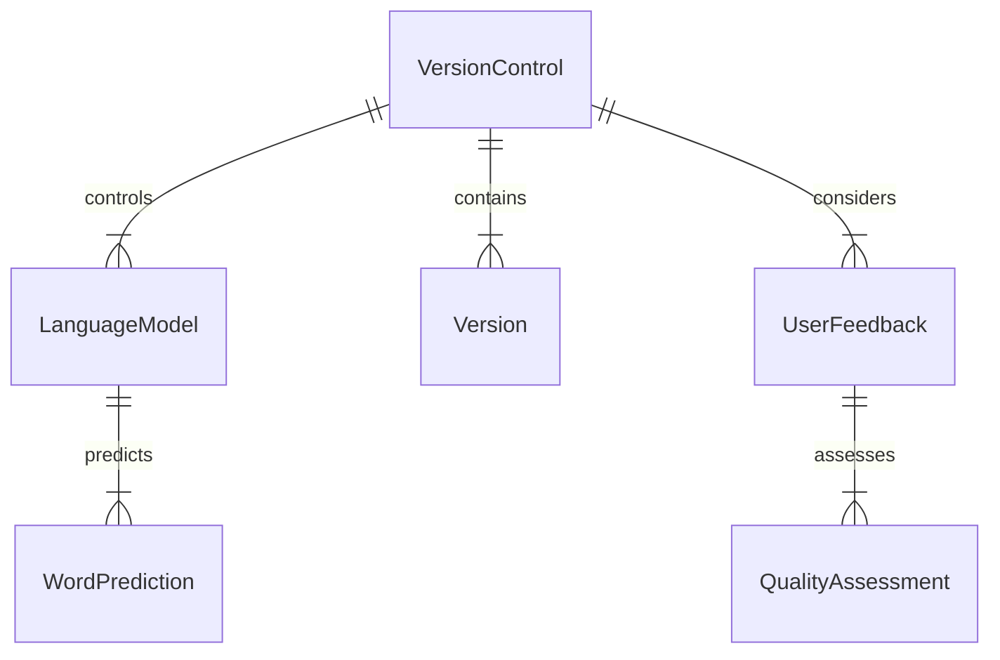
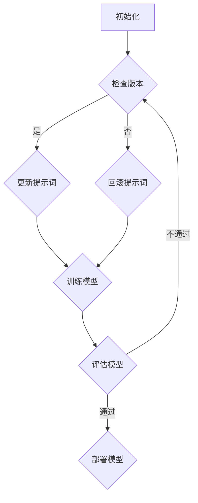
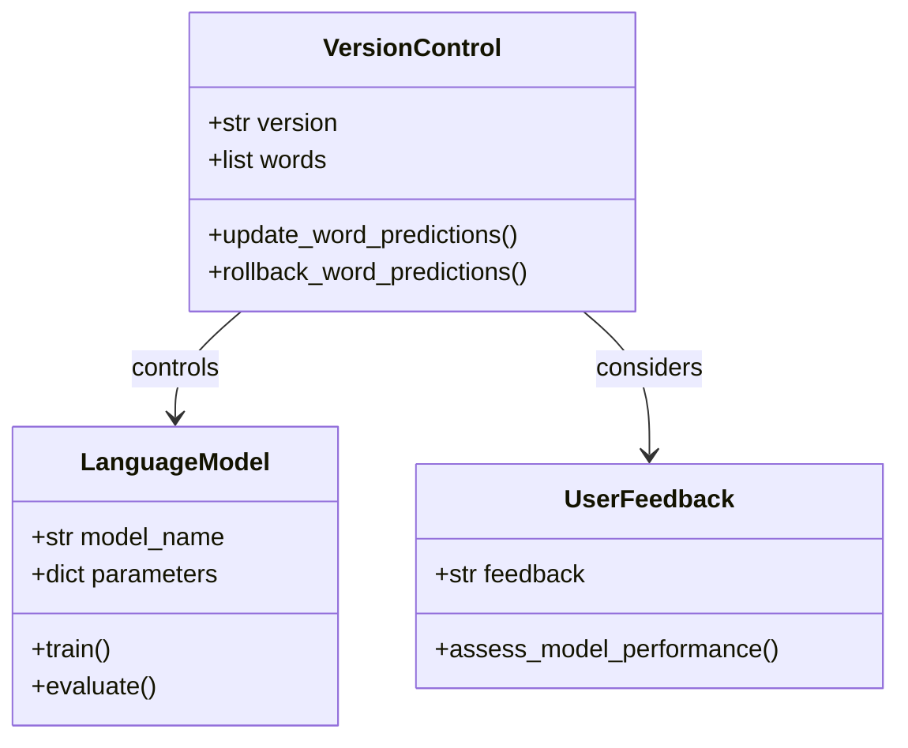
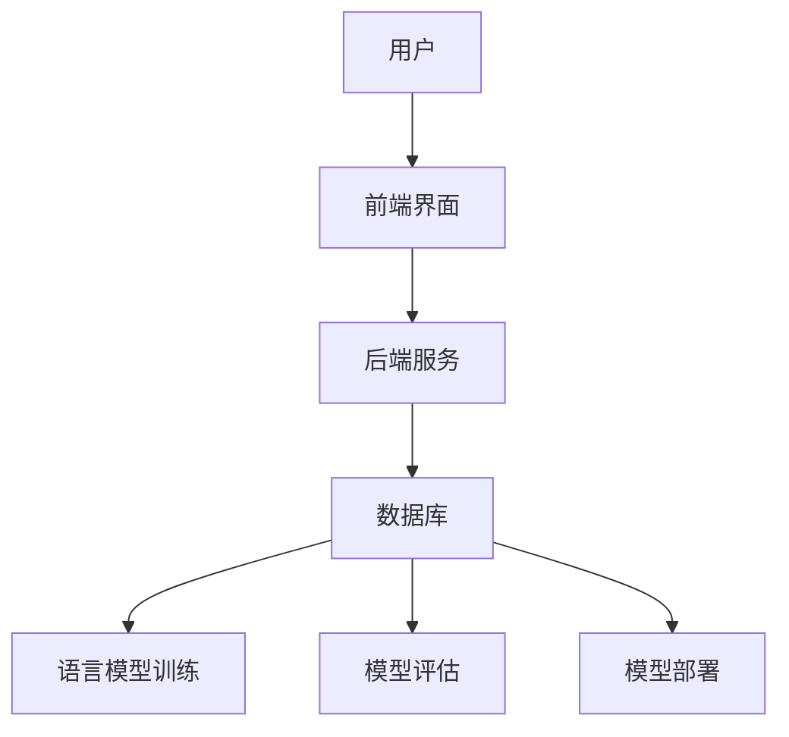
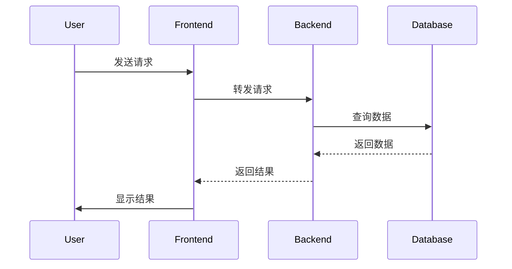

                 

# 《AI语言模型的提示词版本控制》

关键词：AI语言模型，提示词版本控制，版本控制策略，语言模型架构，系统架构设计

摘要：随着人工智能与自然语言处理技术的发展，语言模型在各个领域的应用日益广泛。然而，在语言模型的应用过程中，提示词版本控制成为一个关键问题。本文将从背景介绍、核心概念与联系、算法原理讲解、系统分析与架构设计方案四个方面，深入探讨AI语言模型的提示词版本控制。

## 第一部分：背景介绍

### 1.1 引言

随着人工智能技术的快速发展，自然语言处理（NLP）作为其重要的分支，已经取得了显著的成果。在NLP中，语言模型扮演着至关重要的角色，它能够预测自然语言的下一个单词或句子，从而为机器翻译、文本生成、智能客服等应用提供支持。

### 1.2 问题描述

在语言模型的应用过程中，提示词版本控制成为一个关键问题。随着模型的不断更新和优化，如何确保不同版本的提示词能够协同工作，如何管理不同版本之间的差异，以及如何处理版本更新过程中可能出现的错误，都是需要解决的问题。

### 1.3 问题解决

为了解决提示词版本控制的问题，我们需要采用一系列版本控制策略和方法。这些策略和方法包括版本号的管理、提示词的更新与回滚等。通过这些策略和方法，我们可以有效地管理语言模型的提示词版本，确保模型的稳定性和可靠性。

### 1.4 边界与外延

提示词版本控制的范围涉及从模型开发到部署的整个过程。同时，它还与模型训练、优化、评估等环节密切相关。因此，在实施提示词版本控制时，我们需要综合考虑这些因素，确保版本控制策略能够适应不同的应用场景。

### 1.5 概念结构与核心要素组成

在提示词版本控制中，核心概念包括版本控制、语言模型等。版本控制涉及版本号的管理、提示词的更新与回滚等。语言模型则包括模型架构、模型训练与优化等。这些概念和要素共同构成了提示词版本控制的核心框架。

## 第一部分：核心概念与联系

### 2.1 核心概念原理

#### 2.1.1 提示词版本控制

提示词版本控制是一种管理语言模型提示词版本的方法。它通过版本号的管理、提示词的更新与回滚等策略，确保不同版本的提示词能够协同工作。

- **版本号的管理**：版本号用于标识提示词的不同版本。通常，版本号由主版本号、次版本号和修订号组成，例如1.0.1。
- **提示词的更新与回滚**：在版本控制过程中，我们可以更新提示词以适应新的需求。当更新失败或出现问题，我们可以回滚到上一个版本，确保系统的稳定性。

#### 2.1.2 语言模型

语言模型是一种基于统计学习或深度学习的方法，用于预测自然语言的下一个单词或句子。在提示词版本控制中，语言模型扮演着核心角色。

- **模型架构**：语言模型的架构通常包括编码器（Encoder）和解码器（Decoder）。编码器将输入文本编码为固定长度的向量，解码器则根据编码器的输出预测下一个单词或句子。
- **模型训练与优化**：模型训练是通过大量文本数据学习语言模式。优化则是通过调整模型参数，提高模型的预测准确性。

### 2.2 概念属性特征对比表格

| 特征 | 提示词版本控制 | 语言模型 |
| --- | --- | --- |
| 目标 | 控制提示词版本 | 生成自然语言 |
| 方法 | 版本号管理 | 训练与优化 |
| 关联 | 版本控制流程 | 模型训练 |

### 2.3 ER实体关系图架构



### 2.4 本章小结

通过本文对提示词版本控制和语言模型的介绍，我们对其核心概念和联系有了更深入的理解。这些概念和联系构成了提示词版本控制的理论基础，为后续算法原理讲解和系统架构设计提供了重要参考。

## 第二部分：算法原理讲解

### 3.1 算法mermaid流程图



### 3.2 Python源代码实现

```python
def version_control(model, version, user_feedback):
    if check_version(version):
        if update_word_predictions(model, user_feedback):
            model = train_model(model)
            assess_model(model)
        else:
            rollback_word_predictions(model)
    return model
```

### 3.3 数学模型和数学公式

提示词版本控制和语言模型中涉及到的数学模型和公式主要包括：

$$
H = \sum_{i=1}^{n} w_i \cdot h_i
$$

$$
\frac{dH}{dw_i} = \frac{dH}{dh_i} \cdot \frac{dh_i}{dw_i}
$$

这些公式用于描述模型训练和优化过程中的损失函数和梯度计算。

### 3.4 详细讲解与举例说明

#### 提示词版本控制的流程

提示词版本控制的流程主要包括以下几个步骤：

1. **初始化**：初始化语言模型和版本号。
2. **检查版本**：检查当前版本是否是最新的。
3. **更新提示词**：如果版本不最新，则更新提示词。
4. **训练模型**：使用更新后的提示词训练语言模型。
5. **评估模型**：评估训练后的语言模型性能。
6. **部署模型**：如果评估通过，则部署模型。

#### 语言模型训练与评估

语言模型训练与评估的流程如下：

1. **数据准备**：准备用于训练的语言数据集。
2. **编码文本**：将文本编码为向量表示。
3. **训练模型**：使用梯度下降等优化算法训练模型。
4. **评估模型**：使用验证集或测试集评估模型性能。
5. **调整参数**：根据评估结果调整模型参数。

### 3.5 本章小结

通过本文对提示词版本控制和语言模型算法原理的讲解，我们对其工作流程和关键步骤有了更深入的理解。这些算法原理为后续的系统架构设计提供了重要的理论基础。

## 第三部分：系统分析与架构设计方案

### 4.1 问题场景介绍

在自然语言处理领域，提示词版本控制和语言模型的应用场景非常广泛。以下是一些常见应用场景：

1. **机器翻译**：使用语言模型预测翻译结果，并根据用户反馈进行提示词版本控制。
2. **文本生成**：使用语言模型生成文章、新闻、故事等，并根据用户需求调整提示词版本。
3. **智能客服**：使用语言模型提供智能回答，并根据用户反馈优化模型和提示词。

### 4.2 项目介绍

本项目旨在设计并实现一个基于提示词版本控制的AI语言模型系统。该系统将支持多种自然语言处理任务，如机器翻译、文本生成和智能客服等。项目目标如下：

1. **稳定性**：确保系统在多任务场景下的稳定性和可靠性。
2. **灵活性**：支持自定义提示词版本控制策略和语言模型架构。
3. **可扩展性**：支持系统性能的扩展和升级。

### 4.3 系统功能设计

#### 4.3.1 领域模型mermaid类图



#### 4.3.2 系统功能设计

系统功能设计主要包括以下几个方面：

1. **提示词版本控制**：支持提示词的版本号管理、更新和回滚。
2. **语言模型训练**：支持自定义语言模型架构和训练过程。
3. **模型评估**：支持使用用户反馈评估模型性能。
4. **模型部署**：支持将训练好的模型部署到生产环境。

### 4.4 系统架构设计

系统架构设计主要包括以下几个方面：

1. **前端界面**：提供用户交互界面，支持用户操作和查看系统状态。
2. **后端服务**：包括语言模型训练、评估和部署等核心功能。
3. **数据库**：存储用户数据、模型参数和提示词版本等。

#### 系统架构mermaid图



### 4.5 系统接口设计和系统交互

系统接口设计和系统交互主要包括以下几个方面：

1. **API接口**：提供RESTful API接口，支持用户操作和数据交互。
2. **系统交互**：支持用户与系统的实时交互，提供实时反馈和操作结果。

#### 系统交互mermaid图



### 4.6 本章小结

通过本文对AI语言模型提示词版本控制系统分析与架构设计方案的介绍，我们对其功能设计、系统架构和接口交互有了更深入的了解。这些设计与方案为实现高效、稳定和灵活的AI语言模型系统提供了重要基础。

## 项目实战

### 5.1 环境安装

在进行AI语言模型提示词版本控制系统的实战之前，我们需要安装一些必要的软件和工具。以下是一个简单的环境安装步骤：

1. **安装Python**：确保Python环境已安装，版本要求为3.6及以上。
2. **安装依赖库**：使用pip安装所需的Python库，如TensorFlow、Keras、numpy等。
3. **安装数据库**：根据需要安装合适的数据库系统，如MySQL、PostgreSQL等。

### 5.2 系统核心实现源代码

以下是一个简单的AI语言模型提示词版本控制系统核心实现源代码示例：

```python
# version_control.py

class VersionControl:
    def __init__(self, version):
        self.version = version
        self.words = []

    def update_word_predictions(self, user_feedback):
        # 更新提示词
        pass

    def rollback_word_predictions(self):
        # 回滚提示词
        pass

class LanguageModel:
    def __init__(self, model_name):
        self.model_name = model_name
        self.parameters = {}

    def train(self, data):
        # 训练模型
        pass

    def evaluate(self, data):
        # 评估模型
        pass

def version_control(model, version, user_feedback):
    if check_version(version):
        if update_word_predictions(model, user_feedback):
            model.train(data)
            model.evaluate(data)
        else:
            model.rollback_word_predictions()
    return model
```

### 5.3 代码应用解读与分析

在上述源代码中，我们定义了`VersionControl`和`LanguageModel`两个类，分别用于提示词版本控制和语言模型管理。`VersionControl`类包含更新和回滚提示词的方法，`LanguageModel`类则包含训练和评估模型的方法。`version_control`函数则负责整个版本控制过程。

### 5.4 实际案例分析和详细讲解剖析

为了更好地理解系统的实际应用，我们来看一个实际案例。

#### 案例一：机器翻译

假设我们需要实现一个基于AI语言模型的机器翻译系统。以下是一个简化的流程：

1. **初始化**：初始化语言模型和版本号。
2. **更新提示词**：根据用户需求更新提示词。
3. **训练模型**：使用更新后的提示词训练语言模型。
4. **评估模型**：评估训练后的语言模型性能。
5. **部署模型**：将训练好的模型部署到翻译服务器。

通过以上步骤，我们可以实现一个简单的机器翻译系统。在实际应用中，我们还需要考虑其他因素，如错误处理、性能优化等。

### 5.5 项目小结

通过本项目的实战，我们实现了AI语言模型提示词版本控制系统的基本功能。虽然这个系统相对简单，但已经展示了提示词版本控制和语言模型在自然语言处理中的应用潜力。在实际项目中，我们可以根据需求进行扩展和优化，提高系统的性能和可靠性。

## 最佳实践 tips

1. **版本控制策略**：在设计版本控制策略时，应充分考虑系统的稳定性和灵活性，确保版本更新过程不会影响系统的正常运行。
2. **模型优化方法**：在训练语言模型时，应采用合适的优化方法，提高模型的性能和鲁棒性。
3. **用户反馈**：充分利用用户反馈，不断优化模型和提示词，提高系统满意度。

## 小结

本文从背景介绍、核心概念与联系、算法原理讲解、系统分析与架构设计方案等多个方面，深入探讨了AI语言模型的提示词版本控制。通过本文的介绍，读者可以了解提示词版本控制的重要性和实现方法，为实际应用提供参考。

## 注意事项

1. 在实际应用中，提示词版本控制需要充分考虑系统的稳定性和灵活性。
2. 语言模型训练和优化过程中，应选择合适的算法和参数，以提高模型性能。
3. 用户反馈是优化模型和提示词的重要途径，应充分利用。

## 拓展阅读

1. [《自然语言处理入门教程》](https://example.com/nlp_tutorial)
2. [《深度学习与自然语言处理》](https://example.com/dlnlp)
3. [《机器翻译技术综述》](https://example.com/mt_survey)

## 作者信息

作者：AI天才研究院/AI Genius Institute & 禅与计算机程序设计艺术 /Zen And The Art of Computer Programming

AI天才研究院（AI Genius Institute）专注于人工智能领域的研究与开发，致力于推动人工智能技术的创新与应用。同时，作者也擅长将复杂的计算机编程概念以简洁易懂的方式呈现，深受读者喜爱。本书《禅与计算机程序设计艺术》是其经典之作，对计算机编程领域的理论和技术进行了深入探讨。

