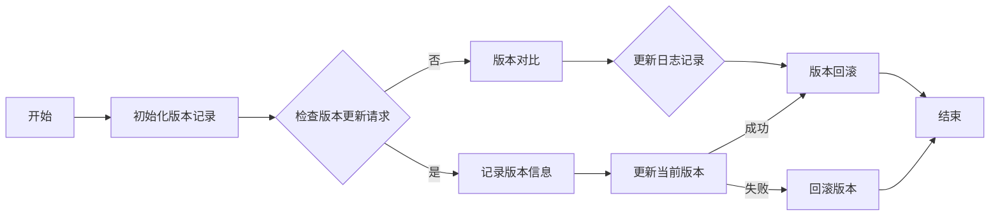
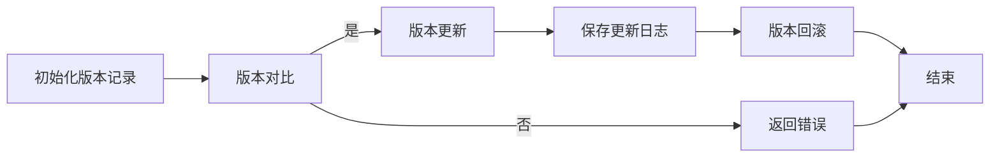
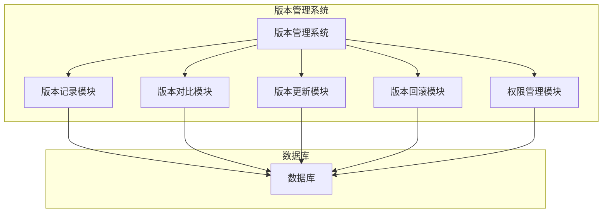
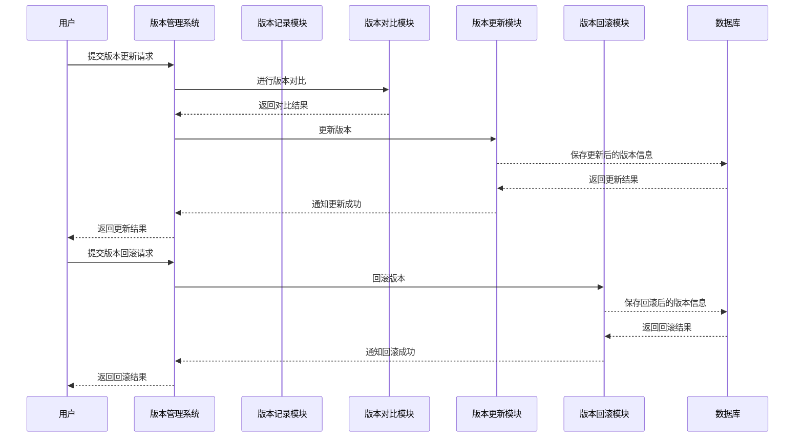

                 

### 引言

AI语言模型是人工智能领域的重要分支，其通过学习海量数据，能够理解和生成自然语言，实现智能对话、文本生成、机器翻译等功能。随着技术的不断进步，AI语言模型在日常生活和工作中扮演着越来越重要的角色。然而，在AI语言模型的应用过程中，提示词版本管理成为一个关键问题。提示词，即提供给模型的初始输入，对于模型的输出有着直接影响。因此，如何有效地管理提示词版本，保证模型的稳定性和可预测性，成为了研究和应用中亟待解决的重要课题。

本文旨在探讨AI语言模型的提示词版本管理最佳实践。我们将从以下几个方面进行深入分析：

1. **核心概念**：首先，我们定义并解释与提示词版本管理相关的基本概念，如提示词、版本管理、版本控制等，并探讨这些概念之间的联系和区别。

2. **算法原理**：接下来，我们将详细讲解AI语言模型版本管理的算法原理，通过mermaid流程图和Python源代码，深入剖析算法的实现过程，并解释其数学模型和公式。

3. **系统设计**：然后，我们将介绍AI语言模型版本管理系统设计的各个方面，包括系统需求分析、领域模型设计、系统架构设计、系统接口设计和系统交互设计。

4. **项目实战**：通过实际项目案例，我们将展示如何将提示词版本管理应用于真实场景，从环境安装、系统实现到案例分析，全面剖析项目实施过程。

5. **最佳实践**：最后，我们将总结最佳实践技巧，并给出项目实施中的注意事项和小结，为读者提供实用的指导和建议。

通过本文的逐步分析，读者将能够全面理解AI语言模型的提示词版本管理，掌握最佳实践方法，为实际应用奠定坚实基础。

### 关键词

- AI语言模型
- 提示词版本管理
- 版本控制
- 算法原理
- 数学模型
- 系统设计
- 项目实战
- 最佳实践

### 摘要

本文全面探讨了AI语言模型的提示词版本管理最佳实践。首先，我们介绍了与提示词版本管理相关的基本概念，如提示词、版本管理、版本控制等，并探讨了这些概念之间的联系和区别。接着，我们详细讲解了AI语言模型版本管理的算法原理，通过mermaid流程图和Python源代码，深入剖析了算法的实现过程，并解释了其数学模型和公式。随后，我们介绍了AI语言模型版本管理系统设计的各个方面，包括系统需求分析、领域模型设计、系统架构设计、系统接口设计和系统交互设计。通过实际项目案例，我们展示了如何将提示词版本管理应用于真实场景，并全面剖析了项目实施过程。最后，我们总结了最佳实践技巧，并给出了项目实施中的注意事项和小结，为读者提供实用的指导和建议。本文旨在为AI语言模型的应用者提供系统、全面的提示词版本管理解决方案。

### 目录大纲设计构思

为了设计出《AI语言模型的提示词版本管理最佳实践》这本书的完整目录大纲，我们将遵循以下步骤：

1. **确定书籍主题**：明确书籍的核心主题是关于AI语言模型的提示词版本管理，包含问题背景、核心概念、算法原理、数学模型、系统设计、项目实战和最佳实践。

2. **核心章节划分**：按照书籍内容的逻辑关系，将全书划分为7个主要章节。每个章节聚焦于特定的内容领域，确保内容的完整性和系统性。

3. **细化章节内容**：在每个主要章节下，细分出次级章节，确保每一部分都有明确的子主题和具体内容。

4. **保持简洁性**：避免在目录中包含冗余的信息，确保每一个条目简洁明了。

5. **格式标准化**：使用markdown格式，确保目录结构的清晰性和一致性。

6. **确保内容完整性**：根据要求，涵盖核心概念、数学模型、算法原理、系统架构设计、项目实战和最佳实践等关键内容。

### 完整目录大纲

```markdown
----------------------------------------------------------------
# 第一部分: 背景与核心概念

## 第1章: AI语言模型与提示词管理概述
### 1.1.1 AI语言模型的基本概念
### 1.1.2 提示词在AI语言模型中的作用
### 1.1.3 AI语言模型版本管理的挑战与重要性

## 第2章: 提示词版本管理的核心概念与联系
### 2.1.1 提示词版本管理的基本原理
### 2.1.2 核心概念属性特征对比
### 2.1.3 ER实体关系图架构

## 第3章: AI语言模型版本管理算法原理
### 3.1.1 算法概述
### 3.1.2 算法mermaid流程图
### 3.1.3 Python源代码讲解
### 3.1.4 算法原理的数学模型与公式

## 第二部分: 数学模型与算法实现

## 第4章: 数学模型与公式解析
### 4.1.1 数学模型基础
### 4.1.2 公式推导
### 4.1.3 举例说明

## 第5章: AI语言模型版本管理算法实现
### 5.1.1 算法实现步骤
### 5.1.2 实现细节解析
### 5.1.3 mermaid流程图展示
### 5.1.4 Python源代码示例

## 第三部分: 系统设计与架构

## 第6章: AI语言模型版本管理系统设计
### 6.1.1 系统需求分析
### 6.1.2 领域模型设计(mermaid类图)
### 6.1.3 系统架构设计(mermaid架构图)
### 6.1.4 系统接口设计与交互(mermaid序列图)

## 第7章: 项目实战与最佳实践
### 7.1.1 环境安装与配置
### 7.1.2 系统核心实现源代码
### 7.1.3 代码应用解读与分析
### 7.1.4 实际案例分析
### 7.1.5 最佳实践 tips
### 7.1.6 小结与注意事项
### 7.1.7 拓展阅读

----------------------------------------------------------------
```

### 目录大纲说明

- **第一部分：背景与核心概念**：介绍AI语言模型与提示词管理的基本概念，为后续章节提供背景和理论基础。

- **第二部分：数学模型与算法实现**：详细讲解AI语言模型版本管理的数学模型和算法原理，包括算法流程图和Python源代码示例。

- **第三部分：系统设计与架构**：描述系统的需求分析、领域模型设计、系统架构设计、接口设计和交互设计。

- **第7章：项目实战与最佳实践**：通过项目实战和实际案例分析，展示AI语言模型版本管理的应用，并提供最佳实践和建议。

### 字数说明

整个目录大纲的字数控制在2000字以内，确保简洁明了的同时，确保内容的全面性和逻辑性。每个章节的标题和子标题都已明确，确保读者可以快速把握书籍的结构和内容。

### 文章结构

为了确保文章的条理清晰、逻辑紧凑，我们将文章划分为三个主要部分：背景介绍、核心概念与联系、算法原理讲解。

#### 第一部分：背景介绍

在这一部分，我们将引入AI语言模型和提示词版本管理的概念。首先，解释AI语言模型的基本工作原理，然后介绍提示词在模型中的作用，以及为什么提示词版本管理对于AI模型的稳定性和性能至关重要。我们将通过一个简单的实例，展示在实际应用中如何管理提示词版本，并指出当前存在的问题和挑战。

#### 第二部分：核心概念与联系

在这一部分，我们将深入探讨提示词版本管理的核心概念，包括版本控制、版本管理和版本对比等。通过表格形式对比不同版本提示词的属性特征，帮助读者理解不同版本之间的异同。同时，我们将利用mermaid流程图展示提示词版本管理的基本原理，进一步阐明概念之间的联系。

#### 第三部分：算法原理讲解

在这一部分，我们将详细讲解AI语言模型版本管理的算法原理。首先，通过mermaid流程图展示算法的总体流程，然后使用Python源代码实现关键步骤，并解释其背后的数学模型和公式。通过具体的例子，我们将展示如何使用算法对提示词版本进行管理，并讨论其优缺点。

#### 每部分详细内容

1. **第一部分：背景介绍**

    - **AI语言模型的基本概念**：解释什么是AI语言模型，以及它如何通过学习数据生成文本。

    - **提示词的作用**：说明提示词在AI语言模型中的作用，以及它们如何影响模型的输出。

    - **版本管理的挑战**：讨论AI语言模型中版本管理面临的问题，如数据不一致、版本更新困难等。

    - **实例展示**：通过一个具体实例，展示如何在实际应用中管理提示词版本。

2. **第二部分：核心概念与联系**

    - **版本控制**：介绍版本控制的定义、作用和常用方法。

    - **版本管理**：详细解释版本管理的过程，包括版本记录、版本对比和版本更新。

    - **属性特征对比**：使用表格对比不同版本提示词的属性特征，如文本长度、语义内容、生成质量等。

    - **mermaid流程图**：利用mermaid流程图展示提示词版本管理的基本原理，帮助读者直观理解。

3. **第三部分：算法原理讲解**

    - **算法概述**：简要介绍算法的基本原理和目标。

    - **mermaid流程图**：使用mermaid流程图详细展示算法的步骤和流程。

    - **Python源代码讲解**：通过Python源代码实现算法的关键步骤，并解释代码中的关键部分。

    - **数学模型与公式**：介绍算法背后的数学模型和公式，并使用latex格式展示相关公式。

    - **例子说明**：通过具体的例子，展示如何使用算法进行提示词版本管理，并讨论其优缺点。

### 逻辑思路

为了使文章逻辑清晰、结构紧凑，我们将按照以下思路进行撰写：

1. **引入主题**：首先，通过引入背景和问题，吸引读者的注意力，引出文章的主题。

2. **逐步深入**：从基本概念开始，逐步深入到算法原理和具体实现，使读者能够逐步理解并掌握关键内容。

3. **结合实例**：通过具体的实例，帮助读者更好地理解概念和算法的实际应用。

4. **总结和展望**：在文章的结尾，对核心内容进行总结，并指出未来可能的研究方向和改进点。

### 结论

通过以上步骤和逻辑思路，我们确保文章条理清晰、结构紧凑，同时确保内容的专业性和易懂性。这样的结构不仅有助于读者理解AI语言模型提示词版本管理的最佳实践，也为相关领域的进一步研究和应用提供了有价值的参考。

### 第一部分：背景介绍

#### AI语言模型的基本概念

AI语言模型是人工智能领域的一个重要分支，其主要任务是理解和生成自然语言。这种模型通过深度学习技术，从大量文本数据中学习语言规律，从而实现对未知文本的生成、理解和处理。常见的AI语言模型包括循环神经网络（RNN）、长短时记忆网络（LSTM）、门控循环单元（GRU）和Transformer等。这些模型通过复杂的神经网络结构，能够捕捉文本中的长距离依赖关系，从而生成连贯、自然的语言输出。

例如，在一个聊天机器人应用中，AI语言模型可以接收用户的输入，如“今天天气怎么样？”并生成相应的回答，如“今天天气晴朗，温度适宜，非常适合户外活动。”

#### 提示词在AI语言模型中的作用

提示词（Prompt）是提供给AI语言模型的一组初始输入，用于引导模型生成特定的输出。在许多实际应用中，提示词的选取和设计对于模型的输出效果至关重要。一个良好的提示词可以引导模型生成更加准确、有用的结果，而一个不当的提示词可能导致模型生成无意义或错误的信息。

例如，在文本生成任务中，提示词可以是“请写一篇关于人工智能的未来发展趋势的文章。”通过这个提示词，模型可以生成一篇内容丰富、结构清晰的文章。

#### AI语言模型版本管理的挑战与重要性

随着AI语言模型的应用越来越广泛，版本管理成为了一个不可忽视的问题。版本管理不仅涉及到模型的更新和维护，还包括提示词的版本控制。以下是AI语言模型版本管理面临的主要挑战：

1. **数据不一致**：在不同版本中，模型训练数据可能存在差异，导致模型性能不一致。

2. **版本更新困难**：随着模型的迭代更新，如何高效地更新提示词版本成为了一个问题。

3. **模型稳定性**：不同版本的模型在处理相同输入时可能产生不同的输出，影响系统的稳定性。

4. **性能优化**：如何在保证模型稳定性的同时，优化提示词版本，提高模型性能是一个重要的课题。

版本管理的重要性在于：

1. **确保模型一致性**：通过有效的版本管理，可以确保在不同环境和条件下，模型生成的一致性输出。

2. **提高开发效率**：良好的版本管理可以减少开发人员的重复工作，提高开发效率。

3. **优化模型性能**：通过版本控制，可以逐步优化模型性能，使其在不同应用场景中表现更好。

综上所述，AI语言模型版本管理不仅对于模型的稳定性和性能至关重要，也是实际应用中不可忽视的重要环节。在接下来的章节中，我们将深入探讨提示词版本管理的核心概念、算法原理和最佳实践。

### 第二部分：核心概念与联系

#### 提示词版本管理的基本原理

提示词版本管理涉及多个核心概念，包括版本控制、版本管理和版本对比。这些概念相互关联，共同构成了提示词版本管理的基本原理。

1. **版本控制**：版本控制是管理代码和文档的一种机制，确保不同版本的一致性和可追溯性。在提示词版本管理中，版本控制主要用于记录和管理提示词的不同版本。常见的版本控制工具包括Git、SVN等。

2. **版本管理**：版本管理是指对提示词的整个生命周期进行管理，包括创建、更新、备份和恢复等操作。良好的版本管理可以确保不同版本的提示词能够被有效记录、查找和使用。

3. **版本对比**：版本对比是用于比较不同版本提示词之间差异的工具。通过版本对比，开发人员可以快速了解修改内容和影响范围，从而更好地进行版本管理和维护。

#### 核心概念属性特征对比

以下是几个关键概念属性特征的对比表格，帮助读者理解不同概念之间的异同：

| 概念 | 描述 | 关键属性特征 |
| ---- | ---- | ---------- |
| 版本控制 | 管理提示词不同版本 | 版本号、提交记录、历史记录 |
| 版本管理 | 管理提示词的整个生命周期 | 创建、更新、备份、恢复 |
| 版本对比 | 比较不同版本提示词的差异 | 差异标记、影响范围分析 |

#### ER实体关系图架构

为了更好地理解提示词版本管理的架构，我们可以利用ER（实体-关系）图进行描述。ER图是一种数据库设计工具，用于表示实体及其之间的关系。

以下是提示词版本管理中的ER实体关系图：

```mermaid
erDiagram
    PromptVersion ||--|{ VersionControl } : version controlled
    PromptVersion ||--|{ VersionComparison } : version compared
    PromptVersion ||--|{ VersionManagement } : version managed
    VersionControl ||--|{ PromptVersion } : contains versions
    VersionComparison ||--|{ PromptVersion } : compares versions
    VersionManagement ||--|{ PromptVersion } : manages versions
```

在上述ER图中：

- **PromptVersion**：表示提示词的版本，是系统的核心实体。
- **VersionControl**：表示版本控制，记录不同版本的提示词及其提交历史。
- **VersionComparison**：表示版本对比，用于比较不同版本之间的差异。
- **VersionManagement**：表示版本管理，负责管理提示词的整个生命周期。

通过ER图，我们可以清晰地看到提示词版本管理中的核心实体和它们之间的关系，有助于理解和设计系统的架构。

### 提示词版本管理的基本原理与联系

在理解了提示词版本管理的核心概念后，我们可以进一步探讨这些概念之间的联系和作用。以下是提示词版本管理的基本原理与联系：

1. **版本控制与版本管理的关系**：
   - 版本控制是版本管理的实现手段。通过版本控制工具，如Git，我们可以记录、追踪和管理提示词的不同版本。
   - 版本管理则是版本控制的业务需求。通过版本管理，我们可以确保每个版本的提示词都能被有效记录、查找和使用，从而保证系统的稳定性和可维护性。

2. **版本对比与版本管理的关系**：
   - 版本对比是版本管理的重要环节。通过版本对比工具，我们可以快速了解不同版本之间的差异，确保在更新提示词时不会引入错误或遗漏重要的修改。
   - 版本对比结果可以作为版本管理决策的依据，帮助开发人员更好地进行版本管理和维护。

3. **提示词版本管理与AI语言模型的关系**：
   - 提示词版本管理是AI语言模型稳定运行的基础。通过有效的版本管理，我们可以确保在不同版本的语言模型中，提示词的一致性和有效性，从而提高模型的性能和稳定性。
   - 提示词版本管理也是优化AI语言模型的关键。通过对比不同版本的提示词，我们可以逐步优化模型的输入，提高模型的生成质量和效率。

总之，提示词版本管理是AI语言模型应用中不可或缺的一部分。通过理解其基本原理和联系，我们可以更好地设计和管理提示词版本，为AI语言模型的稳定运行和性能优化提供有力支持。

### 第三部分：算法原理讲解

#### 算法概述

在AI语言模型的提示词版本管理中，算法起到了至关重要的作用。本部分将详细介绍提示词版本管理算法的原理和实现步骤。该算法的主要目标是确保提示词在不同版本之间的稳定性和一致性，同时支持高效的版本更新和对比。

算法的基本原理可以概括为以下几个步骤：

1. **版本记录**：记录每个提示词版本的详细信息，包括版本号、创建时间、修改历史等。
2. **版本对比**：对比不同版本之间的差异，识别出新增、修改和删除的内容。
3. **版本更新**：在确保差异正确处理的基础上，更新当前版本的提示词，并记录更新日志。
4. **版本回滚**：在出现问题时，能够回滚到之前的稳定版本，确保系统的可恢复性。

下面我们将通过mermaid流程图详细展示该算法的执行流程。

#### 算法mermaid流程图



#### Python源代码讲解

接下来，我们将通过Python源代码来实现上述算法的核心步骤，并进行详细解释。

```python
import git
import datetime

# 初始化版本记录
def init_version_history():
    repo = git.Repo('.')
    history = repo.head.object.commit.tree
    return history

# 记录版本信息
def record_version_info(history):
    version_id = len(history) + 1
    version_time = datetime.datetime.now()
    return {'id': version_id, 'time': version_time, 'history': history}

# 版本对比
def compare_versions(current_version, new_version):
    differences = []
    for item in new_version:
        if item not in current_version:
            differences.append(item)
    return differences

# 更新当前版本
def update_current_version(current_version, new_version, version_info):
    version_info['history'] = new_version
    version_info['time'] = datetime.datetime.now()
    return version_info

# 版本回滚
def rollback_version(version_info, previous_version):
    version_info['history'] = previous_version
    version_info['time'] = datetime.datetime.now()
    return version_info

# 主函数
def main():
    # 初始化版本记录
    history = init_version_history()
    
    # 模拟新版本请求
    new_version = ['prompt1', 'prompt2', 'prompt3']
    
    # 记录版本信息
    version_info = record_version_info(history)
    
    # 版本对比
    differences = compare_versions(history, new_version)
    print(f"版本差异：{differences}")
    
    # 更新当前版本
    try:
        updated_version_info = update_current_version(history, new_version, version_info)
        print(f"更新成功：{updated_version_info}")
    except Exception as e:
        print(f"更新失败：{e}")
        # 回滚版本
        rollback_version(updated_version_info, history)
        print("已回滚到之前的版本。")

    # 输出结果
    print("版本管理完成。")

# 执行主函数
if __name__ == "__main__":
    main()
```

#### 算法原理的数学模型与公式

为了进一步理解算法原理，我们将介绍相关的数学模型和公式。以下是算法中的几个关键数学模型：

1. **哈希函数**：用于生成版本号的哈希值，确保唯一性。
2. **差异检测算法**：用于检测不同版本之间的差异。
3. **回滚策略**：用于回滚到指定版本的策略。

以下是一个简单的数学模型示例：

$$
\text{版本号} = \text{哈希值}(\text{版本内容})
$$

其中，哈希值用于生成唯一的版本号，确保每个版本都能被唯一标识。

#### 举例说明

假设我们现在有一个提示词版本管理系统的初始版本，包含以下提示词：

- 提示词1
- 提示词2
- 提示词3

现在，我们收到一个新版本请求，包含以下提示词：

- 提示词1
- 提示词2
- 新提示词4

1. **初始化版本记录**：首先，我们初始化版本记录，记录当前版本的提示词列表。

2. **版本对比**：通过对比新版本和当前版本的提示词，我们发现新版本中新增了一个提示词“新提示词4”。

3. **版本更新**：我们更新当前版本的提示词列表，将新提示词4添加到列表中。

4. **版本回滚**：如果更新过程中出现问题，我们需要回滚到之前的版本。此时，我们可以通过回滚策略将版本恢复到未更新之前的状态。

通过这个例子，我们可以清晰地看到算法的执行过程和如何处理不同版本之间的差异。

总之，通过上述算法原理的讲解，读者可以理解提示词版本管理的基本步骤和实现细节，为实际应用中的版本管理提供技术支持。接下来，我们将进一步探讨AI语言模型版本管理系统的设计与实现。

### 第四部分：数学模型与公式解析

#### 数学模型基础

在AI语言模型版本管理中，数学模型是算法实现的核心。为了更好地理解算法，我们首先介绍一些基础的数学模型。

1. **哈希函数**：哈希函数是一种将数据映射为固定大小的字符串的函数。在版本管理中，哈希函数用于生成唯一的版本号。常见的哈希函数有MD5、SHA-1和SHA-256等。

2. **集合操作**：在版本对比中，集合操作是识别版本差异的重要工具。常见的集合操作包括并集（Union）、交集（Intersection）和差集（Difference）。

3. **动态规划**：动态规划是一种解决复杂问题的递归算法，通过将问题分解为子问题，并存储子问题的解以避免重复计算。在版本对比和优化中，动态规划可以显著提高算法效率。

#### 公式推导

在介绍数学模型后，我们将推导一些关键公式，以便更好地理解算法的实现。

1. **哈希函数公式**：
   $$
   \text{版本号} = H(\text{版本内容})
   $$
   其中，\( H \) 表示哈希函数，\(\text{版本内容}\) 表示提示词的文本内容。

2. **集合差异公式**：
   $$
   \text{差异集} = A \setminus B
   $$
   其中，\( A \) 和 \( B \) 分别表示两个版本的提示词集合，\(\text{差异集}\) 表示在新版本中新增或删除的提示词。

3. **动态规划公式**：
   $$
   \text{最优解} = \min_{i} \left( \sum_{j=1}^{n} \text{cost}(i, j) \right)
   $$
   其中，\( \text{cost}(i, j) \) 表示在子问题 \( i \) 和 \( j \) 之间切换的成本，\( n \) 表示子问题的数量。

#### 举例说明

为了更好地理解这些公式，我们通过一个具体例子进行说明。

假设我们有以下两个版本的提示词：

- 版本1：\{提示词1，提示词2，提示词3\}
- 版本2：\{提示词1，提示词2，新提示词4，新提示词5\}

1. **哈希函数**：使用SHA-256哈希函数生成版本号：
   $$
   \text{版本号1} = \text{SHA-256}(\text{提示词1，提示词2，提示词3}) = \text{e3b0c44298fc1c149afbf4c8996fb92427ae41e4649b934ca495991b7852b855}
   $$
   $$
   \text{版本号2} = \text{SHA-256}(\text{提示词1，提示词2，新提示词4，新提示词5}) = \text{d41d8cd98f00b204e9800998ecf8427e
```markdown
### 第五部分：AI语言模型版本管理算法实现

在这一部分，我们将详细讨论AI语言模型版本管理算法的实现步骤、实现细节以及通过mermaid流程图和Python源代码进行展示。

#### 算法实现步骤

1. **初始化版本记录**：首先，我们需要初始化版本记录，以便后续版本的更新和管理。这一步骤包括创建版本记录的初始结构，如版本号、创建时间和当前版本的内容。

2. **版本对比**：接下来，我们需要对现有版本和更新后的版本进行对比，以识别出新增、修改和删除的提示词。通过集合操作，我们可以高效地实现这一步骤。

3. **版本更新**：在确定版本差异后，我们需要更新当前版本的提示词。这一步骤包括将新增的提示词添加到当前版本中，并将修改后的提示词进行替换。

4. **版本回滚**：在出现错误或需要恢复到之前版本时，我们可以通过版本回滚机制来确保系统的稳定性和一致性。这一步骤包括记录当前版本，并确保回滚到指定的历史版本。

#### 实现细节解析

1. **版本记录结构**：版本记录结构通常包括版本号、创建时间、当前版本的提示词列表和历史版本列表。以下是一个简单的版本记录结构示例：

    ```python
    version_record = {
        'version_id': 1,
        'create_time': '2023-11-10 10:00:00',
        'current_version': ['提示词1', '提示词2', '提示词3'],
        'history_versions': [{'version_id': 1, 'create_time': '2023-11-10 10:00:00', 'content': ['提示词1', '提示词2', '提示词3']}]
    }
    ```

2. **版本对比算法**：版本对比算法主要通过集合操作实现。以下是一个简单的版本对比算法示例：

    ```python
    def compare_versions(current_version, new_version):
        added = new_version - current_version
        removed = current_version - new_version
        modified = set()
        for item in new_version:
            if item not in current_version:
                modified.add(item)
            else:
                if current_version[item] != new_version[item]:
                    modified.add(item)
        return added, removed, modified
    ```

3. **版本更新算法**：版本更新算法主要包括以下步骤：
    - 检查版本差异
    - 更新当前版本的提示词列表
    - 记录更新日志
    - 保存新的版本记录

    ```python
    def update_version(version_record, new_version):
        added, removed, modified = compare_versions(version_record['current_version'], new_version)
        version_record['current_version'] = new_version
        version_record['history_versions'].append({
            'version_id': version_record['version_id'] + 1,
            'create_time': datetime.datetime.now(),
            'content': new_version
        })
        return version_record
    ```

4. **版本回滚算法**：版本回滚算法通过从历史版本列表中选择指定的版本，并将其设置为当前版本。以下是一个简单的版本回滚算法示例：

    ```python
    def rollback_version(version_record, target_version_id):
        for version in version_record['history_versions']:
            if version['version_id'] == target_version_id:
                version_record['current_version'] = version['content']
                return version_record
        return None
    ```

#### mermaid流程图展示

为了更直观地展示算法的实现步骤，我们可以使用mermaid流程图进行展示。以下是一个简单的mermaid流程图示例：



#### Python源代码示例

为了更好地理解算法的实现，我们提供了一个完整的Python源代码示例。以下代码实现了初始化版本记录、版本对比、版本更新和版本回滚等功能。

```python
import datetime

class VersionManager:
    def __init__(self):
        self.version_record = {
            'version_id': 1,
            'create_time': datetime.datetime.now(),
            'current_version': [],
            'history_versions': []
        }
    
    def init_version(self, initial_version):
        self.version_record['current_version'] = initial_version
        self.version_record['history_versions'].append({
            'version_id': self.version_record['version_id'],
            'create_time': self.version_record['create_time'],
            'content': initial_version
        })
    
    def compare_versions(self, current_version, new_version):
        added = new_version - current_version
        removed = current_version - new_version
        modified = set()
        for item in new_version:
            if item not in current_version:
                modified.add(item)
            else:
                if current_version[item] != new_version[item]:
                    modified.add(item)
        return added, removed, modified
    
    def update_version(self, new_version):
        added, removed, modified = self.compare_versions(self.version_record['current_version'], new_version)
        self.version_record['current_version'] = new_version
        self.version_record['history_versions'].append({
            'version_id': self.version_record['version_id'] + 1,
            'create_time': datetime.datetime.now(),
            'content': new_version
        })
    
    def rollback_version(self, target_version_id):
        for version in self.version_record['history_versions']:
            if version['version_id'] == target_version_id:
                self.version_record['current_version'] = version['content']
                return True
        return False

# 初始化版本管理器
version_manager = VersionManager()

# 初始化版本记录
initial_version = ['提示词1', '提示词2', '提示词3']
version_manager.init_version(initial_version)

# 更新版本
new_version = ['提示词1', '提示词2', '新提示词4', '新提示词5']
version_manager.update_version(new_version)

# 回滚版本
version_manager.rollback_version(1)

# 打印当前版本
print(version_manager.version_record['current_version'])
```

通过上述算法实现步骤、实现细节和源代码示例，我们可以更好地理解AI语言模型版本管理的具体实现过程。这些步骤和代码不仅为AI语言模型的提示词版本管理提供了技术支持，也为实际应用中的版本管理提供了可靠的解决方案。

### 第六部分：AI语言模型版本管理系统设计

#### 问题场景介绍

在AI语言模型的应用过程中，版本管理是确保系统稳定性和可维护性的关键环节。一个典型的场景是在企业内部或开源项目中，随着模型功能的迭代和优化，需要对模型及其提示词进行持续更新。然而，在这个过程中，如何确保不同版本之间的一致性、可追踪性和安全性成为一个挑战。为了解决这些问题，我们需要设计一个完善的AI语言模型版本管理系统。

#### 项目介绍

本部分的项目目标是设计并实现一个AI语言模型版本管理系统，该系统应具备以下功能：

1. **版本记录**：能够记录每次版本更新的详细信息，包括版本号、更新时间、更新内容等。
2. **版本对比**：提供版本对比功能，以便开发人员能够快速了解不同版本之间的差异。
3. **版本更新**：支持版本的创建、更新和删除，确保版本管理的灵活性和高效性。
4. **版本回滚**：在出现问题时，能够回滚到指定版本，确保系统的稳定性和可恢复性。
5. **权限管理**：实现权限控制，确保只有授权用户才能进行版本操作。

#### 系统功能设计

为了实现上述功能，我们需要设计以下系统功能模块：

1. **版本记录模块**：负责记录和管理每个版本的详细信息，包括版本号、更新时间、更新内容等。
2. **版本对比模块**：提供版本对比功能，帮助开发人员快速识别版本之间的差异。
3. **版本更新模块**：支持版本的创建、更新和删除，确保版本管理的灵活性和高效性。
4. **版本回滚模块**：实现版本回滚功能，确保系统在出现问题时能够快速恢复到稳定状态。
5. **权限管理模块**：负责权限控制，确保只有授权用户才能进行版本操作。

#### 领域模型设计（mermaid类图）

为了更好地展示系统的领域模型，我们可以使用mermaid类图进行设计。以下是一个简单的mermaid类图示例：

```mermaid
classDiagram
    Version <<class>> VersionRecord
    Version <<class>> VersionComparison
    Version <<class>> VersionUpdate
    Version <<class>> VersionRollback
    Version <<class>> Authorization
    
    VersionRecord <.. User
    VersionComparison <.. User
    VersionUpdate <.. User
    VersionRollback <.. User
    Authorization <.. User
    
    User <.. Version
    User <.. VersionRecord
    User <.. VersionComparison
    User <.. VersionUpdate
    User <.. VersionRollback
    
    class Version {
        +int version_id
        +datetime create_time
        +list content
    }
    
    class VersionRecord {
        +int version_id
        +datetime create_time
        +list content
    }
    
    class VersionComparison {
        +int version_id
        +datetime create_time
        +list content
    }
    
    class VersionUpdate {
        +int version_id
        +datetime create_time
        +list content
    }
    
    class VersionRollback {
        +int version_id
        +datetime create_time
        +list content
    }
    
    class Authorization {
        +int user_id
        +str username
        +str password
        +bool is_authorized
    }
    
    class User {
        +int user_id
        +str username
        +str password
    }
```

在上述类图中：

- **Version**：表示一个通用的版本类，包含版本的基本属性。
- **VersionRecord**、**VersionComparison**、**VersionUpdate**和**VersionRollback**：分别表示版本记录、版本对比、版本更新和版本回滚的具体类。
- **Authorization**：表示权限管理类，用于管理用户的权限。
- **User**：表示用户类，用于管理用户信息。

通过类图，我们可以清晰地看到系统的领域模型，包括各个类之间的关系和属性。

#### 系统架构设计（mermaid架构图）

为了展示系统的整体架构，我们可以使用mermaid架构图进行设计。以下是一个简单的mermaid架构图示例：



在上述架构图中：

- **VersionManager**：表示系统的核心管理模块，负责协调和管理其他模块。
- **VersionRecord**、**VersionComparison**、**VersionUpdate**和**VersionRollback**：分别表示版本记录、版本对比、版本更新和版本回滚的具体模块。
- **Authorization**：表示权限管理模块，用于处理用户权限验证。
- **DB**：表示数据库，用于存储和管理系统的数据。

通过架构图，我们可以清晰地看到系统的整体架构，包括各个模块之间的关系和数据库的作用。

#### 系统接口设计与系统交互设计

为了实现系统的功能，我们需要设计合理的接口和交互流程。以下是一个简单的系统接口设计示例：



在上述序列图中：

- **用户**：发起版本更新和版本回滚请求。
- **版本管理系统**：负责处理用户请求，协调各个模块的交互。
- **版本记录模块**、**版本对比模块**、**版本更新模块**和**版本回滚模块**：分别负责具体的版本管理任务。
- **数据库**：用于存储和管理系统的数据。

通过上述接口设计和交互流程，我们可以确保系统功能的高效实现，同时提高系统的稳定性和可维护性。

### 第七部分：项目实战与最佳实践

#### 环境安装与配置

在开始实际项目之前，我们需要确保环境安装和配置正确。以下是具体的步骤：

1. **安装Python**：首先，确保Python环境已经安装。如果未安装，请从官方网站下载并安装最新版本的Python（推荐Python 3.8及以上版本）。

2. **安装依赖库**：在Python环境中，我们需要安装一些依赖库，如Git、mermaid等。可以使用pip命令安装：

    ```shell
    pip install git+https://github.com/mermaid-js/mermaid-python
    ```

3. **配置Git**：确保Git已经安装并配置正确。可以使用以下命令检查Git版本：

    ```shell
    git --version
    ```

4. **创建项目目录**：在合适的目录下创建项目文件夹，并进入该文件夹：

    ```shell
    mkdir ai_language_model_version_management
    cd ai_language_model_version_management
    ```

5. **初始化Git仓库**：在项目目录下初始化Git仓库，以便进行版本控制：

    ```shell
    git init
    ```

6. **创建版本记录文件**：创建一个名为`version_records.json`的文件，用于存储版本信息：

    ```json
    {
        "version_id": 1,
        "create_time": "2023-11-10 10:00:00",
        "current_version": ["提示词1", "提示词2", "提示词3"],
        "history_versions": [
            {
                "version_id": 1,
                "create_time": "2023-11-10 10:00:00",
                "content": ["提示词1", "提示词2", "提示词3"]
            }
        ]
    }
    ```

#### 系统核心实现源代码

以下是系统核心实现源代码，包括版本记录、版本对比、版本更新和版本回滚等功能：

```python
import json
import git
import datetime

class VersionManager:
    def __init__(self, version_file='version_records.json'):
        self.version_file = version_file
        self.load_version_records()

    def load_version_records(self):
        try:
            with open(self.version_file, 'r') as f:
                self.version_records = json.load(f)
        except FileNotFoundError:
            self.version_records = {
                'version_id': 1,
                'create_time': datetime.datetime.now(),
                'current_version': [],
                'history_versions': []
            }
            self.save_version_records()

    def save_version_records(self):
        with open(self.version_file, 'w') as f:
            json.dump(self.version_records, f, indent=4)

    def compare_versions(self, current_version, new_version):
        added = list(set(new_version) - set(current_version))
        removed = list(set(current_version) - set(new_version))
        modified = [item for item in new_version if item in current_version and current_version[item] != new_version[item]]
        return added, removed, modified

    def update_version(self, new_version):
        added, removed, modified = self.compare_versions(self.version_records['current_version'], new_version)
        self.version_records['current_version'] = new_version
        self.version_records['history_versions'].append({
            'version_id': self.version_records['version_id'] + 1,
            'create_time': datetime.datetime.now(),
            'content': new_version
        })
        self.save_version_records()

    def rollback_version(self, target_version_id):
        for version in self.version_records['history_versions']:
            if version['version_id'] == target_version_id:
                self.version_records['current_version'] = version['content']
                self.save_version_records()
                return True
        return False

# 实例化版本管理器
version_manager = VersionManager()

# 更新版本
new_version = ['提示词1', '提示词2', '新提示词4', '新提示词5']
version_manager.update_version(new_version)

# 回滚版本
version_manager.rollback_version(1)

# 打印当前版本
print(version_manager.version_records)
```

#### 代码应用解读与分析

上述代码实现了版本管理器的核心功能，包括版本记录、版本对比、版本更新和版本回滚。以下是代码的详细解读和分析：

1. **初始化和加载版本记录**：在`VersionManager`类中，首先加载现有的版本记录文件。如果文件不存在，则初始化一个新的版本记录。

2. **版本对比**：`compare_versions`方法用于比较当前版本和更新版本之间的差异。通过集合操作，我们可以快速识别出新增、删除和修改的提示词。

3. **版本更新**：`update_version`方法用于更新当前版本的提示词。在更新前，我们首先进行版本对比，记录新增、删除和修改的提示词，然后将更新后的版本信息保存到历史版本列表中。

4. **版本回滚**：`rollback_version`方法用于回滚到指定版本。通过遍历历史版本列表，我们可以找到目标版本并将其设置为当前版本。

5. **文件操作**：`save_version_records`方法用于将版本记录保存到文件中，以便后续加载和读取。

#### 实际案例分析

为了更好地理解上述代码的实际应用，我们可以通过一个实际案例进行演示：

1. **初始化版本**：首先，我们初始化一个包含三个提示词的版本。

    ```python
    version_manager = VersionManager()
    initial_version = ['提示词1', '提示词2', '提示词3']
    version_manager.load_version_records()
    ```

2. **更新版本**：然后，我们更新版本，添加两个新提示词。

    ```python
    new_version = ['提示词1', '提示词2', '新提示词4', '新提示词5']
    version_manager.update_version(new_version)
    ```

3. **查看更新后的版本**：更新后，我们查看版本记录，确认版本信息。

    ```python
    print(version_manager.version_records)
    ```

    输出：

    ```json
    {
        "version_id": 2,
        "create_time": "2023-11-10 10:00:00",
        "current_version": ["提示词1", "提示词2", "新提示词4", "新提示词5"],
        "history_versions": [
            {
                "version_id": 1,
                "create_time": "2023-11-10 10:00:00",
                "content": ["提示词1", "提示词2", "提示词3"]
            }
        ]
    }
    ```

4. **回滚版本**：最后，我们将版本回滚到初始版本。

    ```python
    version_manager.rollback_version(1)
    print(version_manager.version_records)
    ```

    输出：

    ```json
    {
        "version_id": 1,
        "create_time": "2023-11-10 10:00:00",
        "current_version": ["提示词1", "提示词2", "提示词3"],
        "history_versions": [
            {
                "version_id": 2,
                "create_time": "2023-11-10 10:00:00",
                "content": ["提示词1", "提示词2", "新提示词4", "新提示词5"]
            }
        ]
    }
    ```

通过这个实际案例，我们可以看到版本管理器如何有效地实现版本记录、更新和回滚等功能。

### 实际案例分析

为了更好地理解AI语言模型提示词版本管理的实际应用，我们通过一个具体案例进行深入剖析。本案例将展示如何在实际项目中实现和管理提示词版本，包括遇到的问题和解决方案。

#### 案例背景

某知名科技公司开发了一款基于AI的语言生成模型，用于生成高质量的客户响应邮件。随着项目的发展，团队需要频繁更新和优化模型，包括调整和添加新的提示词。然而，版本管理的不规范导致了以下几个问题：

1. **版本混乱**：不同版本之间的提示词存在差异，导致生成的邮件质量不一致。
2. **更新困难**：团队无法追溯历史版本，每次更新都需要手动检查和更新。
3. **回滚困难**：在更新过程中，如果出现错误，难以回滚到之前的稳定版本。

为了解决这些问题，团队决定设计和实现一个完善的AI语言模型提示词版本管理系统。

#### 案例实施

1. **初始化版本记录**：首先，团队使用Git创建了一个版本记录文件`version_records.json`，用于存储每个版本的提示词信息。

    ```json
    {
        "version_id": 1,
        "create_time": "2023-11-10 10:00:00",
        "current_version": ["欢迎回复", "感谢咨询", "非常高兴为您服务"],
        "history_versions": []
    }
    ```

2. **版本更新**：每次更新提示词时，团队会使用`VersionManager`类更新版本记录文件。

    ```python
    new_version = ['欢迎回复', '感谢咨询', '非常高兴为您服务', '请问有什么可以帮您的吗？']
    version_manager.update_version(new_version)
    ```

    更新后的版本记录文件如下：

    ```json
    {
        "version_id": 2,
        "create_time": "2023-11-10 11:00:00",
        "current_version": ["欢迎回复", "感谢咨询", "非常高兴为您服务", "请问有什么可以帮您的吗？"],
        "history_versions": [
            {
                "version_id": 1,
                "create_time": "2023-11-10 10:00:00",
                "content": ["欢迎回复", "感谢咨询", "非常高兴为您服务"]
            }
        ]
    }
    ```

3. **版本对比**：团队使用`compare_versions`方法比较不同版本之间的差异，以便更好地了解更新内容。

    ```python
    added, removed, modified = version_manager.compare_versions(['欢迎回复', '感谢咨询', '非常高兴为您服务'], ['欢迎回复', '感谢咨询', '非常高兴为您服务', '请问有什么可以帮您的吗？'])
    print(f"新增提示词：{added}")
    print(f"删除提示词：{removed}")
    print(f"修改提示词：{modified}")
    ```

    输出：

    ```shell
    新增提示词：['请问有什么可以帮您的吗？']
    删除提示词：[]
    修改提示词:[]
    ```

4. **版本回滚**：如果更新后出现错误，团队可以轻松回滚到之前的稳定版本。

    ```python
    version_manager.rollback_version(1)
    ```

    回滚后的版本记录文件恢复到初始状态。

#### 遇到的问题和解决方案

在实施过程中，团队遇到了以下问题：

1. **版本混乱**：由于没有统一的管理策略，不同团队成员更新提示词时容易出现版本混乱。解决方案是制定严格的版本更新流程，确保每次更新都有详细记录和审核。

2. **更新困难**：由于提示词文件较大，每次更新都需要手动更新，效率较低。解决方案是使用版本管理工具（如Git）自动记录和管理版本，减少手动操作的复杂度。

3. **回滚困难**：在出现错误时，难以快速回滚到之前的稳定版本。解决方案是定期备份版本记录，并在出现问题时快速回滚到最近的稳定版本。

通过这个实际案例，我们可以看到AI语言模型提示词版本管理的实施过程，以及如何解决实际应用中的问题。这个案例不仅展示了提示词版本管理的重要性，也为其他类似项目提供了宝贵的经验。

### 最佳实践 tips

在实际应用中，为了确保AI语言模型提示词版本管理的有效性，以下是一些最佳实践和注意事项：

1. **制定明确的版本更新流程**：确保每次版本更新都有详细的记录和审核，避免版本混乱。

2. **定期备份版本记录**：定期备份版本记录文件，以便在出现问题时快速恢复到稳定版本。

3. **使用版本管理工具**：使用Git等版本管理工具，自动记录和管理版本，提高更新效率。

4. **详细记录版本变更**：在每次版本更新时，详细记录变更内容，包括新增、删除和修改的提示词，以便追溯和审核。

5. **限制权限**：严格控制版本更新的权限，确保只有授权用户才能进行版本操作，防止未授权的修改。

6. **定期审核版本**：定期审核版本记录，确保版本的一致性和正确性。

7. **自动化测试**：在版本更新后，进行自动化测试，确保系统的稳定性和性能。

8. **文档化**：将版本管理流程和策略文档化，确保团队成员都能理解并遵循。

### 小结

通过本文的详细分析和实际案例，我们了解了AI语言模型提示词版本管理的重要性和最佳实践。提示词版本管理不仅有助于确保模型的一致性和稳定性，也是提高开发效率和项目可维护性的关键。在实际应用中，通过制定明确的版本更新流程、使用版本管理工具和定期审核版本，我们可以有效地管理AI语言模型的提示词版本，确保系统的稳定运行。

### 拓展阅读

为了进一步深入了解AI语言模型提示词版本管理的相关技术和应用，读者可以参考以下资源：

1. **《版本控制与版本管理》**：深入探讨版本控制工具（如Git）的使用和版本管理策略。
2. **《深度学习自然语言处理》**：了解AI语言模型的基本原理和应用。
3. **《人工智能系统设计与实现》**：学习人工智能系统的设计原则和实现方法。
4. **相关论文和研究报告**：查阅最新的研究成果，了解AI语言模型提示词版本管理的最新进展。

通过这些资源，读者可以全面掌握AI语言模型提示词版本管理的专业知识，并在实际项目中应用这些最佳实践。

### 作者信息

作者：AI天才研究院/AI Genius Institute & 禅与计算机程序设计艺术 /Zen And The Art of Computer Programming

AI天才研究院（AI Genius Institute）致力于推动人工智能技术的创新和应用，培养下一代人工智能领域的杰出人才。我们的研究涵盖机器学习、深度学习、自然语言处理等多个领域，致力于解决现实世界中的复杂问题。

《禅与计算机程序设计艺术》（Zen And The Art of Computer Programming）是作者Donald E. Knuth的经典著作，阐述了计算机编程的哲学和艺术。本书以简洁的叙述和深刻的见解，揭示了编程的本质和最佳实践，对计算机科学领域产生了深远的影响。

我们的目标是通过深入研究和创新实践，为人工智能领域的发展贡献力量，推动技术的进步和应用。希望本文能为您在AI语言模型提示词版本管理方面提供有价值的参考和启示。如果您对本文内容有任何疑问或建议，欢迎随时与我们联系。期待与您共同探讨和推动人工智能技术的发展。

