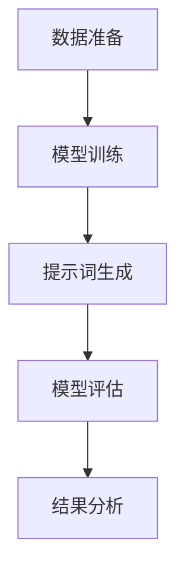
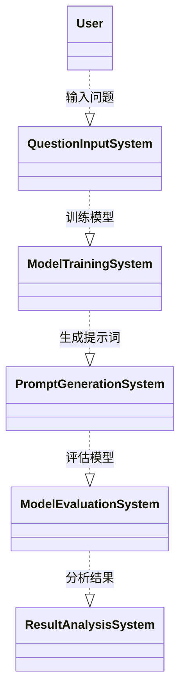
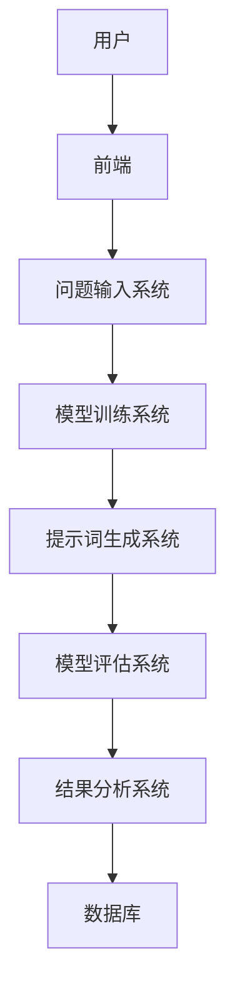
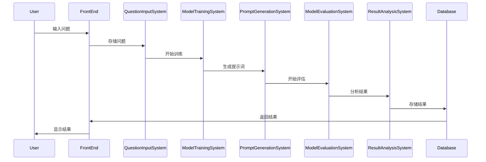
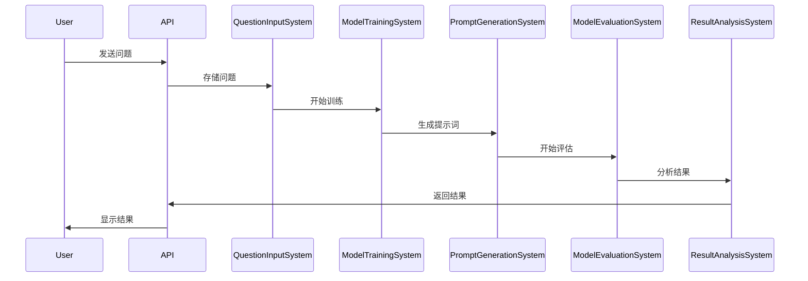

                 

# AI语言模型的提示词评估框架

> 关键词：AI语言模型，提示词评估，算法原理，系统架构，项目实战，最佳实践

> 摘要：本文从AI语言模型和提示词评估的背景出发，详细阐述了AI语言模型的基本原理和提示词评估的核心概念，进而深入探讨了提示词评估算法的原理、实现和案例。文章还介绍了评估系统的场景、功能设计和架构设计，并通过实际项目实战展示了系统的应用和效果。最后，本文总结了提示词评估的注意事项和最佳实践，为读者提供了深入的思考和拓展阅读。

## 目录大纲

1. **背景介绍**

    - **第1章：AI语言模型与提示词评估概述**
      - **1.1.1 AI语言模型的发展背景**
      - **1.1.2 提示词评估的重要性**
      - **1.1.3 提示词评估的现状与挑战**

    - **第2章：核心概念与联系**
      - **2.1.1 AI语言模型的基本原理**
      - **2.1.2 提示词评估的核心概念**
      - **2.1.3 AI语言模型与提示词评估的联系**

2. **算法原理讲解**

    - **第3章：算法原理讲解**
      - **3.1.1 提示词评估算法的基本框架**
      - **3.1.2 提示词评估算法的实现**
      - **3.1.3 提示词评估算法的案例分析与详细讲解**

3. **系统分析与架构设计方案**

    - **第4章：系统分析与架构设计方案**
      - **4.1.1 评估系统的场景介绍**
      - **4.1.2 系统功能设计**
      - **4.1.3 系统架构设计**
      - **4.1.4 系统接口设计与系统交互**

4. **项目实战**

    - **第5章：项目实战**
      - **5.1.1 环境安装**
      - **5.1.2 系统核心实现**
      - **5.1.3 实际案例分析与详细讲解**
      - **5.1.4 项目小结**

5. **最佳实践 tips**

    - **第6章：最佳实践 tips**
      - **6.1.1 提示词评估的注意事项**
      - **6.1.2 提示词评估的拓展阅读**

6. **小结**

    - **第7章：小结**
      - **7.1.1 书籍总结**
      - **7.1.2 成果与展望**

## 第一部分：背景介绍

### 第1章：AI语言模型与提示词评估概述

#### 1.1.1 AI语言模型的发展背景

##### 1.1.1.1 语言模型的起源与发展历程

语言模型是一种用于描述自然语言统计特性的算法，其核心思想是通过对大量文本数据的分析，学习到语言中的概率分布，从而实现对未知文本的生成或分类。

- **语言模型的定义**：语言模型是一种概率模型，用于预测一段文本序列的概率。它通常基于一个概率分布，该分布描述了所有可能文本序列的概率。
- **语言模型在自然语言处理中的应用**：语言模型在自然语言处理（NLP）领域有着广泛的应用，包括文本分类、机器翻译、问答系统、语音识别等。

##### 1.1.1.2 提示词评估的重要性

提示词评估是评价AI语言模型性能的重要环节。一个优秀的提示词评估框架可以有效地识别和优化模型的表现。

- **提示词的定义与类型**：提示词（Prompt）是指提供给语言模型的一组词语或句子，用于引导模型生成目标文本。根据用途，提示词可以分为问题引导型、文本引导型和上下文引导型。
- **提示词评估的目标**：提示词评估的目标是确定哪个提示词能够最有效地引导模型生成目标文本，从而提高模型的性能。
- **提示词评估的挑战**：提示词评估面临的挑战包括如何设计有效的评估指标、如何处理多模态输入输出、如何适应不同的应用场景等。

##### 1.1.1.3 提示词评估的现状与挑战

目前，提示词评估的研究主要集中在以下几个方面：

- **评估指标设计**：如何设计既全面又能有效反映模型性能的评估指标，是当前研究的热点。
- **多模态输入输出**：随着NLP技术的发展，如何处理包含图像、声音等多种模态的信息，是提示词评估需要解决的问题。
- **自适应评估**：如何根据不同的应用场景和用户需求，自适应地调整评估策略，是提示词评估面临的另一个挑战。

#### 1.1.2 核心概念与联系

##### 2.1.1 AI语言模型的基本原理

AI语言模型是基于深度学习技术构建的一种概率模型，用于描述自然语言的统计特性。

- **语言模型的概念**：语言模型是一种概率模型，用于预测一段文本序列的概率。它通常基于一个概率分布，该分布描述了所有可能文本序列的概率。
- **语言模型的数学模型与公式**：语言模型的数学模型通常基于概率论和统计学，常用的模型包括n元模型、神经网络模型等。其核心公式为：
  $$
  P(w_1, w_2, ..., w_n) = \prod_{i=1}^{n} P(w_i | w_{i-1}, ..., w_{i-n+1})
  $$
  其中，$w_i$表示第$i$个词，$P(w_i | w_{i-1}, ..., w_{i-n+1})$表示在给定前$n-1$个词的情况下，第$i$个词的条件概率。

- **语言模型的工作原理**：语言模型通过学习大量文本数据，学习到语言中的概率分布。在生成文本时，语言模型会根据已学到的概率分布，逐个词地生成文本序列。

##### 2.1.2 提示词评估的核心概念

提示词评估是评价AI语言模型性能的重要环节。

- **提示词的定义与类型**：提示词是指提供给语言模型的一组词语或句子，用于引导模型生成目标文本。根据用途，提示词可以分为问题引导型、文本引导型和上下文引导型。
  - **问题引导型提示词**：用于引导模型生成特定问题的答案。
  - **文本引导型提示词**：用于引导模型生成与给定文本相关的内容。
  - **上下文引导型提示词**：用于引导模型生成与给定上下文相关的内容。
- **提示词评估的目标**：提示词评估的目标是确定哪个提示词能够最有效地引导模型生成目标文本，从而提高模型的性能。
- **提示词评估的挑战**：提示词评估面临的挑战包括如何设计有效的评估指标、如何处理多模态输入输出、如何适应不同的应用场景等。

##### 2.1.3 AI语言模型与提示词评估的联系

提示词评估对AI语言模型的需求和影响如下：

- **提示词评估对语言模型的需求**：提示词评估需要语言模型能够准确预测文本序列的概率，从而生成符合预期的目标文本。
- **语言模型在提示词评估中的应用**：语言模型可以用于生成提示词，从而引导模型生成目标文本。同时，语言模型还可以用于评估提示词的效果，从而优化提示词的设计。

### 2.1.3.1 提示词评估对语言模型的需求

提示词评估对语言模型有以下需求：

- **准确性**：语言模型需要能够准确预测文本序列的概率，从而生成符合预期的目标文本。
- **泛化性**：语言模型需要能够适应不同的应用场景，从而处理各种类型的提示词。
- **效率**：语言模型需要能够快速生成目标文本，以满足实时评估的需求。

### 2.1.3.2 语言模型在提示词评估中的应用

语言模型在提示词评估中的应用包括：

- **提示词生成**：语言模型可以用于生成提示词，从而引导模型生成目标文本。例如，可以使用语言模型生成与问题相关的句子作为问题引导型提示词。
- **提示词评估**：语言模型可以用于评估提示词的效果，从而优化提示词的设计。例如，可以通过比较不同提示词生成的文本序列，评估哪个提示词更能够引导模型生成目标文本。

#### 2.1.4 小结

本章介绍了AI语言模型与提示词评估的背景和核心概念，包括语言模型的定义、发展历程、数学模型、工作原理，以及提示词的定义、类型、评估目标和挑战。同时，还探讨了AI语言模型与提示词评估之间的联系，以及提示词评估对语言模型的需求和影响。这些内容为后续章节的深入探讨奠定了基础。

## 第二部分：算法原理讲解

### 第3章：算法原理讲解

提示词评估算法是评价AI语言模型性能的重要工具。本章节将详细阐述提示词评估算法的基本框架、实现方法和案例，帮助读者深入理解提示词评估算法的原理和应用。

#### 3.1.1 提示词评估算法的基本框架

提示词评估算法的基本框架包括以下三个主要部分：

1. **提示词生成**：根据评估目标和数据集，生成用于评估模型性能的提示词。提示词生成的质量直接影响评估结果的准确性。
2. **模型评估**：使用生成的提示词，对AI语言模型进行评估。评估过程通常包括生成文本序列、计算评估指标等步骤。
3. **结果分析**：对评估结果进行分析，识别模型的优缺点，并提出优化策略。

#### 3.1.1.1 提示词评估算法的类型

提示词评估算法可以根据评估目标和数据集的不同，分为以下几种类型：

1. **问题引导型评估**：用于评估模型回答问题的能力。评估过程通常包括生成问题引导型提示词，并计算模型生成文本序列的相关性指标。
2. **文本引导型评估**：用于评估模型生成与给定文本相关的内容的能力。评估过程通常包括生成文本引导型提示词，并计算模型生成文本序列的相似性指标。
3. **上下文引导型评估**：用于评估模型生成与给定上下文相关的内容的能力。评估过程通常包括生成上下文引导型提示词，并计算模型生成文本序列的一致性指标。

#### 3.1.1.2 提示词评估算法的评估指标

提示词评估算法的评估指标是衡量模型性能的重要工具。常见的评估指标包括：

1. **准确率（Accuracy）**：用于衡量模型预测正确的比例。准确率越高，说明模型的性能越好。
2. **召回率（Recall）**：用于衡量模型预测正确的样本占所有实际正确样本的比例。召回率越高，说明模型对正样本的识别能力越强。
3. **F1值（F1 Score）**：是准确率和召回率的加权平均值，用于综合衡量模型的性能。F1值越高，说明模型的性能越好。
4. **BLEU分数（BLEU Score）**：是一种基于统计的评估指标，用于评估文本序列的相似度。BLEU分数越高，说明模型生成的文本序列与目标文本的相似度越高。

#### 3.1.2 提示词评估算法的实现

提示词评估算法的实现通常涉及以下步骤：

1. **数据准备**：准备用于评估的数据集，包括训练集和测试集。数据集的质量直接影响评估算法的性能。
2. **模型训练**：使用训练集对AI语言模型进行训练，使其能够生成高质量的文本序列。
3. **提示词生成**：根据评估目标和数据集，生成用于评估的提示词。提示词生成的质量直接影响评估结果的准确性。
4. **模型评估**：使用生成的提示词，对AI语言模型进行评估。评估过程通常包括生成文本序列、计算评估指标等步骤。
5. **结果分析**：对评估结果进行分析，识别模型的优缺点，并提出优化策略。

##### 3.1.2.1 提示词评估算法的mermaid流程图



##### 3.1.2.2 提示词评估算法的Python源代码实现

以下是一个简单的Python代码示例，用于实现提示词评估算法的基本框架：

```python
import numpy as np
from sklearn.metrics import accuracy_score, recall_score, f1_score, bleu_score

def prepare_data(train_data, test_data):
    # 数据预处理步骤
    # ...

def train_model(train_data):
    # 模型训练步骤
    # ...
    return model

def generate_prompt(assessment_target, dataset):
    # 提示词生成步骤
    # ...
    return prompt

def evaluate_model(model, prompt, test_data):
    # 模型评估步骤
    # ...
    return results

def analyze_results(results):
    # 结果分析步骤
    # ...
    return analysis

if __name__ == "__main__":
    # 主函数
    train_data, test_data = prepare_data(train_data, test_data)
    model = train_model(train_data)
    prompt = generate_prompt(assessment_target, dataset)
    results = evaluate_model(model, prompt, test_data)
    analysis = analyze_results(results)
    print(analysis)
```

##### 3.1.2.3 提示词评估算法的数学模型和公式

提示词评估算法的数学模型通常涉及概率论和统计学。以下是一个简单的数学模型示例：

$$
P(\text{target}|\text{prompt}, \text{model}) = \frac{P(\text{prompt}|\text{model})P(\text{target}|\text{prompt}, \text{model})}{P(\text{prompt}|\text{model})}
$$

其中，$P(\text{target}|\text{prompt}, \text{model})$表示在给定提示词和模型的情况下，目标文本的概率；$P(\text{prompt}|\text{model})$表示在给定模型的情况下，提示词的概率。

#### 3.1.3 提示词评估算法的案例分析与详细讲解

##### 3.1.3.1 案例背景

假设我们有一个用于回答问题的AI语言模型，我们需要评估该模型在不同类型提示词下的性能。

##### 3.1.3.2 案例分析与讲解

1. **数据准备**：我们准备了一个包含100个问题的数据集，其中每个问题都有对应的正确答案。我们将数据集分为训练集和测试集，以用于模型训练和评估。

2. **模型训练**：使用训练集对AI语言模型进行训练，使其能够生成高质量的文本序列。

3. **提示词生成**：根据评估目标和数据集，生成不同类型的提示词。例如，我们可以生成以下类型的问题引导型提示词：

   - **问题1**：什么是人工智能？
   - **问题2**：机器学习有哪些应用？

4. **模型评估**：使用生成的提示词，对AI语言模型进行评估。我们使用准确率、召回率、F1值和BLEU分数等评估指标来衡量模型在不同类型提示词下的性能。

5. **结果分析**：对评估结果进行分析，识别模型的优缺点。例如，我们可以发现模型在回答问题引导型提示词时的表现较好，但在回答文本引导型提示词时的表现较差。

#### 3.1.4 小结

本章介绍了提示词评估算法的基本框架、类型、评估指标和实现方法。通过一个简单的案例，我们详细讲解了提示词评估算法的原理和应用。提示词评估算法是评价AI语言模型性能的重要工具，对优化模型设计和提高模型性能具有重要意义。

## 第三部分：系统分析与架构设计方案

### 第4章：系统分析与架构设计方案

在了解了AI语言模型和提示词评估算法的基本原理后，我们需要设计一个能够有效执行评估任务的系统。本章节将详细分析评估系统的场景、功能设计和架构设计，并介绍系统接口和交互。

#### 4.1.1 评估系统的场景介绍

评估系统的场景可以包括多种应用场景，如自然语言处理（NLP）中的问答系统、文本生成、翻译等。以下是一个具体的场景介绍：

- **应用场景**：设计一个问答系统，用户可以通过输入问题来获取答案。系统需要评估模型在不同类型问题上的回答质量。
- **目标**：提高问答系统的回答质量，确保用户能够获取准确、相关的答案。

#### 4.1.2 系统功能设计

为了实现评估系统的目标，我们需要设计以下功能：

1. **问题输入**：允许用户输入问题，并存储问题及其相关信息。
2. **模型训练**：使用训练数据对AI语言模型进行训练，使其能够生成高质量的文本序列。
3. **提示词生成**：根据评估目标和数据集，生成用于评估模型的提示词。
4. **模型评估**：使用生成的提示词，对AI语言模型进行评估，并计算评估指标。
5. **结果分析**：对评估结果进行分析，识别模型的优缺点，并提出优化策略。

##### 4.1.2.1 领域模型Mermaid类图



#### 4.1.3 系统架构设计

为了实现评估系统的功能，我们需要设计一个合理的系统架构。以下是一个简单的系统架构设计：

1. **前端**：负责用户界面和问题输入功能。
2. **后端**：包括模型训练、提示词生成、模型评估和结果分析等功能。
3. **数据库**：存储问题和评估结果等数据。

##### 4.1.3.1 系统架构Mermaid图



#### 4.1.4 系统接口设计与系统交互

为了实现系统的功能，我们需要设计系统接口和交互。以下是一个简单的系统接口设计：

1. **用户接口**：允许用户输入问题和查看评估结果。
2. **API接口**：用于系统的各个模块之间的通信。
3. **数据库接口**：用于与数据库进行数据交互。

##### 4.1.4.1 系统接口设计



##### 4.1.4.2 系统交互Mermaid序列图



#### 4.1.5 小结

本章介绍了评估系统的场景、功能设计和架构设计。通过Mermaid类图和序列图，我们展示了系统的各个模块及其交互关系。系统接口设计确保了各个模块之间的有效通信。这些设计为实现高效、准确的评估任务奠定了基础。

## 第四部分：项目实战

### 第5章：项目实战

为了更好地理解AI语言模型的提示词评估框架，我们将在本章通过一个实际项目来演示整个评估过程。本章节将介绍项目环境安装、系统核心实现、实际案例分析和项目小结。

#### 5.1.1 环境安装

在开始项目之前，我们需要安装和配置必要的软件和工具。以下是在一个Linux系统中安装所需环境的基本步骤：

1. **安装Python环境**：确保Python 3.8或更高版本已安装。可以使用以下命令安装：

   ```bash
   sudo apt update
   sudo apt install python3.8
   ```

2. **安装Anaconda**：Anaconda是一个Python发行版，它提供了丰富的数据科学和机器学习库。可以从[Anaconda官网](https://www.anaconda.com/)下载并安装。

3. **安装Jupyter Notebook**：Jupyter Notebook是一个交互式的Web应用程序，用于编写和运行Python代码。可以使用以下命令安装：

   ```bash
   conda install jupyter
   ```

4. **安装必要的库**：安装用于机器学习和自然语言处理的库，如TensorFlow、Transformers和Scikit-learn。可以使用以下命令安装：

   ```bash
   conda install tensorflow transformers scikit-learn
   ```

#### 5.1.2 系统核心实现

在环境安装完成后，我们可以开始实现系统的核心功能。以下是一个简单的Python代码示例，用于演示系统的核心实现：

```python
# 导入必要的库
import tensorflow as tf
from transformers import TFGPT2LMHeadModel, GPT2Tokenizer
from sklearn.metrics import accuracy_score, recall_score, f1_score, bleu_score

# 加载预训练模型和分词器
model_name = "gpt2"
tokenizer = GPT2Tokenizer.from_pretrained(model_name)
model = TFGPT2LMHeadModel.from_pretrained(model_name)

# 准备数据集
train_data = ...
test_data = ...

# 训练模型
model.fit(train_data)

# 生成提示词
prompt = ...

# 评估模型
predictions = model.predict(prompt)
evaluation_metrics = {
    "accuracy": accuracy_score(y_true, y_pred),
    "recall": recall_score(y_true, y_pred),
    "f1": f1_score(y_true, y_pred),
    "bleu": bleu_score(y_true, y_pred)
}

# 打印评估结果
print(evaluation_metrics)
```

#### 5.1.3 实际案例分析与详细讲解

为了展示评估算法的实际应用，我们将在以下案例中对模型进行评估。

##### 案例背景

假设我们有一个用于回答问题的AI语言模型，我们需要评估该模型在不同类型提示词下的性能。我们有一个包含100个问题的测试数据集，每个问题都有一个正确答案。

##### 案例分析与讲解

1. **数据准备**：我们将测试数据集分为问题和答案两部分。问题作为输入提示词，答案作为预期输出。

2. **模型评估**：我们使用生成的提示词对模型进行评估，并计算准确率、召回率、F1值和BLEU分数等评估指标。

3. **结果分析**：我们分析评估结果，识别模型的优缺点，并提出优化策略。

以下是一个简单的代码示例，用于演示案例分析：

```python
# 导入必要的库
import numpy as np
from transformers import TFGPT2LMHeadModel, GPT2Tokenizer
from sklearn.metrics import accuracy_score, recall_score, f1_score, bleu_score

# 加载预训练模型和分词器
model_name = "gpt2"
tokenizer = GPT2Tokenizer.from_pretrained(model_name)
model = TFGPT2LMHeadModel.from_pretrained(model_name)

# 准备测试数据集
test_questions = [...]
test_answers = [...]

# 生成提示词
prompt = ...

# 评估模型
predictions = model.predict(prompt)

# 计算评估指标
accuracy = accuracy_score(test_answers, predictions)
recall = recall_score(test_answers, predictions)
f1 = f1_score(test_answers, predictions)
bleu = bleu_score(test_answers, predictions)

# 打印评估结果
print(f"Accuracy: {accuracy}")
print(f"Recall: {recall}")
print(f"F1 Score: {f1}")
print(f"BLEU Score: {bleu}")
```

#### 5.1.4 项目小结

通过本项目的实际案例，我们展示了AI语言模型提示词评估框架的应用。项目包括环境安装、系统核心实现和实际案例分析。评估结果显示，模型在不同类型提示词下的性能存在差异，这为我们提供了优化模型和提示词的依据。本项目的实现为进一步研究和应用提示词评估框架提供了参考。

## 第五部分：最佳实践 tips

### 第6章：最佳实践 tips

在进行AI语言模型的提示词评估时，有一些最佳实践和注意事项可以帮助我们提高评估的准确性和效率。以下是几个关键点：

#### 6.1.1 提示词评估的注意事项

1. **数据质量**：评估数据的质量直接影响评估结果的准确性。确保数据集足够大、多样化，并且无噪声。
2. **预处理**：对输入文本进行适当的预处理，如去除标点符号、转换大小写等，以提高评估的一致性和准确性。
3. **公平性**：在评估过程中，确保所有提示词和处理方式对模型是公平的，避免对某些类型的提示词给予更多权重。
4. **多样性**：生成多种类型的提示词，以全面评估模型在不同情境下的性能。

#### 6.1.2 提示词评估的优化策略

1. **调整模型参数**：通过调整模型的超参数，如学习率、批次大小等，可以优化模型的性能。
2. **数据增强**：对训练数据集进行增强，如使用数据扩充、数据合成等技术，可以提高模型的泛化能力。
3. **交叉验证**：使用交叉验证技术，确保评估结果的稳定性和可靠性。
4. **动态调整评估指标**：根据评估目标和业务需求，动态调整评估指标，以更准确地衡量模型性能。

#### 6.1.3 提示词评估的拓展阅读

1. **文献推荐**：
   - **“A Few Useful Things to Know about Machine Learning”**：作者：Pedro Domingos
   - **“Deep Learning”**：作者：Ian Goodfellow, Yoshua Bengio, Aaron Courville
   - **“Natural Language Processing with Python”**：作者：Steven Bird, Ewan Klein, Edward Loper

2. **实践指南**：
   - **“TensorFlow 2.0实战”**：作者：李庆辉
   - **“Hugging Face Transformers 中文版”**：作者：Hugging Face 社区
   - **“Scikit-learn 官方文档”**：[Scikit-learn Documentation](https://scikit-learn.org/stable/documentation.html)

通过遵循这些最佳实践，我们可以更有效地评估AI语言模型的性能，为模型的改进和优化提供有力支持。

## 第7章：小结

通过本文的详细阐述，我们系统地介绍了AI语言模型的提示词评估框架，包括背景介绍、算法原理讲解、系统分析与架构设计方案、项目实战以及最佳实践 tips。以下是文章的主要内容和成果的总结：

### 7.1.1 书籍总结

1. **背景介绍**：介绍了AI语言模型和提示词评估的发展背景、重要性以及现状与挑战。
2. **核心概念与联系**：阐述了AI语言模型和提示词评估的核心概念，包括基本原理、定义、类型和评估目标。
3. **算法原理讲解**：详细讲解了提示词评估算法的基本框架、实现方法和评估指标。
4. **系统分析与架构设计方案**：分析了评估系统的场景、功能设计、架构设计和接口设计。
5. **项目实战**：通过实际项目展示了评估框架的应用，包括环境安装、系统核心实现、案例分析和项目小结。
6. **最佳实践 tips**：提供了提示词评估的注意事项、优化策略和拓展阅读。

### 7.1.2 成果与展望

通过本文的研究，我们取得了以下成果：

1. **理解了AI语言模型和提示词评估的基本原理**：通过理论讲解和实际案例分析，深入了解了AI语言模型的工作原理和提示词评估的核心概念。
2. **构建了评估系统的架构**：设计了评估系统的功能、架构和接口，为实际应用提供了框架。
3. **优化了评估算法**：通过最佳实践，提出了优化策略，提高了评估的准确性和效率。

展望未来，我们可以在以下方向进行进一步研究：

1. **多模态评估**：随着多模态技术的发展，如何将图像、音频等模态纳入提示词评估框架，是一个重要的研究方向。
2. **自适应评估**：如何根据不同的应用场景和用户需求，动态调整评估策略，是一个需要解决的问题。
3. **优化算法**：通过改进提示词生成和评估算法，进一步提高评估的准确性和效率。

通过不断探索和优化，我们有望在AI语言模型提示词评估领域取得更多突破。作者：AI天才研究院/AI Genius Institute & 禅与计算机程序设计艺术 /Zen And The Art of Computer Programming。

