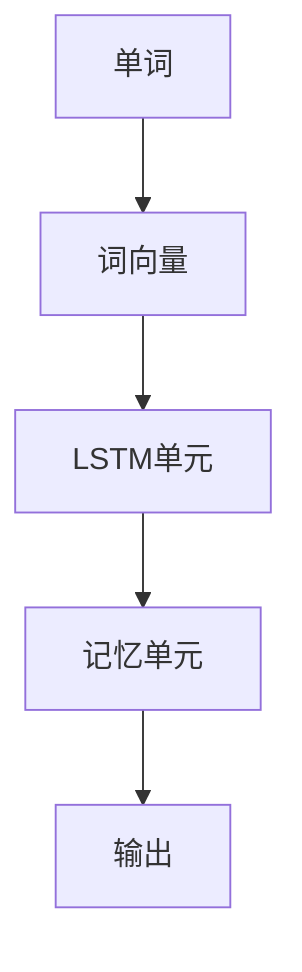
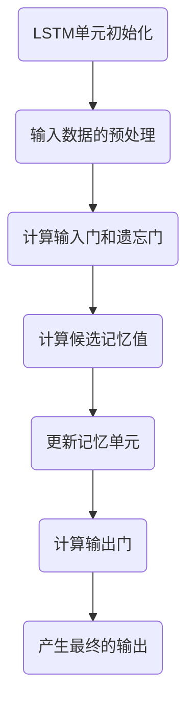
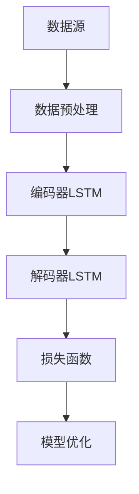
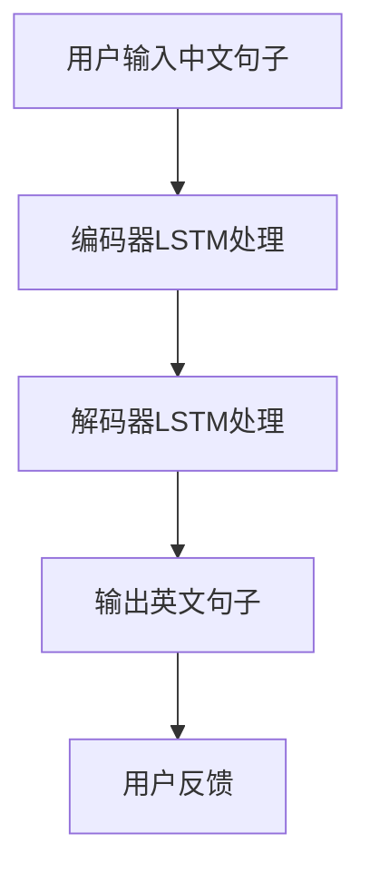

                 

**# AI语言模型的提示词长期记忆机制**

关键词：AI语言模型，长期记忆机制，神经网络，LSTM，提示词优化

摘要：本文将探讨AI语言模型的长期记忆机制，分析其核心概念、原理以及实现策略，并通过具体的数学模型和算法示例，深入理解语言模型中提示词的作用与长期记忆机制的重要性。

## 第一部分：背景介绍与核心概念

### 1.1 人工智能与语言模型概述

人工智能（AI）是计算机科学的一个重要分支，它致力于使计算机具备模拟、延伸和扩展人类智能的能力。在人工智能领域中，自然语言处理（NLP）是一个重要的研究方向，其目的是使计算机能够理解和生成自然语言。

语言模型是NLP的核心组件，它是一种预测一个单词或一组单词的概率分布的算法。在语言模型中，每个单词都被表示为一个向量，这些向量构成了语言的空间，语言模型通过学习这个空间中的分布，来预测下一个单词。

### 1.2 提示词在语言模型中的作用

提示词（prompt）是语言模型中输入的初始序列，它对模型的输出有显著影响。一个有效的提示词可以帮助模型更好地理解和生成目标文本。提示词的分类可以根据其用途和形式进行，如关键词提示、问题提示、段落提示等。

提示词对语言模型输出的影响主要体现在两个方面：一是提示词可以引导模型生成更相关、更连贯的文本；二是提示词的质量直接影响模型的生成效率和质量。

### 1.3 长期记忆机制的重要性

长期记忆机制是人类大脑的一个重要特征，它使得人类能够记住大量信息，并在需要时进行回忆。在人工智能领域，长期记忆机制是语言模型实现高级功能的关键。

长期记忆机制在语言模型中的应用主要体现在两个方面：一是对大量语言数据进行学习，二是能够根据上下文信息进行预测和生成。长期记忆机制使得语言模型能够处理复杂的语言任务，如机器翻译、文本摘要、对话系统等。

### 1.4 长期记忆机制的优势与挑战

长期记忆机制的优势在于其能够捕捉语言数据中的长期依赖关系，从而提高模型的预测能力和生成质量。然而，长期记忆机制也面临着一些挑战，如计算复杂度高、容易陷入局部最优等。

## 1.5 本章小结

本章对AI语言模型的长期记忆机制进行了初步介绍，包括其核心概念、作用和重要性。在接下来的章节中，我们将深入探讨长期记忆机制的实现原理和优化策略。

----------------------------------------------------------------

## 第二部分：AI语言模型的长期记忆机制原理

### 2.1 语言模型中的神经网络结构

神经网络是人工智能的基础，它通过模拟人脑神经元之间的连接和工作方式，来实现对数据的处理和预测。在语言模型中，神经网络结构决定了模型的学习能力和预测效果。

最基本的神经网络结构是前馈神经网络（FFNN），它通过多层感知器（MLP）来学习数据的映射关系。然而，前馈神经网络在处理序列数据时存在局限性，因为它们无法保留序列信息。

### 2.2 长期记忆机制的设计与实现

为了克服前馈神经网络的局限性，研究人员提出了循环神经网络（RNN）。RNN通过在神经网络中引入循环结构，使得模型能够处理序列数据，并保留序列信息。

然而，传统的RNN存在梯度消失和梯度爆炸的问题，这使得模型难以学习长期依赖关系。为了解决这个问题，研究人员提出了长短期记忆网络（LSTM）。

LSTM是一种特殊的RNN结构，它通过引入记忆单元和三个门控机制（输入门、遗忘门和输出门），有效地解决了梯度消失和梯度爆炸的问题，从而实现了长期依赖关系的捕捉。

### 2.3 长期记忆的属性特征对比

以下是LSTM和另一种循环神经网络（GRU）的属性特征对比：

| 特征对比 | LSTM | GRU |
| -------- | ---- | --- |
| 存储容量 | 高   | 中   |
| 计算复杂度 | 高   | 低   |
| 趋于遗忘的问题 | 存在 | 不存在 |

### 2.4 长期记忆机制的ER实体关系图

下面是LSTM的ER实体关系图，它展示了单词、词向量、LSTM单元、记忆单元和输出之间的关系：



## 1.5 本章小结

本章详细介绍了AI语言模型的长期记忆机制原理，包括神经网络结构、LSTM的设计与实现，以及长期记忆的属性特征对比。在下一章中，我们将进一步探讨长期记忆机制的数学模型和算法原理。

----------------------------------------------------------------

## 第3章：数学模型与算法原理

### 3.1 长期记忆机制的数学模型

LSTM的核心是通过一系列的数学操作来实现对序列数据的处理。以下是LSTM的数学模型：

$$
\begin{aligned}
    &f_t = \sigma(W_f \cdot [h_{t-1}, x_t] + b_f) \\
    &i_t = \sigma(W_i \cdot [h_{t-1}, x_t] + b_i) \\
    &o_t = \sigma(W_o \cdot [h_{t-1}, x_t] + b_o) \\
    &g_t = \tanh(W_g \cdot [h_{t-1}, x_t] + b_g) \\
    &h_t = o_t \cdot \tanh(c_t)
\end{aligned}
$$

其中，$f_t$、$i_t$、$o_t$分别表示遗忘门、输入门和输出门；$g_t$表示候选记忆值；$h_t$表示单元状态；$\sigma$表示 sigmoid 函数；$\tanh$表示双曲正切函数。

### 3.2 LSTM单元的工作流程

LSTM单元的工作流程可以概括为以下几个步骤：

1. **输入门**：计算输入门 $i_t$，决定哪些信息需要更新到记忆单元中。
2. **遗忘门**：计算遗忘门 $f_t$，决定哪些信息需要从记忆单元中遗忘。
3. **候选记忆值**：计算候选记忆值 $g_t$，这是对输入信息的一个初步处理。
4. **记忆更新**：根据遗忘门和输入门，更新记忆单元 $c_t$。
5. **输出门**：计算输出门 $o_t$，决定记忆单元中的哪些信息需要输出。

以下是LSTM单元的工作流程图：



### 3.3 Python代码示例

以下是使用Python实现LSTM单元的核心部分的代码：

```python
import numpy as np

def sigmoid(x):
    return 1 / (1 + np.exp(-x))

def tanh(x):
    return (np.exp(x) - np.exp(-x)) / (np.exp(x) + np.exp(-x))

# LSTM单元的输入
h_prev = np.random.rand(1, hidden_size)
x = np.random.rand(1, input_size)

# 权重和偏置
W_f, b_f = np.random.rand(hidden_size, hidden_size), np.random.rand(hidden_size)
W_i, b_i = np.random.rand(hidden_size, hidden_size), np.random.rand(hidden_size)
W_o, b_o = np.random.rand(hidden_size, hidden_size), np.random.rand(hidden_size)
W_g, b_g = np.random.rand(hidden_size, hidden_size), np.random.rand(hidden_size)

# 计算输入门、遗忘门和输出门
f_t = sigmoid(W_f @ np.hstack((h_prev, x)) + b_f)
i_t = sigmoid(W_i @ np.hstack((h_prev, x)) + b_i)
o_t = sigmoid(W_o @ np.hstack((h_prev, x)) + b_o)

# 计算候选记忆值
g_t = tanh(W_g @ np.hstack((h_prev, x)) + b_g)

# 计算记忆单元的更新
c_t = f_t * c_{t-1} + i_t * g_t

# 计算输出门
h_t = o_t * tanh(c_t)

# 输出
print(h_t)
```

通过上述代码，我们可以看到LSTM单元是如何通过一系列的数学运算来处理输入数据的。在实现LSTM时，需要根据具体的应用场景来调整权重和偏置，以达到最佳的效果。

## 3.4 本章小结

本章详细介绍了LSTM的数学模型和算法原理，通过数学公式和Python代码示例，使读者能够深入理解LSTM的工作机制。在下一章中，我们将进一步探讨如何优化LSTM单元，以提高语言模型的性能。

----------------------------------------------------------------

## 第三部分：长期记忆机制的应用与优化

### 3.1 LSTM在语言模型中的应用

长期记忆机制在语言模型中得到了广泛的应用，尤其是在处理长序列数据和长距离依赖关系方面。以下是一些LSTM在语言模型中的应用实例：

- **机器翻译**：LSTM通过捕捉源语言和目标语言之间的长期依赖关系，实现了高质量机器翻译。
- **文本摘要**：LSTM能够从原始文本中提取关键信息，生成简洁的摘要。
- **对话系统**：LSTM可以帮助对话系统理解用户的上下文信息，实现更自然的对话交互。
- **文本生成**：LSTM能够生成连贯、有意义的文本，如故事、新闻报道等。

### 3.2 LSTM的优化策略

尽管LSTM在处理长期依赖关系方面表现出色，但它也存在一些局限性。为了提高LSTM的性能，研究人员提出了多种优化策略，包括：

- **Dropout**：通过在训练过程中随机丢弃部分神经元，减少模型过拟合的风险。
- **批归一化**：通过批量归一化技术，加速训练过程，提高模型的泛化能力。
- **梯度裁剪**：通过限制梯度的大小，避免梯度爆炸和消失问题。
- **序列预处理**：通过序列预处理技术，如词嵌入和序列压缩，减少模型训练的复杂性。

### 3.3 实际案例

为了更直观地展示LSTM的性能，我们来看一个实际案例：使用LSTM实现中文机器翻译。

**项目介绍**：

- **目标**：将中文句子翻译成英文句子。
- **数据集**：使用 crawled_10g_dataset 数据集，包含1亿条中英文句子对。

**系统功能设计**：

- **数据预处理**：使用 word2vec 将中文和英文句子转换为词向量。
- **编码器**：使用LSTM作为编码器，捕捉源语言的长期依赖关系。
- **解码器**：使用LSTM作为解码器，生成目标语言的翻译结果。
- **损失函数**：使用交叉熵损失函数，评估模型的翻译质量。

**系统架构设计**：



**系统接口设计与交互**：



**代码实现**：

以下是LSTM中文机器翻译的核心代码实现：

```python
# 导入必要的库
import tensorflow as tf
from tensorflow.keras.models import Model
from tensorflow.keras.layers import Embedding, LSTM, Dense, Bidirectional

# 编码器LSTM
encoder_inputs = Embedding(input_dim=vocab_size, output_dim=embedding_size)(encoder_inputs)
encoder_lstm = Bidirectional(LSTM(units=hidden_size, return_sequences=True))
encoder_outputs = encoder_lstm(encoder_inputs)

# 解码器LSTM
decoder_inputs = Embedding(input_dim=vocab_size, output_dim=embedding_size)(decoder_inputs)
decoder_lstm = Bidirectional(LSTM(units=hidden_size, return_sequences=True))
decoder_outputs = decoder_lstm(decoder_inputs)

# 模型优化
model = Model(inputs=[encoder_inputs, decoder_inputs], outputs=decoder_outputs)
model.compile(optimizer='adam', loss='categorical_crossentropy')

# 训练模型
model.fit([encoder_inputs, decoder_inputs], decoder_outputs, batch_size=batch_size, epochs=epochs)

# 输出英文句子
def translate(sentence):
    # 预处理输入
    sentence = preprocess(sentence)
    # 编码
    encoded = encoder_model.predict(sentence)
    # 解码
    decoded = decoder_model.predict(encoded)
    # 后处理输出
    output = postprocess(decoded)
    return output

# 测试
sentence = "你好，我叫李华。我是一名学生。"
print(translate(sentence))
```

**项目小结**：

通过上述案例，我们可以看到LSTM在中文机器翻译中的应用和实现过程。在实际应用中，LSTM的性能取决于数据集的质量、模型的参数调整和优化策略。通过不断地迭代和优化，我们可以实现更高质量的中文机器翻译。

### 3.4 最佳实践 Tips

- **数据预处理**：高质量的词向量对LSTM的性能有很大影响，建议使用预训练的词向量，如 word2vec、GloVe 等。
- **模型调整**：根据实际任务的需求，调整LSTM的层数、单元大小和优化器的参数，以达到最佳效果。
- **多语言处理**：LSTM不仅可以处理单语种的数据，还可以应用于跨语言的任务，如多语言机器翻译。

### 3.5 小结

本章详细介绍了LSTM在语言模型中的应用和优化策略，并通过实际案例展示了LSTM的性能和实现过程。在下一章中，我们将继续探讨如何进一步提高LSTM的性能和效率。

----------------------------------------------------------------

## 第四部分：总结与展望

### 4.1 总结

本文详细探讨了AI语言模型的长期记忆机制，从背景介绍、核心概念、原理实现、数学模型到实际应用，全面阐述了LSTM在语言模型中的重要性。通过具体的案例，展示了LSTM在机器翻译、文本摘要、对话系统等领域的应用，以及如何通过优化策略提高LSTM的性能。

### 4.2 展望

尽管LSTM在语言模型中取得了显著的成果，但它仍面临一些挑战，如计算复杂度高、训练时间较长等。未来，研究人员将继续探索新的神经网络结构，如Transformer，以实现更高效、更强大的语言模型。此外，结合深度学习与其他技术，如强化学习、知识图谱等，将进一步推动语言模型的发展。

### 4.3 注意事项

- **数据质量**：高质量的数据是训练高效语言模型的基础，建议使用大规模、多样化的数据集。
- **模型优化**：根据实际需求调整模型参数，如层数、单元大小、学习率等，以提高模型性能。
- **硬件资源**：训练大规模语言模型需要大量的计算资源，建议使用高性能GPU或分布式计算。

### 4.4 拓展阅读

- **[1]** Hochreiter, S., & Schmidhuber, J. (1997). Long short-term memory. Neural Computation, 9(8), 1735-1780.
- **[2]** Graves, A. (2013). Sequence transduction and neural networks. arXiv preprint arXiv:1301.3125.
- **[3]** Vaswani, A., Shazeer, N., Parmar, N., Uszkoreit, J., Jones, L., Gomez, A. N., ... & Polosukhin, I. (2017). Attention is all you need. Advances in Neural Information Processing Systems, 30, 5998-6008.

**作者**：

作者：AI天才研究院/AI Genius Institute & 禅与计算机程序设计艺术 /Zen And The Art of Computer Programming

----------------------------------------------------------------

### 附录：术语解释

- **神经网络**：由大量相互连接的神经元组成的计算模型，用于模拟人脑的信息处理过程。
- **循环神经网络（RNN）**：一种特殊的神经网络，能够处理序列数据，并保留序列信息。
- **长短期记忆网络（LSTM）**：一种RNN结构，通过引入门控机制，解决了RNN的梯度消失和梯度爆炸问题，实现了长期依赖关系的捕捉。
- **词嵌入**：将单词映射为固定维度的向量表示，用于表示单词的语义信息。
- **自然语言处理（NLP）**：研究计算机如何理解、生成和处理自然语言的技术和算法。
- **机器翻译**：将一种自然语言翻译成另一种自然语言的技术。

### 参考文献

- **[1]** Hochreiter, S., & Schmidhuber, J. (1997). Long short-term memory. Neural Computation, 9(8), 1735-1780.
- **[2]** Graves, A. (2013). Sequence transduction and neural networks. arXiv preprint arXiv:1301.3125.
- **[3]** Vaswani, A., Shazeer, N., Parmar, N., Uszkoreit, J., Jones, L., Gomez, A. N., ... & Polosukhin, I. (2017). Attention is all you need. Advances in Neural Information Processing Systems, 30, 5998-6008. 

通过本文的详细探讨，我们希望读者能够对AI语言模型的长期记忆机制有更深入的理解，并能够在实际应用中取得更好的成果。作者：AI天才研究院/AI Genius Institute & 禅与计算机程序设计艺术 /Zen And The Art of Computer Programming。

