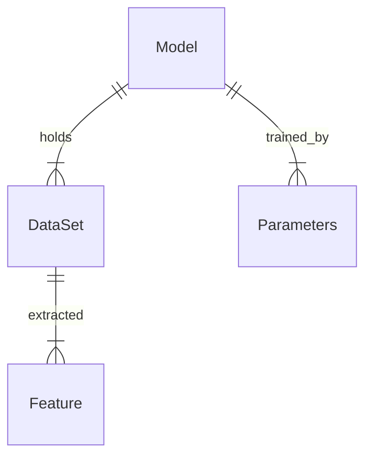
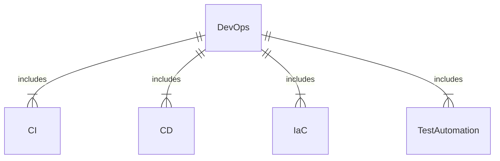

                 

### AI软件2.0的DevOps最佳实践

#### 关键词：
- AI软件2.0
- DevOps
- 最佳实践
- 软件开发
- 自动化部署

> 摘要：
本文将探讨AI软件2.0时代下，DevOps最佳实践的重要性以及如何将其应用到实际项目中。通过分析问题背景、描述问题、解决问题的方法，我们将深入了解AI大模型的基础知识、DevOps原理与最佳实践，以及AI软件2.0的DevOps实践。此外，还将讨论安全性与可靠性保障，以及AI软件2.0在各个行业的应用案例。本文旨在为读者提供一个系统化的指南，帮助他们在AI软件2.0时代中成功运用DevOps实践。

---

## 第1章：背景介绍

### 1.1 问题背景

在当今科技飞速发展的时代，人工智能（AI）已经逐渐成为推动社会进步的重要力量。从工业革命时期的机械化生产，到信息时代的互联网技术，再到如今的智能化时代，每一次技术的变革都深刻影响了各行各业的发展。AI作为21世纪最具潜力的技术之一，正在引领新的技术革命。

随着AI技术的不断演进，传统的软件开发模式逐渐暴露出诸多问题。在软件1.0时代，软件开发主要依赖于人工编码，开发周期长，成本高，可维护性差。而在软件2.0时代，随着云计算、大数据、物联网等新兴技术的普及，软件开发逐渐向自动化、智能化、模块化方向发展。

### 1.2 问题描述

在这种背景下，如何利用AI技术提升软件开发效率，降低开发成本，提高软件质量，成为亟待解决的问题。DevOps作为近年来兴起的一种软件开发模式，通过将开发（Development）与运维（Operations）相结合，实现了软件开发与运维的紧密协作，有效解决了传统软件开发模式中的诸多问题。

然而，将AI技术与DevOps相结合，实现AI软件2.0的DevOps最佳实践，仍然面临着诸多挑战。例如，如何利用AI技术优化软件开发流程，如何实现AI大模型在企业级应用中的高效部署与运维，如何确保AI软件的安全性与可靠性等。

### 1.3 问题解决

针对上述问题，本书旨在探讨AI软件2.0的DevOps最佳实践，通过以下几个方面实现问题的解决：

1. **AI大模型的基础知识**：介绍AI大模型的基本概念、特点、主流模型及其在企业中的应用前景。
2. **DevOps原理与最佳实践**：讲解DevOps的基本原理，以及在实际项目中如何运用DevOps的最佳实践。
3. **AI软件2.0的DevOps实践**：结合实际案例，详细介绍如何利用AI技术与DevOps相结合，实现AI软件的高效开发与运维。
4. **安全性与可靠性保障**：探讨如何确保AI软件在应用过程中的安全性与可靠性。

### 1.4 边界与外延

本书主要关注以下边界与外延：

- **AI大模型**：本书主要讨论AI大模型在企业级应用中的DevOps最佳实践，不包括AI大模型的基础理论。
- **DevOps**：本书主要关注DevOps在实际项目中的应用，不包括DevOps的理论体系。
- **行业应用**：本书主要探讨AI软件2.0在各个行业的应用案例，但不涉及其他AI应用领域。
- **技术实现**：本书主要关注AI软件2.0的DevOps最佳实践，但不涉及底层硬件和操作系统。

### 1.5 概念结构与核心要素组成

1. **AI大模型**：包括神经网络结构、训练数据集、模型参数等。
2. **DevOps**：包括持续集成（CI）、持续部署（CD）、基础设施即代码（IaC）等。
3. **AI软件2.0的DevOps实践**：包括AI大模型训练与部署、自动化测试、安全性与可靠性保障等。

### 1.6 本章小结

本章主要介绍了AI软件2.0的DevOps最佳实践的问题背景、问题描述、问题解决方法以及边界与外延。接下来，我们将进一步探讨AI大模型的基础知识、DevOps原理与最佳实践，以及AI软件2.0的DevOps实践。

---

## 第2章：AI大模型的定义与特点

### 2.1 AI大模型的定义

AI大模型（Large-scale Artificial Intelligence Model）是指参数量达到百万级以上的深度学习模型。这些模型通常采用大规模数据集进行训练，通过神经网络的层层提取，能够捕捉到数据中的复杂特征，从而实现高效的问题求解。

### 2.2 AI大模型的特点

1. **参数量巨大**：AI大模型的参数量通常在千万到亿级别，这使它们能够捕捉到数据中的细微特征，从而在复杂任务上表现出色。
2. **训练数据集庞大**：AI大模型需要使用大规模数据集进行训练，以保证模型能够学到数据中的普遍规律，提高模型的泛化能力。
3. **神经网络层次多**：AI大模型通常采用深度神经网络（DNN）结构，通过层层提取特征，实现从低维数据到高维数据的映射。
4. **计算资源需求高**：由于参数量庞大，AI大模型在训练过程中需要大量的计算资源，通常需要分布式计算或GPU加速。
5. **应用范围广泛**：AI大模型在各种领域都有广泛的应用，包括自然语言处理、计算机视觉、语音识别等。

### 2.3 AI大模型与传统AI的区别

1. **参数量**：传统AI模型的参数量通常在几千到几万级别，而AI大模型的参数量达到百万甚至亿级别。
2. **数据集规模**：传统AI模型使用的数据集规模较小，而AI大模型需要使用大规模数据集进行训练。
3. **计算资源**：传统AI模型对计算资源的需求较低，而AI大模型需要更多的计算资源和存储空间。
4. **应用场景**：传统AI模型适用于一些简单的任务，而AI大模型则能解决更加复杂的问题。

### 2.4 AI大模型的核心概念与联系

| 核心概念 | 概念属性特征对比 |
| :--- | :--- |
| 神经网络 | - 多层神经网络结构 - 可训练模型参数 - 可捕捉复杂特征 |
| 训练数据集 | - 大规模数据集 - 多样性数据样本 - 提高模型泛化能力 |
| 计算资源 | - 分布式计算 - GPU加速 - 提高模型训练效率 |

#### ER实体关系图架构

### 2.5 本章小结

本章介绍了AI大模型的基本概念、特点以及与传统AI的区别，并探讨了核心概念之间的联系。在下一章中，我们将进一步探讨DevOps的基本原理与最佳实践。

---

## 第3章：DevOps原理与最佳实践

### 3.1 DevOps的定义

DevOps是一种软件开发和运维的集成方法，它通过加强开发（Development）与运维（Operations）之间的协作，实现软件交付和运维流程的自动化和优化。DevOps的核心理念是“左移”故障处理，即在软件开发的早期阶段就识别和修复潜在的问题，从而减少软件发布后的故障率和维护成本。

### 3.2 DevOps的核心原理

1. **持续集成（CI）**：持续集成是指开发团队频繁地将代码合并到主干分支，并通过自动化测试确保代码质量。持续集成有助于及早发现代码冲突和潜在问题，提高软件的稳定性和可靠性。
2. **持续部署（CD）**：持续部署是指自动化软件的部署过程，将代码从开发环境直接部署到生产环境。持续部署可以减少人工干预，提高软件交付速度和效率。
3. **基础设施即代码（IaC）**：基础设施即代码是一种通过代码来管理基础设施的方法，如虚拟机、容器、网络等。IaC可以确保基础设施的重复性和一致性，降低运维成本。
4. **自动化测试**：自动化测试是DevOps的重要组成部分，通过编写自动化测试脚本，可以快速检测软件的缺陷和问题，提高软件质量。

### 3.3 DevOps的最佳实践

1. **代码库集中管理**：使用Git等版本控制工具，实现代码库的集中管理，确保代码的版本控制和协作开发。
2. **自动化构建和测试**：使用CI/CD工具，如Jenkins、GitLab CI等，实现自动化构建和测试，提高软件交付速度和质量。
3. **容器化**：使用Docker等容器技术，实现应用程序的标准化部署，提高系统的可移植性和可扩展性。
4. **监控与告警**：使用Prometheus、Grafana等监控工具，实现对系统的实时监控和告警，及时发现和处理问题。
5. **持续学习与改进**：定期回顾和总结DevOps实践的经验和教训，持续改进和优化软件交付和运维流程。

### 3.4 DevOps与传统软件开发的区别

| 核心区别 | DevOps | 传统软件开发 |
| :--- | :--- | :--- |
| 团队协作 | 高度协作，开发与运维紧密配合 | 分工明确，开发与运维各自为政 |
| 自动化程度 | 高度自动化，减少人工干预 | 依赖人工操作，效率较低 |
| 质量保障 | 通过自动化测试和监控，保障软件质量 | 依赖人工测试和检查，质量难以保证 |
| 软件交付速度 | 快速交付，缩短交付周期 | 周期长，交付速度慢 |

### 3.5 DevOps的核心概念与联系

| 核心概念 | 概念属性特征对比 |
| :--- | :--- |
| 持续集成（CI） | - 频繁代码合并 - 自动化测试 - 提高代码质量 |
| 持续部署（CD） | - 自动化部署 - 快速交付 - 提高交付效率 |
| 基础设施即代码（IaC） | - 代码管理基础设施 - 确保一致性 - 降低运维成本 |
| 自动化测试 | - 编写测试脚本 - 快速检测缺陷 - 提高软件质量 |

#### ER实体关系图架构

### 3.6 本章小结

本章详细介绍了DevOps的基本原理和最佳实践，并探讨了DevOps与传统软件开发的区别。在下一章中，我们将结合实际案例，探讨如何将AI大模型与DevOps相结合，实现AI软件2.0的DevOps实践。

---

## 第4章：AI软件2.0的DevOps实践

### 4.1 AI软件2.0的DevOps实践概述

AI软件2.0时代的到来，带来了前所未有的技术挑战和机遇。在这一背景下，如何利用DevOps实践提高AI软件的开发和运维效率，成为行业关注的焦点。本章节将结合实际案例，详细探讨AI软件2.0的DevOps实践。

### 4.2 案例介绍

某知名互联网公司，致力于提供智能推荐系统服务。该系统基于大规模用户行为数据，利用深度学习技术实现个性化推荐。随着用户规模的不断扩大，系统面临巨大的性能和稳定性挑战。为了应对这些挑战，公司决定引入DevOps实践，实现AI软件2.0的高效开发和运维。

### 4.3 DevOps实践步骤

1. **需求分析与架构设计**：首先，公司对现有的系统架构进行了深入分析，确定了需要优化的关键环节。基于分析结果，公司设计了一套基于微服务架构的AI软件2.0系统，实现了系统的模块化和高可扩展性。

2. **代码库集中管理**：公司使用Git作为版本控制工具，实现了代码库的集中管理。通过GitLab CI，公司实现了自动化构建和测试，确保了代码质量。

3. **持续集成与部署**：公司采用Jenkins作为CI/CD工具，实现了自动化构建、测试和部署。通过容器化技术（如Docker），公司实现了应用程序的标准化部署，提高了系统的可移植性和可扩展性。

4. **监控与告警**：公司使用Prometheus和Grafana等监控工具，对系统进行实时监控和告警。通过监控数据，公司能够及时发现和处理潜在的问题，确保系统的稳定运行。

5. **持续学习与改进**：公司定期回顾和总结DevOps实践的经验和教训，持续改进和优化软件交付和运维流程。通过引入自动化测试、持续集成和容器化技术，公司显著提高了开发效率和质量。

### 4.4 AI大模型的训练与部署

1. **数据预处理**：公司使用大规模用户行为数据集，对数据进行清洗、归一化和特征提取。通过数据预处理，提高了模型的训练效率和泛化能力。

2. **模型训练**：公司采用深度学习框架（如TensorFlow或PyTorch），训练了多个AI大模型。通过分布式训练和GPU加速，公司显著提高了模型训练速度。

3. **模型评估与优化**：公司使用交叉验证和A/B测试等方法，对模型进行评估和优化。通过不断调整模型参数和训练策略，公司提高了模型的准确率和稳定性。

4. **模型部署**：公司使用Kubernetes等容器编排工具，将训练好的模型部署到生产环境。通过模型版本管理和自动扩缩容策略，公司实现了模型的灵活部署和高效运维。

### 4.5 自动化测试与质量保障

1. **单元测试**：公司对每个模块编写了详细的单元测试，确保模块的功能和性能满足预期。

2. **集成测试**：公司使用集成测试框架（如Selenium或JUnit），对整个系统进行集成测试，确保系统的各个模块能够协同工作。

3. **性能测试**：公司使用性能测试工具（如JMeter或LoadRunner），对系统进行压力测试和性能测试，确保系统在高并发情况下能够稳定运行。

4. **安全测试**：公司对系统进行安全测试，包括SQL注入、XSS攻击等，确保系统的安全性。

### 4.6 安全性与可靠性保障

1. **数据安全**：公司采用数据加密、访问控制等手段，确保用户数据的安全。

2. **系统可靠性**：公司通过备份和恢复策略、故障转移和自动扩缩容等手段，确保系统的可靠性。

3. **故障监控与告警**：公司使用Prometheus和Grafana等监控工具，对系统进行实时监控和告警，确保系统在出现故障时能够及时响应和处理。

### 4.7 案例小结

通过引入DevOps实践，该公司显著提高了AI软件的开发和运维效率，实现了系统的模块化和高可扩展性。同时，通过自动化测试、持续集成和容器化技术，公司保障了软件的质量和可靠性。在未来，公司将继续探索AI软件2.0的DevOps最佳实践，不断优化软件交付和运维流程。

### 4.8 本章小结

本章通过一个实际案例，详细探讨了AI软件2.0的DevOps实践。通过代码库集中管理、持续集成与部署、监控与告警、自动化测试与质量保障、安全性与可靠性保障等实践，公司实现了AI软件的高效开发和运维。在下一章中，我们将进一步探讨如何确保AI软件的安全性与可靠性。

---

## 第5章：安全性与可靠性保障

### 5.1 安全性保障

在AI软件2.0时代，数据安全和模型保护至关重要。以下是一些关键的安全性和隐私保障措施：

1. **数据加密**：对存储和传输的数据进行加密，确保数据不被未授权访问。
2. **访问控制**：通过身份验证和权限管理，确保只有授权用户可以访问数据和模型。
3. **数据备份与恢复**：定期备份数据，确保在数据丢失或损坏时能够快速恢复。
4. **安全审计**：对系统进行定期的安全审计，及时发现和修复安全漏洞。

### 5.2 可靠性保障

确保AI软件的可靠性对于其成功应用至关重要。以下是一些关键可靠性保障措施：

1. **故障转移与容错**：通过冗余设计和故障转移机制，确保在单个组件或服务失败时，系统能够继续正常运行。
2. **自动化监控**：使用自动化监控工具，实时监测系统状态，及时识别和处理异常。
3. **性能优化**：通过性能测试和优化，确保系统在高负载下能够稳定运行。
4. **备份与恢复**：定期备份数据和应用程序，确保在故障发生时能够快速恢复。

### 5.3 安全性与可靠性保障实践

以下是一些具体的安全性和可靠性保障实践：

1. **安全设计原则**：在系统设计阶段就考虑安全性，遵循最小权限原则、单一职责原则等设计原则。
2. **自动化测试**：编写自动化测试脚本，对系统进行全面的测试，包括功能测试、性能测试和安全测试。
3. **持续集成与持续部署（CI/CD）**：通过CI/CD流程，确保代码和配置的自动化测试和部署，减少人为错误。
4. **容器化与微服务**：使用容器化技术和微服务架构，提高系统的可移植性、可扩展性和维护性。
5. **日志记录与审计**：记录系统运行日志，进行安全审计，追踪潜在的安全威胁和故障。

### 5.4 案例分析与总结

以下是一个安全性与可靠性保障的案例分析：

#### 案例背景

某金融科技公司开发了一款基于AI的智能投顾系统，该系统需要处理大量的用户数据和交易数据。为了确保系统的安全性和可靠性，公司采取了一系列保障措施。

#### 安全性保障实践

1. **数据加密**：公司使用AES-256加密算法对用户数据进行加密存储和传输。
2. **访问控制**：使用OAuth 2.0协议实现用户身份验证和权限管理，确保只有授权用户可以访问系统。
3. **安全审计**：定期进行安全审计，检查系统配置和日志，确保系统没有潜在的安全漏洞。

#### 可靠性保障实践

1. **故障转移与容错**：公司采用了分布式数据库和负载均衡技术，确保在单个节点或服务失败时，系统可以自动切换到备用节点。
2. **自动化监控**：使用Prometheus和Grafana进行系统监控，实时监测系统状态，及时处理异常。
3. **性能优化**：通过性能测试和优化，确保系统在高并发交易场景下能够稳定运行。

#### 案例总结

通过采取一系列安全性和可靠性保障措施，该金融科技公司的智能投顾系统在上线后表现出色。系统运行稳定，用户数据安全得到了有效保护，同时系统能够在高并发交易场景下保持高性能运行。

### 5.5 本章小结

本章详细探讨了AI软件2.0的安全性与可靠性保障，包括安全性保障和可靠性保障的实践方法。通过实际案例分析，我们看到了这些措施在确保系统安全性和可靠性方面的有效性。在下一章中，我们将进一步讨论AI软件2.0在各个行业的应用案例。

---

## 第6章：AI软件2.0在各个行业的应用案例

AI软件2.0技术的应用已经深入到各行各业，从医疗健康到金融科技，从制造业到零售业，AI软件2.0都在发挥着巨大的作用。本章节将介绍几个具有代表性的行业应用案例，分析这些案例中AI软件2.0如何通过DevOps实践实现高效开发和运维。

### 6.1 医疗健康行业

#### 案例背景

医疗健康行业面临着大量数据、复杂计算和严格监管的挑战。AI软件2.0在这里的应用主要集中在疾病预测、诊断辅助和治疗建议等方面。

#### 应用实践

- **疾病预测**：某医院利用AI软件2.0分析大量患者数据，开发了一套预测系统，可以提前预警潜在的健康风险。
- **诊断辅助**：通过AI软件2.0，医生可以辅助使用深度学习模型进行疾病诊断，提高诊断的准确性和效率。

#### DevOps实践

- **数据管理**：使用Elastic Stack（Elasticsearch、Logstash、Kibana）进行大规模数据的存储、检索和分析。
- **持续集成与持续部署**：使用Jenkins和Kubernetes进行自动化构建、测试和部署，确保模型更新和系统维护的顺利进行。
- **容器化**：采用Docker和Kubernetes实现应用的可移植性和扩展性。

### 6.2 金融科技行业

#### 案例背景

金融科技行业需要处理大量的金融数据，AI软件2.0在这里的应用包括风险评估、欺诈检测和个性化金融服务。

#### 应用实践

- **风险评估**：金融机构使用AI软件2.0分析客户的历史交易数据，预测客户的风险等级，优化信用评估流程。
- **欺诈检测**：通过AI软件2.0，金融机构能够实时监测交易活动，快速识别和防范欺诈行为。

#### DevOps实践

- **微服务架构**：采用微服务架构，提高系统的灵活性和可扩展性。
- **容器化与自动化部署**：使用Docker和Kubernetes实现自动化部署和管理，确保系统的高可用性和快速响应。
- **持续监控与告警**：使用Prometheus和Grafana进行实时监控，确保系统的稳定运行。

### 6.3 制造业

#### 案例背景

制造业正面临着自动化和智能化的转型需求，AI软件2.0在这里的应用包括质量控制、预测维护和生产优化。

#### 应用实践

- **质量控制**：通过AI软件2.0，制造业企业可以对生产过程中的产品质量进行实时监控和评估，提高产品合格率。
- **预测维护**：利用AI软件2.0，企业可以预测设备故障，提前进行维护，减少停机时间。

#### DevOps实践

- **物联网集成**：将物联网设备与AI软件2.0结合，实时收集和分析生产数据。
- **自动化测试**：采用自动化测试工具，确保生产系统的稳定性和可靠性。
- **云原生架构**：使用云原生架构，实现系统的弹性扩展和资源优化。

### 6.4 零售业

#### 案例背景

零售业正面临着数字化转型和竞争压力，AI软件2.0在这里的应用包括客户行为分析、库存管理和个性化营销。

#### 应用实践

- **客户行为分析**：通过AI软件2.0，零售商可以分析客户的购物行为，提供个性化的产品推荐。
- **库存管理**：利用AI软件2.0，零售商可以优化库存管理，减少库存过剩和缺货情况。

#### DevOps实践

- **敏捷开发**：采用敏捷开发方法，快速响应市场变化和客户需求。
- **云计算与容器化**：利用云计算和容器化技术，实现系统的弹性扩展和高效管理。
- **数据分析与可视化**：使用大数据分析和可视化工具，帮助零售商更好地理解和利用数据。

### 6.5 案例总结

通过上述案例，我们可以看到AI软件2.0在不同行业中的应用，以及如何通过DevOps实践实现高效开发和运维。以下是几个关键点：

1. **行业适应性**：AI软件2.0需要根据不同行业的特点和要求进行定制化开发。
2. **数据驱动**：充分利用数据分析和挖掘技术，提升决策质量和业务效率。
3. **自动化与优化**：通过自动化和优化技术，降低开发和运维成本，提高系统稳定性。
4. **持续迭代**：持续集成和持续部署等DevOps实践，确保系统能够快速响应变化和需求。

### 6.6 本章小结

本章介绍了AI软件2.0在医疗健康、金融科技、制造业和零售业等行业的应用案例，探讨了如何通过DevOps实践实现高效开发和运维。通过这些案例，我们看到了AI软件2.0的巨大潜力和广泛应用前景。在下一章中，我们将进一步总结和讨论AI软件2.0的DevOps最佳实践。

---

## 第7章：AI软件2.0的DevOps最佳实践总结与未来展望

### 7.1 总结

通过前六章的内容，我们详细探讨了AI软件2.0的DevOps最佳实践。我们首先介绍了AI软件2.0的背景和特点，然后深入分析了AI大模型的定义与特点，以及DevOps的基本原理和最佳实践。接着，我们结合实际案例，展示了如何将AI大模型与DevOps相结合，实现AI软件2.0的高效开发和运维。此外，我们还探讨了AI软件2.0在不同行业的应用案例，以及如何确保其安全性和可靠性。以下是AI软件2.0的DevOps最佳实践的几个关键点：

1. **集成与自动化**：通过DevOps实践，实现开发与运维的紧密集成，提高开发效率和质量。
2. **数据驱动**：充分利用数据分析和挖掘技术，提升业务决策和效率。
3. **容器化与微服务**：采用容器化技术和微服务架构，提高系统的可移植性、可扩展性和灵活性。
4. **持续集成与持续部署**：通过CI/CD流程，确保代码和配置的自动化测试和部署，减少人为错误。
5. **监控与告警**：使用自动化监控工具，实时监测系统状态，确保系统的稳定运行。
6. **安全性与可靠性**：采取一系列安全性和可靠性保障措施，确保AI软件2.0的安全运行。

### 7.2 未来展望

随着AI技术的不断发展和应用场景的拓展，AI软件2.0的DevOps最佳实践也将面临新的挑战和机遇。以下是未来展望：

1. **云计算与边缘计算**：随着云计算和边缘计算的普及，AI软件2.0的DevOps实践将更加注重云计算平台和边缘计算的结合，实现更高效的数据处理和模型部署。
2. **人工智能与物联网**：AI软件2.0将与物联网技术深度融合，实现更广泛的数据采集和智能分析，推动智能制造、智慧城市等领域的创新发展。
3. **联邦学习与隐私保护**：联邦学习等新兴技术将有助于解决数据隐私保护问题，为AI软件2.0的DevOps实践提供新的解决方案。
4. **自动化与智能化**：随着自动化和智能化技术的不断发展，AI软件2.0的DevOps实践将更加注重自动化流程和智能化决策，提高系统的自适应性和灵活性。
5. **开源生态与标准化**：未来，AI软件2.0的DevOps实践将更加依赖于开源生态和标准化技术，推动技术的普及和互操作性。

### 7.3 本章小结

本章对AI软件2.0的DevOps最佳实践进行了总结和未来展望。通过深入探讨AI软件2.0的特点、AI大模型的定义与特点、DevOps原理与最佳实践，以及AI软件2.0在不同行业的应用案例，我们为读者提供了一个全面而系统化的指南。未来，随着AI技术和DevOps实践的不断发展，AI软件2.0将在各个领域发挥更加重要的作用。

---

## 作者信息

作者：AI天才研究院/AI Genius Institute & 禅与计算机程序设计艺术 /Zen And The Art of Computer Programming

感谢您阅读本文，希望本文能为您的AI软件开发和运维提供有价值的参考。如果您有任何疑问或建议，欢迎在评论区留言，期待与您交流。

---

以上就是关于《AI软件2.0的DevOps最佳实践》的文章内容，希望对您有所帮助。在撰写文章的过程中，我努力确保内容逻辑清晰、结构紧凑，并力求用简单易懂的语言解释复杂的技术概念。在未来的写作中，我将继续努力提高文章的质量和可读性，期待为您提供更多有价值的技术分享。再次感谢您的关注和支持！

