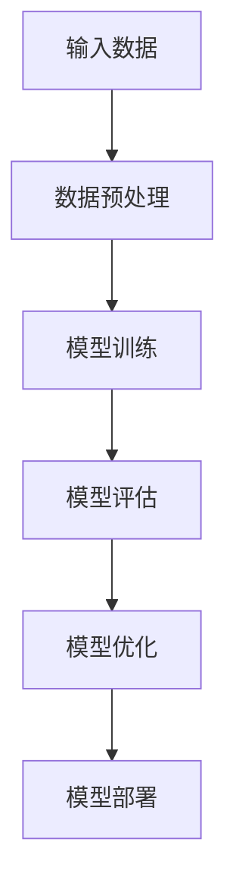

                 

### 文章标题

# AI Software 2.0的开发流程再造

> 关键词：AI Software 2.0，开发流程，创新方法，架构设计，最佳实践

> 摘要：本文旨在深入探讨AI Software 2.0的开发流程再造。我们将从问题背景出发，分析AI Software 2.0与传统软件的区别和特点，详细介绍AI大模型的原理及其在企业中的应用，逐步解析AI Software 2.0的开发流程，探讨开发工具与平台的选择，并通过实际案例分析，总结最佳实践，为未来的发展提供思路。

### 第一部分：AI Software 2.0概述

#### 第1章：问题背景与解决方案

##### 1.1 软件发展的历史演进

软件的发展经历了从1.0到2.0的演进过程。传统的软件1.0主要侧重于功能的实现和优化，而AI Software 2.0则强调智能化、自动化和自主化。

##### 1.1.1 从软件1.0到软件2.0

软件1.0时代，编程语言和开发工具相对简单，软件的复杂度和功能有限。随着计算机技术和编程语言的进步，软件1.0逐步向软件2.0过渡。

##### 1.1.2 AI Software 2.0的定义与特点

AI Software 2.0是一种基于人工智能技术的软件，它具备自我学习、自我优化和自我修复的能力，能够实现高度自动化和智能化。

##### 1.2 AI Software 2.0的边界与外延

AI Software 2.0不仅包括传统的软件开发，还涵盖了人工智能算法、大数据处理、云计算等技术。

##### 1.2.1 AI Software 2.0的组成部分

AI Software 2.0主要由数据采集、模型训练、模型部署和维护等组成部分构成。

##### 1.2.2 AI Software 2.0的核心要素

AI Software 2.0的核心要素包括人工智能算法、大数据处理技术、云计算平台和开发工具。

##### 1.3 AI Software 2.0的挑战与机遇

##### 1.3.1 挑战分析

AI Software 2.0面临着数据隐私、安全性和复杂度等挑战。

##### 1.3.2 机遇展望

随着技术的不断进步，AI Software 2.0将在各个领域发挥重要作用，带来巨大的商业价值和社会影响。

#### 第2章：AI大模型原理与联系

##### 2.1 AI大模型的基本概念

AI大模型是一种具有大规模参数和复杂结构的机器学习模型。

##### 2.1.1 AI大模型的定义

AI大模型是指那些参数量达到百万级乃至亿级，模型结构复杂，计算量大，通常需要分布式计算平台进行训练和推理的机器学习模型。

##### 2.1.2 AI大模型的特点

AI大模型具有高参数量、大规模数据处理能力和高效训练算法等特点。

##### 2.2 AI大模型的核心概念与联系

##### 2.2.1 概念属性特征对比表格

| 特征 | AI大模型 | 传统模型 |
| ---- | -------- | -------- |
| 参数量 | 百万级以上 | 数百以下 |
| 计算量 | 非常大 | 较小 |
| 数据处理能力 | 强 | 弱 |
| 训练算法 | 高效 | 低效 |

##### 2.2.2 AI大模型ER实体关系图

```mermaid
erDiagram
  User ||--|{ AI_Model } : trains
  Data ||--|{ AI_Model } : processes
  AI_Model ||--|{ Evaluation } : evaluates
```

#### 2.3 AI大模型的工作原理

##### 2.3.1 数学模型

AI大模型的数学模型主要包括输入层、隐藏层和输出层。

$$
Y = f(Z) = f(W_2 \cdot a_{2} + b_2) = f(W_1 \cdot a_{1} + b_1)
$$

##### 2.3.2 数学公式

AI大模型的核心数学公式包括激活函数、损失函数和优化算法。

$$
\begin{aligned}
  &f(x) = \sigma(x) = \frac{1}{1 + e^{-x}} \\
  &J(\theta) = -\frac{1}{m} \sum_{i=1}^{m} [y^{(i)} \log(a^{(2)}_{i}) + (1 - y^{(i)}) \log(1 - a^{(2)}_{i})] \\
  &\theta = \theta - \alpha \frac{\partial J(\theta)}{\partial \theta}
\end{aligned}
$$

##### 2.3.3 算法流程图



### 第二部分：AI大模型在企业中的应用

#### 第3章：AI大模型在企业中的应用

##### 3.1 AI大模型在企业中的角色

AI大模型在企业中扮演着数据分析师、自动化工程师和智能优化师等多重角色。

##### 3.1.1 企业级应用需求

企业需要通过AI大模型来实现业务流程的自动化、数据分析和决策支持。

##### 3.1.2 AI大模型在企业中的应用场景

AI大模型在企业中的应用场景包括自然语言处理、图像识别、推荐系统和智能监控等。

##### 3.2 AI大模型的企业应用案例

##### 3.2.1 案例一：自然语言处理

自然语言处理（NLP）是AI大模型在企业中应用的一个重要领域，例如在客服机器人、智能助手和舆情监测等方面。

##### 3.2.2 案例二：图像识别

图像识别是AI大模型在另一个重要应用领域，例如在安防监控、医疗诊断和自动驾驶等方面。

##### 3.2.3 案例三：推荐系统

推荐系统是AI大模型在电子商务、社交媒体和内容平台中的重要应用，例如在商品推荐、文章推荐和音乐推荐等方面。

### 第三部分：AI Software 2.0开发流程

#### 第4章：AI Software 2.0开发流程

##### 4.1 开发流程概述

AI Software 2.0的开发流程与传统软件开发有所不同，更加注重数据、模型和平台的整合。

##### 4.1.1 传统开发流程的不足

传统开发流程过于注重功能实现，缺乏对数据、模型和平台的全面考虑。

##### 4.1.2 AI Software 2.0开发流程的特点

AI Software 2.0开发流程强调数据驱动、模型优化和平台集成。

##### 4.2 AI Software 2.0开发流程的详细步骤

##### 4.2.1 需求分析与规划

需求分析是AI Software 2.0开发的第一步，需要明确项目的目标和需求。

##### 4.2.2 数据采集与预处理

数据采集与预处理是AI Software 2.0开发的重要环节，直接影响到模型的性能和效果。

##### 4.2.3 模型设计与实现

模型设计是实现AI功能的核心，需要根据需求选择合适的算法和模型。

##### 4.2.4 模型训练与优化

模型训练与优化是提高模型性能的关键步骤，通过迭代训练和优化算法来提高模型的准确性和效率。

##### 4.2.5 模型部署与维护

模型部署与维护是将模型应用到实际场景的关键，需要确保模型的稳定性和可靠性。

### 第四部分：AI Software 2.0开发工具与平台

#### 第5章：AI Software 2.0开发工具与平台

##### 5.1 开发工具介绍

AI Software 2.0开发工具主要包括编程语言、框架和库等。

##### 5.1.1 编程语言

常用的编程语言包括Python、Java、C++和R等。

##### 5.1.2 框架与库

常用的框架与库包括TensorFlow、PyTorch、Scikit-learn和NumPy等。

##### 5.2 开发平台选择

AI Software 2.0开发平台的选择需要考虑计算能力、存储能力和网络环境等因素。

##### 5.2.1 云计算平台

云计算平台具有弹性扩展、高效计算和便捷部署等优势，适合大规模的AI应用。

##### 5.2.2 本地开发环境

本地开发环境适合小规模开发和个人使用，具有灵活性和便捷性。

### 第五部分：AI Software 2.0开发实践

#### 第6章：AI Software 2.0开发实践

##### 6.1 环境安装与配置

在开始AI Software 2.0开发之前，需要安装和配置相关的开发环境和工具。

##### 6.1.1 系统需求

根据项目需求和开发环境，确定所需的操作系统、编程语言和开发工具等。

##### 6.1.2 安装过程详解

详细介绍安装过程，包括下载、安装和配置等步骤。

##### 6.2 系统核心实现

##### 6.2.1 核心模块设计

设计系统核心模块，包括数据采集、模型训练、模型部署等。

##### 6.2.2 源代码解读与分析

详细解读和分析系统核心模块的源代码，解释代码的实现原理和功能。

##### 6.3 实际案例分析

##### 6.3.1 案例背景

介绍案例背景，说明项目目标和需求。

##### 6.3.2 解决方案

详细描述解决方案，包括数据采集、模型训练和模型部署等步骤。

##### 6.3.3 案例剖析

对案例进行深入剖析，分析解决方案的优缺点和实际效果。

### 第六部分：AI Software 2.0开发最佳实践

#### 第7章：AI Software 2.0开发最佳实践

##### 7.1 最佳实践

##### 7.1.1 性能优化

介绍性能优化的方法，包括模型压缩、量化、加速等。

##### 7.1.2 安全性保障

介绍安全性保障的措施，包括数据加密、访问控制、安全审计等。

##### 7.1.3 可维护性提升

介绍可维护性提升的方法，包括代码规范、测试、文档等。

##### 7.2 小结与展望

##### 7.2.1 成功经验总结

总结项目中的成功经验，包括技术方案、项目管理、团队协作等。

##### 7.2.2 未来发展趋势

展望AI Software 2.0未来的发展趋势，包括技术创新、应用拓展、产业变革等。

##### 7.2.3 拓展阅读推荐

推荐相关的书籍、文章和研究报告，为读者提供更深入的阅读资源。

### 作者信息

作者：AI天才研究院/AI Genius Institute & 禅与计算机程序设计艺术 /Zen And The Art of Computer Programming

