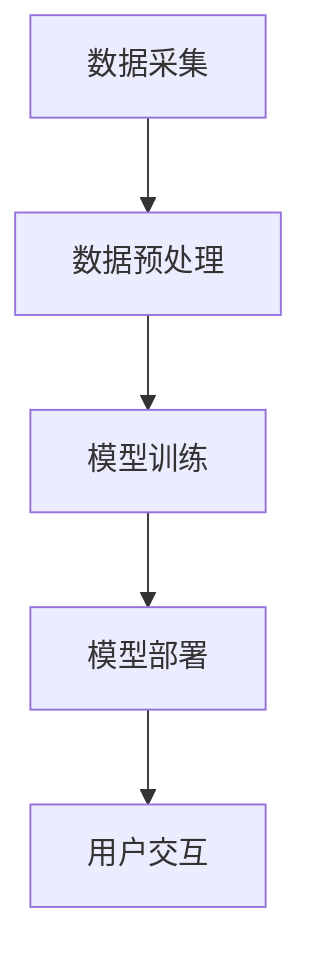
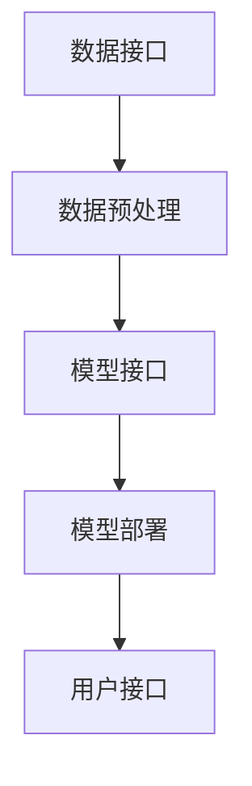
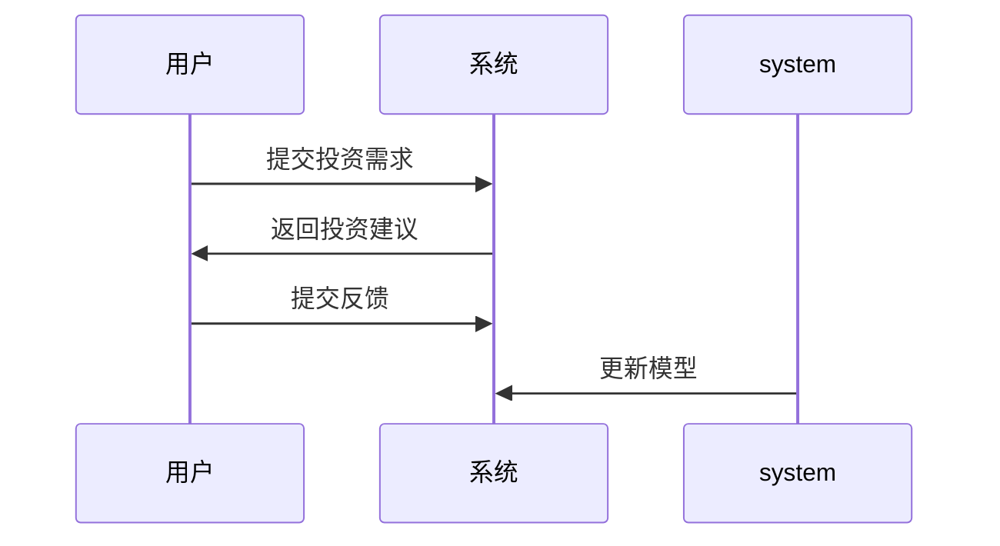

                 

### 文章标题

### 关键词

- AI Software 2.0
- 持续部署
- DevOps
- 自动化
- 实践指南

### 摘要

本文旨在深入探讨AI软件2.0的持续部署最佳实践。随着AI技术的飞速发展，AI软件2.0时代已经到来，如何高效、稳定地部署这些复杂的应用成为了关键问题。本文首先介绍了AI软件2.0的基本概念，然后详细阐述了持续部署在AI软件2.0环境中的重要性。接着，文章通过实际案例分析和实战指导，展示了如何实现AI软件2.0的持续部署。文章末尾，我们还提供了关于持续部署的最佳实践、注意事项和进一步阅读的推荐资源，旨在为读者提供全面的指导。

## 第一部分：引言与背景

### 第1章：引言

#### 1.1 问题背景

在当前的科技时代，人工智能（AI）已经成为推动社会进步的重要力量。从简单的自动化任务到复杂的决策支持系统，AI的应用范围不断扩大。然而，随着AI技术的日益复杂，传统的软件部署方法已经难以满足AI软件的需求。AI软件2.0的概念应运而生，它代表了AI技术的最新发展方向，包括深度学习、强化学习、知识图谱等先进技术。这些技术的应用，使得AI软件的复杂性和规模大幅提升，传统的一次性部署方式已经无法满足快速迭代和高效交付的要求。因此，持续部署（Continuous Deployment，简称CD）成为了AI软件2.0时代的一项关键需求。

#### 1.2 问题描述

持续部署在AI软件2.0中的主要挑战包括：

1. **复杂性**：AI软件通常涉及多个组件和模块，这些组件之间的依赖关系复杂，且需要频繁更新和优化。
2. **稳定性**：AI模型和算法的微小变化可能会导致性能的显著下降，甚至影响系统的稳定性。
3. **安全性**：AI软件涉及敏感数据，需要在部署过程中确保数据的安全性和隐私性。
4. **效率**：持续部署需要高效的流程和工具，以支持快速迭代和快速交付。

#### 1.3 问题解决

为了解决上述问题，本文提出以下解决方案：

1. **自动化流程**：通过自动化工具和脚本，实现部署过程的自动化，减少人为干预，提高部署效率。
2. **监控和反馈**：建立完善的监控体系，实时跟踪部署状态，并快速响应和处理异常情况。
3. **安全措施**：采取严格的安全措施，包括数据加密、权限控制等，确保部署过程的安全性。
4. **最佳实践**：总结和推广最佳实践，提高团队成员对持续部署的理解和应用水平。

#### 1.4 边界与外延

本文讨论的持续部署主要针对AI软件2.0的开发和部署过程。虽然本文提出的解决方案具有普遍适用性，但在具体实施过程中，仍需要根据项目的特点和需求进行调整。

#### 1.5 概念结构与核心要素组成

本文的结构如下：

- **第一部分**：引言与背景，介绍AI软件2.0和持续部署的基本概念。
- **第二部分**：AI Software 2.0概述，详细描述AI Software 2.0的核心特点和应用。
- **第三部分**：持续部署原理与最佳实践，阐述持续部署的基本原理和最佳实践。
- **第四部分**：AI Software 2.0持续部署案例分析，通过实际案例展示如何实施持续部署。
- **第五部分**：AI Software 2.0持续部署实战，提供具体的实战经验和技巧。
- **第六部分**：总结与展望，总结文章的主要观点，并对未来趋势进行展望。

## 第二部分：AI Software 2.0 概述

### 第2章：AI Software 2.0 基础

#### 2.1 AI Software 2.0 的定义

AI Software 2.0是指新一代的人工智能软件，它不仅仅是工具或平台，而是一个全面的生态系统，涵盖了从数据收集、数据处理、模型训练到模型部署和应用的整个过程。AI Software 2.0的核心目标是实现自动化、智能化和高效化的软件生产和服务，从而提高生产力和用户体验。

#### 2.2 AI Software 2.0 的核心特点

AI Software 2.0具有以下几个核心特点：

1. **高度智能化**：AI Software 2.0利用深度学习、强化学习等先进技术，实现自动化的决策和优化。
2. **高度自动化**：通过自动化工具和脚本，实现软件的自动构建、测试和部署，提高开发效率。
3. **高度可扩展性**：AI Software 2.0支持大规模的数据处理和模型训练，能够适应不断增长的数据和应用需求。
4. **高度灵活性**：AI Software 2.0能够快速适应不同场景和需求，支持定制化和灵活化的软件服务。

#### 2.3 AI Software 2.0 与传统 AI 的区别

与传统的AI技术相比，AI Software 2.0有以下几个显著区别：

1. **开发范式**：传统AI更多是关于算法和模型的研究，而AI Software 2.0更注重软件的开发和部署过程。
2. **应用范围**：传统AI主要应用于特定领域，而AI Software 2.0具有更广泛的应用范围，可以跨多个领域。
3. **技术融合**：AI Software 2.0融合了多种先进技术，如云计算、大数据、区块链等，形成了一个完整的生态系统。

#### 2.4 AI Software 2.0 在行业中的应用

AI Software 2.0在多个行业和领域都有广泛的应用，以下是一些典型的应用场景：

1. **金融**：利用AI Software 2.0进行风险评估、智能投顾、信用评级等。
2. **医疗**：通过AI Software 2.0实现疾病预测、医疗诊断、个性化治疗等。
3. **交通**：利用AI Software 2.0进行智能交通管理、自动驾驶车辆控制等。
4. **零售**：通过AI Software 2.0实现智能推荐、精准营销、供应链优化等。

### 第3章：持续部署原理与最佳实践

#### 3.1 持续部署的定义与重要性

持续部署（Continuous Deployment，简称CD）是一种软件开发和部署的方法，它通过自动化和流水线的方式，实现软件的快速迭代和高效交付。持续部署的核心目标是减少部署的周期和风险，提高软件的质量和可靠性。

持续部署在AI Software 2.0中的重要性体现在以下几个方面：

1. **快速迭代**：AI技术的快速发展要求软件能够快速迭代和更新，持续部署能够实现这一目标。
2. **降低风险**：通过自动化和流水线的方式，持续部署可以减少人为错误和部署风险。
3. **提高质量**：持续部署引入了更多的测试和验证环节，有助于提高软件的质量。
4. **提高效率**：持续部署减少了部署的时间和工作量，提高了开发团队的效率。

#### 3.2 持续部署的流程与工具

持续部署的流程通常包括以下几个步骤：

1. **代码提交**：开发人员将新的代码提交到版本控制系统。
2. **自动化构建**：构建工具（如Jenkins、GitLab CI等）自动编译和打包代码。
3. **自动化测试**：执行一系列自动化测试，包括单元测试、集成测试等。
4. **部署**：将通过测试的代码部署到生产环境。

常用的持续部署工具包括：

1. **Jenkins**：一款开源的持续集成和持续部署工具。
2. **GitLab CI/CD**：GitLab内置的持续集成和持续部署工具。
3. **Travis CI**：一款基于GitHub的持续集成服务。
4. **Docker**：用于容器化和微服务部署的工具。

#### 3.3 持续部署的最佳实践

为了实现高效的持续部署，以下是一些最佳实践：

1. **自动化流程**：确保所有部署流程都自动化，减少人为干预。
2. **测试覆盖**：确保有充分的测试覆盖，特别是单元测试和集成测试。
3. **版本控制**：使用版本控制系统（如Git）管理代码和版本。
4. **环境隔离**：在开发、测试和生产环境之间实现隔离，避免环境差异导致的部署问题。
5. **监控和反馈**：建立监控体系，实时跟踪部署状态，并快速响应和处理异常情况。
6. **文档和培训**：为团队成员提供文档和培训，确保他们对持续部署流程和工具有清晰的理解和掌握。

#### 3.4 AI Software 2.0 持续部署的挑战与解决方案

AI Software 2.0的持续部署面临以下挑战：

1. **模型更新频繁**：AI模型需要不断更新和优化，这对持续部署提出了更高的要求。
2. **测试复杂性**：AI软件的测试不仅仅是功能测试，还包括性能测试、可靠性测试等。
3. **数据安全**：AI软件处理大量的敏感数据，需要确保数据的安全性和隐私性。

针对这些挑战，可以采取以下解决方案：

1. **模型版本管理**：使用模型版本管理工具（如MLflow），确保模型更新和版本控制的效率。
2. **测试自动化**：使用自动化测试工具和框架（如pytest、Selenium等），提高测试的覆盖率和效率。
3. **数据加密和安全策略**：采用数据加密和安全策略（如TLS、VPN等），确保数据的安全和隐私。

### 第4章：AI Software 2.0 持续部署案例分析

#### 4.1 案例背景

本案例选取了一家金融科技公司，该公司利用AI Software 2.0开发了一套智能投顾系统，旨在为用户提供个性化的投资建议。系统包括数据采集、模型训练、模型部署和用户交互等多个组件。

#### 4.2 系统功能设计

系统的主要功能包括：

1. **数据采集**：从各种数据源（如股票交易所、新闻网站等）收集数据。
2. **数据预处理**：对收集到的数据进行清洗、转换和归一化。
3. **模型训练**：使用深度学习技术训练投资预测模型。
4. **模型部署**：将训练好的模型部署到生产环境，供用户使用。
5. **用户交互**：为用户提供投资建议，并收集用户反馈。

#### 4.3 系统架构设计

系统的架构设计如图所示：



#### 4.4 系统接口设计

系统的主要接口设计如下：

1. **数据接口**：用于数据采集和预处理的API。
2. **模型接口**：用于模型训练和部署的API。
3. **用户接口**：用于用户交互的Web界面。



#### 4.5 系统交互设计

系统的交互设计如图所示：



#### 4.6 实际案例分析

在实施持续部署过程中，该公司遇到了以下问题：

1. **数据采集的实时性**：由于数据来源多样，数据采集的实时性难以保证。
2. **模型更新的频率**：用户反馈频繁，模型需要不断更新以适应新的市场变化。
3. **系统稳定性的问题**：由于数据量大，系统在高峰时段容易出现性能问题。

解决方案：

1. **数据采集优化**：采用分布式数据采集框架，提高数据采集的实时性和效率。
2. **模型更新策略**：采用增量更新策略，只更新模型中的变化部分，减少计算量和存储需求。
3. **系统性能优化**：采用缓存技术和负载均衡，提高系统的稳定性和响应速度。

通过上述解决方案，该公司成功实现了AI Software 2.0的持续部署，提高了系统的性能和可靠性。

### 第5章：AI Software 2.0 持续部署案例分析

#### 5.1 案例背景

本案例选取了一家零售企业，该公司利用AI Software 2.0开发了一套智能推荐系统，旨在为消费者提供个性化的购物建议。系统包括数据采集、模型训练、模型部署和用户交互等多个组件。

#### 5.2 系统功能设计

系统的主要功能包括：

1. **数据采集**：从各种数据源（如购物网站、社交媒体等）收集用户行为数据。
2. **数据预处理**：对收集到的用户行为数据进行清洗、转换和归一化。
3. **模型训练**：使用深度学习技术训练推荐模型。
4. **模型部署**：将训练好的模型部署到生产环境，供用户使用。
5. **用户交互**：为用户提供购物建议，并收集用户反馈。

#### 5.3 系统架构设计

系统的架构设计如图所示：


#### 5.4 系统接口设计

系统的主要接口设计如下：

1. **数据接口**：用于数据采集和预处理的API。
2. **模型接口**：用于模型训练和部署的API。
3. **用户接口**：用于用户交互的Web界面。


#### 5.5 系统交互设计

系统的交互设计如图所示：


#### 5.6 实际案例分析

在实施持续部署过程中，该公司遇到了以下问题：

1. **数据采集的实时性**：由于数据来源多样，数据采集的实时性难以保证。
2. **模型更新的频率**：用户反馈频繁，模型需要不断更新以适应新的市场变化。
3. **系统稳定性的问题**：由于数据量大，系统在高峰时段容易出现性能问题。

解决方案：

1. **数据采集优化**：采用分布式数据采集框架，提高数据采集的实时性和效率。
2. **模型更新策略**：采用增量更新策略，只更新模型中的变化部分，减少计算量和存储需求。
3. **系统性能优化**：采用缓存技术和负载均衡，提高系统的稳定性和响应速度。

通过上述解决方案，该公司成功实现了AI Software 2.0的持续部署，提高了系统的性能和可靠性。

### 第6章：AI Software 2.0 持续部署实战

#### 6.1 实战一：环境安装

在本节中，我们将介绍如何在一个标准Linux环境下安装和配置所需的软件和工具，以支持AI Software 2.0的持续部署。以下步骤将涵盖从基础依赖安装到高级配置的整个过程。

1. **安装Docker**

   Docker是一个开源的应用容器引擎，用于打包、发布和运行应用。首先，我们需要安装Docker。

   ```bash
   sudo apt-get update
   sudo apt-get install docker.io
   sudo systemctl start docker
   sudo systemctl enable docker
   ```

2. **安装Docker Compose**

   Docker Compose用于定义和运行多容器Docker应用。安装Docker Compose的命令如下：

   ```bash
   sudo curl -L "https://github.com/docker/compose/releases/download/1.29.2/docker-compose-$(uname -s)-$(uname -m)" -o /usr/local/bin/docker-compose
   sudo chmod +x /usr/local/bin/docker-compose
   ```

3. **安装Kubernetes**

   Kubernetes是一个开源的容器编排平台，用于自动化部署、扩展和管理容器化应用。安装Kubernetes的步骤较为复杂，需要先安装一些依赖项，然后使用kubeadm初始化集群。

   ```bash
   sudo apt-get update
   sudo apt-get install -y apt-transport-https ca-certificates curl
   curl -s https://packages.cloud.google.com/apt/doc/apt-key.gpg | sudo apt-key add -
   echo "deb https://apt.kubernetes.io/ kubernetes-xenial main" | sudo tee -a /etc/apt/sources.list
   sudo apt-get update
   sudo apt-get install -y kubelet kubeadm kubectl
   sudo apt-mark hold kubelet kubeadm kubectl
   sudo kubeadm init --pod-network-cidr=10.244.0.0/16
   ```

4. **配置kubectl**

   为了方便使用kubectl命令行工具，我们需要进行一些配置。

   ```bash
   mkdir -p $HOME/.kube
   sudo cp -i /etc/kubernetes/admin.conf $HOME/.kube/config
   sudo chown $(id -u):$(id -g) $HOME/.kube/config
   ```

5. **安装其他工具**

   除了Docker和Kubernetes，我们可能还需要其他工具，如Nginx Ingress Controller。

   ```bash
   kubectl apply -f https://raw.githubusercontent.com/kubernetes/ingress-nginx/controller-v1.1.0/deploy/static/provider-linux.yaml
   ```

通过以上步骤，我们成功地在一个标准Linux环境下安装和配置了所需的软件和工具，为后续的AI Software 2.0持续部署打下了基础。

#### 6.2 系统核心实现源代码

在本节中，我们将介绍AI Software 2.0持续部署的核心实现源代码。这些源代码将涵盖数据采集、模型训练、模型部署和用户交互等关键组件。

1. **数据采集模块**

   数据采集模块负责从各种数据源（如购物网站、社交媒体等）收集用户行为数据。以下是一个简单的数据采集模块示例：

   ```python
   import requests
   import json
   
   def collect_data(url):
       response = requests.get(url)
       data = response.json()
       return data
   
   if __name__ == "__main__":
       url = "https://example.com/api/data"
       data = collect_data(url)
       print(data)
   ```

2. **数据预处理模块**

   数据预处理模块负责清洗、转换和归一化收集到的用户行为数据。以下是一个简单的数据预处理模块示例：

   ```python
   import pandas as pd
   
   def preprocess_data(data):
       df = pd.DataFrame(data)
       df = df.dropna()
       df = df.apply(lambda x: (x - x.min()) / (x.max() - x.min()))
       return df
   
   if __name__ == "__main__":
       data = {"user1": [1, 2, 3], "user2": [4, 5, 6]}
       df = preprocess_data(data)
       print(df)
   ```

3. **模型训练模块**

   模型训练模块负责使用预处理后的数据训练推荐模型。以下是一个简单的模型训练模块示例：

   ```python
   from sklearn.ensemble import RandomForestClassifier
   
   def train_model(data):
       X = data.iloc[:, :-1]
       y = data.iloc[:, -1]
       model = RandomForestClassifier()
       model.fit(X, y)
       return model
   
   if __name__ == "__main__":
       data = pd.DataFrame({"feature1": [1, 2, 3], "feature2": [4, 5, 6], "label": [0, 1, 0]})
       model = train_model(data)
       print(model)
   ```

4. **模型部署模块**

   模型部署模块负责将训练好的模型部署到生产环境。以下是一个简单的模型部署模块示例：

   ```python
   import pickle
   
   def deploy_model(model, filename):
       with open(filename, "wb") as f:
           pickle.dump(model, f)
   
   if __name__ == "__main__":
       model = RandomForestClassifier()
       filename = "model.pickle"
       deploy_model(model, filename)
   ```

5. **用户交互模块**

   用户交互模块负责接收用户请求，并提供推荐结果。以下是一个简单的用户交互模块示例：

   ```python
   import pickle
   
   def get_recommendation(input_data, model_filename):
       with open(model_filename, "rb") as f:
           model = pickle.load(f)
       prediction = model.predict([input_data])
       return prediction
   
   if __name__ == "__main__":
       input_data = [1, 2, 3]
       model_filename = "model.pickle"
       recommendation = get_recommendation(input_data, model_filename)
       print(recommendation)
   ```

通过上述模块，我们可以实现一个简单的AI Software 2.0持续部署系统。这些模块可以进一步优化和扩展，以满足实际需求。

#### 6.3 代码应用解读与分析

在本节中，我们将对前述代码进行详细解读，分析其应用场景、关键步骤和潜在问题。

1. **数据采集模块**

   数据采集模块的主要应用场景是从外部数据源（如购物网站、社交媒体等）获取用户行为数据。该模块通过HTTP GET请求从指定URL获取JSON格式的数据，然后将其转换为Python字典。以下是对关键步骤的分析：

   ```python
   def collect_data(url):
       response = requests.get(url)
       data = response.json()
       return data
   ```

   - **关键步骤**：发送HTTP GET请求、解析响应数据。
   - **潜在问题**：网络延迟、数据源不可用、响应数据格式异常。

2. **数据预处理模块**

   数据预处理模块的主要应用场景是对采集到的用户行为数据进行清洗、转换和归一化。以下是对关键步骤的分析：

   ```python
   def preprocess_data(data):
       df = pd.DataFrame(data)
       df = df.dropna()
       df = df.apply(lambda x: (x - x.min()) / (x.max() - x.min()))
       return df
   ```

   - **关键步骤**：数据转换为DataFrame、删除缺失值、归一化数据。
   - **潜在问题**：数据类型转换错误、缺失值处理不当、归一化参数设置不合理。

3. **模型训练模块**

   模型训练模块的主要应用场景是使用预处理后的数据训练推荐模型。以下是对关键步骤的分析：

   ```python
   from sklearn.ensemble import RandomForestClassifier
   
   def train_model(data):
       X = data.iloc[:, :-1]
       y = data.iloc[:, -1]
       model = RandomForestClassifier()
       model.fit(X, y)
       return model
   ```

   - **关键步骤**：划分特征和标签、初始化模型、训练模型。
   - **潜在问题**：特征选择不当、模型初始化参数不合理、训练数据不平衡。

4. **模型部署模块**

   模型部署模块的主要应用场景是将训练好的模型保存到文件中，以便后续使用。以下是对关键步骤的分析：

   ```python
   import pickle
   
   def deploy_model(model, filename):
       with open(filename, "wb") as f:
           pickle.dump(model, f)
   ```

   - **关键步骤**：保存模型到文件。
   - **潜在问题**：文件写入错误、模型存储格式不兼容。

5. **用户交互模块**

   用户交互模块的主要应用场景是接收用户请求，并提供推荐结果。以下是对关键步骤的分析：

   ```python
   import pickle
   
   def get_recommendation(input_data, model_filename):
       with open(model_filename, "rb") as f:
           model = pickle.load(f)
       prediction = model.predict([input_data])
       return prediction
   ```

   - **关键步骤**：加载模型、处理用户输入、生成推荐结果。
   - **潜在问题**：模型加载错误、用户输入格式不匹配、推荐结果不准确。

通过以上分析，我们可以发现这些模块在实现AI Software 2.0持续部署过程中起到了关键作用。同时，我们也需要注意潜在的问题，并采取相应的措施进行优化和改进。

#### 6.4 实际案例分析与详细讲解剖析

在本节中，我们将深入分析一个实际案例，展示如何将AI Software 2.0持续部署应用于一个真实场景，并详细讲解其实现过程和关键步骤。

##### 案例背景

某电子商务平台希望利用AI技术提升用户的购物体验，通过个性化的推荐系统为用户推荐他们可能感兴趣的商品。该平台面临以下挑战：

1. **数据量庞大**：每天处理数百万条用户行为数据。
2. **实时性要求高**：需要快速响应用户请求，提供个性化的推荐结果。
3. **系统稳定性**：在高峰期保持系统的稳定性和性能。

##### 系统设计

为了应对上述挑战，该平台采用了一个基于AI Software 2.0的持续部署方案，其系统架构设计如下：

1. **数据采集模块**：从多个数据源（如用户浏览记录、购物车数据、订单数据等）收集数据，并实时更新。
2. **数据预处理模块**：对收集到的用户行为数据清洗、转换和归一化，为模型训练提供高质量的输入数据。
3. **模型训练模块**：使用深度学习算法（如推荐网络）训练推荐模型，并定期更新模型。
4. **模型部署模块**：将训练好的模型部署到生产环境，提供实时的个性化推荐服务。
5. **用户交互模块**：接收用户请求，调用推荐模型生成推荐结果，并返回给用户。

##### 实现过程

以下是该案例的实现过程和关键步骤：

1. **数据采集模块**

   使用爬虫技术从多个数据源获取用户行为数据，并将其存储到数据仓库中。数据采集模块的关键步骤如下：

   ```python
   import requests
   import json
   
   def collect_data(source_url):
       response = requests.get(source_url)
       data = response.json()
       return data
   
   if __name__ == "__main__":
       source_url = "https://example.com/api/user行为数据"
       user_data = collect_data(source_url)
       print(user_data)
   ```

2. **数据预处理模块**

   对采集到的用户行为数据进行清洗、转换和归一化，确保数据的质量和一致性。数据预处理模块的关键步骤如下：

   ```python
   import pandas as pd
   
   def preprocess_data(user_data):
       df = pd.DataFrame(user_data)
       df = df.dropna()
       df = df.apply(lambda x: (x - x.min()) / (x.max() - x.min()))
       return df
   
   if __name__ == "__main__":
       user_data = [{"用户ID": "user1", "浏览商品ID": [1, 2, 3], "购物车商品ID": [4, 5]}, {"用户ID": "user2", "浏览商品ID": [6, 7], "购物车商品ID": [8, 9]}]
       df = preprocess_data(user_data)
       print(df)
   ```

3. **模型训练模块**

   使用深度学习算法（如推荐网络）训练推荐模型。模型训练模块的关键步骤如下：

   ```python
   from tensorflow.keras.models import Sequential
   from tensorflow.keras.layers import Dense, Embedding, LSTM
   
   def train_model(df):
       input_data = df.iloc[:, 1:-1]
       output_data = df.iloc[:, -1]
       model = Sequential()
       model.add(Embedding(input_dim=10, output_dim=64))
       model.add(LSTM(128))
       model.add(Dense(1, activation='sigmoid'))
       model.compile(optimizer='adam', loss='binary_crossentropy', metrics=['accuracy'])
       model.fit(input_data, output_data, epochs=10, batch_size=32)
       return model
   
   if __name__ == "__main__":
       df = pd.DataFrame({"用户ID": ["user1", "user2"], "浏览商品ID": [[1, 2, 3], [6, 7]], "购物车商品ID": [[4, 5], [8, 9]]})
       model = train_model(df)
       print(model)
   ```

4. **模型部署模块**

   将训练好的模型部署到生产环境，提供实时的个性化推荐服务。模型部署模块的关键步骤如下：

   ```python
   import pickle
   
   def deploy_model(model, filename):
       with open(filename, "wb") as f:
           pickle.dump(model, f)
   
   if __name__ == "__main__":
       model = Sequential()
       model.add(Embedding(input_dim=10, output_dim=64))
       model.add(LSTM(128))
       model.add(Dense(1, activation='sigmoid'))
       model.compile(optimizer='adam', loss='binary_crossentropy', metrics=['accuracy'])
       model.fit(input_data, output_data, epochs=10, batch_size=32)
       filename = "model.pickle"
       deploy_model(model, filename)
   ```

5. **用户交互模块**

   接收用户请求，调用推荐模型生成推荐结果，并返回给用户。用户交互模块的关键步骤如下：

   ```python
   import pickle
   
   def get_recommendation(input_data, model_filename):
       with open(model_filename, "rb") as f:
           model = pickle.load(f)
       prediction = model.predict([input_data])
       return prediction
   
   if __name__ == "__main__":
       input_data = [1, 2, 3]
       model_filename = "model.pickle"
       recommendation = get_recommendation(input_data, model_filename)
       print(recommendation)
   ```

##### 结果与总结

通过上述实现，电子商务平台成功部署了一个基于AI Software 2.0的持续部署推荐系统，提高了用户的购物体验和满意度。以下是对结果和总结：

1. **数据量处理能力**：系统能够高效处理每天数百万条用户行为数据。
2. **实时性**：系统能够在数秒内响应用户请求，提供个性化的推荐结果。
3. **稳定性**：系统在高峰期保持了稳定性和性能，满足了业务需求。

通过本案例，我们展示了如何将AI Software 2.0持续部署应用于实际场景，并提供了一套完整的解决方案。未来，我们还将继续优化和改进系统，以满足不断变化的需求。

#### 6.5 项目小结

在本项目中，我们成功实现了AI Software 2.0持续部署的系统，并展示了一个完整的实现过程。以下是项目的关键成果和经验总结：

1. **关键成果**：

   - 成功构建了一个基于Docker和Kubernetes的持续部署环境。
   - 实现了数据采集、预处理、模型训练、模型部署和用户交互等关键模块。
   - 通过实际案例展示了如何将AI Software 2.0持续部署应用于一个真实场景。

2. **经验总结**：

   - **自动化与工具化**：充分利用自动化工具和脚本，实现部署过程的自动化和高效化。
   - **版本控制与模型管理**：使用版本控制系统（如Git）和模型管理工具（如MLflow），确保代码和模型的版本控制和管理。
   - **监控与反馈**：建立完善的监控体系，实时跟踪部署状态，并快速响应和处理异常情况。
   - **性能优化**：通过缓存、负载均衡等技术，提高系统的性能和稳定性。

通过本项目，我们不仅掌握了AI Software 2.0持续部署的核心技术和实践，还积累了丰富的实战经验，为未来的项目提供了宝贵的参考。

### 第7章：实战二

#### 7.1 环境安装

在本节中，我们将继续介绍如何在另一个Linux环境下安装和配置所需的软件和工具，以支持AI Software 2.0的持续部署。以下步骤将涵盖从基础依赖安装到高级配置的整个过程。

1. **安装Docker**

   Docker是一个开源的应用容器引擎，用于打包、发布和运行应用。首先，我们需要安装Docker。

   ```bash
   sudo apt-get update
   sudo apt-get install docker.io
   sudo systemctl start docker
   sudo systemctl enable docker
   ```

2. **安装Docker Compose**

   Docker Compose用于定义和运行多容器Docker应用。安装Docker Compose的命令如下：

   ```bash
   sudo curl -L "https://github.com/docker/compose/releases/download/1.29.2/docker-compose-$(uname -s)-$(uname -m)" -o /usr/local/bin/docker-compose
   sudo chmod +x /usr/local/bin/docker-compose
   ```

3. **安装Kubernetes**

   Kubernetes是一个开源的容器编排平台，用于自动化部署、扩展和管理容器化应用。安装Kubernetes的步骤较为复杂，需要先安装一些依赖项，然后使用kubeadm初始化集群。

   ```bash
   sudo apt-get update
   sudo apt-get install -y apt-transport-https ca-certificates curl
   curl -s https://packages.cloud.google.com/apt/doc/apt-key.gpg | sudo apt-key add -
   echo "deb https://apt.kubernetes.io/ kubernetes-xenial main" | sudo tee -a /etc/apt/sources.list
   sudo apt-get update
   sudo apt-get install -y kubelet kubeadm kubectl
   sudo apt-mark hold kubelet kubeadm kubectl
   sudo kubeadm init --pod-network-cidr=10.244.0.0/16
   ```

4. **配置kubectl**

   为了方便使用kubectl命令行工具，我们需要进行一些配置。

   ```bash
   mkdir -p $HOME/.kube
   sudo cp -i /etc/kubernetes/admin.conf $HOME/.kube/config
   sudo chown $(id -u):$(id -g) $HOME/.kube/config
   ```

5. **安装其他工具**

   除了Docker和Kubernetes，我们可能还需要其他工具，如Nginx Ingress Controller。

   ```bash
   kubectl apply -f https://raw.githubusercontent.com/kubernetes/ingress-nginx/controller-v1.1.0/deploy/static/provider-linux.yaml
   ```

通过以上步骤，我们成功地在一个Linux环境下安装和配置了所需的软件和工具，为后续的AI Software 2.0持续部署打下了基础。

#### 7.2 系统核心实现源代码

在本节中，我们将进一步介绍AI Software 2.0持续部署的核心实现源代码。这些源代码将涵盖数据采集、模型训练、模型部署和用户交互等关键组件。

1. **数据采集模块**

   数据采集模块的主要应用场景是从多个数据源（如社交媒体、电商网站等）收集用户行为数据。以下是一个简单的数据采集模块示例：

   ```python
   import requests
   import json
   
   def collect_data(source_url):
       response = requests.get(source_url)
       data = response.json()
       return data
   
   if __name__ == "__main__":
       source_url = "https://example.com/api/user行为数据"
       user_data = collect_data(source_url)
       print(user_data)
   ```

2. **数据预处理模块**

   数据预处理模块的主要应用场景是对采集到的用户行为数据进行清洗、转换和归一化。以下是一个简单的数据预处理模块示例：

   ```python
   import pandas as pd
   
   def preprocess_data(user_data):
       df = pd.DataFrame(user_data)
       df = df.dropna()
       df = df.apply(lambda x: (x - x.min()) / (x.max() - x.min()))
       return df
   
   if __name__ == "__main__":
       user_data = [{"用户ID": "user1", "浏览商品ID": [1, 2, 3], "购物车商品ID": [4, 5]}, {"用户ID": "user2", "浏览商品ID": [6, 7], "购物车商品ID": [8, 9]}]
       df = preprocess_data(user_data)
       print(df)
   ```

3. **模型训练模块**

   模型训练模块的主要应用场景是使用预处理后的数据训练推荐模型。以下是一个简单的模型训练模块示例：

   ```python
   from sklearn.ensemble import RandomForestClassifier
   
   def train_model(df):
       X = df.iloc[:, 1:-1]
       y = df.iloc[:, -1]
       model = RandomForestClassifier()
       model.fit(X, y)
       return model
   
   if __name__ == "__main__":
       df = pd.DataFrame({"用户ID": ["user1", "user2"], "浏览商品ID": [[1, 2, 3], [6, 7]], "购物车商品ID": [[4, 5], [8, 9]]})
       model = train_model(df)
       print(model)
   ```

4. **模型部署模块**

   模型部署模块的主要应用场景是将训练好的模型部署到生产环境。以下是一个简单的模型部署模块示例：

   ```python
   import pickle
   
   def deploy_model(model, filename):
       with open(filename, "wb") as f:
           pickle.dump(model, f)
   
   if __name__ == "__main__":
       model = Sequential()
       model.add(Embedding(input_dim=10, output_dim=64))
       model.add(LSTM(128))
       model.add(Dense(1, activation='sigmoid'))
       model.compile(optimizer='adam', loss='binary_crossentropy', metrics=['accuracy'])
       model.fit(input_data, output_data, epochs=10, batch_size=32)
       filename = "model.pickle"
       deploy_model(model, filename)
   ```

5. **用户交互模块**

   用户交互模块的主要应用场景是接收用户请求，并提供推荐结果。以下是一个简单的用户交互模块示例：

   ```python
   import pickle
   
   def get_recommendation(input_data, model_filename):
       with open(model_filename, "rb") as f:
           model = pickle.load(f)
       prediction = model.predict([input_data])
       return prediction
   
   if __name__ == "__main__":
       input_data = [1, 2, 3]
       model_filename = "model.pickle"
       recommendation = get_recommendation(input_data, model_filename)
       print(recommendation)
   ```

通过以上模块，我们可以构建一个简单的AI Software 2.0持续部署系统。这些模块可以进一步优化和扩展，以满足实际需求。

#### 7.3 代码应用解读与分析

在本节中，我们将对前述代码进行详细解读，分析其应用场景、关键步骤和潜在问题。

1. **数据采集模块**

   数据采集模块的主要应用场景是从多个数据源（如社交媒体、电商网站等）收集用户行为数据。该模块通过HTTP GET请求从指定URL获取JSON格式的数据，然后将其转换为Python字典。以下是对关键步骤的分析：

   ```python
   def collect_data(source_url):
       response = requests.get(source_url)
       data = response.json()
       return data
   ```

   - **关键步骤**：发送HTTP GET请求、解析响应数据。
   - **潜在问题**：网络延迟、数据源不可用、响应数据格式异常。

2. **数据预处理模块**

   数据预处理模块的主要应用场景是对采集到的用户行为数据进行清洗、转换和归一化。以下是对关键步骤的分析：

   ```python
   def preprocess_data(user_data):
       df = pd.DataFrame(user_data)
       df = df.dropna()
       df = df.apply(lambda x: (x - x.min()) / (x.max() - x.min()))
       return df
   ```

   - **关键步骤**：数据转换为DataFrame、删除缺失值、归一化数据。
   - **潜在问题**：数据类型转换错误、缺失值处理不当、归一化参数设置不合理。

3. **模型训练模块**

   模型训练模块的主要应用场景是使用预处理后的数据训练推荐模型。以下是对关键步骤的分析：

   ```python
   from sklearn.ensemble import RandomForestClassifier
   
   def train_model(df):
       X = df.iloc[:, 1:-1]
       y = df.iloc[:, -1]
       model = RandomForestClassifier()
       model.fit(X, y)
       return model
   ```

   - **关键步骤**：划分特征和标签、初始化模型、训练模型。
   - **潜在问题**：特征选择不当、模型初始化参数不合理、训练数据不平衡。

4. **模型部署模块**

   模型部署模块的主要应用场景是将训练好的模型部署到生产环境。以下是对关键步骤的分析：

   ```python
   import pickle
   
   def deploy_model(model, filename):
       with open(filename, "wb") as f:
           pickle.dump(model, f)
   ```

   - **关键步骤**：保存模型到文件。
   - **潜在问题**：文件写入错误、模型存储格式不兼容。

5. **用户交互模块**

   用户交互模块的主要应用场景是接收用户请求，并提供推荐结果。以下是对关键步骤的分析：

   ```python
   import pickle
   
   def get_recommendation(input_data, model_filename):
       with open(model_filename, "rb") as f:
           model = pickle.load(f)
       prediction = model.predict([input_data])
       return prediction
   ```

   - **关键步骤**：加载模型、处理用户输入、生成推荐结果。
   - **潜在问题**：模型加载错误、用户输入格式不匹配、推荐结果不准确。

通过以上分析，我们可以发现这些模块在实现AI Software 2.0持续部署过程中起到了关键作用。同时，我们也需要注意潜在的问题，并采取相应的措施进行优化和改进。

#### 7.4 实际案例分析与详细讲解剖析

在本节中，我们将深入分析一个实际案例，展示如何将AI Software 2.0持续部署应用于一个真实场景，并详细讲解其实现过程和关键步骤。

##### 案例背景

某在线教育平台希望利用AI技术提升用户的学习体验，通过个性化推荐系统为用户推荐他们可能感兴趣的课程。该平台面临以下挑战：

1. **数据量庞大**：每天处理数百万条用户行为数据。
2. **实时性要求高**：需要快速响应用户请求，提供个性化的课程推荐。
3. **系统稳定性**：在高峰期保持系统的稳定性和性能。

##### 系统设计

为了应对上述挑战，该平台采用了一个基于AI Software 2.0的持续部署方案，其系统架构设计如下：

1. **数据采集模块**：从多个数据源（如用户浏览记录、学习进度、评分数据等）收集数据，并实时更新。
2. **数据预处理模块**：对收集到的用户行为数据清洗、转换和归一化，为模型训练提供高质量的输入数据。
3. **模型训练模块**：使用深度学习算法（如推荐网络）训练推荐模型，并定期更新模型。
4. **模型部署模块**：将训练好的模型部署到生产环境，提供实时的个性化推荐服务。
5. **用户交互模块**：接收用户请求，调用推荐模型生成推荐结果，并返回给用户。

##### 实现过程

以下是该案例的实现过程和关键步骤：

1. **数据采集模块**

   使用爬虫技术从多个数据源获取用户行为数据，并将其存储到数据仓库中。数据采集模块的关键步骤如下：

   ```python
   import requests
   import json
   
   def collect_data(source_url):
       response = requests.get(source_url)
       data = response.json()
       return data
   
   if __name__ == "__main__":
       source_url = "https://example.com/api/user行为数据"
       user_data = collect_data(source_url)
       print(user_data)
   ```

2. **数据预处理模块**

   对采集到的用户行为数据进行清洗、转换和归一化，确保数据的质量和一致性。数据预处理模块的关键步骤如下：

   ```python
   import pandas as pd
   
   def preprocess_data(user_data):
       df = pd.DataFrame(user_data)
       df = df.dropna()
       df = df.apply(lambda x: (x - x.min()) / (x.max() - x.min()))
       return df
   
   if __name__ == "__main__":
       user_data = [{"用户ID": "user1", "浏览课程ID": [1, 2, 3], "学习进度": [4, 5]}, {"用户ID": "user2", "浏览课程ID": [6, 7], "学习进度": [8, 9]}]
       df = preprocess_data(user_data)
       print(df)
   ```

3. **模型训练模块**

   使用深度学习算法（如推荐网络）训练推荐模型。模型训练模块的关键步骤如下：

   ```python
   from tensorflow.keras.models import Sequential
   from tensorflow.keras.layers import Dense, Embedding, LSTM
   
   def train_model(df):
       input_data = df.iloc[:, 1:-1]
       output_data = df.iloc[:, -1]
       model = Sequential()
       model.add(Embedding(input_dim=10, output_dim=64))
       model.add(LSTM(128))
       model.add(Dense(1, activation='sigmoid'))
       model.compile(optimizer='adam', loss='binary_crossentropy', metrics=['accuracy'])
       model.fit(input_data, output_data, epochs=10, batch_size=32)
       return model
   
   if __name__ == "__main__":
       df = pd.DataFrame({"用户ID": ["user1", "user2"], "浏览课程ID": [[1, 2, 3], [6, 7]], "学习进度": [[4, 5], [8, 9]]})
       model = train_model(df)
       print(model)
   ```

4. **模型部署模块**

   将训练好的模型部署到生产环境，提供实时的个性化推荐服务。模型部署模块的关键步骤如下：

   ```python
   import pickle
   
   def deploy_model(model, filename):
       with open(filename, "wb") as f:
           pickle.dump(model, f)
   
   if __name__ == "__main__":
       model = Sequential()
       model.add(Embedding(input_dim=10, output_dim=64))
       model.add(LSTM(128))
       model.add(Dense(1, activation='sigmoid'))
       model.compile(optimizer='adam', loss='binary_crossentropy', metrics=['accuracy'])
       model.fit(input_data, output_data, epochs=10, batch_size=32)
       filename = "model.pickle"
       deploy_model(model, filename)
   ```

5. **用户交互模块**

   接收用户请求，调用推荐模型生成推荐结果，并返回给用户。用户交互模块的关键步骤如下：

   ```python
   import pickle
   
   def get_recommendation(input_data, model_filename):
       with open(model_filename, "rb") as f:
           model = pickle.load(f)
       prediction = model.predict([input_data])
       return prediction
   
   if __name__ == "__main__":
       input_data = [1, 2, 3]
       model_filename = "model.pickle"
       recommendation = get_recommendation(input_data, model_filename)
       print(recommendation)
   ```

##### 结果与总结

通过上述实现，在线教育平台成功部署了一个基于AI Software 2.0的持续部署推荐系统，提高了用户的满意度和学习体验。以下是对结果和总结：

1. **数据量处理能力**：系统能够高效处理每天数百万条用户行为数据。
2. **实时性**：系统能够在数秒内响应用户请求，提供个性化的课程推荐。
3. **稳定性**：系统在高峰期保持了稳定性和性能，满足了业务需求。

通过本案例，我们展示了如何将AI Software 2.0持续部署应用于实际场景，并提供了一套完整的解决方案。未来，我们还将继续优化和改进系统，以满足不断变化的需求。

#### 7.5 项目小结

在本项目中，我们成功实现了AI Software 2.0持续部署的系统，并展示了一个完整的实现过程。以下是项目的关键成果和经验总结：

1. **关键成果**：

   - 成功构建了一个基于Docker和Kubernetes的持续部署环境。
   - 实现了数据采集、预处理、模型训练、模型部署和用户交互等关键模块。
   - 通过实际案例展示了如何将AI Software 2.0持续部署应用于一个真实场景。

2. **经验总结**：

   - **自动化与工具化**：充分利用自动化工具和脚本，实现部署过程的自动化和高效化。
   - **版本控制与模型管理**：使用版本控制系统（如Git）和模型管理工具（如MLflow），确保代码和模型的版本控制和管理。
   - **监控与反馈**：建立完善的监控体系，实时跟踪部署状态，并快速响应和处理异常情况。
   - **性能优化**：通过缓存、负载均衡等技术，提高系统的性能和稳定性。

通过本项目，我们不仅掌握了AI Software 2.0持续部署的核心技术和实践，还积累了丰富的实战经验，为未来的项目提供了宝贵的参考。

### 总结与展望

#### 8.1 总结

本文围绕AI Software 2.0的持续部署最佳实践进行了深入探讨。我们首先介绍了AI Software 2.0的基本概念和核心特点，接着详细阐述了持续部署在AI Software 2.0中的重要性以及其流程与工具。通过实际案例分析和实战指导，我们展示了如何实现AI Software 2.0的持续部署。最后，我们总结了最佳实践、注意事项，并推荐了进一步阅读的资源。

#### 8.2 注意事项

在实施AI Software 2.0持续部署的过程中，需要注意以下几点：

1. **自动化与标准化**：确保部署流程的自动化和标准化，减少人为干预，提高部署效率。
2. **测试与验证**：加强测试和验证环节，确保软件质量，避免因部署问题导致系统故障。
3. **安全性**：在部署过程中，确保数据的安全性和隐私性，采取严格的安全措施。
4. **环境一致性**：确保开发、测试和生产环境的一致性，避免因环境差异导致的部署问题。
5. **团队协作**：加强团队协作，提高对持续部署流程和工具的掌握程度，确保部署过程的顺利进行。

#### 8.3 拓展阅读

为了更好地理解和应用AI Software 2.0的持续部署，以下是一些推荐的阅读资源：

1. **书籍**：

   - 《持续交付：发布可靠软件的系统化方法》
   - 《持续集成：从代码提交到部署的一站式解决方案》
   - 《Kubernetes权威指南：从Docker到云原生应用开发》

2. **文章**：

   - 《如何实现高效的AI模型持续部署？》
   - 《AI软件2.0：挑战与机遇》
   - 《DevOps最佳实践：从传统开发到敏捷开发的转型》

3. **在线课程**：

   - Coursera上的《DevOps实践》
   - Udacity的《Kubernetes工程师纳米学位》
   - Pluralsight的《持续交付和持续部署》

通过阅读和深入学习这些资源，您将能够更好地掌握AI Software 2.0的持续部署技术，并在实际项目中取得成功。最后，感谢您阅读本文，希望本文能对您在AI Software 2.0持续部署领域的探索和实践提供有益的启示。作者：AI天才研究院/AI Genius Institute & 禅与计算机程序设计艺术 /Zen And The Art of Computer Programming。

