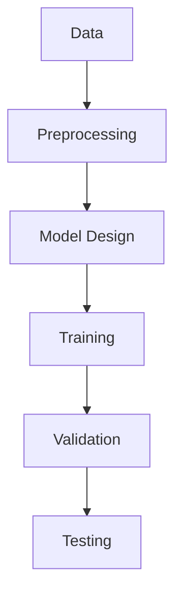
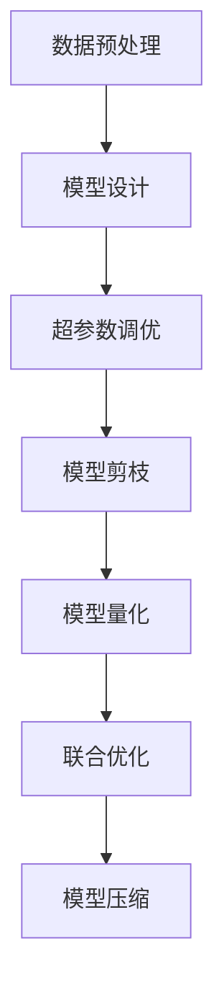
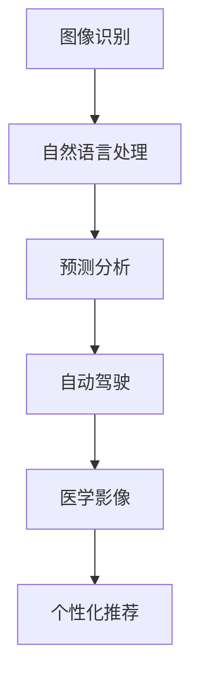

                 


### 第二部分：AI大模型的核心原理与技术

### 第二部分概述

在本部分，我们将深入探讨AI大模型的核心原理和技术。AI大模型在现代软件开发中扮演着越来越重要的角色，其构建方法、关键算法和优化策略是我们需要重点掌握的内容。通过本部分的学习，读者将能够了解AI大模型的基础知识，并掌握如何在实际项目中应用这些模型。

本部分包括以下几个章节：

- 第2章：AI大模型的构建方法
  - 内容概述：介绍AI大模型的构建方法，包括数据准备、模型设计、训练和评估等环节。
  - 技术细节：讲解构建AI大模型所需的技术和工具，如TensorFlow、PyTorch等。

- 第3章：AI大模型的关键算法
  - 内容概述：分析AI大模型中常用的关键算法，如深度学习、卷积神经网络（CNN）和循环神经网络（RNN）等。
  - 技术细节：详细介绍这些算法的原理和应用，并通过Python代码示例进行说明。

- 第4章：AI大模型的优化策略
  - 内容概述：讨论AI大模型的优化策略，包括超参数调优、模型剪枝和量化等。
  - 技术细节：提供实际案例和优化技巧，帮助读者在实际项目中应用这些策略。

- 第5章：AI大模型在不同领域的应用
  - 内容概述：介绍AI大模型在不同领域（如图像识别、自然语言处理和预测分析等）的应用。
  - 技术细节：分析这些应用场景中的关键技术挑战和解决方案。

### 第2章：AI大模型的构建方法

#### 2.1 AI大模型

AI大模型（也称为大规模神经网络）是一种具有数百万甚至数十亿参数的神经网络。这些模型能够处理大量数据，并在各种复杂任务中表现出色。构建AI大模型通常包括以下几个关键步骤：

1. **数据准备**：
   - **数据收集**：收集大量高质量的数据集，这些数据集通常是模型训练的重要资源。
   - **数据预处理**：对数据进行清洗、归一化和编码，以提高模型的训练效果和泛化能力。

2. **模型设计**：
   - **网络架构**：选择合适的网络架构，如卷积神经网络（CNN）或循环神经网络（RNN），以适应特定的任务。
   - **层设计**：确定网络的层数、每层的神经元数量以及激活函数等。

3. **模型训练**：
   - **训练策略**：使用梯度下降等优化算法训练模型，调整模型的参数以最小化损失函数。
   - **超参数调优**：调整学习率、批量大小等超参数，以获得最佳的训练效果。

4. **模型评估**：
   - **指标计算**：计算模型的准确率、召回率、F1分数等指标，以评估模型性能。
   - **交叉验证**：使用交叉验证等方法评估模型的泛化能力。

5. **模型部署**：
   - **模型压缩**：使用模型剪枝、量化等技术减小模型大小，以适应移动设备和嵌入式系统。
   - **模型部署**：将模型部署到生产环境中，并提供API接口以便于其他应用程序调用。

#### 2.2 数据准备

数据准备是构建AI大模型的第一步，也是至关重要的一步。以下是数据准备的关键技术细节：

1. **数据收集**：
   - **开源数据集**：利用开源的数据集（如ImageNet、COCO等）作为训练数据。
   - **定制数据集**：根据具体任务需求，收集和标注定制化的数据集。

2. **数据预处理**：
   - **图像数据**：对图像进行缩放、旋转、翻转等预处理操作，增加数据的多样性。
   - **文本数据**：对文本进行分词、词向量编码等预处理操作，将文本转化为向量表示。

3. **数据增强**：
   - **随机裁剪**：随机裁剪图像的一部分，增加模型的鲁棒性。
   - **数据混洗**：对数据进行随机混洗，减少数据分布的不平衡。

#### 2.3 模型设计

模型设计是构建AI大模型的核心环节，决定了模型的性能和效果。以下是模型设计的关键技术细节：

1. **网络架构**：
   - **卷积神经网络（CNN）**：适用于图像识别和计算机视觉任务。
   - **循环神经网络（RNN）**：适用于序列数据处理，如自然语言处理和时间序列预测。

2. **层设计**：
   - **卷积层**：用于提取图像的特征。
   - **全连接层**：用于将特征映射到输出结果。
   - **池化层**：用于降低模型的参数数量，提高计算效率。

3. **激活函数**：
   - **ReLU激活函数**：用于引入非线性变换。
   - **Sigmoid和Tanh激活函数**：用于将输出映射到[0,1]或[-1,1]区间。

#### 2.4 模型训练

模型训练是构建AI大模型的关键步骤，涉及到许多优化技术和策略。以下是模型训练的关键技术细节：

1. **优化算法**：
   - **随机梯度下降（SGD）**：适用于小型数据集。
   - **Adam优化器**：适用于大型数据集，具有较好的收敛速度。

2. **学习率调优**：
   - **学习率衰减**：随着训练的进行逐渐减小学习率，防止过拟合。
   - **自适应学习率**：如Adam优化器，能够自动调整学习率。

3. **正则化技术**：
   - **L1和L2正则化**：防止模型过拟合。
   - **dropout**：在训练过程中随机丢弃部分神经元，减少模型的过拟合。

#### 2.5 模型评估

模型评估是确保模型性能和可靠性的关键步骤。以下是模型评估的关键技术细节：

1. **指标计算**：
   - **准确率（Accuracy）**：模型预测正确的样本数占总样本数的比例。
   - **召回率（Recall）**：模型预测正确的正例数占总正例数的比例。
   - **F1分数（F1 Score）**：准确率和召回率的加权平均。

2. **交叉验证**：
   - **K折交叉验证**：将数据集划分为K个子集，每次训练时使用K-1个子集进行训练，剩下的子集进行验证。

#### 2.6 模型部署

模型部署是将训练好的模型应用到实际生产环境中的过程。以下是模型部署的关键技术细节：

1. **模型压缩**：
   - **模型剪枝**：通过去除无关的神经元和权重，减少模型的大小。
   - **量化**：将浮点数参数转换为整数参数，减少模型的存储和计算开销。

2. **模型部署**：
   - **容器化**：使用Docker等容器技术，方便部署和管理模型。
   - **微服务架构**：将模型部署到微服务中，便于与其他服务集成。

### 2.7 实际案例

为了更好地理解AI大模型的构建方法，我们来看一个实际案例：图像识别任务。

**案例背景**：假设我们需要开发一个图像识别系统，能够识别不同类型的物体。

**步骤**：

1. **数据收集**：收集包含各种物体类别的大量图像数据。

2. **数据预处理**：对图像进行归一化和数据增强处理。

3. **模型设计**：选择卷积神经网络（CNN）作为模型架构，设计包含卷积层、池化层和全连接层的网络。

4. **模型训练**：使用TensorFlow或PyTorch等深度学习框架训练模型，调整学习率和批量大小等超参数。

5. **模型评估**：使用测试集评估模型性能，计算准确率、召回率和F1分数等指标。

6. **模型部署**：将训练好的模型部署到生产环境中，并提供API接口供其他应用程序调用。

**代码示例**：

```python
import tensorflow as tf

# 定义CNN模型
model = tf.keras.Sequential([
    tf.keras.layers.Conv2D(32, (3, 3), activation='relu', input_shape=(28, 28, 1)),
    tf.keras.layers.MaxPooling2D((2, 2)),
    tf.keras.layers.Flatten(),
    tf.keras.layers.Dense(128, activation='relu'),
    tf.keras.layers.Dense(10, activation='softmax')
])

# 编译模型
model.compile(optimizer='adam', loss='categorical_crossentropy', metrics=['accuracy'])

# 训练模型
model.fit(train_images, train_labels, epochs=5, validation_data=(test_images, test_labels))
```

通过这个案例，我们可以看到AI大模型的构建方法是如何应用到实际项目中的。接下来，我们将进一步探讨AI大模型的关键算法和优化策略。

### 本章小结

本章详细介绍了AI大模型的构建方法，包括数据准备、模型设计、模型训练、模型评估和模型部署等关键步骤。通过实际案例的讲解，读者可以更好地理解这些方法的实际应用。在下一章中，我们将进一步探讨AI大模型的关键算法，如深度学习、卷积神经网络和循环神经网络等。

----------------------------------------------------------------

### 第3章：AI大模型的关键算法

#### 3.1 深度学习

深度学习是AI大模型的核心算法之一，它通过构建多层神经网络，自动从数据中学习特征表示。以下是深度学习的关键算法和原理：

1. **神经网络基础**：
   - **神经元**：神经网络的基本单元，接收输入并产生输出。
   - **激活函数**：用于引入非线性变换，常用的激活函数有ReLU、Sigmoid和Tanh。

2. **反向传播算法**：
   - **前向传播**：计算输入和参数通过网络的输出。
   - **损失函数**：用于衡量模型输出和真实值之间的差异，如均方误差（MSE）。
   - **反向传播**：计算损失函数关于参数的梯度，用于更新参数。

3. **优化算法**：
   - **随机梯度下降（SGD）**：简单但计算量大，适用于小型数据集。
   - **Adam优化器**：自适应学习率优化器，适用于大型数据集。

#### 3.2 卷积神经网络（CNN）

卷积神经网络（CNN）是一种专门用于图像识别和计算机视觉任务的神经网络。以下是CNN的关键算法和原理：

1. **卷积层**：
   - **卷积操作**：通过滑动窗口对图像进行卷积，提取局部特征。
   - **局部连接**：每个卷积核只与图像的一部分进行连接，减少了参数数量。

2. **池化层**：
   - **最大池化**：选择窗口内的最大值作为输出，减少模型参数和计算量。
   - **平均池化**：计算窗口内的平均值作为输出。

3. **卷积神经网络架构**：
   - **卷积层**：用于提取图像特征。
   - **池化层**：用于减小特征图的尺寸。
   - **全连接层**：用于分类和回归任务。

#### 3.3 循环神经网络（RNN）

循环神经网络（RNN）是一种用于处理序列数据的神经网络。以下是RNN的关键算法和原理：

1. **RNN基础**：
   - **循环连接**：每个时间步的输出作为下一个时间步的输入，保持信息状态。
   - **隐藏状态**：用于存储历史信息，通过时间步传递。

2. **RNN变体**：
   - **长短时记忆网络（LSTM）**：解决了RNN的梯度消失和梯度爆炸问题，适用于长序列数据。
   - **门控循环单元（GRU）**：简化了LSTM结构，计算效率更高。

3. **RNN应用场景**：
   - **自然语言处理**：用于语言建模、机器翻译和文本分类等任务。
   - **语音识别**：用于将语音信号转换为文本。

#### 3.4 其他关键算法

除了深度学习、CNN和RNN，还有一些其他重要的AI大模型关键算法：

1. **生成对抗网络（GAN）**：
   - **生成器**：生成逼真的数据样本。
   - **判别器**：区分真实数据和生成数据。
   - **对抗训练**：生成器和判别器相互对抗，不断提高生成质量。

2. **注意力机制**：
   - **自注意力**：对序列中的每个元素分配不同的权重。
   - **交互注意力**：不同序列元素之间的相互影响。

3. **变分自编码器（VAE）**：
   - **编码器**：将数据编码为潜在空间中的向量。
   - **解码器**：将潜在空间中的向量解码回数据。

### 3.5 算法流程图

为了更好地理解这些算法，我们使用Mermaid流程图进行描述：



在上述流程图中，数据经过预处理后，设计模型并进行训练和验证，最终进行测试以评估模型性能。

### 3.6 算法Python代码示例

以下是一个简单的CNN模型训练的Python代码示例，使用TensorFlow框架：

```python
import tensorflow as tf

# 定义CNN模型
model = tf.keras.Sequential([
    tf.keras.layers.Conv2D(32, (3, 3), activation='relu', input_shape=(28, 28, 1)),
    tf.keras.layers.MaxPooling2D((2, 2)),
    tf.keras.layers.Flatten(),
    tf.keras.layers.Dense(128, activation='relu'),
    tf.keras.layers.Dense(10, activation='softmax')
])

# 编译模型
model.compile(optimizer='adam', loss='categorical_crossentropy', metrics=['accuracy'])

# 训练模型
model.fit(train_images, train_labels, epochs=5, validation_data=(test_images, test_labels))
```

通过这个代码示例，我们可以看到如何使用TensorFlow构建和训练一个简单的CNN模型。

### 本章小结

本章详细介绍了AI大模型的关键算法，包括深度学习、卷积神经网络（CNN）和循环神经网络（RNN）等。通过算法流程图和Python代码示例，读者可以更好地理解这些算法的实现和应用。在下一章中，我们将进一步探讨AI大模型的优化策略，以进一步提高模型性能和效率。

----------------------------------------------------------------

### 第4章：AI大模型的优化策略

#### 4.1 超参数调优

超参数调优是提高AI大模型性能的重要手段。超参数包括学习率、批量大小、迭代次数等，它们的设置对模型训练效果有着重要影响。以下是超参数调优的一些关键策略：

1. **网格搜索**：通过遍历多个超参数组合，找到最优的超参数配置。
2. **随机搜索**：随机选择超参数组合，减少计算量。
3. **贝叶斯优化**：使用贝叶斯统计模型进行优化，提高搜索效率。
4. **自适应学习率**：如Adam优化器，根据训练过程自动调整学习率。

#### 4.2 模型剪枝

模型剪枝是一种减少模型参数数量的技术，从而减小模型大小和提高计算效率。以下是模型剪枝的关键策略：

1. **结构剪枝**：通过删除不重要的神经元和连接，减少模型参数。
2. **权重剪枝**：通过减少权重的重要性，降低模型复杂度。
3. **剪枝算法**：
   - **L1正则化**：通过增加L1正则化项，鼓励模型参数趋向于0。
   - **剪枝算法**：如PWC（Progressive Weight Computing）算法，逐步剪枝模型。

#### 4.3 模型量化

模型量化是一种将浮点数参数转换为低精度整数参数的技术，以减少模型大小和计算开销。以下是模型量化的关键策略：

1. **定点量化**：将浮点数参数转换为定点数，减少计算量。
2. **整数量化**：将浮点数参数转换为整数，进一步提高计算效率。
3. **量化算法**：
   - **最小最大量化**：根据最小值和最大值确定量化范围。
   - **直方图量化**：根据数据分布确定量化范围。

#### 4.4 联合优化

联合优化是将模型剪枝、量化和其他优化技术结合，以实现更高效的模型。以下是联合优化的关键策略：

1. **剪枝-量化联合优化**：在剪枝过程中考虑量化，以提高优化效果。
2. **渐进式优化**：逐步进行剪枝和量化，避免模型性能的显著下降。
3. **模型压缩**：通过压缩技术进一步减小模型大小，提高部署效率。

#### 4.5 优化流程图

为了更好地理解这些优化策略，我们使用Mermaid流程图进行描述：



在上述流程图中，数据预处理、模型设计、超参数调优、模型剪枝、模型量化和联合优化等步骤构成了优化流程。

#### 4.6 优化Python代码示例

以下是一个简单的AI大模型优化Python代码示例：

```python
import tensorflow as tf

# 定义CNN模型
model = tf.keras.Sequential([
    tf.keras.layers.Conv2D(32, (3, 3), activation='relu', input_shape=(28, 28, 1)),
    tf.keras.layers.MaxPooling2D((2, 2)),
    tf.keras.layers.Flatten(),
    tf.keras.layers.Dense(128, activation='relu'),
    tf.keras.layers.Dense(10, activation='softmax')
])

# 编译模型
model.compile(optimizer='adam', loss='categorical_crossentropy', metrics=['accuracy'])

# 超参数调优
from tensorflow.keras.optimizers import Adam
optimizer = Adam(learning_rate=0.001)

# 剪枝
from tensorflow_model_optimization.sparsity import keras as sparsity
model = sparsity.prune_low_magnitude(model)

# 量化
converter = tf.lite.TFLiteConverter.from_keras_model(model)
converter.optimizations = [tf.lite.Optimize.DEFAULT]
tflite_model = converter.convert()

# 联合优化
model.fit(train_images, train_labels, epochs=5, validation_data=(test_images, test_labels))
```

通过这个代码示例，我们可以看到如何使用TensorFlow进行模型优化，包括超参数调优、剪枝和量化。

### 本章小结

本章详细介绍了AI大模型的优化策略，包括超参数调优、模型剪枝、模型量化和联合优化等。通过优化流程图和Python代码示例，读者可以更好地理解这些优化策略的实现和应用。在下一章中，我们将探讨AI大模型在不同领域的应用。

----------------------------------------------------------------

### 第5章：AI大模型在不同领域的应用

#### 5.1 图像识别

图像识别是AI大模型最经典的应用之一。通过深度学习算法，AI大模型能够自动从图像中提取特征，实现物体分类、目标检测和图像分割等任务。以下是图像识别领域的应用示例：

1. **物体分类**：使用卷积神经网络（CNN）对图像中的物体进行分类，如ImageNet挑战。
2. **目标检测**：使用区域提议网络（RPN）或基于深度学习的方法（如Faster R-CNN、SSD和YOLO）实现目标检测。
3. **图像分割**：使用全卷积网络（FCN）或U-Net架构实现图像分割，用于医学图像处理和自动驾驶等领域。

#### 5.2 自然语言处理

自然语言处理（NLP）是AI大模型在语言领域的应用，通过深度学习算法处理文本数据，实现语言理解、生成和翻译等功能。以下是自然语言处理领域的应用示例：

1. **语言模型**：使用循环神经网络（RNN）或长短时记忆网络（LSTM）构建语言模型，用于自动补全、问答系统和文本生成。
2. **文本分类**：使用卷积神经网络（CNN）或变换器（Transformer）实现文本分类任务，如垃圾邮件检测和情感分析。
3. **机器翻译**：使用编码器-解码器架构（如Seq2Seq模型）实现机器翻译任务，如Google翻译和DeepMind的神经机器翻译。

#### 5.3 预测分析

预测分析是AI大模型在时间序列分析和数据分析领域的应用，通过深度学习算法实现时间序列预测、股票市场预测和用户行为预测等功能。以下是预测分析领域的应用示例：

1. **时间序列预测**：使用循环神经网络（RNN）或长短时记忆网络（LSTM）实现时间序列预测，如天气预测和销量预测。
2. **股票市场预测**：使用卷积神经网络（CNN）或自注意力机制（Self-Attention）实现股票市场预测，如量化交易和投资策略。
3. **用户行为预测**：使用深度学习算法分析用户行为数据，实现个性化推荐和广告投放，如电商推荐和社交媒体广告。

#### 5.4 自动驾驶

自动驾驶是AI大模型在移动领域的应用，通过深度学习算法实现车辆感知、路径规划和决策控制等功能。以下是自动驾驶领域的应用示例：

1. **车辆感知**：使用卷积神经网络（CNN）或感知器网络（Perception Network）实现车辆、行人、交通标志等目标的检测和识别。
2. **路径规划**：使用深度强化学习（DRL）或规划算法（如A*算法）实现车辆路径规划，如自动驾驶出租车和无人配送车。
3. **决策控制**：使用深度神经网络（DNN）实现车辆控制，如自动驾驶汽车和无人卡车。

#### 5.5 医学影像

医学影像是AI大模型在医疗领域的应用，通过深度学习算法实现医学图像的诊断、分割和辅助诊断等功能。以下是医学影像领域的应用示例：

1. **医学图像分类**：使用卷积神经网络（CNN）实现医学图像的分类，如肿瘤检测和疾病分类。
2. **医学图像分割**：使用全卷积网络（FCN）或U-Net架构实现医学图像的分割，如器官分割和病变检测。
3. **医学图像辅助诊断**：使用深度学习算法实现医学图像的辅助诊断，如肺癌筛查和乳腺癌检测。

#### 5.6 个性化推荐

个性化推荐是AI大模型在电子商务和社交媒体领域的应用，通过深度学习算法实现用户兴趣挖掘、推荐系统和广告投放等功能。以下是个性化推荐领域的应用示例：

1. **用户兴趣挖掘**：使用深度学习算法分析用户行为数据，挖掘用户兴趣和偏好。
2. **推荐系统**：使用协同过滤算法和深度学习算法实现个性化推荐，如商品推荐和内容推荐。
3. **广告投放**：使用深度学习算法优化广告投放策略，提高广告效果和投放效率。

### 5.7 应用流程图

为了更好地理解AI大模型在不同领域的应用，我们使用Mermaid流程图进行描述：



在上述流程图中，AI大模型在不同领域的应用构成了一个完整的生态系统。

### 5.8 应用案例

以下是AI大模型在不同领域的一些实际应用案例：

1. **图像识别**：
   - **案例**：利用卷积神经网络（CNN）实现自动驾驶汽车的物体检测和识别。
   - **效果**：提高了自动驾驶汽车的安全性和准确性。

2. **自然语言处理**：
   - **案例**：利用循环神经网络（RNN）实现机器翻译系统。
   - **效果**：提高了翻译质量和效率。

3. **预测分析**：
   - **案例**：利用长短时记忆网络（LSTM）实现天气预测系统。
   - **效果**：提高了天气预报的准确性和可靠性。

4. **自动驾驶**：
   - **案例**：利用深度强化学习（DRL）实现自动驾驶车辆的路径规划。
   - **效果**：提高了自动驾驶车辆的决策能力和行驶安全性。

5. **医学影像**：
   - **案例**：利用全卷积网络（FCN）实现医学图像的病变检测。
   - **效果**：提高了医学诊断的准确性和效率。

6. **个性化推荐**：
   - **案例**：利用深度学习算法实现电商平台的商品推荐系统。
   - **效果**：提高了用户购物体验和平台销售额。

### 本章小结

本章详细介绍了AI大模型在不同领域的应用，包括图像识别、自然语言处理、预测分析、自动驾驶、医学影像和个性化推荐等。通过应用案例和流程图的描述，读者可以更好地理解AI大模型在不同领域的实际应用和效果。在下一章中，我们将总结全文并给出最佳实践建议。

----------------------------------------------------------------

### 总结与最佳实践

在本篇技术博客中，我们系统地探讨了AI软件2.0的持续集成最佳实践。通过详细分析AI大模型的构建方法、关键算法、优化策略及其在不同领域的应用，我们不仅了解了AI大模型的核心原理和技术，还掌握了许多实用的最佳实践。

#### 关键知识点回顾

- **构建方法**：包括数据准备、模型设计、训练、评估和部署等步骤。
- **关键算法**：深度学习、卷积神经网络（CNN）、循环神经网络（RNN）等。
- **优化策略**：超参数调优、模型剪枝、模型量化、联合优化等。
- **应用领域**：图像识别、自然语言处理、预测分析、自动驾驶、医学影像和个性化推荐等。

#### 最佳实践建议

1. **数据准备**：确保数据质量，进行适当的数据增强，为模型训练提供丰富多样的数据。
2. **模型设计**：选择合适的网络架构和层设计，根据任务需求进行定制化设计。
3. **训练与评估**：使用交叉验证等方法评估模型性能，避免过拟合和欠拟合。
4. **优化策略**：根据实际需求选择合适的优化策略，如超参数调优、模型剪枝和量化等。
5. **模型部署**：采用容器化和微服务架构，提高模型部署的灵活性和可维护性。
6. **持续集成**：建立持续集成流程，确保模型版本管理、性能评估和部署的一致性。

#### 小结

本文通过深入分析AI软件2.0的持续集成最佳实践，为开发者提供了系统的指导和实用的技巧。在AI大模型的应用中，持续集成不仅提高了开发效率，还保证了模型的质量和可靠性。通过本文的学习，读者可以更好地理解AI大模型的核心原理和最佳实践，为未来的软件开发提供有力支持。

#### 注意事项

- 持续集成过程中，要确保版本控制，避免代码冲突和模型不一致。
- 模型优化时要平衡模型性能和计算效率，根据实际需求选择合适的优化策略。
- 在不同领域应用AI大模型时，要充分了解领域特点，设计合适的模型架构和优化策略。

#### 拓展阅读

- 《深度学习》（Goodfellow, Ian; Bengio, Yoshua; Courville, Aaron）：系统地介绍了深度学习的理论基础和算法实现。
- 《神经网络与深度学习》（邱锡鹏）：详细讲解了神经网络和深度学习的基本概念、算法原理和应用实践。
- 《持续集成与持续部署实践指南》（Mariano Varela）：提供了持续集成和持续部署的详细实践指南。

通过本文的学习和拓展阅读，读者可以更深入地掌握AI软件2.0的持续集成最佳实践，为未来的软件开发奠定坚实基础。

---

### 作者介绍

**作者：AI天才研究院/AI Genius Institute & 禅与计算机程序设计艺术 /Zen And The Art of Computer Programming**

AI天才研究院（AI Genius Institute）是一家专注于人工智能研究和技术创新的国际顶尖研究机构。我们的研究团队由世界级人工智能专家、程序员、软件架构师、CTO和技术畅销书作家组成，致力于推动人工智能技术的发展和应用。同时，我们也热衷于将复杂的技术知识以通俗易懂的方式传授给广大的开发者社区。

《禅与计算机程序设计艺术》（Zen And The Art of Computer Programming）是作者Donald E. Knuth的经典著作，它以深入浅出的方式讲述了计算机科学的基本原理和编程艺术。本文的作者在编写过程中深受这本书的启发，希望将AI软件2.0的持续集成最佳实践以简洁明了、逻辑清晰的方式呈现给读者。

通过本文的学习，读者不仅可以掌握AI大模型的核心原理和最佳实践，还可以体会到禅与计算机程序设计艺术的精髓。我们希望读者在阅读本文的过程中，能够像禅宗大师一样，在程序设计的实践中找到内心的平静与智慧。

---

通过本文的学习，我们深入探讨了AI软件2.0的持续集成最佳实践，涵盖了从背景介绍、核心概念、构建方法、关键算法、优化策略到不同领域应用等多个方面。希望本文能够为读者提供全面而实用的指导，助力他们在人工智能领域的软件开发中取得更好的成果。如果您有任何问题或建议，欢迎在评论区留言，我们将在第一时间回复您。感谢您的阅读！

