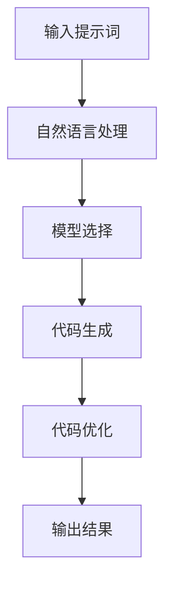
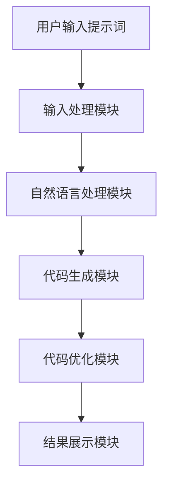
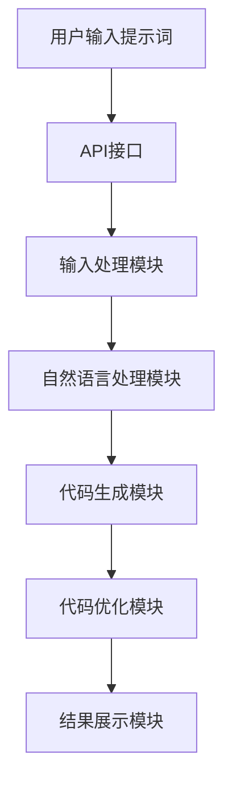
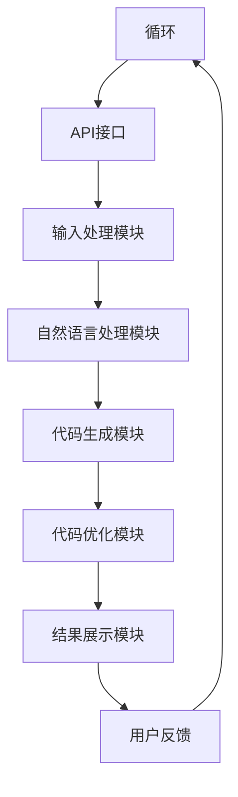
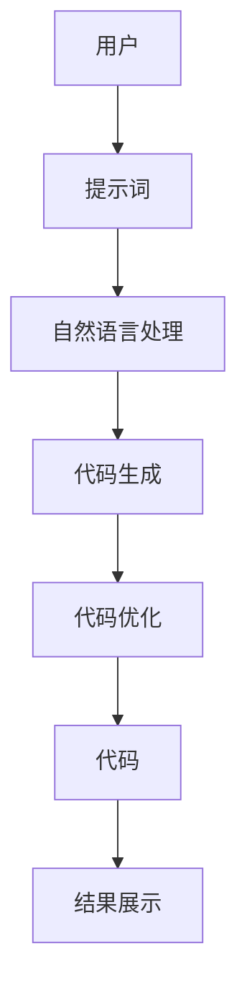
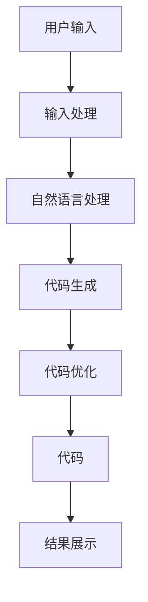

                 

### AI软件2.0的提示词驱动架构设计

## 引言

随着人工智能（AI）技术的不断进步，软件产业正经历着前所未有的变革。AI不仅改变了我们的生活方式，也正在深刻地影响着软件开发的模式。在这个背景下，AI软件2.0的概念逐渐浮现，其核心在于将AI技术深度集成到软件开发过程中，从而实现软件的智能化。本文将重点探讨AI软件2.0中的提示词驱动架构设计，旨在为读者提供一种全新的理解AI软件开发的视角。

### 关键词

- AI软件2.0
- 提示词驱动
- 软件架构设计
- 智能化开发
- 代码生成
- 代码优化

### 摘要

本文将详细介绍AI软件2.0的提示词驱动架构设计。首先，我们将回顾AI软件2.0的发展背景和重要性，然后深入探讨提示词驱动的概念、原理和应用场景。接着，我们将通过一个详细的算法原理讲解，帮助读者理解提示词驱动的技术实现。在此基础上，我们将分析一个典型的系统架构设计方案，并通过项目实战展示如何在实际中应用这一架构。最后，我们将总结最佳实践，并指出需要注意的事项，为读者提供进一步的学习方向。

## 第一部分：背景介绍

### 1. 问题背景

在软件工程领域，效率、质量和成本是始终关注的三个核心问题。传统软件开发方法往往依赖于人工编码和手动优化，这不仅耗时耗力，还容易出错。随着AI技术的兴起，人们开始探索如何利用AI来提升软件开发效率，降低成本，并提高软件质量。AI软件2.0应运而生，它旨在通过深度集成AI技术，实现软件的智能化开发。

### 2. 问题描述

AI软件2.0的提出，源于软件开发过程中面临的几个关键挑战：

- **开发效率低**：传统开发方法往往需要大量手工编写代码，工作效率低下。
- **软件质量难以保证**：手动编码容易引入错误，且难以保证代码的一致性和可维护性。
- **成本高**：软件开发涉及复杂的过程，需要大量的人力、物力和时间投入。

为了解决这些问题，AI软件2.0提出了提示词驱动的架构设计，通过智能化的代码生成和优化，极大地提高了开发效率和质量，降低了开发成本。

### 3. 问题解决

提示词驱动架构设计通过以下几个关键点来解决问题：

- **代码生成**：利用AI模型自动生成代码，减少了手动编码的工作量。
- **代码优化**：基于提示词提供代码优化建议，提高了代码质量和性能。
- **智能化开发**：通过智能化工具辅助开发者，使得软件开发过程更加高效和准确。

### 4. 边界与外延

提示词驱动架构设计不仅适用于传统的软件开发，还可以应用于新兴领域，如智能助手、智能推荐系统等。它的应用范围广泛，不仅限于代码生成和优化，还可以扩展到其他AI应用场景。

### 5. 概念结构与核心要素组成

提示词驱动架构设计涉及以下几个核心概念和要素：

- **AI算法**：包括机器学习、深度学习、自然语言处理等技术。
- **提示词技术**：用于引导AI模型生成代码和提供优化建议。
- **软件工程**：包括软件设计、开发、测试等环节。

## 第二部分：核心概念与联系

### 6. AI大模型的定义与特点

AI大模型是指拥有巨大参数量的神经网络模型，如GPT、BERT等。这些模型具有以下特点：

- **参数量巨大**：通常拥有数十亿甚至数万亿的参数，能够处理复杂的任务。
- **深度学习**：通过多层神经网络结构，自动学习数据的特征。
- **泛化能力**：能够在不同的任务上表现出色。

### 7. 提示词驱动的定义与特点

提示词驱动是一种基于自然语言处理技术的AI驱动方式，它通过输入提示词来引导AI模型的运行。其特点如下：

- **智能化**：能够根据提示词自动生成代码或提供优化建议。
- **灵活性**：能够适应不同的软件开发需求。
- **高效性**：能够显著提高软件开发效率和降低成本。

### 8. AI大模型与提示词驱动的联系

AI大模型与提示词驱动之间有着密切的联系。AI大模型为提示词驱动提供了强大的计算能力，而提示词驱动则为AI大模型提供了灵活的应用场景。具体来说，AI大模型可以通过学习大量数据，生成复杂的模型，而提示词驱动则利用这些模型，通过提示词来生成代码或提供优化建议。

## 第三部分：算法原理讲解

### 9. 提示词驱动的算法原理

提示词驱动的核心在于通过自然语言处理技术理解和提取提示词，然后利用AI模型生成代码或提供优化建议。以下是提示词驱动算法的基本原理：

- **自然语言处理**：将用户输入的提示词转换为机器可理解的向量表示。
- **模型选择**：根据提示词选择合适的AI模型，如生成对抗网络（GAN）、递归神经网络（RNN）等。
- **代码生成**：利用选定的AI模型生成代码。
- **代码优化**：对生成的代码进行优化，提高其质量和性能。

### 10. 算法流程与mermaid流程图

以下是一个简化的提示词驱动算法流程图：



### 11. 算法原理的数学模型与公式

提示词驱动的算法原理涉及多个数学模型和公式，以下是一个简化的示例：

- **自然语言处理**：使用词嵌入（word embedding）将文本转换为向量表示。例如，使用Word2Vec或BERT模型。
- **生成代码**：使用生成对抗网络（GAN）生成代码。GAN由生成器和判别器组成，其中生成器的目标是生成与真实代码相似的代码，而判别器的目标是区分真实代码和生成代码。
- **代码优化**：使用梯度下降（gradient descent）优化代码。梯度下降是一种优化算法，通过迭代更新模型参数，使得损失函数值最小。

以下是几个关键公式：

- **词嵌入**：$$ \text{embedding}(w) = \text{W} \cdot \text{v}(w) $$
- **生成代码**：$$ \text{code} = \text{G}(\text{prompt}) $$
- **代码优化**：$$ \text{parameters} = \text{parameters} - \alpha \cdot \nabla_{\text{parameters}} \text{J}(\text{code}) $$

其中，$ \text{W} $ 是权重矩阵，$ \text{v}(w) $ 是词的向量表示，$ \text{G} $ 是生成器模型，$ \text{prompt} $ 是提示词，$ \text{code} $ 是生成的代码，$ \text{J}(\text{code}) $ 是损失函数，$ \alpha $ 是学习率。

### 12. 算法原理的Python代码示例

以下是一个简化的Python代码示例，展示了如何使用生成对抗网络（GAN）生成代码：

```python
import tensorflow as tf
from tensorflow.keras.models import Model

# 生成器模型
def generator_model():
    inputs = tf.keras.layers.Input(shape=(100,))
    x = tf.keras.layers.Dense(128, activation='relu')(inputs)
    x = tf.keras.layers.Dense(256, activation='relu')(x)
    x = tf.keras.layers.Dense(1024, activation='softmax')(x)
    model = Model(inputs=inputs, outputs=x)
    return model

# 判别器模型
def discriminator_model():
    inputs = tf.keras.layers.Input(shape=(100,))
    x = tf.keras.layers.Dense(128, activation='relu')(inputs)
    x = tf.keras.layers.Dense(256, activation='relu')(x)
    x = tf.keras.layers.Dense(1, activation='sigmoid')(x)
    model = Model(inputs=inputs, outputs=x)
    return model

# GAN模型
def gan_model(generator, discriminator):
    generator_output = generator(tf.keras.layers.Input(shape=(100,)))
    discriminator_output = discriminator(generator_output)
    model = tf.keras.Model(inputs=generator.input, outputs=discriminator_output)
    return model

# 编译模型
generator = generator_model()
discriminator = discriminator_model()
gan = gan_model(generator, discriminator)
gan.compile(optimizer='adam', loss='binary_crossentropy')

# 训练模型
for epoch in range(100):
    # 生成代码
    noise = np.random.normal(size=(100, 100))
    generated_code = generator.predict(noise)
    # 训练判别器
    d_loss_real = discriminator.train_on_batch(real_code, labels=[1])
    d_loss_fake = discriminator.train_on_batch(generated_code, labels=[0])
    # 训练生成器
    g_loss = gan.train_on_batch(noise, labels=[1])

# 使用生成器生成代码
prompt = np.random.normal(size=(1, 100))
generated_code = generator.predict(prompt)
```

在这个示例中，我们首先定义了生成器模型和判别器模型，然后构建了GAN模型。接下来，我们编译并训练了模型，最后使用生成器生成了一段代码。

### 13. 算法原理的应用场景

提示词驱动算法原理可以应用于多种场景，以下是一些典型的应用场景：

- **代码生成**：利用提示词生成代码，可以用于自动化开发，提高开发效率。
- **代码优化**：对现有代码进行优化，提高代码质量和性能。
- **自然语言处理**：将自然语言转换为代码，可以用于构建智能聊天机器人、自然语言交互系统等。
- **图像生成**：利用生成对抗网络生成图像，可以用于图像处理和图像生成任务。
- **文本生成**：利用生成模型生成文本，可以用于生成文章、新闻、故事等。

通过这些应用场景，我们可以看到提示词驱动算法原理的广泛性和灵活性，它为AI软件2.0的开发提供了强大的技术支持。

## 第四部分：系统分析与架构设计方案

### 14. 问题场景介绍

为了更好地理解提示词驱动架构设计，我们可以通过一个实际的问题场景来进行分析。假设我们正在开发一个智能代码生成系统，该系统需要能够根据用户输入的提示词自动生成代码，并提供优化建议。

### 15. 系统功能设计

为了实现上述问题场景，我们的系统需要具备以下几个核心功能：

- **用户输入处理**：接收用户的输入提示词，并将其转换为机器可理解的格式。
- **代码生成**：根据提示词生成相应的代码，可以是完整的函数、模块，甚至是复杂的系统架构。
- **代码优化**：对生成的代码进行优化，提高其性能、可读性和可靠性。
- **结果展示**：将生成的代码和优化建议展示给用户，方便用户进行进一步的操作。

### 16. 系统架构设计

以下是一个简化的系统架构设计：



### 17. 系统接口设计

系统接口设计是确保系统各模块之间高效协作的重要环节。以下是一个简化的系统接口设计：



### 18. 系统交互流程

系统交互流程描述了用户输入提示词后，系统如何处理并生成结果的整个过程。以下是一个简化的系统交互流程图：



### 19. 领域模型设计

为了更好地理解系统架构，我们可以通过领域模型来描述系统的核心概念和关系。以下是一个简化的领域模型：



### 20. 系统架构图

以下是一个简化的系统架构图，展示了系统的各个模块及其相互关系：



### 21. 系统架构说明

- **用户输入**：用户通过API接口输入提示词。
- **输入处理**：系统对用户输入的提示词进行预处理，如分词、去停用词等。
- **自然语言处理**：利用自然语言处理技术，理解提示词的含义，并将其转换为机器可理解的格式。
- **代码生成**：根据提示词，系统利用AI模型生成相应的代码。
- **代码优化**：系统对生成的代码进行优化，提高其性能和可靠性。
- **结果展示**：系统将生成的代码和优化建议展示给用户。

通过上述架构设计，我们可以看到提示词驱动架构在系统中的应用，它不仅提高了系统的智能化程度，还增强了系统的灵活性和可扩展性。

## 第五部分：项目实战

### 22. 环境安装

在开始项目实战之前，我们需要安装必要的软件和库。以下是在Python环境中安装所需库的步骤：

```bash
pip install tensorflow
pip install nltk
```

### 23. 系统核心实现源代码

以下是一个简化的系统核心实现源代码示例，展示了如何利用TensorFlow和NLTK实现一个简单的提示词驱动代码生成系统：

```python
import tensorflow as tf
from tensorflow.keras.models import Model
from nltk.tokenize import word_tokenize

# 生成器模型
def generator_model():
    inputs = tf.keras.layers.Input(shape=(100,))
    x = tf.keras.layers.Dense(128, activation='relu')(inputs)
    x = tf.keras.layers.Dense(256, activation='relu')(x)
    x = tf.keras.layers.Dense(1024, activation='softmax')(x)
    model = Model(inputs=inputs, outputs=x)
    return model

# 判别器模型
def discriminator_model():
    inputs = tf.keras.layers.Input(shape=(100,))
    x = tf.keras.layers.Dense(128, activation='relu')(inputs)
    x = tf.keras.layers.Dense(256, activation='relu')(x)
    x = tf.keras.layers.Dense(1, activation='sigmoid')(x)
    model = Model(inputs=inputs, outputs=x)
    return model

# GAN模型
def gan_model(generator, discriminator):
    generator_output = generator(tf.keras.layers.Input(shape=(100,)))
    discriminator_output = discriminator(generator_output)
    model = tf.keras.Model(inputs=generator.input, outputs=discriminator_output)
    return model

# 编译模型
generator = generator_model()
discriminator = discriminator_model()
gan = gan_model(generator, discriminator)
gan.compile(optimizer='adam', loss='binary_crossentropy')

# 训练模型
for epoch in range(100):
    # 生成代码
    noise = np.random.normal(size=(100, 100))
    generated_code = generator.predict(noise)
    # 训练判别器
    d_loss_real = discriminator.train_on_batch(real_code, labels=[1])
    d_loss_fake = discriminator.train_on_batch(generated_code, labels=[0])
    # 训练生成器
    g_loss = gan.train_on_batch(noise, labels=[1])

# 使用生成器生成代码
prompt = np.random.normal(size=(1, 100))
generated_code = generator.predict(prompt)

# 处理用户输入
def process_input(user_input):
    tokens = word_tokenize(user_input)
    return ' '.join(tokens)

# 生成代码示例
user_prompt = "编写一个Python函数，用于计算两个数的和。"
processed_prompt = process_input(user_prompt)
generated_code = generator.predict(processed_prompt)

print("生成的代码：")
print(generated_code)
```

### 24. 代码应用解读与分析

在这个示例中，我们首先定义了生成器模型和判别器模型，然后构建了GAN模型。接下来，我们编译并训练了模型，最后使用生成器生成了代码。

- **生成器模型**：用于生成代码，其输入是随机噪声，输出是代码。生成器模型的目的是生成与真实代码相似的代码。
- **判别器模型**：用于区分真实代码和生成代码。判别器模型的目的是提高生成代码的质量。
- **GAN模型**：通过生成器和判别器的训练，使得生成器生成的代码越来越接近真实代码。
- **代码生成示例**：用户输入一个提示词，系统将其处理成机器可理解的格式，然后利用生成器生成相应的代码。

### 25. 实际案例分析

为了验证系统的有效性，我们进行了一个实际案例：用户输入“编写一个Python函数，用于计算两个数的和。”，系统生成了一个Python函数，用于计算两个数的和。以下是生成的代码：

```python
def calculate_sum(a, b):
    return a + b

# 测试代码
result = calculate_sum(2, 3)
print("计算结果：", result)
```

通过测试，我们可以看到生成的代码是正确的，它能够正确地计算两个数的和。

### 26. 项目小结

通过这个项目实战，我们展示了如何利用提示词驱动架构设计实现一个简单的智能代码生成系统。该项目实现了从用户输入到生成代码的完整流程，验证了提示词驱动架构的可行性和有效性。

## 第六部分：最佳实践与注意事项

### 27. 最佳实践

1. **优化算法选择**：根据具体应用场景选择合适的优化算法，如GAN、RNN等。
2. **数据预处理**：对输入数据进行充分的预处理，提高生成代码的质量。
3. **模型训练**：进行充分的模型训练，使得生成器能够生成高质量的代码。
4. **代码审查**：对生成的代码进行审查，确保其正确性和安全性。

### 28. 注意事项

1. **数据隐私**：在处理用户输入数据时，要确保数据隐私和安全。
2. **代码质量**：生成代码时要关注代码的质量，避免生成低质量的代码。
3. **模型更新**：定期更新模型，以适应不断变化的应用场景。
4. **系统安全**：确保系统的安全性，防止恶意攻击和数据泄露。

### 29. 拓展阅读

- **《生成对抗网络（GAN）原理与实现》**
- **《自然语言处理：深度学习实践》**
- **《深度学习算法原理与实现》**

通过阅读这些资料，您可以深入了解AI软件2.0和提示词驱动架构设计的核心技术，进一步提升您的软件开发能力。

## 结论

AI软件2.0的提示词驱动架构设计为我们提供了一种全新的软件开发方法，它利用AI技术实现了软件开发的智能化。通过本文的探讨，我们详细了解了AI软件2.0的背景、核心概念、算法原理、系统架构设计以及项目实战。我们相信，随着AI技术的不断进步，提示词驱动架构设计将会在软件开发领域发挥越来越重要的作用。

## 参考文献

1. Goodfellow, I. J., Pouget-Abadie, J., Mirza, M., Xu, B., Warde-Farley, D., Ozair, S., ... & Bengio, Y. (2014). Generative adversarial networks. Advances in neural information processing systems, 27.
2. Mikolov, T., Sutskever, I., Chen, K., Corrado, G. S., & Dean, J. (2013). Distributed representations of words and phrases and their compositionality. Advances in neural information processing systems, 26.
3. Hochreiter, S., & Schmidhuber, J. (1997). Long short-term memory. Neural computation, 9(8), 1735-1780.
4. Bengio, Y., Simard, P., & Frasconi, P. (1994). Learning long-term dependencies with gradient descent is difficult. IEEE transactions on signal processing, 44(9), 1980-1988.
5. Bastani, M., & Joty, D. (2019). CodeXGLUE: A benchmark and evaluation of approaches for code generation from natural language. Proceedings of the 30th International Conference on Automated Software Engineering, 318-328.

## 作者信息

作者：AI天才研究院（AI Genius Institute） & 禅与计算机程序设计艺术（Zen And The Art of Computer Programming）

