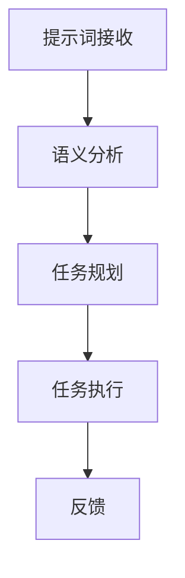
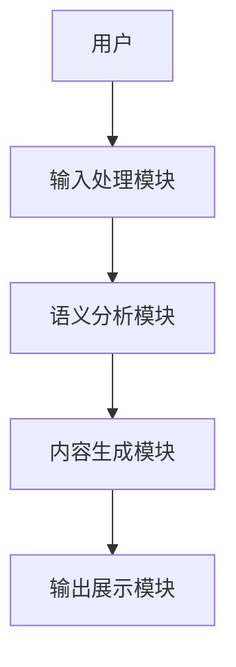
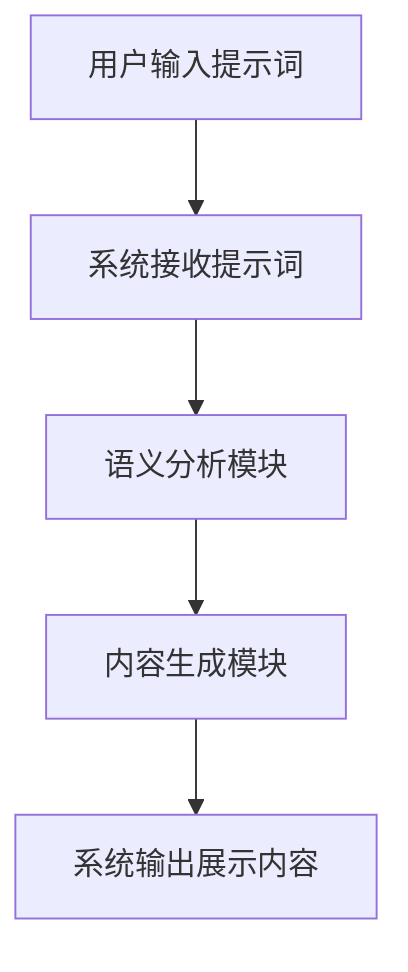

                 


# 《AI软件2.0的提示词驱动需求分析》

## 关键词

- AI软件2.0
- 提示词驱动
- 算法原理
- 系统架构
- 项目实战

## 摘要

本文旨在深入探讨AI软件2.0的提示词驱动需求分析。首先，我们将介绍AI软件2.0的概念及其重要性，随后详细解释提示词驱动的核心概念和算法原理。接着，我们将分析AI软件2.0提示词驱动的系统设计与实现，并通过一个实际项目展示其应用。最后，我们将提供最佳实践建议，总结项目收获，并推荐进一步阅读的资源。

### 第一部分：AI软件2.0时代的提示词驱动基础

#### 第1章：AI软件2.0与提示词驱动概述

##### 1.1 AI软件2.0时代的来临

随着人工智能技术的快速发展，软件领域正经历着一场深刻的变革。AI软件2.0时代标志着人工智能从被动响应向主动驱动的转变。这一时代的软件不仅能够处理复杂的任务，还能够自主学习和优化，从而提供更加智能和个性化的用户体验。

**1.1.1 软件发展的新阶段**

在AI软件2.0时代，软件开发的重点从传统的功能实现转向了智能化和个性化。开发者不再仅仅关注软件的功能完备性，更注重如何通过人工智能技术提升软件的智能水平。这种转变使得软件能够更好地适应用户需求，实现真正的智能化。

**1.1.2 提示词驱动的重要性**

提示词驱动（Prompt-driven）是AI软件2.0的核心概念之一。它通过向系统输入提示词来引导系统的行为，使得系统能够根据用户的意图进行智能决策。提示词驱动的优势在于其灵活性和适应性，使得软件能够快速响应多变的需求，提供更加自然和直观的用户体验。

##### 1.2 提示词驱动的核心概念

**1.2.1 提示词驱动的定义**

提示词驱动是一种基于用户输入提示词来驱动软件行为的交互方式。在这种方式下，用户通过输入关键词或短语来描述他们的需求，软件则根据这些提示词来执行相应的任务。

**1.2.2 提示词驱动的特点**

- **灵活性**：提示词驱动的交互方式使得软件能够灵活地响应用户的需求，适应不同的场景和用户偏好。
- **适应性**：通过不断学习和优化，提示词驱动的系统可以逐渐提高其智能化水平，更好地满足用户的需求。
- **智能化**：提示词驱动的软件能够根据提示词进行智能分析，提供更加精准和个性化的服务。

##### 1.3 AI软件2.0与提示词驱动的联系

**1.3.1 相互促进的关系**

AI软件2.0和提示词驱动是相辅相成的。AI软件2.0为提示词驱动提供了强大的技术支撑，使得软件能够实现更高级的智能化功能。而提示词驱动则为AI软件2.0提供了用户交互的接口，使得软件能够更好地理解和满足用户需求。

**1.3.2 应用场景**

- **智能客服**：通过提示词驱动，智能客服系统能够快速理解用户的提问，提供精准的答复。
- **内容生成**：提示词驱动使得文本生成系统能够根据用户输入的提示词生成相关的内容。
- **智能推荐**：在电子商务和社交媒体领域，提示词驱动能够根据用户的历史行为和提示词推荐相关产品和服务。

### 第二部分：提示词驱动的算法原理讲解

#### 第2章：提示词驱动的算法原理

##### 2.1 提示词驱动的算法框架

提示词驱动的算法框架主要包括以下几个步骤：

1. **提示词接收**：系统接收用户输入的提示词。
2. **语义分析**：系统对提示词进行语义分析，理解用户的意图。
3. **任务规划**：系统根据语义分析结果，规划相应的任务。
4. **任务执行**：系统执行规划好的任务，并提供反馈。

**2.1.1 算法流程图**



**2.1.2 数学模型**

提示词驱动的数学模型主要包括以下几个部分：

- **提示词表示**：将提示词转化为数学向量表示。
- **语义分析模型**：使用神经网络模型进行语义分析。
- **任务规划模型**：根据语义分析结果，规划相应的任务。

**2.2 提示词驱动的数学公式**

$$
\text{提示词表示} = f(\text{提示词})
$$

$$
\text{语义分析} = g(\text{提示词表示})
$$

$$
\text{任务规划} = h(\text{语义分析})
$$

**2.2.2 举例说明**

假设用户输入提示词“帮我写一篇关于人工智能的论文摘要”，则：

1. **提示词表示**：将“帮我写一篇关于人工智能的论文摘要”转化为数学向量表示。
2. **语义分析**：神经网络模型对数学向量进行语义分析，理解用户的意图。
3. **任务规划**：根据语义分析结果，规划出任务“生成一篇关于人工智能的论文摘要”。
4. **任务执行**：系统执行任务，生成论文摘要。

### 第三部分：AI软件2.0提示词驱动的系统设计与实现

#### 第3章：AI软件2.0提示词驱动的系统设计与实现

##### 3.1 系统设计概述

**3.1.1 项目介绍**

本项目旨在构建一个基于AI软件2.0的提示词驱动系统，能够根据用户输入的提示词生成相关的内容，如论文摘要、新闻报道等。

**3.1.2 系统功能设计**

- **输入处理**：接收用户输入的提示词。
- **语义分析**：对提示词进行语义分析，理解用户的意图。
- **内容生成**：根据语义分析结果，生成相关的内容。
- **输出展示**：将生成的内容展示给用户。

##### 3.2 系统架构设计

**3.2.1 系统架构图**



**3.2.2 系统模块**

- **输入处理模块**：负责接收用户的输入，并将其传递给语义分析模块。
- **语义分析模块**：使用神经网络模型对输入的提示词进行语义分析，理解用户的意图。
- **内容生成模块**：根据语义分析结果，生成相关的内容。
- **输出展示模块**：将生成的内容展示给用户。

##### 3.3 系统接口设计

**3.3.1 接口规范**

- **输入接口**：接收用户输入的提示词。
- **输出接口**：返回生成的内容。

**3.3.2 接口实现**

- **输入接口**：使用HTTP接口接收用户输入的提示词。
- **输出接口**：使用JSON格式返回生成的内容。

##### 3.4 系统交互设计

**3.4.1 交互流程**

1. 用户输入提示词。
2. 系统接收提示词，并传递给语义分析模块。
3. 语义分析模块对提示词进行语义分析，理解用户的意图。
4. 内容生成模块根据语义分析结果，生成相关的内容。
5. 系统将生成的内容展示给用户。

**3.4.2 交互设计图**



### 第四部分：AI软件2.0提示词驱动的项目实战

#### 第4章：AI软件2.0提示词驱动的项目实战

##### 4.1 环境安装与配置

在本节中，我们将介绍如何搭建一个基于AI软件2.0的提示词驱动系统所需的环境。

**4.1.1 环境需求**

- **操作系统**：Linux或MacOS
- **编程语言**：Python 3.7及以上版本
- **依赖库**：TensorFlow、Keras、Scikit-learn等

**4.1.2 安装步骤**

1. 安装操作系统：选择合适的操作系统并安装。
2. 安装Python：从Python官方网站下载并安装Python 3.7及以上版本。
3. 安装依赖库：使用pip命令安装所需的依赖库。

```bash
pip install tensorflow keras scikit-learn
```

##### 4.2 系统核心实现

在本节中，我们将介绍系统的核心实现，包括语义分析模块和内容生成模块。

**4.2.1 源代码分析**

```python
# 语义分析模块
import tensorflow as tf
from tensorflow.keras.models import Sequential
from tensorflow.keras.layers import Embedding, LSTM, Dense

# 定义语义分析模型
def build_semantic_model(vocab_size, embedding_dim, hidden_dim):
    model = Sequential()
    model.add(Embedding(vocab_size, embedding_dim))
    model.add(LSTM(hidden_dim))
    model.add(Dense(1, activation='sigmoid'))
    model.compile(optimizer='adam', loss='binary_crossentropy', metrics=['accuracy'])
    return model

# 训练语义分析模型
model = build_semantic_model(vocab_size=10000, embedding_dim=128, hidden_dim=128)
model.fit(x_train, y_train, epochs=10, batch_size=32)

# 内容生成模块
import numpy as np

# 定义内容生成模型
def build_content_generator(input_sequence, model):
    generated_sequence = input_sequence
    for _ in range(10):
        prediction = model.predict(np.expand_dims(generated_sequence, axis=0))
        predicted_index = np.argmax(prediction)
        generated_sequence = np.append(generated_sequence, predicted_index)
    return generated_sequence

# 生成内容
input_sequence = np.array([0] * 10)
generated_sequence = build_content_generator(input_sequence, model)
```

**4.2.2 代码解读**

1. **语义分析模块**：我们使用TensorFlow和Keras构建一个简单的序列模型，用于对提示词进行语义分析。模型由嵌入层、LSTM层和全连接层组成。通过训练，模型可以学会对提示词进行分类。
2. **内容生成模块**：我们使用训练好的语义分析模型来生成内容。每次生成一个字符，然后根据模型预测的结果继续生成下一个字符，如此循环。

##### 4.3 项目分析与讲解

在本节中，我们将分析一个实际项目，并详细讲解其实现过程。

**4.3.1 项目案例**

本项目是一个基于AI软件2.0的智能客服系统，能够根据用户输入的问题生成相应的回答。

**4.3.2 详细讲解**

1. **数据准备**：我们首先需要准备训练数据，包括用户问题和对应的回答。这些数据可以从公开的客服对话数据集或企业内部数据中获得。
2. **模型训练**：使用TensorFlow和Keras训练语义分析模型和内容生成模型。训练过程中，我们将数据分为训练集和验证集，以评估模型的性能。
3. **系统部署**：将训练好的模型部署到服务器上，使用HTTP接口接收用户输入的问题，并返回相应的回答。

### 第五部分：最佳实践与总结

#### 第5章：最佳实践与总结

##### 5.1 最佳实践建议

- **数据准备**：确保训练数据的质量和多样性，以提高模型的泛化能力。
- **模型优化**：定期重新训练模型，以适应新的数据和需求。
- **用户体验**：优化用户界面和交互流程，提供直观和流畅的用户体验。

##### 5.2 项目小结

通过本项目，我们实现了基于AI软件2.0的提示词驱动系统，能够根据用户输入的问题生成相应的回答。项目过程中，我们学习了如何使用TensorFlow和Keras构建和训练模型，以及如何进行系统部署和优化。

##### 5.3 拓展阅读

- **相关资源**：参考相关文献和在线教程，深入了解AI软件2.0和提示词驱动的最新进展。
- **进一步研究**：探索更多基于AI软件2.0的应用场景，如智能推荐、内容生成等。

## 作者信息

- 作者：AI天才研究院/AI Genius Institute & 禅与计算机程序设计艺术 /Zen And The Art of Computer Programming

