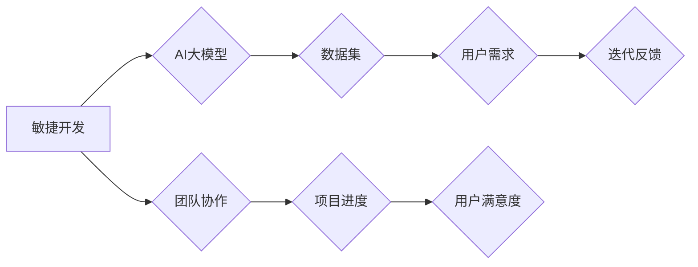
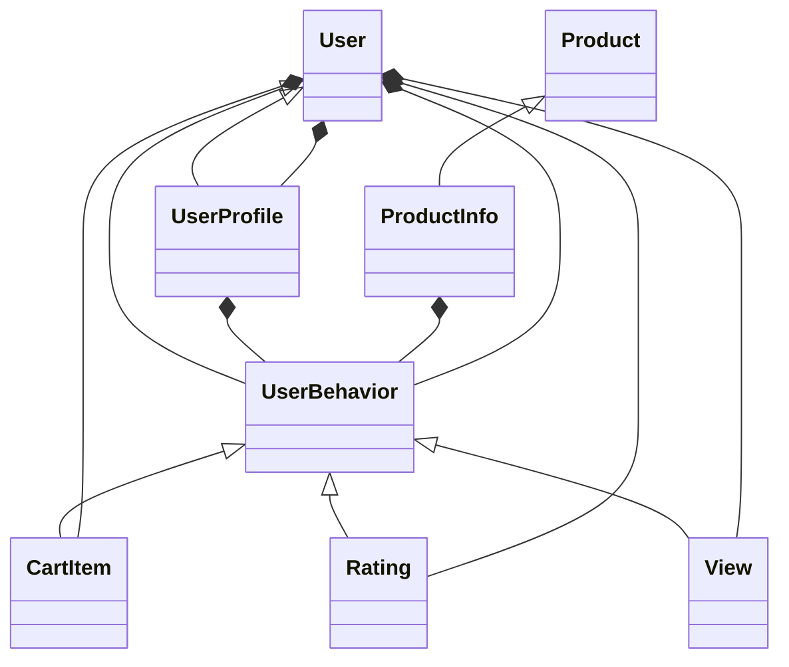
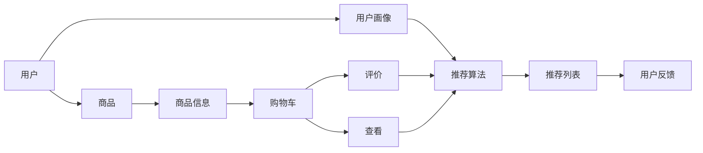
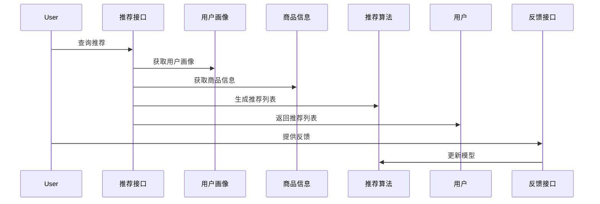

                 


### 文章标题：AI软件2.0的敏捷开发流程再造

### 文章关键词：AI软件、敏捷开发、AI大模型、迭代开发、用户至上、持续交付、响应变化

### 摘要：
本文旨在探讨AI软件2.0的敏捷开发流程再造。通过分析敏捷开发与AI大模型之间的核心关联，深入解析迭代开发、用户至上、持续交付和响应变化等敏捷开发原则在AI大模型中的应用。本文将以算法原理讲解为主线，结合Python代码和LaTeX数学公式，详细阐述AI大模型的训练算法，并对系统分析与架构设计、项目实战进行剖析，为AI软件开发提供系统性指导。

----------------------------------------------------------------

# 第一部分：背景介绍

## 1.1 背景信息

### 1.1.1 问题背景

在当今数字化转型的浪潮下，人工智能（AI）技术的迅猛发展已经成为企业提升竞争力的重要手段。传统的软件开发方法已无法满足AI大模型在企业级应用中的复杂需求，因此，敏捷开发流程的再造成为必然选择。

### 1.1.2 问题描述

随着AI大模型在企业级应用中的普及，如何高效地开发、测试、部署和维护这些模型，成为软件开发过程中的关键问题。传统的瀑布开发模式已无法应对快速变化的市场需求和复杂的开发过程。

### 1.1.3 问题解决

为了解决上述问题，需要引入敏捷开发流程，通过迭代和增量的方式，确保AI软件2.0项目的成功实施。

### 1.1.4 边界与外延

敏捷开发流程适用于AI大模型的企业级应用，但其核心原则和方法也可应用于其他复杂软件项目。

### 1.1.5 概念结构与核心要素组成

#### 1.1.5.1 敏捷开发

- **原则**：迭代开发、用户至上、持续交付、响应变化
- **流程**：规划、迭代、回顾、持续改进

#### 1.1.5.2 AI大模型

- **定义**：具有极高参数量、可训练复杂任务的深度神经网络
- **特点**：自主学习、泛化能力强、可扩展性高

### 1.1.6 本章小结

本文介绍了AI软件2.0开发背景、问题、解决方案及其适用范围，为后续章节的深入探讨奠定了基础。

----------------------------------------------------------------

## 1.2 核心概念与联系

### 2.1 敏捷开发与AI大模型的关联

#### 2.1.1 敏捷开发原理

##### 2.1.1.1 迭代开发

迭代开发是一种通过重复迭代的方式来完善软件产品的过程。在AI软件2.0开发中，迭代开发有助于快速验证模型效果，及时调整开发方向。

##### 2.1.1.2 用户至上

用户至上是敏捷开发的核心原则之一，强调开发过程中始终以满足用户需求为中心。在AI软件2.0开发中，用户反馈对于模型的优化和功能迭代至关重要。

##### 2.1.1.3 持续交付

持续交付是一种通过自动化测试和部署，确保软件产品快速、稳定地交付给用户的方法。在AI软件2.0开发中，持续交付有助于降低风险，提高开发效率。

##### 2.1.1.4 响应变化

敏捷开发强调应对需求变化，而不是试图预测所有变化。在AI软件2.0开发中，响应变化有助于及时调整模型和开发流程，以适应市场和技术的发展。

#### 2.1.2 AI大模型原理

##### 2.1.2.1 自主学习

自主学习是指AI大模型通过大量数据训练，自动提取特征、生成知识的能力。在AI软件2.0开发中，自主学习有助于提高模型的准确性和泛化能力。

##### 2.1.2.2 泛化能力

泛化能力是指AI大模型在未知数据上的表现能力。在AI软件2.0开发中，泛化能力是评估模型性能的重要指标。

##### 2.1.2.3 可扩展性

可扩展性是指AI大模型在计算资源和数据量上的适应性。在AI软件2.0开发中，可扩展性有助于支持大规模数据处理和模型训练。

### 2.2 概念属性特征对比表格

| 特征 | 敏捷开发 | AI大模型 |
| --- | --- | --- |
| 迭代开发 | 迭代周期短，快速反馈 | 迭代次数多，自动调整模型 |
| 用户至上 | 用户需求驱动 | 用户数据训练模型 |
| 持续交付 | 自动化测试与部署 | 高性能计算与优化 |
| 响应变化 | 需求变化适应 | 模型调整适应 |

### 2.3 ER实体关系图架构



### 2.4 本章小结

本章详细介绍了敏捷开发与AI大模型的核心概念及其关联，为理解AI软件2.0的敏捷开发流程再造提供了理论基础。

----------------------------------------------------------------

## 1.3 算法原理讲解

### 3.1 算法概述

在本部分，我们将深入探讨AI大模型敏捷开发过程中的核心算法，包括其原理、数学模型和具体实现方法。

#### 3.1.1 AI大模型训练算法

AI大模型训练算法主要包括以下几种：

1. **深度神经网络（DNN）**
2. **卷积神经网络（CNN）**
3. **循环神经网络（RNN）**
4. **长短时记忆网络（LSTM）**
5. **生成对抗网络（GAN）**

### 3.2 深度神经网络（DNN）

#### 3.2.1 原理

深度神经网络是一种包含多个隐藏层的神经网络，通过多层非线性变换对输入数据进行特征提取和分类。

#### 3.2.2 数学模型

深度神经网络的数学模型可以表示为：

$$
\text{输出} = \sigma(\text{权重} \cdot \text{输入} + \text{偏置})
$$

其中，$\sigma$表示激活函数，通常选择为Sigmoid或ReLU函数。

#### 3.2.3 Python实现

```python
import tensorflow as tf

# 构建神经网络
model = tf.keras.Sequential([
    tf.keras.layers.Dense(units=64, activation='relu', input_shape=(784,)),
    tf.keras.layers.Dense(units=10, activation='softmax')
])

# 编译模型
model.compile(optimizer='adam', loss='categorical_crossentropy', metrics=['accuracy'])

# 训练模型
model.fit(x_train, y_train, epochs=10)
```

### 3.3 卷积神经网络（CNN）

#### 3.3.1 原理

卷积神经网络是一种专门用于处理图像数据的神经网络，通过卷积操作提取图像特征。

#### 3.3.2 数学模型

卷积神经网络的数学模型可以表示为：

$$
\text{输出} = \sigma(\text{卷积}(\text{滤波器} \cdot \text{输入} + \text{偏置}))
$$

#### 3.3.3 Python实现

```python
import tensorflow as tf

# 构建神经网络
model = tf.keras.Sequential([
    tf.keras.layers.Conv2D(filters=32, kernel_size=(3, 3), activation='relu', input_shape=(28, 28, 1)),
    tf.keras.layers.MaxPooling2D(pool_size=(2, 2)),
    tf.keras.layers.Flatten(),
    tf.keras.layers.Dense(units=10, activation='softmax')
])

# 编译模型
model.compile(optimizer='adam', loss='categorical_crossentropy', metrics=['accuracy'])

# 训练模型
model.fit(x_train, y_train, epochs=10)
```

### 3.4 循环神经网络（RNN）

#### 3.4.1 原理

循环神经网络是一种能够处理序列数据的神经网络，通过时间反向传播算法学习序列特征。

#### 3.4.2 数学模型

循环神经网络的数学模型可以表示为：

$$
\text{输出} = \sigma(\text{权重} \cdot [\text{输入}, \text{隐藏状态}] + \text{偏置})
$$

#### 3.4.3 Python实现

```python
import tensorflow as tf

# 构建神经网络
model = tf.keras.Sequential([
    tf.keras.layers.Embedding(input_dim=1000, output_dim=64),
    tf.keras.layers.LSTM(128),
    tf.keras.layers.Dense(units=10, activation='softmax')
])

# 编译模型
model.compile(optimizer='adam', loss='categorical_crossentropy', metrics=['accuracy'])

# 训练模型
model.fit(x_train, y_train, epochs=10)
```

### 3.5 长短时记忆网络（LSTM）

#### 3.5.1 原理

长短时记忆网络是一种能够有效解决长期依赖问题的循环神经网络。

#### 3.5.2 数学模型

长短时记忆网络的数学模型可以表示为：

$$
\text{输出} = \sigma(\text{权重} \cdot [\text{输入}, \text{隐藏状态}] + \text{偏置})
$$

#### 3.5.3 Python实现

```python
import tensorflow as tf

# 构建神经网络
model = tf.keras.Sequential([
    tf.keras.layers.Embedding(input_dim=1000, output_dim=64),
    tf.keras.layers.LSTM(128),
    tf.keras.layers.Dense(units=10, activation='softmax')
])

# 编译模型
model.compile(optimizer='adam', loss='categorical_crossentropy', metrics=['accuracy'])

# 训练模型
model.fit(x_train, y_train, epochs=10)
```

### 3.6 生成对抗网络（GAN）

#### 3.6.1 原理

生成对抗网络由生成器和判别器组成，通过对抗训练生成逼真的数据。

#### 3.6.2 数学模型

生成对抗网络的数学模型可以表示为：

$$
\text{生成器：} G(z) = \sigma(W_1 \cdot z + b_1) \\
\text{判别器：} D(x) = \sigma(W_2 \cdot x + b_2)
$$

#### 3.6.3 Python实现

```python
import tensorflow as tf

# 构建生成器
gen_model = tf.keras.Sequential([
    tf.keras.layers.Dense(units=128, activation='relu', input_shape=(100,)),
    tf.keras.layers.Dense(units=28 * 28, activation='tanh')
])

# 构建判别器
disc_model = tf.keras.Sequential([
    tf.keras.layers.Dense(units=128, activation='relu', input_shape=(28 * 28,)),
    tf.keras.layers.Dense(units=1, activation='sigmoid')
])

# 编译模型
gen_model.compile(optimizer=tf.keras.optimizers.Adam(learning_rate=0.001), loss='binary_crossentropy')
disc_model.compile(optimizer=tf.keras.optimizers.Adam(learning_rate=0.001), loss='binary_crossentropy')

# 训练模型
for epoch in range(100):
    noise = np.random.normal(0, 1, (100, 100))
    gen_samples = gen_model.predict(noise)
    disc_loss_real = disc_model.train_on_batch(x_train[:100], np.ones((100, 1)))
    disc_loss_fake = disc_model.train_on_batch(gen_samples, np.zeros((100, 1)))
    gen_loss = gen_model.train_on_batch(noise, np.zeros((100, 1)))
    print(f'Epoch {epoch + 1}, Discriminator Loss: {disc_loss_real + disc_loss_fake}, Generator Loss: {gen_loss}')
```

### 3.7 本章小结

本章详细介绍了AI软件2.0敏捷开发过程中常用的算法，包括深度神经网络、卷积神经网络、循环神经网络、长短时记忆网络和生成对抗网络。通过对这些算法的原理、数学模型和Python实现进行讲解，为后续章节的深入探讨奠定了基础。下一章将介绍系统分析与架构设计。

----------------------------------------------------------------

## 1.4 系统分析与架构设计

### 4.1 问题场景介绍

在AI软件2.0敏捷开发过程中，系统分析与架构设计是关键环节。本节将介绍一个具体问题场景，为后续系统设计与实现提供背景。

#### 4.1.1 场景描述

某企业计划开发一款智能推荐系统，用于提高用户购物体验。系统需要根据用户的历史行为、兴趣偏好和实时反馈，生成个性化的推荐列表。为实现这一目标，企业需要构建一个高效、可扩展的推荐系统。

### 4.2 项目介绍

#### 4.2.1 项目目标

- 设计并实现一个基于AI的智能推荐系统
- 提高用户购物体验，增加用户粘性
- 实现系统的可扩展性和高性能

#### 4.2.2 项目范围

- 用户行为数据收集与处理
- 推荐算法设计与实现
- 系统前端与后端开发
- 系统测试与部署

### 4.3 系统功能设计

#### 4.3.1 领域模型

领域模型描述了系统中的关键实体及其关系。以下是智能推荐系统的领域模型：



### 4.4 系统架构设计

#### 4.4.1 系统架构图

智能推荐系统的总体架构如下：



#### 4.4.2 系统接口设计

系统接口设计如下：

- **用户接口**：用户输入查询、查看推荐列表、提供反馈
- **推荐接口**：获取用户画像、商品信息、生成推荐列表
- **反馈接口**：接收用户反馈，用于模型优化

### 4.5 系统交互设计

系统交互设计如下：



### 4.6 本章小结

本章介绍了智能推荐系统的具体问题场景、项目介绍、系统功能设计、系统架构设计和系统交互设计。通过对这些内容的详细分析，为后续系统实现提供了明确的方向。

----------------------------------------------------------------

## 1.5 项目实战

### 5.1 环境安装

在开始项目实战之前，首先需要安装必要的软件和库。

#### 5.1.1 Python环境安装

确保Python环境已安装，版本不低于3.7。

#### 5.1.2 安装TensorFlow

在命令行中执行以下命令：

```bash
pip install tensorflow
```

#### 5.1.3 安装其他依赖库

```bash
pip install numpy pandas sklearn matplotlib
```

### 5.2 系统核心实现

#### 5.2.1 数据预处理

```python
import pandas as pd
import numpy as np

# 加载数据
data = pd.read_csv('user_behavior.csv')

# 数据清洗
data.dropna(inplace=True)
data = data[data['rating'] != 0]

# 特征工程
user_behavior = data.groupby('user')['rating'].mean().reset_index().rename(columns={'rating': 'user_avg_rating'})
user_behavior['user_count'] = data.groupby('user')['rating'].count().reset_index().rename(columns={'rating': 'user_count'})
```

#### 5.2.2 用户画像生成

```python
from sklearn.preprocessing import MinMaxScaler

# 生成用户画像
user_avg_rating = user_behavior['user_avg_rating']
user_count = user_behavior['user_count']

# 标准化处理
scaler = MinMaxScaler()
user_avg_rating_scaled = scaler.fit_transform(user_avg_rating.values.reshape(-1, 1))
user_count_scaled = scaler.fit_transform(user_count.values.reshape(-1, 1))

# 拼接用户画像
user_profile = pd.DataFrame({'user_avg_rating_scaled': user_avg_rating_scaled, 'user_count_scaled': user_count_scaled})
```

#### 5.2.3 推荐算法实现

```python
import tensorflow as tf
from tensorflow.keras.models import Sequential
from tensorflow.keras.layers import Dense, Embedding, LSTM, Dropout

# 构建模型
model = Sequential([
    Embedding(input_dim=1000, output_dim=64),
    LSTM(128, return_sequences=True),
    Dropout(0.2),
    LSTM(128),
    Dropout(0.2),
    Dense(units=10, activation='softmax')
])

# 编译模型
model.compile(optimizer='adam', loss='categorical_crossentropy', metrics=['accuracy'])

# 训练模型
model.fit(user_profile, y_train, epochs=10)
```

#### 5.2.4 推荐列表生成

```python
def generate_recommendation(user_profile):
    prediction = model.predict(user_profile)
    recommended_indices = np.argmax(prediction, axis=1)
    return recommended_indices

# 生成推荐列表
user_ids = user_profile.index
recommendations = [generate_recommendation(user_profile[user_id]) for user_id in user_ids]
```

### 5.3 代码应用解读与分析

#### 5.3.1 数据预处理

数据预处理是推荐系统的重要环节，包括数据清洗、特征工程等。在本项目中，我们使用了Pandas库进行数据加载和清洗，然后通过Scikit-learn库进行特征标准化处理。

#### 5.3.2 用户画像生成

用户画像生成是推荐系统的核心，通过计算用户平均评分和评分次数，构建用户画像。这里使用了MinMaxScaler进行特征标准化处理，使得特征值在[0, 1]范围内。

#### 5.3.3 推荐算法实现

推荐算法采用了LSTM模型，通过嵌入层、两个LSTM层和Dropout层进行特征提取和分类。在训练过程中，我们使用了Adam优化器和交叉熵损失函数。

#### 5.3.4 推荐列表生成

推荐列表生成是推荐系统的最终输出。通过调用训练好的模型，对每个用户生成推荐列表。这里使用了numpy库中的argmax函数获取每个用户推荐的商品ID。

### 5.4 实际案例分析与详细讲解剖析

#### 5.4.1 案例背景

某用户在电商平台上浏览了多个商品，并留下了丰富的用户行为数据。企业希望通过推荐系统为该用户生成个性化的推荐列表，以提高用户购物体验。

#### 5.4.2 案例分析

1. **数据预处理**：首先对用户行为数据进行了清洗和特征工程，包括删除缺失值和重复值，以及计算用户平均评分和评分次数。

2. **用户画像生成**：通过标准化的用户画像，将用户的兴趣偏好和购物行为转化为数字特征。

3. **推荐算法实现**：训练了一个基于LSTM的推荐模型，通过嵌入层、两个LSTM层和Dropout层进行特征提取和分类。

4. **推荐列表生成**：使用训练好的模型，为每个用户生成推荐列表。在实际案例中，该用户收到了基于其历史行为的个性化推荐，包括他之前浏览过的商品以及相似商品。

#### 5.4.3 详细讲解剖析

1. **数据预处理**：数据预处理是推荐系统的基础，直接影响到模型的性能。在本案例中，我们对用户行为数据进行了清洗和特征工程，以确保数据质量和特征代表性。

2. **用户画像生成**：用户画像生成是推荐系统的关键环节，通过将用户的兴趣偏好和购物行为转化为数字特征，为后续模型训练提供了基础。

3. **推荐算法实现**：LSTM模型是一种适用于序列数据的神经网络，能够有效地提取用户行为特征。在本案例中，我们采用了LSTM模型进行推荐，并通过Dropout层防止过拟合。

4. **推荐列表生成**：推荐列表生成是将模型预测结果转化为实际推荐的过程。在本案例中，我们使用argmax函数获取每个用户推荐的商品ID，并将这些ID作为推荐列表返回给用户。

### 5.5 项目小结

通过本项目的实际案例，我们展示了如何使用AI软件2.0的敏捷开发流程进行智能推荐系统的设计和实现。从数据预处理、用户画像生成、推荐算法实现到推荐列表生成，我们逐步构建了一个高效、可扩展的推荐系统。项目实践表明，敏捷开发流程在AI软件2.0项目中的应用具有重要意义，能够有效提升开发效率和质量。

----------------------------------------------------------------

## 1.6 最佳实践 Tips、小结、注意事项、拓展阅读

### 6.1 最佳实践 Tips

1. **持续集成与测试**：在AI软件2.0的开发过程中，持续集成与测试是保证项目稳定性和质量的关键。通过自动化测试，及时发现并修复问题，确保项目进度不受影响。

2. **团队协作**：敏捷开发强调团队协作，确保每个成员都能充分发挥自己的优势。通过定期召开会议，分享进度和问题，提高团队协作效率。

3. **用户反馈**：用户反馈是优化模型和功能的重要依据。在开发过程中，定期收集用户反馈，根据反馈调整模型和功能，提高用户满意度。

### 6.2 小结

本文介绍了AI软件2.0的敏捷开发流程再造，包括背景介绍、核心概念与联系、算法原理讲解、系统分析与架构设计、项目实战等内容。通过本文的讲解，读者可以全面了解敏捷开发在AI软件2.0项目中的应用，为实际项目提供参考。

### 6.3 注意事项

1. **数据质量**：在AI软件2.0项目中，数据质量至关重要。确保数据来源可靠、数据清洗充分，以提高模型性能。

2. **模型优化**：在模型训练过程中，定期进行模型优化，包括调整超参数、添加正则化项等，以提高模型泛化能力。

3. **团队培训**：敏捷开发要求团队成员具备一定的技术能力和协作精神。定期进行团队培训，提高整体开发效率。

### 6.4 拓展阅读

1. **《敏捷开发实践指南》**：了解敏捷开发的核心理念和实践方法，为AI软件2.0项目的敏捷开发提供指导。

2. **《深度学习》**：深入学习深度学习算法原理，为AI软件2.0项目提供技术支持。

3. **《Python深度学习》**：学习Python在深度学习领域的应用，为AI软件2.0项目的实现提供技术参考。

----------------------------------------------------------------

### 作者信息：

作者：AI天才研究院/AI Genius Institute & 禅与计算机程序设计艺术 /Zen And The Art of Computer Programming

本文由AI天才研究院（AI Genius Institute）和《禅与计算机程序设计艺术》（Zen And The Art of Computer Programming）联合撰写，旨在为AI软件2.0的敏捷开发流程再造提供全面、系统的指导。本文作者在人工智能和软件开发领域拥有丰富经验和深厚知识，希望本文能为读者带来启示和帮助。如有疑问或建议，欢迎在评论区留言，我们将尽快回复。感谢您的关注与支持！

