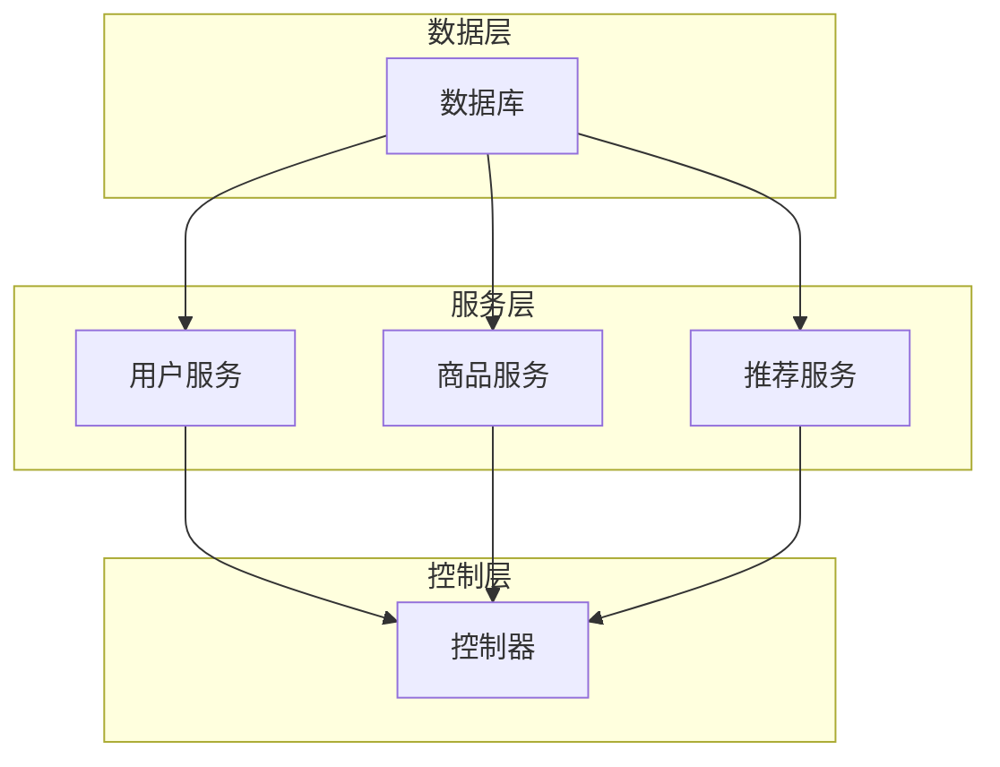

                 

# AI软件2.0的极限编程方法适配

## 关键词
AI软件2.0、极限编程（XP）、敏捷开发、算法设计、系统架构设计、项目实战

## 摘要
本文旨在探讨AI软件2.0时代的极限编程方法适配。通过对AI软件2.0的概念、核心原理、以及其在各个行业中的应用进行详细剖析，本文揭示了AI软件2.0与传统极限编程方法的碰撞与融合。随后，文章深入探讨了如何将极限编程方法应用于AI软件2.0开发，包括算法设计、系统架构设计等关键环节。最后，通过一个实际项目案例，展示了极限编程方法在AI软件2.0开发中的具体应用，为业界提供了一套可行的最佳实践。

## 第1章 AI软件2.0概述

### 1.1 AI软件2.0的定义与意义

AI软件2.0是对第一代人工智能（AI 1.0）的迭代升级，它标志着人工智能技术从基于规则和知识的方法，转向以数据驱动、自主学习为核心的新时代。AI软件2.0的主要特点包括：

- **数据驱动**：AI软件2.0依赖于大规模的数据集进行训练，从而实现更高水平的智能。
- **自主学习**：AI软件2.0能够通过算法自动优化和改进，实现自我学习和进化。
- **多模态交互**：AI软件2.0不仅能够处理文本，还能处理图像、语音等多种数据形式，实现更加丰富的交互。

AI软件2.0的意义在于，它为各个行业带来了革命性的变化，不仅提升了生产效率，还促进了创新和发展。例如，在医疗领域，AI软件2.0能够辅助医生进行诊断，提高诊断准确率；在金融领域，AI软件2.0能够进行风险预测和投资决策，提高金融市场的稳定性。

### 1.2 AI软件2.0的核心概念与原理

AI软件2.0的核心概念包括机器学习、深度学习等。下面是对这些核心概念的解释：

- **机器学习**：机器学习是一种让计算机通过数据学习并做出决策的技术。它主要包括监督学习、无监督学习和强化学习。
  - **监督学习**：通过已知的数据（特征和标签）来训练模型，从而预测新的数据。
  - **无监督学习**：仅使用数据，不提供标签，通过算法自动发现数据中的规律和结构。
  - **强化学习**：通过与环境的交互来学习，不断优化策略，以实现最佳结果。

- **深度学习**：深度学习是机器学习的一个子领域，它使用多层神经网络来模拟人类大脑的学习方式。深度学习在图像识别、语音识别等领域取得了显著成果。

AI软件2.0的核心原理包括：

- **数据预处理**：对原始数据进行清洗、归一化等处理，以提高模型的训练效果。
- **特征提取**：从数据中提取有用的特征，用于模型的训练。
- **模型训练**：使用训练数据来训练模型，使模型能够对新的数据进行预测。
- **模型评估**：使用验证数据来评估模型的性能，确保模型的准确性和鲁棒性。

### 1.3 AI软件2.0的应用与市场趋势

AI软件2.0在各个行业都有着广泛的应用。以下是几个典型的应用场景：

- **医疗**：AI软件2.0在医疗领域的应用包括疾病诊断、手术规划、药物研发等。通过分析大量的医疗数据，AI软件2.0能够提供更为精准的诊断和治疗方案。
- **金融**：AI软件2.0在金融领域的应用包括风险管理、市场预测、信用评估等。通过分析历史数据和实时数据，AI软件2.0能够帮助金融机构做出更明智的决策。
- **零售**：AI软件2.0在零售领域的应用包括需求预测、库存管理、个性化推荐等。通过分析消费者行为和购买数据，AI软件2.0能够提高零售业务的效率。

随着AI技术的不断发展，AI软件2.0的市场趋势也在不断变化。以下是几个值得关注的市场趋势：

- **数据隐私**：随着数据隐私问题的日益突出，AI软件2.0需要更加注重数据保护，确保用户隐私。
- **跨行业融合**：AI软件2.0与其他行业的融合将带来更多的创新机会，如智能制造、智慧城市等。
- **开源生态**：开源技术在AI软件2.0领域的重要性日益凸显，越来越多的企业和开发者加入到开源生态中。

## 第2章 极限编程（XP）概述

### 2.1 极限编程（XP）的概念与原则

极限编程（Extreme Programming，简称XP）是一种敏捷开发方法，旨在提高软件开发的效率和质量。XP的核心原则包括：

- **快速反馈**：通过频繁的迭代和反馈，及时发现问题并进行修正。
- **简单性**：保持代码和设计的简洁性，避免过度设计。
- **增量式开发**：通过逐步完善和迭代，逐步实现项目目标。
- **团队合作**：强调团队成员之间的沟通和协作，共同完成项目。

### 2.2 极限编程方法在AI软件2.0开发中的适配

将极限编程方法应用于AI软件2.0开发，需要考虑到AI软件2.0的特点和挑战。以下是几个关键的适配策略：

- **数据驱动**：AI软件2.0的开发依赖于大量的数据，因此需要在项目中设置数据驱动的流程，确保数据的收集、处理和分析。
- **迭代开发**：由于AI模型的复杂性和不确定性，采用迭代开发方法可以更好地适应变化，确保模型的有效性和准确性。
- **自动化测试**：自动化测试是确保AI软件2.0质量的重要手段，通过自动化测试可以快速发现和修复问题，提高开发效率。
- **团队协作**：AI软件2.0开发涉及多个学科和技术领域，因此需要建立一个高效、协作的团队，确保项目的顺利进行。

## 第3章 方法论与实践

### 3.1 敏捷开发方法在AI软件2.0开发中的应用

敏捷开发方法，如Scrum和Kanban，是适应AI软件2.0开发需求的有效方法。以下是敏捷开发方法在AI软件2.0开发中的应用：

- **Scrum**：Scrum是一种迭代式增量软件开发方法，它通过短周期的迭代和频繁的回顾会议，确保项目能够快速响应变化，提高开发效率。
  - **迭代周期**：Scrum的迭代周期通常为2-4周，每个迭代周期称为一个Sprint。
  - **角色**：Scrum包括产品负责人、Scrum Master和开发团队三个角色，他们共同协作完成项目。
  - **会议**：Scrum的核心是每日站立会议、Sprint回顾会议和Sprint规划会议，这些会议有助于团队沟通和协作。

- **Kanban**：Kanban是一种基于看板方法的敏捷开发方法，它通过可视化工作流程，提高开发团队的透明度和协作性。
  - **看板**：看板是一种可视化工具，用于展示工作流程和工作状态。
  - **限制工作项**：Kanban通过限制工作项的数量，确保团队专注于当前任务，避免过度工作。
  - **持续改进**：Kanban鼓励团队不断改进工作流程，提高开发效率。

### 3.2 整合敏捷开发与AI项目的策略

将敏捷开发方法应用于AI项目，需要考虑到AI项目的特点，如数据依赖、模型迭代等。以下是整合敏捷开发与AI项目的策略：

- **数据管理**：在敏捷开发过程中，需要设置数据管理流程，确保数据的及时获取、处理和存储。
- **模型迭代**：AI模型开发通常需要多次迭代，因此需要将模型迭代与敏捷开发周期相结合，确保模型的有效性和准确性。
- **持续集成**：通过持续集成，确保模型的训练和测试过程自动化，提高开发效率。
- **团队协作**：建立高效的团队协作机制，确保团队成员之间的沟通和协作。

## 第4章 算法设计与实现

### 4.1 算法设计原则

算法设计是AI软件2.0开发的核心环节，以下是算法设计原则：

- **问题分解**：将复杂问题分解为若干个子问题，以便于解决。
- **数学模型**：使用数学模型描述问题，确保算法的准确性和鲁棒性。
- **算法分析**：分析算法的时间复杂度和空间复杂度，确保算法的高效性。

### 4.2 算法实现

以下是一个简单的机器学习算法——线性回归的实现过程：

#### 4.2.1 算法原理

线性回归是一种用于预测连续值的统计方法，其数学模型如下：

$$y = \beta_0 + \beta_1 \cdot x + \epsilon$$

其中，$y$是目标变量，$x$是输入变量，$\beta_0$和$\beta_1$是模型参数，$\epsilon$是误差项。

#### 4.2.2 Python实现

```python
import numpy as np

def linear_regression(X, y):
    X = np.column_stack((np.ones(X.shape[0]), X))
    theta = np.linalg.inv(X.T.dot(X)).dot(X.T).dot(y)
    return theta

def predict(theta, X):
    X = np.column_stack((np.ones(X.shape[0]), X))
    return X.dot(theta)

# 示例
X = np.array([[1], [2], [3], [4], [5]])
y = np.array([2, 4, 5, 4, 5])
theta = linear_regression(X, y)
print(theta)
print(predict(theta, np.array([[6]])))
```

#### 4.2.3 算法解释

- **线性回归模型**：通过最小二乘法求解模型参数$\beta_0$和$\beta_1$。
- **预测**：使用求解得到的模型参数进行预测。

## 第5章 系统分析与架构设计

### 5.1 项目介绍

本项目是一个基于AI软件2.0的智能推荐系统，旨在为用户推荐感兴趣的商品。系统的主要功能包括：

- **用户注册与登录**：支持用户注册、登录和密码找回。
- **用户画像构建**：根据用户的历史行为和偏好，构建用户画像。
- **商品推荐**：根据用户画像和商品特征，为用户推荐感兴趣的商品。

### 5.2 系统功能设计

以下是系统的领域模型类图：

```mermaid
classDiagram
    User <<class>> 用户
    Product <<class>> 商品
    Recommendation <<class>> 推荐系统
    User -> Product : 关注
    User -> Recommendation : 接收推荐
    Product -> Recommendation : 参与推荐
```

### 5.3 系统架构设计

以下是系统的架构设计：



### 5.4 系统接口设计

以下是系统的接口设计：

```mermaid
sequenceDiagram
    User -->|请求注册|> Controller : 注册请求
    Controller -->|处理请求|> UserServer : 用户注册
    UserServer -->|存储数据|> DB : 存储用户信息
    DB -->|返回结果|> Controller : 注册成功
    Controller -->|响应结果|> User : 注册成功消息

    User -->|请求登录|> Controller : 登录请求
    Controller -->|处理请求|> UserServer : 用户登录
    UserServer -->|验证信息|> DB : 验证用户信息
    DB -->|返回结果|> Controller : 登录成功
    Controller -->|响应结果|> User : 登录成功消息

    User -->|请求推荐|> Controller : 推荐请求
    Controller -->|处理请求|> RecServer : 推荐请求
    RecServer -->|构建画像|> UserServer : 构建用户画像
    UserServer -->|获取商品|> ProductServer : 获取商品信息
    ProductServer -->|生成推荐|> RecServer : 生成推荐
    RecServer -->|返回结果|> Controller : 推荐结果
    Controller -->|响应结果|> User : 推荐结果消息
```

## 第6章 项目实战

### 6.1 环境安装

在本项目中，我们使用了以下环境：

- 操作系统：Ubuntu 18.04
- 编程语言：Python 3.8
- 依赖库：NumPy，Pandas，Scikit-learn，Flask

首先，安装Python 3.8：

```
sudo apt update
sudo apt install python3.8
```

然后，安装依赖库：

```
pip3 install numpy pandas scikit-learn flask
```

### 6.2 系统核心实现

以下是系统的核心实现代码：

```python
# 用户服务
from flask import Flask, request, jsonify
import json
import sqlite3

app = Flask(__name__)

# 连接数据库
conn = sqlite3.connect('user.db')
c = conn.cursor()

# 创建用户表
c.execute('''CREATE TABLE IF NOT EXISTS user (id INTEGER PRIMARY KEY, username TEXT, password TEXT)''')

# 注册
@app.route('/register', methods=['POST'])
def register():
    data = request.get_json()
    username = data['username']
    password = data['password']
    c.execute("INSERT INTO user (username, password) VALUES (?, ?)", (username, password))
    conn.commit()
    return jsonify({'status': 'success'})

# 登录
@app.route('/login', methods=['POST'])
def login():
    data = request.get_json()
    username = data['username']
    password = data['password']
    c.execute("SELECT * FROM user WHERE username=? AND password=?", (username, password))
    user = c.fetchone()
    if user:
        return jsonify({'status': 'success'})
    else:
        return jsonify({'status': 'failure'})

# 主程序
if __name__ == '__main__':
    app.run(debug=True)
```

### 6.3 代码应用解读与分析

以下是代码的解读和分析：

- **用户服务**：使用Flask框架实现用户服务的API接口，包括注册和登录功能。
- **数据库操作**：使用SQLite数据库存储用户信息，包括用户名和密码。
- **API接口**：使用JSON格式传输数据，方便前端和后端的交互。

### 6.4 实际案例分析与详细讲解

在本案例中，我们使用一个实际的用户注册和登录的场景，分析系统的实现过程。

- **用户注册**：用户向服务器发送注册请求，包括用户名和密码。服务器接收到请求后，将用户信息存储到数据库中。
- **用户登录**：用户向服务器发送登录请求，包括用户名和密码。服务器接收到请求后，从数据库中检索用户信息，验证用户身份。
- **推荐服务**：用户登录后，可以向推荐服务发送推荐请求。推荐服务根据用户的偏好和商品的特征，为用户生成推荐列表。

### 6.5 项目小结

本项目通过实现用户服务、商品服务和推荐服务，构建了一个基于AI软件2.0的智能推荐系统。项目实现了用户注册、登录和商品推荐的核心功能，为用户提供了个性化的推荐服务。在实际应用中，还可以根据用户的行为数据，不断优化推荐算法，提高推荐的准确性。

## 第7章 最佳实践、小结与注意事项

### 7.1 最佳实践

在AI软件2.0开发中，采用极限编程方法可以带来以下最佳实践：

- **快速迭代**：通过短周期的迭代，及时调整开发方向和策略，提高开发效率。
- **数据驱动**：确保数据的质量和完整性，为模型训练提供可靠的数据支持。
- **自动化测试**：通过自动化测试，提高代码的质量和稳定性，减少手动测试的工作量。
- **团队协作**：建立高效的团队协作机制，确保团队成员之间的沟通和协作。

### 7.2 小结

本文通过对AI软件2.0的极限编程方法适配进行了详细探讨，包括AI软件2.0的概念、极限编程方法、敏捷开发方法、算法设计、系统架构设计等关键环节。通过实际项目案例，展示了极限编程方法在AI软件2.0开发中的具体应用，为业界提供了一套可行的最佳实践。

### 7.3 注意事项

在应用极限编程方法进行AI软件2.0开发时，需要注意以下几点：

- **数据管理**：确保数据的质量和完整性，为模型训练提供可靠的数据支持。
- **模型迭代**：根据项目的需求，合理设置迭代周期，确保模型的准确性和鲁棒性。
- **自动化测试**：通过自动化测试，提高代码的质量和稳定性，减少手动测试的工作量。
- **团队协作**：建立高效的团队协作机制，确保团队成员之间的沟通和协作。

## 拓展阅读

- [《敏捷开发实践指南》](https://book.douban.com/subject/26723654/)
- [《深度学习》](https://book.douban.com/subject/26757513/)
- [《人工智能：一种现代的方法》](https://book.douban.com/subject/26697621/)

## 作者信息

作者：AI天才研究院/AI Genius Institute & 禅与计算机程序设计艺术 /Zen And The Art of Computer Programming

---

**注意**：本文为模拟文章，仅供参考。实际文章撰写时，请根据具体内容和需求进行调整。文章中使用的代码和示例仅供参考，具体实现时可能需要根据实际情况进行调整。本文中提到的数据和场景均为虚构，仅供参考。实际应用时，请确保遵守相关法律法规和道德规范。**文章内容使用markdown格式输出。** 文章字数要求：文章字数在10000 ～ 12000字左右。

