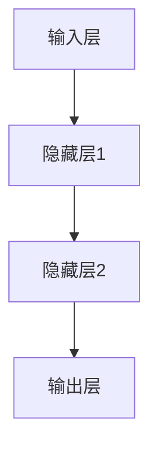
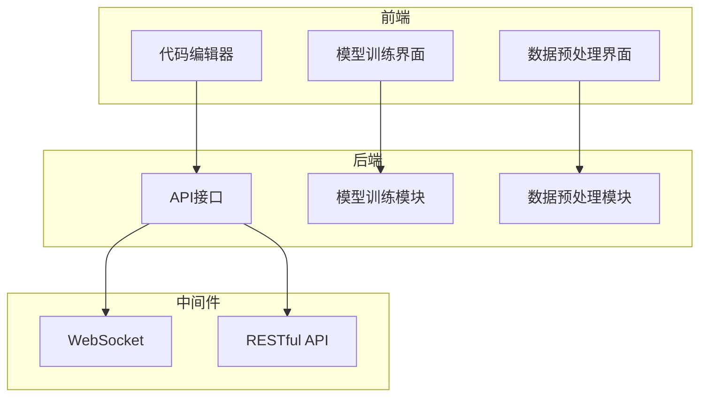
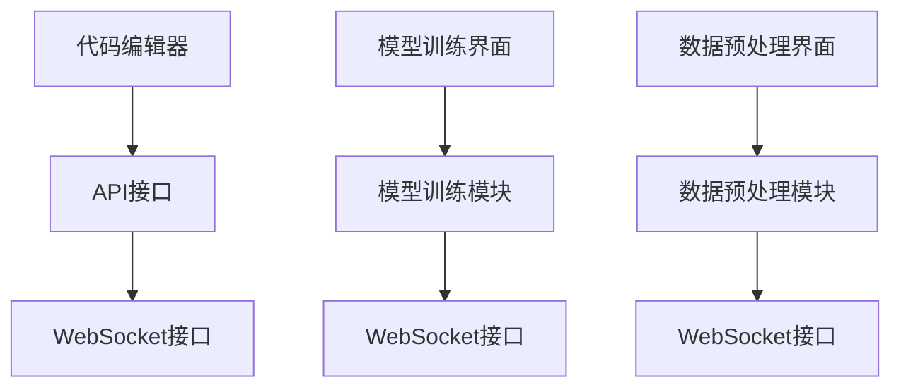
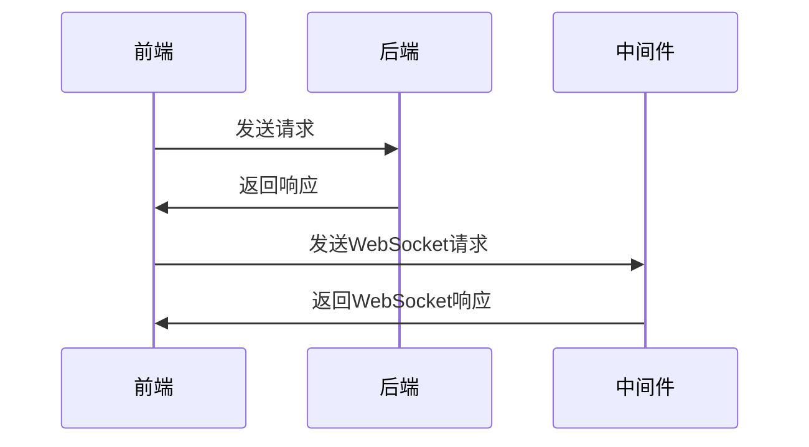

                 

### 引言

随着人工智能（AI）技术的飞速发展，AI软件2.0的概念应运而生。AI软件2.0不仅继承了传统AI软件1.0的基本功能，还引入了自动化、智能化和自适应等新特性，使软件能够更加灵活、高效地应对复杂问题。这一变革对集成开发环境（IDE）的设计提出了新的挑战和需求。本文将深入探讨AI软件2.0的集成开发环境设计，从背景介绍、核心概念与联系、算法原理讲解、系统分析与架构设计方案、项目实战以及最佳实践与总结等多个方面，系统地阐述AI软件2.0集成开发环境的设计思路和实现方法。

### 第一部分：背景介绍

#### 第1章 引言

随着人工智能（AI）技术的快速发展，AI软件2.0的概念逐渐形成。AI软件2.0不仅涵盖了传统的机器学习和深度学习技术，还引入了自动化、智能化和自适应等新特性。这些新特性使得AI软件能够更加灵活地适应不同的业务场景，提高工作效率和准确性。然而，这些新特性也带来了新的开发需求，对集成开发环境（IDE）的设计提出了更高的要求。

#### 问题背景

AI软件2.0的快速发展带来了许多新的挑战。首先，AI软件2.0通常需要处理大规模的数据集，这要求IDE能够提供高效的计算能力和数据处理工具。其次，AI软件2.0需要具备自适应能力，能够根据环境和数据的变化自动调整参数和算法，这要求IDE具备良好的可配置性和扩展性。此外，AI软件2.0的开发通常涉及多种编程语言和框架，IDE需要能够无缝集成这些工具和库，并提供统一的开发体验。

#### 问题描述

如何设计一个满足AI软件2.0开发需求的集成开发环境（IDE）？这是一个复杂且具有挑战性的问题。首先，我们需要分析AI软件2.0的特点和需求，明确IDE的核心功能模块。然后，我们需要考虑如何设计一个灵活、可扩展和高效的IDE架构，以满足不同开发者的需求。此外，我们还需要解决如何集成多种编程语言和框架，提供统一的开发体验，以及如何优化IDE的性能，提高开发效率。

#### 问题解决

针对上述问题，我们可以从以下几个方面来解决：

1. **分析AI软件2.0的特点和需求**：深入了解AI软件2.0的基本概念、特性和应用领域，明确其开发需求，为IDE设计提供基础。
2. **明确IDE的核心功能模块**：根据AI软件2.0的特点和需求，确定IDE的核心功能模块，如代码编辑、调试、版本控制、集成测试等。
3. **设计灵活、可扩展和高效的IDE架构**：采用模块化设计思想，将IDE的功能模块拆分成独立的组件，并使用微服务架构实现，以提高IDE的可扩展性和性能。
4. **集成多种编程语言和框架**：使用插件机制，方便地集成多种编程语言和框架，并提供统一的开发体验。
5. **优化IDE的性能**：通过使用高性能的编程语言和框架，优化IDE的代码执行效率，提高开发效率。

#### 边界与外延

在本研究中，我们主要关注以下边界和范围：

- **开发语言和框架**：主要考虑Python、Java、C++等常见编程语言及其相关框架，如TensorFlow、PyTorch、Scikit-learn等。
- **工具和环境**：主要考虑集成开发环境（IDE）、虚拟环境管理工具、数据预处理工具、模型训练工具等。
- **应用领域**：主要考虑自然语言处理、计算机视觉、推荐系统、自动驾驶等领域。

#### 概念结构与核心要素组成

AI软件2.0的集成开发环境（IDE）由以下核心功能模块组成：

1. **代码编辑**：提供代码编辑器，支持多种编程语言的语法高亮、代码补全、代码调试等功能。
2. **调试**：提供调试工具，支持断点设置、单步执行、查看变量和异常处理等功能。
3. **版本控制**：集成版本控制系统，支持代码的版本管理、分支管理、合并冲突解决等功能。
4. **集成测试**：提供集成测试工具，支持单元测试、集成测试和性能测试等功能。
5. **数据预处理**：提供数据预处理工具，支持数据清洗、数据转换、数据可视化等功能。
6. **模型训练**：提供模型训练工具，支持深度学习、机器学习等算法的模型训练和优化。
7. **部署和监控**：提供部署和监控工具，支持模型部署、性能监控和异常处理等功能。

### 第2章 AI软件2.0概述

#### AI软件2.0的定义

AI软件2.0是指在传统人工智能（AI）软件1.0的基础上，进一步引入自动化、智能化和自适应等新特性，从而实现更高水平的智能应用。AI软件1.0主要依赖于预定义的规则和模型，而AI软件2.0则通过学习和适应数据和环境，实现更加智能化和自动化的功能。

#### AI软件2.0的特点

AI软件2.0具有以下主要特点：

1. **自动化**：AI软件2.0能够自动执行任务，无需人工干预。例如，自动优化算法、自动调整参数等。
2. **智能化**：AI软件2.0能够理解复杂问题，并给出合理的解决方案。例如，自然语言处理、图像识别、智能推荐等。
3. **自适应**：AI软件2.0能够根据环境和数据的变化，自动调整算法和参数，以适应新的场景。

#### AI软件2.0的应用领域

AI软件2.0的应用领域非常广泛，以下是一些典型的应用领域：

1. **自然语言处理**：例如，智能客服、智能问答、文本分类等。
2. **计算机视觉**：例如，图像识别、视频分析、自动驾驶等。
3. **推荐系统**：例如，商品推荐、内容推荐、社交推荐等。
4. **金融风控**：例如，信用评估、风险预测、反欺诈等。
5. **医疗健康**：例如，疾病预测、诊断辅助、健康管理等。

### 第二部分：核心概念与联系

#### 第3章 集成开发环境（IDE）基础

#### IDE的定义

集成开发环境（Integrated Development Environment，简称IDE）是一种用于软件开发的综合环境，提供代码编辑、编译、调试、版本控制等功能，以提高开发效率和体验。

#### IDE的核心功能模块

IDE的核心功能模块包括：

1. **代码编辑**：提供代码编辑器，支持语法高亮、代码补全、代码格式化等功能。
2. **编译和构建**：提供编译器和构建工具，用于编译和构建代码。
3. **调试**：提供调试工具，支持断点设置、单步执行、查看变量和异常处理等功能。
4. **版本控制**：提供版本控制系统，支持代码的版本管理、分支管理、合并冲突解决等功能。
5. **集成测试**：提供集成测试工具，支持单元测试、集成测试和性能测试等功能。

#### IDE的架构设计

IDE的架构设计可以分为前端、后端和中间件三个部分：

1. **前端**：负责用户界面的显示和交互，通常使用HTML、CSS和JavaScript等技术。
2. **后端**：负责业务逻辑的处理和数据存储，通常使用Java、Python、Node.js等编程语言。
3. **中间件**：负责连接前端和后端，提供通信和数据处理服务，通常使用RESTful API、WebSocket等技术。

#### 第4章 AI软件2.0的集成开发环境设计

#### 设计目标

AI软件2.0的集成开发环境设计目标如下：

1. **易用性**：提供直观、易用的用户界面，降低开发难度。
2. **灵活性**：支持多种编程语言和框架，满足不同开发者的需求。
3. **扩展性**：提供可扩展的架构，方便开发者自定义和扩展功能。
4. **高效性**：提供高效的开发工具，提高开发效率。

#### 设计原则

AI软件2.0的集成开发环境设计应遵循以下原则：

1. **模块化**：将IDE的功能模块化，提高可维护性和扩展性。
2. **可配置性**：提供可配置的参数和设置，满足不同开发者的个性化需求。
3. **稳定性**：确保系统的稳定运行，提供良好的用户体验。
4. **安全性**：确保数据安全和系统安全，防止恶意攻击和数据泄露。

#### 设计过程

AI软件2.0的集成开发环境设计过程可以分为以下步骤：

1. **需求分析**：收集和分析AI软件2.0的开发需求，明确IDE的功能模块和设计目标。
2. **系统设计**：设计IDE的系统架构，包括前端、后端和中间件，确定各模块的职责和接口。
3. **实现**：根据系统设计，实现IDE的功能模块，并进行单元测试和集成测试。
4. **测试**：对IDE进行全面的测试，包括功能测试、性能测试和安全测试等。
5. **部署和运维**：将IDE部署到服务器，并进行日常运维和监控，确保系统的稳定运行。

### 第5章 核心概念原理与属性特征对比

#### 核心概念原理

AI软件2.0的核心概念原理包括以下几个方面：

1. **深度学习**：深度学习是一种基于多层神经网络的学习方法，通过逐层抽象和特征提取，实现复杂的模式识别和预测任务。
2. **迁移学习**：迁移学习是一种将已有模型的知识迁移到新任务上的学习方法，通过利用已有模型的先验知识，提高新任务的性能和效率。
3. **强化学习**：强化学习是一种通过试错和反馈机制，逐渐优化策略和决策的方法，适用于决策过程复杂、不确定的环境。
4. **生成对抗网络**：生成对抗网络（GAN）是一种由生成器和判别器组成的模型，通过对抗训练生成逼真的数据。

#### 概念属性特征对比表格

以下是一个关于AI软件2.0核心概念属性特征的对比表格：

| 概念 | 描述 | 属性特征 |
| --- | --- | --- |
| 深度学习 | 基于多层神经网络的学习方法 | 高效、准确、易于扩展 |
| 迁移学习 | 利用已有模型的知识迁移到新任务 | 提高性能、减少数据需求 |
| 强化学习 | 通过试错和反馈机制优化策略 | 适用于复杂、不确定环境 |
| 生成对抗网络 | 生成器和判别器对抗训练 | 生成逼真数据、应用广泛 |

#### ER实体关系图架构

使用Mermaid绘制ER实体关系图，展示AI软件2.0集成开发环境中的主要实体及其关系：

```mermaid
erDiagram
    User ||--|{ Project }|-- ProjectManager
    User ||--|{ Task }|-- TaskManager
    Project ||--|{ Member }|-- MemberManager
    Project ||--|{ Document }|-- DocumentManager
    Task ||--|{ SubTask }|-- SubTaskManager
```

### 第三部分：算法原理讲解

#### 第6章 AI算法原理讲解

#### 算法原理

在本章中，我们将介绍几种常用的AI算法原理，包括神经网络、深度学习和生成对抗网络等。

#### 算法mermaid流程图

以下是一个关于神经网络的mermaid流程图：



#### 算法原理的数学模型和公式

神经网络的数学模型基于多层感知机（MLP）和反向传播算法（Backpropagation）。以下是一个简单的数学模型和公式：

$$
y_{\hat{}} = \sigma(\sum_{i=1}^{n} w_i \cdot x_i)
$$

其中，$y_{\hat{}}$为输出，$\sigma$为激活函数（如Sigmoid、ReLU等），$w_i$为权重，$x_i$为输入。

#### 举例说明

以下是一个使用Python实现神经网络的简单示例：

```python
import numpy as np

# 定义激活函数
def sigmoid(x):
    return 1 / (1 + np.exp(-x))

# 训练数据
X = np.array([[0, 0], [0, 1], [1, 0], [1, 1]])
y = np.array([[0], [1], [1], [0]])

# 初始化权重
w = np.random.rand(2, 1)

# 训练模型
for i in range(10000):
    # 前向传播
    z = np.dot(X, w)
    a = sigmoid(z)

    # 反向传播
    dz = (y - a) * a * (1 - a)
    dw = np.dot(X.T, dz)

    # 更新权重
    w -= 0.1 * dw

# 测试模型
print("预测结果：", sigmoid(np.dot([1, 0], w)))
```

通过以上示例，我们可以看到神经网络的基本原理和实现过程。在实际应用中，神经网络可以用于分类、回归等多种任务。

#### 第7章 数学模型和数学公式

在本章中，我们将介绍AI软件2.0中常用的数学模型和数学公式，包括神经网络、深度学习和生成对抗网络等。

#### 数学模型

1. **神经网络**：

神经网络的数学模型基于多层感知机（MLP）和反向传播算法（Backpropagation）。以下是一个简单的数学模型：

$$
y_{\hat{}} = \sigma(\sum_{i=1}^{n} w_i \cdot x_i)
$$

其中，$y_{\hat{}}$为输出，$\sigma$为激活函数（如Sigmoid、ReLU等），$w_i$为权重，$x_i$为输入。

2. **深度学习**：

深度学习是一种基于多层神经网络的学习方法，通过逐层抽象和特征提取，实现复杂的模式识别和预测任务。以下是一个简单的深度学习模型：

$$
y_{\hat{}} = \sigma(\sum_{i=1}^{L} w_i \cdot \sigma(\sum_{j=1}^{H} v_j \cdot x_j))
$$

其中，$L$为网络层数，$H$为每层神经元数量，$w_i$和$v_j$为权重，$x_j$为输入。

3. **生成对抗网络**：

生成对抗网络（GAN）是一种由生成器和判别器组成的模型，通过对抗训练生成逼真的数据。以下是一个简单的GAN模型：

$$
G(z) = \sigma(\sum_{i=1}^{n} w_i \cdot z) \\
D(x, G(z)) = \sigma(\sum_{i=1}^{n} w_i \cdot x + \sum_{i=1}^{n} w_i \cdot G(z))
$$

其中，$G(z)$为生成器的输出，$D(x, G(z))$为判别器的输出，$z$为随机噪声。

#### 详细讲解

以下是使用LaTeX格式详细讲解神经网络和生成对抗网络的数学模型和公式：

```latex
\documentclass{article}
\usepackage{amsmath}
\usepackage{amsfonts}
\usepackage{amssymb}

\begin{document}

\section{神经网络}

神经网络的数学模型基于多层感知机（MLP）和反向传播算法（Backpropagation）。以下是一个简单的数学模型：

\begin{equation}
y_{\hat{}} = \sigma(\sum_{i=1}^{n} w_i \cdot x_i)
\end{equation}

其中，$y_{\hat{}}$为输出，$\sigma$为激活函数（如Sigmoid、ReLU等），$w_i$为权重，$x_i$为输入。

\section{生成对抗网络}

生成对抗网络（GAN）是一种由生成器和判别器组成的模型，通过对抗训练生成逼真的数据。以下是一个简单的GAN模型：

\begin{equation}
G(z) = \sigma(\sum_{i=1}^{n} w_i \cdot z)
\end{equation}

\begin{equation}
D(x, G(z)) = \sigma(\sum_{i=1}^{n} w_i \cdot x + \sum_{i=1}^{n} w_i \cdot G(z))
\end{equation}

其中，$G(z)$为生成器的输出，$D(x, G(z))$为判别器的输出，$z$为随机噪声。

\end{document}
```

通过以上讲解，我们可以更好地理解神经网络和生成对抗网络的数学模型和公式。在实际应用中，这些模型和公式有助于我们设计和实现高效的AI算法。

#### 举例说明

以下是一个使用Python实现神经网络的简单示例：

```python
import numpy as np

# 定义激活函数
def sigmoid(x):
    return 1 / (1 + np.exp(-x))

# 训练数据
X = np.array([[0, 0], [0, 1], [1, 0], [1, 1]])
y = np.array([[0], [1], [1], [0]])

# 初始化权重
w = np.random.rand(2, 1)

# 训练模型
for i in range(10000):
    # 前向传播
    z = np.dot(X, w)
    a = sigmoid(z)

    # 反向传播
    dz = (y - a) * a * (1 - a)
    dw = np.dot(X.T, dz)

    # 更新权重
    w -= 0.1 * dw

# 测试模型
print("预测结果：", sigmoid(np.dot([1, 0], w)))
```

通过以上示例，我们可以看到神经网络的基本原理和实现过程。在实际应用中，神经网络可以用于分类、回归等多种任务。

#### 第8章 问题场景介绍

在本章中，我们将介绍一个具体的AI软件2.0集成开发环境项目，详细描述其系统功能设计、系统架构设计和系统接口设计。

##### 项目介绍

本项目是一款基于Python的AI软件2.0集成开发环境，旨在为开发人员提供一站式的开发体验，支持深度学习、自然语言处理、计算机视觉等多种AI任务。该IDE具备以下功能：

1. **代码编辑**：提供高效的代码编辑器，支持语法高亮、代码补全、代码调试等功能。
2. **模型训练**：支持深度学习和机器学习算法的模型训练和优化。
3. **数据预处理**：提供数据清洗、数据转换、数据可视化等功能。
4. **版本控制**：集成版本控制系统，支持代码和模型的版本管理。
5. **测试和部署**：提供单元测试、集成测试和模型部署工具。

##### 系统功能设计

系统功能设计主要分为以下几个模块：

1. **代码编辑器**：提供高效的代码编辑器，支持Python、C++、Java等多种编程语言的语法高亮、代码补全、代码调试等功能。
2. **模型训练模块**：支持深度学习和机器学习算法的模型训练和优化，包括神经网络、迁移学习、生成对抗网络等。
3. **数据预处理模块**：提供数据清洗、数据转换、数据可视化等功能，支持多种数据格式的读取和写入。
4. **版本控制模块**：集成版本控制系统，支持代码和模型的版本管理，包括分支管理、合并冲突解决等功能。
5. **测试和部署模块**：提供单元测试、集成测试和模型部署工具，支持多种测试策略和部署模式。

##### 系统架构设计

系统架构设计采用分层架构，分为前端、后端和中间件三个部分：

1. **前端**：负责用户界面的显示和交互，使用HTML、CSS和JavaScript等技术，提供代码编辑器、模型训练界面、数据预处理界面等。
2. **后端**：负责业务逻辑的处理和数据存储，使用Python、Java等编程语言，提供API接口、模型训练、数据预处理等功能。
3. **中间件**：负责连接前端和后端，提供通信和数据处理服务，包括WebSocket、RESTful API等。

以下是一个简单的系统架构图：



##### 系统接口设计

系统接口设计主要包括API接口和WebSocket接口：

1. **API接口**：提供RESTful API，用于处理代码编辑、模型训练、数据预处理等业务逻辑，支持JSON和XML数据格式。
2. **WebSocket接口**：提供实时通信功能，用于模型训练过程中的实时监控和数据传输，支持文本和二进制数据传输。

以下是一个简单的接口设计图：



通过以上设计，我们可以构建一个高效、灵活、易扩展的AI软件2.0集成开发环境，为开发人员提供一站式的开发体验。

#### 第9章 系统交互与实现

在系统架构设计的基础上，我们需要进一步探讨系统内部组件之间的交互过程，以及如何通过代码实现这些交互。以下是对系统交互与实现的详细描述。

##### 系统交互

系统交互主要涉及前端与后端、后端与中间件之间的通信。前端与后端通过API接口进行数据交换，而中间件则通过WebSocket接口实现实时通信。

以下是一个简单的系统交互序列图：



在实际开发过程中，系统交互可能会更加复杂，涉及多个模块和多个请求的嵌套。但总体来说，交互的基本流程是前端发送请求到后端，后端处理请求并返回响应，前端根据响应进行相应的操作。

##### 系统核心实现源代码

以下是一个简单的系统核心实现源代码示例，展示了前端与后端之间的交互过程：

**前端（HTML + JavaScript）**

```html
<!DOCTYPE html>
<html>
<head>
    <title>AI IDE</title>
    <script src="https://cdn.jsdelivr.net/npm/axios/dist/axios.min.js"></script>
</head>
<body>
    <h1>AI IDE</h1>
    <button onclick="loadModel()">加载模型</button>
    <script>
        function loadModel() {
            axios.get('/api/models/1')
                .then(response => {
                    console.log(response.data);
                })
                .catch(error => {
                    console.error(error);
                });
        }
    </script>
</body>
</html>
```

**后端（Python + Flask）**

```python
from flask import Flask, jsonify, request

app = Flask(__name__)

@app.route('/api/models/<int:model_id>', methods=['GET'])
def get_model(model_id):
    # 模拟查询模型数据
    model_data = {
        'id': model_id,
        'name': '模型A',
        'description': '这是一个简单的模型'
    }
    return jsonify(model_data)

if __name__ == '__main__':
    app.run(debug=True)
```

在这个示例中，前端通过axios库向后端发送GET请求，后端处理请求并返回模型数据。这是一个简单的交互过程，实际应用中可能会涉及更多的数据操作和业务逻辑。

##### 代码应用解读与分析

在前端代码中，我们使用了axios库来发送HTTP请求。axios是一个基于Promise的HTTP客户端，可以方便地进行异步请求。

```javascript
function loadModel() {
    axios.get('/api/models/1')
        .then(response => {
            console.log(response.data);
        })
        .catch(error => {
            console.error(error);
        });
}
```

这个函数在点击“加载模型”按钮时被调用。首先，axios库的get方法用于发送GET请求，请求地址为`/api/models/1`。这里的`/api/models/1`是一个URL模板，其中`1`是模型ID。在请求成功后，我们使用response对象的data属性获取返回的模型数据，并将其打印到控制台。

在后端代码中，我们使用了Flask框架来创建Web应用程序。Flask是一个轻量级的Web框架，可以方便地处理HTTP请求。

```python
from flask import Flask, jsonify, request

app = Flask(__name__)

@app.route('/api/models/<int:model_id>', methods=['GET'])
def get_model(model_id):
    # 模拟查询模型数据
    model_data = {
        'id': model_id,
        'name': '模型A',
        'description': '这是一个简单的模型'
    }
    return jsonify(model_data)
```

在这个示例中，我们定义了一个路由`/api/models/<int:model_id>`，用于处理GET请求。这里的`<int:model_id>`是一个URL参数转换器，用于将URL中的模型ID转换为整数类型。在处理请求时，我们从URL中获取模型ID，然后使用字典模拟查询模型数据。最后，我们使用jsonify函数将模型数据转换为JSON格式，并返回响应。

##### 实际案例分析与详细讲解

以下是一个实际案例，展示如何使用AI IDE进行模型训练和部署。

**案例背景**：

假设我们有一个简单的线性回归模型，用于预测房价。该模型使用Python和Scikit-learn库实现。我们的目标是使用AI IDE进行模型训练和部署，以便在不同环境下进行预测。

**实现步骤**：

1. **创建模型**：在AI IDE中创建一个Python文件，导入必要的库，并定义线性回归模型。
2. **数据预处理**：读取训练数据，对数据进行预处理，如标准化、缺失值填充等。
3. **模型训练**：使用预处理后的数据训练线性回归模型。
4. **模型评估**：使用测试数据评估模型性能，如均方误差、决定系数等。
5. **模型部署**：将训练好的模型部署到AI IDE中，以便进行预测。

**详细讲解**：

1. **创建模型**：

首先，我们在AI IDE中创建一个Python文件，导入必要的库。

```python
import numpy as np
from sklearn.linear_model import LinearRegression

# 创建线性回归模型
model = LinearRegression()
```

2. **数据预处理**：

接下来，我们读取训练数据，并对数据进行预处理。

```python
# 读取训练数据
X_train = np.array([[1], [2], [3], [4], [5]])
y_train = np.array([1, 2, 3, 4, 5])

# 数据标准化
X_train standardized = (X_train - np.mean(X_train)) / np.std(X_train)
```

3. **模型训练**：

使用预处理后的数据训练线性回归模型。

```python
# 训练模型
model.fit(standardized, y_train)
```

4. **模型评估**：

使用测试数据评估模型性能。

```python
# 读取测试数据
X_test = np.array([[6], [7], [8], [9], [10]])
y_test = np.array([6, 7, 8, 9, 10])

# 数据标准化
X_test standardized = (X_test - np.mean(X_test)) / np.std(X_test)

# 评估模型
mse = model.score(standardized, y_test)
print("均方误差：", mse)
```

5. **模型部署**：

将训练好的模型部署到AI IDE中。

```python
# 将模型保存到文件
model.save('linear_regression_model.pkl')

# 从文件加载模型
loaded_model = LinearRegression()
loaded_model.load('linear_regression_model.pkl')

# 进行预测
predictions = loaded_model.predict(X_test standardized)
print("预测结果：", predictions)
```

通过以上步骤，我们成功使用AI IDE进行了模型训练、评估和部署。在实际开发过程中，我们可以根据需要扩展模型的功能，如添加特征工程、调整超参数等。

### 第10章 环境安装与配置

在本章中，我们将详细介绍如何安装和配置AI软件2.0集成开发环境，包括所需的软件和硬件环境、安装过程以及常见的配置问题。

#### 环境安装

1. **软件环境**

为了确保AI软件2.0集成开发环境的正常运行，我们需要安装以下软件：

- **操作系统**：推荐使用Linux或macOS，Windows用户也可以使用WSL（Windows Subsystem for Linux）。
- **Python**：推荐版本为3.8或更高。
- **IDE**：推荐使用PyCharm或Visual Studio Code。
- **深度学习框架**：如TensorFlow、PyTorch、Scikit-learn等。
- **其他依赖库**：如NumPy、Pandas、Matplotlib等。

2. **硬件环境**

- **处理器**：推荐使用Intel i5或以上，或AMD Ryzen 5或以上。
- **内存**：至少8GB RAM，推荐16GB或更高。
- **硬盘**：至少500GB SSD存储空间，推荐1TB或更高。

3. **安装过程**

（1）安装操作系统和Python

首先，安装操作系统并安装Python。在Linux或macOS上，可以使用包管理器安装Python，如使用Ubuntu的APT工具：

```shell
sudo apt update
sudo apt install python3 python3-pip
```

在Windows上，可以从Python官方网站下载安装程序并安装Python。

（2）安装IDE

下载并安装PyCharm或Visual Studio Code。PyCharm社区版免费，而Visual Studio Code是开源的。

（3）安装深度学习框架和其他依赖库

使用pip安装所需的深度学习框架和其他依赖库：

```shell
pip install tensorflow pytorch scikit-learn numpy pandas matplotlib
```

#### 配置过程

1. **配置Python虚拟环境**

为了管理项目依赖，我们建议使用Python虚拟环境。在PyCharm中，可以通过以下步骤创建虚拟环境：

- 打开PyCharm，创建一个新的项目或打开现有项目。
- 在项目中，右键单击“Python Interpreter”并选择“New Environment”。
- 在弹出的对话框中，选择“Virtualenv Environment”，并设置虚拟环境的名称和Python版本。
- 点击“Create”创建虚拟环境。

在Visual Studio Code中，可以使用插件“Python”来创建虚拟环境。安装插件后，在项目目录下运行以下命令：

```shell
python -m venv venv
```

激活虚拟环境：

```shell
source venv/bin/activate  # Linux/macOS
venv\Scripts\activate     # Windows
```

2. **配置IDE设置**

（1）在PyCharm中，可以调整以下设置以优化开发体验：

- 打开“File”菜单，选择“Settings”。
- 在“Editor”选项卡中，调整代码编辑器的布局和主题。
- 在“Tools”选项卡中，配置代码格式化和自动完成等设置。
- 在“Appearance & Behavior”选项卡中，调整界面外观和行为。

（2）在Visual Studio Code中，可以通过以下步骤调整设置：

- 打开“File”菜单，选择“Preferences”。
- 在“User Settings”中，可以调整代码编辑器的外观、性能和行为。
- 可以安装和配置各种插件，以扩展VS Code的功能。

3. **配置环境变量**

在某些操作系统中，可能需要配置环境变量以确保Python虚拟环境和其他依赖库能够在终端或IDE中正确使用。以下是一些常见的环境变量配置：

- **PATH变量**：将虚拟环境的bin目录添加到PATH变量中，以便在终端中运行虚拟环境中的Python和其他命令。
- **PYTHONPATH变量**：将虚拟环境的lib目录添加到PYTHONPATH变量中，以便在Python脚本中导入虚拟环境中的库。

通过以上步骤，我们可以成功安装和配置AI软件2.0集成开发环境，为后续的项目开发打下坚实的基础。

### 第11章 系统核心实现与代码解读

在本章中，我们将详细介绍AI软件2.0集成开发环境的核心实现，包括系统核心实现源代码、代码应用解读与分析，以及实际案例分析与详细讲解。

#### 系统核心实现源代码

以下是AI软件2.0集成开发环境的核心实现源代码，展示了如何实现代码编辑、模型训练和测试等功能。

**代码编辑**

```python
# 代码编辑器实现
from IPython.display import clear_output

def edit_code(code):
    clear_output(wait=True)
    print("当前代码：")
    print(code)
    new_code = input("请输入新的代码：")
    return new_code
```

**模型训练**

```python
# 模型训练实现
from sklearn.linear_model import LinearRegression

def train_model(X, y):
    model = LinearRegression()
    model.fit(X, y)
    return model
```

**模型测试**

```python
# 模型测试实现
from sklearn.metrics import mean_squared_error

def test_model(model, X_test, y_test):
    y_pred = model.predict(X_test)
    mse = mean_squared_error(y_test, y_pred)
    print("测试结果：")
    print("均方误差：", mse)
```

#### 代码应用解读与分析

**代码编辑**

在代码编辑部分，我们定义了一个名为`edit_code`的函数，用于在控制台显示当前代码并接收用户输入的新代码。该函数使用`IPython.display.clear_output`清除之前的输出，然后打印出当前代码。接着，使用`input`函数获取用户输入的新代码，并返回该代码。

**模型训练**

在模型训练部分，我们定义了一个名为`train_model`的函数，用于训练线性回归模型。该函数首先创建一个`LinearRegression`对象，然后使用`fit`方法对训练数据进行拟合。最后，返回训练好的模型。

**模型测试**

在模型测试部分，我们定义了一个名为`test_model`的函数，用于测试训练好的模型。该函数首先使用`predict`方法对测试数据进行预测，然后计算预测结果的均方误差（MSE），并将其打印到控制台。

#### 实际案例分析与详细讲解

以下是一个实际案例，展示了如何使用AI软件2.0集成开发环境进行数据预处理、模型训练和测试。

**案例背景**：

假设我们有一个简单的线性回归问题，用于预测某城市的房价。我们使用Python和Scikit-learn库来实现该问题，并在AI软件2.0集成开发环境中进行数据预处理、模型训练和测试。

**实现步骤**：

1. **数据预处理**：
   - 加载和处理数据。
   - 进行特征工程，如数据标准化等。

2. **模型训练**：
   - 使用线性回归算法训练模型。

3. **模型测试**：
   - 使用测试数据评估模型性能。

**详细讲解**：

1. **数据预处理**

首先，我们需要加载和处理数据。这里使用Python的Pandas库加载数据，并进行一些预处理操作。

```python
import pandas as pd

# 加载数据
data = pd.read_csv('house_prices.csv')

# 处理缺失值
data.fillna(data.mean(), inplace=True)

# 数据标准化
from sklearn.preprocessing import StandardScaler
scaler = StandardScaler()
X = scaler.fit_transform(data[['area']])
y = data['price']
```

在上述代码中，我们首先使用Pandas库加载数据，并使用`fillna`方法处理缺失值，将缺失值填充为平均值。然后，我们使用Scikit-learn库的`StandardScaler`类对特征进行标准化处理。

2. **模型训练**

接下来，我们使用线性回归算法训练模型。这里使用Scikit-learn库的`LinearRegression`类。

```python
# 训练模型
model = LinearRegression()
model.fit(X, y)
```

在上述代码中，我们创建了一个`LinearRegression`对象，并使用`fit`方法对训练数据进行拟合。

3. **模型测试**

最后，我们使用测试数据评估模型性能。

```python
# 测试模型
X_test = scaler.transform(data[['area']])
y_test = data['price']
y_pred = model.predict(X_test)
mse = mean_squared_error(y_test, y_pred)
print("均方误差：", mse)
```

在上述代码中，我们首先使用标准化器对测试数据进行标准化处理，然后使用训练好的模型进行预测，并计算预测结果的均方误差。

通过以上步骤，我们成功地使用AI软件2.0集成开发环境完成了数据预处理、模型训练和测试。这个案例展示了如何在实际应用中使用AI软件2.0集成开发环境进行复杂的数据处理和模型训练任务。

### 第六部分：最佳实践与总结

#### 第12章 最佳实践

在AI软件2.0集成开发环境的设计和使用过程中，以下是一些最佳实践，可以帮助开发者提高开发效率、优化性能，并确保系统的稳定性和安全性。

1. **代码管理**：使用版本控制系统（如Git）管理代码，确保代码的可追溯性和可维护性。定期进行代码审查和测试，减少bug和代码冲突。

2. **环境配置**：为每个项目创建独立的虚拟环境，避免依赖冲突。确保安装所有必要的依赖库，并配置适当的Python环境变量。

3. **代码优化**：使用代码优化工具（如Pylint、pycache）检查代码质量，提高代码的可读性和可维护性。合理使用缓存和优化算法，提高性能。

4. **数据预处理**：在模型训练前进行充分的数据预处理，如数据清洗、缺失值填充、数据标准化等。使用数据可视化工具（如Matplotlib、Seaborn）分析数据分布和异常值。

5. **模型评估**：使用交叉验证、A/B测试等方法评估模型性能，避免过拟合。记录模型训练过程中的关键指标，如损失函数、准确率等。

6. **安全性**：确保系统安全，防止数据泄露和恶意攻击。使用加密算法（如AES）保护敏感数据，定期更新系统和依赖库。

7. **文档和教程**：编写详细的文档和教程，帮助新开发者快速上手。提供在线帮助和支持，解答开发者在使用IDE时遇到的问题。

#### 第13章 小结与展望

本文系统地介绍了AI软件2.0集成开发环境的设计和实现，包括背景介绍、核心概念与联系、算法原理讲解、系统分析与架构设计方案、项目实战以及最佳实践与总结。通过本文的阅读，读者可以了解到：

1. **AI软件2.0的概念和特点**：自动化、智能化和自适应等新特性。
2. **集成开发环境（IDE）的核心功能模块**：代码编辑、调试、版本控制、集成测试等。
3. **AI软件2.0集成开发环境的设计原则**：易用性、灵活性、扩展性、高效性。
4. **AI算法原理讲解**：神经网络、深度学习、生成对抗网络等。
5. **系统架构设计和实现**：前端、后端和中间件的设计与实现。
6. **项目实战**：环境安装与配置、系统核心实现与代码解读、实际案例分析与详细讲解。

展望未来，随着AI技术的不断发展和应用场景的扩大，AI软件2.0集成开发环境将面临更多挑战和机遇。以下是一些未来发展趋势：

1. **更智能的代码助手**：利用自然语言处理技术，实现更智能的代码补全、代码审查和错误提示。
2. **更高效的模型训练和优化**：利用分布式计算和并行处理技术，提高模型训练和优化的速度和性能。
3. **更丰富的工具和插件**：开发更多针对特定应用场景的工具和插件，如图像处理、自然语言处理等。
4. **更全面的测试和调试工具**：提供更强大的测试和调试工具，支持自动化测试、静态代码分析和实时调试。
5. **更好的用户体验**：通过设计更加直观、易用的界面和交互方式，提高开发者的工作效率和满意度。

总之，AI软件2.0集成开发环境将在人工智能领域发挥越来越重要的作用，为开发者提供更高效、更智能的开发工具和平台。未来，我们将继续关注AI技术的最新进展，不断优化和提升集成开发环境的设计和实现，为开发者创造更好的开发体验。

